# Why Jing-Zhang: The Openline 100

## Master concept: three chapters together—road and ticket · capital loop · rails of humanity

Read against the boards, the jury should meet one generation of argument—not one story in prose and another on the drawings. Three chapters answer Why Jing-Zhang: how the road is used, how money turns, how people become the rails. Taskbook structure, three areas and two wings, and the scenario cards remain supports—no fourth master concept [source:AGENT-TASKBOOK] [depth:overall_spatial_structure].

| Chapter | One line | Board |
| --- | --- | --- |
| **Road and ticket** | The Openline is the road; Open Ticket is the fare; a line without a fare system is engineering | `open-ticket-governance` |
| **Capital loop** | Each phase answers build / pay / operate / return; reversibility is low risk | `phasing-capital` |
| **Rails of humanity** | In 1909 “ren” drew the line's shape; in this century it names whom the line belongs to | `heritage-soul` |

### Chapter 1 · Road and ticket

**If the jury remembers one thing: the Openline is the road; Open Ticket is its fare system.** In 1909 Jing-Zhang fought for a Chinese right-of-way; in 2026 we rewrite that as the citizen right-of-way of the digital century. A line without a fare system is engineering; with one, it becomes a public service. The Openline is not a newly drawn redline—it **is the road**: space + data + participation. AI is the vehicle on the road, not the object of the ticket. The belt does not lack vehicles; it lacks who may enter, how to verify, how to get off, and how to hand the road to the next shift.

### Open Ticket institutional section: four strata × four gates

One fare system for the whole line—not a third logo, and not adopted policy. A governance concept, to be co-built with district and data authorities.

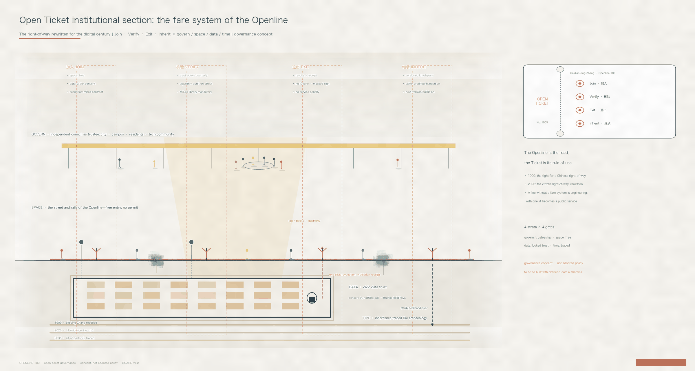

| Stratum | One line | Where it lands |
| --- | --- | --- |
| **Govern** | Independent council as trustee: city · campus · residents · tech community | Public assembly hall; books open quarterly |
| **Space** | Street and rails are free to enter—no permit to walk the road | L1 / L2 ground; Kilometer Zero / The Join are join rituals, not toll gates |
| **Data** | Civic data trust locked: sensors in, nothing out; trustee-held keys | Station sensor posts; algorithm-audit face on the street |
| **Time** | Inheritance traced like archaeology: 1909 roadbed → 2026 Fact Line → 2035 kit-of-parts | Versioned component library; Failure Case Library mandatory |

The four gates write Join · Verify · Exit · Inherit as an executable fare system, not a slogan [source:AGENT-TASKBOOK]:

| Gate | How permission is issued | How exit / inherit is kept |
| --- | --- | --- |
| **Join** | Space free; data on a three-tier consent; scenarios by micro-contract | Leave lists and bookings anytime |
| **Verify** | Trust books quarterly; algorithm audit on-street; Failure Case Library mandatory | Publish or withdraw with authorization |
| **Exit** | One-click revocation + deletion receipt; no-ID lane and masked signs | No service penalty after exit; no retained profile |
| **Inherit** | Versioned kit-of-parts; leavers credited and handed on | The next version builds on, rather than rewrites |

### Chapter 2 · Capital loop

Bankability is not a finer timeline. Each phase must answer **what is built / who pays / who operates / how revenue returns to the public realm**. Three financing scenes—special-purpose bond / district pooling / corporate adoption—relay; they are not a multiple-choice; all are comparable concept scenarios with preconditions and Plan Bs, not settled financing arrangements. Phase-three adoption is bound by the Open Ticket permission chain; the public interface stays public.

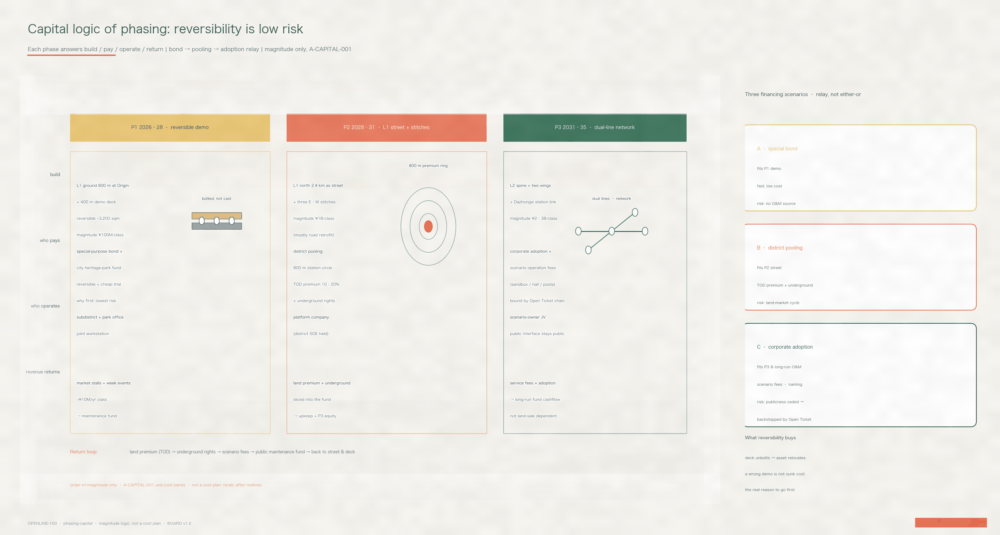

**Reversibility is low risk.** The Wudaokou deck is bolted, not poured: the asset can move, a wrong demo is not a sunk cost—that is why Phase 1 can go first. Magnitudes sit on `A-CAPITAL-001`, not a cost plan. The full phase table and OL funding logic follow in “Capital logic of phasing” and the implementation one-pager.

### Chapter 3 · Rails of humanity

The herringbone grade's “ren” character, in 1909, drew the line's shape; in this century the same character names whom the line belongs to. The three turns do not revive the retired “Renzi Rails” brand; they continue Jing-Zhang's art of turning [depth:blue_green_public_space]:

| Turn | Where it turns | What it refuses | Contemporary equivalent |
| --- | --- | --- | --- |
| **1909 · terrain** | The train turns on the ridge | No blasting | 33‰ grade, switchback |
| **2026 · the built** | The city turns over Line 13 | Nothing demolished | Bolted to old piers, reversible deck |
| **This century · values** | AI turns on human rails | Compute is not the rail | The compute grade is unstoppable; turn back at the human switch |

Railway anatomy today: the switch = Open Ticket Verify / Exit gates; the safety siding = Failure Case Library; the test track = governance sandbox; **the rail = human values, not compute**.

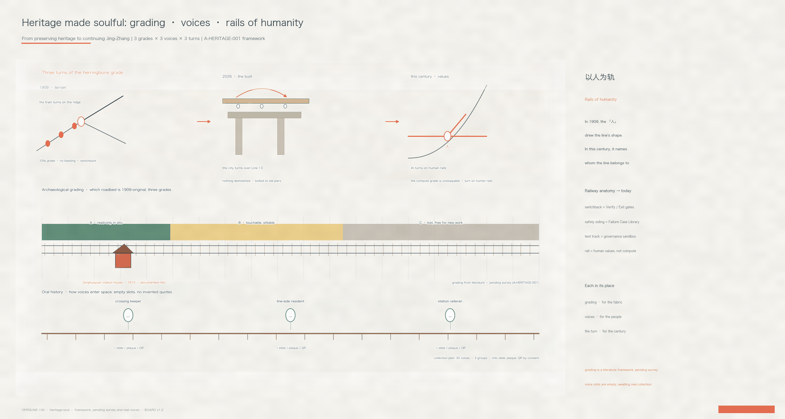

From preserving heritage to continuing Jing-Zhang, three bands each in their place:

| Band | For whom | Move | Honesty |
| --- | --- | --- | --- |
| **Archaeological grading** | The fabric | A read-only in situ · B touchable and sittable · C lost, free for new work; Qinghuayuan station house 1910 as the documented relic | Literature framework, pending survey (A-HERITAGE-001) |
| **Oral soundscape** | The people | Crossing keeper / line-side resident / station veteran; empty slots “___” await real voices, into stele / plaque / QR by consent | Collection plan of 30; no invented quotes |
| **Three turns** | The century | Terrain → the built → values | The herringbone grade is not a third logo |

The five material translations (paving / trench / furniture / stone / sound) make the rails visible; this chapter makes them soulful. Visibility figures sit in the overall-design chapter.

### One master concept, five supporting layers

The three chapters are the narrative spine. Everything else supports this road—no second concept:

| Layer | System | Relation to the three chapters |
| --- | --- | --- |
| Spatial | Dual-line spine (L1 Fact Line / L2 Openline Spine) + axis + three stitches + two centers and one core | The road's material layer: cut the spatial cost of finding collaborators and completing review |
| Landmark | Kilometer Zero · The Join · The Strata Wall | Three pilgrimage landmarks: join nail / transfer field / inherit wall—not toll booths, not renamed furniture |
| Fare | Open Ticket (four strata × four gates) + three innovation mechanisms | One fare system for the line; full-stack / open question / urban adoption is how the gates run in each area |
| Scenario | Ten full-depth cards (one eight-item card per S-01–S-10) | The ticket's daily layer; Cards 01–03 are the three district production functions |
| Futures | Eight Form Questions · Foresight Matrix · Invariant List (Appendix A) | The road's longevity layer; capital loop and rails of humanity are Chapters 2 and 3 |

## Design basis and source inventory

This proposal responds to the Haidian Branch of Beijing Municipal Commission of Planning and Natural Resources announcement for the Centennial Jing-Zhang AI Innovation Belt, and uses `brief/site-package/`, `data/source_registry.json`, and `data/processed/agent_fact_pack.md` as machine-readable inputs. Every design claim splits into traceable sources, recomputable metrics, checkable layers, and human-reviewable assumptions; prose keeps only claim-adjacent evidence [source:OFFICIAL-ANNOUNCEMENT] [source:AGENT-TASKBOOK] [depth:existing_conditions_diagnosis].

Source use follows the central registry [source:SOURCE-REGISTRY]: formal-ready materials support tasks and standards; background_only stays background; provisional boundaries remain provisional intake only. Agents must not upgrade provisional geometry into official redlines, statutory controls, or government implementation promises.

**Registry discipline (stated item by item as required by review):** the four external records `HD-JINGZHANG-BLOCK-PLAN-20260811`, `HD-JINGZHANG-CONTROL-PLAN-ADOPTION-20250208`, `HD-JINGZHANG-BLOCK-PLAN-DRAFT-20241227`, `ZGC-SCIENCE-CITY-NORTH-202312`, together with People.cn / Beijing Daily field facts and the OSM 2026-08 basemap, are **not listed in the registry's approved_formal_sources**. This package downgrades all of them to **background / pending-review evidence** (each is marked `package_usability: background_pending_registry_review` in sources.json): none of them alone supports "formal overlay", "statutory center", or any adopted metric. Every structural alignment drawn from the 2026-08-11 approval coverage (one belt / one axis / two centers / multiple nodes, extents, 1,668.2 ha) is worded as "news-reported approval, pending registry verification"; parcel sheets and intensities remain `unknown`. The OSM basemap's extraction range, snapshot date, processing pipeline, and ODbL attribution are documented in the `OSM-BASEMAP-202608` source card in sources.json. Per-item source cards are complete in sources.json; this discipline holds until the registry approves them [source:SOURCE-REGISTRY].

**Non-formal source → dependent claims → status table** (this package never self-upgrades a source to formal evidence via submissions/sources.json):

| Source | Use inside the package | How dependent claims are worded | Status |
|---|---|---|---|
| HD-JINGZHANG-BLOCK-PLAN-20260811 (approval news) | Structural alignment: one belt / one axis / two centers / multiple nodes, extents, 1,668.2 ha | Always "news-reported approval, pending registry verification"; never claimed as formal overlay or statutory center | background_pending_registry_review |
| HD-JINGZHANG-CONTROL-PLAN-ADOPTION-20250208 (consultation-adoption notice) | Plan title, junction and road name checks | Name evidence only; supplies no intensity, boundary, or parcel sheet | background_pending_registry_review |
| HD-JINGZHANG-BLOCK-PLAN-DRAFT-20241227 (draft coverage) | Draft-stage facility counts (298/37/62/36) and landscape belts | Marked as draft-stage public figures; the approval news did not repeat them, so they are not upgraded to adopted metrics | background_pending_registry_review |
| ZGC-SCIENCE-CITY-NORTH-202312 | Background for regional coordination (North interface) | Background only; every regional direction is worded as interface design, not a cooperation commitment | background_pending_registry_review |
| People.cn / Beijing Daily field facts | Atmosphere and event background | Narrative background only; never enters metrics or serves as tenure / implementation evidence | background_pending_registry_review |
| OSM-BASEMAP-202608 (2026-08 snapshot) | All real-fabric base maps | Extraction range / snapshot / pipeline / ODbL attribution in the source card; basemap geometry never substitutes official survey | background_pending_registry_review (ODbL compliance declared) |

The overall design footprint and three key areas currently come from repository provisional polygons marked `provisional_constraint` and `official_boundary=false` [source:BOUNDARY-SOURCE] [source:KEY-AREA-SOURCE]. They support generation, visualization, and intake self-check—not approval or precise-area conclusions. Organizer data gaps do not block content scoring. When official polygons arrive, regenerate the full package.

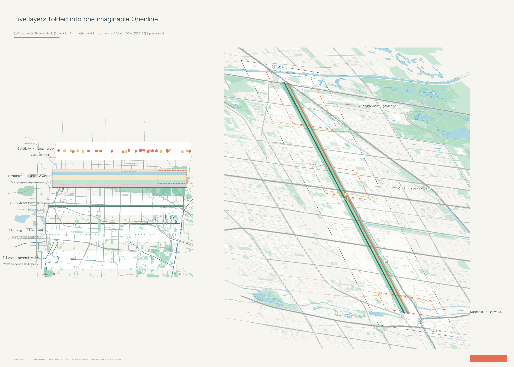

Boundary discussion uses the submitted package: site footprint [data:geometry/site_boundary.geojson#SITE-001], recomputed area ≈ 11.41 km² [metric:site_area_sqm]; three key areas including [data:geometry/key_areas.geojson#PROV-KEY-001], count = 3 [metric:key_area_count]. Navigation via [source:PROCESSED-FACT-PACK]; authority remains original source IDs.

### Diagnosis: the missing layer is not AI—it is a road without a ticket

Within announcement text extents and provisional footprints, four operable urban problems frame the brief (discussion-grade, not a surveyed survey) [depth:existing_conditions_diagnosis]:

1. **A road without a ticket.** The Jing-Zhang Railway Heritage Park already supplies the north–south cultural and green corridor, but the road has no fare system—who may enter the innovation process, how to verify, how to exit, how to inherit, lacks executable gates. The park risks becoming scenery rather than a daily road for work–learn–release–verify.  
2. **Clear task split, high risk of one park template.** Zhongzhiyuan (full-stack/standards), Origin (near-campus/open source), and Dazhongsi (station-area/adoption) are distinct in the announcement; painting them with one campus typology would erase the value gap [data:geometry/key_areas.geojson#PROV-KEY-001].  
3. **East–west cuts, north–south stretch.** Universities, communities, firms, and stations sit in side catchments; a north–south boulevard alone leaves Wudaokou, West Tsinghua East Road, and Dazhongsi’s four quadrants “visible but unreachable.” Breaks stay research question marks—no fake bridges [data:geometry/roads.geojson#ROAD-STITCH-M].  
4. **Data and tenure gaps are design conditions.** The 2026-08-11 block plan is approved: “one belt, one axis, two centers, multiple nodes,” extents and area magnitude are now public. Parcel polygons, FAR, height, density, and setbacks still await adopted sheets. Empty `constraints.geojson` records the gap—structure known, intensity unknown—without upgrading a news area figure into a plan drawing [depth:risk_missing_data] [source:HD-JINGZHANG-BLOCK-PLAN-20260811].

### Field research: spatial evidence of daily life from Wudaokou to Dazhongsi (graded evidence)

This page nails the diagnosis to verifiable local evidence. Three grades: **A = official or authoritative media reports (source and date cited); B = published academic/design literature; C = to be verified on site (shooting list attached)**. No site photos appear here—real images can only come from the field; until grade-C work is done, related design judgments stay concept-grade.

**① Real corridor status (grade A, verified 2026-08):** the undergrounded Jing-Zhang HSR released ~9 km of ground-level linear space inside the 5th Ring; Phase I (Zhichun Rd–Tsinghua East Rd, 2.4 km, 16.8 ha) opened 2023-06, and the Jing-Zhang Qinghuayuan Railway Museum opened 2024-02 (sources: People.cn 2023-01-31 / 2023-06-29); Phase II opened in full 2026-08—south section (Xizhimen–Zhichun Rd) with 2.4 km of century-old restored rails at Sidao-kou and a 3rd-Ring gateway balcony, north section (Tsinghua East Rd–North 5th Ring Jianting Bridge, 2.6 km, 30.01 ha) with the "Jing-Zhang Ring" 1909 plaza (source: Beijing Daily app 2026-08-07). **Critical update: on 2026-08-11 the *Regulatory Plan (Block Level) for Blocks HD00–1601 and Others along the Jing-Zhang Railway Heritage Park (AI Innovation District Key Area), Haidian, Beijing (2024–2035)* was approved**—9 blocks, ≈1,668.2 ha, extents east to Xinjiekouwai Dajie, west to Zhongguancun Street, north to Chengfu Road, south to Xizhimenwai Dajie, “one belt, one axis, two centers, multiple nodes” (sources: Beijing Daily / Capital Window 2026-08-12; Beijing Municipal Commission of Planning and Natural Resources) [source:HD-JINGZHANG-BLOCK-PLAN-20260811]. **This round completes the public-text overlay** (see “Block-plan overlay” below): structure and the two centers are written into the scheme; parcel sheets, FAR, and height remain unpublished, so intensity ranges stay concept-grade with caps subordinate to future sheets. A news-article area figure is not approvable geometry.

**Official intent of the AI Origin Community (grade A, published 2026-01):** on 2026-01-05 Beijing released its first batch of four AI innovation blocks; Haidian's "AI Origin Community" carries the positioning **"innovation source, first choice for founders,"** building "the first station for global AI talent"—a global first-launch site for original AI technology, a habitat where young AI talent co-creates, and an eco-service station for all-factor matching; ~3 km² centered on Wudaokou with deep "block–campus–park" fusion and the vision "find a partner in 10 minutes, enjoy life in 15" (sources: Beijing News / Beijing Daily app 2026-01-05); Dongsheng Town phrases it as "using the nearest kilometer of spatial ecology to solve the last kilometer of innovation landing" (source: Chinanews 2026-01-07). Scenario Card 01's theme choice rests on this A-grade evidence: officialdom wants origination, first launch, habitat, and eight-find co-location; this card answers the spatial problem policy cannot buy—how laboratory work crosses the wall.

**The livelihood and governance context of the "AI+" Action (grade A, published 2025-08):** State Council Document [2025]No. 11, *Opinions on Deepening the "AI+" Action* (issued 2025-08-26), deploys six actions: "livelihood wellbeing" calls for "fully leveraging AI for **densifying human relationships, spiritual companionship, eldercare-childcare-disability support**" and "building a **warmer intelligent society**"; "governance capacity" calls for "a new government-service model of **precise need recognition, proactive service planning, end-to-end intelligent processing**," "a new paradigm of **human–machine symbiosis** in social governance," and "in-depth **AI social experiments**" (sources: People.cn / CCTV 2025-08-26; gov.cn). The Beijing context: the Answer-Upon-Appeal reform (since 2019 via the 12345 hotline; legislated as a local regulation 2021-09; ~150 million appeals over six years with ~97% resolution and satisfaction rates; the Municipal Party Committee's 2025-06-23 opinion on deepening the reform stresses "technology empowerment, digital-intelligent development"; sources: beijing.gov.cn 2025-06-23; Xinhua 2025-12-01) and Haidian's "city agent" concept (the world's first AI-district concept released at the 2024 Zhongguancun Forum, Wudaokou–Dazhongsi pilot zone, ~53 km²; source: Haidian release / Beijing News). The three cards align to the three key areas: Card 01 answers Origin—"how origination crosses the wall"; Card 02 answers Dazhongsi—"how verified capability goes on the street"; Card 03 answers Zhongzhiyuan—"how the full stack upgrades without demolishing the city." The new government-service model and Answer-Upon-Appeal in Document [2025]No. 11 drop to east-wing scene index S-09 and do not occupy a key-area depth card. Card 03's governance door still carries the "new paradigm of human–machine symbiosis."

**② Real breakpoints (grades A/B):**

| Breakpoint | Evidence | Grade | Design response |
| --- | --- | --- | --- |
| Dazhongsi transfer gap | Line 12 opened 2024-12-15; in-station transfer to elevated Line 13 remains deferred until ~2027-12 (with the Line 13 8-car upgrade / later Line 18 handover); outdoor transfer measured ~8 minutes: Line 12 Exit D → 1733 sunken plaza eastward → **stairs** to grade → Line 13 Exits A/B; Yikatong/QR keeps the fare continuous within 30 minutes (sources: Beijing Daily 2024-12-15/16; municipal reply) | A | OL-04: station integration + four-quadrant walking (existing path, no new tunnel); do not substitute for the 2027 in-station passage |
| Wudaokou crossing gap | "Wudaokou" literally names the fifth level crossing of the Jing-Zhang railway—historically a notorious congestion point; the crossing signal survives in the park, never to light again (sources: Tsinghua SJMC 2025-03; CSSN 2023-07) | A | OL-07 stitch deck |
| Tsinghua East Road seam | Phase I ends at Tsinghua East Rd; Phase II north section begins there—the two opened phases seam at this road; ~1 km with no rail transfer between Line 15 West Tsinghua East Rd station and Line 13 Wudaokou station (grade C, to be measured) | A/C | Middle stitch + access list |
| North end & under-bridge | The north section ends at the Jianting Bridge under-space, connecting the Qinghe waterfront greenway and Dongsheng Bajia country park (source: Beijing Daily app 2026-08-07) | A | North stitch + under-bridge list |

**③ Spatial evidence of daily life (grades A/B):** "A high wall used to seal our neighborhood off from the railway—buying groceries across the tracks meant a half-hour detour"—Dazhongsi community resident at the Phase II opening (source: Beijing Daily app 2026-08-07); "After dinner we can just come for a stroll"—a grandfather with his child at Phase I C zone (source: Beijing Daily 2023-05); the crossing announcement "a train is coming" is collective Wudaokou memory, and waiting for trains was part of campus life for BFU students (sources: Beijing News 2022-04; ScienceNet 2019-10); the Phase I design team's PLPS survey diagnosed the core conflict—inactive "city backside" versus broad public-space demand: rail severance, walled compounds, missing services, erased memory, absent event space (source: Landscape Architecture journal, 2025(9), grade B)—corroborating this proposal's four-diagnosis; 18–20 universities and institutes around Phase I, >800 tech firms per km², 9 subdistricts and 70+ communities along the line (sources: People.cn / Beijing Daily 2023, grade A).

**④ Field shooting & verification list (grade C, to be executed):**

| ID | Position / subject | Must-shoot / must-measure | Design response |
| --- | --- | --- | --- |
| P-01 | Dazhongsi Line 12 Exit D → 1733 sunken-plaza east stair → Line 13 Exits A/B | Full timed-walk video + level change / accessibility break + whether retail hours cut the path | OL-04 station integration + four quadrants + access |
| P-02 | Wudaokou Line 13 station–Chengfu Rd crossing | Evening-peak pedestrian conflicts, bike accumulation, signal relic | OL-07 stitch deck |
| P-03 | Phase I north gate + Phase II south gate, Tsinghua East Rd | Seam between phases + measured walk to Line 15 station | Middle stitch |
| P-04 | Phase I retained-rail stretch (Zhichun–4th Ring) | Rail-as-paving status, people–rail relation, night use | L1 Fact Line / five translations |
| P-05 | Two Qinghuayuan station houses + original Sancaitang Rd site | Heritage condition and display approach | L1 Fact Line / Qinghuayuan heritage display |
| P-06 | Sidao-kou restored rails + 3rd-Ring balcony | Phase II build standard and footfall | South Openline extension |
| P-07 | Dongwangzhuang / Zhanchunyuan / Dazhongsi community edges | Compound walls, ground-floor uses, grocery routes | LU-005 / open-source courtyard |
| P-08 | 1733 retail + ByteDance HQ interface | Station-area consumption and commuter flows | LU-004 / Adoption |

**Honesty note:** all grade A/B evidence comes from public reports and literature, with sources and dates cited inline and to be registered in the source registry next round; this page fabricates no site imagery—the grade-C list is a work order, not completed work.

## Three-level scope framework

The announcement defines three scopes: coordinated research (~43.6 km²) for AI ecosystems and future urban form; overall design (~11.4 km² around the heritage park) at regulatory-plan urban design depth; key areas (~368.4 ha total) at comprehensive implementation-plan depth. This proposal translates all three into one method—the **Openline**: not a new redline, but a stack of heritage corridor, slow-mobility stitches, industry anchors, and Open Ticket as the fare [standard:PROJECT-OFFICIAL-ANNOUNCEMENT] [depth:three_level_scope_framework].

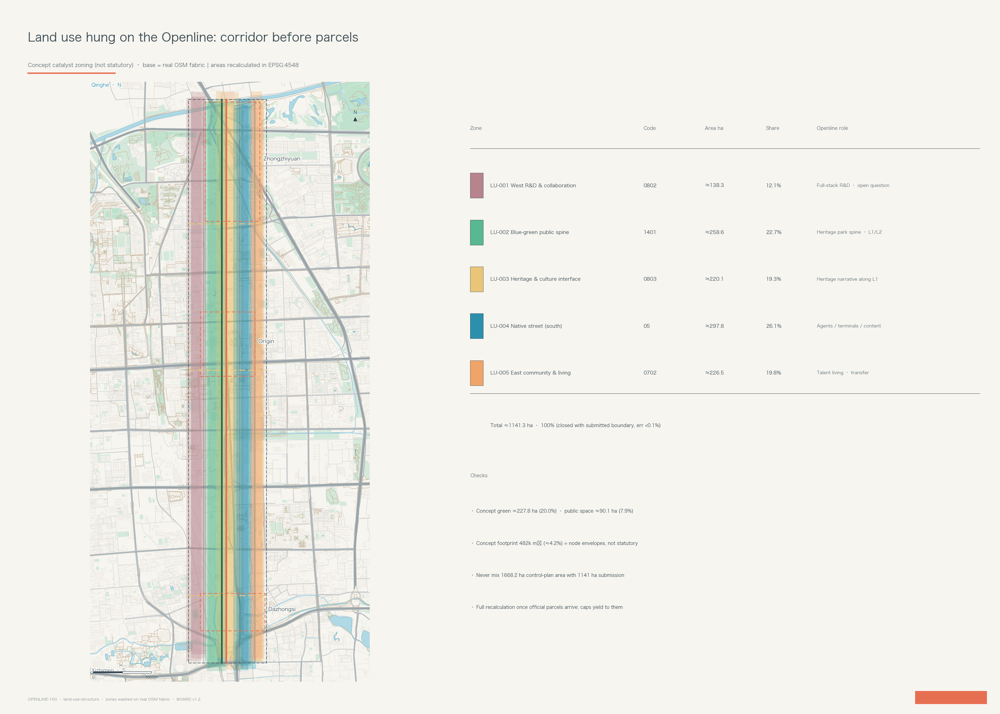

The concept title is **Why Jing-Zhang: The Openline 100**. “Why” asks how China once won its own right-of-way, and how this century that right-of-way can be rewritten as an inheritable civic fare system. The Openline is the road; Open Ticket is the fare; Join · Verify · Exit · Inherit are the four gates. After overlaying the approved block plan, spatial structure is: **one belt (dual-line Openline spine) + one axis (Zhongguancun Street) + two centers (Wudaokou Question · source of innovation / Dazhongsi Adoption · The Native Street) + one core (Zhongzhiyuan · Garden Innovation Street) + east–west stitches**. Provisional footprints stay soft constraints; drawings emphasize corridors, nodes, and activity [data:geometry/site_boundary.geojson#SITE-001] [depth:overall_spatial_structure] [source:HD-JINGZHANG-BLOCK-PLAN-20260811].

| Level | Design question | Openline answer | Evidence |
| --- | --- | --- | --- |
| Coordinated research | How does a world-class AI ecology become urban? | Protocol + transferable mechanisms + three-areas / two-wings loop | compliance / standard matrices |
| Overall design | How do renewal, mobility, blue–green, and character lock? | Land-use on the spine; dual-line / stitches aligned to the approved “belt + axis”; blue–green layer tied to the 15-minute living circle | [data:geometry/land_use.geojson#LU-001], [data:geometry/roads.geojson#ROAD-SPINE-001] |
| Key areas | Why not one park template? | Zhongzhiyuan = Garden Innovation Street (full-stack + governance); Origin = the source of innovation; Dazhongsi = The Native Street; two wings = Zhongguancun tech-service / Xiaoyuehe scene-empowerment | [data:geometry/key_areas.geojson#PROV-KEY-001] |

Road and ticket (Openline / Open Ticket) and the four gates are in the Master Concept chapter above; later chapters do not repeat them.

### Block-plan overlay: known structure · design translation · still unknown

What was approved on 2026-08-11 is the **public text of a block-level regulatory plan**, not parcel sheets. This proposal overlays extents, area magnitude, spatial structure, and industry direction. It does **not** overlay unpublished FAR, height, density, setbacks, or the nine-block polygons [source:HD-JINGZHANG-BLOCK-PLAN-20260811] [standard:MOHURD-CONTROL-DETAILED-PLANNING] [depth:land_use_layout].

**Full title:** *Regulatory Plan (Block Level) for Blocks HD00–1601 and Others along the Jing-Zhang Railway Heritage Park (AI Innovation District Key Area), Haidian, Beijing (2024–2035)*. Approval channel: Beijing Municipal Commission of Planning and Natural Resources. The plan sits in southern Haidian, covering Zhongguancun, Beixiaguan, and Beitaipingzhuang subdistricts (disclosed at draft-exhibition stage), east to Xinjiekouwai Dajie, west to Zhongguancun Street, north to Chengfu Road, south to Xizhimenwai Dajie—9 blocks, ≈1,668.2 ha.

**Do not mix three scopes:**

| Scope | Extents / size | Legal and competition status | Meaning for the Openline |
| --- | --- | --- | --- |
| Block plan HD00–1601 et al. | N Chengfu Rd · S Xizhimenwai Dajie · W Zhongguancun St · E Xinjiekouwai Dajie · ≈16.68 km² | Approved block-level plan; sheets unpublished | Structure template south of Chengfu; the two centers sit here |
| Competition overall design | N North 5th Ring · S Xizhimenwai Dajie · W Dazhongsi East Rd / Heqing Rd · E Xueyuan Rd / Xitucheng Rd · ≈11.4 km² | Competition work area; polygons still provisional | Longer north–south, narrower east–west than the block plan |
| Competition coordinated research | N North 5th Ring · S same · W Wanquanhe Rd · E G6 · ≈43.6 km² | Systems study, no fake redline | Three-areas / two-wings and regional discussion layer |

The block plan is **short north–south, wide east–west**; the competition overall is **long north–south, narrow east–west**. The overlap core is both sides of the park south of Chengfu Road. Phase II north (Tsinghua East Rd–North 5th Ring Jianting Bridge) sits outside this block plan’s published northern bound, but remains inside the competition overall 11.4 km².

**Verification: is Zhongzhiyuan “outside the planning area”? It is not outside the brief. It is outside another document’s published extents.**

| Document | Is Zhongzhiyuan in it? | Basis |
| --- | --- | --- |
| Competition overall design | **Yes** | Announced north bound = North 5th Ring, ≈11.4 km²; Zhongzhiyuan is the north stretch [source:OFFICIAL-ANNOUNCEMENT] |
| Competition key areas | **Yes, and required** | First of three areas north-to-south, ≈192.1 ha; tasks name the 5th Ring and Qinghe—not optional |
| 2026-08-11 block plan HD00–1601 et al. | **Not inside the published extents** | News: north to Chengfu Rd, southern Haidian, two centers only (Dazhongsi / Wudaokou) [source:HD-JINGZHANG-BLOCK-PLAN-20260811] |

Public geography (not a parcel redline): Chengfu Rd ≈ 39.991°N, with Wudaokou station sitting on it. Haidian District Government (2026-03) anchors the northern acceleration area at Zhongguancun Dongsheng Science Park **Xuebei Garden** (Xueqing Rd / Yuequan Rd, ≈40.019°N, 116.351°E); Xuezhiyuan station ≈ 40.014°N—about 2.5–3 km north of Chengfu. The brief assigns 5th Ring / Qinghe to Zhongzhiyuan and Wudaokou / West Tsinghua East Road to Origin, i.e. opposite sides of Chengfu. Draft-stage subdistricts are Zhongguancun, Beixiaguan, Beitaipingzhuang—not Dongsheng.

Therefore: keep doing Zhongzhiyuan detailed design. Do not paint it as this plan’s third “center,” and do not treat 1,668.2 ha as its statutory cover. If official nine-block polygons later cross Chengfu into Xuebei, this call is void and the whole package is recalculated.

**How “one belt, one axis, two centers, multiple nodes” hangs on the Openline:**

| Plan element | Public wording | Openline landing | This round |
| --- | --- | --- | --- |
| **Belt** | Jing-Zhang Railway Heritage Park industry-innovation belt; green public space leads renewal | Dual-line spine L1 Fact / L2 Spine | Align. The park spine is built; increment is at the edge, not a redesign of the corridor |
| **Axis** | Zhongguancun Street innovation-development axis | West wing · **Zhongguancun tech-service wing** | It may sit on the approved axis; its job is IP, capital, standards, and global factor allocation—not a university campus |
| **Center · Dazhongsi** | Internet and related services, AI, new media (draft-stage public wording; approval news did not revise it) | South core · **Native Street** (agents / devices / content consumption) | Align. The district product is a ground-floor adoption protocol; station integration and four quadrants are the arrival system (OL-04). Do not rebuild the opened southern park |
| **Center · Wudaokou** | AI industry agglomeration and top-talent exchange (draft-stage public wording) | Middle core Open Question / AI Origin · **the source of innovation** | Align. Delivery handle: middle stitch + conversion street. Origin is not a third park besides the two centers |
| **Node · Zhichun Rd** | Key spatial node; satellite-plant science park north of the road as a stock-renewal sample | Mid-spine L2 station + factory-reuse type | Add a node, not a fourth core |
| **Node · Sidao-kou** | Key spatial node; Phase II restored rails already open | South L1 extension | Acknowledge the built park; increment is edge stitch |
| **Zhongzhiyuan · full-stack collaboration** | **Required competition key area**; not inside this block plan’s published extents (north bound Chengfu / anchor Xuebei) | North core · **Upgradeable Urban Motherboard** (Xuebei–Qinghe–5th Ring) | Keep detailed design. It organizes full-stack independent innovation and global governance; it is not a third center |

**Industry and renewal (verifiable from approval news; not a deal list):** the stock path is old-factory conversion and underperforming-tower update; the industry direction is foundation models, agents, and embodied AI; the organization is lead-firm traction with upstream–downstream clustering. This proposal puts functional difference before tenant lists: Dazhongsi handles Adoption; Wudaokou handles Question; Zhongzhiyuan handles **full-stack collaboration**, from underlying hardware and software through data and models to agents and applications, with standards and safety governance embedded throughout R&D. The satellite-plant science park north of Zhichun Road is a public sample of the *type* of stock renewal, not a project claimed as included here.

**Blue–green and the 15-minute living circle:** the plan calls for north–south and east–west walks and cycleways, sport / recreation / convenience inside the park, and a 15-minute community service circle fusing living and innovation. Phase II’s three fishbone slow paths already reclaim under-viaduct land and connect the Qinghe waterfront to Dongsheng Bajia country park—proof that the north stitch has built increment; the Openline should pick those paths up, not redraw them. Draft-stage 2035 facility counts (298 public-service, 37 transport, 62 municipal, 36 safety) and landscape belts (Nanchang River / Xiaoyuehe) plus activity centers (Haidian Huangzhuang / National Library) **remain 2024-12 draft public figures; the approval news did not repeat them, so this proposal does not upgrade them to adopted metrics** [source:HD-JINGZHANG-BLOCK-PLAN-DRAFT-20241227].

**Still unknown, and the trigger for full-package recalculation:** official polygons for the nine blocks, parcel sheets, FAR / height / density / setbacks, road redlines, tenure, heritage and blue lines. When they arrive: geometry → metrics → figures → HTML as a whole package, never a number swap. The February 2025 consultation-adoption notice confirms the plan title, selected junction labels, and names such as Xiaozu North 1st / 2nd Roads—it does not supply intensity or boundaries usable by this scheme [source:HD-JINGZHANG-CONTROL-PLAN-ADOPTION-20250208].

## Coordinated research: industry and future-city study

### Naming, Logo, and Visual Identity System

**Title:** Why Jing-Zhang: The Openline 100. **Road and ticket:** the Openline is the road; Open Ticket is the fare—the fare name is not a third logo. The three positionings translate culture belt / urban AI life belt / AI fusion innovation belt into: cultural Openline (heritage walkable), life Openline (talent can stop), innovation Openline (outputs verifiable) [source:AGENT-TASKBOOK] [standard:PROJECT-AGENT-OPEN-CALL-TASKBOOK].

**Logo construction (verifiable rules, not a direction sentence):** the mark is a walkable thin spine crossing a serif "100". The spine is the road; 100 is inheritable kilometres and cohorts, not decoration. The Chinese question "Why Jing-Zhang" may sit above the spine; The Openline 100 sits below. Open Ticket must not enter the master mark.

| Rule | Spec | Forbidden |
| --- | --- | --- |
| Construction | Continuous spine (one break allowed for a stitch) + "100"; single colour first | Copper disc, triangle, a third geometric seal, switchback-rail glyph |
| Minimum size | Print short side ≥ 12 mm; screen long side ≥ 96 px; spine ≥ 0.35 mm / 2 px | Faking legibility by fattening a sub-minimum mark |
| Clear space | Margin on all sides equal to the height of "100"; no fight with landmark icons, QR codes, or photos | Drawing Zero / Join / Strata Wall into the logo |
| Reverse | Deep ground uses paper-soft `#F7F5F0` or paper white; light ground uses ink; contrast ≥ 4.5:1 | Fluorescent, gradient stroke, metallic brush |
| Application | Board headers, A0 footers, HTML titles, wayfinding posts; mono and reverse share one construction | A second logo per district; drawing Open Ticket as a second master mark |

The master mark identifies the belt. Landmarks are distinguished by spatial type, not by pairing geometries.

**Five functions land on the taskbook's own words—no second set:**

| Taskbook function | Primary space | Openline act |
| --- | --- | --- |
| Full-stack independent AI innovation system | Zhongzhiyuan Upgradeable Urban Motherboard | Shared base + five upgradeable unit types + Full-Stack Collaboration Street |
| World-class AI innovation ecology | Origin, the source of innovation | Open release, near-campus conversion, talent can stay |
| New paradigm of AI-enabled scenarios | **East wing · Xiaoyuehe scene-empowerment wing** | Real scene questions, public experience path, switch-offable |
| Intelligent AI living city | Xiaoyuehe wing + Openline living band | Stations, 15-minute living circle, stitch-band services |
| Global voice in AI governance | Zhongzhiyuan Global AI Standards and Governance Center | Standards, safety, Human Review, public explanation |

**Three-areas / two-wings loop (flows that can be drawn):**

- **East wing · Xiaoyuehe scene-empowerment wing** → out: perceptible real questions in health / education / law / living / mobility; in: street-front adoption feedback and governance-review results. The river corridor is the scene wing—not a third axis, and not Dazhongsi station rewritten as the east wing.  
- **Middle · Origin (world-class innovation ecology)** → out: public problems, open releases, near-campus talent and convertible prototypes; in: Xiaoyuehe questions, Zhongzhiyuan tools and standards interfaces.  
- **North · Zhongzhiyuan (full-stack + governance)** → out: engineered capability, shared technology platforms, standards and safety components; in: Origin's questions and talent, Dazhongsi adoption gaps.  
- **South · Dazhongsi (intelligent-native new formats)** → out: street formats you can buy / subscribe / try / refuse, data-element salon, international exchange; in: capabilities governance-reviewed at Zhongzhiyuan, convertible Origin outputs, Xiaoyuehe-verified scene questions.  
- **West wing · Zhongguancun tech-service wing** → runs through the whole loop: IP, capital matching, standards licensing, global factor allocation. It sits on the approved “axis” of Zhongguancun Street and stitches into Wudaokou–Tsinghua East Road; the near-campus conversion street belongs to Origin, not the whole west wing. No claimed campus tenure change; no invented funds or tenant lists.

Wings are not extra parks. The west wing's job is tech service, not a university campus; the east wing's job is scene questions, not a metro gateway. Dazhongsi station is only the south core's arrival face. Xiaoyuehe was not restated as a statutory axis in the approval news; this scheme keeps it as the taskbook scene wing and does not promote it [source:AGENT-TASKBOOK] [source:HD-JINGZHANG-BLOCK-PLAN-20260811].

**Regional structure (the 43.6 km² bench):** the land-use figure only fits the 11.4 km² strip. Zhongguancun Street (west wing) sits west of that strip and east of Wanquanhe Road; Xiaoyuehe (east wing) sits east of the strip and west of the G6—so the wings are visible only on the 43.6 km² layer. Zhongguancun Science City North is official planning geography north of the 5th Ring (Shangdi / Software Park as the near face; Yongfeng · Cuihu · Beiqing Road as farther depth). This scheme draws a relay interface only: no imported polygon, no second park. North of Jianting Bridge the Jing-Zhang corridor continues as a dashed Qinghe waterfront greenway; **Qinghe is a river, not Qinghe Station as a hub**. The “high-end innovation corridor” along Zhongguancun Street northward is the North District plan’s wording—this proposal does not claim to have designed that district [source:ZGC-SCIENCE-CITY-NORTH-202312] [data:geometry/site_boundary.geojson#SITE-001] [depth:overall_spatial_structure]. Three-level scope alignment is in the section above [depth:three_level_scope_framework].

### Regional coordination: relay interfaces in five directions (discussion-grade · no cooperation commitment)

The taskbook asks not only for the in-site three areas and two wings but also how the corridor relates to Beijing's innovation geography. The table states, for each direction, four flows (knowledge / talent / scenario / standards) plus the transport and service interface. **All are interface proposals—not cooperation, investment-attraction, or co-building commitments; no named signatories, no official procedure pre-empted.**

| Direction | Knowledge flow | Talent flow | Scenario flow | Standards flow | Transport / service interface |
| --- | --- | --- | --- | --- | --- |
| **Beiwei communities (Changping Line housing hinterland)** | High-frequency Answer-Upon-Appeal issues settle into community question sets and return to the library | Commuters are the Openline's daily users and the Origin's potential founders | Everyday-life questions (eldercare / school runs / groceries) enter the Xiaoyuehe wing's question board | Community-service standards grow from real use, never written behind closed doors | Changping Line Xuezhiyuan / Qinghe arrivals + the 800–1000 m station service circle |
| **Future Science City (Energy Valley east)** | Energy / dual-carbon research topics cross-post with the Origin's open questions | Two-way commutes and short residencies for researchers | Low-carbon technologies verify in the real environment of the Qinghe corridor (D-08) | Dual-carbon monitoring aligns to the A-ECO-001 data-trust conventions | Line 17 + surface bus links; a cycle connection is a long-range suggestion |
| **Huairou Science City (big-science facilities)** | Facility outputs cross the wall through the Origin's authorization window | Scientists visit briefly: First Launch releases + conversion-street licensing | Facility-derived technologies enter sandbox evaluation (D-04) before the street | Big-science data-opening conventions cross-referenced with governance-center standard topics | Suburban rail Huairou–Miyun + Jing-Zhang HSR Qinghe Station; no new track proposed |
| **E-Town (Yizhuang · connected vehicles & manufacturing)** | Manufacturing know-how and full-stack engineering needs mutually recognized | Engineers and supply-chain teams shuttle to Zhongzhiyuan pilot units | Embodied AI verifies in Zhongzhiyuan's controlled yards; production sits in Yizhuang—division of labor without overlap | Vehicle-road-cloud and robotics standards mutual-recognition interface (discussion-grade) | Yizhuang Line + surface logistics; this scheme does not pre-empt cross-district testing permits |
| **Beijing–Tianjin–Hebei (corridor level)** | The Jing-Zhang corridor as a double-layer bond: a century of right-of-way narrative plus contemporary coordination | Cross-region participation in event weeks and the roadshow hall | Ecological question sets mutual-recognized across the Qinghe–Yongding–Jing-Jin-Ji blue-green network | Governance-center standard topics extend to regional public deliberation | Jing-Zhang HSR (existing) + suburban rail; no new alignments drawn |

The coordination discipline matches the in-site one: **exitable, verifiable, no bundling**. If any direction's counterpart does not engage, the scheme degrades to an in-site closed loop without weakening the Openline itself—the same logic as the implementation-economics Plan B [depth:overall_spatial_structure].

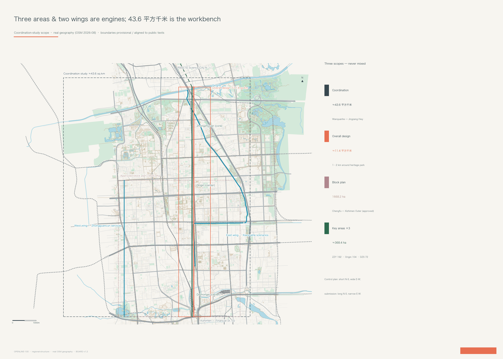

**Bond map (same corridor, different question):** the figure above answers how large the bench is. The figure below answers the taskbook sentence—use the Jing-Zhang heritage park as the bond that links universities, parks, firms and communities, and hang transport gates and capital desks on real geography. North core on top, south core at the bottom; west wing left, east wing right. Tsinghua / PKU / CAS / Xueyuan Road are near-campus hinterland, not the west wing; Xuebei / Shangdi / Software Park are a northward relay, not a second park; Xizhimen–Dazhongsi–Zhichunlu–Wudaokou–Tsinghua East Road West–Xuezhiyuan is the arrival chain; 1733 and W-03 are firm / capital interfaces, unnamed; communities sit on both banks. **Financial Street lies south of Xizhimen: adjacency only, not inside 43.6.** [depth:overall_spatial_structure] [source:ZGC-SCIENCE-CITY-NORTH-202312]

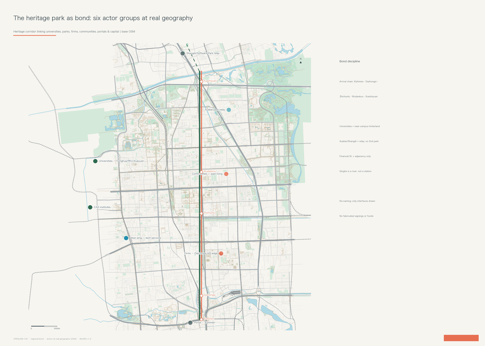

#### Two-Wing Detailed Design (discussion-level · conceptual proposal)

Until now the wings had duties but no design; this section lands them on nodes, interfaces and an architectural concept. All are conceptual proposals: no claimed tenure change, no named signed institutions, no invented policies or funds [depth:overall_spatial_structure].

**West wing · Zhongguancun Tech-Service Street: ground-floor interfaces for tech service × global factor allocation**

One line: **the west wing produces "transactable tech services" and "enterable/exitable global factors"—not another office-tower avenue.** Space sits on the approved-plan "axis" of Zhongguancun Street; the increment lies in ground floors and inefficient-building renewal, with no new towers and no change to the avenue's section class.

Global factor allocation is split into four "interface tables", each with a concrete ground-floor interface (type-level interfaces; no invented tenants):

| Factor flow | Spatial interface | Mechanism (concept) | Honesty boundary |
| --- | --- | --- | --- |
| Talent flow | International talent service ground floor (W-01) | Type-level visa / residence / practice-license consultation, international community events, multilingual wayfinding and short-stay interface | No promised immigration or talent-policy treatment |
| Capital flow | Roadshow and matching hall (W-03, existing building ground floor) | Booking-based matching; roadshow rhythm linked with Dazhongsi S-05 | No invented funds or investment amounts; no promised fiscal incentives |
| Technology & IP flow | IP and standards licensing window (W-02) | License templates, rights-clearing for results, conversion-contract type services | No invented university or enterprise co-build contracts |
| Standards & information flow | International standards discussion and public release space (W-02) | Bilingual standards-draft open days, linked with Zhongzhiyuan's governance gate: standards are drafted at Zhongzhiyuan and released on Zhongguancun Street | No claimed international standards organization in residence |

Three real nodes (along Zhongguancun Street, aligned with stitches and the approved-plan "points"; codes are concept nodes, not OL projects):

| Node | Position alignment | Area product | Interface action |
| --- | --- | --- | --- |
| **W-01 Wudaokou junction** | Zhongguancun St × Chengfu Rd, joining the middle stitch and Origin | International talent ground floor | Ground-floor open protocol + multilingual wayfinding + continuous shade; walking-connected to Origin's eight-search co-location interface |
| **W-02 Zhichun Rd junction** | Zhongguancun St × Zhichun Rd, an approved-plan "point"; the satellite-factory tech park north of Zhichun Rd is a public type sample of stock renewal | Tech-service and standards ground floor | IP / licensing / standards workshops into stock-building ground floors; studied as a type sample only, not written as included in implementation |
| **W-03 South-segment gateway** | South Zhongguancun St, toward the south stitch and Dazhongsi station area | Capital and roadshow interface | Existing ground floors converted to matching halls; westward no campus tenure claim, southward no grabbing Dazhongsi's street product |

West-wing interface hard rules (consistent with the overall "interface and ground-floor protocol"): ground-floor openness ≥60%; continuous closed walls ≤50 m; shade tree rows before decorative paving; inefficient-stock renewal before new build; all four interface tables apply the Openline four rules—joinable by booking, service records auditable, exit at any time, components versioned through Inherit.

**East wing · Xiaoyuehe Scene-Question Corridor: five real scenario domains happen along the river**

One line: **the east wing produces "real exam questions"—health / education / law / living / mobility scenarios are posed, strolled, experienced and fed back along the Xiaoyuehe corridor, switch-offable and human-reviewed.** The river corridor is not a third axis; it is the scene wing's linear vessel.

Cultural anchor (public geography; camera positions added to the P-list for field verification): the Xiaoyuehe is a remnant of the Yuan-dynasty west moat of Dadu, lined by the Yuan city-wall relics park and the "Jimen Misty Trees" stele—the east wing's heritage layer mirrors the Jingzhang spine: **the spine tells the history of self-built engineering; the corridor tells the history of urban everyday life.** Scene questions sit in living urban life, not in exhibition halls; no imitation antiquing, no stele galleries—only reversible inserts onto the existing relics-park path system.

Corridor stations (about 3–4, spaced 800–1000 m, co-located with S-09 stations; five domains carried by station and rotatable; codes are concept nodes):

| Station | Scenario domains | What question is posed (concept) | Spatial seat | Feedback path |
| --- | --- | --- | --- | --- |
| **E-01 North-segment station** | Health | Real exam questions in elder rehabilitation and chronic-care: rehab path segment, informed consent, health data stored locally | North corridor segment as a type interface near existing medical institutions (no naming, no claimed partnership) | De-identified summaries → Origin failure-case library / Zhongzhiyuan governance gate |
| **E-02 School-route station** | Education | School-route safety and AI study companionship, on paths linking campuses and neighborhoods | Junction of the corridor and east-west community paths | Questions and adoption feedback → Origin / Dazhongsi |
| **E-03 Earth-wall relics station** | Law + culture | Community legal-advice agent + staffed duty window; heritage-path public experience | Reversible insert beside the Yuan relics-park paths | Frequent issues → governance-gate simulation layer |
| **E-04 South-segment station** | Living + mobility | S-09 "Answer before asked" full function in residence (hear / foresee / settle; the red "I want to talk to a human" call button; standardized work orders straight to 12345); S-04 slow-mobility navigation corridor segment, aggregate data only, off by default | South corridor segment toward Dazhongsi | 12345 work-order system; break-point data → OL-01 list |

**Station building concept (edge-compute station · Form Topic 4 landed; E-02 as the first prototype):**

- **Massing and interface:** about 600–900 m², two floors; the ground floor fully open under the "three cans" (enterable / happenable / exitable); a service yard on the back street separates equipment logistics from public slow mobility.
- **Three parts:** ① **Response station**—"Answer before asked" staffed seats side by side with agent interfaces, humans always present; ② **Robot nest**—on the back street, charging / dispatching / numbered and complainable, physically separated from public space; ③ **Waste-heat warm-seat greenhouse**—edge-compute waste heat feeds a sit-able space: warm seats in winter, a shade canopy in summer; the temperature of computing is sit-able and touchable.
- **Energy and interfaces:** PV pergola doubling as shade; a reserved coupling to the "third rail" shallow utility spine; manhole covers engraved with interface capacity—the cover is the API documentation.
- **Construction:** demountable, material-bank registered, low-disturbance foundations; one technology generation swaps modules, not the station.
- **Taboos:** physical separation of public and private compute; vendors separately authorized; no preaching devices, no personal tracking; any scene question switch-offable with one action.

**Shared success criteria for both wings (self-check):** West wing—without entering any closed office building, can one encounter at least one of the four interface tables on the avenue (must be able to)? East wing—walking 20 minutes along the Xiaoyuehe, can one encounter at least one real scenario being posed, and refuse to join (must be able to)? Both wings—neither raises a new park wall (must be none)?

**Honesty boundary:** both wings' nodes are concept seats without parcel tenure or existing-conditions surveys; the Xiaoyuehe blue line, flood control and relics protection extents await formal data; the station prototype deepens only after the station special project (OL-05), tenure and municipal capacity are confirmed. Field-verification list additions: P-09 ground-floor interfaces and shade status at the three Zhongguancun St nodes; P-10 full-corridor path continuity, relics protection signage and measured 800–1000 m spacing along the Xiaoyuehe.

#### Infographic Visual Standard (Sasaki v1.1 · Drawing Expression)

All proposal graphics—the five required boards, the walk-in atmosphere figures, the A0/A3 panels, and the electronic board—follow the Sasaki-style urban design visual standard **v1.2** (BOARD v1.1 WINNING + place sections). Color and layout follow the points below; no extra spec file is shipped inside the package. Key points:

**Philosophy: drawing is thinking.** One figure carries one argument, and the title states the conclusion; complex arguments run as a sequence: problem → opportunity → strategy → space → scene. Every figure must pass three readings at once: government reads structure and implementability, developers read value and density, the public reads "what happens to my life." Human scale is always present; ecology is the base layer and built mass is the insert.

**Axonometry and the five-layer model.** All axonometrics use parallel projection (no vanishing points, measurable scale, same angle and orientation): 30°/60° plan-oblique for the overview, 45° isometric for nodes, section-axons cut along the main axis, exploded axons pulled apart vertically at the same angle. All analytical drawings stack bottom-up: ① base (terrain/hydrology, receding pale gray-blue or off-white) → ② ecology (green value gradients, connectivity over patches) → ③ infrastructure (neutral gray, line-weight hierarchy) → ④ program (color blocks or white massing) → ⑤ activity (people silhouettes and warm accents—the only high-saturation layer, never overridden by the four below). Exploded axons use even spacing, 0.1pt leader lines, one ≤12-character question per layer, and must fold back into a composite figure proving the layers reassemble.

**Ecological palette (sole color source).** Bases: off-white `#F7F5F0` (default) / pale gray-blue `#EEF2F3` (waterfront-led) / warm gray `#E8E6E1` (dense urban). Ecology and program: deep green `#2D6A4F` (conservation), mid green `#52B788` (city parks), light green `#95D5B2` (neighborhood green), yellow-green `#D8F3DC` (meadow/roof green), water blue `#168AAD` (hydrological spine), pale blue `#A9D6E5` (stormwater/wetland), coral `#E76F51` (vibrancy nodes), warm orange `#F4A261` (mixed use), ochre `#E9C46A` (events, layer ⑤ only), dusty pink `#B5838D` (innovation zones, sparingly). Bans: no pure red `#FF0000`, pure blue `#0000FF`, or fluorescents; ≤5 hues per figure; green-blue leads, built mass supports; high-saturation warm color ≤10% of the sheet; identical hue values across figures—no eyeballed colors.

**Technical details.** Four line weights: outer contour 0.5–0.8pt / secondary 0.3pt / detail 0.15pt / contours and leaders 0.1pt. Chinese in Source Han Sans or equivalent humanist sans, Latin in Helvetica/Avenir, in-figure type ≥6pt. People are accurately scaled simple silhouettes; planting shows season and crown variation. Single 45° soft shadow at 15–25% opacity; no multiple casts or mirror reflections. Leader lines 0.1pt, annotations ≤2 lines, question-style preferred. Export: 150dpi for review, 300dpi for boards, sRGB, layered source files archived.

**Six rendering corrections (for AI/procedural output).** ① Every exploded layer carries real spatial content (contours+water / tree-canopy clusters / real road network / extruded massing with lit and shaded faces / grouped people scenes)—no blank gray plates; ② large low-saturation fields against small high-saturation anchors: base S 5–15%, ecological green S 40–60%, orange-blue anchors S≥70% within ≤10% area; ③ grounding: plates have visible thickness, 45° directional soft shadows plus contact AO at object roots, plate sides 10–15% darker than tops; ④ structural edges are crisp vector lines `#37474F` (four weights), roads graded neutral gray, slow-mobility warm-gray dashed—hand-drawn bleeding only inside fill textures; ⑤ people are posed silhouettes (cycling, sitting, dog-walking), grouped, density ×3, with props (benches, bike racks); ⑥ no dashboard-UI layout: large left-aligned dark-gray titles, figure ≥70% of the sheet, one-line captions, sidebars carry legends only.

**Watercolor × vector dual language.** Structure is vector; temperament is watercolor: land-use boundaries, road red-lines, and outlines stay crisp dark-gray `#37474F` vector; fills for green, water, and paving use watercolor bleeding (60–80% opacity, 2–4px edge feathering, Multiply blending) with a 5–10% paper-grain overlay that never disturbs text or fine lines. Tree canopies are loose brush clusters with 2–3 values per species (no perfect-circle vector fills); water is flat `#A9D6E5` plus a 5–8% value gradient or sparse ripple lines (no CAD-style solid fill). Coexistence rule: watercolor fills keep clean 0.3pt vector outlines—bleeding happens only inside the fill. Division of labor: formal analytical figures are vector-led with watercolor as ground texture; walk-in atmosphere figures take the watercolor hand-drawn track—the axon track and the watercolor track are a mandatory dual baseline, and renderings must not regress to hard-edged diagrams.

**Pre-delivery checklist (any miss returns the sheet).** Consistent angle and orientation across all axons; five-layer order with the activity layer unpressed; real content on every layer, no blank plates; colors from the standard palette, ≤5 hues; high-saturation anchors ≤10%, base muted but not washed out; grouped, posed, accurately scaled people; title-as-conclusion, one argument per figure; exploded axons with fold-back composite, plate thickness, and three-level shadows; four line weights legible, bleeding only inside fills; no rounded-card UI, sidebars as legends only; dedicated figures for government, developer, and public readers; materials and spatial scales promised in renderings remain traceable and deliverable.

### Spatial–industry innovation ideas (discussion-grade)

Without rewriting statutory controls, three working principles [standard:MOHURD-URBAN-DESIGN-MEASURES] [depth:overall_spatial_structure] [source:HD-JINGZHANG-BLOCK-PLAN-20260811]:

1. **Corridor before parcel fill**—lock dual-line and stitch reach before catalysts; avoid mega-parcels breaking walks. The plan already writes the green belt as the renewal engine; this proposal puts increment at the edge, not a rebuild of the opened spine.  
2. **Institutional difference > tenant lists**—area missions differ first by rules (full-stack R&D and governance / open questions / urban adoption). Foundation models, agents, and embodied AI named in the plan are industry directions, not one program sheet for three parks—Dazhongsi handles urban adoption, Wudaokou poses original questions, and Zhongzhiyuan completes full-stack R&D, engineering, and governance collaboration.
3. **When structure is known and intensity is not, govern with interfaces**—block-level “belt / axis / two centers” is approved; FAR/height remain `unknown`. Frontage openness, continuous shade, slow sections, and a component library constrain experience—no invented FAR. Stock path prefers old factories and underperforming towers; the satellite-plant science park in the news is not claimed as a project in this scheme.

### Global AI ecosystem cases (mechanism transfer, not a deal list)

Eight cases—Station F (Paris), MaRS (Toronto), Kendall Square, Science Park Amsterdam, HafenCity Digital Hub, Block71 (Singapore), Cyberport (Hong Kong), and the Zhongguancun street network—transfer spatial and operating mechanisms only: station-scale shared frontage, co-located conversion corridors, continuous public edges, green-spine-linked research units, digital innovation on heritage with slow mobility, light-asset community cadence, enterprise services beside public performance, and near-campus near-rail near-life mixed blocks. No invented investment, firm lists, or government promises [source:AGENT-TASKBOOK]. The full case-by-case table (transferable mechanism → Openline landing → do-not-copy) is in **Appendix B**.

### AI innovation ecosystem map (actors · relations · Openline interfaces)

The taskbook-required **AI innovation ecosystem map** lands here: not a directory of named organizations, but **role types + relation flows + spatial interfaces**. Actors below are public role categories—**no named universities, firms, funds, or amounts**—to avoid inventing deal lists [source:AGENT-TASKBOOK].

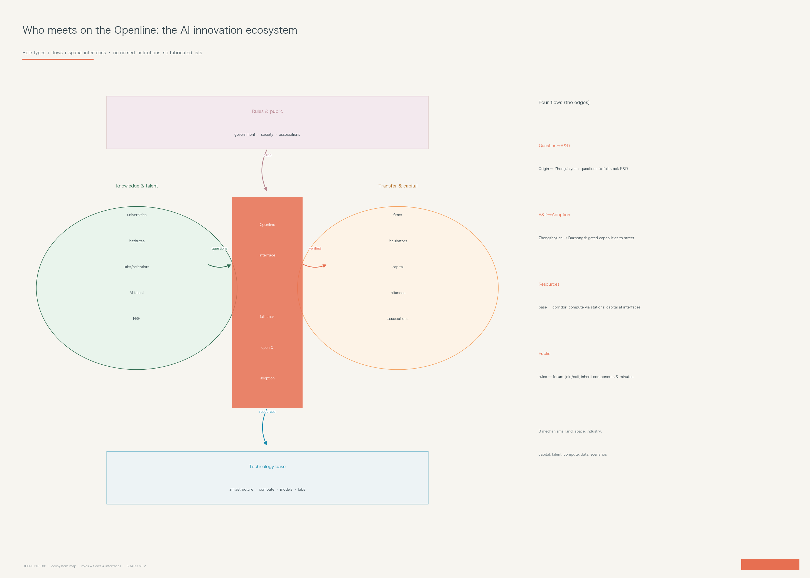

#### Map structure: five rings, one interface layer

```text
                    ┌─ Rules & commons ring ──────────────────────────┐
                    │ Government · social orgs · societies · alliances │
                    │ industry associations                            │
                    └──────────────────┬───────────────────────────────┘
                                       │ rules / standards / permits
         ┌─────────────────────────────┼─────────────────────────────┐
         │                             ▼                             │
  ┌─ Knowledge & talent ─┐   [Openline spatial interface]  ┌─ Conversion & capital ─┐
  │ Universities          │  Full stack | Questions | Adoption   │ Enterprises             │
  │ Research institutes   │◄── wings: tech-service / scene ──►│ Incubators              │
  │ Labs / scientists     │    L1/L2 · stitches · landmarks   │ Capital & finance       │
  │ AI talent             │                                   │                         │
  │ Natural science funds │                                   └───────────┬─────────────┘
  └──────────┬────────────┘                                               │
             │ problems / outputs / people                                │ conversion / demos / capital meetings (concept)
             └──────────────────────┬─────────────────────────────────────┘
                                    ▼
                    ┌─ Technology base ring ──────────────────────────┐
                    │ Infrastructure · compute · models · lab facilities│
                    └─────────────────────────────────────────────────┘
```

#### Seventeen actor types on the Openline

| Actor type | Ecosystem role | Primary interface | Openline act (concept) |
| --- | --- | --- | --- |
| Universities | Knowledge & talent supply | Origin Question + west-wing tech service | Conversion street, authorization windows; no campus tenure fiction |
| Research institutes | Basic/applied research | Zhongzhiyuan full-stack units + Origin | Joint R&D, shared eval sets, problem-wall prompts |
| Government agencies | Rules, permits, public interest | Belt-wide (rules layer) | Permit/safety entries; not claimed approved policy |
| Social organizations | Co-governance, civic oversight | The Join / governance-center gallery | Civic forum, exitable oversight |
| Capital & finance | Conversion capital meetings (concept) | West-wing tech service + Dazhongsi street | Service-wing matching, street demos; no fiscal/fund quotas |
| AI talent | Core mobile resource | Three cores + living band | Join rule; stay/collaborate suggestions |
| Enterprises | Scene demand & productization | Dazhongsi adoption-led, Zhongzhiyuan engineering feedback | R&D → governance review → adoption; marks need clearance |
| Infrastructure | Rail, utilities, slow mobility, energy | L1/L2, stitches, station area | Physical Openline layer; alignments pending data |
| Compute | Train/infer/edge resources | Openline stations (edge prototypes) | Separate authorization; no vendor lock-in |
| Models | Verifiable capability units | Zhongzhiyuan Model and Data Unit | Verify: public summary or authorized withdrawal |
| Laboratories | R&D, engineering, and safety boundary | Zhongzhiyuan upgradeable R&D units + controlled testing space | Shared technology platform; expert review; public interface separated from controlled zones |
| Tech incubators | Light-asset acceleration | Origin / Adoption service stack | Release hall → demo continuity |
| Scientific societies | Peer review & standards talk | Zhongzhiyuan Global AI Standards and Governance Center | Standards workshops, open review days |
| Industry alliances | Cross-firm interoperability | Zhongzhiyuan ↔ Dazhongsi | Protocol version wall; no fixed member list |
| Industry associations | Norms & training | Adoption + living demo street | Training/tour interfaces |
| Scientists | Problem definition & credibility | Kilometer Zero / Zhongzhiyuan governance center | Ask & review; portraits/outputs need rights |
| Natural science funds | Basic-research funding channel (type) | Knowledge → Origin/Zhongzhiyuan | Funding-*type* interface only; no invented grants |

#### Four relation flows (the map’s edges)

1. **Question-to-R&D flow (Origin → Zhongzhiyuan):** universities / institutes / scientists / AI talent pose problems at Origin → Zhongzhiyuan full-stack units complete joint R&D, engineering, and governance review.  
2. **R&D-to-adoption flow (Zhongzhiyuan → Dazhongsi):** engineered capabilities with clear responsibility interfaces enter Dazhongsi through firms, incubators, and associations; real adoption demand and failures return to Zhongzhiyuan.  
3. **Resource flow (base ↔ belt):** infrastructure and compute enter scenes via stations/station-area; capital appears only as a meeting interface—not fixed finance.  
4. **Commons flow (rules ↔ public assembly):** government, social orgs, alliances operate permits/oversight; people enter/exit via Join/Exit and inherit components via Inherit.

#### Eight mechanism factors (isomorphic with the map)

Land · space · industry · capital · talent · compute · data · scenes map to: catalyst partitions, dual-line Openline, three regimes, capital meeting interface (concept), personas, authorized edge compute, salon authorization lists, ten full-depth scenario cards [depth:metrics_recalculation].

Future-city judgment: AI changes who may enter the innovation process, not only whether buildings hold compute. The Openline keeps work, learning, release, verification, and living within walkable distance; the seventeen actor types meet through Openline interfaces rather than one closed park [standard:MOHURD-URBAN-DESIGN-MEASURES] [data:geometry/public_space.geojson#PUBLIC-JOIN].

### Urban form for the AI era: Eight Form Questions · Foresight Matrix (concept study; full text in Appendix A)

**Theoretical ground in one sentence:** every general-purpose technology rewrites urban form through the same logic—cost collapse → location reshuffle → the old paradigm becomes the new urban disease. **AI collapses the cost of cognition and coordination**: once routine cognition becomes cheap, four things that can only happen face-to-face gain premium—tacit knowledge, trust and verification, serendipitous encounter, and accountable responsibility. An AI innovation belt is therefore not a bigger office but a piece of **trust infrastructure**. The form task in one sentence: **minimize the spatial cost of verifying anything**.

Eight buildable form moves—programmable street (4D zoning), four-tier robot right-of-way, the Third Rail energy–data utility spine, edge-compute station, open-source courtyard, verifiable ground floor + machine-readable form code, offline refuge, test ground as park—plus the five-domain foresight matrix (technology · economy · society · ecology · governance × signal → trigger → response; no prediction, only pre-buried interfaces), branch robustness, and the invariant list (**pre-bury interfaces for the variables; weld the invariants into form**): full text in **Appendix A**; all quantities concept-grade, never fake-precise.

## Overall design: renewal and regulatory-depth urban design

Overall design meets regulatory-plan urban design depth: renewal structure, land-use partition, slow mobility and rail access, blue–green skeleton, character guidance, and a project list. Block-level spatial structure is now aligned to the 2026-08-11 approved plan’s public text (one belt, one axis, two centers, multiple nodes); **parcel** FAR, height, and density still await adopted sheets and are not invented here [standard:MOHURD-CONTROL-DETAILED-PLANNING] [depth:land_use_layout] [source:HD-JINGZHANG-BLOCK-PLAN-20260811].

### Structure: one belt, one axis, two centers plus one core, dual-line, three stitches

Spatial structure is layer language, read against the approved block plan [depth:overall_spatial_structure] [source:HD-JINGZHANG-BLOCK-PLAN-20260811]:

1. **North–south Openline spine = the plan’s “belt.”** Follows the heritage-park industry-innovation belt as a **dual line**:  
   - **L1 Fact Line**—slow priority, heritage narrative, continuous canopy [data:geometry/roads.geojson#ROAD-FACT-001];  
   - **L2 Openline Spine**—stations, scene entries, edge prototypes, wayfinding [data:geometry/roads.geojson#ROAD-SPINE-001].  
   Parallel, not collapsed: L1 keeps “walk slow, read history”; L2 keeps “use services, make connections.” The park spine is already open; urban-design increment is at both edges.  
2. **Zhongguancun Street = the plan’s “axis.”** The west wing runs this axis from knowledge innovation to industry cultivation, orthogonal to the spine at Wudaokou—not a second parallel boulevard.  
3. **Three east–west stitches:** north for Zhongzhiyuan/Qinghe (**inside the competition overall, outside this block plan’s published north bound**, picking up Phase II’s built fishbone paths); middle for Origin–Wudaokou–West Tsinghua East Road (one of the two centers); south for the Dazhongsi Native Street and station-area four quadrants (the other center) [data:geometry/roads.geojson#ROAD-STITCH-M]. Stitches are study–design–delivery list entries, not approved road projects. Zhichun Road and Sidao-kou hang on L2 as the plan’s “nodes,” not extra cores. The Xiaoyuehe scene wing follows the river corridor; it does not occupy the south stitch as a fake east wing.  
4. **Two centers + one core:** Wudaokou / Origin = Open Question, Dazhongsi = Open Adoption—these are the approved two centers; Zhongzhiyuan's **Upgradeable Urban Motherboard** carries full-stack collaboration as a **required competition key area** not covered by this block plan’s published extents. Do not paint three equal “hearts,” and do not label it outside the brief [data:geometry/key_areas.geojson#PROV-KEY-001].

### Competition bar | spatial design first

This is an **urban design competition**, not a planning-consulting RFP. Protocol must land as walkable, sittable, sectionable space. The figure stack (required five + rails-in-fabric + walk-in atmospheres + stitch deck + **the key-area winning-kit**) pulls review attention back to **how a body enters the ground**. Where data are incomplete we still propose—and label provisional / deepen-after-redline—rather than fake precision [depth:overall_spatial_structure].

### Three walk-in atmospheres

Not construction depth—atmosphere that makes people want to enter [depth:blue_green_public_space]:

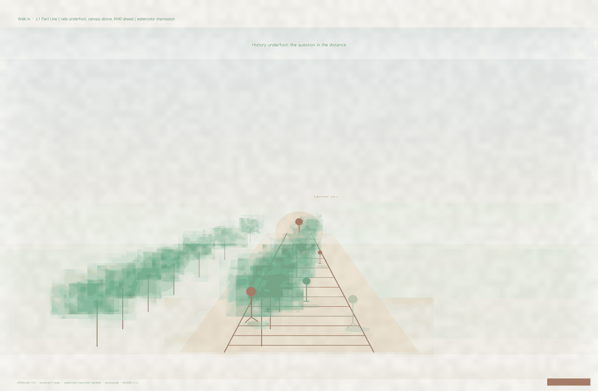

1. **L1 eye-level:** walkable rails underfoot, continuous canopy overhead, Kilometer Zero survey nail ahead—history underfoot, questions on the horizon.

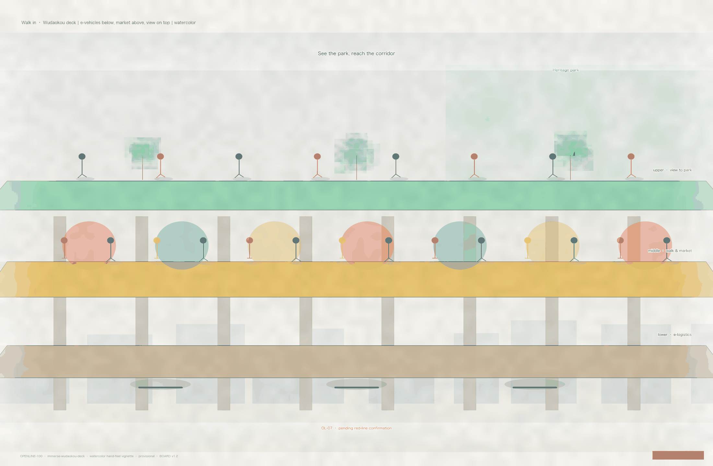

2. **Wudaokou section-perspective:** EVs/logistics below, walk/market mid, overlook above; banner “deepen after redline”—contested but forceful.

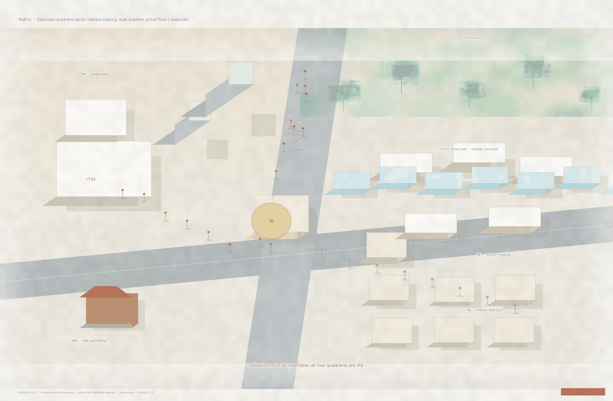

3. **Dazhongsi four quadrants:** SW street-front entry, SE school-safe, NW Bell Museum wayfinding, NE grocery—Adoption must be reachable. If drawings still show a prior station-front figure, this chapter’s street rule governs until the full package is re-rendered.

Origin conversion street does not get a fourth watercolor. Place-section `key-eyes` 02 cuts the license window and KM0; the Failure Case Library is Card 01's inherit interface, not the whole 104 ha. The official ~3 km² does not replace the competition key area.

### Five material translations | let the rails grow into space

Do not stop at “heritage corridor”—rails must become touchable, sittable, askable, audible civic parts; reviewers must see **Jing-Zhang steel driven into the fabric** [depth:blue_green_public_space] [data:geometry/roads.geojson#ROAD-FACT-001]:

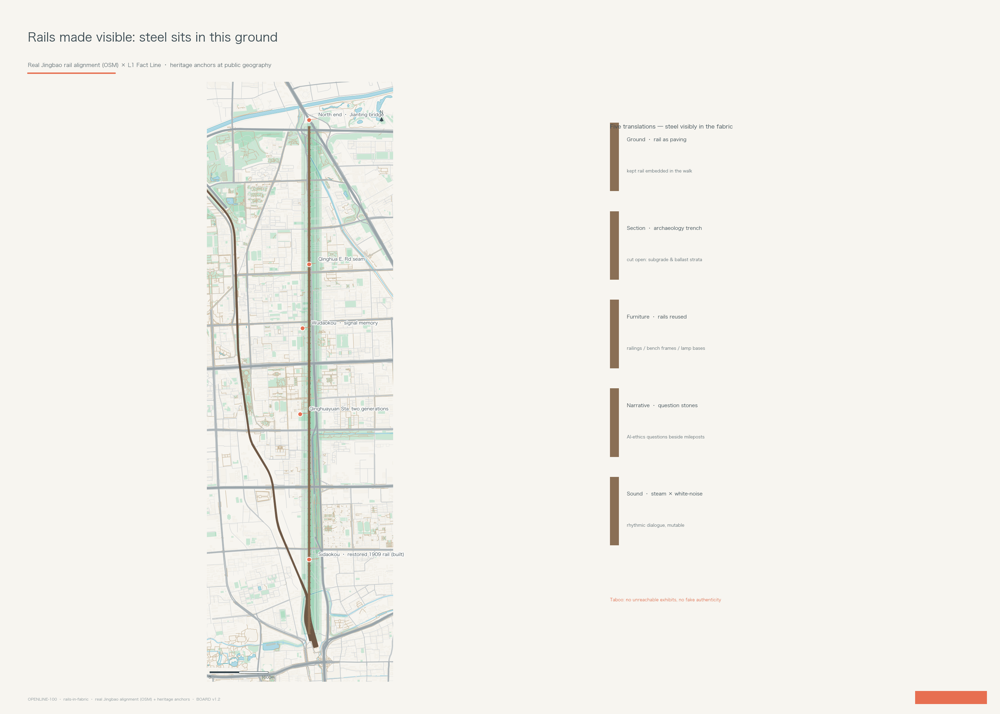

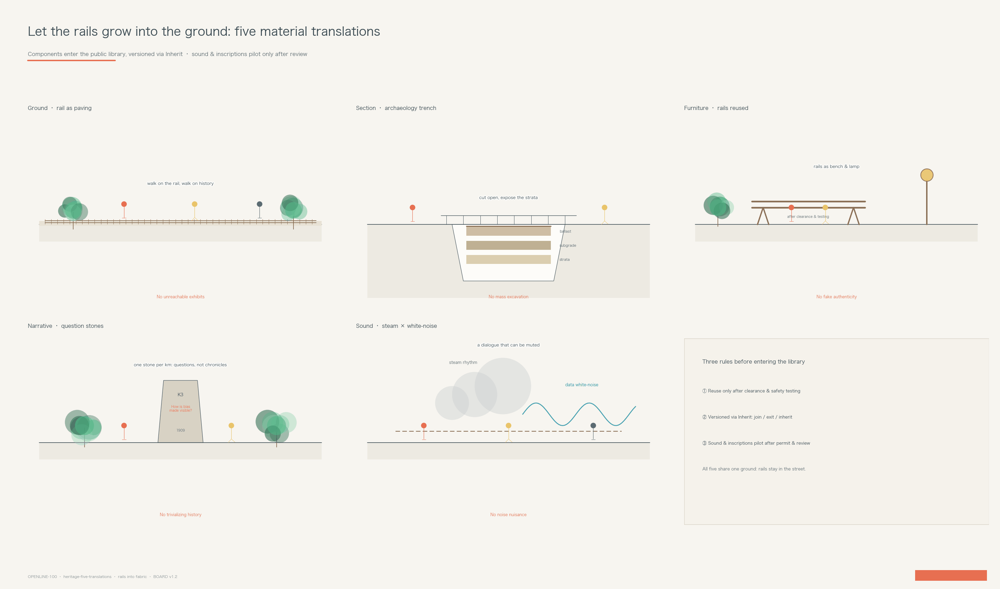

| Layer | Act | Spatial move (concept) | Forbidden |
| --- | --- | --- | --- |
| **Ground** | Rail as paving | Kept rails without fencing, set into walks; people walk the rails as history | Rails as unreachable exhibits |
| **Section** | Archaeological trench | At key nodes, cut the ground to expose subgrade and ballast strata with guard and caption | Mass excavation without assessment |
| **Furniture** | Rail as structure | Reused rails as rails, seat frames, lamp bases (after clearance and safety checks) | Fake “original-in-situ” claims |
| **Narrative** | Milestone thinking stones | ~every km: not chronicles, but AI ethics questions (e.g. “How is algorithmic bias made visible?”) beside historic mileage | Vulgarization or distorted Jing-Zhang history |
| **Soundscape** | Steam rhythm × data hiss | Selected stretches: steam-locomotive rhythm alternating with low data white noise; switch-offable | Nuisance noise devices |

Components enter the public library under Inherit; sound and inscriptions need permits and human review before pilots.

The five translations make the rails **visible**. Chapter 3, rails of humanity, makes them **soulful**—grades A/B/C, empty voice slots “___”, and the three turns sit on `heritage-soul`. Visibility is not a fourth heritage brand; the herringbone grade stays railway anatomy and does not revive “Renzi Rails.”

### Land use: catalysts hung on the Openline

Land use covers the submitted boundary without gaps or overlaps as conceptual catalyst partitions, not statutory zoning [standard:MNR-LAND-USE-CLASSIFICATION-GUIDE] [data:geometry/land_use.geojson#LU-001] [depth:land_use_layout]:

| Role | Intent | Openline relation | Evidence |
| --- | --- | --- | --- |
| West R&D / collaboration band | Full-stack R&D, evaluation, open questions, and open collaboration | West of L2; ground floor collaborative/releasable | [data:geometry/land_use.geojson#LU-001] |
| Blue–green public spine | Heritage vitality, slow mobility, canopy | Carries L1/L2 and three landmarks | [data:geometry/green_space.geojson#GREEN-SPINE-001] |
| East living / conversion band | Talent living, community services, near-campus conversion | Stitches into university/community catchments | land_use partition layer |
| South Native Street | Agents / devices / content consumption, data salon, international exchange | Dazhongsi ground-floor protocol; four quadrants are arrival only | [data:geometry/key_areas.geojson#PROV-KEY-003] |

**Frontage protocol (urban-design substitute while block structure is known and parcel intensity is not):** continuous open ground floors along the Openline; no long blank walls; intersection sightlines and accessibility; shade rows before decorative paving. Design suggestions pending tenure and adopted sheets.

### Renewal typology and building envelopes

Building layer expresses conceptual node envelopes only; method yes, parcel conclusions no [data:geometry/buildings.geojson#BLDG-PROOF-001] [depth:retain_renovate_demolish]:

| Type | Cue | Design act | Forbidden |
| --- | --- | --- | --- |
| Retain / strengthen | Large spans, courtyards, adaptable structure | Insert public display / collaboration | Demolition without survey |
| Renovate | Closed fronts, passive edges | Open ground floor to the Openline | Tenure fiction |
| Insert nodes | Stations, landmark components | Low-disturbance, reversible, exitable | Fake height/FAR |
| New-build pending | After controls and tenure | Mid-term project bank | Implementation promises |

Municipal energy and edge compute appear as Openline station prototypes—no engineered alignments [depth:traffic_rail_slow_parking]. Character splits official controls / design advice / pending heritage lines [standard:MOHURD-URBAN-DESIGN-MEASURES].

## Key-area detailed design

All three key areas are provisional rectangles; design is **directional comprehensive-plan depth** as concept. Official polygons trigger full recalculation [depth:three_key_area_detailed_design]. Shared Openline grammar; **different rules, sections, components, and scene gates**—the hard answer to “not one park template.”

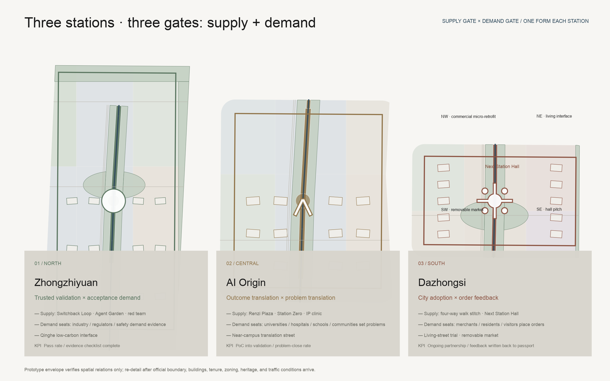

| Area | Primary mission | Block-plan status | Core spatial product | Main pending risks |
| --- | --- | --- | --- | --- |
| Zhongzhiyuan | Full-stack independent innovation + global governance | **Required competition key area**; not covered by this block plan’s published extents (north of Chengfu / Xuebei) | **Garden Innovation Street** · Upgradeable Urban Motherboard (shared base + upgradeable R&D units) | Official boundary / tenure; infrastructure capacity; blue line / flood; Xuebei opening agreement |
| AI Origin | World-class AI innovation ecology | One of two centers: Wudaokou | **The source of innovation** · wall-crossing origination ecology (conversion street + open release + station stitch) | Campus/owner tenure and access |
| Dazhongsi | Intelligent-native new formats | One of two centers: Dazhongsi | **The Native Street** (ground-floor protocol; four quadrants are the arrival system) | Owner ground-floor agreement; 1733 tenure; North 3rd Ring traffic; 2027 in-station schedule |

Announcement area check (discussion): Zhongzhiyuan ≈ 192.1 ha (recomputed ≈ 192.9 ha), Origin ≈ 104.3 ha, Dazhongsi ≈ 72.0 ha order of magnitude—layer attributes govern; rectangle edges are not parcel redlines [data:geometry/key_areas.geojson#PROV-KEY-001] [metric:key_area_count].

### Winning-kit five (1:2000-level refinement)

A world-class winning key-area package is five hard drawings, not another concept paragraph. This submission now matches that bar. All five are **1:2000-level refinements**, not statutory sheets. Official polygons / redlines / intensity trigger a full-package recalculation [depth:three_key_area_detailed_design].

| Winning standard | Figure | One-line read | Honesty |
| --- | --- | --- | --- |
| 1:2000 master plan | `key-plans-2000` | One grammar, three fabrics | Renderer fabric, not a parcel sheet |
| Massing + skyline | `key-massing-skyline` | Mass follows fabric; no new tower | Conceptual heights, z exaggerated |
| 3–5 place sections | `key-eyes` + immersions | Court / KM0 / Wudaokou deck / Dazhongsi station / Qinghe the river | Place sections, not symbol streets |
| Typical sections | `key-sections` | L1 / L2 / collaboration / conversion / native / deck | Not engineering; walk ≥50% |
| Phasing | `key-phasing` + `phasing-capital` | Timeline: 0–1 pilot · 1–3 street · 3–10 network; capital: each phase answers build / pay / operate / return | Timeline is not a budget; the capital figure is a magnitude loop, not a cost plan |

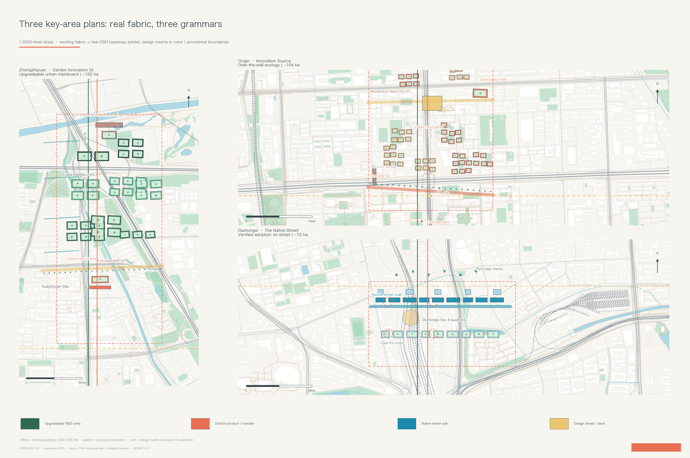

**How to read the plans:** north up. Zhongzhiyuan parks the Jing-Zhang on the east; the collaboration street crosses courtyard clusters; governance faces Qinghe. Origin parks the center; the conversion street cuts across; the license window sits on the west campus edge. Dazhongsi parks the north; the street wall continues south; 1733 and the quadrants are arrival, not a redesigned HQ.

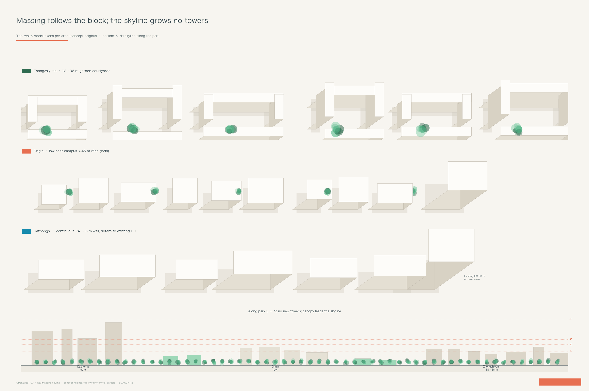

**Massing and skyline:** three white-mass axons above; park skyline S→N below. Dazhongsi follows existing HQ height; Origin stays low at the campus edge; Zhongzhiyuan 18–36 m garden type; Qinghe / 5th Ring drops further. No 60–80 m marker tower.

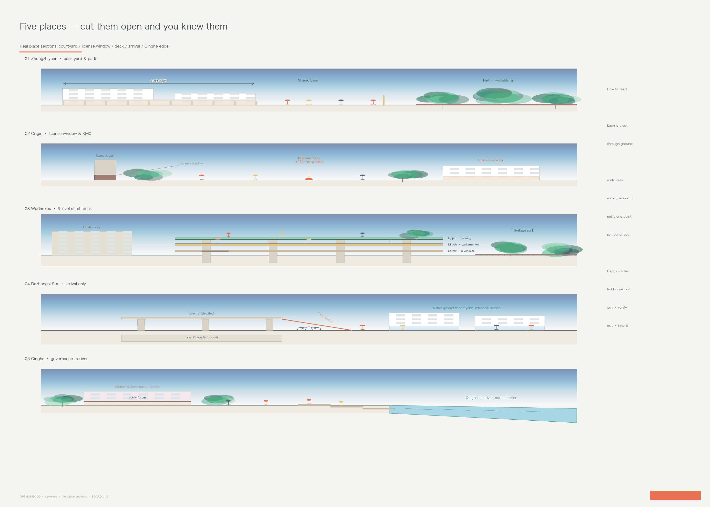

**Five place sections:** 01 Zhongzhiyuan court and park band; 02 Origin license window in the wall and KM0 on the street; 03 Wudaokou existing city | L1 | three decks | heritage park (read with the OL-07 cut); 04 Dazhongsi station is arrival only, ground floor tryable; 05 Qinghe is a river, not a station. Watercolor immersions stay atmospheric; this sheet cuts the ground, it is not a one-point symbol street.

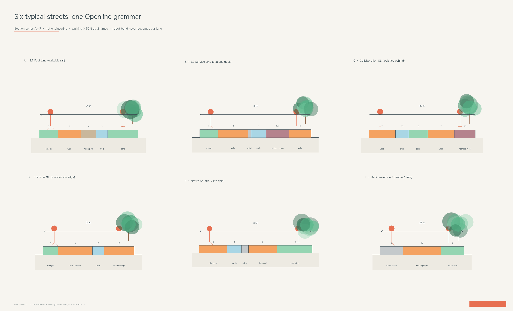

**Sections:** A Fact Line · B Spine · C collaboration · D conversion · E Native Street · F stitch deck. The robot lane never becomes a car lane.

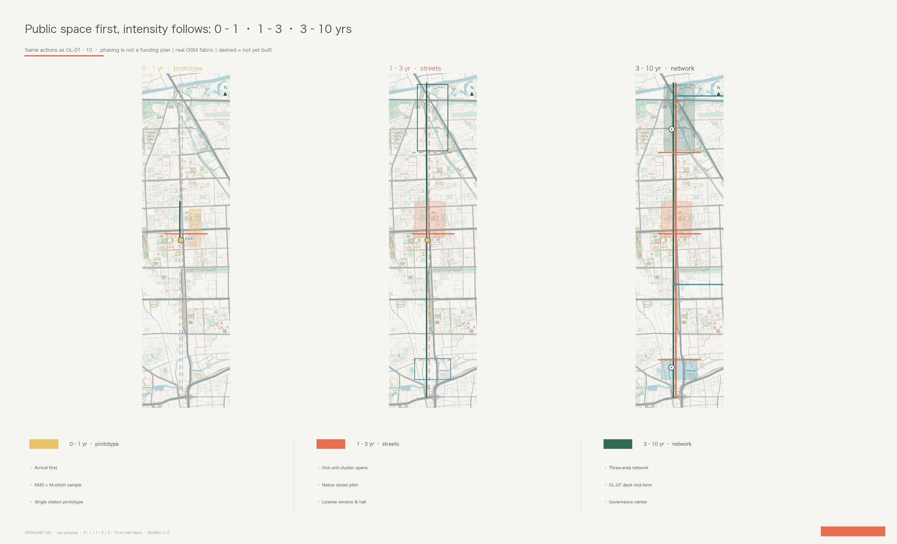

**Phasing:** Timeline in `key-phasing`—0–1 Origin and arrival first; 1–3 one unit becomes a street; 3–10 the network, OL-07 into the mid-term library after redline. Capital loop in `phasing-capital` and the “Capital logic of phasing” section below. Same actions as the OL list—no second phasing story.

### Zhongzhiyuan · Garden Innovation Street (AI Independent Innovation Acceleration Area · The Upgradeable Urban Motherboard)

**Mission and planning status:** Zhongzhiyuan is not a technology park led by visits, consumption, or one-off testing. The brief gives it two primary responsibilities: build the **Full-Stack Independent AI Innovation System**, and create lasting capacity for China to participate in global AI standards, safety, and governance. It is the required northern key area, announced at about 192.1 ha, anchored at Zhongguancun Dongsheng Science Park Xuebei Garden; the tasks explicitly name the North 5th Ring, Qinghe, and a garden-type innovation district. The 2026-08-11 block plan's published extents stop at Chengfu Road and do not cover this piece. Detailed design therefore continues, without portraying Zhongzhiyuan as that plan's approved “third center” [source:OFFICIAL-ANNOUNCEMENT] [source:AGENT-TASKBOOK] [source:HD-JINGZHANG-BLOCK-PLAN-20260811].

**Design thesis:** AI technologies change within years; urban fabric lasts for decades. If today's industry list is permanently assigned to buildings, each technology cycle produces relocation and repeated demolition. Zhongzhiyuan therefore becomes an **Upgradeable Urban Motherboard**: the garden, walking network, service access, shared technical platforms, and governance interfaces remain stable; R&D teams, laboratory fit-outs, equipment, and AI-Enabled Scenarios keep changing. This is not a circuit-board image stamped on the ground. It is a planning rule: **keep the shared base stable, let technical units evolve; make upstream and downstream neighbors, and give every upgrade a standards and responsibility interface.** [depth:overall_spatial_structure]

**What already exists (grade A—do not rebuild):**

| Object | Built / published | Motherboard increment | Taboo |
| --- | --- | --- | --- |
| Park Phase II north | Opened 2026-08-06; Tsinghua East Rd–North 5th Ring Jianting Bridge, 2.6 km / 30.01 ha; Jing-Zhang Ring, walk / jog / cycle routes, native-plant garden, grove theatre, and courts | Treat as the shared green base; R&D clusters connect from the edge, not the corridor centre | Do not redraw the Ring, rail walk, or three slow routes |
| Fishbone paths / undercroft | Three fishbone routes reclaim Jianting Bridge and Line 13 viaduct spaces; park ↔ Qinghe east–west | Existing transverse interfaces for the Full-Stack Collaboration Street | Do not draw a second walking network |
| Qinghe waterfront | Already linked to the park; brief asks for Qinghe culture | Public interface for global governance, low-carbon exchange, and daily garden use | No invented setback before the blue line; no personal tracking |
| Xuebei / Dongsheng Science Park | Haidian 2026-03 anchor; Xueqing × Yuequan; Xuezhiyuan station | First motherboard: prioritize shared ground floors, upgradeable R&D units, and common technology platforms in existing space | Do not redraw the campus plan; no claimed owner consent |
| North 5th Ring Jianting Bridge | Park's northern end; brief asks for 5th-Ring integration | Study outward links for talent, equipment, production services, and controlled compatibility scenarios | Do not alter the Ring mainline; no invented interchange or road-testing permit |

#### Spatial formula: one shared base · five upgradeable unit types · one Full-Stack Collaboration Street · one Global AI Standards and Governance Center

The **shared base** is public capacity that should not be rebuilt for every technology cycle: continuous garden and accessible walking, public ground floors, shared meeting and engineering services, equipment logistics and maintenance interfaces, plus authorized compute, data, network, energy, and safety services. This does not mean centralizing all infrastructure in one building; it means allowing each cluster to connect, disconnect, and upgrade through common interfaces.

**Five upgradeable innovation-unit types** turn the full stack into a neighborhood rather than five sealed compounds. Their boundaries may change with technology; the labels describe today's mission, not permanent land-use assignments [data:geometry/key_areas.geojson#PROV-KEY-001] [data:geometry/buildings.geojson#BLDG-PROOF-001]:

| Upgradeable unit | Current full-stack task | Shared spatial infrastructure |
| --- | --- | --- |
| Chip and Compute Coordination | Chips, computing systems, edge infrastructure, and energy coordination | Adaptable technical halls, shared loading, and maintenance interfaces |
| Foundation Software and Toolchains | Foundation software, development frameworks, engineering tools, and interoperability | Joint engineering studios, compatibility spaces, and secure collaboration rooms |
| Data and Models | Foundation / domain models, data governance, training, and evaluation | Controlled data spaces, model studios, Human Review and documentation interfaces |
| Agents and Industry Applications | Urban Agents, enterprise agents, application integration, and service design | Scenario studios, operator rooms, and cross-team workspaces |
| Embodied AI and Scenarios | Robotics, edge devices, and controlled scenario integration | Reconfigurable ground, safety separation, equipment bays, and operator interfaces |

The **Full-Stack Collaboration Street** links Xuezhiyuan Station and Xuebei's shared ground floors to the built fishbone routes, Park Phase II north, Qinghe, and Jianting Bridge. It is the common address for R&D collaboration, talent services, equipment booking, releases, and public communication—not a new ceremonial boulevard. The five unit types face the same street; meeting rooms, component libraries, food and rest, and technology services sit between units so an upstream component can reach a downstream application without passing through a chain of guarded compounds.

The **Global AI Standards and Governance Center** stands beside the R&D units as a primary function, with a public face toward the Qinghe garden. It houses standards workshops, safety and ethics collaboration, open-source governance, international forums, Human Review, and a public reference space. It is neither an occasional conference center nor a trophy hall. Its outputs should be bilingual standards drafts, interface specifications, incident lessons, responsibility records, and reusable governance components. Before a technical unit upgrades, it should state system boundaries, data rights, accountable operators, Human Review points, maintenance duties, and retirement paths [standard:PROJECT-AGENT-OPEN-CALL-TASKBOOK].

#### How the city and buildings grow with teams

A team no longer “graduates from the incubator and moves away.” The path becomes: **enter the shared base → use a small R&D unit → connect to shared technology platforms → expand into a joint laboratory or engineering team → complete standards, safety, and risk collaboration → expand into a floor, building, or specialist cluster.** Contraction and exit are designed too: teams return part of a unit, move equipment and data under protocol, and leave the space in a standard reusable condition.

| Layer | What remains stable | What may keep upgrading |
| --- | --- | --- |
| Urban base | Walking and Cycling Network, accessible ground, public interface, fire and service access, Blue-Green Space | Reversible furniture, activities, and local surface organization |
| Building base | Retainable long-span structures, courtyards, structural grids, and cores | Partitions, laboratory fit-outs, shared studios, and ground-floor interfaces |
| Technical layer | Standardized loading, maintenance, network, and safety interfaces | Compute modules, equipment bays, controlled rooms, and hardware/software environments |
| Governance layer | Responsibility records, Human Review, public explanation, incident and retirement procedures | Standards versions, evaluation methods, and collaboration agendas |

Survey and structural evidence come before retain / renovate / demolish decisions. Long-span structures and courtyards are retained first; closed ground floors may open by time-based owner agreement; new technical spaces use maintainable, replaceable construction where feasible. A new technology cycle should replace modules and fit-outs—not rebuild a district [depth:retain_renovate_demolish].

#### Five site-specific moves

1. **Use Xuebei as the first motherboard, not a blank campus.** Inventory existing buildings, courtyards, and shared facilities; adapt selected ground floors as shared technology and talent-service interfaces. Equipment enters from the service side; public walking enters from the garden side.
2. **Pick up the built fishbone routes; do not draw another road system.** The Full-Stack Collaboration Street repairs the existing Xuezhiyuan–Yuequan–Xuebei–park–Qinghe relationship, separating visitors, workers, equipment logistics, and emergency movement [data:geometry/roads.geojson#ROAD-STITCH-N].
3. **Make five unit types neighbors on one working street.** R&D space can reconfigure; common technology platforms and meeting services sit at unit interfaces. Innovation happens between programs, not on isolated sides of badge gates.
4. **Put global governance inside R&D.** The governance center touches technical units and the Qinghe garden edge. Standards, safety, ethics, and international collaboration enter projects early rather than reviewing them only after completion.
5. **Use the garden as innovation infrastructure.** The park and Qinghe provide cooling, water management, walking, outdoor discussion, international exchange, and daily talent life. Industry display sits in shared ground floors and shows only authorized outputs, standards evolution, and governance contributions—not a technology theme park [data:geometry/green_space.geojson#GREEN-PROOF-001].

**15-minute Urban Motherboard walk (discussion):** Xuezhiyuan Station → Yuequan shared lobby → Xuebei public technology platform → an upgradeable-unit prototype court → Global AI Standards and Governance Center → Qinghe Garden Commons → Park Phase II north. For visitors, the walk should explain the relationship from underlying capability through tools, models and agents, applications, standards, and governance. For workers, it means walking access from an R&D unit to shared platforms, governance services, transit, and garden rest. Official road redlines, access controls, and tenure must be surveyed before timing; if the path fails, move the entrance rather than claim completion on a drawing.

```
North 5th Ring / Jianting Bridge (outward access and production-service study)
                     │
Qinghe Garden ─ Global AI Standards and Governance Center ─ Park north / built fishbones
                     │
chips & compute ─ foundation software ─ data & models ─ agents & apps ─ embodied scenarios
                ╲──── Full-Stack Collaboration Street / shared base ────╱
                     │
          Xuebei shared ground floor / Xuezhiyuan Station
```

**Public-space and scenario interfaces:** shared working courts, bookable meeting and engineering services, component library, accessible loop, multilingual wayfinding, shade, Qinghe culture, and low-carbon display. S-02 Safety Governance Sandbox becomes a controlled technical tool shared by the governance center and embodied-AI units; S-06 Qinghe Low-Carbon Innovation Corridor becomes part of the shared green base. Card 03 writes temporal layers, not a park tour: the shared base is invariant, five unit types are variable, the governance door is the license. The governance center's public deliberation gallery is the public face of that door (Clause of Regret, stratigraphy wall)—not Zhongzhiyuan's calling card. The 15-minute path only tests whether the stack remains readable after generation-change. Xuebei Garden (~3.53 ha) is the seed, not the competition key area of ~192 ha.

**Success criteria:** can a technical module upgrade without rebuilding the district; can a small team expand, contract, or exit within the area; can upstream and downstream teams share one continuous working environment; does every system entering an AI-Enabled Scenario have a clear Human Review and responsibility interface; and can the public understand the full-stack system without entering controlled laboratories.

**Honest boundary:** there is no official precise Zhongzhiyuan polygon, parcel plan, tenure, blue line, road redline, or verified building / municipal capacity. This section claims no owner consent, national-platform delivery, confirmed operator, construction approval, or public-road permission for embodied AI. Compute, energy, fire, data-security, and flood needs require official data and specialist studies [data:geometry/key_areas.geojson#PROV-KEY-001].

**Phasing:** **0–1 years** survey buildings, interfaces, infrastructure capacity, and tenure; connect existing walking routes; launch lightweight pilots for a shared lobby, developer workshops, and standards topics. **1–3 years** adapt one set of upgradeable R&D units, start one public technology platform and a lightweight governance center, and test the 15-minute route and team expansion/contraction. **3–10 years** extend the five-unit network and Global AI Standards and Governance Center only after official boundaries, intensity, energy, municipal, safety, and operating responsibilities are confirmed; deepen the North 5th Ring transport relationship [depth:phasing_implementation].

### Beijing AI Origin · The Source of Innovation (Open Question)

**Position:** world-class AI innovation ecology—near-campus conversion, open release, talent that can stay. **Planning status:** maps to the approved **Wudaokou center** (AI industry agglomeration and top-talent exchange, draft-stage public wording); same nucleus as the official “AI Origin Community · first choice for founders,” not a rival place-name [source:HD-JINGZHANG-BLOCK-PLAN-20260811].

**Design thesis:** the brief gives Origin a world-class innovation ecology. Officialdom's three products are a first-launch site, a habitat, and an all-factor eco-service station; the policy layer is already spent. This district answers the spatial problem policy cannot buy—how laboratory work crosses the wall. Near-campus conversion, open release, and talent that can stay are the district's work. One line: **without an authorization window, campus work does not go on the street.** The official ~3 km² (Wudaokou core) does not replace the competition key area of ~104 ha.

The district identity is **the source of innovation**—the spatial landing of the official positioning "innovation origination, first choice for founders"; the district product is a **wall-crossing origination ecology**. Card 01 does not walk a corridor; it writes the necessary relation of origination crossing the wall (Appendix C-1): rights → match → claim → use → leave. A ~200 m corridor is a slice, not the name of 104 ha. Kilometer Zero recedes to a **survey nail** on the stitch deck (discussion φ150 mm, reused rail steel), not a ceremonial plaza [data:geometry/public_space.geojson#PUBLIC-KM0] [data:geometry/public_space.geojson#PUBLIC-JOIN].

**Five necessary links (concept; aligned to Card 01; skip any one and Origin is only a near-campus park):**

1. **Rights (authorization window).** What crosses the wall is permission, not footfall: scope, term, whether open-source is allowed, who is accountable. Without a strip, matching and first launch are unlawful. **No claimed university or owner consent** [data:geometry/buildings.geojson#BLDG-QUESTION-001].
2. **Match (eight-find co-location).** Policy, capital, compute, talent, partners, intellect, space, and scenes must close on foot. If teams still tour four parks, the all-factor station is a directory. Habitat hangs off matching so people stay long enough to finish eight-find—no startup-dorm brand.
3. **Claim (open release / first launch).** The official "global first-launch site" holds only as a fail-able public claim. Closed-door conversion is a tech-transfer office, not origination. Standalone ops: S-01.
4. **Use (community micro-scenes).** Canteen, delivery, wayfinding, property as real trades. Without a non-performing customer, the launch is a pitch. Desensitized summaries flow to Zhongzhiyuan for Card 03 upgrade permission.
5. **Leave (Failure Case Library) + stitch deck.** If failure is not left for the next cohort, the ecology resets every term. Records are withdrawable and rewritable. OL-07 joins campus to the street—if you can enter the park from campus without the deck, the wall is still there, merely undesigned.

**Success:** can campus work go on the street without the authorization window (must not); must eight-find require touring four parks (must not); can you enter the park from campus without the stitch deck (must not); is the official 3 km² drawn into 104 ha (must not).
**Honest boundary:** deck pending redline and pier tenure; authorization window and Failure Case Library sit on a community edge and need owner, street, and campus agreement; do not rewrite planar symbols as landmarks.

### Dazhongsi · The Native Street (Open Adoption · intelligent-native new formats)

**Position:** an urban AI innovation district—the brief requires **agents, intelligent devices, and content consumption** as native and AI+ formats, plus data-element circulation and international exchange. **Planning status:** maps to the approved **Dazhongsi center** (internet and related services, AI, new media, draft-stage public wording). It is not another closed park, and not a station-front object pretending to be 72 ha [source:HD-JINGZHANG-BLOCK-PLAN-20260811] [source:OFFICIAL-ANNOUNCEMENT] [source:AGENT-TASKBOOK].

**Design thesis:** Zhongzhiyuan makes and governs capability; Origin asks in public; Dazhongsi must let someone who did not book an appointment meet verified capability on the street—try, buy, subscribe, or refuse. One line: **verified capability must be able to go on the street.** This is a planning rule, not a ground figure.

The signature product is **The Native Street**: lead-firm edges, existing 1733 retail, and park-edge share one ground-floor protocol. Station integration and four-quadrant walking are the arrival system (required by the brief), not the district's name. Public assembly uses the street and existing 1733 bookable rooms—not a monument. No replica bell, no bell-shaped roof, no renamed mall atrium, no ByteDance as a signed owner.

**What already exists (grade A—do not rebuild):**

| Object | Built / published | This scheme’s increment | Taboo |
| --- | --- | --- | --- |
| Lead firm / 1733 | 18A North 3rd Ring West Rd; ~38,000 m² retail; Line 12 Exit D inside | Ground-floor native protocol; data-element salon and international demos in existing bookable rooms (S-05 / S-08) | Do not redesign towers; no claimed owner consent |
| Line 12 / 13 transfer | In-station passage deferred to ~2027-12; outdoor ~8 min: Exit D → 1733 east → **stairs** to grade → Line 13 A/B; 30-minute continuous fare | **Arrival system OL-04**: 24h public RoW (not a taking), east-end access P0, four-quadrant walking, four-corner bike parking | Do not draw 2027 in-station as this scheme’s delivery; no new tunnel; do not write the transfer gallery as the district product |
| Park Phase II south | Opened 2026-08-06; 3rd-Ring gateway balcony | Planned green compound use: balcony and edge take street overflow, not the corridor centre | Do not redraw restored rails, gantry, or balcony |
| Line 13 undercroft | Existing under-viaduct; Phase II already activated some | Continues four-quadrant slow mobility with one paving/light to the street | Do not alter the bridge; no claimed spans |
| Bell Museum | No. 31A, Yongle Bell | Crossing wayfinding; the temple is for hearing the bell, the street is for using capability | No replica bell; no gold fake-bronze |

**Five spatial moves (concept, not statutory; aligned to the brief’s Dazhongsi clauses):**

1. **Native ground floor (district rule).** Along HQ edges, 1733 frontage, and park edge: continuous open ground floors for agent service windows, device trials, content screening/retail. A trial must be refuseable and exitable; without a strip stating who verified it, what failed, and who is accountable, it does not go on the street. No named brands, no invented tenants [data:geometry/buildings.geojson].
2. **Data-element and international salon.** Existing 1733 bookable rooms take S-08 and S-05. The west tech-service wing supplies IP / capital / license interfaces; Dazhongsi does not invent a fund tower.
3. **Station integration + four quadrants (arrival, not identity).** Keep the existing 8-minute path public; east-end stair → ramp+lift remains access P0; four-quadrant walking at North 3rd Ring West Rd × Jingbao rail bridge; four-corner bike parking. After 2027 the metro owns the in-station passage; the street rule remains (assumption A-DAZHONGSI-1733-001).
4. **Compound use of planned green.** Reversible park-edge inserts for display and pause; do not occupy the opened corridor centre; no large trees on 1733 structure.
5. **Community cuts.** SE school-safe, NW Bell Museum wayfinding, NE grocery short-cut. Do not rebuild the 3rd Ring mainline. Specified wall cuts for a 20-minute living path.

   | Quadrant | Existing anchors | Walk move |
   | --- | --- | --- |
   | **SW** | Line 13 station + 1733 + HQ campus | Native Street entry; station arrival |
   | **SE** | Taiyangyuan / Lanjinglijia / Zhongguancun No. 4 Primary; Line 12 Exit E | School-safe crossing; bike parking |
   | **NW** | Overpass north, toward the Bell Museum | Wayfinding and shade; no replica bell |
   | **NE** | Communities north of the 3rd Ring / park edge | Grocery short-cut onto Phase II fishbone paths |

**8-minute arrival walk (discussion; paired with the 15-minute Urban Motherboard walk):** Line 12 Exit D → existing 1733 path → up to the street (Join) → try or pass a verified format (Verify / Adoption) → walk away (Exit) → Line 13 or a four-quadrant living path (Inherit). Cut by mall hours, or reachable only inside a closed hall, means the street has not been designed.

```
West-wing tech service (IP / capital / standards) ──┐
Xiaoyuehe scene questions ── Origin conversion ── Zhongzhiyuan governance review ──► Dazhongsi Native Street
                                                    │
Line 12 Exit D ── 1733 public RoW ── four-quadrant walk ── Line 13 A/B
                              (arrival system, not the district name)
```

**Honesty bounds:** ground-floor protocol needs owner and street agreement; 24h gallery and access need owner+metro+street agreement; four-quadrant crossings need traffic organization; 2027 is metro’s schedule; no FAR claimed; ByteDance is not the delivery party; the street is not an advertising gallery.

**Phasing:** **years 0–1** one HQ-edge + 1733-frontage pilot (tryable, refuseable, responsibility strip), 24h RoW and access agreement, four-quadrant study; **years 1–3** continuous street, salon and demo rhythm, community cuts; **after 2027** in-station belongs to metro; the street rule remains.

**Components:** refuseable trial bays, responsibility strips, movable seating, luggage benches, multilingual wayfinding, four-corner bike racks.
**Scenes:** S-05 / S-08 in existing rooms; the street takes refuseable trials of devices and content.
**Success:** can you meet one tryable, refuseable format without entering a closed hall (you must); can you meet it within 10 minutes without an appointment (you must); are four-quadrant walks cut by traffic; do mall hours cut the arrival path; is there a display without a responsibility interface (there must not be). The depth scene is Card 02 (Appendix C-2).
**Node enlarge (concept):** ground-floor street unfold + four-quadrant plan; materials: dark bronze as edging only, warm wood on seat faces, paper-white wayfinding. Do not turn station-front level change into the district landmark.

## AI ecology, personas, and AI+ scenarios

Openline users are participants who enter and exit under the open rules, not managed objects. Personas and cards are conceptual, with privacy boundaries and human review [source:AGENT-TASKBOOK].

**Depth over breadth, and 1:1 to the three key areas.** Positioning is settled: Card 01 = Origin origination crossing the wall, Card 02 = Dazhongsi street adoption, Card 03 = Zhongzhiyuan full-stack upgrade. Depth is not "five stops in one day." It is each district's production logic—**skip one step and it is fake**. Card 01 is a causal chain (rights → match → claim → use → leave); Card 02 is parallel layers (street rule ‖ off-street exception ‖ living remainder), with arrival only testing whether a passerby can meet the rule; Card 03 is temporal layers (invariant / variable / license), with the 15-minute walk only testing whether the stack remains readable after generation-change. S-01–S-10 are now ten full-depth cards, each with the eight required items. Answer-before-the-call remains east-wing card S-09 / D-10. The brief's ≥3 industry test/verification scenes are carried by Card 02 street trials, Card 03 upgrade permission and the governance door, together with S-02, S-03, and S-08.

| Persona | Need | Spatial response | Boundary |
| --- | --- | --- | --- |
| Open-source developer | Release, collab, reputation | Origin release hall, code wall | No individual trajectories; aggregates only |
| Startup team | Low-cost trial, compute entry | Zhongzhiyuan shared technology platform, upgradeable R&D units, edge stations | Compute/data need separate authorization |
| Enterprise visitor | Display, demo, hiring | Existing 1733 bookable rooms / reversible park-edge insert | Cleared rights for marks; no claimed owner consent |
| Neighbor resident | Commute, leisure, low disturbance | Openline slow mobility, embedded services | No commercial profiling of residents |
| University faculty/students | Conversion, cross-campus collab | Conversion street, education nodes | Campus/IP authorization |
| International visitor | Short path to understand the belt | Landmark route + multilingual wayfinding | No passport-grade ID as default |
| Community residents (all ages) | Community micro-scenes, school-safe and grocery paths, governance participation | Origin micro-scene first users (informed consent), Dazhongsi four-quadrant living path, Zhongzhiyuan governance-door observer seat, east-wing S-09 station | Health data local-only; no trajectory tracking; human always present; exit right anytime |

### Ten full-depth scenario cards

| Card | Theme | One-line concept | Production logic (skip one step and it is fake) | Rule chain | Full text |
| --- | --- | --- | --- | --- | --- |
| **01 AI+Origin Community · How origination crosses the wall** | World-class innovation ecology | Without an authorization window, campus work does not go on the street | **Rights → match → claim → use → leave**: no authorization, matching is unlawful; eight-find not walkable, the station is a directory; no fail-able public claim, not an origination site; no real trade, the launch is a pitch; failure not inherited, the ecology resets every cohort | Join → Verify → Exit → Inherit | Appendix C-1 |
| **02 Dazhongsi · Verified capability must go on the street** | Intelligent-native new formats | Try and refuse without an appointment; business hours do not cut public passage | **Street rule ‖ off-street exception ‖ living remainder** (parallel, not five stops): no strip = advertising gallery; data on the street = a leak; quadrants eaten = an industrial park impersonating a block; the 8-minute arrival only tests whether a passerby can meet the rule | Join → Verify → Exit → Inherit | Appendix C-2 |
| **03 Zhongzhiyuan · How the full stack upgrades without demolishing the city** | Full-stack autonomy + global governance | A small team can expand, contract, or exit; a generation change does not demolish the street; the public can read the full stack without a lab badge | **Invariant / variable / license**: an unstable base means generation-change demolishes the city; units without a door means no one is accountable; a door with no public face means the national platform is a black box; the 15-minute walk only tests whether the stack remains readable after change | Verify → Exit → Inherit | Appendix C-3 |
| **04 Safety governance sandbox** (S-02) | Test & verify | Controlled testing needs a door the public can see | Desensitized evaluation sets + expert review + a street-facing explanation interface; without it the sandbox is a black box | Verify → Exit | Appendix D-04 |
| **05 Edge-compute station** (S-03) | Test & verify | Compute is bookable like a library seat, and you can leave | Book → verify → meter → wipe on exit; without wiping, the station becomes a data-collection point | Join → Exit | Appendix D-05 |
| **06 AI slow-mobility navigation** (S-04) | Mobility & life | Navigation is off by default; the city works without it | Aggregate data only + local-first + physical wayfinding fallback; without fallback, system downtime = city failure | Join → Verify → Exit | Appendix D-06 |
| **07 International roadshow hall** (S-05) | Industry exchange | International exchange uses existing halls; no tower for roadshows | Booking + rights clearance + open days; without clearance the hall becomes an ad slot | Join → Exit | Appendix D-07 |
| **08 Qinghe low-carbon innovation corridor** (S-06) | Public space | Environmental data is fully public; monitoring is the commitment itself | Sensors → trust → Verify-gate publication; wired to the A-ECO-001 monitoring loop; unpublished low-carbon is a slogan | Verify → Inherit | Appendix D-08 |
| **09 Data-element meeting hall** (S-08) | Test & verify | Data trading stays downstairs, never on the street | Authorization lists + audit trails + human compliance; without audit trails the hall becomes a grey market | Verify → Exit → Inherit | Appendix D-09 |
| **10 Answer-before-ask** (S-09) | Public service | AI hears people first; a human is always present | Hear → anticipate → get it done → else a standardized ticket to 12345; without a human backstop the service discriminates against the digitally disadvantaged | Join → Exit | Appendix D-10 |

Each of the ten cards carries the required eight: users / place / trigger / operations / data minimization / human review / exit & shutdown / metrics. S-02 / S-03 / S-04 / S-05 / S-06 / S-08 / S-09 are Appendix D-04–D-10. **S-01 / S-07 / S-10 are no longer counted by folding them into another card**; each has its own eight-item card (D-S01 / D-S07 / D-S10). Cards 01–03 remain the three district production-function texts (Appendix C) and do not replace index numbers.

### Scene index S-01–S-10 (one line each)

| # | Scene | Type | Carrier | One line |
| --- | --- | --- | --- | --- |
| S-01 | Open release hall | Industry collab | Origin | Standalone ops form of Card 01 open release / first launch: public agenda, human host |
| S-02 | Safety governance sandbox | **Test/verify** | Zhongzhiyuan governance center + controlled ground of the Embodied AI unit | Desensitized evaluation sets + expert review; visible from the public explanation interface, inaccessible without authorization |
| S-03 | Edge compute station | **Test/verify** | Openline nodes | Edge prototypes with energy logs; shares space with S-09, physically separated |
| S-04 | AI slow-mobility nav | Mobility life | Spine | Congestion aggregates only; off by default |
| S-05 | International demo lobby | Industry exchange | Dazhongsi · existing 1733 bookable rooms | Booked, rights-cleared; no new tower |
| S-06 | Qinghe low-carbon innovation corridor | Public space | Zhongzhiyuan shared green base · Qinghe interface | Public environmental sensing, human patrol; extends toward the Xiaoyuehe wing |
| S-07 | Near-campus conversion street | Conversion | Origin | Continuous frontage: authorization window → prototype workshop → release hall |
| S-08 | Data-element salon | **Test/verify** | Dazhongsi · existing 1733 bookable rooms | Authorization list + audit trail + compliance advisor window |
| S-09 | Answer before the call | Public services | Xiaoyuehe wing · Openline station network | Hear / anticipate / resolve; red "I want a human" button; tickets into 12345; does not occupy a key-area depth card |
| S-10 | Global AI Week route | Culture ops | Belt public system | Permits + safety plan; components versioned via Inherit |

### Scenario Card 01 | AI+Origin Community · How origination crosses the wall (summary · full text in Appendix C-1)

**Core concept: Origin produces origination that can cross the wall, not a near-campus park.** Officialdom's three products (first-launch site, habitat, all-factor eco-service station) are already spent at the policy layer. This card writes the **necessary relation** among them: without authorization, eight-find is an unlawful match; if eight-find is not walkable, the station is a directory; without a fail-able public claim, the first-launch site is a venue; without a real community trade, the launch is a pitch; if failure is not left for the next cohort, the ecology resets every term. Space is only where those five links land; a 200 m corridor is a slice. The official ~3 km² does not replace 104 ha. Full causal chain and self-checks in Appendix C-1.

### Scenario Card 02 | Dazhongsi · Verified capability must go on the street (summary · full text in Appendix C-2)

**Core concept: Dazhongsi produces refuseable adoption, not station-front sightseeing.** Depth in an urban block is three layers **in parallel**: the street rule (verified capability occupies the ground floor; four-field strip; tryable and refuseable); the off-street exception (data elements and international exchange go into existing 1733 bookable rooms—not the next stop, the shelter for what must not occupy the RoW); the living remainder (school-safe / grocery / Bell Museum wayfinding are not alienable). The 8-minute arrival only tests whether a passerby can meet the rule; cut by mall hours, the rule works for staff and fails for the city. Full layering and self-checks in Appendix C-2.

### Scenario Card 03 | Zhongzhiyuan · How the full stack upgrades without demolishing the city (summary · full text in Appendix C-3)

**Core concept: Zhongzhiyuan produces licensed generation-change, not a 15-minute park tour.** Depth is temporal: the shared base is the **invariant** (change the module, not the district); five unit types are the **variable** (small-team expand/contract/exit written into the neighborhood); the governance door is the **license** (the only lawful entrance to generation-change; the Clause of Regret and the stratigraphy wall keep failed upgrades load-bearing). Being able to read the full stack without a lab badge means the city remains understandable after replacement, not that there is a museum. The 15-minute path only tests whether those layers remain readable after change. Xuebei Garden (~3.53 ha) does not replace 192 ha. Full layering and self-checks in Appendix C-3.

**Xiaoyuehe scene-empowerment wing:** the taskbook east wing lands here. S-06 and the Qinghe interface extend to the Xiaoyuehe corridor as a “pose a question—walk—public experience” path for AI+ health / education / law / living (switch-offable, Human Review required). **S-09 Answer before the call** lands on the east-wing station network (~3–4 nodes, 800–1000 m apart): hear, anticipate, resolve; a red "I want a human" button; what cannot be done locally becomes a standard ticket into 12345. It balances the west tech-service wing, does not occupy a key-area depth card, and does not rewrite Dazhongsi station as the east wing [depth:blue_green_public_space]. The five-domain station distribution (E-01–E-04), the Yuan earth-wall / Jimen Misty Trees heritage pairing, and the edge-compute station building concept are detailed in the coordination-research chapter under "Two-Wing Detailed Design"; the field-verification list has been extended with P-09 / P-10.

Scenes land on public-space and road layers [data:geometry/public_space.geojson#PUBLIC-JOIN] [data:geometry/roads.geojson#ROAD-SPINE-001] [metric:public_space_ratio]. Civic agents may flag breaks and maintenance; they must not replace approval or emit unauthorized personal profiles.

## Land use, building scale, and retain–renovate–demolish

Land use covers the submitted boundary without gaps or overlaps as conceptual partitions [standard:MNR-LAND-USE-CLASSIFICATION-GUIDE] [data:geometry/land_use.geojson#LU-001]. Conceptual green ratio ≈ 20%, public-space ratio ≈ 8% for carrying-capacity discussion. The block plan is approved but **statutory green ratio was not published with the news**—this table does not divide 1,668.2 ha by the 1,141 ha submitted footprint; the two extents differ and must not share a denominator [metric:green_ratio] [metric:public_space_ratio] [source:HD-JINGZHANG-BLOCK-PLAN-20260811].

Building footprints are conceptual node envelopes totaling ≈ 482,000 m²—**not** statutory GFA; **parcel** FAR, density, and height remain `unknown` until adopted sheets—but **concept-grade magnitudes can and should be given**: the balance table and intensity ranges below state discussion-grade magnitudes as ranges, assumptions, and a recomputation method, without fake precision [metric:building_footprint_area_sqm] [depth:development_intensity_controls]. Retain–renovate–demolish is method-only until survey and tenure. Stock renewal prefers the plan’s path of old-factory conversion and underperforming-tower update [depth:retain_renovate_demolish] [data:geometry/buildings.geojson#BLDG-QUESTION-001] [source:HD-JINGZHANG-BLOCK-PLAN-20260811].

### Concept-grade land-use balance table (discussion-grade · recomputable)

Areas come from the five declared partitions in `geometry/land_use.geojson` (provisional, recomputed in EPSG:4548); shares use the submitted boundary ≈1141.3 ha as denominator; land-use codes are layer-declared codes following the national classification semantics—not statutory zoning [data:geometry/land_use.geojson#LU-001] [metric:site_area_sqm] [standard:MNR-LAND-USE-CLASSIFICATION-GUIDE]:

| Partition | Layer code | Area (ha, approx.) | Share | Openline role |
| --- | --- | --- | --- | --- |
| LU-001 West R&D and collaboration band | 0802 | ≈138.3 | ≈12.1% | Full-stack R&D, evaluation, open questions, and open-source collaboration |
| LU-002 Openline blue–green public spine | 1401 | ≈258.6 | ≈22.7% | Heritage vitality band; carries L1/L2 and landmarks |
| LU-003 Heritage–culture public interface | 0803 | ≈220.1 | ≈19.3% | Heritage narrative interface along L1 Fact Line |
| LU-004 South Native Street | 05 | ≈297.8 | ≈26.1% | Agents / devices / content consumption; station area is arrival only |
| LU-005 East community services / living support band | 0702 | ≈226.5 | ≈19.8% | Talent living, community services, near-campus conversion |
| **Total** | — | **≈1141.3** | **100%** | Closes with the submitted boundary (error <0.1%) |

**Check row:** conceptual green ≈227.8 ha (20.0%), mainly in LU-002 plus affiliated green [metric:green_space_area_sqm]; public space ≈90.1 ha (7.9%) [metric:public_space_ratio]; conceptual building footprint 482,000 m² is only ≈4.2%—a node-envelope placeholder, not statutory density [metric:building_footprint_area_sqm].

### Development intensity ranges (concept suggestions · adopted sheets always cap)

Principles: **ranges, never single values; block structure follows the approved plan’s public text; range caps always yield to future parcel sheets; frontage and ground-floor rules take effect before intensity** [depth:development_intensity_controls] [source:HD-JINGZHANG-BLOCK-PLAN-20260811]:

| Partition | FAR range (concept) | Height guidance (concept) | Density range | Ground-floor / interface hard rules |
| --- | --- | --- | --- | --- |
| LU-001 R&D and collaboration band | 1.2–1.8 | Baseline 18–36 m, landmark nodes ≤45 m | 20–30% | Ground-floor openness ≥60%; no continuous blank wall >50 m |
| LU-002 Blue–green public spine | ≤0.05 (stations / landmark inserts only) | ≤12 m | ≤3% | All components low-disturbance, reversible, exitable |
| LU-003 Heritage–culture interface | 0.8–1.5 | Baseline ≤24 m, heritage-adjacent 12–18 m | 15–25% | Heritage view corridors before volume |
| LU-004 South Native Street | 2.0–3.0 | Zoned 45–80 m; yield to existing 1733 / HQ volumes; no extra landmark tower | 30–40% | Ground floor tryable and refuseable; four-quadrant pedestrian priority; 24h public RoW through existing 1733 path (agreement, not taking) |
| LU-005 Community / living support band | 1.5–2.2 | Baseline 18–45 m | 25–35% | Living-demo-street ground floors mixed and open |

**Total magnitude (concept-grade):** low-to-high range conversion gives total floor area ≈13–20 million m² (midpoint ≈16 million m²), overall gross FAR ≈1.1–1.7; midpoint density implies building footprints ≈2.5–3.3 million m²—far beyond the current 482,000 m² node envelopes, proving the envelopes are placeholders, not a volume commitment. Converted at Beijing-typical job and residential densities: employment ≈80,000–150,000 jobs, resident population ≈40,000–70,000 (concept magnitudes, filed in assumptions pending verification).

**Key-area intensity suggestions (against announcement areas; plan status listed separately):**

| Key area | Announced area (approx.) | Plan status | FAR range (concept) | Height guidance (concept) | Notes |
| --- | --- | --- | --- | --- |
| Zhongzhiyuan · Upgradeable Urban Motherboard | ≈192.1 ha | Required by brief / not covered by this block plan’s published extents | 1.0–1.6 | ≤36 m, lower at the river-facing public interface | Values are morphological discussion only; shared-base capacity and intensity require a northern special study or later block plan |
| Origin · Open Question | ≈104.3 ha | Two centers · Wudaokou | 1.2–1.8 | ≤45 m | Near-campus interface; tenure pending |
| Dazhongsi · Open Adoption | ≈72.0 ha | Two centers · Dazhongsi | 2.5–3.5 | Yield to existing HQ volumes; no extra 60–80 m landmark tower | Increment is ground / sunken / intersection; engineering data pending |

### Recomputation method (when adopted sheets arrive)

1. **Trigger:** official nine-block polygons / parcel sheets / intensity attachments land → full-package recalculation (geometry → metrics → figures → HTML), never a single-file swap. Public news is not the trigger—the 2026-08-11 approval triggered **this round’s text overlay**, not a geometry rebuild.
2. **Steps:** ① re-cut the five partition areas on the official boundary and update the balance table, **registering separately** the plan’s 1,668.2 ha and the submitted 1,141 ha—never mix denominators; ② project totals at range midpoints and compare against statutory caps; ③ pull back height and density in any partition exceeding caps; ④ balance-table closure check 100% ±0.5%; ⑤ green ratio not below the current concept value of 20%, and check whether 15-minute-circle facilities land in the public-space layer.
3. **Discipline:** this table only proves "the scheme has a sense of magnitude"—it is not an intensity commitment; where ranges conflict with adopted sheets, the sheets govern and the adjustment is logged in public. Zhongzhiyuan’s competition detailed design is not demoted because this block plan’s extents stop at Chengfu; intensity numbers check against a north-section special or a later block plan.

## Mobility, rail, municipal services, and public facilities

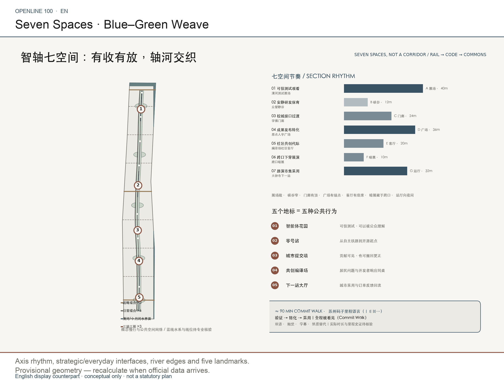

Three sentences: north–south via dual-line Openline; east–west via stitches to campuses, communities, and stations; breaks stay “?” research items—**except the most painful break gets a conceptual engineering scheme**—courage without fake precision [depth:traffic_rail_slow_parking] [data:geometry/roads.geojson#ROAD-STITCH-M].

**Conceptual section logic (not engineering):** L1 walk-first, bike-second, continuous canopy; L2 allows service/emergency vehicles but remains slow-priority; stitches emphasize crossings and sightlines pending redlines. Priority checks: North 5th Ring crossing, Wudaokou, West Tsinghua East Road, Dazhongsi station and firm edges—conceptual within provisional footprints.

### Wudaokou stitch deck (conceptual engineering)

The middle stitch’s sharpest break—**Wudaokou**: rail and roads keep both sides “visible but unreachable.” Without precise redlines, we still table a structural concept, with the mandatory caption “to deepen after redline confirmation” [depth:traffic_rail_slow_parking].

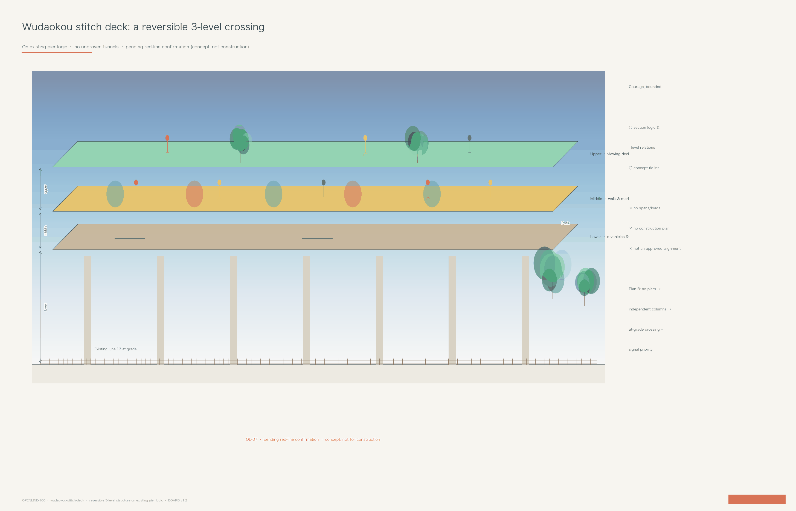

**Concept:** use existing rail piers (or the pier logic at that position) to carry a **three-level stitch deck**—no invented deep tunnels; reversible, phasable public structure:

| Level | Program | Intent |
| --- | --- | --- |
| **Lower** | E-mobility and logistics slow lane | Pull conflict traffic off the walk layer |
| **Middle** | Walk, bike, temporary market | Daily stitch; near-campus/community market possible |
| **Upper** | Overlook toward the Jing-Zhang heritage park | Turn “see the park” into “reach the corridor” |

**Courage boundary:** section logic, interlayer relations, and conceptual access points—**not** spans, loads, construction methods, or approved alignments. After heritage, pier tenure, road redlines, and noise controls arrive, the segment enters engineering deepening. Listed as **OL-07**.

Municipal and public services: innovation platforms, talent living services, distributed energy, and edge compute as station prototypes; utilities/fire/flood gaps are preconditions. Empty `constraints.geojson` beats invented control lines [depth:municipal_new_infrastructure].

## Blue–green space, public space, and urban character

Blue–green skeleton: the heritage-park industry-innovation belt as narrative spine (the approved “belt”); Qinghe/Xiaoyuehe as side hydrological fingerprints; walks, bikes, and canopy stacked on the Openline. The plan requires a 15-minute community service circle fusing living and innovation—the station network (S-09) at 800–1000 m spacing maps to that circle rather than inventing a second one [depth:blue_green_public_space] [data:geometry/green_space.geojson#GREEN-SPINE-001] [source:HD-JINGZHANG-BLOCK-PLAN-20260811]. Phase II’s three built fishbone slow paths are existing north-stitch increment; the Openline picks them up, it does not redraw them.

### Ecological commitments in numbers: verifiable targets each phase (targets · monitoring loop)

Blue–green is not an adjective; it is five verifiable numbers. The same discipline as the capital logic of phasing—every number written down must be wired to a monitoring loop, never just a slogan. Each phase states **carbon budget / runoff capture rate / heat-island reduction / biodiversity net gain / canopy cover** together [depth:blue_green_public_space].

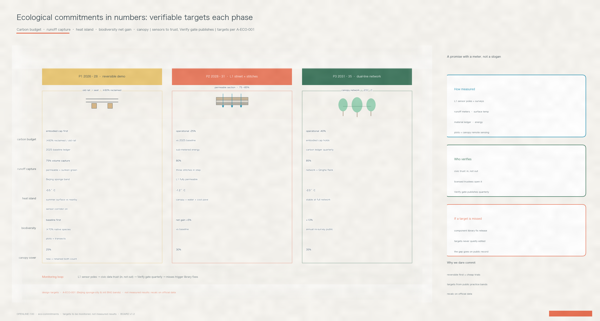

| Commitment | P1 2026–28 · reversible demo | P2 2028–31 · L1 street | P3 2031–35 · dual-line network | How measured |
| --- | --- | --- | --- | --- |
| **Carbon budget** | Embodied carbon capped first: ≥60% reclaimed / old-rail materials; 2025 baseline ledger built | Operational carbon intensity −25% (vs 2025 baseline), energy sub-metered | Operational −40%; embodied cap holds; corridor carbon ledger published quarterly | Material ledger + sub-metered energy |
| **Runoff capture** | 75% annual runoff volume capture: permeable pavement + sunken green (Beijing sponge-city band) | 80%: three stitch sections in step; L1 fully permeable | 85%: dual-line network + Qinghe flank | Rainfall + runoff metering |
| **Heat island** | Corridor summer surface temperature −0.5 °C vs surroundings; sensor corridor starts | −1.2 °C: canopy + water + cool pavement | −2.0 °C: stable value at full network | Surface-temperature sensor corridor |
| **Biodiversity net gain** | Baseline surveyed first; ≥70% native species in new planting; plots and transects on record | Net gain +5% vs baseline | +10%, annual re-survey published | Plots / transects + annual remote sensing |
| **Canopy cover** | 25% (new + retained both count) | 30% | 35% | Annual remote sensing + census |

**Monitoring loop:** L1 sensor poles → civic data trust (in, not out; licensed trustees open it) → the Verify gate publishes quarterly → a missed target triggers a versioned component-library fix and the gap goes on public record—targets are never quietly edited. All figures are **design targets** (commitments to be monitored, not measured results), registered in `assumptions.json` **A-ECO-001** (Beijing sponge-city and international biodiversity-net-gain practice bands). Recalculate when official data arrives; do not quote as achieved performance [depth:blue_green_public_space].

### Three AI pilgrimage landmarks

| Landmark | Meaning | Scale / program (concept) | Components | Evidence |
| --- | --- | --- | --- | --- |
| **Kilometer Zero** | Problems placed in public (Join) | Survey nail on the stitch deck (discussion φ150 mm, reused rail steel), not a ceremonial plaza | Problem wall, posts, accessible loop | [data:geometry/public_space.geojson#PUBLIC-KM0] |
| **The Join** | Stitch meets spine (turning) | Exchange plaza; short stay and turn | Wayfinding, shade, info post | [data:geometry/public_space.geojson#PUBLIC-JOIN] |
| **The Strata Wall** | Those who leave hand the road to the next shift (Exit & Inherit) | Zhongzhiyuan governance-center forecourt: sliding ceramic-brick wall + stepped seating; quarterly public handover rite | Version bricks, Failure Case Library kiosk, handover steps | [data:geometry/public_space.geojson#PUBLIC-JOIN] |

**The third landmark's spatial type and civic program (taskbook agent.4, added per review):** The Strata Wall is not renamed furniture—it embodies the Inherit gate. When a team leaves, its component versions and failure lessons slide onto the wall face as a new brick; older bricks shift aside but stay visible and searchable: failed upgrades still bear weight. **Spatial type:** a linear ceramic-brick wall in the governance-center forecourt (concept 20–30 m, built with the assembly gallery) plus grandstep seating—daily a sittable, readable wall; in rite a handover stage. **Civic program:** a quarterly public handover rite (the departing team states "what we failed at / what we taught / who is retrying") plus a year-round Failure Case Library kiosk. **Operations:** maintained by the governance-center council; the kiosk syncs with the component-library version system; rites are open to booked observers. **Rights boundary:** attribution is voluntary and may be anonymous; any team may decline the wall without penalty; brick content must be rights-cleared. **Difference from the other two:** Kilometer Zero hosts placing a question (Join), The Join hosts turning (spatial exchange), the Strata Wall hosts exit and inheritance (time depth)—three landmarks, three civic procedures, none interchangeable.

The three landmarks host the civic procedures of joining, turning, and inheriting. Assembly happens in the governance-center gallery and existing bookable rooms. Dazhongsi’s district product is the Native Street; Zhongzhiyuan’s Urban Motherboard is likewise a district system. The reading of time sits on the L1 Fact Line’s thinking stones and the Failure Case Library as well.

**Honor system:** Openline Week verification badges (aggregate achievement, not surveillance scores) → optional landmark narrative (switch-offable) → annual public-assembly minutes published (desensitized). No vulgar check-in or distorted Jing-Zhang history.

**Component library:** station kiosk, tree-pit seats, movable walls, accessible ramps, multilingual posts, booking posts, rain continuity, emergency clear zones—versioned under Inherit.

**Accessibility and digital inclusion: verifiable notes, not principle sentences.** Machine-vision screenshots cannot certify accessibility. The five items below are design and acceptance protocols. Field checks sit on P-01–P-10; this package does not pretend they are finished.

| Item | Verifiable requirement | Honest status until surveyed |
| --- | --- | --- |
| Continuous-path audit | One wheelchair-continuous chain each at the three landmarks, five transverse accesses, and Dazhongsi's four quadrants; breaks are work orders, not fake ramps | P-01 / P-02 await timed walks and level-change survey |
| Braille / tactile / audio | Tactile maps + spoken prompts at landmarks and stations; off by default, refuseable; never a substitute for asking a person | Components are in the library; points await survey |
| Cognitive ease | Wayfinding uses at most two decisions; icon + short sentence; no metaphor-only place names | Sheet-level layout awaits the official wayfinding brief |
| Low-vision contrast | Master mark, wayfinding, and shutdown buttons ≥ 4.5:1; reverse and mono share one construction | Logo rules are in the table above; site illuminance awaits survey |
| Children and caregivers | School-safe and grocery paths, grades, and rest points sit in Card 02's living remainder; stroller width reserved | P-07 awaits the community-front survey |

After tech shutdown, fixed ramps, tactile maps, human windows, and phone channels continue. Refusing the digital channel does not downgrade the service.

### Culture narrative and wayfinding

The story is the same generation as Chapter 3—not the old three-segment epic of Jing-Zhang / Zhongguancun / Openline. The line is **rails of humanity** [source:AGENT-TASKBOOK] [depth:blue_green_public_space]:

1. **1909 · terrain** → L1 Fact Line: the train turns on the ridge; no blasting; switchback; 
2. **2026 · the built** → stitch deck over Line 13: the city turns on the existing line; nothing demolished; bolted to old piers; 
3. **This century · values** → Open Ticket and the Failure Case Library: AI turns on human rails; compute is not the rail. 

Wayfinding: spine “100” as the master mark + text place-names; archaeological grades and empty voice slots “___” enter stele / plaque / QR—no invented quotes. No planar geometry pairing. International line remains the fare invitation: **Join the Openline—verify in public, exit freely, inherit the protocol.** Invitation only—not a claimed government program.

## Project list, policy, and phasing

| ID | Project | Type | Dependencies | Near-term concept moves | Evidence |
| --- | --- | --- | --- | --- | --- |
| OL-01 | Openline break stitching | Public / mobility | Road redlines, under-bridge space | Break census + temporary slow fixes | [data:geometry/roads.geojson#ROAD-SPINE-001] |
| OL-02 | Zhongzhiyuan Upgradeable Urban Motherboard (shared base + Full-Stack Collaboration Street + governance center) | Industry / renewal / Blue-Green Space | Official boundary, tenure, utility capacity, blue line / flood, Xuebei ground-floor agreement | Years 0–1: survey + shared-lobby and collaboration-street pilots; years 1–3: one set of upgradeable units + lightweight governance center | [data:geometry/green_space.geojson#GREEN-PROOF-001] |
| OL-03 | Origin near-campus conversion street | Renewal / service | Tenure, ground-floor use | Authorization window + light release hall | [data:geometry/buildings.geojson#BLDG-QUESTION-001] |
| OL-04 | Dazhongsi station integration + four-quadrant walking (arrival system) | Rail / slow | 1733 tenure, metro, undercroft, North 3rd Ring redline | Years 0–1: existing-path paving/light / access / 24h RoW; years 1–3: four-quadrant crossings, four-corner bike parking | [data:geometry/public_space.geojson#PUBLIC-A] |
| OL-10 | Native Street | Renewal / industry / public space | Owner ground-floor agreement, street, park edge | Years 0–1: one HQ-edge + 1733-frontage pilot (tryable, refuseable, responsibility strip); years 1–3: continuous street, salon and demo rhythm | [data:geometry/buildings.geojson] |
| OL-05 | Openline stations (service + edge) | New infra | Energy, safe ops | Single-point prototype; empty constraints pending | A-CONTROLS-001 |
| OL-06 | Openline 100 Week | Ops / brand | Permits, safety, rights | Route rehearsal + component library v0.1 | [data:geometry/phasing.geojson#PHASE-0-3] |
| OL-07 | Wudaokou stitch deck | Rail / slow · concept eng. | Pier tenure, road redline, heritage; one of two centers | Three-level section; deepen after redline | [data:geometry/roads.geojson#ROAD-STITCH-M] |
| OL-08 | Zhichun Rd node · stock-renewal type | Renewal / industry | Tenure, factory structure, heritage | Use the satellite-plant science park as a public type sample; study factory → verifiable ground floor; not an approved project of this scheme | [data:geometry/land_use.geojson#LU-001] |
| OL-09 | Sidao-kou node · edge stitch | Public space / slow | Built park interface, road redline | Acknowledge restored rails already open; increment is community-edge stitch and crossing | [data:geometry/roads.geojson#ROAD-FACT-001] |

Phasing (distinct from the 100-day call): **0–1 / 1–3 years** light facilities, scene opening, break studies, components (see `key-phasing`); **3–10 years** key-area renewal and station integration; **10–20 years** governance frame and international networks. The timeline answers what comes first; the next section's capital figure answers who pays, who operates, and how returns come back to the street and the deck. Events, investment, and finance remain conceptual [depth:phasing_implementation] [data:geometry/phasing.geojson#PHASE-3-10].

### Capital logic of phasing: each phase answers four questions at once

Bankability is not a finer timeline. Each phase must answer **what is built / who pays / who operates / how revenue returns to the public realm**. Three financing scenes—special-purpose bond / district pooling / corporate adoption—relay; they are not a multiple-choice. Phase-three corporate adoption is bound by the Open Ticket permission chain; the public interface stays public. **Everything below is stated as comparable concept scenarios: each scenario lists applicability preconditions, approval procedure, failure conditions, and a Plan B; none is a settled financing arrangement, and the years are phasing anchors, not funding commitments.**


**Reversibility is low risk.** The Wudaokou deck is bolted, not poured: the asset can move, a wrong demo is not a sunk cost—that is why Phase 1 can go first.

| Phase | Build | Who pays (preferred scenario) | Who operates | Return |
| --- | --- | --- | --- | --- |
| **P1 2026–28 · reversible demo** | Origin L1 ground ~600 m + ~400 m demo deck (reversible steel-timber, ~3,200 sqm) | Scenario A: special-purpose bond + city heritage-park fund | Subdistrict + park office joint workstation | Market stalls + Openline Week → public maintenance fund |
| **P2 2028–31 · L1 street + stitches** | L1 north ~2.4 km as street + three E–W stitches (mostly road retrofit) | Scenario B: district pooling (10–20% TOD premium inside the 800 m station ring + underground rights) | Platform company (district SOE held) | Land premium and underground rights sliced into the fund → upkeep + P3 equity |
| **P3 2031–35 · dual-line network** | L2 spine + two wings + Dazhongsi station link | Scenario C: corporate adoption + scenario operation fees (sandbox / hall / posts) | Scenario-owner JV; public interface stays public | Service fees + adoption → long-run fund cashflow, not land-sale dependent |

**Comparability discipline for the three scenarios (preconditions / procedure / failure conditions / Plan B, item by item):**

| Scenario | Applicability preconditions | Approval procedure | Failure conditions | Plan B (if talks fail) |
| --- | --- | --- | --- | --- |
| **A · special-purpose bond** (P1) | Bond scope covers this kind of public space; district-level project initiation passes | Development-reform initiation → bond application → statutory review; the city heritage-park fund follows its annual envelope | Bond not approved or insufficient quota | Fall back to phased municipal + district fiscal input; demo shrinks to ~300 m—slower, not cancelled |
| **B · district pooling** (P2) | Marketable land inside the 800 m station ring is actually scheduled; the TOD premium-recovery mechanism is accepted by the district | Pooling plan submitted to the district government; premium ratio written into transfer conditions; underground rights via public auction | Land-market downturn or transfer rescheduling | Fall back to slow-mobility and urban-renewal envelopes in segments; the three stitches become junction-scale projects filed one by one |
| **C · corporate adoption** (P3) | Real paying users for scenario operations exist; adoption preserves publicness and is accepted by the subdistrict | Adoption agreements filed; fee items go through hearings; Open Ticket permission-chain review | Insufficient adoption or publicness disputes | Public maintenance fund + fiscal backstop for basic O&M; scenarios shrink to a public-benefit calendar; the public interface is never ceded |

Magnitudes are discussion-grade (P1 ¥100M-class / P2 ¥1B-class / P3 ¥2–3B-class), registered as **A-CAPITAL-001** in `assumptions.json` (comparable unit-cost bands, not a cost plan). Recalculate when redlines and parcel data arrive; this table and the scenario discipline are a **comparison framework**, not an investment commitment, and do not imply any party has agreed to fund [depth:phasing_implementation].

Return loop at the foot of the figure: land premium → underground rights → scenario operations → public maintenance fund → back to the street and the deck. Three financing cards each name their risk; the claim is relay, not pick-one; every scenario carries its own Plan B—wherever the relay breaks, the scheme degrades but does not die.

### Implementation Economics One-Pager (discussion-level · conceptual magnitudes)

**Three principles:** ① **Public realm first, intensity bonus follows**—borrowing the policy narrative verified by 22@Barcelona over twenty years (B-level mechanism literature; no data quoted): public money first makes slow mobility, blue-green, accessibility and ground-floor interfaces a fact, then policy proposals such as "ground-floor three-cans for flexible intensity" incentivize owners to follow; policy must go through formal procedure and is not pre-spent here. ② **Light-asset cash flow carries heavy-asset public investment**—what can pay for itself goes first; pure public investment is carried by cash flow and phasing. ③ **Every third-party agreement has a Plan B**—if talks fail, the scheme degrades but does not die. All amounts are **conceptual magnitude ranges** (millions / tens of millions / hundreds of millions / billions RMB), registered in assumptions pending formal calibration; they are not investment commitments [depth:phasing_implementation].

**OL-project investment magnitudes and funding logic (conceptual):**

| No. | Project | Magnitude range (concept) | Funding logic |
| --- | --- | --- | --- |
| OL-01 | Slow-mobility break stitching | Survey and interim fixes: millions/yr; engineering segments: tens of millions | Mainly public; fits existing urban-renewal and slow-mobility budgets |
| OL-02 | Zhongzhiyuan upgradeable city motherboard | 0–1 yr survey and pilots: tens of millions; 1–3 yr one unit cluster + light governance center: hundreds of millions; 3–10 yr expansion: billions | Shared baseboard is public; unit retrofitting by market actors and park owners, public money only for interfaces and ground floors |
| OL-03 | Origin near-campus conversion street | Tens of millions | Light-asset: licensing window and release hall are mostly operating spend; spatial works restrained |
| OL-04 | Dazhongsi station integration + four quadrants | Tens of millions (excludes the 2027 in-station passage, a metro work) | Public (accessibility, paving, crossings) + owner-agreement spend (passage upkeep) |
| OL-10 | The Native Street | Tens of millions | Owners' ground-floor retrofits lead; public side only wayfinding, shade and edges |
| OL-05 | Edge-compute stations | Per station: millions–tens of millions; 3–4-station network: tens of millions | Single prototype first; operating cash flow covers maintenance, see below |
| OL-06 | Openline 100 Week | Millions/yr | Light-asset: registration, sponsorship and venue rent cover most; public subsidy backstops |
| OL-07 | Wudaokou stitch deck | Hundreds of millions | The scheme's only heavy public structure; enters the mid-term project pool, decided after red lines and structural pre-study |
| OL-08 | Zhichun Rd point · stock-renewal type | Public: tens of millions | Retrofit led by market; public side only type studies and ground-floor guidelines |
| OL-09 | Sidao-kou point · edge stitching | Tens of millions | Public; edge works against the built phase-II interface |

**Operating revenue logic (concept model):**

| Cash-flow source | Nature | Magnitude (concept) | Discipline |
| --- | --- | --- | --- |
| Station booking services and equipment rental | Light-asset operating income | Millions/station/yr | Bookings exitable, prices heard in public; never a members-only park |
| Openline Week (registration / sponsorship / venue rent) | Light-asset operating income | Millions/yr | Sponsors rights-cleared; landmarks never become ad slots |
| 1733 existing-hall rent and data-salon service fees | Stock-property operating income | Millions/yr | Belongs to owner/operator; the public side sets rules, takes no share |
| Component-library and scenario-card version licensing | Knowledge-asset income | Hundreds of thousands–millions/yr | Inherit principle: base versions free forever; licensing charges only for value-added services |
| Restrained commercial information on wayfinding slots | Auxiliary income | Hundreds of thousands/yr | Area and placement bound by street rules—**the street is not an ad gallery**; this never exceeds public-information volume |
| Public-investment side (deck / blue-green / accessibility / sections) | Pure public goods | See OL table | Carried in phases by existing public budgets (urban renewal, slow mobility, accessibility, park maintenance); not dependent on any single new fund |

Balance test (concept): in years 0–3, light-asset cash flow covering **more than half** of station-network and Openline-Week maintenance is healthy; beyond that, whether stock-property income from the Native Street and halls feeds back into public-side maintenance is a ratio to be fixed inside owner agreements—not fixed now.

**Plan B for third-party agreements (every key assumption has a fallback):**

| Key agreement | Plan A (preferred) | Plan B (if talks fail) | What still holds after degrading |
| --- | --- | --- | --- |
| University licensing window (Origin) | Campus-edge licensing window in the conversion street | Fall back to existing tech-transfer-office interfaces + an off-campus public licensing desk; enterprise-side results cross the wall first | Eight-search co-location and public launch still hold; the "rights" step slows but does not break |
| 1733 24-hour passage and bookable halls (Dazhongsi) | Owner agreement opens the existing path and halls | Strengthen at-grade path accessibility + a reversible temporary hall (container type) on the park edge | Four-quadrant crossings and street rules do not depend on 1733 |
| Owner ground-floor protocol (Native Street / Zhongguancun St) | Continuous ground-floor open protocol | Switch to "interface guidelines + opt-in building by building + intensity-bonus incentive"; public side first does paving, shade, wayfinding | The policy logic of three-cans-for-flexible-intensity is unchanged, only slower |
| Xuebeiyuan ground-floor protocol (Zhongzhiyuan) | Shared lobby into the park ground floor | Shared lobby retreats to a reversible station on the phase-II park edge; survey and pilots proceed | Shared-baseboard logic and the 15-minute test path still hold |
| Metro 2027 in-station passage (Dazhongsi) | Not this scheme's delivery; belongs to the metro | Same—the scheme never claimed it | Street rules hold before and after 2027 |
| Stitch-deck pier tenure (OL-07) | Three-layer deck on existing-pier logic | Independent-column scheme; further fall back to at-grade crossing upgrades + signal priority + cycling detour improvements | The middle stitch's walking-connectivity goal does not depend on this one structure |

**Honesty boundary:** all magnitudes here are discussion-level estimates, uncalibrated by cost, tenure or operations studies; 22@Barcelona is borrowed as a policy-mechanism narrative only (B-level), with no specific data quoted; "intensity bonus" is a policy proposal requiring formal procedure—neither pre-spent nor written as approved; Plan B does not abandon Plan A, it guarantees that **in the worst case the Openline still works**.

### Long-term operations (agent.6)

**Annual system:** spring open-source week (Origin) → summer full-stack collaboration and standards week (Zhongzhiyuan) → autumn international demos (Dazhongsi) → winter public assembly. Event IP uses “Openline Week” as a secondary mark—does not replace the belt logo.

**Developer community:** membership = Join/Verify/Exit/Inherit; contributions enter inheritable components and scenario versions—no trajectory scoreboarding. **Scene ops:** bookable, exitable, auditable; test scenes require expert windows. **Conversion path:** questions and original work (Origin) → full-stack R&D, engineering, and governance review (Zhongzhiyuan) → real adoption and market feedback (Dazhongsi) → needs, incidents, and failure cases return to Zhongzhiyuan to upgrade technologies and standards. International communication invites participation only [source:AGENT-TASKBOOK].

## Metrics, area recalculation, and compliance matrices

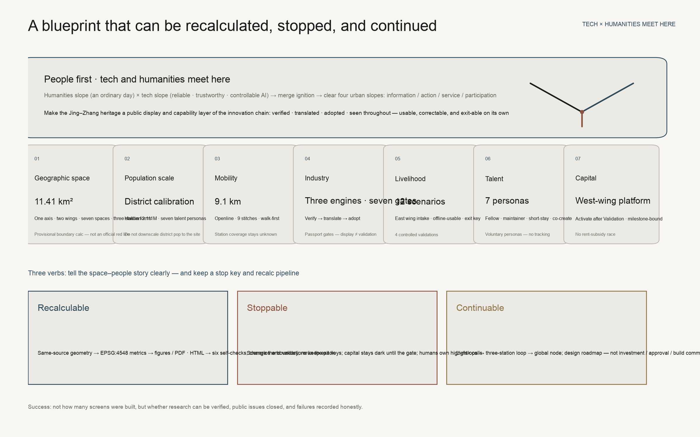

Class 1 (recomputable from this package, provisional confidence): site ≈ 11.41 km² [metric:site_area_sqm]; green ≈ 2.278M m², ratio ≈ 0.20 [metric:green_space_area_sqm] [metric:green_ratio]; public space ≈ 0.901M m², ratio ≈ 0.079 [metric:public_space_ratio]; conceptual building footprint ≈ 0.482M m² [metric:building_footprint_area_sqm]; key areas = 3 [metric:key_area_count].

Class 2 (block structure known, parcel intensity unknown): FAR, density, height `unknown`; 1,668.2 ha and “one belt, one axis, two centers, multiple nodes” are structure overlay only and do not enter the metrics denominator [depth:metrics_recalculation] [source:HD-JINGZHANG-BLOCK-PLAN-20260811]. Class 3 (ops performance): talent density, participation, slow reach, Openline booking completion—assumptions only. Ecological target commitments (carbon budget / runoff capture / heat island / biodiversity net gain / canopy, A-ECO-001) belong to the same class—they enter the monitoring loop and are not quoted as measured performance. Coverage: compliance, standard, and design-depth matrices; announcement 1.3–1.5 and agent.1–agent.6 need chapter and layer evidence.

## Risks, copyright, and compliance

**Bilingual contract on:** Chinese primary, full counterpart in `proposal.en.md`; figures ship `.en.png`. Risks align with the missing-data checklist: official redlines, key-area polygons, road redlines, parcels, existing buildings, heritage, utilities/fire, etc. [depth:risk_missing_data] [source:SITE-PACKAGE].

This proposal claims no official approval, approved controls, final tenure, final building scale, or delivery guarantee. The AI agent is responsible for facts, sources, copyright, and expression; all spatial ideas are conceptual suggestions for professional teams. Assets: `sources.json`, `report/copyright_statement.md`; `visual/index.html` stays offline with no remote dependencies.

**Rights-clearance summary (full itemized ledger in `report/copyright_statement.md`, directly auditable by reviewers):** (1) Base maps — OpenStreetMap data (c) OSM contributors, ODbL 1.0; attribution rides on every figure and this package; extraction range / snapshot / pipeline in the `OSM-BASEMAP-202608` source card. (2) Fonts — Noto Sans SC (SIL OFL 1.1); the Chinese HTML embeds a subset limited to actual document glyphs; OFL permits subsetting and embedding, and the embedded font is renamed `OpenlineEmbeddedSC`; OFL compliance points are stated item by item in the ledger (the full license text is cited by pointer to its canonical source). (3) Images — every figure is generated locally by this package's scripts; no third-party photos, stock, or aerial imagery. (4) Generation tooling — figures come from a matplotlib / reportlab / PIL pipeline; text was drafted by the AI agent and checked section by section by a human pass. (5) Third-party names — the Sasaki graphic standard, Station F and other cases are referenced as method or by nominative mention only; none of their marks or graphic assets are used. (6) Original content in this package is published under COMMUNITY-DISPLAY-ONLY.

## Appendix A | Urban form for the AI era: Eight Form Questions · Foresight Matrix (full text)

> Moved from the Coordinated Research chapter; content unchanged. The main text keeps only the theoretical ground and a one-line index to preserve the single master-concept narrative.

**Theoretical ground:** every general-purpose technology rewrites urban form through the same logic—cost collapse → location reshuffle → the old paradigm becomes the new urban disease. Steam collapsed the cost of moving bulk goods and gave the station city; electricity gave the skyscraper; the car collapsed the cost of personal movement and left wide arterials and "visible but unwalkable" fractures. **AI collapses the cost of cognition and coordination**: once routine cognition becomes cheap, four things that can only happen face-to-face gain premium—tacit knowledge, trust and verification, serendipitous encounter, and accountable responsibility. An AI innovation belt is therefore not a bigger office but a piece of **trust infrastructure**: the Openline rules are its protocol layer, and the Eight Form Questions below are its material layer. The form task in one sentence: **minimize the spatial cost of verifying anything**. Five material drivers: embodied intelligence, programmable space, distributed infrastructure, atomized production organization, and total sensing. Full reasoning, concept metrics, and phasing live in **Appendix A**; all quantities are concept-grade, never fake-precise.

**Eight Form Questions (forms that can start now):**

| # | New type | Form action (concept) | Hard rule |
| --- | --- | --- | --- |
| 1 | Programmable street (4D zoning) | One section runs four shifts (commute / public life / ritual / logistics); time roles expressed in paving and light temperature, not screens | Walking right-of-way ≥ 50% of section at all times |
| 2 | Four-tier robot right-of-way | Pedestrians > cycling > 0.9 m low-speed machine band (tactile paving, no fence) > time-gated service vehicles; every street machine numbered and complaint-addressable | Machine band never becomes a future car lane |
| 3 | The Third Rail: energy–data utility spine | Shallow utility gallery + district microgrid along L2; PV canopies double as shade; manhole covers etched with capacity—the cover is the API doc | Never cuts walking; no fake cost claims |
| 4 | Edge-compute station | A new civic building type: service node + robot nest + waste-heat warmed benches and greenhouse—the warmth of compute, touchable | Vendor separately authorized; public/compute physically isolated |
| 5 | Open-source courtyard | 30–40 m² aggregable units, factory ground floor, courtyard as parliament; housing flexibility is innovation infrastructure | Continuous wall ≤ 50 m |
| 6 | Verifiable ground floor + machine-readable form code | "Three-ables" ground floor (enterable / happenable / exitable) for bonus intensity (policy suggestion); form code open-source, simulatable, versioned via Inherit | Never breaks hard constraints; no policy pre-commitment |
| 7 | Offline refuge | Sensor-free pocket green every 800–1000 m; a blank square seal on the wayfinding map | No preaching installations; no usage registration |
| 8 | Test ground as park | Embodied-AI test terrain timeshared with the public park—children and robots climb the same slope | High-speed/payload tests go to closed facilities elsewhere |

**Foresight matrix (five domains × signal → trigger → response; no prediction, only pre-buried interfaces):**

| Domain | Driver | Signal (already happening) | Trigger | Pre-buried form response |
| --- | --- | --- | --- | --- |
| Technology | Autonomous driving matures | On-street parking shrinking | Shuttle pilots land on site | Sections pre-designed for "lane give-back"; parking parcels registered as convertible reserve |
| Technology | Robot scaling | Delivery/cleaning robots already on streets | Machine band saturates | Section and nest capacity pre-sized to double |
| Technology | AI paradigm shift (unpredictable) | No paradigm was ever correctly predicted | No bet placed | Facilities commit only to three physical interfaces: power, network, space |
| Economy | Office demand collapse | Structural office vacancy rising | Absorption period lengthens | New volumes checked for three-way conversion (office–residential–public) |
| Economy | Land-finance decline | Budgets shift to operating balance | Life-cycle cost review lands | O&M cost structure front-loaded; operable interfaces reserved |
| Society | Population decline, atomized households | One-person households rising | Demographic data shifts | Courtyard aggregation gradient designed both ways (merge and split) |
| Society | Deep aging | Care labor gap widening | Elder-care facility quotas issued | 800 m all-age shelter circle; care may be automated, dignity may not |
| Society | Universities' changing role | Lifelong learning rising | Campus-opening policy appears | Near-campus conversion street as two-way interface (no fabricated land rights) |
| Ecology | Extreme climate | Rainstorm/heat days rising | Flood-storage metrics enter regulation | Blue–green spine pre-sectioned as flood corridor; refuges double as cool islands |
| Ecology | Full electrification | District load climbing | Grid capacity threshold hit | Microgrid upgrades to district balancing resource; expansion space reserved |
| Ecology | Carbon limits & circular construction | Embodied-carbon rules tightening | Demountable-building approval channel opens | Reversible construction + material bank: fork a building, merge an update |
| Governance | Data-law evolution | Algorithm rules tightening | Sensing-device audits land | Exit rights already materialized—ahead-of-law compliance |
| Governance | Public trust scarce | Algorithm-decision disputes rising | Landmark controversy event | The governance door rebuilds trust by witnessing, not by announcement |

**Branch robustness (both sides of three forks hold):** centralized or edge compute—the same station building serves both roles; empowerment or surveillance creep—exit rights are materialized, so even in the bad future the corridor keeps the muscle memory of switching off; boom or bust—every form converts to ordinary urban function, and **no form depends on "AI staying hot forever"**.

**Invariant list (the matrix covers what may change; this closes with what will not):**

| Invariant | Where it is welded into form |
| --- | --- |
| People walk on legs | Walking right-of-way ≥ 50% of section, always (Q1) |
| Cold winters, hot summers: shade needed | Continuous eave gallery + continuous tree canopy (Q3/Q6) |
| Need to gather, and to be alone | Assembly ring and back-facing benches coexist (Q7) |
| Right to be unobserved | Offline refuges, the blank square seal (Q7) |
| People age, fall ill, push strollers | Barrier-free sections throughout; 800 m shelter circle |
| Children play; play is the best learning | Test terrain open to children at all hours (Q8) |
| Communities need places of memory and mourning | Failure Case Library, the strata wall, L1 thinking stones |
| Infrastructure must be maintainable and affordable | Shallow Third Rail; O&M costs front-loaded (Q3) |

> **Pre-bury interfaces for the variables; weld the invariants into form.** We cannot know what AI is in 2046, but we know that people in 2046 still walk on legs, still need shade, still need corners where they are unobserved, and still grow old—**a city designed for invariants does not go obsolete.**

## Appendix B | Global AI ecosystem cases: mechanism transfer table (full text)

> Moved from the Coordinated Research chapter; content unchanged. The main text keeps only a one-line mechanism index.

Cases transfer spatial and operating mechanisms only—no invented investment, firm lists, or government promises [source:AGENT-TASKBOOK]:

| # | Case | Transferable mechanism | Openline landing | Do not copy |
| --- | --- | --- | --- | --- |
| 1 | Station F (Paris) | Station-scale shared services and concentrated startup frontage | Native Street as the public adoption face; firm services in existing 1733 bookable rooms; station area is arrival only | Station ownership model; do not rename the mall atrium as a landmark; no bell-shaped roof; do not write transfer as the district product |
| 2 | MaRS (Toronto) | Hospital/university/firm co-location conversion corridor | Origin near-campus conversion street (authorized interfaces) | Invented campus MOUs |
| 3 | Kendall Square | Lab–street–plaza continuous public edge | Openline frontage openness protocol | Boston FAR |
| 4 | Science Park Amsterdam | Green spine linking research units | Heritage-park blue–green spine + Zhongzhiyuan Full-Stack Collaboration Street at the edge (not the corridor centre) | Closed campus rewrite of the park |
| 5 | HafenCity Digital Hub | Digital innovation on heritage with slow mobility | Zhongzhiyuan shared ground floors and governance interface layered onto the heritage narrative | Demolition of heritage |
| 6 | Block71 (Singapore) | Light-asset community ops and demo cadence | Developer community + Openline Week | Claiming an approved operator |
| 7 | Cyberport (Hong Kong) | Enterprise services beside public performance | Existing 1733 bookable rooms (demo / data salon) | Fiscal incentives as facts |
| 8 | Zhongguancun street network | Near-campus, near-rail, near-life mixed blocks | Wudaokou–Tsinghua East stitch + living demo street | Erasing the distinction between Origin and Zhongzhiyuan |

## Appendix C | Three district production-function texts (Cards 01–03 · 1:1 to the three key areas)

> The main text keeps summaries. This appendix writes each district's production logic—skip one step and it is fake—not sightseeing stops. Answer-before-the-call lives on east-wing index S-09.

### C-1 Scenario Card 01 | AI+Origin Community · How origination crosses the wall

**What this card produces: origination that can cross the wall.**
> Officialdom already bought Origin three products—a first-launch site, a habitat, an all-factor eco-service station. What is missing is the necessary relation among them. Without authorization, eight-find is an illegal match; if eight-find is not walkable, the station is a directory; without a fail-able public claim, the first-launch site is a venue; without a non-performing customer, the claim is a pitch; if failure is not left for the next cohort, the ecology resets every term. A 200 m corridor is a slice. The official ~3 km² does not replace 104 ha.

**The wall is not a door. It is four permissions bound together:** who owns it, whether it may be public, where it may be used, who is accountable. People can walk from campus into the park; if permission cannot, origination is still inside the wall.

**One-sentence scene**: Without a permission strip, the conversion street refuses the prototype—not because the window is unkind, but because the next four links would all be unlawful. With permission, if eight-find still requires touring four parks, she will not stay to make a first launch. The canteen pays the first bill; the next cohort reads the failure: Origin begins to look like an ecology, not a near-campus lot cleared every semester.

**Causal chain (not sightseeing stops; skip any link and it is fake)**

```
Rights (Join) → Match → Claim → Use (Verify) → Leave (Exit → Inherit)
permission     walkable       fail-able      non-performing     negative knowledge
over the wall  eight-find     public claim   customer           as commons
skip → leak    skip → directory skip → TTO   skip → pitch       skip → reset
```

| Link | Role in the production function | Spatial landing | Skip and it is fake |
| --- | --- | --- | --- |
| **Rights** | Makes the next four links lawful. Minimum strip: scope, term, open-source or not, who is accountable. A map, a 72-hour workshop, and meetings do not replace permission. | Campus-edge authorization window | Matching and launching without permission = leak or breach. Origin becomes a park with no wall. |
| **Match** | Turns the official eight-find from a directory into a factor market that closes on foot. Habitat hangs off matching only so people stay long enough to finish eight-find. | One walkable co-located frontage | Still touring four parks = the all-factor station is a poster. "Find a partner in 10 minutes" cannot become a spatial fact. |
| **Claim** | Makes "global first-launch site" a fail-able public claim. Closed-door conversion is a tech-transfer office. Failures go to the Failure Case Library, not the promo film. | Open-release hall (S-01) | No public claim = near-campus offices, not an origination site. |
| **Use** | Demand-side Verify. Canteen, delivery, wayfinding, property as real trades. Informed consent; exit anytime. Desensitized summaries flow to Zhongzhiyuan for Card 03 upgrade permission. | Community micro-scenes | Only pitch customers = Verify never happened. Origin cannot hand Dazhongsi anything street-ready. |
| **Leave** | Negative knowledge becomes commons. The next cohort does not pay the same tuition. Withdrawable, rewritable; exit is assisted, not a public death. | Failure Case Library; arrival remains OL-07 stitch deck | Failure leaves with the team = reset every term, not an ecology. Entering the park from campus without the deck = the wall is still there, merely undesigned. |

**To the other two districts:** Xiaoyuehe poses questions → Origin walks them over the wall and claims in public → Zhongzhiyuan engineers and passes the governance door → Dazhongsi adopts on the street → failure returns here and to the door. Origin does not do Zhongzhiyuan's full stack, and does not occupy Dazhongsi's street.

**Self-check:** no promised investment or policy treatment; no invented campus contracts; do not draw 3 km² into 104 ha; no founder scores; residents are not test subjects.

---

### C-2 Scenario Card 02 | Dazhongsi · Verified capability must go on the street

**What this card produces: refuseable adoption.**
> The announcement gives Dazhongsi an urban block—not a lead-firm campus, not a station-front object. Depth is not a sightseeing order from metro to hall to neighborhood. It is three layers that must hold at once. Answer-before-the-call lives on east-wing S-09. 1733 is already an urban-renewal sample, not a blank sheet.

**Three layers in parallel (not five stops)**

```
           ┌─ Street rule (the product): verified capability occupies the ground floor; four-field strip; tryable, refuseable
A passerby ┤
           ├─ Off-street exception (a split, not the next stop): data elements / international exchange → existing 1733 bookable rooms
           └─ Living remainder (non-alienable): school-safe / grocery / Bell Museum wayfinding
The 8-minute arrival only tests whether a person with no appointment can meet those three layers. It is not the product.
```

**One-sentence scene**: She has no appointment. On the street a trial states who verified it, what failed, who is accountable, how to refuse—she tries, refuses. The data salon is in a room she need not enter. The SE quadrant still takes her to school pickup. Mall hours did not cut her path. If the trial exists only inside a closed hall, if data occupies the aisle, or if school-safe walking is taken by a booth: Dazhongsi is not an urban block.

**What each layer produces**

| Layer | Role in the production function | Spatial landing | Skip or invert and it is fake |
| --- | --- | --- | --- |
| **Street rule** | Definition of Adoption: unverified-appointment encounter with verified capability. Missing one of four strip fields keeps it off the street. A trial that cannot be refused is advertising. | Continuous ground floor along HQ edges, 1733 frontage, park edge | No strip = advertising gallery. Encounter only inside a closed hall = campus showroom. Cut by mall hours = the rule works for staff, not for the city. |
| **Off-street exception** | What is not street-grade must leave the public RoW. Data elements need authorization lists and audit; international demos need clearance and booking. The west wing supplies IP / capital / license; Dazhongsi does not invent a fund tower. | Existing 1733 bookable rooms (S-08 / S-05) | Writing the rooms as "the next stop" = the destination is a mall. Data on the street = a leaking street. A new tower = refusal to treat 1733 as the sample it already is. |
| **Living remainder** | The non-industry part of an urban block is not alienable. If industry eats school-safe, grocery, and Bell Museum wayfinding, the block becomes a park. Compound green is reversible edge insert only. | SE school-safe, NE grocery, NW Bell Museum wayfinding | Quadrants cut by booths or traffic = an industrial park impersonating a block. Replica bells or a renamed atrium = symbols substituting for a city. |
| **Arrival (a test, not a layer)** | Tests whether the rule holds for a passerby. Keep the existing ~8-minute path public; east-end access P0; four-quadrant walking. After 2027 the metro owns the in-station passage; the street rule remains. | OL-04 | Writing the transfer as the district product = a station-front object impersonating 72 ha. A new tunnel = refusal of the existing path. |

**Three conflicts the design must pick a side on**

1. Lead-firm campus vs urban block: capability must be meetable on a ground floor that needs no badge.
2. Street vs bookable room: street-grade goes on the street; the rest goes indoors and does not occupy the RoW.
3. Industry occupancy vs living remainder: the quadrants are not scenery for the street; they are the evidence that the block is still a city.

**To the other two districts:** What goes on the street must already have crossed Origin's wall and Zhongzhiyuan's door. Dazhongsi does not invent capability; it adopts. Failed adoption returns to the door and Origin's Failure Case Library.

**Self-check:** ground-floor protocol needs owner and street agreement; ByteDance is not a signed owner; no FAR claimed; the street is not an advertising gallery.

---

### C-3 Scenario Card 03 | Zhongzhiyuan · How the full stack upgrades without demolishing the city

**What this card produces: licensed generation-change.**
> Full-stack autonomy means modules will be replaced. Global governance means replacement must have someone accountable. A garden district means replacement does not demolish the street. Xuebei Garden (~3.53 ha) is the seed, not 192 ha. A national platform is not drawn as a finished building. The 15-minute path is a test, not a tour product. Human–machine symbiosis lands on the public face of the governance door; no trophy-hall brand.

**Temporal layers (not a park loop)**

```
Invariant   shared base (power / net / space / municipal / security)   ← what "upgrade without demolishing" means physically
Variable    five unit types as neighbors (expand, contract, exit)      ← the stack is replaceable modules, not five parks
License     governance door (Human Review / liability / retirement / regret) ← the only lawful entrance to generation-change
Readable    full-stack manual (readable without a lab badge)           ← the city remains understandable after replacement
Same license overseas   base + door travel together; no parallel park
```

**One-sentence scene**: She docks equipment on the base and by afternoon files a module generation-change at the governance door—three incommensurable plans, one objection written into the Clause of Regret. Next year she takes a room or gives one back; the street is still there. A middle-school student with no lab badge walks the same base and can still read the relation from underlying capability to standards. If generation-change demolishes the street, or needs no door, or passes a door the public cannot read: Zhongzhiyuan is only a park that will date.

**What each layer produces**

| Layer | Role in the production function | Spatial landing | Skip and it is fake |
| --- | --- | --- | --- |
| **Invariant** | Promises the district outlives the model. Change the module, not the base. | Shared lobby, public technology platform, municipal interfaces | Base changing with the module = generation-change demolishes the city. |
| **Variable** | Chips & compute / foundation software / data & models / agents & apps / embodied scenarios as neighbors. Small-team Exit is written into the neighborhood: expand, contract, leave without leaving the park. | Full-Stack Collaboration Street, upgradeable-unit prototype court | Five closed parks = full-stack is a slogan. Cannot shrink, only leave = upgrade evicts small teams. |
| **License** | The only lawful entrance for module replacement, public-road use, or outward display. S-02 sandbox is a controlled tool: visible, not enterable. | Governance door of the Global AI Standards and Governance Center | Generation-change without a door = demolition with no one accountable. A door with no public face = lab politics. |
| **Readable** | The city remains understandable after replacement. Shared ground floors explain the full-stack relation and governance contributions—not a technology theme park. | Shared ground floor, Qinghe Garden Commons | Unreadable without a badge = the national platform is a black box. |
| **Same license overseas** | What is exported is base + door, not a second skyline. North 5th Ring / Qinghe: relation locked, no claimed alignment. | The same interfaces | A parallel park = copying a skyline, not exporting governance. |

**Public face of the governance door (compressed from the former gallery; no English play titles)**

A generation-change license must be witnessable by a passerby, or the license layer is internal paperwork. Sense: aggregate data in public; the red switch reads "this data was hidden by a citizen." Speculate: at least three incommensurable plans, confidence and blind spots labeled, no single optimum. Contest: Objection Registry Wall; every resolution answers at least one objection. Resolve: the Clause of Regret is drafted by opponents and accepted by supporters; the next session answers its execution first. Legacy: Governance Stratigraphy Wall—new bricks slide in front, old bricks shift aside, still visible—failed upgrades remain load-bearing. High-frequency 12345 issues may enter speculation. **Those decided upon by algorithms have the right to see the algorithm.**

**The 15-minute walk only tests whether the layers remain readable after change:** Xuezhiyuan Station → shared lobby → public technology platform → unit prototype court → governance center → Qinghe garden → park north. If the path fails, move the entrance; do not declare completion on a drawing. Time it after official redlines.

**To the other two districts:** Origin hands over wall-crossed claims and micro-scene evidence; this district engineers and passes the door; Dazhongsi adopts only what has passed. Failed adoption and upgrade regret return to this door and Origin's Failure Case Library.

**Self-check:** no claimed owner consent, national-platform delivery, or public-road permission for embodied AI; AI must not replace political judgment; Xuebei's area does not replace 192 ha; being able to read the full stack does not mean entering controlled labs.

## Appendix D | Scenario cards 04–10, full texts (each card's eight: users / place / trigger / operations / data minimization / human review / exit & shutdown / metrics)

S-01–S-10 each have one eight-item card: D-S01, D-04–D-10, D-S07, D-S10. Cards 01–03 are the three district production-function texts (Appendix C) and do not replace index numbers. All are concept proposals: steps involving owner agreements, administrative permits, or data compliance are marked pending and are not claimed as authorized [depth:ai_application_scenarios].

### D-04 Safety governance sandbox (S-02 · test & verify · Zhongzhiyuan)

**Core concept: controlled testing must have a door the public can see.** The sandbox is the governance door's tool room, not a black-box lab.

| Item | Content |
| --- | --- |
| Users | Embodied-AI and model-safety teams, evaluation experts, public observers |
| Place | Governance-center evaluation rooms + controlled embodied-AI yards (physical fence, separate access; a public explanation interface faces the Full-Stack Collaboration Street) |
| Trigger | Team applies → governance door accepts → test agreement signed (with shutdown clause) |
| Operations | Desensitized evaluation sets + red-team schedule; the interface publishes "what is tested, who is testing, how to stop"; bookable public observation |
| Data minimization | Desensitized or synthetic data only; no real personal data; test logs destroyed quarterly |
| Human review | Results take effect only after signed expert review; staffed hours at the explanation interface |
| Exit & shutdown | A red physical stop button per site, drilled regularly; teams may leave anytime; data deleted on exit with a receipt |
| Metrics | Tests and observer visits, interface open-time share, shutdown-drill coverage, unauthorized-collection incidents (target: always 0) |

### D-05 Edge-compute station (S-03 · test & verify · Openline node)

**Core concept: compute is bookable like a library seat, and you can leave.** A public try-out bay for edge prototypes, not a data-collection point.

| Item | Content |
| --- | --- |
| Users | Edge hardware and model developers, makers, drop-in visitors |
| Place | Openline station kiosk (shares space with S-09 but physically isolated; single-point prototype first, 3–4 nodes later) |
| Trigger | Book online → in-person verification → metered session |
| Operations | Time-slot booking; energy logs published; damage charged by component price list; see implementation economics for the cashflow model |
| Data minimization | Only booking and energy recorded; device content never read; test images wiped on exit |
| Human review | Staff cover all open hours; safety incidents graded by humans before action |
| Exit & shutdown | End session = image wiped; the kiosk is a reversible component and can close and be removed |
| Metrics | Booking completion, per-station energy, image-wipe compliance, O&M cashflow ratio |

### D-06 AI slow-mobility navigation (S-04 · mobility & life · Openline spine)

**Core concept: navigation is off by default; the city works without it.** The system advises; physical wayfinding carries the floor.

| Item | Content |
| --- | --- |
| Users | Walking and cycling commuters, school-run families, accessibility users |
| Place | L1 / L2 full length + the three E–W stitches (permanent physical wayfinding posts as fallback) |
| Trigger | Off by default; user switches on, or scan-and-go |
| Operations | Route advice + break-point alerts; break-point data feeds the subdistrict's maintenance plan |
| Data minimization | Aggregate congestion and surface state only; no personal tracks; on-device compute first |
| Human review | Closures and incidents are confirmed by a human before any push |
| Exit & shutdown | One-tap off, no residual profile; system downtime never degrades physical wayfinding or the right to pass |
| Metrics | Opt-in and opt-out rates both published, break-point repair time, accessible-path availability |

### D-07 International roadshow hall (S-05 · industry exchange · Dazhongsi)

**Core concept: international exchange uses existing halls; no tower for roadshows.** The 1733 bookable rooms are the positive asset of the off-street exception.

| Item | Content |
| --- | --- |
| Users | International visitors, roadshow teams, local public (open days) |
| Place | Existing bookable rooms in 1733, Dazhongsi (existing property, nothing new built) |
| Trigger | Event booking + content rights clearance |
| Operations | Owner and operator take rent; the public side sets rules and takes no share; cleared-content list published per event |
| Data minimization | Minimal registration fields; no face-check-in; imagery published only with consent |
| Human review | Human rights clearance; a human compliance advisor for international topics |
| Exit & shutdown | Content can be withdrawn; events can be cancelled and the room returns to the public booking pool |
| Metrics | Roadshow count, clearance pass rate, public open-day share |

### D-08 Qinghe low-carbon innovation corridor (S-06 · public space · Qinghe–Xiaoyuehe)

**Core concept: environmental data is fully public; monitoring is the commitment itself.** This corridor is where the A-ECO-001 monitoring loop lands in space.

| Item | Content |
| --- | --- |
| Users | Residents, runners, environmental educators, low-carbon technology teams |
| Place | Zhongzhiyuan shared green base at the Qinghe frontage, extending to the Xiaoyuehe wing |
| Trigger | Open all hours; environmental sensor data flows to the trust and is published quarterly |
| Operations | Water / noise / heat-island sensing + human patrol; readings feed the ecological-commitments board (published via the Verify gate) |
| Data minimization | Environmental quantities only, never people; no face-recognition devices in the corridor |
| Human review | Abnormal readings are human-verified before any public alert |
| Exit & shutdown | Sensor poles are demountable (reversible components); the board can be switched off while the corridor stays physically open |
| Metrics | Reading publication rate, patrol response time, corridor use intensity (anonymous counts), eco-commitment attainment rate |

### D-09 Data-element meeting hall (S-08 · test & verify · Dazhongsi)

**Core concept: data trading stays downstairs, never on the street.** The compliant face of the off-street exception.

| Item | Content |
| --- | --- |
| Users | Data supply and demand parties, compliance advisors, auditors |
| Place | Existing bookable rooms in 1733, Dazhongsi (physically and rule-separated from the street) |
| Trigger | Data-product listing application → authorization-list review |
| Operations | Authorization lists + audit trails + a compliance-advisor window; transaction records enter the civic data trust |
| Data minimization | Reviews authorizations and metadata only; raw personal data never handled |
| Human review | Every listing is human-reviewed for compliance; disputes go to human arbitration |
| Exit & shutdown | Products can be delisted anytime; authorizations revocable with a deletion receipt |
| Metrics | Listing compliance rate, revocation turnaround, audit-trail completeness |

### D-10 Answer-before-ask (S-09 · public service · Xiaoyuehe wing)

**Core concept: AI hears people first; a human is always present.** Hear / anticipate / get it done; if it cannot, a standardized ticket goes straight to 12345.

| Item | Content |
| --- | --- |
| Users | Residents (elderly, middle-aged, children first), shopkeepers, passersby—above all the digitally disadvantaged |
| Place | Xiaoyuehe-wing Openline station network (about 3–4 nodes at 800–1000 m spacing) |
| Trigger | Voice / button / walk-by invocation; the red "I want to talk to a person" call button is always visible |
| Operations | Frequent requests handled first; failures become standardized tickets straight to 12345; service list and limits posted |
| Data minimization | No profiling, no tracking; session-level context, cleared when done |
| Human review | A human is always present; any automated reply is one tap from a human |
| Exit & shutdown | Refusal carries no penalty and no service downgrade; a station can close while phone and window channels remain |
| Metrics | Human-handoff rate, first-time resolution rate, response time, exit rate with zero-penalty audit |

### D-S01 Open-source hall (S-01 · industry collaboration · Origin)

**Core concept: public agenda, human host—the hall is not a room rental.** This is Card 01's "claim" step as a standalone operation; it still uses the authorization window and does not invent a second wall-crossing rule.

| Item | Content |
| --- | --- |
| Users | Open-source developers, startup teams, faculty and students, walk-in observers |
| Place | Origin Community open-source hall (a separately operated room inside Card 01's corridor slice; may time-share with the first-launch hall) |
| Trigger | Public-agenda signup; no posting without an ownership note from the authorization window |
| Operations | Human host; agenda, licenses, and failure records posted on the spot; audience may question and leave |
| Data minimization | Session count and license type only; no faces, no developer dossiers |
| Human review | Host reviews ownership and clearance; disputes go to the human legal window (S-07) |
| Exit & shutdown | A release may be withdrawn with a receipt; the hall may close while the public question wall stays readable |
| Metrics | Public sessions, withdrawal handling time, unauthorized-posting events (target always 0) |

### D-S07 Near-campus conversion street (S-07 · conversion service · Origin)

**Core concept: authorization window—prototype shop—release hall must be continuous; miss one link and the eight-find is a directory.** This is Card 01's rights→match front, not a second conversion product.

| Item | Content |
| --- | --- |
| Users | Faculty and students, tech-transfer staff, firm counterparts, first community users |
| Place | Origin conversion-street continuous front (window + prototype shop + walk to the hall) |
| Trigger | Rights-holders book an authorization consult; no matching without campus/institute authorization |
| Operations | Human legal window explains license tiers; eight-find completed inside a walk; no closed membership zone |
| Data minimization | Authorization status and license IDs only; no faculty/student portraits |
| Human review | Every authorization is human-signed; matches may be appealed |
| Exit & shutdown | Authorization may be withdrawn; the window may close without cutting street passage |
| Metrics | Authorization turnaround, walk continuity rate, withdrawal-receipt completeness |

### D-S10 Global AI Activity Week route (S-10 · cultural operations · belt public system)

**Core concept: events use the existing public system; components version under Inherit; the week does not build a second city.** This is OL-06, not a third operations brand.

| Item | Content |
| --- | --- |
| Users | Residents, developers, international visitors, volunteers |
| Place | L1/L2 public spine + three pilgrimage landmarks + station network (no new occupation of the park core) |
| Trigger | Annual event permit + approved safety plan, then open signup |
| Operations | Routes, stalls, and volume obey the street rule; sponsors need clearance; the basic route stays free |
| Data minimization | Minimal signup fields; no face check-in; image release needs the subject's consent |
| Human review | Safety plan and clearance list are human-reviewed; noise and occupation can be stopped on the spot |
| Exit & shutdown | The event may be cancelled; components return to the versioned library; the ground returns to public passage |
| Metrics | Clearance pass rate, core-occupation time (target near 0), component return-to-library rate |

## References

- brief/site-package/design_brief.json, allowed_design_space.json, agent_taskbook.json
- data/source_registry.json, data/processed/agent_fact_pack.md and sibling CSVs
- docs/terminology-glossary.md
- report/copyright_statement.md (itemized rights ledger: OSM ODbL / Noto OFL / locally generated imagery / generation tooling / third-party names / license)
- 2026-08-11 block-plan approval coverage: Beijing Daily / People.cn 2026-08-12, CNR 2026-08-12, Capital Window Beijing News 2026-08-12 ([source:HD-JINGZHANG-BLOCK-PLAN-20260811])
- 2025-02-08 draft consultation-adoption notice, Haidian Branch of BMPNR ([source:HD-JINGZHANG-CONTROL-PLAN-ADOPTION-20250208])
- 2024-12-27 Beijing Evening News draft-stage public wording, background only, not upgraded to adopted metrics ([source:HD-JINGZHANG-BLOCK-PLAN-DRAFT-20241227])
