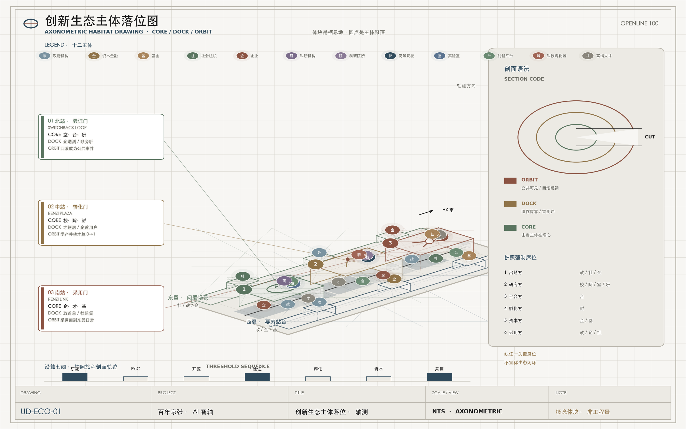
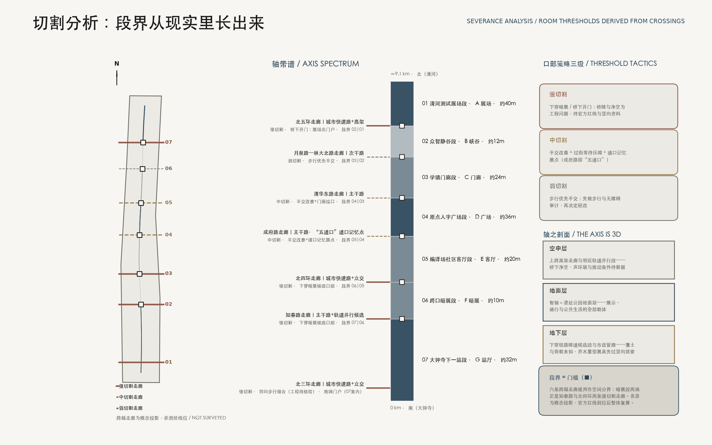
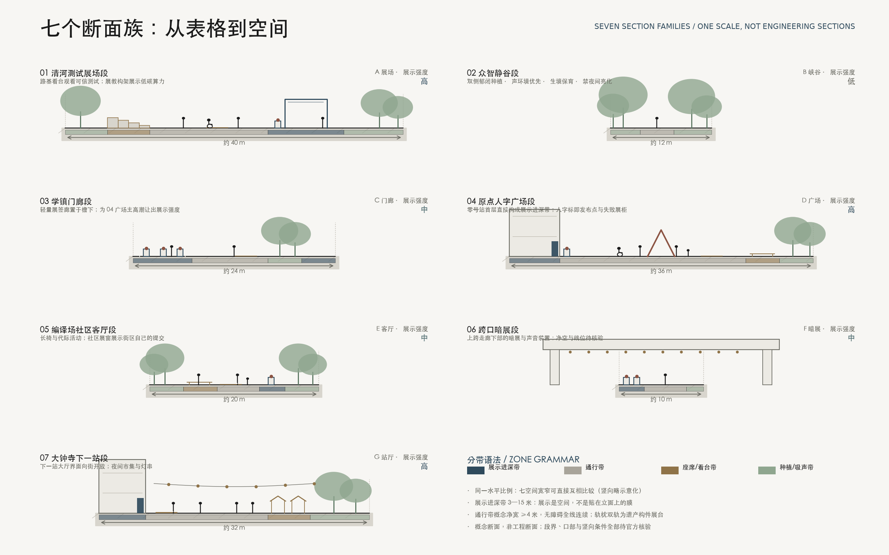
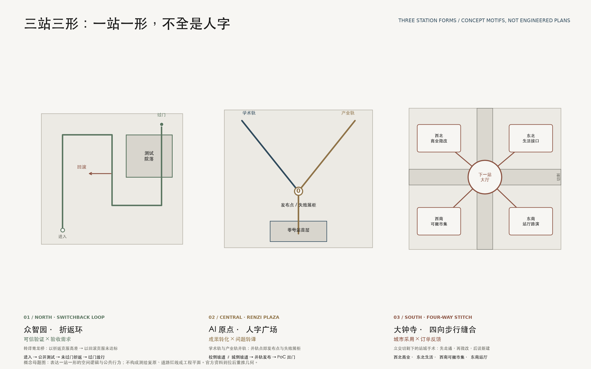
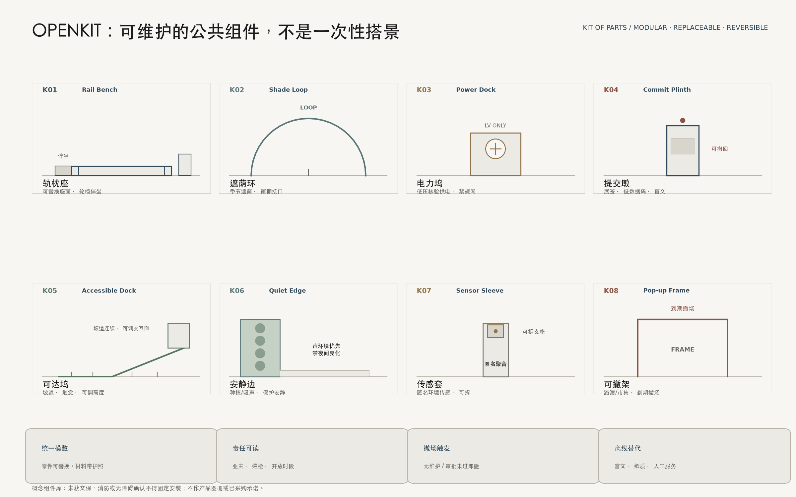

# 百年京张 · AI 智轴｜OPENLINE 100

> **百年京张 · AI 智轴——研究成果在这里被验证、被转化、被采用——全程被看见。**  
> **百年京张，下一百年的公共智能在这里共创。A Century of Jing-Zhang. The Next Century of Public Intelligence Is Co-Created Here.**

1909 年，京张铁路证明中国人能够自主勘测、设计、施工与管理一条干线；今天，海淀需要证明的不只是“能训练模型”，而是能把科研、代码、资本、机构与普通人的一天连接起来。[source:JZ-HISTORY] 铁路曾经连接地点，共创正在连接心智。本方案的核心理念只有一句话：**把京张铁路遗址公园做成创新链的公共展示层**——研究成果在这里 **被验证**（北站众智园可信测试），**被转化**（中站原点从 0 到 1），**被采用**（南站大钟寺进入城市日常与市场）；**被看见**是沿轴全程的公共展示层——展示必须服从验证，不以“已展示”冒充“已验证”。展示层因此不是橱窗，而是一条公共的“城市编译器”：研究成果从封闭园区进入公共验证，城市问题以可审计的方式变成项目，贡献者被看见，也保有撤回和更正的权利。

方案采用**双层命名法**：中文空间结构词是 **京张智轴**——轴意味着序列、锚点与仪式，是七段空间、三台引擎、五座地标和三站三形的空间骨架；国际机制品牌词是 **OPENLINE 100 / Jing-Zhang Open Intelligence Line**——OPEN 是开源、开放场景与开放城市，LINE 是铁路遗产线、创新链与公共生活线，100 既向百年京张致意，也把每一个方案视作可继续迭代的版本。空间讲纪念性与序列，机制讲开放与流动，两层各得其所。核心空间结构为 **一轴两翼、三擎七空间、三站三形**；核心制度结构为 **研究—确权/概念验证—开源—测试验证—孵化—资本—城市采用** 七级链路。[metric:axis_segment_count] [metric:renzi_motif_count]

## 设计依据与资料清单

本包以公开征集公告和面向智能体任务书为主控，以仓库中的 site package、来源登记和事实包为机器可读底座。[source:OFFICIAL-ANNOUNCEMENT] [source:AGENT-TASKBOOK] [source:SITE-PACKAGE] [source:SOURCE-REGISTRY] [source:PROCESSED-FACT-PACK] 对应标准为 [standard:PROJECT-OFFICIAL-ANNOUNCEMENT]、[standard:PROJECT-AGENT-OPEN-CALL-TASKBOOK]、[standard:MOHURD-URBAN-DESIGN-MEASURES]、[standard:MOHURD-CONTROL-DETAILED-PLANNING]、[standard:MNR-LAND-USE-CLASSIFICATION-GUIDE]、[standard:MOHURD-ARCH-DESIGN-DEPTH-2016]；既有条件诊断由 [depth:existing_conditions_diagnosis] 管理。

最重要的资料纪律是“不把缺口画成事实”。仓库当前没有可用于精确设计的官方总体边界、三处重点区测绘 polygon、控规强度、现状建筑、权属、道路红线、市政管线、轨道出入口和完整文保控制线。因此 [data:geometry/site_boundary.geojson#SITE-001] 与 [data:geometry/key_areas.geojson#PROV-KEY-001] 仅为仓库暂定约束，[source:BOUNDARY-SOURCE] [source:KEY-AREA-SOURCE]；本包以其完成拓扑验证和概念表达，所有派生量均注明 provisional-derived。公告中的约 43.6 平方公里统筹研究范围、约 11.4 平方公里总体设计范围和约 368.4 公顷重点区域总量是任务口径，不被本包的暂定 polygon 取代。

公开背景资料只承担“方向校准”，不承担场地现状证明。海淀 2025 年区级统计显示常住人口 311.1 万、地区生产总值 13,691.4 亿元、第三产业占 92.56%，有 92 家全国重点实验室、123 款已备案上线大模型和 1,568 家金融机构（2025 年数据均为初步数）；这些只说明海淀具有科研—产业—金融耦合的区级条件，不能按面积下推到本范围。[source:HAIDIAN-STATS-2025] 经济普查中的信息软件企业和就业亦不能等同于 AI 企业和 AI 就业。[source:HAIDIAN-ECON-CENSUS-2023] 北京市研发经费口径只作城市级参照。[source:BEIJING-RD-2024]

京张公园一期 2023 年开放约 2.5 公里、16.8 公顷，支持“遗产保护与公共空间并重”的背景判断，但不提供全线工程边界。[source:JZ-PARK-OFFICIAL] 清华园车站旧址存在依法公布的保护范围和建设控制地带；因本包未取得清权测绘 polygon，不自行数字化“伪紫线”，任何相邻节点必须在文保审查后定位。[source:QINGHUAYUAN-HERITAGE] 这套边界与缺资料治理同时写入 [assumption:A-BOUNDARY-001]、[assumption:A-CONTROLS-001]、[assumption:A-HERITAGE-001]。

## 三层范围工作框架

三层不是三张彼此无关的地图，而是由大到小的空间递进，并由一条协同主链贯穿：战略层看出题与组合，总体层看空间供给，重点区看下一道门槛。[depth:three_level_scope_framework]

**约 43.6 平方公里统筹研究层**回答“为什么是海淀、为什么是这里”：把高校院所、科研平台、企业、资本、医院、学校、社区和国际网络组织为开放创新共同体。它输出七级生态链、全球案例转译、活动网络和“三区两翼”协同逻辑，不生成伪精确地块结论。

**约 11.4 平方公里总体设计层**回答“城市如何承载”：以 OPENLINE 为公共主轴，把北部众智园全栈自主创新引擎、中部原点成果转化引擎、南部大钟寺城市采用引擎串联；西侧接入中关村科技服务、知识产权与资本，东侧接入小月河生活场景、社区和文化设施。暂定 polygon 复算面积为 11.41 平方公里，仅用于本次图层和指标的一致性检验。[metric:site_area_sqm]

**三处重点区域层**回答“第一步在哪里发生”：众智园做可信验证，原点做成果转化，大钟寺做城市采用——三站各有供给门与需求门，需求方不缺席。小月河东翼是需求总进水管，三站是需求在链上的三个落点。三处暂定约束为 [data:geometry/key_areas.geojson#PROV-KEY-001]、[data:geometry/key_areas.geojson#PROV-KEY-002]、[data:geometry/key_areas.geojson#PROV-KEY-003]，数量为 [metric:key_area_count]；几何不替代公告面积和法定边界。

三层共享一个“项目护照”：每个科研或城市问题拥有统一编号、技术成熟度、IP/开源选择、数据合法性、测试记录、碳与公共价值、融资状态和城市采购状态。战略层看组合，总体层看空间供给，重点区看下一道门槛。官方边界到位时替换约束并整体重算；控规、市政、权属到位时才进入专业方案和审批。[data:geometry/constraints.geojson#official-controls-not-available]

## 统筹研究范围产业与未来城市研究

### 从实验室到城市订单：七级开放创新链

1. **Research｜基础研究**：高校与国家实验室提出原理突破；OPENLINE Fellow 以公共讲坛和跨校配对降低学科壁垒。输出论文、基准、风险声明，不以论文数作为唯一 KPI。
2. **PoC & IP｜概念验证与确权**：中部“零号站”提供工程经理、知识产权、伦理、临床/教育/公共服务顾问；在开源、专利、商业秘密之间做可逆选择。门槛是需求方签字和最小可行验证方案。
3. **Open Source｜开源协作**：建立城市级仓库、维护者微资助、模型卡/数据卡和贡献者协议。开源并非无条件开放数据，而是代码、文档、接口和治理可审计。
4. **Validation｜可信测试**：北部智能体花园提供红队、能耗、无障碍、偏差与真实任务测试；高风险领域保持人类负责。未达到阈值就回滚，不以“已展示”冒充“已验证”。
5. **Incubation｜产业孵化**：原点社区用可拆分小单元、共享设备和 12 周产品冲刺支撑团队；退出标准是形成明确客户、合规路径和单位经济性，或及时停止。
6. **Capital｜耐心资本**：西翼“资本站台”组合概念验证券、场景首单、知识产权质押咨询、产业资本和长期基金；每笔资金绑定下一里程碑，不做园区租赁补贴竞赛。
7. **City Adoption｜城市采用**：医院、学校、商业和城市运营机构成为首批问题方。采用前公开影响评估、试点范围、申诉与退出机制；复用成功的接口和采购条款，而非复制个人数据。

七级链形成一个闭环：城市问题进入 City Pull Request，科研团队响应，测试结果进入可公开的“提交记录”，首单和投资帮助扩展，真实使用又形成下一轮问题。项目护照贯穿全链，避免团队在孵化器、医院、基金与政府之间反复填表。[metric:scenario_count] [metric:test_validation_scenario_count]

### 创新生态主体落位：十二类主体，不是三个园区

产学研融合在本方案中被扩展为 **政—资—社—企—研—教—台—孵—才** 的开放创新共同体。十二类主体——**政府机构、资本金融、基金、社会组织、企业、科研机构、科研院所、高等院校、实验室、创新平台、科技孵化器、高端人才**——必须在空间上可落位、在链路上可配对、在护照上可审计，而不是只出现在生态示意图的圆圈里。

落位规则是 **一轴三门 + 两翼供给 + 沿线微节点**：西翼要素站台承接政府服务、资本金融与基金；北站验证门承接实验室、创新平台与企业送测；中站转化门承接高校、院所、孵化器与人才；南站采用门承接企业市场与国际路演；东翼问题翼承接社会组织与真实城市场景；沿线微节点每 600–900 米提供日常相遇接口。项目护照强制登记出题方 → 转译方 → 专业服务方 → 测试方 → 孵化/资本方 → 反馈方；任一关键席位缺席，则不宣称生态闭环。资本席位仅在可信测试过门后激活。下图为概念落位，不表示现有入驻或签约。

### 七个全球案例，不复制建筑，转译机制

- **Boston / Kendall—The Engine**：把技术、IP、市场与融资准备组织成“蓝图”；海淀转译为驻场工程经理和阶段门，而非只提供办公桌。[source:CASE-KENDALL]
- **Toronto / MaRS**：与大学、医院邻接，中心内聚合实验室、创业企业与资本服务；海淀转译为医疗首用户、公共中庭和统一项目护照，不照搬机构治理。[source:CASE-TORONTO]
- **Paris-Saclay**：PoC、技术成熟化、原型、孵化与种子资本相连；海淀补上一条面向公众和城市订单的 OPENLINE。[source:CASE-PARIS]
- **Singapore / AI Singapore 100 Experiments**：真实问题方、工程团队、项目经理共同交付；海淀形成“100 个 City Pull Requests”，所有数据与采购另行履行程序。[source:CASE-SINGAPORE]
- **Helsinki / Maria 01**：旧医院改造为创业社区、保留多数旧建筑并分期扩建；海淀据此采用“先运营、再轻改、后建设”的遗产友好更新。[source:CASE-HELSINKI]
- **Seoul AI Hub**：市政府设立、大学与国家研究机构联合运营多节点研发基础设施、孵化和国际协作；海淀增加开放微资助与公共价值门槛，避免资源只流向头部企业。[source:CASE-SEOUL]
- **Tsukuba**：产学官金联盟、城市实证场与社会实施协同；海淀用沿线公共空间补足科学城常见的“机构强、街道弱”。[source:CASE-TSUKUBA]

共同启示是：世界级创新生态不是一座地标，而是 **强研究源 + 中立转译层 + 真实首用户 + 分层资本 + 可被信任的规则**。海淀的独特增量，是把中关村的技术密度与百年铁路的公共叙事合在一条可步行、可体验、可贡献的线上。[metric:global_case_count]

### 三大定位、五大功能与“三区两翼”协同回路

OPENLINE 100 对任务书原名逐项响应。**三大定位**是：以 Rail→Code→Commons 保存并再解释工程精神的 **百年京张文化带**；让医疗、教育、商业、交通、文化和治理场景进入普通一天的 **都市AI生活体验带**；把研究、开源、测试、孵化、资本和采用连成一体的 **AI融合创新带**。**五大功能**是：众智园承担 **AI全栈自主创新体系**，原点社区组织 **世界级AI创新生态**，沿线十二场景形成 **AI+场景赋能新范式**，小月河与街区接口承载 **智能化AI活力城市**，公开测试、模型卡、申诉和退出机制共同争取 **AI治理全球话语权**。[source:AGENT-TASKBOOK]

**三区两翼**不是五个孤岛：众智园AI自主创新加速区把项目推过可信测试门；AI原点社区完成PoC、确权、开源与孵化；大钟寺AI产业集聚区完成城市采用与订单回流。**中关村科技服务翼**提供知识产权、工程经理与全球要素服务，并在测试过门后衔接耐心资本；**小月河场景赋能翼**是需求总进水管——把社区、公共服务和真实城市问题送入 City Pull Request，再落到三站各自的需求门。协同主链为 **问题 → 转译 → 专业服务 → 可信测试 → 孵化/耐心资本 → 反馈**：小月河提出问题 → 原点组队转译（需求门：问题转译）→ 中关村翼补齐专业服务（工程/IP/伦理，资本不过早进场）→ 众智园可信测试（需求门：验收标准；未过门不进入孵化）→ 过门后孵化与耐心资本 → 大钟寺使用与运维反馈写回护照与问题池（需求门：订单与反馈）。每一步写回同一项目护照。

区域协同采用拟议的“**五地一协议**”，不虚构现有合作：与 **北纬社区**交换社区问题、维护者和轻量原型；与 **未来科学城**建立前沿成果的联合PoC接口；与 **怀柔科学城**建立科学成果公众翻译与跨学科驻留；与 **北京经开区**衔接机器人、智能终端等工程化与制造验证；面向 **京津冀**建立可移植的城市问题、评测与采购条款库。年度 Lab-to-City Forum 只发布共同问题清单、互认测试模板和下一年责任人；任何合作须由相应机构另行确认，不能从方案文字推定已签约。

### 名称与视觉规范：让品牌成为一套寻路协议

标志以两条平行轨道形成字母 **O**，一道赭色“提交线”穿过中点形成 **1**；在小尺寸只保留 O/1 结构，禁止复杂渐变和拟物机器人。主色 **Rail Ink #1A1A1A** 表示工业骨架与墨线层级，**Axis Steel #2F4A5C** 表示结构轴线与公共接口，**Signal Umber #8B5342** 只标示事件和可交互节点，**Ballast Paper #F7F6F3** 保持建筑设计图纸的素雅纸本感。命名执行双层规则：图纸与空间结构统一用中文 **“京张智轴”**（段落称“空间 / Space”，序列称“智轴七空间”），平台、护照与活动等机制层统一用 **“OPENLINE 100”**；节点采用“站 / Station”，项目采用“提交 / Commit”，年度成果采用“版本 / Release”，里程语言采用苏州码子与阿拉伯数字对照 [metric:milestone_count] [assumption:A-MOTIF-001]。导视必须有中英双语、高对比、触觉与非数字替代；正式使用前完成商标、域名、字体与苏州码子史料的清权核证。[assumption:A-BRAND-001] [assumption:A-ACCESS-001]

## 总体设计范围城市更新与控规深度城市设计

总体结构是 **一轴两翼、三擎七空间、三站三形、九个缝合接口**。[depth:overall_spatial_structure] 京张智轴不是被宣称为遗址线的工程中线，而是一条在暂定边界内部生成的概念公共主轴 [data:geometry/roads.geojson#ROAD-OPENLINE]。它以开发者步行、通勤骑行、无障碍漫游三种速度，把科研、居住、商业、公园和文化连成日常，不只服务节庆。

### 智轴不是走廊，是七个空间的序列

一条约九公里的轴，如果处处等宽，就只是通过性的走廊；智轴被设计为**七个命名段落（空间）的序列**，各有宽窄、断面族与主导公共行为，收放节奏本身就是设计 [metric:axis_segment_count] [data:geometry/public_space.geojson#PUBLIC-AXIS-SEG-01]。自北向南：

| 空间 | 段名 | 断面族 | 概念宽度 | 主导公共行为 | 展示强度 |
| --- | --- | --- | --- | --- | --- |
| 01 | 清河测试展场段 | A 展场 | 约40米 | 可信测试的公共观看与低碳算力展教 | 高 |
| 02 | 众智静谷段 | B 峡谷 | 约12米 | 安静研发、生境保育与声环境保护 | 低 |
| 03 | 学镇门廊段 | C 门廊 | 约24米 | 校园门区接口与轻量展签廊 | 中 |
| 04 | 原点人字广场段 | D 广场 | 约36米 | 零号站发布、人字广场与失败展柜 | 高 |
| 05 | 编译场社区客厅段 | E 客厅 | 约20米 | 社区共创、花园房间与代际活动 | 中 |
| 06 | 跨口暗展段 | F 暗展 | 约10米 | 跨越节点下部的暗展与声音装置 | 中 |
| 07 | 大钟寺下一站段 | G 站厅 | 约32米 | 国际路演、市集与夜间生活 | 高 |

高潮段与安静段交替：北端展场与中站广场各守一个主高潮，学镇门廊降为中强度接口，避免 03–04 连续高展示把中段唱哑；轴既能承载年度 OPENLINE Week 的万人流线，也能保住工作日清晨一个研究者的安静步行。七个空间的段界与断面不再停留在表格：下文先回答“段界为什么在这里”（切割分析），再回答“每段里面长什么样”（断面族深化）。

### 段界从哪里来：切割分析，而非任意划分

一条约九公里的轴首先是一条被城市横向切割的线。本方案先做**切割分析**：登记七条东西向跨越走廊 [metric:severance_crossing_count]，按**强**（快速路、高架、轨道并行候选）、**中**（主干路）、**弱**（次干路）三级分级，再把其中六条用作空间之间的“门槛”——低而暗的 F 暗展段两端正是知春路与北四环两条强切割走廊，成府路与清华东路界定原点人字广场段的南北两门（成府路即“五道口”道口记忆点），北五环桥下空间是静谷段与清河展场段之间的北门户，北三环走廊则是站厅段的南端门户。段界因此不是设计者的任意节奏，而是“被切割的必然”之上的再设计。概念口部策略分三级：强切割走廊优先研究下穿暗展与桥下开门，中切割走廊做平交改善与道口记忆展点，弱切割走廊以步行优先平交处理并先做步行审计。名录取公开常识级道路名称，位置为相对暂定重点区质心的概念投影，等级与口部方式全部待官方红线核验，不构成桥隧工程结论。[assumption:A-SEVERANCE-001]

**轴之剖面：这条轴是三维的。**智轴沿线可能同时存在三类竖向叠置——下穿铁路隧道候选段、上跨高架走廊与邻近轨道并行段；覆土深度、结构荷载、桥下净空与声环境条件均未入库。本方案据此作出两个保守的竖向设计约定：其一，乔木、重型展具与任何固定构筑的布置在深化阶段必须先通过竖向条件筛查；其二，强切割走廊两侧优先安排低敏感断面族（峡谷、暗展），把声环境代价最高的位置留给最不需要安静的功能。[assumption:A-SEVERANCE-001] [assumption:A-AXIS-001]

### 断面族深化：七张概念断面，一套分带语法

七个断面族被画为**同一水平比例**的概念断面，宽窄节奏可以直接互相比较 [data:geometry/public_space.geojson#PUBLIC-AXIS-SEG-01]。每一族由四类分带组成一套可检查的语法：**展示进深带**（3—15 米，展示是空间而不是贴在立面上的膜）、**通行带**（概念净宽不小于 4 米且无障碍全线连续）、**座席/看台带**与**种植/吸声带**；遗产构件（轨枕、双轨、站台边缘）作为展台直接嵌入分带，而非另建展具。七族各有构成逻辑：A 展场以路基看台面向可观看的测试场，B 峡谷以双侧郁闭种植保护安静与生境，C 门廊把展签廊置于檐下形成全天候界面，D 广场以零号站首层直接构成展示进深带并以人字标锚定发布点，E 客厅以长椅与社区展窗承载代际活动，F 暗展利用上跨走廊下部空间布置声音装置（净空与线位待核验），G 站厅以市集摊位与灯串面向夜间。断面为概念断面而非工程断面，纵向尺度略有示意化；段界、口部与竖向条件全部待官方资料核验。[assumption:A-AXIS-001]

### 公共展示层的三级语法

“展示层”是本方案的核心理念，因此展示必须是一套**可检查的空间语法**，而不是五个点状地标的偶然集合。语法分三级：**线**——沿智轴高展示强度段落的连续展示界面（展签、Commit 界面、可进入首层），双侧概念长度由 [metric:display_frontage_length_m] 复算；**面**——三站的室内外展场（智能体花园、零号站、下一站大厅）；**点**——OPENKIT 的 K04 Commit Plinth 与苏州码子里程碑 [metric:milestone_count]。设计导则建议高展示段的“展示界面率”（首层展示性界面长度占沿线首层界面总长的比例）以 40%—60% 为目标区间——该数值是导则建议，待地块深化校核，不是法定指标。展示的载体优先使用遗产构件本身：站台遗构即展台，道岔即互动节点，路基边缘即座席看台；贡献者对任何展示内容保有撤回与更正权。

### 两翼落图：轴的价值在横向缝合

**中关村科技服务翼**（西）与**小月河场景赋能翼**（东）不再只活在文字里：九个东西缝合接口按“三个战略缝合 + 六个日常缝合”分级 [metric:strategic_interface_count] [data:geometry/roads.geojson#ROAD-X-01]，每个接口标注它缝的对象。三个战略缝合是——**清河蓝绿缝合**（北，轴河交织的起点）、**原点校城缝合**（中，学院门区与知识毛细血管）、**大钟寺四向步行缝合**（南，轨道候选接口与立交现实的步行手术）；六个日常缝合分别接入蓟门社区、小月河东翼、编译场客厅、中关村服务翼、学镇门廊与众智园开门。战略缝合在深化阶段应做概念平面与无障碍流线设计，日常缝合先做步行审计。没有官方红线与站口资料时，全部接口只表达连接优先级。[assumption:A-TRANSIT-001]

概念用地采用拓扑完整分区 [data:geometry/land_use.geojson#LU-001]：AI研发与转化（0802）靠近三台引擎，教育科研（0804）形成近校接口，医疗创新（0806）承接低风险验证，科技服务与城市商业（05）布置在缝合节点，文化展示（0803）沿遗产叙事，人才生活（0701）与公共服务（0702）维持昼夜混合，公园绿地（1401）形成连续公共底盘。其作用是比较功能比例和相邻关系，不是改变法定地类。[depth:land_use_layout]

更新方法遵循“先读懂，再决定”：第一轮完成权属、年代、结构安全、碳排、业态、租约、历史价值和街道界面调查；第二轮以 **保留、微改、改造、拆除候选、新建候选** 五类评分；第三轮由业主、居民、文保、规划、消防和运营团队共同确认。缺资料时不把原型包络当现状建筑，也不给容积率、高度、密度或拆除量。[metric:building_footprint_area_sqm] [depth:development_intensity_controls]

城市界面采用“三条可检查规则”：沿 OPENLINE 首层每 60—90 米设置可进入界面（数值为设计导则建议，待地块深化）；活动时段之外仍保留厕所、饮水、座椅和通行；园区围墙优先用门廊、共享前院和预约通道打开，而非一次性全部拆墙。屋顶优先用于生物多样性、雨水和可逆活动，不以巨型屏幕制造“科技感”。建筑控制在取得法定条件后再形成图则。[depth:height_massing_character]

## 重点区域详细设计

三处重点区不是三个同质园区，而是七级创新链的三个不同门——**每道门都有供给脸与需求脸**。[depth:three_key_area_detailed_design] 一句话：**北站验得过，中站做得成，南站用得上**。概念建筑原型总数为 34 个 [metric:building_prototype_count]，仅用于检验小尺度组团、开放首层和公共空间关系。

| 站 | 供给门 | 需求门 | 谁来坐需求席 |
| --- | --- | --- | --- |
| 众智园 | 可信验证 | 验收需求 | 行业、监管、安全与标准方：要什么证据才放行 |
| AI 原点 | 成果转化 | 问题转译 | 高校、医院、学校、社区：真问题如何变成可做项目 |
| 大钟寺 | 城市采用 | 订单与反馈 | 商户、居民、访客：用了没有、哪里卡住、写回护照 |

小月河东翼仍是需求总进水管；三站是需求在链上的三个落点，不是“需求只在东翼、三站只管创新”。

### 01 北站｜众智园“全栈可信引擎”

定位为 **从自主技术到可信验证**。

- **供给门｜可信验证**：智能体花园作为可观看但不泄露数据的测试场；安静研发庭院、红队实验室、标准工作坊、低碳算力体验与访客中心。模型与机器人在受控环境验证，无障碍和能耗测试可被公众理解，敏感测试留在室内。
- **需求门｜验收需求**：行业、监管、安全与标准方在此提出“过门证据清单”——测什么、谁签字、未达标如何回滚。红队与标准工作坊是需求席，不只是实验室附属设施。

空间动作是“一条清河慢行界面、两个园区开放门、三类测试院落”。本站空间母题为**折返环 Switchback Loop** [data:geometry/public_space.geojson#PUBLIC-FORM-01]——把青龙桥人字形线路“以折返克服高差”的工程智慧，转译为可观看的验证环：项目进入、公开测试、未达标即折返回滚，回滚在空间动线上成为可见的公共事件，而不是被隐藏的失败。任何涉河、防洪、算力、电力和交通措施均等待官方条件，不承诺设施容量。[data:geometry/buildings.geojson#BLDG-001] [assumption:A-MUNICIPAL-001] [assumption:A-MOTIF-001]

### 02 中站｜北京 AI 原点“从 0 到 1 引擎”

定位为 **从高校成果到第一张城市订单**。

- **供给门｜成果转化**：零号站作为公共档案与成果发布入口，串联 24 小时协作客厅、IP/法务门诊、共享原型工坊、青年人才短居咨询和首层小店；校城之间用多个预约门与连续步行形成“知识毛细血管”。
- **需求门｜问题转译**：高校实验室、临床与教师、社区共创方把真实问题送入 City Pull Request；原点组队把问题转成可做 PoC、确权路径与开源/闭源选择——需求方在并轨点被看见，而不是事后补一句“用户调研”。

本站空间母题为**人字广场 Renzi Plaza** [data:geometry/public_space.geojson#PUBLIC-FORM-02]——学术轨与产业轨两条坡道自校、城两侧展开，在零号站前并轨为一个人字形广场：并轨点即成果发布点，也是失败展柜的位置，隐喻从 0 到 1 必须两轨同行。保留有价值建筑优先以轻改容纳工作室；任何拆改留结论需现状普查和权属协商。[data:geometry/public_space.geojson#PUBLIC-LM-02] [depth:retain_renovate_demolish] [assumption:A-MOTIF-001]

### 03 南站｜大钟寺“城市采用引擎”

定位为 **把验证过的成果送进城市日常与市场，并把使用反馈写回护照**。大钟寺不是白纸园区，而是被北三环走廊、立交与轨道候选接口切开的既有站城：商场、住区、公园绿带与交通核并存。本站不做“第三座创新园”，而做**站城手术**：先走通，再微改，最后才谈新建。

- **供给门｜城市采用**：国际路演、终端试用、智能原生业态进入既有商业与生活界面；可撤夜间市集与年度 Release。
- **需求门｜订单与反馈**：商户、居民、访客与采购方在此留下真实订单与运维反馈——用了没有、哪里卡住、是否挤占公共性；反馈写回项目护照与问题池，而不是停在路演掌声里。

**空间形：四向步行缝合 Four-Way Walk Stitch** [data:geometry/public_space.geojson#PUBLIC-FORM-03]。以**下一站大厅**为核，组织东南西北四条步行优先序，把被切开的四块重新连回可步行的一天：

| 方向 | 概念象限 | 空间动作 | 更新态度 |
| --- | --- | --- | --- |
| 西北 | 既有商业界面 | 打通至大厅的地面/桥下优先路径，首层打开与双语导视 | 保留为主，微改界面 |
| 东北 | 住区与生活服务 | 接社区入口、无障碍连续、日常采购与接送 | 保留肌理，补缝合口 |
| 西南 | 公园/遗址绿带 | 可撤展亭与夜间市集落在绿地边缘，不永久占绿 | 运营优先，可撤可退 |
| 东南 | 站厅与路演 | 下一站大厅、国际路演、终端试用与失败展柜 | 公共中枢，轻量可逆 |

空间动作压缩为三句：**一核**（下一站大厅）**—四向**（门到门步行优先序）**—两边界**（夜间噪声时段 + 公共绿地不可永久商业化）。轨道出入口、道路红线、净空与流量资料缺失时，四向只表达连接优先级，不画跨线桥、不定信号。[data:geometry/public_space.geojson#PUBLIC-LM-05] [assumption:A-TRANSIT-001] [assumption:A-MOTIF-001]

**采用如何发生。** 国际路演与终端试用放在大厅与东南象限；智能体产品进入西北既有店铺与东北生活服务，而不是另建封闭展厅——SC-05 小店副驾驶即落在此界面，商户是需求方而非被展示道具。AI 商业允许用户主动选择，不做人脸识别、敏感画像或强制推荐；数字资产展示只解释规则，不构成交易承诺。连续两季无人维护或挤占公共通行的活动即削减排期并撤场；投诉与停止理由进入失败展柜与护照反馈栏。

三个重点区共用项目护照、开放场景协议、测试报告格式和视觉系统，形成“一次登记、三站通行”；同时分别以**验证通过率 / PoC 入验证与首单 / 持续合作与反馈闭环**作为主 KPI，避免功能重复。**一站一形** [metric:renzi_motif_count]：北站折返环、中站人字广场转译青龙桥工程智慧；南站改为四向步行缝合，直面大钟寺的立交切割——三站形态不同，才避免“三个同构园区”。每一站首层设置“失败展柜”，展示被终止的项目及原因，让创新文化包含诚实停止，而不只是成功神话。

## AI 创新生态、人才画像与 AI+ 场景

### 七类人，一条线上的七种一天

1. **基础研究者**需要安静推演、跨学科同伴和不被迫创业的选择；由北站 Fellow 室与沿线讲坛响应。
2. **开源维护者**需要可持续经费、声誉、文档和冲突调解；由 Commit Wall、微资助和维护者驻留响应。
3. **初创团队**需要小单元、测试用户、法务/IP和第一张订单；由原点社区 12 周冲刺响应。
4. **临床/教师等专业者**需要工具辅助而非责任转移；由受控场景、人工复核和退出按钮响应。
5. **投资人与企业创新负责人**需要可比较证据、合规状态和真实客户；由项目护照和下一站大厅响应。
6. **社区共创与公共服务人才**（社区工作者、无障碍顾问、青年组织者）需要把居民、儿童与老年人的真实需求带进设计，并保留人工替代；由社区编译场、安静时段和纸质导览响应。
7. **全球访问者与数字游民**需要双语入口、短期工作、城市文化和可信合作对象；由 OPENLINE Passport 与年度周响应。[metric:persona_count]

### 十二张街区场景卡

每张卡都必须回答“谁负责、在哪里、用什么数据、谁复核、怎样停止”。公共空间载体见 [data:geometry/public_space.geojson#PUBLIC-DEVELOPER-WALK]，蓝绿载体见 [data:geometry/green_space.geojson#GREEN-OPENLINE]。

**SC-01 开源成果展示廊｜文化+科研。** 原点社区与开发者散步道；运营方联合高校维护者将论文、模型卡、代码和失败记录转成双语展签。只展示授权公开资料；贡献者可撤回、更正。KPI 是可复现成果率与公众理解度，连续两季无人维护则下架。

**SC-02 基层眼健康协作站｜AI+医疗，验证场景 A。** 北站室内受控空间与社区服务点；社区卫生机构负责，AI 只辅助筛查，医生复核并决定转诊，不自动诊断。采用最小化健康数据、分权访问和到期删除。海淀已有基层筛查与专家复核的公开案例可作机制参照，但不能宣称本项目疗效。[source:HAIDIAN-HEALTH-AI-2026] KPI 为复核完成率、转诊到达率和误差分层；临床安全阈值或申诉响应不达标立即暂停。

**SC-03 教师备课共创室｜AI+教育，验证场景 B。** 原点社区近校界面；拟议主体为学校/教研机构，教师选择工具并审阅输出，学生作品默认不进入训练，禁止自动评分处分和隐性情绪识别。海淀“人工智能+教育”政策用于校准试点、规范、安全与伦理方向，不证明方案获批。[source:HAIDIAN-EDU-AI-POLICY] KPI 为教师节省时间、材料错误率和学生/家长知情率；错误率或选择退出投诉越线即回滚。

**SC-04 无感但非监控的慢行助手｜AI+交通，验证场景 C。** 九个东西接口；拟议主体为交通/公园管理单位与无障碍组织，仅用现场人工观察、匿名计数或经批准的聚合传感识别断点，不调用个人轨迹、骑手/网约车/快递平台受限数据。输出是可解释的拥挤指数和无障碍工单，不执法。海淀区级慢行建设只作网络方向背景。[source:HAIDIAN-MOBILITY-2023] KPI 为断点修复时长、轮椅/婴儿车可达率；重识别风险或误报过高即停采。

**SC-05 小店经营副驾驶｜AI+商业，验证场景 D。** 大钟寺生活街；拟议主体为商业运营方与商户代表，商户自愿上传去标识订单汇总，系统辅助排班、库存和双语服务，不共享单店商业秘密，不做消费者敏感画像。KPI 为食物浪费、商户留存与人工纠错率；无法解释的差别定价或商户净收益下降则退出。

**SC-06 城市维修 Pull Request｜AI+治理。** 沿线座椅、照明、坡道和绿地；居民用文字/照片提交问题，运营人员合并重复项并公开处理状态。图像默认本地模糊人脸和车牌，AI 只分类不裁决。KPI 为关闭时长、重复报修下降和申诉满意度；工单偏差长期不改善则改回人工分类。

**SC-07 低碳算力热回收展窗｜AI+能源。** 众智园室内展示与清河界面；拟议主体为设施运维方与独立能碳核验机构，实时展示经核验的设施级能耗和余热去向，不展示企业敏感负载。KPI 是测量完整率和单位任务能耗下降；未取得能源、市政和消防条件时只做展教，不建设工程系统。

**SC-08 法律与知识产权门诊｜AI+专业服务。** 零号站；AI 整理公开法规与材料清单，执业律师/专利代理师出具意见，保密材料不进入通用模型。KPI 为转化周期、人工发现错误率和小团队可负担性；若用户误以为机器意见是正式法律意见则暂停界面。

**SC-09 城市记忆译码器｜AI+文化。** 清华园旧址外围依法可用空间与文化路线；用授权档案生成多语种、儿童版和无障碍版解说，历史事实由馆员审核。没有保护线 polygon 前不布置固定设施。[assumption:A-HERITAGE-001] KPI 为纠错响应和多版本使用，不以停留时长追踪个人。

**SC-10 公园安静时段与活动调度｜AI+公共空间。** 五个花园房间；用预约、人工观察和匿名声级数据协调跑步、儿童、展演与安静需求。系统给建议，值班人员决定。KPI 为冲突投诉和无活动时的自由可达性；公共空间被活动长期占用则削减排期。

**SC-11 国际访客协作护照｜AI+人才服务。** 三站服务台；拟议主体为国际服务办公室与社区运营方，访客自主选择语言、技能和可公开兴趣以匹配活动，不记录行踪，不做身份评分。KPI 为有效协作与本地维护者收益；匹配偏差或骚扰申诉越线即冻结账户并人工处理。

**SC-12 智能体花园红队赛｜共性安全测试基础设施。** 北站受控测试场；拟议主体为独立评测机构与众智园运营方，企业提交 agent，在虚构/合成任务中测试安全、无障碍、能耗和拒答，结果按预先协议分级公开。它不计入 A—D 四个应用验证场景。禁止用真实敏感业务数据作公开演示。KPI 是问题修复率和复测通过率；未修复重大问题不得进入城市试点。[assumption:A-AI-SAFETY-001]

**场景—空间—运营一览。** 该矩阵用于一眼检查“技术有没有落到街区、责任人有没有落到组织”，详细治理仍以上述场景卡为准。

| 场景 | 首要空间 | 拟议运营主体 | 首要停止条件 |
| --- | --- | --- | --- |
| SC-01 展示廊 | 原点—开发者散步道 | 高校维护者+沿线运营方 | 无维护或授权撤回 |
| SC-02 眼健康 | 北站室内+社区服务点 | 社区卫生机构 | 临床安全/申诉越线 |
| SC-03 教师共创 | 原点近校界面 | 学校/教研机构 | 错误或退出投诉越线 |
| SC-04 慢行助手 | 九个缝合接口 | 交通/公园+无障碍组织 | 重识别风险或高误报 |
| SC-05 小店副驾 | 大钟寺生活街 | 商业运营+商户代表 | 差别定价或净收益下降 |
| SC-06 维修 PR | 沿线公共设施 | 城市/公园运营方 | 分类偏差长期不改善 |
| SC-07 算力展窗 | 众智园室内 | 运维方+独立核验 | 未获能源/消防条件 |
| SC-08 IP 门诊 | 零号站 | 律师/专利代理机构 | 机器意见被误认正式意见 |
| SC-09 记忆译码 | 历史解释点 | 馆员/文化运营方 | 文保前置未满足 |
| SC-10 安静时段 | 五个花园房间 | 公园运营+社区 | 活动长期挤占公共性 |
| SC-11 协作护照 | 三站服务台 | 国际服务办公室 | 偏差/骚扰申诉越线 |
| SC-12 红队赛 | 智能体花园 | 独立评测+众智园 | 重大问题未修复 |

十二场景共同遵循数据最小化、目的限定、聚合优先、人工负责、可解释、可申诉和可退出；正式试点必须完成伦理/安全、采购、数据和专业审查。[assumption:A-PRIVACY-001]

## 用地、建筑规模与拆改留方案

概念用地近乎完整覆盖暂定边界，覆盖率由 [metric:land_use_coverage_ratio] 复算（残留约 1.77 m² 缝隙，不得记为 1.0），总面积为 [metric:land_use_area_sqm]。分类面积分别为研发转化 [metric:land_use_0802_area_sqm]、教育科研 [metric:land_use_0804_area_sqm]、医疗协同 [metric:land_use_0806_area_sqm]、科技服务商业 [metric:land_use_05_area_sqm]、人才生活 [metric:land_use_0701_area_sqm]、公共服务 [metric:land_use_0702_area_sqm]、文化展示 [metric:land_use_0803_area_sqm] 和概念公园绿地 [metric:land_use_1401_area_sqm]。这些值只描述本方案的功能配比，不代表现状或法定用地性质。[standard:MNR-LAND-USE-CLASSIFICATION-GUIDE]

建筑图层 [data:geometry/buildings.geojson#BLDG-001] 只包含三处重点区的原型包络，以小体量、首层可进入、院落共享和可逆改造验证空间关系；建筑基底概念面积见 [metric:building_footprint_area_sqm]。不把它用于推导全域建筑密度、容积率或建筑规模；[metric:floor_area_ratio]、[metric:total_floor_area_sqm]、[metric:building_density] 和 [metric:building_height_m] 明确为 unknown。

拆改留判定采用八项评分：历史文化、结构与消防安全、全生命周期碳、现有租户与可负担性、首层公共界面、功能适配、权属可行性、实施扰动。历史/社区价值高且安全可修复者优先保留；结构可用但界面封闭者微改；低效设备与空间可系统更新者改造；只有在专业鉴定、替代安置、碳比较和审批均完成后才进入拆除候选。原型建筑的 renewal_action 只是下一步研究动作，不是对任何现实建筑的判断。[depth:retain_renovate_demolish]

### 开发强度情景包络：不给数值，给可检验的方法框架

强度指标全部 unknown 是数据纪律，但“未知”不等于“未思考”。本方案给出三档**强度情景包络** [metric:intensity_scenario_count]，作为官方控规与现状数据到位后的第一轮敏感性测试框架，每档只定义假设、需要的数据与检验问题，不含任何容积率、高度或密度数值 [assumption:A-INTENSITY-001]：**S1 低扰动情景**假设以既有建筑轻改和运营为主、新建仅限小体量公共设施，需要现状建筑普查与结构鉴定，检验问题是“不新增开发量能否支撑三站运营的财务与空间需求”；**S2 织补情景**假设在权属清晰、无文保冲突的低效地块做中等强度织补，需要控规、权属与低效用地清单，检验问题是“织补量能否同时满足人才居住、孵化空间与公共界面三类需求”；**S3 雄心情景**假设在轨道候选接口周边做面向全球功能的较高强度开发，需要轨道站口、航空限高、日照与视廊条件，检验问题是“高强度是否以牺牲展示层的公共性与遗产尺度为代价”。三档情景共用同一套复算管线：任何一档在官方数据到位后，都应重新生成九个图层与全部指标，并把三档结果并排提交专业评审，而不是预先锁定一档。

## 交通、轨道、市政与公共服务设施

慢行网络由一条 OPENLINE、两条平行漫游线和九个东西缝合接口组成，共 [metric:mobility_link_count] 个概念连接，总示意中线长度见 [metric:road_centerline_length_m]；缓冲估算面积和比例见 [metric:road_area_sqm]、[metric:road_ratio]。其中 OPENLINE 自身示意长度 [metric:openline_length_m] 不能被解释为遗址公园官方长度。[depth:traffic_rail_slow_parking]

交通优先序为 **步行与无障碍—自行车—公共交通接驳—共享出行上下客—必要机动车**。九个接口按“三个战略缝合 + 六个日常缝合”分级管理 [metric:strategic_interface_count]：战略缝合（清河蓝绿、原点校城、大钟寺四向）在深化阶段做概念平面与无障碍流线设计，日常缝合先做步行审计再决定轻改或工程；没有官方道路红线和站口资料时，不画跨线桥、不决定信号、不计算站点 800 米覆盖，[metric:transit_station_coverage_ratio] 保持 unknown。正式深化以门到门步行网络、坡度、过街等待、夜间照明、非机动车停放和应急通道为审查对象，而不是简单圆形缓冲。

公共服务采用“沿线小站 + 专业机构后台”：厕所、饮水、母婴、安静室、急救和人工咨询保持非数字可用；IP/法务、人才、算力、临床和教育服务由具备职责的机构提供。端侧算力优先复用建筑和经核验电力，先测能耗、余热、噪声、消防和网络安全，再决定规模。[depth:municipal_new_infrastructure] 市政与能源资料缺失，所有管径、容量、分布式能源和地下空间建议留待专项；本方案不以“智慧杆”替代公共服务。

## 蓝绿空间、公共空间与城市风貌

蓝绿系统不是 AI 设备展销带，而是创新带最稳定的公共基础设施。[depth:blue_green_public_space] 本方案在暂定边界内生成一条连续概念绿脉、五个功能化“花园房间”和两条水界面绿带 [data:geometry/green_space.geojson#GREEN-OPENLINE]，复算概念绿地面积和比例为 [metric:green_space_area_sqm]、[metric:green_ratio]；公共空间由智轴七空间、开发者散步道、五个地标、三站三形与苏州码子里程碑共同构成 [data:geometry/public_space.geojson#PUBLIC-DEVELOPER-WALK]，面积与比例为 [metric:public_space_area_sqm]、[metric:public_space_ratio]。16.6% 与 2.5% 仅为本设计图层占暂定边界比例，绝非法定绿地率或公服指标。海淀区级公园绿地和 500 米覆盖数据不下推到场地。[source:HAIDIAN-GREEN-2024]

**花园房间从装饰升级为功能单元。**五个房间各有明确的生态或社会职能：雨洪调蓄花园承接周边硬质汇水（容量与溢流路径待水文专项）、生境与传粉花园保育本土植物并禁止夜间亮化、安静阅读草坪实行声环境优先、儿童与代际游园错时共享、展演与测试草坪承载可撤走展亭与户外可信测试。房间不是均布的椭圆装饰，而是智轴节奏中“慢下来”的原因。

**轴河交织：清河与小月河是第二系统。**智轴是南北向的人工序列，清河（北）与小月河（东）是这片场地真实的自然骨架。本方案以两条概念水界面绿带表达“轴—河”交织意图 [metric:water_interface_count]：北端清河界面带是战略缝合接口的落点，也是众智园慢行界面与低碳算力展教的滨水看台；东侧小月河界面带是场景赋能翼向社区渗透的绿色通道。两条水系的官方蓝线、防洪与生态条件均未入库，本方案不数字化伪蓝线，任何驳岸、断面与生态措施待官方数据与水务专项。[assumption:A-WATER-001]

### 五个 AI 朝圣地标：不是巨物，是五种公共行为

1. **智能体花园 Agent Garden**：在北站把可信测试变成可理解的公共观看；室内敏感、室外可解释。
2. **零号站 Station Zero**：连接 1909 的自主工程与今天的开源起点；记录论文、PoC、失败与再出发。
3. **城市提交墙 City Commit Wall**：荣誉不按融资额排序，而按可复现贡献、公共价值和维护年限；自愿上墙，可撤回、可更正。
4. **共创编译场 Commons Compiler**：居民问题、开发者响应、运营工单在同一张桌上公开“编译”，不让参与沦为意见收集。
5. **下一站大厅 Next Station Hall**：大钟寺四向步行交汇的城市采用中枢，发布年度 Release，承接路演与可撤夜间生活，也承接商户/居民订单反馈与停止项目理由。[metric:landmark_count]

五个地标均为概念、可逆公共设施，须在专业审批后指定运营、维护、安全与无障碍责任人；审批未通过或连续两个运营周期无人维护，即撤场并恢复为通用公共空间。

**OPENKIT 公共空间组件库**让地标可以维护而不是一次性搭景：K01 **Rail Bench** 以轨枕尺度组织可替换座面与轮椅伴坐位；K02 **Shade Loop** 提供季节遮荫与雨棚接口；K03 **Power Dock** 只提供经专业核验的低压供电/充电，不开放不受控网络；K04 **Commit Plinth** 同时容纳实体展签、低数据二维码和盲文；K05 **Accessible Dock** 提供连续坡道、触觉定位与可调交互高度；K06 **Quiet Edge** 用种植和吸声界面保护安静活动；K07 **Sensor Sleeve** 仅为经批准的匿名环境传感预留可拆支座；K08 **Pop-up Frame** 支持可撤展、路演和市集。全部采用统一模数、可替换零件、材料护照和离线替代；每件标注业主、巡检周期、开放时段和撤场触发器，未获文保、消防或无障碍确认不得固定安装。

### Rail → Code → Commons：约 90 分钟概念导览

导览节拍与创新链同构：**被验证 → 被转化 → 被采用**，**全程被看见**。北段在智能体花园读懂可信测试与回滚（验证，而非先看热闹）；中段经依法开放条件下的清华园历史解释点到零号站，看科研如何变成可转化的 PoC、开源与失败档案（转化）；沿开发者散步道与 Commit Wall，贡献过程全程可见（看见）；于 Commons Compiler 参与一场 City Pull Request；南段抵达 Next Station Hall，看一项成果如何进入城市日常与市场（采用）。全程以**苏州码子里程碑**作里程语言 [metric:milestone_count]——京张铁路历史标识传统中的中国数码（〡、〢、〣……）逐公里落位，配阿拉伯数字对照、盲文与语音替代；这是任何其他线性公园都复制不了的独家寻路系统，正式采用前须完成史料核证。[assumption:A-MOTIF-001] 约 90 分钟仅为概念策展节奏，实际时长须在 official 线位、入口与步行网络核验后确定。儿童线以“找道岔”游戏叙事，无障碍线提供触觉图、字幕、手语预约和纸质册，夜间线只点亮必要节点，保护居民与生态。任何固定设施靠近文保对象前须取得测绘和专业审批。[source:QINGHUAYUAN-HERITAGE]

城市风貌采用“工业骨架、花园底盘、数字点火”：保留轨枕尺度、铆接、站台边缘等抽象比例，不仿古造假；植物与透水地面形成日常背景；钢青与赭色仅在入口、提交和状态变化处点亮，忌霓虹铺满。禁止满街屏幕、机器人雕塑和持续声光互动。可访问性、低扰动和真实贡献本身就是未来感。

## 更新项目清单、实施政策与分期计划

十二个项目包形成“能先做的运营、必须等待的工程”两张清单，总数 [metric:renewal_project_count]。[depth:renewal_project_list]

1. **P01 OPENLINE Brand Commons**（牵头：拟议品牌与社区运营组）：名称、开源视觉资产、双语导视；前置为商标/字体清权；KPI 为节点识别与无障碍通过；侵权或误导即替换。
2. **P02 City Pull Request 平台**（拟议运营主体+公共问题方）：公开问题、匹配团队、记录状态；前置为数据治理与采购；KPI 为有效关闭率；重大隐私事件即停服。
3. **P03 零号站轻改试点**（原点片区产权方+运营方）：成果发布、IP门诊、维护者空间；前置为权属、结构消防、文保核查；KPI 为 PoC 进入验证比例；长期低使用则回退为通用公共空间。
4. **P04 智能体花园 Beta**（众智园机构联盟）：合成任务红队与公众展教；前置为安全协议；KPI 为修复复测率；重大安全问题不开放。
5. **P05 九个缝合接口审计**（规划/交通专业团队）：先做步行与无障碍审计，再决定轻改或工程；前置为红线、站口和流量；KPI 为断点关闭率；官方红线或安全条件未核实则止于审计。
6. **P06 五个花园房间**（园林运营+社区）：安静、运动、儿童、测试、展演错时共享；前置为生态和公园管理条件；KPI 为自由开放时长；商业活动挤占即缩减。
7. **P07 Commit Wall 贡献协议**（开源基金会型主体）：自愿、可撤回、可更正的荣誉制度；KPI 为维护持续性与画像多样性；争议无法调解则暂时下架。
8. **P08 AI+医疗/教育受控试点**（专业机构）：实施 SC-02/03；前置为专业伦理、数据、采购和知情程序；KPI 以安全与人类质量为先，触线即停。
9. **P09 大钟寺下一站大厅与四向缝合**（商业/产业运营方+交通/公园+商户居民代表）：大厅轻改、四向步行审计、可撤夜间市集与订单反馈席；前置为轨道、消防、噪声、权属；KPI 为门到门可达改善、成交后持续合作、反馈写回护照率，不以客流单项评价。
10. **P10 低碳算力可行性专项**（能源/算力/消防团队）：测负荷、余热、碳、噪声；数据不足时只做专项，不先建机房；无净环境收益或触碰消防/能源边界则不工程化。
11. **P11 OPENLINE Passport 无障碍导览**（文化+无障碍组织）：数字与纸质并行；KPI 为任务完成率和纠错时长；任何强制注册立即取消。
12. **P12 公共价值仪表盘**（独立评估组）：按季度发布项目护照、失败和纠错；前置为指标协议；KPI 为数据完整与外部复核，不用单一排名激励造数；数据不可独立复核则停止排名并标记 unavailable。

三期范围完整覆盖暂定边界 [data:geometry/phasing.geojson#PHASE-001]，复算见 [metric:phasing_area_sqm]、[metric:phase_1_area_sqm]、[metric:phase_2_area_sqm]、[metric:phase_3_area_sqm]。[depth:phasing_implementation] **Phase 1 / 2026—2027 概念时段**先做品牌、公开治理、问题平台、步行审计和可撤场活动；**Phase 2 / 2028—2030 概念时段**在程序完备后建设三站公共空间与受控试点；**Phase 3 / 2030 后概念时段**依据评估扩展国际节点和专业工程。时段是设计路线图，不是政府投资、审批或建设承诺。[assumption:A-OPS-001]

### 八个年度运营产品：从节庆客流到持续贡献

年度日历含 [metric:annual_program_count] 个产品族：**A01 一月 Openline Call**（输出问题池）；**A02 三月 Maintainers-in-Residence**（输出驻留团队）；**A03 四月 Rail→Code 春季 Commit Walk**（输出文化导览）；**A04 六月 Trust Test 可信智能体赛**（输出测试报告）；**A05 九月 OPENLINE Week**（输出年度发布）；**A06 十月 Global Lab-to-City Forum**（输出国际合作清单）；**A07 每月 Station Night / 失败复盘夜**（输出失败档案）；**A08 全年 City Pull Request + Microgrants**（输出问题关闭记录与微资助账本）。年度周只占全年运营的一周，其余 51 周靠问题、驻留、微资助、测试与首单形成闭环。

拟议治理采用“四席圆桌”：公共部门/产权与专业机构、科研与企业、社区与公共利益组织、独立安全与审计，各有否决边界；运营收入可来自合规场租、会员服务、企业挑战、基金与公共服务采购，但公园通行、基础展览和问题提交保持免费。季度 Release 公布投入、项目阶段、失败、纠错与公共价值；连续两期无维护者、无真实需求方或安全不达标的项目退出资源池。这样“朝圣地”不靠一座奇观，而靠每年可回来的共同仪式和可信记录。[assumption:A-INDUSTRY-001]

## 指标体系、面积复算与合规矩阵

本包所有空间量由同一组 EPSG:4326 交换几何投影到 EPSG:4548 复算，避免正文、地图和 HTML 各说各话。[depth:metrics_recalculation] 暂定总体面积 [metric:site_area_sqm]；用地覆盖 [metric:land_use_coverage_ratio]；概念绿地 [metric:green_space_area_sqm] / [metric:green_ratio]；概念公共空间 [metric:public_space_area_sqm] / [metric:public_space_ratio]；原型建筑基底 [metric:building_footprint_area_sqm]；概念道路 [metric:road_centerline_length_m] / [metric:road_area_sqm] / [metric:road_ratio]；三处重点区复算合计 [metric:key_detailed_design_area_sqm]，分项为 [metric:key_area_1_calculated_sqm]、[metric:key_area_2_calculated_sqm]、[metric:key_area_3_calculated_sqm]。这些是“对提交几何已知”，不是“对真实场地已知”。

内容指标同样可核查：分区单元 [metric:land_use_parcel_count]、建筑原型 [metric:building_prototype_count]、慢行连接 [metric:mobility_link_count]、切割走廊 [metric:severance_crossing_count]、地标 [metric:landmark_count]、场景 [metric:scenario_count]、测试验证 [metric:test_validation_scenario_count]、画像 [metric:persona_count]、全球案例 [metric:global_case_count]、项目 [metric:renewal_project_count]、活动产品 [metric:annual_program_count]。所有 known 指标在 `metrics.json` 中列公式、来源、置信度和假设；缺官方条件的强度、高度、站点覆盖和客流保持 unknown，其中 [metric:existing_daily_footfall] 明确不使用未经清权的商业热力图或个体轨迹。

九个数据文件均可独立检查：边界 [data:geometry/site_boundary.geojson#SITE-001]、重点区 [data:geometry/key_areas.geojson#PROV-KEY-001]、用地 [data:geometry/land_use.geojson#LU-001]、建筑 [data:geometry/buildings.geojson#BLDG-001]、交通 [data:geometry/roads.geojson#ROAD-OPENLINE]、绿地 [data:geometry/green_space.geojson#GREEN-OPENLINE]、公共空间 [data:geometry/public_space.geojson#PUBLIC-DEVELOPER-WALK]、约束 [data:geometry/constraints.geojson#official-controls-not-available]、分期 [data:geometry/phasing.geojson#PHASE-001]。其中空约束层是诚实的“未取得”，不是遗漏。

合规矩阵覆盖公告 1.3、1.4、1.5 和 agent.1—agent.6 的全部必答项；标准矩阵对应六项依据，深度矩阵逐项检查现状诊断、三层范围、总体结构、用地、强度、形态、拆改留、交通、市政、蓝绿、重点区、项目、分期、复算和风险。[depth:overall_spatial_structure] [depth:land_use_layout] [depth:development_intensity_controls] [depth:height_massing_character] [depth:traffic_rail_slow_parking] [depth:municipal_new_infrastructure] [depth:blue_green_public_space] [depth:renewal_project_list] [depth:risk_missing_data]

## 风险、版权与合规说明

本方案的首要风险不是“想象不够大胆”，而是把想象误写成事实。[depth:risk_missing_data] 边界、控规、现状建筑、权属、交通、文保、市政、专业设施、产业、运营和品牌风险分别登记于 assumptions；官方数据到位后的响应不是局部改图，而是重新生成九个图层、指标、七图、HTML 和 PDF。`floor_area_ratio` 等 unknown 项不参与审定结论。任何后续专业深化均需规划、建筑、景观、交通、市政、文保、消防、能源、法律、临床/教育伦理和无障碍团队共同完成。

隐私与安全底线是：不采集不必要数据，不以个人轨迹换取漂亮热力图，不让模型替医生、教师、执法者或规划审批者负责；所有高风险场景必须有人工复核、申诉、审计和技术/运营退出。[assumption:A-PRIVACY-001] [assumption:A-AI-SAFETY-001] 未取得片区级人口、企业、客流和 OD 数据，因此不做区级数据按面积折算，不编造“人才密度”或经济收益承诺。

正文、图面、标志、示意图、HTML 与 PDF 为本次方案原创生成；地图只使用仓库暂定几何，不嵌入远程地图瓦片、图库图像、企业 Logo 或个人数据。PDF 可搜索中文文本仅嵌入采用 SIL OFL 1.1 的 Noto Sans SC 字形子集；方案主图 PNG 的系统字体已栅格化且不分发字体文件。全球案例只以文字转译机制并链接一手页面，未复制其图片或版式。外部公开资料的版权归原权利人，本包按引用和评议需要提供链接与有限事实摘要；许可、字体与商标状态见 `report/copyright_statement.md`。本包采用 `COMMUNITY-DISPLAY-ONLY`，不声称官方批准、法定规划、资金落实或实施授权。[assumption:A-EXTERNAL-CASES-001]

## 参考资料

资料分为五组，并严格按用途分级。第一组是征集主控文件：官方公告、面向智能体任务书与仓库 site package，用于确定三层范围、六项任务、成果深度和机器校验规则。[source:OFFICIAL-ANNOUNCEMENT] [source:AGENT-TASKBOOK] [source:SITE-PACKAGE] 第二组是边界与数据治理：来源登记、事实包、暂定总体边界和三处重点区，只支撑本次概念生成、拓扑自检与后续替换流程，不能升级为法定红线。[source:SOURCE-REGISTRY] [source:PROCESSED-FACT-PACK] [source:BOUNDARY-SOURCE] [source:KEY-AREA-SOURCE]

第三组是京张铁路、公园与文保的一手公开背景，用来建立 Rail→Code→Commons 叙事和保守的文保前置，不用来推导工程线位。[source:JZ-HISTORY] [source:JZ-PARK-OFFICIAL] [source:QINGHUAYUAN-HERITAGE] 第四组是海淀区与北京市统计、政策和公开案例，用于判断区域创新、教育、医疗、绿地、慢行与研发环境；所有数据保留行政尺度和年份，不按面积折算。[source:HAIDIAN-STATS-2025] [source:HAIDIAN-ECON-CENSUS-2023] [source:HAIDIAN-EDU-AI-POLICY] [source:HAIDIAN-HEALTH-AI-2026] [source:HAIDIAN-GREEN-2024] [source:HAIDIAN-MOBILITY-2023] [source:BEIJING-RD-2024]

第五组是七个国际案例的机构一手页面，用于比较成果转化、真实问题验证、遗产更新、多节点治理和国际化机制；方案只转译制度，不复制图片、规模、投资或政策承诺。[source:CASE-KENDALL] [source:CASE-TORONTO] [source:CASE-PARIS] [source:CASE-SINGAPORE] [source:CASE-HELSINKI] [source:CASE-SEOUL] [source:CASE-TSUKUBA] 每条外部公开资料的 URL、发布者、访问日期、具体用途和局限，以及每条仓库资料的本地路径与用途，均登记在 sources.json；版权和许可边界见 report/copyright_statement.md。

### 机器可读证据索引

以下索引确保评审 Agent 可从叙事回到来源、标准、深度、图层和指标；它不是用引用数量替代专业判断。

- 来源：[source:OFFICIAL-ANNOUNCEMENT]、[source:AGENT-TASKBOOK]、[source:SITE-PACKAGE]、[source:SOURCE-REGISTRY]、[source:PROCESSED-FACT-PACK]、[source:BOUNDARY-SOURCE]、[source:KEY-AREA-SOURCE]、[source:JZ-PARK-OFFICIAL]、[source:QINGHUAYUAN-HERITAGE]、[source:JZ-HISTORY]、[source:CASE-KENDALL]、[source:CASE-TORONTO]、[source:CASE-PARIS]、[source:CASE-SINGAPORE]、[source:CASE-HELSINKI]、[source:CASE-SEOUL]、[source:CASE-TSUKUBA]、[source:HAIDIAN-STATS-2025]、[source:HAIDIAN-ECON-CENSUS-2023]、[source:HAIDIAN-EDU-AI-POLICY]、[source:HAIDIAN-HEALTH-AI-2026]、[source:HAIDIAN-GREEN-2024]、[source:HAIDIAN-MOBILITY-2023]、[source:BEIJING-RD-2024]
- 标准：[standard:PROJECT-OFFICIAL-ANNOUNCEMENT]、[standard:PROJECT-AGENT-OPEN-CALL-TASKBOOK]、[standard:MOHURD-URBAN-DESIGN-MEASURES]、[standard:MOHURD-CONTROL-DETAILED-PLANNING]、[standard:MNR-LAND-USE-CLASSIFICATION-GUIDE]、[standard:MOHURD-ARCH-DESIGN-DEPTH-2016]
- 深度：[depth:existing_conditions_diagnosis]、[depth:three_level_scope_framework]、[depth:overall_spatial_structure]、[depth:land_use_layout]、[depth:development_intensity_controls]、[depth:height_massing_character]、[depth:retain_renovate_demolish]、[depth:traffic_rail_slow_parking]、[depth:municipal_new_infrastructure]、[depth:blue_green_public_space]、[depth:three_key_area_detailed_design]、[depth:renewal_project_list]、[depth:phasing_implementation]、[depth:metrics_recalculation]、[depth:risk_missing_data]
- 指标：[metric:site_area_sqm]、[metric:land_use_area_sqm]、[metric:land_use_coverage_ratio]、[metric:green_space_area_sqm]、[metric:green_ratio]、[metric:public_space_area_sqm]、[metric:public_space_ratio]、[metric:building_footprint_area_sqm]、[metric:road_centerline_length_m]、[metric:road_area_sqm]、[metric:road_ratio]、[metric:openline_length_m]、[metric:phasing_area_sqm]、[metric:key_detailed_design_area_sqm]、[metric:key_area_count]、[metric:land_use_parcel_count]、[metric:building_prototype_count]、[metric:mobility_link_count]、[metric:landmark_count]、[metric:scenario_count]、[metric:test_validation_scenario_count]、[metric:persona_count]、[metric:global_case_count]、[metric:renewal_project_count]、[metric:annual_program_count]、[metric:axis_segment_count]、[metric:display_frontage_length_m]、[metric:renzi_motif_count]、[metric:milestone_count]、[metric:strategic_interface_count]、[metric:severance_crossing_count]、[metric:water_interface_count]、[metric:intensity_scenario_count]、[metric:land_use_05_area_sqm]、[metric:land_use_0701_area_sqm]、[metric:land_use_0702_area_sqm]、[metric:land_use_0802_area_sqm]、[metric:land_use_0803_area_sqm]、[metric:land_use_0804_area_sqm]、[metric:land_use_0806_area_sqm]、[metric:land_use_1401_area_sqm]、[metric:phase_1_area_sqm]、[metric:phase_2_area_sqm]、[metric:phase_3_area_sqm]、[metric:key_area_1_calculated_sqm]、[metric:key_area_2_calculated_sqm]、[metric:key_area_3_calculated_sqm]
- 假设与边界：[assumption:A-BOUNDARY-001]、[assumption:A-CONTROLS-001]、[assumption:A-LANDUSE-001]、[assumption:A-EXISTING-001]、[assumption:A-TRANSIT-001]、[assumption:A-HERITAGE-001]、[assumption:A-MUNICIPAL-001]、[assumption:A-PARK-001]、[assumption:A-AXIS-001]、[assumption:A-SEVERANCE-001]、[assumption:A-MOTIF-001]、[assumption:A-WATER-001]、[assumption:A-INTENSITY-001]、[assumption:A-PRIVACY-001]、[assumption:A-AI-SAFETY-001]、[assumption:A-INDUSTRY-001]、[assumption:A-BRAND-001]、[assumption:A-OPS-001]、[assumption:A-ACCESS-001]、[assumption:A-EXTERNAL-CASES-001]

**一句话交付：让百年铁路不只被纪念，让下一百年的公共智能在这里被共同提交。**
