# 何以京张：The Openline 100

## 总体概念：三章并进——路与票 · 资本闭环 · 以人为轨

评委对照图版，应读到同一代叙事，而不是开篇一套、图上另一套。本方案用三章并进回答「何以京张」——路怎么用、钱怎么转、人怎么当轨。任务书要的空间结构、三区两翼、场景卡仍是支撑，不另立第四个统领 [source:AGENT-TASKBOOK] [depth:overall_spatial_structure]。

| 章 | 一句 | 图版 |
| --- | --- | --- |
| **路与票** | 路是 Openline，票是 Open Ticket；铁路没有票制只是工程 | `open-ticket-governance` |
| **资本闭环** | 每期同时回答建设 / 出钱 / 运营 / 回流；可逆即低风险 | `phasing-capital` |
| **以人为轨** | 1909 的「人」字写线路形状；这个世纪的「人」字写价值归属 | `heritage-soul` |

### 第一章 · 路与票

**如果评审只记住一件事：路是 Openline，票是 Open Ticket。** 1909 京张争的是路权自立；2026 续写的是数字时代的市民路权。铁路没有票制只是工程，有了票制才是公共服务。Openline 不是一条新画的红线，而是这条**路本身**——空间 + 数据 + 参与三重载体。AI 是路上跑的车，不是票的客体。一带不缺车，缺的是谁可以上路、如何核验、如何下车、如何把路交给下一班。

### Open Ticket 制度剖面：四层 × 四道闸

票制是全线同一套闸，不是第三套 Logo，也不是已定制度。治理概念图，机制待与街道 / 数据主管部门共建。

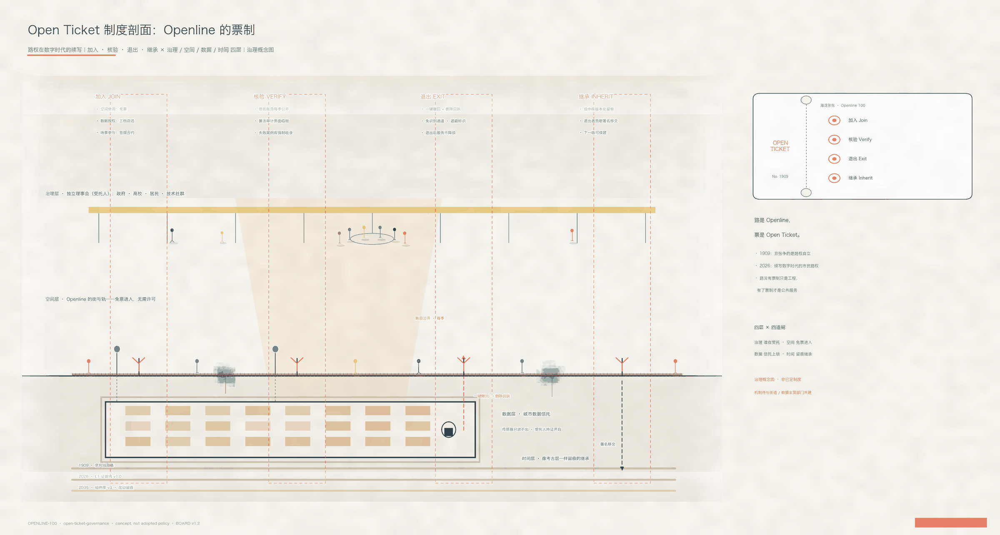

| 层 | 一句 | 空间落点 |
| --- | --- | --- |
| **治理** | 独立理事会四方受托：政府 · 高校 · 居民 · 技术社群 | 公开议事廊；账目每季公开 |
| **空间** | 街与轨免票进入，上路不先买许可 | L1 / L2 地面；Kilometer Zero / The Join 只办加入仪式，不设收费闸 |
| **数据** | 城市数据信托金库上锁：传感器只进不出，受托人持证开启 | 驿站传感杆；算法审计界面临街 |
| **时间** | 像考古层一样留痕的继承：1909 路基 → 2026 证据线 → 2035 组件库 | 组件库版本化；失败案例库强制收录 |

四道闸把 Join · Verify · Exit · Inherit 写成可执行的票制，而不是口号 [source:AGENT-TASKBOOK]：

| 闸 | 许可怎么发 | 退出/继承怎么兑现 |
| --- | --- | --- |
| **加入 Join** | 空间使用免票；数据授权三档自选；场景参与签微合约 | 可随时退出名单与空间预约 |
| **核验 Verify** | 信托账目每季公开；算法审计临街；失败案例库强制收录 | 结果可公开或授权撤回 |
| **退出 Exit** | 一键撤回 + 删除回执；免识别通道与遮蔽标识 | 退出后服务不降级，不留画像 |
| **继承 Inherit** | 组件库版本化留痕；退出者贡献署名移交 | 下一版可续建，不重写 |

### 第二章 · 资本闭环

可落地性不是把时间轴画得更细。每一期必须同时回答：**建设什么 / 谁出钱 / 谁运营 / 收益怎么回流公共空间**。三种融资情景——专项债 / 片区统筹 / 企业认养——是接力，不是三选一；全部是带适用前提与 B 计划的可比较概念情景，不是已确定的融资安排。三期认养受 Open Ticket 许可链约束，公共界面仍属公共。

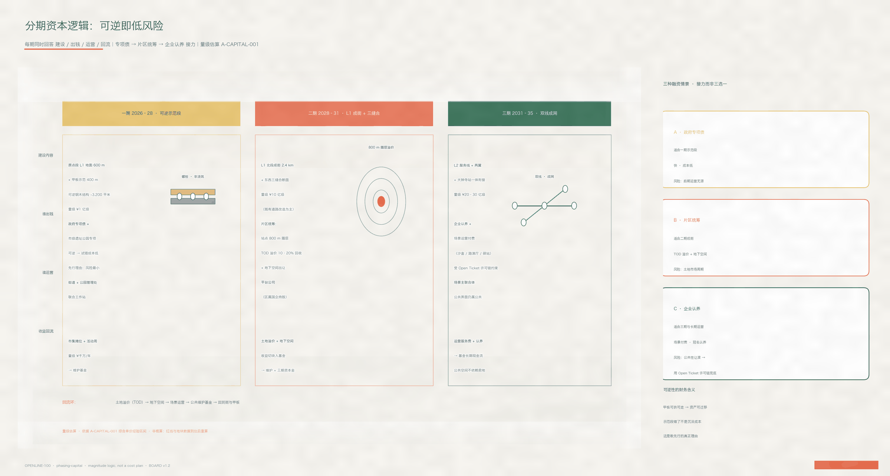

**可逆即低风险。** 五道口甲板螺栓连接、不浇筑：资产可迁移，示范段错了不是沉没成本——这是敢先做一期的真正理由。量级估算挂 `A-CAPITAL-001`，非概算。分期全表与 OL 出资逻辑见后文「分期资本逻辑」与实施经济学。

### 第三章 · 以人为轨

人字坡的「人」，1909 年写的是线路的形状；这个世纪的「人」字，写的是价值的归属。三次转身不是复活已退役的「人字轨」品牌，而是续写京张的换向术 [depth:blue_green_public_space]：

| 转身 | 在哪换向 | 不做什么 | 当代对应 |
| --- | --- | --- | --- |
| **1909 · 地形** | 火车在山脊转身 | 不炸山 | 33‰ 坡度，道岔换向 |
| **2026 · 存量** | 城市在 13 号线上转身 | 不拆既有 | 螺栓借墩，可逆甲板 |
| **这个世纪 · 价值** | AI 在人的轨道上转身 | 不拿算力当轨 | 算力的坡挡不住，必须回人处换向 |

铁路解剖学的当代对应物：道岔 = Open Ticket 核验 / 退出闸；避难线 = 失败案例库；试车段 = 治理沙盒；**轨 = 人类价值观，不是算力**。

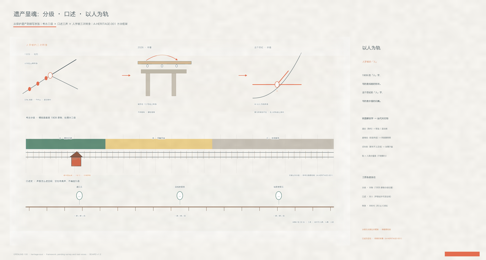

从保护遗产到续写京张，三带各就各位：

| 带 | 对谁 | 做法 | 诚实边界 |
| --- | --- | --- | --- |
| **考古分级** | 对物 | A 原位只读 · B 可触可坐 · C 无存新作；清华园站房 1910 为有据文保锚点 | 文献比对框架，待勘察校核（A-HERITAGE-001） |
| **口述声景** | 对人 | 道口工 / 沿线老居民 / 站房老职工；空位「＿」待真声，经许可入碑 / 牌 / 码 | 采集计划 30 位，不编造引语 |
| **三次转身** | 对时代 | 地形 → 存量 → 价值 | 不把人字坡做成第三套 Logo |

五种物质转译（铺装 / 沟 / 家具 / 碑 / 声）是显形；本章是显魂。显形图见总体设计章。

### 一个统领，五层支撑

三章是叙事主线。其余系统都是这条路的支撑件，不另立概念：

| 层 | 系统 | 与三章的关系 |
| --- | --- | --- |
| 空间层 | 双线主脊（L1 证据线 / L2 服务线）+ 一轴 + 三缝合 + 两心一核 | 路的物质层：把「找到协作、完成复核」的空间成本降到最低 |
| 地标层 | Kilometer Zero · The Join · The Strata Wall | 三座朝圣地标：加入钉 / 换向场 / 继承墙；不是收费站，不是改名家具 |
| 票制层 | Open Ticket（四层 × 四道闸）+ 三区三种创新机制 | 全线同一套闸；全栈协同 / 开放提问 / 城市采纳是闸在三区的执行 |
| 场景层 | 十张全深度场景卡（S-01–S-10 各一张八件卡） | 票的日常层；卡 01–03 是三区生产函数，其余七张覆盖索引号 |
| 未来层 | 形态八题 · 前瞻矩阵 · 不变量清单（附录 A） | 路的寿命层；资本闭环与以人为轨分别见第二、三章 |

## 设计依据与资料清单

本方案回应北京市规划和自然资源委员会海淀分局《百年京张AI创新带城市设计国际方案征集资格预审公告》，并以 `brief/site-package/`、`data/source_registry.json` 与 `data/processed/agent_fact_pack.md` 为机器可读依据。设计判断一律拆成：可追溯来源、可复算指标、可校验图层、可人工复核假设；正文只把关键证据放在判断旁，完整索引留在结构化文件中 [source:OFFICIAL-ANNOUNCEMENT] [source:AGENT-TASKBOOK] [depth:existing_conditions_diagnosis]。

资料用途边界按中央登记表执行 [source:SOURCE-REGISTRY]：formal 可用资料支撑任务与标准响应；background_only 只做背景；`DATA-SRC-PROVISIONAL-BOUNDARIES-20260605` 仅作 provisional intake。agent 不得把 provisional 升级为官方红线、法定控规或政府实施承诺。

**登记处纪律（评审要求逐条明示）：** `HD-JINGZHANG-BLOCK-PLAN-20260811`、`HD-JINGZHANG-CONTROL-PLAN-ADOPTION-20250208`、`HD-JINGZHANG-BLOCK-PLAN-DRAFT-20241227`、`ZGC-SCIENCE-CITY-NORTH-202312` 四条外部资料，以及人民网 / 北京日报等现场事实与 OSM 2026-08 底图，**均不在登记表 approved_formal_sources 内**。本包把它们一律降格为**背景 / 待审证据**（sources.json 已逐条标注 `package_usability: background_pending_registry_review`）：它们不单独支撑「正式叠合」「法定中心」或任何已批指标；凡涉及 2026-08-11 获批文本的结构对位（一带一轴、两心多点、四至、1668.2 ha），正文一律表述为「获批新闻口径、待登记处审验」，地块图则与强度继续标 `unknown`。OSM 底图的提取范围、快照日期、处理管线与 ODbL 署名见 sources.json `OSM-BASEMAP-202608` 来源卡。逐项来源卡已随 sources.json 补齐；登记处获审前，本纪律不解除 [source:SOURCE-REGISTRY]。

**非正式来源 → 依赖声明 → 状态对照表**（本包不凭 submissions/sources.json 自行升级任何来源为正式证据）：

| 来源 | 包内用途 | 依赖它的表述如何处理 | 状态 |
|---|---|---|---|
| HD-JINGZHANG-BLOCK-PLAN-20260811（获批新闻报道） | 结构对位：一带一轴、两心多点、四至、1668.2 ha | 一律写「获批新闻口径、待登记处审验」；不据此主张正式叠合或法定中心 | background_pending_registry_review |
| HD-JINGZHANG-CONTROL-PLAN-ADOPTION-20250208（意见采信通告） | 规划名称、路口名、路名核对 | 仅作名称佐证；不提供强度、边界或图则 | background_pending_registry_review |
| HD-JINGZHANG-BLOCK-PLAN-DRAFT-20241227（草案报道） | 草案阶段设施数（298/37/62/36）与景观结构带 | 明示为草案公开口径；获批新闻未复述，不升级为已批指标 | background_pending_registry_review |
| ZGC-SCIENCE-CITY-NORTH-202312 | 区域协同（北区接口）背景 | 只作背景；区域协同各方向表述为接口设计，不作合作承诺依据 | background_pending_registry_review |
| 人民网 / 北京日报等现场事实 | 现场氛围与事件背景 | 只进叙事背景，不进指标、不作权属或实施状态证据 | background_pending_registry_review |
| OSM-BASEMAP-202608（2026-08 快照） | 全部真实城市肌理底图 | 提取范围 / 快照 / 管线 / ODbL 署名见来源卡；底图几何不替代官方测绘 | background_pending_registry_review（ODbL 合规已声明） |

当前总体设计范围与三处重点区均来自仓库临时粗略 polygon，标注为 `provisional_constraint`、`official_boundary=false` [source:BOUNDARY-SOURCE] [source:KEY-AREA-SOURCE]。它可支撑方案生成、可视化与 intake 自检，不可作审批依据或精确面积结论；组织方数据缺口本身不阻断内容评分。正式红线到位后，须整包重算 geometry、metrics、图件与 HTML，不能只换单个文件。

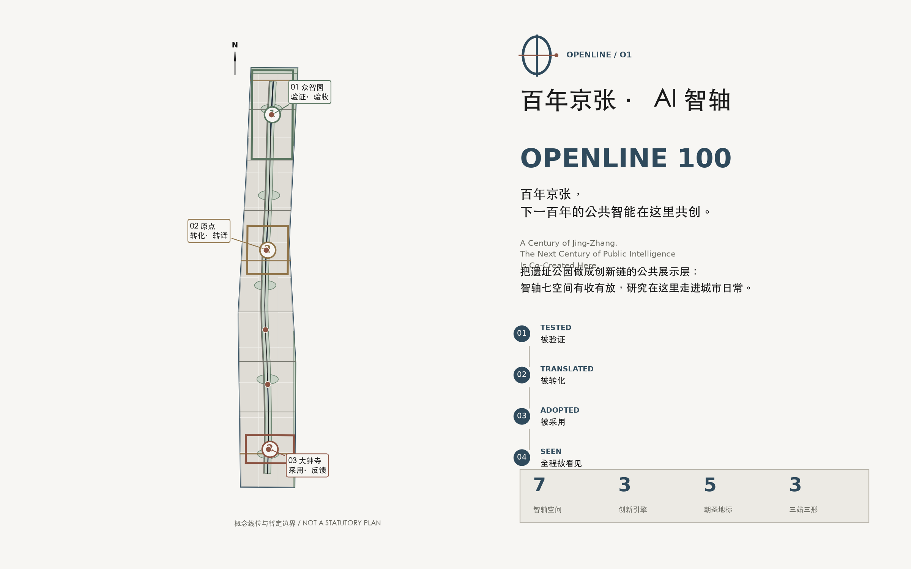

边界与面积讨论以提交包为准：总体足迹 [data:geometry/site_boundary.geojson#SITE-001]、复算面积约 11.41 km² [metric:site_area_sqm]；三处重点区 [data:geometry/key_areas.geojson#PROV-KEY-001] 等，数量为 3 [metric:key_area_count]。阅读导航见 [source:PROCESSED-FACT-PACK]，权威仍回原始 source_id。

### 现状诊断：不是缺 AI，是有路无票

在公告文字四至与 provisional 足迹可读的范围内，本方案把问题诊断写成四条可操作的城市病症（均属讨论级，非正式勘察结论）[depth:existing_conditions_diagnosis]：

1. **有路无票。** 京张遗址公园已提供南北文化与绿廊，但上路没有票制——谁可以进入创新过程、如何核验、如何退出、如何继承，缺少可执行的闸。公园易变成观赏带，而不是工作—学习—发布—验证的日常路。 
2. **三区任务同频，空间模板却趋同风险高。** 众智园（全栈/标准）、原点（近校/开源）、大钟寺（站域/消费转化）在公告中分工清晰，若仍按同一园区模板填功能，会消解三区价值差 [data:geometry/key_areas.geojson#PROV-KEY-001]。 
3. **东西向被切开，南北向被拉长。** 高校、社区、企业与站点多在 Openline 两侧腹地；若只画南北大道，五道口、清华东路西口、大钟寺站四象限仍会「看得见、走不通」。断点只标研究问号，不画假桥隧 [data:geometry/roads.geojson#ROAD-STITCH-M]。 
4. **数据与权属缺口是设计条件，不是借口。** 2026-08-11 街区控规已批，「一带一轴、两心多点」与四至、面积为公开已知；地块 polygon、容积率、高度、密度、退线仍待正式图则。本包用空 `constraints.geojson` 登记缺口，把「结构已知、强度未知」写成工作纪律，不把新闻面积升级成图则 [depth:risk_missing_data] [source:HD-JINGZHANG-BLOCK-PLAN-20260811]。

### 在地调研：五道口—大钟寺日常生活的空间证据（证据分级）

本页把诊断钉到可核验的在地证据上。证据分三级：**A＝官方或权威媒体公开报道（注明来源日期）；B＝公开学术/设计文献；C＝待现场核验（附拍摄清单）**。本页不放任何现状照片——真实影像只能来自现场，C 级清单完成前，相关设计判断保持概念级。

**① 廊道真实状态（A 级，2026-08 核验）：** 京张高铁五环内入地释放约 9 km 地面线性空间；一期（知春路—清华东路，2.4 km，16.8 ha）2023-06 开放，京张清华园火车博物馆 2024-02 开放（来源：人民网 2023-01-31 / 2023-06-29）；二期南北两段 2026-08 全线开放——南段（西直门—知春路）含四道口 2.4 km 百年复原铁轨与三环门户城市阳台，北段（清华东路—北五环箭亭桥，2.6 km，30.01 ha）含「京张之环」1909 主题广场（来源：北京日报客户端 2026-08-07）。**关键更新：2026-08-11《北京海淀区京张铁路遗址公园沿线（人工智能创新街区重点地区）HD00—1601等街区控制性详细规划（街区层面）（2024年—2035年）》获批复**——9 个街区、约 1668.2 ha，四至为东至新街口外大街、西至中关村大街、北至成府路、南至西直门外大街，「一带一轴，两心多点」（来源：北京日报 / 首都之窗 2026-08-12；市规划自然资源委）[source:HD-JINGZHANG-BLOCK-PLAN-20260811]。**本轮已完成公开文本叠合**（见下节「街区控规叠合」）：结构与两心对位已写入方案；地块图则、容积率、高度仍未公布，强度区间继续作为概念建议、上限服从未来图则。不把新闻稿面积当成可审批几何。

**AI 原点社区官方本意（A 级，2026-01 发布）：** 2026-01-05 北京市发布首批四个人工智能创新街区，海淀「AI 原点社区」特色定位**「创新策源、创业首选」**，打造「全球 AI 人才创新创业第一站」——AI 原创策源技术全球首发地、AI 青年人才共创共燃栖息地、AI 全要素精准对接生态服务站；以五道口为核心约 3 km²，「街区—校区—园区」深度融合，愿景「10 分钟找到合作伙伴、15 分钟享受缤纷生活」（来源：新京报 / 北京日报客户端 2026-01-05）；东升镇表述「用空间生态的最近一公里，解决创新落地的最后一公里」（来源：中新网 2026-01-07）。场景卡 01 的主题选择即以此为 A 级依据：官方要策源、首发、栖息地和八找并置；本卡回答政策买不到的空间问题——实验室成果如何过墙。

**「人工智能+」行动的民生与治理语境（A 级，2025-08 发布）：** 国发〔2025〕11 号《关于深入实施"人工智能+"行动的意见》（2025-08-26 印发）部署六大行动：「民生福祉」要求「充分发挥人工智能对织密人际关系、精神慰藉陪伴、养老托育助残的重要作用」「构建更有温度的智能社会」；「治理能力」要求「打造**精准识别需求、主动规划服务、全程智能办理**的政务服务新模式」「开创社会治理**人机共生**新图景」「深入开展人工智能社会实验」（来源：人民网 / 央视 2025-08-26；中国政府网）。北京侧语境：接诉即办改革（2019 年起以 12345 热线为主渠道；2021-09 上升为地方性法规；六年受理约 1.5 亿件、解决率与满意率约 97%；2025-06-23 市委《关于进一步深化接诉即办改革的意见》强调「科技赋能、数智发展」；来源：北京市政府门户 2025-06-23；新华网 2025-12-01）与海淀「城市智能体」概念（2024 中关村论坛发布全球首个人工智能街区概念，五道口—大钟寺先导区、约 53 km²；来源：海淀区发布 / 北京新闻）。场景卡与三区对齐：卡 01 回答原点「策源如何过墙」；卡 02 回答大钟寺「核验过的能力如何上街」；卡 03 回答众智园「全栈如何升级而不拆城」。国发〔2025〕11 号的政务服务新模式与接诉即办，降到东翼场景索引 S-09，不占三区深度卡。卡 03 的治理接口仍承接「人机共生新图景」。

**② 真实断点（A/B 级）：**

| 断点 | 证据 | 证据级 | 对应设计动作 |
| --- | --- | --- | --- |
| 大钟寺站换乘断点 | 12 号线 2024-12-15 开通后与 13 号线（高架）站内换乘通道暂缓，工期暂定至 2027-12（随 13 号线 8 编组 / 未来 18 号线让渡同步）；乘客站外换乘实测约 8 分钟：12 号线 D 口 → 1733 下沉广场向东 → 楼梯上地面 → 13 号线 A/B 口；一卡通/码 30 分钟内连续计费（来源：北京日报 2024-12-15/16；市重大办答复） | A | OL-04：站一体化与四象限步行（既有路径，不挖新隧），不代替 2027 站内通道 |
| 五道口道口断点 | 「五道口」地名即京张铁路第五个道口，历史上是北京著名堵点；道口信号灯保留于公园、不再点亮（来源：清华大学新闻学院 2025-03；中国社会科学网 2023-07） | A | OL-07 缝合甲板 |
| 清华东路接缝 | 一期公园北端止于清华东路，二期北段南接清华东路——已开放两段在此接缝；15 号线清华东路西口站与 13 号线五道口站之间约 1 km 无轨交换乘（C 级待实测） | A/C | 中缝合 + 接驳清单 |
| 北段尽端与桥下 | 北段止于北五环箭亭桥桥下空间，与清河滨水绿廊、东升八家郊野公园连通（来源：北京日报客户端 2026-08-07） | A | 北缝合 + 桥下空间清单 |

**③ 日常生活的空间证据（A/B 级）：** 「以前一道高墙把小区和铁路彻底隔开，想去对面买菜都得绕路半小时」——大钟寺社区居民，二期开园（来源：北京日报客户端 2026-08-07）；「吃完饭就能来溜溜弯儿」——一期 C 区带孩子的居民（来源：北京日报 2023-05）；「火车就要开过来了」的道口提示音是五道口集体记忆，北林师生等火车通过是校园记忆一部分（来源：新京报 2022-04；科学网 2019-10）；一期设计团队 PLPS 调研诊断——场地核心矛盾是消极「城市背面」与广泛公共空间需求之间：铁路阻隔、大院围墙封闭、公共服务不足、历史记忆消失、活动空间缺失（来源：《风景园林》2025 年第 9 期，B 级）——与本方案「现状四症」互证；一期周边 18–20 所高校与科研院所、科创企业密度超 800 家/km²、沿线 9 街镇 70+ 社区（来源：人民网/北京日报 2023，A 级）。

**④ 现场拍摄与核验清单（C 级，待执行）：**

| 编号 | 机位 / 对象 | 必拍必测内容 | 对应设计动作 |
| --- | --- | --- | --- |
| P-01 | 大钟寺站 12 号线 D 口 → 1733 下沉广场东端楼梯 → 13 号线 A/B 口 | 换乘路径全程步行计时视频 + 高差/无障碍断点 + 营业时段是否阻断 | OL-04 站一体化 + 四象限 + 无障碍 |
| P-02 | 五道口 13 号线站—成府路交叉口 | 晚高峰人流对冲、非机动车淤积、道口信号灯遗存 | OL-07 缝合甲板 |
| P-03 | 清华东路公园一期北端门 + 二期南端门 | 一期二期接缝、15 号线清华东路西口接驳步行实测 | 中缝合 |
| P-04 | 一期铁轨保留段（知春路—北四环） | 轨作铺装现状、人轨关系、夜间使用 | L1 证据线 / 五重转译 |
| P-05 | 清华园站两代站房 + 三才堂路原站址 | 遗产现状与展陈方式 | L1 证据线 / 清华园站遗产展陈 |
| P-06 | 四道口复原铁轨段 + 三环城市阳台 | 二期建设标准与人流 | 南段 Openline 延伸 |
| P-07 | 东王庄 / 展春园 / 大钟寺社区界面 | 大院围墙、首层业态、买菜路径 | LU-005 / 开源院落 |
| P-08 | 1733 商业空间 + 字节跳动总部界面 | 站域消费与通勤人流现状 | LU-004 / Adoption |

**诚实声明：** A/B 级证据均为公开报道与文献，来源与日期随文标注，下一轮统一登记进 source registry；本页不伪造任何现状影像，C 级清单是现场作业单而非已完成工作。

## 三层范围工作框架

公告确定三层工作：统筹研究约 43.6 km²，回答 AI 创新生态与未来城市形态；总体设计约 11.4 km²（京张遗址公园周边 1–2 km），达到控规深度城市设计；重点区域合计约 368.4 ha，达到规划综合实施方案深度。本方案把三层转译为同一条工作方法——**Openline**：不是新画红线，而是把遗产廊道、慢行缝合、产业锚点与 Open Ticket 票制叠成可加入的市民路 [standard:PROJECT-OFFICIAL-ANNOUNCEMENT] [depth:three_level_scope_framework]。

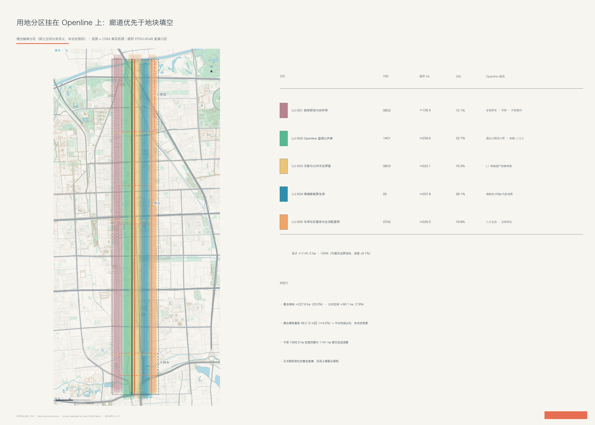

总体概念命名为「何以京张：The Openline 100」。中文问「何以」——一百年前何以争得路权自立，这一百年何以把路权续写成可继承的市民票制；英文 Openline 是路，Open Ticket 是票，Join · Verify · Exit · Inherit 是四道闸。空间结构叠合已批街区控规后是：**一带（双线 Openline 主脊）+ 一轴（中关村大街）+ 两心（五道口 Question · 创新策源地 / 大钟寺 Adoption · 智能原生街）+ 一核（众智园 · 花园型创新街）+ 东西缝合**。临时足迹只作淡约束；图面强调廊道、节点与活动层，不让粗略外形主导构图 [data:geometry/site_boundary.geojson#SITE-001] [depth:overall_spatial_structure] [source:HD-JINGZHANG-BLOCK-PLAN-20260811]。

| 层级 | 设计问题 | Openline 回答 | 数据落点 |
| --- | --- | --- | --- |
| 统筹研究 | 世界级 AI 生态如何落到城市 | Openline 协议 + 案例机制转译 + 三区两翼协同回路 | compliance / standard 矩阵 |
| 总体设计 | 更新、交通、蓝绿、风貌如何互锁 | 用地分区挂在 Openline 上；双线 Openline/缝合对位已批「一带一轴」；蓝绿公共层接一刻钟生活圈 | [data:geometry/land_use.geojson#LU-001]、[data:geometry/roads.geojson#ROAD-SPINE-001] |
| 重点区域 | 三区为何不是同一园区模板 | 众智园 = 花园型创新街（全栈+治理）；原点 = 创新策源地；大钟寺 = 智能原生街；两翼 = 中关村科技服务 / 小月河场景赋能 | [data:geometry/key_areas.geojson#PROV-KEY-001] |

路与票（Openline / Open Ticket）与四道闸见前文「总体概念」章，本章起不再重复展开。

### 街区控规叠合：已知结构 · 设计转译 · 仍未知

2026-08-11 获批的是**街区层面控规的公开文本**，不是地块图则。本方案叠合的是四至、面积量级、空间结构与产业方向；不叠合未公布的容积率、高度、密度、退线或九个街区的 polygon [source:HD-JINGZHANG-BLOCK-PLAN-20260811] [standard:MOHURD-CONTROL-DETAILED-PLANNING] [depth:land_use_layout]。

**全称：**《北京海淀区京张铁路遗址公园沿线（人工智能创新街区重点地区）HD00—1601等街区控制性详细规划（街区层面）（2024年—2035年）》。批复机关口径：市规划自然资源委。规划范围位于海淀区南部，涉及中关村、北下关、北太平庄三个街道（草案公示阶段公开），东至新街口外大街、西至中关村大街、北至成府路、南至西直门外大街，9 个街区，总用地约 1668.2 公顷。

**三套范围不要混：**

| 范围 | 四至 / 规模 | 法律与竞赛地位 | 对 Openline 的含义 |
| --- | --- | --- | --- |
| 街区控规 HD00—1601 等 | 北成府路 · 南西直门外大街 · 西中关村大街 · 东新街口外大街 · 约 16.68 km² | 已批街区层面控规；图则未公开 | 成府路以南的结构母版；两心在此 |
| 征集总体设计 | 北北五环 · 南西直门外大街 · 西大钟寺东路/荷清路 · 东学院路/西土城路 · 约 11.4 km² | 竞赛工作范围；polygon 仍为 provisional | 南北比控规更长、东西比控规更窄 |
| 征集统筹研究 | 北北五环 · 南同上 · 西万泉河路 · 东京藏高速 · 约 43.6 km² | 系统研究，不画假红线 | 三区两翼与区域协同的讨论层 |

控规**南北短、东西宽**；征集总体**南北长、东西窄**。重叠核在成府路以南的公园两侧。公园二期北段（清华东路—北五环箭亭桥）在本份街区控规公开北界之外，但仍在征集总体 11.4 km² 之内。

**核验：众智园是不是「规划外」？不是任务书规划外。是另一份文件的公开四至外。**

| 文件 | 众智园在不在 | 依据 |
| --- | --- | --- |
| 征集总体设计 | **在** | 公告北至北五环，约 11.4 km²；众智园是走廊北段 [source:OFFICIAL-ANNOUNCEMENT] |
| 征集重点区域 | **在，且必做** | 自北向南第一区，约 192.1 ha；任务写五环路、清河，不是可选项 |
| 2026-08-11 街区控规 HD00—1601 等 | **不在公开四至内** | 新闻口径北至成府路、海淀区南部、两心只有大钟寺与五道口 [source:HD-JINGZHANG-BLOCK-PLAN-20260811] |

交叉定位（公开地理，不是地块红线）：成府路约 39.991°N，五道口站压在成府路上；海淀区政府 2026-03 把北部加速区锚在中关村东升科技园**学北园**（学清路 / 月泉路，约 40.019°N、116.351°E），学知园站约 40.014°N——在成府路以北约 2.5–3 km。任务书把五环 / 清河写给众智园，把五道口 / 清华东路西口写给原点，两区在成府路南北两侧。草案阶段街道名单为中关村、北下关、北太平庄，不含东升地区。

因此：众智园详细设计继续做；只是不能把它写成这份已批控规的「第三心」，也不能用 1668.2 ha 当它的法定覆盖。正式九街区 polygon 若北界越过成府路并吃进学北，本判断作废并整包复算。

**「一带一轴，两心多点」如何挂上 Openline：**

| 控规要素 | 公开口径 | Openline 落点 | 本轮动作 |
| --- | --- | --- | --- |
| **一带** | 京张铁路遗址公园产业创新带；绿色公共空间引领更新 | 双线主脊 L1 证据线 / L2 服务线 | 对齐。公园廊心已建成，增量在贴边，不重做廊心 |
| **一轴** | 中关村大街创新发展轴 | 西翼 · **中关村科技服务翼** | 空间落在已批一轴上；职责是 IP、资本、标准与全球要素配置，不是把西翼写成高校园区 |
| **两心 · 大钟寺** | 互联网和相关服务业、人工智能、新媒体（草案公开口径，获批新闻未改口） | 南核 · **智能原生街**（智能体 / 终端 / 内容消费） | 对齐。片区产品是街面业态协议；站一体化与路口四象限是到达系统（OL-04），不重做已建成南段公园 |
| **两心 · 五道口** | 人工智能产业创新集聚区、顶尖人才交流中心（草案公开口径） | 中核 Open Question / AI 原点社区 · **创新策源地** | 对齐。实施抓手是中缝合与转化街；不把原点写成第三个「心」以外的园区 |
| **多点 · 知春路** | 重要空间节点；北侧卫星制造厂科技园为存量更新样本 | L2 中段驿站 + 老厂房更新类型 | 新增节点，不另立核 |
| **多点 · 四道口** | 重要空间节点；二期百年复原铁轨已开放 | 南段 L1 延伸 | 承认已建成，增量在两侧贴边 |
| **众智园 · 全栈协同** | **征集重点区必做**；不在本份街区控规公开四至内（北界成府路 / 锚点学北园） | 北核 · **花园型创新街**（学北园—清河—五环；空间产品为可升级的城市主板） | 详细设计继续做。它是全栈自主创新与全球治理的组织区，不是第三心 |

**产业与更新（获批新闻可核验，不作招商承诺）：** 存量路径是老旧厂房改造、低效楼宇更新；业态方向是大模型、智能体、具身智能；组织方式是领军企业牵引、上下游集聚。本方案的回应：功能差先于业态清单——大钟寺负责 Adoption（智能体/终端/内容消费的可采纳界面），五道口负责 Question（人才交流与开源发布），众智园负责**全栈协同**（从底层软硬件、数据模型到智能体应用，并把标准与安全治理嵌入研发全过程；征集重点区必做，本份街区控规公开四至未覆盖）。知春路北侧卫星制造厂科技园只作「存量更新类型」的公开样本，不写成已纳入本方案实施。

**蓝绿与生活圈：** 控规要求南北贯通、东西连通的步道与骑行道，公园内融入体育、游憩、便民；构建生活圈与创新圈融合的一刻钟社区服务圈。二期已实施 3 条鱼骨状慢行通道，盘活高架桥下，连接清河滨水绿廊与东升八家郊野公园——这证明北段缝合已有建成增量，Openline 北缝合应接上这些通道，而不是另画一套。草案阶段曾公布 2035 年设施量级（公共服务 298 处、交通 37 处、市政 62 处、城市安全 36 处）及南长河 / 小月河景观带、海淀黄庄 / 国家图书馆等公共活动中心——**均属 2024-12 草案公开口径，获批新闻未复述，本方案不升格为已批指标** [source:HD-JINGZHANG-BLOCK-PLAN-DRAFT-20241227]。

**仍未知、整包复算的触发条件：** 九个街区正式 polygon、地块图则、容积率 / 高度 / 密度 / 退线、道路红线、权属、文保与蓝线。触发后 geometry → metrics → 图件 → HTML 整包重算，不只换数字。草案公示采信通告只确认规划名称、道路节点标注与「笑祖北一路 / 二路」等命名，不提供本方案可用的强度或边界 [source:HD-JINGZHANG-CONTROL-PLAN-ADOPTION-20250208]。

## 统筹研究范围产业与未来城市研究

### 命名、Logo 与视觉识别系统

**主名称**：何以京张：The Openline 100。**路与票**：路是 Openline，票是 Open Ticket——票制名不是第三套 Logo。三大定位对公告「文化带 / 都市 AI 生活体验带 / AI 融合创新带」的转译是：文化 Openline（遗产可走）、生活 Openline（人才可停）、创新 Openline（成果可验）[source:AGENT-TASKBOOK] [standard:PROJECT-AGENT-OPEN-CALL-TASKBOOK]。

**Logo 构成（可核验规则，不是方向句）：** 主标 = 一条可步行的细脊线穿过衬线「100」。脊线是路，100 是可继承的公里与届次，不是装饰数字。中文主名「何以京张」可置于脊线上方作问句，英文 The Openline 100 置于下方；票制名 Open Ticket 不得进入主标。

| 规则 | 规定 | 禁止 |
| --- | --- | --- |
| 构成 | 脊线（连续、可断开一次表示缝合）+ 「100」字样；单色优先 | 铜圆、三角、第三套几何章、人字轨图形 |
| 最小尺寸 | 印刷短边 ≥ 12 mm；屏幕长边 ≥ 96 px；脊线粗细 ≥ 0.35 mm / 2 px | 小于最小尺寸仍描边加粗冒充可读 |
| 安全区 | 四周各留「100」字高的空白；不与地标图标、二维码、照片抢边 | 把 Zero / Join / Strata Wall 画进 Logo |
| 反白 | 深底用米白 `#F7F5F0` 或纸白；浅底用墨色；对比度 ≥ 4.5:1 | 荧光、渐变描边、金属拉丝 |
| 应用 | 图版页眉、A0 页脚、HTML 标题、导视柱；单色稿与反白稿为同一构成 | 每区另做 Logo；把 Open Ticket 画成第二套主标 |

主标是一带识别，不是三座朝圣地标的替代物。地标用空间类型区分，不用图形配对。

**五大功能按任务书原词落位，不另起一套：**

| 任务书功能 | 主责空间 | Openline 动作 |
| --- | --- | --- |
| AI 全栈自主创新体系 | 众智园可升级城市主板 | 共享底板 + 五类可升级单元 + 全栈协作街 |
| 世界级 AI 创新生态 | 原点创新策源地 | 开源发布、近校转化、人才停留 |
| AI+ 场景赋能新范式 | **东翼 · 小月河场景赋能翼** | 真实场景出题、公共体验路径、可关闭 |
| 智能化 AI 活力城市 | 小月河翼 + Openline 生活带 | 驿站、一刻钟生活圈、缝合带服务 |
| AI 治理全球话语权 | 众智园全球治理中心 | 标准、安全、人工复核、公众说明 |

**三区两翼协同回路（可画进结构图的物流/知识流）：**

- **东翼 · 小月河场景赋能翼** → 输出：医疗 / 教育 / 法律 / 生活 / 交通等可感知的真实试题；输入：街面采用反馈与治理复核结果。河廊是场景翼，不升格为第三轴，不把大钟寺站写成东翼。
- **中核原点（世界级创新生态）** → 输出：公开问题、开源发布、近校人才与可转化原型；输入：小月河的试题、众智园的工具与标准接口。
- **北核众智园（全栈 + 治理）** → 输出：工程化能力、共享技术平台、标准与安全组件；输入：原点的问题与人才、大钟寺的采用缺口。
- **南核大钟寺（智能原生新业态）** → 输出：可购买 / 可订阅 / 可试用 / 可拒绝的街面业态、数据要素会客、国际交往；输入：众智园完成治理复核的能力、原点可转化成果、小月河验证过的场景题。
- **西翼 · 中关村科技服务翼** → 贯穿全程：IP、资本对接、标准许可、全球要素配置。空间落在控规「一轴」中关村大街，沿东西缝合接入五道口—清华东路；近校转化街属于原点，不是西翼的全部。不声称校园权属变更，不编造基金与招商名单。

两翼不另起园区。西翼的职责是科技服务，不是高校园区；东翼的职责是场景出题，不是地铁门户。大钟寺站只做南核的到达面。小月河在控规获批新闻中未复述为法定轴，本方案按任务书保留为场景翼，不升格 [source:AGENT-TASKBOOK] [source:HD-JINGZHANG-BLOCK-PLAN-20260811]。

**区域结构（43.6 工作台）：** 现有用地结构图装的是 11.4 km² 窄条。西翼中关村大街在窄条以西、统筹西界万泉河路以东；东翼小月河在窄条以东、统筹东界京藏高速以西——两翼必须挂在 43.6 km² 上才看得见。科学城北区是五环以北的**官方规划地理**（上地 / 软件园为近接面；永丰 · 翠湖 · 北清路为更北纵深），本方案只画接力接口，不进口径 polygon，不另起第二园。京张走廊在箭亭桥以北以虚线接清河滨水绿廊；**清河是河，不是清河站枢纽**。中关村大街向北的「高端创新集聚发展走廊」是北区控规用语，本方案不声称已设计北区 [source:ZGC-SCIENCE-CITY-NORTH-202312] [data:geometry/site_boundary.geojson#SITE-001] [depth:overall_spatial_structure]。三层范围对位见上节 [depth:three_level_scope_framework]。

### 区域协同：五个方向的接力接口（讨论级 · 非合作承诺）

任务书要求的不只是区内三区两翼，还有走廊与北京创新地理的关系。下表按四个流（知识 / 人才 / 场景 / 标准）+ 交通服务接口逐向说明。**全部为接口建议，不是合作、招商或共建承诺；不点名具体机构签约，不预支任何官方程序。**

| 方向 | 知识流 | 人才流 | 场景流 | 标准流 | 交通 / 服务接口 |
| --- | --- | --- | --- | --- | --- |
| **北纬社区（昌平线沿线居住腹地）** | 接诉即办高频问题沉淀为社区试题，回流入库 | 通勤人口是 Openline 日常使用者与原点的潜在创业者 | 社区生活题（养老 / 通学 / 买菜）进小月河翼出题面 | 社区服务标准从真实使用里长出来，不闭门写 | 昌平线学知园 / 清河站到达 + 驿站 800–1000 m 服务圈 |
| **未来科学城（东区能源谷）** | 能源 / 双碳研究议题与原点公开问题互投 | 研发人员双向通勤与短期驻留 | 低碳技术到清河低碳廊做真实环境验证（D-08） | 双碳监测口径对齐 A-ECO-001 数据信托规范 | 17 号线 + 地面公交接驳；骑行通道为远景建议 |
| **怀柔科学城（大科学装置）** | 大装置成果经原点授权窗口做过墙转化 | 科学家短途到访：首发厅发布 + 转化街授权 | 装置衍生技术进沙盒评测（D-04）后上街 | 大科学装置数据开放规范与治理中心标准议题互参 | 市郊铁路怀密线 + 京张高铁清河站；不新建轨道 |
| **经开区（亦庄 · 智能网联与制造）** | 制造 Know-how 与全栈工程化需求互认 | 工程师与供应链团队往返众智园中试单元 | 具身智能在众智园受控场地验证，量产在亦庄——分工不重叠 | 车路云与机器人标准互认接口（讨论级） | 亦庄线 + 地面物流；本方案不预支跨区测试许可 |
| **京津冀（走廊级）** | 京张走廊作为百年路权叙事与当代协同的双层纽带 | 活动周与路演客厅的跨区域参与 | 清河—永定河—京津冀蓝绿网络的生态试题互认 | 治理中心标准议题向区域公开议事延伸 | 京张高铁（既有）+ 市郊铁路；不画新线位 |

协同的纪律与区内一致：**可退出、可核验、不捆绑**。任何方向的接口若对方不接，方案降级为区内自闭环，不影响 Openline 本体成立（与实施经济学的 B 计划同一逻辑）[depth:overall_spatial_structure]。

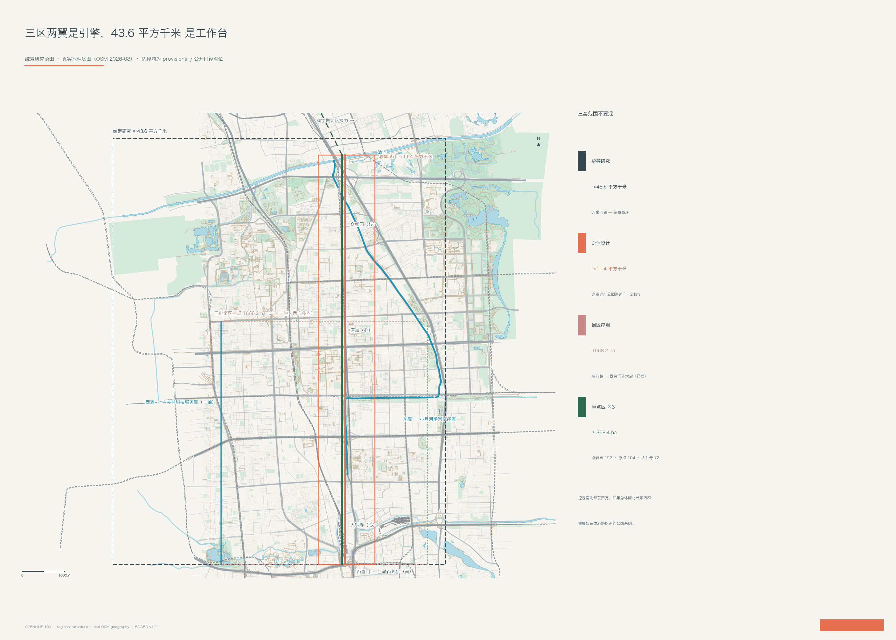

**纽带图（同一条走廊，换一个问题）：** 上图回答「工作台有多大」。下图回答任务书原句——以京张遗址公园为纽带，联动高校、园区、企业与社区，并把交通门户和资本接口按真实地理挂上。北核在上、南核在下，西翼在左、东翼在右。清华 / 北大 / 中科院 / 学院路是近校腹地，不进西翼；学北园 / 上地 / 软件园是北向接力，不另起第二园；西直门—大钟寺—知春路—五道口—清华东路西口—学知园是到达链；1733 与 W-03 是企业 / 资本对接，不点名；社区落在东西贴边。**金融街在西直门以南，只作邻接，不进 43.6。** [depth:overall_spatial_structure] [source:ZGC-SCIENCE-CITY-NORTH-202312]

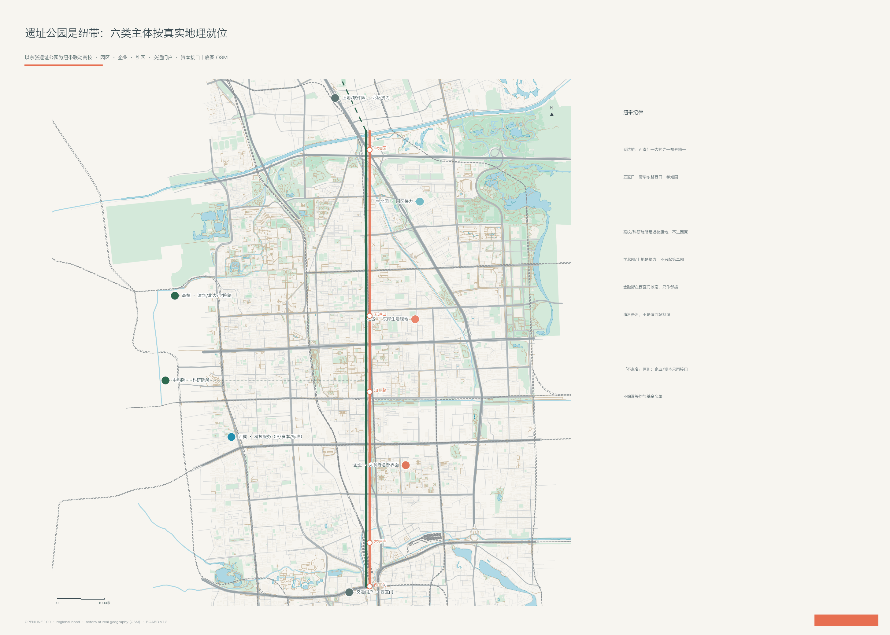

#### 两翼深化设计（讨论级 · 概念建议）

两翼此前只有职责、没有设计；本节把两翼落到节点、界面与建筑概念。均为概念建议：不声称权属变更、不点名签约机构、不编造政策与基金 [depth:overall_spatial_structure]。

**西翼 · 中关村科技服务街：科技服务 × 全球要素配置的首层界面**

核心句：**西翼生产的是「可成交的科技服务」与「可进出的全球要素」，不是又一条写字楼大街。** 空间落在已批控规「一轴」中关村大街，增量在首层与低效楼宇更新，不新造塔楼，不改大街断面等级。

全球要素配置拆成四张「接口桌」，每张桌子有具体的首层界面（类型接口，不虚构入驻机构）：

| 要素流 | 空间界面 | 机制（概念） | 诚实边界 |
| --- | --- | --- | --- |
| 人才流 | 国际人才服务首层（W-01） | 签证 / 居留 / 执业许可类型咨询、国际社群活动、多语导视与短居接口 | 不承诺任何出入境或人才政策待遇 |
| 资本流 | 路演与对接厅（W-03，既有楼宇首层） | 对接预约制、路演节奏与大钟寺 S-05 联动 | 不编造基金与投资额，不承诺财政激励 |
| 技术与 IP 流 | IP 与标准许可窗口（W-02） | 许可模板、成果清权、转化合同类型服务 | 不虚构高校或企业共建合同 |
| 标准与信息流 | 国际标准讨论与公开发布空间（W-02） | 双语标准草案公开日，与众智园治理中心的治理门联动：标准在众智园起草、在中关村大街发布 | 不声称国际标准组织已入驻 |

三个真实节点（沿中关村大街，与缝合线和控规「多点」对位；编号为概念节点，非 OL 项目）：

| 节点 | 位置对位 | 片区产品 | 界面动作 |
| --- | --- | --- | --- |
| **W-01 五道口交汇口** | 中关村大街 × 成府路，接中缝合与原点 | 国际人才首层 | 首层开放协议 + 多语导视 + 连续遮荫；与原点八找并置界面步行衔接 |
| **W-02 知春路口** | 中关村大街 × 知春路，控规「多点」；知春路北侧卫星制造厂科技园为存量更新公开类型样本 | 科技服务与标准首层 | IP / 许可 / 标准工作坊进存量楼宇首层；只作类型样本研究，不写成已纳入实施 |
| **W-03 大街南段口** | 中关村大街南段，接南缝合方向与大钟寺站域 | 资本与路演界面 | 既有楼宇首层改造为对接厅；向西不接校园权属、向南不抢大钟寺街面产品 |

西翼界面硬规则（与总体「界面与首层协议」一致）：首层开放率 ≥60%；连续封闭围墙 ≤50 m；遮荫树列优先于装饰铺装；存量低效楼宇更新优先于新建；四张接口桌全部适用 Openline 四规则——可预约加入、服务记录可审计、可随时退出、组件随 Inherit 版本化。

**东翼 · 小月河场景出题廊：五类真实场景沿河廊发生**

核心句：**东翼生产的是「真实试题」——医疗 / 教育 / 法律 / 生活 / 交通五类场景在小月河河廊被出题、被漫步、被体验、被回流，可关闭、须人工复核。** 河廊不是第三轴，是场景翼的线性容器。

文化锚点（公开地理，机位列入 P 清单待核验）：小月河为元大都西护城河遗存，沿线元土城遗址公园与「蓟门烟树」碑——东翼的遗产层与京张主脊对位：**主脊讲自主工程史，河廊讲城市生活史**。场景试题放在活的城市生活里，不放在展厅里；不仿古、不造碑廊，只在既有遗址公园步道系统上做可逆插入。

河廊站点（约 3–4 个，间距 800–1000 m，与 S-09 驿站共址；五域试题分站承载、可轮换；编号为概念节点）：

| 站 | 承载场景域 | 出的什么题（概念） | 空间落点 | 回流路径 |
| --- | --- | --- | --- | --- |
| **E-01 北段站** | 医疗健康 | 适老康复与慢病管理的真实试题：康复步道段、知情同意、健康数据本地存储 | 河廊北段邻近既有医疗机构的类型接口（不点名、不声称合作） | 脱敏摘要 → 原点失败案例库 / 众智园治理门 |
| **E-02 通学段站** | 教育 | 通学安全与 AI 伴学：接高校与社区腹地的通学路径段 | 河廊与东西向社区路径交汇处 | 试题与采用反馈 → 原点 / 大钟寺 |
| **E-03 土城遗址段站** | 法律 + 文化 | 社区法律咨询智能体 + 人工值班窗口；遗产步道公共体验 | 元土城遗址公园步道贴边，可逆插入 | 高频问题 → 治理门推演层 |
| **E-04 南段站** | 生活 + 交通 | S-09 未呼先应全功能常驻（听懂 / 想到 / 办妥；红色「我要跟人说话」召唤钮；工单直转 12345）；S-04 慢行导航河廊段，仅聚合数据、默认可关闭 | 河廊南段接大钟寺方向 | 12345 工单系统；断点数据 → OL-01 清单 |

**驿站建筑概念（端侧算力驿站 · 形态八题第 4 题落地，以 E-02 为先行原型）：**

- **体量与界面：** 约 600–900 m²、两层；首层全开放，执行「三可」（可进入 / 可发生 / 可退出）；背街面设服务院，设备物流与公共慢行分行。
- **三个部件：** ① **响应站**——未呼先应人工坐席与智能体界面并置，人工始终在场；② **机器人巢**——背街面，充电 / 调度 / 编号可投诉，与公共空间物理隔离；③ **余热暖座温室**——端侧算力余热供给的可坐空间：冬天是暖座，夏天是荫棚，算力的温度可坐可触。
- **能源与接口：** 光伏廊架兼遮荫；预留接入「第三条轨」浅埋公用脊的接口位；井盖刻接口容量，井盖即 API 文档。
- **构造：** 可拆装、材料银行登记、低扰动基础；一次技术换代只换模块，不拆驿站。
- **禁忌：** 公私算力物理隔离；供应商另行授权；不做说教装置、不做个人追踪；任何场景试题可一键关闭。

**两翼共同的成功判据（自检）：** 西翼——不进入任何封闭写字楼，能否在大街上碰上四张接口桌中的至少一张（必须能）；东翼——沿小月河走 20 分钟，能否碰上至少一个正在出题的真实场景、且能拒绝参与（必须能）；两翼——都不另起园区围墙（必须没有）。

**诚实边界：** 两翼节点均为概念落点，无宗地权属与现状测绘；小月河蓝线、防洪与遗址保护范围待正式资料；驿站原型须在驿站专项（OL-05）与权属、市政容量确认后深化。现场核验清单增补：P-09 中关村大街三节点首层界面与遮荫现状；P-10 小月河全线步道连通性、遗址保护标识与 800–1000 m 站距实测。

#### 信息图视觉规范（Sasaki v1.1 · 图面表达标准）

全案图面——五张必交图、「走进去」氛围图、A0/A3 展板与电子展板——统一执行 Sasaki 风格城市设计视觉规范 **v1.2**（BOARD v1.1 WINNING + 地点剖面）。取色与版式以下列要点为准，不另挂投稿包外文件。要点如下：

**设计哲学：图即思考。** 一张图只讲一个观点，标题即结论；复杂论证用「问题 → 机会 → 策略 → 空间 → 场景」图组序列完成。同一张图须同时通过三类读者检验：政府读得出格局与可实施性，开发商读得出价值与密度，公众读得出「我的生活会怎样」。人的尺度永远在场；生态为底盘，建设量是嵌入物。

**轴测与五层模型。** 全部轴测图统一平行投影（无灭点、尺度可量测、同角同朝向）：总体 30°/60° 平面斜轴测，节点 45° 等轴测，剖轴测沿主轴剖切，爆炸轴测与总体同角竖向拉开。所有分析图遵循自下而上五层：① 基底（地形水文，浅灰蓝/米白退让）→ ② 生态（绿色明度梯度，强调网络连通而非斑块）→ ③ 基础设施（中性灰、线宽分级）→ ④ 功能（功能色块或白模体量）→ ⑤ 活动（人物剪影与暖色点缀——唯一允许高饱和的层，任何情况下不被下四层压住）。爆炸轴测层间等距、0.1pt 引导线对齐、每层配一句 ≤12 字问句标注，且必须回扣一张合成图证明分层逻辑能「合回去」。

**生态配色（唯一取色来源）。** 基底三色：米白 `#F7F5F0`（默认）/ 浅灰蓝 `#EEF2F3`（滨水水文主导）/ 暖灰 `#E8E6E1`（建成区密集）。生态与功能色板：深绿 `#2D6A4F`（生态保育）、中绿 `#52B788`（城市公园）、浅绿 `#95D5B2`（社区绿地）、黄绿 `#D8F3DC`（草甸/屋顶绿化）、水蓝 `#168AAD`（水系骨架）、浅蓝 `#A9D6E5`（雨洪湿地）、珊瑚橙 `#E76F51`（活力节点）、暖橙 `#F4A261`（混合功能）、赭黄 `#E9C46A`（活动事件，仅第⑤层）、灰粉 `#B5838D`（创新政策区，克制）。禁忌：禁纯红 `#FF0000`、纯蓝 `#0000FF` 及荧光色；全图主色 ≤5 个色相；绿蓝为主角、建设量为配角；高饱和暖色面积 ≤ 图面 10%；同一色相跨图必须同值，不凭感觉取色。

**图面技术细则。** 线宽四级：外轮廓 0.5–0.8pt / 次级边界 0.3pt / 内部细节 0.15pt / 等高线与引导线 0.1pt。中文思源黑体或等效人文无衬线，西文 Helvetica/Avenir，图内字号 ≥6pt。人物为尺度准确的简洁剪影，植物有季相与冠幅变化。单层 45° 定向软阴影、透明度 15–25%，禁多重投影与镜面反射。标注引出线 0.1pt、文字 ≤ 两行、问句式优先。导出：汇报 150dpi / 展板 300dpi，sRGB，保留分层源文件归档。

**渲染质感六修正（针对 AI/程序化出图）。** ① 爆炸轴测每层承载真实空间内容（等高线+水系 / 成群树冠 / 真实路网 / 有高度有明暗侧面的体量 / 成组人物场景），杜绝空白灰板；② 大面积低饱和 + 小面积高饱和强对比：基底 S 5–15%、生态绿 S 40–60%、锚点橙蓝 S≥70% 且面积 ≤10%；③ 落地感：层板有可见厚度，45° 定向软投影 + 物体根部接触阴影（AO），板厚侧面暗于顶面 10–15% 明度；④ 结构边线一律 crisp 矢量线 `#37474F`（0.1–0.8pt 四级），道路中性灰分级、慢行暖灰虚线，手绘晕染只允许发生在色块纹理内部；⑤ 人物为姿态化剪影（骑车、闲坐、遛狗）、成组出现、密度 ×3，配长椅/自行车架等场景道具；⑥ 版式去 dashboard UI 语言：大标题左对齐深灰、图占画面 70%+、图注一行一句、侧栏只放图例不放段落。

**水彩×矢量双层语言。** 结构是矢量的，气质是水彩的：用地边界、道路红线、轮廓等结构性边线一律 crisp 深灰 `#37474F` 矢量线；绿地、水面、铺装等色块填充走水彩晕染（不透明度 60–80%、边缘羽化 2–4px、Multiply 混合），整体叠纸纹 5–10% 且不干扰文字细线。树冠为松动外形的笔刷簇、同树种 2–3 种明度（禁正圆矢量填充）；水面 `#A9D6E5` 平涂 + 5–8% 明度渐变或稀波纹线（禁 CAD 式纯色）。边界共存规则：水彩色块的轮廓线仍须为干净 0.3pt 矢量线，晕染只发生在 fill 内部。分工：正式分析图矢量为主、水彩仅作底色纹理；「走进去」氛围图走水彩手绘轨——轴测轨与水彩轨双轨并列为强制基准，禁止效果图回退硬边图解。

**出图检查清单（任一不符即退回）。** 视角朝向与全案轴测一致；五层顺序正确且活动层未被压住；每层有真实内容、无空板；色值取自规范色板、主色 ≤5 色相；高饱和锚点色 ≤10%、基底低饱和但不洗白；人物成组、有姿态、尺度准确；标题即结论、一图一观点；爆炸轴测配回扣合成图、层板有厚度与三级阴影；线宽四级可辨、晕染仅在色块内部；版式无圆角卡片等 UI 元素、侧栏仅为图例；政府/开发商/公众三类读者各有对应图面；效果图承诺的材质与空间尺度可追溯、可兑现。

### 国土空间与产业融合的创新思路（讨论级）

在不改写法定控规的前提下，本方案提出三条「空间—产业」工作原则 [standard:MOHURD-URBAN-DESIGN-MEASURES] [depth:overall_spatial_structure] [source:HD-JINGZHANG-BLOCK-PLAN-20260811]：

1. **廊道优先于地块填空**：先锁定 Openline 双线与缝合可达，再谈地块触媒；避免产业园式大地块打断步行。控规已把绿带写成更新引擎，本方案把增量放在贴边，不重做已开放的廊心。 
2. **制度差 > 业态清单**：三区差异首先是开放规则（全栈研发与治理 / 可提问 / 可采纳）。控规点名的大模型、智能体、具身智能是业态方向，不是三个园区的同一张功能表——大钟寺负责城市采纳，五道口提出原创问题，众智园完成全栈研发、工程化与治理协同。
3. **结构已知、强度未知时用界面与首层协议控风险**：街区层面「一带一轴、两心多点」已批；容积率/高度仍 `unknown`。用首层开放率、连续遮荫、慢行优先断面与公共组件库约束城市体验，而非编造 FAR。存量路径优先老厂房与低效楼宇，不把新闻里的卫星制造厂科技园写成已纳入实施。

### 全球 AI 创新生态案例（机制转译，非招商清单）

八案例——Station F（巴黎）、MaRS（多伦多）、Kendall Square、Science Park Amsterdam、HafenCity Digital Hub、Block71（新加坡）、Cyberport（香港）、中关村街道式创新网络——仅作空间与运营机制转译，不编造投资额、企业名单或政府承诺 [source:AGENT-TASKBOOK]。可转译机制一句话概括：大站房共享界面、共址转化走廊、首层开放协议、绿廊串联研究单元、遗产地上的数字创新与慢行、轻资产社区运营节奏、企业服务与公共展演并置、近校近轨近生活混合街区。逐案「可转译机制 — Openline 落点 — 避免照搬点」对照表见**附录 B**。

### AI 创新生态图谱（主体—关系—Openline 接口）

任务书要求的 **AI 创新生态图谱** 在此落地：不是机构名录，而是**角色类型 + 关系流 + 空间接口**。下列主体均为公开角色类别，**不点名具体高校/企业/基金/金额**，避免编造招商清单 [source:AGENT-TASKBOOK]。

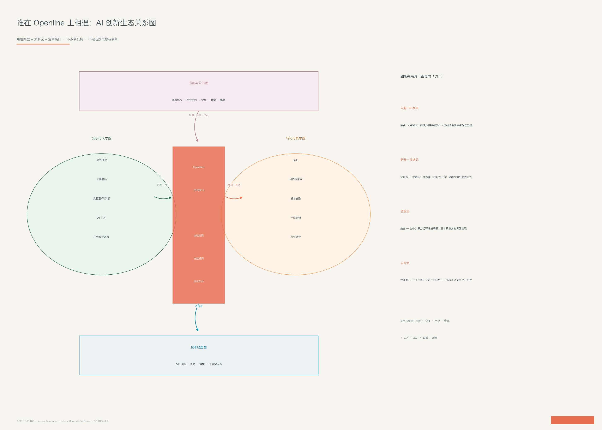

#### 图谱结构：五圈一层接口

```text
 ┌─ 规则与公共圈 ─────────────────────┐
 │ 政府机构 · 社会组织 · 学会 · 联盟 · 协会 │
 └──────────────┬──────────────────────┘
 │ 规则 / 标准 / 许可
 ┌─────────────────────────┼─────────────────────────┐
 │ ▼ │
 ┌─ 知识与人才圈 ──┐ 【Openline 空间接口】 ┌─ 转化与资本圈 ──┐
 │ 高等院校 │ 全栈协同｜开放提问｜城市采纳 │ 企业 │
 │ 科研院所 │◄─── 两翼：科技服务 / 场景赋能 ──►│ 科技孵化器 │
 │ 实验室 / 科学家 │ L1/L2 · 三缝合 · 三地标 │ 资本金融 │
 │ AI 人才 │ │ │
 │ 自然科学基金 │ └────────┬────────┘
 └────────┬─────────┘ │
 │ 问题 / 成果 / 人才 │ 转化 / 路演 / 投资对接（概念）
 └──────────────────┬─────────────────────────┘
 ▼
 ┌─ 技术底座圈 ──────────────────────┐
 │ 基础设施 · 算力 · 模型 · 实验室设施 │
 └───────────────────────────────────┘
```

#### 十七类主体如何挂上 Openline

| 主体类型 | 生态角色 | 主接口区 | Openline 动作（概念） |
| --- | --- | --- | --- |
| 高等院校 | 知识生产、人才输送 | 原点近校生态 | 转化街、授权窗口；不改校园权属叙事 |
| 科研院所 | 基础/应用研究 | 众智园全栈单元 + 原点 | 联合研发、评测集共建、问题墙供题 |
| 政府机构 | 规则、许可、公共利益边界 | 全带（规则层） | 许可与安全预案入口；不写成已批政策 |
| 社会组织 | 社区共治、公益监督 | The Join / 治理中心议事廊 | 公民论坛、可退出监督 |
| 资本金融 | 转化资金对接（概念） | 西翼科技服务 + 大钟寺街面 | 服务翼对接、街面路演；不承诺财政/基金额度 |
| AI 人才 | 核心流动资源 | 三核 + 生活带 | Join 规则、可停留住房/协作建议 |
| 企业 | 场景需求与产品化 | 大钟寺采纳为主，众智园工程化回流 | 研发—治理复核—采纳；标识须清权 |
| 基础设施 | 轨道、市政、慢行、能源 | L1/L2、缝合、站域 | Openline 物理层；工程线位待正式资料 |
| 算力 | 训练/推理/端侧资源 | Openline 驿站（端侧原型） | 须另行授权；不指定供应商 |
| 模型 | 可核验能力单元 | 众智园数据与模型单元 | Verify：公开摘要或授权撤回 |
| 实验室 | 研发、工程化与安全边界 | 众智园可升级研发单元 + 受控测试空间 | 共享技术平台；专家复核；公众界面与受控区分开 |
| 科技孵化器 | 轻资产加速 | 原点 / Adoption 服务栈 | 发布厅—路演连续界面 |
| 科技类学会 | 同行评议与标准讨论 | 众智园全球治理中心 | 标准工作坊、公开评议日 |
| 产业联盟 | 跨企协同与互通 | 众智园 ↔ 大钟寺 | 协议版本墙；不写死成员名单 |
| 行业协会 | 行业规范与培训 | Adoption + 生活样板街 | 培训/导览接口 |
| 科学家 | 问题定义与公信背书 | Kilometer Zero / 众智园治理中心 | 提问、复核；肖像与成果须授权 |
| 自然科学基金 | 基础研究资助通道（类型） | 知识圈 → 原点/众智园 | 仅作资助类型接口；不虚构立项 |

#### 四条关系流（图谱的「边」）

1. **问题—研发流（原点 → 众智园）：** 高校 / 科研院所 / 科学家 / AI 人才在原点提出问题 → 众智园全栈单元完成联合研发、工程化与治理复核。 
2. **研发—采纳流（众智园 → 大钟寺）：** 完成工程化和责任接口的模型/能力经企业、孵化器、行业协会进入大钟寺消费与路演界面；真实采用需求与失败案例回流众智园。 
3. **资源流（底座 ↔ 全带）：** 基础设施与算力通过驿站/站域进入场景；资本金融只出现在「对接界面」，不写入确定资金安排。 
4. **公共流（规则圈 ↔ 公开议事）：** 政府机构、社会组织、联盟在许可与监督层运作；公民与人才经 Join/Exit 进出，经 Inherit 沉淀组件与纪要。

#### 机制八要素（与上图同构，不另起炉灶）

土地 · 空间 · 产业 · 资金 · 人才 · 算力 · 数据 · 场景 —— 分别对应：触媒分区、双线 Openline、三制分工、资本对接界面（概念）、人才画像、端侧/授权算力、会客厅授权清单、十张全深度场景卡 [depth:metrics_recalculation]。

未来城市形态判断：AI 改变的是「谁可以进入创新过程」，而不只是楼里有没有算力。Openline 把工作、学习、发布、验证、生活放在可步行距离内；上述十七类主体通过 Openline 接口相遇，而不是挤进同一座封闭园区 [standard:MOHURD-URBAN-DESIGN-MEASURES] [data:geometry/public_space.geojson#PUBLIC-JOIN]。

### AI 时代城市形态创新：八题与前瞻矩阵（概念专项，全文见附录 A）

**理论地基一句话：** 每次通用技术革命都以"成本坍缩 → 区位重排 → 旧范式变城市病"的逻辑重写城市形态——蒸汽坍缩物资位移成本带来站台城市，电力带来摩天楼，汽车坍缩个人位移成本留下宽马路与「看得见、走不通」。**AI 坍缩的是认知与协调成本**：程式化认知变廉价后，溢价的是只能当面完成的四件事——默会知识、信任与验证、意外相遇、责任承担。故 AI 创新带不是更大的办公室，而是一台**信任基础设施**；形态任务一句话——**把「验证一件事」的空间成本降到最低**。

八个现在就能开工的形态动作：可编程街道（4D 分区）、机器人路权四级断面、能源—数据公用脊、端侧算力驿站、开源院落、可核验首层 + 机器可读形态代码、离线庇护所、试验场即公园；五域前瞻矩阵（技术·经济·社会·生态·治理 × 信号→触发→响应，不预测、只预埋）、分支稳健与不变量清单（**变量预埋接口，不变量焊死形态**）——全文见**附录 A**，全部量化值为概念量级、不伪精确。

## 总体设计范围城市更新与控规深度城市设计

总体设计达到控规深度城市设计要求：提出更新空间结构、用地分区、慢行与轨道接驳、蓝绿公共骨架、风貌引导与更新项目清单。街区层面空间结构已与 2026-08-11 获批控规公开文本对位（一带一轴、两心多点）；容积率、建筑高度、建筑密度等**地块控制值**仍待正式图则，正文不伪精确 [standard:MOHURD-CONTROL-DETAILED-PLANNING] [depth:land_use_layout] [source:HD-JINGZHANG-BLOCK-PLAN-20260811]。

### 总体空间结构：一带一轴 · 两心一核 · 双线 Openline · 三缝合

空间结构落实为可核对的图层语言，并与已批街区控规对读 [depth:overall_spatial_structure] [source:HD-JINGZHANG-BLOCK-PLAN-20260811]：

1. **Openline 主脊（N–S）＝控规「一带」。** 贴京张遗址公园产业创新带，采用**双线**：
   - **L1 历史证据线（Fact Line）**：慢行优先、遗产叙事、树冠连续 [data:geometry/roads.geojson#ROAD-FACT-001]；
   - **L2 Openline 服务线（Openline Spine）**：驿站、场景入口、端侧原型与导视主轴 [data:geometry/roads.geojson#ROAD-SPINE-001]。
   双线并行而非重叠：L1 保「走得慢、读得懂历史」，L2 保「用得上、接得上服务」。廊心公园已开放，主脊的城市设计增量在两侧贴边。
2. **中关村大街＝控规「一轴」＝西翼科技服务的空间载体。** IP、资本、标准接口沿此轴布置，与南北主脊在五道口正交；不是另画一条平行大道，也不把西翼写成高校园区。
3. **三条东西缝合**：北缝合服务众智园腹地与清河界面（**征集总体内、本份街区控规公开北界之外**，接二期已建成的鱼骨状慢行）；中缝合对准原点—五道口—清华东路西口（两心之一）；南缝合对准大钟寺智能原生街与站域四象限（两心之一） [data:geometry/roads.geojson#ROAD-STITCH-M]。缝合是「研究—设计—实施」清单入口，不是已批准道路工程。知春路、四道口作为控规「多点」挂在 L2 上，不另立核。小月河场景翼走河廊，不占用南缝合冒充东翼。
4. **两心 + 一核**：五道口 / 原点 = Open Question（创新策源地），大钟寺 = Open Adoption（智能原生街），二者是已批两心；众智园以**花园型创新街**为片区概括、以**可升级的城市主板**承载全栈协同，属于**征集三区必做**，但本份街区控规公开四至未覆盖——禁止把三区画成三个并列的「心」，也禁止写成任务书规划外 [data:geometry/key_areas.geojson#PROV-KEY-001]。

### 竞赛水位｜空间设计含量优先

这是一场**城市设计竞赛**，不是策划咨询标书。本包坚持：制度与协议必须能落到可走、可坐、可剖的空间；图面以场景氛围、节点放大、剖透视与物质转译为主干，文本为辅。当前空间图件栈（必交五图 + 铁轨显形 + 「走进去」氛围图 + 缝合甲板 + **重点区中标级五件套**）用于把评审的注意力拉回**人如何进入这片地**——资料不全处仍敢给概念，并显式标注 provisional / 待红线深化，拒绝虚假精确 [depth:overall_spatial_structure]。

### 三张「走进去」的空间意象

不求施工图深度，但必须传递氛围——让人看了想走进去 [depth:blue_green_public_space]：

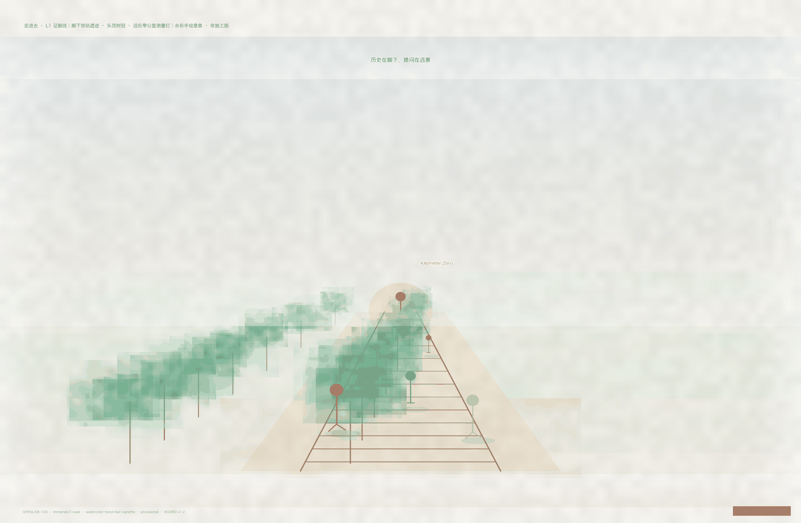

1. **L1 证据线人视：** 人走在可走铁轨上，头顶树冠连续，远处 Kilometer Zero 测量钉——历史在脚下，提问在远景。

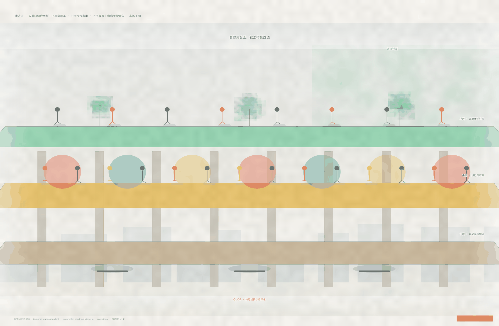

2. **五道口缝合甲板剖透视：** 下层电动车与物流、中层步行市集、上层观景；声明「待红线确认后深化」——有争议但有力。

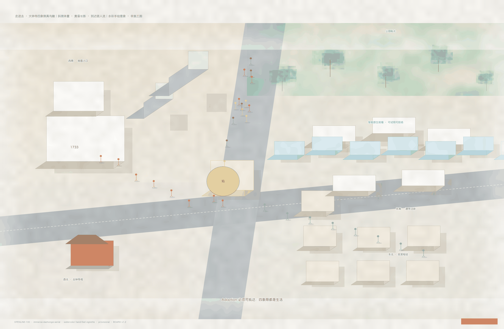

3. **大钟寺站域四象限：** 西南街面入口、东南通学、西北古钟导视、东北买菜——Adoption 必须可抵达。图面若仍留上一轮站前图形，以本章街面规则为准，待整包重渲。

原点转化街不再另做第四张水彩。地点剖面 `key-eyes` 02 切开看见授权窗口与 KM0；失败案例库是卡 01 的继承接口，不是 104 ha 的全部。官方约 3 km² 不以征集重点区替代。

### 物质遗产五种转译｜让铁轨「长」进空间

不要只写「遗产廊道」——铁轨必须变成可触、可坐、可问、可听的城市构件；评审必须看见**京张的钢轨扎进土地肌理** [depth:blue_green_public_space] [data:geometry/roads.geojson#ROAD-FACT-001]：

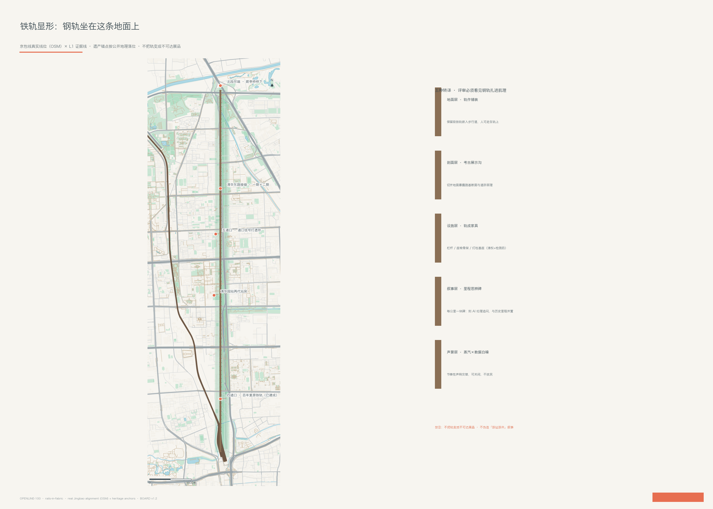

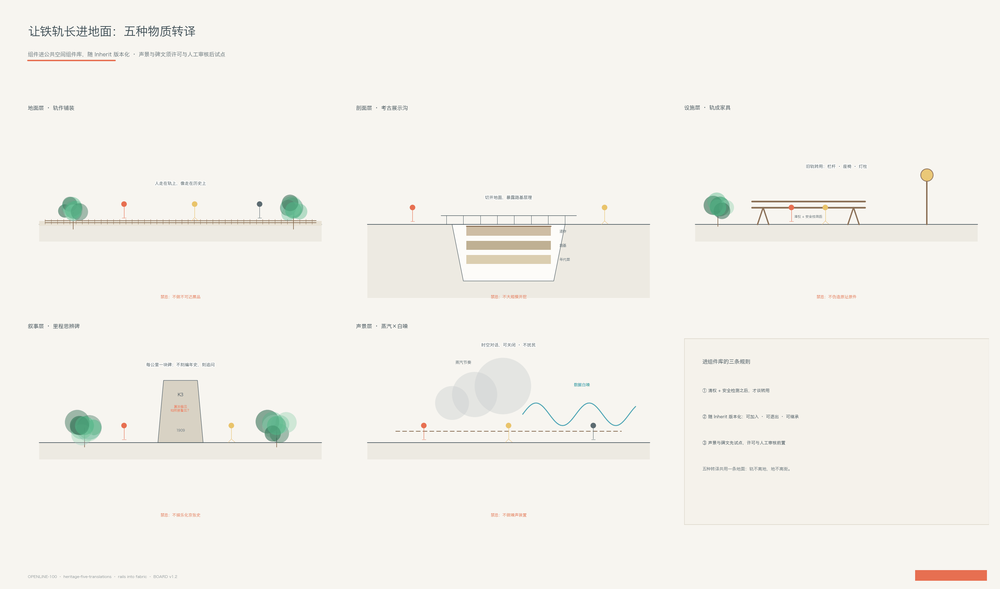

| 层 | 转译动作 | 空间做法（概念） | 禁忌 |
| --- | --- | --- | --- |
| **地面层** | 轨作铺装 | 保留段铁轨不做围栏隔离，嵌入步行道；人可走在轨上，像走在历史上 | 不把轨变成不可达展品 |
| **剖面层** | 考古式展示沟 | 关键节点切开地面，暴露原始路基断面与道砟层理，加护栏与解说 | 不大规模开挖未评估区 |
| **设施层** | 轨成家具结构 | 旧轨转用为栏杆、座椅骨架、灯柱基座（清权与安全检测后） | 不伪造「原址原件」叙事 |
| **叙事层** | 里程思辨碑 | 约每公里一块碑：不刻编年史，而刻 AI 伦理追问（如「算法偏见如何被看见？」），与历史里程并置 | 不娱乐化、不歪曲京张史 |
| **声景层** | 蒸汽节奏 × 数据白噪 | 选定段落保留或模拟蒸汽机车节奏性声响，与低音量数据流白噪交替，形成时空对话；可关闭 | 不做扰民噪声装置 |

组件进入公共空间组件库，随 Inherit 版本化；声景与碑文须许可与人工审核后试点。

五种转译是**显形**。开篇第三章「以人为轨」是**显魂**——考古分级 A/B/C、口述空位「＿」与三次转身见 `heritage-soul`。显形不另立第四套遗产品牌；人字坡只作铁路解剖学，不复活「人字轨」。

用地按国土空间分类语义完整覆盖提交边界、无缝无重叠，作为概念触媒分区而非法定图则 [standard:MNR-LAND-USE-CLASSIFICATION-GUIDE] [data:geometry/land_use.geojson#LU-001] [depth:land_use_layout]：

| 分区角色 | 意图 | Openline 关系 | 证据 |
| --- | --- | --- | --- |
| 西岸研发与协作带 | 全栈研发、开放提问、评测与开源协作 | 贴 L2 西侧，首层可协作/可发布 | [data:geometry/land_use.geojson#LU-001] |
| Openline 蓝绿公共脊 | 遗址公园活力带、慢行与树冠 | 承载 L1/L2 与三个地标 | [data:geometry/green_space.geojson#GREEN-SPINE-001] |
| 东岸生活与转化带 | 人才生活、社区服务、近校转化 | 缝合线接入高校/社区腹地 | 见 land_use 分区图层 |
| 南端智能原生街 | 智能体 / 终端 / 内容消费、数据会客、国际交往 | 大钟寺重点区首层协议；站域四象限只做到达 | [data:geometry/key_areas.geojson#PROV-KEY-003] |

**界面与首层协议（街区结构已知、地块强度未知时的城市设计替代工具）：** Openline 两侧建议连续开放首层（展示/发布/服务），禁止长段封闭围墙；路口视距与无障碍连续；遮荫树列优先于装饰性铺装。以上为设计建议，待权属与图则确认。

### 更新类型学与建筑包络方法

建筑层仅表达概念节点包络，拆改留方法可谈、结论不可编 [data:geometry/buildings.geojson#BLDG-PROOF-001] [depth:retain_renovate_demolish]：

| 类型 | 适用线索 | 设计动作 | 禁止事项 |
| --- | --- | --- | --- |
| 保留加固 | 大跨、院落、可改造结构 | 植入公共展示/协作 | 无测绘不写拆除 |
| 更新改造 | 首层封闭、界面消极 | 打开首层、接 Openline | 不改权属叙事 |
| 插建节点 | Openline 驿站、地标组件 | 低扰动、可逆、可退出 | 不伪报高度/FAR |
| 新建待研 | 正式控规与权属后 | 进入中期项目库 | 不写实施承诺 |

交通与新基建：市政、能源、端侧算力列为 Openline 驿站原型，不写工程线位 [depth:traffic_rail_slow_parking]。风貌：官方管控 / 设计建议 / 待确认文保线三分开；缺文保范围时不做伪精确建设控制 [standard:MOHURD-URBAN-DESIGN-MEASURES]。

## 重点区域详细设计

三处重点区均为 provisional 矩形占位，详细设计属**方向性综合实施方案深度**的概念建议；正式 polygon 到位后须重算面积、断面与项目库 [depth:three_key_area_detailed_design]。三区共用同一 Openline 语法，但**制度、断面、公共组件与场景入口不同**——这是「不是同一园区模板」的硬回答。

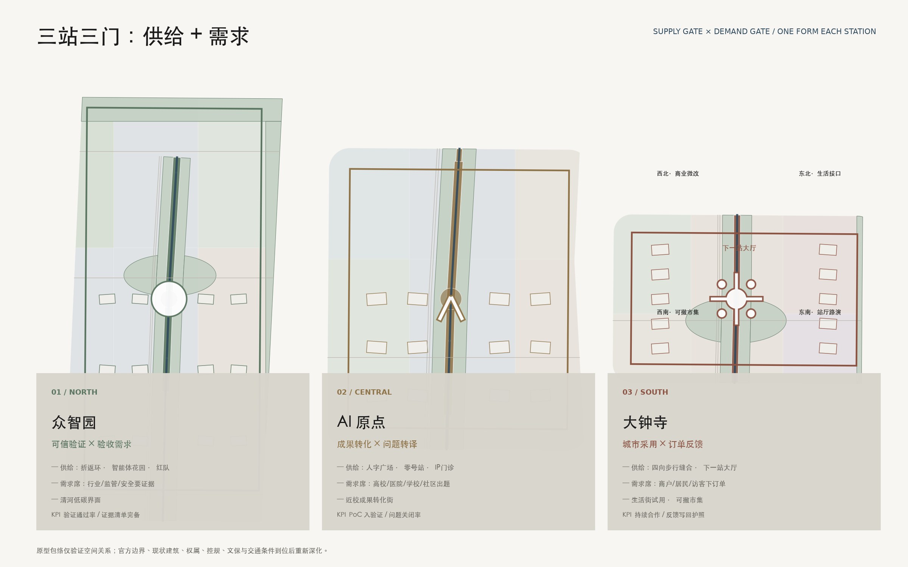

| 重点片区 | 主导任务 | 控规地位 | 核心空间产品 | 主要风险（待正式资料） |
| --- | --- | --- | --- | --- |
| 众智园 | 全栈自主创新 + 全球治理 | **征集重点区必做**；本份街区控规公开四至未覆盖（成府路以北 / 学北园） | **花园型创新街** · 可升级的城市主板（共享底板 + 可升级研发单元） | 正式边界/权属；基础设施容量；蓝线/防洪；学北园开放协议 |
| AI 原点 | 世界级 AI 创新生态 | 两心之一：五道口中心 | **创新策源地** · 策源过墙生态（转化街 + 开源发布 + 站点缝合） | 校园/业主权属与接驳 |
| 大钟寺 | 智能原生新业态 | 两心之一：大钟寺中心 | **智能原生街 The Native Street**（首层业态协议；站域四象限为到达系统） | 业主首层协议；1733 权属；北三环交通；2027 站内通道工期 |

公告面积对照（讨论级）：众智园约 192.1 ha（复算约 192.9 ha）、原点约 104.3 ha、大钟寺约 72.0 ha 量级——以图层属性为准，矩形边不是地块红线 [data:geometry/key_areas.geojson#PROV-KEY-001] [metric:key_area_count]。

### 中标级交付五件套（1:2000 推敲）

世界级城市设计中标包在重点区交的不是再一段概念，而是五张能上桌的硬图。本包按这个标准补齐；全部为 **1:2000 级推敲**，不是法定图则。正式 polygon / 红线 / 强度到位后整包复算，不把街廓当成审批几何 [depth:three_key_area_detailed_design]。

| 中标标准 | 本包图件 | 读图一句 | 诚实边界 |
| --- | --- | --- | --- |
| 总平面 1:2000 | `key-plans-2000` | 同一语法，三种街廓：主板院落 / 转化街横切 / 街墙连续 | 渲染器生成街廓，不是地块图则 |
| 体量与天际线 | `key-massing-skyline` | 白模服从街廓；沿公园南→北不另立塔 | 高度取概念区间，z 轴夸张 |
| 3–5 处地点剖面 | `key-eyes` + 既有「走进去」 | 众智园院落 / 原点 KM0 / 五道口甲板 / 大钟寺站 / 清河是河 | 地点剖面，不是符号街 |
| 典型街道断面 | `key-sections` | L1 / L2 / 协作街 / 转化街 / 原生街面 / 甲板 | 非工程设计；步行全时 ≥50% |
| 分期实施图 | `key-phasing` + `phasing-capital` | 时间轴：0–1 试点 · 1–3 成街 · 3–10 网络；资本：每期同时回答建设 / 出钱 / 运营 / 回流 | 时间轴不是资金计划；资本图是量级闭环，非概算 |

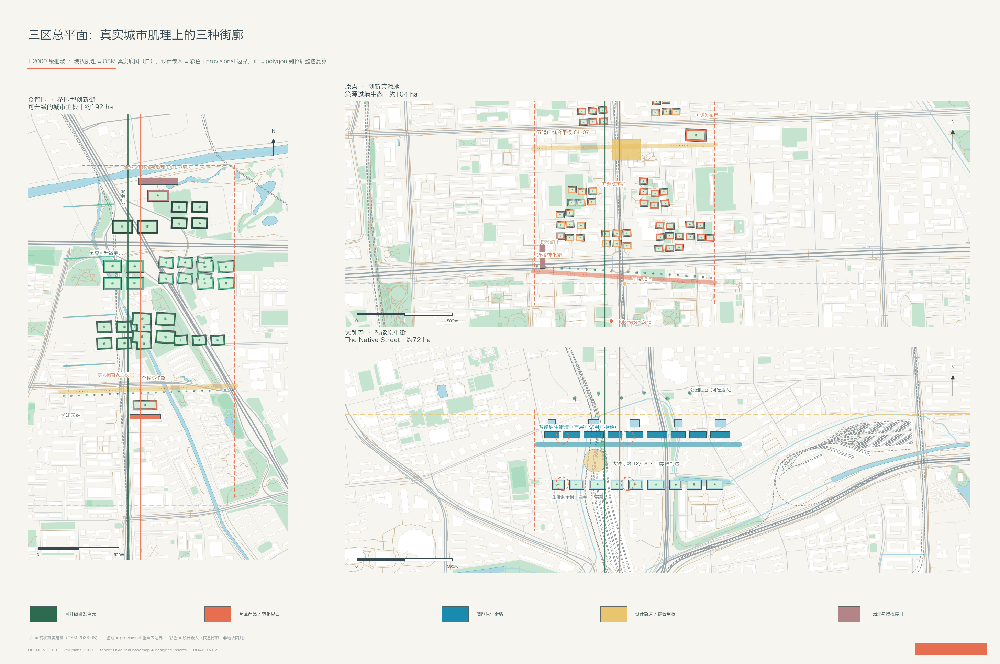

**总平面怎么读：** 北向上。众智园公园贴东（京张北段），全栈协作街东西贯穿院落群，治理中心对清河。原点公园居中，转化街横切，授权窗口在西近校缘，缝合甲板在五道口。大钟寺公园贴北，街墙向南连续，1733 与四象限是到达，不重做总部体量。编号 1–4 是片区产品，不是地块编号。

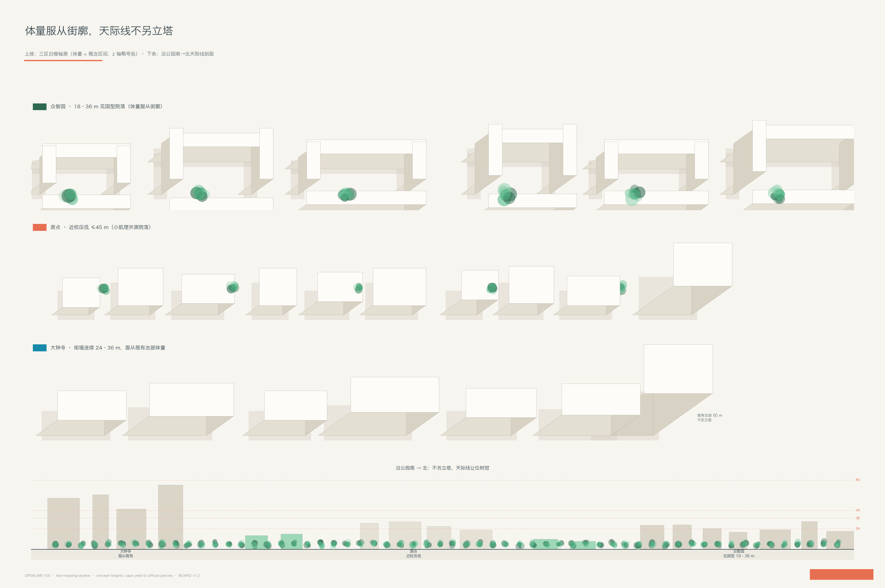

**体量与天际线：** 上排三区白模并置；下条沿公园南→北：大钟寺服从既有总部高度，原点近校压低，众智园 18–36 m 花园型，清河 / 五环收低。禁止用 60–80 m 新塔当朝圣地标。

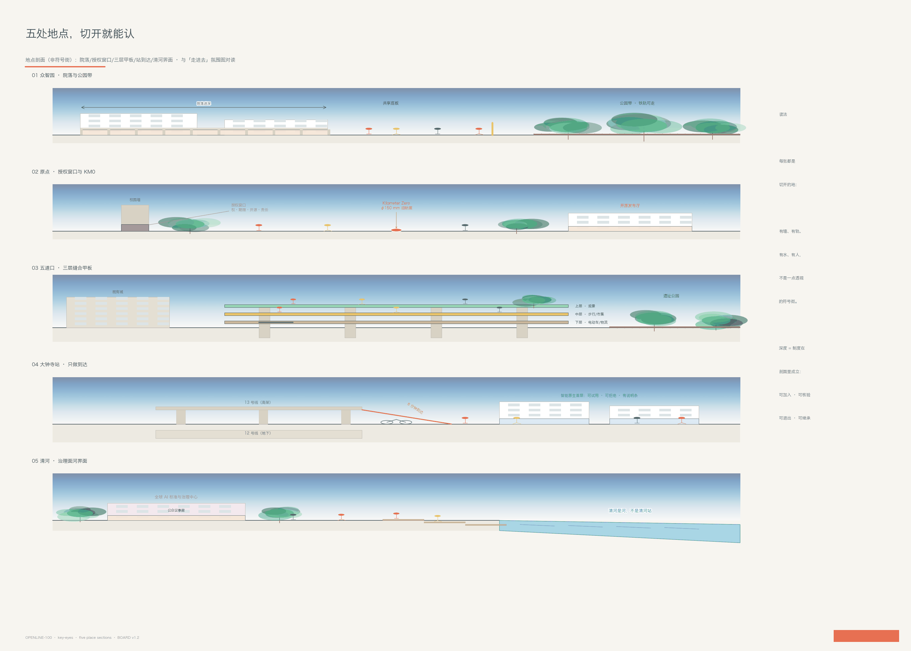

**五处地点剖面：** 01 众智园院落与公园带；02 原点墙上的授权窗口与街上的 KM0；03 五道口既有城 | L1 | 三层板 | 遗址公园（与 OL-07 横剖对读）；04 大钟寺站只做到达、首层可试用；05 清河是河，不是清河站。既有水彩「走进去」三图仍作氛围；本图是切开的地，不是一点透视符号街。

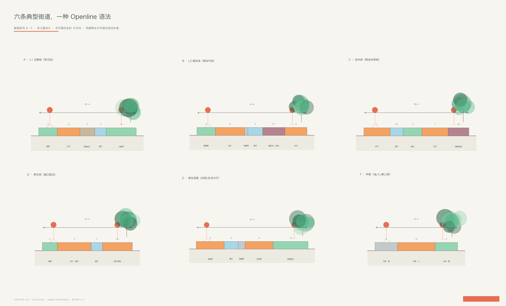

**断面系列：** A 证据线（轨可走）· B 服务线（驿站可挂）· C 协作街（物流在背街）· D 转化街（窗口贴边）· E 原生街面（试用 / 生活分行）· F 甲板（电 / 人 / 景）。机器带永不升级为机动车道。

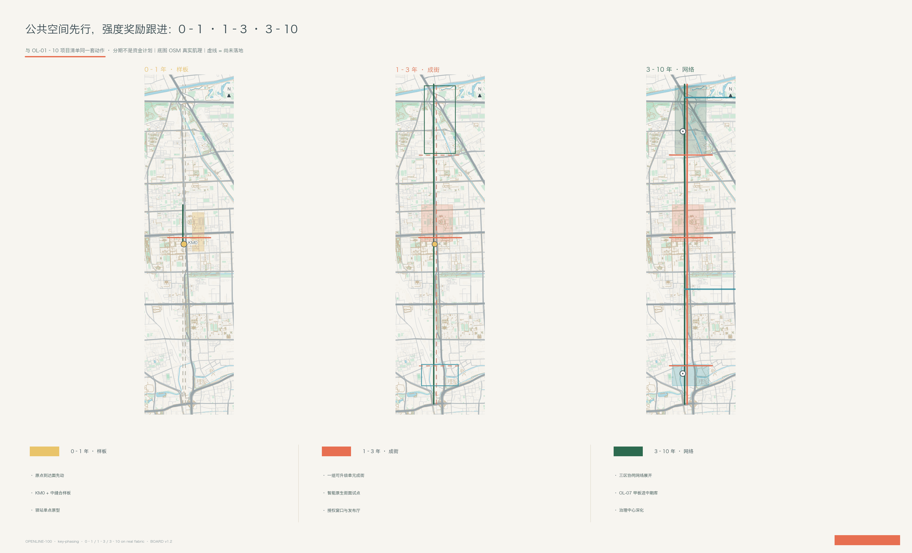

**分期图：** 时间轴见 `key-phasing`——0–1 年原点与到达面先动；1–3 年一组单元成街；3–10 年网络展开，OL-07 进中期库、待红线决策。资本闭环见 `phasing-capital` 与下文「分期资本逻辑」。与 OL 清单同一套动作，不另起分期故事。

### 众智园 · 花园型创新街（AI 自主创新加速区 · 可升级的城市主板）

**真实使命与规划地位：** 众智园不是以参观、消费或单次测试为主的科技园。任务书赋予它的核心职责，是建设 **AI 全栈自主创新体系**，并形成中国参与全球 AI 标准、安全与治理讨论的长期能力。它是征集范围最北部的必做重点区，公告面积约 192.1 ha，锚点为中关村东升科技园学北园，任务明确要求回应五环路、清河和花园型创新街区。2026-08-11 获批街区控规的公开四至北至成府路，未覆盖本片；这不影响详细设计继续开展，但不能把众智园写成该控规已批「第三心」 [source:OFFICIAL-ANNOUNCEMENT] [source:AGENT-TASKBOOK] [source:HD-JINGZHANG-BLOCK-PLAN-20260811]。

**设计命题：** AI 技术几年一代，城市空间几十年一代。若按今天的产业清单把每栋楼一次性写死，下一轮技术变化就会带来搬迁和反复拆建。众智园因此被设计成一块**可升级的城市主板**：长期稳定的是花园、慢行、服务交通、共享技术平台和治理接口；持续变化的是研发团队、实验室配置、设备与应用场景。它不是把电路板造型贴到地面，而是一条规划规则：**共享底板保持稳定，技术单元持续更新；让 AI 上下游成为步行可达的邻居，让每次升级都有标准与责任接口。** [depth:overall_spatial_structure]

**现状不是白纸（A 级，不重做）：**

| 对象 | 已建成 / 已公布 | 城市主板的增量 | 禁忌 |
| --- | --- | --- | --- |
| 公园二期北段 | 2026-08-06 开园；清华东路—北五环箭亭桥，2.6 km / 30.01 ha；含京张之环、步行/慢跑/骑行三道、乡土植物科普园、林下剧场与球场 | 作为共享绿色底板，研发组团从边缘接入，不占廊心 | 不重画京张之环、铁轨步道与三道一绿 |
| 鱼骨慢行 / 桥下 | 3 条鱼骨状通道盘活箭亭桥、13 号线高架桥下；公园与清河绿廊东西互通 | 作为全栈协作街的既有横向接口 | 不另画一套慢行系统 |
| 清河滨水绿廊 | 已与公园互通；任务书要求挖掘清河文化 | 布置国际治理与低碳交往的公共界面 | 蓝线未定不做假退线；不做个人追踪 |
| 学北园 / 东升科技园 | 海淀 2026-03 锚点；学清路×月泉路；昌平线学知园站 | 作为首发主板：共享首层、可升级研发单元和公共技术平台优先利用存量空间 | 不重做园区总图；不声称已获业主同意 |
| 北五环箭亭桥 | 公园北尽端；任务书要求结合五环路区域一体化 | 研究人才、设备与生产服务的对外联系及桥下兼容性场景 | 不改五环主线；不报互通式立交或上路许可 |

#### 空间公式：一块共享底板 · 五类可升级单元 · 一条全栈协作街 · 一个全球治理中心

**共享底板**是长期不重复建设的公共能力：连续花园与无障碍慢行、公共首层、共享会议与工程服务、设备物流和维护接口，以及经授权的算力、数据、网络、能源和安全服务。底板不等于把所有基础设施集中进一栋楼，而是让不同组团能够按统一接口接入、退出和升级。

**五类可升级创新单元**把全栈关系变成邻里关系，而不是五座彼此封闭的园区。单元边界可随技术演进调整，名称表达当前任务而非永久用地性质 [data:geometry/key_areas.geojson#PROV-KEY-001] [data:geometry/buildings.geojson#BLDG-PROOF-001]：

| 可升级单元 | 当前全栈任务 | 共享空间配置 |
| --- | --- | --- |
| 芯片与算力协同 | 芯片、计算系统、端侧基础设施及能效协同 | 可适配技术大厅、共享装卸与运维接口 |
| 基础软件与工具链 | 基础软件、开发框架、工程工具与互操作 | 联合工程工作室、兼容性空间与安全协作室 |
| 数据与模型 | 基础/行业模型、数据治理、训练与评估 | 受控数据空间、模型工作室、人工复核与文档接口 |
| 智能体与行业应用 | 城市智能体、企业智能体、应用集成与服务设计 | 场景工作室、运营室、跨团队协作空间 |
| 具身智能与场景 | 机器人、端侧设备及受控场景集成 | 可重组场地、安全隔离、设备工位与操作员界面 |

**全栈协作街**从学知园站、学北园共享首层接到既有鱼骨慢行、公园北段、清河与箭亭桥。它是研发协作、人才服务、设备预约、成果发布与公共沟通的共同地址，不是新造一条仪式性大道。五类单元的公共首层面向同一条街，共享会议室、组件库、餐饮休息和技术服务放在相邻单元之间，让上游部件到下游应用不再经历一串门禁。

**全球 AI 标准与治理中心**与研发单元并列为核心功能，面向清河公共界面设置标准工作坊、安全与伦理协作、开源治理、国际论坛、人工复核和公众资料空间。它不是偶尔启用的会议中心或荣誉展厅；主要产出应是双语标准草案、接口规范、事件复盘、责任记录与可复用治理组件。每个技术单元升级前，都要在这里说明系统边界、数据权利、责任主体、人工复核点、维护责任与退役路径 [standard:PROJECT-AGENT-OPEN-CALL-TASKBOOK]。

#### 城市与建筑如何跟着团队成长

团队的成长路径不再是「孵化器毕业后搬走」，而是：**进入共享底板 → 使用小型研发单元 → 接入公共技术平台 → 扩展为联合实验室或工程团队 → 完成标准、安全与风险协同 → 扩展为独立楼层、楼栋或专业组团。** 收缩与退出同样被设计：团队归还部分单元，设备与数据按协议迁出，空间恢复到可再次使用的标准状态。

| 层 | 长期稳定的部分 | 可以持续升级的部分 |
| --- | --- | --- |
| 城市底板 | 慢行与无障碍、公共界面、消防与服务通道、蓝绿空间 | 可逆家具、活动与局部场地组织 |
| 建筑底板 | 可保留的大跨结构、院落、结构网格与核心筒 | 隔墙、实验室配置、共享工作室与首层界面 |
| 技术层 | 标准化的装卸、维护、网络与安全接口 | 计算模块、设备工位、受控房间与软硬件环境 |
| 治理层 | 责任记录、人工复核、公共说明、事件与退役程序 | 标准版本、评估方法与协作议题 |

拆改留先看测绘与结构条件：大跨与院落优先保留，封闭首层在业主协议下分时打开；新增技术空间优先采用可维护、可替换的构造。一次技术换代应尽量只更换模块和内部配置，而不是重建一个园区 [depth:retain_renovate_demolish]。

#### 五个在地空间动作

1. **以学北园为首发主板，不重造校园。** 盘点现有楼宇、院落和共享设施，选择可改造首层作为共享技术与人才服务入口；设备物流从服务侧进入，公共慢行从花园侧进入。
2. **接上现有鱼骨慢行，不另画一套道路。** 全栈协作街利用学知园站—月泉路—学北园—公园北段—清河的既有关系补齐断点，访客、员工、设备物流与应急流线分层组织 [data:geometry/roads.geojson#ROAD-STITCH-N]。
3. **让五类单元沿同一条工作街相邻。** 研发空间可以重组，公共技术平台和会议服务放在单元交界处；创新发生在接口，而不是各自门禁后的孤岛。
4. **把全球治理放进研发过程。** 治理中心紧贴技术单元和清河花园界面，标准、安全、伦理与国际协作从项目早期介入，而不是产品完成后的补审。
5. **把花园作为创新基础设施。** 公园和清河承担降温、雨洪、慢行、户外讨论、国际交往与人才日常生活；产业展示嵌入共享首层，只展示经授权成果、标准演进与治理贡献，不做科技主题乐园 [data:geometry/green_space.geojson#GREEN-PROOF-001]。

**15 分钟城市主板路径（讨论级）：** 学知园站 → 月泉路共享门厅 → 学北园公共技术平台 → 可升级单元样板庭院 → 全球 AI 标准与治理中心 → 清河花园客厅 → 公园北段。对访客，它应讲清「底层能力—工程工具—模型与智能体—应用—标准治理」的完整关系；对工作者，它意味着从研发单元步行可达共享平台、治理服务、轨道入口和花园休息空间。正式道路红线、门禁和权属到位后再实测，走不通就调整入口，不在图上宣布完成。

```
北五环 / 箭亭桥（对外联系与生产服务研究）
          │
清河花园 ─ 全球 AI 标准与治理中心 ─ 公园北段 / 既有鱼骨慢行
                    │
芯片算力 ─ 基础软件 ─ 数据模型 ─ 智能体应用 ─ 具身场景
             ╲──── 全栈协作街 / 共享底板 ────╱
                    │
          学北园共享首层 / 学知园站
```

**公共空间与场景接口：** 共享工作庭院、可预约会议与工程服务、组件库、无障碍环线、多语导视、遮荫、清河文化与低碳展示。S-02 安全治理沙盒作为受控技术工具嵌入治理中心与具身单元；S-06 清河低碳创新廊成为共享绿色底板。卡 03 写的是时间分层，不是园区导览：共享底板是不变层，五类单元是可变层，治理门是许可层。治理中心的公众议事廊是治理门的公众面（遗憾条款、地层墙），不再当众智园名片。15 分钟路径只检验换代后是否仍可读。学北园约 3.53 ha 是种子，不是征集重点区 192 ha。

**成功判据：** 技术模块能否在不重建街区的情况下升级；小团队能否在园内扩展、收缩或退出；上下游团队能否共享一条连续工作环境；每个进入场景的系统是否都有明确的人工复核与责任接口；公众能否在不进入受控实验室的前提下理解全栈体系如何工作。

**诚实边界：** 当前没有众智园官方精确 polygon、地块图则、权属、蓝线、道路红线和经核验的建筑/市政容量。本节不声称业主同意、国家平台落地、运营主体确定、工程获批或具身智能获准上路；算力、能源、消防、数据安全和防洪需求须在正式资料和专业专项到位后校核 [data:geometry/key_areas.geojson#PROV-KEY-001]。

**分期：** **0–1 年**完成建筑、接口、设施容量与权属普查，接续既有慢行，启动共享门厅、开发者工作坊和标准议题的轻量试点；**1–3 年**改造一组可升级研发单元，启动一处公共技术平台和轻量治理中心，实测 15 分钟路径与团队扩缩容过程；**3–10 年**在正式边界、强度、能源、市政、安全与运营责任确认后扩展五类单元网络和全球治理中心，并深化五环区域交通联系 [depth:phasing_implementation]。

### 北京 AI 原点社区 · 创新策源地（Open Question · 可提问）

**定位：** 近校型开源协作与成果转化社区——这里回答「问题如何被公开提出、人才如何留下来协作」。**规划地位：** 对位已批两心中的**五道口中心**（人工智能产业创新集聚区、顶尖人才交流中心，草案公开口径）；与官方「AI 原点社区 · 创业首选」同核，不另立地名 [source:HD-JINGZHANG-BLOCK-PLAN-20260811]。

**设计命题：** 任务书给原点的是世界级 AI 创新生态。官方三个产品是全球首发地、栖息地、全要素生态服务站；政策层已经说尽。本区回答政策买不到的空间问题——实验室成果如何过墙。近校转化、开源发布、人才停留是片区工作。一句话：**不经授权窗口，校园成果不能上街。** 官方约 3 km²（五道口核心）不以征集重点区约 104 ha 替代。

片区概括是**创新策源地**——官方定位「创新策源、创业首选」的空间落实；片区产品是**策源过墙生态**。卡 01 写的不是走廊观光，而是策源过墙的必要关系（附录 C-1）：权→配→证→用→遗。约 200 m 走廊只是切片，不是 104 ha 的名字。Kilometer Zero 退成缝合甲板上的测量钉（讨论 φ150 mm，旧轨钢），不是仪式广场 [data:geometry/public_space.geojson#PUBLIC-KM0] [data:geometry/public_space.geojson#PUBLIC-JOIN]。

**五个必要环节（概念，非正式控规；对位卡 01；跳过任一步原点只是近校园区）：**

1. **权（授权窗口）。** 过墙捆绑的是许可，不是人流：使用范围、期限、可否开源、出事找谁。没有许可条，匹配与首发都是违法或违约。**不得声称已获高校或业主同意** [data:geometry/buildings.geojson#BLDG-QUESTION-001]。
2. **配（八找并置）。** 政策、资金、算力、人才、伙伴、智力、空间、场景必须在步行内成交。跑四个园区才找齐，全要素服务站就是目录。栖息地挂在匹配边上，让人留得够久把八找做完，不另起创业宿舍品牌。
3. **证（开源 / 首发）。** 官方「全球首发地」只在公开、可失败的声称里成立。关起门转化是技术转移办公室，不是策源地。独立运营见 S-01。
4. **用（社区微场景）。** 食堂、配送、导览、物业做真实交易。没有非表演客户，首发是路演。脱敏摘要回流众智园，供卡 03 升级许可。
5. **遗（失败案例库）+ 缝合甲板。** 失败不留给下一届，生态每届清零。记录可撤、可改写。OL-07 把校园侧接到街上——谁能不走甲板从学校进公园，墙还在，只是没被设计。

**成功判据：** 不经授权窗口校园成果能否上街（必须不能）；八找是否必须跑四个园区（必须不必）；不走缝合甲板能否从校园进公园（必须不能）；3 km² 官方口径是否被画进 104 ha（必须没有）。
**诚实边界：** 甲板待红线与桥墩权属；授权窗口与失败案例库落在社区界面，须业主、街道与高校协议；不把平面符号再写成地标。

### 大钟寺 · 智能原生街 The Native Street（Open Adoption · 智能原生新业态）

**定位：** 城市型人工智能创新街区——任务书要求这里承载**智能体、智能终端、内容消费**等 AI 原生与 AI+ 融合业态，并探索数据要素流通与国际交往。**规划地位：** 对位已批两心中的**大钟寺中心**（互联网和相关服务业、人工智能、新媒体，草案公开口径）。它不是再造一座封闭园区，也不是用站前装置冒充 72 ha 重点区 [source:HD-JINGZHANG-BLOCK-PLAN-20260811] [source:OFFICIAL-ANNOUNCEMENT] [source:AGENT-TASKBOOK]。

**设计命题：** 众智园把能力做出来并管住；原点把问题公开并提出；大钟寺必须让没预约的人在街上碰上已经核验过的东西——能试用、能买、能订、能拒绝。一句话：**核验过的能力，必须能上街。** 这是规划规则，不是地面图形。

签名产品是 **智能原生街 The Native Street**：领军企业周边、1733 既有商业、公园贴边共享一条首层协议。站一体化与路口四象限是到达系统（任务书必做），不是全区的名字。公开议事用街面与 1733 既有可预约厅，不另立纪念物。不仿钟、不做钟形屋顶、不把商场中庭改名、不把字节跳动写成已签约业主。

**现状不是白纸（A 级，不重做）：**

| 对象 | 已建成 / 已公布 | 本方案增量落点 | 禁忌 |
| --- | --- | --- | --- |
| 领军企业 / 1733 | 北三环西路甲 18 号；约 3.8 万 m² 商业；12 号线 D 口在馆内 | 首层智能原生协议；数据要素会客与国际路演用既有可预约厅（S-05 / S-08） | 不改写字楼；不声称业主已同意 |
| 12 / 13 换乘 | 站内通道暂缓至约 2027-12；站外约 8 分钟：D 口 → 1733 东端 → **楼梯**上地面 → 13 号线 A/B；30 分钟连续计费 | **到达系统 OL-04**：24h 公共通行协议（非征收）、东端无障碍 P0、路口四象限步行、四角非机动车泊位 | 不把 2027 站内通道画成本方案交付；不挖新隧；不把换乘廊写成全区产品 |
| 公园二期南段 | 2026-08-06 开园；三环门户城市阳台 | 规划绿地复合利用：阳台与贴边承接街面溢出，不占廊心 | 不重画复原铁轨、龙门吊、三环阳台 |
| 13 号线桥下 | 既有桥下；二期已盘活部分 | 接四象限慢行，一种铺装与照明连续到街面 | 不改桥梁结构、不报跨度 |
| 大钟寺古钟博物馆 | 甲 31 号，永乐大钟 | 过街导视；寺是听钟，街面是用 | 不仿造大钟装置；不用金色仿铜 |

**五个空间动作（概念，非正式控规；对位任务书大钟寺条款）：**

1. **智能原生首层（片区规则）。** 沿总部界面、1733 外沿、公园贴边，建议连续开放首层：智能体服务窗口、终端试用、内容放映/零售。试用必须可拒绝、可退出；没有「谁核验、失败过什么、出了事找谁」的说明条，不准上街。不指定品牌，不编造招商 [data:geometry/buildings.geojson]。
2. **数据要素与国际会客。** 用 1733 既有可预约厅承接数据要素会客（S-08）与国际路演（S-05）。西翼科技服务翼提供 IP / 资本 / 许可接口，不在大钟寺另造基金大厦。
3. **站域一体 + 路口四象限（到达，不是身份）。** 优化大钟寺站与重点地块连通：既有 8 分钟路径保持公共通行；东端楼梯改坡道+电梯为 P0；北三环西路 × 京包铁路桥四象限步行；四角非机动车停放。2027 年后站内归地铁，街面规则留下（assumptions A-DAZHONGSI-1733-001）。
4. **规划绿地复合利用。** 公园贴边做可逆插入的展示与停留，服务企业交往与通勤间歇；不占已开放廊心，不种大树在 1733 结构上。
5. **社区开口。** 东南通学、西北古钟导视、东北买菜短径。不改建三环主线。社区墙开口做 20 分钟生活路径。

   | 象限 | 现状锚点 | 步行动作 |
   | --- | --- | --- |
   | **西南** | 13 号线站 + 1733 + 总部校园 | 智能原生街入口；站到达 |
   | **东南** | 太阳园 / 蓝景丽家 / 中关村四小；12 号线 E 口 | 通学过街；自行车泊位 |
   | **西北** | 过街天桥北、往古钟博物馆 | 导视与遮荫，不仿钟 |
   | **东北** | 北三环北侧社区 / 公园贴边 | 买菜短径，接二期鱼骨慢行 |

**8 分钟到达路线（讨论，对位众智园 15 分钟主板路径）：** 12 号线 D 口 → 1733 既有路径 → 上地面进入街面（Join）→ 试用或路过一件已核验业态（Verify / Adoption）→ 可走开（Exit）→ 13 号线或四象限生活路径（Inherit）。被营业切断、只能进封闭厅才能碰到业态，都不算街面成立。

```
西翼科技服务（IP / 资本 / 标准）──┐
小月河场景题 ── 原点转化 ── 众智园治理复核 ──► 大钟寺智能原生街
                                                    │
12号线 D口 ── 1733 公共通行 ── 四象限步行 ── 13号线 A/B
                              （到达系统，不是全区名字）
```

**诚实边界：** 首层协议须业主与街道同意；24h 廊与无障碍须业主+地铁+街道协议；四象限过街须交通组织；2027 工期不是本方案工程；不报容积率；不把字节跳动写成实施主体；街面不是广告廊。

**分期：** **0–1 年**首层试点界面（一处企业边 + 1733 外沿）、24h 通行与无障碍协议、四象限过街研究；**1–3 年**街面连续、数据会客与路演节奏、社区开口；**2027 年后**站内归地铁，街面规则留下。

**公共空间组件：** 可拒绝试用位、说明条、可移动座椅、行李坐凳、多语导视、四角自行车架。
**AI 场景入口：** S-05 / S-08 在既有厅；街面承接终端与内容消费的可退出试用。
**成功判据：** 不进封闭厅能否碰到一件可试用、可拒绝的业态（必须能）；没预约 10 分钟内能否碰上（必须能）；四象限步行是否被车行切断；营业是否切断到达路径；有没有未写责任接口的展示（必须没有）。深度场景即卡 02（附录 C-2）。
**节点放大（概念）：** 街面首层展开 + 站域四象限平面；材质：暗铜只作收边、暖木坐面、米白导视。不把站前高差做成全区地标。

## AI 创新生态、人才画像与 AI+ 场景

Openline 的用户不是「被管理的对象」，而是可持开放规则进入/退出的参与者。下列画像与场景卡均为概念建议，含隐私边界与人工复核 [source:AGENT-TASKBOOK]。

**场景系统的取舍：宁深勿广，且 1:1 对三重点区。** 定位已钉死：卡 01 = 原点策源过墙，卡 02 = 大钟寺街面采用，卡 03 = 众智园全栈升级。深度不在「一天走五站」，而在每区的生产逻辑——**少一步即假**。卡 01 是因果链（权→配→证→用→遗）；卡 02 是并置（街面法则 ‖ 下街例外 ‖ 生活剩余），到达只检验法则能否被路过；卡 03 是时间分层（不变层 / 可变层 / 许可层），15 分钟只检验换代后是否仍可读。S-01–S-10 现为十张全深度卡，每张八件。未呼先应仍是东翼卡 S-09 / D-10。任务书「不少于 3 张产业测试验证场景」由卡 02 街面试用、卡 03 升级许可与治理门，以及索引 S-02、S-03、S-08 共同承接。

| 用户画像 | 典型需求 | 空间响应 | 自检边界 |
| --- | --- | --- | --- |
| 开源开发者 | 发布、协作、声誉 | 原点开源发布厅、公共代码墙 | 不采个人轨迹；活动仅聚合统计 |
| 初创团队 | 低成本试验与算力入口 | 众智园共享技术平台、可升级研发单元与端侧驿站概念点 | 算力/数据须另行授权 |
| 头部企业访客 | 展示、路演、招聘 | 1733 既有可预约厅 / 公园贴边可逆插入 | 企业标识须清权；不声称业主已同意 |
| 周边居民 | 通勤、休闲、低扰动 | Openline 慢行、社区服务嵌入 | 居民画像不作商业推荐 |
| 高校师生 | 转化、跨校协作 | 近校转化街、教育体验点 | 校园与科研成果须授权 |
| 国际参访者 | 短路径理解一带 | 朝圣地标路线 + 多语导视 | 不采集护照级身份作默认条件 |
| 社区居民（老/中/幼） | 社区微场景、通学买菜、日常治理参与 | 原点社区微场景首批用户（知情同意）、大钟寺四象限生活路径、众智园治理门旁听、东翼 S-09 驿站 | 健康数据本地存储；服务不采集轨迹；人工始终在场；退出权随时行使 |

### 十张全深度场景卡

| 卡 | 主题 | 一句话概念 | 生产逻辑（少一步即假） | 规则链 | 详案 |
| --- | --- | --- | --- | --- | --- |
| **01 AI+原点社区 · 策源如何过墙** | 世界级创新生态 | 不经授权窗口，校园成果不能上街 | **权→配→证→用→遗**：无授权则匹配非法；匹配不在步行内则八找是目录；无公开首发则不是策源地；无真实交易则首发是表演；失败不继承则每届清零 | Join → Verify → Exit → Inherit | 附录 C-1 |
| **02 大钟寺 · 核验过的能力必须能上街** | 智能原生新业态 | 没预约也能试用、能拒绝；营业不切断公共通行 | **街面法则 ‖ 下街例外 ‖ 生活剩余**（三层并置，不是五站观光）：无说明条=广告廊；数据摊上街=泄露；四象限被吃=产业园冒充街区；8 分钟到达只检验法则能否被路过 | Join → Verify → Exit → Inherit | 附录 C-2 |
| **03 众智园 · 全栈如何升级而不拆城** | 全栈自主 + 全球治理 | 小团队能扩缩退；换代不拆街；无通行证也能看懂全栈 | **不变层 / 可变层 / 许可层**：底板不稳则换代拆城；单元无门则换代无人负责；门无公众面则国家平台是黑盒；15 分钟只检验换代后是否仍可读 | Verify → Exit → Inherit | 附录 C-3 |
| **04 安全治理沙盒**（S-02） | 测试验证 | 受控测试必须有公众看得见的门 | 脱敏评测集 + 专家复核 + 临街说明界面；无说明界面则沙盒是黑箱 | Verify → Exit | 附录 D-04 |
| **05 端侧算力驿站**（S-03） | 测试验证 | 算力像图书馆座位一样可预约、可离席 | 预约 → 核验 → 计时 → 离站清镜像；无清镜像则驿站成数据采集点 | Join → Exit | 附录 D-05 |
| **06 AI 慢行导航**（S-04） | 交通生活 | 导航默认可关，城市不靠它才能走 | 仅聚合数据 + 本地优先 + 物理导视兜底；无物理兜底则系统停机=城市失能 | Join → Verify → Exit | 附录 D-06 |
| **07 国际路演客厅**（S-05） | 产业交往 | 国际交往用既有厅，不为路演建塔 | 预约 + 清权 + 开放日；无清权则客厅变广告位 | Join → Exit | 附录 D-07 |
| **08 清河低碳创新廊**（S-06） | 公共空间 | 生态数据全公开，监测本身就是承诺 | 传感 → 信托 → Verify 闸公开；接 A-ECO-001 监测闭环，无公开则低碳是口号 | Verify → Inherit | 附录 D-08 |
| **09 数据要素会客厅**（S-08） | 测试验证 | 数据交易在楼下厅里，绝不上街面 | 授权清单 + 审计追踪 + 人工合规；无审计追踪则会客厅成灰市 | Verify → Exit → Inherit | 附录 D-09 |
| **10 未呼先应**（S-09） | 公共服务 | 人工智能先听懂人，人工永远在场 | 听懂 → 想到 → 办妥 → 办不了转 12345；无人工兜底则服务歧视数字弱势群体 | Join → Exit | 附录 D-10 |

十张卡每卡补齐八件：用户 / 场所 / 触发 / 运营 / 数据最小化 / 人工复核 / 退出·停机 / 指标。S-02 / S-03 / S-04 / S-05 / S-06 / S-08 / S-09 见附录 D-04–D-10；**S-01 / S-07 / S-10 不再并入他卡计数**，各有独立八件卡（D-S01 / D-S07 / D-S10）。卡 01–03 仍是三区生产函数详案（附录 C），不替代索引号。

### 场景索引 S-01–S-10（一行一项）

| 编号 | 场景 | 类型 | 空间载体 | 一句话 |
| --- | --- | --- | --- | --- |
| S-01 | 开源发布厅 | 产业协作 | 原点社区 | 卡 01 开源/首发的独立运营形态：公开议程、人工主持 |
| S-02 | 安全治理沙盒 | **测试验证** | 众智园治理中心 + 具身智能单元的受控场地 | 脱敏评测集 + 专家复核；公众说明界面可见，受控区不可闯入 |
| S-03 | 端侧算力驿站 | **测试验证** | Openline 服务节点 | 端侧原型与能耗日志；与 S-09 共享空间、物理隔离 |
| S-04 | AI 慢行导航 | 交通生活 | Openline 主脊 | 仅聚合拥堵数据，默认可关闭 |
| S-05 | 国际路演客厅 | 产业交往 | 大钟寺 · 1733 既有可预约厅 | 预约制、内容清权；不新建塔楼 |
| S-06 | 清河低碳创新廊 | 公共空间 | 众智园共享绿色底板 · 清河界面 | 环境传感公开、人工巡检，向小月河翼延伸 |
| S-07 | 近校成果转化街 | 转化服务 | 原点 | 授权窗口—原型工坊—发布厅连续界面 |
| S-08 | 数据要素会客厅 | **测试验证** | 大钟寺 · 1733 既有可预约厅 | 授权清单 + 审计追踪 + 合规顾问窗口 |
| S-09 | 未呼先应 | 公共服务 | 小月河翼 · Openline 驿站网络 | 听懂 / 想到 / 办妥；红色「我要跟人说话」召唤钮；工单直转 12345；不占三区深度卡 |
| S-10 | 全球 AI 活动周路线 | 文化运营 | 一带公共系统 | 活动许可 + 安全预案，组件随 Inherit 版本化 |

### 场景卡 01｜AI+原点社区 · 策源如何过墙（摘要 · 详案见附录 C-1）

**核心概念：原点生产的是可过墙的策源，不是近校园区。** 官方三个产品（全球首发地、栖息地、全要素生态服务站）政策层已经说尽。本卡写的是它们之间的**必要关系**：没有授权，八找是非法匹配；八找不在步行内，全要素服务站是目录；没有可失败的公开首发，全球首发地是会场；没有社区真实交易，首发是表演；失败不留给下一届，生态每届清零。空间只是这五环的落点，200 m 走廊是切片。官方约 3 km² 不以 104 ha 替代。完整因果链与自检见附录 C-1。

### 场景卡 02｜大钟寺 · 核验过的能力必须能上街（摘要 · 详案见附录 C-2）

**核心概念：大钟寺生产的是可拒绝的采用，不是站前观光。** 城市型街区的深度在三层**并置**：街面法则（核验过的能力占用首层，说明条四项，可试用可拒绝）；下街例外（数据要素与国际交往进 1733 可预约厅——不是下一站，是不准上街的东西的收容）；生活剩余（通学 / 买菜 / 古钟导视不可让渡）。8 分钟到达只检验法则能否被路过；营业切断，法则对员工有效、对城市无效。完整分层与自检见附录 C-2。

### 场景卡 03｜众智园 · 全栈如何升级而不拆城（摘要 · 详案见附录 C-3）

**核心概念：众智园生产的是可许可的换代，不是 15 分钟园区导览。** 深度在时间分层：共享底板是**不变层**（换的是模块，不是街区）；五类单元是**可变层**（小团队扩缩退写进邻里）；治理门是**许可层**（换代的唯一合法入口；遗憾条款与地层墙让失败的升级仍承重）。无通行证能读懂全栈，是换代之后城市仍可被理解，不是博物馆。15 分钟路径只检验这套分层换代后是否仍可读。学北园约 3.53 ha 不以 192 ha 替代。完整分层与自检见附录 C-3。

**小月河场景赋能翼：** 任务书东翼在此落地。S-06 清河界面延伸至小月河廊，形成「出题—漫步—公共体验」路径，承接 AI+ 医疗 / 教育 / 法律 / 生活等场景试题（可关闭、须人工复核）。**S-09 未呼先应**落在东翼驿站网络（约 3–4 节点，间距 800–1000 m）：听懂、想到、办妥；红色「我要跟人说话」召唤钮；办不了的生成规范工单直转 12345。它与西翼科技服务对称，不占三区深度卡，也不把大钟寺站写成东翼 [depth:blue_green_public_space]。五域试题的沿河站点分布（E-01–E-04）、元土城—蓟门烟树遗产层对位与端侧算力驿站建筑概念，详案见统筹研究章「两翼深化设计」；现场核验清单已增补 P-09 / P-10。

场景空间落到公共空间与道路层 [data:geometry/public_space.geojson#PUBLIC-JOIN] [data:geometry/roads.geojson#ROAD-SPINE-001] [metric:public_space_ratio]。城市智能体可辅助识别断点与维护需求，不得替代审批，不得输出未授权个人画像。

## 用地、建筑规模与拆改留方案

用地按国土空间分类语义完整覆盖提交边界、无缝无重叠，作为概念触媒分区而非法定图则 [standard:MNR-LAND-USE-CLASSIFICATION-GUIDE] [data:geometry/land_use.geojson#LU-001]。当前概念绿地率约 20%、公共空间率约 8%，用于讨论 Openline 日常承载力。街区控规已批但**绿地率法定值仍未随公开新闻发布**，本表不把 1668.2 ha 控规范围与 1141 ha 提交足迹直接相除——两套四至不同，不可混算 [metric:green_ratio] [metric:public_space_ratio] [source:HD-JINGZHANG-BLOCK-PLAN-20260811]。

建筑基底为 Openline 节点概念包络，合计约 48.2 万 m²，**不等于**法定建设规模；容积率、建筑密度、建筑高度的**地块控制值**一律 `unknown`，待正式图则——但**概念量级可以而且应该给**：下文用地平衡表与强度区间以区间、假设与复算方法的形式给出讨论级量级，不伪精确 [metric:building_footprint_area_sqm] [depth:development_intensity_controls]。拆改留只提供方法：先锁定文保与权属，再谈保留/改造/更新/新建；无现状测绘前不输出地块级结论。存量更新优先对位控规「老旧厂房改造、低效楼宇更新」路径 [depth:retain_renovate_demolish] [data:geometry/buildings.geojson#BLDG-QUESTION-001] [source:HD-JINGZHANG-BLOCK-PLAN-20260811]。

### 概念级用地平衡表（讨论级 · 可复算）

面积来自 `geometry/land_use.geojson` 五分区声明值（provisional，EPSG:4548 复算口径）；占比以提交边界 ≈1141.3 ha 为分母；分类代码为图层声明代码，对应国土空间分类语义、非法定图则 [data:geometry/land_use.geojson#LU-001] [metric:site_area_sqm] [standard:MNR-LAND-USE-CLASSIFICATION-GUIDE]：

| 分区 | 图层声明代码 | 面积（ha，约） | 占比 | Openline 角色 |
| --- | --- | --- | --- | --- |
| LU-001 西岸研发与协作带 | 0802 | ≈138.3 | ≈12.1% | 全栈研发、评测、开放提问与开源协作 |
| LU-002 Openline 蓝绿公共脊 | 1401 | ≈258.6 | ≈22.7% | 遗址公园活力带，承载 L1/L2 与地标 |
| LU-003 文脉与公共文化界面 | 0803 | ≈220.1 | ≈19.3% | L1 证据线两侧遗产叙事界面 |
| LU-004 南端智能原生街 | 05 | ≈297.8 | ≈26.1% | 智能体 / 终端 / 内容消费；站域只做到达 |
| LU-005 东岸社区服务与生活配套带 | 0702 | ≈226.5 | ≈19.8% | 人才生活、社区服务、近校转化 |
| **合计** | — | **≈1141.3** | **100%** | 与提交边界闭合（误差 <0.1%） |

**校验行：** 概念绿地 ≈227.8 ha（20.0%）主要落在 LU-002 及各分区附属绿地 [metric:green_space_area_sqm]；公共空间 ≈90.1 ha（7.9%）[metric:public_space_ratio]；概念建筑基底 48.2 万 m² 仅 ≈4.2%，为节点包络占位、非法定密度 [metric:building_footprint_area_sqm]。

### 开发强度区间（概念建议 · 上限服从正式图则）

原则：**不给单值、给区间；街区结构服从已批控规公开文本；区间上限永远服从未来公布的地块图则；界面与首层规则先于强度生效** [depth:development_intensity_controls] [source:HD-JINGZHANG-BLOCK-PLAN-20260811]：

| 分区 | 容积率区间（概念） | 建筑高度引导（概念） | 建筑密度区间 | 首层/界面硬规则 |
| --- | --- | --- | --- | --- |
| LU-001 研发与协作带 | 1.2–1.8 | 基准 18–36 m，标志节点 ≤45 m | 20–30% | 首层开放率 ≥60%；连续封闭围墙 ≤50 m |
| LU-002 蓝绿公共脊 | ≤0.05（仅驿站/地标插建） | ≤12 m | ≤3% | 全部构件低扰动、可逆、可退出 |
| LU-003 文脉与公共文化界面 | 0.8–1.5 | 基准 ≤24 m，临遗产界面 12–18 m | 15–25% | 遗产视廊优先于体量 |
| LU-004 南端智能原生街 | 2.0–3.0 | 分区 45–80 m；服从既有 1733 / 总部体量，不另立地标塔 | 30–40% | 首层可试用可拒绝；四象限步行优先；1733 既有路径 24h 公共通行（协议，非征收） |
| LU-005 社区服务与生活配套带 | 1.5–2.2 | 基准 18–45 m | 25–35% | 生活样板街首层混合开放 |

**总量推算（概念量级）：** 按区间低—高值折算，总建筑面积 ≈1300–2000 万 m²（中值 ≈1600 万 m²），总体毛容积率 ≈1.1–1.7；按密度中值折算建筑基底 ≈250–330 万 m²——远大于现行 48.2 万 m² 节点包络，证明包络只是节点占位、不是总量承诺。按北京同类街区就业与居住密度折算，就业岗位量级 ≈8–15 万个、居住人口量级 ≈4–7 万人（均为概念量级，进入 assumptions 待校核）。

**三处重点区强度建议（与公告面积对照；控规地位分列）：**

| 重点区 | 公告面积（约） | 控规地位 | 容积率区间（概念） | 高度引导（概念） | 备注 |
| --- | --- | --- | --- | --- |
| 众智园 · 可升级的城市主板 | ≈192.1 ha | 征集必做 / 本份街区控规公开四至未覆盖 | 1.0–1.6 | ≤36 m，临河公共界面更低 | 数值仅作形态讨论；共享底板容量与强度走北段专项或后续街区控规校核 |
| 原点 · Open Question | ≈104.3 ha | 两心 · 五道口 | 1.2–1.8 | ≤45 m | 近校界面，权属待清 |
| 大钟寺 · Open Adoption | ≈72.0 ha | 两心 · 大钟寺 | 2.5–3.5 | 服从既有总部体量；不另立 60–80 m 地标塔 | 增量在地面 / 下沉层 / 路口；工程资料待补 |

### 复算方法（正式图则到位后）

1. **触发：** 九街区正式 polygon / 地块图则 / 强度附件到位 → 整包重算（geometry → metrics → 图件 → HTML），不只换单个文件。公开新闻不是触发条件——2026-08-11 获批只触发本轮**文本叠合**，不触发几何重算。
2. **步骤：** ① 以正式边界重切五分区面积并更新平衡表，**分开登记**控规 1668.2 ha 与提交足迹 1141 ha，禁止混分母；② 以区间中值推算总量，与法定限值比对；③ 超上限分区回调高度与密度；④ 平衡表合计校验 100% ±0.5%；⑤ 绿地率不低于现行概念值 20%，并校核一刻钟生活圈设施是否落入公共空间层。
3. **纪律：** 本表只证明「方案有量级概念」，不构成强度承诺；区间上限若与正式图则冲突，一律以图则为准并公开记录调整原因。众智园的征集详细设计不因本份街区控规四至而降级；强度数字改走北段专项或后续街区控规校核。

## 交通、轨道、市政与公共服务设施

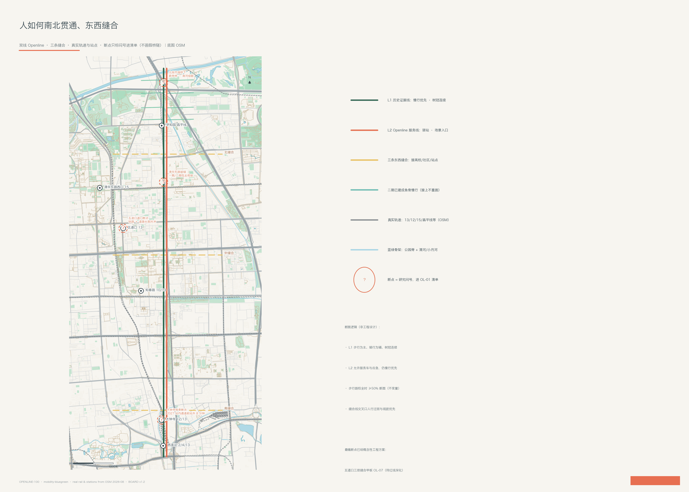

交通策略三句话：南北靠双线 Openline 贯通；东西靠缝合接高校、社区与站点；断点只标「问号」进入研究清单，**但至少对最痛断点给出概念性工程方案**——展示设计勇气，而非虚假精确 [depth:traffic_rail_slow_parking] [data:geometry/roads.geojson#ROAD-STITCH-M]。

**概念断面逻辑（非工程设计）：** L1 以步行为主、骑行为辅、树冠连续；L2 允许服务车与应急，仍慢行优先；缝合线在交叉口强调人行过街与视距，车行等级待红线。重点校核北五环跨线、五道口、清华东路西口、大钟寺站及企业周边——在 provisional 足迹内作为概念组织。

### 五道口缝合甲板（概念性工程方案）

选中缝合最痛断点——**五道口**：铁路与城市道路长期把两侧「看得见、走不通」。在尚无精确红线的前提下，提出结构概念方案，图脚强制声明「待红线确认后深化」[depth:traffic_rail_slow_parking]。

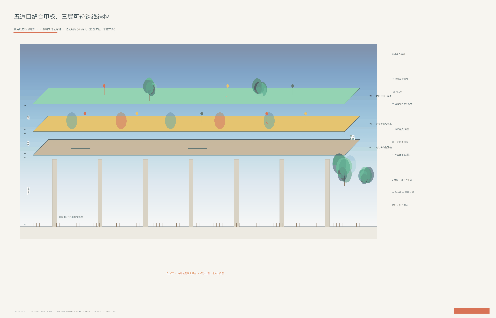

**结构概念：** 利用既有铁路桥墩（或同位置可承接的墩位逻辑）架设**三层缝合甲板**——不发明未论证的深隧，而做可逆、可分期的跨线公共结构：

| 层 | 功能 | 体验意图 |
| --- | --- | --- |
| **下层** | 电动车与物流慢行通道 | 把冲突车流从步行层剥离 |
| **中层** | 步行、自行车与临时市集 | 日常缝合；可办近校/社区市集 |
| **上层** | 朝向京张遗址公园的观景平台 | 把「看得见公园」变成「走得到廊道」 |

**设计勇气边界：** 本方案给出剖面逻辑、层间关系与接驳口概念位置；**不**给出跨度、荷载、施工组织或已批准线位。文保、桥墩权属、道路红线与噪声控制到位后，整段进入工程深化；深化前仅作城市设计讨论武器。项目编号进入清单 **OL-07**。

市政与公共服务：创新服务平台、人才生活服务、分布式能源与端侧算力作为 Openline 驿站原型；管线、消防、防洪资料缺失时列为深化前置条件。`constraints.geojson` 刻意保持空集合并登记缺口，优于编造控制线 [depth:municipal_new_infrastructure]。

## 蓝绿空间、公共空间与城市风貌

蓝绿骨架以京张遗址公园产业创新带为叙事主脊（已批「一带」），清河/小月河为侧翼水文指纹；步道骑行与树冠廊道叠在 Openline 上，形成可南北走、东西透的公共空间系统。控规要求生活圈与创新圈融合的一刻钟社区服务圈——驿站网络（S-09）按 800–1000 m 间距布置，与此对位，不另发明一套生活圈 [depth:blue_green_public_space] [data:geometry/green_space.geojson#GREEN-SPINE-001] [source:HD-JINGZHANG-BLOCK-PLAN-20260811]。二期已建成的 3 条鱼骨状慢行通道是北缝合的既有增量，Openline 接上它们，不重画。

### 生态的数字承诺：每期可核验的目标（目标承诺 · 监测闭环）

蓝绿不是形容词，是五个可核验的数。与分期资本逻辑同一纪律——写下来的数必须接监测闭环，不许只是口号。每期同时给出**碳预算 / 径流控制率 / 热岛降幅 / 生物多样性净增益 / 树冠覆盖率** [depth:blue_green_public_space]。

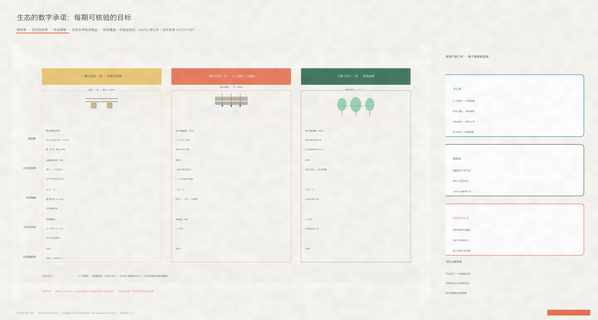

| 承诺 | 一期 2026–28 · 可逆示范段 | 二期 2028–31 · L1 成街 | 三期 2031–35 · 双线成网 | 怎么测 |
| --- | --- | --- | --- | --- |
| **碳预算** | 隐含碳先封顶：再生/旧轨材料 ≥60%，建 2025 基线台账 | 运行碳强度 −25%（vs 2025 基线），能耗分项计量 | 运行碳强度 −40%，隐含碳持续封顶，全线碳账按季公开 | 材料台账 + 能耗分项计量 |
| **径流控制率** | 年径流总量控制率 75%：透水铺装 + 下凹绿地（北京海绵实践区间） | 80%：三缝合断面同步，L1 全线透水 | 85%：双线成网 + 清河侧翼 | 雨量 + 径流计量 |
| **热岛降幅** | 廊道夏季地表温度 −0.5 °C（vs 周边），传感廊起测 | −1.2 °C：树冠 + 水体 + 浅色铺装 | −2.0 °C：成网后稳定值 | 地表温度传感廊 |
| **生物多样性净增益** | 先测基线；新植乡土物种 ≥70%，样方样线建档 | 净增益 +5%（vs 基线） | +10%，年度复测公布 | 样方样线 + 年度遥感 |
| **树冠覆盖率** | 25%（新植 + 保留并计） | 30% | 35% | 年度遥感 + 普查 |

**监测闭环：** L1 传感杆 → 城市数据信托（只进不出，受托人持证开启）→ Verify 闸按季公开 → 不达标触发组件库版本化整改，缺口写进公开纪要——目标不悄悄改写。全部数字为**目标承诺**（设计目标，非实测业绩），依据登记于 `assumptions.json` **A-ECO-001**（北京海绵城市与国际生物多样性净增益实践区间）；官方资料到位后复算，不写成已实现绩效 [depth:blue_green_public_space]。

### 三个 AI 朝圣地标（荣誉展示节点）

| 地标 | 制度含义 | 概念尺度与程序 | 组件库 | 证据 |
| --- | --- | --- | --- | --- |
| **Kilometer Zero** | 提问被公开放置（加入） | 缝合甲板上的测量钉（讨论 φ150 mm，旧轨钢），不是仪式广场 | 问题墙、投递柱、无障碍环 | [data:geometry/public_space.geojson#PUBLIC-KM0] |
| **The Join** | 东西缝合与南北 Openline 相交（换向） | 交汇广场；可短暂停留与换向 | 导视、遮荫、信息柱 | [data:geometry/public_space.geojson#PUBLIC-JOIN] |
| **治理地层墙 The Strata Wall** | 离开者把路交给下一班（退出与继承） | 众智园治理中心前庭：可滑移陶砖墙 + 前庭台阶座，季度公开继承仪式 | 版本砖、失败案例库检索亭、继承台阶 | [data:geometry/public_space.geojson#PUBLIC-JOIN] |

**第三座地标的空间类型与公共程序（对应任务书 agent.4，评审要求补足）：** 治理地层墙不是改名家具，而是「继承」这道闸的实体化——每一届团队退场时，把自己的组件版本与失败教训做成一块新砖滑入墙面正面，旧砖侧移但仍可见、可检索：失败的升级仍然承重。**空间类型**：治理中心前庭的线型陶砖墙（长约 20–30 m 概念尺度，与议事廊共构）+ 大台阶座，日常是可坐可读的墙，仪式时是继承台。**公共程序**：季度公开继承仪式（退场者自述「我们失败了什么 / 教会了什么 / 谁在重来」）+ 常年开放的失败案例库检索亭。**运营**：治理中心理事会维护，检索亭与组件库版本系统联动；仪式开放预约旁听。**权利边界**：署名移交自愿、可匿名；任何团队可拒绝上墙而不受惩罚；砖面内容须清权。**与另两座的差异**：Kilometer Zero 管「提问被放置」（加入），The Join 管「换向」（空间交汇），地层墙管「退出与继承」（时间纵深）——三座各管一道公共程序，互不替代。

三地标承担「加入—换向—继承」的公共程序。议事发生在治理中心议事廊与既有可预约厅。大钟寺的片区产品是智能原生街；众智园主板同样是片区系统。阅读时间同时落在 L1 证据线的里程思辨碑与失败案例库。

**荣誉展示体系：** Openline 周「核验徽章」（聚合成就，非个人监控积分）→ 地标叙事（可选、可关）→ 年度公开议事纪要公开（脱敏）。禁止把地标做成低俗打卡或娱乐化歪曲京张史。

**公共空间组件库（可重复部署）：** 驿站亭、树池座、可移动展墙、无障碍坡段、多语导视柱、预约柱、遮雨连续件、应急避让带。组件随 Inherit 版本化，避免每届活动重造一套。

**无障碍与数字包容：可验证说明，不是原则句。** 机器视觉截图不能认证无障碍。下列五项是设计与验收协议，现场核验挂 P-01–P-10，包内不假装已测完。

| 项 | 可验证要求 | 未测完时的诚实状态 |
| --- | --- | --- |
| 连续路径审计 | 三座地标、五条横向接入、大钟寺四象限各一条轮椅连续链；断点登记为作业单，不画假坡 | P-01 / P-02 待现场计时与高差实测 |
| 盲文 / 触觉 / 听觉导视 | 地标与驿站设触觉地图 + 语音播报；默认关闭、可拒绝；不替代人工问路 | 组件入库，点位待测绘 |
| 认知友好 | 导视不超过两级决策；图标 + 短句；不用隐喻地名当唯一线索 | 图则级排版待正式导视专项 |
| 低视力对比 | 主标、导视、停机钮对比度 ≥ 4.5:1；反白稿与单色稿同构 | Logo 规则已写入上表；现场照度待测 |
| 儿童与照护者 | 通学 / 买菜路径坡度与休息点列入卡 02 生活剩余；童车宽度预留 | P-07 待社区界面实测 |

技术停用后，固定坡道、触觉地图、人工窗口与电话渠道接续。服务不因拒绝数字通道而降级。

### 文化叙事与导视

叙事与第三章同代，不再用「京张段 / 中关村段 / Openline 段」三段史诗。主线是**以人为轨** [source:AGENT-TASKBOOK] [depth:blue_green_public_space]：

1. **1909 · 地形** → L1 证据线：火车在山脊转身，不炸山，道岔换向； 
2. **2026 · 存量** → 缝合甲板与既有 13 号线：城市在线上转身，不拆既有，螺栓借墩； 
3. **这个世纪 · 价值** → Open Ticket 与失败案例库：AI 在人的轨道上转身，不拿算力当轨。 

导视：脊线「100」主符号 + 文字级地名；考古分级与口述空位「＿」进碑 / 牌 / 码，不编造引语。字体与图像须清权。不用平面几何配对。国际传播一句话仍是票制邀请：**Join the Openline—verify in public, exit freely, inherit the protocol.** 邀请参与，不宣称政府已定活动。

## 更新项目清单、实施政策与分期计划

| 编号 | 项目 | 类型 | 依赖 | 近期可做什么（概念） | 证据 |
| --- | --- | --- | --- | --- | --- |
| OL-01 | Openline 慢行断点缝合 | 公共空间/交通 | 道路红线、桥下空间 | 断点普查与临时慢行改善建议 | [data:geometry/roads.geojson#ROAD-SPINE-001] |
| OL-02 | 众智园可升级城市主板（共享底板 + 全栈协作街 + 治理中心） | 产业/更新/蓝绿 | 正式边界、权属、设施容量、蓝线/防洪、学北园首层协议 | 0–1 年：普查 + 共享门厅与协作街试点；1–3 年：一组可升级单元 + 轻量治理中心 | [data:geometry/green_space.geojson#GREEN-PROOF-001] |
| OL-03 | 原点近校转化街 | 更新/服务 | 权属、首层业态 | 授权窗口与发布厅轻资产试点 | [data:geometry/buildings.geojson#BLDG-QUESTION-001] |
| OL-04 | 大钟寺站一体化 + 路口四象限（到达系统） | 轨道/慢行 | 1733 权属、地铁、桥下、北三环红线 | 0–1 年：既有路径铺装照明/无障碍/24h 通行；1–3 年：四象限过街、四角非机动车泊位 | [data:geometry/public_space.geojson#PUBLIC-A] |
| OL-10 | 智能原生街 The Native Street | 更新/产业/公共空间 | 业主首层协议、街道、公园贴边 | 0–1 年：一处企业边 + 1733 外沿试点（可试用、可拒绝、须写责任接口）；1–3 年：街面连续、数据会客与路演节奏 | [data:geometry/buildings.geojson] |
| OL-05 | Openline 驿站（服务+端侧） | 新基建 | 能源、安全运营 | 单点原型；约束层空集待补 | assumptions A-CONTROLS-001 |
| OL-06 | Openline 100 活动周 | 运营/品牌 | 许可、安全、版权 | 路线演练与组件库 v0.1 | [data:geometry/phasing.geojson#PHASE-0-3] |
| OL-07 | 五道口缝合甲板 | 轨道/慢行·概念工程 | 桥墩权属、道路红线、文保；两心之一 | 三层甲板剖透视；待红线深化 | [data:geometry/roads.geojson#ROAD-STITCH-M] |
| OL-08 | 知春路多点 · 存量更新类型 | 更新/产业 | 权属、厂房结构、文保 | 以卫星制造厂科技园为公开类型样本，研究老厂房→可核验首层；不写入已批项目 | [data:geometry/land_use.geojson#LU-001] |
| OL-09 | 四道口多点 · 贴边缝合 | 公共空间/慢行 | 已建成公园界面、道路红线 | 承认复原铁轨已开放；增量在两侧社区贴边与过街 | [data:geometry/roads.geojson#ROAD-FACT-001] |

分期（与 100 天征集周期区分）：**近期 0–1 / 1–3 年**轻量设施、场景开放、断点研究与组件库（见图 `key-phasing`）；**中期 3–10 年**重点区更新与站域一体化深化；**长期 10–20 年**治理框架与国际活动网络。时间轴回答「先做什么」；下一节资本图回答「谁出钱、谁运营、收益如何回到街与甲板」。所有活动、招商与资金安排均为概念建议 [depth:phasing_implementation] [data:geometry/phasing.geojson#PHASE-3-10]。

### 分期资本逻辑：每期同时回答四问

可落地性不是把时间轴画得更细，而是每一期同时回答：**建设什么 / 谁出钱 / 谁运营 / 收益怎么回流公共空间**。三种融资情景——政府专项债 / 片区统筹 / 企业认养——是接力，不是三选一。三期企业认养受 Open Ticket 许可链约束，公共界面仍属公共。**以下全部按可比较的概念情景陈述：每一情景逐项给出适用前提、审批程序、失败条件与 B 计划；任何情景都不是已确定的融资安排，年份只是分期锚点，不是资金承诺。**


**可逆即低风险。** 五道口甲板螺栓连接、不浇筑：资产可迁移，示范段错了不是沉没成本——这是敢先做一期的真正理由。

| 期 | 建设 | 出钱（首选情景） | 运营 | 回流 |
| --- | --- | --- | --- | --- |
| **一期 2026–28 · 可逆示范段** | 原点段 L1 地面约 600 m + 甲板示范约 400 m（可逆钢木，约 3,200 ㎡） | 情景 A：政府专项债 + 市级遗址公园专项 | 街道 + 公园管理处联合工作站 | 市集摊位 + 活动周 → 公共维护基金 |
| **二期 2028–31 · L1 成街 + 三缝合** | L1 北段成街约 2.4 km + 东西三缝合（既有道路改造为主） | 情景 B：片区统筹（站点 800 m 圈层 TOD 溢价 10–20% 回收 + 地下空间出让） | 平台公司（区属国企持股） | 土地溢价与地下空间切块入基金 → 维护 + 三期资本金 |
| **三期 2031–35 · 双线成网** | L2 服务线 + 两翼 + 大钟寺站一体衔接 | 情景 C：企业认养 + 场景运营付费（沙盒 / 路演厅 / 驿站） | 场景主联合体；公共界面仍属公共 | 运营服务费 + 认养 → 基金长期现金流，不依赖卖地 |

**三种情景的可比较纪律（逐项前提 / 程序 / 失败条件 / B 计划）：**

| 情景 | 适用前提 | 审批程序 | 失败条件 | B 计划（谈不下来时） |
| --- | --- | --- | --- | --- |
| **A · 政府专项债**（对应一期） | 专项债支持范围覆盖此类公共空间；区级立项通过 | 发改立项 → 债项申报 → 法定审议程序；市级遗址公园专项按年度盘子申请 | 债项未获批或额度不足 | 退为市区两级财政分期小额投入；示范段缩至约 300 m，节奏放慢、目标不取消 |
| **B · 片区统筹**（对应二期） | 站点 800 m 圈层存在经营性用地出让计划；TOD 溢价回收机制获区级认可 | 片区统筹方案报区政府；溢价比例写入出让条件；地下空间出让走公开招拍挂 | 土地市场下行或出让计划调整 | 退为慢行专项 + 城市更新既有盘子分段实施；三缝合拆成逐路口小工程逐个立项 |
| **C · 企业认养**（对应三期） | 场景运营存在真实付费方；认养不改变公共属性且获街道认可 | 认养协议备案；收费项目听证；Open Ticket 许可链审查 | 认养不足或公共性争议 | 公共维护基金 + 财政兜底基础运维；场景缩减为公益日程，公共界面不让渡 |

量级为讨论级估算（一期 ¥1 亿级 / 二期 ¥10 亿级 / 三期 ¥20–30 亿级），依据登记于 `assumptions.json` **A-CAPITAL-001**（综合单价经验区间，非概算）。红线与地块数据到位后重算；本表与情景纪律均为**比较框架**，不构成投资承诺、不代表任何一方已同意出资 [depth:phasing_implementation]。

底部回流环：土地溢价 → 地下空间 → 场景运营 → 公共维护基金 → 回到街与甲板。右栏三种融资情景各自明示风险，主张接力；每一情景都有自己的 B 计划，接力断在哪一棒，方案降级但不死。

### 实施经济学一页纸（讨论级 · 概念量级）

**原则三句话：** ① **公共空间先行、强度奖励跟进**——借鉴 22@Barcelona 二十年验证的政策叙事（B 级机制文献，不作数据引用）：政府与公共资金先把慢行、蓝绿、无障碍与首层界面做成事实，再以「首层三可换弹性强度」等政策建议激励业主跟进；政策须走正式程序，本方案不预支。② **轻资产现金流养重资产公共投入**——能自我造血的先行，纯公共投入的被现金流与分期托住。③ **每个第三方协议都有 B 计划**——谈不下来，方案降级但不死。全部金额为**概念量级区间**（百万 / 千万 / 亿 / 十亿级），进入 assumptions 待正式资料校核，不构成投资承诺 [depth:phasing_implementation]。

**OL 项目投资量级与出资逻辑（概念量级）：**

| 编号 | 项目 | 量级区间（概念） | 出资逻辑 |
| --- | --- | --- | --- |
| OL-01 | 慢行断点缝合 | 普查与临时改善：百万级/年；工程段：千万级 | 公共投入为主；可纳入城市更新与慢行专项盘子 |
| OL-02 | 众智园可升级城市主板 | 0–1 年普查与试点：千万级；1–3 年一组单元+轻量治理中心：亿级；3–10 年扩展：十亿级 | 共享底板公共投入；单元改造以市场主体与园区业主为主，公共资金只做接口与首层 |
| OL-03 | 原点近校转化街 | 千万级 | 轻资产：授权窗口与发布厅以运营投入为主，空间改造克制 |
| OL-04 | 大钟寺站一体化 + 四象限 | 千万级（不含 2027 站内通道，那是地铁工程） | 公共投入（无障碍、铺装、过街）+ 业主协议投入（通行维护） |
| OL-10 | 智能原生街 | 千万级 | 业主首层改造为主，公共侧只做导视、遮荫与贴边 |
| OL-05 | 端侧算力驿站 | 单点：百万–千万级；3–4 点网络：千万级 | 单点原型先行；运营现金流覆盖运维的模型见下表 |
| OL-06 | Openline 100 活动周 | 百万级/年 | 轻资产：报名、赞助与场租可覆盖大部分，公共补贴兜底 |
| OL-07 | 五道口缝合甲板 | 亿级 | 全案唯一重资产公共结构；进入中期项目库，待红线与结构预研后决策 |
| OL-08 | 知春路多点存量更新类型 | 公共投入千万级 | 改造主体为市场；公共只做类型研究与首层导则 |
| OL-09 | 四道口多点贴边缝合 | 千万级 | 公共投入；与二期已建成界面的贴边工程 |

**运营收支逻辑（概念模型）：**

| 现金流来源 | 性质 | 量级（概念） | 纪律 |
| --- | --- | --- | --- |
| 驿站预约服务与设备租用 | 轻资产运营收入 | 百万级/站/年 | 预约可退出、价格听证；不变成会员制园区 |
| 活动周（报名 / 赞助 / 场租） | 轻资产运营收入 | 百万级/年 | 赞助须清权；不把地标做成广告位 |
| 1733 既有厅场租与数据会客服务费 | 存量物业运营收入 | 百万级/年 | 归业主与运营方；公共侧不分成、只订规则 |
| 组件库与场景卡版本授权 | 知识资产收入 | 十万–百万级/年 | Inherit 原则：基础版永远免费，授权只收增值服务 |
| 导视信息位的克制商业信息 | 辅助收入 | 十万级/年 | 面积与位置受街面规则约束——**街面不是广告廊**，此条永不超过公益信息量 |
| 公共投入侧（甲板 / 蓝绿 / 无障碍 / 断面） | 纯公共品 | 见 OL 表 | 由城市更新、慢行、无障碍与公园维护等既有公共盘子分期承接，不依赖单一新设基金 |

收支平衡的判别标准（概念）：近期 0–3 年，轻资产现金流覆盖驿站网络与活动周运维的**一半以上**即健康；中期以后，街面与会客厅的存量物业收益是否反哺公共侧维护，写入业主协议时再定比例——现在不定死。

**第三方协议的 B 计划（每个关键假设都有退路）：**

| 关键协议 | A 计划（首选） | B 计划（谈不下来时） | 降级后仍成立的部分 |
| --- | --- | --- | --- |
| 高校授权窗口（原点） | 校缘授权窗口进转化街 | 退到既有技术转移办公室接口 + 校外公共授权咨询点，先服务企业侧成果过墙 | 八找并置与公开首发仍成立；「权」环节变慢但不断 |
| 1733 二十四小时通行与可预约厅（大钟寺） | 业主协议开放既有路径与厅 | 强化站外地面路径无障碍 + 公园贴边设可逆临时厅（集装箱式） | 四象限过街与街面法则不依赖 1733 |
| 业主首层协议（大钟寺街面 / 中关村大街） | 连续首层开放协议 | 改为「界面导则 + 逐栋自愿加入 + 强度奖励激励」，公共侧先做铺装、遮荫与导视 | 首层三可换弹性强度的政策逻辑不变，只是节奏放慢 |
| 学北园首层协议（众智园） | 共享门厅进园区首层 | 共享门厅退到公园北段贴边的可逆驿站，普查与试点先行 | 共享底板逻辑与 15 分钟检验路径仍成立 |
| 地铁 2027 站内通道（大钟寺） | 与本方案无关，归地铁 | 同左——方案本就不把它写成自己的交付 | 街面规则 2027 年前后都成立 |
| 缝合甲板桥墩权属（OL-07） | 利用既有桥墩逻辑架三层甲板 | 独立柱方案；再退为平面过街强化 + 信号优先 + 骑行绕行改善 | 中缝合的步行连通目标不依赖甲板这一种结构 |

**诚实边界：** 本页所有量级为讨论级估算，未经造价、权属与运营专项校核；22@Barcelona 仅作政策机制叙事借鉴（B 级），不引用其具体数据；「强度奖励」为政策建议，须正式程序，本方案不预支、不写成已批；B 计划不等于放弃 A 计划，而是保证「最坏情况下 Openline 仍然走得通」。

### 长期运营（agent.6）

**年度体系建议：** 春·开源周（原点）→ 夏·全栈协作与标准周（众智园）→ 秋·国际路演（大钟寺）→ 冬·公开议事。品牌 IP 与一带 Logo 分层：活动可用「Openline Week」副标，不替换主 Logo。

**开发者社区机制：** 会员协议即 Join/Verify/Exit/Inherit；贡献记入可继承的公共组件与场景卡版本，不采个人轨迹积分。 
**场景开放机制：** 可预约、可退出、日志可审计；测试验证场景必须专家复核窗口。 
**转化路径：** 问题与原创成果（原点）→ 全栈研发、工程化与治理复核（众智园）→ 真实采纳与市场反馈（大钟寺）→ 需求、事件与失败案例回流众智园升级技术与标准；国际传播只邀请参与 Openline，不得写成已确定政府安排 [source:AGENT-TASKBOOK]。

## 指标体系、面积复算与合规矩阵

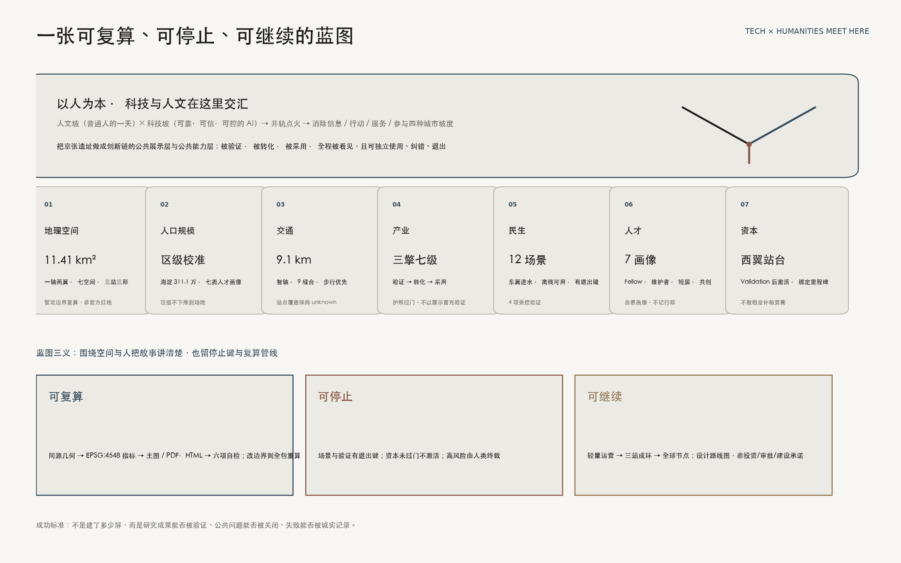

第一类（可由本包几何复算，provisional 置信度）：场地面积约 11.41 km² [metric:site_area_sqm]；绿地约 227.8 万 m²、比率约 0.20 [metric:green_space_area_sqm] [metric:green_ratio]；公共空间约 90.1 万 m²、比率约 0.079 [metric:public_space_ratio]；概念建筑基底约 48.2 万 m² [metric:building_footprint_area_sqm]；重点区 3 处 [metric:key_area_count]。

第二类（街区结构已知、地块强度未知）：容积率、建筑密度、建筑高度等 `unknown`；1668.2 ha 与「一带一轴、两心多点」只作结构对位，不进入 metrics 复算分母 [depth:metrics_recalculation] [source:HD-JINGZHANG-BLOCK-PLAN-20260811]。第三类（运营绩效）：人才密度、活动参与、慢行可达、Openline 预约完成率等进入 assumptions，不写入审定条件；生态目标承诺（碳预算 / 径流控制率 / 热岛降幅 / 生物多样性净增益 / 树冠覆盖，A-ECO-001）同属此类——进监测闭环，不写成实测绩效。任务覆盖见任务覆盖矩阵、专业标准矩阵与设计深度矩阵；公告 1.3–1.5 与 agent.1–agent.6 均须有章节与图层证据。

## 风险、版权与合规说明

**双语合同已启用**：主文件中文，完整对照见 `proposal.en.md`；图件提供 `.en.png`。风险清单对齐缺资料表：官方红线、重点区正式 polygon、道路红线、宗地权属、现状建筑、文保控制、市政消防等均待补 [depth:risk_missing_data] [source:SITE-PACKAGE]。

本方案不声称官方批准、审定控规、最终权属、最终建设规模或保证实施。AI agent 对事实、来源、版权与表达负责；所有空间想法均为概念建议/参考方案，供专业团队深化。图片、字体与代码资产来源见 `sources.json` 与 `report/copyright_statement.md`；`visual/index.html` 保持离线、无远程依赖。

**权利清核摘要（完整逐项台账见 `report/copyright_statement.md`，评审可直接核验）：** ① 底图——OpenStreetMap 数据 © OSM contributors，ODbL 1.0，全部图件与本包均带署名，提取范围 / 快照 / 管线见 sources.json `OSM-BASEMAP-202608`；② 字体——Noto Sans SC（SIL OFL 1.1），中文 HTML 按实际用字子集内嵌，OFL 允许子集化与嵌入，字体名已改标 `OpenlineEmbeddedSC`，OFL 合规要点在台账逐项声明（全文具名指向官方文本）；③ 图像——全部图件为本包脚本本地生成，无第三方图片、无图库素材、无航拍照片；④ 生成工具——图件由 matplotlib / reportlab / PIL 管线产出，文本由 AI agent 起草并逐节人工核对；⑤ 第三方名义——Sasaki 图面规范、Station F 等案例仅作方法参照与名词提及（nominative use），不使用其标识与图面资产；⑥ 本包原创内容的发布许可为 COMMUNITY-DISPLAY-ONLY。

## 附录 A｜AI 时代城市形态创新：形态八题 · 前瞻矩阵（全文）

> 本附录自正文统筹研究章移入，内容不变；正文仅保留理论地基与一句话索引，以保持 Openline 100 单一统领的叙事主线。

**理论地基：** 每次通用技术革命都以"成本坍缩 → 区位重排 → 旧范式变城市病"的逻辑重写城市形态——蒸汽坍缩物资位移成本带来站台城市，电力带来摩天楼，汽车坍缩个人位移成本留下宽马路与「看得见、走不通」。**AI 坍缩的是认知与协调成本**：程式化认知变廉价后，溢价的是只能当面完成的四件事——默会知识、信任与验证、意外相遇、责任承担。故 AI 创新带不是更大的办公室，而是一台**信任基础设施**：Openline 规则是其协议层，以下形态八题是其物质层；形态任务一句话——**把「验证一件事」的空间成本降到最低**。五个物质动因：智能具身化、空间可排程、基础设施分布化、生产组织微粒化、感知全面化。完整机理、概念指标与分期见**附录 A**，全部量化值为概念量级、不伪精确。

**形态八题总表（现在就能开工的形态）：**

| # | 新类型 | 形态动作（概念） | 硬禁忌 |
| --- | --- | --- | --- |
| 1 | 可编程街道（4D 分区） | 同一断面排四种班表（通勤/生活/仪式/物流）；时段角色用铺装与色温表达，不用屏 | 步行路权全时 ≥ 50% 断面 |
| 2 | 机器人路权四级断面 | 行人＞骑行＞0.9 m 低速机器带（触感铺装分隔、无栏）＞服务车时段准入；街头机器皆有编号可投诉 | 机器带永不升级为机动车道 |
| 3 | 第三条轨：能源—数据公用脊 | 沿 L2 浅埋公用廊 + 街区微电网；光伏廊架兼遮荫；井盖刻接口容量，井盖即 API 文档 | 不切断步行、不伪报造价 |
| 4 | 端侧算力驿站 | 新型公共建筑：响应站 + 机器人巢 + 余热暖座温室——算力的温度可坐可触 | 供应商另行授权；公私算力物理隔离 |
| 5 | 开源院落 | 30–40 ㎡ 可聚合单元、首层是厂、中院是议会；居住的柔性即创新基础设施 | 围墙连续 ≤ 50 m |
| 6 | 可核验首层 + 机器可读形态代码 | 首层「三可」（可进入/可发生/可退出）换弹性强度（政策建议）；形态代码开源、可仿真、随 Inherit 版本化 | 不破刚性约束、不预支政策 |
| 7 | 离线庇护所 | 800–1000 m 间距无感知口袋绿地；导视地图上的「空白方印」 | 不做说教装置、不设使用登记 |
| 8 | 试验场即公园 | 具身智能评测地形与市民公园同体分时——孩子爬坡和机器人爬坡共用一条坡 | 高速/载荷测试另寻封闭设施 |

**前瞻矩阵（五域驱动 × 信号→触发→响应，不预测、只预埋）：**

| 域 | 驱动 | 信号（已发生） | 触发 | 形态预埋 |
| --- | --- | --- | --- | --- |
| 技术 | 自动驾驶成熟 | 路内泊位收缩 | 接驳试点落地 | 断面按「车道可退线」预留；停车地块登记可转换储备 |
| 技术 | 机器人规模化 | 配送/清扫机器人上街 | 机器带流量饱和 | 断面与巢位按「可翻倍」预留 |
| 技术 | AI 范式跃迁（不可预测） | 技术史从未被猜中 | 不押注 | 设施只承诺电、网、空间三个物理接口 |
| 经济 | 办公需求坍缩 | 写字楼空置上升 | 去化周期拉长 | 新建体量按「办公—居住—公共」三向可平转校核 |
| 经济 | 土地财政退坡 | 财政转向运营平衡 | 全生命周期成本审查落地 | 运维成本结构前置；预留可运营界面 |
| 社会 | 人口收缩与家庭微粒化 | 一人户比例上升 | 人口结构数据变化 | 院落聚合梯度双向设计（可并可拆） |
| 社会 | 深度老龄化 | 照护缺口扩大 | 养老设施指标下达 | 800 m 全龄庇护圈；照护可自动化、尊严不可 |
| 社会 | 大学角色转变 | 终身学习兴起 | 高校开放政策出现 | 近校转化街双向接口（不虚构权属） |
| 生态 | 极端气候 | 暴雨高温日数上升 | 滞洪指标入控规 | 蓝绿脊按滞洪廊道断面预留；庇护所兼冷岛 |
| 生态 | 全面电气化 | 街区负荷攀升 | 触及配网阈值 | 微电网升级为街区调节资源，扩容位已预留 |
| 生态 | 碳约束与循环建造 | 隐含碳约束趋紧 | 可拆装审批通道出现 | 可逆建造 + 材料银行：fork 一栋建筑，merge 一处更新 |
| 治理 | 数据治理立法演进 | 算法治理持续收紧 | 感知设备审计落地 | 退出权已物化，超前合规 |
| 治理 | 公共信任稀缺 | 算法决策争议增多 | 标志性舆情事件 | 治理门让信任靠目击重建 |

**分支稳健（三个关键分歧两边都成立）：** 算力集中或分布——驿站同一建筑两种角色；普惠或监控——退出权已物化，坏未来里仍保留「关机」的肌肉记忆；繁荣或退潮——所有形态可平转为普通城市功能，**没有任何形态依赖「AI 永远热」**。

**不变量清单（矩阵覆盖「会变什么」，清单收口「什么不会变」）：**

| 不变量 | 形态上的焊点 |
| --- | --- |
| 人要用腿走路 | 步行路权全时 ≥ 50% 断面（题 1） |
| 冬冷夏热需要树荫遮蔽 | 檐下连续廊 + 树冠连续（题 3/6） |
| 需要聚集，也需要独处 | 集会环与背向座椅并存（题 7） |
| 有不被观看的权利 | 离线庇护所、空白方印（题 7） |
| 会老、会病、会推婴儿车 | 全断面无障碍、800 m 庇护圈 |
| 孩子要玩，玩是最好的学习 | 试验地形全时段向儿童开放（题 8） |
| 社区需要记忆与悼念的处所 | 失败案例库、地层墙、L1 里程思辨碑 |
| 基础设施要养得起、修得到 | 浅埋第三轨、运维成本前置（题 3） |

> **变量预埋接口，不变量焊死形态。** 我们无法知道 2046 年的 AI 是什么，但知道 2046 年的人仍用腿走路、仍需要树荫、仍需要不被观看的角落、仍然会老——**为不变量设计的城市，不会过时。**

## 附录 B｜全球 AI 创新生态八案例机制转译（全文）

> 本附录自正文统筹研究章移入，内容不变；正文仅保留机制一句话索引。

下列案例仅作空间与运营机制转译，不编造投资额、企业名单或政府承诺 [source:AGENT-TASKBOOK]：

| # | 案例 | 可转译机制（不是口号） | Openline 落点 | 避免照搬的点 |
| --- | --- | --- | --- | --- |
| 1 | Station F（巴黎） | 大站房尺度的共享服务与集中创业界面 | 智能原生街作公共采用面；企业服务落在 1733 既有可预约厅；站域只做到达 | 不复制车站产权；不把商场中庭起名当地标；不做钟形屋顶；不把换乘写成全区产品 |
| 2 | MaRS（多伦多） | 医院/大学/企业共址的转化走廊 | 原点近校成果转化街（授权接口） | 不虚构高校共建合同 |
| 3 | Kendall Square | 实验室—街道—广场连续公共界面 | Openline 两侧「首层开放协议」 | 不套用波士顿 FAR |
| 4 | Science Park Amsterdam | 绿廊串联研究单元 | 京张遗址公园蓝绿主脊 + 众智园全栈协作街贴边（不占廊心） | 不把公园改写成封闭园区 |
| 5 | HafenCity Digital Hub | 遗产地上的数字创新与慢行 | 众智园共享首层与治理界面叠在遗产廊道叙事上 | 不主张拆除历史遗存 |
| 6 | Block71（新加坡） | 轻资产社区运营与路演节奏 | 开发者社区 + 活动周 | 不写成已批运营主体 |
| 7 | Cyberport（香港） | 企业服务与公共展演并置 | 1733 既有可预约厅（路演 / 数据会客） | 不承诺财政激励 |
| 8 | 中关村街道式创新网络 | 近校、近轨、近生活的混合街区 | 五道口—清华东路缝合 + 生活样板街 | 不抹平原点与众智园差异 |

## 附录 C｜三区生产函数详案（卡 01–03 · 1:1 对三重点区）

> 正文保留摘要。本附录写三区生产逻辑——少一步即假——不是观光站。未呼先应见东翼索引 S-09。

### C-1 场景卡 01｜AI+原点社区 · 策源如何过墙

**本卡生产什么：可过墙的策源。**
> 官方给原点三个产品——全球首发地、栖息地、全要素生态服务站——政策已经买齐。缺的不是又一座孵化器，而是它们之间的必要关系。没有授权，八找是非法匹配；八找不在步行内，服务站是目录；没有可失败的公开声称，首发地是会场；没有非表演客户，声称是路演；失败不留给下一届，生态每届清零。200 m 走廊是切片。官方约 3 km² 不以 104 ha 替代。

**墙不是一道门，是四项许可绑在一起：** 谁拥有、可否公开、用到哪里、出事找谁。人可以从校园走进公园；许可过不去，策源就还在墙里。

**一句话场景**：许可条没办下来，转化街拒收原型——不是窗口不热情，是后四环会全部变成违法。许可办完，八找仍要跑四个园区，她不会留下来完成首发。食堂付了第一笔钱，失败被下一届读到：原点开始像生态，而不像每学期清场的近校园区。

**因果链（不是观光站；跳过任一步即假）**

```
权（Join）──► 配 ──► 证 ──► 用（Verify）──► 遗（Exit → Inherit）
许可过墙      八找步行成交   公开可失败声称   非表演客户         负知识留作公地
跳过→泄密/违约  跳过→目录     跳过→转移办公室  跳过→路演         跳过→每届清零
```

| 环节 | 它在生产函数里做什么 | 空间落点 | 跳过则假 |
| --- | --- | --- | --- |
| **权** | 让后四环合法。许可条最小必要：范围、期限、可否开源、责任人。地图、72 小时工坊、见面日程替代不了许可。 | 校缘授权窗口 | 无许可的匹配与首发 = 泄密或违约。原点变成无墙的园区。 |
| **配** | 把官方八找从目录变成步行内成交的要素市场。栖息地挂在匹配边上，只为让人留得够久把八找做完。 | 一条可走的并置界面 | 仍要跑四个园区 = 全要素服务站是海报。「10 分钟找伙伴」无法成为空间事实。 |
| **证** | 把「全球首发地」落实为可失败的公开声称。关起门转化是技术转移办公室。失败不进宣传片，进失败案例库。 | 开源发布厅（S-01） | 无公开声称 = 近校办公，不是策源地。 |
| **用** | 需求侧核验。食堂、配送、导览、物业做真实交易。居民知情同意、可退出。脱敏摘要回流众智园，供卡 03 升级许可。 | 社区微场景 | 只有路演客户 = Verify 没发生。原点无法向大钟寺交出可上街的东西。 |
| **遗** | 负知识成为公地。下一届不必付同一笔学费。可撤、可改写；退出者协助注销，不社死。 | 失败案例库；到达仍是 OL-07 缝合甲板 | 失败带走 = 每届清零，不是生态。不走甲板就能进公园 = 墙还在，只是没被设计。 |

**与另两区：** 小月河出题 → 原点把题过墙并公开声称 → 众智园工程化并过治理门 → 大钟寺上街采用 → 失败回流本库与治理门。原点不代替众智园做全栈，不上大钟寺的街。

**自检边界**：不承诺投资与政策待遇；不虚构高校合同；不把 3 km² 画进 104 ha；不做成功学排名；居民不是试验品。

---

### C-2 场景卡 02｜大钟寺 · 核验过的能力必须能上街

**本卡生产什么：可拒绝的采用。**
> 资格预审公告给大钟寺的是城市型街区，不是领军企业园区，也不是站前装置。深度不在「从地铁走到厅再到社区」的观光顺序，而在三层必须同时成立的结构。未呼先应见东翼 S-09。1733 已是城市更新样本，不是白纸。

**三层并置（不是五站）**

```
        ┌─ 街面法则（主产品）：核验过的能力占用首层；说明条四项；可试用、可拒绝
路过 ───┤
        ├─ 下街例外（分流，不是下一站）：数据要素 / 国际交往 → 1733 既有可预约厅
        └─ 生活剩余（不可让渡）：通学 / 买菜 / 古钟导视
8 分钟到达只检验：上述三层能否被没预约的人碰上；它本身不是产品。
```

**一句话场景**：她没预约。街面上有一件写着「谁核验、失败过什么、出事找谁、如何拒绝」的试用——她试了，拒绝了。数据会客在她不必经过的厅里。东南象限仍能接孩子。营业没有切断她的路。若试用只在封闭厅、数据摊在过道、或通学被展位占掉：大钟寺就不是城市型街区。

**三层分别生产什么**

| 层 | 它在生产函数里做什么 | 空间落点 | 跳过 / 弄反则假 |
| --- | --- | --- | --- |
| **街面法则** | Adoption 的定义：没预约也能碰上已核验能力。说明条四项缺一不准上街。试用可拒绝，否则是广告。 | 总部界面、1733 外沿、公园贴边的连续首层 | 无说明条 = 广告廊。只能进封闭厅才碰上 = 园区展厅。营业切断通行 = 法则对员工有效、对城市无效。 |
| **下街例外** | 不够格上街的东西必须离开公共通行。数据要素要授权清单与审计；国际路演要清权与预约。西翼提供 IP / 资本 / 许可，不在此另造基金大厦。 | 1733 既有可预约厅（S-08 / S-05） | 把厅写成「下一站」= 目的地是商场。数据摊上街 = 泄露的街。新建塔楼 = 不承认 1733 已是样本。 |
| **生活剩余** | 城市型街区的非产业部分不可让渡。产业吃掉通学、买菜、古钟导视，街区就变成园。规划绿地只在贴边可逆插入，不占廊心。 | 东南通学、东北买菜、西北古钟导视 | 四象限被展位或车行切断 = 产业园冒充街区。仿钟、改名中庭 = 用符号代替城市。 |
| **到达（检验，不是层）** | 测试法则对路过者是否成立。既有约 8 分钟路径保持公共通行；东端无障碍 P0；四象限步行。2027 站内归地铁，街面规则留下。 | OL-04 | 把换乘写成全区产品 = 站前装置冒充 72 ha。挖新隧 = 不承认既有路径。 |

**三个冲突（设计必须站队）**

1. 领军企业校园 vs 城市型街区：能力必须在无通行证的首层被碰上。
2. 上街 vs 预约厅：够格上街的才上街；不够格的进厅，不占路。
3. 产业占用 vs 生活剩余：四象限不是街面的配景，是街区仍是城市的证据。

**与另两区：** 上街的东西必须先在原点过墙、在众智园过治理门。大钟寺不发明能力，只采用；采用失败回流治理门与原点失败案例库。

**自检边界**：首层协议须业主与街道同意；不把字节跳动写成已签约业主；不报容积率；街面不是广告廊。

---

### C-3 场景卡 03｜众智园 · 全栈如何升级而不拆城

**本卡生产什么：可许可的换代。**
> 全栈自主要求模块会被替换；全球治理要求替换必须有人负责；花园型街区要求替换不拆街。学北园约 3.53 ha 是种子，不是 192 ha。国家平台不画成已落地的楼。15 分钟路径是检验，不是导览产品。人机共生落在治理门的公众面，不另立展厅品牌。

**时间分层（不是园区环线）**

```
不变层  共享底板（电 / 网 / 空间 / 市政 / 安防）     ← 换代不拆城的物理含义
可变层  五类单元邻里（可扩、可缩、可退）           ← 全栈是可替换模块，不是五座园
许可层  治理门（人工复核 / 责任 / 退役 / 遗憾条款） ← 换代的唯一合法入口
可读层  全栈说明书（无通行证能读懂关系）           ← 换代之后城市仍可被理解
同一许可出海  底板+门一起走，不另造平行园
```

**一句话场景**：她把设备接到底板上，下午在治理门提交一次模块换代——三个不可通约方案，一条反对写进决议的遗憾条款。明年她扩一间或退一间，街还在。一个没有实验室通行证的中学生走同一条底板，仍能读懂底层能力到标准的关系。若换代要拆街、或换代不必过门、或过门后公众读不懂：众智园就只是会过时的园。

**各层分别生产什么**

| 层 | 它在生产函数里做什么 | 空间落点 | 跳过则假 |
| --- | --- | --- | --- |
| **不变层** | 承诺街区比模型活得长。换模块，不换底板。 | 共享门厅、公共技术平台、市政接口 | 底板跟着模块改 = 换代拆城。 |
| **可变层** | 芯片算力 / 基础软件 / 数据模型 / 智能体应用 / 具身场景做成邻居。小团队 Exit 写进邻里：扩、缩、退不必搬出园。 | 全栈协作街、可升级单元样板庭院 | 五座封闭园 = 全栈是口号。不能退只能走 = 升级驱逐小团队。 |
| **许可层** | 模块换代、上路、对外展示的唯一合法入口。S-02 沙盒是受控工具，公众可见、不可闯入。 | 全球 AI 标准与治理中心的治理门 | 无门的换代 = 无人负责的拆除。门无公众面 = 实验室政治。 |
| **可读层** | 换代之后城市仍可被理解。共享首层只说明全栈关系与治理贡献，不是科技主题乐园。 | 共享首层、清河花园客厅 | 无通行证读不懂 = 国家平台是黑盒。 |
| **同一许可出海** | 出口的是底板+门，不是第二套天际线。五环 / 清河只锁关系，不报线位。 | 同一套接口 | 另造平行园 = 复制天际线，不输出治理。 |

**治理门的公众面（压缩自原议事廊，不另起英文剧名）**

换代许可必须被路过看见，否则许可层是内部手续。感知：聚合数据公开，红开关按下写「此处数据已被公民选择隐藏」。推演：至少三个不可通约方案，标置信度与盲区，不得输出单一最优解。争议：异议登记墙，决议必须回应至少一条反对。决议：遗憾条款由反对者起草、支持者认可，下期先回应执行。遗产：治理地层墙，新砖滑入正面，旧砖侧移仍可见——失败的升级仍承重。接诉即办高频问题可进入推演层。**被算法决定的人，有权看见算法。**

**15 分钟只检验分层是否仍可读：** 学知园站 → 共享门厅 → 公共技术平台 → 单元样板庭院 → 治理中心 → 清河花园 → 公园北段。走不通就改入口，不在图上宣布完成。正式红线到位后再实测。

**与另两区：** 原点交来过墙后的声称与微场景证据；本区工程化并过门；大钟寺只采用过门的能力。采用失败与升级遗憾回流本门与原点失败案例库。

**自检边界**：不声称业主同意、国家平台落地或具身智能获准上路；AI 不得替代政治判断；学北园面积不以 192 ha 替代；能读懂全栈不意味着可以闯入受控实验室。

## 附录 D｜场景卡 04–10 详案（每卡八件：用户 / 场所 / 触发 / 运营 / 数据最小化 / 人工复核 / 退出·停机 / 指标）

S-01–S-10 各有一张八件卡：D-S01、D-04–D-10、D-S07、D-S10。卡 01–03 是三区生产函数详案（附录 C），不替代索引号。全部为概念建议：涉及业主协议、行政许可与数据合规的环节标注待确认，不写成已获授权 [depth:ai_application_scenarios]。

### D-04 安全治理沙盒（S-02 · 测试验证 · 众智园）

**核心概念：受控测试必须有一扇公众看得见的门。** 沙盒不是黑箱实验室，是治理门的工具间。

| 件 | 内容 |
| --- | --- |
| 用户 | 具身智能与模型安全研发团队、评测专家、公众观察员 |
| 场所 | 众智园治理中心评测间 + 具身智能单元受控场地（物理围栏、独立出入口，临全栈协作街设公众说明界面） |
| 触发 | 团队申请入盒 → 治理门受理 → 签测试协议（含停机条款） |
| 运营 | 脱敏评测集 + 红队日程；说明界面公示「测什么、谁在测、怎么停」；公众可预约旁听 |
| 数据最小化 | 只用脱敏评测集与合成数据；不采真实个人数据；测试日志按季销毁 |
| 人工复核 | 评测结果须专家签字复核后生效；说明界面设人工值守时段 |
| 退出·停机 | 每场地设红色物理停机钮并演练；团队可随时撤场，数据随退出删除并给回执 |
| 指标 | 测试次数与旁听人次、说明界面开放时长占比、停机演练覆盖率、未经授权采集事件数（目标恒为 0） |

### D-05 端侧算力驿站（S-03 · 测试验证 · Openline 节点）

**核心概念：算力像图书馆座位一样可预约、可离席。** 驿站是端侧原型的公共试机位，不是数据采集点。

| 件 | 内容 |
| --- | --- |
| 用户 | 端侧硬件与模型开发者、创客、路过体验者 |
| 场所 | Openline 驿站亭（与 S-09 共享空间、物理隔离；单点原型先行，3–4 点成网） |
| 触发 | 线上预约 → 到店人工核验 → 上机计时 |
| 运营 | 分时预约；能耗日志公示；设备损坏按组件价目赔付；运营现金流覆盖运维的模型见实施经济学 |
| 数据最小化 | 只记预约与能耗，不读设备内容；测试镜像离站即清 |
| 人工复核 | 工作人员在场时段全覆盖；安全事件人工定级后才处置 |
| 退出·停机 | 一键结束会话即清镜像；驿站为可逆组件，可整体关停撤场 |
| 指标 | 预约完成率、单站能耗、镜像清除合规率、运维收支比 |

### D-06 AI 慢行导航（S-04 · 交通生活 · Openline 主脊）

**核心概念：导航默认可关，城市不靠它也能走。** 系统是建议层，物理导视是兜底层。

| 件 | 内容 |
| --- | --- |
| 用户 | 步行与骑行通勤者、通学家庭、无障碍出行者 |
| 场所 | L1 / L2 全线 + 东西三缝合断面（物理导视柱为永久兜底） |
| 触发 | 默认关闭；用户主动开启或扫码即用即走 |
| 运营 | 路线建议 + 断点提示；断点数据供街道排维护计划 |
| 数据最小化 | 只用聚合拥堵与路面状态；不采个人轨迹；端侧计算优先 |
| 人工复核 | 封路、事故等异常推送前须人工确认 |
| 退出·停机 | 一键关闭、无残留画像；系统停机不影响物理导视与通行权 |
| 指标 | 开启率与关闭率并公示、断点修复时长、无障碍路径可用率 |

### D-07 国际路演客厅（S-05 · 产业交往 · 大钟寺）

**核心概念：国际交往用既有厅，不为路演建塔。** 1733 可预约厅是「下街例外」的正面资产。

| 件 | 内容 |
| --- | --- |
| 用户 | 国际访客、路演团队、本地公众（开放日） |
| 场所 | 大钟寺 1733 既有可预约厅（存量物业，不新建） |
| 触发 | 活动预约 + 内容清权审查通过 |
| 运营 | 业主与运营方收场租；公共侧订规则、不分成；清权内容清单随活动公示 |
| 数据最小化 | 报名最小字段；不做人脸签到；影像发布须被摄者授权 |
| 人工复核 | 内容清权人工审；涉外议题配人工合规顾问 |
| 退出·停机 | 内容可撤回；活动可取消，厅回归公共预约池 |
| 指标 | 路演场次、清权通过率、公众开放日占比 |

### D-08 清河低碳创新廊（S-06 · 公共空间 · 清河—小月河）

**核心概念：生态数据全公开，监测本身就是承诺。** 本廊是 A-ECO-001 监测闭环的空间落点。

| 件 | 内容 |
| --- | --- |
| 用户 | 居民、跑团、环境教育者、低碳技术团队 |
| 场所 | 众智园共享绿色底板 · 清河界面，延伸至小月河翼 |
| 触发 | 全天候开放；环境传感数据自动入信托并按季发布 |
| 运营 | 水质 / 噪声 / 热岛传感 + 人工巡检；读数接「生态的数字承诺」看板（Verify 闸公开） |
| 数据最小化 | 只采环境量、不采人；廊道不设人脸识别设备 |
| 人工复核 | 异常读数经人工复核后才发布预警 |
| 退出·停机 | 传感杆可拆（可逆组件）；看板可关，廊道物理开放不受影响 |
| 指标 | 读数公开率、巡检响应时长、廊道使用强度（匿名计数）、对应生态承诺达标率 |

### D-09 数据要素会客厅（S-08 · 测试验证 · 大钟寺）

**核心概念：数据交易在楼下厅里，绝不上街面。** 下街例外规则的合规正面。

| 件 | 内容 |
| --- | --- |
| 用户 | 数据供需双方、合规顾问、审计方 |
| 场所 | 大钟寺 1733 既有可预约厅（与街面物理与规则双隔离） |
| 触发 | 数据产品挂牌申请 → 授权清单审查 |
| 运营 | 授权清单 + 审计追踪 + 合规顾问窗口；交易记录入城市数据信托 |
| 数据最小化 | 只审授权与元数据，不经手原始个人数据 |
| 人工复核 | 每笔挂牌人工合规复核；争议人工仲裁 |
| 退出·停机 | 产品可随时下架；授权可撤回并给删除回执 |
| 指标 | 挂牌合规率、撤回处理时长、审计追踪完整率 |

### D-10 未呼先应（S-09 · 公共服务 · 小月河翼）

**核心概念：人工智能先听懂人，人工永远在场。** 听懂 / 想到 / 办妥；办不了，规范工单直转 12345。

| 件 | 内容 |
| --- | --- |
| 用户 | 居民（老中幼优先）、商户、路人；重点是数字弱势群体 |
| 场所 | 小月河翼 Openline 驿站网络（约 3–4 节点，间距 800–1000 m） |
| 触发 | 语音 / 按键 / 路过三种唤起；红色「我要跟人说话」召唤钮永远可见 |
| 运营 | 高频诉求先办；办不了生成规范工单直转 12345；服务清单与边界公示 |
| 数据最小化 | 不建档、不追踪；会话级上下文，事了即清 |
| 人工复核 | 人工始终在场；任何自动答复可一键转人工 |
| 退出·停机 | 拒绝使用不受惩罚、服务不降级；驿站可关停，电话与窗口渠道不受影响 |
| 指标 | 转人工率、工单一次办结率、响应时长、退出率与零惩罚核查 |

### D-S01 开源发布厅（S-01 · 产业协作 · 原点）

**核心概念：公开议程、人工主持，发布厅不是会场租赁。** 卡 01 的「证」环节在此独立运营，但仍走授权窗口，不另起第二套过墙规则。

| 件 | 内容 |
| --- | --- |
| 用户 | 开源开发者、初创团队、高校师生、路过旁听者 |
| 场所 | 原点社区开源发布厅（卡 01 走廊切片内的独立运营房间，可与首发厅分时） |
| 触发 | 公开议程报名；无授权窗口出具的权属说明不得上墙 |
| 运营 | 人工主持；议程、许可与失败记录当场公示；观众可提问、可离席 |
| 数据最小化 | 只记场次与许可类型，不采人脸、不建开发者档案 |
| 人工复核 | 主持人复核权属与清权；争议当场转人工法务窗（接 S-07） |
| 退出·停机 | 发布可撤回并给回执；厅可关，公开问题墙仍可读 |
| 指标 | 公开场次、撤回处理时长、无授权上墙事件数（目标恒为 0） |

### D-S07 近校成果转化街（S-07 · 转化服务 · 原点）

**核心概念：授权窗口—原型工坊—发布厅必须连续，缺一环则八找是目录。** 卡 01 的「权→配」界面，不是第二条转化产品线。

| 件 | 内容 |
| --- | --- |
| 用户 | 师生、技术转移人员、企业对接人、社区首批用户 |
| 场所 | 原点近校转化街连续界面（授权窗口 + 原型工坊 + 通向发布厅的步行） |
| 触发 | 成果持有人预约授权咨询；无校/所授权不得进入匹配 |
| 运营 | 人工法务窗解释许可档；步行范围内完成八找并置；不设封闭会员区 |
| 数据最小化 | 只保留授权状态与许可档编号，不建师生画像 |
| 人工复核 | 每份授权人工签字；匹配结果可申诉 |
| 退出·停机 | 授权可撤回；窗口可关，街面通行不受影响 |
| 指标 | 授权办理时长、步行连续率、撤回回执完整率 |

### D-S10 全球 AI 活动周路线（S-10 · 文化运营 · 一带公共系统）

**核心概念：活动走既有公共系统，组件随 Inherit 版本化，不为活动周另造一套城。** 对应 OL-06，不是第三套运营品牌。

| 件 | 内容 |
| --- | --- |
| 用户 | 居民、开发者、国际访客、志愿者 |
| 场所 | L1/L2 公共脊 + 三座朝圣地标 + 驿站网络（不新占廊心） |
| 触发 | 年度活动许可 + 安全预案获批后开放报名 |
| 运营 | 路线、摊位与声量受街面法则约束；赞助须清权；基础版路线永远免费 |
| 数据最小化 | 报名最小字段；不做人脸签到；影像发布须被摄者授权 |
| 人工复核 | 安全预案与清权清单人工审；噪声与占道可当场停 |
| 退出·停机 | 活动可取消；组件入库版本化，场地恢复公共通行 |
| 指标 | 清权通过率、廊心占用时长（目标趋近 0）、组件回收入库率 |

## 参考资料

- brief/site-package/design_brief.json、allowed_design_space.json、agent_taskbook.json
- data/source_registry.json、data/processed/agent_fact_pack.md 及同目录 CSV
- docs/terminology-glossary.md
- report/copyright_statement.md（逐项权利台账：OSM ODbL / Noto OFL / 本地生成图像 / 生成工具 / 第三方名义 / 许可）
- 2026-08-11 街区控规获批公开报道：北京日报 / 人民网 2026-08-12、央广网 2026-08-12、首都之窗北京要闻 2026-08-12（[source:HD-JINGZHANG-BLOCK-PLAN-20260811]）
- 2025-02-08 草案公示采信通告（市规自委海淀分局）（[source:HD-JINGZHANG-CONTROL-PLAN-ADOPTION-20250208]）
- 2024-12-27 北京晚报草案阶段公开口径，仅作背景、不升格为已批指标（[source:HD-JINGZHANG-BLOCK-PLAN-DRAFT-20241227]）
