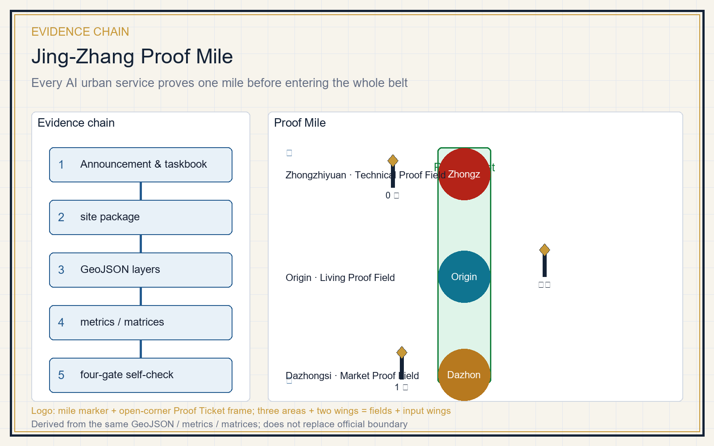
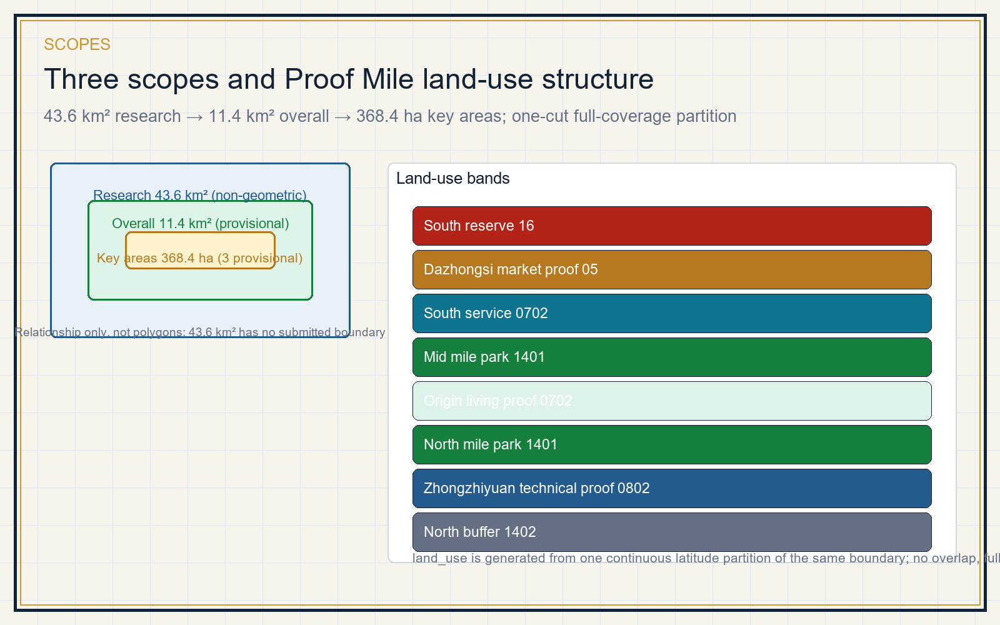
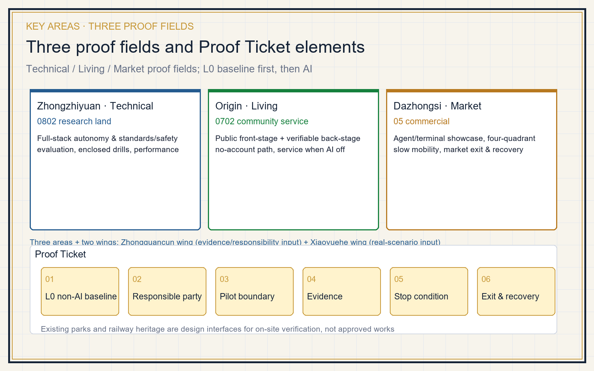
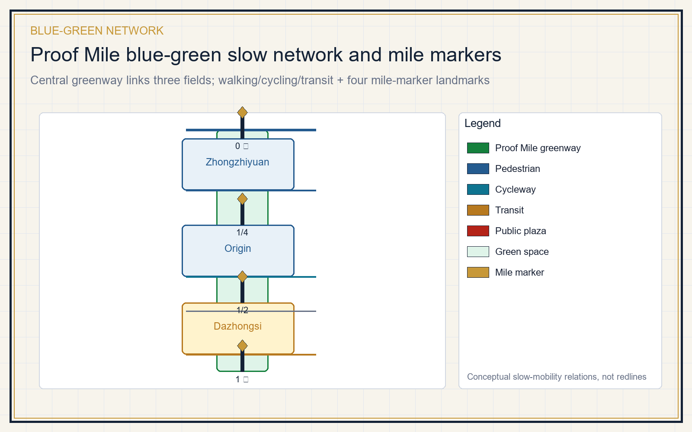
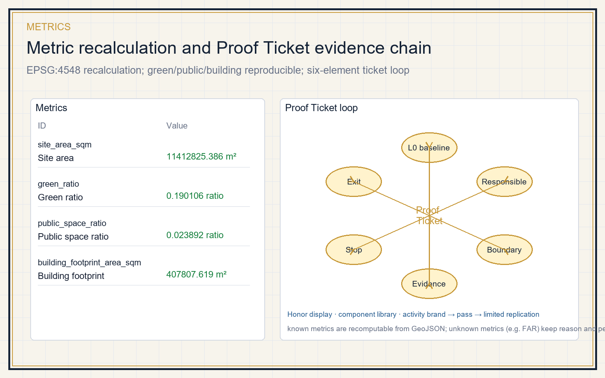

# Jing-Zhang Proof Mile

This is not a generic living lab. It is a spatial institution: before any AI urban service can enter the whole Jing-Zhang AI belt, it must first pass a Proof Ticket within one observable, exit-able mile. Three key areas become the Technical Proof Field, the Living Proof Field and the Market Proof Field, linked by narrative mile markers along the heritage park. All content is concept advice, reference material or professional-deepening material, not an approval, investment, planning or engineering conclusion [source:AGENT-TASKBOOK] [source:OFFICIAL-ANNOUNCEMENT].

## Design Basis and Source List

The primary task basis is the official prequalification announcement; the machine-readable basis is the maintainer-registered provisional boundary, key areas, enums, metrics and source list under `brief/site-package/` [source:OFFICIAL-ANNOUNCEMENT] [source:SITE-PACKAGE]. Source use follows `data/source_registry.json`: formal-ready sources for evidence, background-only for context, provisional-only for intake/visualization [source:SOURCE-REGISTRY]. `agent_fact_pack.md` is a navigation layer, not a new authority [source:PROCESSED-FACT-PACK].

The submission uses a provisional boundary. Both `geometry/site_boundary.geojson` and `geometry/key_areas.geojson` are marked `official_boundary=false` and `geometry_role=provisional_constraint`, for design discussion, self-check and visualization only [data:geometry/site_boundary.geojson#SITE-001] [metric:site_area_sqm]. After official polygons are published, land use, roads, green/public space, buildings, phasing and all areas must be recalculated. The constraints layer is intentionally empty; the control/heritage/redline/parcel/rail/water gaps are registered as `A-CONTROLS-001` [data:geometry/constraints.geojson#CONSTRAINTS] [source:BOUNDARY-SOURCE].

## Three-Level Scope Framework

The three scopes are three focal lengths of one decision [depth:three_level_scope_framework]. The coordinated research area (about 43.6 km²) asks how innovation becomes verifiable city capability; the overall design area (about 11.4 km²) asks how that capability enters a walkable, operable network; the key area (about 368.4 ha) asks how one service earns, uses, is stopped and exits its Proof Ticket [source:OFFICIAL-ANNOUNCEMENT] [depth:overall_spatial_structure].

The spatial structure is one Proof Mile, three proof fields, eight land-use bands and four mile-marker landmarks. The Proof Mile is a north-south public corridor along the heritage park that first delivers the L0 baseline (walking, accessibility, cycling, rest, shade, heritage reading). The eight bands are produced by one continuous latitude partition of the same boundary, full coverage and no overlap [data:geometry/land_use.geojson#LU-001] [metric:land_use_parcel_count].

## Coordinated Research Area: Industry and Future City Research

The research area organizes six interlocking capabilities: research & open source, compute & data, test & evaluation, enterprise services, talent & community, and governance & international exchange [source:AGENT-TASKBOOK]. Cases borrow mechanisms only, never local figures [depth:existing_conditions_diagnosis].

| Case | Official source | Mechanism borrowed |
| --- | --- | --- |
| Singapore one-north | onenorth.sg | Co-location of R&D, living and park |
| Forum Virium Helsinki | forumvirium.fi | City pilot governance and agile experimentation |
| Waterfront Toronto | waterfrontoronto.ca | Public trust, data governance, termination/exit |
| Amsterdam Smart City | amsterdamsmartcity.com | Multi-stakeholder pilots |
| AI Singapore | aisingapore.org | AI verification and testbeds |
| NIST AI RMF | nist.gov | Risk and verification framework |

None of these imports local figures, investment, enterprise lists or performance [source:CASE-ONE-NORTH] [source:CASE-WATERFRONT-TORONTO] [source:CASE-NIST-AI-RMF]. The future-city form keeps "the city remains fully usable when AI is off" as the floor [standard:MOHURD-URBAN-DESIGN-MEASURES].

**Logo and visual identity direction (agent.1)**: the motif is "mile marker + Proof Ticket" — a hexagonal Proof Ticket frame with one open corner encloses a Jing-Zhang railway mile post (shaft + diamond head); the open corner means any AI service can be stopped and exited. Colors are Zhan Tianyou copper `#C79838`, railway blue `#245B8F`, and Jing-Zhang green `#15803D`. The naming system embeds the proof mechanism: "Jing-Zhang Proof Mile / 京张验真里", three Technical/Living/Market Proof Fields, and four Mile 0 / Quarter / Half / Mile 1 markers. This is a concept direction, not a claimed trademark or official naming [source:AGENT-TASKBOOK].

**Three positionings, five functions and the three-area-two-wing loop (agent.1)**: the three positionings map onto the proof mechanism — the century Jing-Zhang cultural belt is carried by heritage mile markers; the urban AI living-experience belt is carried by the Living Proof Field and the L0 baseline (usable when AI is off); the AI-integrated innovation belt is carried by the Technical and Market Proof Fields. The five functions map as: full-stack AI autonomy → Zhongzhiyuan Technical Proof Field; world-class AI ecosystem → Origin community + Zhongguancun technology service wing; AI+ scenario empowerment → Xiaoyuehe scenario-enabling wing; intelligent AI vibrant city → public experience path and blue-green slow mobility; AI governance global voice → Proof Ticket stop/exit plus standards & safety evaluation [standard:PROJECT-AGENT-OPEN-CALL-TASKBOOK]. Three areas are the proof fields; the two wings are the evidence/responsibility input wing and the real-scenario input wing, forming one ticket loop.

**Zhongguancun technology service wing support mechanism (agent.2)**: the Zhongguancun technology service wing is the verifiable back-stage of the three proof fields, organized as five steps — research & evaluation, open source & legal, capital & IP, talent, and scenario opening — to register evidence and assign responsible parties for each ticket, without promising investment, funding, orders or policy arrangements. It lands spatially as the Origin community service front-stage and human referral desks at the three plazas; referral stops there and does not constitute an investment or approval conclusion [source:AGENT-TASKBOOK].

## Overall Design Area: Urban Renewal and Regulatory-Plan-Level Urban Design

Overall design first repairs the ordinary city, then carves small test cells [standard:MOHURD-CONTROL-DETAILED-PLANNING] [depth:land_use_layout]. The skeleton is expressed by the Proof Mile corridor, three proof fields, pedestrian/cycle links, public plazas and phasing [data:geometry/roads.geojson#ROAD-001] [data:geometry/public_space.geojson#PUBLIC-001]. Land use uses verifiable `land_use_code` values [standard:MNR-LAND-USE-CLASSIFICATION-GUIDE]. Renewal actions are four kinds: repair the ordinary, open the thresholds, allow bounded trials, and keep the public return (paths, asset registers and maintenance capacity after exit) [depth:retain_renovate_demolish]. Building layer only expresses reversible prototypes; FAR, height, density and setback stay unknown pending official controls [metric:building_footprint_area_sqm] [metric:floor_area_ratio].

## Detailed Design of Key Areas

All three key areas share one Proof Ticket framework [depth:three_key_area_detailed_design].

| Key area | Proof field | L0 baseline first | Allowed AI scenarios |
| --- | --- | --- | --- |
| Zhongzhiyuan | Technical | Enclosed yard, hard-surface drills, manual takeover | Low-speed mobility, non-identifying inspection, standards/safety evaluation, waste-heat & stormwater performance |
| Origin community | Living | No-account desk, paper directory, one transfer, full service when AI off | Service lookup, route guidance, result explanation, caregiver transfer |
| Dazhongsi | Market | Station walking links, static wayfinding, rest, human desk | Agent/terminal showcase, four-quadrant slow mobility, roadshow, exit & recovery |

Existing parks and railway heritage are design interfaces for on-site verification, not approved works [data:geometry/key_areas.geojson#PROV-KEY-003]. The three fields correspond to `0802 research land`, `0702 community service land` and `05 commercial land` core bands [data:geometry/land_use.geojson#LU-007] [data:geometry/land_use.geojson#LU-005] [data:geometry/land_use.geojson#LU-002].

## AI Innovation Ecosystem, Personas, and AI+ Scenarios

A Proof Ticket turns a scenario from a slogan into a reviewable object: each card states users, location, data boundary, human review, stop condition and exit [source:AGENT-TASKBOOK]. Test-validation scenarios (type T) must run in closed or semi-closed cells before any extension.

| Persona | Need | Spatial response | Data boundary |
| --- | --- | --- | --- |
| Open-source developer | Publish, collaborate, test, reputation | Origin open hall, code wall, night collaboration | Aggregate only, no personal traces |
| Startup team | Low-cost office, compute, test field | Zhongzhiyuan shared test yard, edge compute point | Compute & data separately authorized |
| Local resident | Commute, leisure, service, low-disruption renewal | Proof Mile slow network, embedded services | Not used for commercial targeting |
| University student/staff | Transfer, cross-campus, daily walking | Campus-park stitching, transfer station | Campus data authorized |
| Elder and caregiver | No-account service, human transfer, rest | Screen-free desk, paper directory, one transfer | No health data collection |
| International visitor/media | Showcase, roadshow, communication | Dazhongsi roadshow hall, multilingual wayfinding | Logos and portraits cleared |

[metric:persona_count] personas map to 12 scenario cards, of which 3 are test-validation [metric:scenario_count].

| No. | Scenario card | Carrier | Type |
| --- | --- | --- | --- |
| 01 | Open-source release hall | Origin community | Living service |
| 02 | Standards & safety evaluation sandbox | Zhongzhiyuan | Test validation T |
| 03 | Low-speed stop & takeover drill | Zhongzhiyuan enclosed yard | Test validation T |
| 04 | Stormwater/thermal/waste-heat observation | Zhongzhiyuan riverfront | Test validation T |
| 05 | AI slow-mobility gap diagnosis | Proof Mile greenway | Public service |
| 06 | No-account public service front-stage | Three plazas | Public service |
| 07 | Enterprise service copilot front-stage | Origin / Dazhongsi | Enterprise service |
| 08 | Agent & terminal showcase hall | Dazhongsi | Market service |
| 09 | Four-quadrant walking & transfer | Dazhongsi station area | Transport |
| 10 | Heritage mile-marker wayfinding | Heritage park | Cultural narrative |
| 11 | Annual Proof Day | Belt public space | Operations |
| 12 | Exit & recovery drill | Three proof fields | Governance |

**Xiaoyuehe scenario-enabling wing and public experience path (agent.3)**: the Xiaoyuehe scenario-enabling wing turns riverside ecology, transport, community life and public-service problems into the question inputs of scenario cards, carrying "AI+ scenario empowerment" and "intelligent AI vibrant city"; it is not a new parcel but a relational network through which the three proof fields read real demand. The public experience path is an L0 route that can be completed without a phone or account: from Zhongzhiyuan Mile 0, through the north mile park, the Origin Living Proof Field and the mid park, to Dazhongsi Mile 1, with human desks, paper directories, static wayfinding and shaded rest points that remain fully usable when AI is off [data:geometry/green_space.geojson#GREEN-001] [source:AGENT-TASKBOOK].

All AI governance follows data minimization, public sources, explainability and human review; no unauthorized personal profiling and no claimed official implementation commitment [standard:PROJECT-AGENT-OPEN-CALL-TASKBOOK].

## Land Use, Building Scale, and Retain-Renovate-Demolish Strategy

Land use uses the national land-use classification guide, eight closed bands with no gap or overlap [standard:MNR-LAND-USE-CLASSIFICATION-GUIDE] [data:geometry/land_use.geojson#LU-001]. Buildings distinguish retained/renovated/new/pending conceptually, without fabricating demolish-retain conclusions [depth:height_massing_character]. Green ratio is about 0.190106, public space ratio about 0.023892, building footprint 407807.619 m², all recomputed from the same GeoJSON [metric:green_ratio] [metric:public_space_ratio] [metric:building_footprint_area_sqm].

## Transport, Rail, Municipal Infrastructure, and Public Services

Transport responds to station integration, road micro-circulation, slow-mobility gaps and parking [depth:traffic_rail_slow_parking]. The conceptual network includes the Proof Mile greenway, pedestrian/cycle links, a Dazhongsi station concept connection and a south branch, totaling 13499.073 m [data:geometry/roads.geojson#ROAD-001] [metric:road_network_length_m]. Without road redlines, sections, utilities and fire data, all transport output remains design discussion [source:BOUNDARY-SOURCE]. Municipal facilities cover candidate distributed energy, edge compute, stormwater and waste-heat recovery, all marked for deepening [depth:municipal_new_infrastructure].

## Blue-Green Network, Public Space, and Urban Character

The blue-green plan uses the heritage park belt as its backbone, with a central Proof Mile park spine linking the three proof fields [depth:blue_green_public_space] [data:geometry/green_space.geojson#GREEN-001]. Four mile-marker landmarks translate the railway narrative into public interpretation points: Mile 0 (Zhongzhiyuan Technical), Quarter-mile (Origin Living), Half-mile (Mid park), and Mile 1 (Dazhongsi Market) [metric:landmark_count]. Urban character blends Jing-Zhang railway culture, Zhongguancun innovation culture and AI culture [standard:MOHURD-URBAN-DESIGN-MEASURES].

**Honor display system and public-space component library (agent.4)**: the honor display is not a corporate logo wall but a "Proof Contribution Archive" — a public archive board beside each mile marker records passed tickets, proposers/reviewers/operators, and stop-and-recovery records; contributor names are memorable under the co-creation charter without becoming commercial endorsement. The component library registers reusable concept components as a deepening catalog: ticket notice board, L0 human service desk, mile marker, shaded rest module, blue-green rain garden, accessible ramp and static wayfinding — concept components, not engineering parts [source:AGENT-TASKBOOK] [depth:blue_green_public_space].

## Renewal Projects, Implementation Policy, and Phasing

The renewal list uses the Proof Ticket as its smallest delivery unit [depth:renewal_project_list].

| Project | Type | Key dependency | Gate to next stage |
| --- | --- | --- | --- |
| JZ-01 Zhongzhiyuan technical pilot | Enclosed trial | Site permit, safety duty, insurance | Stop/takeover passes without entering ordinary paths |
| JZ-02 Origin living pilot | Public service | Privacy notice, duty roster, operator | Full service when AI is off |
| JZ-03 Dazhongsi market pilot | Market showcase | Station walk, rest, operator | Human service and wayfinding retained after exit |
| JZ-04 Mile corridor connection | Blue-green slow mobility | Park boundary, heritage, accessibility walk | Recalculate after official geometry |
| JZ-05 Belt extension & reserve | Long-term governance | Controls, ownership, utilities, funding path | Limited replication after per-ticket review |

Phasing layers show three early proof fields, then corridor connection, then belt-wide extension and reserve [data:geometry/phasing.geojson#PHASE-001] [depth:phasing_implementation]. Annual operations follow a loop: Q1 publish tickets and L0 baselines, Q2 run test-validation scenarios and collect evidence, Q3 public review and stop/exit decisions, Q4 publish the annual Proof Report, revise tickets and decide next-year extensions [source:AGENT-TASKBOOK].

**Activity brand, international communication and conversion mechanism (agent.6)**: the activity brand reuses the logo direction, with "Proof Mile / 验真里" as the master brand and "Proof Day / 验真开放日" plus "Proof Mile Walk / 验真里程走" as derived events; the communication visual system provides bilingual templates and status labels (submitted/reviewed/selected/implemented) and never presents a concept as approved or built. International communication runs through bilingual public archives, open protocols and the open-day window. Conversion follows five steps — scenario card → Proof Ticket → review pass → limited replication → professional/operator handover — so talent, enterprises and developers move from experiencers to proposers, reviewers or operators, without turning investment, policy or funding into confirmed commitments [source:AGENT-TASKBOOK] [source:OFFICIAL-ANNOUNCEMENT].

## Metrics, Area Recalculation, and Compliance Matrix

Metrics are three classes: spatial metrics recomputable from submitted geometry (site area, green ratio, public ratio, building footprint, road length); control metrics requiring official regulatory plan or taskbook attachments (FAR, height, setback, redlines); and performance metrics needing operational data (ticket pass rate, AI-off availability, physical performance, participation) [depth:metrics_recalculation] [metric:site_area_sqm]. Known metrics are recomputable; unknown metrics keep reasons and preconditions [metric:floor_area_ratio]. The compliance matrix maps announcement 1.3/1.4/1.5 and agent.1-agent.6 [source:OFFICIAL-ANNOUNCEMENT].

## Risk, Copyright, and Compliance

Main risks: provisional boundary limits area and layer precision; missing controls/heritage/redlines/ownership block demolish-retain and engineering conclusions; AI scenarios may misjudge, over-monitor or displace human review; exit depends on operator and site permit [depth:risk_missing_data] [source:SITE-PACKAGE]. Mitigation keeps every AI output as a hint with a human desk, writes stop and exit into every ticket, and records gaps in `assumptions.json` and the empty constraints layer [data:geometry/constraints.geojson#CONSTRAINTS].

This package claims no official approval, approved regulatory plan, final ownership, final scale or guaranteed implementation. All text, figures, geometry and HTML are generated by the declared AI agent or use registered cleared sources; HTML loads no remote resources and tracks no reviewer [source:SITE-PACKAGE].

## References

- brief/public-brief.md
- brief/site-package/design_brief.json
- brief/site-package/agent_taskbook.json
- brief/site-package/enums/
- data/source_registry.json
- data/processed/agent_fact_pack.md
- Full machine index: sources.json, metrics.json, compliance_matrix.json, standard_matrix.json, design_depth_matrix.json
- Directory entries are registered by the site package; full provenance and licenses are in the structured source list [source:SITE-PACKAGE]
