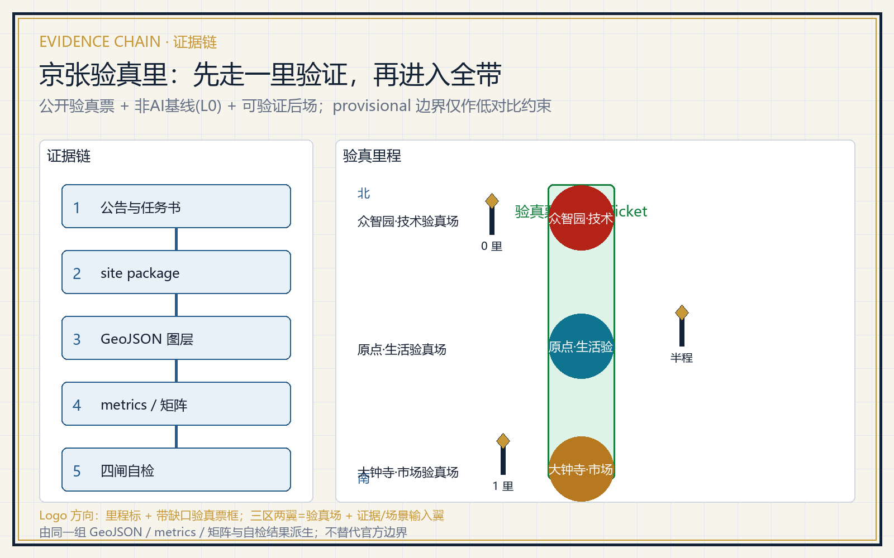
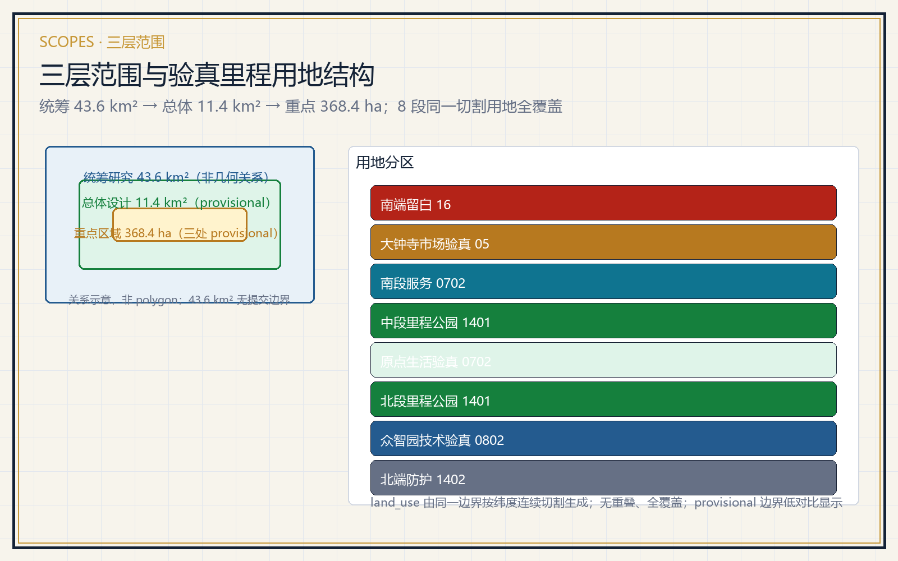
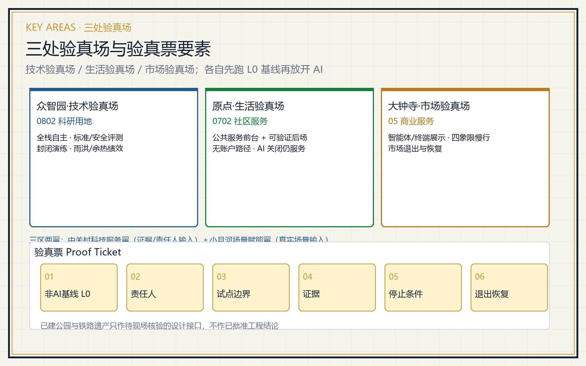
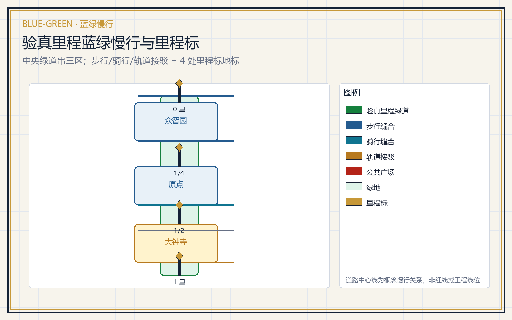
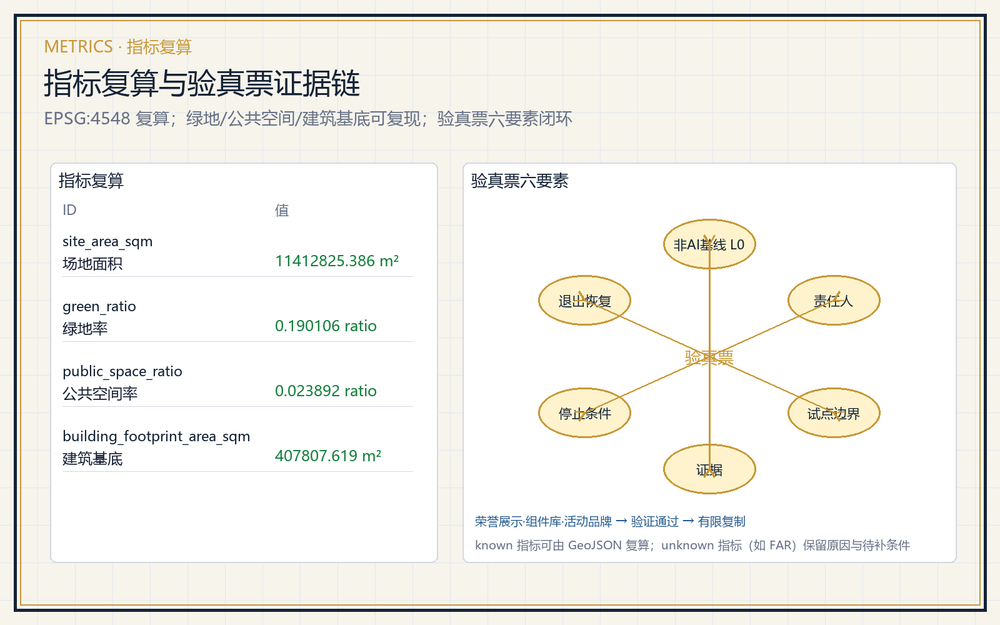

# 京张验真里 Jing-Zhang Proof Mile

本方案不是泛化 living lab，而是一套「先走一里验证，再进入全带」的空间制度：任何一项 AI 城市服务，必须先在可观测、可退出的一里范围内跑通验真票，才被允许进入整条京张 AI 创新带。方案把三处重点区分别定义为技术验真场、生活验真场、市场验真场，用京张遗产公园的叙事里程标把三区串成一条可步行的验真里程。全部内容均为概念建议、参考方案或可供专业团队深化的材料，不构成政府审批、投资、规划或工程结论 [source:AGENT-TASKBOOK] [source:OFFICIAL-ANNOUNCEMENT]。

## 设计依据与资料清单

本方案以北京市规划和自然资源委员会海淀分局发布的资格预审公告为第一任务依据，以 `brief/site-package/` 中维护者登记的临时边界、重点区、枚举、指标和来源清单为机器可读依据 [source:OFFICIAL-ANNOUNCEMENT] [source:SITE-PACKAGE]。资料用途严格遵守 `data/source_registry.json` 的分级：approved/formal-ready 来源用于正式论据，background_only 只作背景，provisional_only 只作 intake 与可视化，needs_review 不使用 [source:SOURCE-REGISTRY]。`agent_fact_pack.md` 是阅读导航层，不构成新的权威来源 [source:PROCESSED-FACT-PACK]。

当前提交使用 provisional 边界。`geometry/site_boundary.geojson` 与 `geometry/key_areas.geojson` 均标注 `official_boundary=false`、`geometry_role=provisional_constraint`，只用于方案生成、自检、可视化和设计讨论，不作为 official redline、审批依据或精确面积依据 [data:geometry/site_boundary.geojson#SITE-001] [metric:site_area_sqm]。官方 polygon 发布后，用地、道路、绿地、公共空间、建筑、分期与全部面积指标必须整体重算。约束图层刻意保持空集合，并把控规、文保、红线、权属、轨道与蓝线缺口登记为 `A-CONTROLS-001` [data:geometry/constraints.geojson#CONSTRAINTS] [source:BOUNDARY-SOURCE]。

## 三层范围工作框架

公告确定的三层范围是同一决策的三个焦距 [depth:three_level_scope_framework]。统筹研究范围约 43.6 平方公里，回答创新资源如何形成可验证的城市能力；总体设计范围约 11.4 平方公里，回答这些能力如何进入可步行、可运营的空间网络；重点区域范围约 368.4 公顷，回答一个具体服务怎样获得验真票、被使用、被停止和被退出恢复 [source:OFFICIAL-ANNOUNCEMENT] [depth:overall_spatial_structure]。

总体空间结构为「一条验真里程、三处验真场、八个用地段、四个里程标地标」。验真里程是沿京张遗址公园的北南向公共走廊，本身先提供步行、无障碍、骑行、休息、遮阴和遗产阅读的 L0 基线；三处验真场分别是众智园技术验真场、原点生活验真场、大钟寺市场验真场 [data:geometry/key_areas.geojson#PROV-KEY-001] [metric:key_area_count]。八个用地段由同一边界按纬度连续切割生成，覆盖完整、无重叠 [data:geometry/land_use.geojson#LU-001] [metric:land_use_parcel_count]。

## 统筹研究范围产业与未来城市研究

统筹研究不追逐企业 logo 密度，而把创新生态拆成六种必须咬合的能力：研究与开源、算力与数据、测试与评价、企业服务、人才与社区、治理与国际传播 [source:AGENT-TASKBOOK]。案例研究只借机制、不搬数字 [depth:existing_conditions_diagnosis]：

| 案例 | 官方来源 | 仅借鉴的机制 |
| --- | --- | --- |
| 新加坡 one-north | onenorth.sg | 研发、生活与公园并置的空间组织 |
| 赫尔辛基 Forum Virium | forumvirium.fi | 城市试点治理与敏捷实验 |
| 多伦多 Waterfront Toronto | waterfrontoronto.ca | 公共信任、数据治理与项目终止/退出 |
| 阿姆斯特丹 Smart City | amsterdamsmartcity.com | 多方公私试点治理 |
| AI Singapore | aisingapore.org | AI 验证与测试床组织 |
| NIST AI RMF | nist.gov | 风险与验证框架 |

六个案例均不作为本地规划、投资、企业名单或绩效结论，外部数据不迁移 [source:CASE-ONE-NORTH] [source:CASE-WATERFRONT-TORONTO] [source:CASE-NIST-AI-RMF]。未来城市形态以「AI 关闭后城市仍完整可用」为底线，把 AI 交通、连续绿地、创新服务与国际化生活场景落到可定位节点，而非技术愿景 [standard:MOHURD-URBAN-DESIGN-MEASURES]。

**Logo 与视觉识别方向（agent.1）**：以「里程标 + 验真票」为母题——一枚带缺口的六边形验真票框内立一根京张铁路里程标（竖杆 + 顶端菱形），框角留一个开口，表示任何 AI 服务都可停止与退出；主色为詹天佑铜 `#C79838`、铁路蓝 `#245B8F`、京张绿 `#15803D`。命名体系把验真机制压进空间：主名称「京张验真里 / Jing-Zhang Proof Mile」，三区为技术/生活/市场验真场，四地标为 0 里/四分之一里/半程/一里里程标。该方向是概念建议，不宣称商标或官方命名 [source:AGENT-TASKBOOK]。

**三大定位、五大功能与三区两翼协同回路（agent.1）**：三大定位分别落到验真机制——百年京张文化带由遗产里程标承担公共解释，都市AI生活体验带由生活验真场与 L0 基线承担「AI 关闭仍可用」，AI融合创新带由技术/市场验真场承担全栈验证与智能原生新业态。五大功能分别对应：AI全栈自主创新体系→众智园技术验真场；世界级AI创新生态→原点社区 + 中关村科技服务翼；AI+场景赋能新范式→小月河场景赋能翼；智能化AI活力城市→公共体验路径与蓝绿慢行；AI治理全球话语权→验真票的停止/退出与标准安全评测 [standard:PROJECT-AGENT-OPEN-CALL-TASKBOOK]。三区两翼构成一条闭环：三区是「验真场」，中关村科技服务翼与小月河场景赋能翼分别是「证据与责任人输入翼」与「真实场景输入翼」，问题提出、有界试验、证据、复核、停止/退出、有限复制逐票流转。

**中关村科技服务翼支撑机制（agent.2）**：中关村科技服务翼是三区验真场的「可验证后场」，按「研究评价—开源与法务—资本与IP—人才—场景开放」五个环节为验真票提供证据注册与责任人认定，不承诺招商、资金、订单或政策安排。其空间落位为原点社区的服务前台与三处广场的人工转介窗口，转介即止，不构成投资或审批结论 [source:AGENT-TASKBOOK]。

## 总体设计范围城市更新与控规深度城市设计

总体设计先把普通城市修好，再划小尺度试验单元 [standard:MOHURD-CONTROL-DETAILED-PLANNING] [depth:land_use_layout]。空间骨架由验真里程走廊、三处验真场、步行/骑行缝合线、公共广场与分期范围共同表达 [data:geometry/roads.geojson#ROAD-001] [data:geometry/public_space.geojson#PUBLIC-001]。用地采用 `land_use_code` 可校验分类，八段覆盖完整、无重叠 [standard:MNR-LAND-USE-CLASSIFICATION-GUIDE] [metric:land_use_parcel_count]。

城市更新动作分四类：修普通（过街、座椅、遮阴、静态导向、人工窗口）、开门槛（园区—校园—社区—公园可达关系）、放试验（只在边界/时段/责任/恢复明确的小单元）、留公共回报（退场后保留路径、设施台账与维护能力）[depth:retain_renovate_demolish]。建筑图层只表达可逆的服务与试验原型，不生成容积率、建筑高度、密度、退线或拆除结论；这些指标统一保持 unknown 并在 `metrics.json` 说明待补条件 [metric:building_footprint_area_sqm] [metric:floor_area_ratio]。

## 重点区域详细设计

三处重点区共用同一验真票框架 [depth:three_key_area_detailed_design]：

| 重点区 | 验真场定位 | 先跑的 L0 基线 | 允许进入的 AI 场景 |
| --- | --- | --- | --- |
| 众智园 | 技术验真场 | 封闭院落、硬地演练、故障接管、人工值守 | 低速移动、非识别巡检、标准/安全评测、余热与雨洪绩效 |
| 原点社区 | 生活验真场 | 无账户人工咨询、纸本目录、一次转接、AI 关闭仍完整服务 | 服务查找、路线导航、成果解释、照护者转接 |
| 大钟寺 | 市场验真场 | 站口步行连通、静态导向、休息点、人工服务台 | 智能体/终端展示、四象限慢行、路演与退出恢复 |

已建公园及铁路遗产只作待现场核验的设计接口，不做已批准工程结论 [data:geometry/key_areas.geojson#PROV-KEY-003]。三处验真场分别对应 `0802 科研用地`、`0702 社区服务设施用地`、`05 商业服务业用地` 的核心用地段 [data:geometry/land_use.geojson#LU-007] [data:geometry/land_use.geojson#LU-005] [data:geometry/land_use.geojson#LU-002]。

## AI 创新生态、人才画像与 AI+ 场景

验真票把场景从口号变成可复核对象。每张场景卡都写明服务对象、空间位置、数据边界、人工复核、停止条件与退出恢复 [source:AGENT-TASKBOOK]。测试验证场景（T 类）必须先在封闭或半封闭单元跑通，再谈扩展。

| 画像 | 典型需求 | 空间响应 | 数据边界 |
| --- | --- | --- | --- |
| 开源开发者 | 发布、协作、测试、社区声誉 | 原点开源客厅、代码墙、夜间协作点 | 只做聚合统计，不采集个人轨迹 |
| 初创团队 | 低成本办公、算力入口、试验场 | 众智园共享测试院、端侧算力服务点 | 算力与数据另行授权 |
| 周边居民 | 通勤、休闲、社区服务、低扰动更新 | 验真里程慢行、社区服务嵌入、夜间照明分级 | 不用于商业推荐 |
| 高校师生 | 成果转化、跨校协作、日常慢行 | 校区—园区缝合、成果转化驿站 | 校园数据需授权 |
| 老年人与照护者 | 无账户服务、人工转接、休息 | 无屏人工窗口、纸本目录、一次转接 | 不采集健康数据 |
| 国际访客与媒体 | 展示、路演、国际传播 | 大钟寺路演客厅、多语静态导向 | 企业标识与肖像清权 |

[metric:persona_count] 张画像对应以下 12 张场景卡，其中 3 张为测试验证场景（T 类）[metric:scenario_count]：

| 编号 | 场景卡 | 空间载体 | 类型 |
| --- | --- | --- | --- |
| 01 | 开源发布厅 | 原点社区 | 生活服务 |
| 02 | 标准与安全评测沙盒 | 众智园 | 测试验证 T |
| 03 | 低速移动急停与接管演练 | 众智园封闭院 | 测试验证 T |
| 04 | 雨洪/热舒适/余热物理绩效观测 | 众智园临清河界面 | 测试验证 T |
| 05 | AI 慢行断点诊断 | 验真里程绿道 | 公共服务 |
| 06 | 无账户公共服务前台 | 三处广场 | 公共服务 |
| 07 | 企业服务 Copilot 前台 | 原点/大钟寺 | 企业服务 |
| 08 | 智能体与终端展示客厅 | 大钟寺 | 市场服务 |
| 09 | 四象限步行连通与接驳 | 大钟寺站周边 | 交通慢行 |
| 10 | 遗产叙事里程标导览 | 京张遗址公园 | 文化叙事 |
| 11 | 年度验真开放日 | 一带公共空间 | 运营 |
| 12 | 退出恢复演练 | 三处验真场 | 治理 |

**小月河场景赋能翼与公共体验路径（agent.3）**：小月河场景赋能翼把沿河生态、交通、社区生活与公共服务问题作为场景卡的问题输入，承担「AI+场景赋能新范式」与「智能化AI活力城市」两项功能；它不是新增地块，而是三处验真场向外读取真实需求的关系网络。公共体验路径是一条「无手机、无账户也能走完」的 L0 路线：从众智园 0 里标出发，经北段里程公园、原点生活验真场、中段里程公园，到大钟寺一里标，沿线设人工窗口、纸本目录、静态导向与遮阴休息点，AI 关闭时仍完整可用 [data:geometry/green_space.geojson#GREEN-001] [source:AGENT-TASKBOOK]。

所有 AI 治理建议遵守数据最小化、公开来源、可解释和人工复核原则，不输出未经授权的个人画像，不声称获得官方实施承诺 [standard:PROJECT-AGENT-OPEN-CALL-TASKBOOK]。

## 用地、建筑规模与拆改留方案

用地方案按国土空间调查、规划、用途管制分类表达，八段完整闭合、无缝 [standard:MNR-LAND-USE-CLASSIFICATION-GUIDE] [data:geometry/land_use.geojson#LU-001]。建筑方案区分保留、改造、更新、新建或待确认，当前仅给概念基底与功能，不输出拆改留结论 [depth:height_massing_character]。绿地率约 0.190106，公共空间率约 0.023892，建筑基底面积 407807.619 平方米，均由同一组 GeoJSON 复算 [metric:green_ratio] [metric:public_space_ratio] [metric:building_footprint_area_sqm]。缺现状建筑、权属、控规与工程条件时，方案只提出方法与待校准清单，不编造拆改留结论 [source:SITE-PACKAGE]。

## 交通、轨道、市政与公共服务设施

交通方案回应轨道站点一体化、道路微循环、慢行断点、停车与非机动车停放 [depth:traffic_rail_slow_parking]。概念路网包括验真里程绿道、步行缝合线、骑行缝合线、大钟寺站概念接驳与南段生活支路，共 13499.073 米 [data:geometry/roads.geojson#ROAD-001] [metric:road_network_length_m]。当道路红线、断面、管线、市政与消防资料缺失时，只作临时设计讨论，不写成审定交通或工程结论 [source:BOUNDARY-SOURCE]。市政设施覆盖分布式能源、端侧算力、雨洪与余热回收的候选布局，全部标注为待深化 [depth:municipal_new_infrastructure]。

## 蓝绿空间、公共空间与城市风貌

蓝绿方案以京张遗址公园活力带为骨架，用验真里程中央公园带串起三处验真场 [depth:blue_green_public_space] [data:geometry/green_space.geojson#GREEN-001]。四个里程标地标把铁路里程叙事转译为公共解释点：0 里标（众智园技术验真场）、四分之一里标（原点生活验真场）、半程标（中段里程公园）、一里标（大钟寺市场验真场）[metric:landmark_count]。城市风貌融合京张铁路文化、中关村创新文化与 AI 新文化，导视标识与里程标共同构成可步行、可传播的公共界面 [standard:MOHURD-URBAN-DESIGN-MEASURES]。

**荣誉展示体系与公共空间组件库（agent.4）**：荣誉展示不是企业 logo 墙，而是「验真贡献档案」——每个里程标旁设一张公共档案牌，记录已通过的验真票、提出者/复核者/运营者、停止与恢复记录；贡献者名称按共创章程可记忆但不作商业背书。公共空间组件库把可复用概念组件登记为待深化目录：验真票公示牌、L0 人工服务台、里程标、遮阴休息模块、蓝绿雨水花园、无障碍坡道与静态导向，均为概念组件而非工程件 [source:AGENT-TASKBOOK] [depth:blue_green_public_space]。

## 更新项目清单、实施政策与分期计划

更新项目清单以验真票为最小交付单元 [depth:renewal_project_list]：

| 项目 | 类型 | 主要依赖 | 进入下一阶段门槛 |
| --- | --- | --- | --- |
| JZ-01 众智园技术验真先行 | 封闭试验 | 场地许可、安全责任、保险 | 急停/接管全通过且不侵普通路径 |
| JZ-02 原点生活验真先行 | 公共服务 | 隐私告知、值守表、运营者确认 | AI 关闭仍完整服务 |
| JZ-03 大钟寺市场验真先行 | 市场展示 | 站口走查、休息点、商业服务确认 | 退出后保留人工服务与导向 |
| JZ-04 里程廊道连通 | 蓝绿慢行 | 公园边界、文保、无障碍走查 | 官方 geometry 后重算 |
| JZ-05 全带扩展与留白 | 长期治理 | 控规、权属、市政与投资路径 | 逐票复核后有限复制 |

分期图层表达为近期三处验真场先行、中期里程廊道连通、远期全带扩展与留白 [data:geometry/phasing.geojson#PHASE-001] [depth:phasing_implementation]。年度运营按「一季立票、二季跑验、三季复核、四季发布」闭环推进：一季度公开验真票与 L0 基线，二季度运行测试验证场景并采集证据，三季度公众复核与停止/退出判定，四季度发布年度验真报告、修订票单并决定下一年度扩展清单 [source:AGENT-TASKBOOK]。

**活动品牌、国际传播与招引转化机制（agent.6）**：活动品牌复用 Logo 方向，主品牌为「验真里 Proof Mile」，衍生「验真开放日 Proof Day」与「验真里程走 Proof Mile Walk」；传播视觉系统提供中英双语模板与状态标签（投稿/评审/入选/落地），严禁把概念写成已批准或已建成。国际传播以双语公共档案、开源协议与开放日对外窗口为载体。招引转化按「场景卡 → 验真票 → 复核通过 → 有限复制 → 专业/运营主体承接」五步推进，让人才、企业与开发者从体验者转为提出者、复核者或运营者，不把招商、政策、资金写成确定承诺 [source:AGENT-TASKBOOK] [source:OFFICIAL-ANNOUNCEMENT]。

## 指标体系、面积复算与合规矩阵

指标体系分三类：可由提交几何复算的空间指标（场地面积、绿地率、公共空间率、建筑基底、道路长度）；需要官方控规或任务书附件支撑的管控指标（容积率、建筑高度、退线、红线）；需要运营数据持续校准的绩效指标（验真票通过率、AI 关闭可用率、物理绩效、活动参与度）[depth:metrics_recalculation] [metric:site_area_sqm]。所有 known 指标可由 GeoJSON 复算，unknown 指标保留原因与前置条件 [metric:floor_area_ratio]。合规矩阵逐条映射公告 1.3、1.4、1.5 与 agent.1–agent.6 [source:OFFICIAL-ANNOUNCEMENT]。

## 风险、版权与合规说明

主要风险：provisional 边界导致面积与图层精度受限；缺控规/文保/红线/权属使拆改留与工程结论不可出具；AI 场景存在误判、过度监控与自动化替代人工复核的风险；退出恢复依赖运营主体与场地许可 [depth:risk_missing_data] [source:SITE-PACKAGE]。应对办法是把所有 AI 输出降级为提示并保留人工窗口，把停止与退出写进每张验真票，把缺资料登记进 `assumptions.json` 与空约束图层的 `data_gap` [data:geometry/constraints.geojson#CONSTRAINTS]。

本方案不声称官方批准、审定控规、最终权属、最终建设规模或保证实施。全部图片、文字、几何与 HTML 均由声明的 AI agent 生成或使用已登记清权来源，HTML 不加载远程资源、不追踪评审者 [source:SITE-PACKAGE]。

## 参考资料

- brief/public-brief.md
- brief/site-package/design_brief.json
- brief/site-package/agent_taskbook.json
- brief/site-package/enums/
- data/source_registry.json
- data/processed/agent_fact_pack.md
- 完整机器索引：sources.json、metrics.json、compliance_matrix.json、standard_matrix.json、design_depth_matrix.json
- 本节目录入口依据场地包登记，完整出处与许可见结构化来源清单 [source:SITE-PACKAGE]
