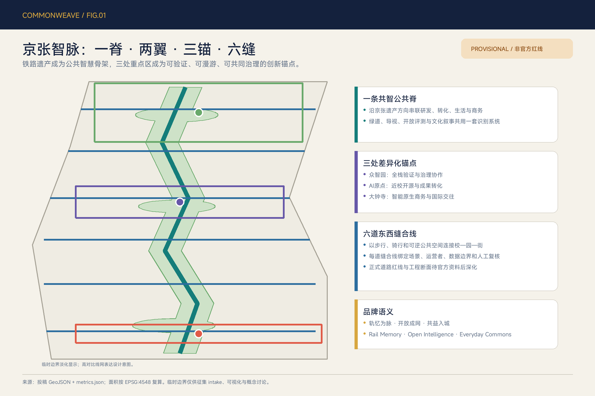
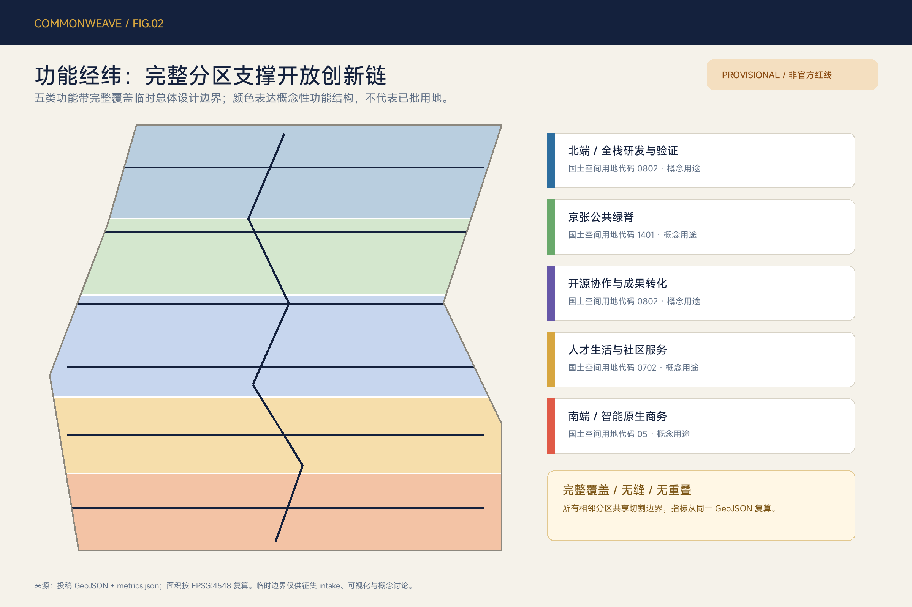
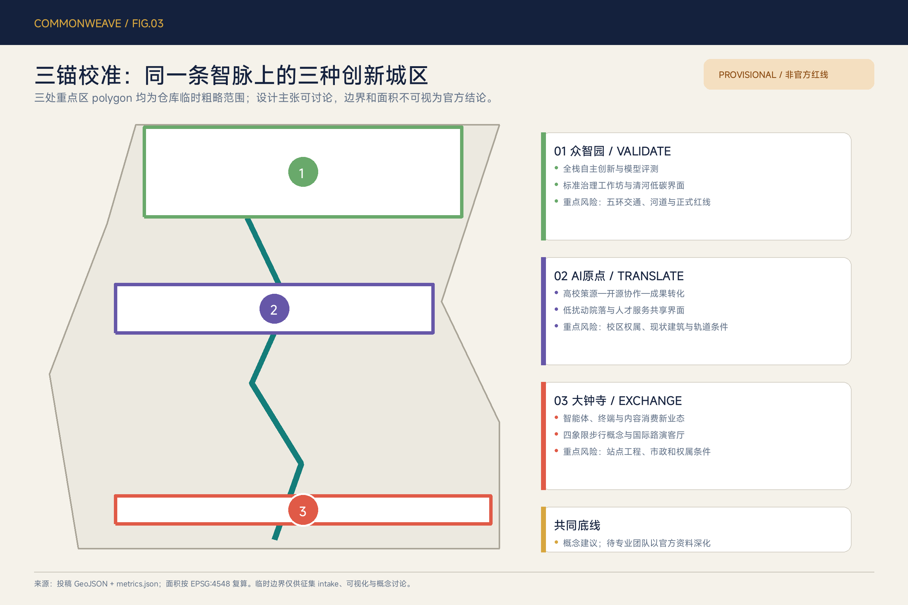
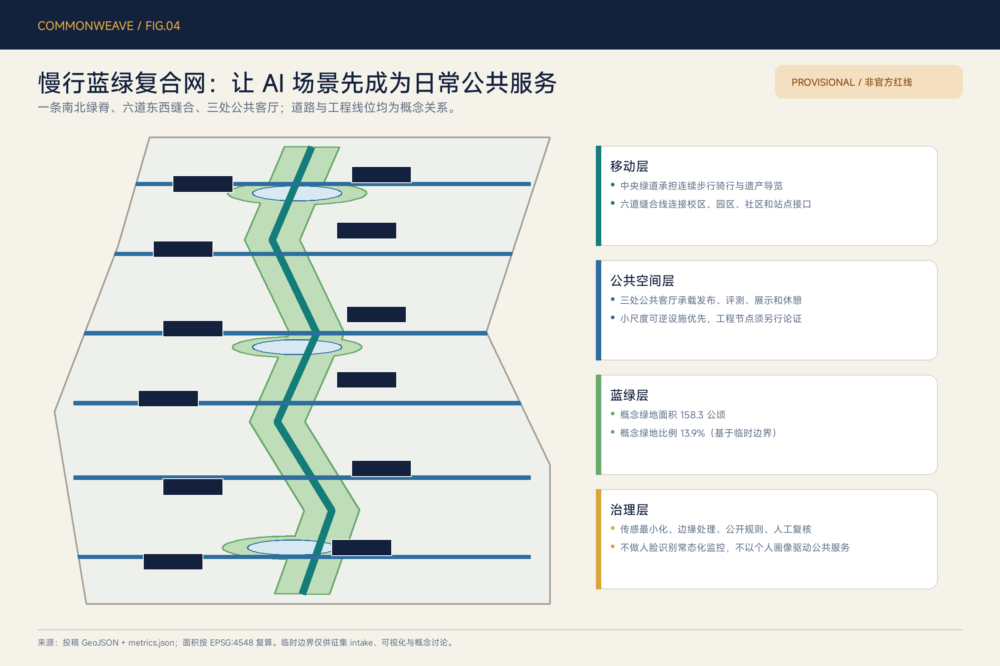
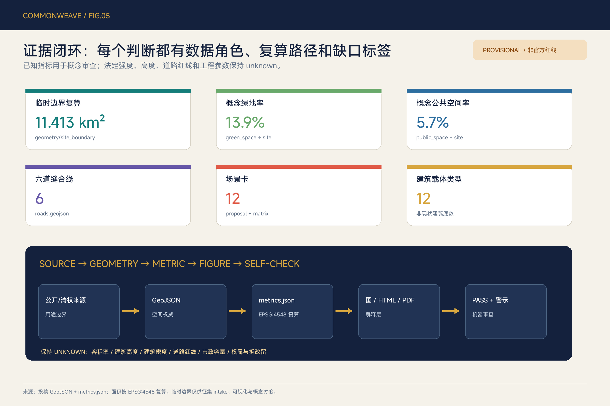

# 京张智脉 CommonWeave：开放验证与人本共生走廊

> 轨忆为脉，开放成网，共益入城。Rail Memory · Open Intelligence · Everyday Commons.

本方案把“AI 创新带”理解为一套持续运行的城市公共协议，而不只是一组产业地块：铁路遗产提供可记忆的南北骨架，高校、企业、社区和站点通过六道东西缝合线形成日常网络，众智园、北京 AI 原点社区和大钟寺分别承担“验证、转化、交换”三种角色。所有空间落地内容均为概念建议、参考方案或可供专业团队深化研究，不替代法定规划，不构成审定结论、投资承诺或工程可行性判断。

## 设计依据与资料清单

方案以海淀分局公开的征集公告确认项目名称、三层范围、公告面积和设计任务，以清权的智能体任务书确认三大定位、五大功能、三区两翼及 agent.1—agent.6 的必答内容。[source:OFFICIAL-ANNOUNCEMENT] [source:AGENT-TASKBOOK] 仓库 `source_registry` 用来区分 formal-ready、背景型和 provisional-only 资料；处理后的事实包只承担阅读导航，不升级原始资料的权威等级。[source:SOURCE-REGISTRY] [source:PROCESSED-FACT-PACK] [source:SITE-PACKAGE]

当前仓库尚无可信 official `SITE_BOUNDARY` 与三处 official `KEY_AREA` polygon。本投稿锁定仓库临时粗略 polygon，不修改约束几何，并明确设置 `official_boundary=false`、`geometry_role=provisional_constraint`。[source:BOUNDARY-SOURCE] [source:KEY-AREA-SOURCE] [data:geometry/site_boundary.geojson#SITE-001] [data:geometry/key_areas.geojson#PROV-KEY-001] 因此，11.413 km² 是临时 polygon 在 EPSG:4548 下的复算值，不是官方红线面积；公告“约 11.4 km²”仍是任务尺度依据，两者不可互换。[metric:site_area_sqm] [metric:announced_overall_design_area_sqm]

专业依据分为五组：项目公告控制任务覆盖；智能体任务书控制 AI 原生场景、品牌和运营内容；《城市设计管理办法》控制公共空间、风貌和建筑界面表达；控规编制审批办法要求把已知条件、设计建议和待确认控制严格分开；国土空间用地分类指南控制用地代码语义。[standard:PROJECT-OFFICIAL-ANNOUNCEMENT] [standard:PROJECT-AGENT-OPEN-CALL-TASKBOOK] [standard:MOHURD-URBAN-DESIGN-MEASURES] [standard:MOHURD-CONTROL-DETAILED-PLANNING] [standard:MNR-LAND-USE-CLASSIFICATION-GUIDE] `MOHURD-ARCH-DESIGN-DEPTH-2016` 尚缺官方文件，仅作为资料缺口登记，不作为本方案正式论据。[standard:MOHURD-ARCH-DESIGN-DEPTH-2016]

国际案例只承担背景启发，不支撑本项目边界、用地、强度或实施承诺；每条案例的可转化机制都需重新经过海淀的公共利益、数据合规和专业审查。[source:CASE-PUNGGOL] [source:CASE-KENDALL] [source:CASE-KALASATAMA] [source:CASE-PARIS-RIVE-GAUCHE] [source:CASE-KNOWLEDGE-QUARTER] [source:CASE-BROOKLYN-NAVY-YARD] 五张核心图、离线 HTML 与 PDF 均由本投稿 GeoJSON、指标和矩阵派生，不使用远程底图、新闻图片或生成式氛围图。[source:ASSET-GENERATION-METHOD] 现状诊断采用“已知—待核—禁止推断”三栏法，详见 [depth:existing_conditions_diagnosis]。

## 三层范围工作框架

统筹研究范围约 43.6 km²，回答海淀 AI 创新生态、三区两翼协同和未来城市形态；总体设计范围约 11.4 km²，回答京张遗址公园周边产业—空间融合、城市更新、交通市政、蓝绿系统和风貌；重点区域约 368.4 ha，回答三处片区的差异化角色与详细设计动作。三层并非三套互不相干的图，而是“战略选择—空间传导—局部验证”的证据链。[depth:three_level_scope_framework]

CommonWeave 将三层任务转译为“一脊、两翼、三锚、六缝、十二场景”。一脊是沿京张遗产方向组织的公共智慧骨架；两翼沿用中关村科技服务翼和小月河场景赋能翼；三锚对应众智园、AI 原点和大钟寺；六缝是校—园—街之间的概念慢行与公共空间连接；十二场景把产业验证、日常公共服务和长期运营落到可检查的空间与治理条件。[depth:overall_spatial_structure] 结构图层分别见 [data:geometry/roads.geojson#ROAD-001]、[data:geometry/public_space.geojson#PUBLIC-001] 与 [data:geometry/green_space.geojson#GREEN-001]。

| 工作层级 | 主问题 | CommonWeave 输出 | 审查边界 |
| --- | --- | --- | --- |
| 统筹研究 | 创新链如何与城市日常相连 | 三定位、五功能、三区两翼协同回路，六个国际案例转化机制 | 不新增红线，不编造企业、产值或资金 |
| 总体设计 | 更新空间如何支撑研发、转化、生活与交往 | 完整用地分区、共智绿脊、六缝、概念载体、分期与指标 | 强度、高度、道路、市政保持 unknown |
| 重点区域 | 三处片区如何避免同质化 | 众智园 VALIDATE、AI 原点 TRANSLATE、大钟寺 EXCHANGE | polygon 均为 provisional，需官方资料整体校准 |

临时边界到 official polygon 的替换不是“换一条线”：必须同时重算 `site_boundary`、`key_areas`、完整用地分区、建筑载体、道路、绿地、公共空间、分期和全部面积比例，再重新生成五张图、HTML、A3/A0 与 manifest hash。该缺口不妨碍内容评审，但限制所有精度敏感结论。[depth:metrics_recalculation]

## 统筹研究范围产业与未来城市研究

### 1. 品牌与协同回路

主名称为“京张智脉”，英文名为 `JINGZHANG COMMONWEAVE`。`Common` 表示公共利益、开放协作与共享基础设施，`Weave` 表示铁路纵脉与东西城市生活的交织。标识方向是一根连续线：两个平行短线提示铁轨，折线同时抽象出 J/Z，三个节点表示 VALIDATE、TRANSLATE、EXCHANGE。主色为京张信号红、公共智慧青、遗产纸色和证据金；不使用企业标识、人物肖像或受限字体。命名系统按“总带—三锚—六缝—场景—年度活动”五级扩展，使 Logo 不只是封面图，而成为导视、场景卡、贡献记录和国际传播的共同语法。[standard:PROJECT-AGENT-OPEN-CALL-TASKBOOK]

三大定位通过同一回路协同：百年京张文化带提供记忆与公共空间连续性；都市 AI 生活体验带把服务、学习、休闲和无障碍纳入日常；AI 融合创新带把评测、开源、转化、商务和治理串联。五大功能按“全栈研发与验证 → 开源协作与转化 → AI+ 场景 → 活力城市 → 治理与国际对话”循环运行。两翼不是边缘配套：科技服务翼提供知识产权、标准、人才和资本服务的开放接口；场景赋能翼提供真实需求、公众参与和城市服务验证接口。

### 2. 六个案例的可转化机制

| 背景案例 | 官方页面可读特征 | CommonWeave 转化 | 不照搬内容 |
| --- | --- | --- | --- |
| 新加坡 Punggol Digital District | 大学、产业、社区共址，并以开放数字平台支持真实环境试验 [source:CASE-PUNGGOL] | 众智园建立预约式验证目录；AI 原点形成校企共同课题；测试结果留下模型卡和退出记录 | 不复制规模、投资、治理架构或供应商 |
| Cambridge Kendall Square | 工业片区转向创新集群，同时补充住房、餐饮、公共交通和社区界面 [source:CASE-KENDALL] | 把“创新密度”从企业数量改写为研发、生活、开放空间与社区收益的组合 | 不推断海淀企业名单或开发强度 |
| Helsinki Kalasatama | 港区长期分期更新，公共交通、滨水连续路线、服务与公共艺术并行 [source:CASE-KALASATAMA] | 京张绿脊采用长期路线+短期可逆活动；文化投入与公众体验进入运营评价 | 不套用建筑高度、人口和资金机制 |
| Paris Rive Gauche Urban Lab | 城区作为实验单元，项目经过公开试验和评价 [source:CASE-PARIS-RIVE-GAUCHE] | 建立“问题征集—小规模试验—独立评估—扩大/退出”的场景闸门 | 不把试验写成自动采购或批准 |
| London Knowledge Quarter | 交通枢纽周边以学术、文化、研究和媒体伙伴关系推动跨学科协作 [source:CASE-KNOWLEDGE-QUARTER] | 三锚共用年度课题、场地日历和贡献档案，文化机构与技术机构共同策展 | 不复制机构清单或联盟治理权 |
| Brooklyn Navy Yard | 工业遗产更新强调生产性功能、就业、混合配套、交通管理和可达开放空间 [source:CASE-BROOKLYN-NAVY-YARD] | 大钟寺强调“可生产、可展示、可交往”的智能原生载体，京张记忆不被纯消费化 | 不推断土地权属、制造业政策或建设量 |

未来城市研究的评价单位不是“装了多少 AI”，而是居民、开发者和运营者是否获得可解释的时间收益、空间选择和纠错渠道。建议建立四类持续指标：开放协作（公开课题、贡献复用）、公共体验（步行连续、无障碍、服务可达）、可信治理（告知、授权、人工复核、退出）、转化运营（试验到采购或社区服务的合规路径）。这些是运营指标框架，需上线后以公开口径持续校准，不是当前已知绩效。

## 总体设计范围城市更新与控规深度城市设计

总体设计采用“纵向脊梁 + 横向缝合 + 分带承载”的空间模型。五个南北功能带完整覆盖提交边界：南端智能原生商务与城市服务、人才生活与社区服务、开源协作与成果转化、京张公共绿脊与开放空间、北端全栈研发与验证。用地代码使用 `05`、`0702`、`0802`、`1401`，表达概念功能与国土空间分类的对应，不构成用地性质调整或规划许可。[data:geometry/land_use.geojson#LU-001] [depth:land_use_layout]

十二类概念建筑载体沿三锚与六缝布置，包括共享实验场、标准治理协作院、开源成果转化坊、模型发布与评测厅、人才生活共享院、社区 AI 服务站和国际路演客厅。其几何合计基底约 67.11 ha，仅用于比较空间载体类型和图面完整性，不是现状建筑测绘、总建筑规模或拆改留判断。[data:geometry/buildings.geojson#BLDG-001] [metric:building_footprint_area_sqm] [metric:building_typology_count] 所有载体在取得现状建筑、权属、控规和消防资料后，才可转译为保留、修缮、改造、拆除或新建清单。[depth:retain_renovate_demolish]

开发强度采用“控制条件登记册”而非伪精确数字。容积率、建筑高度、建筑密度、退线、道路红线和设施容量在 `metrics.json` 保持 `unknown`；本阶段只提出体量原则：遗产和蓝绿界面保持低扰动与可读天际线，站点和创新载体的集约度由正式控规、交通容量、日照、消防和文保条件共同决定，建筑首层优先形成可进入的公共/半公共界面。[depth:development_intensity_controls] [depth:height_massing_character] 这些原则响应城市设计标准，但不预设数值。

更新项目按“可逆公共界面—适应性复用—专业工程”三类组织。可逆层可先做导视、活动、开放评测日和临时服务台；适应性复用需现状检测、权属和消防确认；道路、桥隧、地下、市政、河道与轨道站点属于专业工程层，不能以本概念图直接实施。`constraints.geojson` 刻意不绘制虚构控制线，所有缺口由 assumptions 与风险章节承接。[data:geometry/constraints.geojson#CONSTRAINTS]

## 重点区域详细设计

三处重点区 polygon 由仓库 provisional 数据直接复制，公告面积分别约 192.1 ha、104.3 ha 和 72.0 ha；图面矩形只表示 intake 粗略位置，不是 official key-area 边界。[metric:key_area_count] [data:geometry/key_areas.geojson#PROV-KEY-001] [data:geometry/key_areas.geojson#PROV-KEY-002] [data:geometry/key_areas.geojson#PROV-KEY-003] 详细设计深度通过“定位—空间结构—载体—慢行—公共空间—场景—实施依赖”七项表达，而不是用未经核实的强度数据制造完成感。[depth:three_key_area_detailed_design]

### 众智园：VALIDATE / 开放验证锚

定位为花园型全栈验证与治理协作区。概念结构是“清河绿色界面—共享验证庭—标准治理廊—对外接驳口”：共享验证庭承载开放模型评测、具身智能低速沙盒和边缘算力—能源协同三类受控试验；标准治理廊面向模型卡、数据授权、红队与安全复盘；清河界面优先保持生态、防洪和公众通行。建筑动作只给出“可复用研发空间、共享实验空间、公共展示界面”三种类型，具体拆改留、建筑高度和工程接驳待官方边界、河道、五环交通、现状建筑和权属资料。

### 北京 AI 原点社区：TRANSLATE / 开源转化锚

定位为近校开源协作与成果转化社区。概念结构是“高校知识接口—开放发布站—转化小院—人才生活环”：知识接口组织跨校公开课题，发布站展示代码、模型卡、数据声明和贡献记录，转化小院集成法务、知识产权、产品验证与小型路演，人才生活环补齐学习、社交、健康导航和日常服务。更新方法强调小尺度、可逆和分时共享，不对具体校园、园区或建筑作权属与拆改判断；五道口、清华东路西口等站点关系需在正式交通资料后由专业团队深化。

### 大钟寺：EXCHANGE / 智能原生交换锚

定位为智能体、智能终端与内容消费的城市型交换界面。概念结构是“站城门户—国际路演客厅—数据授权剧场—共益贡献墙”：站城门户强调地面步行、骑行停放和清晰导视；路演客厅连接企业展示、开发者交流与公共体验；授权剧场把同意、撤回、审计和申诉做成可理解的城市教育场景；贡献墙记录经同意公开的开源、公益和场景改进贡献。大钟寺站四象限连接仅表达步行关系，不提供工程线位；轨道、路口、市政、权属与消防条件是深化前置项。

三锚共享一套“验证—转化—交换—复盘”协议：众智园产生可审计试验结果，AI 原点把成果转译为开源或产品，大钟寺连接市场、公众和国际传播，使用数据再回流到下一轮问题定义。协议要求失败可公开、场景可退出、规则可申诉、人类保留最终判断，从机制上避免把 AI 变成不可见的城市控制层。

## AI 创新生态、人才画像与 AI+ 场景

六类用户画像用于检查公平性，不用于个体画像推荐：①开发者需要发布、协作、测试和可持续声誉；②初创团队需要低成本空间、算力入口、法务和真实需求；③周边居民与照护者需要安静、无障碍、可信服务和休闲；④学生与青年研究者需要学习、导师、成果转化与夜间安全慢行；⑤国际访客与跨区从业者需要多语导览、站点接驳、交流和短时服务；⑥城市运营者需要聚合工单、风险分级、人工派单和可复盘证据。每类都必须能选择退出个性化功能，并可通过人工渠道获得同等基础服务。

十二张场景卡均给出空间、数据与人类责任。其中 01—03 是产业测试验证场景；其余覆盖开源、公共服务、文化、教育、运维、数据治理和长期活动。场景总数由正文与合规矩阵计数。[metric:ai_scenario_count]

| # | 场景 / 类型 | 空间载体 | 最小数据 | 人工复核与运营边界 |
| --- | --- | --- | --- | --- |
| 01 | 开放模型评测场 / TEST | 众智园共享验证庭 | 经许可测试集、模型卡、评测日志 | 独立评测员批准任务；失败与局限可见；不接入敏感业务即上线 |
| 02 | 具身智能慢行沙盒 / TEST | 共智绿脊预约时段 | 设备状态、匿名障碍事件、地理围栏 | 现场安全员、低速、物理急停、限定时段；未经批准不进入开放街道 |
| 03 | 边缘算力—能源协同 / TEST | 概念端侧算力驿站 | 聚合负载、能耗区间、设备健康 | 运维人员决定调度；不上传个人内容；能源与消防需专业复核 |
| 04 | 开源发布站 / COMMUNITY | AI 原点发布站 | 仓库链接、许可证、模型卡、自愿署名 | 社区编辑审核版权与安全；贡献者可撤回展示授权 |
| 05 | 无障碍出行助手 / PUBLIC | 六道缝合线与站点接口 | 公开路况、用户主动上报、无障碍设施状态 | 关键障碍由人工确认；保留非数字导视和人工求助渠道 |
| 06 | 京张记忆导览 / CULTURE | 南北绿脊与四处叙事节点 | 公开史料、出处、语言偏好（本地） | 文化与文保专家审校；不生成无来源历史情节 |
| 07 | AI 学习公社 / EDU | 原点社区、社区服务站 | 课程目录、预约、学习者自愿反馈 | 教师/导师值守；不以模型评分替代教育评价 |
| 08 | 健康与法律服务导航 / PUBLIC | 社区 AI 服务站 | 公开服务目录、用户主动输入 | 只做导航和材料清单，不作诊断、裁决或资格决定；提供人工转接 |
| 09 | 人才生活协作台 / SERVICE | 人才生活环与大钟寺门户 | 公开住房/活动/交通目录 | 不做隐性画像与商业差别定价；运营者公开排序规则 |
| 10 | 公共空间运维副驾 / CIVIC | 绿脊、公共客厅和缝合线 | 聚合工单、设施状态、巡检记录 | 人工派单、风险分级可解释；不使用常态化人脸追踪 |
| 11 | 数据授权账本剧场 / GOV | 大钟寺授权剧场 | 演示数据、授权记录、撤回事件 | 公众可看懂同意—使用—撤回—申诉流程；不展示真实个人记录 |
| 12 | 全球 AI 共创路线 / EVENT | 三锚与六缝 | 公开日程、报名、聚合客流 | 活动需许可、安全和无障碍方案；成效每年复盘，不作保证 |

场景开放遵循五道闸门：公共问题是否真实；数据是否合法且最小；空间是否安全可退出；是否有人类最终判断与申诉；是否有明确运营主体、成本和关闭条件。任一闸门不满足，场景停留在展示或研究阶段。慢行与公共场景分别回指 [data:geometry/roads.geojson#ROAD-002]、[data:geometry/public_space.geojson#PUBLIC-001]，避免场景与空间脱节。

## 用地、建筑规模与拆改留方案

`land_use.geojson` 以共享水平切割线形成五个完整分区，覆盖提交边界且无缝、无重叠。北端 `0802` 服务全栈研发与验证；中北 `1401` 形成京张公共绿脊；中段 `0802` 承担开源协作与成果转化；中南 `0702` 支撑人才生活和社区服务；南端 `05` 支撑智能原生商务和城市服务。[data:geometry/land_use.geojson#LU-005] 用地代码只表达分类语言和概念功能关系，正式用途须与已批规划核对。[standard:MNR-LAND-USE-CLASSIFICATION-GUIDE]

建筑策略采用“保留价值—适应能力—公共贡献—碳与安全代价”四维筛查，而不是先画拆除图。获得现状资料后，保留类应满足结构与使用安全并具有文化/产业价值；修缮类优先改善能耗、无障碍和界面；适应性复用类应证明新功能与结构、消防、采光相容；拆除或新建必须有法定依据、公共利益论证和全生命周期碳比较。当前 12 个 polygon 是载体类型样本，`renewal_action=pending_survey_typology_reference`，不得用于施工、征收或权属判断。[data:geometry/buildings.geojson#BLDG-012]

建筑规模只报告概念基底的可复算面积，不推导总楼面面积。容积率、建筑密度和高度均保持 unknown；绿地率也不能把本方案的概念 `green_ratio` 当作审定指标。风貌建议是“遗产可读、首层开放、体量分节、屋顶克制、夜景低扰动、导视一致”，并在文保、日照、景观、消防和低碳评估后调整。[depth:height_massing_character] 这使空间设计可供专业团队深化，同时避免用漂亮图面替代必要的基础调查。

## 交通、轨道、市政与公共服务设施

交通概念由一条 `ROAD-001` 南北共智绿脊和 `ROAD-002`—`ROAD-007` 六道东西缝合线组成，总概念线长约 16.19 km；该长度仅反映临时边界内的网络关系，不是道路里程、红线或工程量。[metric:concept_mobility_length_m] [metric:cross_belt_stitch_count] [data:geometry/roads.geojson#ROAD-001] 绿脊优先步行与骑行，六缝分别连接大钟寺城市客厅、南段生活服务、小月河场景、AI 原点开放协作、北段校企转化和众智园验证服务。每道缝合线均须在道路、轨道、无障碍、文保、绿地和安全资料到位后校正。

站点一体化不直接画桥隧或地下连廊，而先建立“地面可达—换乘清晰—骑行停放—雨雪遮蔽—夜间照明—无障碍连续”的问题清单。五道口、清华东路西口、大钟寺及北五环接口由专业交通团队在客流、交叉口、断面和轨道条件下比较方案；AI 只辅助汇总公开数据、模拟选择和解释取舍，不能替代交通审批。[depth:traffic_rail_slow_parking]

新型基础设施采用“小节点、开放接口、分级容错”：端侧算力驿站只处理经授权且适合本地计算的任务；场景数据以匿名聚合、短期保留和可审计授权为原则；网络、能源、排水、防洪、消防和应急系统必须保持人工控制和离线降级。公共服务设施优先复用社区、园区和公共空间的共享时段，配置人工服务台，避免把不会使用数字服务的人排除在外。[depth:municipal_new_infrastructure] 相关管线、负荷和服务半径目前无可信底数，均列为待补资料。

## 蓝绿空间、公共空间与城市风貌

蓝绿系统以京张共智绿脊为核心，将三处公共客厅和六道缝合线叠加到临时总体设计边界内。概念绿地面积约 158.31 ha、比例约 13.87%；概念公共空间面积约 65.03 ha、比例约 5.70%。[metric:green_space_area_sqm] [metric:green_ratio] [metric:public_space_area_sqm] [metric:public_space_ratio] [data:geometry/green_space.geojson#GREEN-001] 这些值只用于比较设计结构，不能替代法定绿地率、绿线或公园实施边界。[depth:blue_green_public_space]

公共空间组件库包括：可移动遮荫/坐凳、双模式导视（视觉+触觉/语音）、公开规则牌、预约测试边界、人工值守点、贡献记录柜、低干扰电源与应急关闭装置。组件必须可逆、可维修、可在无 AI 状态下继续提供基本功能。开放评测场与居民休闲在时段、声光和安全上分级；任何传感器都需现场告知、用途限定、最小采集和明确责任人。

四个“AI 朝圣/荣誉”节点形成克制的文化线路：①众智园“开放模型场”展示模型卡、评测和失败经验；②AI 原点“零公里站”记录中关村开源与转化贡献；③绿脊“百年信号塔”以可逆装置讲述京张铁路信号与当代可信 AI 的共同主题，具体形态待文保审查；④大钟寺“共益贡献墙”记录经同意公开的开源、无障碍、公益与治理贡献。地标不是网红装置，不使用未经授权的企业标识、人物形象或史料。

文化叙事分三层：铁路层讲工程、自主、连接和公共基础设施；中关村层讲知识生产、试验、创业与开放协作；AI 新文化层讲可解释、可纠错、可退出和贡献可记忆。国际传播句为“From a railway of movement to a commons of intelligence”，但中文“轨忆为脉，开放成网，共益入城”作为正式解释。建筑与夜景以遗产纸色、信号红、智慧青和证据金为基调，避免高饱和屏幕墙和持续声光干扰。[standard:MOHURD-URBAN-DESIGN-MEASURES]

## 更新项目清单、实施政策与分期计划

更新项目以可供专业团队继续拆解的“项目包”表达，不指定建设主体、资金和审批结果。JZ-01 共智绿脊连续性校准：补充正式公园、文保和道路资料；JZ-02 六道缝合线走查：通过公众步行、骑行和无障碍审计确定真实断点；JZ-03 众智园开放验证庭：先做规则、预约和安全流程，再论证空间；JZ-04 AI 原点开源发布站：优先利用可清权、可复用空间；JZ-05 大钟寺城市客厅：先改善地面导视、停放和公共界面；JZ-06 公共服务与端侧算力节点：完成能源、网络、消防和数据影响评估；JZ-07 京张文化四节点：完成史料、版权与文保审查；JZ-08 CommonWeave 年度运营协议：明确许可、预算、责任、评价和退出。

分期 GeoJSON 将总体边界完整划分为三段，用于说明近期、中期、远期的空间关注，不表示政府确定的开发时序。三期面积求和约等于临时边界复算面积，微小数值差来自经纬度切割后分别投影的计算误差。[data:geometry/phasing.geojson#PHASE-001] [metric:phase_area_sqm] [depth:phasing_implementation]

| 阶段 | 时间仅作研究假设 | 优先行动 | 必要闸门 |
| --- | --- | --- | --- |
| 0—6 个月 | 资料校准 | official polygon 接入、公众走查、现状与风险台账、品牌原型 | 来源、清权、坐标和许可确认 |
| 6—18 个月 | 可逆试点 | 导视、开放日、人工服务台、预约式三类验证场景 | 数据影响、安全、无障碍、运营与退出方案 |
| 18—36 个月 | 专业深化 | 校园园区街区更新、站点和蓝绿工程方案比较 | 控规、交通、市政、文保、权属和资金条件 |
| 36 个月以后 | 网络治理 | 三锚共用课题、国际协作、年度评估与场景退场 | 独立评估、公众反馈和持续预算 |

长期运营提出“一季一开源、一年一复盘”的概念节律：春季开源发布与模型卡周；夏季城市场景开放季；秋季京张文化与全球开发者周；冬季证据复盘和共益贡献记录。开发者社区通过公开课题、导师轮值和贡献档案运行；企业/团队转化需经过测试、合规、独立评估和采购/合作决策；公众体验保留人工渠道与低技术版本。活动与政策只是参考机制，不构成已确定安排。[depth:renewal_project_list]

## 指标体系、面积复算与合规矩阵

指标分三类。第一类是可从本投稿直接复算的“设计证据指标”：临时边界面积 11,412,825.386 m²、概念建筑基底 671,138.353 m²、12 类载体、概念绿地 1,583,110.064 m²、概念公共空间 650,273.110 m²、概念慢行线 16,193.387 m、六道缝合线、三处重点区、三期空间完整分区和 12 张场景卡。[metric:site_area_sqm] [metric:building_footprint_area_sqm] [metric:building_typology_count] [metric:green_space_area_sqm] [metric:public_space_area_sqm] [metric:concept_mobility_length_m] [metric:cross_belt_stitch_count] [metric:key_area_count] [metric:phase_area_sqm] [metric:ai_scenario_count]

第二类是公告近似值：总体设计范围约 11.4 km²、统筹研究范围约 43.6 km²、重点区域约 368.4 ha。它们用于任务尺度，不等同精确 polygon。第三类是必须保持 unknown 的法定/工程指标：容积率、建筑高度、建筑密度、道路红线、退线、市政容量、文保控制和具体拆改留。运营绩效如开放课题复用、无障碍问题闭环、场景退出率和公众信任度，只能在试点明确口径后建立基线。

面积计算统一使用 EPSG:4548，GeoJSON 交换使用 EPSG:4326。`land_use` 采用共享切割线保证全覆盖、无缝、无重叠；绿地、公共空间和建筑载体均裁切在提交边界内；HTML 通过 `data-metric` 同步核心指标。[depth:metrics_recalculation] `compliance_matrix.json` 覆盖公告 1.3、1.4、1.5 及 agent.1—agent.6，`standard_matrix.json` 和 `design_depth_matrix.json` 建立章节—图层—指标—图纸—来源—假设—自检映射。机器 PASS 只表示具备进入内容审查的基础，不表示方案优秀、官方认可或可以实施。

## 风险、版权与合规说明

最高优先级风险是资料精度：official 总体边界和三处重点区 polygon 尚缺，所有设计图层和比例需在补齐后整体重算。其次是法定与工程条件：控规、道路、轨道、现状建筑、权属、文保、河道、市政、消防和公共服务底数均不足，相关内容只能作为问题定义和概念建议。[data:geometry/constraints.geojson#CONSTRAINTS] [depth:risk_missing_data] 若正式资料与本方案冲突，以正式资料为准，并在 changelog 记录删除、迁移或降级的设计动作。

AI 场景风险按“隐私与歧视、物理安全、技术成熟度、公共接受、运营成本、责任不清”六维评估。默认禁止常态化人脸追踪、隐性个体画像、仅由模型作资格/诊断/裁决、无法人工复核的高影响决策和没有关闭机制的试验。公共空间必须保留非数字路径、人工服务、清晰告知、同等基础服务和申诉渠道；产业测试必须限定范围、时段、设备、数据和责任人。

文本、信息图、HTML 和 PDF 为本次 AI 协作原创派生成果；字体使用本机合法安装的 MiSans/STHeiti 进行离线渲染，未把字体文件打包进投稿。图面只使用投稿 GeoJSON、几何计算和自制图形，不使用外部地图瓦片、摄影、企业 Logo、人物肖像或论文图片。国际案例仅作文字摘要并登记官方页面，不复制其图片或图纸。版权与生成方法详见 `report/copyright_statement.md`。[source:ASSET-GENERATION-METHOD]

本方案的边界声明是：所有成果均为开放共创建议，需由组织方、规划建筑景观交通市政文保等专业团队、权利人和公众共同深化。AI agent 对可追溯性、内部一致性和未知项如实标注负责；人类对规划、工程、采购、运营和公共利益作最终判断。

## 参考资料

任务与标准依据包括：项目官方公告 [source:OFFICIAL-ANNOUNCEMENT]；面向智能体的清权任务书摘录 [source:AGENT-TASKBOOK]；仓库 site package、数据登记与处理导航 [source:SITE-PACKAGE] [source:SOURCE-REGISTRY] [source:PROCESSED-FACT-PACK]；临时边界与三处重点区 polygon [source:BOUNDARY-SOURCE] [source:KEY-AREA-SOURCE]。这些来源分别承担任务、标准、导航和 provisional intake 角色，任何角色都未被越级使用。

背景案例来自各地官方或公共机构页面：JTC 的 Punggol Digital District [source:CASE-PUNGGOL]、Cambridge 市 Kendall Square [source:CASE-KENDALL]、Helsinki 市 Kalasatama [source:CASE-KALASATAMA]、巴黎市 Paris Rive Gauche Urban Lab [source:CASE-PARIS-RIVE-GAUCHE]、大伦敦政府 Knowledge Quarter 材料 [source:CASE-KNOWLEDGE-QUARTER]、纽约市 Brooklyn Navy Yard 规划目的 [source:CASE-BROOKLYN-NAVY-YARD]。它们只用于提炼“校企共址、长期分期、城区试验、跨机构协作、生产性遗产更新”等机制，不作为海淀空间控制或实施事实。

机器可读成果索引为：边界 [data:geometry/site_boundary.geojson#SITE-001]、重点区 [data:geometry/key_areas.geojson#PROV-KEY-003]、用地 [data:geometry/land_use.geojson#LU-001]、建筑 [data:geometry/buildings.geojson#BLDG-001]、交通 [data:geometry/roads.geojson#ROAD-001]、绿地 [data:geometry/green_space.geojson#GREEN-001]、公共空间 [data:geometry/public_space.geojson#PUBLIC-001]、缺口 [data:geometry/constraints.geojson#CONSTRAINTS] 和分期 [data:geometry/phasing.geojson#PHASE-001]。生成与版权说明见 [source:ASSET-GENERATION-METHOD]；这些引用使人类评审可从正文返回 JSON/GeoJSON 复算，而不必相信图面本身。
