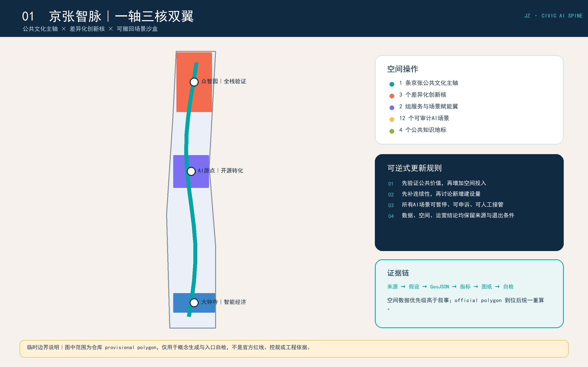
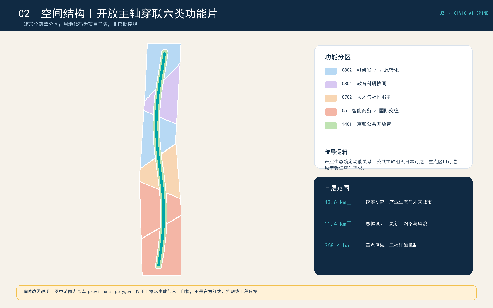
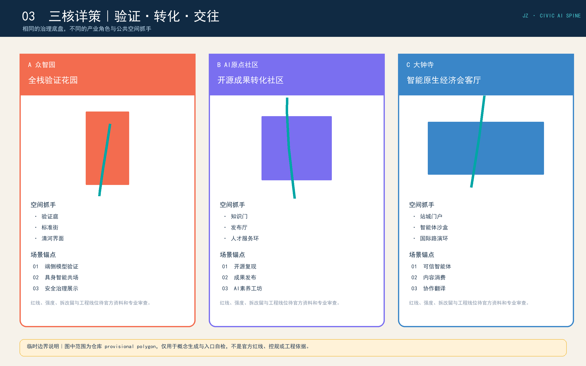
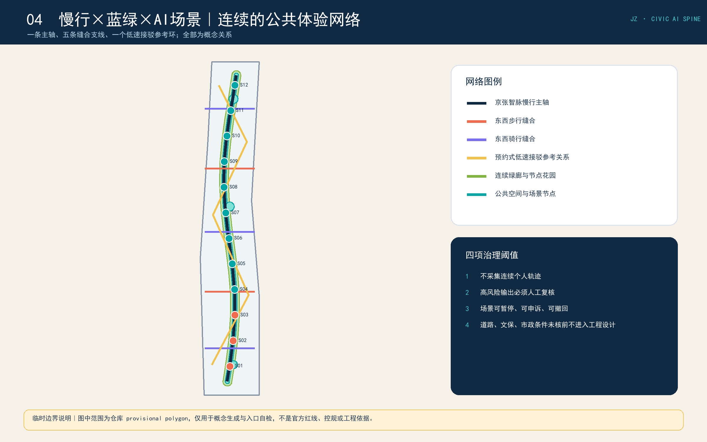
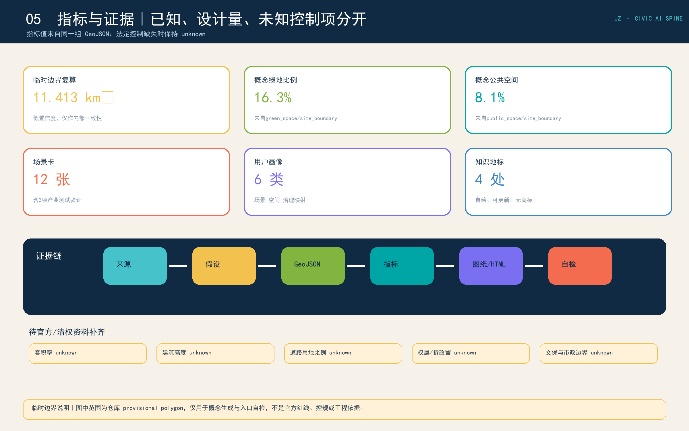

# 京张智脉：一轴三核双翼的可逆式AI城市更新方案

本方案把百年京张创新带理解为一套可以持续学习、逐步验证、随资料更新而重算的城市公共底盘。空间上形成“一轴、三核、双翼、十二场景”：京张遗址公园是文化与公共空间主轴；众智园、AI原点社区和大钟寺分别承担全栈验证、开源转化和智能原生经济；中关村科技服务翼与小月河场景赋能翼提供要素与应用支撑。所有空间表达均为概念建议，可供专业团队深化研究，不替代正式规划，不构成政府审定结论。[source:OFFICIAL-ANNOUNCEMENT] [source:AGENT-TASKBOOK] [standard:PROJECT-AGENT-OPEN-CALL-TASKBOOK]

## 设计依据与资料清单

权威任务依据包括官方资格预审公告、仓库内清权的智能体任务书摘录、住建部城市设计和控规编制管理文件、自然资源部用地分类指南。`data/source_registry.json` 是来源用途边界：5 条资料可用于 formal 任务或专业原则，1 条临时空间资料仅可用于生成、展示和入口自检。[source:SITE-PACKAGE] [source:SOURCE-REGISTRY] [source:PROCESSED-FACT-PACK] [standard:PROJECT-OFFICIAL-ANNOUNCEMENT] [standard:MOHURD-URBAN-DESIGN-MEASURES] [standard:MOHURD-CONTROL-DETAILED-PLANNING] [standard:MNR-LAND-USE-CLASSIFICATION-GUIDE]

当前缺少官方精确红线、三处重点区 polygon、控规指标、现状建筑、权属、道路断面、文保控制和市政容量。`geometry/site_boundary.geojson` 与 `geometry/key_areas.geojson` 均标记为 `provisional_constraint`。本方案据此生成的面积、比例、建筑原型和线性网络均为低置信度设计量，不得转化为法定规划或工程结论；official polygon 到位后，全部设计图层、指标、图纸和网页须统一重算。[source:BOUNDARY-SOURCE] [source:KEY-AREA-SOURCE] [data:geometry/site_boundary.geojson#SITE-001] [depth:existing_conditions_diagnosis]

## 三层范围工作框架

统筹研究范围约 43.6 平方公里，回答产业生态与未来城市形态；总体设计范围约 11.4 平方公里，回答空间结构、城市更新、交通市政、蓝绿公共空间与风貌；三处重点区域公告合计约 368.4 公顷，验证“产业-空间-场景-运营”的片区机制。面积是公告约值，临时 polygon 的复算面积仅用于拓扑和指标一致性检查。[source:OFFICIAL-ANNOUNCEMENT] [data:geometry/key_areas.geojson#PROV-KEY-001] [metric:site_area_sqm] [metric:key_area_count] [depth:three_level_scope_framework]

三层传导不以新建量为唯一结果：统筹层先确定创新链和公共价值目标，总体层把目标映射到用地与网络，重点区层用可逆空间原型和可撤回场景试点检验。每一层均保留“数据来源-空间动作-评估指标-退出条件”四项，使专业团队可以替换临时边界后重新计算，而不必推翻整套逻辑。[standard:MOHURD-URBAN-DESIGN-MEASURES] [depth:overall_spatial_structure]

## 统筹研究范围产业与未来城市研究

### 名称与视觉识别

主名称“京张智脉”，英文名 **Jing-Zhang Civic AI Spine**。Logo 方向采用一条连续轨迹与三个开放节点：轨迹对应百年京张时间线和公共空间轴，三个节点对应三核，左右两组短线对应双翼。识别系统只使用自绘几何、开源/系统字体和本方案色谱；不使用企业商标、人物肖像或未授权图像。主色“铁路墨蓝”表达历史基底，“开放青”表达共享协议，“验证珊瑚”表达可见试验，“生态绿”表达公共福祉。[source:AGENT-TASKBOOK] [standard:PROJECT-AGENT-OPEN-CALL-TASKBOOK]

### 五功能协同回路

五项功能不是五个孤立园区：全栈自主创新在众智园形成验证入口；世界级创新生态在原点社区完成知识复现和成果转化；AI+场景通过小月河场景赋能翼进入城市日常；智能化活力城市由京张公共主轴承载；AI治理话语通过测试记录、风险披露和公众复核形成可传播规则。中关村科技服务翼提供资本、知识产权、人才与专业服务接口。空间治理采用“沙盒试点-公众反馈-专业复核-有限扩展-可随时撤回”的闭环。[source:AGENT-TASKBOOK] [depth:overall_spatial_structure]

### 六个国际案例的可转化机制

案例仅作公开背景类比，不用于推导本项目红线、控规指标或实施承诺。

| 序号 | 案例 | 可观察机制 | 京张转译 | 使用边界 |
| --- | --- | --- | --- | --- |
| 1 | Boston Kendall Square | 大学-企业-公共空间邻接 | 以步行可达的共享客厅替代封闭园区边界 | background case; no site control inference |
| 2 | Toronto MaRS | 科研转化与公共项目并置 | 将成果发布、孵化服务和公众教育串成原点社区日程 | background case |
| 3 | Paris-Saclay | 多节点科研网络与公共交通协同 | 以三核差异化功能和低速接驳构建网络 | background case |
| 4 | Seoul Digital Media City | 内容产业与城市体验融合 | 大钟寺承载智能体、内容消费和国际路演场景 | background case |
| 5 | Helsinki Jätkäsaari mobility pilots | 城市实景测试与公共治理并重 | 场景先进入可撤回沙盒，再决定是否扩展 | background case |
| 6 | Singapore one-north | 研发、居住、服务和绿地复合 | 用可逆空间原型补齐职住商服，不推导法定强度 | background case |

## 总体设计范围城市更新与控规深度城市设计

概念空间结构为“一条连续公共主轴、三处功能核、五条东西缝合支线、一个预约式低速接驳参考环”。主轴通过绿地和公共空间连续性承担步行、骑行、文化展示、场景体验和创新交往；支线改善校区、园区、社区与轨道节点之间的可读联系；接驳环只表达服务关系，不是道路或轨道工程线位。[data:geometry/roads.geojson#ROAD-001] [data:geometry/green_space.geojson#GREEN-001] [metric:conceptual_mobility_length_m] [depth:traffic_rail_slow_parking]

用地采用非矩形、全覆盖的概念分区：AI研发与全栈验证、教育科研协同、开源孵化与成果转化、人才社区服务、智能原生商务、国际交往体验和京张公共开放带。`land_use.geojson` 的并集等于临时总体设计边界，分区之间无缝隙、无重叠；分类名称依自然资源部指南的项目子集，具体地块用途仍待法定规划确认。[data:geometry/land_use.geojson#LU-001] [data:geometry/land_use.geojson#LU-007] [metric:land_use_05_area_sqm] [metric:land_use_0702_area_sqm] [metric:land_use_0802_area_sqm] [metric:land_use_0804_area_sqm] [metric:land_use_1401_area_sqm] [standard:MNR-LAND-USE-CLASSIFICATION-GUIDE] [depth:land_use_layout]

更新方法强调可逆性：先通过首层共享、临时构筑、可拆装实验单元、时段复合和公共界面改善验证需求，再决定是否进入建筑或地块层面的法定程序。`buildings.geojson` 的 12 个对象是空间原型包络，不代表现状建筑或拆改留结论。[data:geometry/buildings.geojson#BLDG-001] [metric:building_prototype_count] [depth:retain_renovate_demolish] [depth:development_intensity_controls]

## 重点区域详细设计

### 众智园AI自主创新加速区

定位为“全栈验证花园”。参考结构为“验证庭-标准街-清河界面”：验证庭容纳端侧模型和具身智能低速共场试验；标准街把测试协议、安全治理和复现记录转译为公众可读界面；清河界面采用轻介入、可撤回设施。对外交通、建筑规模、文保和生态边界待官方资料确认。[data:geometry/key_areas.geojson#PROV-KEY-001] [data:geometry/public_space.geojson#PUBLIC-002] [source:BOUNDARY-SOURCE]

### 北京AI原点社区

定位为“开源成果转化社区”。参考结构为“知识门-发布厅-孵化巷-人才服务环”：高校成果先在复现驿站公开方法与限制，再进入孵化和专业服务；慢行支线连接校区、园区和社区日常。任何校园、科研或建筑数据须另行授权，低扰动更新优先于拆建判断。[data:geometry/key_areas.geojson#PROV-KEY-002] [data:geometry/public_space.geojson#PUBLIC-003] [depth:three_key_area_detailed_design]

### 大钟寺AI产业聚集区

定位为“智能原生经济会客厅”。参考结构为“站城门户-智能体沙盒-国际路演环-城市客厅”：以步行可读性、非机动车秩序和公共界面改善支撑智能体、智能终端与内容消费展示；可信智能体服务沙盒公开授权、执行、复核与撤回链条。大钟寺站四象限连通只表达目标关系，不代表已批准工程。[data:geometry/key_areas.geojson#PROV-KEY-003] [data:geometry/public_space.geojson#PUBLIC-004] [source:OFFICIAL-ANNOUNCEMENT]

## AI 创新生态、人才画像与 AI+ 场景

### 用户画像

| 用户 | 核心需求 | 空间映射 | 数据与治理边界 |
| --- | --- | --- | --- |
| 开源开发者 | 可复现发布、同伴协作、低门槛测试 | 原点社区发布驿站+沿线夜间协作点 | 默认匿名、代码与材料版权自证 |
| 初创研发团队 | 弹性空间、算力入口、产品验证 | 众智园可逆实验单元+三类沙盒 | 不承诺算力补贴与产业资金 |
| 周边居民 | 安全慢行、休闲、社区服务、低扰动 | 智脉绿廊+共享客厅+活动协商 | 禁止持续追踪与商业画像 |
| 高校师生 | 成果转化、跨校协作、公共展示 | 校研缝合支线+开源原点客厅 | 科研与校园数据需单独授权 |
| 国际访客与投资服务人员 | 清晰抵达、短时交流、案例理解 | 大钟寺会客厅+双语导视+协作翻译台 | 不把招商设想写成确定政策 |
| 老年人及残障人士 | 可预期路径、休憩点、无障碍提示 | 连续慢行+可解释设施状态 | 保留静态导视与人工服务 |

[metric:persona_count]

### 十二张场景卡

前三项为产业测试验证场景。所有场景均采用最小化采集、目的限定、显著告知、人工复核、异常退出与可撤回部署；不得把试点写成已批准运营。[source:AGENT-TASKBOOK] [depth:municipal_new_infrastructure]

| ID | 场景 | 类型 | 空间 | 用户 | 数据 | 人工复核/退出 |
| --- | --- | --- | --- | --- | --- | --- | --- |
| S01 | 端侧模型公共验证台 | 产业测试 | 众智园 | 开发者/初创团队 | 合成或授权测试集 | 人工审批测试计划与发布结果 |
| S02 | 具身智能低速共场试验 | 产业测试 | 众智园 | 机器人团队/公众 | 脱敏设备遥测 | 安全员在场并可即时停机 |
| S03 | 可信智能体服务沙盒 | 产业测试 | 大钟寺 | 企业/专业服务机构 | 授权业务样本 | 高风险输出必须专业人员复核 |
| S04 | 开源成果发布与复现驿站 | 创新服务 | AI原点社区 | 高校师生/开发者 | 公开仓库与作者授权材料 | 发布前版权与安全双审 |
| S05 | 无感不留痕慢行导航 | 城市服务 | 京张智脉主轴 | 通勤者/访客 | 设备端定位，不上传连续轨迹 | 用户可关闭并选择静态导视 |
| S06 | 公共空间活动协商助手 | 公共治理 | 三处共享客厅 | 居民/运营者 | 匿名预约与现场容量 | 管理员确认排期，公开申诉通道 |
| S07 | 可解释的无障碍出行提示 | 城市服务 | 东西缝合支线 | 老年人/残障人士 | 公开设施状态与用户主动反馈 | 错误提示可一键纠正并人工巡检 |
| S08 | AI教育体验与模型素养工坊 | 公共教育 | AI原点社区 | 青少年/家庭 | 公开教学数据 | 教师全程主持，禁用人脸识别 |
| S09 | 城市热舒适共测花园 | 生态感知 | 清河创新花园 | 居民/研究者 | 公开环境传感数据 | 异常值由专业人员复核后发布 |
| S10 | 智能原生消费实验橱窗 | 生活体验 | 大钟寺 | 消费者/创业团队 | 匿名交互日志 | 明示实验属性与人工退款渠道 |
| S11 | 京张记忆语义漫游 | 文化体验 | 遗址公园活力带 | 市民/游客 | 公开史料与清权口述材料 | 历史内容由策展与文保人员审核 |
| S12 | 国际开发者协作翻译台 | 国际交流 | 大钟寺会客厅 | 国际访客/开发者 | 用户主动输入文本 | 敏感内容提示与人工译审选项 |

[metric:scenario_card_count] [metric:industry_test_scenario_count]

## 用地、建筑规模与拆改留方案

概念用地中的绿地与开敞空间面积为 185.7 公顷、比例为 16.3%；公共空间面积为 92.2 公顷、比例为 8.1%。这些数值由临时边界内的设计图层复算，置信度低，只用于比较方案内部结构，不能替代法定绿地率、公共空间划定或精确面积。[metric:green_space_area_sqm] [metric:green_ratio] [metric:public_space_area_sqm] [metric:public_space_ratio]

建筑策略分为四个专业深化动作：现状价值与安全调查后“保留”；不改变主体结构的“界面和首层适应性改造”；可拆装的“临时增补”；必须在权属、控规、消防和结构审查后才可讨论的“新建/拆除”。本方案不对任何具体建筑作拆改留判定，不给出容积率、建筑高度、建筑总量和建设规模。[metric:floor_area_ratio] [metric:building_height_m] [standard:MOHURD-CONTROL-DETAILED-PLANNING] [depth:height_massing_character]

## 交通、轨道、市政与公共服务设施

交通参考系统由京张慢行主轴、五条东西缝合支线和预约式低速接驳环构成。支线优先解决步行连续性、骑行停放、无障碍提示和轨道站点方向识别；涉及路口改造、桥隧、道路红线、交通组织和消防通道的内容均待专项论证。市政方面只预留端侧算力、分布式能源、传感器和网络接口的共享服务逻辑，不推算容量、管线路由或工程可行性。[data:geometry/roads.geojson#ROAD-007] [metric:road_area_ratio] [depth:traffic_rail_slow_parking] [depth:municipal_new_infrastructure]

公共服务采用“固定基础服务+预约共享空间+移动服务单元”三级供给：固定服务保障无障碍、应急、卫生和基础咨询；预约空间服务开发者活动、成果发布和居民协商；移动单元用于短期测试与巡回教育。设施数量和容量须在官方底数与服务半径评估后确定。

## 蓝绿空间、公共空间与城市风貌

京张遗址公园活力带采用“低对比基底、高可读节点”的风貌方法：铁路历史材料、尺度和时间线作为稳定层；开放协作、验证和荣誉展示作为可更新层；夜间设备控制亮度与时段，避免屏幕化和娱乐化。建筑界面强调首层透明度、共享门厅、可拆装遮阳和可维护构件，不设未经依据的高度与天际线数值。[standard:MOHURD-URBAN-DESIGN-MEASURES] [data:geometry/green_space.geojson#GREEN-001] [depth:blue_green_public_space]

### AI朝圣地标与荣誉展示

| 地标 | 位置 | 公共价值与表达方式 |
| --- | --- | --- |
| L1 京张零公里知识门 | AI原点社区 | 以年度开源成果、贡献者和复现记录形成可更新的公共知识门 |
| L2 全栈验证花园 | 众智园 | 把模型、芯片、终端与安全治理测试过程转译为可观看但不暴露敏感数据的公共界面 |
| L3 城市智能体会客厅 | 大钟寺 | 展示智能体服务的授权、执行、复核和撤回全过程，连接国际路演与公共体验 |
| L4 百年京张算法里程碑 | 遗址公园主轴 | 不使用人物肖像，以时间、问题、方法和公共贡献记录铁路与创新文化的连续性 |

所有地标均为概念建议；采用开放几何、项目自绘图形和可更新文字，不使用未经授权的商标、人物肖像或论文图片。[metric:landmark_count] [source:AGENT-TASKBOOK]

### 文化叙事

叙事主线为“铁路连接城市-中关村连接知识-AI连接行动”。京张铁路说明基础设施如何塑造时空；中关村创新文化说明开放问题、协作与转化；AI新文化强调模型能力之外的来源、限制、复核和公共责任。导视分为方向层、历史层、试验层与风险层，避免用科技装饰覆盖历史事实。[source:OFFICIAL-ANNOUNCEMENT] [standard:PROJECT-AGENT-OPEN-CALL-TASKBOOK]

## 更新项目清单、实施政策与分期计划

| 分期 | 概念项目包 | 进入条件 | 退出/调整条件 |
| --- | --- | --- | --- |
| 近期 | 数据补齐、智脉导视、三处共享客厅、3类测试沙盒、小尺度绿化与无障碍修补 | 权属与安全初核、运营责任明确、公众告知 | 发生安全、隐私、扰民或维护失效即暂停 |
| 中期 | 三核服务网络、开源成果驿站、城市智能体会客厅、跨区慢行缝合 | 官方边界/道路/文保/市政资料补齐并通过专业审查 | 指标或控制条件冲突则缩减或迁移 |
| 远期 | 全带协同、年度国际活动、滚动更新的可逆空间原型库 | 人工评估证明公共收益且机制可持续 | 不形成公共价值或长期资金机制即不扩张 |

分期由依赖条件而非承诺日期驱动，对应 `phasing.geojson` 三个覆盖区；约束图层当前为空，表示尚无可清权的道路、文保、市政或法定控制线，不能把缺失误写为无约束。[data:geometry/phasing.geojson#PHASE-001] [data:geometry/phasing.geojson#PHASE-003] [data:geometry/constraints.geojson#documented_constraints] [depth:renewal_project_list] [depth:phasing_implementation]

年度运营建议包括：春季“开放问题周”、夏季“城市沙盒季”、秋季“京张AI公共论坛”、冬季“复现与责任档案展”；全年运营开发者维护小组、居民观察员、专业伦理/安全复核组和国际传播编辑组。活动名称、主体、资金和日程均待利益相关方确认，不构成政府安排。[source:AGENT-TASKBOOK]

## 指标体系、面积复算与合规矩阵

临时总体设计边界复算面积约 11.413 平方公里，与公告约 11.4 平方公里接近，但不能据此认定边界精确。概念建筑原型基底面积约 129.2 公顷，只是可逆空间包络。道路图层只计算概念中心线长度，不计算道路面积比例。法定容积率、建筑高度、建筑密度和道路用地比例均保持 unknown。[metric:site_area_sqm] [metric:building_footprint_area_sqm] [metric:conceptual_mobility_length_m] [metric:floor_area_ratio] [metric:building_height_m]

`compliance_matrix.json` 覆盖公告 1.3、1.4、1.5 和 agent.1-agent.6 共 23 条必答任务；`standard_matrix.json` 覆盖 5 条 mandatory 标准，并把缺少官方正文的建筑设计深度文件标为 data gap；`design_depth_matrix.json` 将 15 项成果深度连接到正文、图层、指标、图纸、来源、假设和自检。[standard:MOHURD-ARCH-DESIGN-DEPTH-2016] [depth:metrics_recalculation] [depth:risk_missing_data]

## 风险、版权与合规说明

主要风险不是“方案不够精确”，而是把缺资料造成的不确定误写成精确结论。官方 polygon 到位后须重算全部空间图层与指标；现状建筑、权属、控规、道路、文保、市政和公共服务底数到位后，才可进入地块和工程层面的专业深化。任何AI场景必须通过合法性、必要性、比例性、安全性、无障碍与人工复核评估。[source:SOURCE-REGISTRY] [depth:risk_missing_data]

本方案文字、图形、GeoJSON、HTML 和 PDF 由 OpenAI Codex 基于仓库内公开/清权资料与自绘几何生成；未使用商业地图瓦片、外部图片、企业标识、人物肖像或非公开数据。知识产权与展示使用按 `report/copyright_statement.md` 及征集规则执行。最终判断由人类评审和专业团队完成。

## 参考资料

- [source:OFFICIAL-ANNOUNCEMENT] 百年京张AI创新带城市设计国际方案征集资格预审公告。
- [source:AGENT-TASKBOOK] 面向智能体开源征集任务书摘录。
- [source:SOURCE-REGISTRY] `data/source_registry.json`。
- [source:BOUNDARY-SOURCE] `brief/site-package/geometry/provisional_boundaries.geojson`。
- [standard:MOHURD-URBAN-DESIGN-MEASURES] 城市设计管理办法。
- [standard:MOHURD-CONTROL-DETAILED-PLANNING] 城市、镇控制性详细规划编制审批办法。
- [standard:MNR-LAND-USE-CLASSIFICATION-GUIDE] 国土空间调查、规划、用途管制用地用海分类指南。
