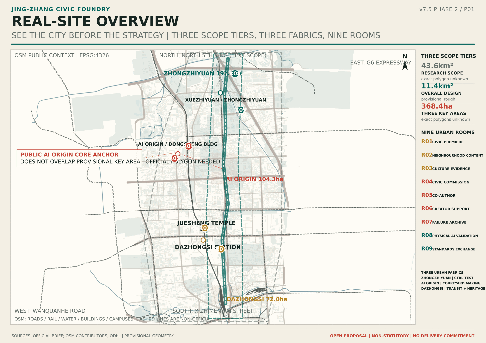
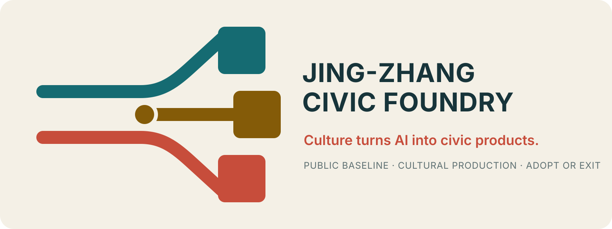
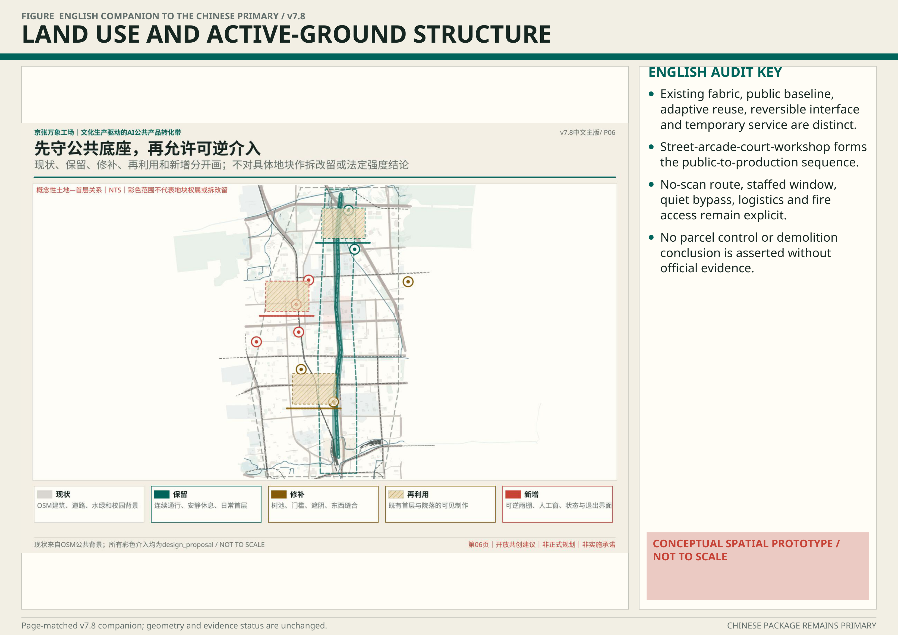
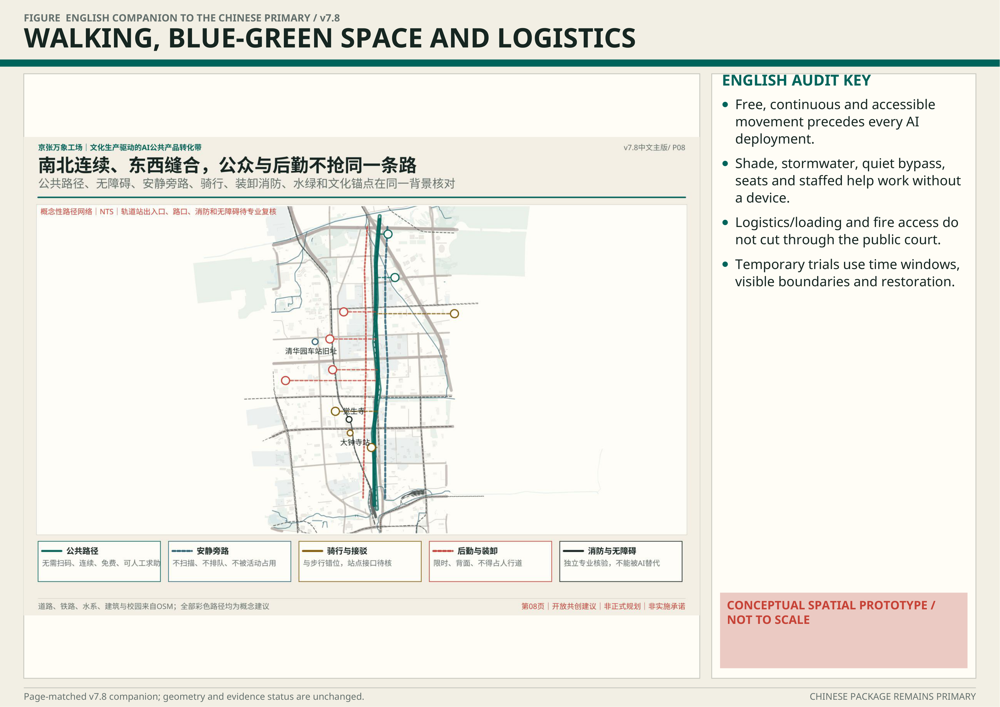
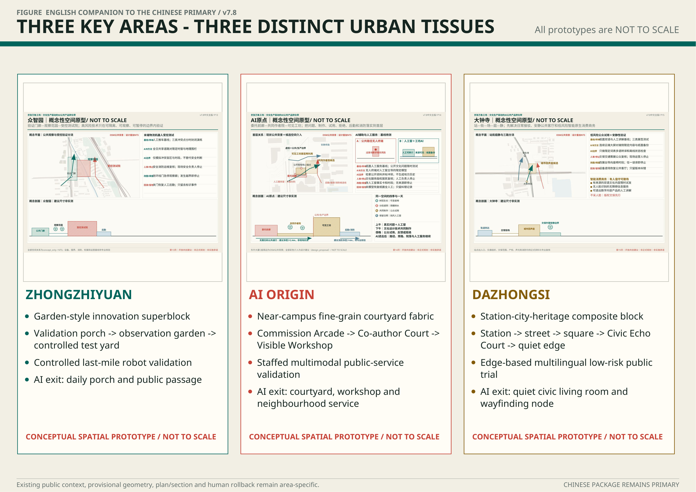
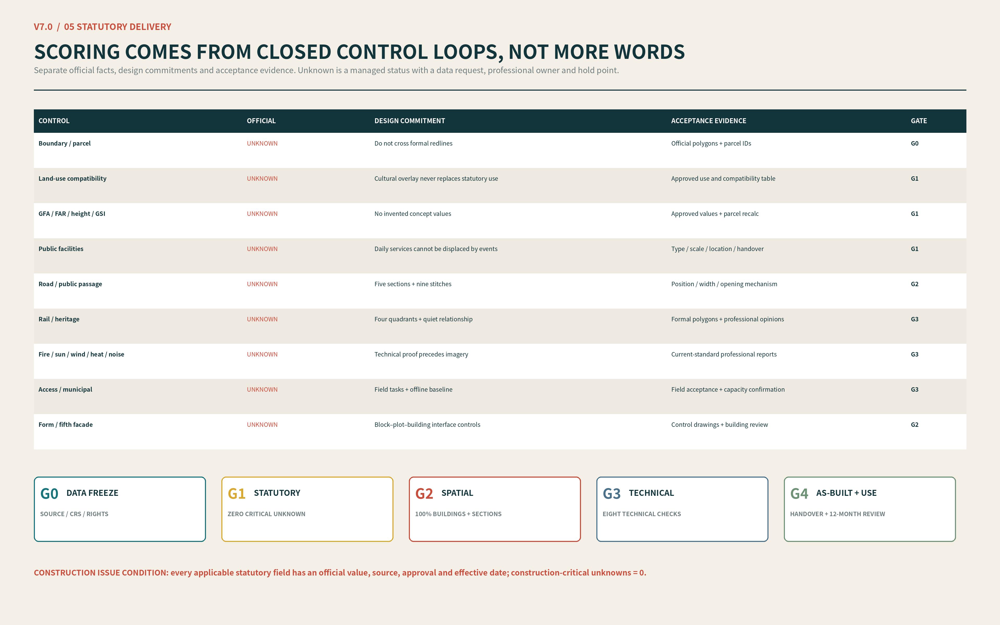

# JING-ZHANG CIVIC FOUNDRY

## A CULTURAL-PRODUCTION BELT FOR CIVIC AI PRODUCTS

### CULTURE TURNS AI INTO CIVIC PRODUCTS

## Why does a park that already works still need urban design?

The premise must be corrected first. The Jing-Zhang Railway Heritage Park is not empty land awaiting an AI concept. Public project records and phase reports show continuing section-by-section implementation and describe the whole programme as an approximately nine-kilometre green corridor serving around seventy communities and 450,000 residents. That establishes its public value, but it does not prove that every metre is already complete. Everyday use, built sections, missing links, station interfaces and transverse crossings therefore form the design baseline. [source:JZ-PARK-PHASE2-IMPLEMENTATION] [source:JZ-PARK-PHASE2-2026] [depth:existing_conditions_diagnosis]

> **Culture turns AI into civic products: one real commission, one public prototype, one year to adopt or exit.**

Jing-Zhang Civic Foundry makes the city a co-author of AI. Residents and frontline institutions issue real commissions; cultural practitioners establish context, authenticity and rights; researchers, creators and service workers co-produce; professional teams validate by exposure and risk; the public encounters low-risk prototypes at eye level and can refuse, correct or bypass them; operators then use twelve months of evidence to adopt, modify, reduce or exit. [source:AUTHOR-CULTURE-METHOD] [metric:civic_product_type_count]

Culture is not post-production packaging. It is the conversion infrastructure that connects technology with local knowledge, creators, distribution, public understanding, market validation and public reinvestment. The outcome is not an "AI landmark" but three maintainable civic products: **reusable cultural content packs, reversible public-experience modules and sustainable urban services**. The non-negotiable baseline remains a free, continuous, shaded and accessible park. [depth:overall_spatial_structure] [metric:public_safeguard_count]



The v7.5 overview uses one EPSG:4326 working coordinate system to place public OSM roads, rail, water, buildings, and campuses behind three distinct scope tiers: the approximately 43.6-square-kilometre research scope, approximately 11.4-square-kilometre overall-design scope, and three key areas totalling approximately 368.4 hectares. Xuezhiyuan/Zhongzhiyuan, Dongsheng Building, Dazhongsi Station, and Juesheng Temple remain public background anchors. Every scope line is provisional working geometry or a text extent, **not an official redline, ownership boundary, RDP polygon, or approval**. The non-overlap between the public AI Origin core anchor and provisional key-area geometry is shown rather than hidden, pending official calibration. [source:OSM-CONTEXT-20260817] [source:SITE-ANCHOR-LEDGER-V7]

### From railway capacity to civic conversion capacity

Historical fact and contemporary translation are kept separate. The railway once built public capacity by moving people and goods. This proposal does not manufacture a historical metaphor; it translates one enduring question—how public capability is constructed and kept in use—into a contemporary urban task: **turn infrastructure for transport into infrastructure that converts knowledge, technology and creativity into public life.** [source:JZ-HISTORY-BEIJING-CULTURE]

### From classic methods to mandatory drawings

The books are not decorative citations. Kropf and Panerai's street–block–plot–building relations produce existing/proposed tissue matrices for all three key areas. [source:MORPHOLOGY-KROPF] [source:MORPHOLOGY-PANERAI]

Spacematrix produces parcel-level FAR–GSI–OSR–layers sheets only after statutory inputs arrive. [source:MORPHOLOGY-SPACEMATRIX] Allan B. Jacobs produces five paired existing/proposed street sections, while Cullen produces one five-minute serial-vision sequence for each key area. [source:MORPHOLOGY-GREAT-STREETS] [source:MORPHOLOGY-CULLEN]

Their mandatory outputs, fields and acceptance conditions are consolidated in one structured framework. [data:visual/assets/morphology-section-node-framework.json]

| Method essence | Mandatory project output | Review question |
| --- | --- | --- |
| Street–block–plot–building tissue | Existing/proposed matrices for the Zhongzhiyuan superblock, AI Origin fine-grain courtyards and Dazhongsi station–city–heritage blocks | What is retained, repaired, opened or replaced—and why? |
| Density–form relationship | Statutory land use, GFA, FAR, GSI, OSR and layers for every formal parcel | Is each value authoritative and why does this form fit it? |
| Measured streets | Five sections showing walking, cycling, traffic, shade, frontage, loading, fire access and universal access | Where do widths come from and how are conflicts resolved? |
| Serial vision and thresholds | “Station–ground–test–garden–exit”; “street–arcade–court–workshop–campus”; “station–street–square–hall–quiet” | What does a person see in five minutes, and how can they refuse or exit? |

The prior five checks—daily life, legibility, ecology, human sequence and incremental reversibility—remain a checklist on every drawing; they no longer substitute for block and building design. [metric:spatial_decision_layer_count] [data:visual/assets/spatial-decision-framework.json]

### One Line, Three Grounds, Nine Rooms—activity and quiet in rhythm

| Spatial layer | Design content | How people perceive it | Planning role |
| --- | --- | --- | --- |
| One Line | The existing nine-kilometre park plus a civic-product conversion path | Always walkable, pauseable and legible; never cut off by events | The real path skeleton—not a newly invented axis |
| Three Grounds | Safe Validation Ground at Zhongzhiyuan; Co-Production Ground at AI Origin; Civic Premiere Ground at Dazhongsi | Three distinct atmospheres, thresholds and levels of public exposure | Three legible districts and urban nodes |
| Nine Rooms | Nine east-west interfaces composed as street–porch–court–workshop | A visible ground floor entered on foot from campuses, parks, neighbourhoods and stations | Turns the railway edge into transverse encounter nodes |
| Quiet–Active Rhythm | Continuous shade, quiet bypasses and ecological buffers between active production nodes | The park remains complete without using AI or consuming anything | Ecological process and daily life precede technology deployment |

One operating contract is deliberately memorable to both government and the public: **one real civic commission, one visible public prototype, one year of adopt-or-exit evidence.** Commissions are distributed along the corridor; co-production concentrates at AI Origin; higher-risk prototypes move to controlled validation at Zhongzhiyuan; mature low-risk products premiere at Dazhongsi; twelve months of use determine adoption, modification or exit. Spatial order and working order are not drawn as a false assembly line. [metric:workflow_stage_count] [metric:flagship_area_count]

### Direct Taskbook Response: three positionings, five functions, and Three Zones–Two Wings form one loop

One cultural-production chain joins the three positionings. The **Centennial Jing-Zhang Cultural Belt** supplies verifiable history and local context; the **Metropolitan AI-Life Experience Belt** places prototypes in ordinary settings where people can refuse and obtain staffed service; the **AI-Integrated Innovation Belt** closes the loop from research and creation to validation, adoption, and exit. [metric:positioning_count]

| Five required functions | Civic Foundry product | Core space and acceptance evidence |
| --- | --- | --- |
| Full-stack AI autonomous innovation | Tiered validation package for models, edge systems, robots, and spatial interfaces | Zhongzhiyuan L1 Safe Validation Yard; red-team, human takeover, stop, and failure archive |
| World-class AI innovation ecosystem | Network of civic briefs, co-authors, cultural rights, professional services, and adoption | AI Origin L2 Co-Author Foundry; accountability chain and twelve-month reuse |
| New AI-enabled scenario paradigm | Twelve scene contracts with a commissioner, non-AI baseline, and exit | Xiaoyue River Scenario Wing and Nine Rooms; scene–space–operation binding |
| Intelligent and vibrant AI city | Everyday, accessible public service with non-digital backup | S1 Permanent Public Baseline; access, rest, and help work without participation |
| Global voice in AI governance | Transferable Spatial Access Code and Jing-Zhang Accountability Chain | Status desks and Standards Exchange Room; public risk, responsibility, version, and exit evidence |

**Three Zones and Two Wings** operate as a demand-and-supply circuit, not five isolated parks. Zhongzhiyuan handles hard technology and higher-risk validation; AI Origin converts real briefs through co-production; Dazhongsi handles low-risk civic premiere and market adoption. The Zhongguancun Technology-Service Wing supplies talent, IP, capital, compute, and professional services; the Xiaoyue River Scenario Wing supplies neighbourhood, ecology, care, mobility, and public-service problems. Adoption evidence and open tools flow back to both wings to set the next R&D and commission cycle. [metric:core_function_count] [metric:spatial_zone_count] [metric:spatial_wing_count]

### Brand and Wayfinding: the switch makes choice visible rather than sending everyone into one future



The logo turns two parallel railway lines through an open switch into three composable blocks. Teal is the non-tradable public baseline, vermilion is cultural production, and the gold node is civic value that exists only after public use. The mark also recalls the structural frame of the Chinese character *gong* (work/foundry) and an open Urban Room, without borrowing any company, railway authority, or historic trademark. Wayfinding uses room codes JZ-R01–R09, a teal public line, vermilion co-production points, gold adoption nodes, and grey quiet areas. Cultural content separately carries FACT–INTERPRETATION–AI-GENERATED source labels and is never confused with the belt logo. [metric:brand_system_count] [data:visual/assets/brand-system.json]

The international line is **“Culture turns AI into civic products.”** Every status sign answers four questions: what is this, may I participate now, who is accountable, and how do I refuse or exit? The brand is first a public promise and only then a communications asset.

## Executive Decision Brief: Jing-Zhang Should Compete for Conversion Capacity

From a city-leadership perspective, Jing-Zhang is distinctive because research and enterprise supply, near-campus innovation, neighbourhood life, transit commerce, and a century-old public-infrastructure heritage can connect **technical results, civic products, public use, and durable value** in one accountability chain. The proposal therefore frames the belt as **a prototype AI-to-civic-value conversion infrastructure for national learning**. This is a design proposition, not a national designation or settled policy. [metric:adoption_core_count]

| Strategic decision | Recommended answer | Public value | Explicit non-commitment |
| --- | --- | --- | --- |
| How is this different from another AI park? | Move from technology concentration to AI-to-civic-value conversion infrastructure | A transferable method for commissioning, testing, premiering, operating, procuring, and exiting | No national title, new agency, or policy authority is claimed |
| What should the city fund first? | Public-space, accessibility, staffed service, cultural evidence, and independent evaluation baselines | Public assets remain useful when a technology or supplier exits | No invented capital total, annual budget, or building capacity |
| How may AI use urban space? | L1 controlled validation, L2 co-creation, and L3 low-risk public premiere; all time-limited and reversible | Risk is matched to public exposure | No substitute for statutory planning, permits, safety, or procurement |
| How are stranded pilots prevented? | Every project identifies capex, annual opex, an accountable owner, and an exit reserve | Construction, maintenance, and restoration responsibilities are visible from the start | No guaranteed procurement, investment return, or partner |
| Why is cultural industry core rather than decorative? | Civic commissioning, authenticity, authorship, distribution, place operation, reuse, and reinvestment organise conversion | AI becomes contextual, attributable, market-aware, and publicly valuable | Festival footfall, sponsorship exposure, and media heat are not conversion evidence |

Four concept decisions are proposed for professional consideration: confirm AI-to-civic-value conversion as the strategic line; separate the public baseline from the commercial value-added layer; subject the Jing-Zhang Conversion Accountability Chain 1.0 to professional review; and start with three reversible civic commissions in a first-100-day test window. Site allocation, institutions, budgets, procurement, and implementation remain subject to formal decisions by competent authorities. [assumption:A-DELIVERY-001]

### Seven-Dimension Evidence Index

| Review dimension | Direct evidence in v7.0 |
| --- | --- |
| Brief alignment | Three scope levels, three positionings, five functions, Three Areas and Two Wings, six Agent tasks, and differentiated key-area design |
| Originality | Civic Commission System, Jing-Zhang Conversion Accountability Chain, Three Conversions, Five-Ledger Review, spatial access code, and public reinvestment |
| AI and planning innovation | AI service rights are bound to exposure, time, cultural rights, human accountability, non-AI baselines, and exit states |
| Implementation feasibility | Five first-100-day actions, six delivery packages, responsible functions, delivery routes, funding categories, opex, and exit reserves |
| Public interest and inclusion | Field-tested accessibility, staffed and non-digital channels, quiet no-scan bypass, free basics, and co-review with priority groups |
| Risk and compliance | Provisional geometry, unknown controls, copyright and cultural facts, privacy, fiscal firewall, complaint handling, and rollback |
| Expression completeness | Bilingual narratives, five figures, A3/A0, offline HTML, nine GeoJSON classes, metrics, matrices, self-checks, and machine-readable protocols |

The complete evidence index is `visual/assets/review-evidence-index.json`; it organises evidence and does not predetermine a review decision. [data:visual/assets/review-evidence-index.json]

## Design Basis and Source Inventory

The formal basis comprises announcements by relevant Beijing authorities, the Agent Taskbook, and the repository site package. Facts about Jing-Zhang history and the railway heritage park rely only on public information issued by Beijing cultural-heritage and landscape authorities. Eight global cases are used only to extract mechanisms; their density, governance, finance, market, and ownership conditions are not projected onto Beijing. [source:OFFICIAL-ANNOUNCEMENT] [source:AGENT-TASKBOOK] [source:SITE-PACKAGE]

Public information released by the Beijing Municipal Government in July 2026 describes an approximately nine-kilometre green-corridor programme connecting around seventy communities and serving about 450,000 residents; procurement records establish specific implementation sections between Zhichun Road and Xizhimen. The design therefore treats programme-level public value as established and verifies physical continuity section by section. [source:JZ-PARK-PHASE2-2026] [source:JZ-PARK-PHASE2-IMPLEMENTATION]

Haidian's 2026 cultural-development policy supports AI, VR, and digital twins in cultural creation, cultural-tourism settings, and cultural products, alongside competition-result incubation, scene opening, and investment matching. Its technology-transfer policy further emphasises real business needs, scene lists, and full-cycle validation. Beijing's AI-plus-audiovisual policy frames a closed loop from technology research to result conversion and scene application. These policies establish directional relevance for linking technology, culture, scenes, and conversion; they do not authorise, fund, procure, or endorse this proposal. [source:HAIDIAN-CULTURE-TECH-2026] [source:HAIDIAN-TECH-TRANSFER-2026] [source:BEIJING-AI-AUDIOVISUAL-2025]

The processed fact pack is used only for source navigation, field checks, and reproducible calculations. No summary in it substitutes for a primary source, site survey, or confirmation by the competent authority. [source:PROCESSED-FACT-PACK]

The announcement defines three scales: a Coordinated Research Area of about 43.6 square kilometres, an Overall Design Area of about 11.4 square kilometres, and three Key-Area Detailed Design Areas totalling about 368.4 hectares. The repository does not yet contain precise official polygons for the Overall Design Area or the three key areas. Therefore `geometry/site_boundary.geojson` and `geometry/key_areas.geojson` retain `official_boundary=false` and `geometry_role=provisional_constraint`. These provisional geometries support content review, spatial computation, and layer validation only. They are not official planning boundaries for roads, parcels, ownership, heritage protection, approvals, or engineering. [source:BOUNDARY-SOURCE] [data:geometry/site_boundary.geojson#SITE-001] [data:geometry/key_areas.geojson#PROV-KEY-001]

The three key-area geometries no longer inherit an unexamined straight strip. Their announced names and approximate areas are aligned with four public background anchors: Xuezhiyuan/Zhongzhiyuan, Origin Building, Dazhongsi Station and Juesheng Temple. [source:KEY-AREA-SOURCE] [source:SITE-ANCHOR-LEDGER-V7]

This corrects location logic but does not make the geometry official. [metric:verified_site_anchor_count] [data:geometry/constraints.geojson#ANCHOR-ORIGIN]

### Site-anchor audit: keep three kinds of "area" separate

| Object | Public background that can be confirmed | Use in this proposal | Prohibited interpretation |
| --- | --- | --- | --- |
| Zhongzhiyuan / Xuezhiyuan | Station, Qinghe heritage park, Xiaoyue River and innovation premises frame a garden district | Anchor the provisional 192.1 ha area and a station–forecourt–test–garden/water sequence | A single project's GFA is not the key-area scale [source:ANCHOR-ZHONGZHIYUAN-CBEX-2026] |
| AI Origin | Public sources distinguish an existing 160,000 m2 core and an approximately 3 km2 influence range | Origin Building anchors the provisional 104.3 ha competition area; all three scales are labelled separately | 16 ha, 3 km2 and 104.3 ha are never interchangeable [source:ANCHOR-AI-ORIGIN-OFFICIAL-2025] [source:ANCHOR-AI-ORIGIN-OFFICIAL-2026] |
| Dazhongsi | Station, Bluejing and Fangheng/Zhongkun interfaces frame a station-city condition | Four-quadrant walking, cycle parking and a continuous public ground floor become the first task | The 3.95 ha Bluejing project is not the 72 ha key area [source:ANCHOR-DAZHONGSI-BLUEJING-2026] |
| Juesheng Temple | A major heritage background anchor | Trigger a quiet relationship and an authoritative-data hold point | No invented protection boundary, construction-control zone or view corridor [source:ANCHOR-JUESHENG-TEMPLE] |

The WGS84 background points answer only whether the proposal is in the right district. They do not answer where legal boundaries lie, what may be built, how wide roads are, or what heritage setback applies. [data:visual/assets/site-anchor-ledger.json]

Exchange layers use EPSG:4326; areas and lengths are recalculated in EPSG:4548. When official polygons are released, replacement of the basemap alone is insufficient. Land use, buildings, roads, green space, public space, phasing, drawings, web pages, and metrics must all be recalculated together. [metric:site_area_sqm] [depth:metrics_recalculation] [standard:MOHURD-CONTROL-DETAILED-PLANNING]

Development-intensity controls such as Floor Area Ratio, Building Height, road boundaries, and protection zones, as well as existing-condition diagnosis of buildings, ownership, structure, municipal capacity, and actual footfall, remain unknown. Conceptual precision is never presented as statutory precision. [depth:development_intensity_controls] [depth:existing_conditions_diagnosis]

## Competitive Positioning and Overall Proposition

Structured reading of the public peer catalogue at the time of review is used only to identify differentiation. It is not a planning source, and no peer expression is copied. Public proposals repeatedly address axis-or-belt structures with multiple nodes, data and digital twins, testing and validation, civic co-governance, history and tourism, and ecological resilience. These are important directions, but this proposal does not compete by adding more functions. It occupies a different gap: **who is responsible for moving AI from technical feasibility to cultural meaning, voluntary public adoption, sustainable operation, and reinvestable public value?** [source:PEER-CATALOG-CURRENT]

| Common peer archetype | Existing strength | Direct competition avoided | Civic Foundry contribution |
| --- | --- | --- | --- |
| Technology park, computing, and city model | Enterprise concentration, infrastructure, simulation, audit | Does not compete on platform or model count | Real civic briefs determine why technology exists |
| Safety validation and governance protocol | Risk grading, explainability, exit | Does not duplicate a stand-alone test field | Connects validation to cultural meaning, civic premiere, and twelve-month adoption |
| Heritage, tourism, and memory narrative | Local identity, display, visitor flow | Does not reduce culture to exhibition content | Makes authenticity, creator rights, and content production part of the workflow |
| Vertical industry and ecosystem loop | Concrete and operable single-system chain | Does not compete for depth in one vertical | Cultural production becomes an adoption interface across urban systems |
| Civic Foundry | How technology becomes civic products, real use, and durable value | Does not rely on one landmark or one opening event | One Line, Three Grounds and Nine Rooms host commission–prototype–one-year adopt/exit evidence |

Three strategic judgements guide the proposal. First, the next phase of global AI-city competition concerns **conversion efficiency from technology to society**, not model count. Second, culture is civic-value conversion infrastructure rather than decorative content: it determines whether technology is understandable, narratives are authentic, creators are recognised, experiences become use, and use supports long-term operation. Third, urban design is not only spatial form; it must synchronise **four clocks that cannot be collapsed into one**. [metric:four_clock_count]

### Three Conversions: turn policy language into an executable civic chain

| Conversion | From and to | Irreplaceable cultural-industry role | Publicly auditable result |
| --- | --- | --- | --- |
| Technical conversion | Models, prototypes, research results -> deployable civic products | Organise abstract capability into content packs, experience modules, and service scripts; complete authorship, licences, and user context | A defined setting, accountable actor, non-AI baseline, test boundary, and exit condition |
| Social conversion | Civic products -> real use, public understanding, and trust | Generate use through civic commissions, interpretation, co-creation, and channels while making errors correctable | Daily tasks, human fallback, accessibility, complaint repair, and twelve-month use evidence |
| Value conversion | Real use -> durable operation, creator income, and public reinvestment | Organise brand, distribution, services, licensing, and place operation while keeping public rights outside the market | Auditable capex, annual opex, exit reserve, creator pay, and public reinvestment |

The Three Conversions are not parallel slogans. They form one chain that cannot be skipped: a technical release is not public value without social conversion, and a pilot cannot lock in permanent construction without maintenance and exit responsibility. [metric:conversion_layer_count]

| Clock | Time scale | Civic responsibility | Spatial layer | Failure risk |
| --- | --- | --- | --- | --- |
| Centennial heritage clock | Decades to a century | Authenticity, integrity, minimum intervention | Retained structures, heritage interfaces, quiet buffers | Fast technology erases history; narrative hallucination |
| Daily-life clock | Every day | Access, care, rest, accessibility, human service | Continuous civic floor, neighbourhood ground floors, climate gardens | Events and commerce displace ordinary life |
| Quarterly creation clock | Weeks to months | Briefs, residencies, making, premieres, review | Reversible workshops, shared courtyards, service interfaces | One-off festivals and wasted content |
| Rapid-iteration clock | Hours to weeks | Testing and rollback of models, robots, and edge systems | Controlled yards, digital layer, human takeover | Risk spillover, black-box decisions, technical lock-in |

The four-time system is a construction rule, not a visual metaphor. The centennial layer means minimum change, legibility, and reversibility. The daily layer must remain free, continuous, and accessible. The quarterly layer must be light, removable, and reusable. The rapid layer must use minimal data, sandbox operation, and effective stop and rollback. No project may force the centennial or daily layer to yield to the speed of the rapid layer. [depth:height_massing_character] [depth:risk_missing_data]

## Three-Tier Scope Framework

The three tiers are not enlargements of the same drawing. Each answers a different decision question. [metric:announced_research_area_sqm] [metric:announced_key_area_total_sqm] [depth:three_level_scope_framework]

| Tier | Core question | Design delivery | Evidence of success |
| --- | --- | --- | --- |
| Network tier - about 43.6 km2 CRA | How can Haidian's technology supply become Beijing's urban capability? | Civic commission network, creator and professional-service network, circulation rules for content and experience | Cross-institutional commissions persist, outputs are reused, public reinvestment is auditable |
| Corridor tier - provisionally recalculated at about 11.40 km2 ODA | How can fragmented land on both sides of the railway become a public production interface? | Civic Production Floor, Nine Transverse Urban Rooms, functional interweaving, four-time layers | Daily connections remain open, events are reversible, every prototype is visible and correctable |
| Prototype tier - three areas totalling about 368.4 ha | How should different levels of risk and public exposure shape buildings and space? | Safe Validation Yard, Co-Author Foundry, Civic Premiere Ground | Technical, cultural, public, and operational thresholds match each area |

The overall structure is not called "one axis and three cores". The Jing-Zhang railway and park interface becomes a **Civic Production Floor**: not a landscape axis that merely transports people north and south, but a continuous urban ground floor that makes work visible to the public. Nine east-west stitches connect universities, parks, and professional institutions to the west; the railway public realm; and communities, services, and daily problems to the east. Together they form Nine Transverse Urban Rooms. Each room includes an indoor host, sheltered threshold, open forecourt, climate garden, and accessible cross-route. [data:geometry/roads.geojson#ROAD-CIVIC-FLOOR] [metric:urban_room_count]

The three key areas are not three image landmarks. They are three risk gradients: the Safe Validation Yard at Zhongzhiyuan has low public exposure and a high technical threshold; the Co-Author Foundry at AI Origin supports multi-party co-production at a medium threshold; and the Civic Premiere Ground at Dazhongsi has high public exposure but admits only low-risk outcomes. Projects move among them according to risk and maturity rather than a mechanical geographic sequence, and no park permanently owns a project. [data:geometry/key_areas.geojson#PROV-KEY-001] [metric:key_area_count]



## Coordinated Research Area: Industry and Future-City Strategy

### 1. The new value chain is not research-display; it is output-product-use-value

The Foundry creates a seven-stage civic commission loop: **Civic Brief -> Cultural Calibration -> Human-AI Co-Production -> Controlled Validation -> Civic Premiere -> Sustained Adoption -> Public Reinvestment**. Every stage has a defined place, accountable actors, evidence, and stop conditions. Technology without a real user cannot enter co-production; content without cultural and rights provenance cannot premiere; and a premiere without evidence of daily reuse cannot become fixed construction. [metric:workflow_stage_count] [standard:PROJECT-AGENT-OPEN-CALL-TASKBOOK]

- Civic Brief: communities, hospitals, schools, parks, merchants, and public-space operators issue testable briefs rather than generic calls for needs.
- Cultural Calibration: historical evidence, local knowledge, cultural practitioners, professionals, and present context jointly define content boundaries; AI never replaces fact checking.
- Human-AI Co-Production: researchers, designers, curators, service staff, and real users share authorship; models, materials, licences, and human edits are recorded.
- Controlled Validation: projects progress through closed simulation, professional validation, and time-limited public trials; safety failure, discrimination, misinformation, or loss of human takeover stops the process.
- Civic Premiere: low-risk work is shown reversibly on the Civic Production Floor with human explanation, non-digital alternatives, and feedback channels.
- Sustained Adoption: twelve months of reuse, task completion, maintenance, payment, and complaints are observed; opening-day traffic is not a proxy for value.
- Public Reinvestment: costs, income, failures, and next improvements are disclosed; distributable surplus is reinvested in public briefs and the creator ecosystem under audited rules.

### 2. Jing-Zhang Civic Conversion Accountability Chain: one chain from technical result to durable civic value

The seven-stage loop is formalised as the **Jing-Zhang Civic Conversion Accountability Chain 1.0**. Each project maintains one evidence-bound chain from commission and cultural calibration through controlled trial and public premiere to adoption, renewal, or exit. It is not a government permit, product certification, procurement endorsement, or executed legal contract. It binds who commissioned the work, who benefits, where it may operate, who is accountable, how it is funded and maintained, and how it stops in one evidence object. [data:visual/assets/jingzhang-civic-conversion-accountability-chain.schema.json] [metric:conversion_accountability_chain_schema_count]

**One project, one chain; one gate, one accountable role; one stage, one evidence set; one failure, one exit route.** This is both an executive mnemonic and a shared delivery checklist for planning, finance, culture, technology, and operations teams.

| Gate | Required question | Human release role | Consequence of failure |
| --- | --- | --- | --- |
| G1 Public Necessity | Is there a real commissioner, beneficiary, and non-AI baseline? | Civic commission and public-interest review | Do not start, or rewrite the problem |
| G2 Culture and Rights | Are facts, local knowledge, contemporary interpretation, AI generation, authorship, data, and licences clear? | Culture, rights, community, and user review | Research may continue; no premiere or distribution |
| G3 Controlled Trial | Are risk, spatial containment, takeover, accessibility, fallback, and exit workable? | Technical, safety, spatial, and frontline-operation review | Return to simulation or a manual process |
| G4 Public Premiere | Can ordinary users understand status, decline participation, complain, correct, and retain basic service? | Public-service, accessibility, and site-operation review | No high-exposure public deployment |
| G5 Adopt, Renew, or Exit | Do twelve months of evidence support continued use? | Public, operator/procurer, independent evaluator, and audit | Adopt, renew for a term, reduce, roll back, or exit |

The accountability chain maintains the Five Ledgers, an L1-L3 spatial licence, capex, annual opex, exit reserve, and stop conditions. Status changes are evidence-bound; a company cannot rename a successful display as civic adoption. The synthetic example remains `concept_only`, with zero months observed and no deployment, funding, procurement, or approval. [data:visual/assets/example-jingzhang-civic-conversion-accountability-chain.json] [metric:adoption_gate_count]

```json
{
  "chain_record_id": "SYNTHETIC-JZCCAC-001",
  "proposal_status": "concept_only",
  "spatial_licence": {
    "exposure_level": "L2_CO_CREATION",
    "time_limited": true,
    "reversible": true,
    "public_baseline_protected": true,
    "official_geometry_confirmed": false
  },
  "delivery": {
    "capex_status": "pending",
    "annual_opex_status": "pending",
    "exit_reserve_status": "pending"
  },
  "adoption_evidence": {"months_observed": 0}
}
```

### 3. Cultural-industry capability becomes three civic products

This proposal does not describe cultural advantage as running events or communications. The cultural industry's core capability is to organise dispersed history, knowledge, creativity, technology, channels, and markets into reusable products that circulate under clear rights. The author's professional experience is not represented as a confirmed partnership. It is translated into four auditable urban-design mechanisms. [source:AUTHOR-CULTURE-METHOD]

| Cultural-industry capability | Civic mechanism | Spatial setting | Auditable evidence |
| --- | --- | --- | --- |
| Content discovery and activation of traditional culture | Separate fact, local knowledge, contemporary interpretation, and AI generation; make errors correctable | Cultural Evidence Room, Provenance Lab | Sources, reviewer, correction record, model declaration |
| Creative calls and matching with public settings | Real users issue briefs before culture and technology co-produce | Civic Commission Room, Co-Author Foundry | Commissioner, beneficiary, co-authors, stop conditions |
| Resource linking and brand-rights design | Permit time-limited co-production and licensed distribution; prohibit purchase of public rights | Civic Premiere Ground, Public Status Desk | Rights disclosure, licence term, separation of public and commercial interfaces |
| Industrial coordination and long-term operation | Test, reuse, reasonable payment, maintenance, and exit all enter adoption decisions | Corridor service network, Conversion Office, Five Ledgers | Twelve-month reuse, costs, maintainers, creator pay, public reinvestment |

| Product | Components | Spatial setting | Reuse model | Public baseline |
| --- | --- | --- | --- | --- |
| Reusable cultural content pack | Verifiable facts, narrative structure, visual/audio/interactive assets, licences, model declarations | Cultural Evidence Room, Co-Author Workshop, Provenance Lab | Licensed use in education, interpretation, wayfinding, urban services, and international exchange | Traceable facts, visible authors, correctable errors |
| Deployable public-experience module | Reversible components, interaction script, human-service script, accessibility and safety notes | Nine Urban Rooms, climate gardens, Civic Premiere Ground | Deployment across neighbourhoods and seasons without copying landmark buildings | Does not displace movement, removable, non-digital backup |
| Sustainable urban service | AI capability, staff, data-minimisation rules, operations, and exit plan | Communities, parks, transit interfaces, public institutions | Procurement, operation, or open tool after adoption review | Human takeover, accountability, no harm to basic service upon shutdown |

### 4. Eight global cases provide mechanisms, not copied conditions

| Case | Mechanism extracted | Jing-Zhang translation | Explicitly not copied |
| --- | --- | --- | --- |
| Punggol Digital District, Singapore | Campus, industry, public space, and district operation form a plug-in living lab; simulate before field testing | Link Zhongzhiyuan validation, AI Origin co-making, and city trial in a rollback-ready chain | Investment, sensor density, authority, suppliers [source:CASE-PUNGGOL-JTC] |
| Smart Kalasatama, Helsinki | Agile pilots, co-design, and resident participation in a lived neighbourhood | Start with small, short, removable public questions while normal service stays online | Local performance numbers, community structure, climate targets [source:CASE-KALASATAMA-FVH] |
| Mila / Mile-Ex, Montréal | University alliances, interdisciplinary teams, and responsible AI form a knowledge ecosystem | Give AI Origin cultural/factual calibration, ethics review, and co-author space | Talent counts and global rankings [source:CASE-MILA] |
| Vector Institute / MaRS, Toronto | Research, training, enterprise adoption, and public-sector capability connect | Add a civic-product translation table, service wing, and post-adoption review | Funding scale, partner lists, industrial statistics [source:CASE-VECTOR] |
| Hazelwood Green RIC, Pittsburgh | Industrial-site renewal combines indoor/outdoor robot testing, making, and community education | Make Zhongzhiyuan isolatable, observable, and pausable | Jing-Zhang ownership, heritage value, development scale [source:CASE-HAZELWOOD-CMU] |
| Sangam Testbed, Seoul | Routes, time windows, and public interfaces bound municipal autonomous-mobility trials | Require geofencing, operating windows, a human safety officer, and exit route | Seoul routes and vehicle conditions [source:CASE-SEOUL-SMG] |
| Zhangjiang AI Island / Innovation Town, Shanghai | R&D, application settings, public display, and daily amenities create proximity | Bind each enabling factor to a spatial host, service role, and validation setting | Company counts, subsidy, filing, or investment promises [source:CASE-ZHANGJIANG-SH] |
| Hetao Shenzhen-Hong Kong Innovation Zone | Research collaboration, conversion, standards interfaces, and full-factor services work together | R09 translates international rules, standards, and conversion interfaces | Cross-border policy, tax, finance, or data conditions [source:CASE-HETAO-SZ] |

Each case is recorded through six fields—mechanism, spatial host, governance, public interface, Jing-Zhang transfer, and a do-not-copy boundary. The count rises from seven to eight without replacing the project's own proposition. [metric:global_case_count]

### 5. Twelve enabling factors must each have a spatial host, entry gate, and exit

| Factor group | Spatial host | Entry condition | If evidence or performance fails |
| --- | --- | --- | --- |
| Land and space | Three key areas; yard, arcade, workshop, test ground, premiere room | Official boundary, ownership, use, survey, structure, fire, accessibility | Remain unknown; return to concept; no demolish/retain decision |
| Technology, compute, data | R08, professional-service wing, R03/R09 | Maturity and owner; load/energy/procurement; lawful minimum data and expiry | Closed test, compliant external service or manual process; delete data and stop |
| Talent, capital, professional service | R06, service wing, R09 | Real jobs and public need; open procedure and disclosure; law/IP/standard/ethics review | Public service first; no amount or exclusivity; role only until appointed |
| Testing, culture, standards | Three Fields, Xiaoyue River wing, R03/R09, G0-G4 | Baseline, owner, stop and rollback; evidence/rights/pay; applicable standards and human judgement | Close test, remove content, halt escalation, enter professional review |
| Operation and maintenance | R01/R07, staffed windows, logistics route | Staffing, lifecycle cost, complaint, restoration, exit reserve | AI exits; human service, ordinary access, and daily public space remain |

These are not claims of existing policy, institutions, or funding. They test whether an enabling factor changes space and delivery. A factor without a host, gate, accountable human, and exit cannot enter the primary plan. [metric:factor_support_count]

### 6. Five Regional Interfaces: Jing-Zhang converts capability rather than competing for the same title

Regional coordination is stated as input–Jing-Zhang conversion–output–gate, not as a list of claimed partners. All five interfaces remain proposals for confirmation by relevant parties; no existing partnership, data exchange, finance, or policy authority is implied. [metric:regional_interface_count] [data:visual/assets/regional-interface-ledger.json]

| Interface | Capability that may enter Jing-Zhang | Unique conversion at Jing-Zhang | Transferable civic product | Required gate |
| --- | --- | --- | --- | --- |
| Beiwei Community | Daily-life problems, near-campus innovation, resident and frontline feedback | Convert diffuse needs into a brief with beneficiaries and a non-AI baseline | Reusable community content, experience modules, and service scripts | Privacy, labour compensation, human fallback, community exit |
| Future Science City | Frontier R&D, engineering, specialist talent, validation needs | Add cultural context, public explanation, and spatial exposure class to research prototypes | Accountability chain and prototype protocol ready for real-city validation | Provenance, risk, professional review, removability |
| Huairou Science City | Scientific facilities, science communication, science-culture resources | Turn complex knowledge into verifiable and correctable public cultural products | Science-culture content packs and public-experience modules | Scientific fact review, copyright, misinformation controls |
| Beijing E-Town | Intelligent manufacturing, robotics, industrialisation, supply chains | Controlled scene, maintenance, and exit tests at Zhongzhiyuan | Deployable civic-service components without supplier lock-in | Device safety, human takeover, opex, exit reserve |
| Beijing–Tianjin–Hebei | Multiple urban contexts, industry and cultural resources, cross-city feedback | Test transferability with one evidence pack rather than copying architectural imagery | Open pattern kit, service protocol, and localisation method | Data boundary, local approval, cultural context, affordable lifecycle cost |

Jing-Zhang therefore performs three tasks that few innovation districts can combine: discover real problems inside dense daily life, calibrate meaning between century-old public infrastructure and Zhongguancun innovation culture, and use one year of public evidence to decide adoption or exit. Success is measured by capability converted into accountable, maintainable, transferable civic products—not by the number of imported projects.

## Overall Design Area: Urban Renewal and RDP-Depth Urban Design

This tier is no longer a homogeneous belt. It is organised through **three urban tissues, five key sections, nine transverse repair tasks and seventeen statutory control fields**: garden innovation superblocks in the north, fine-grain near-campus courtyards in the middle, and station–city–heritage composite blocks in the south. [standard:MOHURD-URBAN-DESIGN-MEASURES] [data:visual/assets/morphology-section-node-framework.json]

Haidian's urban-renewal guidance on mixed use, fifteen-minute life/innovation circles, continuous walking, active ground floors, fifth facades, opening compound walls and Jing-Zhang third places becomes a spatial control. Beijing's regulatory-plan implementation measures and Urban Renewal Regulation establish the statutory fields, building-by-building retain/renovate/demolish process, public passages and delivery gates. [source:HAIDIAN-URBAN-RENEWAL-GUIDE-2025] [source:BEIJING-CONTROL-PLAN-IMPLEMENTATION-2024] [source:BEIJING-URBAN-RENEWAL-REGULATION-2022]

### 0. Existing conditions precede design: four diagnoses to complete

| Existing-condition judgement | Known fact or current gap | Direct constraint on design | Next verification |
| --- | --- | --- | --- |
| Public value is established; continuity is verified by section | Nine kilometres, seventy communities and 450,000 residents are programme-level reporting; specific sections and gaps require checking | Do not invent a new axis or claim unverified sections as complete | Section records plus weekday/weekend, morning/noon/evening and seasonal observation |
| The railway is a longitudinal public asset and a transverse interface | Stations, roads, neighbourhoods and campuses vary greatly along the line | Nine Urban Rooms are candidate stitches, not evenly distributed promises | Right-of-way, crossings, level change, heritage, trees, night safety and accessibility |
| Technology and cultural supply are rich; the adoption chain is thin | Research, content and policy direction are known; real commissioners, procurement and maintenance owners remain unknown | Build commission–prototype–adopt/exit responsibility before a display landmark | Interview frontline institutions, residents, merchants, operators and procurement/maintenance functions |
| Real anchors are known; statutory basemaps remain incomplete | Four background anchors are aligned; official polygons, parcels, trees, water–soil–heat–sound, planning controls, heritage and municipal capacity are missing | Urban tissue can be tested, while fixed works, statutory intensity and quantities remain unknown | G0 data freeze across boundary, parcels, buildings, rights, planning, roads, heritage and infrastructure |

Diagnosis is not a decorative "problem map". It determines where to **keep quiet, repair ordinary life, permit testing or refuse construction**. Until field evidence is complete, drawings remain testable spatial hypotheses rather than precise claims about existing conditions. [depth:existing_conditions_diagnosis]

### 1. Land use represents production relationships, not a colour ratio

Thirteen provisional concept-programme units cover the site without polygon overlap. They test whether research, culture, community, education, commerce and park functions can coexist; they are neither parcels nor simulated statutory land use. The longitudinal civic baseline and nine transverse stitches are carried separately by roads, green and public-space layers so that one concept map does not pretend to be roads, parcels and regulation at once. [data:geometry/land_use.geojson#LU-CIVIC-FLOOR] [depth:land_use_layout] [standard:MNR-LAND-USE-CLASSIFICATION-GUIDE]

The provisional land-use layer now demonstrates complete, non-overlapping coverage. Concept ratios for research, culture and community are retained in `metrics.json`. [metric:land_use_research_ratio] [metric:land_use_culture_ratio] [metric:land_use_community_ratio]

Education, commerce and park ratios are also concept recalculations; the narrative no longer uses percentages to imitate statutory precision. [metric:land_use_education_ratio] [metric:land_use_commercial_ratio] [metric:land_use_park_ratio]

### 2. Nine Transverse Urban Rooms turn crossing into co-production

| Room | Civic task | West interface | Central Civic Production Floor | East interface |
| --- | --- | --- | --- | --- |
| R01 Civic Premiere Room | Help ordinary people understand mature low-risk projects | Enterprises and content teams | Premiere forecourt, human interpretation, non-digital wayfinding | Transit connection and civic living room |
| R02 Neighbourhood Content Room | Produce reusable content for small merchants and communities | Creative services and training | Controlled night market and quiet bypass | Merchants, residents, daily consumption |
| R03 Cultural Evidence Room | Calibrate Jing-Zhang facts, local knowledge, and content provenance | Cultural research and curation | Correctable evidence display | Schools, communities, public feedback |
| R04 Civic Commission Room | Turn real problems into verifiable tasks | Professional services and R&D teams | Open brief table and project-status wall | Communities, frontline institutions, human services |
| R05 Co-Author Room | Bring users into making rather than merely testing | Universities and creators | Long-table courtyard and reversible workshop | Talent life and public services |
| R06 Creator Life Room | Support interdisciplinary residency and ordinary life | Open learning and transfer | Quiet garden and shared-kitchen interface | Housing, childcare, sport, care |
| R07 Failure Archive Room | Make failure, pause, and exit public knowledge | Simulation and engineering teams | Observation gallery and failure archive | Community deliberation and independent review |
| R08 Physical AI Validation Room | Separate high-risk equipment from people | Controlled test yard | Safety green buffer and observation edge | Standards, emergency, and maintenance services |
| R09 Standards Exchange Room | Turn R&D experience into reusable rules | Full-stack research and open-source collaboration | Standards long table and version archive | Public institutions and industry services |

The nine stitches are field-verification tasks, not promises of existing roads. Each location requires verification of right-of-way, railway and heritage conditions, levels, trees, crossings, night safety, and accessibility. A stitch may move, be downgraded, or be cancelled if evidence does not support it. [metric:east_west_stitch_count] [depth:traffic_rail_slow_parking]

### 3. Spatial Access Code: Permanent Public Baseline, Reversible Civic Interface, Time-Limited AI Service

The planning innovation is not another category of "AI land". It converts AI's right to use space into a time-bound, risk-graded, publicly safeguarded, and revocable urban licence. All Nine Rooms and three key areas share three layers. [data:visual/assets/urban-room-control-code.json] [metric:spatial_access_level_count]

| Spatial layer | Time responsibility | Content | Binding rule |
| --- | --- | --- | --- |
| S1 Permanent Public Baseline | Long term | Continuous access, accessibility, shade and rest, physical wayfinding, staffed help, quiet bypass, basic lighting | Remains usable when AI fails, is removed, or changes supplier; cannot be displaced by events or paid services |
| S2 Reversible Civic Interface | Weeks to seasons | Commission tables, open making, observation, status displays, climate components, public explanation | Declares occupancy period, maintainer, rights, removal, and site restoration |
| S3 Time-Limited AI Service | Hours to twelve months | Models, terminals, robots, digital content, and assisted services | Holds an active accountability-chain record, stays within L1-L3 exposure, retains human and non-AI routes, and never renews automatically |

Zhongzhiyuan defaults to L1 controlled validation, AI Origin to L2 co-production, and Dazhongsi admits only L3 low-risk premieres that have passed the first four gates. A project cannot lower its safeguards merely by moving location. Statutory controls, dimensions, fire, heritage, transport, capacity, and municipal conditions remain subject to official inputs and professional design. [metric:spatial_layer_count] [assumption:A-CONTROLS-001]

### 4. Six civic-production spatial patterns: start small, make it real, then repeat

The six patterns convert abstract mechanisms into minimum spatial units that can be drawn in section, prototyped and corrected by communities. They are neither a standard-component catalogue nor uniform corridor furniture; each must be calibrated to existing users, trees, heritage and maintenance capacity. [metric:spatial_pattern_count]

| Pattern | Problem addressed | Spatial prototype | Protection of ordinary life | Evidence required to proceed |
| --- | --- | --- | --- | --- |
| P1 Civic Commission Porch | Platforms and experts rewrite local needs | Covered street porch, staffed window and erasable brief table | Ask, check and withdraw without an app | Real commissioner, accountable owner and closure definition |
| P2 Co-Author Workshop Edge | The public can watch but cannot alter a prototype | Openable workshop edge, long table, material library and quiet living room | Free seating and passage remain open during projects | Co-authors, cultural sources, licences and remuneration recorded |
| P3 Reversible Prototype Bay | A temporary pilot hardens into permanent infrastructure | A serviced bay set back from the main path with independent power, containment and restoration layer | Main path and tree shade remain continuous; ordinary park returns after removal | Time limit, risk level, human takeover and restoration owner declared |
| P4 Quiet No-Scan Bypass | Park users are forced into tests or consumption | Parallel shaded path with seats and physical wayfinding | No scan, fee or push notification; children and older people can use it independently | All-time continuity and field-tested accessibility |
| P5 Civic Premiere Steps | Launch events generate traffic but little understanding or correction | Small steps facing an everyday street, staffed interpretation desk, status and exit sign | Ordinary seating and meeting place outside event hours | Users can explain purpose, status, responsible person and refusal route |
| P6 Maintenance and Exit Bench | Nobody maintains a pilot and failure disappears | Tool store, fault board, version archive, recovery and site-restoration interface | Maintenance never blocks passage; basic service survives faults | Annual opex, complaint clock, exit reserve and restoration record visible |

Combination follows one order: **protect P4 quiet bypasses and everyday ground floors first; add P1/P2 only for real commissions; introduce P3/P5 only after the accountability chain passes; build P6 from day one, not at the end.** The corridor can therefore begin with one crossing, one porch and one courtyard rather than depend on a single large capital project.

## Land Use, Building Capacity, and Demolish-Renovate-Retain Strategy

### Existing frame, new insert, reversible layer

The eighteen concept carriers in `geometry/buildings.geojson` belong to three different tissues—garden superblocks, fine-grain courtyards and station-city blocks. They represent spatial types and relationships only, not surveyed buildings, a demolition list, or approved capacity. [data:geometry/buildings.geojson#BLDG-FOUNDRY-01] [metric:building_footprint_area_sqm]

Every building decision begins with five questions: cultural and local-memory value; existing users and social networks; structural safety and adaptability; whole-life carbon; and long-term operation and affordability. Where retention is justified, frames and facades are repaired. Where adaptive reuse is possible, demountable inserts, shared services, and transparent ground floors are added. Only where safety, function, and public value cannot be achieved by adaptation does demolition enter professional assessment. New volume remains legible from historic layers and follows the scale of streets and courtyards rather than creating a megastructure as an AI image. [depth:retain_renovate_demolish] [standard:MOHURD-ARCH-DESIGN-DEPTH-2016]

Six interface rules are mandatory: visible making, staffed help and free rest at civic-fronting ground floors; daily retail, childcare, learning and care cannot be displaced by events; equipment tests never directly front high pedestrian flows; sponsor identity remains separate from public wayfinding; permanent walls may not sever Urban Rooms; and roof equipment, fifth facades and massing transitions enter corridor-view review. FAR, height and exact setbacks remain unknown. [metric:floor_area_ratio] [metric:maximum_building_height_m]

## Transport, Transit, Municipal Systems, and Public Services

The anchor-aligned Civic Production Floor centreline measures about 10.37 kilometres. Two parallel cycling and logistics routes separate daily commuting, event servicing, and test equipment. Nine transverse rooms connect districts on both sides. Transit exits, buses, parking, and junction design remain professional interfaces; no false-precision interchange is drawn before existing-condition data are obtained. [metric:civic_floor_length_m] [data:geometry/roads.geojson#ROAD-CIVIC-FLOOR]

Five paired existing/proposed sections are mandatory: Xuezhiyuan–sunken forecourt–garden/water; Chengfu Road–Origin Building–AI lane/campus; Dazhongsi four quadrants–Bluejing/Fangheng; the longitudinal Jing-Zhang baseline–transverse stitch; and the Qinghe/Xiaoyue blue-green edge. Each records surveyed width, slope, canopy, frontage opening, cycling, loading, fire access, night lighting and restoration. [metric:street_section_count] [source:BEIJING-ROAD-SPACE-STANDARD-2024]

Municipal systems follow a two-layer approach: permanent base, reversible service. Fire safety, water, drainage, power, and communications enter the permanent layer through professional approvals. Power, networks, rigging points, queuing, and waste sorting for making and premieres use standard removable interfaces. Public AI prioritises edge processing and minimal data. Continuous facial collection is not a default smart-city input. When systems fail, physical signs, staffed windows, and essential services remain operational. [depth:municipal_new_infrastructure]

### Public-Interest Baseline: start with people most easily ignored by a "smart" system

Inclusion is not demonstrated by universal app availability. Each public scenario must conduct relevant field tasks with older people, disabled and chronically ill users, child carers, young renters, night workers, frontline cleaning and security staff, and small merchants. Personas test services; they never justify hidden scoring or classification of people.

Six safeguards must coexist before a public premiere: basic service is free; a physical, telephone, or on-site non-digital route exists; staffed takeover is available; accessibility is verified through field tasks rather than screenshots; a quiet no-scan bypass is provided; and the accountable owner, complaint route, response clock, and restoration plan are public. If any safeguard fails, the AI layer shuts down while the S1 public baseline continues. [metric:public_safeguard_count]

## Blue-Green Space, Public Space, and Urban Character

The Blue-Green Space is not an event backdrop. In the anchor-aligned provisional model, the continuous public baseline and nine climate gardens union to approximately 129.6 hectares, about 11.4%. [metric:green_space_area_sqm] [metric:green_ratio]

Twelve scenario spaces union to approximately 13.2 hectares, about 1.2%. [metric:public_space_area_sqm] [metric:public_space_ratio] These are concept drawing coverage values, not statutory green-space ratios. No tree, soil, ponding or engineering decision is made before field surveys. [data:geometry/green_space.geojson#GREEN-CIVIC-FLOOR]

Six base maps are overlaid before deciding what belongs where: existing water and ponding; soil and root zones; trees and canopy; thermal comfort; noise and quiet; habitat and continuity. Ecologically sensitive or heavily used areas admit only conservation and low intervention. Reversible prototypes are considered only on already hardened, accessible and maintainable interfaces. When survey data are absent, the default is less construction, reversibility and distance from root zones—not an assumption that blank space is buildable. [depth:blue_green_public_space]

The corridor follows a quiet–active–quiet rhythm rather than continuous programming. Three Grounds and Nine Rooms are limited active points; quiet ecological intervals, P4 no-scan bypasses and continuous shade remain between them. The public baseline is never sold with events: continuous access, an accessible route, information on water and toilets, free seating, quiet rest, basic historical information, staffed help, and emergency services take priority. Events use three deployment states—daily, making and premiere. Every premiere requires advance review of temporary works and evacuation, time and noise limits, a retained bypass, and a post-event record of energy, waste, complaints and restoration.

A **2×3 public-life observation window** establishes the human-scale baseline: weekdays and weekends are each observed in morning, noon and evening for walking, stopping, sitting, caring, exercise, conversation, detours and conflict, with repeated checks in heat, cold, rain, snow and event conditions. No footfall or satisfaction result is prefilled. Observation first determines seating, shade, ground-floor opening, lighting and staffed help; buildings and digital layers come later. [metric:public_life_observation_window_count]



## Key-Area Detailed Design



### A. Zhongzhiyuan Safe Validation Yard

This is a **garden innovation superblock** with low public exposure and a high technical threshold. The Xuezhiyuan/Zhongzhiyuan anchor ties the plan to a station–sunken forecourt–controlled test edge–garden/water–quiet exit sequence. Long blocks are opened with all-day public passages; public observation, equipment logistics and emergency access remain separate. [source:ANCHOR-ZHONGZHIYUAN-CBEX-2026] [data:geometry/key_areas.geojson#PROV-KEY-001]

The five-minute sequence is **station–ground–test–garden–exit**. Physical wayfinding, access and staffed choice come first; the test edge reveals status without exposing people to hazardous operations; the garden/water edge provides an ordinary bypass and recovery route. Formal design must define each passage's position, width, level and legal/management mechanism, then verify podium permeability, wind, shade, drainage, fire and ecology. [metric:serial_vision_sequence_count]

High-bay workshops, red-team labs, human-takeover cores and standards exchange may be inserted only after parcel and building surveys. The gate is official parcel/control freeze -> movement, logistics and station-level verification -> passage and blue-green review -> closed simulation and professional safety review -> limited staffed public trial. [depth:three_key_area_detailed_design] [depth:development_intensity_controls]

### B. Beijing AI Origin Co-Author Foundry

This is a **fine-grain near-campus street–lane–courtyard fabric** for multi-party co-production. The 160,000 m2 existing core, approximately 3 km2 influence range and 104.3 ha competition key area remain separate; Origin Building is a background anchor, not a legal boundary. [source:ANCHOR-AI-ORIGIN-OFFICIAL-2025] [source:ANCHOR-AI-ORIGIN-OFFICIAL-2026] [data:geometry/key_areas.geojson#PROV-KEY-002]

The design sequence is retain–repair–reuse. Survey ordinary Chengfu Road frontages, lanes, courtyards, merchants, learning, childcare and community services before adding small passages and shared courts. The five-minute sequence becomes **street–arcade–court–workshop–campus**. Ground floors alternate visible making with a safe edge, staffed help, and a no-purchase civic living room.

Every block drawing must show whether plots are consolidated, courtyards stay permeable, current users and small merchants can remain, quiet life is protected by time, and loading stays off the footway. Megastructures, whole-street closure and brand halls that displace daily frontage fail G2. Cultural evidence, co-authorship, material/model licences, data minimisation and non-digital service are completed here; unresolved rights prevent a Dazhongsi premiere. [depth:three_key_area_detailed_design]

v7.5 advances “Commission Arcade–Co-Author Court–Visible Workshop” as a **conceptual spatial prototype / NOT TO SCALE**, not a false 1:1000 drawing. On public OSM context it shows existing streets and buildings, a no-scan public route, quiet bypass, low staffed window, public/production boundary, and separate loading, logistics, and fire access. Its street–arcade–court–workshop section coordinates canopy, trees, thresholds, sightlines, and time-sharing. Every dimension is a design recommendation; survey, ownership, structure, fire, tree, and footfall baselines remain pending. Morning receives real problems, afternoon co-produces, and evening allows public trial or refusal. If AI exits, the arcade, court, workshop, bypass, and staffed window still work. [depth:three_key_area_detailed_design] [assumption:A-LEGAL-GATE-001]

### C. Dazhongsi Civic Premiere Ground

This is a **station–city–heritage composite district** with high public exposure and low-risk premiere. Dazhongsi Station, the Bluejing project and Fangheng/Zhongkun frame real urban interfaces, but the 3.95 ha project is not the 72 ha key area. Juesheng Temple triggers a quiet relationship and an authoritative heritage-data gate; no protection line is invented. [source:ANCHOR-DAZHONGSI-BLUEJING-2026] [source:ANCHOR-JUESHENG-TEMPLE] [data:geometry/key_areas.geojson#PROV-KEY-003]

The first spatial task is not a hall but **four-quadrant station walking and cycle parking**. Record exits, crossings, grades, shade, night lighting, cycle/shared-bike parking, bus transfer, loading and fire conflicts in each quadrant. The five-minute sequence is **station–street–square–hall–quiet**: an ordinary street and everyday frontage come first; premiere steps remain normal seating; a no-scan quiet bypass avoids queues and commercial interfaces and maintains a restrained acoustic and visual relationship toward the heritage setting.

G2 requires an existing/proposed plan, section, ground-floor interface and opening/right mechanism for every quadrant. G3 verifies transit, traffic, fire, noise, lighting and heritage. Projects display purpose, status, accountability and refusal before technological effect. Success is twelve months of repeat use, frontline value, fair creator/merchant benefit, retained accessibility and staffed service, complaint repair and harmless exit—not opening-day footfall. [depth:three_key_area_detailed_design] [depth:traffic_rail_slow_parking]

## Statutory Indicators and Deliverable Standard: five hold points, not “detail later”

Investment totals and assumed organisations do not prove deliverability. Deliverability means authoritative controls, parcel and section rules, specialist proof and public-interest acceptance form a closed loop. Beijing's regulatory-plan implementation measures require land/building scale, intensity, height, facilities, public passages, urban form, fifth facades, blue-green systems and streets; the Urban Renewal Regulation requires existing-condition assessment and a statutory retain/renovate/demolish process. [source:BEIJING-CONTROL-PLAN-IMPLEMENTATION-2024] [source:BEIJING-URBAN-RENEWAL-REGULATION-2022]

Seventeen control fields separate `official_value`, `proposal_commitment` and `acceptance_evidence`: boundary/parcel; land use; GFA; FAR; height; density; green ratio; facilities; road redline; public passage; rail; heritage; fire; daylight/wind/noise; accessibility; municipal capacity; urban form/fifth facade. Missing official values remain `unknown_pending_authoritative_data` with a data request and hold point—never an invented number. [metric:statutory_control_field_count] [data:visual/assets/statutory-control-register.json] [depth:development_intensity_controls]

| Gate | Pass condition | Action when it fails |
| --- | --- | --- |
| G0 Data Freeze | Official polygons/CRS, parcels, buildings, rights and version ledger agree | No parcel-level claim |
| G1 Statutory Control | Every applicable field has an authoritative value, source, approval and effective date; construction-critical unknowns = 0 | No statutory or construction issue |
| G2 Spatial Delivery | 100% building classification; one control sheet per parcel; five paired sections; plan/section/interface/serial vision for each key area | Return to urban-design coordination |
| G3 Technical Proof | Transport, rail, heritage, fire, daylight, wind/heat/noise, drainage, municipal and access checks pass current standards | No works issue or public trial |
| G4 As-Built and Use | As-built compliance, field-tested public baseline, maintenance handover and 12-month adopt/exit review | Correct, reduce or remove the reversible layer |

This defines what “built” means more rigorously than an unsupported investment number. Actual budgets, procurement and organisations still require competent formal decisions; they cannot replace the gates. [assumption:A-LEGAL-GATE-001]

## AI Innovation Ecosystem, Personas, and AI-Enabled Scenarios

The twelve scenarios are not a feature list. They are prototypes of civic contracts, each with a commissioner, co-authors, spatial host, evidence, and exit. [metric:scenario_count] [data:geometry/public_space.geojson#PUBLIC-SC-01]

| ID | Civic commission and primary users | Limited role of AI | Spatial host and visible output | Evidence to pass / stop condition |
| --- | --- | --- | --- | --- |
| SC-01 | Help the public understand new technology; visitors and frontline staff | Draft layered explanations and Q&A | Civic Premiere Room; human explanation and non-digital material | Comprehension and correction record / remove if misleading and not correctable |
| SC-02 | Reduce content-production barriers for small merchants; merchants and creators | Assist text, images, and multilingual versions | Neighbourhood Content Room; reusable content pack | Complete licence, reuse, reasonable cost / stop if unauthorised data are extracted |
| SC-03 | Verify Jing-Zhang narratives; researchers, communities, students | Retrieval and comparison support, never final historical judgement | Cultural Evidence Room; fact cards and corrections | Traceable sources and expert/community review / no unsourced narrative is published |
| SC-04 | Find accessibility breaks; disabled users and carers | Route checks and issue clustering | Transverse Urban Rooms; co-audit map | Field task completion and Human Review / simulation cannot replace field testing |
| SC-05 | Turn community problems into projects; residents and frontline institutions | Summarise issues, deduplicate, remind status | Civic Commission Room; public brief | Real owner and closure definition / sensitive cases do not enter public training |
| SC-06 | Protect co-authors and provenance; creators and developers | Produce source lists, version differences, risk prompts | Provenance Lab; content and model cards | Materials, model, human edits, licence complete / unresolved rights stop premiere |
| SC-07 | Compare renewal options; users and engineering teams | Simulate energy, space, and carbon options | Urban Renewal Simulation Yard; multiple models | Existing survey and professional review / AI cannot make demolition decisions |
| SC-08 | Expose failures in public AI; independent reviewers and frontline staff | Adversarial testing, disparate-impact and anomaly prompts | Failure Archive; reproducible failure records | Effective takeover and reproducibility / high-risk issue must close before release |
| SC-09 | Validate robots and smart terminals; engineers and operators | Perception, control, and fault diagnosis | Physical AI Validation Yard; graded report | Containment, supervision, shutdown, rollback / stop immediately on escape or loss of control |
| SC-10 | Support international creative exchange; multilingual visitors and creators | Multilingual assistance and context prompts | Standards Exchange Room; localised content pack | Local expert review and local data control / remove uncorrectable cultural mistranslation |
| SC-11 | Improve heat, rain, and sound conditions; daily users and landscape operators | Sensor analysis and scheduling suggestions | Nine climate gardens; adjustment log | Comfort and maintenance baseline / no facial tracking in exchange for environmental data |
| SC-12 | Decide whether long-term adoption is warranted; public, auditors, procurers | Aggregate non-personal operating evidence | Civic Adoption Ledger; annual review | Reuse, task, trust, cost, transferability / scale down or exit if targets fail |

### Three tests compare options and change spatial objects

| Test | Baseline and alternatives | Recommended | Limited AI role and human review | Spatial change / failure rollback |
| --- | --- | --- | --- | --- |
| Zhongzhiyuan last-mile robot | Manual trolley baseline; A all-day shared route; B time window, geofence, closable gate, safety officer, observation buffer | B, subject to equipment and site evidence | AI simulates conflicts, blind points, and timing only; safety, fire, operation, and user representatives sign off | Test loop, gate, emergency stop, gallery, loading window; breach or signal loss closes gate and restores manual logistics |
| AI Origin heat comfort and shade | Existing baseline pending; A continuous fixed canopy; B segmented reversible canopy, tree-growth zone, quiet bypass, timed activity | B, subject to canopy, heat, and use survey | AI compares sun, heat exposure, and schedules; landscape, architecture, access, operation, and residents review | Canopy points, tree beds, seating, paths, hours; fire/access/tree conflict removes canopy and restores route |
| Dazhongsi low-risk premiere | Daily movement and quiet baseline pending; A all-day large screen; B small removable stage, limited hours, human explanation, no-AI experience | B, subject to heritage, traffic, and site authority | AI assists reviewed multilingual/accessibility interpretation and non-identifying flow comparison; heritage, transport, curatorial, access, operations, and public review | Stage, entry, seating, wayfinding, hours; heritage/movement/quiet conflict removes equipment and restores civic living room |

Each test declares a baseline gap, two options, adoption condition, failure threshold, and rollback object. Without field data, AI returns variables to measure rather than a performance claim. [metric:deep_test_count]

### Seven journey personas test complete service, not people

| User | Goal and primary friction | Required spatial/service consequence | Equivalent route after refusing AI |
| --- | --- | --- | --- |
| Nearby resident/frontline institution | Turn a daily problem into an accountable task; resist technical reframing | Commission Arcade, staffed window, quiet bypass, public status | Paper intake, phone follow-up, withdrawal |
| Student/young developer | Find real problems, mentoring, tests, failure review; prototypes lack responsibility | Open desk, controlled test gate, failure wall | Workshop, paper checklist, human mentor |
| Research/engineering/venture team | Convert research into a safe civic product; standards, data, sites are fragmented | Standards table, test yard, gallery, professional advice | Expert review and physical test |
| Cultural practitioner/IP holder | Correct citation, credit, licence, fair return; resist culture-as-skin | Provenance desk, removable display, rights advice | Human curation and paper source book |
| Older/disabled/digitally excluded user | Move, understand, and receive service without a device; scanning, noise, thresholds | Continuous bypass, seating, low window, tactile/high-contrast wayfinding | Complete human and paper service; no account or tracking |
| Operator/maintainer/safety staff | Understand, supervise, stop, restore; maintenance responsibility comes late | Logistics line, control point, plant/repair space, paper manual | Human inspection and mechanical stop |
| International visitor/collaborator | Understand the Jing-Zhang proposition, rules, and entry point; avoid a technology-only story | Bilingual evidence wall, international desk, public meeting place | Bilingual paper map and human guide |

These seven journeys test goal, path, friction, spatial consequence, no-AI route, and verification. They differ from the eight ecosystem co-author roles below: journeys verify use, roles verify division of work. Neither creates personal scoring or automatic profiling. [metric:journey_persona_count]

## Cultural Production, Rights Boundaries, and Market Mechanism

### 1. Five linked ledgers: every project must answer five questions

The Foundry does not add an abstract digital platform. Every civic commission maintains five linked ledgers. [metric:five_ledger_count]

1. **Public Value Ledger**: whose problem, what essential service, who benefits, who may be harmed, and whether a non-digital route exists.
2. **Cultural Authenticity Ledger**: what is historical fact, local knowledge, contemporary interpretation, or AI generation; who verifies and how corrections occur.
3. **Rights and Provenance Ledger**: materials, data, models, human edits, authors, licences, brand rights, and expiry dates.
4. **Safety and Environment Ledger**: risk class, test boundary, human takeover, accessibility, energy, noise, waste, and removal.
5. **Operations and Reinvestment Ledger**: costs, maintainers, revenue source, creator pay, public reinvestment, reuse, and exit.

The ledgers are not official certification. They are design protocols for professional scrutiny, public understanding, and project review. Matters of law, engineering, and administrative approval remain with competent authorities. [source:AUTHOR-CULTURE-METHOD]

### 2. Cultural Authenticity Protocol

Every cultural output carries four labels: verifiable historical fact; local knowledge explained by communities and professionals; signed contemporary design interpretation; and AI-generated material with model and human-edit declarations. The four layers may co-produce but cannot impersonate one another. Heritage, remains, and their setting follow value first, conservation first, graded control, minimum intervention, reversibility, authenticity, integrity, legibility, compatible use, safety, and auditability. [source:JZ-HISTORY-BEIJING-CULTURE] [source:JZ-PARK-BEIJING-PARKS] [depth:risk_missing_data]

"Civic Foundry", "co-author", and the "four clocks" are explicitly contemporary design language. They are not claimed as terms from Jing-Zhang history. Verified engineering history provides a public-capacity background; this proposal translates only the spirit of building public capacity and does not invent cross-period causality. [source:JZ-HISTORY-BEIJING-CULTURE]

### 3. Three-Layer Cultural Landscape: evidence, creation, and responsibility are all visible

| Cultural layer | Spatial narrative | Main carrier | Wayfinding rule |
| --- | --- | --- | --- |
| Centennial Jing-Zhang engineering culture | Present verifiable lines, works, dates, and public-construction facts; physical heritage precedes contemporary interpretation | Retained interfaces, low timeline, Cultural Evidence Room, correctable fact cards | FACT label links to source and reviewer; unknown remains explicitly unknown |
| Zhongguancun innovation culture | Show problems, open collaboration, versions, failure, and knowledge relay—not only winners | Co-Author Table, Failure Archive, Standards Exchange, open workshops | CO-PRODUCED label displays authors, licence, version, next maintainer |
| New AI culture | Publish model capability and human responsibility together, making technology understandable, refusable, and correctable | Status desk, staffed window, stop/exit sign, twelve-month adoption ledger | AI STATUS label shows purpose, data, risk, accountability, refusal, and exit |

The layers mix at each real interface rather than form a linear exhibition from past to future. Railway memory sits beside neighbourhood life; open innovation sits beside small commerce; every AI prototype sits beside staffed service and a failure record. Culture is therefore a production rule for reading space, licensing content, and adopting results—not a theme applied to technology.

v7.5 further separates site culture into verifiable fact, allowed inference, spatial translation, and forbidden overreach. Jing-Zhang engineering history may support an ethic of survey, trial, review, and maintenance, but never an invented heritage location. The railway heritage public-space programme may support continuous access and urban stitching, but not a claim that the whole line is complete or an exact redline. [source:CULTURE-JINGZHANG-HISTORY] [source:CULTURE-JINGZHANG-PARK]

Juesheng Temple history and heritage status may support quiet, reversible, time-limited peripheral interpretation, but not a self-drawn protection zone or an AI-branded bell icon. Zhongguancun innovation history may support open worktables, standards exchange, and failure archives, but not invented company partnerships. [source:CULTURE-JUESHENG-HISTORY] [source:CULTURE-ZGC-HISTORY]

Public AI Origin context may support near-campus co-making, while the existing core, influence range, and 104.3-hectare key area remain distinct. “One Line, Three Fields, Nine Rooms” is explicitly this proposal's contemporary language, never rewritten as railway history. [source:CULTURE-AI-ORIGIN] [metric:culture_evidence_item_count]

### 4. Brands may fund collaboration, but cannot buy public rights

The author's cultural-industry advantage becomes creative calls, content production, resource linking, and industrial coordination rather than advertising inventory. Brands, enterprises, and platforms may support co-production through public, time-limited, auditable agreements, but boundaries must remain visible in both space and contract. [source:AUTHOR-CULTURE-METHOD]

| Collaboration permitted | Rights not for sale |
| --- | --- |
| Time-limited, disclosed joint production | Permanent naming of roads, heritage, or public facilities |
| Distribution of rights-cleared content packs | Personal data, behavioural profiles, unauthorised training data |
| Operation of reviewed experience modules | Priority of Civic Commissions, professional review, or public decision rights |
| Income from training, services, tickets, or licences | Permanent exclusive occupation of public space or a paywall for essential services |

Public finance supports heritage conservation, accessibility, infrastructure, and essential services. Challenge funds and philanthropic resources support public briefs and early prototypes. Reviewed training, services, licences, premieres, and venue operation may generate revenue. Brand sponsorship must disclose rights and duration. No return, valuation, or exclusive resource is promised. After audit, distributable surplus returns to public briefs, creator pay, and daily-space maintenance. [source:AGENT-TASKBOOK] [depth:phasing_implementation]

### 5. Fiscal Firewall: five kinds of money carry different responsibilities

City leaders need to prevent a familiar failure: construction is funded, second-year operation is not, and no one pays for removal. This proposal does not invent investment amounts. It specifies the permitted role of each funding category; before G3, every project identifies capex, annual opex, and an exit reserve. [data:visual/assets/delivery-program.json] [metric:funding_channel_count]

| Funding category | May support | Must not support |
| --- | --- | --- |
| Public baseline funding | Heritage, accessibility, basic public space, staffed basic service, evidence, independent evaluation | Market guarantees for one product, permanent brand rights, high-risk commercial trials |
| Research and innovation funding | Simulation, controlled prototypes, benchmarks, red teams, open tools | Replacing long-term public service or making residents default test subjects |
| Public-interest and cultural-commission funding | Real briefs, cultural evidence, priority-group review, fair creator labour | Unclear rights, hidden promotion, unaudited exchanges |
| Disclosed time-limited sponsorship | Co-production, distribution, communication, materials, service resources | Permanent naming, personal data, public decisions, exclusive occupation |
| Post-adoption earned revenue | Value-added service, training, licence, maintenance, public reinvestment | Paywalls for basic access, public information, complaints, human fallback, quiet bypass |

This places the author's cultural-industry method of sponsorship, rights exchange, resource cooperation, and commercial conversion inside public rules. Brands are not excluded; they are assigned a clear, time-limited, auditable place. [source:AUTHOR-CULTURE-METHOD]

### 6. Five-dimensional civic-adoption review

Technical validation does not equal civic adoption. The Foundry adds five dimensions: problem relevance; cultural and rights integrity; public access and trust; operational and market continuity; and transferability across settings. The first year establishes baselines rather than inventing scores; subsequent targets are jointly set by the public, professional teams, and operators. [metric:civic_adoption_dimension_count]



## Talent, Governance, and Annual Operation

### 1. Eight co-author personas, not one AI-talent profile

| Persona | Contribution | Space and service needed | Right protected |
| --- | --- | --- | --- |
| Model researcher | Algorithms, evaluation, open tools | Quiet research, compute interface, Standards Exchange | Attribution, model licence, space to study failure |
| Scenario engineer | Connect models to devices and processes | Controlled yard, logistics, human takeover | Safety boundary and reasonable test cycle |
| Cultural researcher, practitioner, curator | Fact, context, authenticity, public explanation | Cultural Evidence Room, archive, editing | Cultural authority is not replaced by a model |
| Creator and designer | Content packs, experience modules, aesthetic judgement | Open workshop, premiere space, residency | Attribution, pay, licence, exit |
| Entrepreneur and small merchant | Turn outputs into sustainable services | Small trials, training, adoption services | Protection from platform data lock-in and high barriers |
| Resident and frontline worker | Define real problems and test daily impact | Civic Commission Room, staffed window, quiet bypass | Refusal, correction, non-digital service, labour compensation |
| Spatial and public-service operator | Maintenance, scheduling, emergency, cost evidence | Logistics, maintenance workshop, status desk | Protection from unmaintainable technical takeover |
| Independent reviewer and rights representative | Culture, ethics, safety, accessibility, audit | Failure Archive, observation gallery, public meeting | Review independence and conflict disclosure |

Talent is attracted by the ability to complete meaningful work, not only by discounted rent and landmark buildings. Creators, cultural practitioners, community staff, and maintainers belong to the innovation ecosystem alongside algorithmic talent. Housing, childcare, care, exercise, quiet study, multilingual services, and accessibility are everyday infrastructure rather than event accessories. [metric:persona_count]

### 2. Four contribution landmarks record public capability

The route is not a hero ranking. It records how the city solves problems collectively: the southern Civic Adoption Desk shows projects that entered normal service or exited; the central Co-Author Long Table records authors and handovers; the north-central Failure Archive Yard publishes reviewable failures; and the northern Standards Exchange Tower or Yard preserves reusable rules. Landmarks are lightweight and updateable, with no permanent corporate or individual ranking. [metric:pilgrimage_landmark_count]

### 3. Governance and five annual beats

A conceptual Civic Foundry Conversion Office is proposed without assuming administrative status, staffing, or a confirmed lead agency. A public-interest and policy interface sits above it. Four professional gates cover planning and public space; technology, data, and safety; culture, rights, and authorship; and finance, procurement, and independent audit. Site and service operators own daily maintenance and incidents. Community, accessibility, and public representatives hold correction and stop routes. No sponsor may control problem selection, review, and returns simultaneously. [source:CASE-SEOUL-AI-HUB]

Five annual beats are proposed: spring publication of Civic Commissions and evidence; early-summer cultural calibration, co-author teams, and residencies; summer closed or limited validation; autumn Civic Premiere of mature low-risk projects on the public floor; winter publication of adoption, cost, failure, and reinvestment review. Community services and daily public space continue throughout the year and do not stop for the annual programme. [metric:annual_cycle_stage_count]

The annual umbrella brand is proposed as **JING-ZHANG CIVIC PROTOTYPE YEAR / 京张城市样机年**, not another generic AI conference. Spring “City Sets the Brief”, early-summer “Co-Make”, summer “Controlled Field”, autumn “Civic Premiere”, and winter “Adopt or Exit” share one logo, status palette, and accountability chain. Every season leaves a usable brief, rights pack, test report, service route, or exit record. Communications never substitute attendance for value, close the park for staging, or present an unapproved prototype as a city outcome.

Developers progress through open problem–prototype–controlled validation–public premiere–twelve-month adoption. Cultural creators progress through fact and context–shared attribution–licensed distribution–reuse pay–public reinvestment. International contributors progress through an open problem pack–local co-production–local review–bilingual evidence pack–cross-city transfer. The three routes meet at the Co-Author Table while retaining their own professional and rights gates.

International collaboration exports three transferable outputs and their evidence packs rather than copies of buildings: content packs, experience modules, and urban-service protocols. Cross-border collaboration follows local data, copyright, and cultural-context review. An international platform is proposed only as an open-selection and knowledge-exchange mechanism; no partnership is represented as confirmed. [assumption:A-PARTNERS-001]

## Renewal Projects, Policy, and Phased Implementation

### First 100 Days: test rules, accountability, and three real commissions before permanent construction

The first 100 days are a concept action window, not a government schedule. [assumption:A-DELIVERY-001] Five actions test whether the programme can start. [metric:first_100_day_action_count]

1. Build a controlled gap register and replacement plan for official geometry, existing conditions, ownership, heritage, roads, municipal systems, and public facilities.
2. Publish Conversion Accountability Chain 1.0, the five gates, complaint and correction routes, data closure, and exit templates for legal, cultural, technical, accessibility, and operations review.
3. Select three real civic commissions from communities, frontline institutions, parks, and merchants; define beneficiaries, the non-AI baseline, and an end condition before naming a product.
4. Identify one reversible candidate prototype in each key area and review L1-L3 exposure, removal, maintenance, and public impact.
5. Establish year-one baseline methods for accessibility, staffed service, complaints, reuse, whole-life cost, and exit drills without pre-filling performance.

### Six Delivery Packages

| Package | Responsible function, not a predetermined agency | Delivery and funding route | Gate |
| --- | --- | --- | --- |
| PKG-01 Planning Evidence and Shared Base Map | Planning, survey, evidence coordination | Public planning baseline; versioned maintenance | Official or cleared evidence and full-package recalculation |
| PKG-02 Civic Floor and Nine-Room Baseline | Public space, transport, accessibility, heritage, local operation | Public baseline funding; annual maintainer identified | Heritage, ownership, access, safety, maintenance |
| PKG-03 Conversion Accountability Chain and Status Desk | Programme, law, data, cultural rights, audit | Open public protocol; research or public-interest support | Accountability, privacy, complaint, portability, shutdown |
| PKG-04 Three Graded Spatial Prototypes | Site operation, R&D, safety, frontline maintenance | Research funding; each prototype carries removal reserve | L1-L3 exposure and takeover drill |
| PKG-05 Civic Commission and Cultural-Production Network | Commission, culture, rights, authors, channels | Public-interest commission, disclosed sponsorship, licensed distribution | Authenticity, rights, labour pay, conflict disclosure |
| PKG-06 Twelve-Month Adoption and Reinvestment | Operator, service/procurement, public, independent evaluation | Adopted-service funding and earned revenue | G5 adopts, renews, reduces, or exits |

These packages are responsibilities, not six new institutions. Their machine-readable record identifies capital categories, annual operating channels, exit reserves, and stop conditions. [data:visual/assets/delivery-program.json] [metric:delivery_package_count]

Twelve renewal projects follow the rule: public foundation first, culture and rights before release, and permanent construction only after validation. [metric:renewal_project_count] [data:geometry/phasing.geojson#PHASE-01] [depth:renewal_project_list]

| ID | Project | Responsible combination | Start gate | Success evidence and exit |
| --- | --- | --- | --- | --- |
| P01 | Replace provisional data and build a shared base map | Organiser, planning, survey, maintainers | Usable polygons and existing-condition inventory obtained | Recalculate all layers; pause siting on conflict |
| P02 | Daily baseline for Civic Production Floor | Park, subdistrict, transport, accessibility representatives | Rights-of-way, heritage, trees, safety reviewed | Continuous access and staffed service; events never occupy it long term |
| P03 | Nine transverse urban stitches | Transport, subdistrict, rights holders, communities | Levels, crossings, ownership checked point by point | Field accessibility test; move or cancel unsupported locations |
| P04 | Cultural Evidence Room and Authenticity Protocol | Cultural institutions, researchers, communities, curators | Historical sources and rights holders reviewed | Clear evidence layers; named correction responsibility |
| P05 | Open Civic Commission Hall | Communities, frontline institutions, Conversion Office | Problem may be public, tested, and has beneficiaries | Close ownerless briefs; sensitive cases never enter public training |
| P06 | Co-Author Workshops and Provenance Lab | Creators, R&D, copyright, users | Material, model, data, author declarations complete | Complete licence and compensated labour; unresolved rights stop premiere |
| P07 | Zhongzhiyuan Safe Validation Yard | Park, enterprise, safety, emergency, independent review | Three-level test protocol and shutdown capability complete | Isolated risk and reviewable failure; stop immediately on boundary breach |
| P08 | Dazhongsi Civic Premiere Ground | Operator, merchant, curator, transport, resident | Public baseline, evacuation, noise, staffed service pass | Twelve-month adoption review; never opening-day traffic alone |
| P09 | Nine climate gardens | Landscape, sponge-city, maintenance, public | Tree, soil, heat, rain, sound baselines surveyed | Comfort and maintenance improve; adjust high-cost low-value work |
| P10 | Five Ledgers and Public Status Desk | Operations, culture, copyright, safety, audit | Data definitions, responsibility, interests disclosed | Project status legible; personal data not public |
| P11 | Creator and small-service network | Cultural producers, merchants, training, procurement | Licence, pay, service cost transparent | Content reused and creators benefit; exit platform lock-in |
| P12 | Civic Adoption and Public Reinvestment Pool | Audit, public, operator, funder | Costs, income, distribution auditable | Surplus returns to public goals; scale down or terminate failure |

Spatial layers use three phases: Phase 1 freezes data and protects the public baseline; Phase 2 advances only reversible key-area samples that pass G1; Phase 3 fixes, adjusts or removes projects according to twelve-month use evidence. Work advances through G0–G4, not automatically with dates. [depth:phasing_implementation] [data:geometry/phasing.geojson#PHASE-02] [data:geometry/phasing.geojson#PHASE-03]

No unsupported total investment or revenue is promised. Each project carries a whole-life cost sheet covering at least construction, content, staff, energy, maintenance, insurance and safety, removal, and updating. A project advances only when capital expenditure, annual operation, accountable organisation, and an exit reserve are all affordable. Amounts, budget classifications, procurement routes, and delivery bodies remain for competent authorities to determine from official evidence. [assumption:A-DELIVERY-001]

## Indicators, Area Recalculation, and Compliance

### 1. Spatial and task indicators

The anchor-aligned provisional area recalculates to about 11.40 square kilometres. Eighteen concept carriers union to about 24.9 hectares, roughly 2.2%; these are concept-model measurements, not statutory development indicators. [metric:site_area_sqm] [metric:building_footprint_area_sqm] [metric:building_footprint_ratio]

The Civic Production Floor centreline is about 10.37 kilometres, with nine Urban Rooms and twelve Civic Commissions. [metric:civic_floor_length_m] [metric:urban_room_count] [metric:scenario_count]

Four site anchors, five sections and three serial-vision sequences remain independently auditable. [metric:verified_site_anchor_count] [metric:street_section_count] [metric:serial_vision_sequence_count]

The statutory register contains seventeen fields. [metric:statutory_control_field_count]

Background research checks eight public cases; the provisional fabric contains thirteen zones; `making_line_length_m` remains a compatibility alias for the Civic Production Floor centreline so older review tools retain the evidence. [metric:global_case_count] [metric:land_use_zone_count] [metric:making_line_length_m]

Version 5 retains one machine-readable Conversion Accountability Chain and six delivery packages as auditable structures; neither count implies deployment, budget or government authority. [metric:conversion_accountability_chain_schema_count] [metric:delivery_package_count]

Machine precision supports topology and recalculation; it does not imply official survey precision. Every known metric in `metrics.json` records value, unit, source files, formula, confidence, and assumptions. FAR and maximum Building Height remain unknown. [depth:metrics_recalculation]

### 2. Adoption indicators define methods, not invented performance

| Dimension | Proposed measure | Year-one status | Triggered action |
| --- | --- | --- | --- |
| Problem relevance | Share of briefs with real users; task-closure cycle | Establish baseline | No project without a defined user |
| Culture and rights | Completeness of sources, authors, licences, corrections | Establish baseline | No Civic Premiere if incomplete |
| Public access and trust | Accessible-task completion, human takeover, complaint repair | Establish baseline | Remove or roll back if essential service is harmed |
| Operations and market | Twelve-month reuse, reasonable payment, maintenance cost | Establish baseline | Scale down if dependent only on subsidy and one-off traffic |
| Transferability | Cross-setting reuse of content packs, experience modules, service protocols | Establish baseline | Do not fix construction that only works once |

## Risk, Copyright, and Compliance

Risk control is not delegated to a generic claim of compliance. Four auditable boundaries apply: use only public or authorised material and stop citing anything with unresolved public status; minimise personal information, limit its purpose, allow withdrawal, and keep private data out of public displays; record provenance, authorship, copyright, and permission for cultural content, never presenting AI-generated material as historical fact; and require human review, professional compliance review, and confirmation by an accountable actor before model outputs affect public service or spatial deployment. Implementation, data, rights, and fiscal risks enter the Conversion Accountability Chain and Five Ledgers separately; technical self-assessment never substitutes for external review. [source:SOURCE-REGISTRY] [standard:PROJECT-OFFICIAL-ANNOUNCEMENT] [depth:risk_missing_data]

### Eight principal risks

- **Misreading precision**: provisional boundary, key areas, land use, and building hosts remain visibly labelled; the whole evidence chain is recalculated after official data arrive.
- **Cultural hallucination**: historical fact, local knowledge, contemporary interpretation, and AI generation are separated; unsourced content never enters Civic Premiere.
- **AI overreach**: models do not replace public decisions, professional judgement, or frontline responsibility; minimal data, human takeover, non-digital alternatives, and shutdown come first.
- **Commercialisation of public space**: access, accessibility, quiet rest, basic information, and staffed help remain free; sponsorship and public wayfinding stay separate.
- **Extraction of rights and labour**: co-authors, materials, models, human edits, and licences are visible; resident and creator participation is never presumed unpaid.
- **Technical lock-in**: use open interfaces, portable data, contract expiry, and exit drills; basic services never depend on one vendor.
- **Eventisation and displacement**: daily reuse and affordable service take priority; monitor effects on tenants, merchants, and existing users; festival traffic never substitutes for urban value.
- **Unsustainable operations**: maintenance staff, energy, content updates, insurance, safety, removal, and renewal costs enter every project ledger; unaffordable work is not made permanent.

Copyright, sources, assumptions, self-check, standards, professional depth, and announcement tasks are cross-referenced in `report/copyright_statement.md`, `sources.json`, `assumptions.json`, `self_check.json`, `standard_matrix.json`, `design_depth_matrix.json`, and `compliance_matrix.json`. [data:geometry/public_space.geojson#PUBLIC-SC-12] [data:geometry/constraints.geojson#ANCHOR-JUESHENG]

The Conversion Accountability Chain, five gates, three access levels, public safeguards, funding channels, first-100-day actions, and delivery packages are all represented as auditable counts. The narrative retains only representative claim-adjacent anchors. [metric:conversion_accountability_chain_schema_count] [metric:first_100_day_action_count] [metric:delivery_package_count] Complete definitions, formulas, source files, confidence, and assumptions remain in `metrics.json` so machine indexes do not obstruct professional reading.

## References and Machine-Readable Evidence

This proposal embeds no third-party map tiles, photographs, brand graphics, or uncleared assets. The five proposal figures, A3 booklet, A0 boards, offline web pages, and design GeoJSON are original outputs of this submission. Public cases are used only for mechanism summaries with explicit limits. Verified Jing-Zhang history and contemporary design interpretation remain separate. The author's professional method does not imply endorsement by any institution or partner. [standard:MOHURD-ARCH-DESIGN-DEPTH-2016]

Public task context and information-use boundaries are checked first against `brief/public-brief.md` and `brief/README.md`. Both are maintainer-provided public drafts: they support the open-call context and information boundary only, never replacing formal disclosure review, statutory planning, or official redlines. [source:brief-public-brief] [source:brief-public-boundary]

Complete evidence is no longer repeated as long ID strings at the end of the narrative. Four structured files carry the audit layer:

| Evidence layer | Complete record | Representative narrative anchor |
| --- | --- | --- |
| Source provenance, rights, dates, and use limits | `sources.json` | [source:SITE-PACKAGE] |
| Mandatory-standard responses | `standard_matrix.json` | [standard:PROJECT-OFFICIAL-ANNOUNCEMENT] |
| Professional design-depth status | `design_depth_matrix.json` | [depth:risk_missing_data] |
| Spatial objects, source types, confidence, and stable IDs | Nine GeoJSON layers | [data:geometry/site_boundary.geojson#SITE-001] |

Reviewers can enter this evidence layer by scoring dimension through `visual/assets/review-evidence-index.json`. The narrative explains judgements; the structured files preserve complete auditability.
