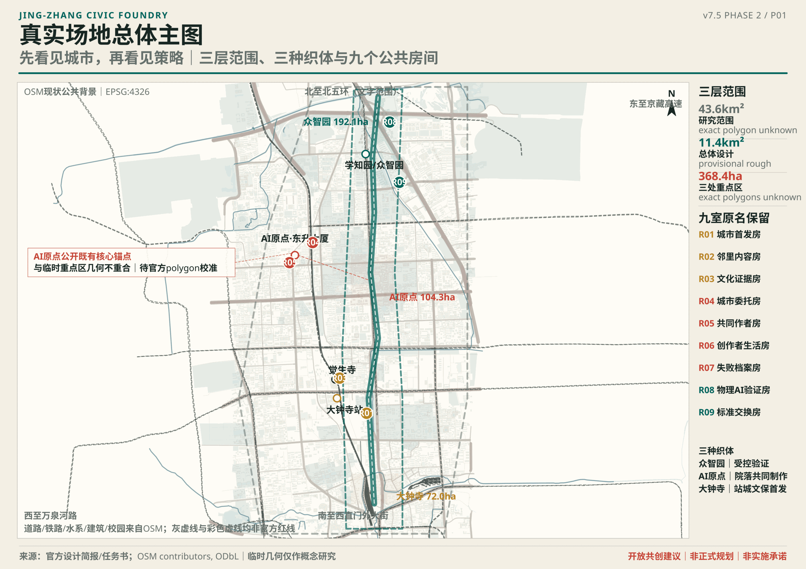
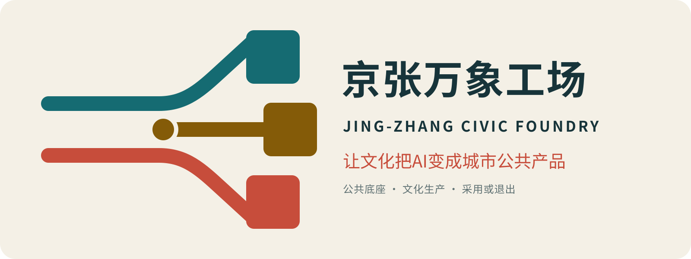
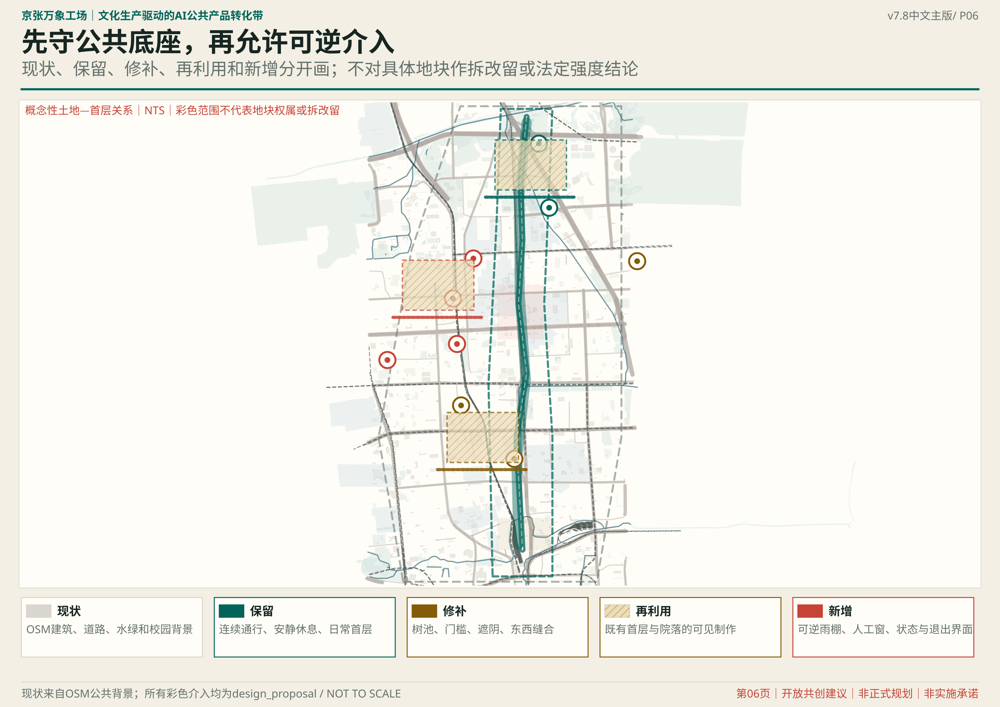
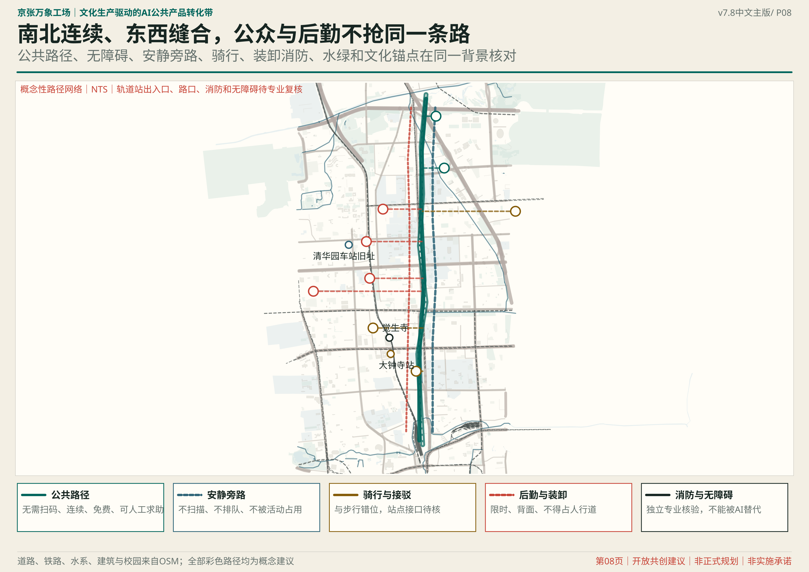
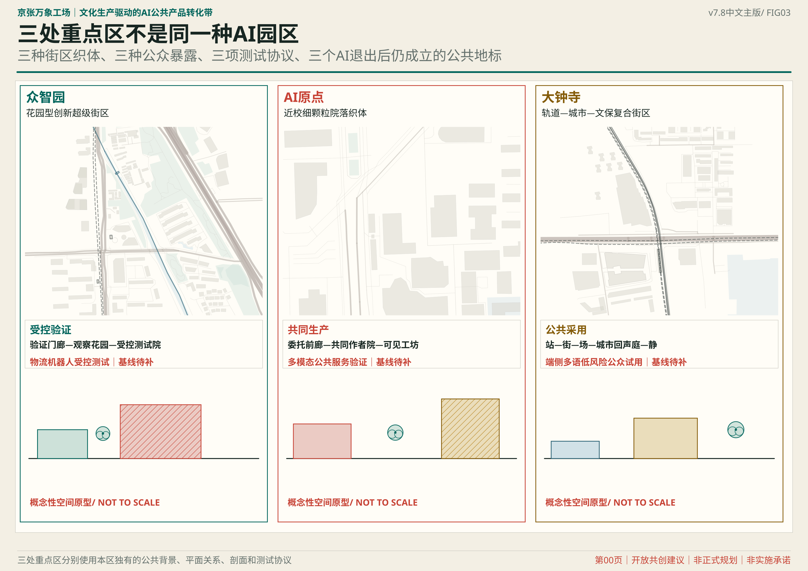
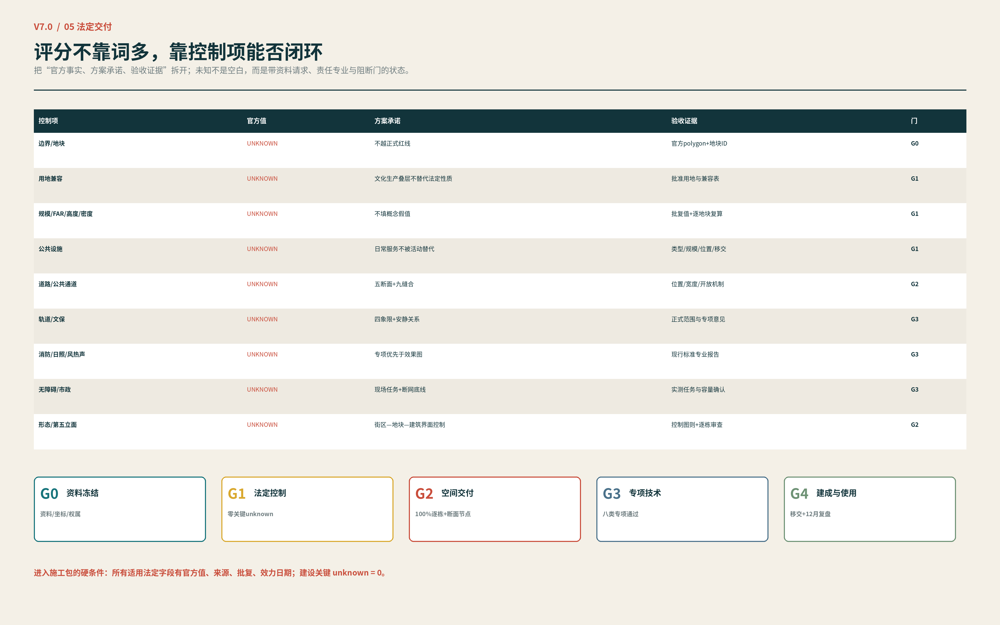

# 京张万象工场｜文化生产驱动的AI公共产品转化带

## JING-ZHANG CIVIC FOUNDRY

### A CULTURAL-PRODUCTION BELT FOR CIVIC AI PRODUCTS

## 一座已经成立的公园，为什么还需要城市设计

北京市公开项目资料和阶段性报道表明，京张铁路遗址公园二期正在分段实施，具备实施条件的区段已持续形成公共绿廊；但不能由此把整条走廊写成已经全部无缝建成。本案把已发生的步行、骑行、社区交往与公园建设作为生活基线，同时把尚待核验的连续性、横向过街、站点衔接和日常首层视为城市设计任务。[source:JZ-PARK-PHASE2-IMPLEMENTATION] [source:JZ-PARK-PHASE2-2026] [depth:existing_conditions_diagnosis]

因此，本案不把基地当作等待填充AI装置的空白，也不重复设计一条抽象“未来景观轴”。真正缺少的是落在真实街区中的第二层城市能力：**让问题在日常街面被看见，让样机在首层与院落中被共同制作，让服务在公众使用中被采用、修正或退出。**

> **让文化把AI变成城市公共产品：一项真实委托，一件公共样机，一年采用或退出。**

“京张万象工场”把城市而非AI设为共同作者。居民和一线机构提出真实委托，文化工作者校准语境、事实与权利，研发者和创作者共同造样，专业团队分级验证，公众在日常空间中试用和纠错，运营者再以十二个月的复用、服务、成本和公共影响决定采用、调整或退出。文化产业不在技术完成后负责包装，而在全过程中组织内容、作者、许可、渠道、市场与公共回投。[source:AUTHOR-CULTURE-METHOD] [metric:civic_product_type_count]

最终成果不是一批会迅速过时的AI展项，而是三类可以持续进入城市的公共产品：**可复用文化内容包、可部署公共体验模块、可持续城市服务**。任何产品退出后，公园通行、绿荫休息、人工服务、无障碍与社区生活仍完整存在。[depth:overall_spatial_structure] [metric:public_safeguard_count]



v7.5总体主图使用同一EPSG:4326工作坐标叠加公开OSM道路、铁路、水系、建筑与校园背景，明确区分约43.6平方公里研究范围、约11.4平方公里总体设计范围、合计约368.4公顷三处重点区，以及学知园/众智园、原点大厦、大钟寺站、觉生寺四个公开锚点。图中全部范围线仍为临时工作几何或文字范围，**不是官方红线、权属或控规polygon**；AI原点公开既有核心锚点与临时重点区不重合的矛盾被直接标出，等待正式资料校准。[source:OSM-CONTEXT-20260817] [source:SITE-ANCHOR-LEDGER-V7]

### 从铁路运力到城市转化力

京张铁路的历史事实与本案当代转译严格分开：铁路曾以自主工程连接城市与区域；本案不伪造历史隐喻，只把“公共能力如何被建设并持续使用”转译为新的城市命题——**从运输人和物的基础设施，转向把知识、技术与创意转化为公共生活的城市基础设施。**[source:JZ-HISTORY-BEIJING-CULTURE]

### 从专业著作到强制图纸：四种方法，不做书目装饰

本版不把城市设计著作作为论文引文，而把其方法转成评审可以直接检查的图纸义务。Kropf与Panerai的街道—街区—地块—建筑关系，生成三处重点区现状/建议织体矩阵。[source:MORPHOLOGY-KROPF] [source:MORPHOLOGY-PANERAI]

Spacematrix的FAR—GSI—OSR—层数关系，生成官方数据到位后的逐地块强度—形态表。[source:MORPHOLOGY-SPACEMATRIX] Allan B. Jacobs的街道测量和Cullen的连续视景方法，分别生成五类成对断面与三区五分钟到达序列。[source:MORPHOLOGY-GREAT-STREETS] [source:MORPHOLOGY-CULLEN]

上述四类方法的图纸义务、字段和验收条件统一进入结构化框架。[data:visual/assets/morphology-section-node-framework.json]

| 方法精髓 | 在本项目中的强制交付 | 评审可直接追问什么 |
| --- | --- | --- |
| 街道—街区—地块—建筑织体 | 众智园超级街区、AI原点细颗粒院落、大钟寺站城文保复合街区的现状/建议矩阵 | 哪些关系保持、修补、打开或替换，依据是什么 |
| 强度—形态关系 | 每个正式地块的用地、总规模、FAR、GSI、OSR、层数与公共空间表 | 是否引用有效法定值；相同强度为何选择这种形态 |
| 街道实测与比较 | 五类断面同时标出步行、骑行、车行、树荫、首层、装卸、消防与无障碍 | 宽度来自哪里；现状与建议的冲突如何解决 |
| 连续视景与门槛 | 众智园“站—场—试—园—退”、AI原点“街—廊—庭—坊—校”、大钟寺“站—街—场—厅—静” | 普通人在五分钟内看见什么、怎样拒绝参与、如何退出 |

原有的日常生活、认知骨架、生态适宜、人本序列和渐进试错五层判断仍作为每张图的检查清单，而不再替代街区和建筑设计本身。[metric:spatial_decision_layer_count] [data:visual/assets/spatial-decision-framework.json]

### 一线三场九室，静动相间

| 空间层级 | 设计内容 | 人如何感知 | 规划作用 |
| --- | --- | --- | --- |
| 一线 | 已建京张绿廊叠加“公共产品转化路径” | 沿线始终可走、可停、可辨，不被活动截断 | 真实路径骨架；不是新造一条轴 |
| 三场 | 众智园安全验证场、AI原点共同生产场、大钟寺城市首发场 | 三处拥有不同空间气质、进入方式和公众暴露 | 三个可识别区域与城市节点 |
| 九室 | 九处东西向缝合界面，以街—廊—庭—坊构成城市房间 | 从高校、园区、社区和轨道站步行进入可见首层 | 把铁路边界转成横向交往节点 |
| 静动相间 | 活跃生产节点之间保留连续绿荫、安静旁路与生态缓冲 | 不使用AI、不消费也能完整享受公园 | 让生态过程和日常生活先于技术部署 |

运行规则只保留一条便于政府和公众共同理解的合同：**一项真实城市委托，一件可见公共样机，一年采用或退出证据。**城市委托分布于全线；共同生产主要发生在AI原点；高风险样机转入众智园受控验证；成熟低风险产品在大钟寺首发；十二个月使用证据再决定采用、调整或退出。空间顺序与工作顺序不被硬画成流水线。[metric:workflow_stage_count] [metric:flagship_area_count]

### 任务书直面回应：三大定位、五大功能、三区两翼不是三张清单

三大定位由同一条文化生产链贯通：**百年京张文化带**提供可核验的历史与地方语境，**都市AI生活体验带**把样机放进可拒绝、有人值守的日常场景，**AI融合创新带**让科研、创作、验证、采用和退出形成完整回路。[metric:positioning_count]

| 五大功能 | 本案的城市产品 | 核心空间与验收证据 |
| --- | --- | --- |
| AI全栈自主创新体系 | 模型、端侧、机器人与空间接口的分级验证包 | 众智园L1安全验证院；红队、人工接管、停机和失败档案 |
| 世界级AI创新生态 | 城市委托、共同作者、文化权利、专业服务和采用网络 | AI原点L2共同作者工场；项目责任链与十二个月复用 |
| AI+场景赋能新范式 | 12份“有委托人、有非AI基线、有退出”的场景合同 | 小月河场景翼与九间城市房；场景—空间—运营逐项绑定 |
| 智能化AI活力城市 | 日常可用、无障碍、非数字备份的公共服务 | S1永久公共底座；不参加测试也能通行、休息、求助 |
| AI治理全球话语权 | 可迁移的空间准入控制码与京张转化责任链 | 状态台、标准交换房；公开风险、责任、版本与退出证据 |

**三区两翼**被设计成供需回路而非五个孤立园区：众智园负责“难技术与高风险验证”，AI原点负责“真实委托与共同生产”，大钟寺负责“低风险首发与市场采用”；中关村科技服务翼输入人才、IP、资本、算力和专业服务，小月河场景赋能翼输入社区、生态、照护、交通和公共服务问题。采用证据与开放工具再回流两翼，决定下一轮研发与委托。[metric:core_function_count] [metric:spatial_zone_count] [metric:spatial_wing_count]

### 品牌与导视：用“道岔”表达选择，而不是把人送进唯一未来



Logo把两条铁路平行线在一个开放道岔中转成三个可组合方块：青绿线代表不可出售的公共底座，朱红线代表文化生产，金色节点代表经过公众使用后才成立的城市价值。符号既像“工”字骨架，也像打开的城市房；不借用企业、铁路部门或历史商标。导视统一使用“JZ-R01—R09”房间编码、青绿公共线、朱红共同生产点、金色采用节点和灰色安静区；文化内容标识另设“事实—转译—AI生成”来源标签，不与一带Logo混淆。[metric:brand_system_count] [data:visual/assets/brand-system.json]

中文传播句为“**让文化把AI变成城市公共产品**”，英文为“**Culture turns AI into civic products.**” 城市状态牌只回答四件事：这里是什么、现在能否参与、谁负责任、怎样拒绝或退出；使品牌首先是一套公共承诺，其次才是传播资产。

## 领导决策摘要：京张要争的不是“第四个AI园区”，而是城市转化能力

从城市掌舵者视角，京张的不可替代性不在新建多少载体，而在于它同时拥有科研与企业供给、近校创新、社区生活、轨道商业和百年公共遗产，可以把“技术成果—城市产品—公众使用—持续价值”放在同一条责任链上。方案建议把这里定义为**面向国家的AI城市价值转化基础设施原型**：它不是国家授牌或既定政策，而是北京可率先验证的一套城市能力。[metric:adoption_core_count]

| 需要拍板的战略问题 | 本方案的建议答案 | 政府得到什么 | 明确不承诺什么 |
| --- | --- | --- | --- |
| 京张与普通AI园区有何不同 | 从“企业和技术集聚”升级为“AI城市价值转化基础设施” | 一套可复制的城市委托、验证、首发、采购/运营和退出方法 | 不承诺国家级称号、行政机构或政策授权 |
| 城市优先投资什么 | 先守公共空间、无障碍、人工服务、文化证据和独立评估底座 | 技术更换或退出后仍可使用的公共资产 | 不编造总投资、年度预算或建设规模 |
| AI如何获得空间使用资格 | 以L1受控验证、L2共同生产、L3公共首发三级准入，全部限时、可逆 | 风险与公众暴露相匹配，不拿市民做默认试验对象 | 不替代法定规划、许可、安全和采购程序 |
| 如何防止“试点烂尾” | 每项同时交代资本支出、年度运维、责任主体和退出准备金 | 从一开始看清谁建设、谁维护、失败谁复原 | 不保证采购、招商、收益或合作主体 |
| 文化产业为何是核心而非装饰 | 以公共委托、文化真实性、作者权利、内容发行、场景运营和复用回投组织转化 | 把AI能力转成有语境、有作者、有市场、有公共回报的城市产品 | 不把节庆客流、品牌露出或传播热度当作转化成绩 |

建议先形成四项概念性决策：确认“AI城市价值转化”战略主线；同意公共底座与商业增值层分账；授权对京张转化责任链1.0进行专业论证；以三项可逆城市委托启动前100天验证。任何空间落位、机构设置、经费、采购和实施仍须由有权主体按正式程序决定。[assumption:A-DELIVERY-001]

### 七维证据索引：让评审直接看到判断、机制和文件

| 评审维度 | 本版可核验的核心证据 |
| --- | --- |
| 任务书相关性 | 三层范围、三大定位、五大功能、三区两翼、六项agent任务和三处重点区差异化响应 |
| 原创性 | 城市公共委托制、京张转化责任链、三重转化、五账联审、三层空间准入控制码与公共回投 |
| AI与城市规划创新性 | AI服务权与空间暴露、时间许可、文化权利、人工责任、非AI底线和退出状态绑定 |
| 可实施性 | 前100天五项行动、六个交付包、主责职能、交付路径、资金性质、年度运维和退出准备金 |
| 公共利益与包容性 | 无障碍实测、人工/非数字双通道、安静不扫描旁路、基本服务免费与重点人群共评 |
| 风险与合规意识 | provisional边界、未知控规、版权与文化事实、隐私、财政防火墙、投诉与回滚 |
| 表达完整度 | 中英正文、五图、A3/A0、离线HTML、九类GeoJSON、指标矩阵、自检与三项机器协议 |

完整索引见 `visual/assets/review-evidence-index.json`；它只组织证据，不预设评审结论。[data:visual/assets/review-evidence-index.json]

## 设计依据与资料清单

方案以北京市相关部门公告、项目任务书和仓库站点资料包为正式依据；京张历史与遗址公园事实只采用北京市文物和园林绿化主管部门公开信息；八个全球案例只用于提炼机制，不外推北京的强度、体制、资金和权属条件。[source:OFFICIAL-ANNOUNCEMENT] [source:AGENT-TASKBOOK] [source:SITE-PACKAGE]

北京市政府2026年7月公开信息以约9公里绿廊、约70个社区和约45万人描述京张铁路遗址公园二期的整体公共价值；招采资料则证明知春路至西直门段曾作为明确建设区段推进。本案据此采用“整体公共价值成立、具体连续性逐段核验”的口径：任何新功能都必须增加横向联系、日常舒适或公共产品转化能力，不得把阶段性报道误写为每一米均已建成。[source:JZ-PARK-PHASE2-2026] [source:JZ-PARK-PHASE2-IMPLEMENTATION]

海淀2026年文化发展政策提出以AI、VR和数字孪生支持文化创作、文旅场景与文化产品，并推动赛事成果孵化、场景开放和投融资对接；科技成果转化政策进一步强调真实业务需求、场景清单和全周期验证；北京“人工智能+视听”政策则提出“科技攻关—成果转化—场景应用”闭环。这些政策只证明“技术、文化、场景、转化”协同的方向基础，不构成对本项目的立项、采购或实施授权。[source:HAIDIAN-CULTURE-TECH-2026] [source:HAIDIAN-TECH-TRANSFER-2026] [source:BEIJING-AI-AUDIOVISUAL-2025]

仓库处理后的事实包只作为资料导航、字段核对和可复算入口；其中任何摘要都不能替代原始来源、现场踏勘或主管部门确认。[source:PROCESSED-FACT-PACK]

公告给出的三层尺度为：统筹研究范围约43.6平方公里、总体设计范围约11.4平方公里、三处重点区域合计约368.4公顷。当前仓库尚无官方总体与重点区精确polygon，因此 geometry/site_boundary.geojson 与 geometry/key_areas.geojson 均保持 `official_boundary=false`、`geometry_role=provisional_constraint`。临时范围仅用于内容评审、空间运算和图层校验，不是道路、地块、权属、遗产、审批或工程红线。[source:BOUNDARY-SOURCE] [data:geometry/site_boundary.geojson#SITE-001] [data:geometry/key_areas.geojson#PROV-KEY-001]

三处重点区域的临时图形不再机械沿用一条狭长直带，而是在公告名称与约面积基础上，用四个公开背景锚点校准位置。[source:KEY-AREA-SOURCE] [source:SITE-ANCHOR-LEDGER-V7]

四个锚点已进入空间数据，但临时几何仍不是“更像真的官方红线”。[metric:verified_site_anchor_count] [data:geometry/constraints.geojson#ANCHOR-ORIGIN]

### 场地锚点审计：先把三种“范围”分开

| 对象 | 可确认的公开背景 | 本案如何使用 | 明确不能怎样使用 |
| --- | --- | --- | --- |
| 众智园/学知园 | 学知园站、清河遗址公园、小月河及创新载体形成北段花园型街区背景 | 用站—前场—验证边界—花园/水岸组织192.1公顷临时重点区 | 不把单一项目建筑规模外推为重点区规模 [source:ANCHOR-ZHONGZHIYUAN-CBEX-2026] |
| AI原点 | 公开资料分别描述约16万平方米既有核心和约3平方公里影响范围 | 以原点大厦作为104.3公顷竞赛重点区的背景锚点，并分层标注三种尺度 | 16公顷、3平方公里、104.3公顷三者不得互换 [source:ANCHOR-AI-ORIGIN-OFFICIAL-2025] [source:ANCHOR-AI-ORIGIN-OFFICIAL-2026] |
| 大钟寺 | 大钟寺站、蓝景地块、方恒/中坤等城市界面构成站城背景 | 把四象限步行、自行车停放、城市首层与首发空间作为72公顷片区第一任务 | 不把3.95公顷蓝景项目等同于整个重点区 [source:ANCHOR-DAZHONGSI-BLUEJING-2026] |
| 觉生寺 | 作为大钟寺片区重要文保背景可确认 | 仅标记安静关系和必须取得正式保护范围的资料门 | 不画未经主管部门确认的保护线、建控地带或视廊 [source:ANCHOR-JUESHENG-TEMPLE] |

四个点采用WGS84背景坐标，只解决“方案有没有落错片区”；不能解决“边界在哪里、能建多少、道路多宽、文保退多少”。坐标体系、来源、尺度区分和复算合同完整记录在 `visual/assets/site-anchor-ledger.json`。[data:visual/assets/site-anchor-ledger.json]

所有交换图层采用EPSG:4326，面积和长度用EPSG:4548复算。官方polygon发布后，不能只替换底图；用地、建筑、道路、绿地、公共空间、分期、图纸、网页和指标必须成套重算。[metric:site_area_sqm] [depth:metrics_recalculation] [standard:MOHURD-CONTROL-DETAILED-PLANNING]

容积率、建筑高度、道路红线、保护范围等强度控制，以及现状建筑、权属、结构、市政容量和真实客流等现状诊断，均保持待确认，不以概念精度冒充法定精度。[depth:development_intensity_controls] [depth:existing_conditions_diagnosis]

## 竞争判断与总体命题

对方案复核时仓库已公开参赛目录的结构化阅读只用于差异化判断，不作为规划依据，也不复制任何项目表达。公开方案中反复出现“一轴/一带+多核”、数据与数字孪生、试验验证、公共共治、历史文旅和生态韧性等类型；这些方向必要，但本案不再与其比功能数量。相对值得占据的空位是：**谁负责把AI从“技术可行”推进到“文化上有意义、公众愿意采用、市场可以持续、公共收益可回投”**。[source:PEER-CATALOG-CURRENT]

| 同赛道常见类型 | 已有强项 | 本案避开的正面竞争 | 万象工场的补位 |
| --- | --- | --- | --- |
| 科技园、算力与城市模型 | 企业集聚、技术底座、模拟与审计 | 不再比模型和平台数量 | 用真实城市委托决定技术为何存在 |
| 安全验证与治理协议 | 风险分级、可解释、可退出 | 不复制单一验证场 | 把验证接到文化意义、公众首发和十二个月采用 |
| 历史文旅与记忆叙事 | 地方识别、遗产展示和客流 | 不把文化降为展陈内容 | 把文化真实性、创作者权利和内容生产变成流程 |
| 垂直产业与生态闭环 | 单一系统具体、可运营 | 不在单一产业链上拼深度 | 以文化生产作为多个城市系统的采用接口 |
| 万象工场 | 技术如何被转成城市产品、真实使用与持续价值 | 不以单一地标或一次开幕取胜 | 用一线三场九室承载“委托—样机—一年采用/退出” |

本方案的高位判断有三条。第一，全球AI城市竞争的下一阶段不是“模型数量”，而是**技术到社会的转化效率**。第二，文化不是装饰性内容，而是城市价值转化基础设施：它决定技术是否可理解、叙事是否真实、创作者是否得到承认、体验是否形成使用、使用能否沉淀为长期运营。第三，城市设计不只是空间造型，而是**同步四只互不相容的时钟**。[metric:four_clock_count]

### 三重转化：把科技政策语言变成一条可执行的城市链

| 转化层 | 从什么到什么 | 文化产业的不可替代作用 | 政府可验收的结果 |
| --- | --- | --- | --- |
| 技术转化 | 模型、样机、科研成果 → 可部署城市产品 | 把抽象能力组织成内容包、体验模块和服务脚本，补齐作者、许可与用户语境 | 有明确场景、责任主体、非AI基线、测试边界和退出条件 |
| 社会转化 | 城市产品 → 真实使用、公众理解与信任 | 用公共委托、策展解释、共同创作和渠道触达形成使用，并让错误可更正 | 有日常任务、人工兜底、无障碍、投诉修复和十二个月使用证据 |
| 价值转化 | 真实使用 → 持续运维、创作者收益与公共回投 | 组织品牌、发行、服务、许可和场景经营，同时把不可购买的公共权利锁在底线之外 | 资本开支、年度运维、退出准备金、创作者报酬和公共回投可审计 |

三重转化不是三条并列口号，而是一条不可跳步的责任链：技术成果没有完成社会转化，不得以“发布”冒充价值；没有形成运维与退出责任，也不得以“试点”锁定永久建设。[metric:conversion_layer_count]

| 四只时钟 | 时间尺度 | 城市责任 | 空间层 | 失败风险 |
| --- | --- | --- | --- | --- |
| 百年遗产钟 | 数十年至百年 | 真实性、完整性、最小干预 | 保留结构、遗存界面、安静缓冲 | 快技术吞噬历史，叙事幻觉 |
| 每日生活钟 | 每天 | 通行、照护、休息、无障碍、人工服务 | 连续公共地坪、社区首层、气候花园 | 活动和商业排挤日常 |
| 季度创作钟 | 数周至数月 | 城市委托、驻留、制作、首发、复盘 | 可逆工坊、共享院落、服务接口 | 一次性节庆与内容浪费 |
| 快速迭代钟 | 小时至数周 | 模型、机器人、端侧系统测试与回退 | 受控测试院、数字层、人工接管 | 风险外溢、黑箱决策和技术锁定 |

四时分层不是形式隐喻，而是建设规则：百年层“少动、可辨、可逆”；日常层“免费、连续、无障碍”；季度层“轻量、可撤、可复用”；快速层“最小数据、沙盒运行、能停能退”。任何项目不得用快速层的迭代速度迫使百年层和每日层让位。[depth:height_massing_character] [depth:risk_missing_data]

## 三层范围工作框架

三层不是同一图案的放大与缩小，而是三个不同的决策问题。[metric:announced_research_area_sqm] [metric:announced_key_area_total_sqm] [depth:three_level_scope_framework]

| 层级 | 核心问题 | 方案交付 | 成功证据 |
| --- | --- | --- | --- |
| 网络层 · 约43.6 km² | 海淀的技术供给如何转成北京的城市能力 | 城市委托网络、创作者与专业服务网络、内容与体验流通规则 | 跨机构委托可持续、成果被复用、公共回投可审计 |
| 走廊层 · 临时复算约11.40 km² | 铁路两侧割裂地块如何变成公共生产界面 | 公共生产地坪、九间横向城市房、功能织补、四时分层 | 日常连通不断、活动可撤、每个原型可被看到和纠错 |
| 原型层 · 三处约368.4 ha | 不同风险和公众暴露如何落到建筑与空间 | 众智园安全验证院、AI原点共同作者工场、大钟寺城市首发场 | 技术、文化、公共与运营门槛分区匹配 |

总体空间不称“一轴三核”。京张铁路及其公园界面被设计为**公共生产地坪**：不是把人从南送到北的景观轴，而是让工作过程进入公众视野的连续城市首层。九道东西向缝合把西侧高校、园区与专业机构，铁路公共界面，以及东侧社区、生活服务和日常问题接成九间“城市房”。每间房同时拥有室内载体、遮蔽门廊、开放前庭、气候花园和无障碍横向路径。[data:geometry/roads.geojson#ROAD-CIVIC-FLOOR] [metric:urban_room_count]

三处重点区不是三个形象地标，而是三种风险梯度：众智园·安全验证院“低公众暴露、高技术门槛”，AI原点·共同作者工场“多主体共创、中等门槛”，大钟寺·城市首发场“高公众暴露、低风险首发”。项目按风险和成熟度在三处之间移动，而不是按南北地理顺序机械传送，也不被一个园区永久占有。[data:geometry/key_areas.geojson#PROV-KEY-001] [metric:key_area_count]



## 统筹研究范围产业与未来城市研究

### 1. 新的产业链不是“研发展示”，而是“成果—产品—使用—价值”

万象工场建立七步城市委托生产链：**城市出题→文化校准→人机共制→受控验证→城市首发→持续采用→公共回投**。每一步都有明确的空间、责任人、证据和停止条件；没有真实使用者的技术不能进入人机共制，没有文化与权利来源的内容不能城市首发，没有日常复用证据的首发不能进入固定建设。[metric:workflow_stage_count] [standard:PROJECT-AGENT-OPEN-CALL-TASKBOOK]

- 城市出题：社区、医院、学校、园区、商户和公共空间运营者提出可验证委托，而不是泛化“需求征集”。
- 文化校准：史料、地方知识、传承人、专业人士与现实语境共同界定内容边界；AI不得替代事实核验。
- 人机共制：研发者、设计师、策展人、服务人员和真实使用者共同署名；记录模型、素材、许可和人工编辑。
- 受控验证：按封闭仿真、专业验证、限时公众试用三级推进；出现安全、歧视、误导或不可接管即停止。
- 城市首发：在公共生产地坪以可逆方式呈现“测试状态”，同步提供人工解释、非数字路径和反馈入口。
- 持续采用：观察十二个月复用、任务完成、运维、支付和投诉，不以开幕客流替代价值。
- 公共回投：公开成本、收入、失败和下一轮改进；可分配结余按审查规则回投公共委托与创作者生态。

### 2. 京张转化责任链：把技术成果、城市使用与持续价值锁在同一条链上

七步回路过去只是方法，本版把它固化为机器可读的 **Jing-Zhang Civic Conversion Accountability Chain 1.0 / 京张转化责任链**。每个项目建立一条持续更新的责任链，从城市委托、文化校准、受控试验、公共首发一直记录到采用、续期或退出；它不是政府许可证、产品认证、采购背书或已签署合同，而是把“谁提出、为谁服务、在何处试、谁负责、钱从哪里来、失败怎样退”锁在同一个证据对象中。[data:visual/assets/jingzhang-civic-conversion-accountability-chain.schema.json] [metric:conversion_accountability_chain_schema_count]

**一项目一链、一道门一责任、一阶段一证据、一次失效一退出。** 这句话既是领导可记住的治理口径，也是规划、财政、文化、技术和运营团队共同使用的交付检查表。

| 五道门 | 必答问题 | 放行人类角色 | 未通过后果 |
| --- | --- | --- | --- |
| G1 公共必要性 | 是否存在真实委托人、受益者和不使用AI的基线 | 城市委托与公共利益复核 | 不立项或退回重写问题 |
| G2 文化与权利 | 史实、地方知识、当代转译、AI生成、作者、数据和许可是否清楚 | 文化、版权、社群和用户代表 | 可继续研究，不得首发或发行 |
| G3 受控试验 | 风险等级、空间围界、人工接管、无障碍、非AI路径和退出是否成立 | 技术、安全、空间和一线运维 | 停止实地试验，回到仿真或人工流程 |
| G4 公共首发 | 普通人能否看懂状态、拒绝参与、投诉纠错并继续获得基本服务 | 公共服务、无障碍和现场运营 | 不进入高公众暴露空间 |
| G5 采用/续期/退出 | 十二个月复用、任务、信任、成本、运维和可迁移证据是否支持继续 | 公众、采购/运营、独立评估和审计 | 采用、限期续期、缩小、回滚或退出 |

责任链同时维护五联账本、L1—L3空间许可、资本支出/年度运维/退出准备金和停止条件。其状态只能在 `concept_only`、`commissioned`、`rights_review`、`sandbox_authorized`、`public_trial_authorized`、`adoption_review`、`adopted/renewed`、`suspended/exited/archived` 之间依证据迁移，不允许由企业自行把“展示成功”改写成“城市采用”。[metric:adoption_gate_count]

```json
{
  "chain_record_id": "SYNTHETIC-JZCCAC-001",
  "proposal_status": "concept_only",
  "spatial_licence": {
    "exposure_level": "L2_CO_CREATION",
    "time_limited": true,
    "reversible": true,
    "public_baseline_protected": true,
    "official_geometry_confirmed": false
  },
  "delivery": {
    "capex_status": "pending",
    "annual_opex_status": "pending",
    "exit_reserve_status": "pending"
  },
  "adoption_evidence": {"months_observed": 0}
}
```

合成示例保留全部空缺和 `concept_only` 状态，明确没有部署、测试、出资、采购或政府采纳。[data:visual/assets/example-jingzhang-civic-conversion-accountability-chain.json]

### 3. 文化产业优势转译成三类城市产品

本方案不把文化优势写成“办活动、做传播”。文化产业的核心能力是把分散的历史、知识、创意、技术、渠道与市场组织成可复用产品，并在权利清楚的前提下反复流通。作者的专业经验不被写成任何现成合作关系，而被翻译为四组可检查的城市设计机制。[source:AUTHOR-CULTURE-METHOD]

| 文化产业能力 | 转译后的城市机制 | 空间落点 | 可检查证据 |
| --- | --- | --- | --- |
| 内容发现与传统文化激活 | 事实、地方知识、当代转译和AI生成分层；错误可更正 | 文化证据房、来源实验室 | 史料来源、复核人、更正记录、模型声明 |
| 创意征集与公共场景匹配 | 先由真实使用者出题，再由文化与技术共同生产 | 城市委托房、AI原点共同作者工场 | 委托人、受益者、共同作者、停止条件 |
| 资源链接与品牌权益设计 | 允许限期共制和经许可发行，禁止购买公共权利 | 大钟寺城市首发场、公共状态台 | 权益披露、许可期限、公共与商业界面分离 |
| 产业协同与长期运营 | 小样测试、复用、合理付费、维护和退出同时进入采用判断 | 沿线服务网络、采用办公室、五联账本 | 十二个月复用、成本、维护者、创作者报酬与公共回投 |

| 产物 | 构成 | 空间落点 | 复用方式 | 公共底线 |
| --- | --- | --- | --- | --- |
| 文化内容包 | 可核验事实、叙事结构、视觉/声音/交互素材、许可与模型声明 | 文化证据房、共同作者工坊、来源实验室 | 教育、展陈、导视、城市服务和国际交流按许可调用 | 事实可追溯、作者可见、错误可更正 |
| 公共体验模块 | 可逆构件、交互脚本、人工服务脚本、无障碍与安全说明 | 九间城市房、气候花园、城市首发场 | 在不同社区和季节部署，不复制地标建筑 | 不排挤通行、可撤场、非数字备份 |
| 城市服务 | AI能力、工作人员、数据最小化规则、运维与退出方案 | 社区、园区、轨道接驳和公共机构 | 经采用复盘后进入采购、运营或开放工具 | 人工接管、可问责、停止不损害基本服务 |

### 4. 八个全球案例只提取机制，不复制条件

| 案例 | 提取机制 | 京张转译 | 明确不复制 |
| --- | --- | --- | --- |
| Punggol Digital District，新加坡 | 校园、产业、公共空间与区域运营平台构成可插接生活实验室；先模拟再实测 | 把众智园验证、AI原点共同制作和城市试用接成可回滚链 | 不复制投资、传感器密度、治理权和供应商 [source:CASE-PUNGGOL-JTC] |
| Smart Kalasatama，赫尔辛基 | 以敏捷试点、共同设计和居民参与组织真实居住区实验 | 从小范围、短周期、可撤销公共议题开始，正常服务不下线 | 不移植当地绩效数字、社区结构和气候目标 [source:CASE-KALASATAMA-FVH] |
| Mila / Mile-Ex，蒙特利尔 | 大学联盟、跨学科团队与负责任AI形成知识生态 | AI原点配置文化事实校准、伦理复核和共同作者空间 | 不把人才数量和国际排名写成京张承诺 [source:CASE-MILA] |
| Vector Institute / MaRS，多伦多 | 研究、人才培养、企业采用与公共部门能力建设相互连接 | 设置公共产品转译桌、专业服务翼和采用后复盘 | 不复制资金规模、伙伴名单和产业统计 [source:CASE-VECTOR] |
| Hazelwood Green RIC，匹兹堡 | 工业遗址更新、室内外机器人测试、制作和社区教育同场组织 | 众智园设置可隔离、可观察、可暂停的物理AI验证院 | 不由案例推导京张权属、遗产价值或建设规模 [source:CASE-HAZELWOOD-CMU] |
| Sangam Testbed，首尔 | 限定路线、限定时段和公共界面共同构成市政自动驾驶试验 | 测试必须有地理围栏、时间窗、人工安全员和退出路径 | 不移植首尔线路和车辆运营条件 [source:CASE-SEOUL-SMG] |
| 张江人工智能岛/创新小镇，上海 | 研发、应用场景、展示和生活配套形成近距离生态 | 要素逐项绑定空间载体、服务角色和验证场景 | 不复制企业数、补贴、备案和投资承诺 [source:CASE-ZHANGJIANG-SH] |
| 河套深港科技创新合作区，深圳/香港 | 科研协作、成果转化、标准接口和全要素服务并行 | R09标准交换房承担国际规则翻译与成果转化接口 | 不假设跨境政策、税制、资金或数据条件 [source:CASE-HETAO-SZ] |

案例不是品牌拼贴。每个案例只保留“机制—空间载体—治理—公众界面—京张转译—不可照搬”六项，完整转化记录进入v7.5研究证据包；案例数量由7更新为8，但不改变项目原创命题。[metric:global_case_count]

### 5. 十二类要素保障必须落到空间、准入门和退出动作

| 要素组 | 空间载体 | 进入条件 | 失败或资料不足时 |
| --- | --- | --- | --- |
| 土地与空间 | 三处重点区；院、廊、坊、测试场、首发厅 | 正式边界、权属、用途、测绘、结构、消防与无障碍核验 | 保持unknown，退回概念原型，不作拆改留结论 |
| 技术、算力与数据 | R08物理AI验证房、专业服务翼、R03/R09 | 成熟度与责任人；负荷/能耗/采购；合法来源、最小必要和期限 | 降为封闭试验、外部合规服务或人工流程；删除数据并停止场景 |
| 人才、资本与专业服务 | R06创作者生活房、专业服务翼、R09 | 真实岗位与公共服务需求；公开程序与利益披露；法律/IP/标准/伦理审查 | 公共服务优先；不承诺金额和排他权益；只表达待定专业角色 |
| 测试、文化与标准 | 三场、小月河翼、R03/R09、G0—G4 | 基线、责任人、停止、回滚；史料/授权/报酬；适用标准和人类终审 | 关闭测试、撤除内容、停止升级并转专业审查 |
| 运营维护 | R01/R07、人工服务窗、后勤线 | 值守、全寿命成本、投诉、恢复和退出准备 | AI退出，人工窗口、普通通行与日常公共空间继续 |

这十二类要素不等于已有政策、机构或资金。它们是“要素是否真正改变空间与交付”的检查表；若不能指向载体、准入门、责任人和退出动作，就不得进入主图。[metric:factor_support_count]

### 6. 五向区域协同：京张做“转化接口”，不与其他创新区争同一块牌子

区域协同不以签约名单和招商口号表达，而以“输入—京张加工—输出—闸门”表达。以下均为待有关主体确认的开放接口，不表示已有合作、数据共享、资金或政策授权。[metric:regional_interface_count] [data:visual/assets/regional-interface-ledger.json]

| 区域接口 | 可输入京张的能力 | 京张的独特加工 | 可输出的公共产品 | 必须通过的闸门 |
| --- | --- | --- | --- | --- |
| 北纬社区 | 社区生活问题、近校创新、居民与一线服务反馈 | 把模糊诉求写成有受益者和非AI基线的城市委托 | 可在社区复用的内容包、体验模块和服务脚本 | 隐私、劳动补偿、人工兜底、社区退出权 |
| 未来科学城 | 前沿研发、工程能力、专业人才与验证需求 | 把科研样机补齐文化语境、公众解释和空间暴露等级 | 可进入真实城市验证的责任链与样机协议 | 来源、风险、专业复核、可撤场 |
| 怀柔科学城 | 科学设施、科研传播与科学文化资源 | 把复杂知识转成可核验、可更正的公共文化产品 | 科学文化内容包与公众体验模块 | 科学事实复核、版权和误导防控 |
| 经开区 | 智能制造、机器人、产业化与供应链能力 | 在众智园完成受控场景和维护/退出测试 | 可部署但不锁定供应商的城市服务组件 | 设备安全、人工接管、运维和退出准备金 |
| 京津冀 | 多城市应用环境、工业与文化资源、跨域使用反馈 | 用统一证据包检验跨场景迁移，而非复制建筑形象 | 开放模式库、服务协议和地方化改写方法 | 数据边界、属地审批、文化语境和成本可承担 |

京张由此承担三件其他区域难以同时完成的事：在高密度日常生活中发现真实问题，在百年文化与中关村创新文化之间校准意义，在公共首发后用一年证据判断采用或退出。协同的成果不是“导入多少项目”，而是多少能力被改造成可问责、可维护、可迁移的城市公共产品。

## 总体设计范围城市更新与控规深度城市设计

本层不再用一条均质长带平均分配功能，而以**三种城市织体、五类关键断面、九个横向修补任务、十七类法定控制字段**组织空间。北段打开花园型创新超级街区，中段修补近校细颗粒院落织体，南段缝合轨道—城市—文保复合街区；同一个“文化生产驱动”命题因此获得三种不同的街区、首层和公共空间形态。[standard:MOHURD-URBAN-DESIGN-MEASURES] [data:visual/assets/morphology-section-node-framework.json]

海淀区城市更新行动指引关于混合功能、十五分钟生活与创新圈、连续慢行、首层和第五立面、打开围墙与京张第三空间的要求，进入本案的空间控制；北京控制性详细规划实施管理办法和城市更新条例则用于建立法定字段、拆改留、公共通道和实施门，不被简化成政策口号。[source:HAIDIAN-URBAN-RENEWAL-GUIDE-2025] [source:BEIJING-CONTROL-PLAN-IMPLEMENTATION-2024] [source:BEIJING-URBAN-RENEWAL-REGULATION-2022]

### 0. 现状先于方案：四项必须补齐的诊断

| 现状判断 | 已知事实或当前缺口 | 对设计的直接约束 | 下一步核验 |
| --- | --- | --- | --- |
| 公园公共价值成立，但连续性须逐段核验 | 约9公里、约70个社区和约45万人是整体报道口径；具体实施区段与断点仍需核对 | 不新造抽象“主轴”，也不把未核验段写成已建连续路径 | 分段竣工资料、工作日/周末、早午晚和季节性公共生活观察 |
| 铁路是纵向公共资产，也是横向界面 | 沿线站点、道路、社区与园区条件并不均质 | 九间城市房只能是候选缝合点，须逐点核验而非平均布点 | 路权、过街、竖向、遗存、乔木、夜间安全和无障碍 |
| 科技与文化供给丰富，采用链薄弱 | 研发、内容和政策方向可确认，真实委托、采购和运维主体待确认 | 首先建设委托—样机—采用/退出的责任关系，不先建展示地标 | 访谈一线机构、居民、商户、运营者与采购/运维职能 |
| 真实锚点可确认，法定底图仍不完整 | 四处背景锚点已校准；官方polygon、地块、树木、水土热声、控规、文保与市政容量尚缺 | 三种街区类型可深化，固定设施、法定强度和工程量保持unknown | G0资料冻结：边界、地块、现状、权属、控规、道路、文保与市政同步入库 |

诊断的目的不是制造“问题地图”，而是决定哪里应当**保持安静、修补日常、允许试验或拒绝建设**。在现场证据完成前，图纸表达的是可复核的空间假设，不是精确现状结论。[depth:existing_conditions_diagnosis]

### 1. 用地不是颜色配比，而是生产关系

十三个临时概念功能单元完整覆盖临时范围且无面状重叠，只用于检验科研、文化、社区、教育、商业与公园六类功能能否共同进入走廊；它们不是地块，也不模拟法定用地。纵向公共底盘和横向九道缝合分别由道路、绿地与公共空间图层表达，避免一张概念用地图同时冒充道路、地块和控规。[data:geometry/land_use.geojson#LU-CIVIC-FLOOR] [depth:land_use_layout] [standard:MNR-LAND-USE-CLASSIFICATION-GUIDE]

当前临时用地层只用于验证概念功能是否完整覆盖且无面状重叠；科研、文化与社区比例保存在 `metrics.json`。[metric:land_use_research_ratio] [metric:land_use_culture_ratio] [metric:land_use_community_ratio]

教育、商业与公共绿地比例同样只作概念复算，不在正文用百分比制造法定精度。[metric:land_use_education_ratio] [metric:land_use_commercial_ratio] [metric:land_use_park_ratio] 官方边界、地块、现状与法定用地发布后，概念分区须按地块重新编制。

### 2. 九间城市房把“过线”变成“共同生产”

| 房间 | 城市任务 | 西侧界面 | 中央公共地坪 | 东侧界面 |
| --- | --- | --- | --- | --- |
| R01 城市首发房 | 让成熟低风险项目被普通人理解 | 企业与内容团队 | 首发前庭、人工讲解、非数字导视 | 轨道接驳与城市客厅 |
| R02 邻里内容房 | 为小微商户和社区生产可复用内容 | 创意服务与培训 | 夜间可控市集、安静旁路 | 商户、居民与日常消费 |
| R03 文化证据房 | 校准京张事实、地方知识和内容来源 | 文化研究与策展 | 可更正的证据展台 | 学校、社区与公众反馈 |
| R04 城市委托房 | 把真实问题写成可验证任务 | 专业服务与研发团队 | 开放需求桌、任务状态墙 | 社区、一线机构和人工服务 |
| R05 共同作者房 | 让使用者进入造样而非被测试 | 高校与创作者 | 长桌院、可逆制作棚 | 人才生活与公共服务 |
| R06 创作者生活房 | 支撑跨学科驻留和日常生活 | 开放学习与成果转化 | 安静花园、共享厨房界面 | 居住、托育、运动和照护 |
| R07 失败档案房 | 让失败、暂停和退出成为公共知识 | 模拟与工程团队 | 观察廊、失败档案 | 社区评议与独立复核 |
| R08 物理AI验证房 | 隔离高风险设备和人群 | 受控试验院 | 安全绿垫和观察边界 | 标准、应急与运维服务 |
| R09 标准交换房 | 把研发经验转为可复用规则 | 全栈研发和开源协作 | 标准长桌与版本档案 | 公共机构和行业服务 |

九道缝合是待现场确认的任务，不是现状道路承诺。每一点先核验路权、铁路与遗产条件、竖向、树木、过街、夜间安全和无障碍；无法成立时允许移动或降级，不强行保持图形。[metric:east_west_stitch_count] [depth:traffic_rail_slow_parking]

### 3. 空间准入控制码：永久公共底座、可逆城市接口、限期AI服务

本方案的规划创新不在另画一层“AI用地”，而在于把AI进入空间的权利变成**有时间、有风险等级、有公共底线、有撤回条件的城市许可**。九间城市房和三处重点区共用三层控制码：[data:visual/assets/urban-room-control-code.json] [metric:spatial_access_level_count]

| 空间层 | 时间责任 | 主要内容 | 刚性规则 |
| --- | --- | --- | --- |
| S1 永久公共底座 | 长期 | 连续通行、无障碍、遮阴休息、实体导视、人工求助、安静旁路、基本照明 | AI断网、撤场或换供应商后仍能独立使用；不得被活动和收费服务挤占 |
| S2 可逆城市接口 | 数周至季节 | 委托长桌、开放工坊、观察廊、状态台、气候构件、公共解释界面 | 须写占用时段、维护者、权益披露、撤场和场地恢复责任 |
| S3 限期AI服务 | 数小时至十二个月 | 模型、终端、机器人、数字内容和辅助服务 | 须持转化责任链，限定L1—L3暴露等级，保留人工与非AI路径，不自动续期 |

这套控制码把城市设计从“地块能建什么”推进到“什么能力在什么风险、什么时间、什么公众暴露下可以出现”。众智园默认L1受控验证，AI原点默认L2共同生产，大钟寺只接受通过前四道门的L3低风险公共首发；同一项目不能因换了地点而降低门槛。[metric:spatial_layer_count]

控规、文保、道路、市政和现状建筑资料补齐后，专业团队仍需为每个接口确定真实的高度、退线、容量、消防、噪声、能源和无障碍条件。本控制码不制造任何法定指标或工程结论。[assumption:A-CONTROLS-001]

### 4. 六类公共生产空间模式：先做小、做真，再复制

六类模式把抽象机制变成可画剖面、可做样段、可被社区修正的最小空间单元。它们不是标准构件目录，更不是全线统一铺装；每一处都要以现状使用者、树木、遗存和维护能力校准。[metric:spatial_pattern_count]

| 模式 | 要解决的问题 | 空间原型 | 日常生活保护 | 进入下一阶段的证据 |
| --- | --- | --- | --- | --- |
| P1 城市委托前廊 | 需求被平台和专家代写 | 沿街有顶前廊、人工窗口、可擦写任务桌 | 不下载App也能提问、查询和撤回 | 有真实委托人、责任人和结束定义 |
| P2 共同作者工坊边界 | 公众只能观看，不能影响造样 | 透明可开合工坊、长桌、材料库与安静公共客厅 | 免费座位和通行不随项目封闭 | 共同作者、文化来源、许可和报酬记录完整 |
| P3 可逆样机湾 | 技术试点迅速固化为永久设施 | 从主路侧退的标准接口湾，独立供能、围界和恢复层 | 主路与树荫连续，撤场后恢复普通公园 | 时限、风险等级、人工接管和撤场责任明确 |
| P4 安静无扫描旁路 | 公园使用被迫参与测试或消费 | 与活跃节点并行的绿荫慢行线、座椅和实体导视 | 不扫描、不收费、无推送，儿童与老人可独立使用 | 全时段连续、无障碍现场任务通过 |
| P5 城市首发台阶 | 发布会只制造流量，缺少理解与纠错 | 面向日常街道的小台阶、人工讲解台、状态与退出牌 | 非活动时仍是普通休息和会面场所 | 普通人能说明用途、状态、责任人与拒绝方式 |
| P6 维护与退出台 | 建成后无人维护，失败被隐藏 | 工具柜、故障板、版本档案、回收与场地恢复接口 | 维护作业不阻断通行，故障时基本服务仍在 | 年度运维、投诉时钟、退出准备金和恢复记录可查 |

模式的组合遵守一个顺序：**先保留P4安静旁路和日常首层，再按真实委托增设P1/P2；只有责任链通过才出现P3/P5；P6从第一天而非最后一天同步建设。**这使方案可以从一个路口、一段门廊和一处院落开始，而不依赖一次性巨额建设。

## 用地、建筑规模与拆改留方案

### 建筑采用“旧骨架、新内胆、可撤层”

geometry/buildings.geojson中的十八个概念载体分别服务于花园超级街区、细颗粒院落与站城复合街区，只表达空间类型与功能关系，不代表现状建筑、拆除清单或批准建设量。[data:geometry/buildings.geojson#BLDG-FOUNDRY-01] [metric:building_footprint_area_sqm]

逐栋决策先回答五组问题：文化与地方记忆价值、现有使用者与社会网络、结构安全与适配性、全生命周期碳、长期运营与可负担性。满足保留条件时修缮骨架和立面；适合再利用时插入可拆内胆、共享机电和透明首层；只有当安全、功能和公共价值均不能通过适配实现时，才进入专业论证。新增体量与历史层可辨、尺度服从街巷和院落，不做巨构“AI形象”。[depth:retain_renovate_demolish] [standard:MOHURD-ARCH-DESIGN-DEPTH-2016]

建筑界面有六条硬规则：沿公共地坪的首层优先布置可见制作、人工服务和免费休息；日常商户、托育、学习和照护不得被活动置换；设备测试不得直接暴露于高人流界面；赞助标识与公共导视分离；永久围墙不得切断九间城市房；屋顶设备、第五立面和体量转折须进入沿线视线控制。建筑高度、容积率与具体退线保持unknown，待官方与遗产条件确认。[metric:floor_area_ratio] [metric:maximum_building_height_m]

## 交通、轨道、市政与公共服务设施

锚点校准后的公共生产地坪概念主线复算约10.37公里；两条平行骑行与后勤线把日常通勤、活动装卸和试验设备分流。九道横向城市房连接两侧街区；轨道站出入口、公交、停车和路口组织均列为专业接口，未取得现状资料前不绘制伪精确接驳。[metric:civic_floor_length_m] [data:geometry/roads.geojson#ROAD-CIVIC-FLOOR]

五类必须成对绘制的现状/建议断面为：学知园站—下沉前场—花园/水岸；成府路—原点大厦—AI巷/校园；大钟寺站四象限—蓝景/方恒；京张纵向公共底盘—横向缝合；清河/小月河蓝绿边缘。每张同时记录实测宽度、坡度、树冠、首层开启、骑行、装卸、消防、夜间照度和撤场恢复，法定红线未知时不填假宽度。[metric:street_section_count] [source:BEIJING-ROAD-SPACE-STANDARD-2024] [data:visual/assets/morphology-section-node-framework.json]

市政系统采用“永久基础、可逆服务”的双层策略：消防、给排水、供电和通信按专业审批进入永久层；创作与首发所需电力、网络、吊点、排队和垃圾分类采用标准化可撤接口。公共AI优先端侧处理和最小数据，不以沿线人脸采集作为“智慧城市”默认配置；系统中断时，实体导视、人工窗口和基本服务继续有效。[depth:municipal_new_infrastructure]

### 公共利益底线：先保障最容易被“聪明系统”忽略的人

公共利益与包容性不以“所有人都能下载App”证明。每项公共场景必须邀请老年人、残障与慢病使用者、儿童照护者、租住青年、夜间劳动者、一线保洁安保和小微商户中的相关群体共同完成现场任务；画像只用于检验服务，不用于给人打分或不透明分类。

六项底线同时成立才可进入公共首发：基本服务不收费；实体/电话/现场等非数字路径存在；有人值守并能接管；无障碍以现场任务而非模拟截图确认；提供安静且不扫描的旁路；公开责任人、投诉入口、响应时钟和恢复方案。无法满足任何一项时，AI层下线，S1公共底座继续工作。[metric:public_safeguard_count]

## 蓝绿空间、公共空间与城市风貌

蓝绿系统不是活动背景。锚点校准临时模型中的连续公共底盘与九个气候花园union约129.6公顷，占约11.4%。[metric:green_space_area_sqm] [metric:green_ratio]

十二处场景公共空间union约13.2公顷，占约1.2%。[metric:public_space_area_sqm] [metric:public_space_ratio] 这些是概念图面覆盖，不是法定绿地率或广场率。花园承担渗透、遮荫、声环境缓冲、等候和生态连接；现状树木、土壤、积水与热环境调查前，不作移植、砍伐或工程容量结论。[data:geometry/green_space.geojson#GREEN-CIVIC-FLOOR]

空间适宜性先叠加六张底图再决定“哪里做什么”：现状水与积水、土壤与根区、乔木与树冠、热舒适、噪声与安静、栖息与连续性。高生态敏感或高日常使用地段只做保育与低干预；已有硬质界面、交通可达且维护可进入的地段才讨论可逆样机。没有调查数据时，默认选择少建、可撤和远离根区，而不是把空白误认为可建设。[depth:blue_green_public_space]

沿线采用“静—动—静”的节律，而非连续节目化：三处重点场和九间城市房是有限活跃点，其间保留安静生态段、P4无扫描旁路和连续树荫。公共基线不随活动出售：连续通行、无障碍路线、饮水与厕所信息、免费座椅、安静休息、基础历史信息、人工求助和应急服务始终优先。活动采用日常态、创作态、首发态三种部署；每次首发须预审搭建和疏散，限时限声，保留旁路，撤场后发布能耗、垃圾、投诉和恢复记录。

人本尺度通过“2×3公共生活观察窗”建立基线：工作日与周末各在早、午、晚记录步行、停留、坐靠、照护、运动、交谈、绕行和冲突，并在冷热、雨雪和活动日复测。方案不预填人数和满意度；先以观察决定座椅、遮阴、首层开启、照明和人工服务，再决定建筑与数字层。[metric:public_life_observation_window_count]



## 三处重点区域详细设计



### A. 众智园·安全验证院 / SAFE VALIDATION YARD

定位是“低公众暴露、高技术门槛”，城市形态是**花园型创新超级街区**。以学知园站/众智园公开背景锚点为中心，重点不是在大地块上摆六栋AI建筑，而是把现有长街区打开：以站点—下沉前场—验证边界—花园/水岸—安静退出形成连续公共序列，以多条全天开放通道消解园区围墙，并把清河、小月河与既有公共绿地作为街区结构而非景观边角。[source:ANCHOR-ZHONGZHIYUAN-CBEX-2026] [data:geometry/key_areas.geojson#PROV-KEY-001]

五分钟人的路径升级为**站—场—试—园—退**。到站者先在有实体导视、无障碍和人工服务的前场获得选择；测试边界以首层状态廊和绿化安全缓冲公开项目状态，危险操作仍在受控院内；水岸/花园承担日常绕行与情绪恢复，任何人不参与试验也能完整通过。公众观察流、设备后勤流和应急流分别进入断面，不在核心测试区交叉。[metric:serial_vision_sequence_count]

街区控制不是概念高度：正式边界到位后，每个超级街区须明确全天公共通道的位置、宽度、标高、地役或管理机制；塔楼与裙房的首层开口率、空白墙长度、风环境、阴影、下沉空间排水、消防与水岸生态均进入G1—G3。建筑原型仍可包括高跨工场、红队实验室、人工接管核心和标准交换院，但逐栋拆改留须等待现状清单。[depth:three_key_area_detailed_design] [depth:development_intensity_controls]

通过条件为：官方地块与控规冻结→人车物流和站点标高复核→公共通道与水岸专项成立→封闭仿真和专业安全审查→有限时、有限人群、有人值守试用。无法人工接管、越界运行、敏感数据超采、设备风险或投诉不能闭环，均触发停机与场地恢复。

### B. AI原点·共同作者工场 / CO-AUTHOR FOUNDRY

定位是“多主体共创、中等门槛”，城市形态是**近校细颗粒街巷—院落织体**。公开资料中的约16万平方米既有核心、约3平方公里影响范围与任务书104.3公顷重点区被明确分开；原点大厦只作为真实背景锚点，不被扩大成法定边界。[source:ANCHOR-AI-ORIGIN-OFFICIAL-2025] [source:ANCHOR-AI-ORIGIN-OFFICIAL-2026] [data:geometry/key_areas.geojson#PROV-KEY-002]

空间策略不是新建“大工场”，而是**保留—修补—再利用**：先记录成府路及周边日常街面、院落、商户、学习、托育和社区服务，再用小尺度通道与共享院落形成“街—廊—庭—坊—校”的五分钟序列。沿街委托前廊使问题定义公开可见；共享院落承担权利协商和版本复盘；开放工坊只对自愿参与者开放；靠近校园的出口保持普通学习与通勤，不默认高校合作或开放校界。

首层以三类界面连续出现：正在制作但有安全边界的工坊、可以求助和撤回的人工服务、无需消费的公共客厅。每个街区须用图面回答：现状小地块是否被合并、院落是否仍可穿行、原使用者和小微商户能否留下、创作活动如何与安静生活错时、装卸如何不占人行道。任何巨构、整街封闭或以品牌展厅替代日常首层的方案均不通过。[depth:three_key_area_detailed_design]

每个项目在这里完成文化证据、共同作者、素材与模型许可、数据最小化、无障碍脚本和非数字服务。权利争议未解决可以继续研究，但不能进入大钟寺首发；居民、创作者与专业复核的劳动分别记录，防止“参与”成为免费内容和数据抽取。

v7.5把“委托前廊—共同作者院—可见工坊”推进为**概念性空间原型 / NOT TO SCALE**，而不是虚标1:1000：在OSM公开背景上同时画出既有街道与建筑、无需扫码的公共路径、安静旁路、低位人工服务窗、公共/生产边界，以及独立的装卸、后勤和消防通道。剖面按“街—廊—庭—坊”表达雨棚、树冠、门槛、视线和分时使用；所有尺寸仅为设计建议，现状测绘、产权、结构、消防、树冠和人流基线仍为pending。上午受理真实问题、下午共同制作、傍晚公众试用或拒绝；AI退出后，廊、院、工坊、旁路和人工窗口继续成立。[depth:three_key_area_detailed_design] [assumption:A-LEGAL-GATE-001]

### C. 大钟寺·城市首发场 / CIVIC PREMIERE GROUND

定位是“高公众暴露、低风险首发”，城市形态是**轨道—城市—文保复合街区**。大钟寺站、蓝景项目及方恒/中坤等城市界面提供真实背景，但3.95公顷单一项目不等于72公顷重点区；觉生寺作为文保锚点只触发安静关系与资料门，未取得正式保护范围和建控地带前不画退线。[source:ANCHOR-DAZHONGSI-BLUEJING-2026] [source:ANCHOR-JUESHENG-TEMPLE] [data:geometry/key_areas.geojson#PROV-KEY-003]

第一空间任务不是首发厅，而是**大钟寺站四象限步行与自行车停放**：逐象限记录出入口、过街等待、坡度、遮阴、夜间照明、共享单车与自行车停放、公交换乘、商业装卸和消防冲突。由此形成“站—街—场—厅—静”序列：站点首先接入可读的日常街道；首发台阶在非活动时仍是普通休息空间；室内厅只接纳低风险项目；安静旁路绕过排队、商业和扫描界面，并与觉生寺方向保持克制的尺度与声光环境。[metric:serial_vision_sequence_count]

四象限不是一张箭头图。G2必须为每一象限提交现状/建议平面、关键断面、首层界面、产权与开放机制；G3再校核轨道、交通、消防、噪声、夜间照明和文保。城市首发信息先显示解决的问题、项目状态、责任人和拒绝方式，再显示技术效果；赞助和商业界面不得占据公共导视。[depth:three_key_area_detailed_design] [depth:traffic_rail_slow_parking]

首发成功不以当天人流衡量。项目进入十二个月采用观察：社区或机构是否重复使用、是否减轻一线任务、创作者与商户是否合理获益、无障碍和人工服务是否保持、投诉能否修复、退出是否不损害基本服务。不能形成稳定公共价值的项目撤除S3数字层，街道、座椅、树荫和人工服务继续存在。

## 法定指标与可交付标准：从“待深化”变成五道阻断门

本案不把投资额和假定实施主体作为成熟度的主要证明。真正决定能否交付的是：**法定条件有没有来源，空间控制有没有落到地块与断面，专项技术有没有通过，建成后能否按公共利益验收。** 北京控制性详细规划实施管理办法要求人口、用地与建筑规模、强度高度、设施、空间形态、公共通道、蓝绿空间、支路和第五立面进入实施控制；城市更新条例要求现状评估、拆改留与法定程序衔接。[source:BEIJING-CONTROL-PLAN-IMPLEMENTATION-2024] [source:BEIJING-URBAN-RENEWAL-REGULATION-2022] [standard:MOHURD-CONTROL-DETAILED-PLANNING]

### 十七类控制字段：官方事实、方案承诺、验收证据三栏分开

| 控制组 | 必填官方条件 | 当前方案承诺 | 进入建设前的验收证据 |
| --- | --- | --- | --- |
| 边界与地块 | 官方polygon、地块编号、权属与效力日期 | 不以临时几何作红线或产权判断 | 每个重点区与地块均有唯一有效边界和来源 |
| 用地与规模 | 法定用地及兼容、总建筑规模、FAR、高度、密度、绿地率 | 文化生产为功能叠层，不自造用地；不填假强度 | 批复值、适用条款、逐地块复算与冲突处置 |
| 公共设施与通道 | 设施类型/规模/位置、道路红线、公共通道位置宽度与开放机制 | 日常服务不可被活动置换；九道缝合逐点成立 | 设施移交、通道权利机制和24小时/分时开放条件 |
| 轨道与文保 | 轨道保护及站点条件、文保范围与建控地带 | 四象限步行先行；觉生寺保持安静关系 | 轨道、交通、文物主管专业意见和正式图件 |
| 建筑与专项 | 消防、日照、风热声、无障碍、市政容量、形态和第五立面 | 三种织体、五类断面、六条首层规则 | 现行标准报告、现场任务、逐栋审查和竣工复核 |

完整机器表有17类字段，每项记录 `official_value / source / approval / effective_date / applicability / proposal_commitment / acceptance_evidence / status / hold_point`。当前缺少官方值的字段不是“空着”，而是 `unknown_pending_authoritative_data`；资料请求和阻断门同时存在。[metric:statutory_control_field_count] [data:visual/assets/statutory-control-register.json] [depth:development_intensity_controls]

### G0—G4：不是时间表，是不能跳过的质量门

| 门 | 必须达到的状态 | 未通过时怎么办 |
| --- | --- | --- |
| G0 资料冻结 | 官方范围、坐标、地块、现状建筑、权属与版本清单一致 | 不作地块级规划结论，不把临时图升级为正式图 |
| G1 法定控制 | 所有适用字段有官方值、来源、批复与效力日期；建设关键unknown=0 | 不进入法定报审或施工包 |
| G2 空间交付 | 重点区建筑100%逐栋拆改留分类；每地块一张控制表；五断面成对；三区各有总平面、断面、首层界面和连续视景 | 返回城市设计协调，不用效果图遮蔽缺项 |
| G3 专项技术 | 交通、轨道、文保、消防、日照、风热声、雨洪、市政和无障碍按现行标准通过 | 不发工程图，不开放公共试用 |
| G4 建成与使用 | 竣工一致、公共底线现场任务通过、维护移交、十二个月采用/退出复盘 | 修正、缩小或撤除可逆层，恢复公共空间 |

这样定义“建成什么样”比给出未经依据的投资额更严格：它要求图纸、数值、法律效力、专项证明、现场任务和使用后反馈形成闭环。实施主体与预算仍需在正式程序中明确，但不能代替上述门槛。[assumption:A-LEGAL-GATE-001]

## AI 创新生态、人才画像与 AI+ 场景

十二个场景不是“功能清单”，而是十二份有委托人、有共同作者、有空间、有证据、有退出的城市合同原型。[metric:scenario_count] [data:geometry/public_space.geojson#PUBLIC-SC-01]

| 编号 | 城市委托与主要使用者 | AI的有限作用 | 空间载体与可见成果 | 通过证据 / 停止条件 |
| --- | --- | --- | --- | --- |
| SC-01 | 让公众理解新技术；普通访客、一线服务者 | 生成分层解释与问答草稿 | 城市首发房；人工讲解+非数字说明 | 任务理解率与纠错记录 / 误导且不能更正即撤 |
| SC-02 | 降低小微商户内容生产门槛；商户、创作者 | 辅助文本、图像和多语版本 | 邻里内容房；可复用内容包 | 许可完整、商户复用和合理成本 / 抽取未授权数据即停 |
| SC-03 | 核验京张叙事；研究者、社区、学生 | 检索和比对辅助，不作最终史实判断 | 文化证据房；事实卡与更正记录 | 来源可追溯、专家/社群复核 / 无来源叙事不得发布 |
| SC-04 | 找出无障碍断点；行动不便者、照护者 | 路径检查和问题聚类 | 横向城市房；共同审计地图 | 现场任务完成与人工复核 / 模拟代替实测即无效 |
| SC-05 | 把社区问题写成项目；居民、一线机构 | 归纳问题、去重和状态提醒 | 城市委托房；公开委托书 | 有真实责任人和结束定义 / 敏感个案不得公开训练 |
| SC-06 | 保护共同作者与内容来源；创作者、开发者 | 生成来源清单、版本差异和风险提示 | 来源实验室；内容与模型卡 | 素材、模型、人工编辑和许可齐备 / 权利争议未决不首发 |
| SC-07 | 比较既有建筑更新选项；使用者、工程团队 | 能耗、空间与碳方案推演 | 更新推演院；多方案模型 | 现状调查与专业复核 / 不得自动作拆除决定 |
| SC-08 | 发现公共AI失败；独立评审、一线人员 | 对抗测试、差别影响和异常提示 | 失败档案房；可复查失败记录 | 人工接管有效、问题可复现 / 高风险未关闭不外放 |
| SC-09 | 验证机器人与智能终端；工程师、运维 | 感知、控制和故障诊断 | 物理AI验证院；分级测试报告 | 围界、值守、停机和回退有效 / 越界或失控立即停机 |
| SC-10 | 支撑国际创意协作；多语访客、创作者 | 多语辅助与语境提示 | 标准交换房；本地化内容包 | 本地专家审阅、数据留境 / 文化误译不能纠正即下线 |
| SC-11 | 改善热、雨、声环境；日常使用者、园林运维 | 传感分析和调度建议 | 九个气候花园；调整日志 | 舒适度和维护成本基线 / 不以人像追踪换取环境数据 |
| SC-12 | 判断项目是否值得长期采用；公众、审计、采购者 | 聚合非个人化运营证据 | 城市采用账本；年度复盘 | 复用、任务、信任、成本、可迁移五维 / 不达标则缩小或退出 |

### 三项测试必须比较方案并改变空间，不把流程图冒充测试

| 测试 | 基线与备选 | 建议采用 | AI的有限作用与人类复核 | 空间变化 / 失败回滚 |
| --- | --- | --- | --- | --- |
| 众智园末端物流机器人 | 人工推车基线；A全日共享道路；B限定时窗、围栏、可关闭门、人工安全员与观察缓冲 | B，待设备与现场条件确认 | AI只模拟冲突、盲区和时段；安全、消防、运维和使用者代表签认 | 测试环线、门、急停、观察廊、装卸窗；越界/失联即关门并恢复人工后勤 |
| AI原点热舒适与遮阴 | 现状热环境待测；A连续固定大雨棚；B分段可逆雨棚、树冠生长区、安静旁路与分时活动 | B，待树冠、热环境和使用基线 | AI比较太阳路径、热暴露和时段；景观、建筑、无障碍、运维和居民复核 | 雨棚落点、树池、座椅、路径、时段；妨碍消防/无障碍/树冠即拆除恢复 |
| 大钟寺低风险首发 | 日常通行与安静性待测；A全天大屏；B小体量可撤展台、限定时段、人工解释与无AI体验 | B，待文保、交通和场地授权 | AI辅助多语和无障碍解释、比较非识别性人流；文保、交通、策展、无障碍、运营和公众复核 | 展台、入口、座椅、导向、时段；干扰保护/通行/安静即退场，恢复日常客厅 |

三项测试均预先声明基线缺口、两个方案、采用条件、失败阈值和回滚对象；没有现场数据时只给“待测变量”，不声称算法绩效。[metric:deep_test_count]

### 七类任务画像用于检查完整旅程，不用于给人打分

| 用户 | 真实目标与主要阻力 | 必须改变的空间/服务 | 拒绝AI后的等价路径 |
| --- | --- | --- | --- |
| 周边居民/一线机构 | 把日常问题变成有人回应的任务；担心问题被技术化 | 委托前廊、人工服务窗、安静旁路、公开进度 | 纸面受理、电话回访、可撤回 |
| 学生/青年开发者 | 找到真实问题、导师、测试和失败复盘；原型无责任边界 | 开放工位、受控测试门、失败档案墙 | 工作坊、纸质测试单、人工导师 |
| 科研/工程/创业人员 | 把研究转为安全城市产品；标准、数据和场地分散 | 标准桌、测试院、观察廊、专业咨询 | 专家审查和实体测试 |
| 文化工作者/IP持有人 | 正确引用、署名、授权和合理回报；防止文化贴图 | 来源工作台、可撤展位、人工权利咨询 | 人工策展和纸质来源册 |
| 老年/残障/数字排斥人群 | 无设备也能通过、理解、获得服务；扫码、噪声、门槛 | 连续旁路、座椅、低位窗口、触觉/高对比导向 | 完整人工与纸质服务，不强制账户或追踪 |
| 运营/维护/安全人员 | 能看懂、值守、急停和恢复；维护责任常被后置 | 后勤线、控制点、设备间、维修位、纸质运行手册 | 人工巡检和机械急停 |
| 国际访客/合作人员 | 理解京张命题、规则和合作入口；避免只见科技展示 | 双语证据墙、国际说明桌、公共会议位 | 双语纸质图和现场讲解 |

这里的七类画像检查“目标—旅程—阻力—空间后果—无AI路径—验证”，与后文八类共同作者角色不同：前者验证使用，后者验证生态分工。两者都不采集个人画像或作自动分类。[metric:journey_persona_count]

## 文化生产、权利边界与市场机制

### 1. 五联账本：每个项目必须同时交代五件事

万象工场不另造一套抽象“数字平台”，而是让每份城市委托维护五联账本。[metric:five_ledger_count]

1. **公共价值账**：问题是谁的、基本服务是什么、谁受益、谁可能受损、非数字路径是否存在。
2. **文化真实性账**：哪些是史实、地方知识、当代转译和AI生成；谁核验、如何更正。
3. **权利来源账**：素材、数据、模型、人工编辑、作者、许可、品牌权益和有效期限。
4. **安全环境账**：风险等级、测试范围、人工接管、无障碍、能耗、噪声、垃圾和撤场。
5. **运营回投账**：成本、维护者、收入来源、创作者报酬、公共回投、复用和退出。

账本不等于官方认证。它是供专业审查、公众理解和项目复盘使用的设计协议；涉及法律、工程和行政许可的事项仍由有权主体决定。[source:AUTHOR-CULTURE-METHOD]

### 2. 文化真实性协议

每项文化内容分四层标注：可核验历史事实、经社群与专业人士说明的地方知识、明确署名的当代设计转译、带模型和人工编辑声明的AI生成层。四层可以共同创作，但不能相互冒充。涉及文物、遗存和保护环境时，坚持价值优先、保护优先、分级控制、最小干预、可逆性、真实性、完整性、可辨识性、兼容使用、安全与可审计。[source:JZ-HISTORY-BEIJING-CULTURE] [source:JZ-PARK-BEIJING-PARKS] [depth:risk_missing_data]

“万象工场”“共同作者”和“四只时钟”明确是当代设计语言，不宣称它们来自京张历史。京张工程史为项目提供可核验的公共建设背景；本方案只把“建设公共能力”的精神转译到当代，不制造跨时代因果。[source:JZ-HISTORY-BEIJING-CULTURE]

### 3. 三层文化地景：不是沿线贴历史照片，而是让证据、创造与责任都能被看见

| 文化层 | 空间叙事 | 主要载体 | 导视规则 |
| --- | --- | --- | --- |
| 百年京张工程文化 | 展示可核验的线路、工程、时间与公共建设事实；遗存本体始终先于当代解释 | 保留界面、低位时间刻度、文化证据房、可更正事实卡 | “史实”标签必须连到来源与复核人；未知就写未知 |
| 中关村创新文化 | 不只展示成功者，而是展示问题、开放协作、版本、失败和知识接力 | 共同作者长桌、失败档案院、标准交换房、开放工坊 | “共同生产”标签显示作者、许可、版本和下一位维护者 |
| AI新文化 | 把模型能力与人类责任同时公开，形成可理解、可拒绝、可纠错的技术文化 | 项目状态台、人工服务窗、停机/退出牌、十二个月采用账 | “AI状态”标签显示用途、数据、风险、责任、拒绝与退出 |

三层在九间城市房中按真实界面混合，而不做一条从“过去”走向“未来”的线性展览。铁路记忆可以与社区日常并置，中关村的开放创新可以与小微经营并置，AI样机必须与人工服务和失败记录并置。这样，文化不是装修科技的题材，而是决定空间如何被阅读、内容如何被授权、成果如何被采用的生产规则。

v7.5把场地文化进一步拆成“可核事实—允许推导—设计转译—禁止过度推导”四栏。京张铁路自主工程史可支持调查、试验、复核和维护伦理，但不能虚构遗存位置；京张遗址公共空间可支持连续通行和城市缝合，但不能推导全线已建成或精确红线。[source:CULTURE-JINGZHANG-HISTORY] [source:CULTURE-JINGZHANG-PARK]

觉生寺历史与文保身份可支持安静、可逆、限时的外围解释，但不能自划保护范围或把大钟变成AI品牌图标；中关村创新史可支持开放工作台、标准交换和失败档案，但不能虚构企业合作。[source:CULTURE-JUESHENG-HISTORY] [source:CULTURE-ZGC-HISTORY]

AI原点公开背景可支持近校共同制作，但既有核心、影响范围与104.3公顷重点区必须分开；“一线三场九室”明确是本方案当代设计命题，不得倒写为铁路历史。[source:CULTURE-AI-ORIGIN] [metric:culture_evidence_item_count]

### 4. 品牌可以买合作，不能买公共权利

作者在文化产业中的优势被转译为创意征集、内容生产、资源链接和产业协同，不写成广告投放能力。品牌、企业和平台可以在公开、有期限、可审计的条件下支持共同生产，但边界必须在空间和合同中同时可见。[source:AUTHOR-CULTURE-METHOD]

| 可以合作的事项 | 不可购买的事项 |
| --- | --- |
| 限期、披露的项目联合制作 | 道路、遗产与公共设施的永久命名权 |
| 经权利人许可的内容包发行 | 个人数据、行为画像和未授权训练数据 |
| 通过复核的体验模块运营 | 城市委托排序、专业审查和公共决策权 |
| 培训、服务、票务或许可收入 | 公共空间永久排他占用与基本服务门槛 |

公共资金只支撑遗产保护、无障碍、基础设施和基本服务；挑战基金和公益资源支撑公共委托与早期原型；经审查的培训、服务、许可、首发和场地运营形成收入；品牌赞助须披露权益与期限。不得承诺收益、估值或排他资源。可分配结余在审计后回投公共委托、创作者报酬和日常空间维护。[source:AGENT-TASKBOOK] [depth:phasing_implementation]

### 5. 财政防火墙：五类钱各负其责，不能混成一笔“创新资金”

政府决策最怕“建设有人出钱、第二年没人维护、失败没人撤场”。本方案不虚构投资额，而把资金性质、使用边界和责任链写清楚；每项在G3之前必须同时确认资本支出、年度运维和退出准备金，缺一项不进入实地。[data:visual/assets/delivery-program.json] [metric:funding_channel_count]

| 资金性质 | 可以承担 | 不得承担 |
| --- | --- | --- |
| 公共底座资金 | 遗产保护、无障碍、基本公共空间、人工基本服务、证据与独立评估 | 为单一产品兜底市场、永久品牌权益或高风险商业试验 |
| 科研与创新资金 | 封闭仿真、受控样机、基准、红队和开放工具 | 用试验替代长期公共服务或把市民当默认测试样本 |
| 公益/文化公共委托资金 | 真实城市委托、文化证据、弱势群体共评、创作者合理劳动 | 无权利链内容、隐性宣传和不可审计的资源交换 |
| 有期限的品牌赞助与权益置换 | 披露后的共同制作、发行、传播、物料和服务资源 | 永久命名、个人数据、公共决策权和排他占用 |
| 经采用后的经营收入 | 增值服务、培训、许可、维护和公共回投 | 对基本通行、基础信息、投诉、人工兜底和安静旁路收费 |

该机制把作者在文化产业中擅长的“品牌赞助+权益置换+资源合作+商业转化”纳入公共规则：品牌不是被排除，而是被安排在清晰、限期、可审计的位置；公共部门守底座，文化生产组织内容与权利，企业承担验证和经营责任，独立审计防止公共资源被私有化。[source:AUTHOR-CULTURE-METHOD]

### 6. 五维城市采用复盘

项目通过技术验证不等于被城市采用。万象工场增加五维复盘：问题相关性、文化与权利完整性、公众可达与信任、运营与市场持续、跨场景可迁移。第一年只采集基线，不预填分数；此后由公众、专业团队和运营主体共同设定目标。[metric:civic_adoption_dimension_count]



## 人才、治理与年度运营

### 1. 八类共同作者，而不是单一“AI人才”

| 画像 | 贡献 | 需要的空间与服务 | 被保护的权利 |
| --- | --- | --- | --- |
| 模型研究者 | 算法、评测、开源工具 | 安静研发、算力接口、标准交换 | 署名、模型许可和失败研究空间 |
| 场景工程师 | 把模型接入设备与流程 | 受控测试院、后勤、人工接管 | 安全边界和合理测试周期 |
| 文化研究者/传承与策展人员 | 事实、语境、真实性和公众解释 | 文化证据房、档案与编辑空间 | 文化权威不被模型替代 |
| 创作者与设计师 | 内容包、体验模块和审美判断 | 开放工坊、首发空间、驻留 | 署名、报酬、许可和退出 |
| 创业者与小微商户 | 把成果变成可持续服务 | 小规模试用、培训和采用服务 | 不被平台数据锁定和高门槛排除 |
| 居民与一线服务者 | 定义真实问题、检验日常影响 | 城市委托房、人工窗口、安静旁路 | 拒绝、纠错、非数字服务和劳动补偿 |
| 空间与公共服务运营者 | 维护、排程、应急与成本证据 | 后勤、维护工坊和状态台 | 不被不可运维技术强制接管 |
| 独立评审与权利代表 | 文化、伦理、安全、无障碍和审计 | 失败档案、观察廊、公开会议 | 复核独立与利益披露 |

人才吸引力来自“能够做成有意义的事”，而不只是租金优惠和地标建筑。创作者、文化工作者、社区人员和维护者与算法人才共同构成创新生态；住宿、托育、照护、运动、安静学习、多语服务和无障碍是日常基础，不作为活动附属。[metric:persona_count]

### 2. 四个贡献地标记录公共能力

朝圣路线不做个人英雄榜，而记录城市如何共同解决问题：南部“城市转化台”展示进入常态与退出的项目；中部“共同作者长桌”记录作者和接力关系；北中“失败档案院”公开可复查的失败；北端“标准交换塔/院”保存可复用规则。地标轻量、可更新，不给企业或个人永久排名。[metric:pilgrimage_landmark_count]

### 3. 治理结构与年度五节拍

建议设“万象工场转化办公室”作为概念性项目管理单元，不预设行政级别、编制或既定牵头部门。其上设公共利益与政策授权接口；其下由规划与公共空间、技术数据与安全、文化权利与作者、财政采购与独立审计四类门负责专业放行；场地/服务运营者对日常维护和事故负责；社区、无障碍和公众代表拥有纠错与停止入口。城市委托排序、风险放行、文化校准、空间排程、采购运营和公共回投分别设责任人，单一赞助方不得同时控制出题、评审与收益。[source:CASE-SEOUL-AI-HUB]

年度五节拍为：春季发布城市委托与证据；初夏完成文化校准、共同作者组队和驻留；盛夏进行封闭或小规模验证；秋季在公共地坪首发成熟低风险项目；冬季公开采用、成本、失败和回投复盘。全年社区服务与日常公共空间持续运行，不为年度活动停摆。[metric:annual_cycle_stage_count]

年度活动总品牌建议使用 **“京张城市样机年 / JING-ZHANG CIVIC PROTOTYPE YEAR”**，不是再办一个泛AI大会。春季“城市出题”、初夏“共同造样”、盛夏“受控试场”、秋季“城市首发”、冬季“采用与退出公示”共享同一Logo、状态色和责任链；每一季都必须留下可继续工作的委托书、权利包、测试报告、服务合同或退出记录。活动传播不以到场人数作为主要成绩，不为搭建封闭公园，不把尚未通过的样机包装为城市成果。

开发者进入路径为“开放问题—小样—受控验证—公共首发—十二个月采用”，文化创作者进入路径为“事实与语境—共同署名—许可发行—复用报酬—公共回投”，国际伙伴进入路径为“公开问题包—本地化共制—属地复核—双语证据包—跨城迁移”。三条路径在共同作者长桌汇合，但各自保留专业门槛和权益边界。

国际协作输出的不是复制建筑，而是三种可迁移成果及其证据包：内容包、体验模块、城市服务协议。跨境协作遵守本地数据、版权和文化语境审查；国际平台只作为公开遴选和知识交换建议，不表示已建立合作。[assumption:A-PARTNERS-001]

## 更新项目清单、实施政策与分期计划

### 前100天：先把规则、责任和三项真实委托跑通

前100天不是政府既定工期，而是检验方案是否可启动的概念行动窗口。[assumption:A-DELIVERY-001] 五项动作均可以在不承诺永久建设的前提下开展：[metric:first_100_day_action_count]

1. 建立官方边界、现状、权属、文保、道路、市政和公共服务资料的缺口清单、来源登记与全包复算责任表。
2. 发布京张转化责任链1.0、五道门、投诉纠错、数据关闭和退出模板，组织法律、文化、技术、无障碍与运维复核。
3. 从社区、一线机构、园区和商户遴选三项真实城市委托；先写受益者、非AI基线和结束定义，不先指定产品。
4. 在三区各选择一个不依赖永久建设的候选样机，完成L1—L3暴露、撤场、维护和公众影响审查。
5. 建立首年度基线方法，只记录无障碍、人工服务、投诉、复用、全生命周期成本和退出演练，不预填绩效。

### 六个交付包：领导看责任，规划师看空间，财政看资金，运营看第二年

| 交付包 | 主责职能（不预设具体机构） | 交付/资金路径 | 进入下一步的门 |
| --- | --- | --- | --- |
| PKG-01 规划证据与共同底图 | 规划、测绘与证据协调 | 公共规划底座；数据版本化维护 | official/cleared资料与全包复算通过 |
| PKG-02 公共地坪与九间城市房底座 | 公共空间、交通、无障碍、文保和属地运营 | 公共底座资金；明确年度维护者 | 遗产、权属、通行、安全、维护通过 |
| PKG-03 京张转化责任链与状态台 | 项目管理、法律、数据、文化权利和审计 | 开源公共协议；科研或公益支持 | 人类责任、隐私、投诉、可携带与关闭通过 |
| PKG-04 三区分级空间样机 | 场地运营、研发、安全与一线运维 | 科研/创新资金；样机自带撤场准备金 | L1—L3空间暴露与接管演练通过 |
| PKG-05 城市公共委托与文化生产网络 | 城市委托、文化、版权、作者与渠道 | 公益/委托、限期赞助、经许可发行 | 真实性、权利、劳动报酬和利益披露通过 |
| PKG-06 十二个月采用与公共回投 | 运营、采购/服务、公众代表、独立评估 | 经采用的服务资金与经营收入 | G5决定采用、续期、缩小或退出 |

六包不是六个新机构，而是六组不可遗漏的责任。完整机器表逐项记录资本来源类别、年度运维渠道、退出准备金和停止条件。[data:visual/assets/delivery-program.json] [metric:delivery_package_count]

十二项更新按“公共底座先行、文化与权利前置、验证通过再固定建设”组织。[metric:renewal_project_count] [data:geometry/phasing.geojson#PHASE-01] [depth:renewal_project_list]

| 编号 | 项目 | 主责组合 | 启动门槛 | 成功证据与退出 |
| --- | --- | --- | --- | --- |
| P01 | 官方数据替换与共同底图 | 组织方、规划、测绘、维护者 | 取得可用polygon与现状清单 | 全图层复算；冲突则暂停落位 |
| P02 | 公共生产地坪日常基线 | 公园、街道、交通、无障碍代表 | 路权、遗产、树木和安全审查 | 连续通行与人工服务；活动不得长期占用 |
| P03 | 九间城市房横向缝合 | 交通、街道、权利人、社区 | 逐点竖向、过街和产权核验 | 无障碍实测；不成立点允许移位或取消 |
| P04 | 文化证据房与真实性协议 | 文化机构、研究者、社群、策展 | 史料与权利人核验 | 事实层级清楚；错误有更正责任人 |
| P05 | 开放城市委托大厅 | 社区、一线机构、运营办公室 | 问题可公开、可验证、有受益者 | 无主问题关闭；敏感个案不进入训练 |
| P06 | 共同作者工坊与来源实验室 | 创作者、研发、版权与用户 | 素材、模型、数据和作者声明齐备 | 许可完整、劳动有补偿；争议未决不首发 |
| P07 | 众智园·安全验证院 | 园区、企业、安全、应急、独立评审 | 三级测试协议与停机能力完成 | 风险可隔离、失败可复查；越界立即停止 |
| P08 | 大钟寺·城市首发场 | 运营、商户、策展、交通、居民 | 公共基线、疏散、噪声和人工服务通过 | 十二个月采用复盘；不靠开幕客流判定 |
| P09 | 九个气候花园 | 园林、海绵、运维、公众 | 树木、土壤、热雨声基线调查 | 舒适与维护可改善；高成本低效则调整 |
| P10 | 五联账本与公开状态台 | 运营、文化、版权、安全、审计 | 数据口径、责任与利益披露确定 | 项目状态可读；个人数据不公开 |
| P11 | 创作者与小微服务网络 | 文化生产者、商户、培训与采购 | 许可、报酬和服务成本透明 | 内容被复用、创作者获益；平台锁定则退出 |
| P12 | 城市采用与公共回投池 | 审计、公众、运营、资助方 | 成本收入和分配规则可审计 | 结余回投公共目标；未达标缩小或终止 |

空间图层分三期：一期为资料冻结与公共底座；二期只推进通过G1的三区可逆空间样段；三期依据十二个月采用证据决定固定、调整或退出。工作不按日期自动升级，而由G0—G4五道门触发。时间可以用于组织工作，但不能替代法定、空间、专项与使用后证据。[depth:phasing_implementation] [data:geometry/phasing.geojson#PHASE-02] [data:geometry/phasing.geojson#PHASE-03]

预算不做未经依据的总投资和收入承诺。每个项目采用全生命周期成本表，至少列建设、内容、人员、能源、维护、保险/安全、撤场和更新；只有资本支出、年度运维、责任主体和退出准备金同时可承担，才进入下一阶段。金额、预算科目、采购方式和实施主体须由后续有权单位基于正式资料另行确定。[assumption:A-DELIVERY-001]

## 指标体系、面积复算与合规矩阵

### 1. 空间与任务指标

锚点校准的临时总体范围复算约11.40平方公里；十八个概念载体union约24.9公顷、约占2.2%，只作为三种织体的图面载体。[metric:site_area_sqm] [metric:building_footprint_area_sqm] [metric:building_footprint_ratio]

公共生产地坪概念主线约10.37公里；九间横向城市房与十二份城市委托由图层或表格计数。[metric:civic_floor_length_m] [metric:urban_room_count] [metric:scenario_count]

三类受控验证、八类共同作者画像与四个贡献地标分别保持结构化可核验，不把计数当作真实绩效。[metric:ai_validation_scenario_count] [metric:persona_count] [metric:pilgrimage_landmark_count]

背景研究复核8个公开案例；临时用地织补共13个分区；`making_line_length_m`作为公共生产地坪主线长度的兼容别名保留，避免旧版审查器丢失证据。[metric:global_case_count] [metric:land_use_zone_count] [metric:making_line_length_m]

本版新增四个场地背景锚点、五类关键断面与三条连续视景。[metric:verified_site_anchor_count] [metric:street_section_count] [metric:serial_vision_sequence_count]

十七类法定字段与转化责任链共同支撑G0—G4，但只证明结构完整，不代表真实绩效、法定批复或政府授权。[metric:statutory_control_field_count] [metric:conversion_accountability_chain_schema_count]

机器精度用于拓扑和复算，不代表官方测量精度。所有known指标在metrics.json记录value、unit、source_files、formula、confidence与assumptions；容积率和最高建筑高度保持unknown。[depth:metrics_recalculation]

### 2. 采用指标只定义口径，不虚构成绩

| 维度 | 建议口径 | 首年状态 | 触发行动 |
| --- | --- | --- | --- |
| 问题相关性 | 有真实使用者的委托比例、任务关闭周期 | 测基线 | 无明确使用者则不立项 |
| 文化与权利 | 来源、作者、许可和更正记录完整率 | 测基线 | 缺失则不城市首发 |
| 公众可达与信任 | 无障碍任务完成、人工接管、投诉修复 | 测基线 | 基本服务受损则下线或回退 |
| 运营与市场 | 十二个月复用、合理付费、维护成本 | 测基线 | 只靠补贴和一次客流则缩小 |
| 可迁移性 | 内容包、体验模块、服务协议的跨场景复用 | 测基线 | 只能一次搭建则不固化 |

## 风险、版权与合规说明

风险控制不靠一句“合规”兜底，而以四条可核查边界执行：资料只使用公开或已获授权的内容，公开状态不明时停止引用；个人信息坚持最小必要、目的限定和可撤回，隐私数据不进入公开展示；文化内容逐项记录来源、作者、版权与许可，AI生成内容不得伪装为史实；涉及公共服务和空间部署的模型输出必须经过人工复核、专业合规审查和责任主体确认。实施风险、数据风险、权利风险与财政风险分别进入转化责任链和五账，不以技术团队自评替代外部审查。[source:SOURCE-REGISTRY] [standard:PROJECT-OFFICIAL-ANNOUNCEMENT] [depth:risk_missing_data]

### 八类主要风险

- **精度误读**：临时边界、重点区、用地和建筑载体持续显示provisional提示；官方数据到达后全链重算。
- **文化幻觉**：史实、地方知识、当代转译和AI生成分层；无来源内容不进入城市首发。
- **AI越权**：模型不代替公共决策、专业判断和一线责任；最小数据、人工接管、非数字路径和停机前置。
- **公共空间商业化**：通行、无障碍、安静休息、基础信息和人工服务免费；赞助与公共导视分离。
- **权利与劳动被抽取**：共同作者、素材、模型、人工编辑和许可可见；居民和创作者参与不默认为免费劳动。
- **技术锁定**：采用开放接口、数据可迁移、合同到期和退出演练；基本服务不依赖单一厂商。
- **活动化与绅士化**：以日常复用和可负担服务为先；监测租户、商户和原使用者受影响，不以节庆客流替代城市价值。
- **运维不可持续**：维护人员、能源、内容更新、保险、安全和撤场成本进入项目账；无法承担则不固定建设。

版权声明、来源、假设、自检、标准、专业深度与公告任务分别在report/copyright_statement.md、sources.json、assumptions.json、self_check.json、standard_matrix.json、design_depth_matrix.json与compliance_matrix.json中交叉核验。[data:geometry/public_space.geojson#PUBLIC-SC-12] [data:geometry/constraints.geojson#ANCHOR-JUESHENG]

本版新增的转化责任链、五道门、三级准入、公共保障、资金渠道、前100天行动和交付包，均已转为可审计计数；正文只保留与判断直接相关的代表性锚点。[metric:conversion_accountability_chain_schema_count] [metric:first_100_day_action_count] [metric:delivery_package_count] 完整定义、公式、来源文件、置信度和假设统一保存在 `metrics.json`，避免让机器索引干扰专业阅读。

## 参考资料与机器可读证据

本提案不嵌入第三方地图瓦片、照片、品牌图形或未清权素材。五张方案图、A3文册、A0展板、离线网页和设计GeoJSON由本次方案原创生成；公开案例只概括机制并注明使用边界。京张历史事实与当代设计转译明确分离，作者行业方法不表示任何机构或合作伙伴已背书。[standard:MOHURD-ARCH-DESIGN-DEPTH-2016]

公开任务背景与资料边界首先核对 `brief/public-brief.md` 和 `brief/README.md`。两者均是项目维护者提供的 public-draft，只能作为征集背景与资料使用边界，不能替代正式公开性审查、法定规划或官方红线。[source:brief-public-brief] [source:brief-public-boundary]

完整证据不再以长串ID重复附在正文末尾，而由四类结构化文件承担：

| 证据层 | 完整记录位置 | 正文代表性锚点 |
| --- | --- | --- |
| 来源、权利、日期与使用边界 | `sources.json` | [source:SITE-PACKAGE] |
| 强制标准逐条响应 | `standard_matrix.json` | [standard:PROJECT-OFFICIAL-ANNOUNCEMENT] |
| 专业设计深度与完成状态 | `design_depth_matrix.json` | [depth:risk_missing_data] |
| 空间对象、来源类型、置信度和稳定ID | 九类GeoJSON | [data:geometry/site_boundary.geojson#SITE-001] |

评审者可从 `visual/assets/review-evidence-index.json` 按七个评分维度进入上述证据层；正文负责解释判断，结构化文件负责完整审计，二者不再互相挤占。
