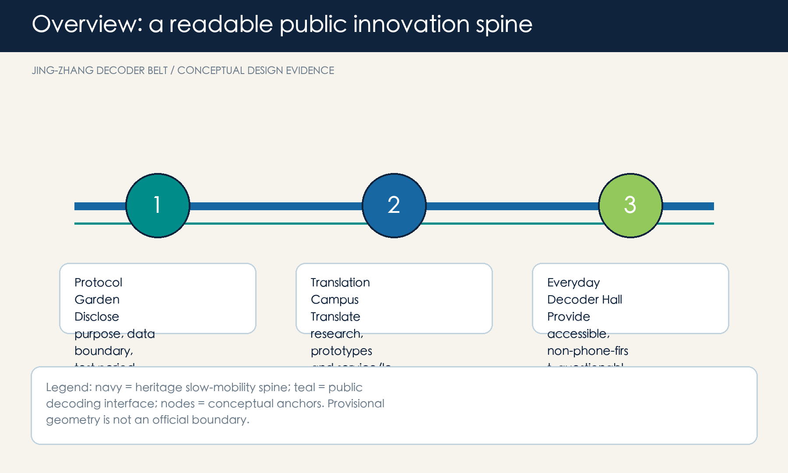

# JING-ZHANG DECODER BELT

## Design Basis and Source List

The Decoder Belt treats AI not as a showcase but as a public protocol: each scenario must disclose purpose and source, allow questions, provide human override, and leave a repair record. Every spatial move is a conceptual suggestion for professional deepening, not a planning approval, ownership finding, or engineering design [source:OFFICIAL-ANNOUNCEMENT] [source:AGENT-TASKBOOK]. The current site and key-area geometries are provisional constraints for generation, visualisation, and self-check only; they are not official boundaries or statutory area evidence [data:geometry/site_boundary.geojson#SITE-001] [source:BOUNDARY-SOURCE].

## Three-Level Scope Framework

The coordinated research area frames ecosystem and culture; the overall design area organises a heritage slow-mobility spine, three decoder yards and two service wings; the three key areas test the sequence disclose-test-explain-override-repair. Announced area figures define the assignment scale, while provisional geometry expresses only relative relationships [standard:PROJECT-OFFICIAL-ANNOUNCEMENT] [depth:three_level_scope_framework].

The spatial grammar is one spine, three yards, two wings and five actions. The heritage spine is paired with a Protocol Garden, Translation Campus and Everyday Decoder Hall, supported by a technology-service wing and a scenario-enablement wing [data:geometry/key_areas.geojson#PROV-KEY-001] [depth:overall_spatial_structure].

## Coordinated Research Area: Industry and Future City Research

The name and identity, JING-ZHANG DECODER BELT, draw on railway signalling and decoding: two parallel rails form JZ and five marks denote the five auditable actions. It is an original direction for wayfinding, events, scenario cards and contribution records, without copying existing institutional marks. Mila, Vector, AI Singapore, Seoul AI Hub and Helsinki are mechanism references: research-to-startup linkage, visible translation, staged proof-of-concept, anchor facilities, and transparent feedback interfaces [source:CASE-MILA] [source:CASE-VECTOR] [source:CASE-AISG].

## Overall Design Area: Urban Renewal and Regulatory-Plan-Level Urban Design

The overall move is interface-first rather than landmark-first. Along the heritage spine, removable explanation tables, human help points, accessible information and reversible display modules create an exchange surface between campus, park, enterprise and community. Land-use, building, road, green, public-space and phasing layers document only this conceptual arrangement; they do not set FAR, height, redlines or demolition decisions [standard:MOHURD-CONTROL-DETAILED-PLANNING] [data:geometry/land_use.geojson#LU-001] [depth:land_use_layout].

## Detailed Design of Key Areas

**Protocol Garden at Zhongzhiyuan** hosts public-facing safety, standards and low-carbon observation interfaces. **Translation Campus at the AI Origin Community** hosts readable research explanation, open-source publishing and human service clinics. **Everyday Decoder Hall at Dazhongsi** offers station-adjacent, accessible, non-phone-only help and services. All are conditional conceptual prototypes pending cleared traffic, ownership, municipal and heritage data [data:geometry/key_areas.geojson#PROV-KEY-001] [data:geometry/key_areas.geojson#PROV-KEY-002] [data:geometry/key_areas.geojson#PROV-KEY-003].

## AI Innovation Ecosystem, Personas, and AI+ Scenarios

Five personas are researchers, startup teams, translation-service workers, nearby residents including older people, and commuters/visitors. They receive equivalent human and non-digital routes; no scenario relies on individual tracking, inferred identity, or commercial recommendation [standard:BARRIER-FREE-ENVIRONMENT-LAW] [standard:ELDERLY-SMART-TECH-PLAN-2020-45]. Ten cards cover a protocol gate, visible red-team testing, low-carbon observation, translation lessons, open-source publishing, conversion clinic, question table, accessible wayfinding, slow-mobility explanation and a repair-receipt wall. Three are bounded test scenarios: safety assessment, aggregate environmental display, and professionally reviewed prototype conversion.

## Land Use, Building Scale, and Retain-Renovate-Demolish Strategy

Land-use polygons form a complete conceptual carrier structure. Building features identify interface-priority types only; they do not diagnose existing buildings, set ownership, decide retain/demolish, or define statutory intensity [standard:MNR-LAND-USE-CLASSIFICATION-GUIDE] [data:geometry/buildings.geojson#BLDG-001] [depth:retain_renovate_demolish].

## Transport, Rail, Municipal Infrastructure, and Public Services

The transport principle is people before prompts: continuous walking/cycling, rest and enquiry before transfer, non-phone human guidance, and reversible activity management. AI may summarise issues or prepare maintenance tasks, but cannot replace traffic control, fire-safety judgement or accessibility certification [data:geometry/roads.geojson#ROAD-001] [data:geometry/public_space.geojson#PUBLIC-001] [depth:municipal_new_infrastructure].

## Blue-Green Network, Public Space, and Urban Character

Low-impact, replaceable components along the heritage spine include rail-proportion seating, five-action wayfinding, contribution records and quiet question points. Three AI pilgrimage/honour-display prototypes are the Protocol Gate, Translation Bell and Repair Receipt Wall; none is an approved building or heritage conclusion [standard:MOHURD-URBAN-DESIGN-MEASURES] [data:geometry/green_space.geojson#GREEN-001] [depth:blue_green_public_space].

## Renewal Projects, Implementation Policy, and Phasing

Near term establishes low-risk events, cards and wayfinding; medium term deepens walking links and service interfaces after data and approvals; long term sustains a Decoder Week, developer open days, community question nights and scenario follow-ups. Each phase has pause/exit rules, a missing-data list and a public feedback route; no funding, ownership, engineering or approval promise is made [data:geometry/phasing.geojson#PHASE-001] [depth:phasing_implementation].

## Metrics, Area Recalculation, and Compliance Matrix

Known metrics are recalculated from submitted geometry: provisional site area, green ratio, public-space ratio, building footprint and key-area count. FAR, height, density, redlines, service radius and industrial outcomes remain pending official data. Five actions and ten scenario cards are design checks, not claimed deployments [metric:public_space_ratio] [metric:key_area_count] [depth:metrics_recalculation].

## Risk, Copyright, and Compliance

The risk register records provisional geometry, planning controls, transport, municipal, ownership, building and heritage gaps. Cleared official data triggers recalculation of every layer, metric, drawing and HTML page. External cases supply only openly published institutional mechanisms; no image, drawing, logo or text has been copied. AI-generated content must remain transparent, privacy-minimising, non-discriminatory, explainable and human-reviewed; public service must not be digital-only [standard:GENERATIVE-AI-INTERIM-MEASURES] [depth:risk_missing_data].

## References

- Official Haidian announcement, 2026-05-09; Agent Open Call Taskbook excerpt.
- Public pages of Mila, Vector Institute, AI Singapore, Seoul AI Hub and City of Helsinki, accessed 2026-08-10.
- Full provenance, limitations and machine evidence are in `sources.json`, the matrices and GeoJSON.
