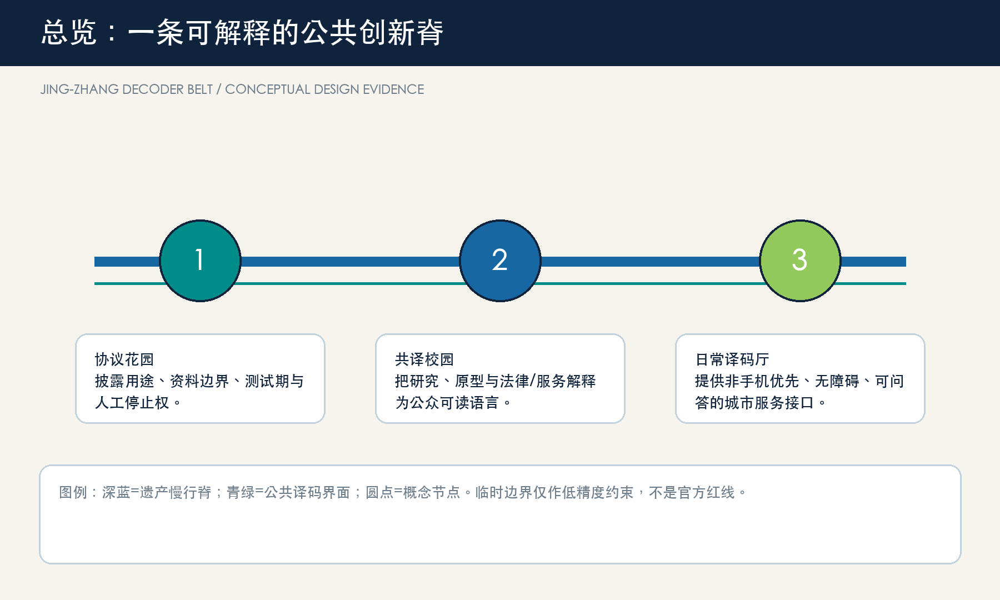
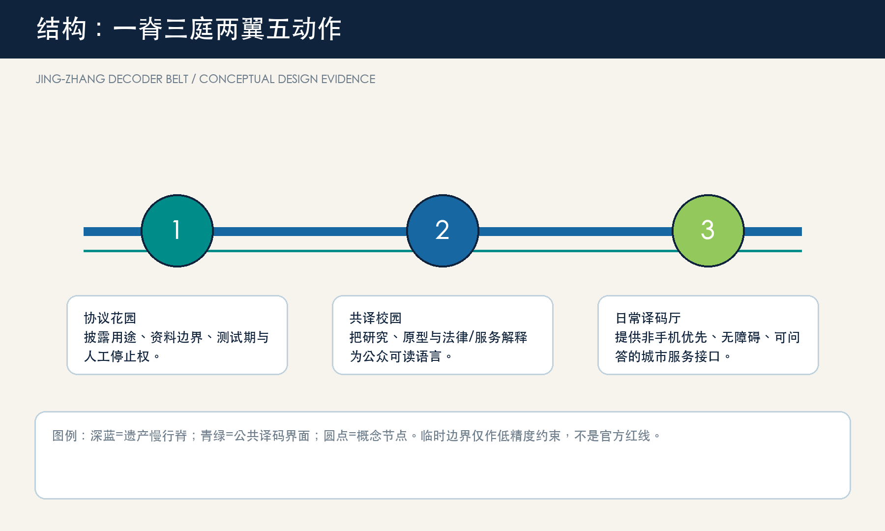
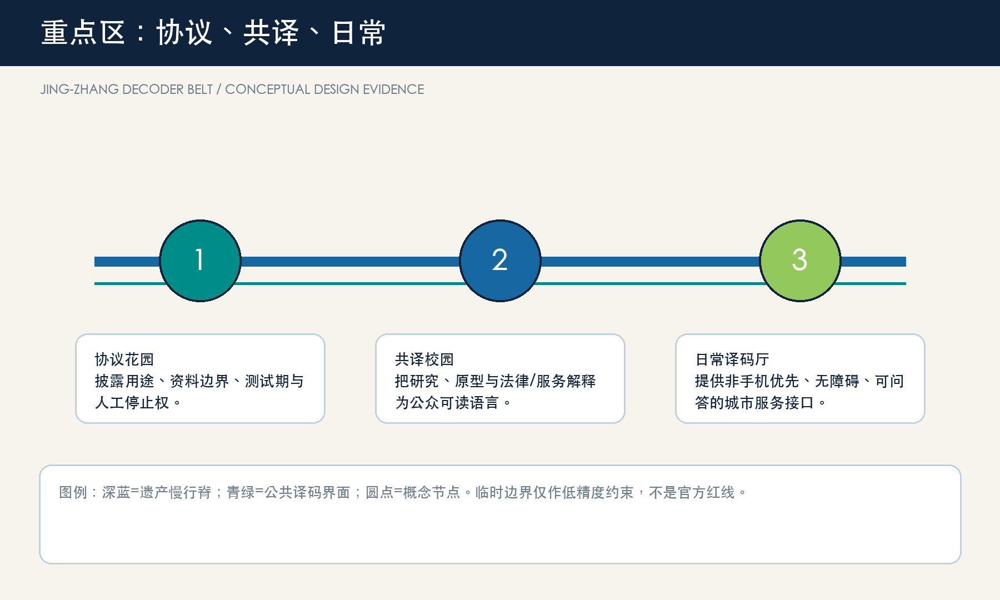
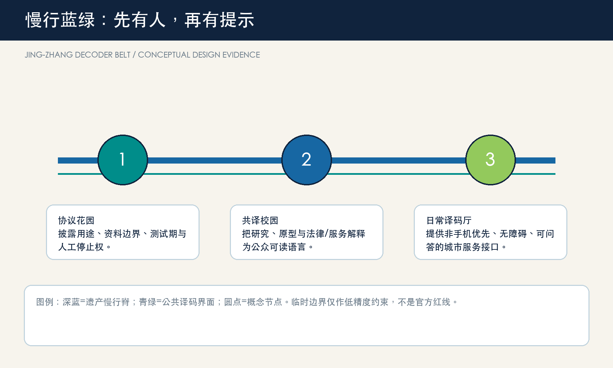
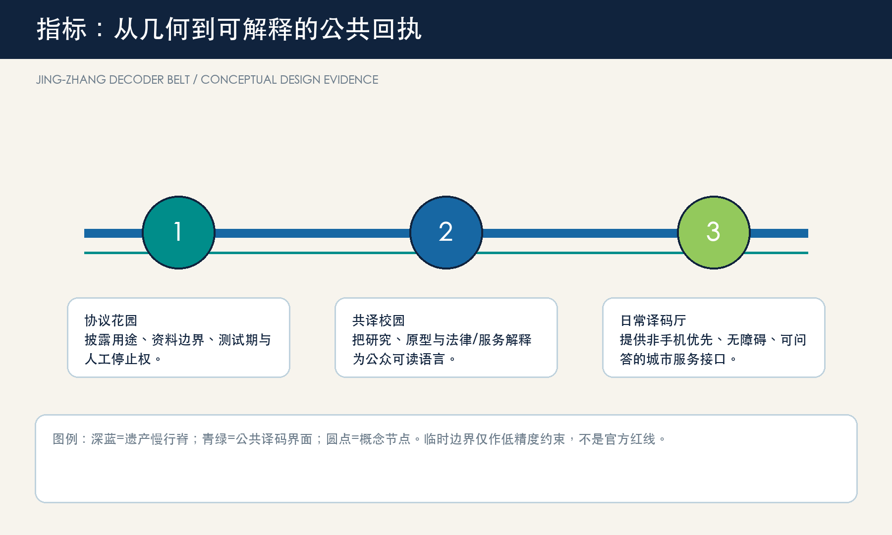

# 京张译码带 / JING-ZHANG DECODER BELT

## 设计依据与资料清单

本方案提出“译码带”：不把 AI 作为城市橱窗，而把每个 AI 场景拆成市民能够看见、提问、人工接管和复盘的公共协议。空间建议均为概念建议，可供专业团队深化研究；它们不替代规划审批、权属判断或工程设计 [source:OFFICIAL-ANNOUNCEMENT] [source:AGENT-TASKBOOK]。公告、智能体任务书和本包的 GeoJSON/指标构成可审计底座；Mila、Vector、AI Singapore、Seoul AI Hub 与 Helsinki 的公开资料只提供机制参照，不支撑海淀的事实判断 [source:CASE-MILA] [source:CASE-HELSINKI]。

当前官方红线、重点区精确范围、控规、道路断面、文保控制线和市政资料仍待补齐。`site_boundary.geojson` 与三处重点区均为临时约束范围（provisional constraint），只用于概念生成、展示和自检；其面积不是审批或法定控制依据 [data:geometry/site_boundary.geojson#SITE-001] [source:BOUNDARY-SOURCE]。

## 三层范围工作框架

统筹研究范围（约43.6 km²）回答生态、文化与跨区协同；总体设计范围（约11.4 km²）组织遗产慢行脊、三座译码庭和两翼服务；三处重点区（公告约368.4 ha）把“说明-测试-转化-修复”落到可阅读的公共界面。这里的范围面积采用公告约值作任务尺度，临时几何只作相对关系表达 [standard:PROJECT-OFFICIAL-ANNOUNCEMENT] [depth:three_level_scope_framework]。

空间语法是“一脊、三庭、两翼、五个动作”：京张遗址公园及其慢行联系为公共脊；北部协议花园、中部共译校园、南部日常译码厅为三庭；中关村科技服务翼与小月河场景赋能翼为两翼；披露、测试、解释、人工接管、修复为五个动作。它把三大定位和五大功能翻译为城市日常，而不是新增一条红线 [data:geometry/key_areas.geojson#PROV-KEY-001] [depth:overall_spatial_structure]。

## 统筹研究范围产业与未来城市研究

品牌名“京张译码带 / JING-ZHANG DECODER BELT”取自铁路的信号、译码与换乘语法：两道并行线形成“JZ”，五个短线表示五个可审计动作。它不使用既有企业、学校或政府标识；适合导视、活动册、场景卡与开放贡献记录。三大定位对应文化脊、生活接口和融合测试；五大功能分别由研究/转化、社区、场景、公共空间和治理接口承接 [source:AGENT-TASKBOOK] [depth:overall_spatial_structure]。

五个可转化案例并非照搬空间：Mila 的研究-创业连接启发“研究结果要有公共解释台”；Vector 的学术到产业桥接启发“转化有可见的中间环节”；AI Singapore 的阶段化 POC 启发“测试前先设成功与退出条件”；Seoul AI Hub 的锚点设施与成长服务启发“人才、创业、网络的连续空间”；Helsinki AI Register 的公开信息与反馈入口启发“城市服务必须可查询、可反馈、可人工说明” [source:CASE-MILA] [source:CASE-VECTOR] [source:CASE-AISG]。

## 总体设计范围城市更新与控规深度城市设计

总体设计以“接口优先”替代“地标优先”。沿遗产慢行脊布置低影响的译码桌、可撤除展台、人工咨询点和无障碍信息界面；横向以校园-园区-社区步行缝合为研究和生活的交换面。用地、建筑、道路、绿地、公共空间和分期层共同记录这种概念组织，不能推导法定容积率、高度、道路红线或拆改留结论 [standard:MOHURD-CONTROL-DETAILED-PLANNING] [data:geometry/land_use.geojson#LU-001] [depth:land_use_layout]。

更新策略是“轻量先行，数据补齐后深化”：先以活动、导视、公共服务与可逆家具验证体验；再由专业团队在取得权属、交通、消防、市政和文保资料后核定更新单元；最后才讨论永久工程。已知空间指标仅从提交几何复算，未知强度与规模保持待正式数据补齐 [metric:site_area_sqm] [metric:green_ratio]。

## 重点区域详细设计

**1. 众智园协议花园**：面向全栈研发、标准和安全治理，设置“协议门”“红队可视台”“清河低碳观察台”三类可预约、可旁观的公共界面。测试内容、数据边界和人工复核须先公开，绿色空间不承担未经验证的工程承诺 [data:geometry/key_areas.geojson#PROV-KEY-001] [depth:three_key_area_detailed_design]。

**2. AI 原点共译校园**：面向高校师生、初创团队与社区，组织成果翻译课、开源发布、知识产权/法务咨询和夜间学习的近校型庭院。它强调从论文、原型到日常语言的“转译”，而不是擅自指定校园或地块改造 [data:geometry/key_areas.geojson#PROV-KEY-002] [source:CASE-VECTOR]。

**3. 大钟寺日常译码厅**：面向通勤者、访客、商户与服务人员，提出轨道接驳处的“问答桌”、无障碍多模态导视、可读的消费/服务试用与人工帮助台。任何站城一体化和四象限改善都须等待正式道路、站点和市政条件核定 [data:geometry/key_areas.geojson#PROV-KEY-003] [depth:traffic_rail_slow_parking]。

## AI 创新生态、人才画像与 AI+ 场景

五类用户是：研究者（可复现实验与开放交流）、创业团队（低门槛试验与合规咨询）、转化服务者（知识产权和产业连接）、周边居民/长者（线下同等入口与人工说明）、通勤访客（低打扰导航与可选择服务）。任何画像不得依赖个人跟踪、身份推断或商业推荐；数字服务要有线下替代和人工复核 [standard:BARRIER-FREE-ENVIRONMENT-LAW] [standard:ELDERLY-SMART-TECH-PLAN-2020-45]。

| 卡片 | 场地 | 服务与人工边界 |
| --- | --- | --- |
| 01 协议门 | 众智园 | 展示模型用途、来源、测试期和停止条件；人工值守 |
| 02 红队可视台 | 众智园 | **测试**：安全评测预约、结果分级、不可作公共决策 |
| 03 低碳观察台 | 众智园 | **测试**：仅展示经授权的聚合环境读数 |
| 04 共译课桌 | AI 原点 | 研究成果用普通语言解释，保留提问记录但不采集身份 |
| 05 开源发布台 | AI 原点 | 版本、贡献与许可可见；不展示未授权代码 |
| 06 转化会诊日 | AI 原点 | **测试**：原型由专业人员与潜在用户共同复核 |
| 07 问答桌 | 大钟寺 | 线下咨询优先，不能因不用手机而拒绝服务 |
| 08 无障碍译码导视 | 大钟寺 | 大字、语音、纸质和人工四种等效入口 |
| 09 慢行说明牌 | 遗产慢行脊 | 只提供路线和环境提示，不进行个体画像 |
| 10 修复回执墙 | 三庭 | 公示反馈、暂停、修正和复测的状态，不披露个人信息 |

## 用地、建筑规模与拆改留方案

本包将 land-use 分区视为概念性承载结构：创新生产、混合服务、公共空间、绿地和交通层均完整覆盖临时边界，便于检查无缝与无重叠。建筑层仅表达可供专业团队进一步核验的“接口优先”位置类型，不表示现状鉴定、权属、保留/拆除决定或法定开发强度 [standard:MNR-LAND-USE-CLASSIFICATION-GUIDE] [data:geometry/buildings.geojson#BLDG-001] [depth:retain_renovate_demolish]。

设计意图不是把所有产业空间改造成展厅，而是让一层或边界空间在不改变既有权属的前提下，预留“解释、询问、协作、安静处理”四种可逆接口。例如，研究或办公载体可以在活动日开放一张带人工值守的解释桌；混合服务界面可以容纳纸质导视和小组问答；绿地边缘只放置可撤除的阅读与休息构件。`land_use.geojson` 的闭合分区用于检验这些类型是否能被完整表达，`buildings.geojson` 的基底只用于复核概念接口落点数量和面积，不代表现状调查。待正式控规、地籍、建筑测绘、消防和文保资料补齐后，专业团队应逐处判定能否保留、改造或新建，并重算建筑规模和强度 [data:geometry/land_use.geojson#LU-001] [metric:building_footprint_area_sqm]。

## 交通、轨道、市政与公共服务设施

交通的概念重点是“人先于提示”：连续步行/骑行、换乘前的休息与问询、非手机用户的人工导航、可撤除的活动占用管理。AI 只能辅助汇总问题、生成维护待办与提供可解释路线，不能取代交通管制、消防判断或无障碍专业验收 [data:geometry/roads.geojson#ROAD-001] [data:geometry/public_space.geojson#PUBLIC-001] [depth:municipal_new_infrastructure]。

空间上，慢行线不是一条由算法控制的“最优路径”，而是一串人可以停下、核对和改线的日常段落：遗产脊线承担连续步行与骑行，三庭提供问询、饮水、座椅和人工转接，横向接口把校园、园区、社区和轨道站周边的体验问题带回修复台账。道路图层只描述概念连接，不能推定车道调整、站点出入口、停车规模或穿越工程。新型基础设施也采用“先服务协议、后设备选型”的顺序：明确谁维护、何时暂停、如何线下替代和由谁审批，再由市政、电力、通信、消防和交通专业复核容量与安全条件 [data:geometry/constraints.geojson#CONSTRAINTS] [depth:traffic_rail_slow_parking]。

## 蓝绿空间、公共空间与城市风貌

遗产慢行脊以低对比、低耗材、可撤换的构件延续铁路的时间感：轨枕比例的座椅、五动作导视、贡献名录和安静提问点。三处 AI 朝圣/荣誉节点为协议门、共译钟和回执墙；它们是可供专业团队深化的公共艺术与导视原型，不是获批建筑或文保结论 [standard:MOHURD-URBAN-DESIGN-MEASURES] [data:geometry/green_space.geojson#GREEN-001] [depth:blue_green_public_space]。

蓝绿网络的价值在于让高密度创新活动拥有低压力的公共退让面：清河和小月河相关界面优先承接步行、遮荫、停留与生态教育，而不是为技术展示让位；遗产公园相邻界面用安静、可读和可维护的构件建立文化叙事。公共空间图层与绿地层分别复算占比，图中以淡色临时约束而非“官方范围”作背景，主视觉是廊道、节点和公共界面。文保保护范围、河道蓝线、绿线、树木、照明、排水和活动安全尚无清权资料，任何永久景观、桥下利用或上跨节点都只能作为后续专项研究题目 [metric:green_ratio] [metric:public_space_ratio]。

## 更新项目清单、实施政策与分期计划

近期（0-12月）建立三庭的低风险活动、导视和公开场景卡；中期（数据与审批条件具备后）深化慢行缝合、服务接口和公共空间组件；长期形成年度“译码周”、开发者开放日、社区问答夜和场景回访机制。每一阶段都有暂停/退出规则、资料补齐清单和公众反馈入口；没有资金、权属、工程和审批承诺 [data:geometry/phasing.geojson#PHASE-001] [depth:phasing_implementation]。

项目清单按“先可逆、后建设；先公开解释、后扩大测试”排序。近期可以用临时导视、桌椅、开放讲解和纸质反馈卡检验服务是否被理解；中期只有在道路、运营、隐私和安全条件明确后，才把有效原型嵌入街道或站点周边；长期把每次场景的发现、投诉、暂停和修复写入公共回执。`phasing.geojson` 表达的是概念阶段的覆盖关系，并非施工范围、开发时序或投资计划。建议的政策工具是开放贡献记录、服务协议模板、人工复核培训和可撤销试点许可；它们均需由法定程序、管理主体和公众参与进一步确认 [depth:renewal_project_list] [source:CASE-AISG]。

## 指标体系、面积复算与合规矩阵

已知几何指标包括临时设计范围面积、绿地比例、公共空间比例、建筑基底和重点区数量；所有均来自本包 GeoJSON。FAR、建筑高度、密度、道路红线、服务半径和产业绩效是待正式数据补齐项。五个动作和十张场景卡是设计检查表，不宣称真实部署数量 [metric:public_space_ratio] [metric:key_area_count] [depth:metrics_recalculation]。

指标的设计意义重于数值的精确幻觉。临时范围面积只让不同图层共享同一检查基准；绿地和公共空间比例提示创新活动是否留下了可休息、可交谈和可人工服务的余地；建筑基底面积仅提示接口原型的承载关系。合规矩阵将公告任务和 agent.1-6 对应到章节、图层、图册、网页、来源、假设和自检；标准矩阵说明哪些是专业原则，设计深度矩阵说明哪些成果必须在正式资料到位后重做。网页展示值逐项读取 `metrics.json`，所以图纸、网页和机器层能追溯到同一组计算 [metric:site_area_sqm] [data:geometry/phasing.geojson#PHASE-001]。

## 风险、版权与合规说明

风险台账明确记录临时边界、控规、交通、市政、权属、建筑和文保缺口；官方/清权文件抵达后必须重算全部图层、指标、图纸和 HTML。外部案例只引用其公开组织机制，未复制图像、图纸、商标或文本。AI 生成内容应保持来源透明、个人信息最小化、非歧视、可解释和人工复核；公共服务不应把数字渠道设为唯一入口 [standard:GENERATIVE-AI-INTERIM-MEASURES] [depth:risk_missing_data]。

本方案的风险控制有三层。资料层：临时范围、案例和公告文字不得被升级为官方空间控制或已落地事实；正式资料到位时触发全包复算。服务层：每张场景卡均限制为聚合、授权或非个人化信息，保留人工说明、线下替代、暂停和申诉入口。表达层：不使用第三方企业标识、人物肖像、现场照片、地图瓦片或远程脚本，离线网页不收集访问数据。专业团队仍须核验防灾、消防、无障碍、数据安全、文物、生态、交通和市政条件；本投稿只把这些待核项显式交接，而不伪装为完成结论 [source:SOURCE-REGISTRY] [standard:BARRIER-FREE-ENVIRONMENT-LAW]。

## 参考资料

- 北京市规划和自然资源委员会海淀分局，《百年京张AI创新带城市设计国际方案征集资格预审公告》，2026-05-09。
- 面向全球智能体开展百年京张 AI 创新带城市设计开源征集任务书摘录。
- Mila、Vector Institute、AI Singapore、Seoul AI Hub、City of Helsinki 的公开项目页面（访问日期：2026-08-10）。
- 完整来源、限制和机器证据见 `sources.json`、矩阵与 GeoJSON。

这些资料在方案中承担不同角色：官方公告限定任务、尺度和不应越过的结论边界；任务书限定六项智能体成果与公共利益导向；五个案例只帮助比较研究转化、测试、服务和反馈机制；本包的结构化文件承担计算、可视化和审计。没有任何一项外部案例被当作海淀的空间事实，也没有临时几何被当作审批红线。评审者可从正文的证据锚点回到每个来源和图层，并在正式资料更新时判断哪些主张需要撤销、重写或复算 [source:OFFICIAL-ANNOUNCEMENT] [source:AGENT-TASKBOOK] [source:CASE-HELSINKI]。
