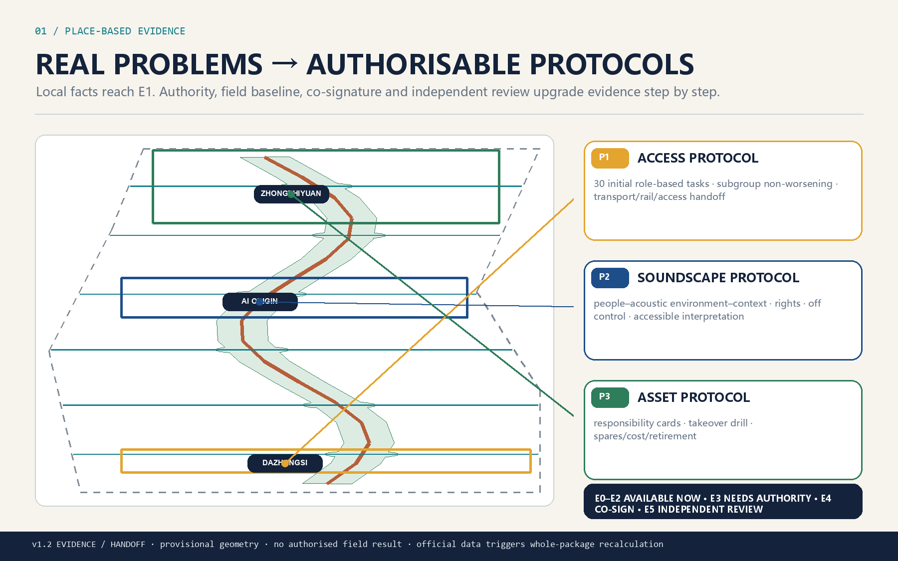
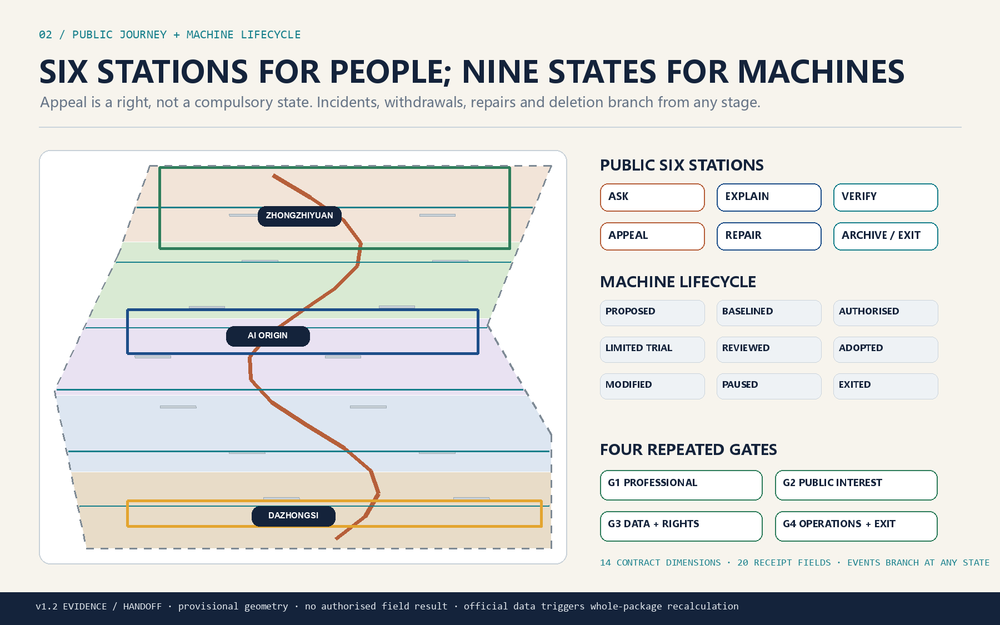
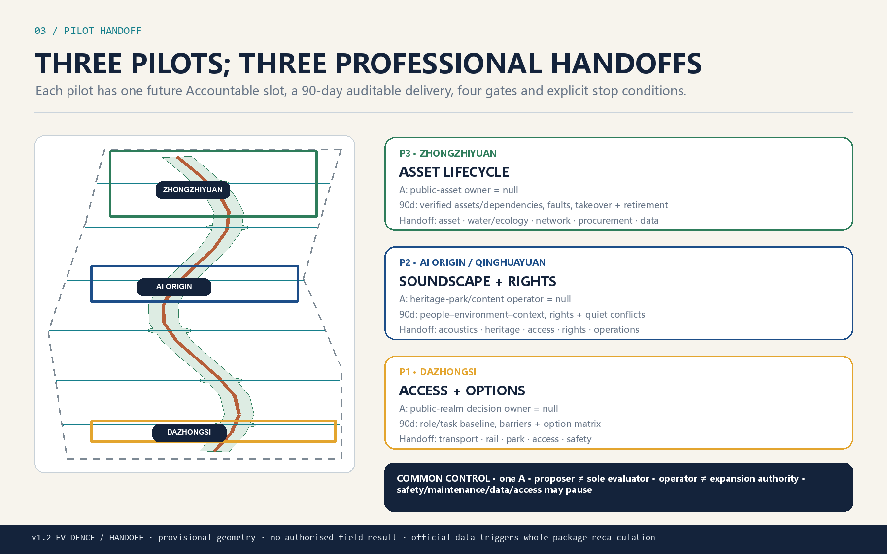
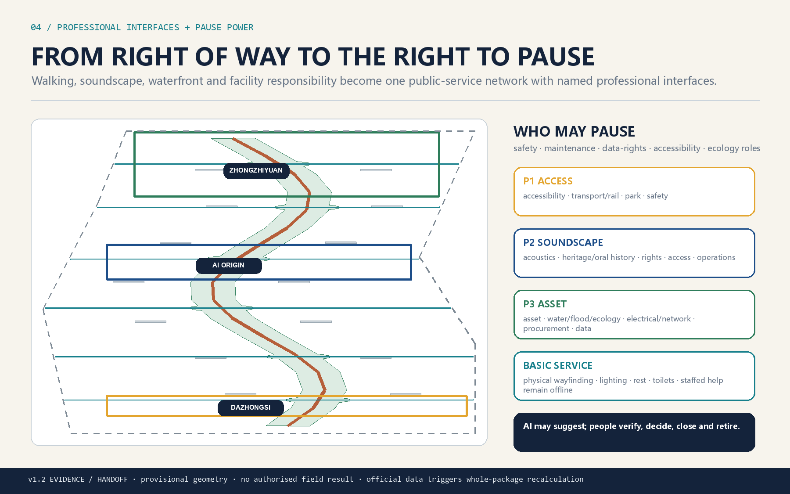
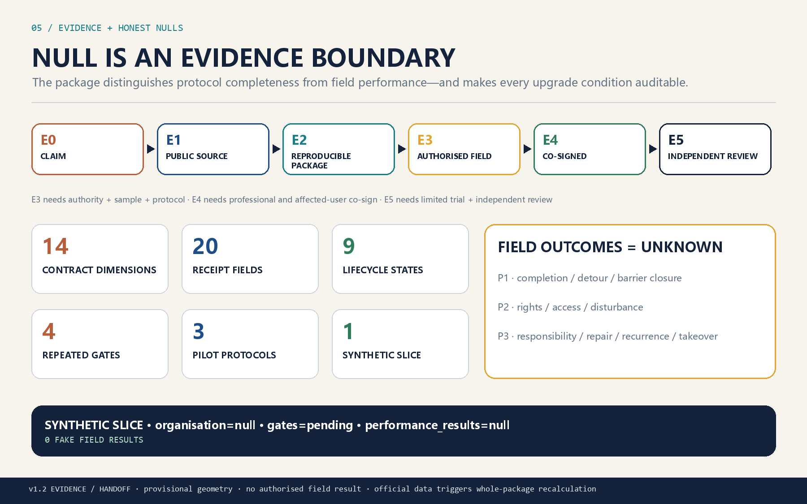

# THE LISTENING LINE v1.2

**Evidence and professional-handoff edition 1.2.0: it adds no unverified “big concept”; it brings three pilots to the minimum depth needed for authorisation, sampling, sign-off, pause and handoff.**

> **The city does not need more AI that talks. It needs public infrastructure through which place, people and system failures can be heard—and through which responses become repairs.**

“Listening” does not mean filling a park with microphones or adding another technology-display theme. It has three layers: **listen to place**—rail, bells, water, trees and everyday encounters; **listen to people**—residents, commuters, maintainers, developers and visitors; and **listen to systems**—errors, human takeover, repair and retirement of AI, robots, wayfinding, lighting and public facilities. Listening Contract 1.2 and Listening Receipt 1.2 connect them: the former is a 14-dimension public admission checklist; the latter is the authority, evidence, human-decision, operations and exit record left by every bounded run.

Version 1.2 retains “one line, three rooms, six stations and two wings” while adding an E0–E5 evidence ladder, four common gates, three professional baseline protocols, role separation and one reproducible synthetic receipt with `performance_results=null`. It has no field authorisation, real sample or implemented performance; the Accountable organisation for P1, P2 and P3 remains `null`. That is an honest professional starting point.[assumption:A-AUTHORIZATION-001] [assumption:A-BASELINE-001] Every spatial move remains an open co-creation proposal and reference for professional teams—not statutory planning, engineering feasibility, government approval, funding or implementation commitment.

## Design Basis and Source List

The official open-call notice and the cleared Agent taskbook are the first design basis. The notice defines three working scales, three key areas and the industry–space–talent objectives; the taskbook adds the three positionings, five functions, Three Zones and Two Wings, and six Agent assignments.[source:OFFICIAL-ANNOUNCEMENT] [source:AGENT-TASKBOOK] [source:SITE-PACKAGE] [source:SOURCE-REGISTRY] [source:PROCESSED-FACT-PACK] [standard:PROJECT-OFFICIAL-ANNOUNCEMENT] [standard:PROJECT-AGENT-OPEN-CALL-TASKBOOK] [standard:MOHURD-CONTROL-DETAILED-PLANNING] [standard:MOHURD-ARCH-DESIGN-DEPTH-2016]

This iteration treats verified local facts as problem anchors, never as planning boundaries. Public information on Phase I of Jing-Zhang Railway Heritage Park confirms an open section from Qinghua East Road to Zhichun Road, the retained Qinghuayuan Station, rails, switches and rolling-stock elements, and an existing train-sound installation. The proposal therefore does not invent another AI train-sound gadget; it prioritizes content, access, quiet periods and maintenance.[source:LOCAL-JZRHP-PHASE1] Public updates repeatedly frame the broader park as an approximately nine-kilometre north–south link with east–west stitching. A 2026 background report also lists AI sentries, cleaning and patrol robots, sports training and information facilities already operating in the park. The real challenge is now accountability, explanation, maintenance and retirement—not the absence of AI.[source:LOCAL-JZRHP-PHASE2] [source:LOCAL-JZRHP-AI-SHOWROOM]

An official reply from Haidian’s landscaping authority confirms that Line 13 creates a genuine access barrier between Zhichun Road and Dazhongsi and describes existing entrance and coordination work. This proposal uses that evidence only to justify a route audit and temporary wayfinding; it does not predetermine a bridge or tunnel.[source:LOCAL-LINE13-RESPONSE] An official AI Origin Community page reports over 30 universities and institutes, more than 1,000 AI scientists, 13,000 developers and 100,000 related students in the surrounding area. These figures support a campus–park–community translation interface, but remain background context and do not determine land or capacity.[source:LOCAL-AI-ORIGIN]

Public information on the Qinghe and Xiaoyue River projects supports the direction of water–green connectivity, paths and amenities. The Yongle Bell and bell-culture exhibitions at Dazhongsi Ancient Bell Museum provide a genuine southern cultural anchor. GB 3096—2008 is cited only as a methodological boundary for later acoustic survey and management; the competent authority and professional team must confirm the applicable functional zone and limits.[source:LOCAL-WATERFRONT] [source:LOCAL-DAZHONGSI-BELL] [source:STANDARD-GB3096]

This edition adds four method boundaries. The Accessibility Environment Construction Law supports involving disabled and older users in audit and review but does not replace project accessibility design or approval. The Personal Information Protection Law frames specific purpose, minimum scope, notice, withdrawal, deletion and human explanation/refusal around automated decisions; a real pilot still needs legal review and any required impact assessment. The national urban-health-check guidance offers a reference loop of resident problem register, professional diagnosis, treatment proposal and annual follow-up. Official overviews of ISO/TS 12913-2 and ISO 55001:2024 support only the people–acoustic environment–context and performance–risk–expenditure–lifecycle interfaces; no conformity or certification is claimed.[source:LAW-ACCESSIBILITY-2023] [source:LAW-PIPL-2021] [source:MOHURD-URBAN-HEALTH-2023] [source:ISO-12913-2] [source:ISO-55001-2024]

The submission geometry remains the repository’s rough provisional geometry.[source:BOUNDARY-SOURCE] [source:KEY-AREA-SOURCE] Every relevant feature retains `official_boundary=false`, `geometry_role=provisional_constraint` and `boundary_precision=provisional_rough`.[data:geometry/site_boundary.geojson#SITE-001] [data:geometry/key_areas.geojson#PROV-KEY-001] It supports concept generation, package topology and display only—not an official planning boundary, parcel, title or approval basis.[assumption:A-BOUNDARY-001] Official regulatory controls, parcels, buildings, road boundaries, station entrances, heritage controls, blue lines, municipal capacity and an acoustic baseline remain unavailable.[assumption:A-CONTROLS-001] [assumption:A-BUILDING-001] [assumption:A-HERITAGE-001] [assumption:A-TRANSPORT-001] [assumption:A-ACOUSTIC-001] This completes [depth:existing_conditions_diagnosis]. When official CAD/GIS arrives, all nine GeoJSON layers, metrics, five figures, HTML and PDFs must be regenerated as a single evidence chain.

## Three-Level Scope Framework

The three scales form one “**listen—respond—verify—write back**” workflow rather than three levels of precision collapsed into one masterplan. The approximately 43.6 km² Coordinated Research Area asks how global mechanisms, Haidian innovation resources and local problems become public missions. The approximately 11.4 km² Overall Design Area asks how the listening line, east–west stitching, blue-green space and public services become continuous. The three Key-Area Detailed Design Areas test prototypes through explicit roles, interfaces, operators and stop conditions.[depth:three_level_scope_framework] [depth:overall_spatial_structure] [data:geometry/constraints.geojson#CONSTRAINT-METADATA] [metric:site_area_sqm] [metric:key_area_count]

The identity remains “**one line, three rooms, six stations and two wings**.” The line follows Jing-Zhang Railway Heritage Park. The three rooms are Zhongzhiyuan’s Verification Room, Beijing AI Origin Community’s Translation Room and Dazhongsi’s Response Room. The six stations are **ASK—EXPLAIN—VERIFY—APPEAL—REPAIR—ARCHIVE/EXIT**. The two wings are the Zhongguancun Technology Services Wing and Xiaoyue River Scenario Enablement Wing.[data:geometry/public_space.geojson#PUBLIC-001] [data:geometry/roads.geojson#ROAD-001] The six stations are a public journey and spatial language, not a forced linear machine state: a person may appeal or not, while incidents, withdrawals, repairs and data deletion can branch from any stage.

All scales share three listening tracks. The place track records verifiable narratives of rail, bells, water, trees and daily life. The civic track records voluntarily submitted problems, accountable responses, appeals and repairs. The system track records model and device versions, failures, human takeover, work orders and retirement. Strategic rules become site interfaces; pilots return results to the public knowledge base. This converts the Centennial Jing-Zhang Cultural Belt, Metropolitan AI Life Experience Belt and AI Integrated Innovation Belt from parallel slogans into one accountable learning loop.

## Coordinated Research Area: Industry and Future City Research

### A city-scale product specification for listening

A leading AI district should not compete only on model, screen and robot counts. It should compete on how quickly public problems become safe experiments, errors become repairs, exits leave reusable knowledge and basic non-AI services remain available. The Listening Line therefore contributes two open specifications. **Listening Contract 1.2** is a 14-dimension public checklist covering purpose, place/users, trigger, minimum data, notice/choice, retention/deletion, system limits, human ownership, explanation, appeal, repair, non-AI route, public value and stop/rollback.[metric:listening_contract_required_field_count] It applies to robots and agents as well as sound installations, lighting, wayfinding and ordinary work orders.

**Listening Receipt 1.2** packages one bounded run in 20 required top-level fields:[metric:listening_receipt_required_field_count] unique receipt/scenario ID, evidence level, problem/public interest, GeoJSON and precision, authority/permits, system version/hash/allowed and forbidden actions, data and rights, four human sign-offs, service window/on-call/maintenance/spares/cost status, baseline/sample/results/uncertainty, professional handoff, lifecycle, event stream and timestamps. The schema is `visual/assets/listening-receipt.schema.json`. `minimum-reproducible-slice.json` is a synthetic, non-operational P3 example with organisation `null`, four gates `pending` and performance `null`; it proves only that the format and handoff chain are reproducible.[metric:reproducible_slice_count] [assumption:A-BASELINE-001]

Evidence upgrades from **E0 proposal claim, E1 public source, E2 package recomputation/synthetic reproduction, E3 protocol field observation, E4 professional-and-affected-user co-signature, to E5 limited pilot with independent review**.[metric:evidence_level_count] No authority, sample, method or signature means no upgrade. Four common gates are **G1 professional feasibility/safety, G2 public interest/inclusion, G3 data/privacy/content rights, and G4 operations/cost/exit**.[metric:professional_gate_count] One pilot has one legally authorised Accountable organisation; the proposer cannot evaluate alone; the operator cannot approve expansion alone; safety, maintenance, data and accessibility roles may pause. The role matrix is `visual/assets/pilot-operations-matrix.json`.[assumption:A-AUTHORIZATION-001] [assumption:A-PROFESSIONAL-HANDOFF-001]

The machine lifecycle is `PROPOSED → BASELINED → AUTHORISED → LIMITED_TRIAL → REVIEWED → ADOPTED / MODIFIED / PAUSED / EXITED`.[metric:listening_receipt_lifecycle_state_count] Appeals, incidents, withdrawals, repairs and data deletion are event branches rather than compulsory sequential states. No high-impact scenario enters real public space without a named Accountable organisation, non-AI route, negative-result reporting, pause authority and exit record.[assumption:A-OPERATIONS-001]

Six global references provide mechanisms only. one-north suggests coexistence of work, life, learning and experimentation [source:CASE-JTC-ONE-NORTH]; Kalasatama suggests resident-led small pilots [source:CASE-HELSINKI-KALASATAMA]; Paris-Saclay suggests a network of universities, laboratories, enterprises and public spaces [source:CASE-PARIS-SACLAY]; Mila suggests colocating open research, entrepreneurship and responsible AI [source:CASE-MILA-MONTREAL]; Barcelona 22@ suggests long-term urban renewal with public evaluation [source:CASE-BARCELONA-22]; Toronto Quayside shows why public interest and governance must precede digital convenience [source:CASE-TORONTO-QUAYSIDE]. Jing-Zhang translates these into problem access, contract admission, controlled testing, public review, adoption or exit, and knowledge write-back. It does not copy their form or fabricate companies, investment, output or policy.

The ecosystem connects eight auditable interfaces: land and space provide reversible carriers; industry and finance support time-limited trials without receiving default data rights; universities and talent provide problems, prototypes and peer review; compute and models disclose versions and limits; data are minimized by purpose; scenarios are closed jointly by real users and frontline operators; the Zhongguancun Technology Services Wing contributes legal, standards, IP, capital and international interfaces; the Xiaoyue River Scenario Enablement Wing contributes waterfront, community, exercise, care and maintenance problems. The future city is expressed through open ground floors, quiet work, shared tables, removable service bands, physical wayfinding and staffed windows—not permanent megastructures.[standard:MOHURD-URBAN-DESIGN-MEASURES]

The Chinese identity is “听见京张” and the English identity is **THE LISTENING LINE**. Two railway lines form an open ear; a deliberate break signifies the right to exit. Copper references railway memory, water cyan references explanation and the two rivers, repair green references civic action, and deep blue references accountable human judgment. Any formal adoption requires trademark, font and accessibility review.

## Overall Design Area: Urban Renewal and Regulatory-Plan-Level Urban Design

The overall structure is “**one line in three segments, six stitching relations, five interface types and three site-specific pilots**.” The southern segment connects Dazhongsi culture and daily services; the middle segment connects Qinghuayuan Station, neighbourhoods and AI Origin; the northern segment connects Qinghe and Zhongzhiyuan. Six east–west relations indicate where walkability should be investigated first; they do not prescribe bridges, tunnels, openings or road works.[data:geometry/roads.geojson#ROAD-001] [metric:road_length_m] [assumption:A-TRANSPORT-001]

Five conceptual land-use collaboration bands cover the provisional boundary without overlap: international exchange/industry services, talent life, open education, R&D testing and ecological public activity.[data:geometry/land_use.geojson#LU-001] [metric:land_use_area_total_sqm] They discuss functional relationships and are not statutory land use.[depth:land_use_layout] Floor Area Ratio, total floor area and building height remain unknown.[metric:floor_area_ratio] [metric:total_floor_area_sqm] [metric:building_height_m] [depth:development_intensity_controls]

Renewal follows “**secure authority—run a 90-day baseline—operate a bounded reversible trial—review independently—adopt, modify, pause or exit**.” The 90 days start only after legal authority and initial G1–G4 admission, so waiting for permission is not counted as field evidence. Spatial action opens ground floors, residual space, forecourts and movable furniture first; repairs lighting, shade, rest, accessibility and wayfinding second; and discusses building additions only later. Conceptual envelopes demonstrate adaptable capacity, not surveyed buildings or parcel decisions.[data:geometry/buildings.geojson#BLDG-001] [metric:building_footprint_area_sqm] [depth:retain_renovate_demolish] Age, structure, title, heritage, fire safety, energy, accessibility and occupancy must be investigated before any retain, renovate or demolish judgment.[assumption:A-BUILDING-001]

Five conceptual sections give professional teams clear hand-off interfaces: Qinghuayuan Station links heritage, rail artefacts, quiet seating, the existing sound installation and staffed interpretation; AI Origin links campus, open ground floor, translation table, street and park; the Zhichun Road–Dazhongsi section links neighbourhoods, the Line 13 barrier, access audit, temporary wayfinding and existing/to-be-coordinated entrances; Qinghe/Xiaoyue links water, ecological buffer, path, facility responsibility cards and quiet residential edges; Dazhongsi links four-quadrant walking, staffed service, bell-culture interpretation and metro access. These are relational sections, not dimensions or engineering designs.[depth:height_massing_character]

## Detailed Design of Key Areas

### Zhongzhiyuan Verification Room: listen to system failure

Zhongzhiyuan supports full-stack independent AI innovation and safety governance through a contract desk, enclosed/low-speed test yard, public observation edge, human emergency stop and failure archive. Models, robots and edge devices begin with synthetic or licensed data and isolated space. They may request limited real-world access only after accountable human ownership, physical boundaries, incident logging, offline behaviour, a non-AI route and retirement plan are complete.[data:geometry/key_areas.geojson#PROV-KEY-001] The entire district is never treated as a laboratory, and machines never receive default pedestrian priority.

Pilot P3, the **Equipment and Waterfront Maintenance Commons**, begins not with a new device but with an ownership-verified asset–dependency–responsibility register: purpose, place, model/version, energy/network/data, offline behaviour, criticality, faults/recurrence, maintenance/spares, noise/ecology/access constraints, cost status, retirement and data deletion. AI may suggest duplicate work orders only after critical-asset cards are complete and human-takeover/offline basic-service drills pass; people verify and close each order.[metric:p3_accountability_card_completeness_ratio] [metric:p3_median_repair_time_hours] [metric:p3_repeat_fault_ratio] [metric:p3_human_takeover_drill_pass_ratio] The method and handoff are in `visual/assets/p3-asset-lifecycle-protocol.json`. All results are unknown: media coverage is not an asset register.[source:LOCAL-WATERFRONT] [source:ISO-55001-2024] [assumption:A-PILOT-003] [assumption:A-BASELINE-001]

### Beijing AI Origin Translation Room: listen to different people

AI Origin combines an outcome explanation desk, human-review table, community problem clinic, developer living room, and paired quiet/open interfaces. The published concentration of institutions and talent supports this campus–park–community interface, but feedback cannot become hidden capability, loyalty or emotion profiling.[source:LOCAL-AI-ORIGIN] [data:geometry/key_areas.geojson#PROV-KEY-002]

The Translation Room stewards the Listening Contract template, bilingual model cards and public closure records. Residents, disabled users, students, frontline operators and developers participate at admission, mid-term and closure. An accountable professional signs disputed decisions; majority voting does not automatically resolve high-impact matters. Low-disturbance ground-floor reuse, shared booking, and paper/phone/in-person/digital entry avoid presuming that universities, parks or owners have already approved an intervention.[assumption:A-PRIVACY-001]

### Dazhongsi Response Room: listen to movement and local culture

Dazhongsi connects international exchange, daily commerce, rail commuting and bell culture. The Yongle Bell and the museum’s bell-culture exhibitions provide a real “listen to place” anchor, but the proposal does not copy the artefact or create an electronic bell landmark. Public interfaces use multilingual interpretation, tactile wayfinding, staffed service and low-disturbance night activity.[source:LOCAL-DAZHONGSI-BELL] [data:geometry/key_areas.geojson#PROV-KEY-003]

Pilot P1 is the **Line 13 Zhichun Road–Dazhongsi Access Audit**. A published concern is the E1 anchor; it does not preselect a bridge. Wheelchair/mobility-aid users, older people, caregivers with strollers, low-vision/night users and cyclists undertake an initial minimum of 30 accompanied tasks across weekday peak/off-peak and a weekend including darkness. This is problem-discovery and role comparison, not a prevalence estimate. The audit records completion, extra distance/time, crossings, rest, help, night legibility and verified barriers, while continuous personal traces are not retained by default.[metric:p1_non_smartphone_task_completion_ratio] [metric:p1_median_detour_burden] [metric:p1_verified_barrier_closure_ratio] The protocol is `visual/assets/p1-access-audit-protocol.json`.[source:LAW-ACCESSIBILITY-2023] [source:MOHURD-URBAN-HEALTH-2023]

P1 compares do-nothing, maintenance, wayfinding, entrance and engineering-study options before drawing an engineering object. Permanent research can advance only with official entrances, boundary, levels, passenger flow, fire and road data; transport, rail, park, accessibility and safety gates; a non-smartphone path that is no worse; and no sampled group made less safe or accessible. Otherwise it retains low-risk repairs and exits the engineering narrative. Accountable organisation, authority and results remain unconfirmed.[source:LOCAL-LINE13-RESPONSE] [assumption:A-PILOT-001] [assumption:A-AUTHORIZATION-001]

The three provisional key-area geometries serve package consistency only and do not replace announced areas or official polygons.[metric:key_area_count] [depth:three_key_area_detailed_design] All three rooms share one contract, open calendar and failure archive. Problems move north for verification; results return south to daily life; rules are written back along the entire line.

## AI Innovation Ecosystem, Personas, and AI+ Scenarios

Six design roles are used: researchers/open-source developers; start-ups and SMEs; enterprise engineers/operators; residents/caregivers/older people; disabled commuters; and international visitors.[metric:persona_count] They test service coverage and are not persistent user profiles. Everyone must be able to obtain basic wayfinding, rest, help and appeal without registration, continuous location or biometric data.

Twelve scenario cards remain, now all bound to the Listening Contract.[metric:scenario_count] The first four are industry testing and validation scenarios.[metric:industry_test_scenario_count]

| ID | Scenario and place | Minimum data / human owner | Public value and exit |
| --- | --- | --- | --- |
| 01* | Public model failure and bias evaluation / Zhongzhiyuan | Synthetic or licensed set; evaluation lead | Reproducible failure; no public release if unexplained |
| 02* | Low-speed accessible robot sandbox / Zhongzhiyuan | Device state and incident log; safety officer and physical stop | No default pedestrian priority; stop after incident or takeover failure |
| 03* | Edge privacy, energy and offline benchmark / Zhongzhiyuan | Aggregates; device maintainer | Basic service works offline; no admission without retirement plan |
| 04* | Multilingual public-service agent red team / Dazhongsi | Volunteer questions; staffed service | Explanation and handover; high-impact error removes service |
| 05 | Line 13 accompanied access audit / south segment | Voluntary route issues; transport/landscape contact | Verified detours and access barriers; no continuous tracking |
| 06 | Qinghuayuan soundscape and oral-history co-curation / middle segment | Licensed clips/transcripts; human curator | Revocable provenance, reuse of existing installation, disputed history rechecked |
| 07 | Accessible walking companion / whole line | User-triggered position; staffed help | Task completion and physical wayfinding; position deleted immediately |
| 08 | Public rule and legal-entry explainer / AI Origin | Public rules; lawyer/social worker/window | Explains entry, never legal judgment; complex cases to people |
| 09 | Community health-service navigation / community nodes | User-entered need; health/service staff | No diagnosis; sensitive information excluded from public layer |
| 10 | Open learning and mentor translation / AI Origin | User-entered profile; programme host | View/delete rights; no hidden ability ranking |
| 11 | Waterfront and AI-device maintenance commons / Qinghe, Xiaoyue | Facility state and work orders; frontline maintainer | Repair time and recurrence; retire if unmaintained or disturbing |
| 12 | International Listening Week and Contribution Echo Wall / Dazhongsi–line | Public agenda and licensed contribution; curator/operator | Accountable follow-up; no traffic metric as adoption proxy |

`*` indicates an industry validation scenario. All 12 require human review, non-AI fallback and stop/rollback. These are admission-rule coverage ratios, not operational performance.[metric:human_review_coverage_ratio] [metric:non_ai_fallback_coverage_ratio] [metric:stop_condition_coverage_ratio]

Pilot P2, the **Qinghuayuan Place-Soundscape and Oral-History Upgrade**, uses Phase I’s retained station, rail, switches, rolling stock and sound installation only after checking their condition. Its baseline separately records people, acoustic environment and context across an initial eight staffed weekday/weekend, morning/day/evening windows. Residents, railway workers/historians, students, visitors, Deaf or hard-of-hearing participants and maintainers record place comprehension, appropriateness/pleasantness, forced exposure, quiet conflict and preferred channel. Professional acoustic measurement requires calibrated equipment, an authorised method and competent interpretation of the applicable functional zone; this proposal sets no class or limit.[source:LOCAL-JZRHP-PHASE1] [source:STANDARD-GB3096] [source:ISO-12913-2]

P2 first hands over an asset/content/rights/quiet/access/maintenance register and conflict map. Participants then co-curate verified text, sign, tactile material and short licensed audio; every item records provenance, rightsholder, use, term and withdrawal. Public-content rights clearance and accessible interpretation availability should both reach 100% before expansion, but the baselines and results are currently null.[metric:p2_content_rights_clearance_ratio] [metric:p2_accessible_interpretation_availability_ratio] [metric:p2_reported_disturbance_rate] The protocol is `visual/assets/p2-soundscape-protocol.json`. Raw audio is not retained by default; rights withdrawal, historical error, uncontrolled disturbance, failed physical off control or no maintainer pauses the relevant layer.[source:LAW-PIPL-2021] [assumption:A-PILOT-002] [assumption:A-BASELINE-001]

Four low-volume pilgrimage/honour interfaces remain.[metric:landmark_count] The Open Failure Archive records why a test stopped. The Human Review Table enables face-to-face sign-off. The Listening Pavilion provides paper, sign, multilingual and staffed access. The Contribution Echo Wall records open source, maintenance, teaching, community proposals and withdrawal. Contributions move through proposed, reviewed, adopted, reproduced and repaired/withdrawn states; traffic, company scale or personal exposure never determine honour.

## Land Use, Building Scale, and Retain-Renovate-Demolish Strategy

Conceptual land use uses repository-permitted categories and shared-edge partitioning.[standard:MNR-LAND-USE-CLASSIFICATION-GUIDE] [data:geometry/land_use.geojson#LU-001] [metric:land_use_area_total_sqm] The Listening Line is not a new statutory use. It is a public-interface protocol that can cross R&D, education, housing, commerce, park and square space: each intervention states access, maintenance, data treatment, fault behaviour and exit. Professional development must overlay official parcels, current use, title, non-build areas, green/blue lines, roads, utilities and public services.

The conceptual footprint [metric:building_footprint_area_sqm] only proves that the package includes potential carriers. It cannot establish total floor area, statutory coverage or construction.[data:geometry/buildings.geojson#BLDG-001] Total floor area, FAR and height remain unknown.[metric:total_floor_area_sqm] [metric:floor_area_ratio] [metric:building_height_m] Retain–renovate–demolish decisions require eight evidence fields: historical/social value, title, structure/fire, existing use, ground-floor publicness, accessibility, lifecycle carbon and reversible-conversion cost. No model score may automatically trigger demolition.[depth:retain_renovate_demolish]

The first action is to steward existing assets: inventory the Phase I train-sound installation before upgrading it; give current robots and smart facilities responsibility cards before adding more; test existing ground floors and residual spaces with booking, furniture, shade and staffed windows; verify rights and history before using Dazhongsi or Qinghuayuan culture. A movable element becomes durable only after a baseline demonstrates public value, maintenance ownership and lifecycle cost, and an exit rehearsal passes. Building form, roof, façade and lighting are decided through samples, maintenance testing, resident review and professional controls.[depth:height_massing_character]

## Transport, Rail, Municipal Infrastructure, and Public Services

The mobility principle is “**people have default right of way; machines request limited right of way**.” The conceptual network length comes from [data:geometry/roads.geojson#ROAD-001] and [metric:road_length_m]. It expresses one line and six stitching relations, not road centrelines or engineering alignments.[depth:traffic_rail_slow_parking] Pilot P1 converts a published resident concern into reviewable route evidence: older people, wheelchair users, caregivers with strollers, cyclists and night users walk the route. AI can help cluster images and work orders; field verification, transport judgment and engineering choice remain with accountable professionals.[source:LOCAL-LINE13-RESPONSE]

Station development begins by obtaining official entrances, passenger flows, levels, roads, buses, cycle parking, vehicle parking, fire access and accessibility data. It then compares surface connection, entrance improvement, wayfinding and possible engineering options. Dazhongsi’s four quadrants and the Zhichun Road–Dazhongsi barrier cannot be solved by drawing a bridge without system evidence. Parking prioritizes accessible spaces, short stay, loading, shared mobility and cycling transfer; it does not assume autonomous vehicles eliminate parking.[assumption:A-TRANSPORT-001]

Municipal and new infrastructure use “responsibility card before procurement.” Every facility names an asset owner, energy/network dependencies, data, offline behaviour, human fallback, maintenance cycle, spares and retirement date.[depth:municipal_new_infrastructure] Pilot P3 treats existing AI sentries, cleaning/patrol robots, training and information facilities as operational assets to audit—not a shopping list.[source:LOCAL-JZRHP-AI-SHOWROOM] When offline, basic lighting, physical wayfinding, toilets, drinking water, seating, movement and staffed help remain available. Utility, fire, drainage and flood capacity are unknown, so this proposal makes no engineering claim.[assumption:A-CONTROLS-001]

## Blue-Green Network, Public Space, and Urban Character

Green and public-space geometry are recorded in [data:geometry/green_space.geojson#GREEN-001] and [data:geometry/public_space.geojson#PUBLIC-001]. Package calculations report [metric:green_space_area_sqm], [metric:green_ratio], [metric:public_space_area_sqm] and [metric:public_space_ratio]. They are conceptual indicators on provisional geometry, not statutory green ratios or completed areas.[depth:blue_green_public_space] Public Qinghe/Xiaoyue information supports water–green linkage, paths and amenities but does not authorize changes to blue lines, river works, flood controls or ecology.[source:LOCAL-WATERFRONT]

Place soundscape follows **retain—zone—explain—repair**. Verifiable railway artefacts and everyday natural sound are retained. Quiet seating, discussion tables, children’s activity, robot paths and programmed events are separated. A sound installation shows its playing hours, volume owner and off switch. Complaints become repair work orders. GB 3096—2008 reminds later survey teams to use lawfully determined acoustic functional zones and measurement methods; this proposal does not assign a category or target value.[source:STANDARD-GB3096] [assumption:A-ACOUSTIC-001]

Local character has four voices: **rail—bell—water—people**. Qinghuayuan and the railway artefacts speak of independent engineering and urban stitching. Dazhongsi’s documented bell culture speaks of time, public gathering and multilingual inscription. Qinghe and Xiaoyue speak of ecology and seasonal maintenance. Communities, universities, maintainers and developers speak through unresolved urban questions.[source:LOCAL-JZRHP-PHASE1] [source:LOCAL-DAZHONGSI-BELL] Copper, water cyan, repair green and deep blue form the palette. Information order is always place/direction, service state, responsibility/exit, then brand; cyber-neon screens or pseudo-historic objects never cover the real heritage.[standard:MOHURD-URBAN-DESIGN-MEASURES]

## Renewal Projects, Implementation Policy, and Phasing

The three priority pilots follow **90 days of baseline after authorisation—up to one year of limited trial—adopt/modify/pause/exit review within three years**. These are conceptual learning gates, not a government construction schedule.[metric:field_pilot_count] [metric:pilot_stage_count] [metric:pilot_baseline_period_days] [assumption:A-OPERATIONS-001]

| Pilot | Single Accountable role slot (organisation now null) | Auditable 90-day delivery | Must pass before expansion | Professional handoff |
| --- | --- | --- | --- | --- |
| P1 access audit | future body authorised to decide public-realm/access improvement | role-by-task baseline, segment barrier register, redacted evidence, option comparison | official entrance/level data; transport/rail/park/access/safety; non-smartphone and subgroup non-worsening | barrier GeoJSON/register, option matrix, quick-repair list, engineering data-gap list |
| P2 soundscape/oral history | future authorised heritage-park/content operator | asset/content/rights register, people–environment–context baseline, quiet/conflict map | acoustics, heritage/oral history, access, rights, operations; clearance, off control and staffed interpretation | rights/withdrawal register, context data specification, accessible package, off/maintenance test |
| P3 maintenance commons | future legally authorised public-asset owner | real asset/dependency/responsibility cards, fault baseline, takeover and retirement test | asset, water/ecology, electrical/network/safety, procurement/maintenance, data/access; responsibility and exit for every critical asset | asset/dependency register, fault/recurrence log, drills, spares/cost status, retirement/deletion record |

RACI does not mean “everyone is responsible”. Each pilot has one named and authorised Accountable organisation; Responsible covers field, professional, data and maintenance teams; Consulted covers affected users, rightsholders and disciplines; Informed receives public logs; the Independent Reviewer is separate from proposer and operator. Safety, maintenance, data-rights and accessibility roles may pause within their scope. Organisation fields stay `null` until real authority exists, so a suggested interface is never written as consent.[assumption:A-AUTHORIZATION-001]

Four gates are signed repeatedly at baseline, trial and closure—not checked once. G1 confirms method, boundary and safety. G2 checks affected groups, non-digital access and non-worsening. G3 checks purpose, minimum fields, notice/choice, retention/deletion and content rights. G4 confirms owner, service window, contact, spares, cost status and exit. Every decision records role, time, evidence and the difference between system suggestion and human judgment. Failure is a legitimate `PAUSED` or `EXITED` result.[metric:professional_gate_count]

Before field authority, this package provides one **synthetic P3 minimum reproducible slice**. It starts with a paper facility responsibility card and demonstrates proposed, four gates pending, human takeover, professional handoff and exit data. Real asset, organisation, sample and performance remain null. If all conditions were equal, P3 could start with inventory and paper work orders; in practice, whichever pilot first secures a legal Accountable owner, permits, professional lead and data plan is the first to enter E3. Fast implementation means completing responsibility and evidence first—not buying equipment first.[metric:reproducible_slice_count]

Eight former packages become four work packages: W1 official data, authority and baseline; W2 the three pilots and six movable interfaces; W3 Contract/Receipt, bilingual ledger, four-gate decisions and independent evaluation; W4 whole-package recalculation and professional development when official data arrives.[depth:renewal_project_list] Phasing geometry [data:geometry/phasing.geojson#PHASE-001] still covers near, middle and long-term conceptual areas. [metric:phase_count] verifies package structure and is not an approved timetable.[depth:phasing_implementation]

Quarterly releases publish problems, events, repairs and unresolved items. The annual Listening Line Review publishes positive and negative results, samples and uncertainty, subgroup differences, human-decision differences, repair time, deletion/withdrawal, pause and exit. E5 closure needs independent sign-off and returns professional handoff files, portable public knowledge and retirement records to the Accountable owner. Developers receive credible problems and reproducible failures; the city receives replaceable services and knowledge assets. Hosts, budgets, investment, policy and dates still require separate agreement.

## Metrics, Area Recalculation, and Compliance Matrix

Geometry metrics are recalculated from submission layers in EPSG:4548: provisional site [metric:site_area_sqm]; land-use total [metric:land_use_area_total_sqm]; conceptual building footprint [metric:building_footprint_area_sqm]; green area/ratio [metric:green_space_area_sqm] [metric:green_ratio]; public-space area/ratio [metric:public_space_area_sqm] [metric:public_space_ratio]; conceptual network [metric:road_length_m]; and three key areas [metric:key_area_count]. Replacing the boundary triggers regeneration of all metrics and displays.[depth:metrics_recalculation]

Content counts and governance coverage are cross-checked against narrative and machine files: 12 scenarios [metric:scenario_count], four industry tests [metric:industry_test_scenario_count], six roles [metric:persona_count], four honour interfaces [metric:landmark_count], three phases [metric:phase_count], 14 contract dimensions [metric:listening_contract_required_field_count], 20 receipt fields [metric:listening_receipt_required_field_count], nine lifecycle states [metric:listening_receipt_lifecycle_state_count], six E0–E5 levels [metric:evidence_level_count], four gates [metric:professional_gate_count], three protocols [metric:pilot_protocol_count], one synthetic reproducible slice [metric:reproducible_slice_count], three pilots [metric:field_pilot_count], three stages [metric:pilot_stage_count], a 90-day authorised baseline [metric:pilot_baseline_period_days], and 100% admission-rule coverage for human review, non-AI route and stop condition [metric:human_review_coverage_ratio] [metric:non_ai_fallback_coverage_ratio] [metric:stop_condition_coverage_ratio]. These are structure, protocol and admission coverage—not success rates.

FAR, total floor area and building height remain unknown.[metric:floor_area_ratio] [metric:total_floor_area_sqm] [metric:building_height_m] `compliance_matrix.json` covers the notice and agent.1–agent.6; `standard_matrix.json` connects project, urban-design, regulatory-plan, land-use and design-depth evidence; `design_depth_matrix.json` covers diagnosis, three scopes, overall structure, land use, unknown intensity controls, character, retain/renovate/demolish, mobility, municipal systems, blue-green space, key areas, project list, phasing, recalculation and risk. The full depth index is [depth:existing_conditions_diagnosis] [depth:three_level_scope_framework] [depth:overall_spatial_structure] [depth:land_use_layout] [depth:development_intensity_controls] [depth:height_massing_character] [depth:retain_renovate_demolish] [depth:traffic_rail_slow_parking] [depth:municipal_new_infrastructure] [depth:blue_green_public_space] [depth:three_key_area_detailed_design] [depth:renewal_project_list] [depth:phasing_implementation] [depth:metrics_recalculation] [depth:risk_missing_data].

Operational results remain unknown: P1 non-smartphone task completion, detour burden and barrier closure [metric:p1_non_smartphone_task_completion_ratio] [metric:p1_median_detour_burden] [metric:p1_verified_barrier_closure_ratio]; P2 rights clearance, accessible interpretation and disturbance [metric:p2_content_rights_clearance_ratio] [metric:p2_accessible_interpretation_availability_ratio] [metric:p2_reported_disturbance_rate]; P3 responsibility cards, repair time, recurrence and human takeover [metric:p3_accountability_card_completeness_ratio] [metric:p3_median_repair_time_hours] [metric:p3_repeat_fault_ratio] [metric:p3_human_takeover_drill_pass_ratio]. A real dashboard must show definition, baseline, sample, window, subgroup, owner, uncertainty and negative results. Attendance, mean satisfaction and uptime cannot prove public value alone.[assumption:A-BASELINE-001]

## Risk, Copyright, and Compliance

**Provisional geometry.** All areas, alignments and sections are provisional concepts. The organizer data gap does not block content review, but it limits precise professional recalculation and any approval use. Official polygons, controls, parcels, buildings, roads, entrances, heritage, blue lines and utilities require whole-package regeneration.[depth:risk_missing_data] [assumption:A-BOUNDARY-001]

**Listening misread as surveillance.** The default is no continuous recording, face/emotion recognition or persistent personal trajectory. Soundscape study prioritizes observation, questionnaire, disclosed short measurement and edge aggregation; raw audio is not retained by default.[assumption:A-ACOUSTIC-001] Basic public service cannot require a smartphone, real-name account or data consent. Purpose, minimum scope, notice, withdrawal, shortest retention, deletion verification and human explanation are recorded in each receipt.[source:LAW-PIPL-2021] [assumption:A-PRIVACY-001]

**Automation overreach and safety.** Planning, transport, medical, legal, education, safety and heritage judgment returns to accountable professionals. Robots are limited by time, speed and physical boundary with human stop. Devices preserve basic offline service. Systems record allowed/forbidden actions and abstention; human sign-off records the difference between system suggestion and final decision. A pilot pauses or exits when it cannot guarantee a named Accountable organisation, four gates, appeal, repair, takeover and retirement.[assumption:A-OPERATIONS-001] [assumption:A-AUTHORIZATION-001]

**Culture, noise and ecology.** The existing sound installation is audited before any upgrade; bell, railway and oral-history content requires verification and permission; activities have quiet periods and off controls; waterfront work follows blue-line, flood, ecology and maintenance review.[source:LOCAL-JZRHP-PHASE1] [source:LOCAL-DAZHONGSI-BELL] [source:LOCAL-WATERFRONT]

**Operations, cost and lock-in.** Every digital facility includes owner, version/hash, dependencies, open export, service window, spares, human alternative, cost status and retirement/deletion record. Public knowledge is portable; personal, commercial and safety-sensitive data do not enter the public layer. The pilots can begin with paper registers and existing-asset inventory, but expansion still requires property, permits, safety, budget, owner and lifecycle cost.[source:ISO-55001-2024] [assumption:A-PILOT-001] [assumption:A-PILOT-002] [assumption:A-PILOT-003]

**Synthetic evidence mistaken for performance.** The E2 minimum slice proves only schema, null handling and handoff logic; it contains no real asset, participant, site or performance. `record_status=synthetic_non_operational`, gates `pending`, organisation `null` and `performance_results=null` must remain visible in every reuse.[assumption:A-BASELINE-001]

Text, icons, infographics, structured design, machine Contract/Receipt, offline HTML and PDFs are original outputs of this AI-assisted workflow and are submitted under CC-BY-SA-4.0. Public pages support fact and method references only; no protected images, layouts, trademarks, portraits, peer assets or standard text are reproduced. The grouped rights register is `visual/assets/asset-rights.json`; see also `report/copyright_statement.md`. The proposal claims no government approval, funding, land title, statutory scale, organisational consent or implemented performance; structured risks are in `risk.json`.

## References

Project, local-fact and method sources: [source:OFFICIAL-ANNOUNCEMENT] [source:AGENT-TASKBOOK] [source:SITE-PACKAGE] [source:SOURCE-REGISTRY] [source:PROCESSED-FACT-PACK] [source:BOUNDARY-SOURCE] [source:KEY-AREA-SOURCE] [source:LOCAL-JZRHP-PHASE1] [source:LOCAL-JZRHP-PHASE2] [source:LOCAL-LINE13-RESPONSE] [source:LOCAL-AI-ORIGIN] [source:LOCAL-JZRHP-AI-SHOWROOM] [source:LOCAL-WATERFRONT] [source:LOCAL-DAZHONGSI-BELL] [source:STANDARD-GB3096] [source:LAW-ACCESSIBILITY-2023] [source:LAW-PIPL-2021] [source:MOHURD-URBAN-HEALTH-2023] [source:ISO-12913-2] [source:ISO-55001-2024].

Global mechanism sources: [source:CASE-JTC-ONE-NORTH] [source:CASE-HELSINKI-KALASATAMA] [source:CASE-PARIS-SACLAY] [source:CASE-MILA-MONTREAL] [source:CASE-BARCELONA-22] [source:CASE-TORONTO-QUAYSIDE]. They do not establish Beijing boundaries, capacities, investment or policy.

Structured spatial index: [data:geometry/site_boundary.geojson#SITE-001] [data:geometry/key_areas.geojson#PROV-KEY-001] [data:geometry/land_use.geojson#LU-001] [data:geometry/buildings.geojson#BLDG-001] [data:geometry/roads.geojson#ROAD-001] [data:geometry/green_space.geojson#GREEN-001] [data:geometry/public_space.geojson#PUBLIC-001] [data:geometry/constraints.geojson#CONSTRAINT-METADATA] [data:geometry/phasing.geojson#PHASE-001].

The Listening Line does not turn everything into data. It places a simple condition on technology entering public space: **listen to place, listen to people and listen to your own failure; explain, repair and know how to leave.**
