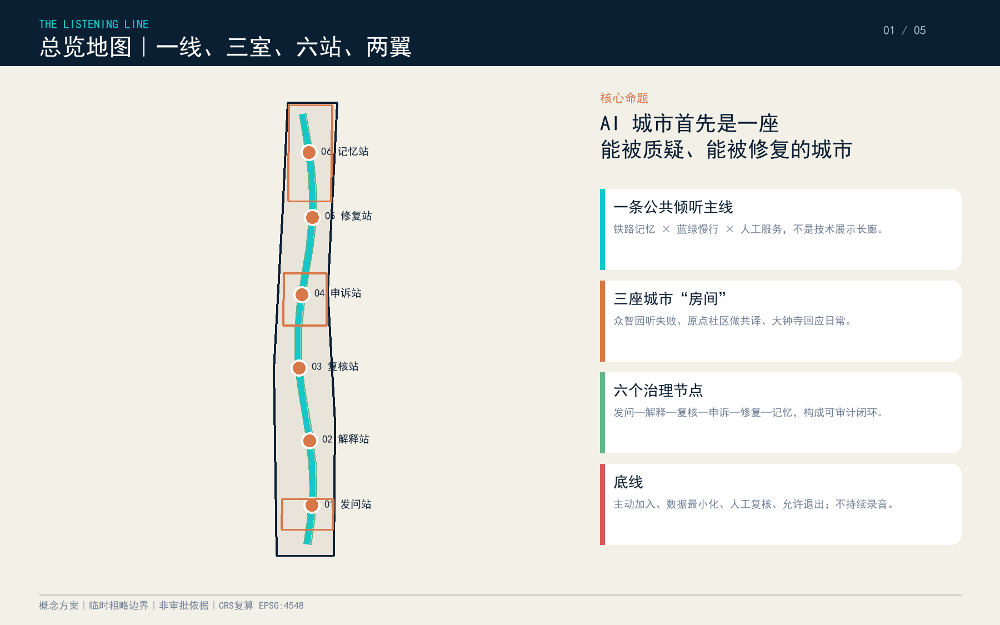
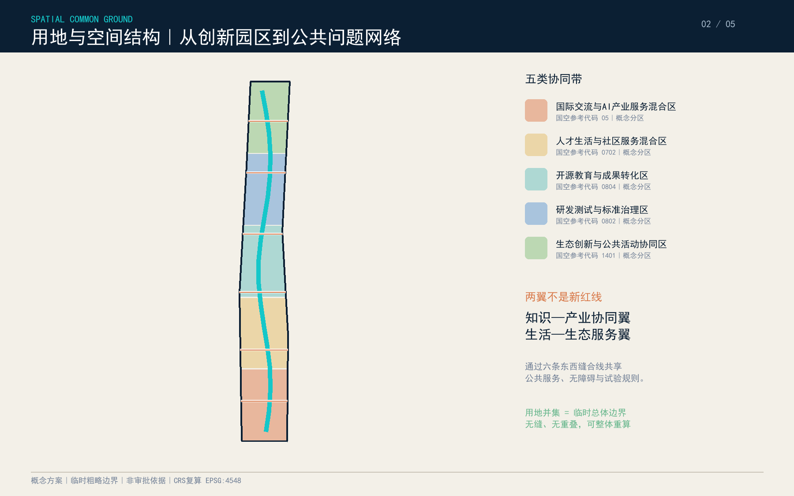
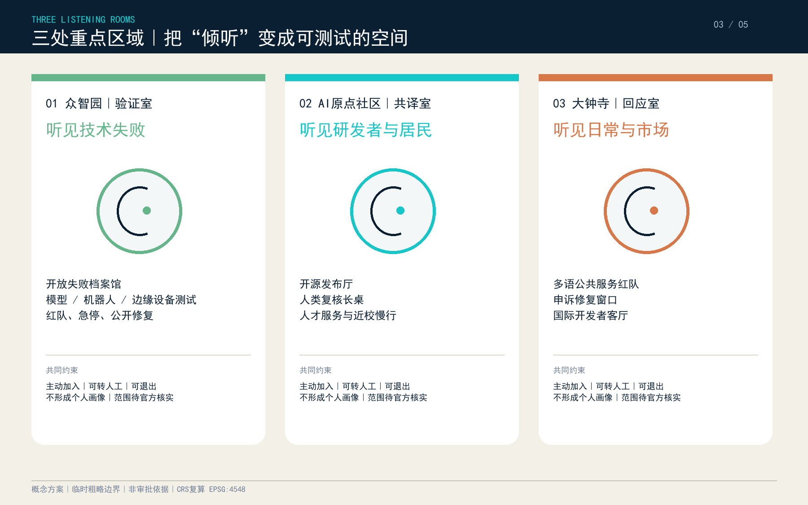
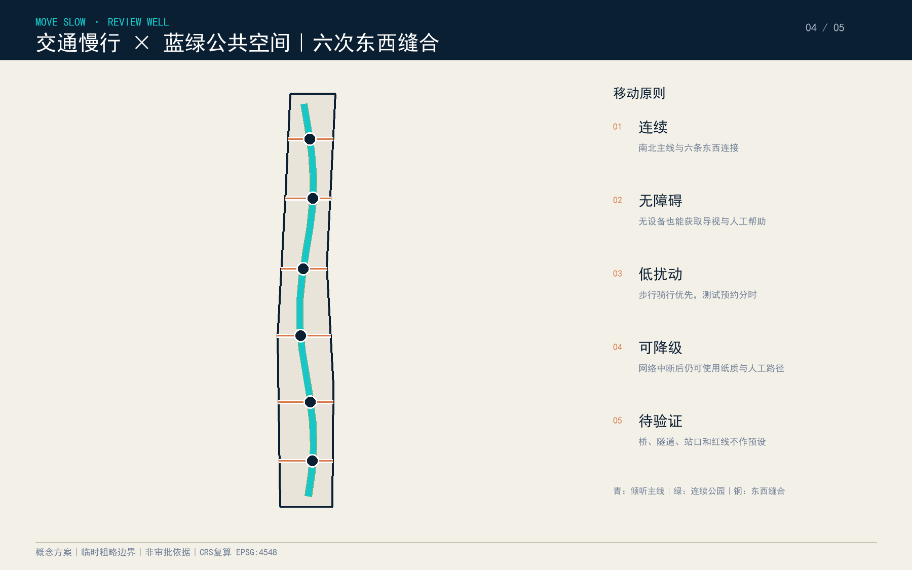
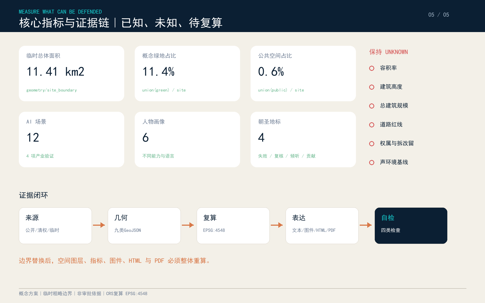

# 听见京张 / THE LISTENING LINE：让 AI 城市先学会听

> 机器可以快速作答，但城市必须保留倾听、解释、复核、申诉、修复与记忆的时间。这里的“听”首先是一套公共治理和空间交往机制，而不是遍布街区的麦克风。

## 设计依据与资料清单

本方案以正式公告、面向智能体任务书和仓库机器可读资料为依据，首先区分事实、临时边界、设计判断和待确认条件。公告界定统筹研究、总体设计与三处重点区域的工作层级；智能体任务书补充AI场景、品牌、人物画像、全球案例和长期运营要求；仓库站点包提供枚举、标准、校验脚本和临时粗略几何。[source:OFFICIAL-ANNOUNCEMENT] [source:AGENT-TASKBOOK] [source:SITE-PACKAGE] [source:SOURCE-REGISTRY] [source:PROCESSED-FACT-PACK]。边界和重点区来自 [source:BOUNDARY-SOURCE] 与 [source:KEY-AREA-SOURCE]，全部保持 `official_boundary=false`、`geometry_role=provisional_constraint` 和 `boundary_precision=provisional_rough`；它们只服务本次概念生成、展示与结构化复算，不是红线、地块或审批依据。[assumption:A-BOUNDARY-001]

规范层采用 [standard:PROJECT-OFFICIAL-ANNOUNCEMENT]、[standard:PROJECT-AGENT-OPEN-CALL-TASKBOOK]、[standard:MOHURD-URBAN-DESIGN-MEASURES]、[standard:MOHURD-CONTROL-DETAILED-PLANNING]、[standard:MNR-LAND-USE-CLASSIFICATION-GUIDE] 与 [standard:MOHURD-ARCH-DESIGN-DEPTH-2016]。其中建筑设计深度资料在公开包中被标记为缺口，因此只用于提示专业深化，不制造伪精确建筑结论。本节完成 [depth:existing_conditions_diagnosis]：已知的是公告约11.4平方公里总体范围、三处重点区域及任务结构；未知的是官方边界、控规、权属、道路、建筑、市政、文保和声环境基线。[assumption:A-CONTROLS-001] [assumption:A-BUILDING-001] [assumption:A-HERITAGE-001] [assumption:A-TRANSPORT-001] [assumption:A-ACOUSTIC-001]

机器可读落点包括 [data:geometry/site_boundary.geojson#SITE-001]、[data:geometry/key_areas.geojson#PROV-KEY-001]、[data:geometry/constraints.geojson#CONSTRAINT-METADATA] 与 [metric:site_area_sqm]。所有图件均由本包几何重新绘制；没有调用商业地图瓦片、远程字体或未清权图片。取得正式 CAD/GIS 后，应替换两类临时边界，并依次重算用地拓扑、建筑包络、道路、蓝绿、公共空间、分期、指标、HTML和PDF，不能只改一张总图。

## 三层范围工作框架

方案把三层范围解释为“听见—回应—验证”的递进工作链。统筹研究范围负责听见全球AI产业、高校科研与海淀城市生活的长期变化，形成可复制的创新生态机制；总体设计范围负责把回应落实为一条南北公共主线、六个倾听站和东西缝合网络；三处重点区域负责用具体空间、运营主体和退出条件验证场景。对应 [depth:three_level_scope_framework] 与 [depth:overall_spatial_structure]，空间锚点是 [data:geometry/site_boundary.geojson#SITE-001]、[data:geometry/key_areas.geojson#PROV-KEY-002] 和 [data:geometry/key_areas.geojson#PROV-KEY-003]。

总体结构概括为“一线、三室、六站、两翼”。一线是沿京张遗址公园组织的“倾听主线”；三室分别位于众智园、北京AI原点社区和大钟寺：众智园是听见技术失败的“验证室”，原点社区是听见研发者与居民的“共译室”，大钟寺是听见日常服务与市场反馈的“回应室”。六站依次为发问、解释、复核、申诉、修复、记忆，既是公共空间节点，也是一套AI服务从提出问题到留下审计记录的治理流程。两翼不是新划红线，而是知识—产业协同翼和生活—生态服务翼，通过六条东西慢行连接与周边高校、企业、社区和轨道站点相接。

三层之间用同一套证据闭环：战略判断必须能在场景和空间中找到落点；空间动作必须有指标、依赖和分期；重点区试点必须能退出、复盘并反馈总体规则。`compliance_matrix.json` 把公告1.3—1.5和agent.1—agent.6映射到章节、九类GeoJSON、A3/A0、HTML、来源与自检，避免“战略宏大、空间失焦”或“节点精致、系统无因”。

## 统筹研究范围产业与未来城市研究

“听见京张”不把AI创新等同于办公楼数量，而把创新生态定义为持续听见真实问题、允许安全试错、公开解释结果并让公共利益进入技术迭代的能力。产业链由高校与开源社区提出前沿问题，众智园提供安全评测、端侧设备与行业测试，大钟寺连接企业服务、商业验证和国际交流，社区与公共机构提供自愿、可撤回的使用反馈。城市空间因此从单向展示橱窗转向“问题—原型—测试—评议—修复—传播”的循环平台。

六个全球案例只提炼机制，不照搬形态：one-north提示工作、生活、学习、游憩和真实测试协同 [source:CASE-JTC-ONE-NORTH]；Kalasatama提示智慧城区应与居民日常共同迭代 [source:CASE-HELSINKI-KALASATAMA]；巴黎萨克雷提示高校、实验室、企业和开放创新场所组成网络 [source:CASE-PARIS-SACLAY]；Mila提示开放科研、创业支持、产业伙伴与负责任AI可以同处一体 [source:CASE-MILA-MONTREAL]；巴塞罗那22@提示创新城区需要长期更新、公开文件和持续评估 [source:CASE-BARCELONA-22]；多伦多Quayside提示数字化城市首先要明确公共利益和治理边界 [source:CASE-TORONTO-QUAYSIDE]。京张可迁移的是“真实测试+公共讨论+长期运营”，不可复制的是各地土地制度、财政条件和量化成绩。

未来城市形态采用小尺度、混合、可逆的空间原型：首层开放、共享会议、模块化测试厅、安静工作间、无障碍服务窗口和可预约公共客厅被布置在步行网络上；大型永久建设必须等待控规与权属。品牌中文名“听见京张”，英文名“THE LISTENING LINE”；标识由两条铁路平行线弯成耳廓、在中心留一处开放缺口，铜色代表铁路记忆，青色代表可解释技术，绿色代表公共生态，深蓝代表审慎治理。它可转化为导视、路面标识和数字界面，但不会在未核实遗存上附着。

## 总体设计范围城市更新与控规深度城市设计

总体设计以 [depth:land_use_layout] 和 [depth:development_intensity_controls] 为专业框架。五个概念性用地协同带完整、无缝、无重叠地覆盖临时总体边界：[data:geometry/land_use.geojson#LU-001] 至 LU-005 分别承载国际交流与产业服务、人才生活、开源教育、研发测试、生态公共活动。它们是空间协同意向，不替代法定用地；容积率、总建筑规模、高度、密度、退线等保持 unknown，待官方地块和控规条件到位后逐地块校核。

更新策略不是大拆大建，而是“先开门、再连接、后增量”。第一类行动是把既有园区首层、灰空间和公共界面改造成可预约的倾听客厅；第二类行动是以六条东西连接修补被道路、围墙和单一功能割裂的步行链；第三类行动是在结构安全、权属和文保核实后，利用概念建筑包络承载测试厅、共译室和人才服务。[data:geometry/buildings.geojson#BLDG-001] 仅表示可适应复用体量包络，受 [assumption:A-BUILDING-001] 约束，任何“保留、改造、拆除、新建”都必须逐栋调查后再分类。

城市形态控制采用“低扰动底座+可识别公共节点+连续树冠”的原则，对应 [depth:height_massing_character] 与 [depth:retain_renovate_demolish]。街道首层强调透明但不暴露个人数据，建筑中层提供安静研发和共享服务，屋顶优先评估光伏、雨水和公共活动的工程适宜性。三室和六站依靠色彩、遮阴、坐凳、无障碍坡道、夜间分级照明和清晰退出导视形成识别，不用夸张地标压过铁路历史。官方控制缺失时，不写具体米数、建筑密度或建设承诺。

## 重点区域详细设计

众智园“验证室”聚焦听见模型与设备的失败。北部临时重点区内设置开放失败档案馆、行业测试厅、红队工作坊和低碳交往花园；四个产业测试场景中有三个在此发生：模型偏差与鲁棒性公开评测、具身机器人低速无障碍测试、边缘设备隐私与能耗基准。测试必须预约、分区、可中止，有人类安全员和事件记录；测试路径不得占用消防与连续无障碍通道。片区定位、范围和面积均依赖 [data:geometry/key_areas.geojson#PROV-KEY-001]，清河、道路和园区界面需专项核实。

北京AI原点社区“共译室”聚焦把专业语言翻译成公众可理解的选择。中部重点区布置开源发布厅、人类复核长桌、人才服务台、社区课程和近校成果转化街；居民、师生、创业者可看到模型为何给出建议、如何更正资料、如何要求人工处理。场地以短租、共享和首层改造为主，优先建立校区—园区—社区慢行缝合，避免以高成本形象工程挤压日常服务。所有行为数据只做必要的聚合统计，不建立个人忠诚度或情绪画像。

大钟寺“回应室”聚焦服务闭环和国际交往。南部重点区围绕轨道接驳、四象限步行连通、企业服务和公共商业界面，设置多语种城市服务代理测试、国际开发者客厅、数据授权咨询和申诉修复窗口。第四个产业验证场景“多语种公共服务智能体红队”在此开展：同一问题由不同语言、年龄和无障碍需求的志愿者测试，输出必须可解释、可转人工并记录修复结果。站点与道路条件受 [assumption:A-TRANSPORT-001] 约束，不预设地下连通或工程形式。

三处重点区共同完成 [depth:three_key_area_detailed_design]：每处都有定位、空间动作、AI场景、运营责任、人工复核、风险和退出机制。它们不是三个孤岛，而是通过倾听主线共享测试协议、开放日历、失败档案和修复记录；某场景若连续两轮未证明公共价值、产生不可接受风险或无法保障运营，即退出公共空间并回到封闭实验环境。

## AI 创新生态、人才画像与 AI+ 场景

六类人物画像分别为：研究者/开源开发者需要深度工作、同行评议与贡献可见；初创团队需要低成本空间、行业测试和合规辅导；企业工程师需要真实需求、接口标准和安全验证；周边居民与老年人需要不被技术门槛排除的日常服务；无障碍通勤者需要连续路径、清晰信息和人工帮助；国际访客需要多语种接待、城市理解与合作入口。对应 [metric:persona_count]。画像不等于用户追踪，只用于检查空间和服务是否覆盖不同能力、语言与工作阶段。

十二张场景卡如下，对应 [metric:scenario_count]，其中前四张为产业测试验证 [metric:industry_test_scenario_count]：01 模型失败与偏差公开评测（众智园，合成/授权数据，红队+人工裁决）；02 具身机器人低速无障碍沙盒（众智园，封闭时段，安全员急停）；03 边缘设备隐私与能耗基准（众智园，只留聚合指标，不留原始音视频）；04 多语种公共服务代理红队（大钟寺，志愿参与，随时转人工）；05 无障碍慢行同行助手（主线，用户主动开启，路线可解释）；06 公共法律解释台（原点，公开法规，律师/社工复核）；07 社区健康导航（社区节点，不诊断，只转介正规服务）；08 开源学习与导师配对（原点，最小化个人资料）；09 蓝绿维护共治台账（主线，设施工单人工确认）；10 铁路口述史共创档案（自愿授权，可撤回，不用人脸识别）；11 夜间安心回路（分级照明和人工值守，不做情绪识别）；12 国际开发者倾听周（大钟寺，开放议程、双语记录和后续转化）。

每张场景卡都回答七个问题：谁使用、在哪里、需要什么数据、如何选择加入、谁复核、谁运营、何时退出。公共空间禁止默认持续录音、远程人脸识别和隐蔽行为评分；声景研究若开展，仅在明确告知、志愿参与、端侧计算和原始音频不落盘的前提下进行。[assumption:A-ACOUSTIC-001]。公共利益指标不是“互动次数越多越好”，而是人工转接成功、错误修复时间、无障碍任务完成和数据撤回成功率。

四处AI朝圣地标对应 [metric:landmark_count]：开放失败档案馆展示失败、边界与修复而非只展示成功；人类复核长桌允许面对面讨论与签字确认；倾听亭提供无设备也能参与的纸笔、手语与多语种界面；贡献回声墙记录开源代码、社区建议和维护劳动，并允许匿名与撤回。四者共同把“负责任AI”变成可抵达、可使用、可质疑的城市空间。

## 用地、建筑规模与拆改留方案

用地分类参考 [standard:MNR-LAND-USE-CLASSIFICATION-GUIDE]，但只表达设计协同功能，不改变法定用途。[data:geometry/land_use.geojson#LU-001] 等五个分区面积总和由 [metric:land_use_area_total_sqm] 复算并与 [metric:site_area_sqm] 校核。倾听主线和六座花园可与不同用地功能叠加，使产业、教育、社区和生态空间共享一套步行与公共服务界面，而不是另造单一“AI用地”。正式深化需把分区叠合官方地块、用途、权属和既有项目，处理不可建设区、绿化、道路、市政和公共设施约束。

建筑层采用“保留优先、可逆改造、谨慎增量”的判断顺序。[data:geometry/buildings.geojson#BLDG-001] 至后续概念包络只用于计算 [metric:building_footprint_area_sqm] 和表达空间承载关系，不是现状测绘或建设轮廓。逐栋工作表应至少记录年代、结构、产权、使用率、首层开放性、文保状态、消防、能耗、无障碍和改造成本；没有证据时状态必须是 `pending_survey_and_professional_confirmation`。这也是 [depth:retain_renovate_demolish] 的核心自检。

建筑规模、容积率和高度继续保持 unknown：[metric:floor_area_ratio]、[metric:building_height_m]、[metric:total_floor_area_sqm]。本方案避免用“建议高度区间”制造专业精确感，转而给出性能原则：主线界面形成连续遮阴和可识别入口；重点节点不过度遮挡历史视廊；研发与测试空间具有可分隔、可扩展、可停用的基础条件；人才生活服务与夜间活动控制噪声和照明扰动。待正式资料到位后再由规划、建筑、交通、市政、景观和文保团队协同定量。

## 交通、轨道、市政与公共服务设施

交通策略对应 [depth:traffic_rail_slow_parking]。一条南北倾听主线和六条东西缝合线记录于 [data:geometry/roads.geojson#ROAD-001]，概念中心线总长由 [metric:road_length_m] 复算。主线优先服务步行、骑行和无障碍移动，在发问、解释、复核、申诉、修复、记忆六站提供休息、饮水、导视、人工服务和非机动车有序停放。与轨道、道路相交的位置只标识“待专项验证的连接意向”，不预设桥、隧道、开口或信号控制。

轨道一体化聚焦“到站后最后十五分钟”的可理解性：从大钟寺、五道口及清华东路西口等节点到重点区域，建立连续导视、无障碍绕行说明、夜间照明分级和人工求助入口。停车不以新增大规模车位为默认答案，而先管理共享、短停、装卸、无障碍车位与骑行接驳；企业大型测试需预约时段和交通影响评估。道路红线、站口位置、客流和停车供给未齐，所有判断受 [assumption:A-TRANSPORT-001] 限制。

市政与新基建对应 [depth:municipal_new_infrastructure]。六站可作为低功耗边缘节点、环境设施和公共服务窗口的协同载体，但端侧算力必须有能源预算、故障降级、网络中断方案和数据删除机制；雨水、树池、遮阴与可再生能源需在管线、结构和防洪评估后落位。公共服务采用“数字入口+人工后门”：任何AI健康、法律、交通和企业服务都不能只有二维码，现场应提供可见的人工转接方式。

## 蓝绿空间、公共空间与城市风貌

蓝绿系统对应 [depth:blue_green_public_space]。倾听主线以约连续的绿色缓冲、六座花园和东西慢行缝合形成概念骨架，空间数据见 [data:geometry/green_space.geojson#GREEN-001]、[data:geometry/public_space.geojson#PUBLIC-001]。从几何复算得到 [metric:green_space_area_sqm]、[metric:green_ratio]、[metric:public_space_area_sqm] 和 [metric:public_space_ratio]；这些比例是本方案设计图层的内部指标，不是公告批准的绿地率或公共空间法定指标。

“听见”在景观上表现为不同尺度的停留而非声光装置堆叠：安静坐席与讨论长桌分开，儿童活动与深度工作有缓冲，夜间节点有明确关闭时段，雨水花园、树荫和透水铺装提供可感知的季节变化。六站不持续采集声音；若未来需要声环境评估，应先用专业短期测量和公众问卷建立基线，再决定是否设置无原始音频的聚合传感。清河、小月河和铁路遗址相关空间均需等待正式蓝线、生态和文保资料。

城市风貌采用“铁路记忆的铜、开放技术的青、公共生态的绿、审慎治理的深蓝”。栏杆、铺装、灯具、屏幕和标识使用同一信息层级：先显示地点与方向，再显示服务状态，最后才是品牌；故障时仍能依靠纸质和人工导视。地标不冒充文物，也不悬挂未经授权的企业标识。形态、材料和夜景只作为设计建议，需通过样段、居民评议、维护测试与全生命周期成本比较后定型。

## 更新项目清单、实施政策与分期计划

更新项目分为八包：JZ-L01倾听主线样段，JZ-L02六站公共服务原型，JZ-L03众智园开放失败档案馆，JZ-L04原点社区人类复核长桌与开源发布厅，JZ-L05大钟寺多语服务和申诉修复窗口，JZ-L06东西无障碍缝合线，JZ-L07贡献回声墙与开放台账，JZ-L08城市倾听年度评估。每包都需明确位置、产权、运营、维护、数据责任、退出条件和复盘指标；没有实施主体或稳定运维资金的项目不得转入永久建设。[depth:renewal_project_list]

三期空间见 [data:geometry/phasing.geojson#PHASE-001]，数量为 [metric:phase_count]。近期以零建设基线调查、可移动家具、纸笔+数字双入口和四个产业测试场景为主，验证需求和风险；中期在官方资料核实后修补重点区首层、慢行断点与公共空间，形成三室六站；远期才讨论连续运营网络、建筑增量和国际合作。分期服从“先证明公共价值，再固化空间”的闸门，对应 [depth:phasing_implementation]。

运营采用独立的“京张倾听协议”：场景发起方提交数据清单、风险和人工复核方案；公共机构、企业、社区与专业人员共同审查；试点公开时间、范围和退出方式；结束后发布不含个人数据的结果、失败和修复记录。年度预算按空间维护、人工服务、技术运维、无障碍与安全评估分别列账。品牌活动只在有明确主办、许可和安全方案后发生，本提案不声称任何官方活动已获批准。

## 指标体系、面积复算与合规矩阵

已知指标全部来自提交几何或明确计数：[metric:site_area_sqm]、[metric:land_use_area_total_sqm]、[metric:building_footprint_area_sqm]、[metric:green_space_area_sqm]、[metric:green_ratio]、[metric:public_space_area_sqm]、[metric:public_space_ratio]、[metric:road_length_m]、[metric:key_area_count]、[metric:scenario_count]、[metric:industry_test_scenario_count]、[metric:persona_count]、[metric:landmark_count]、[metric:phase_count]。面积和长度用EPSG:4548复算，比例由同一临时边界作分母；边界替换后全部重新计算。指标不是越大越好，绿地与公共空间还需验证连续性、可达性、生态和运营质量。

未知指标 [metric:floor_area_ratio]、[metric:building_height_m]、[metric:total_floor_area_sqm] 保持空值，并说明缺失的官方控规和地块资料。合规矩阵逐条覆盖公告任务和agent任务；标准矩阵说明每项标准如何进入文本、图纸和图层；深度矩阵覆盖 [depth:metrics_recalculation] 以及其余十四项深度，包括诊断、三层范围、总体结构、用地、强度、体量风貌、拆改留、交通、市政、蓝绿、重点区、项目、分期和风险。自检必须同时通过 deterministic、spatial、visual 与 professional 四类检查。

运营期另设不写入法定指标的绩效：人工转接成功率、错误修复中位时长、无障碍任务完成率、数据撤回成功率、社区建议进入项目决策的比例、试点退出是否按承诺执行。这些数值需要真实运营数据才能建立基线，当前不编造目标值。指标仪表板同时显示数据状态和最后更新时间，避免把活动流量当作公共价值。

## 风险、版权与合规说明

最大风险是临时粗略边界被误读为官方红线。所有页面、图件和PDF均显著标注“概念方案/临时边界/非审批依据”；[depth:risk_missing_data] 汇总官方边界、重点区、控规、道路、地块、建筑、市政、文保、公共设施和声环境资料缺口。[data:geometry/constraints.geojson#CONSTRAINT-METADATA] 只是全域缺资料提示，不代表任何控制线。官方数据到位后，专业团队应记录来源、版本、坐标系和转换过程，再整体重算。

AI风险以数据最小化、主动加入、随时撤回、人工复核、故障降级和公开修复为底线。方案不使用持续录音、人脸识别、情绪识别、个人轨迹画像或隐蔽行为评分；不把AI输出当规划审批、医疗诊断、法律意见或安全裁决。测试失败不被隐藏，但公开前去除个人、商业秘密和安全敏感信息。儿童、老年人、残障人士和非中文使用者须有无设备也能获得服务的替代路径。

文字、图标、图表、地图、Logo方向、HTML与PDF均由本次AI辅助工作流原创生成并以CC-BY-SA-4.0开放；官方和案例资料仅作事实与方法引用，不复制其受保护图像或品牌资产。详细声明见 `report/copyright_statement.md`。本提案不声称政府批准、资金落实、土地权属、法定规模或实施承诺；所有规划、建筑、交通、市政、景观、文保和数据治理判断须由相应专业团队复核。

## 参考资料

- 正式任务与仓库资料：[source:OFFICIAL-ANNOUNCEMENT]、[source:AGENT-TASKBOOK]、[source:SITE-PACKAGE]、[source:SOURCE-REGISTRY]、[source:PROCESSED-FACT-PACK]、[source:BOUNDARY-SOURCE]、[source:KEY-AREA-SOURCE]。
- 公开案例资料：[source:CASE-JTC-ONE-NORTH]、[source:CASE-HELSINKI-KALASATAMA]、[source:CASE-PARIS-SACLAY]、[source:CASE-MILA-MONTREAL]、[source:CASE-BARCELONA-22]、[source:CASE-TORONTO-QUAYSIDE]。
- 结构化空间索引：[data:geometry/site_boundary.geojson#SITE-001]、[data:geometry/key_areas.geojson#PROV-KEY-001]、[data:geometry/land_use.geojson#LU-001]、[data:geometry/buildings.geojson#BLDG-001]、[data:geometry/roads.geojson#ROAD-001]、[data:geometry/green_space.geojson#GREEN-001]、[data:geometry/public_space.geojson#PUBLIC-001]、[data:geometry/constraints.geojson#CONSTRAINT-METADATA]、[data:geometry/phasing.geojson#PHASE-001]。
- 完整深度索引：[depth:existing_conditions_diagnosis]、[depth:three_level_scope_framework]、[depth:overall_spatial_structure]、[depth:land_use_layout]、[depth:development_intensity_controls]、[depth:height_massing_character]、[depth:retain_renovate_demolish]、[depth:traffic_rail_slow_parking]、[depth:municipal_new_infrastructure]、[depth:blue_green_public_space]、[depth:three_key_area_detailed_design]、[depth:renewal_project_list]、[depth:phasing_implementation]、[depth:metrics_recalculation]、[depth:risk_missing_data]。
