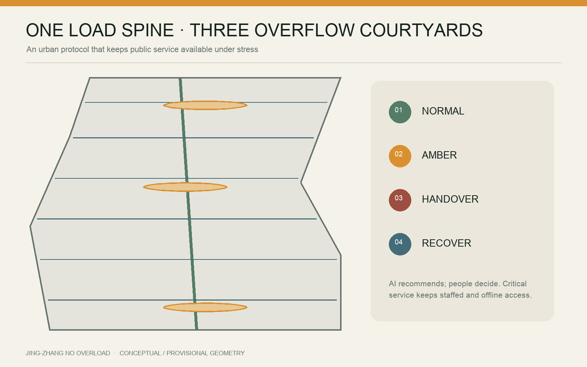
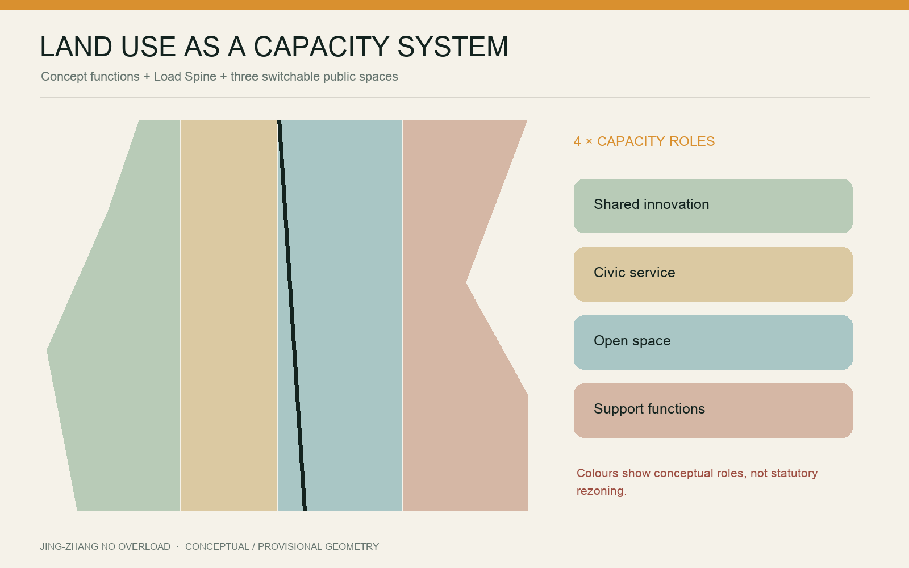
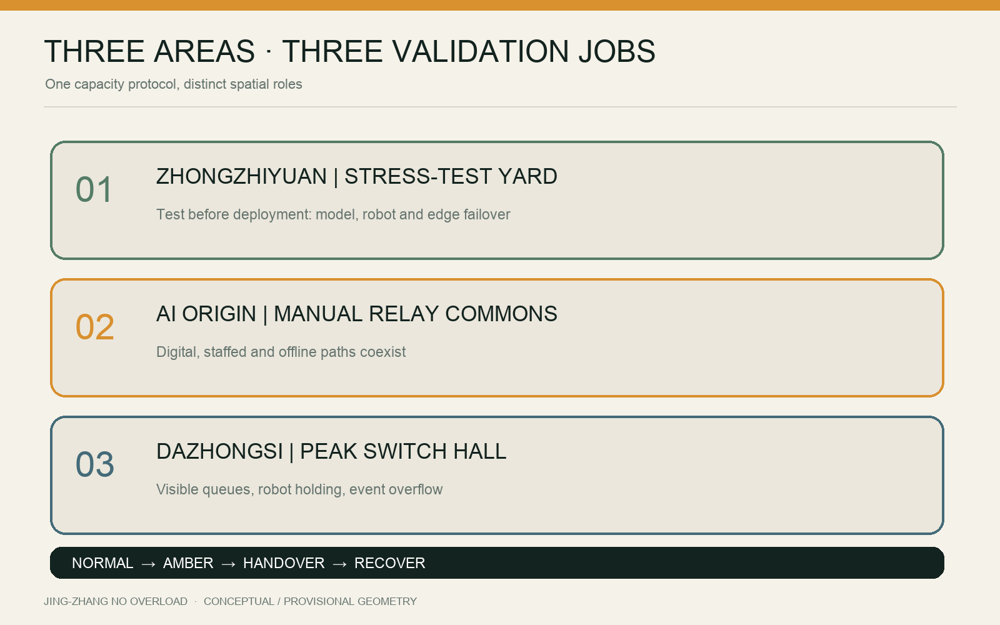
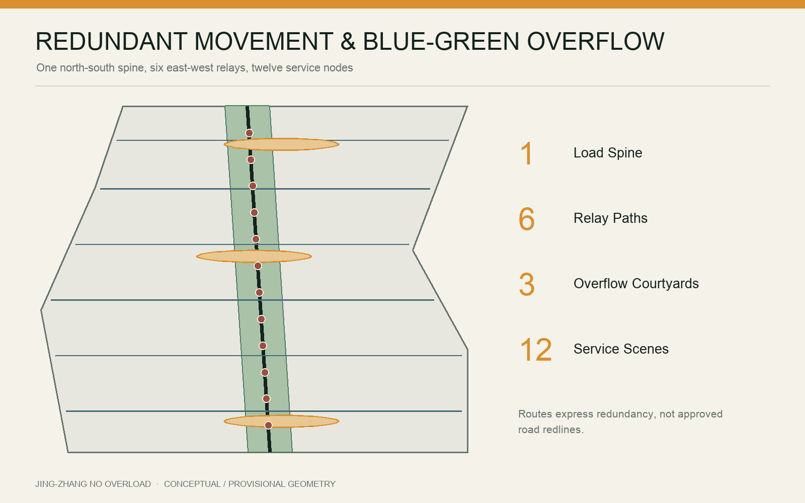
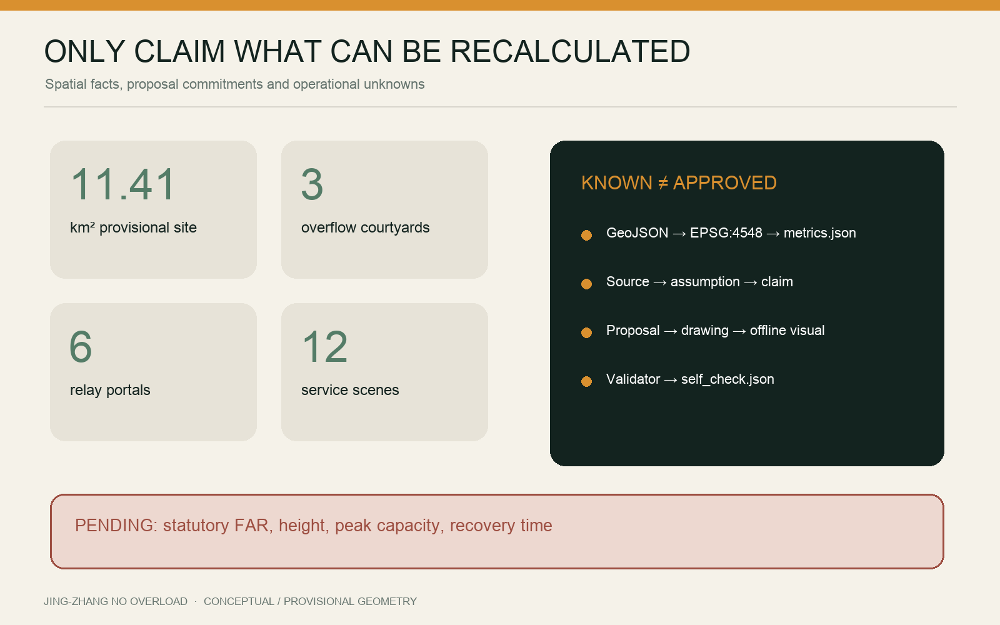

# JING-ZHANG NO OVERLOAD

> A city that still serves everyone at peaks, failures and offline moments.

## Design Basis and Source List

This proposal responds to the official Centennial Beijing-Zhangjiakou Railway AI Innovation Belt call and its agent-facing taskbook. It interprets a world-class AI ecosystem as durable public-service capacity, not merely a concentration of firms, compute and iconic buildings. The three scope levels, three key areas and required design depth are controlling references; machine-readable facts come from `brief/site-package/`, `data/source_registry.json` and `data/processed/agent_fact_pack.md` [source:OFFICIAL-ANNOUNCEMENT] [source:AGENT-TASKBOOK].

No statutory vector boundary for the overall design area or the three key areas is present in the public package. `geometry/site_boundary.geojson` and `geometry/key_areas.geojson` therefore retain the repository's rough provisional geometry and `official_boundary=false`. The recalculated 11.41 km² area and key-area positions support generation, review and machine checks only; they are not approval boundaries [source:BOUNDARY-SOURCE] [assumption:A-BOUNDARY-001]. FAR, height, ownership, utility capacity, road redlines and heritage controls remain unknown or pending professional confirmation.

Reference cases include one-north's work-live-learn ecosystem, STATION F's heritage reuse and operational zoning and MaRS's labs-offices-public atrium mix [source:CASE-ONE-NORTH] [source:CASE-STATION-F] [source:CASE-MARS].

22@'s coordinated regeneration, High Tech Campus Eindhoven's shared infrastructure and Kendall Square's multi-party governance provide a second set of mechanisms. No foreign scale, performance figure or policy parameter is applied to Beijing [source:CASE-22AT] [source:CASE-HTCE] [source:CASE-KENDALL].

## Three-level Scope Framework

No Overload is an urban method that makes carrying capacity visible. The strategic scope identifies five loads; the overall scope builds a Load Spine, overflow spaces and human-relay network; the three key areas test concrete service scenarios. Every claim follows a source–assumption–geometry–metric–drawing–self-check evidence chain [standard:PROJECT-OFFICIAL-ANNOUNCEMENT] [depth:three_level_scope_framework].

| Scope | Question | Deliverable |
| --- | --- | --- |
| 43.6 km² strategic study | How can AI growth avoid displacing everyday urban life? | Five-load framework, actors and global mechanism comparison |
| Approx. 11.4 km² overall design | How do movement, services and mobility reroute under stress? | One Load Spine, three Overflow Courtyards, six Relay Portals |
| Three key areas | What spaces prove graceful degradation, recovery and accountability? | Stress-test Yard, Manual Relay Commons, Peak Switch Hall |

The five loads are model/edge-compute load, crowd and event load, public-service queue load, robot and curb load, and climate/event load. The proposal does not invent numeric thresholds. Operators must establish and publish capacities, triggers, degradation priorities and recovery logs during implementation [assumption:A-CAPACITY-001].

## Coordinated Research Area: Industry and Future City Research

The corridor's opportunity lies in connecting research, entrepreneurship, public life and real urban problems in one verifiable loop: research frames a problem; shared facilities test it; firms productise it; public scenarios trial it; independent review evaluates it; open documentation shares the result. Public trials require notice, opt-out, data minimisation, human review and post-trial audit.

Six personas anchor capacity design: developers and small teams; operators and frontline staff; commuters and visitors; local residents; older, disabled and low-digital-literacy users; children, families and carers. A scenario succeeds not because it looks intelligent in normal mode, but because AMBER mode protects people most likely to be excluded by digital-first service.

Global cases yield six operational lessons: modular space lets teams grow; heritage can be a shared civic room; labs, offices and public atria should be adjacent; innovation-led renewal must also deliver facilities, greenery and transport; expensive technical infrastructure should be shared; and stable cross-sector governance matters. Jing-Zhang adds a seventh lesson: make failure drills public, turning resilience into an innovation product.

Four resource pools support the ecosystem: shared compute and tools, robot/sensor test equipment, public-service continuity kits and an open urban-load dataset. Small teams book resources by task and time; large institutions contribute equipment, mentors, real problems and audit capacity; residents shape questions and evaluation rather than appearing only as exhibition audiences.

## Overall Design Area: Urban Renewal and Regulatory-Plan-Level Urban Design

The spatial structure is “one spine, three courtyards, two wings, six portals, twelve scenes.” The Load Spine follows the railway heritage park as a continuous walking and public-service corridor. Three Overflow Courtyards align with the key areas. Two east-west service wings connect neighbourhoods, industry and transit. Six Relay Portals can switch to human assistance, offline navigation and emergency assembly. Twelve service nodes are tested over time [data:geometry/roads.geojson#ROAD-SPINE-001] [data:geometry/public_space.geojson#OVERFLOW-001] [metric:scenario_node_count].

Renewal uses four actions: retain heritage, mature communities and usable structures; adapt underused space for shared testing and civic service; add walking links, accessibility, shade, toilets, water, offline wayfinding and utility interfaces; test small reversible installations before permanent investment. No building-specific demolition conclusion is made without ownership, condition and heritage evidence [assumption:A-BUILDING-001].

The land-use layer is a conceptual functional model, not a statutory change. Mixed innovation, public service, open space and support functions test the spatial logic; official controls must trigger re-zoning, balancing and recalculation [data:geometry/land_use.geojson#LU-001] [metric:land_use_feature_count].

## Detailed Design of Key Areas

### Zhongzhiyuan | Stress-test Yard

Zhongzhiyuan tests before deployment. Shared and reversible facilities host a model-service load lab, a low-speed robot–crowd conflict lane and an edge-compute failover bench. Tests use no unauthorised personal data; robots are time-separated, speed-limited and supervised. A garden buffer remains publicly usable. AMBER mode pauses non-essential demonstrations and returns priority to circulation and accessibility.

### Beijing AI Origin Community | Manual Relay Commons

The Origin Community translates technology into public capacity. Digital service, staffed counters, paper/offline routes, community training and an open-source tool desk coexist. Critical service never has a QR-only entrance. Offline mode turns the courtyard into a verification, form assistance, charging and neighbourhood contact point; recovery reports interruption, backlog and make-up arrangements.

### Dazhongsi | Peak Switch Hall

Dazhongsi manages collision among transit, commerce, events and robot delivery. Visible queues, curb reservations, robot holding pockets, an event overflow garden and staffed guidance form the Peak Switch Hall. AMBER mode pauses non-essential vehicles and displays before enabling one-way walking, temporary queuing and human transfer. Accessibility is never the first service removed.

All three areas use one protocol but keep distinct characters: an open testing landscape in the north, a civic living room in the centre and a rapidly switching urban foyer in the south. Centres, extents and areas are provisional and cannot identify actual parcels or demolition targets [data:geometry/key_areas.geojson#PROV-KEY-001] [assumption:A-KEYAREA-001].

## AI Innovation Ecosystem, Personas, and AI+ Scenarios

The ecosystem links six roles: research institutions, shared facilities, startups, public scenarios, independent evaluators and community feedback. Talent is represented by six observable users—developers and small teams, frontline operators, commuters and visitors, local residents, older/disabled/low-digital-literacy users, and families and carers. Twelve AI+ scenarios combine three stress tests, six daily services and three long-term operations. Every scene identifies beneficiaries, risk bearers, the first non-essential load to pause, the human handover and the recovery review [data:geometry/constraints.geojson#SCENARIO-01] [metric:persona_count] [metric:scenario_node_count].

AI functions are limited to prediction, queuing, navigation, booking, assisted explanation and event review. They do not include autonomous enforcement, service denial or reopening. Shared compute and test facilities lower barriers for small teams; communities define problems through public briefs and annual drills; operators remain responsible for capacity thresholds and interruption logs [assumption:A-CAPACITY-001].

## Land Use, Building Scale, and Retain-Renovate-Demolish Strategy

Conceptual layers maintain complete coverage rather than presenting unknown conditions as vacant land. Only areas, ratios, lengths and counts directly recalculable from submitted GeoJSON are `known`; FAR, height, building density and statutory green ratio remain `unknown` [metric:site_area_sqm] [metric:floor_area_ratio].

| Metric | Current expression | Limit |
| --- | --- | --- |
| Overall design area | Approx. 11.41 km² | Recalculated from provisional geometry |
| Key areas | 3 | Names and announced scales known; exact extents pending |
| Designed public spaces | 3 Overflow Courtyards | Conceptual buffers; parcel validation pending |
| Relay Portals | 6 | Scenario nodes, not existing facilities |
| AI service scenarios | 12 | Executable briefs; performance thresholds pending |

Areas use CGCS2000 / 3-degree Gauss-Kruger CM 117E (EPSG:4548). A geometry change must update `metrics.json`, drawings and the visual. Area values are never read from apparent colour coverage [metric:green_ratio] [metric:public_space_ratio].

## Transport, Rail, Municipal Infrastructure, and Public Services

Priority is continuous walking and accessibility, public-transport interchange, cycling, necessary service vehicles, robots, then general cars. The Load Spine is not a new motor road; it is a design corridor joining existing walking, heritage park and civic service nodes. Six east-west relay paths provide redundant offline navigation, event dispersal and neighbourhood connections [data:geometry/roads.geojson#ROAD-CROSS-001].

Robots follow three exclusions: no peak queue, no children's core, no accessible path. Every key area has a holding pocket and human takeover point. Route failure means safe stopping, not transferring risk to pedestrians. Curb capacity, signal timing, station flow and fire access require official and field data [assumption:A-MOBILITY-001].

## Blue-Green Network, Public Space, and Urban Character

The blue-green system handles daily comfort and peak overflow. The green Load Spine provides shade, runoff absorption and walking buffer. Overflow Courtyards are parks, courts, markets or civic rooms in daily use, then use movable furniture, ground markings, power and lighting interfaces to switch into waiting, event relief or staffed service.

Overflow must protect dignity: seating, shade, water, toilets, parent/child and accessible information; visible estimated wait; and no facial recognition as a default condition of public-space access. Missing drainage, tree, utility and thermal data means geometry shows intent, not engineering performance [assumption:A-BLUEGREEN-001].

Submitted layers are recalculated in EPSG:4548. The conceptual green spine occupies about 11.92% of the provisional site and three Overflow Courtyards about 2.67%; these are design-comparison metrics, not a statutory green ratio or approved public-space provision [metric:green_ratio] [metric:public_space_ratio]. Character follows “legible, repairable, reversible”: fixed colours, ground marks and staffed entries communicate capacity; equipment avoids heritage fabric and key views; night lighting limits glare while retaining accessible continuity. Tree, drainage, utility, thermal and heritage evidence must be added before positions, runoff capacity, planting and lighting limits can be confirmed.

## Building Form, Character and Landmarks

New systems remain legible, repairable and reversible. Lightweight timber/steel, replaceable panels and warm night markers sit beside retained brick, rail and platform scales. Temporary equipment must not block heritage fabric or sightlines; exact conservation controls remain pending [assumption:A-HERITAGE-001].

Four landmarks perform work: the Public Load Gauge shows status and staffed access; the Manual Relay Pavilion provides offline service; the Overflow Clock shows waiting and switch time; the Recovery Ledger publishes interruption, response and restoration. They form a public language, not isolated monuments.

Buildings favour open ground floors, shared atria, divisible small units, visitor/logistics separation, roof shade and maintainable plant. `buildings.geojson` is conceptual and cannot support demolition, floor area or height claims [metric:building_footprint_area_sqm].

## Renewal Projects, Implementation Policy, and Phasing

Eight packages form the library: Load Spine continuity audit; three Overflow Courtyards; six Relay Portals; offline civic-service kit; robot holding system; public capacity ledger; shared test facilities; and the annual No Overload Open Week. Existing space and reversible infrastructure come first.

Phasing follows risk and learning, not wholesale redevelopment. Near term (0–2 years): fill data gaps, audit walking/accessibility, run three temporary drills and prototype the ledger. Medium term (3–5 years): build shared test facilities, courtyards and portal network. Long term (5+ years): extend independently evaluated scenarios into regular governance [data:geometry/phasing.geojson#PHASE-001].

Every project needs an operator, annual budget, maintenance routine, AMBER trigger owner, human handover owner and exit path. A smart device without a long-term operating responsibility is not permanent infrastructure.

## AI Scenarios and Operating Model

Twelve scenarios include three tests, six daily services and three long-term operations: model-service load lab; low-speed robot–crowd lane; edge failover bench; offline wayfinding; transparent queue display; accessible human relay; event overflow garden; peak curb steward; shared-compute booking for small teams; civic-service continuity desk; heritage-sensitive guide; annual drill and Open Week [data:geometry/constraints.geojson#SCENARIO-01] [metric:testing_scenario_count].

One protocol has four states: **NORMAL**, publish capacity and entries; **AMBER**, limit non-essential load and show wait; **HANDOVER**, switch to staffed, offline or low-tech service; **RECOVER**, a person confirms reopening and publishes a review. AI may predict and recommend but never autonomously closes roads, denies service, enforces rules or reopens systems.

A Corridor Capacity Council coordinates public agencies, operators, universities, communities, transport and accessibility representatives. It publishes anonymised load summaries quarterly, runs an annual drill and commissions independent evaluation. People can challenge incorrect data, algorithmic advice and interrupted service; the recovery ledger records human overrides and unresolved issues.

## Metrics, Area Recalculation, and Compliance Matrix

Metrics have three levels: spatial facts (area, length, feature count); proposal commitments (scenes, portals, projects); operational observations (peak capacity, response time, recovery and fairness). The first two are recalculated from submitted files. The third requires field baselines and is not replaced by invented percentages [metric:road_network_length_m] [metric:renewal_project_count] [assumption:A-CAPACITY-001].

`compliance_matrix.json` covers official and agent tasks; `standard_matrix.json` maps public national/project references; `design_depth_matrix.json` checks diagnosis, space, mobility, blue-green, building, renewal, implementation and deliverable depth. Script results persist in `self_check.json`; narrative compliance claims never substitute for execution evidence [standard:MOHURD-URBAN-DESIGN-MEASURES] [depth:indicator_recalculation_and_compliance].

## Risk, Copyright, and Compliance

Six principal risks are explicit: provisional geometry read as a statutory boundary; conceptual layers read as existing condition; untested capacity thresholds; disparate algorithmic impact; offline tools without maintenance; concept imagery read as site photography. Mitigation includes visible provisional/conceptual labels, unknown states, field baselines, human review and appeal, annual drills, independent evaluation and asset notes [assumption:A-BOUNDARY-001] [source:SOURCE-REGISTRY].

The cover was generated with OpenAI's built-in image-generation tool to express a heritage rail green spine, three Overflow Courtyards and capacity rings. It does not depict precise site conditions, existing buildings or government commitments; prompt, use and limits are recorded in `report/copyright_statement.md`. Other figures are programmatically drawn from submitted geometry and text data. External case pages remain the property of their respective owners.

This is an open-call AI urban-design proposal, not a statutory plan, construction document, investment commitment or automated decision system. Implementation requires qualified review across planning, architecture, mobility, utilities, landscape, fire safety, heritage, accessibility, data protection and law.

## References

Controlling references are the official announcement, agent taskbook, repository source registry and provisional geometry; use and confidence are recorded in `sources.json` [source:OFFICIAL-ANNOUNCEMENT] [source:AGENT-TASKBOOK] [source:SOURCE-REGISTRY].

Professional references include the registered national urban-design, detailed-planning and land-use classification snapshots. The proposal responds at public-standard level and does not replace applicable Beijing rules [standard:MOHURD-URBAN-DESIGN-MEASURES]. Global mechanism references are official pages for JTC one-north, STATION F, MaRS, Barcelona 22@, High Tech Campus Eindhoven and Kendall Square. Access dates and links are listed in `sources.json`; no external imagery or drawings are copied.
