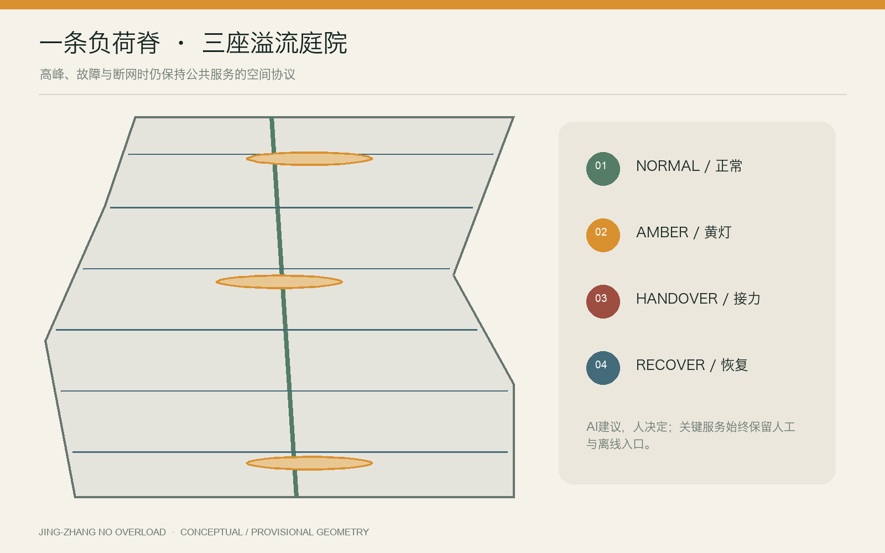
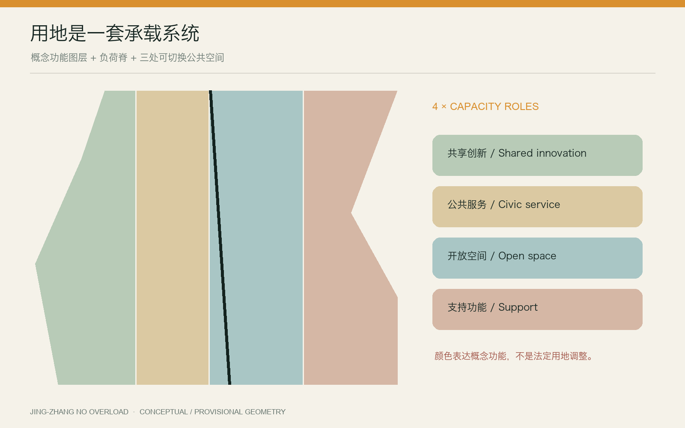
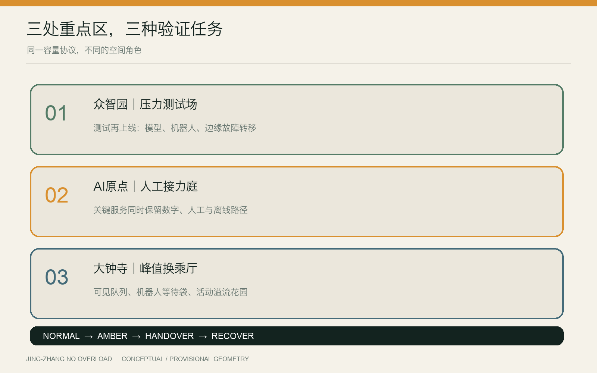
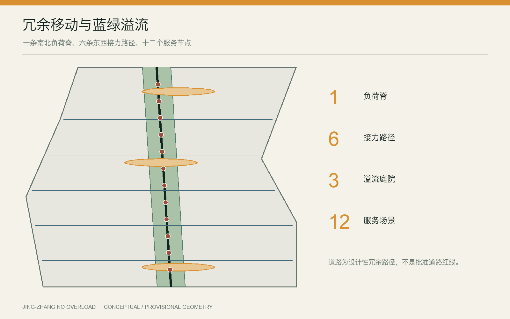
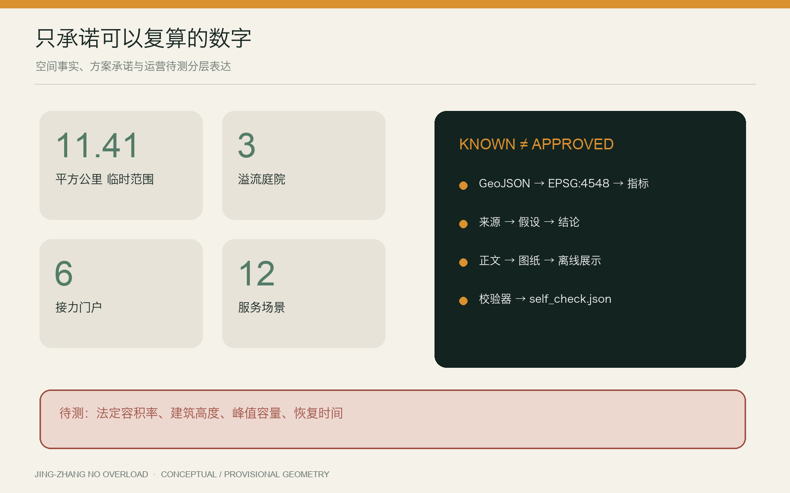

# 京张不过载｜JING-ZHANG NO OVERLOAD

> 让城市在高峰、故障与断网时，仍然服务每个人。

## 设计依据与资料清单

本方案响应《百年京张AI创新带城市设计国际方案征集资格预审公告》及面向智能体任务书，把“世界级AI创新生态”解释为一种可持续的公共服务能力，而不只是企业、算力与建筑的集聚。公告确定的三层范围、三处重点区与成果深度是主控依据；机器可读事实来自 `brief/site-package/`、`data/source_registry.json` 与 `data/processed/agent_fact_pack.md` [source:OFFICIAL-ANNOUNCEMENT] [source:AGENT-TASKBOOK]。

当前公开资料没有可供法定使用的总体范围与重点区正式矢量红线。`geometry/site_boundary.geojson` 与 `geometry/key_areas.geojson` 采用仓库提供的临时粗略边界，均保持 `official_boundary=false`。因此，11.41 平方公里与三处重点区面积只用于方案生成、图面定位和机器复算，不构成审批依据 [source:BOUNDARY-SOURCE] [assumption:A-BOUNDARY-001]。容积率、建筑高度、产权、市政容量、道路红线与文保控制等缺项明确记为 `unknown` 或待专业确认，不以设计叙事补齐。

本方案同时研究 one-north 的产学研混合与生活实验、STATION F 的历史建筑再利用和分区运营、MaRS 的实验—办公—公共中庭组合 [source:CASE-ONE-NORTH] [source:CASE-STATION-F] [source:CASE-MARS]。

22@ 的更新与公共设施协同、High Tech Campus Eindhoven 的共享技术设施、Kendall Square 的多主体治理提供另一组运营参照。案例仅支持“共享设施、混合社群、开放测试、长期运营”四类机制，不转移其规模、绩效或政策参数 [source:CASE-22AT] [source:CASE-HTCE] [source:CASE-KENDALL]。

## 三层范围工作框架

“不过载”不是一句安全口号，而是一套把城市承载能力公开化的设计方法：在统筹研究范围识别创新生态的五类负荷；在总体设计范围建立连续的负荷脊、溢流空间和人工接力网络；在三处重点区验证具体的服务场景。所有空间表达遵循“来源—假设—图层—指标—图纸—自检”证据链 [standard:PROJECT-OFFICIAL-ANNOUNCEMENT] [depth:three_level_scope_framework]。

| 层级 | 核心问题 | 本方案交付 |
| --- | --- | --- |
| 43.6 平方公里统筹研究范围 | AI生态如何在增长时不挤出城市日常生活 | 五类负荷地图、生态角色与全球机制对照 |
| 约11.4平方公里总体设计范围 | 高峰或故障时，人流、服务和移动如何分流 | 一条负荷脊、三座溢流庭院、六个接力门户 |
| 三处重点区域 | 什么空间能证明“可降级、可恢复、可问责” | 压力测试场、人工接力庭、峰值换乘厅 |

五类负荷分别是：模型推理与边缘算力负荷、人流与活动负荷、公共服务排队负荷、机器人与路缘负荷、极端天气与大型活动负荷。设计不预设未经测量的具体阈值，而要求运营方在实施阶段公开容量、触发条件、降级顺序和恢复记录 [assumption:A-CAPACITY-001]。

## 统筹研究范围产业与未来城市研究

京张沿线的优势不只在于高校、园区和企业密度，更在于可以把科研、创业、公共生活与真实城市问题放到同一条可验证链路中。本方案将创新链组织为“研究提出问题—共享设施验证—企业产品化—公共场景试用—独立评估—开源复盘”。其中，公共试用不是无边界采集：任何涉及人的测试都必须有告知、退出、最小数据、人工复核与事后审计 [source:CASE-ONE-NORTH]。

六类日常使用者作为容量设计的基准角色：开发者与小团队、园区运营与一线人员、通勤者与访客、周边居民、老年/残障/低数字素养人群、儿童家庭与照护者。评价一个场景是否成功，不看它在正常时多“聪明”，而看黄灯状态是否优先保护最容易被数字服务丢下的人。

全球案例带来的不是“复制某个园区”，而是六条可操作启示：模块化空间支持团队成长；历史建筑能成为创新共同体的共享客厅；实验室、办公室和公共中庭要邻接而非封闭；创新更新必须同时提供住房、设施、绿地与交通；高成本设施适合共享；区域治理需要稳定的跨主体组织。京张的独特回应是再增加第七条——把系统失效公开演练，使韧性本身成为创新产品。

产业策略由四类资源池构成：共享算力与工具池、低速机器人和感知设备测试池、公共服务连续性工具包、城市负荷开放数据集。小团队按时段和任务预约共享资源；大型主体以设备、导师、真实问题和审计能力贡献生态；居民通过公开议题、陪审式评估和年度演练参与，而不是只在成果展上被动观看。

## 总体设计范围城市更新与控规深度城市设计

空间结构概括为“一脊、三庭、两翼、六门、十二景”。“一脊”沿京张遗址公园形成连续步行与公共服务负荷脊；“三庭”对应三处重点区的溢流公共空间；“两翼”连接东西两侧社区、产业和轨道站点；“六门”是可切换为人工服务、离线导航与应急集散的接力门户；“十二景”是可逐年测试的AI城市服务节点 [data:geometry/roads.geojson#ROAD-SPINE-001] [data:geometry/public_space.geojson#OVERFLOW-001] [metric:scenario_node_count]。

总体更新采用“留—改—补—测”四类动作。留：保留遗址公园、成熟社区、可持续使用的厂房和公共设施；改：把闲置或低效空间改为共享测试、社区服务与低成本工作空间；补：优先补足慢行断点、无障碍、遮阴、厕所、饮水、离线导视与能源接口；测：以小尺度可撤销装置验证人流、机器人、服务队列与活动容量。未取得产权、质量和文保资料前，不作具体建筑拆除结论 [assumption:A-BUILDING-001]。

土地使用图层表达的是概念性功能组织，不是法定用地调整。现有脚手架的混合创新、公共服务、开放空间与支持性功能，仅用于测试空间结构；正式控规指标和边界发布后，应重新分区、平差并复算 [data:geometry/land_use.geojson#LU-001] [metric:land_use_feature_count]。

## 重点区域详细设计

### 众智园｜压力测试场

众智园承担“测试再上线”。围绕共享设备与可撤销样机场地，形成模型服务负载实验室、低速机器人—人群冲突测试巷、边缘算力故障转移台。测试不使用未经授权的个人数据，机器人测试分时、限速、有人值守；外圈设置可日常使用的花园缓冲带。黄灯时暂停非必要演示，把通行与无障碍优先权交还公众。

### 北京AI原点社区｜人工接力庭

原点社区承担“技术翻译成公共能力”。庭院内同时存在数字办理、人工窗口、纸质/离线路线、社区培训和开源工具台。任何关键公共服务都不得只有二维码入口。断网时，接力庭切换为信息核验、表单协助、充电和社区联络节点；恢复后公布服务中断时间、积压量和补办安排。

### 大钟寺｜峰值换乘厅

大钟寺承担“高峰不挤兑日常”。轨道、商业、活动和机器人配送在同一处容易产生峰值冲突。方案以可见队列、路缘预约、机器人等待袋、活动溢流花园和人工引导台组成换乘厅。黄灯时先停止非必要车辆和展示活动，再启用单向步行、临时排队与人工换乘；绝不以关闭无障碍通道作为最先降级手段。

三处重点区共用同一容量协议，却保留不同空间性格：北部是可测试的开放园地，中部是可停留的社区客厅，南部是可迅速切换的城市门厅。其中心、边界和面积均为临时表达，不能据此定位现状地块或征拆对象 [data:geometry/key_areas.geojson#PROV-KEY-001] [assumption:A-KEYAREA-001]。

## AI 创新生态、人才画像与 AI+ 场景

创新生态由“研究机构—共享设施—创业团队—公共场景—独立评估—社区反馈”六类角色共同组成。人才不是抽象的高端人群，而是六种可观察使用者：开发者与小团队、园区运营与一线人员、通勤者与访客、周边居民、老年/残障/低数字素养人群、儿童家庭与照护者。十二个AI+场景以三项压力测试、六项日常服务、三项长期运营构成组合；每个场景必须说明谁受益、谁承担风险、黄灯时先停什么、人工如何接管、恢复后如何复盘 [data:geometry/constraints.geojson#SCENARIO-01] [metric:persona_count] [metric:scenario_node_count]。

AI能力分为预测、排队、导航、预约、辅助解释与事件复盘六类，不包含自动执法、自动拒绝服务或自动恢复。小团队通过共享算力预约与测试设施降低进入门槛；社区通过公开议题与年度演练定义真实问题；运营方对容量阈值和中断记录负责。这样，AI创新不只产生产品，也产生公开、可申诉、可退出的城市服务协议 [assumption:A-CAPACITY-001]。

## 用地、建筑规模与拆改留方案

概念图层维持完整覆盖，避免用“空白地”掩盖尚未掌握的现状。指标表只把可以从提交 GeoJSON 直接复算的面积、比例、长度和数量标为 `known`；没有正式控制值的容积率、建筑高度、建筑密度与法定绿地率保持 `unknown` [metric:site_area_sqm] [metric:floor_area_ratio]。

| 指标 | 当前表达 | 解释边界 |
| --- | --- | --- |
| 总体设计范围面积 | 约11.41 km² | 临时粗略边界复算，不是法定面积 |
| 三处重点区 | 3处 | 名称和公告约规模可信，精确四至待补 |
| 设计性公共空间 | 3座溢流庭院 | 概念缓冲生成，实施面积待地块核查 |
| 接力门户 | 6处 | 场景节点，不是已建成设施 |
| AI服务场景 | 12个 | 可执行任务清单，性能阈值待测试 |

面积使用 CGCS2000 / 3-degree Gauss-Kruger CM 117E（EPSG:4548）投影复算；若图层相交或覆盖关系变化，必须同时更新 `metrics.json`、图纸和交互页。用地规模不是以视觉比例估读 [metric:green_ratio] [metric:public_space_ratio]。

## 交通、轨道、市政与公共服务设施

交通策略的优先级是“步行与无障碍连续—公共交通接驳—自行车—必要服务车辆—机器人—一般小汽车”。负荷脊不是新增机动车主干路，而是把现有慢行、遗址公园和公共服务节点串联的设计走廊；六条东西接力路径作为断网导航、活动疏散和社区联系的冗余通道 [data:geometry/roads.geojson#ROAD-CROSS-001]。

机器人与配送采用“三不进入”：高峰排队区不进入、儿童活动核心区不进入、无障碍通道不进入。每个重点区设置等待袋和人工接管点；路径规划失败时机器人就地安全停靠，而不是把问题转嫁给行人。路缘容量、信号配时、站点客流和消防要求均需以官方及现场数据深化 [assumption:A-MOBILITY-001]。

## 蓝绿空间、公共空间与城市风貌

蓝绿系统承担日常舒适和高峰溢流双重任务。负荷脊的连续绿带提供遮阴、雨水消纳和慢行缓冲；三座溢流庭院平时是公园、球场、集市或社区客厅，高峰时通过可移动家具、地面刻度、电源与照明接口快速切换为等候、活动分流或人工服务空间。

所有“溢流”均以人的尊严为前提：提供坐席、遮阴、饮水、厕所、母婴与无障碍信息；公开预计等待时间；不以面部识别作为进入公共空间的默认条件。雨洪、树木、地下管线和热环境数据缺失，图层只表达结构意图，不承诺工程容量 [assumption:A-BLUEGREEN-001]。

绿地与公共空间从提交图层使用 EPSG:4548 复算，当前概念绿带约占临时总体范围的 11.92%，三座溢流庭院约占 2.67%；它们是设计比较指标，不是法定绿地率或已批准公共空间规模 [metric:green_ratio] [metric:public_space_ratio]。风貌控制以“可读、可修、可撤”为原则：容量状态用固定颜色、地面刻度和人工入口表达；装置避让历史构筑物与重要视线；夜间照明降低眩光并保留连续无障碍识别。待树木、雨洪、管线、热环境和文保资料补齐后，应校核庭院位置、雨水容量、种植条件与照明边界，而不是只修饰图面。

## 建筑形态、风貌与地标系统

风貌策略不是用未来感覆盖京张历史，而是让新系统保持“可读、可修、可撤”。新增构筑物采用轻量钢木、可更换面板和暖色夜间识别；保留红砖、轨道、站台尺度等工业记忆；临时设备不遮挡遗产本体与重要视线。具体文保范围待正式资料确认 [assumption:A-HERITAGE-001]。

四个地标都承担运营功能：公共负荷表显示空间当前状态与人工入口；人工接力亭提供离线服务；溢流时钟显示等待和切换时间；恢复台账墙公开故障、处置与恢复过程。它们不是大型孤立建筑，而是一套沿线可识别的公共语言。

建筑层面强调首层开放、共享中庭、可分隔小单元、物流与访客分流、屋顶遮阴与设备检修。现有 `buildings.geojson` 为概念占位，不支持拆留判断或建筑面积核算；任何新建量、层数和高度须在测绘、产权、结构和控规资料齐备后确定 [metric:building_footprint_area_sqm]。

## 更新项目清单、实施政策与分期计划

项目库由八个包组成：负荷脊连续性审计、三座溢流庭院、六个接力门户、离线公共服务工具包、机器人等待袋系统、公共容量台账、共享测试设施、年度“不过载开放周”。它们优先利用存量空间和可撤销设施，以便根据真实反馈调整。

分期不按“大拆大建”组织，而按风险与学习价值组织。近期（0—2年）完成数据补齐、步行与无障碍审计、三处临时演练和容量台账原型；中期（3—5年）建设共享测试设施、溢流庭院和门户网络；远期（5年以上）在独立评估后扩展成熟场景并纳入常态治理 [data:geometry/phasing.geojson#PHASE-001]。

每个项目须有运营主体、年度预算、日常维护、黄灯触发人、人工接管人和退出机制。没有长期运营责任的“智慧装置”不得进入永久建设清单。

## AI应用场景与运营机制

十二个场景分为三项测试、六项日常服务和三项长期运营：①模型服务负载实验室；②低速机器人—人群冲突测试巷；③边缘算力故障转移台；④无网导视；⑤透明排队屏；⑥无障碍人工接力；⑦活动溢流花园；⑧轨道高峰路缘管家；⑨小团队共享算力预约；⑩公共服务连续性台；⑪遗产敏感型导览；⑫年度不过载演练与开放周 [data:geometry/constraints.geojson#SCENARIO-01] [metric:testing_scenario_count]。

统一运营协议有四个状态：**NORMAL 正常**，公开容量和服务入口；**AMBER 黄灯**，限制非必要负荷并显示等待；**HANDOVER 接力**，切换为人工、离线或低技术服务；**RECOVER 恢复**，由人确认重新开放并发布复盘。AI可以预测和建议，但不能单独决定封路、拒绝服务、执法或恢复。

运营由“沿线容量理事会”协调，成员包括属地部门、园区/企业、高校、社区、交通与无障碍代表。理事会每季度公开匿名化负荷摘要，每年组织演练和第三方评估。公众可对错误数据、算法建议和服务中断提出申诉；恢复台账必须记录人工覆盖和未解决问题。

## 指标体系、面积复算与合规矩阵

指标分为三层：空间事实（面积、长度、图层数量）、方案承诺（场景、门户、项目数量）、运营待测（峰值容量、响应时间、恢复时间、公平性结果）。前两类由提交文件复算，第三类必须在现场和运营阶段建立基线，不以虚构百分比制造成熟感 [metric:road_network_length_m] [metric:renewal_project_count] [assumption:A-CAPACITY-001]。

合规证据由 `compliance_matrix.json` 覆盖公告与 agent.1—agent.6；`standard_matrix.json` 对照公告及自然资源、住建领域公开标准；`design_depth_matrix.json` 检查诊断、空间、交通、蓝绿、建筑、更新、实施和成果深度。机器自检结果写入 `self_check.json`，不以正文中的“已符合”替代实际脚本结果 [standard:MOHURD-URBAN-DESIGN-MEASURES] [depth:indicator_recalculation_and_compliance]。

## 风险、版权与合规说明

主要风险有六项：临时边界被误读为正式红线；概念图层被误读为现状；容量阈值未经实测；算法建议产生差别影响；断网工具长期无人维护；视觉概念图被误读为实景。对应措施是显著标注 provisional/conceptual、保留未知项、现场基线测试、人工复核与申诉、年度演练、独立评估和资产说明 [assumption:A-BOUNDARY-001] [source:SOURCE-REGISTRY]。

封面由 OpenAI 内置图像生成工具按本方案概念生成，只表达“历史铁路绿脊、三座溢流庭院和容量环”，不呈现精确场地、现状建筑或政府承诺；其提示词、用途和限制见 `report/copyright_statement.md`。其余图表由提交 GeoJSON 与文本数据程序化绘制。仓库公共资料按其登记用途引用，全球案例名称、数据与页面权利归原权利人。

本成果是AI城市设计开源征集稿，不是法定规划、施工图、投资承诺或自动决策系统。正式实施前须由具备资质的规划、建筑、交通、市政、景观、消防、文保、无障碍、数据安全与法律专业人员复核。

## 参考资料

主控资料包括项目官方公告、面向智能体任务书、仓库来源登记与临时边界；其用途和置信度见 `sources.json` [source:OFFICIAL-ANNOUNCEMENT] [source:AGENT-TASKBOOK] [source:SOURCE-REGISTRY]。

专业依据包括住建部城市设计管理相关文件、详细规划编制要求、自然资源部国土空间用途分类指引及仓库登记标准快照；本稿只做公开规范层面的响应，不替代北京地方现行法规与正式审查 [standard:MOHURD-URBAN-DESIGN-MEASURES]。全球案例来源包括 JTC one-north、STATION F、MaRS、Barcelona 22@、High Tech Campus Eindhoven 与 Kendall Square 的官方页面，全部只用于机制研究，未复制其图片或图纸。访问日期与链接均登记在 `sources.json`。
