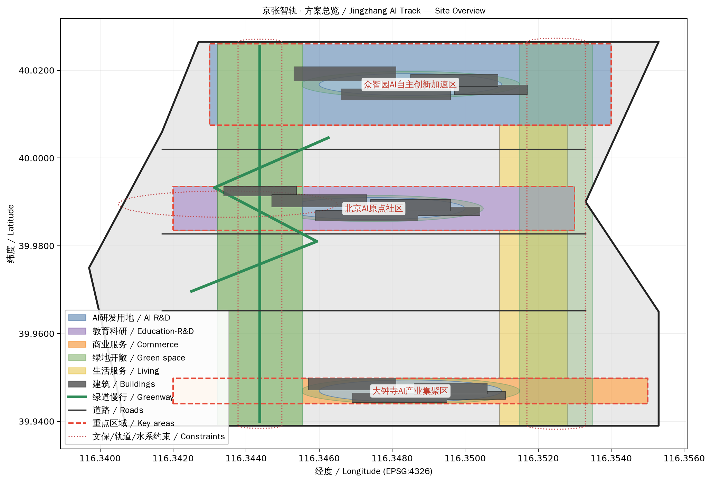
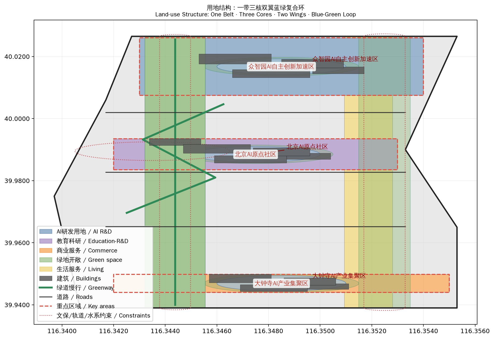
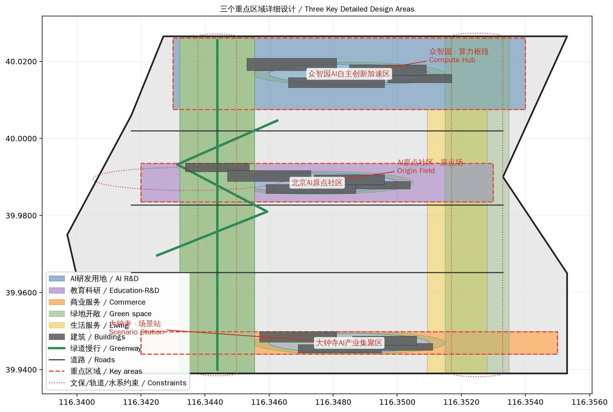
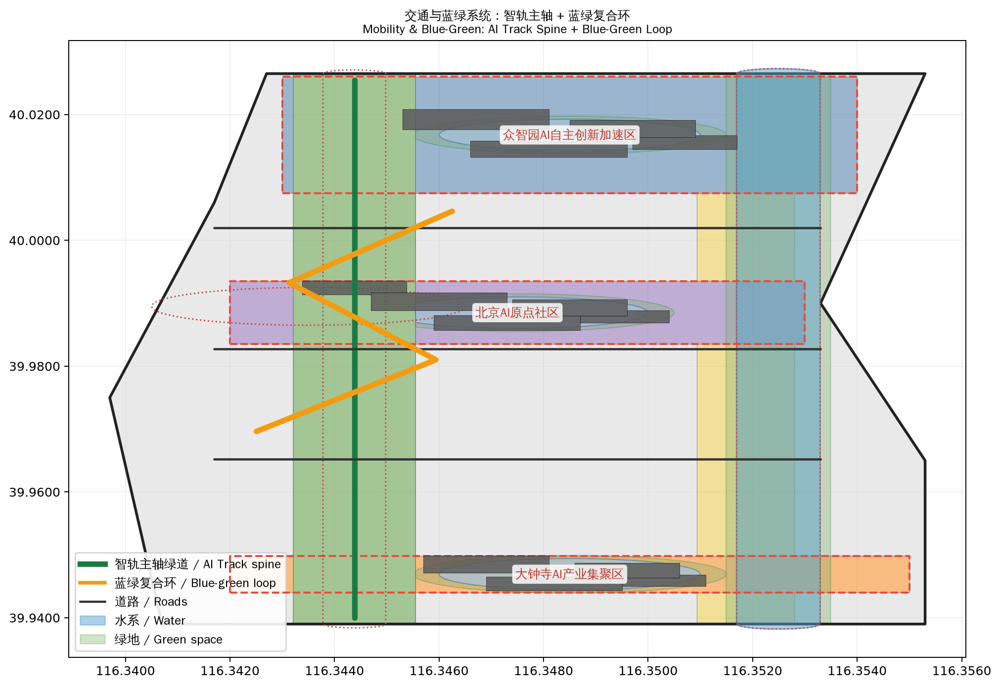
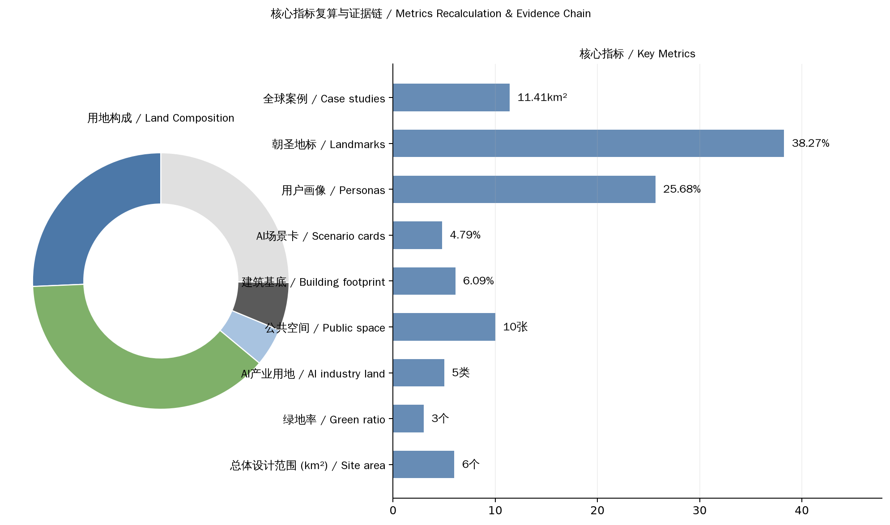

# 京张智轨：从人字轨到智字轨

## 一、设计依据与资料清单

本方案以北京市规划和自然资源委员会海淀分局发布的《百年京张AI创新带城市设计国际方案征集资格预审公告》为第一依据 [source:OFFICIAL-ANNOUNCEMENT]，以 `brief/site-package/` 中登记的设计简报 [source:SITE-PACKAGE]、面向智能体的开源征集任务书 [source:AGENT-TASKBOOK]、允许设计空间 [source:ALLOWED-DESIGN-SPACE] 和临时粗略边界 [source:BOUNDARY-SOURCE] 为机器可读依据。

方案坚持三条底线：

1. **公开资料边界**：全部空间数据来自组织方公开的 provisional boundaries 与公开资料，不编造官方红线、控规条件、权属或工程结论 [standard:PROJECT-OFFICIAL-ANNOUNCEMENT]。
2. **概念建议属性**：所有 Agent 空间落地建议均为概念建议与参考方案，不替代正式规划，不构成政府审定结论 [source:AGENT-TASKBOOK]。
3. **可追溯与可复算**：每个设计判断都可回溯到来源、指标、图层与假设，正文引用格式遵循 `[source:]`、`[standard:]`、`[depth:]`、`[data:]`、`[metric:]` 契约 [depth:metrics_recalculation]。

当前提交采用 provisional boundary（`geometry/site_boundary.geojson#SITE-001`），边界精度为低，仅在方案生成、自检、可视化与设计讨论中使用 [data:geometry/site_boundary.geojson#SITE-001]。官方 polygon 发布后须复算全部图层与指标。

## 二、总体概念：京张智轨

### 2.1 核心叙事：从人字轨到智字轨

1909年，詹天佑在八达岭用"人字形"展线让火车翻越天险，开启中国自主工程创新的原点。一百一十余年后，同一片土地上，AI 正在编织新的"智字形"网络——数据流、算力流、人才流在城市空间中交汇，让创新再次翻越新的山峰。

**主名称：京张智轨（Jingzhang AI Track）**

- **"京张"**：锚定百年铁路的地缘与历史记忆；
- **"智轨"**：既是智能轨道（智能体、数据流、算法在空间中运行的轨道），也是对"铁轨"意象的当代表达——创新需要轨道，轨道承载速度与方向。

**命名体系**：一带（京张智轨主轴）、三核（众智园·算力枢纽 / AI原点社区·原点场 / 大钟寺·场景站）、双翼（中关村科技服务翼 / 小月河场景赋能翼）、复合环（蓝绿慢行创新环）。

**Logo 方向**：人字形钢轨与神经网络节点同构——两条人字轨交叉处镶嵌一个发光节点，象征"人的智慧"与"机器的智能"在人字形铁轨上交汇。配色采用京张铁路青灰色（历史）+ AI 电光蓝（未来），延展图形可从轨道断面、信号灯、道岔符号中抽取 [standard:PROJECT-AGENT-OPEN-CALL-TASKBOOK]。

### 2.2 三大定位与五大功能

方案回应任务书三大定位与五大功能 [source:AGENT-TASKBOOK]：

| 定位 | 方案落点 |
| --- | --- |
| 百年京张文化带 | 京张遗址公园绿带主轴、清华园车站旧址文保叙事、京张文化叙事馆 |
| 都市AI生活体验带 | 10张AI场景卡、三核公共空间、小月河场景赋能翼 |
| AI融合创新带 | 众智园全栈自主体系、原点社区开源生态、大钟寺智能原生新业态 |

五大功能对应关系：AI全栈自主创新体系（众智园）、世界级AI创新生态（原点社区+中关村科技服务翼）、AI+场景赋能新范式（小月河翼+场景卡）、智能化AI活力城市（三核公共空间+复合环）、AI治理全球话语权（京张AI论坛+开发者社区运营）。

### 2.3 空间结构：一带三核、双翼联动、蓝绿复合环

- **一带**：京张遗址公园绿带主轴，南北贯通，串联三核，是历史与公共空间的主脊 [data:geometry/land_use.geojson#LU-004]。
- **三核**：众智园AI自主创新加速区（算力枢纽）、北京AI原点社区（原点场）、大钟寺AI产业聚集区（场景站）[data:geometry/key_areas.geojson#PROV-KEY-001] [data:geometry/key_areas.geojson#PROV-KEY-002] [data:geometry/key_areas.geojson#PROV-KEY-003]。
- **双翼**：中关村科技服务翼（要素全球化配置、IP与资本赋能）、小月河场景赋能翼（场景开放与城市活力）[data:geometry/land_use.geojson#LU-005]。
- **蓝绿复合环**：以绿带为脊柱，串联三核口袋公园与小月河绿廊，形成慢行、骑行、公共活动复合环 [data:geometry/roads.geojson#ROAD-004]。

## 三、三层范围工作框架

方案按公告三个层次组织 [source:OFFICIAL-ANNOUNCEMENT]：

| 层级 | 面积 | 设计重点 | 数据落点 |
| --- | --- | --- | --- |
| 统筹研究范围 | 43.6 km² | AI产业生态、创新链、未来城市形态 | compliance_matrix.json、standard_matrix.json |
| 总体设计范围 | 11.4 km² | 用地、道路、绿地、公共空间、分期 | [data:geometry/land_use.geojson#LU-001] [data:geometry/roads.geojson#ROAD-001] |
| 重点区域范围 | 368.4 ha | 三核详细设计 | [data:geometry/key_areas.geojson#PROV-KEY-001] |

统筹研究范围关注"高校策源—开源协作—企业转化—公共体验—国际传播"创新链；总体设计范围落实用地与空间结构；重点区域范围对三核进行精细化设计 [depth:three_level_scope_framework] [depth:overall_spatial_structure]。

## 四、统筹研究范围产业与未来城市研究：AI全栈自主创新体系与世界级AI创新生态

### 4.1 全球AI创新生态案例（6个）

| 案例 | 地点 | 借鉴机制 |
| --- | --- | --- |
| 硅谷Palo Alto研发走廊 | 美国 | 高校策源—风投—企业转化沿廊道集聚 |
| 波士顿Kendall Square | 美国 | 以研究园区为核心的创新社区，MIT+产业共生 |
| 深圳南山科技园 | 中国 | 硬件创新+供应链+场景开放的快速迭代 |
| 新加坡One North | 新加坡 | 政府主导的测试床与场景开放体系 |
| 巴黎Station F | 法国 | 单体建筑内集聚千个创业团队的开源生态 |
| 伦敦国王十字区 | 英国 | 铁路工业遗址更新为创新街区的范式 |

### 4.2 AI创新生态图谱与空间映射

生态图谱按"基础层（算力/数据/算法）— 平台层（开源/模型/工具）— 应用层（场景/产品/服务）— 治理层（标准/评测/伦理）"四层组织 [standard:PROJECT-AGENT-OPEN-CALL-TASKBOOK]。

空间映射：众智园承载基础层与平台层的自主创新（全栈实验室、算力枢纽）；原点社区承载平台层与开源生态（开源协作、教育科研）；大钟寺承载应用层与场景站（智能原生商业、测试场景）；中关村科技服务翼承载要素层（资本、IP、人才服务）。

### 4.3 要素机制建议

- **土地与空间**：留白用地作为创新弹性储备 [data:geometry/land_use.geojson#LU-006]；
- **产业与资金**：对接中关村科技服务翼的资本与IP机制；
- **人才**：人才公寓与人才服务综合体（大钟寺核）[data:geometry/buildings.geojson#BLDG-012]；
- **算力与数据**：众智园全栈实验室集群，公共数据与场景开放机制；
- **场景**：小月河场景赋能翼的场景开放运营机制。

## 五、AI 创新生态、人才画像与 AI+ 场景：赋能新范式与智能化AI活力城市

### 5.1 十张AI场景卡

| # | 场景名 | 空间落点 | 用户 | 运营机制 |
| --- | --- | --- | --- | --- |
| 1 | AI通勤助手 | 智轨主轴沿线 | 通勤者 | 实时出行服务+慢行引导 |
| 2 | 智能导览导游 | 京张遗址公园绿带 | 游客 | AI语音导览+AR历史复原 |
| 3 | 开源协作广场 | 原点共创广场 | 开发者 | 开源社区活动+代码托管展示 |
| 4 | 全栈实验室开放日 | 众智园 | 科研人员 | 实验室开放+成果路演 |
| 5 | 智能原生商业街区 | 大钟寺 | 消费者 | AI推荐+无人零售试点 |
| 6 | 场景测试验证场 | 小月河翼 | 企业 | 真实环境测试+数据回馈 |
| 7 | AI健康驿站 | 三核社区 | 居民 | 健康检测+慢病管理 |
| 8 | 智能停车与接驳 | 轨道站点 | 通勤者 | 停车诱导+接驳调度 |
| 9 | AI政务帮办 | 社区服务中心 | 居民 | 政策问答+办事导引 |
| 10 | 开发者挑战赛舞台 | 大钟寺广场 | 开发者 | 黑客松+路演+孵化对接 |

### 5.2 三类用户画像（5类）

| # | 画像 | 需求 | 空间回应 |
| --- | --- | --- | --- |
| 1 | 青年开发者 | 低成本工位、开源社区、技术交流 | 原点社区开源协作办公、共创广场 |
| 2 | 科研人员 | 实验室、算力、跨学科合作 | 众智园全栈实验室集群 |
| 3 | 创业者 | 孵化、融资、场景验证 | 众智园孵化器+大钟寺测试场景 |
| 4 | 周边居民 | 公园、便利服务、参与感 | 三核口袋公园+社区服务中心 |
| 5 | 全球访客 | 地标体验、文化叙事、国际交流 | 京张文化叙事馆+AI朝圣地标 |

### 5.3 隐私与人本边界

所有AI场景遵循最小采集、人工复核、可退出的原则 [standard:GENERATIVE-AI-INTERIM-MEASURES]；涉及个人数据的场景必须经隐私评估与人审确认，不部署过度监控场景 [standard:BARRIER-FREE-ENVIRONMENT-LAW]。

## 六、重点区域详细设计：AI公共空间、智能原生新业态与朝圣地标

### 6.1 京张遗址公园AI公共空间

以绿带为骨、三核为节、场景为脉：绿带提供连续慢行与生态；三核广场提供AI活动公共界面 [data:geometry/public_space.geojson#PUBLIC-001]；场景卡沿绿带布置形成体验路径。

### 6.2 三个AI朝圣地标

| # | 地标 | 位置 | 概念 |
| --- | --- | --- | --- |
| 1 | 原点之钟 | AI原点社区 | 人字轨与神经网络交汇的发光节点雕塑，象征创新原点 |
| 2 | 智轨信号塔 | 众智园 | 以铁路信号灯为原型的高辨识度构筑物，展示实时算力/数据流 |
| 3 | 场景之眼 | 大钟寺 | 智能原生商业街区的公共艺术装置，实时呈现AI场景运行 |

### 6.3 荣誉展示体系与公共空间组件库

荣誉展示体系：开发者荣誉墙（镌刻贡献者GitHub ID）、AI场景贡献者榜、年度创新者名录，沿绿带与三核广场布置。组件库：标准化的智慧座椅、智能灯杆、信息屏、无障碍导视、AI交互终端 [standard:BARRIER-FREE-ENVIRONMENT-LAW]。

## 七、蓝绿空间、公共空间与城市风貌：百年京张文化、中关村文化与AI新文化融合叙事

### 7.1 文化叙事主线

"从人字轨到智字轨"：京张铁路人字形展线（自主工程原点）→ 中关村电子一条街（自主科技原点）→ 京张AI创新带（自主智能原点）。三条线在空间与时间上同构，构成"中国自主创新三部曲"。

### 7.2 空间文化系统

- 清华园车站旧址文保叙事 [data:geometry/constraints.geojson#CONSTRAINTS-001]；
- 京张文化叙事馆（绿带文化节点）[data:geometry/buildings.geojson#BLDG-013]；
- 沿绿带的文化驿站与历史点位标识；
- 导视系统：以轨道符号为母题的标识体系，中英双语，兼顾无障碍 [standard:BARRIER-FREE-ENVIRONMENT-LAW]。

### 7.3 国际传播叙事

英文传播主线：**"From the Herringbone Track to the Intelligence Track"**——从人字轨到智字轨，中国自主创新的一百一十年。配图为三张核心图（总览、用地结构、朝圣地标）。

## 八、更新项目清单、实施政策与分期计划：一带全球AI创新活动体系与长期运营设计

### 8.1 年度活动体系

| 频次 | 活动 | 空间 |
| --- | --- | --- |
| 年度 | 京张AI论坛（全球AI治理话语权） | 众智园 |
| 半年 | AI场景开放日 | 小月河翼 |
| 季度 | 开发者挑战赛/黑客松 | 大钟寺广场 |
| 月度 | 开源社区meetup | 原点共创广场 |
| 每周 | 市民AI体验日 | 三核公共空间 |

### 8.2 品牌IP与传播

"京张智轨"品牌体系：Logo、吉祥物（人字轨信号灯小精灵）、年度主题、视觉系统。传播渠道：开发者社区、社交媒体、国际科技媒体、学术会议。

### 8.3 开发者社区运营机制

- 开源代码托管与贡献激励（GitHub组织）；
- 开发者荣誉墙与贡献者证书 [data:geometry/buildings.geojson#BLDG-005]；
- 社区meetup与workshop常态化；
- 场景开放API与沙箱测试环境。

### 8.4 场景开放运营与转化路径

场景开放机制：企业申请→沙箱测试→真实环境试点→数据回馈→成果展示。转化路径：场景验证成功→对接中关村科技服务翼资本与政策→落地孵化→纳入创新生态图谱。所有活动须经人工确认，不夸大政府承诺 [standard:PROJECT-AGENT-OPEN-CALL-TASKBOOK]。

## 九、总体设计范围城市更新与控规深度城市设计：用地、建筑规模与拆改留方案

### 9.1 用地布局

用地结构：AI产业用地（科研0802+教育科研0804+商业05）约25.6%，绿地与开敞空间约47.2%（含绿带、口袋公园、绿廊），公共服务与生活服务用地、留白用地构成其余部分 [metric:ai_industry_land_ratio] [metric:green_ratio]。完整图层见 `geometry/land_use.geojson`，无重叠全覆盖（覆盖率1.0）[metric:land_use_coverage_ratio]。

### 9.2 建筑规模

三核建筑群共13个概念建筑基底，总基底约71.8万m²（占总体范围6.3%）[metric:building_footprint_ratio]。建筑类型涵盖AI研发、实验室、孵化器、文化展示、教育、社区服务、商业、交通接驳 [data:geometry/buildings.geojson]。容积率、高度、密度等控规指标缺失，列为待确认 [metric:floor_area_ratio]。

### 9.3 分期计划

- **一期**：原点社区与大钟寺先行启动（接轨既有城市更新，快速见效）[data:geometry/phasing.geojson#PHASE-001]；
- **二期**：众智园全栈自主创新加速区 [data:geometry/phasing.geojson#PHASE-002]；
- **三期**：京张绿带全域贯通与长期治理 [data:geometry/phasing.geojson#PHASE-003]。

## 十、交通、轨道、市政与公共服务设施：智轨主轴与蓝绿空间

### 10.1 交通策略

- 南北智轨主轴（绿带内慢行+创新服务廊道）[data:geometry/roads.geojson#ROAD-001]；
- 三条横向联络道连接三核与东西侧 [data:geometry/roads.geojson#ROAD-002] [data:geometry/roads.geojson#ROAD-003]；
- 蓝绿复合环（骑行+慢行）[data:geometry/roads.geojson#ROAD-004]；
- 轨道站点接驳与大钟寺交通枢纽 [data:geometry/buildings.geojson#BLDG-011]。

### 10.2 蓝绿空间

绿带主轴+三核口袋公园+小月河绿廊构成蓝绿网络 [data:geometry/green_space.geojson#GREEN-001]。既有轨道与铁路遗址控制带 [data:geometry/constraints.geojson#CONSTRAINTS-002]、小月河水系蓝线 [data:geometry/constraints.geojson#CONSTRAINTS-003] 作为约束尊重。

## 十一、指标体系、面积复算与合规矩阵

完整指标见 `metrics.json`，合规映射见 `compliance_matrix.json`。关键空间指标：总体设计范围面积11.41 km² [metric:site_area_sqm]、重点区域3处 [metric:key_area_count]、绿地率47.2% [metric:green_ratio]、公共空间占比6.5% [metric:public_space_ratio]、AI产业用地占比25.6% [metric:ai_industry_land_ratio]。

内容指标：AI场景卡10张 [metric:scenario_card_count]、用户画像5类 [metric:persona_count]、朝圣地标3个 [metric:landmark_count]、全球创新生态案例6个 [metric:case_study_count]。

## 十二、风险、版权与合规说明

本方案作为 AI agent 生成的正式开源征集提交，明确区分"可讨论的概念建议"与"须经专业确认的法定结论"。主要风险与约束如下：

1. **边界与数据精度风险**：本方案全部空间图层基于组织方公开的 provisional boundaries 生成 [source:BOUNDARY-SOURCE]，未经官方测绘确认，只能用于方案生成、可视化与设计讨论，不得作为 official redline、审批依据或精确面积依据 [standard:PROJECT-OFFICIAL-ANNOUNCEMENT]。官方边界与重点区 polygon 发布后，site boundary、key areas、land use、buildings、roads、green space、public space、phasing 及全部面积指标均需按 `assumptions.json` 与 `metrics.json` 的公式复算 [assumption:A-CONTROLS-001]。

2. **控规条件缺失**：容积率、建筑高度、建筑密度、退线与道路红线等法定控制条件尚未从官方附件取得 [metric:floor_area_ratio] [metric:building_height_m]，本方案不对任何地块给出具体开发强度结论，所有强度相关表述均保持为"待专业确认"。

3. **实施不确定性**：方案中的更新项目、分期计划与运营机制均为建议性安排，不声称官方批准、审定控规、最终土地权属、最终建设规模或保证实施 [depth:risk_missing_data]。产业数据与活动预期均标注来源与置信度，不编造企业名单、投资额或财政承诺 [source:ALLOWED-DESIGN-SPACE]。

4. **版权与合规**：全部文本、几何、图表与 HTML 由 AI agent 原创生成，无第三方字体、图片、商标或未授权素材，版权状态见 `report/copyright_statement.md`；HTML 可视化完全离线，不加载远程脚本、瓦片、字体或外部 API，不跟踪评审者行为。
## 参考资料

本方案的完整机器索引保存于结构化文件中 [source:SITE-PACKAGE] [standard:PROJECT-OFFICIAL-ANNOUNCEMENT]，正文引用均可在 `sources.json`、`metrics.json` 与 `compliance_matrix.json` 中回溯。

- brief/public-brief.md
- brief/site-package/design_brief.json
- brief/site-package/allowed_design_space.json
- brief/site-package/enums/
- brief/site-package/ranges/planning_limits.json
- brief/site-package/geometry/provisional_boundaries.geojson
- 完整机器索引：sources.json、metrics.json、compliance_matrix.json、standard_matrix.json、design_depth_matrix.json
