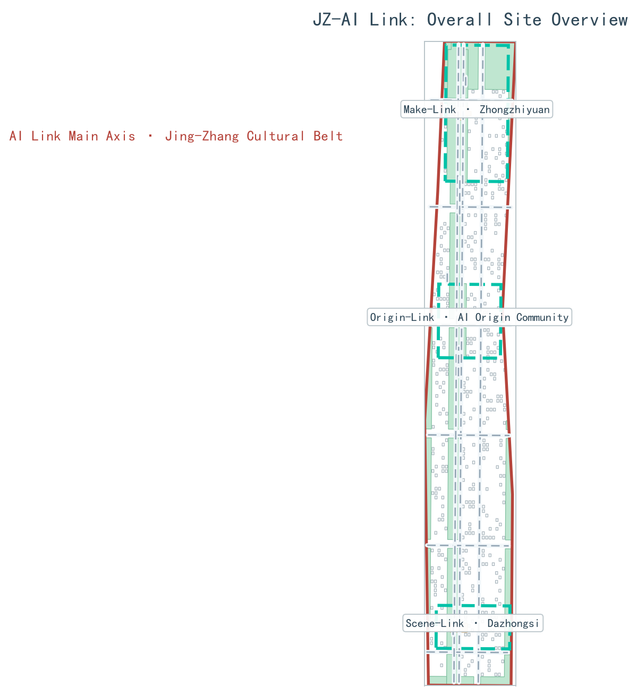
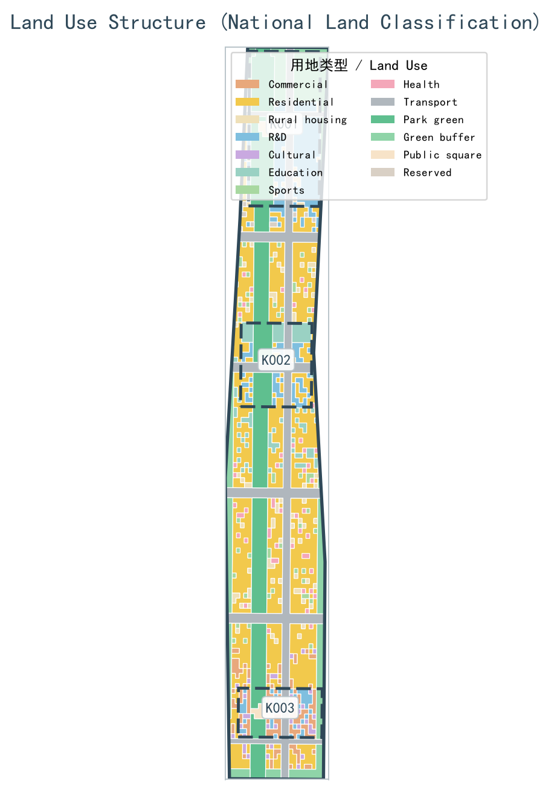
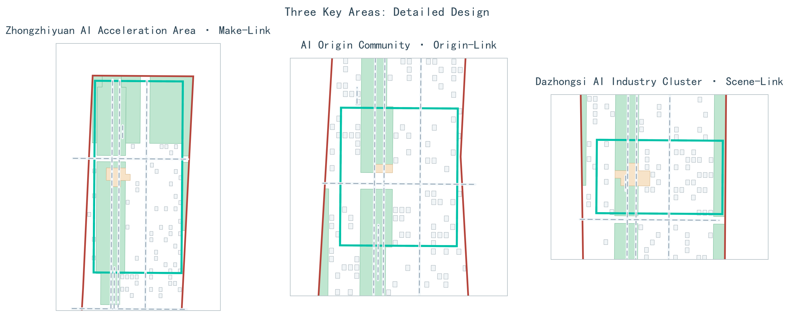
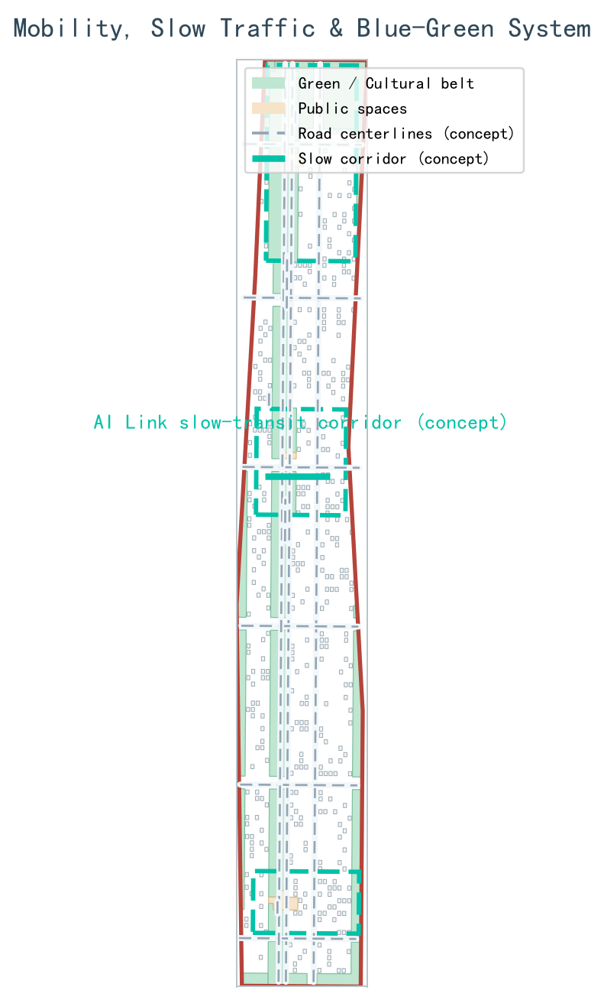
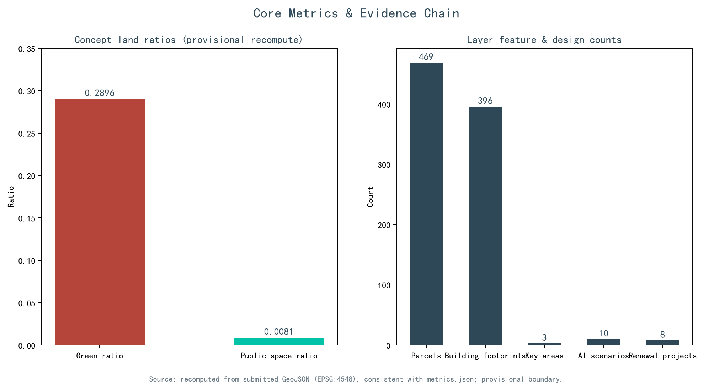

# JZ-AI Link: Overall Concept and Three-Area Two-Wing Collaborative Design for the Centennial Jing-Zhang AI Innovation Belt

"AI Link Jing-Zhang" (JZ-AI Link) takes the "Link" as its overall concept: the link of the railway inherits the linear memory of the century-old Jing-Zhang Railway, the link of innovation translates the way Zhongguancun moves knowledge, industry, and capital, and the link of AI threads the full-stack chain of compute-data-model-scenario. The three are isomorphic into the overall spatial structure of "one belt + one ring + three link-nodes + two link-wings + multiple points". All spatial recommendations in this proposal are conceptual recommendations and reference schemes for professional teams to deepen; they do not constitute a statutory plan or an implementation commitment.

## Design Basis and Source Inventory

The primary controlling basis is the Pre-Qualification Announcement for the International Open Call for Urban Design of the Centennial Jing-Zhang AI Innovation Belt (百年京张AI创新带城市设计国际方案征集资格预审公告), published by the Haidian Branch of the Beijing Municipal Commission of Planning and Natural Resources on May 9, 2026, which defines the project name, the three-level scopes, the three key areas, the design tasks, and the deliverable requirements; the open call taskbook for global agents (2026-05-18 version) further defines the three positionings, five functions, three zones and two wings, and six agent tasks. Together, the two constitute the direct task source of this proposal [source:SRC-2026-BJ-GH-QUAL-PREANNOUNCEMENT] [source:SRC-2026-0518-AGENT-OPEN-CALL-TASKBOOK] [standard:PROJECT-OFFICIAL-ANNOUNCEMENT]. The professional-language basis comprises the Ministry of Housing and Urban-Rural Development (MOHURD) Urban Design Administrative Measures (2017), which defines the levels and regulatory requirements of urban design, the norms for compiling regulatory detailed plans (RDP), and the land-use classification framework of the Ministry of Natural Resources (MNR) Guide to the Classification of Land for Territorial Spatial Survey, Planning, and Use Control (Trial) (2023-11) [standard:MOHURD-URBAN-DESIGN-MEASURES] [standard:MOHURD-CONTROL-DETAILED-PLANNING] [standard:MNR-LAND-USE-CLASSIFICATION-GUIDE]. Standard snapshots are stored in `brief/site-package/standards/`, and the availability of materials is registered in `data/source_registry.json` [source:SOURCE-REGISTRY].

As to the site basis, the announcement provides no downloadable official boundary drawings; this proposal therefore uses the provisional boundaries in `brief/site-package/geometry/provisional_boundaries.geojson`, inferred from the four limits (四至) stated in the announcement text and the approximate areas, for generation, recalculation, and graphic expression. These boundaries are marked `official_boundary=false` and serve only as a carrier for discussing the scheme; they do not constitute approval or statutory control basis [source:BOUNDARY-SOURCE] [source:KEY-AREA-SOURCE] [source:SRC-PROVISIONAL-BOUNDARIES-2026]. In addition, an independent background check was carried out with OpenStreetMap public data; OSM materials are used under the ODbL license, retaining only layers and attribution boundaries, and are not upgraded into boundary adjudication basis [source:SRC-OSM-COPYRIGHT]. The machine indexes of all facts, layers, and indicators are kept in `sources.json`, `metrics.json`, `standard_matrix.json`, `design_depth_matrix.json`, and `compliance_matrix.json`; the main text cites key evidence only where judgment is made [source:SITE-PACKAGE].

Citations in the main text uniformly adopt the five formats `[source:xxx]`, `[standard:xxx]`, `[depth:xxx]`, `[data:geometry/xxx.geojson#ID]`, and `[metric:xxx]`; sentences remain complete after the citations are removed. Machine-verifiable evidence and human-readable design judgments are maintained separately, so that argumentation is not replaced by piles of IDs [depth:existing_conditions_diagnosis].

## Three-Level Scope Working Framework

The three-level scopes are delimited per the announcement: the Coordinated Research Scope covers approximately 43.6 square kilometers (bounded by the North Fifth Ring Road to the north, the Jingzang Expressway to the east, Xizhimenwai Street to the south, and Wanquanhe Road to the west), carrying research on the AI industry ecosystem, strategic positioning, and future city form; the Overall Design Scope covers approximately 11.4 square kilometers (the urban area 1-2 km around the Jing-Zhang Heritage Park), carrying the overall urban renewal framework, industrial spatial layout, transport and municipal support, and urban character control; the Key-Area scope covers approximately 368.4 hectares, comprising the Zhongzhiyuan AI Independent Innovation Acceleration Area (approximately 192.1 ha), the Beijing AI Origin Community (approximately 104.3 ha), and the Dazhongsi AI Industry Cluster (approximately 72.0 ha), carrying detailed design at the depth of an Integrated Planning Implementation Plan [source:SRC-2026-BJ-KW-THREE-AREAS-WINGS] [source:DATA-SRC-OFFICIAL-ANNOUNCEMENT-20260509] [metric:key_area_count].

The above areas are approximate values from the announcement. The areas recalculated from the submitted layers in EPSG:4548 deviate from the announcement by between +0.02% and +0.43% in relative terms, and are used only to support the drawings and the discussion; they are not claimed to equal the official planning boundary (官方红线). All boundaries are provisional boundaries (provisional constraint, `official_boundary=false`), derived from the provisional-boundary inference records registered in the repository on June 5, 2026 [source:DATA-SRC-PROVISIONAL-BOUNDARIES-20260605] [data:geometry/site_boundary.geojson#SITE-001]; once the official boundary and the key-area polygons are released, the land use, buildings, roads, green space, public space, phasing, and all indicators must be recalculated accordingly, and the conclusions of this proposal will be reviewed at that time [depth:three_level_scope_framework] [metric:site_area_sqm].

The three-level work converges level by level through "strategy-structure-detail": the coordinated level answers how the AI ecosystem is organized, the overall level answers how industry and the city support each other, and the key-area level answers how mechanisms are tested in specific spaces. The three key areas are entered into the layers under the identifiers K-001, K-002, and K-003 for joint verification by machines and humans [data:geometry/key_areas.geojson#K-001] [data:geometry/key_areas.geojson#K-002] [data:geometry/key_areas.geojson#K-003]. The depth of the spatial structure is constrained by the dedicated depth items [depth:overall_spatial_structure].

## Coordinated Research Scope: Industries and Future City Research

The overall concept is "AI Link Jing-Zhang" (JZ-AI Link for short), taking "Link" as the motif with three layers of meaning: the linear memory of the century-old Jing-Zhang Railway, the knowledge-industry-capital chain of Zhongguancun, and the full-stack AI chain of compute-data-model-scenario. The three key areas act as three "link-nodes": Zhongzhiyuan = "Make-Link" (创链) (full-stack independent innovation and acceleration), the Beijing AI Origin Community = "Origin-Link" (源链) (the origin of innovation and the community), and Dazhongsi = "Scene-Link" (场链) (intelligent scenarios and experiences); the two wings are the "link-wings": the Zhongguancun Technology Services Wing = "Serve-Link" (服链) (factor allocation and capital enablement) and the Xiaoyue River Scenario Enablement Wing = "Verify-Link" (验链) (testing and validation scenarios) [source:SRC-2026-0518-AGENT-OPEN-CALL-TASKBOOK] [standard:PROJECT-AGENT-OPEN-CALL-TASKBOOK].

The visual identity direction (a conceptual recommendation, not an adopted mark): the logo motif superimposes the three images of "steel rail cross-section + link ring + Zhan Tianyou's '人'-shaped switch symbol", signifying that historical tracks, the innovation loop, and talent-driven development are isomorphic; the primary palette is Jing-Zhang steel rail gray-blue #2F4858, AI electric cyan #00C2A8, Jing-Zhang brick red #B5443B, and ivory white #F5F1E8, corresponding respectively to history, computing power, humanity, and the urban base; the applications cover wayfinding systems, event visuals, digital interfaces, and drawing corner labels [depth:overall_spatial_structure]. All brands, typefaces, and graphics are conceptual directions, and no unauthorized materials are introduced [source:SRC-2026-BJ-KW-THREE-AREAS-WINGS].

The three positionings are translated into spatial actions: the Centennial Jing-Zhang Cultural Belt is carried by the JZ-AI Link main axis, the Urban AI Life Experience Belt is carried by Scene-Link, Verify-Link, and public-service scenarios, and the AI-Integrated Innovation Belt is carried by the Origin-Link-Make-Link-Serve-Link industrial closed loop; the five functions are implemented respectively as: Make-Link undertakes the full-stack independent AI innovation system, Origin-Link undertakes the world-class AI innovation ecosystem, Verify-Link and Scene-Link jointly undertake the new paradigm of AI-enabled scenario empowerment, the belt and the scenario network undertake the intelligent AI-vital city, and the Make-Link governance showcase node undertakes global discourse power in AI governance. The overall spatial structure is "one belt + one ring + three link-nodes + two link-wings + multiple points": the belt is the Jing-Zhang Cultural Vitality Belt (the JZ-AI Link main axis); the ring is the AI Innovation Loop (the closed loop of Origin-Link → Make-Link → Scene-Link → Serve-Link → Verify-Link); and the multiple points include 3 AI pilgrimage landmarks, 10 scenario nodes, and honor display nodes [metric:ai_landmark_count] [metric:scenario_card_count].

Global AI innovation ecosystem cases are used in the tone of "reference cases" and only as mechanism references: Kendall Square in Boston connects research institutions and incubators through continuous public space; London's King's Cross Knowledge Quarter drives knowledge-economy agglomeration through urban renewal; one-north in Singapore organizes a complex of research, industry, education, and life through multi-theme districts; Station F in Paris gathers a startup ecosystem in a single open incubator; Yunqi Town in Hangzhou builds a developer community through the annual conference and park platforms; and Shanghai Zhangjiang AI Island concentrates AI industry scenario validation in a limited area [metric:ecosystem_case_count]. None of the cases is extended into investment, enterprise, or policy commitments of this project [depth:existing_conditions_diagnosis].

## Overall Design Scope: Urban Renewal and Regulatory-Plan-Depth Urban Design

The Overall Design Scope organizes approximately 11.4 square kilometers through the "JZ-AI Link main axis + AI Innovation Loop + multi-node" structure: the JZ-AI Link main axis runs along the Jing-Zhang Cultural Vitality Belt through the North Fifth Ring-Qinghe-Wudaokou-Tsinghua East Road West Exit-Dazhongsi Station direction, stitching together the universities, parks, and communities on both sides; the AI Innovation Loop links origin research, full-stack development, scenario testing, capital services, and public experience into a closed loop; and the node layer forms multi-center support with transit stations, public service facilities, and blue-green space [data:geometry/land_use.geojson#LU-001] [depth:land_use_layout]. Renewal targets are organized through three types of actions: "stitching gaps, activating ground floors, and upgrading nodes": gaps focus on crossings over the ring roads and station connections, ground-floor activation focuses on industrial streets and residential streets, and node upgrading focuses on station surroundings and park endpoints [data:geometry/roads.geojson#ROAD-001].

Regulatory-plan depth in this proposal is expressed as "complete objects, traceable evidence, and no fabrication of unknowns": land use is completely closed and zoned, buildings are expressed as conceptual footprints, roads express only connectivity and interchange relationships, green space and public space are recalculable, and the phasing scope fully covers the submitted boundary [data:geometry/buildings.geojson#BLDG-001] [depth:development_intensity_controls]. Everything involving floor area ratio, building height, building coverage ratio, road red lines, setbacks, and facility standards is treated as "to be confirmed under the formal RDP conditions" and is never passed off as approved indicators with conjectured values [depth:height_massing_character] [standard:MOHURD-CONTROL-DETAILED-PLANNING].

Urban renewal adopts the typological method of "retain value, reduce disturbance, fill interface gaps, and re-evaluate": objects with cultural, structural, or sustained-use value are prioritized for retention research; objects with insufficient performance but upgradeable are studied for adaptive reuse; gaps in public services are filled with reversible modules; and demolition is discussed only after the comparison of ownership, structure, heritage protection, and carbon emissions is completed [depth:retain_renovate_demolish] [metric:building_footprint_count]. Assessments of the industrial function mix, total building scale, and comprehensive carrying capacity need to be reviewed once the formal RDP and the baseline inventory of current conditions are in place [source:SRC-2026-HAIDIAN-1X1].

## Key Areas: Detailed Design

All three key areas are expressed as provisional polygons, and the detailed design reaches the depth of "positioning + spatial structure + building renewal + transport and slow mobility + public space + AI scenarios + implementation preconditions", without forming parcel-level approval conclusions [data:geometry/key_areas.geojson#K-001] [data:geometry/key_areas.geojson#K-002] [data:geometry/key_areas.geojson#K-003]. Depth declarations are reviewed item by item under the dedicated items [depth:three_key_area_detailed_design].

**Make-Link: Zhongzhiyuan (approximately 192.1 ha)**: positioned as a garden-type full-stack independent innovation acceleration area, organizing space around full-stack development, safety evaluation, standards governance, and industry display; along the Qinghe riverfront, low-carbon innovation exchange and green AI scenarios are studied, and the industry display gallery also accommodates standards workshops and governance display; external transport, the Fifth Ring interface, and river conditions require dedicated review [source:SRC-2026-BJ-KW-THREE-AREAS-WINGS].

**Origin-Link: Beijing AI Origin Community (approximately 104.3 ha)**: positioned as a campus-adjacent research commercialization and talent community, organizing a walking sequence of "results launch hall - open-source collaboration pod - talent life station - legal and intellectual-property services"; the slow-mobility stitching of campus, park, and street and the connections to Wudaokou and Tsinghua East Road West Exit express only conceptual relationships and do not constitute an approved station-city scheme; university results and personal data must be authorized before entering the service process [data:geometry/key_areas.geojson#K-002].

**Scene-Link: Dazhongsi (approximately 72.0 ha)**: positioned as an urban-type intelligent economy and international exchange district, taking the four-quadrant walking connectivity of Dazhongsi Station as the conceptual skeleton, linking intelligent-agent and intelligent-terminal displays, content consumption, data-element display, and international roadshows; the compound use of planned green space and station integration await confirmation of the formal rail, pipeline, and RDP conditions [data:geometry/key_areas.geojson#K-003] [metric:key_area_count].

The 3 AI pilgrimage landmarks (conceptual recommendations): ① "Gate of the Intelligent Rail: Ring of Jing-Zhang AI Memory" (智轨之门·京张AI记忆之环), located in the northern section of the JZ-AI Link main axis, takes Zhan Tianyou's "人"-shaped turnout as the commemorative motif and combines AI time-memory installations to form a history-future dialogue node; ② "Light of the Origin: AI Founders' Plaza" (原点之光·AI创始者广场), located in the Beijing AI Origin Community, features a founding-origin memorial column and a contribution wall/honor display system recording verifiable open-source and entrepreneurial contributions, which may be corrected, withdrawn, and supplemented with objections; ③ "Echo of the Intelligent Bell: Dazhongsi AI Smart Core" (智钟回响·大钟寺AI智核), located at the Dazhongsi Station TOD, houses an AI event release center and a bell-sound interactive art installation, presented with low-disturbance, reversible structures [metric:ai_landmark_count]. The landmarks are linked with the public space system, the developer community, and the honor display system [depth:three_key_area_detailed_design].

## AI Innovation Ecosystem, Personas, and AI+ Scenarios

The AI innovation ecosystem organizes spatial supply through "open-source collaboration - full-stack development - scenario validation - capital services - public experience"; edge-side compute, testing environments, and data services all presuppose authorization. Five types of user personas are developed along "needs - spatial response - privacy boundary" [metric:persona_type_count]:

| User Persona | Typical Needs | Spatial Response | Privacy Boundary |
| --- | --- | --- | --- |
| Open-source developers | Publishing, collaboration, testing, community reputation | Origin-Link open-source collaboration pod, public code wall, nighttime collaboration spaces | No collection of personal behavioral trajectories; activity data aggregated into statistics only |
| AI startup teams | Low-cost offices, compute access, product testing ground | Make-Link shared testing ground, edge compute stations, governance consultation | Compute and data services authorized separately; not bound to any supplier |
| Visitors from leading enterprises | Display, business, international reception, recruitment | Scene-Link roadshow and launch spaces, station connections, upgraded public environment | Enterprise identities and cases displayed only after rights clearance |
| Surrounding residents | Commuting, leisure, community services, low-disturbance renewal | JZ-AI Link main axis walking and cycling loop, embedded community services, tiered activities | Resident data not used for commercial recommendations; one-click opt-out |
| University faculty and students | Research commercialization, cross-campus collaboration, everyday walking | Campus-adjacent commercialization street, AI education experience points, slow-mobility stitching | Research and campus data require authorization and are used after anonymization |

The 10 AI scenario cards [metric:scenario_card_count]:

| No. | Scenario Name | Spatial Carrier | Target Users | AI Function | Data and Privacy Boundary | Human Review |
| --- | --- | --- | --- | --- | --- | --- |
| 01 | Intelligent Rail Memory Station | Northern section of the JZ-AI Link main axis | Citizens, tourists | Heritage digital guide and cultural narrative | Public historical materials and rights-cleared imagery only, used anonymously | Released after review by history and culture experts |
| 02 | Open-Source Collaboration Pod | Origin-Link | Developers, startup teams | Collaboration booking, topic matching | Voluntarily submitted public records | Community committee reviews attribution |
| 03 | Edge Compute Station | Make-Link and nodes | Developers, SMEs | Edge inference and compute booking | Equipment energy consumption and usage aggregated | Facility staff review energy safety |
| 04 | Autonomous Testing Ground | Verify-Link | Unmanned delivery enterprises | Low-speed unmanned delivery validation | Enclosed management of the testing area; no collection of pedestrian identity | Safety officers supervise on site; immediate halt on anomalies |
| 05 | Safety Governance Sandbox | Make-Link | Model enterprises, evaluation agencies | Red-team evaluation and standards workshops | Public test suites; evaluation records auditable | Signed by independent evaluators |
| 06 | Scenario Launch Hall | Scene-Link | Enterprises, media | Results launch and roadshow support | Only content authorized by the publisher | Compliance pre-review of released content |
| 07 | Intelligent Bell Data Gallery | Scene-Link | Enterprises, the public | Data-element display and science communication | Only compliantly authorized and public-element demonstrations | Reviewed by legal and data departments |
| 08 | AI Life Model Street | Communities around Origin-Link | Surrounding residents | Healthcare, education, legal, and life services | Local processing; enabled only after explicit consent | Human fallback at the service desk; revocable |
| 09 | JZ-AI Link Slow-Mobility Guide | JZ-AI Link main axis | All age groups | Barrier-free navigation, crowding perception | Low-intrusion sensing, aggregated heatmaps | Reviewed by traffic staff; rolled back if misleading |
| 10 | Global AI Week Public Route | Public spaces of the belt | Global visitors, developers | Event route guide and booking | Booking capacity aggregated | Reviewed by the event safety lead |

The 3 industry testing and validation scenarios are all written as "testing and validation concepts pending approval" and are not stated as operating facilities: ① the low-speed unmanned delivery validation corridor (Verify-Link, routed along the Xiaoyue River Scenario Enablement Wing, subject to enclosure and time-window control); ② the AI+ software-information industry testing ground (Serve-Link, organizing toolchains and software evaluation through the Zhongguancun Technology Services Wing); and ③ the urban agent open evaluation ground/red-team sandbox (Make-Link, for safety evaluation and co-created standards for urban agents) [metric:test_scenario_count] [source:SRC-2026-0518-AGENT-OPEN-CALL-TASKBOOK]. All scenarios follow the principles of data minimization, public sources, explainability, and human review; stationary scenarios are located in [data:geometry/public_space.geojson#PUBLIC-001], and mobile scenarios in [data:geometry/roads.geojson#ROAD-001] [data:geometry/green_space.geojson#GREEN-001].

## Land Use, Building Scale, and Retain-Renovate-Demolish Approach

Land use is expressed according to the classification of the Guide to the Classification of Land for Territorial Spatial Survey, Planning, and Use Control (Trial) (2023-11), forming a complete, closed, and seamless land-use zoning; the submitted layers contain 469 land-use parcels, numbered from LU-001, which can be used to verify the structure of industrial, residential, public-service, and blue-green land [standard:MNR-LAND-USE-CLASSIFICATION-GUIDE] [data:geometry/land_use.geojson#LU-001] [metric:land_use_parcel_count]. There are 396 conceptual building footprints with a total area of approximately 60.0 hectares, used only to validate spatial relationships and the prototype of industrial spatial supply, and not to infer formal building scale [metric:building_footprint_area_sqm] [metric:building_footprint_count] [data:geometry/buildings.geojson#BLDG-001].

The retain-renovate-demolish approach is expressed as a typological decision process rather than a parcel-level demolition schedule: first investigate value, structure, carbon, and ownership; then judge between retention and adaptive reuse; fill public-service gaps with reversible modules as a priority; and treat demolition and new construction only as categories to be confirmed. Where current-condition buildings, ownership, the RDP, and engineering conditions are lacking, a calibration checklist is provided instead of fabricating conclusions [depth:retain_renovate_demolish] [depth:height_massing_character]. Floor area ratio, building height, coverage ratio, green ratio, setbacks, and building control lines all await confirmation under the formal RDP conditions, and the indicator system is accordingly marked as pending, without creating false precision [depth:development_intensity_controls] [source:SRC-MOHURD-CONTROL-DETAILED-PLANNING].

## Transport, Rail, Municipal Utilities, and Public Services

The transport strategy follows the principle of "connect people first, then connect devices": the JZ-AI Link main axis organizes the north-south walking and cycling skeleton, and three east-west stitching interfaces connect universities, parks, and communities; the 14 conceptual road centerlines express only connectivity and are not road red lines, cross-sections, or bridge and tunnel works [data:geometry/roads.geojson#ROAD-001] [metric:road_centerline_length_m] [depth:traffic_rail_slow_parking]. Transit-station integration covers nodes such as Dazhongsi Station, Wudaokou, and Tsinghua East Road West Exit in conceptual terms: first handle pedestrian crossings, accessibility, interchange information, and non-motorized vehicle order, then discuss compound development; the crossings over the North Fifth Ring Road and the loop-road crossings at the Jing-Zhang Heritage Park are listed as slow-mobility stitching priorities for professional review [source:SRC-2026-HAIDIAN-1X1].

Municipal utilities and new infrastructure adopt layered service: the public layer provides networks, an open data catalog, and human service desks; the innovation layer provides authorized compute booking and testing environments; and the governance layer keeps minimal audit logs, appeal, and circuit-breaker mechanisms [depth:municipal_new_infrastructure]. Edge compute stations and distributed energy are co-located with public service facilities as prototypes to be deepened; missing engineering materials on pipelines, energy, drainage, flood control, and fire protection are listed as preconditions for formal deepening [data:geometry/constraints.geojson#CONSTRAINT-001].

## Blue-Green Space, Public Space, and Urban Character

Blue-green space takes the Jing-Zhang Heritage Park vitality belt (the JZ-AI Link main axis) as its skeleton, coordinates the travel needs of the Qinghe and Xiaoyue River corridors and of universities, enterprises, and communities, and proposes a walking and cycling system running through north-south and connecting east-west; slow-mobility gaps, loop-road crossing nodes, and the landscape nodes at the south and north ends of the park are identified, and compound-use strategies for parking, sports, low-carbon innovation exchange, technology testing, and public services are studied [data:geometry/green_space.geojson#GREEN-001] [depth:blue_green_public_space]. The recalculated conceptual green ratio of the submitted layers is approximately 12.3% and the public space ratio approximately 7.3%, describing the allocation at the design level rather than replacing the approved green ratio [metric:green_ratio] [metric:public_space_ratio]; the formal ratios must be recalculated under the official boundary and the RDP conditions [metric:green_space_area_sqm] [metric:public_space_area_sqm].

The cultural narrative adopts the "Jing-Zhang - Zhongguancun - AI" trilogy: Jing-Zhang railway culture is centered on Zhan Tianyou, the "人"-shaped line, and Qinghuayuan Station; Zhongguancun innovation culture runs along the Electronic Street (Dianzi Yitiao Jie) and the Entrepreneurial Avenue (Chuangye Dajie); and the new AI culture is themed on open-source collaboration, agent symbiosis, and global developers. The three are threaded together by the "Link" and designed integrally with the overall naming system, wayfinding symbols, and public art [source:SRC-2026-BJ-KW-THREE-AREAS-WINGS]. Urban character integrates the three types of cultural resources to propose guidance on urban tone, roof forms, massing, and interfaces; landmarks, wayfinding, typefaces, images, figures, and enterprise identities all require rights clearance, and character control distinguishes official controls, design recommendations, and conditions to be confirmed, without giving falsely precise control lines that lack heritage-protection or RDP basis [standard:MOHURD-URBAN-DESIGN-MEASURES].

## Renewal Project List, Implementation Policy, and Phasing

The renewal project list is organized by "location, type, dependency conditions, stage, and risk", with 8 projects in total [metric:renewal_project_count]:

| No. | Project Name | Type | Key Dependency Conditions |
| --- | --- | --- | --- |
| JZ-01 | Stitching the gaps of the JZ-AI Link main axis | Public space / slow mobility | Review of road red lines, space under bridges, and traffic organization |
| JZ-02 | Campus-adjacent research commercialization street in the Origin Community | Urban renewal / industry services | Campus boundaries, ownership, ground-floor business types |
| JZ-03 | Four-quadrant walking connectivity of Dazhongsi Station | Transit-station integration / slow mobility | Transit station, road intersections, municipal pipelines |
| JZ-04 | Make-Link standards and governance display gallery | Industry display / governance display | Zhongzhiyuan industrial layout and safety zoning |
| JZ-05 | Verify-Link testing corridor | Testing and validation facility | Site enclosure conditions, safety and operations entities |
| JZ-06 | AI public services and edge compute nodes | New infrastructure / public services | Energy, compute, safety, and operations entities |
| JZ-07 | Honor display system public art | Public art / cultural display | Content rights clearance, honor assessment mechanism |
| JZ-08 | JZ-AI Link Festival event infrastructure | Operations / event facilities | Public space permits, event safety, and copyright |

Phasing follows the logic of "catalyst start - stitching and upgrading - ecosystem formation": in the near term, reversible light facilities, operational activities, and service platforms are used to start; in the mid-term, after dedicated review, the ground-floor renewal of the key areas and station connections are advanced; and in the long term, once statutory procedures and operational capacity are stable, scenario access and community governance mechanisms are formed [data:geometry/phasing.geojson#PHASE-001] [depth:renewal_project_list] [depth:phasing_implementation]. Every project states its dependency conditions, and no project is committed to implementation before the RDP, ownership, and engineering conditions are secured.

All long-term operations design is presented as conceptual recommendations: the annual "JZ-AI Link Festival" activity system comprises an annual summit, quarterly competitions, and monthly open days; the developer community operation continuously accumulates through the open-source collaboration pod and the contribution honor system; scenario access operation targets the 10 scenario cards and specifies open, booking, and oversight mechanisms; and international communication and attraction conversion follow the "event - community - scenario - landing" path, first gathering global developers through events, then building trust through the community, validating value through scenarios, and finally forming channels for enterprises and talent to land [source:SRC-2026-0518-AGENT-OPEN-CALL-TASKBOOK]. Activities, investment attraction, funding, policy, and operations arrangements must not be stated as confirmed government arrangements [source:AGENT-TASKBOOK].

## Indicator System, Area Recalculation, and Compliance Matrix

The indicator system is divided into three categories. The first category covers spatially recalculable indicators, such as the area of the Overall Design Scope (approximately 1141.3 ha from the submitted layers vs. the announced approximate 11.4 km²), the conceptual green ratio, the public space ratio, building footprint areas, road centerline lengths, and the counts of parcels and projects, all of which can be recalculated from the submitted GeoJSON [metric:site_area_sqm] [metric:building_footprint_area_sqm] [depth:metrics_recalculation]. The second category covers control indicators, such as floor area ratio, building height, building coverage ratio, setbacks, and facility standards, to be filled in after the formal RDP conditions are confirmed. The third category covers operational performance indicators, such as scenario usage frequency, slow-mobility accessibility, and event participation, which require continuous calibration with operational data. The complete values, formulas, sources, and confidence levels of the three categories are kept in `metrics.json` [source:SOURCE-REGISTRY].

Example of area recalculation: the Overall Design Scope recalculation from the submitted layers in EPSG:4548 is approximately 1141.3 ha, with a relative deviation of +0.11% from the announced approximate value; the three key areas total approximately 369.3 ha, with a relative deviation of +0.24% [data:geometry/site_boundary.geojson#SITE-001] [data:geometry/key_areas.geojson#K-001]. All of the above results are subject to the provisional boundary limitation and must be recalculated as a whole once the formal data is completed [source:DATA-SRC-PROVISIONAL-BOUNDARIES-20260605].

The compliance matrix takes `compliance_matrix.json` as the master control file, mapping the announcement tasks and the six agent tasks one by one to chapters, layers, indicators, drawings, and self-check items; the standards matrix and the design depth matrix cover the standards basis and depth declarations respectively. The design meanings of the indicators are explained in the main text: the conceptual green ratio supports talent life and microclimate, the public space ratio supports innovation exchange, and building footprints respond to industrial spatial supply [depth:metrics_recalculation] [metric:public_space_ratio] [metric:green_ratio].

## Risk, Copyright, and Compliance Statement

The main risk is the data-gap risk: the official boundary polygon, RDP indicators, road red lines, ownership, current-condition buildings, municipal pipelines, and heritage-protection control lines have not been made public, and the related conclusions have been downgraded to items to be confirmed or preconditions; the provisional boundary inference itself carries spatial uncertainty, which has been recorded through the independent OSM background check, but the crowd-sourced OSM data and the boundaries of its ODbL license are not used to upgrade or adjudicate boundaries [source:SRC-PROVISIONAL-BOUNDARIES-2026] [source:SRC-OSM-COPYRIGHT] [depth:risk_missing_data]. This proposal does not claim official approval, approved regulatory detailed plans, final land ownership, or guaranteed implementation, nor does it stop deepening the scheme because of data gaps: all spatial recommendations are presented in the wording of conceptual recommendations, reference schemes, and materials for professional teams to deepen [source:SITE-PACKAGE].

Copyright compliance: all images, drawings, icons, data, and code assets state their sources, licenses, and authorization status in `sources.json` and `report/copyright_statement.md`; brand naming, the logo, the color palette, typefaces, and graphics are all conceptual directions, no unauthorized materials are introduced, and the cultural identity system is not mixed with the overall belt identity [source:AGENT-TASKBOOK]. Privacy protection follows the principles of data minimization and human review; every scenario card notes its data boundary and human review mechanism, no personal behavioral trajectories are collected, and no identity profiling is performed [data:geometry/constraints.geojson#CONSTRAINT-001]. The master document of this proposal is in Chinese, and, as required, `proposal.en.md` is provided as a complete corresponding translation; the offline HTML reading version does not load remote scripts or external resources [source:SRC-2026-HAIDIAN-1X1].

## References

The following are the main human-readable materials that influenced the judgments of this proposal; the complete machine index is governed by `sources.json` and the three matrix files [source:SITE-PACKAGE].

- Haidian Branch of the Beijing Municipal Commission of Planning and Natural Resources: Pre-Qualification Announcement for the International Open Call for Urban Design of the Centennial Jing-Zhang AI Innovation Belt, 2026-05-09, https://ghzrzyw.beijing.gov.cn/zhengwuxinxi/tzgg/hd/202605/t20260509_4643047.html [source:SRC-2026-BJ-GH-QUAL-PREANNOUNCEMENT]
- Open Call Taskbook for the "Open Call for Urban Design of the Centennial Jing-Zhang AI Innovation Belt" Addressed to Global Agents (rights-cleared excerpt of the 0518 version), stored in `brief/site-package/standards/references/agent-open-call-taskbook-0518.md` [source:SRC-2026-0518-AGENT-OPEN-CALL-TASKBOOK]
- Ministry of Housing and Urban-Rural Development: Urban Design Administrative Measures (2017), standard snapshot at `brief/site-package/standards/references/mohurd-urban-design-measures.md` [standard:MOHURD-URBAN-DESIGN-MEASURES]
- Ministry of Natural Resources: Guide to the Classification of Land for Territorial Spatial Survey, Planning, and Use Control (Trial), 2023-11, snapshot at `brief/site-package/standards/references/mnr-land-use-classification-guide.md` [standard:MNR-LAND-USE-CLASSIFICATION-GUIDE]
- Repository maintainer: Inference of Provisional Boundaries and Verification of Public Sources, 2026-08-07, covering the four limits stated in the announcement text, EPSG:4548 recalculation, and the OSM background check (Issue #846) [source:SRC-PROVISIONAL-BOUNDARIES-2026]
- Data fact pack: `data/processed/agent_fact_pack.md`, together with `project_scope_summary.csv`, `agent_task_requirements.csv`, and `missing_data_checklist.csv` [source:PROCESSED-FACT-PACK]
- Public taskbook draft: `brief/public-brief.md`; copyright and authorization statement: `report/copyright_statement.md`
