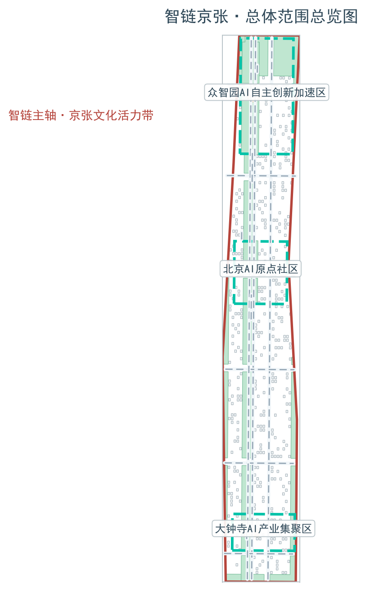
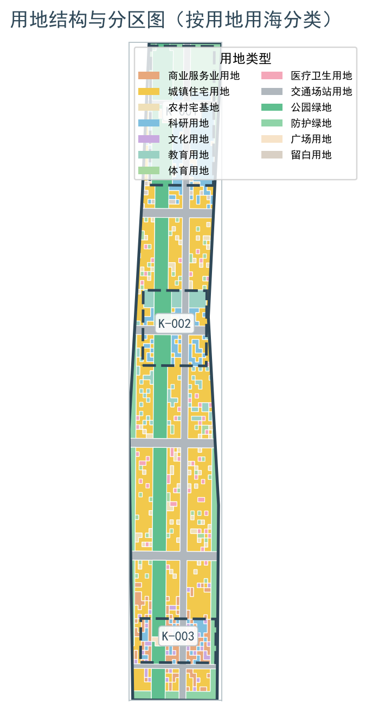
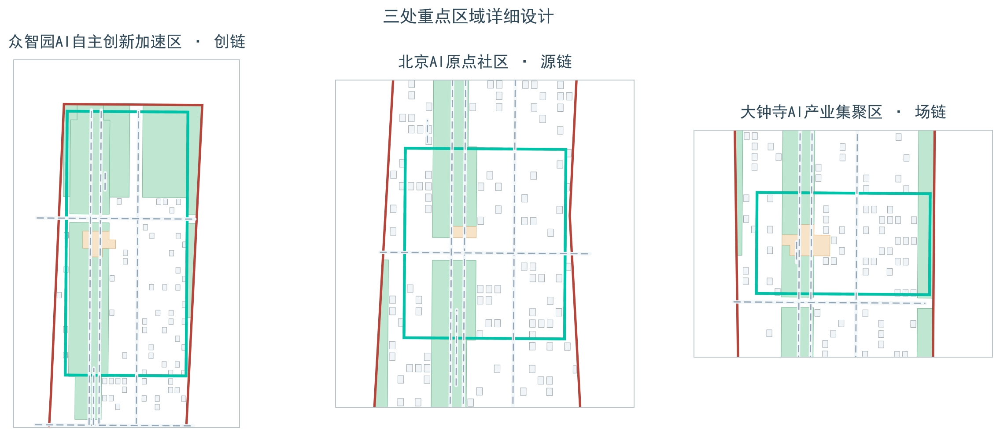
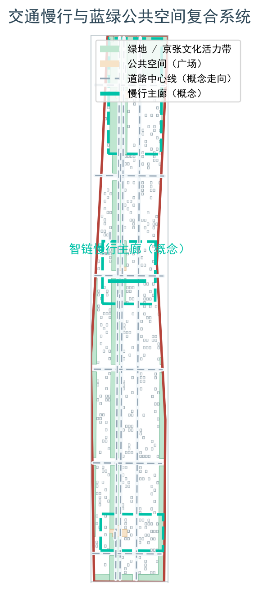
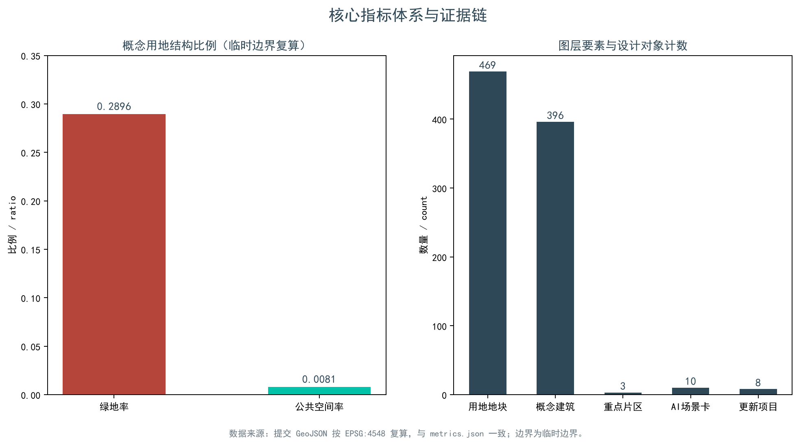

# 智链京张：百年京张AI创新带总体概念与三区两翼协同设计

「智链京张 · AI Link Jing-Zhang」以"链"为总体概念：铁路之链承接百年京张的线形记忆，创新之链转译中关村知识—产业—资本的运动方式，AI之链贯通算力—数据—模型—场景的全栈链路，三者同构为"一带+一环+三链节+双链翼+多点"的总体空间结构。本方案全部空间建议均为概念建议、参考方案，可供专业团队深化研究，不构成法定规划或实施承诺。

## 设计依据与资料清单

主控依据为北京市规划和自然资源委员会海淀分局2026年5月9日发布的《百年京张AI创新带城市设计国际方案征集资格预审公告》，其确定项目名称、三层范围、三处重点区、设计任务与成果要求；面向全球智能体的开源征集任务书（2026-05-18版本）进一步明确三大定位、五大功能、三区两翼与六项智能体任务，二者共同构成本方案的直接任务来源 [source:SRC-2026-BJ-GH-QUAL-PREANNOUNCEMENT] [source:SRC-2026-0518-AGENT-OPEN-CALL-TASKBOOK] [standard:PROJECT-OFFICIAL-ANNOUNCEMENT]。专业语言依据住建部《城市设计管理办法》（2017）对城市设计层级与管控要求的界定、控制性详细规划编制相关规范，以及自然资源部《国土空间调查、规划、用途管制用地用海分类指南（试行）》（2023-11）的用地分类框架 [standard:MOHURD-URBAN-DESIGN-MEASURES] [standard:MOHURD-CONTROL-DETAILED-PLANNING] [standard:MNR-LAND-USE-CLASSIFICATION-GUIDE]。规范快照存放于 `brief/site-package/standards/`，资料可用性以 `data/source_registry.json` 登记为准 [source:SOURCE-REGISTRY]。

场地依据方面，公告未提供可下载的官方边界图件，本方案采用 `brief/site-package/geometry/provisional_boundaries.geojson` 中按公告文字四至与约面积推定的临时边界开展生成、复算与图面表达；该边界标注 `official_boundary=false`，仅作方案讨论载体，不构成审批或法定控制依据 [source:BOUNDARY-SOURCE] [source:KEY-AREA-SOURCE] [source:SRC-PROVISIONAL-BOUNDARIES-2026]。另以OpenStreetMap公开数据做过独立背景核对，OSM资料按ODbL许可使用，仅保留图层与署名边界，不升级为边界裁决依据 [source:SRC-OSM-COPYRIGHT]。全部事实、图层与指标的机器索引保存在 `sources.json`、`metrics.json`、`standard_matrix.json`、`design_depth_matrix.json` 与 `compliance_matrix.json`，正文只在判断处引用关键证据 [source:SITE-PACKAGE]。

正文引用统一采用 `[source:xxx]`、`[standard:xxx]`、`[depth:xxx]`、`[data:geometry/xxx.geojson#ID]`、`[metric:xxx]` 五类格式，删除引用后句子仍然完整；机器可复核的证据与人类可读的设计判断分别维护，避免以编号堆叠替代论证 [depth:existing_conditions_diagnosis]。

## 三层范围工作框架

三层范围按公告划定：统筹研究范围约43.6平方公里（北至北五环路、东至京藏高速、南至西直门外大街、西至万泉河路），承担AI产业生态、战略定位与未来城市形态研究；总体设计范围约11.4平方公里（京张遗址公园周边1—2公里城市地区），承担城市更新总体框架、产业空间布局、交通市政支撑与风貌控制；重点区域范围约368.4公顷，含众智园AI自主创新加速区（约192.1公顷）、北京AI原点社区（约104.3公顷）、大钟寺AI产业聚集区（约72.0公顷），承担规划综合实施方案深度的详细设计 [source:SRC-2026-BJ-KW-THREE-AREAS-WINGS] [source:DATA-SRC-OFFICIAL-ANNOUNCEMENT-20260509] [metric:key_area_count]。

以上面积为公告约值。本方案提交图层按EPSG:4548复算的面积与公告相对偏差介于+0.02%与+0.43%之间，仅用于支撑图面与讨论，不宣称等于官方红线。所有边界均为临时边界（provisional constraint，`official_boundary=false`），来自仓库2026年6月5日登记的临时边界推定记录 [source:DATA-SRC-PROVISIONAL-BOUNDARIES-20260605] [data:geometry/site_boundary.geojson#SITE-001]；待正式边界与重点区polygon发布后，用地、建筑、道路、绿地、公共空间、分期及全部指标需同步重算，本方案结论届时相应复核 [depth:three_level_scope_framework] [metric:site_area_sqm]。

三层工作按"战略—结构—细部"逐级收敛：统筹层回答AI生态如何组织，总体层回答产业与城市如何互撑，重点区层回答机制如何在具体空间被检验。三处重点区分别以K-001、K-002、K-003编号进入图层，供机器与人类共同核对 [data:geometry/key_areas.geojson#K-001] [data:geometry/key_areas.geojson#K-002] [data:geometry/key_areas.geojson#K-003]。空间结构深度由专项深度项约束 [depth:overall_spatial_structure]。

## 统筹研究范围产业与未来城市研究

总体概念为「智链京张」（AI Link Jing-Zhang，简称JZ-AI Link）：以"链"为母题，取三重含义——百年京张铁路的线形记忆、中关村知识—产业—资本链条、算力—数据—模型—场景的AI全栈链路。三处重点区作为三个"链节"：众智园=「创链」(Make-Link)（全栈自主创新与加速）、北京AI原点社区=「源链」(Origin-Link)（创新源头与社区）、大钟寺=「场链」(Scene-Link)（智能场景与体验）；双翼为"链翼"：中关村科技服务翼=「服链」(Serve-Link)（要素配置与资本赋能）、小月河场景赋能翼=「验链」(Verify-Link)（测试验证场景）[source:SRC-2026-0518-AGENT-OPEN-CALL-TASKBOOK] [standard:PROJECT-AGENT-OPEN-CALL-TASKBOOK]。

视觉识别方向（概念建议，非已采用标识）：Logo母题取"钢轨断面+链路环+詹天佑'人'字形符号"三重意象叠合，象征历史轨道、创新回路与人才驱动同构；主色板为京张钢轨灰蓝#2F4858、AI电光青#00C2A8、京张砖红#B5443B、象牙白#F5F1E8，分别对应历史、算力、人文与城市基底；应用覆盖导视系统、活动视觉、数字界面与图纸角标 [depth:overall_spatial_structure]。所有品牌、字体、图形均为概念方向，不引入未授权素材 [source:SRC-2026-BJ-KW-THREE-AREAS-WINGS]。

三大定位转译为空间行动：百年京张文化带由智链主轴承载，都市AI生活体验带由场链、验链及公共服务场景承载，AI融合创新带由源链—创链—服链产业闭环承载；五大功能分别落实为创链承担AI全栈自主创新体系，源链承担世界级AI创新生态，验链与场链共同承担AI+场景赋能新范式，一带及场景网络承担智能化AI活力城市，创链治理展示节点承担AI治理全球话语权。总体空间结构为"一带+一环+三链节+双链翼+多点"：一带即京张文化活力带（智链主轴），一环即AI创新回路（源链→创链→场链→服链→验链的闭环），多点含3个AI朝圣地标、10个场景节点与荣誉展示节点 [metric:ai_landmark_count] [metric:scenario_card_count]。

全球AI创新生态案例以"参考案例"语气使用，仅作机制借鉴：波士顿Kendall Square以连续公共空间串联研究机构与孵化器；伦敦King's Cross Knowledge Quarter以城市更新带动知识经济集聚；新加坡one-north以多主题片区组织产学研生活复合；巴黎Station F以单体开放孵化器聚集初创生态；杭州云栖小镇以年度大会与园区平台沉淀开发者社区；上海张江人工智能岛以限定区域集中验证AI产业场景 [metric:ecosystem_case_count]。案例均不引申为本项目投资、企业与政策承诺 [depth:existing_conditions_diagnosis]。

## 总体设计范围城市更新与控规深度城市设计

总体设计范围以"智链主轴+AI创新回路+多节点"组织约11.4平方公里空间：智链主轴沿京张文化活力带串联北五环—清河—五道口—清华东路西口—大钟寺站方向，缝合东西两侧高校、园区与社区；AI创新回路把源头研究、全栈研发、场景测试、资本服务与公共体验连成闭环；节点层以轨道站点、公共服务设施与蓝绿空间形成多中心支撑 [data:geometry/land_use.geojson#LU-001] [depth:land_use_layout]。更新对象按"缝合断点、激活首层、提质节点"三类动作组织：断点聚焦跨环路与站点接驳，首层激活聚焦产业街区与生活街区，节点提质聚焦站点周边与公园端点 [data:geometry/roads.geojson#ROAD-001]。

控规深度在本方案中表现为"对象完整、证据可追踪、未知量不伪造"：用地完整分区闭合，建筑以概念基底表达，道路仅表达连通与接驳关系，绿地与公共空间可复算，分期范围完整覆盖提交边界 [data:geometry/buildings.geojson#BLDG-001] [depth:development_intensity_controls]。涉及容积率、建筑高度、建筑密度、道路红线、退线与设施标准的内容，一律以"待正式控规条件确认"处理，不以推测值冒充审定指标 [depth:height_massing_character] [standard:MOHURD-CONTROL-DETAILED-PLANNING]。

城市更新采用"留价值、降扰动、补接口、再评估"的类型化方法：具有文化、结构或持续使用价值的对象优先研究保留，性能不足但可升级的对象研究适应性再利用，公共服务缺口以可逆模块补齐，拆除仅在权属、结构、文保与碳排比较完成后讨论 [depth:retain_renovate_demolish] [metric:building_footprint_count]。产业功能比例、建筑总规模与综合承载能力评估需在正式控规与现状底数到位后复核 [source:SRC-2026-HAIDIAN-1X1]。

## 重点区域详细设计

三处重点区均以provisional polygon表达，详细设计达"定位+空间结构+建筑更新+交通慢行+公共空间+AI场景+实施前置条件"深度，不形成宗地级审批结论 [data:geometry/key_areas.geojson#K-001] [data:geometry/key_areas.geojson#K-002] [data:geometry/key_areas.geojson#K-003]。深度声明按专项项复核 [depth:three_key_area_detailed_design]。

**创链·众智园（约192.1公顷）**：定位为花园型全栈自主创新加速区，围绕全栈研发、安全评测、标准治理与产业展示组织空间；临清河界面研究低碳创新交往与绿色AI场景，产业展示廊兼顾标准工作坊与治理展示；对外交通、五环接口与河道条件须专项复核 [source:SRC-2026-BJ-KW-THREE-AREAS-WINGS]。

**源链·北京AI原点社区（约104.3公顷）**：定位为近校型成果转化与人才社区，以"成果发布厅—开源协作舱—人才生活站—法务与知识产权服务"组织步行序列；校区、园区、街区慢行缝合与五道口、清华东路西口接驳仅表达概念关系，不构成已批准站城方案；高校成果与个人数据须授权后进入服务流程 [data:geometry/key_areas.geojson#K-002]。

**场链·大钟寺（约72.0公顷）**：定位为城市型智能经济与国际交往街区，以大钟寺站四象限步行连通为概念骨架，串联智能体与智能终端展示、内容消费、数据要素展示与国际路演；规划绿地复合利用与站点一体化待正式轨道、管线与控规条件确认 [data:geometry/key_areas.geojson#K-003] [metric:key_area_count]。

3个AI朝圣地标（概念建议）：①「智轨之门·京张AI记忆之环」位于智链主轴北段，以詹天佑"人"字形道岔为纪念母题，结合AI时光记忆装置形成历史—未来对话节点；②「原点之光·AI创始者广场」位于北京AI原点社区，设创业原点纪念柱与贡献墙/荣誉展示体系，记录可核验的开源与创业贡献，可更正、可撤回、可补充异议；③「智钟回响·大钟寺AI智核」位于大钟寺站TOD，设AI事件发布中心与钟声交互艺术装置，以低扰动、可逆构筑呈现 [metric:ai_landmark_count]。地标与公共空间系统、开发者社区和荣誉展示体系联动 [depth:three_key_area_detailed_design]。

## AI 创新生态、人才画像与 AI+ 场景

AI创新生态按"开源协作—全栈研发—场景验证—资本服务—公共体验"组织空间供给，端侧算力、测试环境与数据服务均以授权为前提。5类用户画像按"需求—空间响应—隐私边界"展开 [metric:persona_type_count]：

| 用户画像 | 典型需求 | 空间响应 | 隐私边界 |
| --- | --- | --- | --- |
| 开源开发者 | 发布、协作、测试、社区声誉 | 源链开源协作舱、公共代码墙、夜间协作空间 | 不采集个人行为轨迹，活动数据仅聚合统计 |
| AI初创团队 | 低成本办公、算力入口、产品试验场 | 创链共享测试场、端侧算力驿站、治理咨询 | 算力与数据服务另行授权，不绑定供应商 |
| 头部企业访客 | 展示、商务、国际接待、招聘 | 场链路演发布、站点接驳、公共环境更新 | 企业标识与案例须清权后展示 |
| 周边居民 | 通勤、休闲、社区服务、低扰动更新 | 智链主轴慢行环、社区服务嵌入、活动分级 | 居民数据不用于商业推荐，可一键退出 |
| 高校师生 | 成果转化、跨校协作、日常慢行 | 近校成果转化街、AI教育体验点、慢行缝合 | 科研与校园数据须授权，脱敏后使用 |

10张AI场景卡 [metric:scenario_card_count]：

| 编号 | 场景名 | 空间载体 | 服务对象 | AI功能 | 数据与隐私边界 | 人工复核 |
| --- | --- | --- | --- | --- | --- | --- |
| 01 | 智轨记忆站 | 智链主轴北段 | 市民、游客 | 遗产数字导览与文化叙事 | 仅公开史料与清权影像，匿名使用 | 文史专家校对后发布 |
| 02 | 开源协作舱 | 源链 | 开发者、初创团队 | 协作预约、议题匹配 | 自愿提交的公开记录 | 社区委员会复核署名 |
| 03 | 端侧算力驿站 | 创链及节点 | 开发者、中小企业 | 端侧推理与算力预约 | 设备能耗与用量汇总 | 设施人员复核能源安全 |
| 04 | 自主测试场 | 验链 | 无人配送企业 | 低速无人配送验证 | 测试区封闭管理，不采集行人身份 | 安全员现场监管，异常即停 |
| 05 | 安全治理沙盒 | 创链 | 模型企业、评测机构 | 红队评测与标准工作坊 | 公开测试集，评测记录可审计 | 独立评测员签字 |
| 06 | 场景发布厅 | 场链 | 企业、媒体 | 成果发布与路演支持 | 仅发布方授权内容 | 发布内容合规预审 |
| 07 | 智钟数据廊 | 场链 | 企业、公众 | 数据要素展示与科普 | 仅合规授权与公开要素演示 | 法律与数据部门复核 |
| 08 | AI生活样板街 | 源链周边社区 | 周边居民 | 医疗、教育、法律、生活服务 | 本地端处理，明确同意后启用 | 服务台人工兜底，可撤回 |
| 09 | 智链慢行导览 | 智链主轴 | 全龄人群 | 无障碍导航、拥挤感知 | 低侵入传感，聚合热力 | 交通人员复核，误导即回滚 |
| 10 | 全球AI活动周公共线路 | 一带公共空间 | 全球访客、开发者 | 活动线路导览与预约 | 预约容量汇总 | 活动安全负责人复核 |

3个产业测试验证场景均写作"待批准的测试验证概念"，不表述为已运营设施：①低速无人配送验证走廊（验链，沿小月河场景赋能翼选线，封闭与时段管控前提）；②AI+信软产业测试场（服链，依托中关村科技服务翼组织工具链与软件评测）；③城市智能体开放评测场/红队沙盒（创链，面向城市智能体的安全评测与标准共创）[metric:test_scenario_count] [source:SRC-2026-0518-AGENT-OPEN-CALL-TASKBOOK]。所有场景遵循数据最小化、公开来源、可解释与人工复核原则；公共空间场景落于 [data:geometry/public_space.geojson#PUBLIC-001]，移动场景落于 [data:geometry/roads.geojson#ROAD-001] [data:geometry/green_space.geojson#GREEN-001]。

## 用地、建筑规模与拆改留方案

用地依据《国土空间调查、规划、用途管制用地用海分类指南（试行）》（2023-11）分类表达，形成完整闭合无缝的用地分区；提交图层含469个用地地块，以LU-001起编号，可用以核对产业、居住、公共服务与蓝绿用地结构 [standard:MNR-LAND-USE-CLASSIFICATION-GUIDE] [data:geometry/land_use.geojson#LU-001] [metric:land_use_parcel_count]。概念建筑基底396个，总面积约60.0公顷，仅用于验证空间关系与产业空间供给原型，不推算正式建筑规模 [metric:building_footprint_area_sqm] [metric:building_footprint_count] [data:geometry/buildings.geojson#BLDG-001]。

拆改留按类型化决策流程而非地块清拆表表达：先做价值、结构、碳与权属调查，再判断保留与适应性再利用，公共服务缺口优先采用可逆模块，拆除与新建仅作待确认类别；缺少现状建筑、权属、控规与工程条件时，列出待校准清单而不编造结论 [depth:retain_renovate_demolish] [depth:height_massing_character]。容积率、建筑高度、密度、绿地率、退线与建筑控制线一律待正式控规条件确认，指标体系相应标记为待补状态，不制造伪精确感 [depth:development_intensity_controls] [source:SRC-MOHURD-CONTROL-DETAILED-PLANNING]。

## 交通、轨道、市政与公共服务设施

交通策略以"先连人，再连设备"为原则：智链主轴组织南北慢行骨架，三条东西向缝合界面连接高校、园区与社区；概念道路中心线14条，仅表示连通关系，不是道路红线、断面或桥隧工程 [data:geometry/roads.geojson#ROAD-001] [metric:road_centerline_length_m] [depth:traffic_rail_slow_parking]。轨道站点一体化以概念方式覆盖大钟寺站、五道口、清华东路西口等节点：先处理步行过街、无障碍、换乘信息与非机动车秩序，再讨论复合开发；跨北五环与京张遗址公园跨环路节点列为待专业复核的慢行缝合优先项 [source:SRC-2026-HAIDIAN-1X1]。

市政与新型基础设施采用分层服务：公共层提供网络、公开数据目录与人工服务台；创新层提供经授权的算力预约与测试环境；治理层保存最小审计日志、申诉与熔断机制 [depth:municipal_new_infrastructure]。端侧算力驿站与分布式能源同公共服务设施融合布局，作为待深化原型；管线、能源、排水、防洪、消防等工程资料缺失事项列为正式深化前置条件 [data:geometry/constraints.geojson#CONSTRAINT-001]。

## 蓝绿空间、公共空间与城市风貌

蓝绿空间以京张遗址公园活力带（智链主轴）为骨架，统筹清河、小月河与高校、企业、社区出行需求，提出南北贯通、东西连通的步道与骑行系统；识别慢行断点、跨环路节点、公园南端与北端景观节点，研究停车、体育、创新交往、科技测试与公共服务复合利用策略 [data:geometry/green_space.geojson#GREEN-001] [depth:blue_green_public_space]。本方案提交图层复算概念绿地率约12.3%、公共空间率约7.3%，描述设计层分配，不替代已批绿地率 [metric:green_ratio] [metric:public_space_ratio]；正式比例须在官方边界与控规条件下复算 [metric:green_space_area_sqm] [metric:public_space_area_sqm]。

文化叙事采用「京张—中关村—AI」三部曲：京张铁路文化以詹天佑、人字形线路与清华园站为核心，中关村创新文化以电子一条街与创业大街为脉络，AI新文化以开源协作、智能体共生与全球开发者为主题，三者由"链"串联，与总体命名系统、导视符号及公共艺术一体化设计 [source:SRC-2026-BJ-KW-THREE-AREAS-WINGS]。城市风貌融合三类文化资源提出城市基调、屋顶形态、体量与界面引导；地标、导视、字体、图像、人物与企业标识均须清权，风貌控制分清官方管控、设计建议与待确认条件，不给出无文保或控规依据的伪精确控制线 [standard:MOHURD-URBAN-DESIGN-MEASURES]。

## 更新项目清单、实施政策与分期计划

更新项目清单按"位置、类型、依赖条件、阶段、风险"组织，共8个项目 [metric:renewal_project_count]：

| 编号 | 项目名称 | 类型 | 主要依赖条件 |
| --- | --- | --- | --- |
| JZ-01 | 智链主轴断点缝合 | 公共空间/慢行 | 道路红线、桥下空间、交通组织复核 |
| JZ-02 | 原点社区近校成果转化街 | 城市更新/产业服务 | 校区边界、权属、首层业态 |
| JZ-03 | 大钟寺站四象限步行连通 | 轨道一体化/慢行 | 轨道站点、道路交叉口、市政管线 |
| JZ-04 | 创链标准治理展示廊 | 产业展示/治理展示 | 众智园产业布局与安全分区 |
| JZ-05 | 验链测试走廊 | 测试验证设施 | 场地封闭条件、安全与运营主体 |
| JZ-06 | AI公共服务与端侧算力节点 | 新基建/公共服务 | 能源、算力、安全与运营主体 |
| JZ-07 | 荣誉展示体系公共艺术 | 公共艺术/文化展示 | 内容清权、荣誉评定机制 |
| JZ-08 | 智链节活动基础设施 | 运营/活动设施 | 公共空间许可、活动安全与版权 |

分期遵循"触媒启动—缝合提质—生态成型"逻辑：近期以可逆轻设施、运营活动与服务平台启动，中期在专项复核后推进重点区首层更新与站点接驳，长期在法定程序与运营能力稳定后形成场景开放与社区治理机制 [data:geometry/phasing.geojson#PHASE-001] [depth:renewal_project_list] [depth:phasing_implementation]。每个项目均写明依赖条件，未取得控规、权属与工程条件前不承诺落地。

长期运营设计全部以概念建议呈现：年度「智链节」活动体系含年度峰会、季度赛与月度开放日；开发者社区运营依托开源协作舱与贡献荣誉体系持续沉淀；场景开放运营以10张场景卡为对象，明确开放、预约与监管机制；国际传播与招引转化遵循"活动—社区—场景—落地"路径，先以活动聚集全球开发者，再经社区沉淀信任、场景验证价值，最终形成企业与人才落地通道 [source:SRC-2026-0518-AGENT-OPEN-CALL-TASKBOOK]。活动、招商、资金、政策与运营安排均不得表述为已确定的政府安排 [source:AGENT-TASKBOOK]。

## 指标体系、面积复算与合规矩阵

指标体系分三类：第一类空间可复算指标，如总体设计范围面积（提交图层约1141.3公顷，公告约11.4平方公里）、概念绿地率、公共空间率、建筑基底面积、道路中心线长度、地块与项目数量等，均可从提交GeoJSON复算 [metric:site_area_sqm] [metric:building_footprint_area_sqm] [depth:metrics_recalculation]；第二类管控指标，如容积率、建筑高度、建筑密度、退线与设施标准，待正式控规条件确认后填入；第三类运营绩效指标，如场景使用频次、慢行可达性、活动参与度等，需运营数据持续校准。三类指标的完整数值、公式、来源与置信度保存在 `metrics.json` [source:SOURCE-REGISTRY]。

面积复算示例：总体设计范围提交图层按EPSG:4548复算约1141.3公顷，与公告约值相对偏差+0.11%；三处重点区合计约369.3公顷，相对偏差+0.24% [data:geometry/site_boundary.geojson#SITE-001] [data:geometry/key_areas.geojson#K-001]。上述结果均受provisional boundary限制，正式数据补齐后须整体复算 [source:DATA-SRC-PROVISIONAL-BOUNDARIES-20260605]。

合规矩阵以 `compliance_matrix.json` 为主控文件，把公告任务与六项智能体任务逐条映射到章节、图层、指标、图纸与自检项；标准矩阵与设计深度矩阵分别覆盖标准依据与深度声明。指标的设计含义在正文解释：概念绿地率支撑人才生活与微气候，公共空间率支撑创新交往，建筑基底回应产业空间供给 [depth:metrics_recalculation] [metric:public_space_ratio] [metric:green_ratio]。

## 风险、版权与合规说明

主要风险为资料缺口风险：官方边界polygon、控规指标、道路红线、权属、现状建筑、市政管线与文保控制线均未公开，相关结论已降级为待确认事项或前置条件；临时边界推定本身存在空间不确定性，已通过独立OSM背景核对记录在案，但OSM众包数据及其ODbL许可边界不用于升级或裁决边界 [source:SRC-PROVISIONAL-BOUNDARIES-2026] [source:SRC-OSM-COPYRIGHT] [depth:risk_missing_data]。本方案不声称官方批准、审定控规、最终土地权属或保证实施，也不因资料缺口而停止方案深化——所有空间建议以概念建议、参考方案、可供专业团队深化研究的措辞呈现 [source:SITE-PACKAGE]。

版权合规：所有图片、图纸、图标、数据与代码资产在 `sources.json` 与 `report/copyright_statement.md` 中说明来源、许可与授权状态；品牌命名、Logo、色板、字体与图形均为概念方向，不引入未经授权素材，不混用文化标识系统与一带总体标识 [source:AGENT-TASKBOOK]。隐私保护遵循数据最小化与人工复核原则，场景卡均标注数据边界与人工复核机制，不采集个人行为轨迹，不做身份画像 [data:geometry/constraints.geojson#CONSTRAINT-001]。本方案主文件为中文，按要求提供 `proposal.en.md` 完整对照译文，HTML离线阅读版不加载远程脚本与外部资源 [source:SRC-2026-HAIDIAN-1X1]。

## 参考资料

以下为影响本方案判断的主要人类可读材料，完整机器索引以 `sources.json` 与三个矩阵文件为准 [source:SITE-PACKAGE]。

- 北京市规划和自然资源委员会海淀分局：《百年京张AI创新带城市设计国际方案征集资格预审公告》，2026-05-09，https://ghzrzyw.beijing.gov.cn/zhengwuxinxi/tzgg/hd/202605/t20260509_4643047.html [source:SRC-2026-BJ-GH-QUAL-PREANNOUNCEMENT]
- 《面向全球智能体开展"百年京张AI创新带城市设计开源征集"任务书》（0518版清权摘录），存于 `brief/site-package/standards/references/agent-open-call-taskbook-0518.md` [source:SRC-2026-0518-AGENT-OPEN-CALL-TASKBOOK]
- 住房和城乡建设部：《城市设计管理办法》（2017），标准快照见 `brief/site-package/standards/references/mohurd-urban-design-measures.md` [standard:MOHURD-URBAN-DESIGN-MEASURES]
- 自然资源部：《国土空间调查、规划、用途管制用地用海分类指南（试行）》，2023-11，快照见 `brief/site-package/standards/references/mnr-land-use-classification-guide.md` [standard:MNR-LAND-USE-CLASSIFICATION-GUIDE]
- 仓库维护者：《临时边界推定与公开来源核查》，2026-08-07，含公告文字四至、EPSG:4548复算与OSM背景核对（Issue #846）[source:SRC-PROVISIONAL-BOUNDARIES-2026]
- 数据事实包：`data/processed/agent_fact_pack.md`，及 `project_scope_summary.csv`、`agent_task_requirements.csv`、`missing_data_checklist.csv` [source:PROCESSED-FACT-PACK]
- 公开任务书草案：`brief/public-brief.md`；版权与授权说明：`report/copyright_statement.md`
