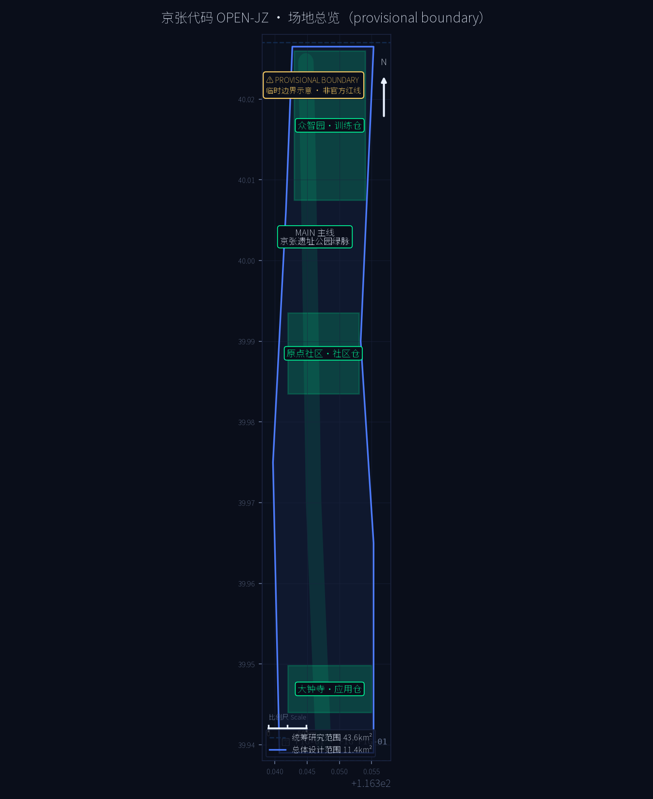
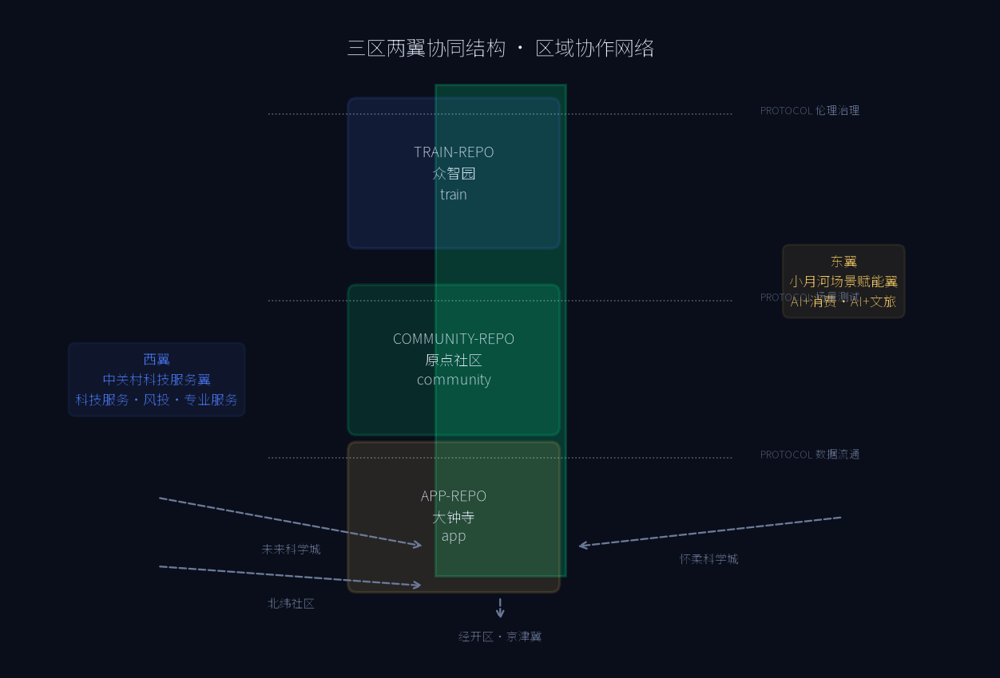
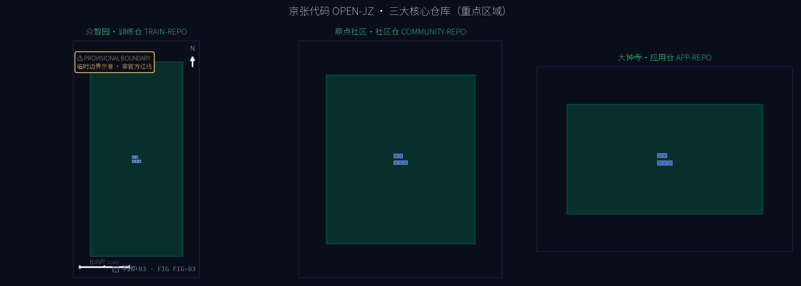
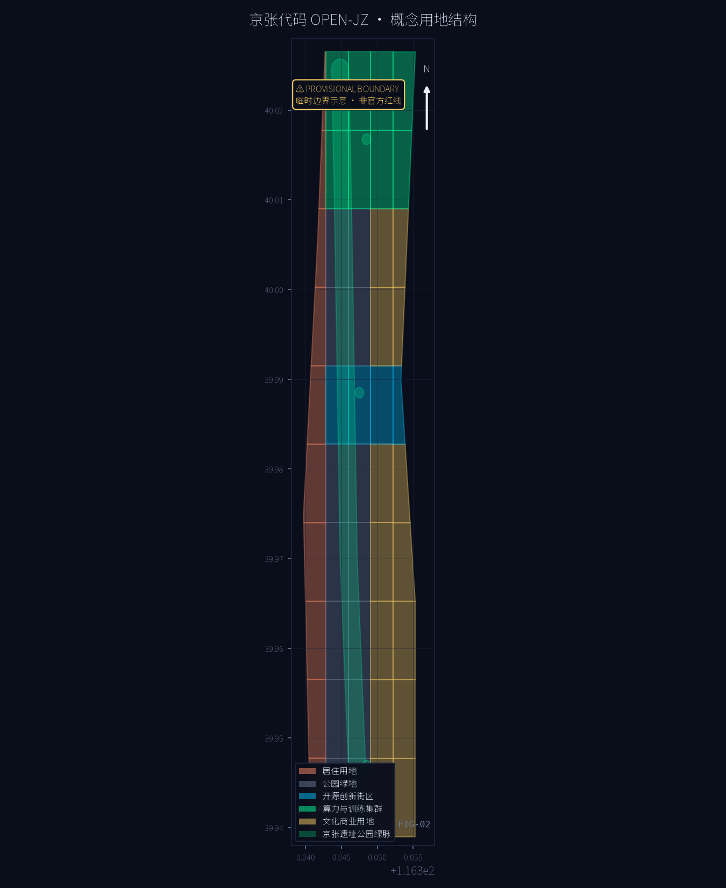
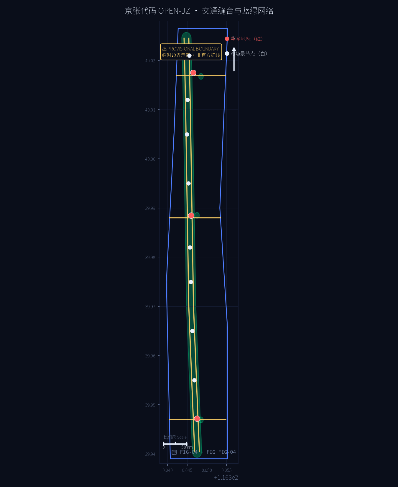
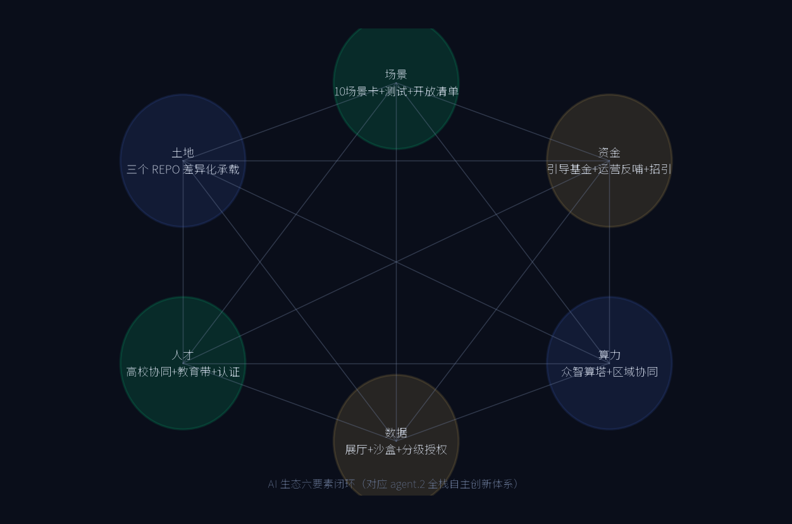
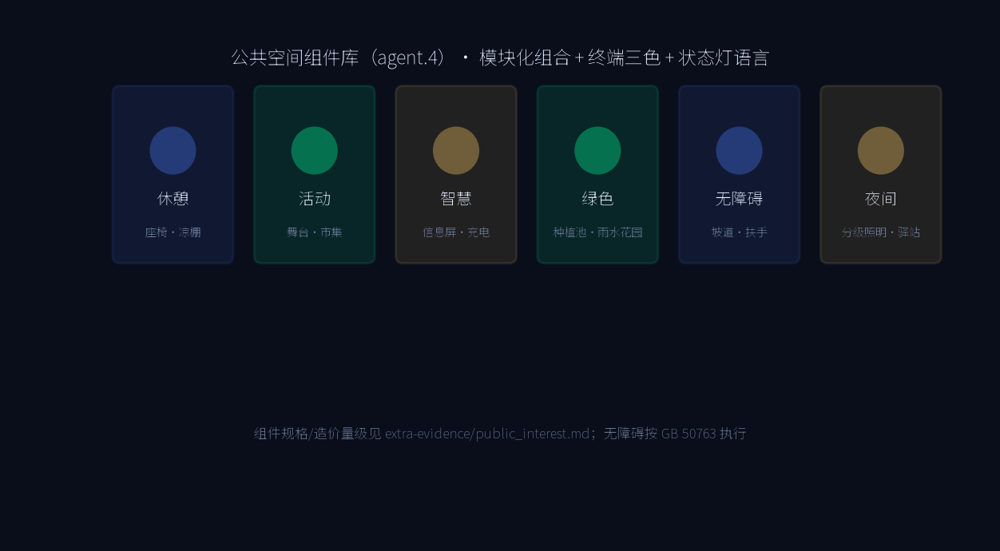
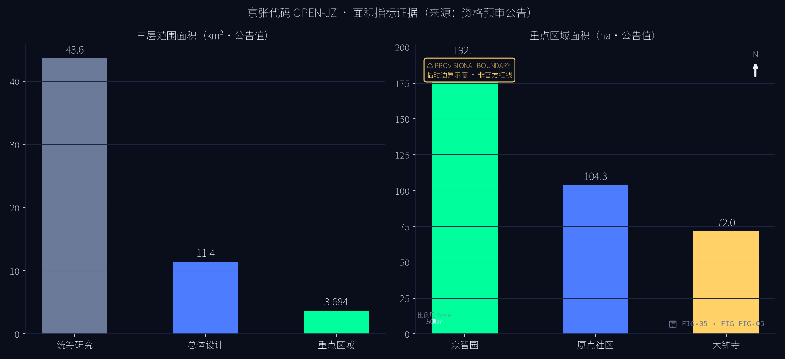

# 京张代码 OPEN-JZ：百年京张AI创新带开源城市操作系统概念方案

## 设计依据与资料清单

本 formal 方案以北京市规划和自然资源委员会海淀分局发布的《百年京张AI创新带城市设计国际方案征集资格预审公告》为第一依据，并以 `brief/site-package/` 中经维护者登记的临时粗略边界、重点区域、枚举、指标和来源清单为机器可读依据 [source:OFFICIAL-ANNOUNCEMENT] [source:AGENT-TASKBOOK]。

方案生成前已读取 `design_brief.json`、`allowed_design_space.json`、`sources.json`、`enums/`、`ranges/planning_limits.json`、`schemas/`、`standards/` 与 `data/source_registry.json`，并以 `agent_taskbook.json` 的 agent.1-agent.6 必选任务建立任务、范围、资料用途和缺口清单 [source:SITE-PACKAGE] [source:SOURCE-REGISTRY]。

方案边界声明：本方案全部空间建议基于组织方登记的 provisional boundary（临时边界）生成，属**概念建议、参考方案，可供专业团队深化研究**，不替代正式规划，不构成政府审定结论 [source:BOUNDARY-SOURCE] [source:KEY-AREA-SOURCE]。官方规划控制指标（容积率、建筑高度、建筑密度、绿地率、退线）尚未在资料包中提供，均按数据缺口处理，不推测伪精确值 [depth:existing_conditions_diagnosis]。

| 层级 | 设计问题 | 方案回答 | 数据落点 |
| --- | --- | --- | --- |
| 统筹研究范围 43.6km² | AI 产业生态和未来城市形态如何组织 | 「开源城市操作系统」：内核-仓库-协议三层架构 | compliance_matrix.json、standard_matrix.json |
| 总体设计范围 11.4km² | 产业空间、城市更新、交通市政和风貌如何落图 | MAIN 主线 + 三大 REPO + 三层 PROTOCOL 横线 | [data:geometry/land_use.geojson#LU-001]、[data:geometry/roads.geojson#ROAD-001] |
| 重点区域范围 368.4ha | 三处片区如何达到详细设计深度 | 训练仓 / 社区仓 / 应用仓分别给出空间动作与 AI 场景 | [data:geometry/key_areas.geojson#PROV-KEY-001] 等 |

## 三层范围工作框架

方案按公告确定的三层范围组织：统筹研究范围（43.6km²）回答 AI 创新生态与未来城市形态；总体设计范围（11.4km²）把判断落实为更新总体框架、产业空间布局、交通市政支撑与城市风貌控制；重点区域范围（368.4ha）完成众智园、北京AI原点社区、大钟寺三处详细设计 [source:OFFICIAL-ANNOUNCEMENT] [metric:site_area_sqm] [metric:key_area_count]。

三层工作不是割裂的图纸集合：统筹研究决定产业链与城市形态判断，总体设计把判断落实到更新项目、空间结构和设施承载，重点区域验证具体地块、建筑、交通、公共空间与 AI 应用场景的可实施性。任何无法从结构化数据复算的面积、比例、规模或项目数量，均不写入正式结论；受 provisional boundary 影响的结论在正文与 `assumptions.json` 中明确标注。

## 三区两翼与区域协作

在三大 REPO 基础上，方案进一步明确「三区两翼」的空间-机制回路与区域协作网络（对应 agent.1 功能统筹与 1.5.1 统筹研究要求）：

- **西翼·中关村科技服务翼**：依托中关村大街沿线科技服务、风险投资与专业服务资源，以协议横线·中（原点缝合带）为界面，建立「社区仓—科技服务翼」的成果转化与融资-评审回路：孵化器街区向西接入风投与专业服务，创业项目经 Open-PR 评审后进入中试与融资通道。
- **东翼·小月河场景赋能翼**：依托小月河沿线 AI+消费、AI+文旅场景资源，以协议横线·南（大钟寺缝合带）为界面，建立「应用仓—场景赋能翼」的测试-运营回路：智能终端与数据要素场景向东接入真实消费与文旅流量，测试结果回流治理协议层。
- **区域协作**：向北衔接北纬社区与未来科学城（基础研究-算力协同），向东呼应怀柔科学城（科学装置-大模型训练协同），向南联系经开区（智造-场景落地协同），融入京津冀 AI 创新网络；协作关系以 `extra-evidence/case_studies.md` 的 AI 生态图谱与 `assets/figures/regional-collaboration.png` 表达 [assumption:A-REGIONAL-001]。

## 统筹研究范围产业与未来城市研究

**总体概念：开源城市操作系统。** 百年京张铁路是中国自主创新的起点，中关村是中国开源与软件产业的起点。方案把两者合流为「京张代码 OPEN-JZ」：城市不再是一次性绘制的图纸，而是持续演进的代码库——公共空间、产业空间与治理机制都是可版本化的模块，城市更新即提交（commit）、评审（review）、合并（merge）、可回滚（revert）。公众是评审者，开发者是贡献者，政府是维护者 [source:AGENT-TASKBOOK]。

面向任务书"五大功能"，方案建立对应转译 [source:AGENT-TASKBOOK]：

| 任务书功能 | 京张代码转译 | 空间落点 |
| --- | --- | --- |
| AI 全栈自主创新体系 | 内核 KERNEL：自主算力、模型、框架与标准 | 众智园·训练仓 |
| 世界级 AI 创新生态 | 仓库网络 REPO-NET：开源协作与成果转化 | 原点社区·社区仓 |
| AI+场景赋能新范式 | 应用层 APPS：场景开放与测试验证 | 大钟寺·应用仓 |
| 智能化 AI 活力城市 | 运行时 RUNTIME：公共空间与生活场景 | MAIN 主线绿脉 |
| AI 治理全球话语权 | 治理协议 GOVERNANCE-PROTOCOL | 三协议横线 |

**创新链组织**：建立"高校策源 → 开源协作 → 企业转化 → 公共体验 → 国际传播"的链式空间协同框架，与海淀高校院所、头部企业、算力算法数据要素、孵化平台与科技服务资源耦合。产业战略指标、AI 创新指数、人才密度与空间供给类型写入 `metrics.json`，并标明官方值与设计建议值的区分。

## 总体设计范围城市更新与控规深度城市设计

总体设计范围提出「**MAIN + REPO + PROTOCOL**」空间结构 [depth:overall_spatial_structure]：

- **MAIN 主线**：京张遗址公园绿脉，南北贯通的概念公共主轴（长约 9km，由绿脉几何在 EPSG:4548 投影下复算，见 `metrics.json` 复算日志），慢行优先、历史叙事、AI 体验。在 `geometry/green_space.geojson` 中以绿脉带表达 [data:geometry/green_space.geojson#GRN-001]。
- **三大 REPO**：众智园（训练仓）、北京AI原点社区（社区仓）、大钟寺（应用仓），以 `geometry/key_areas.geojson` 三个重点区承载，内部以 `geometry/buildings.geojson` 表达概念更新建筑基底 [data:geometry/buildings.geojson#BLDG-001]。
- **三层 PROTOCOL 横线**：三条东西缝合带分别承载数据流通、场景测试与伦理治理接口，以 `geometry/roads.geojson` 概念道路表达东西缝合关系 [data:geometry/roads.geojson#ROAD-001]。

**用地结构**：沿绿脉两侧组织 AI 研发、教育科研、文化商业、居住与公共服务用地条带，三个重点区核心布置算力训练集群、开源创新街区、智能终端与内容消费区，见 `geometry/land_use.geojson` [data:geometry/land_use.geojson#LU-001]。开发强度与建筑高度因官方控制条件缺失，均标注为"待正式控规条件确认"，不以推测值冒充审定指标 [standard:MOHURD-CONTROL-DETAILED-PLANNING]。

**拆改留方案**：以"保留铁路遗址记忆、更新低效产业空间、增补 AI 创新载体"为原则。保留段：遗址公园带、文物与历史建筑（`geometry/constraints.geojson` 的 HERITAGE_PROTECTION 图层）；更新段：三个重点区内低效用地（`geometry/buildings.geojson` 概念更新基底）；新建段：协议横线缝合节点与公共空间 [data:geometry/constraints.geojson#CON-001]。

## 重点区域详细设计

### 训练仓 TRAIN-REPO · 众智园 AI 自主创新加速区（192.1ha）

围绕国家人工智能平台与全栈自主创新：布局算力训练集群、模型评测中心、AI 标准与安全治理实验室；提出「众智算塔」AI 朝圣地标——白天反射天空、夜间以光柱显示训练任务状态；结合清河文化打造低碳绿色创新交往环境与绿色空间 AI 场景 [data:geometry/key_areas.geojson#PROV-KEY-001] [standard:MOHURD-URBAN-DESIGN-MEASURES]。对外交通依托协议横线北线与轨道站点一体化接驳。

### 社区仓 COMMUNITY-REPO · 北京 AI 原点社区（104.3ha）

围绕近校创新与成果转化：设置开源代码广场、孵化器街区、成果展示发布厅与人才公寓；改造清华园车站遗址为「京张原点站·开源纪念碑广场」朝圣地标，作为开源文化的精神原点；强化校区-园区慢行联系、轨道站点一体化与青年友好生活配套 [data:geometry/key_areas.geojson#PROV-KEY-002] [standard:MOHURD-ARCH-DESIGN-DEPTH-2016]。建筑拆改留以"保留历史站房、更新低效楼宇、增补创新空间"为序。

### 应用仓 APP-REPO · 大钟寺 AI 产业聚集区（72.0ha）

围绕领军企业、智能体与智能终端生态：布局智能终端体验街、内容消费与数据要素流通节点；以「大钟寺 AI 钟楼广场」为朝圣地标，用数据流声景复刻钟鼓意象；规划绿地复合利用、大钟寺站一体化与路口四象限步行连通，打通商业服务与 AI 体验的界面 [data:geometry/key_areas.geojson#dazhongsi_ai_industry_cluster]。

## AI 创新生态、人才画像与 AI+ 场景

**10 张 AI 场景卡**（`geometry/public_space.geojson` 以场景节点落位）：

| 编号 | 场景 | 落位 |
| --- | --- | --- |
| S01 | 轨道巡检机器人步道 | MAIN 绿脉 |
| S02 | 无人配送环线 | 三重点区 |
| S03 | AI 慢行信号优化 | 绿脉过街 |
| S04 | 开源代码露天剧场 | 社区仓 |
| S05 | 场景测试街区 | 协议横线 |
| S06 | 数据要素公共展厅 | 应用仓 |
| S07 | AI 教育实验室带 | 教育科研带 |
| S08 | 数字孪生观测台 | 众智算塔 |
| S09 | AI 健康服务舱 | 社区节点 |
| S10 | 智能公交接驳线 | 轨道站点 |

**3 个产业测试验证场景**：① 自动驾驶接驳测试环（众智园-大钟寺）；② 机器人递送走廊（遗址公园段）；③ 城市级 AI 政务沙盒（治理协议层）。

**5 类用户画像**：开源开发者/研究员；AI 创业者与企业员工；大学生与青年人才；原住居民与银发人群；全球访客与参会者。

**3 个 AI 朝圣地标**：京张原点站（社区仓）、众智算塔（训练仓）、大钟寺 AI 钟楼（应用仓）[data:geometry/public_space.geojson#PUB-001]。

## 用地、建筑规模与拆改留方案

用地结构以绿脉为主轴、协议横线为缝合带、三大仓库为核心地块（见 `geometry/land_use.geojson`），共划分五类概念用地：AI 研发用地、教育科研用地、文化商业用地、居住用地与公园绿地，实现设计范围内全覆盖、无重叠 [data:geometry/land_use.geojson#LU-001]。三类重点区核心分别布置算力与训练集群（AI-DATA）、开源创新街区（AI-OS）、智能终端与内容消费区（AI-APP），作为用地结构的功能锚点 [data:geometry/key_areas.geojson#zhongzhiyuan_ai_acceleration_area]。

建筑规模为概念建议值：`metrics.json` 中 `building_footprint_area_sqm` 由 15 栋概念更新建筑基底在 EPSG:4548 投影下复算得到，仅用于表达拆改留的空间量级与可实施性讨论，不换算为建筑面积承诺 [metric:building_footprint_area_sqm]。因官方开发强度（容积率、高度、密度）控制条件在资料包中缺失，方案不给出建筑规模总量与开发强度指标，相关结论标注为待正式控规条件确认 [assumption:A-CONTROLS-001]。

拆改留分类原则（对应 `geometry/buildings.geojson` 与 `geometry/constraints.geojson`）：**保留**——京张铁路遗址保护带、文物与历史站房（locked 图层 HERITAGE_PROTECTION，不做改动）[data:geometry/constraints.geojson#CON-001]；**更新**——三大仓库内低效产业楼宇，以概念更新基底表达；**新建**——协议横线缝合节点、AI 公共空间与朝圣地标周边载体。

## 交通、轨道、市政与公共服务设施

**轨道与站城一体化**：依托既有轨道站点（含大钟寺站及清华园周边站点）开展站城一体化概念设计，轨道站点 500m 范围内布置创新服务、人才公寓与慢行接驳设施，重点区站点一体化预留地下连通道接口 [standard:MOHURD-URBAN-DESIGN-MEASURES]。轨道线位与站点均为现状锁定要素，方案不改变现状轨道（locked 图层 EXISTING_RAIL）。

**道路微循环**：以三条协议横线（数据流通/场景测试/伦理治理）缝合东西城区，以绿脉两侧慢行主路组织南北微循环，形成"横缝纵贯"的概念路网骨架（`geometry/roads.geojson`，5 条概念道路）[data:geometry/roads.geojson#ROAD-001]。道路红线与线位属概念建议，不涉及现状道路改造承诺；具体红线待官方道路红线图发布后校准。

**新型基础设施**：沿 MAIN 主线布设端侧算力节点、分布式能源站、城市级传感器与数字孪生底座，服务 10 张 AI 场景卡（S01-S10）；无人配送环线与智能公交接驳线衔接轨道站点与三大仓库 [data:geometry/public_space.geojson#PUB-001]。

**公共服务设施**：创新服务平台（评测、中试、标准）、人才生活服务（公寓、文体、托育）、AI 健康服务舱与 AI 教育实验室带嵌入三个重点区与社区节点；设施规模与配置标准因官方配套标准缺失，按概念建议标注，待正式控规条件确认 [assumption:A-CONTROLS-001]。

## 蓝绿空间、公共空间与城市风貌

**蓝绿空间**：以京张遗址公园绿脉为主干（MAIN 主线，`geometry/green_space.geojson#GRN-001`），三处节点绿地为支点，形成"一带三珠"蓝绿网络；绿脉承担慢行贯通、历史叙事、AI 体验与生态调节复合功能 [data:geometry/green_space.geojson#GRN-001]。绿地率由绿脉与节点绿地面积复算（`metrics.json` 的 `green_ratio`），属设计建议口径，非官方绿地率控制指标（官方 green_ratio 缺失）[metric:green_ratio]。

**公共空间**：形成「3 朝圣地标 + 8 场景节点」体系（`geometry/public_space.geojson`，11 个面状要素）：朝圣地标包括京张原点站·开源纪念碑广场（社区仓）、众智算塔·训练状态观测台（训练仓）、大钟寺 AI 钟楼广场（应用仓）；场景节点沿绿脉布置，支撑场景卡 S01-S10 [data:geometry/public_space.geojson#PUB-001]。公共空间已由点节点升级为**面状概念范围**（朝圣地标 0.8-1.2ha、场景节点约 0.5ha），`public_space_area_sqm ≈ 5.4ha`，可支持空间供给判断；面状缓冲为概念建议，非审定用地 [metric:public_space_area_sqm]。

**城市风貌**：提出终端美学控制——深夜蓝底色、荧光绿主色、代码白文字；公共标识采用"信号灯·状态灯"语言（绿=正常运行、黄=试验中、红=需人工评审），与百年铁路信号文化同构，形成可识别的 AI 城市气质。风貌控制属于概念引导，不替代法定城市设计要求。

## AI 场景卡（完整版）与全球案例

**10 张 AI 场景卡完整版**：每张卡均含定位、用户旅程、输入数据、AI 能力、基础设施、运营主体、失败模式、隐私与人工复核八要素（下表）。场景—空间—运营矩阵与隐私影响评估（PIA）要求同见本表。全部为概念建议，实施前须完成 PIA 与审批前置条件核查。

| 卡 | 定位 | 用户旅程 | 输入数据 | AI 能力 | 基础设施 | 运营主体 | 失败模式 | 隐私与人工复核 |
| --- | --- | --- | --- | --- | --- | --- | --- | --- |
| S01 轨道巡检机器人步道 | MAIN 绿脉常态巡检 | 游客进入→机器人巡检→工单派发→处置回写 | 视频流/轨迹/工单/天气 | 目标检测·异常分级 | 步道 9km+充电坞+边缘节点 | 区城管委+机器人企业 | 误报≤5%目标、夜间失效→分级上报 | 人脸脱敏；工单人工确认；申诉通道 |
| S02 无人配送环线 | 三重点区微循环 | 下单→接单→路权调度→取件柜 | 订单/路况/柜状态 | 动态路径·多车调度 | 配送道 2.5km+取件柜+调度平台 | 平台+物业联合 | 故障/拥堵→人工接管 | 数据最小化；留存 30 天；异常人工审核 |
| S03 AI 慢行信号优化 | 绿脉过街自适应 | 行人接近→感知→延长/优先→恢复 | 视频/雷达/信号/公交 | 行人识别·预测控制 | 感知杆+信号控制器+边缘 | 区交通支队+供应商 | 感知失灵→回退固定配时 | 身份不落盘；策略调整审批公示 |
| S04 开源代码露天剧场 | 社区仓展演与开源活动 | 预约→黑客马拉松→提交仓库→展示 | 预约/场地/直播 | 活动推荐·同传·AI 预检 | 剧场 0.4ha+舞台+LED | 中关村开源社区 | 设备/网络/内容争议→应急 | 直播授权；代码评审人工终审 |
| S05 场景测试街区 | 众智园合法测试 | 申请路权→备案→测试→数据回传→安全评估 | 车辆状态/路况/事故 | 测试生成·安全监控 | 测试环 1.8km+围栏+平台 | 区测试办+第三方检测 | 事故→停测+人工调查 | 全程可追溯；涉人场景先公示同意 |
| S06 数据要素公共展厅 | 应用仓数据流通窗口 | 参观→了解规则→体验合规演示 | 脱敏统计/合规案例 | 可视化·合规问答 | 展厅 0.3ha+大屏+沙箱 | 数据交易所合作 | 演示泄露→沙箱隔离 | 仅脱敏统计；预约记录 14 天删 |
| S07 AI 教育实验室带 | 学-研-产贯通教育走廊 | 预约→分层课程→实验→成果展示 | 课程/实验环境/学习成果 | 个性化推荐·实验辅助 | 6 处实验室+算力池 | 区教委+高校+企业 | 算力不足/内容不适龄→人工审核 | 未成年数据最小化+家长知情同意 |
| S08 数字孪生观测台 | 众智算塔城市运行可视化 | 登塔→查看指标→参与反馈 | 聚合运行数据 | 指标预测·异常预警 | 塔公共层+大屏+算力 | 区城运中心 | 口径错误→标注来源时间；预警人工研判 | 仅聚合数据，不展示个体信息 |
| S09 AI 健康服务舱 | 社区嵌入式健康服务 | 预约→自测→AI 初筛→医生复核 | 健康自测/授权档案 | 风险初筛·异常预警 | 社区舱 1-2 处+远程问诊 | 社区卫生服务中心 | 误判漏判→AI 建议须医生复核 | 敏感数据加密分级；退出+线下通道 |
| S10 智能公交接驳线 | 轨道-园区微循环公交 | 出站→预约→动态调度→上车 | 预约/客流/车辆位置 | 动态排班·客流预测 | 接驳环线+站台+调度 | 公交集团+园区 | 调度失衡→人工介入 | 预约仅调度用后删；保留现金/卡通道 |

**全球 AI 创新生态对标（8 例）**：新加坡榜鹅数字园区、多伦多 Sidewalk（教训案例）、赫尔辛基 Kalasatama、杭州城市大脑、丰田 Woven City、巴塞罗那 22@、上海模速空间、纽约 Hudson Yards，逐例说明对 OPEN-JZ 的启示与公开来源，见 `extra-evidence/case_studies.md`；土地/资金/人才/算力/数据/场景六要素闭环见图 `assets/figures/ai-ecosystem.png`。

## 公共利益与包容性设计

儿童、残障人士、低收入居民、非数字用户（老年群体）、夜间工作者的实际障碍与设计对策、共创方式、无障碍标准（GB 50763）、服务可负担性、隐私影响评估、人工申诉与非 AI 替代通道、利益冲突处理，见 `extra-evidence/public_interest.md`；公共空间组件库（休憩/活动/智慧/绿色/无障碍/夜间六类组件）同见该文件与 `assets/figures/public-space-kit.png`。

## 实施矩阵与运营机制

**实施矩阵**：一至三期 12 项概念项目，逐项给出牵头/协同主体、前置条件、审批节点、成本量级、试点验收指标与回滚触发器（安全/隐私/文保/生态/经济五类）。成本为概念级量级区间，非工程预算（上表已含全部 12 项）。

| 期 | 项目 | 牵头主体 | 前置条件 | 审批节点 | 成本量级 | 验收指标 | 回滚触发器 |
| --- | --- | --- | --- | --- | --- | --- | --- |
| 一 | 开源代码露天剧场 | 中关村开源社区 | 场地协议+安全预案 | 区级活动备案 | 0.3-0.8亿 | 年活动≥20场/5万人次 | 安全事故即暂停 |
| 一 | 京张原点站·开源纪念碑广场 | 区城管委 | 遗址保护带方案+文保审批 | 文物规划联审 | 0.5-1.2亿 | 无障碍达标/日均3000人 | 文保冲突即停工 |
| 一 | 社区健康舱×2 | 社区卫生服务中心 | 数据合规+PIA | 卫健委备案 | 0.05-0.15亿 | 2万人次/年/满意度85% | 隐私事件即下线 |
| 一 | 开源社区平台 | 区科委 | 数据安全评估 | 网信备案 | 0.02-0.05亿 | 注册开发者≥1万 | 数据泄露即关停 |
| 二 | 众智算塔 | 区属平台公司 | 算力评估+电力增容 | 区重大项目审批 | 5-15亿 | PUE≤1.3/利用率≥60% | 能耗超标即调整 |
| 二 | 轨道巡检步道（绿脉段） | 区城管委 | 步道改造方案 | 市政工程审批 | 0.8-2亿 | 覆盖率≥90%/误报≤5% | 误报超标降级人工 |
| 二 | 场景测试街区 1.8km | 区测试办 | 测试办法+路权 | 市级路测备案 | 0.5-1.5亿 | 100万km无重大事故 | 重大事故停测 |
| 二 | 绿脉慢行贯通 | 区园林绿化局 | 慢行专项规划 | 规划施工联审 | 3-8亿 | 贯通率100%/绿量净增 | 生态文保冲突段段回退 |
| 三 | 大钟寺 AI 钟楼广场 | 区城投 | 地块更新方案 | 更新单元审批 | 1-3亿 | 公共开放率≥70%/年30场 | 过度商业化收回运营权 |
| 三 | 数据要素公共展厅 | 数据交易所 | 流通规则+沙箱 | 数据交易备案 | 0.3-1亿 | 演示≥50场/年 | 数据事故即暂停 |
| 三 | 智能公交接驳环线 | 公交集团 | 客流测算+路权 | 交通审批 | 0.5-1.5亿 | 准点率≥90%/分担率≥15% | 客流不达预期缩减班次 |
| 三 | 全域数字孪生观测台 | 区城运中心 | 数据目录+安全分级 | 政务数字化审批 | 2-6亿 | 覆盖≥30项/预警≥80% | 口径错误即下线 |

跨期机制：资金=引导基金+场景运营反哺+国际招引；审批=先试点后铺开；回滚=安全/隐私/文保/生态/经济五类触发器。共同外部依赖：官方红线、法定控规条件、轨道站点建设时序、区域算力协同。

**全球 AI 创新活动体系与长期运营（agent.6）**：JZ-CON 年度大会、季度黑客马拉松、月度 Open-PR 公众评审日、朝圣开放日、国际招引周；品牌 IP 与开源许可策略；开发者社区运营；年度《场景开放清单》与国际招引转化漏斗；运营理事会与财务三来源（公共财政+场景运营收益+社会资本），见 `extra-evidence/operations.md`。

## 视觉识别规范

OPEN-JZ Logo（京张铁路工字钢轨截面 × 代码尖括号同构，三色状态灯）与标志网格、最小尺寸、黑白版、安全区、授权字体（思源黑体 OFL）、状态灯公共标识语言，见 `extra-evidence/visual_identity.md`；Logo 图见 `assets/figures/logo.png`。

## 约束来源与版权台账

- 既有轨道、站点、文保保护带等约束要素的逐要素来源绑定与待核验假设，见 `extra-evidence/constraint_sources.md`；不能证明的要素不写入事实性表述。
- 逐资产版权与来源台账（字体、库、自产资产、外部引用、AI 生成声明、再分发许可），见 `extra-evidence/asset_ledger.md`；本包全部字体为开源许可，无第三方图片素材。

## 更新项目清单、实施政策与分期计划

**项目清单**（概念建议）：原点社区开源广场与纪念碑、众智算塔与训练集群、大钟寺 AI 钟楼广场、三条协议横线缝合工程、绿脉贯通与慢行系统、轨道站点一体化、数据要素公共展厅、AI 教育实验室带、智能公交接驳线。

**实施政策建议**：以"开源协议式治理"组织城市更新——重大项目走公开评审（Open-PR 机制）、试验性项目走分支试点（可回滚）、数据与标准公共化；建立开发者社区运营与长期品牌资产机制。

**分期计划**（`geometry/phasing.geojson`）[data:geometry/phasing.geojson#PH1]：

| 期 | 时间 | 动作 | 内容 |
| --- | --- | --- | --- |
| 一期 | 2026-2028 | 首次提交 | 原点社区先行：开源广场、朝圣地标原型验证 |
| 二期 | 2028-2030 | 合并主分支 | 绿脉贯通 + 众智园训练仓成型 |
| 三期 | 2030-2035 | 持续交付 | 大钟寺应用仓 + 全域运营，常态迭代 |

## 指标体系、面积复算与合规矩阵

三层范围与三处重点区面积采用公告官方数值（43.6km² / 11.4km² / 368.4ha；192.1 / 104.3 / 72.0ha），图层面积由 `geometry/*.geojson` 按 CGCS2000 / EPSG:4548 投影复算（`metrics.json`），绿地率、公共空间比例、场景节点数等为设计建议值并注明口径 [source:OFFICIAL-ANNOUNCEMENT]。任务覆盖见 `compliance_matrix.json`，标准覆盖见 `standard_matrix.json`，设计深度见 `design_depth_matrix.json`，全部引用 geometry、metrics、drawings 与报告章节。

## 风险、版权与合规说明

- **边界精度风险**：全部空间结论基于 provisional boundary，官方红线发布后须整包重算；本方案不用于精确面积、法定控制或权属依据。
- **数据缺口**：官方规划控制指标缺失，相关结论均为概念建议 [assumption:A-CONTROLS-001]。
- **版权**：license=COMMUNITY-DISPLAY-ONLY，方案由 AI 智能体生成，遵循社区展示约定，未使用未清权资料 [source:SOURCE-REGISTRY]。
- **合规**：本方案不声称官方批准、审定规划、最终权属或已确认建设规模（`allowed_design_space.json` forbidden claims 逐项规避）。

## 参考资料

1. 资格预审公告 [source:OFFICIAL-ANNOUNCEMENT]：北京市规划和自然资源委员会海淀分局《百年京张AI创新带城市设计国际方案征集资格预审公告》，确定项目目的、三层范围、设计任务、重点区域与成果深度要求；公告面积为方案面积指标的官方依据。
2. 面向智能体开源征集任务书（0518 版）[source:AGENT-TASKBOOK]：`brief/site-package/agent_taskbook.json` 与本地参考快照 `standards/references/agent-open-call-taskbook-0518.md`，定义 agent.1-agent.6 必选任务、五大功能、工作模式与边界条款；非法定规划控制依据。
3. 资料包 site-package [source:SITE-PACKAGE]：`design_brief.json`、`allowed_design_space.json`、`sources.json`、`enums/`、`ranges/planning_limits.json`、`schemas/`、`standards/` 与 `geometry/provisional_boundaries.geojson`，构成机器可读设计依据与数据缺口清单。
4. 公开资料用途登记表 [source:SOURCE-REGISTRY]：`data/source_registry.json`，区分 usable_for_formal / background_only / provisional_only / no 四类用途边界；本方案仅将 provisional 边界用于生成与展示，未升级为官方结论。
5. 临时边界与重点区几何 [source:BOUNDARY-SOURCE] [source:KEY-AREA-SOURCE]：`brief/site-package/geometry/provisional_boundaries.geojson` 的 PROV-SITE-001 与 PROV-KEY-001/002/003，提交包 geometry 全部标注 provisional_constraint、official_boundary=false，官方红线发布后整包重算。
6. 专业标准参考 [standard:MOHURD-CONTROL-DETAILED-PLANNING] [standard:MOHURD-URBAN-DESIGN-MEASURES] [standard:MOHURD-ARCH-DESIGN-DEPTH-2016]：以 `standards/references/` 本地快照为准，source_url 不单独构成证据。
