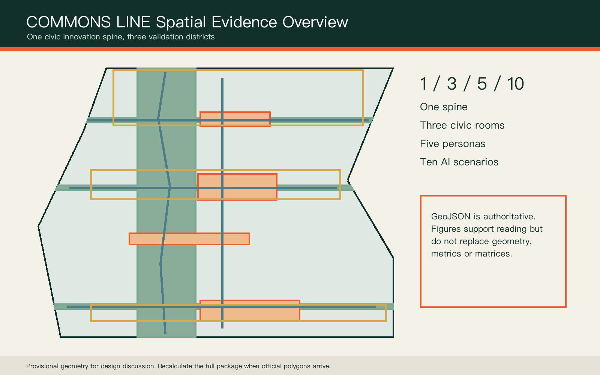
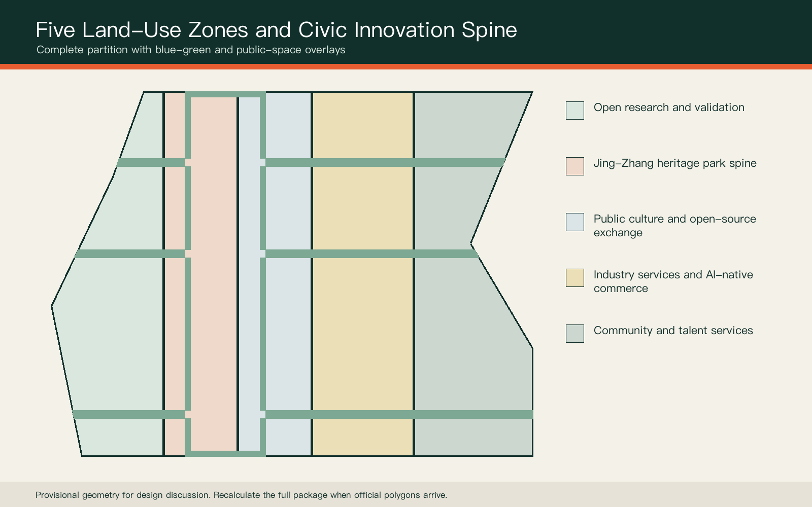
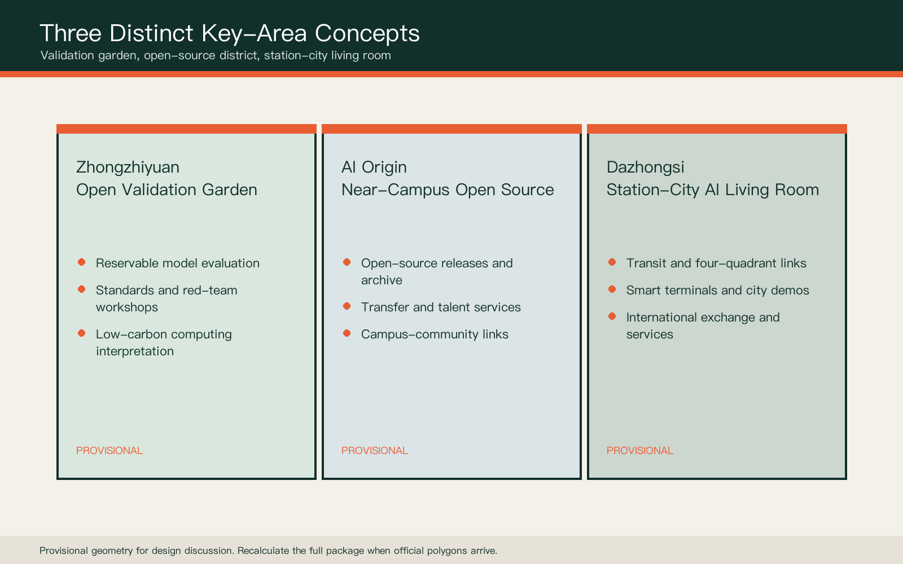
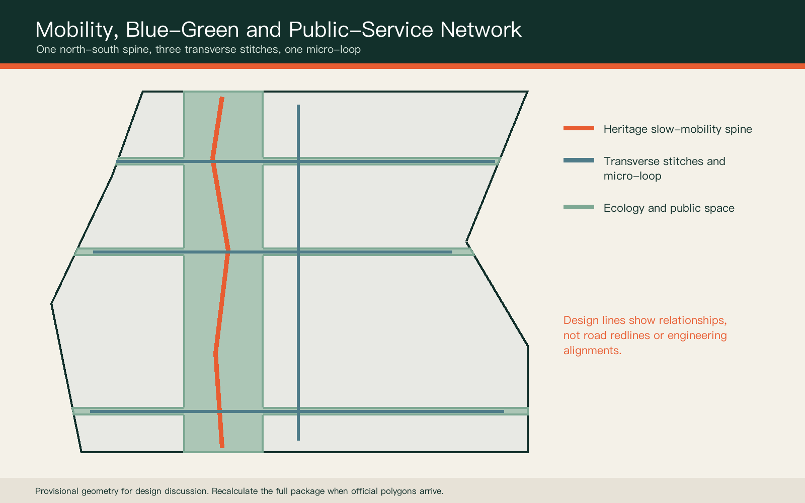
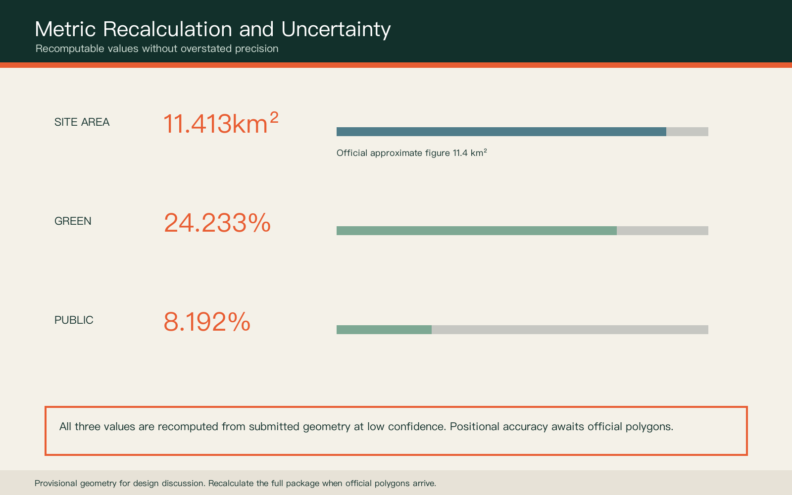

# COMMONS LINE: Centennial Jing-Zhang Civic AI Corridor
## Design Basis and Source List

This proposal uses only public or cleared material registered by the repository. The official announcement provides three scope levels, three key areas and approximate areas, but no precise polygon in a verifiable coordinate system. Every submitted boundary therefore remains a provisional constraint and cannot support approval, property, demolition or exact statutory-control claims [source:OFFICIAL-ANNOUNCEMENT] [source:BOUNDARY-SOURCE]. Professional standards use the local reference snapshots, while land-use codes follow the national classification guide [standard:MNR-LAND-USE-CLASSIFICATION-GUIDE].

GeoJSON is the spatial authority layer. Metrics and three matrices form the audit layer. The report, figures, PDFs and offline visual form the human-reading layer. Missing official polygons, regulatory controls, road redlines, building surveys, ownership, utilities, fire and heritage constraints are explicit assumptions that trigger a complete package recalculation [depth:existing_conditions_diagnosis].

## Three-Level Scope Framework

The 43.6 sq km coordinated research area frames innovation networks and regional relationships. The approximate 11.4 sq km overall design area frames spatial structure and renewal methods. The three detailed-design areas test public space, operations and AI scenarios. These are not three disconnected drawing sets, but a responsibility chain from industry strategy to accountable daily use [data:geometry/site_boundary.geojson#SITE-001] [metric:site_area_sqm] [depth:three_level_scope_framework].

COMMONS LINE is structured as one spine, three civic rooms, five user groups and ten scenarios. The spine is the heritage ecology and slow-mobility route. The civic rooms are the three key areas. The user groups are developers, researchers, start-ups, residents and visitors. Every spatial move remains a conceptual suggestion on provisional geometry.

## Coordinated Research Area: Industry and Future City Research

The ecosystem is a five-part loop: originate, open, validate, transfer and govern. Zhongzhiyuan focuses on full-stack validation and safety governance; the AI Origin Community focuses on open-source collaboration and near-campus transfer; Dazhongsi focuses on AI-native commerce, international exchange and public demonstration. Two wings provide professional services and everyday urban testing [source:AGENT-TASKBOOK] [standard:PROJECT-AGENT-OPEN-CALL-TASKBOOK].

Six international references inform functions rather than copying form: MIT Kendall Square, Toronto MaRS, Paris-Saclay, Helsinki Jätkäsaari, Singapore one-north and Barcelona 22@. They suggest proximity, shared platforms and evaluable trials. They do not justify local investment, company or regulatory claims.

## Overall Design Area: Urban Renewal and Regulatory-Plan-Level Urban Design

Five continuous zones partition the provisional boundary: open research and validation, heritage park and ecology, public culture and open-source exchange, industry services and AI-native commerce, and community and talent services. Every polygon is clipped from the same site boundary to ensure complete, non-overlapping coverage [data:geometry/land_use.geojson#LU-001] [depth:land_use_layout].

Renewal begins with adaptive reuse opportunities rather than assumed demolition. Six catalyst footprints describe spatial types only: shared lab, validation workshop, transfer studio, contributor hall, city living room and transit-service hub. They do not represent surveyed buildings or ownership parcels [data:geometry/buildings.geojson#BLDG-001] [depth:retain_renovate_demolish]. FAR, height and building density remain pending official data.

## Detailed Design of Key Areas

Zhongzhiyuan becomes an Open Validation Garden with reservable model evaluation, red-team practice, standards workshops and low-carbon computing interpretation. Every trial is time-limited, reversible and under human supervision [data:geometry/key_areas.geojson#PROV-KEY-001] [depth:three_key_area_detailed_design].

The AI Origin Community becomes a Near-Campus Open-Source District with a release hall, contributor archive, talent services and evening collaboration. Dazhongsi becomes a Station-City AI Living Room for transit access, international demos, smart terminals and public services. Bridges, tunnels, station works and underground construction remain for professional study [data:geometry/key_areas.geojson#PROV-KEY-002] [data:geometry/key_areas.geojson#PROV-KEY-003].

## AI Innovation Ecosystem, Personas, and AI+ Scenarios

Five personas cover open-source developers, researchers, start-ups, nearby residents and domestic or international visitors. Each receives a digital and non-digital path. Services must be explainable, optional and transferable to a person; persistent face recognition or personal mobility tracking is not an operating prerequisite [standard:GENERATIVE-AI-INTERIM-MEASURES] [standard:BARRIER-FREE-ENVIRONMENT-LAW].

Ten scenario cards include an open-source release hall, model-safety sandbox, low-carbon computing explainer, accessible mobility assistant, campus transfer desk, dual-channel public services, railway memory guide, smart-terminal living room, human-reviewed event safety desk and Global AI Commons Week. The first three also form industry validation scenarios. None is an approved deployment [data:geometry/public_space.geojson#PUBLIC-001] [metric:scenario_node_count].

## Land Use, Building Scale, and Retain-Renovate-Demolish Strategy

Land-use zones use the repository's permitted national codes and shared edges. Green and public-space networks are overlays, not substitutes for statutory park or land-use boundaries. Catalyst buildings are investigation prompts because building age, structure, ownership and use are unavailable [standard:MNR-LAND-USE-CLASSIFICATION-GUIDE] [data:geometry/land_use.geojson#LU-003].

A future retain-renovate-demolish decision follows four steps: survey and ownership verification, structure/fire/energy review, public-value and industry-fit assessment, and a recorded multi-party decision. Current metrics count only conceptual catalyst footprints, not total floor area or FAR [metric:building_footprint_area_sqm] [depth:development_intensity_controls].

## Transport, Rail, Municipal Infrastructure, and Public Services

The mobility concept combines one north-south heritage spine, three east-west stitches and one public-service micro-loop. The stitches serve Zhongzhiyuan, AI Origin and Dazhongsi, connecting walking, cycling, transit interfaces and civic validation rooms [data:geometry/roads.geojson#ROAD-001] [depth:traffic_rail_slow_parking]. These are design relationships, not road redlines.

Municipal strategy is measure first, pilot second and retain a rollback path. Edge computing may share public-service locations only after energy, cooling, fire, cybersecurity and operator responsibilities are verified. Every AI-assisted service keeps an in-person or offline path [depth:municipal_new_infrastructure].

## Blue-Green Network, Public Space, and Urban Character

A north-south ecological spine and three transverse links form the blue-green concept. Public spaces create a validation garden, open-source living room, station-city living room and railway memory platform. Interim ratios compare design intent and are not statutory green-space controls [data:geometry/green_space.geojson#GREEN-001] [metric:green_ratio] [metric:public_space_ratio].

The identity uses infrastructure teal, signal orange and metal grey. Sleeper-like ticks carry distance, date and contribution records. Three pilgrimage prototypes are the First Line of Code Marker, Open Model Validation Beacon and Centennial Jing-Zhang Contributor Archive. Each requires heritage, structural, copyright and public consultation before development.

## Renewal Projects, Implementation Policy, and Phasing

Near-term work prioritises reversible trials: mobility audits, contributor displays, open-source releases and dual-channel public services. Mid-term work considers campus transfer and community services after surveys. Long-term station integration and major events proceed only after transit, utilities, heritage and ownership conditions are clear [data:geometry/phasing.geojson#PHASE-001] [depth:phasing_implementation].

A City Validation Protocol governs every scenario: stated problem, minimum data, named human owner, opt-out, maximum trial period, incident reporting and retrospective. Seasonal events form an operating reference, not a confirmed government programme [depth:renewal_project_list].

## Metrics, Area Recalculation, and Compliance Matrix

The three core visual metrics are recalculated from submitted geometry. The provisional site model is approximately 11.413 sq km; green and public-space ratios are read from metrics.json. Area agreement with the approximate official figure does not convert the inferred polygon into an official boundary [metric:site_area_sqm] [metric:green_ratio] [metric:public_space_ratio].

The compliance matrix covers announcement sections 1.3, 1.4, 1.5 and agent.1-agent.6. The standard matrix covers every mandatory standard. The design-depth matrix connects regulatory planning, mobility, infrastructure, blue-green systems, implementation and risk to prose, geometry, metrics and drawings. Missing controls remain pending official data [depth:metrics_recalculation].

## Risk, Copyright, and Compliance

Key risks are provisional boundary displacement, missing regulatory and ownership data, unknown existing buildings, missing infrastructure and fire conditions, unknown heritage controls, and privacy, bias or usability failures in AI scenarios. Responses are a full-package recalculation trigger, professional prerequisites, human review, data minimisation, non-digital alternatives and time-limited trials [depth:risk_missing_data] [data:geometry/constraints.geojson].

Figures are generated from this submission's GeoJSON and metrics. The concept cover is synthetic and labelled as such. No unauthorised company marks, portraits, satellite images or news imagery are used. This is an open co-creation proposal, not an approved plan, government decision, investment commitment, engineering finding or implementation guarantee [source:AGENT-TASKBOOK].

## References

Core references include the official Haidian announcement, the cleared agent taskbook extract, urban design and regulatory planning measures, the national land-use guide, accessibility law, generative-AI measures and the repository's provisional-boundary basis note. Full provenance, dates, rights, permitted uses and limitations are recorded in sources.json and the standards matrix [source:SITE-PACKAGE] [source:SOURCE-REGISTRY].

OpenStreetMap background checks are not used as formal boundary or area evidence. When official polygons, controls, road redlines, heritage, utilities, ownership and building surveys arrive, the package must be rebuilt from the site boundary through every layer, metric, figure, HTML and PDF, followed by all four validation gates.
