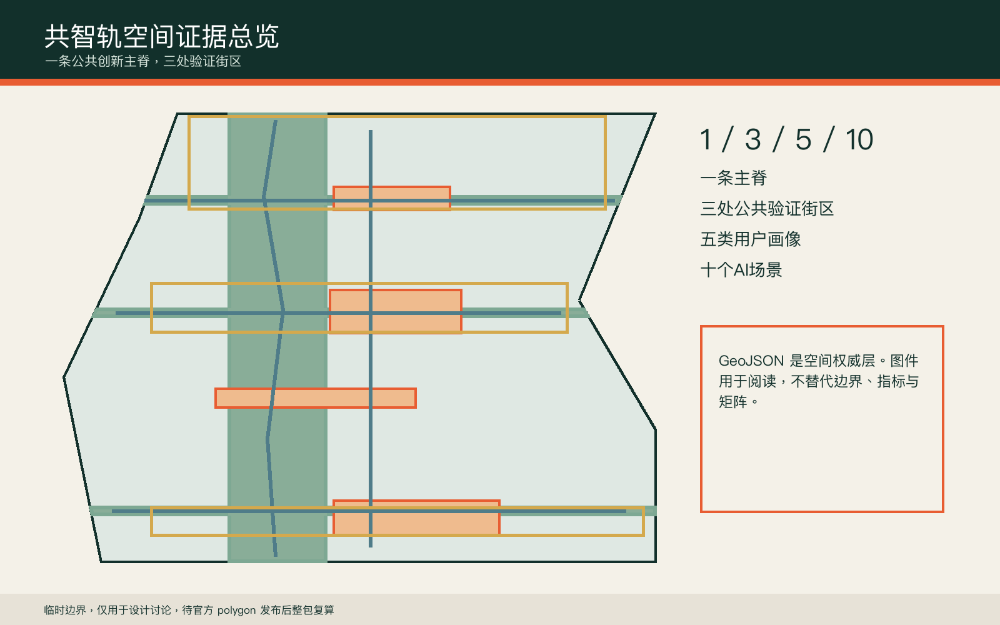
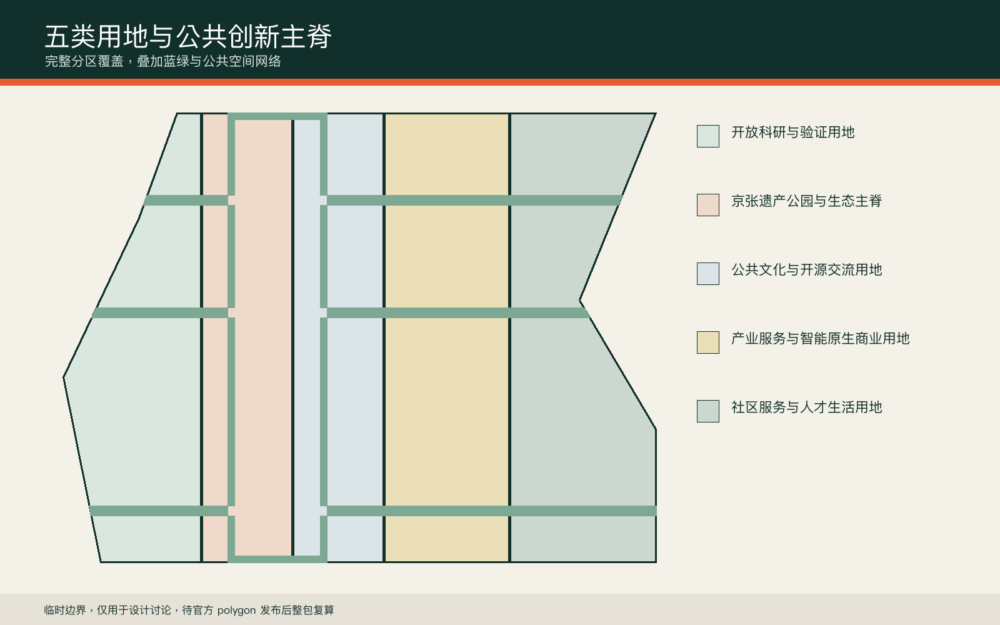
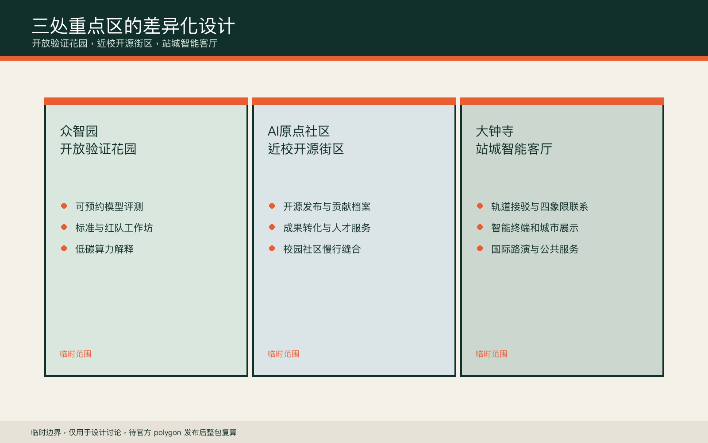
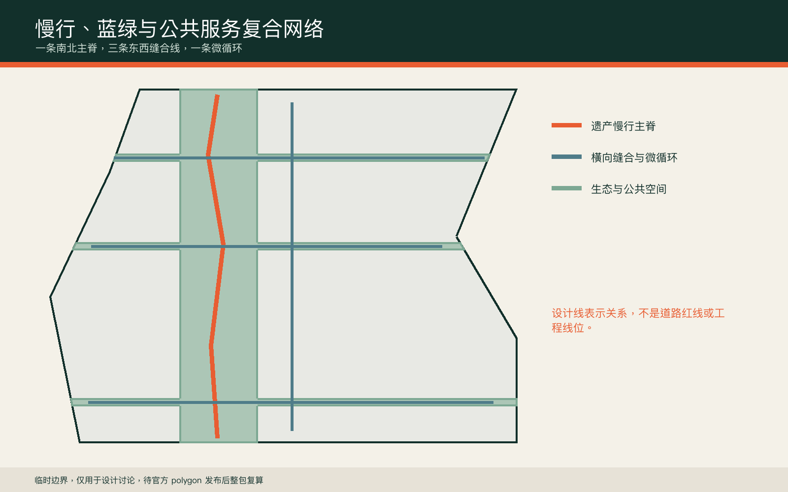
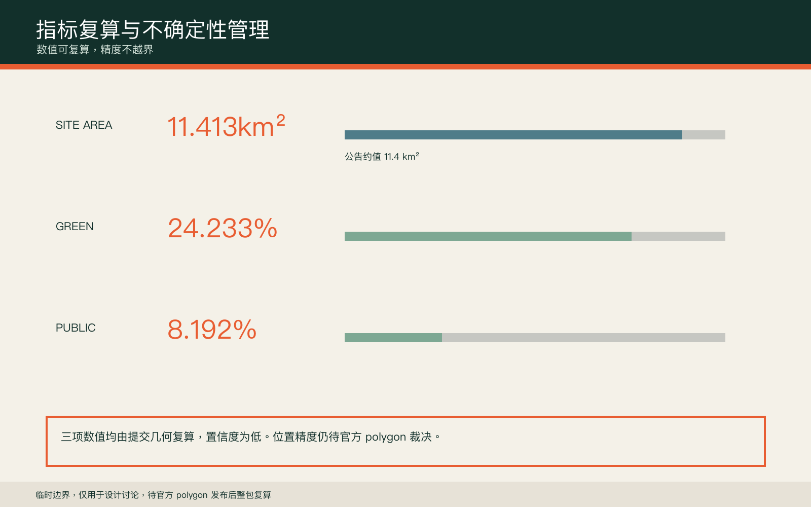

# 共智轨：百年京张AI公共创新走廊
## 设计依据与资料清单

方案只使用仓库登记的公开或清权资料。官方公告给出三层范围、三处重点区及约面积，但未公开可验证坐标系的精确红线；因此提交中的边界全部保留为临时约束，不能用于审批、征拆、权属或精确控制判断 [source:OFFICIAL-ANNOUNCEMENT] [source:BOUNDARY-SOURCE]。专业标准以本地快照为依据，用地代码遵循自然资源部分类指南，AI服务和无障碍场景分别限定在相应法规的适用边界内 [standard:MNR-LAND-USE-CLASSIFICATION-GUIDE] [standard:BARRIER-FREE-ENVIRONMENT-LAW]。

设计包把 GeoJSON 作为空间权威层，把 metrics 和三类矩阵作为复算与合规层，把正文、图件、PDF 与离线网页作为人类阅读层。最重要的数据缺口是官方 polygon、控规、道路红线、现状建筑、权属、市政、消防与文保范围；它们全部进入 assumptions，并触发未来整包重算，而不是被推测值掩盖 [depth:existing_conditions_diagnosis]。

## 三层范围工作框架

统筹研究范围处理43.6平方公里的创新链与区域协同，总体设计范围处理约11.4平方公里的空间结构与更新方法，重点区域范围处理众智园、AI原点社区和大钟寺三处详细设计。三层并非三套相互独立的图纸，而是一条从产业判断、公共空间到运营验证的责任链 [data:geometry/site_boundary.geojson#SITE-001] [metric:site_area_sqm] [depth:three_level_scope_framework]。

共智轨采用“一脊三室五群十场景”的工作框架。一脊是京张遗产生态与慢行主脊，三室是三处公共验证街区，五群是开发者、科研人员、创业团队、居民和访客，十场景则把AI能力放入可人工复核的日常空间。所有空间动作都是概念建议，临时边界只作为 intake 讨论底图。

## 统筹研究范围产业与未来城市研究

产业策略不是企业名录，而是“策源、开源、验证、转化、治理”五段循环。众智园承担全栈自主验证和安全治理，AI原点社区承担近校开源与成果转化，大钟寺承担智能原生消费、国际路演与城市展示；中关村科技服务翼提供法务、知识产权、资本和人才服务，小月河场景赋能翼提供日常城市验证 [source:AGENT-TASKBOOK] [standard:PROJECT-AGENT-OPEN-CALL-TASKBOOK]。

参考案例采用功能学习而非形式复制：MIT Kendall Square的校企邻近、Toronto MaRS的转化平台、Paris-Saclay的科研网络、Helsinki Jätkäsaari的城市试验、Singapore one-north的产业社区、Barcelona 22@的混合更新。案例只用于提炼公开协作、混合生活和可评估试验三类方法，不据此推导本地投资额或法定指标。

区域协同以“一带作为城市级验证接口”为原则，不预设行政协议、招商项目或资金承诺。北纬社区承接青年人才生活与社区共测，未来科学城连接科研成果与场景需求，怀柔科学城连接大科学装置与AI4S验证，经开区连接智能制造、中试与终端应用，京津冀节点承接跨区域活动、供应链和成果扩散。中关村科技服务翼负责知识产权、资本与专业服务，小月河场景赋能翼负责日常城市验证，两翼共同把外部协作导入三处公共验证街区 [depth:three_level_scope_framework]。

| 协同对象 | 主要接口 | 共智轨承担的角色 | 边界说明 |
|---|---|---|---|
| 北纬社区 | 青年人才、社区服务、共同测试 | 居住与公共服务体验反馈入口 | 概念协同，不代表既定社区项目 |
| 未来科学城 | 科研成果、人才与场景需求 | 开放验证与成果展示接口 | 不代表已签署合作或导入项目 |
| 怀柔科学城 | 大科学装置、AI4S与科研活动 | 模型评测和公众传播接口 | 不推定数据、设备或算力开放 |
| 经开区 | 智能制造、中试和终端应用 | 城市真实场景与产品反馈接口 | 不构成招商、采购或投资承诺 |
| 京津冀节点 | 供应链、活动与成果扩散 | 年度共同体活动与跨区复盘接口 | 待相关主体自愿参与并另行确认 |

## 总体设计范围城市更新与控规深度城市设计

总体空间结构把临时边界划分为五类连续用地：开放科研与验证、遗产公园与生态主脊、公共文化与开源交流、产业服务与智能原生商业、社区服务与人才生活。每个分区都从同一 site boundary 裁切，完整覆盖且无相互重叠 [data:geometry/land_use.geojson#LU-001] [depth:land_use_layout]。

更新方法优先识别可适应性再利用的首层、院落、边角地和交通节点，而不是预设拆除。六个催化建筑基底仅用于表达空间类型，包括共享实验室、开放验证工坊、成果转化驿站、贡献者大厅、城市客厅和交通服务节点；它们不对应测绘建筑或权属地块 [data:geometry/buildings.geojson#BLDG-001] [depth:retain_renovate_demolish]。容积率、建筑高度与建筑密度保持待正式数据补齐。

## 重点区域详细设计

众智园被定义为“开放验证花园”。北部公共验证客厅连接清河方向与科研用地，配置可预约模型评测、红队演练、标准工作坊和低碳算力解释空间。设计控制是低扰动、可撤回和全程人工监督，不对河道蓝线或道路工程作结论 [data:geometry/key_areas.geojson#PROV-KEY-001] [depth:three_key_area_detailed_design]。

AI原点社区被定义为“近校开源街区”。空间动作是把校园、园区和社区之间的步行断点转译为成果发布厅、贡献者荣誉廊、人才服务节点和晚间协作空间。大钟寺被定义为“站城智能客厅”，围绕轨道接驳提出四象限步行联系、国际路演、智能终端展示和公共服务场景，但任何桥隧、站体改造和地下空间均待专业团队深化 [data:geometry/key_areas.geojson#PROV-KEY-002] [data:geometry/key_areas.geojson#PROV-KEY-003]。

## AI 创新生态、人才画像与 AI+ 场景

五类用户画像分别是开源开发者、科研人员、初创团队、周边居民和国内外访客。每类人群都同时拥有数字路径与非数字路径：服务必须可解释、可拒绝、可转人工，不能以持续人脸识别或个人轨迹采集作为空间运行前提 [standard:GENERATIVE-AI-INTERIM-MEASURES] [standard:BARRIER-FREE-ENVIRONMENT-LAW]。

十个场景卡为：开源发布厅、模型安全沙盒、低碳算力解释站、无障碍慢行助手、近校成果转化台、公共服务双通道、铁路记忆数字导览、智能终端城市客厅、活动风险人工复核台、全球AI共同体周。前三项同时构成产业测试验证场景；所有场景都注明概念属性，不代表已批准运营 [data:geometry/public_space.geojson#PUBLIC-001] [metric:scenario_node_count]。

每个场景实行“责任到人、指标可读、到期复核”的最小运营合同。下表中的主体均为建议的责任类型，需在试点获批后由实际机构确认；阈值用于触发暂停、人工接管或退出评估，不等同于政府考核指标。

| 场景 | 建议运营主体 | 首轮验证指标 | 暂停或退出阈值 |
|---|---|---|---|
| 开源发布厅 | 场景运营中心 + 高校/开源社区 | 每季度不少于2次开放发布；材料可追溯率100% | 连续两季度无有效发布，或出现权利来源不清内容即暂停 |
| 模型安全沙盒 | 第三方评测机构 + 安全责任人 | 进入测试模型100%完成风险登记和人工复核 | 发生未授权数据使用、无法人工接管或重大安全事件立即停止 |
| 低碳算力解释站 | 设施运营方 + 能源管理单位 | 能耗与散热信息按月更新；公众解释内容可核验 | 数据连续30日缺失，或容量、消防条件不满足即下线 |
| 无障碍慢行助手 | 公共空间运营方 + 无障碍共测小组 | 每轮至少覆盖视障、行动不便和老年用户；建议人工复核率100% | 路径误导造成安全风险，或无非数字替代路径即暂停 |
| 近校成果转化台 | 高校技术转移机构 + 园区服务方 | 每季度形成可追踪咨询、路演与转介记录 | 连续两季度无有效转介，或出现利益冲突未披露即调整 |
| 公共服务双通道 | 属地公共服务主体 + 现场值守人员 | 线下通道持续可用；转人工请求响应率100% | 线下通道中断，或AI拒答后无法转人工即停用AI入口 |
| 铁路记忆数字导览 | 文化运营方 + 文保顾问 | 史料来源标注率100%；纠错意见形成月度记录 | 出现重大史实错误、权利争议或文保风险即撤下相关内容 |
| 智能终端城市客厅 | 场地运营方 + 产品责任主体 | 展示设备100%标注数据与责任边界；故障可人工接管 | 采集非必要个人信息、无法退出或连续故障即撤场 |
| 活动风险人工复核台 | 活动主办方 + 安全负责人 | 所有高风险提示由具名人员复核；事件形成复盘记录 | 无具名责任人、重大误判或应急机制失效即停止活动应用 |
| 全球AI共同体周 | 年度活动秘书处 + 场地联合运营方 | 年度一次；公开议程、参与规则和会后评估 | 无法满足安全、无障碍、版权或公众服务底线则延期或取消 |

## 用地、建筑规模与拆改留方案

用地分区采用仓库允许的国土空间用途代码，并以共享边界保证完整覆盖。绿地与公共空间是叠加的设计网络，不替代法定用地或公园红线。催化建筑仅展示可供专业团队进一步调查的空间原型，现状建筑年代、结构安全、权属与使用状况未公开，因此不得给出具体建筑的保留、改造或拆除结论 [standard:MNR-LAND-USE-CLASSIFICATION-GUIDE] [data:geometry/land_use.geojson#LU-003]。

后续拆改留判定采用四步法：先做测绘与权属核验，再做结构、消防和能耗检查，然后评估公共价值与产业适配，最后形成多方审查记录。当前指标只计算概念催化基底面积，不计算总建筑规模或容积率 [metric:building_footprint_area_sqm] [depth:development_intensity_controls]。

## 交通、轨道、市政与公共服务设施

共智轨提出一条南北遗产慢行主脊、三条东西缝合线和一条公共服务微循环。三条横线分别服务众智园、AI原点社区和大钟寺站周边，将慢行、骑行、轨道接驳与公共验证空间放在同一张图上 [data:geometry/roads.geojson#ROAD-001] [depth:traffic_rail_slow_parking]。这些线是设计关系，不是道路红线。

市政策略采用“先测量、再试点、可回退”的原则。端侧算力节点与既有公共服务设施共址的建议，必须在能源容量、散热、消防、网络安全与运营责任明确后才能深化。每处AI服务保留人工办理与离线信息，避免技术故障造成基本服务中断 [depth:municipal_new_infrastructure]。

## 蓝绿空间、公共空间与城市风貌

蓝绿系统以一条南北生态主脊和三条横向缝合带组成，公共空间则形成众智园验证花园、AI原点开源客厅、大钟寺站城客厅和一处铁路记忆平台。临时模型计算绿地与公共空间比例，用于比较设计取向而非表达法定绿地率 [data:geometry/green_space.geojson#GREEN-001] [metric:green_ratio] [metric:public_space_ratio]。

城市风貌采用铁路基础设施的深蓝绿、信号橙和金属灰，导视以“轨枕刻度”组织距离、年份和贡献记录。三个朝圣节点分别是“第一行代码纪念台”“开放模型验证塔”“百年京张贡献者档案馆”。它们是可讨论的品牌与公共艺术原型，需另行完成文保、结构、版权和公众协商。

“共智轨 / COMMONS LINE”采用一个主标识、两种语言组合和三级应用层级。主标识方向由“平行双轨 + 开放节点”构成：双轨代表百年京张与AI时代并行，开放节点代表任何机构和个人都可在规则下参与验证。中文横排为首选组合，英文组合用于国际活动与双语传播；最小使用时只保留无文字图形标。标识保持深蓝绿底、信号橙节点和金属灰辅助色，不拉伸、不旋转、不改变轨线与节点关系。文化导视使用轨枕刻度和里程信息，属于空间语言；“全球AI共同体周”等活动名称属于可更换的子品牌，不替代共智轨主标识。标识图形由本方案原创生成，文字采用提交包内嵌的 Noto Sans SC，依 SIL Open Font License 1.1 使用，字体许可随包提供。

## 更新项目清单、实施政策与分期计划

近期阶段优先低成本且可撤回的公共空间试点，包括慢行断点审计、贡献者展示、开源发布活动和公共服务双通道测试。中期阶段在完成现状调查后推进近校转化空间与社区服务节点。远期阶段仅在轨道、市政、文保和权属条件清晰后研究站城协同与大型国际活动 [data:geometry/phasing.geojson#PHASE-001] [depth:phasing_implementation]。

治理采用“城市验证协议”：每个场景须声明问题、数据最小集、人工责任人、退出机制、最长试验期、事故上报和复盘方式。年度活动包括春季开放模型周、夏季城市验证季、秋季全球开发者大会和冬季治理复盘会，均为运营参考方案，不是政府已确定安排 [depth:renewal_project_list]。

## 指标体系、面积复算与合规矩阵

三项核心视觉指标都由提交几何复算：总体设计范围面积约为11.413平方公里，临时模型绿地比例和公共空间比例分别读取 metrics.json。数值与官方公告的约11.4平方公里接近，但边界推定仍存在位置不确定性，不能用面积拟合把临时 polygon 升级为官方红线 [metric:site_area_sqm] [metric:green_ratio] [metric:public_space_ratio]。

合规矩阵覆盖公告1.3、1.4、1.5与agent.1-agent.6；专业标准矩阵覆盖全部必选标准；设计深度矩阵将控规、交通、市政、蓝绿、实施和风险分别落到正文、图层、指标和图纸。任何官方控制项缺失时使用“待正式数据补齐”，不以视觉上的精确数字制造确定性 [depth:metrics_recalculation]。

## 风险、版权与合规说明

主要风险包括临时边界位置偏差、控规和权属缺失、现状建筑未知、市政与消防条件未知、文保范围未知，以及AI场景的隐私、偏差和可用性风险。对应措施是整包复算触发器、专业前置核验、人工复核、数据最小化、非数字服务路径和试验期退出机制 [depth:risk_missing_data] [data:geometry/constraints.geojson]。

图件由本方案 GeoJSON、指标和自编排程序生成，概念封面由图像生成模型制作并明确为合成示意。没有使用未经授权的企业商标、人物肖像、遥感影像或新闻图片。方案是开放共创建议，不替代正式规划，不构成政府审定结论、投资承诺、工程可行性判断或实施保证 [source:AGENT-TASKBOOK]。

## 参考资料

核心资料包括海淀分局官方征集公告、用户清权的智能体任务书摘录、城市设计管理办法、控制性详细规划编制审批办法、国土空间用途分类指南、无障碍环境建设法、生成式人工智能服务管理暂行办法，以及仓库临时边界推定说明。正式来源、发布日期、许可、允许用途和限制完整保存在 sources.json 与标准矩阵 [source:SITE-PACKAGE] [source:SOURCE-REGISTRY]。

本方案不把 OSM 背景核查用于正式边界或面积依据。官方 polygon、正式控规、道路红线、文保、市政、权属和现状建筑资料到位后，应从 site boundary 开始重建全部图层、指标、图件、HTML 与 PDF，并重新运行四道自检。
