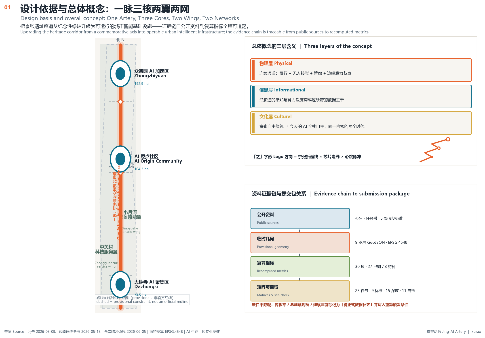
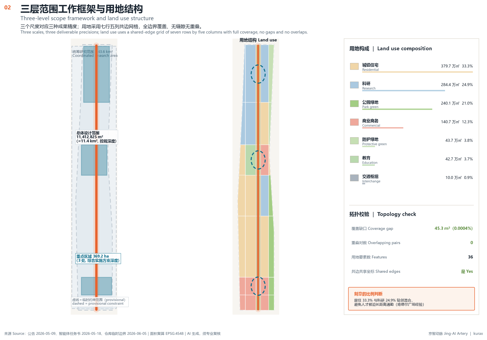
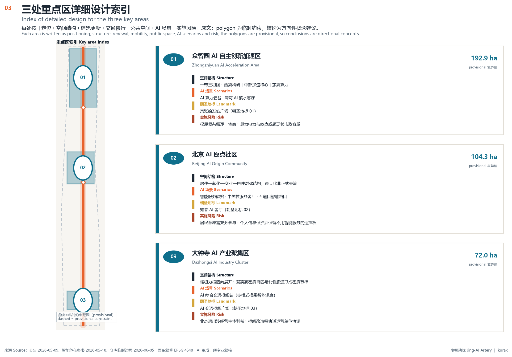
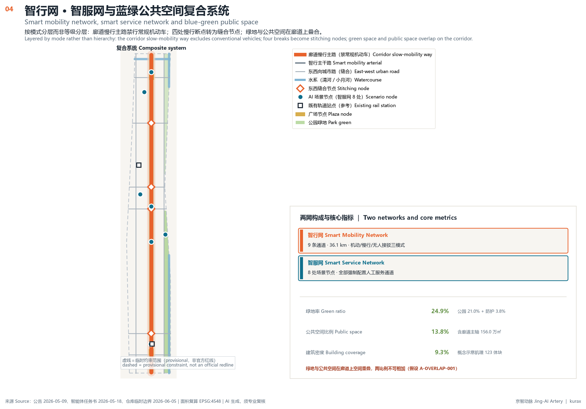
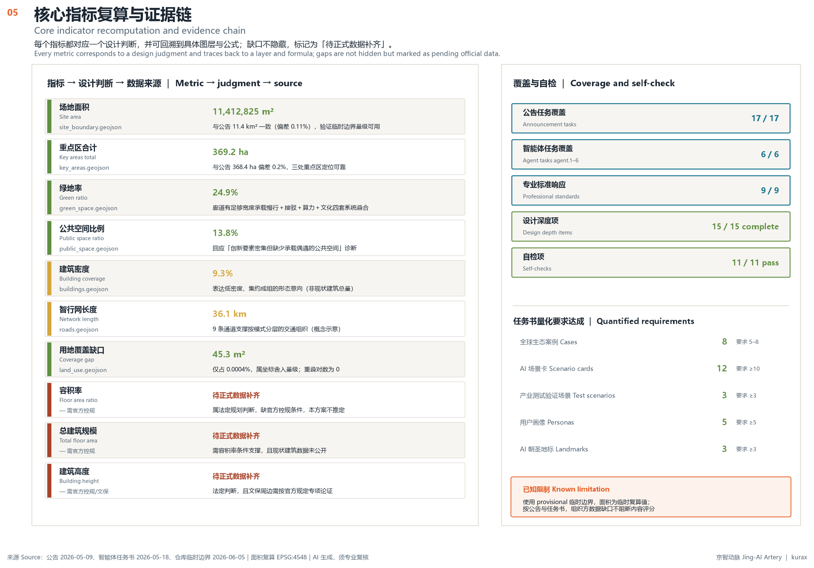

# 京智动脉 · Jing-AI Artery

**百年京张AI创新带城市设计概念方案**

> 本方案是面向「百年京张AI创新带城市设计开源征集」的开放共创建议，不替代正式规划，不构成政府审定结论。所有空间落地建议均为概念建议与参考方案，可供专业团队深化研究 [source:AGENT-TASKBOOK] [standard:PROJECT-AGENT-OPEN-CALL-TASKBOOK]。

---

## 设计依据与资料清单

### 一个必须先讲清楚的判断：本方案的边界是"临时"的，但设计逻辑不是

本方案面临一个真实的数据条件：截至编制时，组织方尚未公开总体设计范围与三处重点区的官方矢量红线。仓库提供的是由智能体依据公告面积与主要道路推定的**临时约束范围（provisional constraint）**，其精度被明确标注为粗略 [source:BOUNDARY-SOURCE] [data:geometry/site_boundary.geojson#PROV-SITE-001]。

这个限制决定了本方案的写法。我们没有选择回避，而是把它变成方案结构的一部分：**所有依赖精确红线的结论（容积率、建筑高度、地块拆改留、道路线形）一律不给**，而把设计力量集中在不依赖红线精度也能成立的判断上——空间结构的拓扑关系、廊道的连通逻辑、场景与人群的匹配、运营机制的设计。这类判断在官方红线补齐后**不需要推翻，只需要重新量算**。

具体而言，临时边界的适用与禁用如下：可用于概念生成、人类可读可视化、非法定设计讨论、本地自检；不可用作官方红线、审批依据、精确面积计算、法定规划管控、土地权属或工程边界 [source:BOUNDARY-SOURCE]。当官方 polygon 到位后需要重算的内容，已逐项记录在假设文件的重算触发条件中，主要涉及场地面积、绿地率、公共空间比例、建筑基底与三处重点区面积 [metric:site_area_sqm]。

### 资料分级与使用纪律

本方案严格区分三类资料的可用性。**可用于正式论证**的包括：资格预审公告（项目目的、三层范围、设计任务、成果深度的主控要求）[source:OFFICIAL-ANNOUNCEMENT]、面向智能体任务书（十条共创原则、三大定位、五大功能、六项任务）[source:AGENT-TASKBOOK]、《城市设计管理办法》[standard:MOHURD-URBAN-DESIGN-MEASURES]、《城市、镇控制性详细规划编制审批办法》[standard:MOHURD-CONTROL-DETAILED-PLANNING]、《国土空间调查、规划、用途管制用地用海分类指南》[standard:MNR-LAND-USE-CLASSIFICATION-GUIDE]、《生成式人工智能服务管理暂行办法》[standard:GENERATIVE-AI-INTERIM-MEASURES]、《中华人民共和国无障碍环境建设法》[standard:BARRIER-FREE-ENVIRONMENT-LAW]。

**仅可用于临时生成与展示**的是上述临时边界数据。**仅可用于背景理解**的是老年人智能技术困难实施方案，本方案用它来支撑适老化与人工兜底的设计判断，但不把它当作本项目的直接管控依据 [standard:ELDERLY-SMART-TECH-PLAN-2020-45]。

完整的来源记录、权利说明、指标公式、标准响应、设计深度与任务覆盖分别保存在来源文件、指标文件、任务覆盖矩阵、专业标准矩阵和设计深度矩阵中，正文不重复抄录这些机器索引。

### 本方案不做什么

依照任务书统一边界条款，本方案不给出控规调整、容积率、建筑高度等法定规划判断，不给出具体地块的拆改留结论，不给出道路线形、轨道线位、桥隧工程、市政管线的工程方案，不做地下空间可行性与市政容量测算，不涉及土地权属、投资测算与审批判断，不使用非公开政府数据、企业内部数据与个人隐私数据 [source:AGENT-TASKBOOK]。正文中出现的建筑肌理、道路中心线、分期范围，都是用于表达结构关系与量级感的**概念示意几何**，其属性中均标注为设计建议，不构成工程定线 [data:geometry/buildings.geojson#BLDG-C2R7-1]。

---

## 三层范围工作框架

### 三个尺度，三种设计任务，三种成果精度

公告设定的三层范围不是同一件事的三种放大倍数，而是三种不同性质的工作。本方案对应给出三种不同的成果精度，避免用一种深度覆盖全部尺度。

**统筹研究范围（约43.6平方公里）** 解决的是"这条带在区域创新网络中扮演什么角色"。这个尺度上的成果是产业协同关系、创新要素流动路径、与北纬社区/未来科学城/怀柔科学城/经开区的分工判断，以及连续绿色空间体系的骨架。成果形式是策略图与关系图，不做地块级设计 [data:geometry/site_boundary.geojson#PROV-RESEARCH-001]。

**总体设计范围（约11.4平方公里）** 解决的是"这条带自身如何组织"。这是本方案的主战场，要达到控制性详细规划的城市设计深度：空间结构、用地布局、开发强度分区意向、高度与体量意向、蓝绿公共空间体系、交通与慢行组织、更新对象分类、分期实施框架。经临时边界在 EPSG:4548 下复算，该范围面积为 11,412,825 平方米，与公告宣称的约11.4平方公里吻合，验证了临时边界在量级上可用 [metric:site_area_sqm] [data:geometry/site_boundary.geojson#PROV-SITE-001]。

**重点区域范围（约368.4公顷）** 解决的是"关键节点如何具体运转"。三处重点区要达到规划综合实施方案的城市设计深度：定位、空间结构、建筑更新意向、交通慢行、公共空间、AI场景配置、实施风险。复算面积分别为众智园AI自主创新加速区 192.9公顷、北京AI原点社区 104.3公顷、大钟寺AI产业聚集区 72.0公顷，三者合计 369.2公顷，与公告的368.4公顷偏差0.2%，属临时边界的合理误差范围 [depth:three_level_scope_framework] [data:geometry/key_areas.geojson#PROV-KEY-001]。

### 三层之间靠什么传导

三层范围之间的传导不靠行政层级，而靠**同一条动脉的连续性**。统筹研究范围内确立的南北创新走廊，在总体设计范围内落为京张遗址公园复合廊道这一具体空间载体，在重点区域内落为三个具体的廊道界面段（清河界面段、原点社区段、大钟寺段）。这样，一个尺度上的战略判断在下一个尺度上有明确的空间承接对象，而不是重新发明一套结构 [depth:overall_spatial_structure]。

---

## 统筹研究范围产业与未来城市研究

### 总体概念：为什么叫「京智动脉」

**中文主名称：京智动脉。英文名称：Jing-AI Artery。缩写：JIA。**

命名的核心判断是：这条带最独特的资产不是"有很多AI企业"，而是**有一条贯穿南北、长约9.7公里的连续线性空间**——京张铁路遗址廊道。北京其他创新区域没有这个条件。中关村有密度但没有连续廊道，未来科学城有空间但没有百年叙事。所以方案不把遗址廊道当作需要被保护的历史遗存去做纪念性绿道，而把它当作**这条带唯一不可复制的基础设施**去做功能加载。

"动脉"这个词承担三层含义。**物理层**：它是真实的连续通道，承载慢行、无人接驳、地下管廊与边缘算力节点。**信息层**：沿廊道布设的感知与算力设施构成这条带的数据主干，服务于交通、公共服务与产业测试。**文化层**：京张铁路当年是中国人自主修筑的第一条干线铁路，"自主"这个内核与今天"AI全栈自主创新"的诉求是同一件事的两个时代版本。动脉输送的不只是人流与数据，是自主创新的连续性。

选"智"而不选"AI"作为中文名的构词，是因为"智"能同时指向智能技术与城市智慧，且与"京"构成地名式简称（京智），具备地名化传播的潜力——如同"京张"本身。

### 命名体系：三大定位各得其名

命名不止一个主名，而是一套可延展的体系，让三大定位在语言上各有落点，避免所有内容都挤在一个词里 [source:AGENT-TASKBOOK]：

| 定位 | 体系名 | 命名逻辑 | 主要空间载体 |
|---|---|---|---|
| 百年京张文化带 | **京张轨 · JZ Track** | "轨"指铁轨，也指历史轨迹与传承路径 | 遗址廊道文化段、清华园车站旧址、大钟寺古钟博物馆周边 |
| 都市AI生活体验带 | **京智脉 · JIA Pulse** | "脉"指脉搏、生活节律，强调可感知的日常体验 | AI原点社区、知春路生活带、小月河场景赋能翼 |
| AI融合创新带 | **京智核 · JIA Core** | "核"指内核、算力核心、创新策源 | 众智园AI加速区、中关村科技服务翼 |

三个子名共享"京"与"智"的语素，形成家族识别；同时各自可独立传播，适配文旅、社区运营、产业招引三种不同话语场景。

### 视觉识别与Logo方向

Logo方向以**「之」字形**为核心图形。这个选择有明确依据：京张铁路青龙桥站的"人"字形（俗称之字形）折返线是中国铁路史上的标志性技术创新，是"用巧办法解决硬约束"的具象符号。而在AI语境中，折线同时读作**芯片走线**与**心跳脉冲波形**。三重语义在同一图形上重合，这是本方案认为最有效的识别策略 [source:AGENT-TASKBOOK]。

图形构成建议：一条自下而上的折线主干，在三个转折点上放置三个渐次增大的节点，对应三处重点区自南向北的能级递进（大钟寺→原点社区→众智园）；折线末端向上开放，不闭合，表示持续演进。

延展系统建议：折线可拉伸为导视系统的路径指示线、公共空间铺装的引导纹样、活动海报的版式骨架、数据可视化的坐标轴。单色即可识别，适配刺绣、金属蚀刻、屏幕显示与小尺寸场景。

关于权利：Logo方向为文字描述与几何逻辑建议，本方案不提供需要授权的字体文件、图片素材、人物肖像或企业标识。正式视觉系统需由专业团队在完成商标检索与字体授权后深化 [source:AGENT-TASKBOOK]。

### 三大定位、五大功能、三区两翼的协同回路

任务书给出三大定位与五大功能，但没有规定它们之间如何咬合。本方案提出的答案是**一条闭合回路**，而非五个并列板块 [source:AGENT-TASKBOOK]：

**AI全栈自主创新体系**（众智园）产出技术 → **AI+场景赋能新范式**（小月河翼、遗址廊道）提供真实场景做验证 → 验证结果反馈技术迭代，同时形成**智能化AI活力城市**（原点社区、大钟寺）的可感知服务 → 服务运行沉淀出治理经验与标准草案 → 支撑**AI治理全球话语权**（原点社区治理实验室）→ 话语权与标准吸引全球要素回流 → **世界级AI创新生态**（中关村科技服务翼）完成要素配置 → 要素回到众智园支撑下一轮技术攻关。

这个回路的关键在于：**场景不是技术的下游展示厅，而是技术迭代的上游输入**。所以本方案把场景节点直接布设在廊道与社区中，而不是集中在某个"示范园区"里。

三区两翼的分工据此确定：众智园承担全栈自主体系与治理话语权，AI原点社区承担世界级生态与治理实验，大钟寺承担智能原生业态，中关村科技服务翼承担要素配置与IP转化，小月河场景赋能翼承担场景开放与测试验证 [source:AGENT-TASKBOOK]。

### 总体空间结构：一脉三核两翼两网

**一脉**——京张遗址公园复合廊道。南北贯通，是结构主干。廊道内叠合四套系统：连续慢行道、无人接驳环线、边缘算力与感知节点、文化叙事节点。经复算，公园绿地类用地共 240.1 万平方米，占总体设计范围 21.0%，其中沿廊道的公共空间主轴面积 156.0 万平方米 [metric:green_ratio] [data:geometry/public_space.geojson#PUBLIC-ARTERY]。

**三核**——三处重点区作为动脉上的三个"心室"，各有独立功能与运行节律，通过廊道保持连续。

**两翼**——中关村科技服务翼（西侧，承接既有创新服务密度）与小月河场景赋能翼（东侧，承接滨水开敞空间与测试场地需求）。两翼在廊道两侧形成"服务—验证"的对位关系。

**两网**——**智行网**覆盖机动、慢行、无人接驳三种模式，含9条主要通道，复算总长 36.1 公里 [data:geometry/roads.geojson#ROAD-ARTERY-SLOW]；**智服网**是公共服务智能体的部署网络，以8个场景节点为物理锚点，向社区、枢纽、滨水与路口延伸 [data:geometry/public_space.geojson#SCN-ORIGIN-SVC]。

### 五至八个全球AI创新生态案例及可转化经验

以下案例均基于公开可查的城市与园区发展经验，用于提炼机制而非照搬形态。本方案不编造企业名单、投资额、产值或财政承诺 [source:AGENT-TASKBOOK]。

**案例一：美国匹兹堡自动驾驶产业集聚（卡内基梅隆大学周边）。** 机制核心是大学实验室与城市街道之间的短距离。研究者可以把算法在几分钟车程内的真实街道上验证，这个物理邻近性是产业集聚的真正原因。**可转化经验**：本方案把自动驾驶测试场设在小月河翼，与众智园直线距离约2公里，保证"实验室—测试场"的通勤在15分钟内 [data:geometry/public_space.geojson#SCN-XYH-TEST]。

**案例二：英国伦敦国王十字站区更新（King's Cross）。** 机制核心是把废弃铁路用地转为混合功能街区，保留工业构筑物作为公共空间骨架，用长期单一业主的耐心资本支撑15年以上的分期开发。**可转化经验**：遗址廊道的更新应采用长周期分期而非一次性建成，并保留可识别的铁路构筑物作为公共空间的空间骨架，而不是清空后重做景观。

**案例三：西班牙巴塞罗那超级街区（Superilles）。** 机制核心是不新建道路、仅通过交通组织调整把机动车路权转为公共空间路权，用极低成本获得大量步行空间。**可转化经验**：本方案在廊道两侧提出的慢行优先策略以路权再分配为主要手段，作为概念建议供专业团队评估，不给出道路线形与红线结论。

**案例四：新加坡智慧国计划的公共服务数字化。** 机制核心是政府把服务接口标准化并对外开放，让第三方开发者在统一底座上建应用，同时保留人工服务通道。**可转化经验**：智服网采用"统一接口 + 开放开发 + 人工兜底"三件套，人工兜底是硬性配置而非可选项 [standard:BARRIER-FREE-ENVIRONMENT-LAW]。

**案例五：韩国首尔清溪川复原。** 机制核心是拆除高架道路恢复水系，用一条线性公共空间重构周边地区的价值结构与步行网络。**可转化经验**：线性空间的价值不在其自身宽度，而在它与两侧街区的接口密度。本方案因此强调廊道的横向东西缝合接口，而非只做纵向贯通。

**案例六：荷兰埃因霍温高科技园区（Brainport）。** 机制核心是"开放创新"制度设计：企业共享中试设备与实验设施，降低单个主体的重资产门槛。**可转化经验**：众智园应配置共享型算力与中试设施，作为概念建议提出，其规模与投资需由专业团队测算。

**案例七：美国波士顿肯德尔广场（Kendall Square）。** 机制核心是研发办公与居住、零售高度混合，使非正式交流的发生概率最大化。**可转化经验**：本方案在原点社区采用科教转化街区与居住社区贴邻布局，而非分区隔离，居住类用地占比 33.3%，与科研类 24.9% 形成混合而非分离的比例关系 [data:geometry/land_use.geojson#LU-C2-R5]。

**案例八：日本东京虎之门-麻布台的立体公共空间。** 机制核心是在高密度条件下把公共空间做成多标高连续系统。**可转化经验**：大钟寺片区受铁路与主干路切割，公共空间连续性只能靠多标高解决，本方案将其列为需专业团队进行工程可行性研究的方向，不给出桥隧结论 [source:AGENT-TASKBOOK]。

### AI创新生态图谱与要素机制

生态图谱由五个圈层构成：**内核**是众智园的全栈自主技术攻关（芯片、框架、模型、工具链）；**第二圈**是原点社区的成果转化与治理实验；**第三圈**是大钟寺的智能原生消费与商务业态；**第四圈**是两翼的要素配置与场景验证；**第五圈**是统筹研究范围内与北纬社区、未来科学城、怀柔科学城、经开区的区域协同。

八类要素的机制建议如下。**土地**：以存量更新为主，通过功能混合而非新增用地供给创新空间。**空间**：提供从工位到独栋的连续空间梯度，避免只有大面积载体。**产业**：以场景需求牵引技术供给。**资金**：建议探索长周期耐心资本机制（概念建议，不涉及具体资金安排）。**人才**：以居住与服务的贴邻配置降低通勤成本。**算力**：采用"廊道边缘节点 + 众智园集中云谷"的两级架构，边缘节点服务低时延场景，集中节点服务训练需求 [data:geometry/public_space.geojson#SCN-ZZY-CLOUD]。**数据**：以场景为单位定义数据边界，不做跨场景汇聚。**场景**：建立场景开放清单与准入规则，使企业可申请在真实空间中测试。

上述所有要素机制均为概念建议，不构成已确定的政策安排、招商承诺或资金安排 [source:AGENT-TASKBOOK]。

### 区域协同与国土空间规划创新思路

在区域层面，本方案建议这条带承担**"验证枢纽"**角色而非"又一个产业园"。未来科学城与怀柔科学城具备大科学装置与大尺度用地，适合承担重装备与长周期研究；经开区具备制造能力，适合承担量产转化；本带的独特条件是**高密度真实城市场景 + 高强度人才聚集 + 连续线性公共空间**，最适合承担"技术在真实城市中的验证"这一环节。这个分工使区域内不重复建设，各自的资源禀赋得到匹配使用。

在国土空间规划方法层面，本方案提出三点创新思路作为研究性建议：其一，**场景作为一种规划要素**——在传统用地分类之外，叠加"场景开放度"这一属性层，标识哪些空间允许何种强度的技术测试，使规划能够管控技术活动而不只管控建设行为；其二，**时间维度的用地弹性**——同一空间在不同时段承担不同功能（如廊道段落在非高峰时段开放为测试场），需要规划工具支持时序性管控；其三，**混合功能的量化表达**——用"功能混合度"指标补充单一用地代码，反映实际的功能配比。三点均需在现行法定框架下由专业团队评估可行性，本方案不主张突破现行规定 [standard:MNR-LAND-USE-CLASSIFICATION-GUIDE]。

---

## 总体设计范围城市更新与控规深度城市设计

### 现状条件诊断：三个真问题

本方案对总体设计范围的诊断基于公开可获得的空间格局认识，涉及具体建筑权属、现状建筑质量与市政容量的判断，因缺乏官方数据，均列为待正式数据补齐事项 [depth:existing_conditions_diagnosis]。

**问题一：南北向连续，东西向割裂。** 这条带南北长约9.7公里，但东西宽度多处不足1.5公里，且被北三环、北四环、知春路、成府路等多条东西向主干路横向切断。结果是廊道在纸面上连续，在体验上被切成若干段。这是本方案要解决的首要空间问题。

**问题二：创新要素密集，但公共交往空间不足。** 该区域是全国创新要素最密集的地区之一，但要素之间的非正式交往主要发生在建筑内部（咖啡馆、会议室），缺少能承载偶遇的高质量室外公共空间。这限制了知识溢出效率。

**问题三：遗址廊道的价值被"保护"叙事低估。** 若把廊道仅作为历史纪念空间处理，它将成为一条使用强度很低的绿带，无法回应这条带对功能空间的迫切需求。廊道需要承担实际城市功能。

### 空间结构与功能布局

针对上述三个问题，方案的空间对策分别是：**东西缝合**（在廊道与主干路交叉处集中处理，把断点转为节点）、**廊道功能加载**（把公共交往与场景验证功能置入廊道）、**核心极化**（在三处重点区形成足够强度的功能集聚，避免均质摊平）。

用地布局按上述结构展开，经复算的构成如下 [depth:land_use_layout] [data:geometry/land_use.geojson#LU-AXIS-R5]：

| 用地类别 | 代码 | 面积（万㎡） | 占比 | 结构角色 |
|---|---|---|---|---|
| 城镇住宅用地 | 0701 | 379.7 | 33.3% | 人才居住基础，两翼为主体 |
| 公共管理与公共服务设施用地（科研） | 0802 | 284.4 | 24.9% | 众智园与研发带核心载体 |
| 公园绿地 | 1401 | 240.1 | 21.0% | 廊道主体与滨水绿带 |
| 商业商务用地 | 05 | 140.7 | 12.3% | 大钟寺业态与生活服务 |
| 防护绿地 | 1402 | 43.7 | 3.8% | 水系与铁路防护 |
| 教育用地 | 0804 | 42.7 | 3.7% | 原点社区科教转化 |
| 城镇道路用地（枢纽） | 1207 | 10.0 | 0.9% | 大钟寺综合交通枢纽 |

用地划分采用南北七行、东西五列的网格骨架，中央列为廊道，相邻地块共享边界坐标，实现全边界覆盖、无缝隙、无重叠。经拓扑检验，覆盖缺口仅 45 平方米（占总面积 0.0004%，属坐标舍入量级），重叠对数为零 [data:geometry/land_use.geojson#LU-C1-R7]。

这个用地结构回应了一个关键判断：**居住占三分之一是刻意的**。创新区域的常见失误是把用地过度倾向产业，导致人才被迫长距离通勤，反而降低了要素聚集的实际效果。33.3%的居住占比与24.9%的科研占比形成贴邻混合关系，是对肯德尔广场经验的空间转译。

### 开发强度与高度体量意向

本方案不给出容积率与建筑高度数值，这属于法定规划判断，不在开源征集的成果范围内 [source:AGENT-TASKBOOK] [depth:development_intensity_controls]。

作为概念建议，强度与高度的**分布意向**如下：以廊道为低谷、向两侧递增，形成"中间开敞、两侧集聚"的剖面关系，使廊道获得充足日照与视野开敞度；南北向上，三处重点区为三个强度峰值，过渡段落强度降低，形成节律而非均质。高度控制的意向原则是：廊道两侧首排建筑退让并降低高度，避免形成连续高墙；文保单位周边（清华园车站旧址、大钟寺古钟博物馆）严格遵守文物保护要求，高度与体量需按官方文保规定专项论证，本方案不给出结论 [data:geometry/constraints.geojson#CONS-HER-QHY] [depth:height_massing_character]。

建筑基底经复算为 106.1 万平方米，建筑密度约 9.3%，共123个概念示意体块 [metric:building_footprint_area_sqm] [data:geometry/buildings.geojson#BLDG-C2R7-1]。这个数值是概念肌理的量级示意，用于表达"低密度、高绿量、集约成组"的形态意向，不是建设规模结论。总建筑规模因缺乏容积率条件，列为待正式数据补齐事项。

### 保留、改造、拆除、新建的分类逻辑

本方案**不给出任何具体地块的拆改留结论**，这既超出开源征集的边界，也缺乏现状建筑质量、权属与结构安全数据支撑 [source:AGENT-TASKBOOK] [depth:retain_renovate_demolish]。

方案给出的是**分类的判断标准**，供专业团队在获得现状数据后应用：**优先保留**——具有历史价值的铁路构筑物、结构安全且功能适配的既有科研建筑、成熟居住社区；**建议改造**——功能与新需求不匹配但结构良好的建筑，尤其是可转为共享研发与中试空间的既有厂房类建筑；**谨慎评估拆除**——仅在结构安全存在问题或严重阻断公共空间连续性时，才进入拆除评估，且需完成权属与补偿的合法程序；**新建**——集中在功能缺口明确的位置（如枢纽换乘设施、公共服务节点），以补齐功能而非增加规模为目的。

这套标准的核心倾向是**存量优先**：这条带的空间问题主要是"连接不足"与"功能错配"，而不是"总量不足"，因此更新手段应以改造和连接为主。

### 更新项目清单框架

更新项目按三类组织，具体清单见后文分期章节 [depth:renewal_project_list]：**结构性项目**（廊道贯通、东西缝合节点、枢纽一体化）解决骨架问题；**功能性项目**（场景节点、公共服务设施、共享研发载体）解决功能问题；**品质性项目**（导视系统、公共空间界面、文化叙事节点）解决体验问题。三类项目在时序上不是先后关系，而是每个分期内都同时包含三类，保证每一期都能形成可感知的完整成果。

### 市政与新型基础设施

传统市政（给排水、电力、燃气、通信）的容量评估需要官方数据，本方案不做测算，列为待正式数据补齐事项 [depth:municipal_new_infrastructure]。

新型基础设施的**融合方式**是本方案提出的概念建议：把边缘算力节点、感知设备、充换电设施与传统市政管廊**同沟同期建设**，而不是后期加装。理由是这类设施的运维需求（电力、散热、检修通道）与市政设施高度重合，同期建设可显著降低全周期成本。廊道因其连续线性特征，是最适合承载这类复合管廊的空间 [data:geometry/roads.geojson#ROAD-ARTERY-SLOW]。分布式能源与端侧算力的具体配置规模需专业测算，本方案不给出数值。

---

## 重点区域详细设计

三处重点区的 polygon 均为临时约束范围，因此以下设计均为**方向性概念建议**，其中依赖精确边界的结论（地块划分、退线、具体规模）在官方红线补齐后需重新推导 [data:geometry/key_areas.geojson#PROV-KEY-001] [depth:three_key_area_detailed_design]。

### 众智园AI自主创新加速区（192.9公顷）

**定位**：全栈自主技术攻关的策源地，承担"AI全栈自主创新体系"与"AI治理全球话语权"两项功能。

**空间结构**：以廊道清河界面段为东西向展开面，形成"一带三组团"——西翼科研片区（基础研究与算法）、中部AI加速核心（工程化与工具链）、东翼算力片区（算力设施与数据服务）。三组团沿廊道并置而非串联，使任一组团到廊道的距离都在步行范围内 [data:geometry/land_use.geojson#LU-C2-R7]。

**建筑更新意向**：以既有科研建筑改造为主，重点是把封闭独立的研究楼群改造为**带共享中庭的组团**，在建筑之间插入共享中试与设备空间。这是对埃因霍温开放创新经验的空间转译：共享设施必须在物理上位于各主体之间，而不是设在某个主体内部。具体地块的改造方案需在获得权属与结构数据后确定。

**交通慢行**：内部以步行优先，机动交通在组团外围解决。西侧智行主干路与东侧智行主干路承担对外联系，组团之间通过廊道慢行道与无人接驳环线连接 [data:geometry/roads.geojson#ROAD-WSPINE]。

**公共空间**：核心是**京张始发站广场**，位于廊道北段，是三处重点区中唯一直面清河水系的开敞空间。广场承担两个功能：日常的研究者非正式交往场所，以及年度活动的主会场 [data:geometry/public_space.geojson#PUBLIC-PLAZA-ZZY]。

**AI场景配置**：AI算力云谷（集中算力设施的可视化展示界面）、清河AI滨水客厅（滨水公共空间中的智能服务节点）[data:geometry/public_space.geojson#SCN-ZZY-CLOUD]。

**实施风险**：既有科研机构的权属复杂，改造需逐一协商，时间成本高；算力设施的电力与散热需求可能超出现状市政容量，需专项评估。两项均需专业团队进一步研究。

### 北京AI原点社区（104.3公顷）

**定位**：世界级AI创新生态的社区级样本，承担"世界级AI创新生态"与治理实验功能。这里是本方案中**AI最贴近日常生活**的地方。

**空间结构**：以廊道原点社区段为轴，西侧为中关村东路居住社区，中部为科教转化街区，东侧为知春路AI生活商业带，最东为居住社区。这是一个**居住—转化—商业—居住**的对称结构，使科教转化街区两侧都直接贴邻生活功能，最大化非正式交流的发生概率 [data:geometry/land_use.geojson#LU-C2-R5]。

**建筑更新意向**：科教转化街区以教育用地为载体（42.7万平方米），建议采用**小尺度、高密度、界面连续**的形态，形成可步行的街道网络而非大院式布局。居住社区以既有社区改造为主，重点是底层界面的功能激活与无障碍改造 [standard:BARRIER-FREE-ENVIRONMENT-LAW]。

**交通慢行**：知春路AI大道与成府路AI生活街是两条东西向主要通道，其与廊道的交叉点是本片区最重要的缝合节点。慢行系统的设计要点是使居住社区到廊道的步行距离控制在500米内 [data:geometry/roads.geojson#ROAD-ZCL]。

**公共空间**：核心是**知春AI客厅**，一个面向社区居民而非仅面向从业者的公共空间。它的设计意图是让AI服务在这里被普通居民日常使用与评议，从而成为治理实验的现场 [data:geometry/public_space.geojson#PUBLIC-PLAZA-ORIGIN]。

**AI场景配置**：智能服务驿站（公共服务智能体的社区节点）、中关村AI公共服务客厅、五道口智慧路口 [data:geometry/public_space.geojson#SCN-ORIGIN-SVC]。

**文保约束**：清华园车站旧址位于本片区范围内，其保护范围与建设控制要求需按官方文物保护规定执行，本方案仅将其标注为约束条件，不给出周边建设结论 [data:geometry/constraints.geojson#CONS-HER-QHY]。

**实施风险**：既有居住社区的改造涉及居民意愿与利益协调，需充分公众参与；AI服务在社区中的部署涉及个人信息保护，必须严格遵守相关规定并保留不使用智能服务的选择权 [standard:GENERATIVE-AI-INTERIM-MEASURES]。

### 大钟寺AI产业聚集区（72.0公顷）

**定位**：智能原生消费与商务业态的集中承载区，承担"智能原生业态"功能。这里是三处重点区中**交通条件最好、更新压力最大**的一处。

**空间结构**：以AI综合交通枢纽为核心，四向展开商业商务功能。枢纽用地10.0万平方米，是本方案中唯一的城镇道路用地（交通枢纽）地块，其设置意图是把轨道站点、常规公交、无人接驳、慢行系统在同一空间体上完成换乘 [data:geometry/land_use.geojson#LU-AXIS-R2-HUB]。

**建筑更新意向**：以既有商业建筑的业态更新为主，形态上建议形成**紧凑高密度的街区**，与北侧的低密度廊道形成对比。这个对比是有意的：动脉需要在不同段落有不同的密度节律，全线均质会丧失可识别性。

**交通慢行**：本片区被大钟寺南侧城市路、北侧城市路夹持，且紧邻既有轨道站点。慢行系统的核心难题是穿越主干路，本方案提出多标高连续系统的方向，但明确指出桥隧与地下空间的工程可行性需专业团队论证，方案不给出结论 [data:geometry/roads.geojson#ROAD-DZS-N] [source:AGENT-TASKBOOK]。

**公共空间**：核心是**AI交通枢纽广场**，位于枢纽南侧。它承担枢纽集散与公共活动双重功能 [data:geometry/public_space.geojson#PUBLIC-PLAZA-DZS]。

**AI场景配置**：AI综合交通枢纽站（多模式换乘的智能调度场景）[data:geometry/public_space.geojson#SCN-DZS-HUB]。

**文化约束**：大钟寺古钟博物馆位于片区南侧，是重要文化资源。方案建议把它作为南端的文化锚点纳入叙事系统，其保护要求按官方规定执行 [data:geometry/constraints.geojson#CONS-HER-DZS]。

**实施风险**：现状商业业态的退出与转换涉及经营主体利益；枢纽一体化改造涉及轨道运营单位协调，实施难度高，需长周期推进。

---

## AI 创新生态、人才画像与 AI+ 场景

### 五类用户画像

画像不是市场细分，而是用来检验设计是否真的服务了人。本方案定义五类画像，每一类都对应具体的空间需求与失败风险 [source:AGENT-TASKBOOK]。

**画像一：算法研究者（约25-40岁，硕博背景，众智园与原点社区工作）。** 核心需求是高强度专注工作与高频非正式交流的切换能力，以及测试场地的低门槛可达。**失败风险**：如果测试需要跨区申请审批，研究节奏被打断。**空间对策**：共享中试设施置于组团之间，测试场与研发区通勤15分钟内 [data:geometry/public_space.geojson#SCN-XYH-TEST]。

**画像二：创业团队成员（约22-35岁，小微企业，租金敏感）。** 核心需求是可负担的小面积空间、可按需扩张的弹性、以及接触潜在客户与投资人的机会。**失败风险**：只有大面积高租金载体，团队被迫外迁。**空间对策**：提供从工位到独栋的连续空间梯度；把偶遇场所设在公共空间而非付费会议设施中。

**画像三：社区居民（覆盖全年龄，含大量老年居民）。** 核心需求是日常生活便利、公共空间安全舒适、以及**不被强制使用智能服务**的权利。**失败风险**：政务与生活服务全面线上化后，不使用智能设备的居民被排除在服务之外。**空间对策**：智服网所有节点强制配置人工服务通道，且人工通道不得在位置或等待时间上被劣化 [standard:BARRIER-FREE-ENVIRONMENT-LAW] [standard:ELDERLY-SMART-TECH-PLAN-2020-45]。

**画像四：通勤与换乘者（大钟寺枢纽及沿线站点使用者）。** 核心需求是换乘距离短、路径清晰、信息准确。**失败风险**：多模式换乘各自为政，实际换乘步行距离远超标示。**空间对策**：枢纽在同一空间体上整合轨道、公交、无人接驳与慢行 [data:geometry/public_space.geojson#SCN-DZS-HUB]。

**画像五：国际访客与开发者（短期到访，参与活动或考察）。** 核心需求是可在短时间内理解这条带在做什么、能看到真实运行的场景而非展板。**失败风险**：只能看到规划模型和宣传片。**空间对策**：设置公共体验路线，把真实运行的场景节点串成可自主步行的路径。

### 十二张 AI 场景卡

每张卡明确空间位置、服务对象、数据边界、人工复核方式与运营主体建议。其中场景卡 10-12 为AI产业测试验证场景（满足不少于3个的要求）。所有场景均为概念建议，不得理解为已批准运营 [source:AGENT-TASKBOOK] [standard:GENERATIVE-AI-INTERIM-MEASURES]。

**场景卡01｜廊道无人接驳环线（AI+交通）**
空间位置：京张遗址公园复合廊道全线 [data:geometry/roads.geojson#ROAD-ARTERY-SLOW]。服务对象：沿线通勤者、访客、行动不便者。运行数据：车辆定位、客流计数、路径占用状态；不采集乘客身份与人脸。隐私边界：客流以匿名计数实现，不做个体追踪。人工复核：每车配远程值守，异常时人工接管；全线保留常规步行与骑行通道。运营主体建议：属地运营平台联合车辆技术方。风险：混行安全需专项论证，本方案不给出工程结论。

**场景卡02｜五道口智慧路口（AI+交通）**
空间位置：五道口廊道与东西向道路交叉处 [data:geometry/public_space.geojson#SCN-WDK-INTER]。服务对象：过街行人、骑行者、机动车。运行数据：各向流量、等待时长、冲突事件计数。隐私边界：仅统计量，不存储可识别影像。人工复核：信号策略调整需交管部门审定，算法建议仅作参考。运营主体建议：交管部门主导。风险：信号优化涉及法定交通管理权限，需依法实施。

**场景卡03｜大钟寺枢纽智能调度（AI+交通）**
空间位置：大钟寺AI综合交通枢纽 [data:geometry/land_use.geojson#LU-AXIS-R2-HUB]。服务对象：换乘乘客。运行数据：各模式到发时刻、站台拥挤度、换乘流向。隐私边界：不接入个人票务身份信息。人工复核：站务人员可随时覆盖调度建议。运营主体建议：轨道与公交运营单位。风险：跨运营主体的数据协同需协议基础。

**场景卡04｜社区智能服务驿站（智能体治理×公共服务）**
空间位置：原点社区知春AI客厅 [data:geometry/public_space.geojson#SCN-ORIGIN-SVC]。服务对象：社区居民，特别是老年居民。运行数据：办理事项类型、办理时长、转人工比率。隐私边界：办理内容不留存于本地节点，身份核验由既有政务系统承担。人工复核：**人工窗口与智能终端同址同时开放**，转人工不排队重置。运营主体建议：街道办事处。风险：若智能终端替代人工窗口，将构成对特定群体的服务排除，方案明确反对此做法。

**场景卡05｜中关村AI公共服务客厅（智能体治理×公共服务）**
空间位置：中关村科技服务翼 [data:geometry/public_space.geojson#SCN-ZGC-LOUNGE]。服务对象：企业与创业团队。运行数据：咨询事项、政策匹配结果、办理进度。隐私边界：企业经营数据不跨事项复用。人工复核：政策适用性结论必须由人工确认后出具。运营主体建议：园区服务机构。风险：政策解读错误可能造成企业损失，需明确免责与更正机制。

**场景卡06｜清河AI滨水客厅（AI+公共空间）**
空间位置：众智园北侧清河界面 [data:geometry/public_space.geojson#SCN-QH-WATER]。服务对象：滨水活动人群。运行数据：空间使用强度、环境舒适度（温湿度、噪声）。隐私边界：不做人员识别。人工复核：设施调整由管理方决定。运营主体建议：公园管理单位。风险：滨水安全管理优先于智能功能。

**场景卡07｜廊道文化叙事导览（AI+文化）**
空间位置：遗址廊道文化段落，含清华园车站旧址周边 [data:geometry/constraints.geojson#CONS-HER-QHY]。服务对象：访客、研学团体。运行数据：导览请求内容、路线选择。隐私边界：不绑定用户身份。人工复核：历史内容须由文史专业机构审定，禁止模型自由生成史实。运营主体建议：文化文物部门联合运营方。风险：史实错误将损害文化严肃性，内容库须人工审定后固化。

**场景卡08｜共享中试设施预约（AI+产业服务）**
空间位置：众智园中部AI加速核心 [data:geometry/land_use.geojson#LU-C2-R7]。服务对象：研究者与创业团队。运行数据：设备状态、预约排程、使用时长。隐私边界：实验内容不上报，仅记录设备占用。人工复核：设备安全审核由人工负责。运营主体建议：共享设施运营机构。风险：设备安全责任需明确划分。

**场景卡09｜适老化生活服务助手（AI+生活服务）**
空间位置：原点社区与两翼居住社区 [data:geometry/land_use.geojson#LU-C1-R5]。服务对象：老年居民及其家庭。运行数据：服务请求类型、响应时长。隐私边界：健康与家庭信息不采集，紧急呼叫直连人工。人工复核：所有服务派单由社区人员确认。运营主体建议：街道与社区服务机构。风险：不得以智能服务替代必要的上门探访 [standard:ELDERLY-SMART-TECH-PLAN-2020-45]。

**场景卡10｜自动驾驶开放测试场（AI产业测试验证）**
空间位置：小月河场景赋能翼 [data:geometry/public_space.geojson#SCN-XYH-TEST]。服务对象：自动驾驶技术企业与研究机构。运行数据：车辆行为日志、场景复现数据。隐私边界：测试区域内设置明确告知标识，公众区域与测试区域物理隔离。人工复核：每次测试须有安全员在场，具备即时接管能力。运营主体建议：测试场运营机构联合行业主管部门。风险：开放道路测试须依法取得许可，本方案不预判许可结果。

**场景卡11｜边缘算力节点性能验证（AI产业测试验证）**
空间位置：廊道沿线边缘算力节点与众智园云谷 [data:geometry/public_space.geojson#SCN-ZZY-CLOUD]。服务对象：算力设施与模型部署方。运行数据：时延、吞吐、能耗指标。隐私边界：仅测试合成负载，不使用真实用户数据。人工复核：测试方案需经技术委员会评审。运营主体建议：算力设施运营方。风险：能耗与散热对市政容量的影响需专业测算。

**场景卡12｜机器人城市环境适应性验证（AI产业测试验证）**
空间位置：廊道慢行道与公共空间节点（限定时段） [data:geometry/public_space.geojson#SCN-ARTERY-ROBOT]。服务对象：服务机器人与具身智能研发方。运行数据：通行成功率、避障行为、环境交互记录。隐私边界：测试时段内设置告知，避免采集公众影像；如需影像，须现场脱敏处理。人工复核：全程人工监护，公众优先通行权不可让渡。运营主体建议：场景开放管理机构。风险：与公众混行的安全边界必须由专业团队论证后确定。

### 场景—空间—运营映射的组织原则

十二张场景卡不是并列清单，而按三个层次组织：**基础层**（场景卡01-03，交通类，服务全体使用者，可靠性优先）、**服务层**（场景卡04-09，公共服务与生活类，包容性优先，人工兜底为硬约束）、**验证层**（场景卡10-12，产业测试类，可控性优先，物理与时段隔离为硬约束）。三层的失败后果不同，因此风险管理策略也不同：基础层追求零中断，服务层追求零排除，验证层追求零外溢。

### 数据与人工复核的统一边界

所有场景遵守四条硬边界：**其一**，不采集个人身份信息与生物特征信息，除法定必需且另有依据的情形；**其二**，数据以场景为单位隔离，不做跨场景汇聚与画像；**其三**，任何影响个人权益的判断必须有人工复核环节，且复核结论优先于算法输出；**其四**，所有智能服务保留非智能替代路径，不得成为获取公共服务的唯一通道 [standard:GENERATIVE-AI-INTERIM-MEASURES] [standard:BARRIER-FREE-ENVIRONMENT-LAW]。

---

## 用地、建筑规模与拆改留方案

用地布局的构成与比例已在总体设计章节列表说明，此处补充其设计含义与复算口径 [depth:land_use_layout]。

**功能比例的设计意图。** 科研类用地（284.4万平方米，24.9%）集中在众智园与中部研发带，形成连续的创新载体带而非分散点状；商业商务用地（140.7万平方米，12.3%）集中在大钟寺与知春路，避开廊道核心段，使廊道保持公共属性而非商业化；公园绿地（240.1万平方米，21.0%）以廊道为主体，是本方案中占比第三的用地类别，这个量级保证了廊道有足够宽度承载复合功能，而不是一条绿化带 [metric:green_ratio]。

**建筑基底与开发强度。** 建筑基底106.1万平方米，建筑密度9.3% [metric:building_footprint_area_sqm]。这个密度低于常规城市建成区，原因是概念示意几何只表达主要功能体块的位置与组群关系，不表达全部现状建筑。**总建筑规模无法计算**，因为缺少容积率条件，这属于控规内容，本方案不推定 [depth:development_intensity_controls]。

**复算口径说明。** 所有面积在 EPSG:4326 坐标下交换、在 EPSG:4548 投影下计算。用地总面积与场地边界面积的差值为45平方米，源于坐标舍入而非拓扑错误 [data:geometry/land_use.geojson#LU-C1-R1]。绿地率按公园绿地与防护绿地合计除以场地面积计算，公共空间比例按公共空间图层面积除以场地面积计算，两者存在空间重叠（廊道同时是绿地与公共空间），因此不可相加 [metric:public_space_ratio]。

**拆改留。** 分类标准已在总体设计章节说明。此处再次明确：本方案不给出任何地块级的拆改留结论，相关判断需在获得现状建筑质量、结构安全、权属与居民意愿数据后，由专业团队依法定程序作出 [depth:retain_renovate_demolish] [source:AGENT-TASKBOOK]。

---

## 交通、轨道、市政与公共服务设施

### 智行网：三种模式，一个廊道

智行网含9条主要通道，复算总长36.1公里 [data:geometry/roads.geojson#ROAD-ESPPINE] [depth:traffic_rail_slow_parking]。其组织原则是**按模式分层而非按等级分层**：廊道慢行主路承担步行、骑行与无人接驳（禁行常规机动车）；东西两侧智行主干路承担机动交通；东西向城市路承担片区联系与缝合功能。

**轨道一体化。** 大钟寺与五道口是两处既有轨道站点 [data:geometry/constraints.geojson#CONS-METRO-DZS]。一体化的核心不是建更多通道，而是**把换乘的决策成本降到最低**：在同一空间体内完成模式切换，信息在换乘点前置提供。具体的站点改造方案涉及轨道运营安全，须由专业团队与运营单位共同论证。

**慢行断点。** 廊道与四条东西向主干路的交叉处是四个主要断点。本方案提出的处理方向是把断点转为**缝合节点**——在交叉处集中布置公共空间、服务设施与场景节点，使穿越行为本身成为有内容的空间体验，而不只是通过。多标高连续系统是可能的技术路径，但桥隧工程可行性须专业论证，本方案不给出结论 [source:AGENT-TASKBOOK]。

**停车与非机动车。** 建议采用**外围集中、内部限制**的组织：机动车停车集中在两侧主干路一侧，廊道内部不设常规停车；非机动车停放在廊道各节点设置集中点位并配置充电设施。具体配建指标属控规内容，本方案不给出数值。

### 市政与新型基础设施的融合

传统市政容量评估需官方数据，列为待正式数据补齐事项。新型基础设施与传统市政**同沟同期建设**的建议已在前文说明 [depth:municipal_new_infrastructure]。

补充一点判断：**边缘算力节点的选址应跟随场景而非跟随电力条件**。低时延场景（交通、机器人）要求算力在物理上靠近场景发生地，因此节点沿廊道分布；训练类需求对时延不敏感，可集中在众智园云谷。这个两级架构使廊道成为算力的分布载体，也是本方案把廊道称为"基础设施"而非"景观"的技术依据 [data:geometry/public_space.geojson#SCN-ZZY-CLOUD]。

**公共服务设施。** 智服网的8个场景节点同时是公共服务的物理载体，避免为智能服务另建一套设施。所有节点配置人工服务能力，这是硬性要求 [standard:BARRIER-FREE-ENVIRONMENT-LAW]。

---

## 蓝绿空间、公共空间与城市风貌

### 京张遗址公园活力带：东西缝合与南北贯通

**南北贯通**是廊道的基本任务，通过连续慢行道与无人接驳环线实现，公共空间主轴面积156.0万平方米 [data:geometry/public_space.geojson#PUBLIC-ARTERY]。

**东西缝合**是更难也更关键的任务。这条带的东西宽度有限，若廊道只做纵向连通，它会成为一条把东西两侧隔开的"绿墙"。缝合的具体手段是：在廊道与东西向道路交叉处设置节点，使横向穿越的路径清晰、距离短、体验连续；廊道两侧界面保持通透，避免连续围墙与背向布局；两翼的功能面向廊道开口而非背对廊道 [depth:blue_green_public_space]。

**蓝绿系统。** 清河（北侧）与小月河（东侧）是两条外部水系，本方案将其标注为约束与景观资源 [data:geometry/constraints.geojson#CONS-XYH-WATER]。滨水绿带（防护绿地43.7万平方米）承担生态与缓冲功能。绿地率21.0%（公园绿地）在本方案的口径下是概念示意几何的复算结果，官方边界补齐后需重算 [metric:green_ratio]。

### 三个 AI 朝圣地标

朝圣地标的设计判断是：**地标的说服力来自它承载真实活动，而不是造型奇特**。因此本方案提出的三个地标都以功能为核心，形式服从功能 [source:AGENT-TASKBOOK]。

**地标一：京张始发站广场 · 自主创新纪念场（众智园北端）。** 空间载体是廊道北端直面清河的开敞广场 [data:geometry/public_space.geojson#PUBLIC-PLAZA-ZZY]。它的"朝圣"属性来自双重叙事的叠合：京张铁路的自主修筑史与当代AI全栈自主创新的诉求在同一地点被并置陈述。建议设置**开源贡献者荣誉展示系统**——以可持续更新的物理载体（如可替换铭牌矩阵）记录对这条带做出开源贡献的个人与团队，包括本次开源征集的参与者。荣誉展示必须建立明确的入选规则与更新机制，且所有署名须获本人授权。

**地标二：知春AI客厅 · 城市智能体治理实验室（原点社区）。** 空间载体是面向居民的公共空间 [data:geometry/public_space.geojson#PUBLIC-PLAZA-ORIGIN]。它的"朝圣"属性来自**这里是全球少数能公开观察AI公共服务如何被真实居民使用、质疑和改进的地点**。建议在此设置公开的服务评议机制与运行数据看板（仅展示聚合指标，不涉个人信息），使治理过程本身成为可参观、可研究的对象。这是本方案认为最有国际传播价值的地标——它展示的不是技术能力，而是治理能力。

**地标三：大钟寺AI枢纽站 · 智能出行体验入口（大钟寺）。** 空间载体是枢纽及其广场 [data:geometry/public_space.geojson#PUBLIC-PLAZA-DZS]。它的"朝圣"属性来自它是这条带的南端门户，多数外来访客的第一接触点。建议在此设置公共体验路线的起点，使访客到达即可开始体验，而不需要先去某个展示中心。古钟博物馆作为南端文化锚点与之呼应，形成"古钟—AI枢纽"的时间对位 [data:geometry/constraints.geojson#CONS-HER-DZS]。

三个地标的共同约束：不得违反文保、绿地、蓝线与交通安全要求；不给出桥隧、地下空间与工程可行性结论；不擅自涉及企业建筑与权属空间；形式表达保持克制，避免过度娱乐化与网红化 [source:AGENT-TASKBOOK]。

### 公共空间组件库

为使概念可被专业团队与运营团队直接深化，本方案提出一套**可复用的公共空间组件**建议：智能服务亭（含人工服务位）、边缘算力与感知一体化杆件、无人接驳站台、场景告知标识牌（说明该处运行何种智能功能、采集何种数据、如何转人工）、可更新荣誉铭牌矩阵、折线导视构件。组件采用统一的「之」字形视觉语言，使全线在细节尺度上可识别。所有组件为概念建议，其材料、尺寸与工程做法需专业设计。

### 城市风貌

风貌的基调建议是**克制的技术感**：以理性几何、素色材质、精确细部表达技术属性，避免堆砌未来感装饰。廊道两侧建筑界面强调通透与开口，形成公共性；屋顶形态在众智园片区建议整合设备与绿化，形成第五立面的秩序。文保单位周边风貌须按官方保护要求执行，本方案不给出结论 [depth:height_massing_character]。

---

## 更新项目清单、实施政策与分期计划

### 分期框架

分期按三期组织，每期同时包含结构性、功能性、品质性三类项目，保证每期形成可感知成果 [depth:phasing_implementation]。经复算各期范围面积如下 [data:geometry/phasing.geojson#PHASE-1]：

| 分期 | 时段 | 范围面积（万㎡） | 占比 | 核心任务 |
|---|---|---|---|---|
| 近期启动 | 2026-2028 | 481.0 | 42.1% | 廊道主轴贯通 + 三核启动段 + 首批场景节点 |
| 中期推进 | 2028-2031 | 577.2 | 50.6% | 三重点区与两翼主要更新地块 |
| 远期深化 | 2031-2035 | 83.0 | 7.3% | 南部及外围过渡带整体更新 |

**近期以廊道为主**是有意的排序：廊道是结构主干，先贯通廊道，后续所有片区更新都有依托；且廊道贯通的成果最易被公众感知，有利于建立信心。

### 更新项目清单

**结构性项目**：廊道主轴贯通工程（近期）、四处东西缝合节点（近期至中期）、大钟寺枢纽一体化改造（中期至远期）、无人接驳环线建设（近期至中期）。

**功能性项目**：智服网8个场景节点（近期首批3处，中期补足）、共享中试设施（中期）、边缘算力节点沿线布设（近期至中期）、社区适老化改造（近期）、自动驾驶测试场（中期）。

**品质性项目**：全线导视与组件系统（近期）、廊道两侧界面提升（中期）、文化叙事节点（近期至中期）、荣誉展示系统（近期）。

所有项目均为概念建议，其实施主体、资金来源、审批程序与时序安排均需依法定程序确定，本方案不作承诺 [source:AGENT-TASKBOOK]。

### 全球 AI 创新活动体系与长期运营

**年度活动体系。** 建议形成"一主两辅"的年度节律：**主活动**为年度AI创新周（建议设在秋季，主会场京张始发站广场），内容包括技术发布、场景开放日、治理议题研讨；**辅活动一**为季度开发者聚会（原点社区，小规模高频次）；**辅活动二**为常态化的场景开放日（每月，公众可预约体验真实运行的场景节点）。这个结构的设计意图是**高频小活动维持社区活跃度，年度大活动形成国际影响力**，避免只有一年一次的大会。

**活动品牌与传播视觉。** 品牌以「京智动脉」主名称与「之」字形视觉系统为基础，年度活动可采用"JIA Week"等延展命名。传播视觉沿用折线语言，保持年度间的连续识别。

**开发者社区运营机制。** 核心是**开源与开放场景的双向机制**：社区成员可申请使用场景节点做验证，作为回报向公共知识库贡献可复用成果。本次开源征集本身即为该机制的先行实践——参与者的方案进入公共知识库，供后续深化使用 [source:AGENT-TASKBOOK]。建议建立贡献者荣誉体系，与地标一的荣誉展示系统联动。

**场景开放运营机制。** 建立场景开放清单（明确哪些空间、哪些时段、允许何种测试）、准入规则（安全、隐私、保险要求）与退出机制。场景开放的前提是公众权益优先：任何测试不得降低公众的通行权、安全水平与服务可得性。

**公共体验与地标运营。** 公共体验路线以大钟寺枢纽为起点，沿廊道向北串联三个地标与主要场景节点，全程可步行与接驳结合完成。路线信息公开可获取，不设付费门槛。

**国际传播与招引转化。** 传播的核心信息建议是**"可被观察的治理"**而非"最先进的技术"——技术领先难以持续宣称，而公开、可评议的AI公共服务治理实践是稀缺且可验证的。转化路径建议为：国际访客通过体验路线与年度活动建立认知 → 通过场景开放机制进行实际验证 → 通过科技服务翼完成落地服务对接。

以上活动、品牌、社区、招引与运营安排全部是概念建议与深化方向，不构成已确定的政府安排、活动承诺、资金安排或招商承诺 [source:AGENT-TASKBOOK]。

---

## 百年京张文化、中关村文化与 AI 新文化融合叙事

### 三种文化不是并列，而是同一条线索的三个阶段

本方案的文化叙事核心判断是：京张铁路文化、中关村创新文化、AI新文化不是需要被"融合"的三种异质文化，而是**同一种精神在三个时代的表现**——自主。

**第一阶段（1909，京张铁路）**：在技术与资本双重受限的条件下，由中国工程师自主完成干线铁路修筑，青龙桥的折返线是"以巧解硬约束"的典型。**第二阶段（1980年代至今，中关村）**：在产业基础薄弱的条件下，由民间创新力量自发形成中国最密集的科技创新聚集区。**第三阶段（当下，AI）**：在全栈技术自主的诉求下，探索芯片、框架、模型、工具链的完整自主体系。

三个阶段的共同结构是：**外部约束 + 自主选择 + 巧妙解法**。这是本方案认为最有说服力也最诚实的叙事线索，它不夸大也不虚构，且能被历史事实支撑 [source:AGENT-TASKBOOK]。

### 京张铁路历史文化资源系统

范围内可依托的文化资源主要包括清华园车站旧址（京张铁路重要站点遗存）与大钟寺古钟博物馆（区域文化地标）[data:geometry/constraints.geojson#CONS-HER-QHY]。资源的具体保护级别、保护范围与建设控制要求须以官方文物保护规定为准，本方案不作认定，仅将其作为约束条件纳入 [depth:existing_conditions_diagnosis]。

叙事的空间载体建议是：把廊道本身作为**主叙事线**，在其上按时间顺序布设节点——南端（大钟寺，古钟）代表历史纵深，中段（清华园车站旧址）代表京张铁路，北端（京张始发站广场）代表当代自主创新。访客沿廊道由南向北行走，即完成一次时间序列的阅读。

### 导视、标识与符号系统

符号系统以「之」字形为母题，在三个尺度上展开：**城市尺度**为廊道铺装的连续引导纹样；**街道尺度**为导视牌与节点标识的构件形式；**细部尺度**为荣誉铭牌、场景告知牌的版式骨架。

文化标识系统与整体Logo系统需**明确区分**：整体Logo（京智动脉）用于这条带的统一识别；文化标识（京张轨）用于历史叙事内容的标记。两者共享折线母题但不混用，避免文化内容被产业品牌覆盖 [source:AGENT-TASKBOOK]。

关于权利：所有历史内容须由文史专业机构审定，禁止由模型自由生成史实；不使用未经授权的肖像、商标、论文图像与版权材料；历史事实不得为叙事效果而修饰 [source:AGENT-TASKBOOK]。

### 城市气质与国际传播叙事

城市气质的关键词建议为**克制、精确、开放**。国际传播的核心叙事建议表述为：一个世纪前，工程师在严苛约束下于此建成中国首条自主修筑的干线铁路；今天，同一条廊道承载另一种自主——并且它让你公开观察一座城市如何治理它的人工智能。

这个叙事的优势是：它以可验证的历史事实开场，以可观察的当代实践收束，不依赖对未来的承诺 [source:AGENT-TASKBOOK]。

---

## 指标体系、面积复算与合规矩阵

### 核心指标及其设计含义

指标不只是数值，每个指标都对应一个设计判断。完整的公式、单位、来源文件与置信度记录在指标文件中，正文解释其含义 [depth:metrics_recalculation]。

**场地面积 11,412,825 平方米。** 由临时边界在 EPSG:4548 下复算，与公告约11.4平方公里吻合，说明临时边界在量级上可用于概念设计。官方边界补齐后需重算 [metric:site_area_sqm]。

**绿地率 24.9%（公园绿地与防护绿地合计）。** 这个数值支撑的设计判断是：廊道有足够宽度承载复合功能。若绿地率显著低于此值，廊道将退化为绿化带，无法容纳慢行、接驳、算力节点与文化节点的叠合 [metric:green_ratio]。

**公共空间比例 13.8%。** 支撑的判断是创新交往需要空间容器。前文诊断指出该区域缺少承载偶遇的室外公共空间，这个比例是对该问题的定量回应 [metric:public_space_ratio]。

**建筑基底 1,061,379 平方米，建筑密度 9.3%。** 支撑的判断是"低密度、集约成组"的形态意向。需说明这是概念示意几何的复算值，不代表现状建筑总量，也不构成建设规模结论 [metric:building_footprint_area_sqm]。

**重点区数量 3 处，合计 369.2 公顷。** 与公告368.4公顷偏差0.2%，验证临时边界的可用性 [metric:key_area_count]。

**智行网总长 36.1 公里，场景节点 8 处，AI场景卡 12 张，用户画像 5 类，朝圣地标 3 处。** 这组指标对应任务书六项任务的量化要求，均达到或超过下限。

**容积率与总建筑规模：待正式数据补齐。** 这两项属控规内容，缺少官方控规条件，本方案不推定 [depth:risk_missing_data]。

### 面积复算方法

坐标以 EPSG:4326 交换，面积与长度在 EPSG:4548 投影下计算。用地图层采用网格划分并共享边界坐标，经拓扑检验覆盖缺口45平方米（0.0004%）、重叠为零。绿地与公共空间存在空间重叠（廊道兼具两种属性），因此两个比例不可相加 [depth:metrics_recalculation]。

### 矩阵覆盖情况

公告1.3、1.4、1.5各项任务与智能体任务书六项任务（agent.1至agent.6）的覆盖情况记录在任务覆盖矩阵；九项专业标准的响应记录在专业标准矩阵；十五项设计深度要求的完成状态记录在设计深度矩阵。三个矩阵与本方案正文章节一一对应，供机器复核 [standard:PROJECT-OFFICIAL-ANNOUNCEMENT] [standard:PROJECT-AGENT-OPEN-CALL-TASKBOOK]。

---

## 风险、版权与合规说明

### 数据与资料合规

本方案仅使用公开可获取资料与仓库提供的已登记数据。未使用非公开政府数据、企业内部数据与个人隐私数据。临时边界数据的使用限制已在首章说明，并在几何文件属性、假设文件与电子展示页面中一致标注 [source:BOUNDARY-SOURCE] [depth:risk_missing_data]。

### 版权与授权

本方案的文字、图示、几何数据与网页均由智能体生成，不含需授权的字体文件、图片素材、人物肖像、商标与论文图像。Logo方向为文字与几何逻辑描述，正式视觉系统的字体授权与商标检索须由专业团队完成。详细声明见版权文件 [source:AGENT-TASKBOOK]。

### AI 生成责任

本方案由 AI agent 生成，可能存在事实性误差、空间判断偏差与遗漏。所有内容须经人类专业团队复核后方可用于任何实质性用途。历史文化内容尤须由文史专业机构审定 [standard:GENERATIVE-AI-INTERIM-MEASURES]。

### 官方性边界

本方案不构成官方批准、法定规划、审定指标或实施承诺。不使用官方红线，不作精确面积认定，不给出容积率、建筑高度、地块拆改留、道路线形、轨道线位、桥隧工程、市政管线、地下空间可行性、土地权属、投资测算与审批结论。所有空间落地建议均表述为概念建议、参考方案，可供专业团队深化研究 [source:AGENT-TASKBOOK]。

### 待补资料与专业复核需求

待正式数据补齐事项包括：官方矢量边界与重点区红线、控规条件（容积率、高度、配建指标）、现状建筑质量与权属数据、市政容量数据、文保保护范围与建设控制要求、轨道运营条件、交通流量数据。需专业复核的判断包括：多标高连续系统的工程可行性、算力设施的电力与散热承载、自动驾驶与机器人混行的安全边界、既有社区改造的居民意愿与利益协调方案 [depth:risk_missing_data]。

---

## 参考资料

1. 北京市规划和自然资源委员会海淀分局．《百年京张AI创新带城市设计国际方案征集资格预审公告》．2026年5月9日．（项目目的、三层范围、设计任务与成果深度的主控依据）
2. 《面向全球智能体开展"百年京张AI创新带城市设计开源征集"的任务书摘录》．2026年5月18日．（三大定位、五大功能、三区两翼、六项智能体任务与统一边界条款）
3. 住房和城乡建设部．《城市设计管理办法》．（城市设计的编制要求与成果深度依据）
4. 住房和城乡建设部．《城市、镇控制性详细规划编制审批办法》．（控规深度城市设计的判断依据）
5. 自然资源部．《国土空间调查、规划、用途管制用地用海分类指南》．2023年11月．（用地代码与分类口径依据）
6. 国家互联网信息办公室等．《生成式人工智能服务管理暂行办法》．（AI场景的数据边界与人工复核依据）
7. 《中华人民共和国无障碍环境建设法》．（人工兜底通道与适老化设计的强制依据）
8. 国务院办公厅．《关于切实解决老年人运用智能技术困难实施方案》（国办发〔2020〕45号）．（适老化服务设计的背景参考，非本项目直接管控依据）
9. 仓库维护者．《百年京张AI创新带三层范围与三处重点区临时粗略 polygon》．2026年6月5日．（临时约束范围，仅用于概念生成与可视化，不可作官方红线）

完整的机器可读来源索引、指标公式、标准响应与任务覆盖记录以来源文件、指标文件及三个矩阵文件为准 [source:SOURCE-REGISTRY]。
