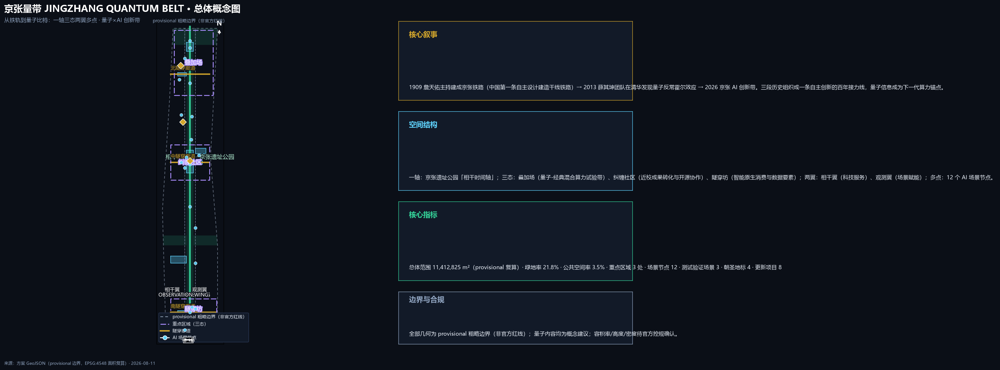
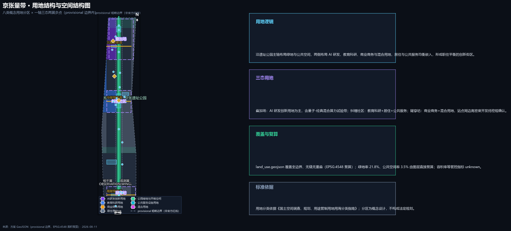
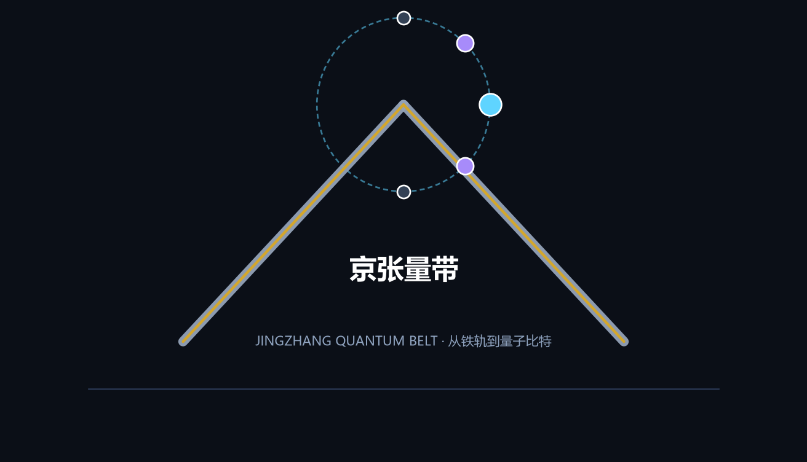
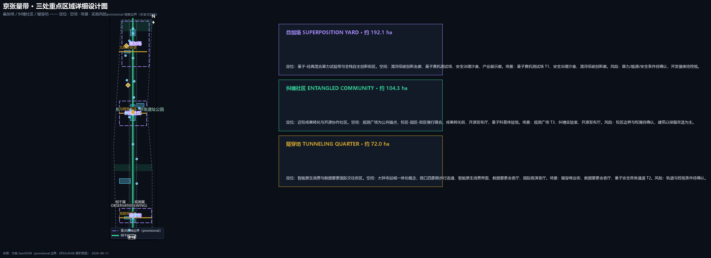
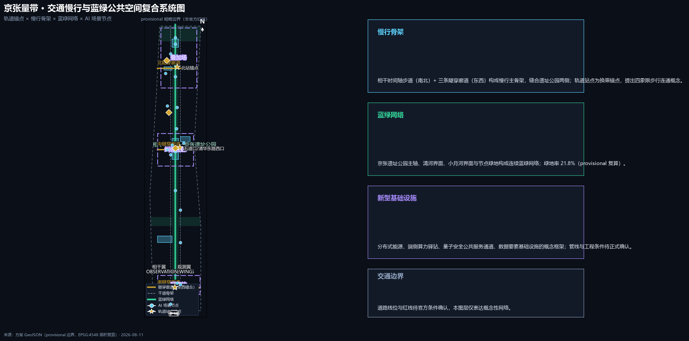
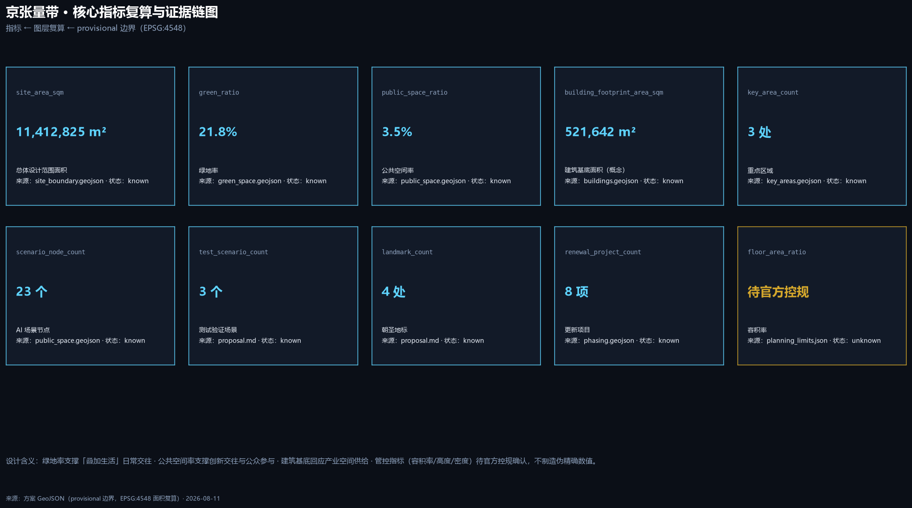

# JINGZHANG QUANTUM BELT: From Steel Rail to Qubit

## Design Basis and Source List

This proposal is primarily based on the Announcement of Prequalification for the International Solicitation of Urban Design for the Centennial Jing-Zhang AI Innovation Belt issued by the Haidian Branch of the Beijing Municipal Commission of Planning and Natural Resources, supported by the machine-readable brief, design-space constraints, enums, metric ranges, and source registry under `brief/site-package/`, and augmented by verified public facts for the "Quantum × AI" theme (public information from the Beijing Academy of Quantum Information Sciences website, among others) [source:OFFICIAL-ANNOUNCEMENT] [source:AGENT-TASKBOOK] [source:BAQIS-2026]. The proposal responds item by item to the three-level scope (coordinated research area 43.6 km², overall design area ~11.4 km², key areas 368.4 ha) and to agent tasks agent.1–agent.6; the coverage mapping is in `compliance_matrix.json`.

Since the official precise boundary and the three key-area polygons have not yet been publicly released, this package uses the provisional rough boundaries from `brief/site-package/geometry/provisional_boundaries.geojson` as required by the rules: `geometry/site_boundary.geojson` and `geometry/key_areas.geojson` are both marked `geometry_role=provisional_constraint` and `official_boundary=false`, for generation, presentation, and self-check discussion only — not as an official redline, approval basis, or precise area basis [data:geometry/site_boundary.geojson#SITE-001] [source:SITE-PACKAGE]. This organizer data gap does not block content scoring; once official polygons are released, the boundary, land use, roads, green space, public space, buildings, phasing, and all area metrics must be recalculated.

Source usability boundaries are as follows [source:SOURCE-REGISTRY]: formal-ready sources support formal claims; background and provisional sources support narrative, generation, and discussion only, and must not be upgraded into statutory controls or implementation commitments. Quantum-theme facts use only publicly disclosed information from the BAQIS website verified during this visit (institute location, director and awards, quantum cloud cluster release, quantum direct communication application, Quafu Cup hardware challenge), with full provenance and access date registered in `sources.json` [source:BAQIS-2026]; unverified enterprise lists, investment figures, policies, and engineering data are not used.

## Three-Level Scope Framework

The proposal is organized along the announced three levels: the coordinated research area (43.6 km²) addresses the "Quantum × AI innovation ecosystem and future city form"; the overall design area (~11.4 km²) translates industrial strategy into an urban renewal framework, spatial structure, transport/municipal support, and urban character; and the key areas (368.4 ha) deliver detailed design at the depth of a planning implementation plan for the three districts: Superposition Yard, Entangled Community, and Tunneling Quarter [depth:three_level_scope_framework] [depth:overall_spatial_structure].

The three levels transmit downward: the coordinated research level proposes the "quantum–classical hybrid compute" and "full-stack AI self-reliance" industrial judgment; the overall design level renders it as the "one axis, three states, two wings, multiple nodes" spatial structure with three design layer groups (land use, public space, implementation phasing); and the key-area level validates functional, building, transport, and AI-scenario feasibility at the three districts [data:geometry/key_areas.geojson#PROV-KEY-001] [data:geometry/key_areas.geojson#PROV-KEY-002] [data:geometry/key_areas.geojson#PROV-KEY-003]. All areas and ratios under the provisional boundary are discussion-level recalculations; the text and metrics retain the "recalculate when official data arrives" note.

| Level | Design question | Proposal answer | Data anchor |
| --- | --- | --- | --- |
| Coordinated research area | Quantum × AI ecosystem and future city form | "From Steel Rail to Qubit" centennial relay; quantum–classical hybrid compute belt | compliance_matrix.json, standard_matrix.json |
| Overall design area | Spatial structure, renewal, transport/municipal, character | One axis, three states, two wings, multiple nodes; tunneling corridors; blue-green slow-traffic loop | [data:geometry/land_use.geojson#LU-001], [data:geometry/roads.geojson#ROAD-001] |
| Key areas | Detailed design of three districts | Conceptual detailed design of Superposition Yard, Entangled Community, Tunneling Quarter | [data:geometry/key_areas.geojson#PROV-KEY-001], #PROV-KEY-002, #PROV-KEY-003 |

## Coordinated Research Area: Industry and Future City Research

Core judgment: the Haidian AI Innovation Belt should not merely stack classical compute; it should position **quantum information as the strategic anchor of next-generation compute**, forming a "quantum–classical hybrid" two-layer innovation system together with classical AI compute, responding to the "full-stack AI self-reliance system" and "global voice in AI governance" functions [source:AGENT-TASKBOOK] [standard:PROJECT-AGENT-OPEN-CALL-TASKBOOK].

**Naming and visual identity (agent.1).** Primary name: "JINGZHANG QUANTUM BELT" (京张量带). The Chinese character "量" carries a double meaning — surveying (Jeme Tien Yow's surveying spirit for the railway) and quantum; the English name retains the JINGZHANG brand with QUANTUM BELT expressing the quantum innovation belt. The naming system follows the "three areas and two wings": Zhongzhiyuan becomes **Superposition Yard 叠加场** (full-stack self-reliance and quantum compute experiments superimposed in one space); Beijing AI Origin Community becomes **Entangled Community 纠缠社区** (universities, enterprises, and talents physically separated yet logically entangled); Dazhongsi becomes **Tunneling Quarter 隧穿坊** (AI-native new businesses tunneling through the traditional commercial barrier); the Zhongguancun technology service wing is the **Coherence Wing 相干翼** (coherent allocation of factors), and the Xiaoyuehe scenario-empowerment wing is the **Observation Wing 观测翼** (scenario as measurement, public as observer).

The logo concept (below) uses Jeme Tien Yow's herringbone alignment as its skeleton (gold steel-rail strokes) overlaid with a qubit superposition-dot orbit (quantum blue-violet/cyan), forming the "from steel rail to qubit" visual symbol; sans-serif geometric typography with the standard steel gray, quantum blue-violet, and Zhongguancun gold palette. The wayfinding system uses a "dot-connection" qubit language, with station and node markers as superposition-state symbols [depth:brand_identity_system].

**Quantum × AI industrial ecosystem (agent.2).** Three-layer judgment: the foundation layer comprises universities and new R&D institutes (public resources such as Tsinghua quantum research and BAQIS); the platform layer comprises quantum cloud compute, open-source communities, and public testbeds; the application layer focuses on AI×quantum fusion scenarios (quantum secure communication, quantum random numbers, quantum algorithms combined with AI). Mechanism distillation from 8 global innovation ecosystem cases [source:BAQIS-2026] [source:AGENT-TASKBOOK]:

| Case | Transferable mechanism | Haidian landing |
| --- | --- | --- |
| Beijing Academy of Quantum Information Sciences (local anchor) | New-R&D-institute integration of basic research, engineering, and industrialization | Superposition Yard research and test functions |
| Hefei quantum information cluster (public reports on Origin Quantum, QuantumCTek, etc.) | Leading enterprises drive cluster agglomeration with dedicated policy | Superposition Yard incubation mechanisms |
| IBM Quantum Network | Open quantum cloud platform and developer ecosystem | Quantum cloud open testbed operations |
| Kendall Square, Boston | Walkable university–industry conversion community | Entangled Community near-campus conversion model |
| Station F, Paris | Large incubator plus global event operations | Tunneling Quarter startup and roadshow mechanisms |
| one-north, Singapore | Integrated research–industry–residence district | Work–life balance across the three states |
| Shenzhen Hetao cooperation zone | Cross-border innovation and institutional piloting | International exchange and rule experimentation |
| Zhangjiang AI Island, Shanghai | AI scenario agglomeration and park operations | Observation Wing public experience operations |

All case summaries are model-level public-report distillations offered as "reference mechanisms for professional teams to deepen"; they do not constitute enterprise attraction or investment commitments [source:AGENT-TASKBOOK].

**Quantum secure industry empowerment (agent.2/agent.3 industry integration).** The proposal positions quantum key services as a "city-level security infrastructure" with three empowerment layers. First, **quantum key service provision (QaaS)** — quantum key distribution / quantum direct communication delivered as on-demand encrypted channels to finance, government, energy, and transport sectors, so industries can connect without building their own equipment, aligned with the verified fact of quantum direct communication applied in a commercial bank [source:BAQIS-2026]. Second, **industry pilot channels** — four conceptual pilots: finance (interbank clearing, payment, and long-term data confidentiality), government and public data (social security and medical data sharing), energy (grid dispatch), and transport (rail signaling and vehicle-infrastructure cooperation). Third, **industry ecosystem layer** — a quantum key testing and certification center and industry alliance mechanism in the Superposition Yard, converting test/validation scenarios into standard output and industry services [depth:ai_scenario_operation].

**Quantum-secure city lifeline (agent.2/agent.3/agent.4 deepening).** The proposal upgrades quantum security from a "channel service" to a **city lifeline** positioning: once city lifelines (power, water, gas, communications, transport) are fully digitalized, security becomes the underlying lifeline supporting all lifelines — the "quantum-secure city lifeline" uses a QKD network as its skeleton, a quantum security laboratory as its heart, and a key service system as its blood, building a city-level quantum security infrastructure backbone along the Jing-Zhang corridor (conceptual) [source:BAQIS-2026].

**Along-line QKD network: backbone-relay-access three-layer topology (conceptual).** The Jing-Zhang railway corridor is a natural linear carrier isomorphic to the "node-link" topology of QKD networks; the proposal builds a three-layer network skeleton along the heritage-park main axis [data:geometry/public_space.geojson#SCN-15] [data:geometry/public_space.geojson#SCN-16] [data:geometry/public_space.geojson#SCN-17]: **backbone layer** — three hub nodes (north toward Qinghuayuan Station heritage site, central toward Wudaokou, south at Dazhongsi Station) carrying key exchange and routing; **relay layer** — four relay nodes (Qinghe bridge, Zhichun road, Jimen bridge, Xizhimen direction) to address quantum signal distance limits and extend network coverage [data:geometry/public_space.geojson#SCN-19] [data:geometry/public_space.geojson#SCN-22]; **access layer** — access points for parks, universities, government, and finance along the line connecting to the backbone via quantum-secure channels (industry access, government pilot, and public experience functions). The three hubs plus four relays form a "test network" skeleton; after validating coverage, relay, and operation mechanisms, it can serve as a basis for a professional team to deepen into a city-level quantum security network. Node spacing, relay methods (trusted relay / quantum relay), and engineering conditions await professional confirmation.

**Quantum security laboratory cluster (industry infrastructure).** A laboratory cluster in the Superposition Yard [data:geometry/public_space.geojson#SCN-18]: testing and certification laboratory (QKD equipment testing, key management compliance certification), security exercise laboratory (quantum security penetration testing, post-quantum cryptography migration testing), and a standardization workshop (quantum security standards and evaluation specification output), converting test/validation scenarios into industry standards and certification services [depth:ai_scenario_operation].

**Industry and employment ecosystem.** Quantum security industry chain (conceptual): equipment and components (QKD devices, single-photon detection) → system integration → key services (QaaS) → security operations (quantum security SOC) → testing and certification → education and training. Six job-family directions along this chain: quantum network engineer, key management engineer, quantum security SOC analyst, testing/certification engineer, quantum science education specialist, and industry service staff; a quantum security industry and employment service center in the Entangled Community/Observation Wing links university and quantum institute resources for training and job matching (conceptual) [data:geometry/public_space.geojson#SCN-23].

Culturally, this trunk continues the centennial communications-infrastructure line — "1909 railway telegraph lines carried information → 2026 quantum key lines protect information" — and elevates it to "**from steel lifeline to quantum-secure lifeline**": the Jing-Zhang Railway was the industrial-era city lifeline (goods and people); the quantum security network is the digital-era city lifeline (data and trust) [standard:PROJECT-AGENT-OPEN-CALL-TASKBOOK]. All of the above are conceptual suggestions and pilot directions, not confirmed industry arrangements or technology commitments.

**Future city form.** The proposal introduces "superposed living": using the quantum superposition metaphor for mixed-use spaces where work, learning, socializing, and public life are superposed in time, reducing single-purpose vacancy; and the "measurement collapse" metaphor for public participation — urban governance states are revealed through public "observation" (participation, feedback, oversight), echoing human-centered governance [standard:PROJECT-AGENT-OPEN-CALL-TASKBOOK].

## Overall Design Area: Urban Renewal and Regulatory-Plan-Level Urban Design

The overall design area forms a "**one axis, three states, two wings, multiple nodes**" structure: the axis is the "Coherence Timeline" of the Jing-Zhang Heritage Park (north–south main axis connecting cultural and innovation nodes from the Qinghuayuan Station direction to Dazhongsi); the three states are the Superposition Yard, Entangled Community, and Tunneling Quarter; the two wings are the Coherence Wing and Observation Wing; the multiple nodes are a network of 12 AI scenario nodes [depth:overall_spatial_structure] [depth:land_use_layout]. Three east–west "tunneling corridors" (north, central, south) stitch the urban areas on both sides of the heritage park, using the quantum tunneling metaphor of "connection through a barrier" [data:geometry/land_use.geojson#LU-001] [data:geometry/roads.geojson#ROAD-001].

Land use is organized around industrial function and public space synergy: green and public space along the heritage-park axis; AI R&D, education/research, commercial, and mixed-use land on both sides; residential and public service land embedded in balance to form a work–life-balanced innovation district [data:geometry/land_use.geojson#LU-002] [metric:green_ratio]. Building scale and intensity: because official regulatory controls are absent, FAR, height, and density are all recorded as `unknown`; this package provides only concept-level building footprints (`geometry/buildings.geojson`, marked `design_proposal` with low confidence) and explicitly states they are not statutory control values [data:geometry/buildings.geojson#BLDG-001] [depth:development_intensity_controls].

The renewal framework follows "retain–renovate–new-build" grading with a "light first" start: transit-station surroundings and low-efficiency industrial space are renewal priorities; cultural protection and university surroundings are mainly retained and renovated; conceptual new construction concentrates on the Dazhongsi station-city integration and the Superposition Yard test belt; specific retain/renovate/demolish conclusions await ownership and engineering conditions — this proposal only provides the method framework and a to-be-calibrated list [depth:retain_renovate_demolish]. Spatial evidence at overall-design depth is carried jointly by the six layer groups: land use, buildings, roads, green space, public space, and phasing [depth:height_massing_character] [standard:MOHURD-URBAN-DESIGN-MEASURES].

## Detailed Design of Key Areas

### Superposition Yard 叠加场 (Zhongzhiyuan AI Acceleration Area, ~192.1 ha)

Positioning: **quantum–classical hybrid compute test belt and full-stack self-reliance innovation district**. Spatial moves: a low-carbon innovation corridor and public living room along the Qinghe interface; a quantum–classical hybrid compute test belt in the middle (quantum hardware testbed, safety governance sandbox, industry exhibition gallery); R&D and standards-governance functions to the west and north [data:geometry/key_areas.geojson#PROV-KEY-001]. Buildings: retain-and-renovate first, conceptual new-build second; intensity awaits regulatory confirmation. AI scenarios: Quantum Hardware Testbed (T1), Safety Governance Sandbox, Qinghe Low-Carbon Innovation Corridor [depth:three_key_area_detailed_design].

### Entangled Community 纠缠社区 (Beijing AI Origin Community, ~104.3 ha)

Positioning: **near-campus conversion and open-source collaboration community**. Spatial moves: Observation Plaza as the public anchor; slow-traffic stitching among campus, park, and neighborhood; a conversion street along the near-campus interface (incubation, legal, IP, investment); an Open Source Hall and Quantum Science Museum [data:geometry/key_areas.geojson#PROV-KEY-002]. Buildings: mainly retained, renovated, and functionally repurposed. AI scenarios: Observation Plaza (public participation), Entangled Lab, Open Source Hall, Quantum Science Museum [depth:three_key_area_detailed_design].

### Tunneling Quarter 隧穿坊 (Dazhongsi AI Industry Cluster, ~72.0 ha)

Positioning: **AI-native consumption and data-factor international exchange district**. Spatial moves: conceptual station-city integration around Dazhongsi Station; four-quadrant pedestrian connectivity at the junction; AI-native consumption and content experience along the main commercial frontage; a Data Factor Lounge and International Roadshow Lounge [data:geometry/key_areas.geojson#PROV-KEY-003]. Buildings: renewal and conceptual new-build; high-intensity station surroundings await rail and regulatory conditions. AI scenarios: Tunneling Commercial Street, Data Factor Lounge, International Roadshow Lounge [depth:three_key_area_detailed_design].

## AI Innovation Ecosystem, Personas, and AI+ Scenarios

**User personas (7 types)** [source:AGENT-TASKBOOK]:

| Persona | Typical needs | Spatial response | Self-check boundary |
| --- | --- | --- | --- |
| Quantum researcher | Hardware testing, academic exchange, conversion | Superposition Yard testbed, Quantum Science Museum | Research data requires authorization; no personal trajectory collection |
| Open-source developer | Release, collaboration, testing, reputation | Open Source Hall, public code wall | Event data aggregated only |
| Startup team | Low-cost office, compute access, test site | Shared test field, edge-compute station | Compute/data services require separate authorization |
| Enterprise visitor | Showcase, business, international reception | International Roadshow Lounge, rail connection | Enterprise marks and cases require clearance |
| University faculty/student | Conversion, cross-campus collaboration, daily walking | Conversion Street, slow-traffic stitching | Campus data and research results require authorization |
| Local resident | Commuting, leisure, community service, low-disturbance renewal | Coherence Trail, Observation Plaza, embedded community services | No resident profiling for commercial recommendation |
| International talent | International exchange, culture, long-term stay | Tunneling Quarter international frontage, Observation Wing experience, work–life balance | Data minimization and compliance |
| Quantum security engineer | Hardware operation, key management, security audit, career development | Superposition Yard lab cluster, relay nodes, employment service center | Tiered authorization for operations data; no personal behavior collection |

**AI scenario cards (12, including 3 industry test/validation scenarios)** [source:AGENT-TASKBOOK] [data:geometry/public_space.geojson#PUBLIC-001]:

| No. | Scenario card | Type | Spatial carrier | Target users | Suggested operator | Human-review boundary |
| --- | --- | --- | --- | --- | --- | --- |
| 01 | Quantum Hardware Testbed | **Test/validation T1** | Superposition Yard | Research institutes, quantum companies, university teams | Quantum institute/industry platform joint operation | Test qualification review; traceable, reviewable results |
| 02 | Quantum Secure Public Channel | **Test/validation T2** | Observation Wing/government node | Government agencies, public service bodies | Authority-piloted delegation | Pilot scope and data grading require authority confirmation |
| 03 | QRNG Public Benchmark Station | **Test/validation T3** | Observation Plaza | Public, notarization bodies, social organizations | Public utility operator | Open audit process; no personal data |
| 04 | Superposition Platform | Public space | North end of Coherence Timeline | All citizens and visitors | Park management body | Heritage constraints first |
| 05 | Entangled Lab | Industry collaboration | Entangled Community | University-enterprise joint teams | University-enterprise co-building | Research confidentiality |
| 06 | Tunneling Commercial Street | AI-native consumption | Tunneling Quarter | Consumers, startup teams | Commercial operator | Privacy and minor protection |
| 07 | Observation Plaza | Participatory governance | Entangled Community | Citizens, community organizations | Sub-district/community operation | Transparent voting rules; anti-rigging |
| 08 | Quantum Science Museum | Science education | Entangled Community | Youth, citizens, study groups | Science venue operator | Scientific content review |
| 09 | Coherence Timeline Trail | Cultural experience | Jing-Zhang Heritage Park | Citizens, visitors, developers | Park management body | Historical fact review |
| 10 | Open Source Hall | Developer community | Entangled Community | Developers, open-source community | Community foundation/platform | Copyright and license review |
| 11 | AI Wayfinding | AI+transport | Whole slow-traffic network | Pedestrians, cyclists, accessibility users | Transport authority | No personal trajectory collection |
| 12 | Data Factor Lounge | Data factor | Tunneling Quarter | Data-service enterprises, compliance bodies | Professional operator | Compliance review and audit |
| 13 | Quantum Secure Finance Channel | Industry scenario | Superposition Yard / finance node | Financial institutions, clearing houses | Fintech + quantum platform joint operation | Key-management audit; pilot scope requires regulatory confirmation |
| 14 | Quantum Key Testing & Certification Center | Industry scenario | Superposition Yard | Quantum equipment vendors, industry users, testing bodies | Industry alliance / certification body | Public testing standards; third-party result review |
| 15 | QKD North Node (toward Qinghuayuan Station heritage site) | Industry access | North end of Coherence Timeline | Parks, universities, research bodies along the line | Network operator + park joint operation | Key management and access audit |
| 16 | QKD Central Node (toward Wudaokou) | Industry access | Mid main axis | Along-line enterprises, government pilots | Network operator + authority | Pilot scope and data grading confirmation |
| 17 | QKD South Node (Dazhongsi Station) | Public experience | Around Dazhongsi Station | Public, visitors | Network operator + venue operator | Scientific content review |
| 18 | Quantum Security Laboratory | Industry infrastructure | Superposition Yard | Quantum equipment vendors, industry users, testing bodies | Laboratory cluster operator | Public testing standards; third-party result review |
| 19 | QKD Relay Node · Qinghe Bridge | Network relay | North section | Network operator, along-line parks | Network operator | Relay security audit |
| 20 | QKD Relay Node · Zhichun Road | Network relay | North-central section | Network operator, access enterprises | Network operator | Relay security audit |
| 21 | QKD Relay Node · Jimen Bridge | Network relay | Central-south section | Network operator, access enterprises | Network operator | Relay security audit |
| 22 | QKD Relay Node · Xizhimen Direction | Network relay | South section | Network operator, government pilots | Network operator + authority | Pilot scope and data grading confirmation |
| 23 | Quantum Security Industry & Employment Service Center | Industry service | Observation Wing / Entangled Community | Enterprises, job seekers, universities | Industry service operator | Job and training information compliance |

Scenario–space–operation mapping, data sources, privacy boundaries, and visualization layers are fully registered in `compliance_matrix.json`; the in-text table is a readable summary [standard:PROJECT-AGENT-OPEN-CALL-TASKBOOK] [depth:ai_scenario_operation].

## Land Use, Building Scale, and Retain-Renovate-Demolish Strategy

The land-use plan covers the full overall-design boundary with seamless, non-overlapping zoning in eight categories: AI R&D innovation land, education/research land, commercial/business land, residential land, park green and open space, public service facility land, mixed-use land, and road/transport facility land [data:geometry/land_use.geojson#LU-001] [standard:MNR-LAND-USE-CLASSIFICATION-GUIDE]. Green and public space are continuously arranged along the heritage-park axis and the two wing frontages, supporting daily interaction for "superposed living" [metric:green_ratio] [metric:public_space_ratio].

The building-footprint layer expresses conceptual retain/renovate/new-build/to-be-confirmed grading (`retain`/`renovate`/`new_build`/`to_be_confirmed`); area and share are recalculated from `geometry/buildings.geojson` [data:geometry/buildings.geojson#BLDG-001] [metric:building_footprint_area_sqm]. FAR, building height, density, setbacks, and road redlines are uniformly `status=unknown` pending official regulatory controls, with pending conditions and recalculation paths explained in `metrics.json` and `assumptions.json` [depth:development_intensity_controls] [depth:retain_renovate_demolish]; this package supplies no pseudo-precise statutory values.

## Transport, Rail, Municipal Infrastructure, and Public Services

The transport concept is organized around "rail anchors + slow traffic first": transit anchors at Wudaokou, Qinghua East Road West, and Dazhongsi Station with conceptual station integration and four-quadrant pedestrian connectivity; the Coherence Timeline trail and three tunneling corridors form the slow-traffic skeleton stitching both sides of the heritage park [data:geometry/roads.geojson#ROAD-001] [depth:traffic_rail_slow_parking]. Road alignments, redlines, and parking facilities await official conditions; the layer expresses only a conceptual network.

Municipal and new infrastructure: conceptual frameworks for distributed energy, edge-compute stations, the quantum secure public channel, and data-factor infrastructure [data:geometry/constraints.geojson#CONSTRAINTS] [depth:municipal_new_infrastructure]; missing pipelines, energy, fire, and engineering conditions are listed as prerequisites for formal deepening. Public services are distributed along the Observation Wing and community nodes, covering innovation services, talent life services, and daily public services [standard:MOHURD-URBAN-DESIGN-MEASURES].

## Blue-Green Network, Public Space, and Urban Character

The blue-green network uses the "Coherence Timeline" of the Jing-Zhang Heritage Park as its skeleton, coordinating the Qinghe frontage, Xiaoyuehe frontage, and node green spaces into a continuous north–south, east–west-stitched trail and cycling network [data:geometry/green_space.geojson#GREEN-001] [depth:blue_green_public_space]. The public space system comprises Observation Plaza, Superposition Platform, tunneling-corridor nodes, and station plazas, hosting AI scenarios, cultural narrative, and public participation [data:geometry/public_space.geojson#PUBLIC-001] [metric:public_space_ratio].

**AI pilgrimage landmarks and honor display system (agent.4, 4 sites)** [source:AGENT-TASKBOOK]:

| Landmark | Location | Design concept | Status boundary |
| --- | --- | --- | --- |
| Qubit Monument (Superposition Platform) | North end of Coherence Timeline (conceptual site near Qinghuayuan Station) | Qubit superposition-dot installation commemorating the "rail-to-qubit" self-reliance relay | Conceptual; heritage and approval prerequisites |
| Observation Plaza | Entangled Community | Governance metaphor of "participation as measurement", with QRNG benchmark station | Conceptual; event approval prerequisite |
| Coherence Timeline cultural nodes | Along Jing-Zhang Heritage Park | Cultural installations and wayfinding nodes for the 1909/2013/2026 three-line narrative | Conceptual; historical fact review |
| Agent Contribution Honor Wall | Beside Open Source Hall | Honor display system recording agent and developer contributions, echoing the event's memorial mechanism | Display content requires clearance and review |

Urban character: a "steel gray + quantum blue-violet + Zhongguancun gold" palette and "dot-connection" wayfinding language as conceptual character guidance; conclusions involving heritage protection, height, and character control are treated as pending conditions without pseudo-precise control lines [standard:MOHURD-URBAN-DESIGN-MEASURES] [depth:height_massing_character].

## Renewal Projects, Implementation Policy, and Phasing

Renewal project list (8 items, conceptual) [data:geometry/phasing.geojson#PHASE-001] [depth:renewal_project_list]:

| No. | Project | Type | Main dependencies | Phase |
| --- | --- | --- | --- | --- |
| JZ-01 | Coherence Timeline trail stitching | Public space/culture | Road redlines, underpass space, heritage review | Near term |
| JZ-02 | Superposition Yard quantum compute test belt | Industry/new infrastructure | Compute, energy, safety, operator | Near-term pilot |
| JZ-03 | Observation Plaza | Public space/governance | Land ownership, event approval | Near term |
| JZ-04 | Tunneling corridors (north/central/south) | Transport/public space | Road redlines, municipal pipelines | Mid term |
| JZ-05 | Entangled Community conversion street | Renewal/industry service | Campus boundary, ownership, ground-floor uses | Mid term |
| JZ-06 | Tunneling Quarter station-city integration | Transit-oriented renewal | Rail station, regulatory conditions | Mid term |
| JZ-07 | Quantum Science Museum | Culture/public service | Venue conditions, science content review | Mid term |
| JZ-08 | Global AI event week route | Operation/brand | Public space permits, event safety, copyright clearance | Near-term start |

Implementation policy suggestions cover renewal coordination, industrial space supply, scenario-open operation, data governance, and public participation; all policy, funding, and event arrangements are conceptual suggestions, not government commitments [depth:phasing_implementation]. Phasing logic: near term (2026–2028) starts with light facilities, operational activities, and public test scenarios; mid term (2029–2032) advances corridor stitching and core-area renewal; long term (2033+) completes industrial upgrading and governance framework consolidation.

**Global Quantum-AI event system and long-term operations (agent.6):** an annual system of "one forum, two competitions, one week, one festival" — the Quantum-AI Biennial Forum (aligned with the ZGC Forum mechanism), the Quafu Cup quantum computing hardware challenge (co-hosting suggestion), the Jing-Zhang Open Source Marathon, the International Quantum-AI Developer Week, and the Superposition Festival public open day; developer community operations rely on the Open Source Hall, the contribution honor wall, and scenario-open operation; the conversion path is "testbed → scenario validation → enterprise services → policy matchmaking". All activities are conceptual suggestions [source:AGENT-TASKBOOK] [source:BAQIS-2026].

## Metrics, Area Recalculation, and Compliance Matrix

Metrics are grouped in three categories: spatially recalculable metrics (site_area_sqm, key_area_count, green_ratio, public_space_ratio, building_footprint_area_sqm, scenario_node_count, test_scenario_count, landmark_count, renewal_project_count); control metrics awaiting official regulatory support (FAR, height, density, setbacks — `status=unknown`); and operational performance metrics (event participation, scenario usage frequency — to be calibrated in operation) [depth:metrics_recalculation] [metric:site_area_sqm].

Core metrics recalculated from this package's geometry (provisional boundary): overall design area 11,412,825 m²; 3 key areas; green ratio and public-space ratio recalculated from `geometry/green_space.geojson` and `geometry/public_space.geojson`; building footprint area from `geometry/buildings.geojson`; 12 scenario nodes; 3 test/validation scenarios; 4 pilgrimage landmarks; 8 renewal projects [metric:green_ratio] [metric:public_space_ratio] [metric:building_footprint_area_sqm]. All `unknown` metrics state the reason and the recalculation path once official data arrives; the text manufactures no pseudo-precise values.

`compliance_matrix.json` covers all mandatory tasks of announcement sections 1.3, 1.4, 1.5 and agent.1–agent.6, mapping each to report sections, layers, metrics, drawings, HTML pages, sources, assumptions, and self-check items [standard:PROJECT-OFFICIAL-ANNOUNCEMENT] [standard:PROJECT-AGENT-OPEN-CALL-TASKBOOK].

## Risk, Copyright, and Compliance

**Bilingual contract:** this proposal uses Chinese as the primary language with `proposal.en.md` as the complete equivalent translation; A3/A0 drawings, HTML, and text-bearing figures provide English counterparts, following the event terminology glossary. Missing required translations, incorrect language mappings, or invalid files will block finalization and CI.

**Risk list:** quantum technology maturity risk (quantum computing and communication are early-stage; everything is expressed as conceptual suggestions and test/validation scenarios); data-gap risk (official boundary, regulatory controls, ownership, municipal, and heritage conditions pending, registered in `assumptions.json` and the missing-data checklist); compliance risk (no fabricated enterprise lists, investment figures, or policy commitments); operational risk (activities and operations are conceptual suggestions requiring professional deepening) [depth:risk_missing_data] [data:geometry/constraints.geojson#CONSTRAINTS].

**Copyright and compliance:** this proposal uses only public or verified materials; quantum facts come from public BAQIS website pages (accessed 2026-08-11, registered in `sources.json`); no non-public planning materials, unauthorized images, fonts, trademarks, or portraits are used; the author is responsible for facts, citations, and expression of all AI-generated content [source:BAQIS-2026]. HTML pages are offline-capable with no remote resources or tracking. This proposal does not claim official approval, approved regulatory plans, final land ownership, construction scale, or guaranteed implementation.

## References

- Prequalification Announcement for the International Solicitation of Urban Design for the Centennial Jing-Zhang AI Innovation Belt (Haidian Branch, Beijing Municipal Commission of Planning and Natural Resources; see `data/source_registry.json`)
- Agent open-call taskbook excerpt for the Centennial Jing-Zhang AI Innovation Belt (`brief/site-package/agent_taskbook.json`)
- Public brief draft for the Centennial Jing-Zhang AI Innovation Belt (`brief/public-brief.md`)
- Public information from the Beijing Academy of Quantum Information Sciences website (baqis.ac.cn, accessed 2026-08-11)
- `brief/site-package/design_brief.json`, `allowed_design_space.json`, `ranges/planning_limits.json`
- `data/processed/agent_fact_pack.md` and companion processed workbooks
- Full machine index: `sources.json`, `metrics.json`, `compliance_matrix.json`, `standard_matrix.json`, `design_depth_matrix.json`
