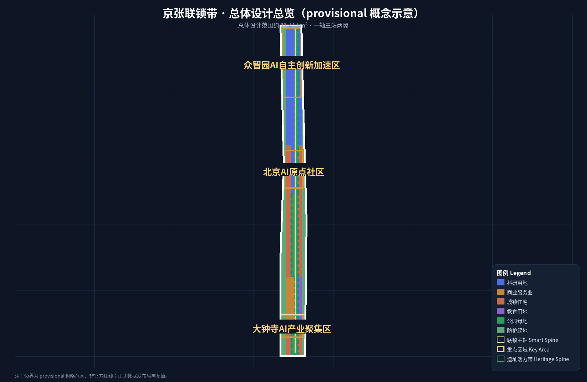
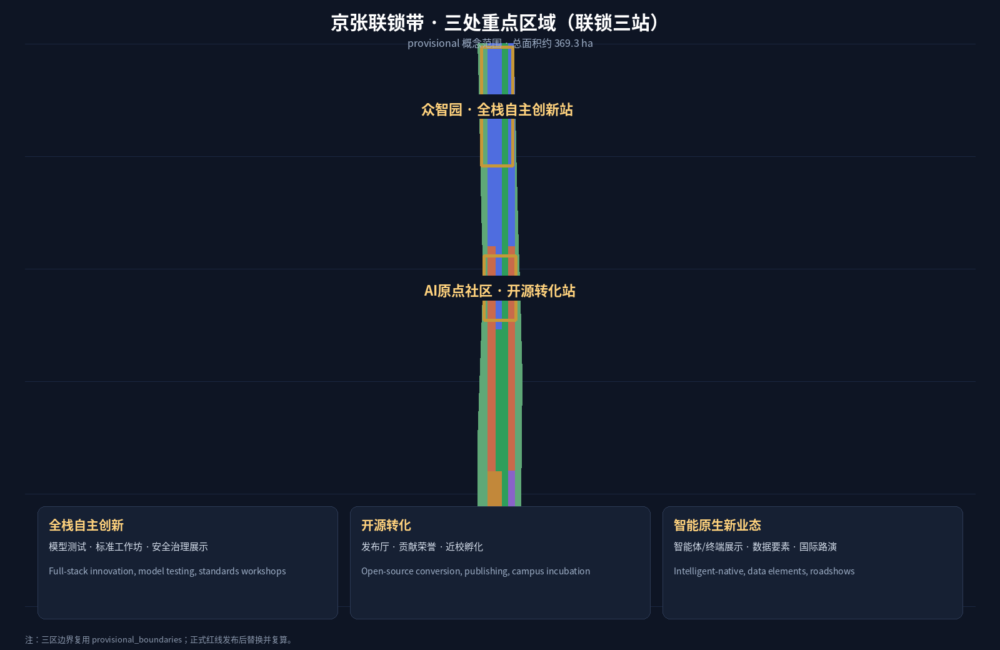
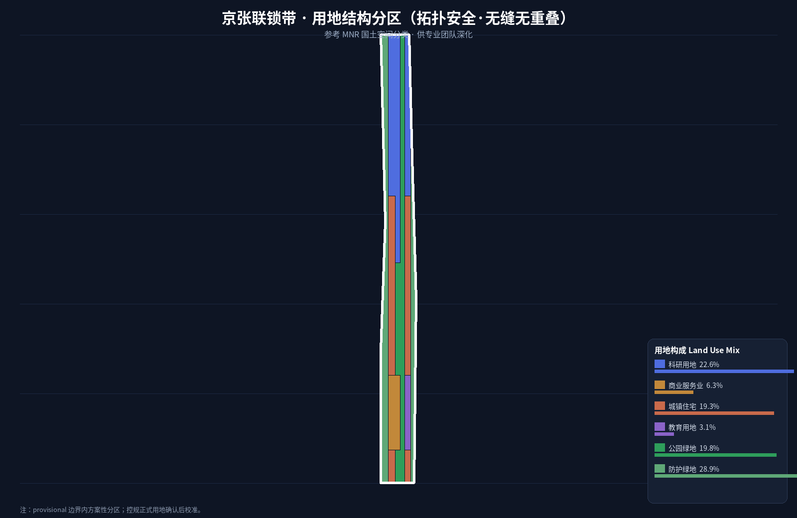
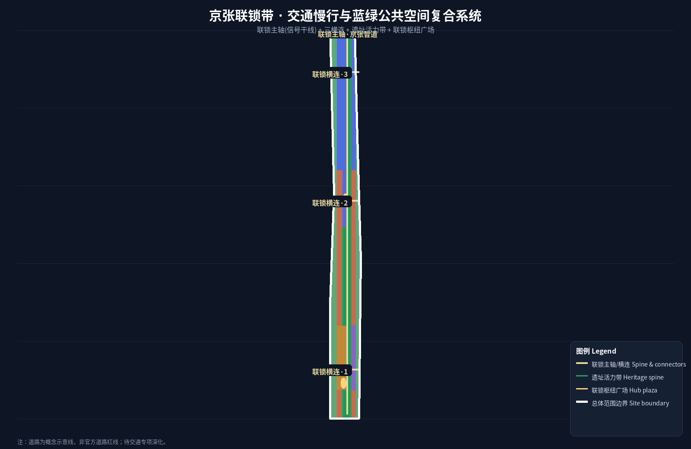
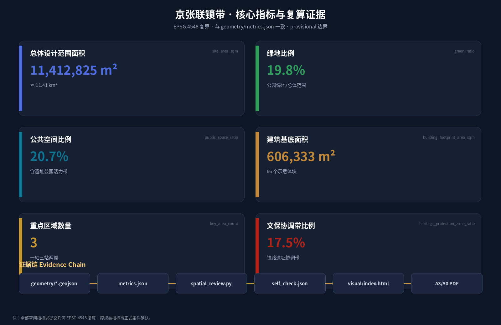

# 京张联锁带 · THE INTERLOCKING BELT：让百年京张铁路的联锁安全机制成为AI城市开放治理协议

## 设计依据与资料清单

本方案依据北京市规划和自然资源委员会海淀分局《百年京张AI创新带城市设计国际方案征集资格预审公告》组织，并以 `brief/site-package/` 中登记的临时粗略边界、重点区域、枚举、指标和来源清单为机器可读依据 [source:OFFICIAL-ANNOUNCEMENT] [source:AGENT-TASKBOOK]。所有设计判断拆分为可追溯来源、可复算指标、可校验图层和可人工复核假设；公告要求的控规深度、规划综合实施方案深度成果，由 GeoJSON、指标表、A3 文册、A0 展板和 HTML 电子展示共同承载，正文不替代图纸。

资料使用边界以 `data/source_registry.json` 为准 [source:SOURCE-REGISTRY]：formal 可用资料 7 条、背景资料 1 条、provisional-only 资料 1 条；agent 不得把 background_only 或 provisional_only 资料升级为 official boundary、法定控规、正式评分依据或政府实施承诺。`data/processed/agent_fact_pack.md` 是阅读导航层，不是新权威来源 [source:PROCESSED-FACT-PACK]。

组织方尚未发布 official `SITE_BOUNDARY` 与三处 `KEY_AREA` 多边形，本包暂用 `provisional_boundaries.geojson` 生成临时边界 [source:BOUNDARY-SOURCE] [source:KEY-AREA-SOURCE]。提交包中 `geometry/site_boundary.geojson` 与 `geometry/key_areas.geojson` 均标注为 `provisional_constraint`、`official_boundary=false`，只用于方案生成、自检、可视化与设计讨论，不能作为 official redline、审批依据、精确面积依据或法定控制结论；official polygons 发布后，边界、用地、建筑、道路、绿地、公共空间、分期与指标均需重算。临时边界仅用于方案生成、展示与概念审查；official polygon 发布后，本包将整包复算。资格、评分与接受条件由维护者/评审按正式规则判断。

本方案总体概念为**「京张联锁带 · THE INTERLOCKING BELT」**：以铁路延续百年的**联锁（Interlocking）**安全哲学——道岔与信号互锁、冲突组合即阻断、闭塞区间保持安全间隔、调度中心统一指挥——为原型（1909 年京张铁路通车运营，即以人工扳道、信号显示与调度协同贯彻"未确认、不放行"的安全纪律；本方案延续这一安全哲学，并非声称当年已装备电气联锁设备），转译为 AI 城市的**开放治理协议**：数据接入有道岔、场景状态有信号、冲突检测有联锁表、公共数据与个人数据有闭塞间隔、一切异常由人类调度复核。这一概念同时回应三大定位（百年京张文化带、都市AI生活体验带、AI融合创新带）与五大功能（AI全栈自主创新体系、世界级AI创新生态、AI+场景赋能新范式、智能化AI活力城市、AI治理全球话语权），使"安全"从铁路工程遗产变成 AI 城市治理的公共产品；协议规范以机器可读 JSON 开放采用（`visual/assets/interlocking-protocol.json`，CC-BY-4.0，方案整体仍为 COMMUNITY-DISPLAY-ONLY）[source:AGENT-TASKBOOK] [standard:PROJECT-OFFICIAL-ANNOUNCEMENT] [standard:PROJECT-AGENT-OPEN-CALL-TASKBOOK]。

## 三层范围工作框架

方案按公告三层范围组织：统筹研究范围（43.6 km²）回答 AI 产业生态、战略定位、创新链与未来城市形态；总体设计范围（11.4 km²）落实城市更新总体框架、产业空间布局、交通市政支撑与城市风貌控制；重点区域范围（368.4 ha）深化三处详细设计地区的功能业态、建筑规模、拆改留分类、公共空间连通与交通组织。三层范围在 `compliance_matrix.json` 逐条映射公告 1.3/1.4/1.5 与 agent.1–agent.6 [depth:three_level_scope_framework] [depth:overall_spatial_structure]。

**空间结构：一轴、三站、两翼、多点。** "一轴"即京张遗址公园活力带，是全带正线：历史、慢行、蓝绿与 AI 体验沿轴展开，对应铁路正线与信号干线；"三站"即三处重点区域——众智园（北段·全栈自主创新站）、AI原点社区（中段·开源转化站）、大钟寺（南段·智能原生新业态站），对应铁路联锁站：每个站都有道岔（接入控制）、信号（状态可见）、联锁表（冲突规则）与调度台（人工复核）；"两翼"即中关村科技服务翼（西翼·要素全球化配置与资本/IP赋能）与小月河场景赋能翼（东翼·AI 场景赋能与活力城市），对应铁路支线与编组场；"多点"即分布在轴、站、翼上的 AI 场景节点、服务驿站与朝圣地标 [data:geometry/site_boundary.geojson#SITE-001] [data:geometry/key_areas.geojson#PROV-KEY-001] [depth:overall_spatial_structure]。

| 层级 | 设计问题 | 方案回答 | 数据落点 |
| --- | --- | --- | --- |
| 统筹研究范围 | AI 产业生态与未来城市形态 | "高校策源—开源协作—企业转化—公共体验—国际传播"创新链 + 联锁治理协议 | compliance_matrix.json、standard_matrix.json |
| 总体设计范围 | 城市更新、产业空间、交通市政、风貌 | 一轴三站两翼结构 + 用地/建筑/道路/绿地/公共空间/分期图层 | [data:geometry/land_use.geojson#LU-001]、[data:geometry/roads.geojson#RD-001] |
| 重点区域范围 | 三处片区详细设计 | 每站给出定位、空间动作、AI 场景、联锁治理界面与实施依赖 | [data:geometry/key_areas.geojson#PROV-KEY-001]、[data:geometry/key_areas.geojson#PROV-KEY-002]、[data:geometry/key_areas.geojson#PROV-KEY-003] |

## 统筹研究范围产业与未来城市研究

统筹研究范围的核心是构建世界级 AI 创新生态体系。方案以联锁协议组织创新链上的要素接入：**道岔＝数据与场景接入控制**（谁可接入、接向何处、授权状态可见）、**闭塞＝要素安全间隔**（公共数据、个人数据、企业内部数据分区隔离）、**联锁表＝冲突规则库**（场景与数据、空间与权属、活动与安全之间的冲突组合预先登记、冲突即阻断）、**调度＝人类最终判断**（阻断、告警、授权变更进入人工复核）。这套协议把"安全第一、冲突即阻断"的铁路工程伦理转译为 AI 城市治理的开放标准，为 AI 治理全球话语权提供可操作的空间与规则载体 [standard:PROJECT-AGENT-OPEN-CALL-TASKBOOK] [depth:overall_spatial_structure]。

未来城市形态研究回答 AI 如何改变工作、生活、社交、学习、交通与公共服务：AI 交通系统、连续绿色空间、创新服务设施与国际化生活工作氛围落实为可定位的功能区、节点、廊道与场景。命名与 Logo 服务于"百年京张文化带、都市AI生活体验带、AI融合创新带"的整体辨识度：主名称**京张联锁带**，英文 **THE INTERLOCKING BELT**；视觉识别以"道岔—信号—锁"为母题——三条轨道线在锁形节点交汇、锁芯处亮起信号灯，隐喻"接入有控制、冲突即阻断、安全可看见"；配色采用京张铁路铁锈红（历史）、中关村创新蓝（科技）、AI 青绿（生态）三色，字体与图形全部自绘、无第三方版权依赖 [source:AGENT-TASKBOOK] [depth:brand_identity_direction]。

全球 AI 创新活动、开发者社区、开放场景、朝圣路线均表述为"概念建议/参考方案/可供专业团队深化研究"，不写成已确定的政府活动或实施安排 [source:AGENT-TASKBOOK]。

## 总体设计范围城市更新与控规深度城市设计

总体设计范围按控制性详细规划的城市设计深度组织成果。用地分类参考 MNR 国土空间调查、规划、用途管制分类 [standard:MNR-LAND-USE-CLASSIFICATION-GUIDE]，按控规城市设计深度形成城市更新总体空间结构、低效空间识别、更新项目清单、实施政策建议、产业功能比例、空间组织模式与综合承载评估 [standard:MOHURD-CONTROL-DETAILED-PLANNING] [depth:land_use_layout] [depth:development_intensity_controls]。`geometry/land_use.geojson` 完整覆盖提交边界、无重叠、无缝；`geometry/buildings.geojson` 表达更新/保留建筑基底；`geometry/roads.geojson` 表达微循环、慢行与轨道接驳；`metrics.json` 复算核心面积、比例与图层数量 [data:geometry/land_use.geojson#LU-001] [data:geometry/buildings.geojson#BLDG-001]

[data:geometry/roads.geojson#RD-001] [metric:building_footprint_area_sqm]

。

**"联锁"在总体设计中的空间表达**：沿京张遗址公园活力带设置**信号干线**——公共空间状态（活动、开放、维护）以可读导视呈现；三处重点区域为**联锁站**，站内设"联锁表墙"：将场景开放规则、数据接入规则、活动审批规则公示为可查询、可追溯的规则表；轴与翼交汇处设**闭塞区间**——个人数据与公共数据的物理/逻辑隔离界面，以及测试场景与正式运营场景的间隔控制。所有空间控制建议表述为概念建议，道路红线、退线、高度、强度等控规指标待正式控规条件确认，不冒充审定值 [standard:MOHURD-URBAN-DESIGN-MEASURES] [depth:height_massing_character]

[depth:traffic_rail_slow_parking] [depth:municipal_new_infrastructure]

。

交通、轨道、市政与配套设施围绕轨道站点一体化、道路微循环、非机动车停放、停车供给、创新服务平台、人才生活服务、新型基础设施、分布式能源与端侧算力提出空间布局与实施路径；涉及高度、强度、红线、退线、设施标准的内容，在无官方控制条件时标为"待正式控规条件确认"。

## 重点区域详细设计

三处重点区域是必选项，对应联锁带三站。众智园AI自主创新加速区（北段·全栈自主创新站）围绕国家人工智能平台、全栈自主创新、标准制定、安全治理、产业展示、对外交通、清河文化、低碳绿色创新交往与绿色空间 AI 场景提出方案 [data:geometry/key_areas.geojson#PROV-KEY-001]。北京AI原点社区（中段·开源转化站）围绕近校创新、成果孵化转化、人才特区、开源体系、品牌活动、建筑拆改留、成果展示发布、居住生活配套、校区园区慢行联系与轨道站点一体化提出方案 [data:geometry/key_areas.geojson#PROV-KEY-002]。大钟寺AI产业聚集区（南段·智能原生新业态站）围绕领军企业、智能体、智能终端、内容消费、数据要素、数字资产、商业服务、规划绿地复合利用、大钟寺站一体化与路口四象限步行连通提出方案 [data:geometry/key_areas.geojson#PROV-KEY-003]。三区由 [depth:three_key_area_detailed_design] 检查是否达到规划综合实施方案深度。

| 重点片区 | 设计定位 | 空间动作 | AI 产业与运营场景 | 联锁治理界面 |
| --- | --- | --- | --- | --- |
| 众智园AI自主创新加速区 | 花园型全栈自主创新街区 | 强化清河界面、产业展示、低碳创新交往、对外交通；绿色空间承载开放测试与标准治理展示 | 自主模型测试、标准制定工作坊、安全治理展示、低碳算力体验 | 全栈自主创新站：模型/算力接入道岔、安全评测信号灯、标准联锁表 |
| 北京AI原点社区 | 近校型成果转化与人才社区 | 校区园区街区慢行缝合；补足成果发布、人才服务、居住生活、开源协作空间 | 开源社区、成果发布、人才特区服务、近校孵化 | 开源转化站：代码贡献道岔、社区状态信号、开源许可联锁表 |
| 大钟寺AI产业聚集区 | 城市型智能经济与国际交往街区 | 大钟寺站一体化、四象限步行连通、商业服务、重点企业公共环境更新 | 智能体与智能终端展示、内容消费、数据要素与国际路演 | 智能原生站：数据要素接入道岔、交易状态信号、合规联锁表 |

## AI 创新生态、人才画像与 AI+ 场景

**AI 创新生态案例（6 个全球案例）** 为统筹研究提供对标 [source:AGENT-TASKBOOK] [depth:industry_space_mapping]：

| 案例 | 生态特征 | 对"联锁带"的启示 |
| --- | --- | --- |
| 美国硅谷（斯坦福—沙丘路—湾区） | 高校策源、风险资本、企业并购闭环 | 原点社区应组织近校孵化—成果发布—资本对接的完整回路 |
| 深圳—粤港澳大湾区 | 硬件原型、供应链敏捷、制造即服务 | 众智园测试场可借鉴"快速原型—开放测试—标准沉淀"路径 |
| 伦敦国王十字（King's Cross） | 铁路遗产更新为创新街区、站城一体 | 京张遗址公园活力带＝遗产轴 + 创新街区的复合更新范式 |
| 新加坡纬壹科技城（one-north） | 政府平台 + 场景开放 + 全球人才 | 小月河场景赋能翼＝场景开放试验场的治理型运营 |
| 慕尼黑—德国工业4.0 | 标准引领、产业共治、安全文化 | 全栈自主创新站＝标准制定 + 安全治理的公共平台 |
| 上海张江—临港 | 大科学设施 + 数据要素 + 场景走廊 | 大钟寺数据要素会客厅对标要素流通与合规交易界面 |

**AI 创新生态图谱与要素机制**：土地、空间、产业、资金、人才、算力、数据、场景八类要素通过联锁协议组织——算力/数据接入有道岔（授权与控制）、要素状态有信号（公开可见）、跨区流动有闭塞（安全间隔）、冲突组合入联锁表（规则化阻断）。生态图谱对应"高校策源—开源协作—企业转化—公共体验—国际传播"创新链，落位到一轴三站两翼 [depth:ecosystem_map] [depth:industry_space_mapping]。

**用户画像（5 类）** [source:AGENT-TASKBOOK]：

| 用户画像 | 典型需求 | 空间响应 | 自检边界 |
| --- | --- | --- | --- |
| 开源开发者 | 发布、协作、测试、社区声誉 | 原点社区开源发布厅、公共代码墙、夜间协作空间 | 不采集个人行为轨迹；活动数据只做聚合统计 |
| 初创团队 | 低成本办公、算力入口、产品试验场 | 众智园共享测试场、端侧算力服务点、标准治理咨询 | 算力和数据服务需另行授权 |
| 头部企业访客 | 展示、商务、国际接待、人才招聘 | 大钟寺国际路演客厅、轨道站点接驳、重点企业周边公共空间 | 企业标识和案例须清权 |
| 周边居民 | 通勤、休闲、社区服务、低扰动更新 | 京张遗址公园慢行环、社区服务嵌入、夜间照明与活动分级 | 不将居民画像用于商业推荐 |
| 高校师生 | 成果转化、跨校协作、日常慢行 | 校区-园区慢行缝合、成果转化驿站、AI 教育体验点 | 校园数据和科研成果需授权 |

**AI 场景卡（10 张，其中产业测试验证场景 3 张 ★）** [source:AGENT-TASKBOOK] [depth:scenario_cards]：

| 场景卡 | 空间载体 | 设计说明 | 联锁治理边界 |
| --- | --- | --- | --- |
| 01 开源发布厅 | 北京AI原点社区 | 面向高校、开源社区和初创团队，提供成果发布、代码贡献展示和小型路演空间 | 代码/数据接入道岔：贡献者授权、许可协议可见 |
| 02 安全治理沙盒 ★ | 众智园 | 将标准制定、安全评测、模型红队测试转译为可参观、可预约、可监管的展示与协作节点 | 模型测试接入道岔 + 安全评测信号灯，冲突即阻断 |
| 03 端侧算力驿站 | 总体设计范围节点 | 与公共服务、企业服务和低碳能源策略结合的待深化新基建原型 | 算力接入授权、能耗状态公开 |
| 04 AI 慢行导航 | 京张遗址公园活力带 | 用可解释导视和低侵入传感识别慢行断点、拥挤节点和无障碍需求 | 只聚合匿名流量，不追踪个体 |
| 05 大钟寺国际路演客厅 | 大钟寺AI产业聚集区 | 服务智能体、智能终端和内容消费企业的展示、洽谈、媒体发布与国际交流 | 企业信息须清权，活动审批入联锁表 |
| 06 清河低碳创新廊 | 众智园临清河界面 | 把绿色空间、雨洪、步行骑行与 AI 展示结合，作为园区公共客厅 | 生态/蓝线约束为闭塞区间，禁止越界建设 |
| 07 近校成果转化街 | 北京AI原点社区 | 面向高校成果转化，组织孵化、展示、法务、知识产权和投融资服务 | 科研成果授权边界，校园数据隔离 |
| 08 数据要素会客厅 ★ | 大钟寺片区 | 以合规、授权、可审计为前提，展示数据要素和数字资产流通的城市服务界面 | 数据分级入联锁表：公开/授权/隔离三档信号 |
| 09 AI 生活服务样板街 | 社区与商业交汇处 | 将医疗、教育、法律、生活服务等 AI+ 场景落到可运营的小尺度街区空间 | 个人数据闭塞间隔，人工复核留痕 |
| 10 智能终端测试街区 ★ | 小月河场景赋能翼 | 面向机器人、低速自动驾驶、智能终端在真实街区的受控测试环境 | 测试区与运营区闭塞隔离，安全员调度复核 |

**场景卡联锁履行表（Scenario Interlock Fulfillment Matrix）**：每张场景卡对应空间载体、联锁规则、测试门、责任角色、停止条件与证据引用，机器可读版见 `scenario_interlock_matrix.json`（与 `compliance_matrix.json` 的任务映射互补，是其在场景层的细化）。测试门四级诚实标注：`desk_review`（已完成包内桌面审查）/ `simulation`（未运行，需真实场地、数据或授权）/ `pilot`（未授权，需官方场地授权与运营主体）/ `full_operation`（未授权，需正式运营许可）。全部场景卡状态为**目标设计：未部署、未授权、未运行**；3 张 ★ 产业测试场景（SC-02/SC-08/SC-10）当前均为 `simulation`，不声称任何试点已运行。典型联锁规则：SC-02 红队测试未通过安全评测即阻断；SC-10 测试区与运营区边界失效或安全员未在岗即转红；SC-08 数据分级不明确或授权链断裂即暂停流通界面。跨场景冲突组合预先登记于联锁表（如 SC-10 与学校上下学时段冲突强制转红、SC-02 与 SC-04 分时闭塞），冲突即阻断、状态变更须经调度台人工复核并留痕 [data:scenario_interlock_matrix.json#SC-01] [data:visual/assets/interlocking-protocol.json#ILP-CONFLICT-03] [data:visual/assets/interlocking-protocol.json#ILP-DISPATCH-01]。

**联锁协议（Interlocking Protocol）开放采用**：协议规范以机器可读 JSON 发布（`visual/assets/interlocking-protocol.json`），按 CC-BY-4.0 授权开放采用（署名即可；本提交包整体仍为 COMMUNITY-DISPLAY-ONLY，此授权仅覆盖协议规范本身）。协议与社区既有治理模板（折返协议 Switchback Protocol，chucky1102，CC-BY-4.0）分层互补：折返协议规范单一场景卡的生命周期状态机（纵向），本协议规范多场景之间的冲突互锁关系（横向），可组合使用。机制谱系致谢折返协议、京张道岔、智轨京张等社区方案，见协议 JSON `acknowledgments` 字段。

**调度员体验与联锁日记**：联锁带为"谁在负责"提供可体验的答案。JZ-05 联锁协议公共教育台设"当一天调度员"模拟台——访客以调度员身份面对联锁表，练习对冲突组合（测试∩慢行、测试∩放学时段）做放行、复核或阻断的决策，所有操作留痕；教育台同时展出"联锁日记"：以 1909 年京张铁路扳道员/信号员的工作纪律为开篇（未确认、不放行），对照 2026 年 AI 场景调度员的同一条纪律，用两代"调度人"的对照讲清联锁协议为什么需要人工复核。该体验为概念建议，具体点位与设备待正式边界与运营主体确认。

AI 治理建议遵守数据最小化、公开来源、可解释与人工复核原则：城市智能体辅助识别慢行断点、公共空间热力、设施维护、企业服务需求与活动安全风险，但不替代规划审批、不输出未经授权的个人画像、不声称获得官方实施承诺。所有 AI 场景节点进入结构化图层或合规矩阵 [data:geometry/public_space.geojson#PS-001] [data:geometry/roads.geojson#RD-001]

[data:geometry/green_space.geojson#GS-001] [metric:public_space_ratio]

[metric:green_ratio]。。

## 用地、建筑规模与拆改留方案

用地分类依据 [standard:MNR-LAND-USE-CLASSIFICATION-GUIDE]，形成完整、闭合、无缝的用地分区 [data:geometry/land_use.geojson#LU-001]。建筑方案区分保留、改造、更新、新建与待确认对象，明确建筑基底、功能、规模、风貌、屋顶、体量与高度控制的建议层级 [data:geometry/buildings.geojson#BLDG-001] [metric:building_footprint_area_sqm]

[depth:height_massing_character] [depth:retain_renovate_demolish]

。缺少现状建筑、权属、控规与工程条件时，只提出方法与待校准清单，不编造拆改留结论；总建筑规模、容积率、建筑高度、建筑密度、绿地率、退线与建筑控制线在无官方条件时列为 unknown 或 pending_control。

## 交通、轨道、市政与公共服务设施

交通方案回应轨道站点一体化、道路微循环、慢行断点、对外交通、停车、非机动车停放与绿色交通系统要求，覆盖北五环、京张遗址公园跨环路节点、五道口、清华东路西口、大钟寺站及重点企业周边交通联系 [data:geometry/roads.geojson#RD-001] [depth:traffic_rail_slow_parking]。**"信号干线"概念落位于交通**：京张智道（多模式主轴）以可读信号灯式导视呈现慢行优先级、活动时段与开放状态，把铁路信号语言转译为行人可读的城市信号 [data:geometry/roads.geojson#RD-001]。道路红线、管线、消防与市政条件缺失时通过 assumptions 说明待补 [depth:municipal_new_infrastructure]。市政与公共服务设施覆盖 AI 产业服务设施、创新服务平台、人才生活服务设施、新型基础设施、分布式能源、端侧算力与传统市政设施融合，说明设施标准、空间布局、服务半径、运营模式与分期实施逻辑。

## 蓝绿空间、公共空间与城市风貌

蓝绿空间以京张遗址公园活力带为骨架，统筹清河、小月河、高校、企业、社区出行需求，提出南北贯通、东西连通的步道、骑行道与绿色空间体系，识别慢行断点、上跨环路节点、公园南端北端景观节点 [data:geometry/green_space.geojson#GS-001] [data:geometry/public_space.geojson#PS-001]

[depth:blue_green_public_space] [metric:green_ratio]

[metric:public_space_ratio]。**闭塞区间概念落位于蓝绿**：沿遗址带的开放空间设置"安全间隔"界面——测试场景、活动场景与日常休闲场景在时间与空间上分级隔离，互不越区。。**闭塞区间概念落位于蓝绿**：沿遗址带的开放空间设置"安全间隔"界面——测试场景、活动场景与日常休闲场景在时间与空间上分级隔离，互不越区。

**AI 朝圣地标（3 个）** [source:AGENT-TASKBOOK] [depth:landmark_catalog]：

| 朝圣地标 | 位置 | 文化—科技叙事 | 运营方向 |
| --- | --- | --- | --- |
| 联锁塔·京张信号台 | 京张遗址公园活力带中段（AI原点社区北侧） | 以铁路信号塔为原型，塔身展示联锁表灯光装置：数据接入、场景状态、冲突阻断以信号灯语言实时呈现 | 日间开放参观、夜间灯光叙事、联锁协议公共教育 |
| 原点站·清华园铁路记忆馆 | 北京AI原点社区（近清华园站旧址） | 清华园火车站历史 + 中国自主铁路工程精神 + AI 开源原点叙事 | 常设展、开源贡献荣誉墙、青年开发者仪式空间 |
| 大钟寺·智能原生客厅 | 大钟寺AI产业聚集区（大钟寺站周边） | 以古钟"声传四方"为隐喻，表达 AI 场景开放、数据合规流通与全球传播 | 国际路演、场景发布、数据要素合规展示、钟声主题公共艺术 |

**荣誉展示体系与公共空间组件库**：贡献者/开发者/参与团队荣誉沿京张遗址公园以"荣誉轨枕"形式展示（开源社区常见"贡献者墙"的公共空间转译），组件库包含信号灯式导视、道岔式座椅、联锁表信息栏、闭塞区间铺装等可复用公共空间构件，全部为自绘原创设计 [depth:component_library] [depth:honor_display_system]。风貌控制融合京张铁路历史文化、中关村创新文化与 AI 创新文化，利用清华园火车站、北影等文化资源，分清官方管控、设计建议与待确认条件，不给出伪精确控制线 [standard:MOHURD-URBAN-DESIGN-MEASURES]。

## 更新项目清单、实施政策与分期计划

更新项目清单与分期深度由 [depth:renewal_project_list] 与 [depth:phasing_implementation] 管理，分期空间证据为 `geometry/phasing.geojson` [data:geometry/phasing.geojson#PH-001]。项目清单说明位置、类型、功能、责任主体、依赖条件、实施阶段、风险与评估指标；政策建议覆盖城市更新统筹实施、空间供给、运营机制、产业服务、公共参与、数据治理与产权协同。缺少权属、资金、实施主体与审批路径的项目写成实施风险而非承诺落地。

| 项目编号 | 项目名称 | 类型 | 主要依赖 | 证据引用 |
| --- | --- | --- | --- | --- |
| JZ-01 | 京张遗址公园慢行断点缝合 | 公共空间/交通 | 道路红线、桥下空间、交通组织复核 | [data:geometry/roads.geojson#RD-001] |
| JZ-02 | 众智园清河创新界面 | 蓝绿空间/产业展示 | 河道蓝线、生态和防洪条件 | [data:geometry/green_space.geojson#GS-001] |
| JZ-03 | 原点社区近校成果转化街 | 城市更新/产业服务 | 校区边界、权属、首层业态 | [data:geometry/buildings.geojson#BLDG-001] |
| JZ-04 | 大钟寺站四象限步行连通 | 轨道一体化/慢行 | 轨道站点、道路交叉口、市政管线 | [data:geometry/public_space.geojson#PS-001] |
| JZ-05 | 联锁协议公共教育台 | 文化/治理展示 | 公共空间许可、内容版权、运营主体 | [data:geometry/phasing.geojson#PH-001] |
| JZ-06 | 全球 AI 活动周公共路线 | 运营/品牌 | 公共空间许可、活动安全、版权清权 | [data:geometry/phasing.geojson#PH-002] |

**分期与 100 天征集周期区分**：征集周期是提交成果的时间要求，实施分期是城市更新推进路径。一期"联锁中枢先行"（原点社区 + 大钟寺起步区，约 39.939–39.970 纬度带）以轻量设施、运营活动与服务平台启动；二期"主轴贯通"（39.970–40.0075）完成京张遗址公园活力带与产业翼联动；三期"北段加速"（40.0075–40.0265）推动众智园加速区全面成型 [data:geometry/phasing.geojson#PH-001] [data:geometry/phasing.geojson#PH-002] [data:geometry/phasing.geojson#PH-003]。

**年度活动体系与长期运营** [source:AGENT-TASKBOOK] [depth:annual_event_system]：以"联锁开放日"为年度主品牌，组织季度场景开放日、月度开发者之夜与常设联锁协议工作坊；开发者社区运营依托开源仓库建立"贡献—荣誉—转化"闭环（Issue→PR→合入→荣誉轨枕→场景接入资格）；国际传播以"THE INTERLOCKING BELT"为统一英文叙事，输出方案、可视化与活动内容，并建立人才、企业、开发者转化路径（参访→场景接入→测试→落地）[depth:developer_community_operation] [depth:scenario_open_operation] [depth:conversion_pathway]。所有活动表述为概念建议，不写成已确定安排，不含夸大承诺。

## 指标体系、面积复算与合规矩阵

指标体系包含总体设计范围面积、重点区域面积、绿地与公共空间比例、建筑基底、更新项目数量、AI 场景节点、慢行连通、产业空间、人才服务与自检状态。known 指标必须能从 GeoJSON 或可信来源复算；unknown 指标给出原因与正式提交前置条件 [depth:metrics_recalculation] [metric:site_area_sqm]

[metric:key_area_count] [metric:green_ratio]

[metric:public_space_ratio] [metric:building_footprint_area_sqm]

。核心面积复算：总体设计范围约 11.41 km²（provisional），三处重点区域约 369.3 ha（众智园约 192.9 ha、原点社区约 104.3 ha、大钟寺约 72.0 ha，均为 provisional 粗略范围）；绿地比例约 19.8%、公共空间比例约 20.7%（含遗址公园活力带），全部以 `scripts/spatial_review.py` EPSG:4548 复算并在 `metrics.json` 登记 [data:geometry/site_boundary.geojson#SITE-001] [data:geometry/key_areas.geojson#PROV-KEY-001]。

合规矩阵是任务响应性主控文件：每条公告任务与 agent_taskbook 任务对应报告章节、图层、指标、图纸、HTML 页面、来源、假设与自检项 [standard:PROJECT-OFFICIAL-ANNOUNCEMENT] [standard:PROJECT-AGENT-OPEN-CALL-TASKBOOK]。三类指标分开管理：可由提交几何直接复算的空间指标（边界面积、绿地比例、公共空间比例、建筑基底、分期面积）；需官方控规或任务书附件支撑的管控指标（容积率、高度、密度、退线、红线、设施标准）；需运营或产业数据持续校准的绩效指标（AI 创新指数、人才密度、服务满意度、慢行可达性、活动参与度、场景使用频次）。避免把运营愿景误写成审定规划条件 [source:AGENT-TASKBOOK] [depth:metrics_recalculation]。

## 风险、版权与合规说明

**双语言契约**：主文件 `proposal.md`（中文），对照译文 `proposal.en.md`；A3/A0、HTML 与含文字图件均提供对应语言副本，术语优先采用 `docs/terminology-glossary.md` 推荐译法。所有图片、图纸、图标、数据与代码资产在 `sources.json` / `report/copyright_statement.md` 说明来源、许可与授权状态；HTML 不加载远程脚本、地图瓦片、字体、iframe、表单或外部 API，不跟踪评审者行为。

风险与缺资料清单由风险深度项、约束图层与场地包共同校核 [depth:risk_missing_data] [data:geometry/constraints.geojson#CON-001] [source:SITE-PACKAGE]；`missing_data_checklist.csv` 中 official boundary、key area、控规、道路、地块、建筑、市政、文保与公共服务缺口全部进入 `assumptions.json`、自检与正文风险章节。任何缺少官方控规、道路红线、权属、市政、消防或文保条件的结论降级为待确认事项。

**边界声明**：本方案所有成果均为开放共创建议，不替代正式规划，不构成政府审定结论 [source:AGENT-TASKBOOK]。空间落地建议表述为"概念建议/参考方案/可供专业团队深化研究"；本方案不声称官方批准、审定控规、最终土地权属、最终建设规模或保证实施。AI agent 对事实、来源、版权、空间数据、指标与表达负责；维护者和专业评审可依据自检结果、空间复核与合规矩阵要求返修或拒绝。

## 参考资料

- brief/public-brief.md
- brief/site-package/design_brief.json
- brief/site-package/allowed_design_space.json
- brief/site-package/agent_taskbook.json
- brief/site-package/enums/
- brief/site-package/ranges/planning_limits.json
- brief/site-package/geometry/provisional_boundaries.geojson
- brief/site-package/standards/references/agent-open-call-taskbook-0518.md
- data/processed/agent_fact_pack.md
- data/processed/project_scope_summary.csv
- data/processed/agent_task_requirements.csv
- data/processed/source_use_matrix.csv
- data/processed/missing_data_checklist.csv
- 完整机器索引：见 `sources.json`、`metrics.json`、`compliance_matrix.json`、`standard_matrix.json` 与 `design_depth_matrix.json`
- 书目入口依据场地包登记，完整出处与许可见结构化来源清单 [source:SITE-PACKAGE]
