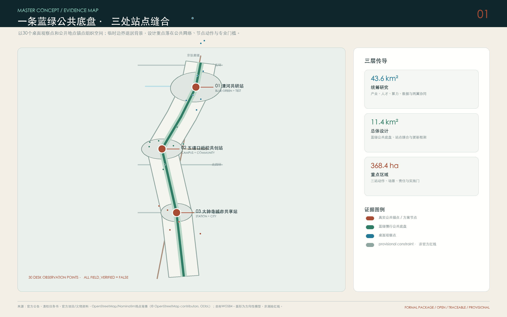
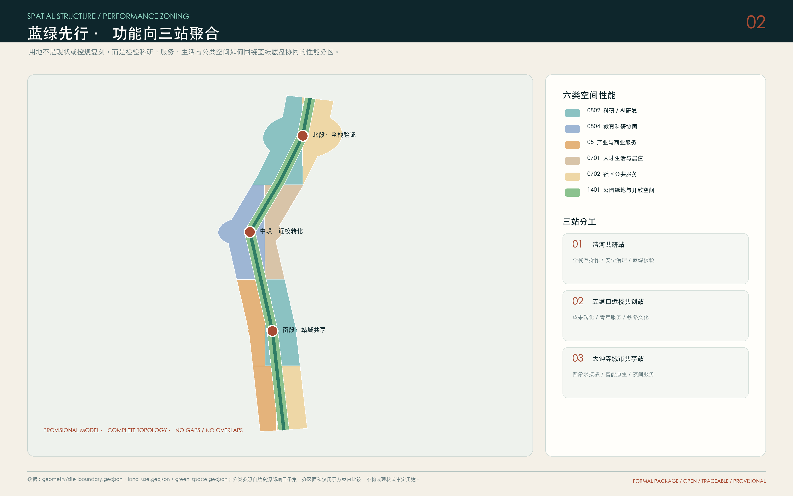
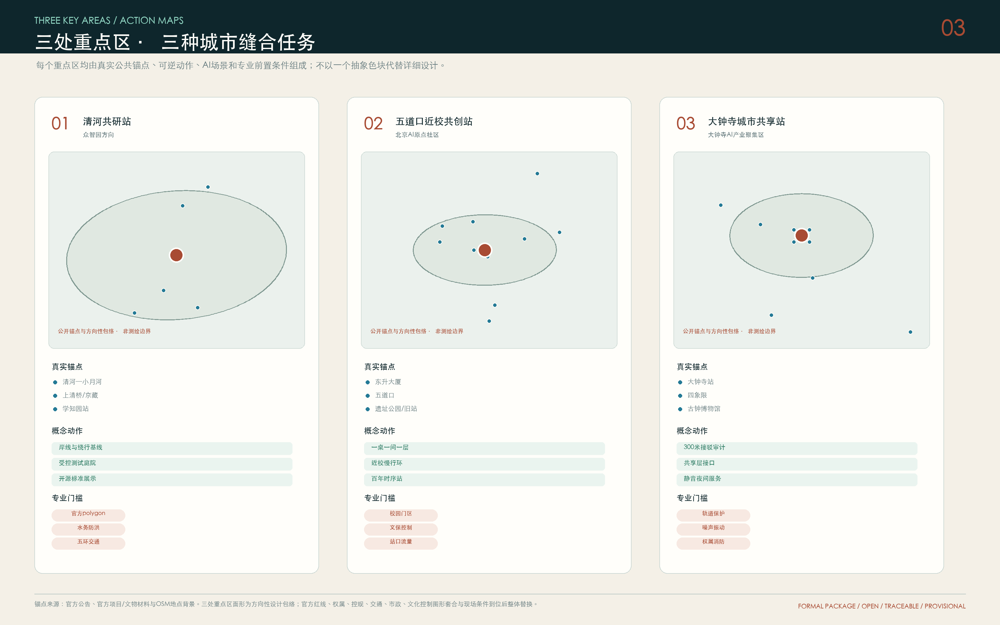
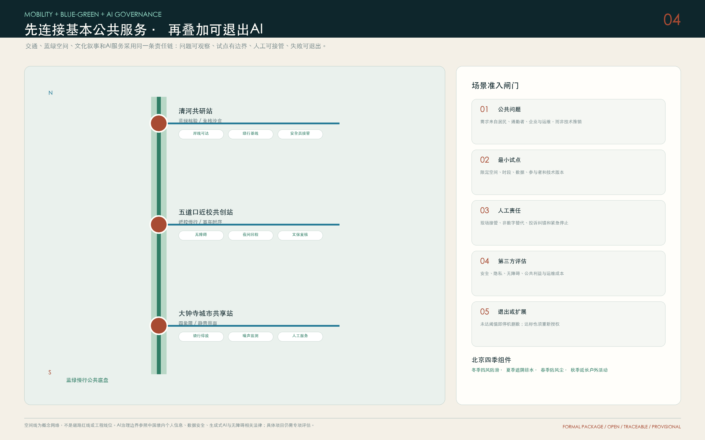
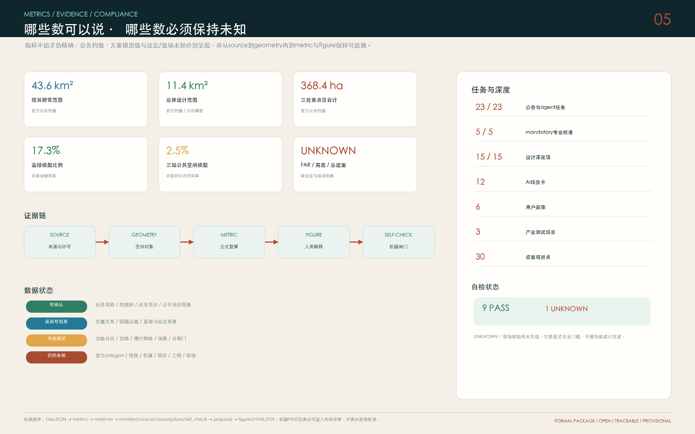

# 京张蓝绿智联｜三站缝合

## JINGZHANG BLUE-GREEN LINK | THREE-NODE URBAN STITCH

> 以蓝绿公共利益为底盘，以真实站点和公共文化锚点组织空间，以受控测试和人工责任组织AI。所有空间落地建议均为概念建议、参考方案或可供专业团队深化研究，不替代正式规划，不构成政府审定结论。

## 执行摘要

方案提出“**一条蓝绿公共底盘、三处站点缝合、两翼专业支撑、十二项AI场景**”。蓝绿公共底盘连接清河、小月河与京张铁路遗址公园的文化—生态—慢行系统；三处站点分别是北段清河共研站、五道口近校共创站和大钟寺城市共享站；中关村科技服务翼提供资本、法律、知识产权、人才与国际服务，小月河场景赋能翼提供城市问题、测试环境和公共体验。

方案的空间判断来自官方公告、清权任务书、官方项目材料、公开地图锚点与30个桌面观察点，而不是脱离场地的功能想象。现阶段可以确认三层任务规模、重点片区名称、五道口和大钟寺等点名节点、京张铁路遗址公园及相关文化资源、项目级交通议题；不能确认官方精确polygon、控规、权属、道路红线、现状建筑、市政和现场使用状态。因此，GeoJSON中的面形用于方向性建模，法定和工程指标保持unknown。[source:OFFICIAL-ANNOUNCEMENT] [source:AGENT-TASKBOOK] [source:HAIDIAN-AI-ORIGIN-2026] [source:HAIDIAN-JZ-BELT-2026] [standard:PROJECT-OFFICIAL-ANNOUNCEMENT] [depth:existing_conditions_diagnosis]

## 设计依据与资料清单

### 证据分级

| 等级 | 可承担的判断 | 本方案中的材料 | 禁止升级为 |
| --- | --- | --- | --- |
| A 任务与标准依据 | 项目名称、范围约值、设计任务、专业边界 | 官方公告、清权任务书、住建部/自然资源部标准 | 具体地块和工程批准 |
| B 公开场地锚点 | 真实地点、已公开项目背景、文化资源和待核问题 | 官方项目资料、文物记录、OSM/Nominatim地点锚点 | 测绘红线、现状完整清单 |
| C 方案模型 | 功能关系、慢行网络、概念包络、场景和实施门 | 本包GeoJSON、metrics、图纸和HTML | 现状、控规、权属、施工图 |
| D 待核未知 | 现场、法定、工程、运营条件 | `assumptions.json` 与空的控制线图层 | 确定结论 |

本包遵循WGS84/EPSG:4326交换、EPSG:4548面积与距离复算；WGS84、GCJ-02、BD-09和天地图服务坐标不得直接叠加。[source:SOURCE-REGISTRY] [source:OSM-CONTEXT] [data:geometry/site_boundary.geojson#SITE-001] [metric:site_area_sqm]

### 30点远程勘察台账与12个方案锚点

北、中、南各设置10个桌面观察点，共30点；每点记录WGS84坐标、目标方向、来源、可观察事实、未知项和可信度，全部 `field_verified=false`。完整30点台账收录在 [`report/narrative.md`](report/narrative.md#30点远程勘察登记)，而非只在图面显示数量；其中12个直接影响方案结构的锚点列于下表。[metric:desk_observation_point_count]

| 段落 | 真实锚点 | WGS84 | 核验主题 | 证据状态 |
| --- | --- | --- | --- | --- |
| 北 | 清河—小月河水闸 | 116.346724, 40.017303 | 蓝绿连续、岸线可达、防洪与夜间安全 | 地图锚点；未现场核验 |
| 北 | 上清桥/京藏高速接口 | 116.347579, 40.021712 | 高等级道路阻隔、绕行、坡度与无障碍 | 地图锚点；未现场核验 |
| 北 | 学知园站 | 116.345753, 40.013630 | 轨道接驳、非机动车与园区/社区联系 | 地图锚点；未现场核验 |
| 中 | 东升大厦 | 116.327708, 39.992446 | AI原点公开中心、近校服务与成果转化 | 官方文字+地图；非地块边界 |
| 中 | 五道口站 | 116.331702, 39.991478 | 四象限步行、骑行停放、夜间回程 | 官方任务+地图；未计数 |
| 中 | 京张铁路遗址公园五道口段 | 116.331612, 39.994826 | 遗址公园连续、文化展示、无障碍和维护 | 官方项目背景+地图 |
| 中 | 清华东路西口 | 116.339200, 40.000500 | 站点一体化、校园边界与换乘 | 任务点名+方向性坐标 |
| 中 | 清华园车站旧址 | 116.328000, 39.994300 | 保护范围、I/V类建控、邻里与可逆展陈 | 官方控制文字；坐标仍为地址派生 |
| 南 | 大钟寺站 | 116.339006, 39.965271 | 四象限、公交、骑行、站城共享 | 官方任务+项目资料+地图 |
| 南 | 大钟寺古钟博物馆 | 116.331735, 39.968019 | 历史文化资源与保护控制 | 官方文物背景；控制线缺失 |
| 南 | 中坤广场/蓝景丽家背景点 | 116.335300, 39.966300 | 项目界面、商业服务和更新协同 | 官方项目资料；实施状态待核 |
| 南 | 13号线噪声敏感界面 | 116.340000, 39.961500 | 噪声振动、安静休息与轨道保护 | 历史治理材料；当前监测缺失 |

公开地点只证明“应当去哪里核验”，不能证明坡度、流量、净宽、噪声、围栏、开放时间和公众感受。实地深化须沿北线清河—学知园、中线东升大厦—五道口—遗址公园—清华东路西口、南线大钟寺四象限—学院南路完成工作日早晚高峰、周末白天和夜间观察，并覆盖老年人、残障人士、学生、创业者、居民、服务劳动者与运营人员。[source:AI-ORIGIN-AREA-2026] [source:DAZHONGSI-MICROCENTER-2026] [depth:risk_missing_data]

## 三层范围工作框架

统筹研究范围约43.6平方公里负责产业、人才、算力、数据、场景和区域协同；总体设计范围约11.4平方公里负责蓝绿公共底盘、城市更新、慢行接驳和产业生活复合；三处重点区公告合计约368.4公顷，负责节点级功能、公共空间、场景和实施抓手。三层传导关系为“区域机制—公共骨架—可验证项目包”，不是同一张图的机械放大。[source:SITE-PACKAGE] [standard:MOHURD-URBAN-DESIGN-MEASURES] [depth:three_level_scope_framework]

本包的总体设计边界与三个重点区均为 `provisional_constraint`。面形以公告约面积和公开锚点构造，仅用于设计关系、拓扑和intake自检；官方polygon到位后，必须替换 `site_boundary`、`key_areas` 并重算 land use、buildings、roads、green space、public space、phasing、metrics、图片和图纸。[source:BOUNDARY-SOURCE] [source:KEY-AREA-SOURCE] [data:geometry/key_areas.geojson#PROV-KEY-001] [metric:key_area_count]

## 统筹研究范围产业与未来城市研究

### 名称、英文名与视觉识别

“京张蓝绿智联”把百年京张的时间轴、清河—小月河—遗址公园的生态公共轴与AI协同网络叠合；“三站缝合”直接说明方案不是建设三个封闭园区，而是通过站点、公共空间和可验证服务修补城市断点。英文名使用 `JINGZHANG BLUE-GREEN LINK | THREE-NODE URBAN STITCH`。Logo方向由一条青绿连续曲线、三枚赭红节点和两个开放接口构成：曲线代表蓝绿公共底盘，三点代表北中南三站，开放接口代表两翼协同和公众进入。所有字体、图标和颜色由程序化基础几何生成，不使用企业商标、人物肖像或未授权素材。[source:AGENT-TASKBOOK] [standard:PROJECT-AGENT-OPEN-CALL-TASKBOOK]

### 三大定位、五大功能与三区两翼

三大定位落实为：铁路文化可阅读、都市AI生活可体验、融合创新可验证。五大功能不按楼宇分割，而按共享能力组织：全栈自主验证、世界级创新生态、AI+场景开放、智能化活力城市、人本AI治理。北段承担全栈验证与治理，中段承担近校转化与人才服务，南段承担智能原生业态与城市体验；两翼提供科技服务和公共场景。[depth:overall_spatial_structure]

### 六个案例的机制转译

| 案例 | 可验证机制 | 海淀转译 | 明确不照搬 |
| --- | --- | --- | --- |
| 北京AI原点社区 | 近校创新、青年共创与人才服务 | 中段采用一桌—一间—一层—一处公共界面的渐进空间供给 | 不把宣传辐射范围当竞赛红线 |
| 上海张江科学城 | 科研、创业、生活、学习、休闲与蓝绿网络协同 | 把公共服务和生态空间视为创新基础设施 | 不移植面积与开发强度 |
| 河套深港科技创新合作区 | 科技创新与制度/专业服务并重 | 北段先建立标准、合规、测试和退出机制 | 不套用跨境制度便利 |
| LaunchPad @ one-north | 创业社区与受控测试环境相互支撑 | 明确范围、时段、安全员、日志与退出 | 不照搬土地与测试权限 |
| Kendall Square | 从创新园区走向创新社区 | 关注非科研时段、生活服务与社区影响 | 不以高租金和总部数量衡量 |
| Salford Rise | 以步行骑行和公共空间回应物理阻隔 | 先做阻隔审计与绕行基线，再讨论工程 | 案例不证明桥隧可行 |

案例只提供组织问题的方法。任何企业、资金、场地、政策或活动安排仍需责任主体确认。[source:CASE-ZHANGJIANG] [source:CASE-HETAO] [source:CASE-ONE-NORTH] [source:CASE-KENDALL] [source:CASE-SALFORD-RISE]

## 总体设计范围城市更新与控规深度城市设计

总体设计采用“蓝绿公共骨架先行—站点与街区缝合—存量空间性能升级—数据和责任闭环”的四层结构。第一层连接清河、小月河和京张铁路遗址公园，提供连续步行、骑行、无障碍、休息和文化导览；第二层把学知园/五道口/清华东路西口/大钟寺等轨道与园区、校园、社区和公园接口相接；第三层用共享桌、项目间、成长层、公共界面等性能单元服务不同成长阶段；第四层为每个AI场景设置数据最小化、人工接管、审计、投诉和退出。[data:geometry/roads.geojson#ROAD-001] [data:geometry/green_space.geojson#GREEN-001] [data:geometry/public_space.geojson#PUBLIC-001] [standard:MOHURD-URBAN-DESIGN-MEASURES]

`land_use.geojson` 是从同一方向性边界拓扑切分的性能分区，完整覆盖且无重叠；`buildings.geojson` 是八个概念空间包络，不代表现状建筑或批准新建；`constraints.geojson` 保持空集合并列出待补法定控制，防止AI用推测线替代控规。[data:geometry/land_use.geojson#LU-001] [data:geometry/buildings.geojson#BLDG-001] [data:geometry/constraints.geojson#pending-data-gaps] [depth:land_use_layout]

开发强度、总建筑规模、高度、道路面积和逐栋拆改留保持unknown。专业深化采用四道门：权属与现状调查、文保生态与公共利益复核、结构消防市政评估、运营与使用者影响论证；通过后才进入保留、修缮、适应性改造、可逆加建或其他处置。[metric:floor_area_ratio] [metric:total_floor_area_sqm] [metric:building_height_m] [metric:road_area_ratio] [depth:development_intensity_controls] [depth:retain_renovate_demolish]

## 重点区域详细设计

### 北段｜众智园方向：清河共研站

以清河—小月河水闸、上清桥/京藏高速接口和学知园站为资料锚点，形成“一条蓝绿核验带、两个受控测试庭院、三个共享服务门”的方向性结构。先解决岸线可达、绕行、园区门、夜间照明、无障碍与骑行停放，再导入工具链互操作、端侧算力能耗和低速机器人三类沙盒。跨五环或高等级道路工程不作为方案成立条件，必须经过交通、水务、园林、防洪和安全专项。[source:ZHONGZHIYUAN-UPDATE-2026] [source:OSM-CONTEXT] [data:geometry/key_areas.geojson#PROV-KEY-001] [metric:zhongzhiyuan_key_area_sqm] [depth:three_key_area_detailed_design]

### 中段｜北京AI原点社区：五道口近校共创站

以东升大厦、五道口站、京张铁路遗址公园、清华园车站旧址和清华东路西口形成可核验的近校链。空间供给采用“一张共享桌—一个项目间—一层成长空间—一处公共界面”，把研究原型、创业团队、人才家庭与社区服务接在同一条步行网络上。校园和园区边界只提出门区、共享时段、夜间安全和骑行组织的协商议题，不假定权属同意。北京市文物局已公布清华园车站旧址保护范围及I类、V类建设控制地带的文字要求；本方案将其作为硬约束，但在取得可配准的主管图件前不自行推绘法定polygon，铁路文化节点继续采用可逆展陈、低亮度与史实可查。[source:AI-ORIGIN-AREA-2026] [source:JZ-PARK-WUDAOKOU-2019] [source:QINGHUAYUAN-HERITAGE-CONTROLS-2026] [data:geometry/key_areas.geojson#PROV-KEY-002] [metric:ai_origin_key_area_sqm]

### 南段｜大钟寺AI产业聚集区：大钟寺城市共享站

以大钟寺站为中心，采用官方项目文件中的300米一体化研究口径作为项目级背景，不把它解释为征集重点区边界。优先核验四象限、站口、公交、非机动车、人行净宽、施工围挡、轨道保护、噪声振动和文化资源。相关交通报告提出2处非机动车停车场、合计约0.14公顷，该信息仅进入实施核验清单，不作为本方案新增指标。空间上提出地面连续慢行、可进入共享层、安静休息界面和青年夜间服务的性能要求，地下连通与工程线位须另行专项论证。[source:DAZHONGSI-MICROCENTER-2026] [source:DAZHONGSI-TRANSPORT-2026] [source:LINE13-NOISE-2020] [data:geometry/key_areas.geojson#PROV-KEY-003] [metric:dazhongsi_key_area_sqm] [depth:traffic_rail_slow_parking]

## AI 创新生态、人才画像与 AI+ 场景

### 六类用户画像

| 用户 | 真实需求 | 空间与服务回应 |
| --- | --- | --- |
| 青年研究者与学生 | 低成本试验、同伴交流、夜间安全 | 共享验证台、近校服务环、人工求助点 |
| 初创团队与中小企业 | 可扩缩空间、首单、合规与退出 | 一桌—一间—一层梯度、场景清单与失败退出 |
| 国际人才与家庭 | 双语办事、教育医疗生活导航、社区融入 | 人工复核服务台、家庭友好空间、来源可查 |
| 居民、老人和残障人士 | 安静、安全、可理解、可拒绝 | 非数字路径、无障碍连续、投诉与纠错 |
| 通勤、配送、保洁与运维人员 | 连续通行、休息、补给、卫生间 | 骑行停放、服务驿站、分时配送、人工排班 |
| 访客与铁路文化爱好者 | 可信历史、清晰导览、可达参观 | 离线导览、证据标签、可逆展陈、无障碍信息 |

[metric:persona_count]

### 十二张场景卡

| ID | 场景 | 空间 | 最小数据 | 人工责任 |
| --- | --- | --- | --- | --- |
| SC-01 测试 | 开源工具链互操作台 | 北段受控研发空间 | 合成/清权测试集 | 专家复核；失败可退出 |
| SC-02 测试 | 低速机器人共行试验 | 园区内部可控路段 | 不用人脸；只记事件日志 | 现场安全员立即接管 |
| SC-03 测试 | 端侧算力与能耗验证 | 共享中试单元 | 设备状态与能耗 | 第三方测试+电气消防复核 |
| SC-04 | 站口步行与骑行助手 | 五道口/大钟寺等接驳点 | 汇总流量；不持续标识身份 | 交通人员优先；异常转人工 |
| SC-05 | 无障碍连续路径助手 | 公园/站口/服务点 | 用户主动反馈 | 非数字导视和人工巡检并行 |
| SC-06 | 人才服务导航 | AI原点服务节点 | 办事必要字段 | 复杂事项转人工；引用可查 |
| SC-07 | 铁路记忆导览 | 遗址公园/旧站背景 | 离线内容优先 | 文保、史实与版权审核 |
| SC-08 | 社区健康服务导航 | 社区服务驿站 | 不诊断；仅导航预约 | 紧急情况转人工/急救体系 |
| SC-09 | 青少年AI学习伙伴 | 公共学习空间 | 未成年人信息最小化 | 教师家长可控；时长限制 |
| SC-10 | 中小企业合规助手 | 科技服务翼 | 企业主动提交的必要材料 | 法律财税专业人员复核 |
| SC-11 | 公共空间运维助手 | 公园/站口/设施点 | 环境与设备状态 | 告警分级、人工派单、日志审计 |
| SC-12 | 四季舒适度协同 | 绿荫/候车/停留节点 | 温湿风雨环境数据 | 现场校准、节能阈值、人工巡检 |

三个优先产业测试为SC-01、SC-02、SC-03。任何沙盒上线前必须明确责任单位、测试目的、允许数据、保存期限、模型/规则版本、人工岗位、保险与应急、申诉入口、停机阈值和退出后的数据删除。[metric:scenario_node_count] [metric:sandbox_candidate_count]

场景在中国境内遵循目的明确、最小必要、分类分级、非数字替代和人工最终责任。健康、教育、法律、公共安全和办事导航只做辅助，不自动作出影响个人权益的最终决定；具体系统仍需项目级合规评估、采购、备案和安全评估。[source:PIPL-2021] [source:DSL-2021] [source:GENAI-MEASURES-2023] [source:ACCESSIBILITY-LAW-2023]

## 用地、建筑规模与拆改留方案

概念用地按科研/AI研发、教育科研协同、产业与商业服务、人才生活、社区服务和公园绿地六类组织，采用自然资源部分类子集编码。[standard:MNR-LAND-USE-CLASSIFICATION-GUIDE]。功能分区是对“公共底盘与创新空间如何相互支撑”的模型，不表示现状用地或控规调整。[data:geometry/land_use.geojson#LU-001]

八个概念空间包络用于表达共享验证、近校孵化、人才服务、文化展示、站城共享和骑行服务的相对关系，其合计基底与模型密度见 [metric:building_footprint_area_sqm] [metric:building_density]。逐栋拆改留采用“保护/保留优先—修缮提质—适应性改造—可逆加建—其他处置专题论证”的决策门，并纳入结构消防、权属、使用者影响、文化价值和全生命周期碳排。[data:geometry/buildings.geojson#BLDG-001] [depth:height_massing_character]

## 交通、轨道、市政与公共服务设施

交通遵循“先连续、再接驳、后工程”：蓝绿慢行主脊串联北中南，三条东西缝合线分别处理清河/学知园、五道口/清华东路西口和大钟寺四象限；概念中心线长度见 [metric:road_centerline_length_m]。道路红线、断面、相位、站口容量和地下空间没有官方资料，所有线均为网络关系。[data:geometry/roads.geojson#ROAD-001]

市政与新型基础设施采用“共享机房、端侧优先、分级安全、可维护、可停机”。端侧算力用于降低数据外送和实时控制延迟，但能源、通信、消防、防洪排涝、电气容量、轨道保护和网络安全必须专项测算。公共服务覆盖卫生间、饮水、休息、母婴、无障碍、骑行停放、夜间人工求助和非数字办事路径。[depth:municipal_new_infrastructure]

## 蓝绿空间、公共空间与城市风貌

蓝绿公共底盘不是“景观装饰”，而是连接人才生活、社区公平、文化记忆、慢行交通和AI场景的基础设施。模型绿地包络与三站公共空间包络见 [metric:green_space_area_sqm] [metric:green_ratio] [metric:public_space_area_sqm] [metric:public_space_ratio]；这些是方向性模型值，不是现状绿地率、规划绿地率或实施边界。[data:geometry/green_space.geojson#GREEN-001] [data:geometry/public_space.geojson#PUBLIC-001] [depth:blue_green_public_space]

三处朝圣地标以贡献和公共服务为核心：北段“全栈开源门”展示经验证的工具、标准和失败记录；中段“百年时序站”并置京张铁路、中关村创新与AI新文化的可查时间线；南段“城市智能客厅”提供市民体验、企业首发、人工咨询与安静休息。组件统一使用可逆基础、低亮度、可维护材料、无障碍导视和非数字公告面，禁止企业广告化和巨幕奇观化。城市色彩为铁路赭红、公共叶绿、科技青和蓝绿水色。[source:HAIDIAN-JZ-PARK-2023] [source:QINGHUAYUAN-HERITAGE-CONTROLS-2026] [standard:MOHURD-URBAN-DESIGN-MEASURES]

## 更新项目清单、实施政策与分期计划

| ID | 项目包 | 位置 | 概念动作 | 前置门槛 | 阶段 |
| --- | --- | --- | --- | --- | --- |
| P1 | 三站资料与现场核验 | 北中南30点 | 统一坐标、方向、时间、来源与可信度；完成多时段现场补录 | 官方边界接口、现场权限 | 0—6个月准备期 |
| P2 | 北段蓝绿与阻隔审计 | 清河—小月河—五环/京藏 | 岸线可达、绕行、门区、照明与无障碍基线；优先临时导视和休息试点 | 水务/园林/交通资料 | 0—12个月建议 |
| P3 | 北段全栈验证沙盒 | 受控空间类型 | 合成数据、端侧设备、低速机器人三类受控测试协议和退出机制 | 场地责任、安全消防合规 | 6—18个月建议 |
| P4 | 五道口近校公共创新环 | 东升大厦—五道口—遗址公园—清华东路西口 | 共享服务、夜间照明、骑行停放、无障碍与公共学习节点 | 站口道路校园门核验 | 0—18个月建议 |
| P5 | 百年时序与公共知识 | 遗址公园/清华园旧站背景 | 铁路—中关村—AI三层叙事、可查源贡献档案和可逆展陈 | 文保控制、内容与版权审核 | 6—24个月建议 |
| P6 | 大钟寺300米接驳审计 | 大钟寺站项目级背景圈 | 四象限、站口、公交、非机动车、人行净宽与施工状态复核 | 站点道路项目底图+现场计数 | 0—6个月准备期 |
| P7 | 南段共享层与静音界面 | 轨道站点周边空间类型 | 提出共享层、安静休息与青年夜间服务性能要求 | 噪声振动、产权消防轨道保护 | 6—24个月建议 |
| P8 | 年度开放场景与全球社区 | 三区两翼运营网络 | 发布公共问题、公开招募、受控测试、居民评议、第三方审计和退出报告 | 采购伦理数据规则 | 持续运营建议 |

分期不是开工承诺，而是决策门：阶段一完成证据底盘和三站可逆试点；阶段二在责任与专项条件明确后形成蓝绿网络和受控沙盒；阶段三在官方底图、控规、权属、交通、市政、其他文化资源控制资料、清华园旧站控制图形套合和现场资料到位后进入专业片区深化。[data:geometry/phasing.geojson#PHASE-001] [metric:phase_1_area_sqm] [metric:phase_2_area_sqm] [metric:phase_3_area_sqm] [depth:renewal_project_list] [depth:phasing_implementation]

年度运营采用“四季一账本”：春季开源共创周、夏季城市真实问题挑战、秋季全球AI公共论坛、冬季年度审计与失败案例展；公开问题、数据边界、评估、投诉和退出记录。人才与企业转化路径为“参观—问题认领—小规模测试—第三方评估—采购或市场化”，每一步都允许停止，不承诺招商数量、投资额、政策资金或活动效果。[source:AGENT-TASKBOOK]

## 指标体系、面积复算与合规矩阵

指标分为三类：官方公告约值用于说明任务规模；方向性几何模型值用于检查方案内部关系；缺少法定或现场依据的值保持unknown。所有几何面积和长度在EPSG:4548中复算，HTML的核心指标使用 `data-metric` 与 `data-value` 对照JSON。[depth:metrics_recalculation]

关键面积关系：总体设计模型约11.4平方公里；三处重点区面形由公告约192.1、104.3、72.0公顷约值约束；模型绿地和公共空间比例只用于比较公共利益投入，不作为规划指标。用地代码面积索引、分期面积和节点计数均在 `metrics.json` 中可复算。已知指标完整索引：

[metric:site_area_sqm] [metric:announced_site_area_sqm] [metric:building_footprint_area_sqm] [metric:building_density] [metric:green_space_area_sqm] [metric:green_ratio] [metric:public_space_area_sqm] [metric:public_space_ratio] [metric:road_centerline_length_m] [metric:key_area_count] [metric:zhongzhiyuan_key_area_sqm] [metric:ai_origin_key_area_sqm] [metric:dazhongsi_key_area_sqm] [metric:scenario_node_count] [metric:persona_count] [metric:sandbox_candidate_count] [metric:desk_observation_point_count] [metric:land_use_05_area_sqm] [metric:land_use_0701_area_sqm] [metric:land_use_0702_area_sqm] [metric:land_use_0802_area_sqm] [metric:land_use_0804_area_sqm] [metric:land_use_1401_area_sqm] [metric:phase_1_area_sqm] [metric:phase_2_area_sqm] [metric:phase_3_area_sqm]

本包覆盖23项公告与智能体任务、5项mandatory本地标准和15项设计深度；`MOHURD-ARCH-DESIGN-DEPTH-2016` 因官方正文缺失仅作为资料缺口，不作为权威依据。[standard:PROJECT-OFFICIAL-ANNOUNCEMENT] [standard:PROJECT-AGENT-OPEN-CALL-TASKBOOK] [standard:MOHURD-CONTROL-DETAILED-PLANNING] [standard:MOHURD-ARCH-DESIGN-DEPTH-2016]

## 风险、版权与合规说明

当前最重要的专业条件是：官方三层范围和三重点区polygon、控规与地块、现状建筑与权属、道路与轨道、其他文化资源控制资料与公园实施线、清华园旧站官方控制图形的坐标套合、市政消防与防洪、公共服务底数、三线多时段现场观察。资料到位后，应登记来源、许可、版本、坐标系与哈希，并整体替换和重算，不可只修改图面。[source:PROCESSED-FACT-PACK] [source:QINGHUAYUAN-HERITAGE-CONTROLS-2026] [depth:risk_missing_data]

本包五张核心图、HTML和PDF由GeoJSON、metrics、矩阵与公开地点锚点程序化生成，不嵌入商业地图瓦片、街景截图、媒体照片、企业商标或人物肖像。OpenStreetMap仅用于背景锚点并保留ODbL归属。版权和使用边界见 `report/copyright_statement.md`。

## 参考资料与机器索引

[source:SITE-PACKAGE] [source:SOURCE-REGISTRY] [source:PROCESSED-FACT-PACK] [source:BOUNDARY-SOURCE] [source:KEY-AREA-SOURCE] [source:OFFICIAL-ANNOUNCEMENT] [source:AGENT-TASKBOOK] [source:OSM-CONTEXT] [source:ZHONGZHIYUAN-UPDATE-2026] [source:AI-ORIGIN-AREA-2026] [source:JZ-PARK-WUDAOKOU-2019] [source:DAZHONGSI-MICROCENTER-2026] [source:DAZHONGSI-TRANSPORT-2026] [source:LINE13-NOISE-2020] [source:QINGHUAYUAN-HERITAGE-CONTROLS-2026] [source:ACCESSIBILITY-LAW-2023]

[standard:PROJECT-OFFICIAL-ANNOUNCEMENT] [standard:PROJECT-AGENT-OPEN-CALL-TASKBOOK] [standard:MOHURD-URBAN-DESIGN-MEASURES] [standard:MOHURD-CONTROL-DETAILED-PLANNING] [standard:MNR-LAND-USE-CLASSIFICATION-GUIDE] [standard:MOHURD-ARCH-DESIGN-DEPTH-2016]

[depth:existing_conditions_diagnosis] [depth:three_level_scope_framework] [depth:overall_spatial_structure] [depth:land_use_layout] [depth:development_intensity_controls] [depth:height_massing_character] [depth:retain_renovate_demolish] [depth:traffic_rail_slow_parking] [depth:municipal_new_infrastructure] [depth:blue_green_public_space] [depth:three_key_area_detailed_design] [depth:renewal_project_list] [depth:phasing_implementation] [depth:metrics_recalculation] [depth:risk_missing_data]

[data:geometry/site_boundary.geojson#SITE-001] [data:geometry/key_areas.geojson#PROV-KEY-001] [data:geometry/key_areas.geojson#PROV-KEY-002] [data:geometry/key_areas.geojson#PROV-KEY-003] [data:geometry/land_use.geojson#LU-001] [data:geometry/buildings.geojson#BLDG-001] [data:geometry/roads.geojson#ROAD-001] [data:geometry/green_space.geojson#GREEN-001] [data:geometry/public_space.geojson#PUBLIC-001] [data:geometry/constraints.geojson#pending-data-gaps] [data:geometry/phasing.geojson#PHASE-001]
