# RECIPROCAL JING-ZHANG: HOW AI GROWTH DELIVERS PUBLIC RETURN TO THE CITY

## Executive Summary

- **This is an urban-system proposal in Haidian, Beijing, organized along the public spaces of the former Jing-Zhang Railway.** The 43.6 km² area coordinates industry, mobility, and governance; the approximately 11.4 km² area addresses urban renewal and spatial capacity; and Zhongzhiyuan, the AI Origin Community, and Dazhongsi test three different industry-city relationships. These areas are announced approximations or recalculations from provisional geometry, not statutory boundaries [source:OFFICIAL-ANNOUNCEMENT] [data:geometry/site_boundary.geojson#SITE-001].
- **The central judgment is not to build another “AI green axis,” but to operate the existing public realm as continuing public infrastructure.** Phase II supporting works have been announced complete [source:JZ-PARK-PHASE2-202607], and the Qinghua East Road public-space project has been approved [source:QINGHUA-EAST-PUBLIC-SPACE-202604]. The Line 13 capacity upgrade [source:LINE13-UPGRADE-202602] and Qinghe-Xiaoyue water project [source:QINGHE-XIAOYUE-CSO-202601] remain under implementation. The proposal therefore takes responsibility for access gaps, performance, public return, and long-term operations rather than claiming existing public investment again.
- **The proposal combines one public-realm operating spine, three differentiated “reciprocity platforms,” two service networks, and multiple everyday entrances.** Zhongzhiyuan validates technology, the AI Origin Community translates research outcomes, and Dazhongsi tests real adoption. Whenever industrial growth uses public space, funding, data, or energy, it must deliver a knowledge, economic, spatial, data, climate, or cultural return and remain subject to public evaluation and exit.
- **The decision now is to begin with baselines, joint walks, reversible trials, and operating rules rather than permanent works.** Eight near-term projects are proposed for the first 0-12 months. Surface repairs may be tested after evidence and competent-authority consent; network reorganization is developed only at high-demand, high-detour locations; bridges, tunnels, major utilities, and centralized compute are not conditions for the proposal to work. Every project, budget, target, and gate remains a `not_approved` proposal parameter.

### Six Questions for a First Reading

| Reader question | Direct answer |
| --- | --- |
| Where is it? | The Jing-Zhang Railway heritage public realm and its surrounding innovation, community, and mobility networks in Haidian, addressed at three scales: 43.6 km², approximately 11.4 km², and three key areas. |
| Who is it for? | Not only AI firms, but eight groups of rights holders: residents, older people, children, disabled people, service workers, couriers, students and researchers, small tenants, and visitors. |
| What problem does it solve? | Fragmented innovation translation; built public space that may still be difficult to use; broken station-park-street journeys; basic services and memory crowded out by technology narratives; and weak operating exit. |
| What does it do? | Builds baselines and performance evidence; operates three reciprocity platforms; repairs complete journeys and services; and establishes twelve AI scenarios, eight near-term projects, four accounts, and nine professional gates. |
| How is it implemented and judged? | Months 0-6 establish baselines, walks, and rules; months 7-12 deliver reversible P01-P08 projects; Year 2 forms cross-hub services; Year 3 renews, exits, or restructures. Statutory owners authorize, the PMO coordinates, multiple operators deliver, an independent layer evaluates, and four accounts remain separate. Success is judged by real payment and job quality, zero-break accessibility, free public hours, data appeal and deletion, no additional heat or stormwater risk, and traceable history and public comments. |
| When does it stop? | No scale-up while rights, rail protection, water, accessibility, utility, heritage, or operating responsibilities remain unclear; exit when rights impacts cannot be human-reviewed, space cannot be restored, or data cannot be migrated. |

### How to Read Evidence States and Codes

The report separates confirmed facts, information awaiting verification, proposal parameters, and unknown baselines. Public information from competent authorities can establish a task or announced status. `provisional` means temporary geometry used for discussion. `not_approved` means a target, budget, or gate has been defined but not authorized. `unknown/null` means evidence is insufficient and a proposed value cannot stand in for current conditions. Four code families are used only for retrieval: implementation depth (S0-S3), AI scenarios (AI-01-AI-12), near-term projects (P01-P08), and professional gates (G0-G8). Each is introduced in plain language before its code appears.

**This is one complete professional report.** It moves from the project judgment to the three scope levels, industry, and key areas; follows people's complete journeys through mobility, services, blue-green systems, and culture; and ends with projects, budgets, metrics, and stop conditions. Nineteen figures are explained where they become relevant. They clarify relationships but do not replace GeoJSON, structured metrics, formal evidence, or final judgment by competent authorities and people.

## Design Basis and Source List

**Chapter conclusion: Jing-Zhang is no longer a blank site awaiting a plan; the proposal begins with post-completion performance, public return, and clear boundaries of responsibility.**

This proposal starts from a fact that has already changed: the public realm of the Jing-Zhang Railway Heritage Park is not a blank sheet awaiting a plan. In July 2026, the Beijing Municipal Forestry and Parks Bureau announced the completion of Phase II supporting works, and a fishbone-shaped walking and cycling network has already taken shape in the northern section. The public-space project south of Qinghua East Road has been approved, while the combined-sewer overflow pollution-control project for the Qinghe–Xiaoyue River system has entered implementation. Continuing to make a "new nine-kilometre green axis with three paths and one green belt" the central innovation would therefore double-count public investment that has already occurred or is under way [source:JZ-PARK-PHASE2-202607] [source:QINGHUA-EAST-PUBLIC-SPACE-202604] [source:QINGHE-XIAOYUE-CSO-202601].

The new question is not "how to draw another axis," but how AI-industry growth should deliver verifiable returns to the city after consuming space, capital, data, energy, and public attention. Three specialist Agents studied economy and industry, mobility and ecology, and humanities and heritage in parallel; the lead Agent then made unified determinations on evidentiary conflicts, scale and measurement conventions, alternative scenarios, and implementation thresholds. AI is used only for retrieval, structuring, simulation, and communication. Statutory planning, professional engineering, public decisions, and final judgment remain with authorized institutions and people [source:AGENT-TASKBOOK] [standard:PROJECT-AGENT-OPEN-CALL-TASKBOOK].

The repository still lacks official polygons for the three scope levels, precise boundaries for the three key areas, road planning boundaries, existing buildings, parcel ownership, regulatory-plan indicators, heritage-control lines, and municipal capacity. The submission package uses the repository's provisional boundary to generate conceptual geometry and recalculated values solely for intake, discussion, and professional development. All boundaries in the drawings are shown as low-contrast dashed lines. Once formal data become available, the entire evidence chain—from GeoJSON, metrics, and matrices to figures, HTML, and PDF—must be recalculated [source:BOUNDARY-SOURCE] [data:geometry/site_boundary.geojson#SITE-001] [depth:existing_conditions_diagnosis].

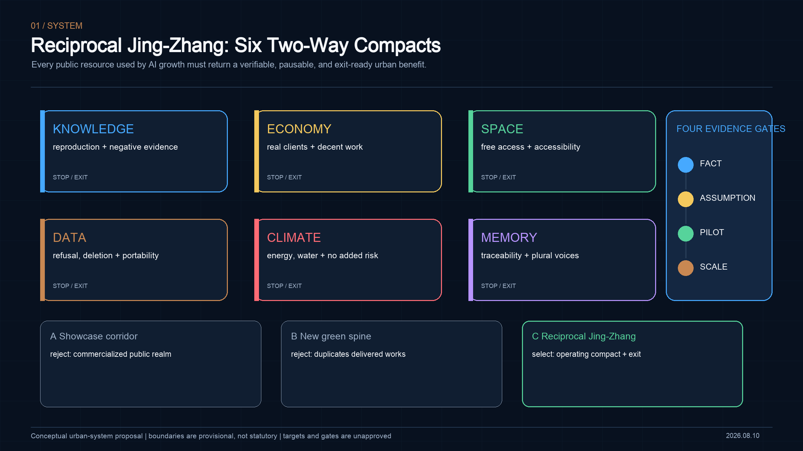

> **How to read the figure.** Start with the six boxes below: they are not decorative themes but six kinds of urban return that industrial growth must deliver. Then read the four evidence gates on the right. An idea must move from fact to trial and cannot jump from a concept drawing to permanent construction. The figure does not establish an engineering alignment or approval status.

### Diagnosis and Three Alternative Scenarios

| Scenario | Core assumption | Problem it can solve | Unacceptable cost | Decision |
| --- | --- | --- | --- | --- |
| A. AI showcase corridor | Create identity through landmarks, exhibitions, events, and enterprise showcases | Fast communication and visually forceful drawings | Residents become spectators; public space is commercialized; equipment maintenance and heritage risks are high | Not selected; retain only approved, reversible content components |
| B. Blue-green walking and cycling seam | Build a new north–south axis and cross-connections to resolve spatial fragmentation | Clear spatial structure | Duplicates projects built or approved in 2026; lacks evidence on roads, station entrances, and engineering | Not selected as the overarching concept; redirect it toward post-completion performance audits and gap-filling |
| C. Reciprocal Jing-Zhang | Every item of public support, data use, spatial occupation, and resource consumption delivers a verifiable return | Organizes industry, mobility, culture, equity, ecology, and operations together | Requires cross-departmental registers, public evaluation, and the capacity to exit | Selected |

"Reciprocity" is not an added charitable benefit; it is the operating compact of the innovation belt. Knowledge must be reviewable, the economy must create real customers and decent employment, space must retain free public access and accessibility, data use must be rejectable and deletable, energy, water, and material costs must be transparent, and history must be traceable and open to multiple voices. Each of the six compacts has stop conditions rather than merely a vision statement.

## Three-Level Scope Framework

**Chapter conclusion: the three scales address regional coordination, urban renewal, and key-area trials respectively; they cannot share one level of precision or be replaced by a single master plan.**

The three scope levels address different questions and are not replaced by a single master plan. The 43.6 km² Coordinated Research Area covers industrial chains, talent, cross-district mobility, and governance coordination. The approximately 11.4 km² Overall Design Area addresses connections to the built framework, urban renewal, service networks, and operating organization. The three Key-Area Detailed Design Areas, totaling approximately 368.4 hectares, test three different industry–city reciprocity prototypes. Areas in the announcement are approximate; values recalculated from provisional geometry are not official precise areas [source:OFFICIAL-ANNOUNCEMENT] [metric:announced_overall_design_area_sqm] [depth:three_level_scope_framework].

The spatial structure is summarized as "**one public spine, three reciprocity platforms, two exchange networks, and multiple everyday gates**." The public spine is the operating framework of Jing-Zhang public spaces made up of built and yet-to-be-verified sections; it does not claim a newly built continuous corridor. The three reciprocity platforms respectively undertake full-stack validation, origin-stage translation, and market adoption. The Zhongguancun Technology Services Wing supplies IP, legal, financial, standards, talent, and international-market services, while the Xiaoyue River Scenario Enablement Wing supplies real problems, controlled trials, and public evaluation. The "everyday gates" are point-by-point connection tasks at station entrances, community gates, park gates, campus gates, and riverfront entrances; neither their number nor engineering alignments are assumed in advance [data:geometry/key_areas.geojson#PROV-KEY-001] [data:geometry/roads.geojson#MOB-NS-001].

All three levels apply a four-stage evidence gate: fact, assumption, trial, and scale-up. Public information from competent authorities can confirm tasks and project status; provisional layers support only conceptual exploration; site walks and professional models determine small pilots; permanent works are discussed only after official data, property rights, approvals, budgets, and operating responsibilities are all in place. In this way, organizer data gaps do not block creative assessment, but drawings cannot quietly elevate those gaps into approval conclusions.

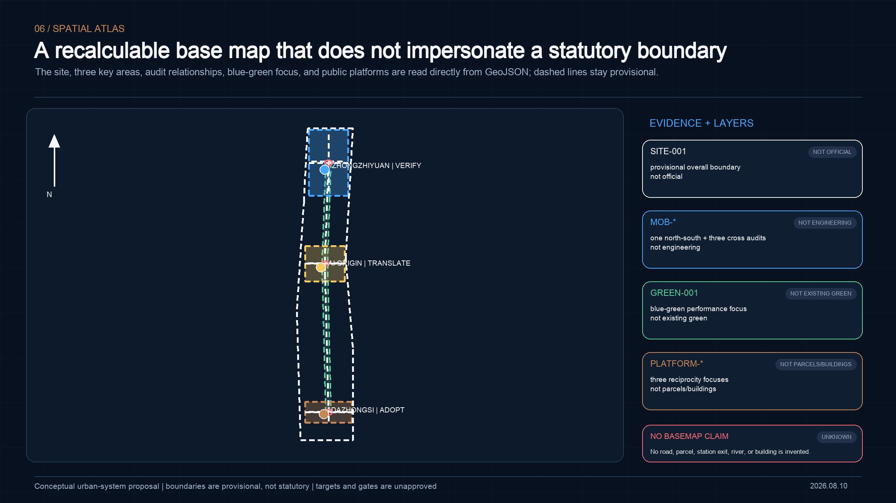

> **How to read the figure.** This map answers only which spatial relationships can be recalculated from the current machine-readable evidence. The long dashed outline is the provisional overall scope, the three colored blocks index the key areas, and the vertical and horizontal lines are audit relationships awaiting field verification. It does not establish the real location of roads, station entrances, rivers, parcels, or buildings. The entire figure must be recalculated when formal base data arrive.

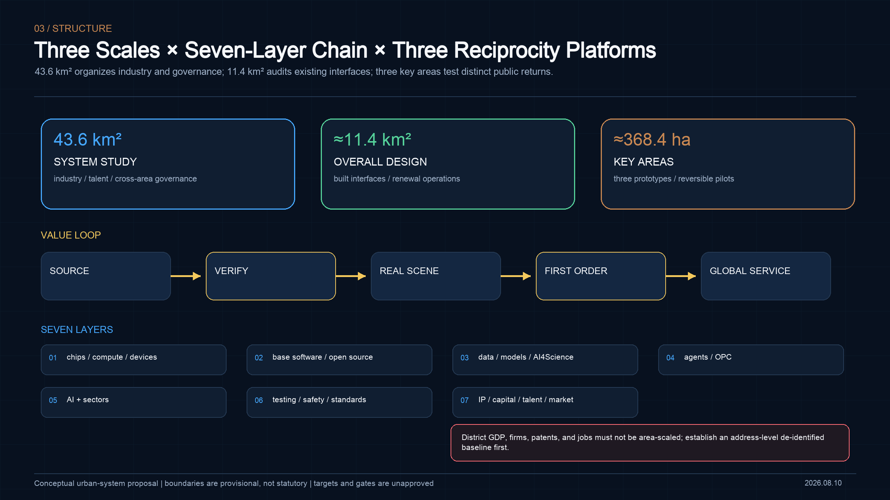

> **How to read the figure.** From top to bottom are the coordinated-research, overall-design, and key-area scales. From left to right is the loop from outcome to validation, scenario, first order, and service feedback. The question is which scale owns each action and who can authorize it, rather than how to compress all three scales into one master plan.

## Coordinated Research Area: Industry and Future City Research

**Chapter conclusion: the industrial objective is not to accumulate firms and buildings within 43.6 km², but to move research outcomes through independent validation, real scenarios, external first orders, and continuing services.**

### Seven-Layer Industrial Chain and the Three Zones and Two Wings Loop

GDP, enterprise counts, patents, or employment for Haidian District cannot be allocated to the 43.6 km² area in proportion to its size. District-level statistics can establish that the broader regional base is strong, but they cannot establish output inside the research area. Formal evaluation must first create an address-level, de-identified baseline register for enterprises, employment, buildings, and rents [source:HD-STAT-BULLETIN-2025] [metric:economic_baseline_coverage].

The industrial system is organized in seven layers: chips, computing power, and terminals; foundational software and open-source tools; data, models, and AI for science; agents and OPC; AI-enabled industry applications; evaluation, safety, and standards; and IP, capital, talent, and market services. The belt does not seek to build heavy assets for every layer. Instead, it forms a loop: source-stage outcomes from the AI Origin Community → full-stack adaptation and trustworthy validation at Zhongzhiyuan → real-world scenarios along the Xiaoyue River → productization and first orders at Dazhongsi → professional services and international expansion through Zhongguancun → returns of revenue, talent, and problems [source:HD-AI-ORIGIN-202601] [source:BJ-AGENT-MEASURES-202607].

Large-scale training compute, mass manufacturing, and aggregation of sensitive raw data are not assumed to be located in the central city. Within the belt, priority goes to design, low-latency inference, software–hardware adaptation, independent evaluation, first adoption, and professional services. Any centralized computing facility must first demonstrate electricity, cooling, fire safety, flood resilience, energy efficiency, and long-term maintenance; the slogan of an "AI city" does not automatically justify construction [source:BJ-DATACENTER-OPTIMIZATION-202411] [depth:municipal_new_infrastructure].

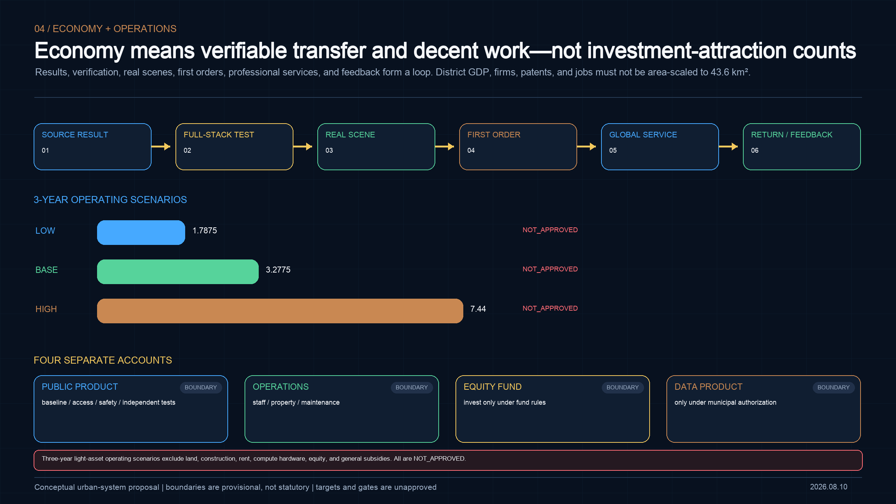

> **How to read the figure.** The six-step chain at the top shows that an outcome becomes a real transfer only after validation, a real scenario, and an external first order. The three budget bars are unapproved low, base, and high scenarios rather than fiscal commitments. The four accounts below must remain separate so that public products, operating services, equity investment, and data income cannot subsidize or conceal one another.

### Five International Cases: Translate Mechanisms, Do Not Copy Powers

| Case | Transferable mechanism | Application in Jing-Zhang | What cannot be copied |
| --- | --- | --- | --- |
| Singapore LaunchPad @ one-north | Modular space, flexible leases, and a unified service portal | Tiered workstations, project rooms, validation booking, and services for international teams | Land system, rents, and public-developer powers [source:CASE-ONE-NORTH] |
| Shanghai Zhangjiang Science City | Nursery–incubation–acceleration chain, talent housing, and public participation | Unified outcome identifiers and services matched to growth stages | 220 km² scale, manufacturing structure, and fiscal policy [source:CASE-ZHANGJIANG] |
| Shenzhen Hetao | Professional operating entity, pilot-scale platforms, and one-stop processing | A cross-zone project office and unified service case numbers | Cross-border, customs, and special-zone legislative conditions [source:CASE-HETAO] |
| Kendall Square, Cambridge | Binds innovation value uplift to housing, open space, mobility, and employment training | Write low-cost space, mobility, and job quality into public returns | US zoning incentives and community-benefit negotiation system [source:CASE-KENDALL] |
| Toronto Quayside | Public goals, materials, and re-procurement remain viable after a partner exits | Predefine operator exit, data migration, and renewed competition | Unelected data trusts and foreign data-governance powers [source:CASE-QUAYSIDE] |

### Six Reciprocal Compacts

| Compact | Deliverables | Primary metrics | Stop conditions |
| --- | --- | --- | --- |
| Knowledge compact | Reproducible experiments, open standards, public explanations, and negative results | Independent reproduction rate and issue-resolution time | No independent evaluation, or refusal to retain evidence of failure |
| Economic compact | Conversion to real paying users, employment quality, and opportunities for small and medium-sized actors | Paid conversion rate, retention with contracts and social insurance, and exclusion of related-party transactions | Subsidy rent-seeking, vendor lock-in, or net loss of essential services |
| Spatial compact | Free public hours, an accessible chain, and non-commercial places to stay | Zero-break journeys and public opening hours | Public passage or tactile paving is occupied, or an event cannot restore the space |
| Data compact | Minimum necessity, human takeover, non-digital alternatives, deletion, and migration | Appeal closure and on-time deletion or transfer | Rights are affected without the possibility of human review |
| Climate compact | Disclosure of energy, water, and materials; cool routes; and no additional stormwater risk | Heat risk, recovery time, and energy per task | Municipal capacity is unknown or downstream risk increases |
| Memory compact | Historical sources, multi-voice oral history, heritage priority, and reversible intervention | Historical traceability and zero non-compliant fixed installations in heritage areas | No authorization, or fixed siting without competent-authority drawings |

The brand name "RECIPROCAL JING-ZHANG" uses two opposing yet unclosed rail lines as its Logo prototype: one represents innovation inputs, the other public returns, and their intersection leaves a gap for human judgment. Heritage copper, public blue, ecological green, signal yellow, and risk red form the visual grammar. Enterprise logos, portraits, commercial maps, remote fonts, and uncleared images are not used.

### How the Three Positionings, Five Functions, and Three Areas–Two Wings Fit Together

The taskbook's three positionings are not parallel slogans but three ways of using the same place. The **Century-old Jing-Zhang Cultural Belt** is carried by the memory compact, segment-by-segment public route, and traceable interpretation. The **Urban AI Life-Experience Belt** is carried by twelve scenarios, complete journeys, essential services, and staffed alternatives. The **AI Integrated-Innovation Belt** is carried by the seven-layer industry stack, three reciprocity platforms, and professional-service wings. They share the public spine, but culture is not technology decoration, life experience is not device display, and industry space does not override public passage.

| Five taskbook functions | Spatial–operating response in this proposal | Main return and stop gate |
| --- | --- | --- |
| Full-stack independent AI innovation system | Shared validation, isolated tests, independent evaluation, and equipment circulation at Zhongzhiyuan | Deliver reproducible findings and risk boundaries; no independent reproduction, no scale |
| World-class AI innovation ecosystem | Unified outcome portal at AI Origin plus Zhongguancun IP, legal, capital, talent, and international services | Reach open source, licensing, joint R&D, or a genuine enterprise path; unclear ownership stops translation |
| New AI+ scenario-enablement paradigm | Xiaoyue River public problems, twelve scenario cards, and eight-step scenario access | Problem, data, site, and human responsibility must be complete; any authorization gap stops entry |
| Intelligent and vibrant AI city | Real adoption at Dazhongsi, complete station–park–street journeys, and non-commercial public hours | Genuine customers and public experience must coexist; net service loss or irreversible space stops scale |
| Global voice in AI governance | Common test protocols, negative-results library, independent acceptance, open review, and exit packages | Influence comes from reproducible methods, not publicity; supplier self-evaluation or deleted failures stop the project |

The Three Areas–Two Wings are therefore not five unrelated parks. Zhongzhiyuan asks “can it be validated,” AI Origin asks “which translation path is legitimate,” and Dazhongsi asks “is it genuinely adopted.” The Xiaoyue River Scenario-Enabling Wing sends public problems into testing; the Zhongguancun Technology-Service Wing sends IP, standards, market, and international services into the chain, while customers, jobs, failed evidence, and new problems flow back.

## Overall Design Area: Urban Renewal and Regulatory-Plan-Level Urban Design

**Chapter conclusion: the overall design first connects built spaces, stations, parks, and everyday services; where formal parcels, buildings, and regulatory controls are missing, a concept drawing must not manufacture development precision.**

### From Spatial Supply to "Evidence-Driven Interfaces for Existing Assets"

Overall design does not divide 11.4 km² into four abstract color bands and then declare the Land-Use Plan complete. `land_use.geojson` expresses only the topological relationship among four types of conceptual capacity—research and validation, public access and green space, industrial and business services, and community and everyday services—and cannot replace existing land-use conditions or statutory classifications. Before official parcels, regulatory plans, existing buildings, and ownership data become available, area values are used only to check complete layer coverage, not as construction quotas [data:geometry/land_use.geojson#LU-001] [standard:MNR-LAND-USE-CLASSIFICATION-GUIDE].

For Phase 1, 8,000–12,000 m² of distributed existing space is used as an operating assumption to support a unified outcome portal, shared validation, public-problem trials, and talent and community services. Expansion to a steady-state capacity of approximately 15,800–26,200 m² would be discussed only after six consecutive months of evaluation covering effective utilization, wait-list conversion, rent impacts, and essential services. This range is a light-asset operating estimate, not a commitment on land use, building scale, or investment [metric:operational_space_envelope_sqm].

The building strategy follows `R-A-I`: first Retain assets verified as retainable; then Adapt through reversible reuse; and only then study Infill after regulatory plans, ownership, municipal capacity, fire safety, sunlight, heritage, and public comments have passed their gates. The submitted `buildings.geojson` now contains 18 typological test-fit envelopes generated relative to the provisional key areas. They test functional adjacency, public interfaces, intensity sensitivity, and section relationships only; every record is marked `agent_generated_design`, `existing_condition_claim=false`, and `not_approved`. They are not existing buildings, parcel designs, or retain/adapt/demolish decisions. Actual building stock, height, tenure, and existing FAR remain unknown [data:geometry/buildings.geojson#BLDG-ZHONGZHIYUAN-AI-ACCELERATION-AREA-LAB-A] [metric:schematic_building_envelope_count] [depth:retain_renovate_demolish].

### Post-Completion Performance Audits, Not Duplicate Claims of Credit

The reported "completion" of Jing-Zhang Phase II supporting works proves only the project status published by the competent authority; it does not prove that every section is open at all hours, continuously accessible, safe at night, or operating to standard. The Overall Design Area first establishes an S0 dynamic baseline that overlays built Jing-Zhang Phases I and II, the approved Qinghua East Road project, the Line 13 capacity expansion under construction, and the CSO project. It then compares S1 reversible surface repairs, S2 station–park–street network reorganization, and S3 structural infrastructure. S1 is recommended for immediate pilots, S2 for evidence-based site selection, and S3 only as an option subject to professional gates [source:LINE13-UPGRADE-202602] [depth:overall_spatial_structure].

| Scenario | Main content | Reversibility | Entry conditions | Decision in this proposal |
| --- | --- | --- | --- | --- |
| S0 dynamic baseline | Audits of project status, entrances, hours, construction, accessibility, heat and stormwater, municipal systems, and maintenance logs | High | Immediate | Mandatory |
| S1 surface repair | Wayfinding, reorganization of parking and loading, shaded rest, staffed services, and construction detours | High | Site walks and competent-authority consent | One 90-day trial in each key area |
| S2 network reorganization | Station-by-station connections, fishbone entrances, real-life catchments, stormwater, and cool routes | Medium | Official base maps, baselines, and professional consultation | Only at high-demand, high-detour locations |
| S3 structural works | Bridges and tunnels, underground connections, major municipal works, and centralized compute | Low | Complete feasibility studies, approvals, funding, and responsibility | Not a condition for the proposal to work |

### Master Plan: One Audit Spine, Three Cross-Connections, and Three Reciprocity Platforms

The master plan treats the built Jing-Zhang public realm as a north–south “audit spine,” not a proposed road. Three cross-connections test complete journeys across Qinghe–Fifth Ring–parks in the north, two stations–campuses–communities in the centre, and four quadrants–rail–parks and communities in the south. The three reciprocity platforms host validation, translation, and adoption. Each key area is then pressure-tested through one north–south public interface, one east–west access relationship, three program zones, six typological envelopes, and two scenario nodes. All axes and envelopes are drawn as dashed or desaturated design relationships. Once official boundaries, road redlines, buildings, and ownership arrive, the complete geometry must be replaced rather than nudged [data:geometry/roads.geojson#MOB-NS-001] [data:geometry/constraints.geojson#ZONE-ZHONGZHIYUAN-AI-ACCELERATION-AREA-VALIDATION-SPINE] [metric:schematic_key_area_detail_count].

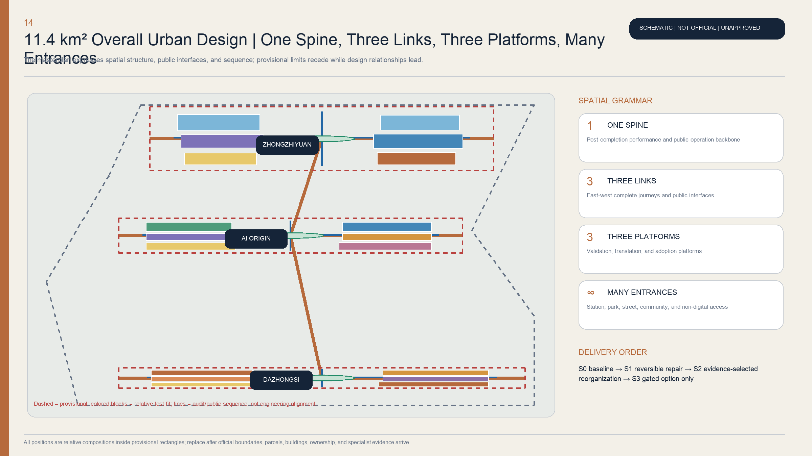

> **How to read the figure.** Begin with the vertical copper dashed line: it is the public-realm operating spine to be audited segment by segment. Then compare the three enlarged key areas as validation, translation, and adoption settings. Colored building blocks are typological capacity tests, not existing footprints. No alignment, intensity, or retain/adapt/demolish status in this drawing can directly enter engineering.

## Detailed Design of Key Areas

**Chapter conclusion: the three key areas occupy different positions in one innovation-maturity chain, so they must specialize rather than copy three “AI parks.”**

The three key areas are not three identical AI parks; they are three "reciprocity platforms" along the innovation-maturity chain. Their polygons are temporary rectangles from the repository and serve only indexing and discussion. Every spatial action below must be sited after official boundaries and site information become available [source:KEY-AREA-SOURCE] [depth:three_key_area_detailed_design].

To avoid a master plan with no implementation depth, each key area answers the same six review questions: how industry functions are arranged; how people enter public space; how station–park–street journeys connect; how building types and intensity are tested; how existing buildings enter R-A-I; and what conditions stop the proposal. Values in these drawings are `conceptual_design_output` recalculated from provisional polygons and typological envelopes for sensitivity comparison only. Announced approximate areas and test-fit values are recorded separately; test-fit intensity cannot be extrapolated into statutory development volume [metric:announced_key_area_scope_sqm] [metric:schematic_section_count].

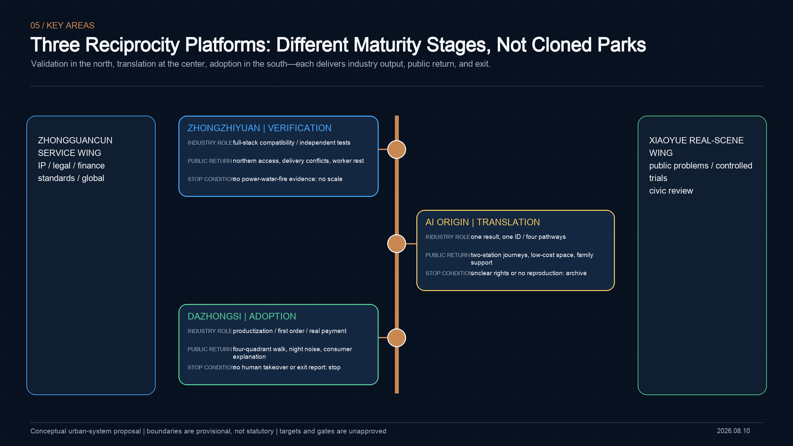

> **How to read the figure.** The three key areas do not duplicate one kind of park. The north asks whether technology can be independently validated, the centre asks how an outcome should choose a transfer path, and the south asks whether a product is genuinely adopted. Each states an industrial task, a public return, and a stop condition. The provisional rectangles are indexes, not project boundaries.

### Zhongzhiyuan: Validation-Return Platform

Zhongzhiyuan is positioned as a platform for full-stack adaptation, independent evaluation, and safety governance across chips, frameworks, models, agents, and terminals. Its first batch is not a new large computing center, but a shared validation catalog, booking system, standardized reports, isolated testing, and equipment circulation. Each enterprise validation must also deliver a publicly shareable compatibility conclusion, risk boundary, or standards recommendation [data:geometry/key_areas.geojson#PROV-KEY-001] [metric:reproducibility_pass_rate].

The urban return is connection performance for the built public realm in the northern section: a candidate connection to Xuezhiyuan Station, Fifth Ring Road detours, conflicts between park deliveries and walking or cycling, safety along the Qinghe–Xiaoyue River system, shade, and rest for service workers. Whether Qinghe Station lies inside the formal scope remains subject to the official polygon. Cross-Fifth-Ring bridges or tunnels, riverbank works, and centralized compute cannot be assumed in advance.

The spatial sequence is “validation spine–test court–public edge.” Shared validation and isolated testing sit along an internal service spine; embodied tests occur only in a controllable, restorable test court; the Jing-Zhang and everyday-life edge supplies non-commercial rest, drinking water, shade, and staffed explanation. Six typological envelopes cover shared laboratories, incubation and R&D, community services, and offices. Test-fit FAR is approximately 1.52, with a proposed sensitivity band of 1.5–2.6 and stepped heights of 12–45 metres. These values test whether a low public edge can coexist with medium-to-high R&D capacity; they are not regulatory controls [metric:zhongzhiyuan_ai_acceleration_area_schematic_far] [data:geometry/buildings.geojson#BLDG-ZHONGZHIYUAN-AI-ACCELERATION-AREA-LAB-A].

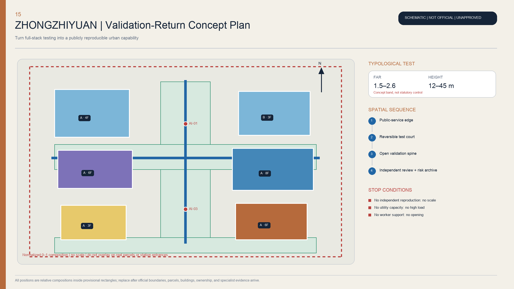

> **How to read the figure.** Enter from the public edge, then move toward shared validation and controlled testing. Building colors denote types; numbers denote unapproved floor and height bands. Existing buildings have not been surveyed, so every envelope remains “awaiting building-by-building survey.” If the Fifth Ring, river, rail protection, power and cooling, or public-access conditions remain unclear, the proposal retains only light-asset indoor validation and does not advance cross-corridor works, riverbank works, or centralized compute.

### AI Origin Community: Translation and Co-Creation Platform

The AI Origin Community is positioned as a unified portal for translating university and research-institute outcomes from zero to one. Each outcome receives an identifier, then passes through a 30-day ownership and demand screen, a 90–180-day proof of concept, and independent validation by non-interested parties. It is then routed toward an open-source public good, technology licensing, joint R&D or collaborative innovation procurement, or a new enterprise. Not every outcome needs to become a startup or raise financing [data:geometry/key_areas.geojson#PROV-KEY-002] [source:MOF-COLLABORATIVE-PROCUREMENT-202404].

Spatial priorities are complete journeys between the two stations, low-cost project rooms, staffed talent services, family friendliness, and public learning. Approximately 1,900 non-motorized-vehicle parking spaces at Qinghua East Road West Exit and Liudaokou are planned supply under an approved project; they are not counted as existing before completion, nor claimed again by this proposal. Campus gates, venues, and intellectual property must be negotiated item by item; "campus–city integration" does not imply access.

The spatial sequence is “knowledge spine–translation court–everyday edge.” Outcome intake, public learning, and technology-transfer services share a legible ground-floor interface; project rooms and controlled proofs of concept surround a translation court; family services, small merchants, quiet rest, and staffed accessibility support occupy the everyday edge. Six typological envelopes cover learning, R&D, incubation, mixed services, community retail, and talent support. Test-fit FAR is approximately 1.87, with a proposed sensitivity band of 1.5–2.5 and heights of 12–36 metres. The objective is not maximum intensity but whether open ground floors, campus boundaries, and two-station access can coexist [metric:beijing_ai_origin_community_schematic_far] [data:geometry/buildings.geojson#BLDG-BEIJING-AI-ORIGIN-COMMUNITY-EDU-A].

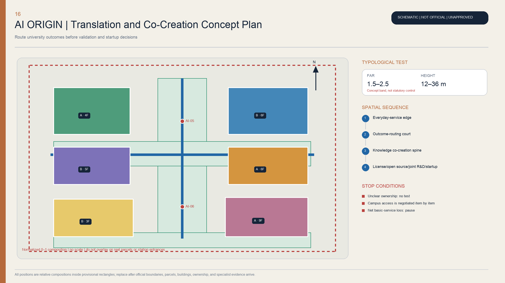

> **How to read the figure.** The centre is not a startup showroom; it places ownership, problem matching, validation, and four translation paths in one explainable sequence. The outer edge protects everyday movement between campuses, communities, and stations. Without written evidence on gate access, parcel tenure, Qinghuayuan heritage controls, fire and sunlight, or tenant return, only reversible indoor adaptation and service pilots are allowed.

### Dazhongsi: Adoption-Return Platform

Dazhongsi is positioned for productization, launch, and real paid adoption of agents, terminals, content, and AI-enabled consumer services. It is not a permanent brand showroom, but an urban adoption fair with public rules, trial periods, consumer explanations, human takeover, and exit reports. Government subsidies and contracts with related enterprises are excluded from external paid conversion [data:geometry/key_areas.geojson#PROV-KEY-003] [metric:paid_conversion_rate_12m].

The spatial task is a complete journey linking usable entrances of Dazhongsi metro Lines 12 and 13, the four quadrants, key parcels, and park and community services, while accounting for buses, cycling, ride-hailing, deliveries, night-time noise, and rainstorm conditions. Facilities inside a station do not prove accessibility outside it. Underground connections and bridge alignments require rail-protection, transport, flood-control, ownership, and engineering feasibility reviews.

The spatial sequence is “adoption spine–four-quadrant court–quiet edge.” Launch trials, procurement clinics, consumer explanation, and human takeover occupy the adoption spine; the four-quadrant court hosts only time-limited real adoption with exit reports; the residential and cultural side provides a quiet, low-light, low-device-dependence public edge. Six typological envelopes cover productization offices, mixed adoption, food and retail, cultural public services, and community services. Test-fit FAR is approximately 2.02, with a proposed sensitivity band of 2.0–3.5 and heights of 12–45 metres, testing whether a mixed rail gateway and a culturally quiet edge can coexist [metric:dazhongsi_ai_industry_cluster_schematic_far] [data:geometry/buildings.geojson#BLDG-DAZHONGSI-AI-INDUSTRY-CLUSTER-CUL-A].

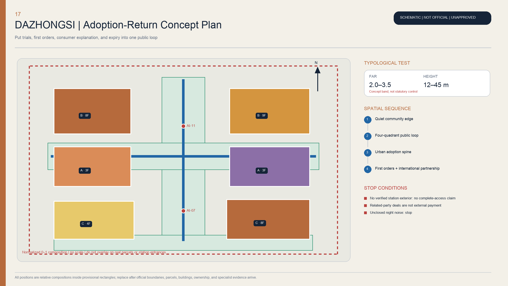

> **How to read the figure.** First audit the complete four-quadrant journey through station exits, crossings, cycling, deliveries, and rainstorm alternatives; then test whether the adoption fair conflicts with the cultural public edge. Any underground connection, bridge, fixed exhibition, or added volume requires separate rail-protection, flood-control, heritage, noise, tenure, and consumer-protection review. If these gates fail, the adoption fair retreats to short-term indoor trials.

## AI Innovation Ecosystem, Personas, and AI+ Scenarios

**Chapter conclusion: AI becomes an urban scenario only when it is tied to a real public problem, an accountable owner, human takeover, and exit; “talent” cannot override other people's everyday rights.**

### Eight Rights-Holder Groups

This proposal upgrades "personas" into rights-holder groups: long-term residents and older adults; children and caregivers; people with mobility, visual, hearing, or cognitive disabilities; cleaning, security, landscaping, retail, and food-service employees; couriers, food-delivery riders, and other workers in new forms of employment; students, researchers, and international communities; small businesses, tenants, and community-service organizations; and startup teams, enterprises, and cultural visitors. Every average indicator must also report night-time conditions, extreme weather, and the least favorable 10% of journeys. "Talent demand" cannot override other people's everyday rights [source:BEIJING-ACCESSIBILITY-REGULATION-2021] [source:HAIDIAN-CHILD-FRIENDLY-2023].

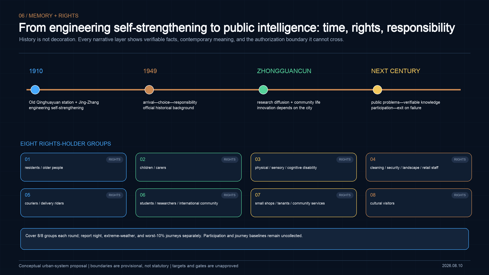

> **How to read the figure.** The timeline explains why “century-old Jing-Zhang” cannot be reduced to nostalgic landscaping: engineering autonomy, public responsibility, Zhongguancun innovation, and future public intelligence must form a causal story. The eight groups on the right test who is visible, who bears costs, and who can refuse or appeal. They are not population statistics; actual group sizes await survey evidence.

### Twelve Scenario Cards

| # | Scenario | Space / users | Role of AI | Human-control and exit boundary |
| --- | --- | --- | --- | --- |
| AI-01★ | Full-stack interoperability validation | Zhongzhiyuan; engineering teams | Orchestrates cross-chip and cross-model tests and difference reports | Third-party reproduction; isolated environment; failures do not trigger expansion |
| AI-02★ | Model-safety and red-team court | Zhongzhiyuan; developers and public representatives | Generates attack cases and risk lists | Safety lead signs off; no connection to real sensitive systems |
| AI-03★ | Accessible embodied-testing street | Controlled hours in northern and central sections; users with disabilities | Simulates conflicts involving low-speed robots | Users are paid for participation; an on-site safety officer can stop the system at any time |
| AI-04★ | Collaborative innovation procurement clinic for public problems | Two Wings; procuring entities and SMEs | Supports market research, demand classification, and evidence lists | Fiscal and legal review; designated suppliers are prohibited |
| AI-05 | Navigation for university-outcome pathways | AI Origin; researchers and technology-transfer teams | Matches open-source, licensing, R&D, or startup pathways | Does not automatically determine ownership, investment, or eligibility |
| AI-06 | Talent and complete labor-market services | AI Origin and Two Wings; technical and service workers | Aggregates public jobs, training, and staffed service windows | Reports contracts, social insurance, and retention; does not collect irrelevant resumes |
| AI-07 | Complete station–park–street journey | Three key areas; commuters, children, older adults, and people with disabilities | Identifies detours, waits, and alternatives during failures | Site walks and professional transport review; non-digital wayfinding |
| AI-08 | Cool-route and rainstorm-safety navigation | Entire corridor; outdoor workers and visitors | Aggregates shade, drinking water, heat refuge, closures, and alternative routes | Warnings and on-site management take priority; no individual trajectory retention |
| AI-09 | Traceable Jing-Zhang cultural guide | Confirmed open sections; residents, students, and visitors | Interprets engineering, revolutionary, scientific, and everyday history by source | Curatorial review; paper or staffed alternative; corrections supported |
| AI-10 | Essential-service gap assistant | Communities and parks; residents and service workers | Aggregates actual opening hours and service baskets | Internal facilities are not counted as public supply; human verification |
| AI-11 | Dazhongsi urban adoption fair | Southern platform; enterprises, consumers, and residents | Aggregates trial evidence and feedback from different groups | Public agenda, appeals, consumer rights, and exit at expiry |
| AI-12 | Public-intelligence deliberation register | Entire belt; eight rights-holder groups | Clusters comments and shows differences in adoption and unresolved evidence | Retains original comments; people decide; withdrawal supported |

★ marks four industry testing and validation scenarios. All 12 are conceptual recommendations and do not indicate that venues, data, procurement, or operations have been approved [metric:scenario_card_count] [metric:industry_validation_scenario_count].

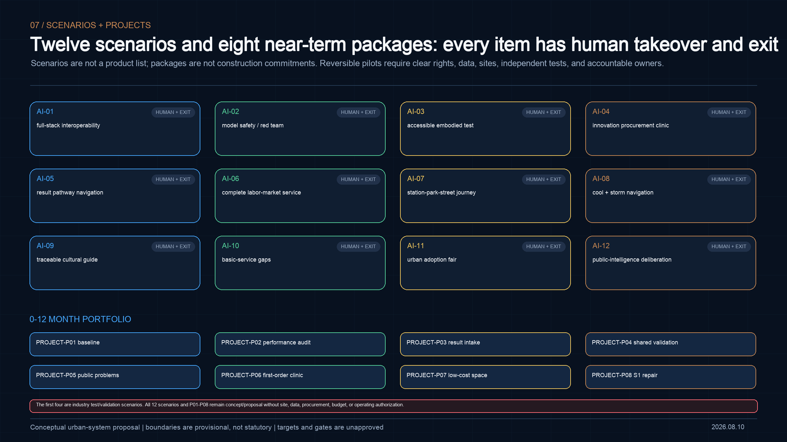

> **How to read the figure.** Every AI scenario must begin with a public problem and state human takeover, a non-digital alternative, and exit. The near-term projects below supply the baseline, site, validation, and operating conditions. The number of scenarios describes proposal coverage; it does not mean that twelve systems should launch at once.

All data scenarios apply five questions: Who proposed the problem? Who provides the data? Who bears the consequences of error? Who may refuse? Who can stop the system? Authorization of public data follows Beijing's unified municipal administration and authorization agreements; the area does not independently declare a "right to operate data assets." Every scenario must provide a non-digital alternative, human takeover, version records, data export and deletion, and spatial restoration [source:BJ-PUBLIC-DATA-AUTH-202607].

### Six-Step Public Participation and Four Equity Floors

Public participation is not an online vote after the plan is complete. It runs through project selection, trial, and exit: first publish the problem, available evidence, and what cannot be promised; then conduct joint walks with residents, disabled people, caregivers, service workers, merchants, and professionals; compare at least the status quo, a light intervention, and a stronger intervention; test a removable pilot before permanent construction; evaluate it with affected people; and publicly explain whether each valid comment was adopted, partly adopted, rejected, or held for evidence, together with the exit arrangement. Telephone, paper, staffed, and online channels must coexist; QR codes, smartphones, and facial recognition cannot be mandatory [source:BEIJING-URBAN-RENEWAL-REGULATION-2022].

Four equity floors come before commercial upgrading. First, no irreversible demolition or alteration without baselines for residents, tenants, small merchants, and rent impacts. Second, pause upgrading when breakfast, groceries, pharmacies, childcare, eldercare, repair, or delivery services decline without an equivalent replacement. Third, public space must retain free hours, quiet areas, and non-commercial places to stay without consumption, tickets, or an app. Fourth, digital services must explain data necessity, retention, deletion, and human takeover. There is currently no evidence that the project area has already experienced gentrification; these are preventive gates, not findings about current conditions.

## Land Use, Building Scale, and Retain-Renovate-Demolish Strategy

**Chapter conclusion: until official parcel, building, and ownership evidence arrives, the proposal commits only to recalculable capacity relationships and the sequence “retain first, adapt second, infill last.”**

Four conceptual capacity layers fully cover the provisional site: research and validation, public access and green space, industrial and business services, and community and everyday services. Layer areas are recalculable results of design geometry with low-to-medium confidence. They answer how functions should be placed near one another, not which parcel should change use [data:geometry/land_use.geojson#LU-004] [metric:conceptual_land_use_coverage_ratio].

`buildings.geojson` now registers 18 typological test-fit envelopes and approximately 6.340 million m² of test-fit floor area to recalculate relative capacity and section relationships in the three key areas. Its records are `value_role=conceptual_design_output` and `approval_status=not_approved`; they must not be read as existing stock or construction volume. A formal retain/adapt/demolish strategy still requires building-by-building footprints, heights, uses, dates, structural safety, ownership, leases, energy, fire safety, heritage, and construction status. Until those data arrive, all 18 envelopes remain “awaiting survey”; no building is decided for retention, adaptation, demolition, or infill [metric:total_floor_area_sqm] [metric:address_verified_building_coverage_baseline] [depth:development_intensity_controls].

### Two Representative Sections and Building-by-Building R-A-I Decisions

Section A tests the transverse relationship among public spine, shared ground floor, R&D or validation volume, and the everyday community edge. Section B tests the longitudinal relationship among station or park gate, walking/cycling and loading, public court, and mixed-service volume. Both make continuous accessibility, shaded rest, fire-service and maintenance access, and a usable public ground floor prerequisites; building height is only a stepped pressure test. R-A-I is not three pre-colored outcomes. Retain first tests tenure, leases, structure and fire safety, energy, heritage, and existing public value. Adapt then tests reversibility, tenant return, accessibility, and energy benefit. Infill is studied only when the first two cannot deliver the public task and all professional gates pass. Demolish is not an automatic fourth category; any demolition needs a separate necessity, relocation, embodied-carbon, and waste case.

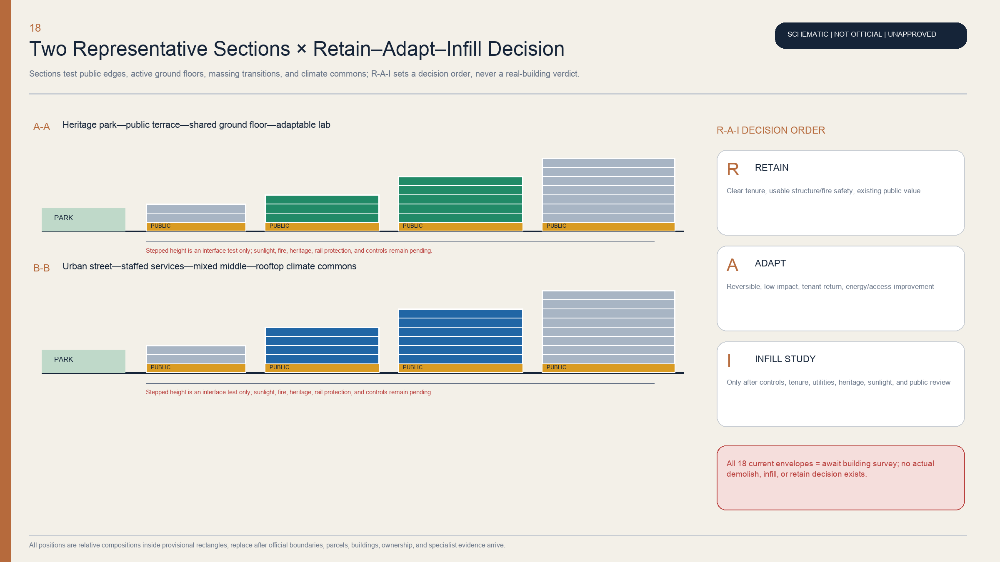

> **How to read the figure.** Sections on the left test only public interfaces, building heights, and service-space relationships. The sequence from R to A to I on the right raises the evidence threshold. The red box carries the decisive message: all 18 envelopes await building-by-building survey and no actual construction decision exists. Once official parcels, controls, rail protection, heritage, and existing buildings arrive, every envelope must be replaced and intensity, sunlight, fire safety, utilities, and public return recalculated.

Spatial supply uses three price and duration tiers: open shared desks, three-to-six-month project rooms, and growth space after customer, employment, and compliance thresholds are met. Where an operator controls space, the proposal recommends first testing no less than 20% of effective low-cost workstations or time slots. Actual area, duration of use, and comparison rents must be audited so that subsidies are not absorbed by landlord rent increases. This share is an operating-trial target, not a statutory provision requirement.

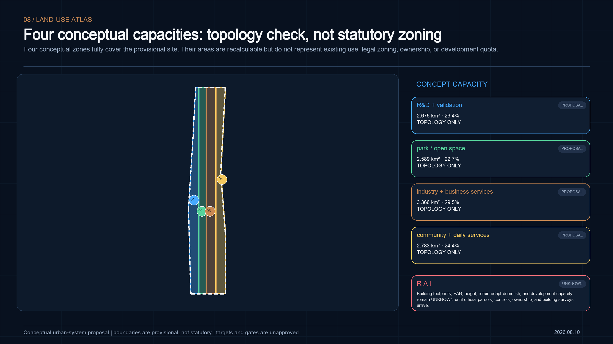

> **How to read the figure.** The four colors show only how research and validation, public open space, industrial services, and everyday community life could adjoin one another, and whether the provisional scope is fully covered. They are not existing land use, statutory planning, ownership, or development intensity. Without formal parcels and building evidence, they do not determine retention or demolition.

## Transport, Rail, Municipal Infrastructure, and Public Services

**Chapter conclusion: mobility performance is judged through a person's complete journey from inside the station to the destination and back, not by a station radius, equipment counts, or an in-station facility list.**

### Begin with Three Representative Journey Audits

These are audit scripts to be carried out, not invented claims about current routes, volumes, or travel times. The northern journey follows a service worker through stopping, entrance, workplace, drinking water, rest, toilet, charging, and return. The central journey follows a caregiver and a disabled user through rail, exits, crossings, public space, and staffed help. The southern journey follows an older person or cultural visitor from a community and the area outside Dazhongsi Station to a park or museum branch and back. Each is checked during weekday peaks, weekends, night, extreme heat, and heavy rain, recording lift failure, obstruction, detour, paper wayfinding, and human alternatives. No minutes are assigned until field evidence exists [source:BEIJING-ACCESSIBILITY-REGULATION-2021] [source:BJ-SUBWAY-ACCESSIBILITY-202608].

Mobility shifts from station circles to complete journey chains: carriage and platform → concourse → entrance → crossing → bus, bicycle, or walking connection → entrance to a park, employment campus, university campus, or community. Operator accessibility lists for stations such as Wudaokou and Dazhongsi can prove only registered facilities inside stations, not continuous accessibility within 500 metres outside them [source:BJ-SUBWAY-ACCESSIBILITY-202608] [depth:traffic_rail_slow_parking].

For each station, the proposal records three states: current, during Line 13 construction, and after completion. It verifies entrance opening, bus connections within 50 metres, non-motorized-vehicle parking within 100 metres, taxis and ride-hailing, deliveries, and alternatives during rainstorms or lift failures. New bus routes are not drawn in advance. A feeder service enters study only when actual network walking exceeds 800 metres or a major barrier exists, stable demand persists over multiple consecutive days, existing stop locations or service frequencies cannot address it, and lawful operating conditions are available.

Cross-corridor access uses the detour index `DI = actual lawful network distance / straight-line distance between endpoints`. Only locations with high DI, high demand, clear public benefit, and no conflict with works under construction enter S2. At gated campuses and employment parks, the first studies address shared gate zones, staggered opening, and clearly marked alternatives; a conceptual diagram does not authorize wall removal. Lines in `roads.geojson` represent only audit origins and destinations and conceptual relationships, not engineered roads [data:geometry/roads.geojson#MOB-X-002] [metric:detour_index_reduction].

Public services are calculated through 5-, 10-, and 15-minute baskets based on real entrances and opening hours: toilets, drinking water, shade, first aid, and parking; breakfast, food shops, healthcare and pharmacies, childcare and eldercare, repairs, parcel services, and exercise; and cultural, sports, integrated, and industrial services. Facilities inside universities or enterprises do not count as supply if they are not open to the public, while facilities usable only through an App do not count as complete coverage [source:HAIDIAN-DISTRICT-PLAN-2035] [metric:basic_service_coverage_15m].

Municipal systems use a "minimum facility package": rated and peak electricity, water supply and drainage, communications, fire safety, maintenance access, noise, heat discharge, metering, maintenance, and decommissioning. Safety-related scenarios must be able to degrade safely in 100% of power or network outages, while non-critical AI can shut down. Values without capacity evidence remain unknown; an equipment list cannot stand in for infrastructure planning [data:geometry/constraints.geojson#CONSTRAINTS-UNKNOWN] [metric:safe_degradation_rate].

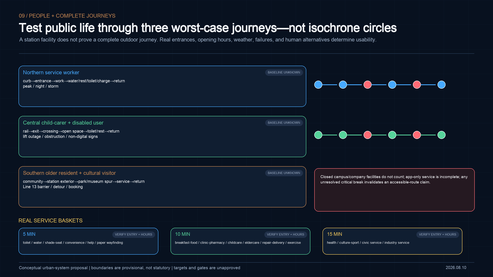

> **How to read the figure.** Follow each journey through train or platform, station exit, crossing, transfer, destination, and return rather than reading a station-radius circle. Toilets, drinking water, rest, first aid, and human help count only when they are genuinely open, affordable, available without a mandatory app, and usable during the least favorable time window.

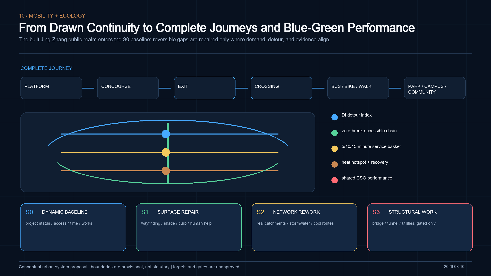

> **How to read the figure.** The left side distinguishes four implementation depths: current and construction baseline, reversible repairs, network reorganization, and structural works. The right side puts access, heat, stormwater, and services into one journey. The proposal prioritizes baselines and reversible repairs; structural works enter study only after all professional conditions are met.

## Blue-Green Network, Public Space, and Urban Character

**Chapter conclusion: blue-green space is not another axis; it must separately secure public access, hydrological safety, and habitat while bringing cultural memory into everyday operations.**

The blue-green system changes from "one axis" into three performance networks. The public-access network checks lawful entrances and opening hours; the hydrological-safety network checks catchments, drainage networks, CSOs, low points, and high river levels; the ecological-habitat network checks trees, native plants, birds and insects, dark zones, and breaks in movement. Jing-Zhang Phase II and the Qinghua East Road project enter the S0 overlay; this proposal is responsible only for connections and performance that remain unproven [data:geometry/green_space.geojson#GREEN-001] [depth:blue_green_public_space].

The Qinghe–Xiaoyue River system and the CSO project under construction should share catchment divisions, overflow outlets, construction sequencing, and monitoring interfaces, with source reduction taking priority over building another landscape pond. Any sunken green space, waterside platform, underground space, or bank structure must first obtain river and lake management lines, flood levels, drainage networks, soil and groundwater information, and a water-impact assessment. The promotional phrase "clear water and green banks" cannot be written as water-quality performance [source:BEIJING-FLOOD-PLAN-202504] [metric:cso_performance_delta].

For priority journeys during hot weather, the proposal sets directional targets of at least 70% continuous shade, a 10°C reduction in mean radiant temperature at heat hotspots under comparable conditions, and drinking water, seating, or indoor heat refuge every 300–500 metres. These are not statutory indicators and require summer and winter measurement, tree-growth review, lighting and security checks, and maintenance verification. Winter checks must also cover snow accumulation, icing, wind corridors, and responsibility for snow removal [source:BEIJING-HEAT-PLAN-202405] [metric:shade_continuity_target].

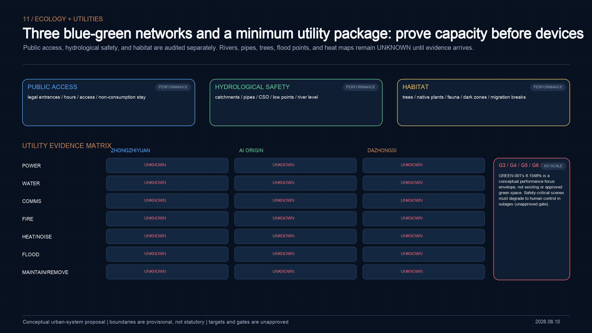

> **How to read the figure.** Public access, hydrological safety, and habitat are three different networks; “more green” cannot substitute for any of them. The utility matrix on the right requires every AI scenario to answer for electricity, water, communications, fire safety, heat, noise, flood resilience, and maintenance. A proposal with unknown capacity or greater downstream risk cannot scale.

### Public-Space Component Library: Common Rules, Evidence-Based Combinations

The library is not a procurement catalogue and does not pre-select sites. It breaks recurring public needs into minimum units that can be removed, changed, and maintained. The north–south public spine selects components according to complete journeys; east–west access combines them around station exits, park gates, community gates, and cross-barrier problems. Every component begins as paper guidance or a 90-day pilot; “standardization” cannot bypass tenure, heritage, parks, transport, water, fire, or accessibility review.

| Component | Minimum contents | Location and responsibility | Stop / fallback condition |
| --- | --- | --- | --- |
| Everyday entrance kit | Opening hours, paper map, staffed help, seating/water referral, night and construction alternatives | Verified station exits, park gates, and community gates; site operator updates daily | If entrance or alternative is unverified, publish known information only and do not claim connection |
| Complete-journey kit | Crossing guidance, cycling parking/loading order, accessibility-break markers, return-trip information | Transport/site responsibility holders and users conduct joint walks | Do not draw unapproved roads, bridges/tunnels, or station-exterior works |
| Cool and wet-weather kit | Movable shade, seating, drinking-water/heat-refuge referral, rainstorm closure and ponding detour signs | Parks, site, and emergency parties maintain for summer and winter conditions | Remove temporary facilities if tree, habitat, hydrology, or evacuation risk remains unresolved |
| Service-worker back-of-house kit | Rest, drinking water, charging, storage, toilet, and staffed-help referrals | Employer, property, and public-service providers share responsibility; volunteers are not substitutes | Do not open if service hours, cleaning, fire, or labor responsibility is unclear |
| Reversible test-court kit | Ground markings, soft separation, physical stop, on-site safety officer, non-digital explanation, restoration checklist | Scenario owner is responsible, independent party accepts, and the public can call stop | Stop for missing authorization/baseline, unsafe degradation, or failed restoration |
| Public-question desk kit | Original problem, evidence status, unresolved comments, paper/telephone entry, owner and reply date | Community secretariat maintains; independent complaints channel closes cases | Pause if AI summary replaces originals, comments are deleted, or no accountable owner exists |
| Culture and recognition kit | Large text, audio/transcript, source code, and propose–test–review–adopt–stop status | Content, heritage, copyright, and accessibility parties jointly sign | Remove for missing source/copyright, unapproved fixed device, or ranking by financing/exposure |
| Quiet and restoration kit | Free hours, quiet zone, light/sound limits, back-of-house labor, installation/removal and restoration record | Event/site operator publishes calendar; resident channel verifies independently | Reduce or cancel if tactile paths, rest, toilets, emergency access, or night-time quiet is harmed |

Component performance is not scored by installation counts. It is judged by complete-journey continuity, availability in least-favourable periods, closed maintenance and complaints, and spatial restoration after removal. Before field and authority confirmation, component diagrams express performance interfaces only—not product models, engineering details, or government procurement.

### Cultural Narrative and Three Non-Spectacle Landmarks

The overarching cultural theme is "**From Engineering Self-Reliance to Public Intelligence**." The 1910 Qinghuayuan Station and the Jing-Zhang Railway represent engineering autonomy; the 1949 arrival at Qinghuayuan carries a history of public responsibility; Zhongguancun's evolution from the diffusion of research outcomes and Electronics Street to Science City shows that innovation depends on communities. The AI culture of the next century is centered on public problems, verifiable knowledge, public participation, final human judgment, and the ability to exit after failure [source:QINGHUAYUAN-HISTORY-2021] [source:ZHONGGUANCUN-MUSEUM-2025].

The three pilgrimage and honor landmarks are operating institutions rather than large buildings. Near Qinghuayuan, the "**First Journey: Responsibility Archive**" uses only low-impact content approved through heritage review to tell stories of arrival and responsibility. At AI Origin, the "**Public-Problem Ring**" displays who raised each problem, its evidence, and unresolved comments. At Dazhongsi, the "**Centennial Reciprocity Clock**" shows the next human-review and exit dates for each trial without loud sound. In the absence of competent-authority drawings, copyright clearance, property rights, and operating agreements, these remain digital or paper prototypes and are not fixed in place [source:QINGHUAYUAN-CONTROL-2026] [source:DAZHONGSI-MUSEUM-2022].

Wayfinding uses rails, sleepers, mileage, and signals as an abstract grammar, avoiding historicist replicas and enterprise advertising. Every honor entry distinguishes six states—proposed, tested, reviewed, adopted, implemented, and stopped—and permits withdrawal and correction. Rankings are not based on donations, enterprise scale, financing, or media exposure.

## Renewal Projects, Implementation Policy, and Phasing

**Chapter conclusion: the first 0-12 months should deliver baselines, rules, joint walks, and reversible trials; scale-up waits for evidence, authority, funding, and long-term responsibility.**

### Eight Near-Term Project Packages

| ID | Project package | Proposed lead (not approved) | Deliverables in months 0-12 | Scale-up threshold | Exit action |
| --- | --- | --- | --- | --- | --- |
| P01 | 43.6 km² baseline for economy, employment, rents, and businesses | PMO + statutory data owners | Address-level de-identified data dictionary and public aggregate version | Lawful authority and disclosure of coverage and missingness | Delete unauthorized data |
| P02 | Post-completion performance audit of Jing-Zhang | PMO + competent authorities + independent evaluator | Four transects, multiple time periods, complete journeys, heat and stormwater, and maintenance logs | Consistency between site findings and competent-authority information | Retain an issue register; do not initiate works |
| P03 | Unified portal for university outcomes | Universities + PMO + rights/data review | One identifier per outcome, four pathways, and four gates | Ownership, users, and independent validation | Archive failures and refer teams onward |
| P04 | Zhongzhiyuan shared validation platform | Zhongzhiyuan operator + independent evaluator | Testing catalog, booking, unified reports, and a proposal for 15 cross-stack validation exercises | Reproduction and whole-life cost | Migrate equipment data and generalize systems |
| P05 | Xiaoyue River public-problem challenge | Scenario platform + public owner + community representatives | Public problems each quarter, minimum data, and short-cycle tests | Venue and data authorization, plus human takeover | Delete data and restore space |
| P06 | First-order and procurement clinic | Dazhongsi platform + procurement/IP/legal review | Demand routing, market research, and IP and risk clauses | Procurement authority, competition, and conflict-of-interest review | Stop non-compliant requests |
| P07 | Low-cost space and retention of essential services | Operator + PMO + business/community representatives | Tiered workstations, a service list, and rent and business baselines | Subsidies are not absorbed by rent and services do not decline on net | Taper support and make transition arrangements |
| P08 | S1 rapid repairs in the three key areas | Facility authority + PMO + independent evaluator | One set each of wayfinding, shaded rest, curb reorganization, and staffed windows | 90-day evidence on safety, equity, and use | Damage-free removal and a public retrospective |

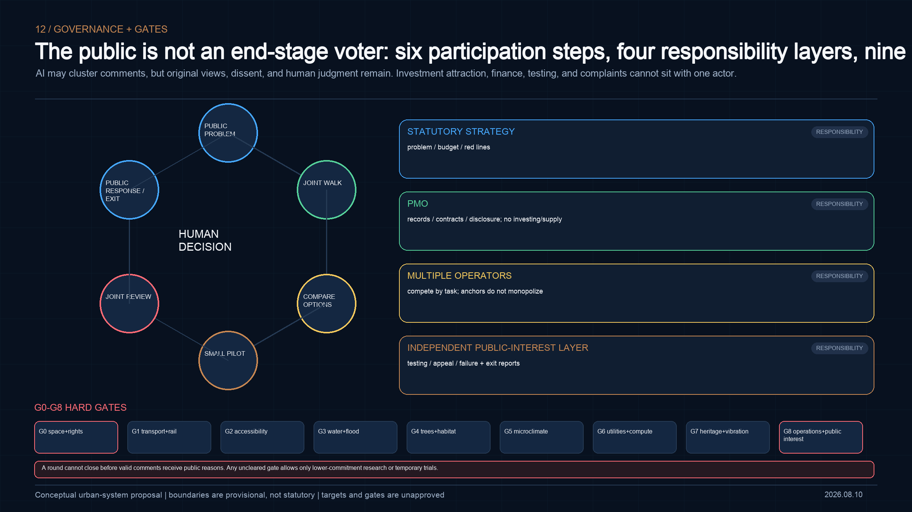

> **How to read the figure.** The six steps on the left are not a one-off consultation: they move from a public problem through joint walks, option comparison, a small trial, joint evaluation, and a public response or exit. The centre separates statutory responsibility, project management, operations, and independent evaluation. The nine gates on the right determine whether work may move from research to construction or long-term operation.

The governance recommendation has four levels: a strategy and public-responsibility level with statutory authority; an innovation-belt PMO that neither makes equity investments nor serves as a supplier; multiple operators that obtain tasks through compliant procedures; and an independent public-interest and evaluation level composed of representatives for technical safety, data ethics, accessibility, labor, and communities. A fund manager cannot determine scenario access for portfolio companies, a supplier cannot control complaints or original evaluations, and an operator cannot be the sole evaluator of every project [source:BJ-GOV-INVESTMENT-FUND-202501] [depth:renewal_project_list].

Four accounts are kept strictly separate. The public-product account pays for baseline registers, accessibility, safety, and independent evaluation. The operating-services account pays for personnel, property operations, and maintenance. The equity-fund account invests in enterprises only under the fund charter. Revenue from public-data products may be used only under municipal authorization agreements. Low, base, and high scenarios for three years of light-asset operations are approximately CNY 179 million, CNY 328 million, and CNY 744 million, explicitly excluding land, construction, rent, computing hardware, equity capital, and general enterprise subsidies. These values are a sensitivity model, not a fiscal commitment [metric:three_year_operating_scenario_cny].

The three-year sequence is as follows: during months 0–6, establish baseline registers, rules, and the first set of problems; during months 7–12, complete the proposed 15 short-cycle pilots; in Year 2, form a cross-hub service network; and in Year 3, decide whether to scale, exit, or restructure based on paid conversion, cost, public value, and completeness of exit. The recommended operator contract uses `1+1+1`-year performance renewals and does not create de facto permanent authorization [data:geometry/phasing.geojson#PHASE-S1] [depth:phasing_implementation].

Annual culture and innovation activities do not create another costly festival IP. Instead, they are embedded in a cycle of "spring public problems, summer controlled validation, autumn urban adoption, and winter public retrospective." Any occupation of public space must publish its calendar, free hours, quiet zones, accessibility, and setup, removal, and restoration arrangements. An activity may not proceed without passing heritage, safety, copyright, and residents' right-to-quiet reviews.

### Reciprocity Seasons, the Developer Commons, and Agent.6 Long-Term Operations

Agent.6 is not “one annual conference,” but operating infrastructure that repeatedly connects problems, teams, sites, evidence, first orders, and exit. The parent brand **RECIPROCAL JING-ZHANG** expresses the overall compact between innovation inputs and public return; the annual sub-brand **RECIPROCITY SEASONS** supplies the operating rhythm only: Open Questions in spring, Controlled Testing in summer, Public Adoption in autumn, and Open Review in winter. All seasons share project identifiers, and failures, pauses, withdrawals, and unresolved objections are retained alongside successes. The brand, dates, organizers, partners, and budgets are all `not_approved` and must not imply government endorsement [source:AGENT-TASKBOOK] [metric:annual_event_cycle_stage_count].

| Operating layer | How it works | Responsibility | Entry / stop condition |
| --- | --- | --- | --- |
| Reciprocal Builders Network | Five member groups—problem and community participants, development/research teams, maintainers and independent evaluators, public-interest reviewers, and international visiting contributors—maintain problems and projects together | Public responsibility layer sets boundaries; community secretariat manages registers; technical maintainers manage versions; independent public-interest group evaluates | Fees, prestige, financing, or sponsorship do not buy sites, data, procurement, honors, or exemptions; undisclosed conflicts trigger suspension |
| Scenario access | Publish the problem first, then complete eight steps: application; problem/authority match; data, safety, and equity screen; sandbox/red-team plan; time-boxed pilot; independent acceptance; conversion decision; and exit/restoration | Scenario owner retains sector responsibility; PMO checks completeness; each competent party authorizes separately; suppliers cannot self-evaluate | Required authorization gap must be 0; success criteria cannot change during testing; no exit package means no closure [metric:required_authorization_gap_max] |
| Monthly and weekly operation | Monthly problem/authority review, independent review, operating/budget ledger, and public response; weekly evidence maintenance, problem clinic, developer workbench, rights review, acceptance/conversion, and weekend public route | Operators roster staff, independent layer samples, and human/telephone/paper channels coexist with online channels | Reduce, relocate, or cancel when the free mainline, tactile path, toilets, emergency access, or residents' quiet is unacceptably impaired |
| Annual review | Publish genuine adoption, payment, and employment together with failures, incidents, complaints, deletion/migration, spatial restoration, and next-round problems | PMO compiles, independent layer verifies, competent authority decides renewal, re-procurement, or exit | Exposure, attendance, expressions of interest, subsidy, and related-party transactions do not count as adoption or first orders |

The three non-spectacle landmarks are daily positions and service agreements, not one-off devices. The **First Journey · Responsibility Archive** covers historical evidence, copyright, and multi-format interpretation; the **Public Questions Ring** preserves original comments, unresolved disagreements, and a staffed window; the **Centennial Reciprocity Clock** displays only project status, next human-review date, and exit date. With one segment-verified public route, their annual light-asset conceptual operating budget totals CNY 4.0–6.8 million, excluding land, leases, permanent construction, municipal works, major equipment, and heritage works. Both low and high scenarios are low-confidence, `not_approved` estimates and are not mechanically apportioned from the equity fund or three-year total budget [metric:agent6_landmark_annual_budget_low_scenario] [metric:agent6_landmark_annual_budget_high_scenario].

The shared SLA has three levels. P0 personal-safety, serious-data, critical-accessibility, or heritage risk causes immediate shutdown, a staffed response within 15 minutes during public hours, and a status notice within 2 hours. P1 equipment or sole-entry failure receives a response within 2 hours and a paper or staffed alternative within 4 hours. P2 corrections to history, translation, attribution, or ordinary service are acknowledged within 1 working day and normally resolved within 10 days with version history retained. Locations, staffing, and time limits still require confirmation through site, professional-responsibility, and procurement contracts.

The public experience route is accepted segment by segment: pre-trip information; arrival from station interior to street; the First Journey archive; the Public Questions Ring; the Centennial Reciprocity Clock; and a night-time or extreme-weather return. Qinghuayuan Station, the Dazhongsi Ancient Bell Museum, the Zhongguancun Village History Museum, universities, and unopened sections become optional branches only after opening, booking, accessibility, copyright, heritage, tenure, and cooperation are separately confirmed. If a critical break remains, shorten the route and publish an alternative; never describe the whole Jing-Zhang corridor as connected [source:QINGHUAYUAN-OPEN-BJ-2023] [source:DAZHONGSI-MUSEUM-2022].

International communication is also governed by outcomes rather than exposure. Its eight-stage funnel is Reach → Qualified Visit → Problem Matching → Formal Application → Authorized Testing → Independent Acceptance → Qualified First Order or open-source/licensing/joint R&D collaboration → 12-month Retention and Return [metric:agent6_international_conversion_stage_count]. Candidate partner types include university laboratories, open-source and developer organizations, public innovation institutions, city departments, standards/evaluation/accessibility bodies, cultural and science-communication institutions, and market/professional-service partners. A university name, institutional name, or visit does not equal endorsement, cross-border data permission, procurement, site, or funding commitment. The permanent entry point must be bilingual, downloadable, printable, free of remote tracking, and retain a staffed contact, negative-results library, and exit status.

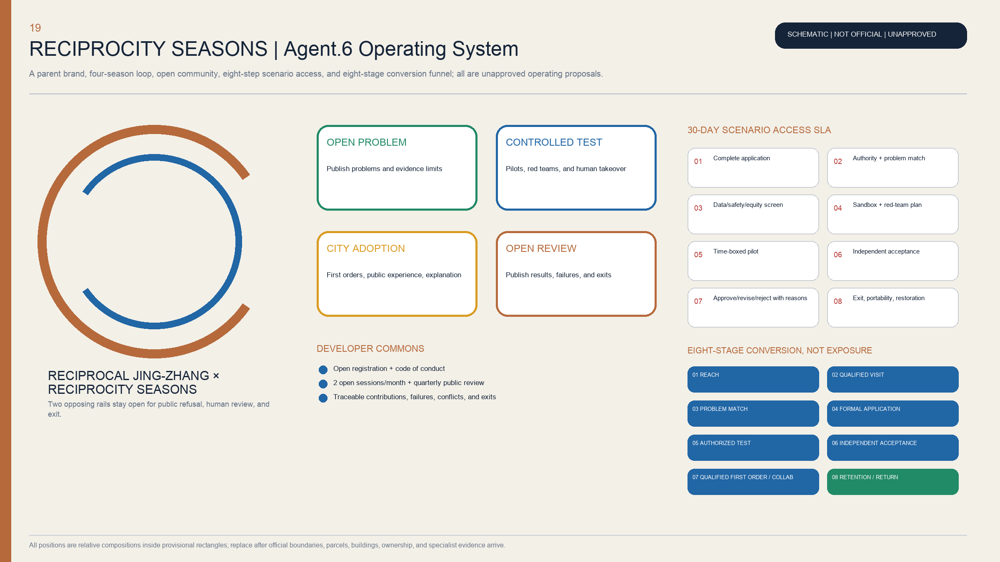

> **How to read the figure.** The open double rail on the left shows innovation inputs and public return approaching without closing; the gap preserves public refusal, human judgment, and exit. The centre shows the four-season annual loop and the developer commons. On the right, read the eight steps from application to exit, then the eight international stages from reach to retention. Every number is an unapproved operating parameter; it does not mean an event, partner, or budget is in place.

## Metrics, Area Recalculation, and Compliance Matrix

**Chapter conclusion: metrics separate current conditions, proposed targets, and stop conditions; writing down a number does not mean that current performance has achieved it.**

Metrics fall into three categories. The first consists of design-geometry values recalculable from the submitted GeoJSON, including provisional site area and focus envelopes for conceptual land-use coverage, public space, and green space; these must carry low or medium confidence. The second consists of facts supported by official approximate values or project status, such as the announced 11.4 km² area and the number of key areas. The third consists of indicators whose performance baselines require on-site or operational data, including detours, accessibility, paid conversion, rents, heat and stormwater, and public participation. Before current or baseline observations are collected, they are recorded as `status=unknown`, `value=null`, with a stated reason; quantified targets or exit gates proposed by the scheme may instead be recorded as `status=known`, together with `value_role=proposal_target` or `value_role=proposal_gate`, respectively, and `approval_status=not_approved`. Here, known means only that a parameter is explicit in the proposal; it does not mean current achievement, a government target, or an implementation commitment [metric:site_area_sqm] [metric:key_area_count] [depth:metrics_recalculation].

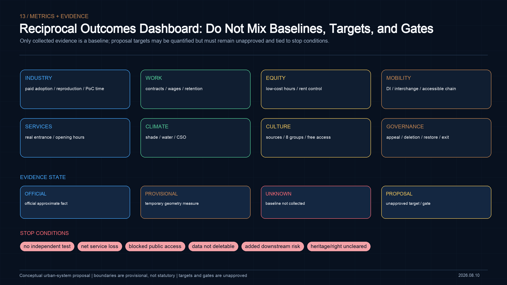

> **How to read the figure.** The indicators are not a score table but a set of checks against counting inputs without public return. Blue facts, yellow assumptions, green trials, and copper scale-up must progress in sequence. Meeting a proposed target does not grant government authority; uncollected baselines remain unknown/null.

| Dimension | Core metrics | Recommended target / gate | Anti-gaming rule |
| --- | --- | --- | --- |
| Industry | Median PoC duration, external paid conversion at 12 months, and independent reproduction | By Year 3: ≤45 days, ≥25%, and ≥90% | Related parties and government subsidies do not count as external paid adoption |
| Employment | Contracts and social insurance, wage distribution, 12-month retention, and destination three months after training | Year-on-year improvement after baseline | Interns, crowdsourced workers, and volunteers reported separately |
| Equity | Effective low-cost hours, no net loss of essential services, and rent relative to control | Review triggered when anomaly exceeds control by 5 percentage points | Count actual use only, not listed floor area |
| Mobility | DI, station connections, curb conflicts, and a zero-break accessible chain | DI for priority origin–destination pairs 20% below S0; critical chains 100% | Do not substitute straight-line circles or in-station lists for journeys |
| Services | 5-, 10-, and 15-minute service baskets; night-time toilets, help, and alternative routes | Report separately for each rights-holder group | Closed or unaffordable facilities do not count as supply |
| Climate | Shade, heat hotspots, recovery from standing water, and shared CSO performance | No increase in downstream risk; targets professionally verified | Do not claim outcomes from water projects under construction |
| Culture | Historical sources, coverage of eight rights-holder groups, comment closure, and free public access | 100% closure for historical sources and comments | Footfall and exposure are not primary performance measures |
| Governance | Complaints, data deletion and migration, spatial restoration, and exit completeness | 100% at expiry | No final payment without an exit report |

`compliance_matrix.json` covers the announcement's purpose, overall design, the three key areas, and agent.1–agent.6. `standard_matrix.json` distinguishes mandatory items, missing official snapshots, and professional development. `design_depth_matrix.json` does not disguise unknown items as complete. After on-site or operational indicators have been collected, their records must be supplemented with the formula, unit, source, sampling date, applicable population, weather or construction state, confidence, and necessary assumptions. Until collection and validation are complete, baselines remain unknown/null; recorded proposal targets or gates remain unapproved proposal parameters and must not be presented as achieved performance.

## Risk, Copyright, and Compliance

**Chapter conclusion: the greatest risk is not a lack of ambition, but allowing provisional geometry, public news, proposed parameters, or Agent reasoning to become statutory boundaries, implementation facts, or government commitments.**

The greatest risk is not that "the drawings lack detail," but that temporary boundaries, event news, project approvals, or Agent inferences are presented as official or implemented facts. The proposal separately registers conflicts between 43.6 and 37 km², Zhongzhiyuan and Xuebeiyuan, Phase II completion and on-site performance, approved and built, and in-station facilities and complete journeys. The formal announcement and later official clarifications take precedence; other definitions serve only as background [source:SOURCE-REGISTRY] [depth:risk_missing_data].

The professional hard gates are: G0 official spatial and ownership data; G1 transport, rail-protection, and construction interfaces; G2 professional accessibility review and user acceptance; G3 water, flood control, and CSO interfaces; G4 trees, habitats, and parks; G5 summer and winter microclimate and occupational health; G6 municipal systems, energy, and computing power; G7 heritage, sound, and vibration; and G8 whole-life operation and public interest. If any gate is not passed, only lower-commitment research or temporary trials are allowed; the proposal may not be elevated to permanent works.

Equity risks are managed through trigger signals: anomalous rents relative to a control, a net decline in essential everyday services, brand events occupying public hours, jobs without contracts or social insurance, algorithms without appeal, vendors unable to export data, failure of historical or copyright review, and any break in the accessible chain. Each triggers a pause, freeze on expansion, redesign, or exit. There is currently no evidence that gentrification has already occurred in the project area, so it is treated only as a risk hypothesis requiring a baseline and control comparison [source:BEIJING-URBAN-RENEWAL-REGULATION-2022].

The text, layers, diagrams, HTML, and PDFs were generated originally through this multi-Agent collaboration. No commercial map tiles, news images, enterprise logos, portraits, remote fonts, or uncleared materials were used. Official webpages are only summarized, with publisher, link, access date, use, and limitations recorded. Cultural content concerning Qinghuayuan, Dazhongsi, Zhongguancun, and other sites still requires review by competent authorities, venues, rights holders, and copyright specialists before implementation [source:COPYRIGHT-STATEMENT].

This output is an Open Co-Creation conceptual urban-design recommendation. It does not replace statutory planning, a heritage-conservation plan, transport design, a water-impact assessment, a municipal-infrastructure study, procurement documents, or a government decision. The complete statement appears in `report/copyright_statement.md`.

## References

- Beijing Municipal Commission of Planning and Natural Resources, Haidian Branch, *Prequalification Announcement for the Centennial Jing-Zhang AI Innovation Belt International Urban Design Call* [source:OFFICIAL-ANNOUNCEMENT]
- Beijing Municipal Forestry and Parks Bureau, public information on Jing-Zhang Phases I and II public-space projects [source:JZ-PARK-PHASE1-202306] [source:JZ-PARK-PHASE2-202607]
- Beijing Municipal Cultural Heritage Bureau and Haidian District Government, protection and historical materials concerning the former Qinghuayuan Station [source:QINGHUAYUAN-CONTROL-2026] [source:QINGHUAYUAN-HISTORY-2021]
- Haidian District 2025 Statistical Bulletin and public materials on the AI Origin Community and 2026 industrial policies [source:HD-STAT-BULLETIN-2025] [source:HD-AI-ORIGIN-202601]
- Beijing policies on accessibility, urban renewal, public-data authorization, flood control, and extreme heat [source:BEIJING-ACCESSIBILITY-REGULATION-2021] [source:BJ-PUBLIC-DATA-AUTH-202607]
- Public-institution materials for the five international cases; complete permitted uses and non-transferable limits are recorded in `sources.json`.
