# 互惠京张：AI增长如何向城市交付公共回报

## 执行摘要 / Executive Summary

- **这是一个位于北京海淀、沿京张铁路遗址公共空间展开的城市系统方案。** 43.6 平方公里是产业、交通与治理的统筹研究范围，约 11.4 平方公里是城市更新和空间承载的总体设计范围，众智园、AI 原点社区和大钟寺三处重点区用于验证不同类型的产业—城市关系；这些面积是公告约值或 provisional 几何复算值，不是法定红线 [source:OFFICIAL-ANNOUNCEMENT] [data:geometry/site_boundary.geojson#SITE-001]。
- **核心判断不是再建一条“AI 绿轴”，而是把既有公共空间从建设项目转成持续运行的公共基础设施。** 京张二期配套已公告完工 [source:JZ-PARK-PHASE2-202607]，清华东路公共空间已批 [source:QINGHUA-EAST-PUBLIC-SPACE-202604]；13 号线扩能 [source:LINE13-UPGRADE-202602] 和清河—小月河水务治理 [source:QINGHE-XIAOYUE-CSO-202601] 仍在实施。本方案因此只对接入缺口、使用绩效、公共回报和长期运营负责，不重复认领已有公共投入。
- **具体方案是一条公共空间运行骨架、三处功能不同的“互惠台”、两侧服务网络和一组日常入口。** 众智园负责技术验证，AI 原点社区负责成果转化，大钟寺负责真实采用；产业增长每使用公共空间、资金、数据和能源，都必须同时交付知识、经济、空间、数据、气候或文化回报，并接受公开评价和退出。
- **当前最适合决策的是先做底账、走读、可逆试验和运营规则，不先承诺永久工程。** 0—12 个月建议启动八个近期项目；表层修补可在证据和主管同意后试验，网络重组只在高需求、高绕行点深化，桥隧、地下连通、大型市政和集中算力不作为方案成立条件。所有项目、预算、目标和闸门仍是 `not_approved` 的方案参数。

### 第一次阅读先回答六个问题

| 读者问题 | 本方案的直接回答 |
| --- | --- |
| 在哪里？ | 海淀京张铁路遗址公共空间及其周边创新、社区和交通网络；按 43.6 km²、约 11.4 km²、三处重点区三个尺度工作。 |
| 为谁？ | 不只为 AI 企业，也为居民、老幼残、服务劳动者、快递外卖人员、学生科研人员、小商户和访客等八类权利主体。 |
| 解决什么？ | 解决产业成果难转化、建成公共空间未必好用、站—园—街旅程断裂、基本服务和文化记忆被技术叙事挤压、运营退出困难。 |
| 做什么？ | 建底账和性能基线；运营三处互惠台；补齐完整旅程和公共服务；建立十二类 AI 场景、八个近期项目、四账户和九道专业硬门。 |
| 怎么实施并判断成败？ | 0—6 个月建底账、走读和规则，7—12 个月做 P01—P08 可逆项目，第二年形成跨核服务，第三年续约、退出或重构；法定责任层授权，PMO 协调，多运营方执行，独立层评测，四账户分账。成败同时看真实付费与就业、零断点无障碍、免费公共时段、数据申诉与删除、热雨洪不增险、史实与意见可追溯。 |
| 何时停止？ | 权属、轨保、水务、无障碍、市政、文保或运营责任不清时不升级；影响权益却不能人工复核、空间不能恢复或数据不能迁移时退出。 |

### 证据状态和编号怎么读

本报告把“事实、待核验信息、方案建议、未知基线”明确分开：主管部门公开信息可以证明项目任务或公布状态；`provisional` 只表示用于讨论的临时几何；`not_approved` 表示已经写清但尚未获批的目标、预算或闸门；`unknown/null` 表示没有足够数据，不能用建议值冒充现状。后文四套编号只用于检索：实施深度（S0—S3）、AI 场景（AI-01—AI-12）、近期项目（P01—P08）和专业硬门（G0—G8）。首次出现时均先写白话名称，再给编号。

**本报告是一份单一专业完整版。** 阅读顺序从项目判断进入三层范围、产业和重点区，再沿人的完整旅程检查交通、服务、蓝绿和文化，最后落到近期项目、预算、指标与停止条件。十九张图在对应章节就地解释；图件帮助理解关系，但不替代 GeoJSON、结构化指标、正式资料或有权机构与人类的最终判断。

## 设计依据与资料清单

**本章结论：京张已经不是等待规划的空白地，本方案从建成后绩效、公共回报和责任边界出发。**

本方案从一个已经变化的事实出发：京张铁路遗址公共空间不是一张等待规划的白纸。北京市园林绿化局于 2026 年 7 月公告二期配套项目完工，北段已形成鱼骨状慢行网络；清华东路南侧公共空间项目已经批复，清河—小月河合流制溢流污染治理工程也已进入实施。因此，继续把“新建九公里绿轴、三道一绿”当作核心创新，会重复计算已经发生或正在发生的公共投入 [source:JZ-PARK-PHASE2-202607] [source:QINGHUA-EAST-PUBLIC-SPACE-202604] [source:QINGHE-XIAOYUE-CSO-202601]。

新的问题不是“如何再画一条轴”，而是：AI 产业增长占用空间、资金、数据、能源和公众注意力后，如何向城市交付可核验的回报。方案由经济产业、交通生态、人文遗产三个专题 Agent 并行研究，再由主 Agent 对证据冲突、尺度口径、替代情景和实施门槛做统一裁决。AI 仅承担检索、结构化、推演和表达；法定规划、专业工程、公共决策和最终判断仍由有权机构与人类完成 [source:AGENT-TASKBOOK] [standard:PROJECT-AGENT-OPEN-CALL-TASKBOOK]。

当前仓库仍没有三层 official polygon、三处重点区精确边界、道路红线、现状建筑、地块权属、控规指标、文保控制线和市政容量。提交包使用仓库 provisional boundary 生成概念几何和复算值，仅用于 intake、讨论和专业深化；图面中的边界均为低对比虚线，取得正式资料后必须从 GeoJSON、metrics、矩阵、图件、HTML 到 PDF 整链重算 [source:BOUNDARY-SOURCE] [data:geometry/site_boundary.geojson#SITE-001] [depth:existing_conditions_diagnosis]。

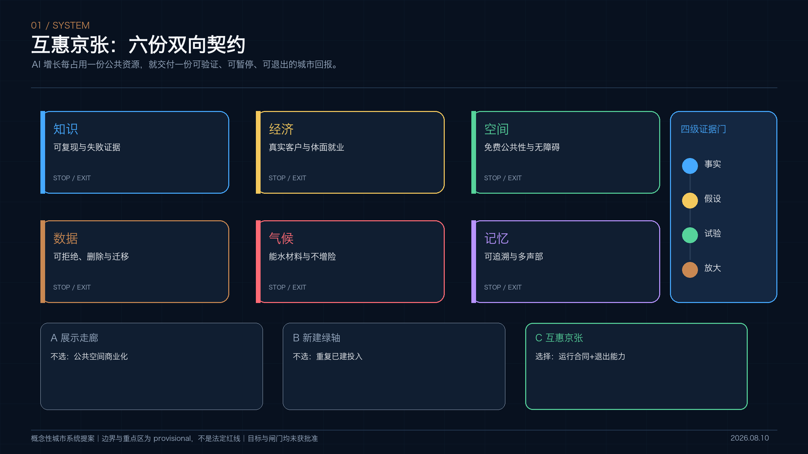

> **读图。** 先看下方六个框：它们不是六类装饰主题，而是产业增长必须交付的六类城市回报；再看右侧四级证据门，任何设想都必须从事实走到小试，不能从概念图直接跳到永久建设。图中不表达具体工程线位或批准状态。

### 诊断与三个替代情景

| 情景 | 核心假设 | 能解决的问题 | 无法接受的代价 | 决策 |
| --- | --- | --- | --- | --- |
| A AI 展示走廊 | 用地标、展陈、赛事和企业展示形成辨识度 | 传播快、图面强 | 居民变观众，公共空间商业化，设备维护与文保风险高 | 不选；仅保留经审批的可逆内容组件 |
| B 蓝绿慢行缝合带 | 新建南北轴和横向连接解决空间割裂 | 空间结构清晰 | 与 2026 已建/已批项目重复；缺道路、站口和工程证据 | 不选为总纲；转为建成后绩效审计与补缺 |
| C 互惠京张 | 每项公共支持、数据使用、空间占用和资源消耗都交付可核验回报 | 同时组织产业、交通、文化、公平、生态和运营 | 需要跨部门台账、公开评价与退出能力 | 选择 |

“互惠”不是附加公益，而是创新带的操作合同：知识必须可复核，经济必须形成真实客户和体面就业，空间必须保持免费公共性和无障碍，数据必须可拒绝可删除，能水材料成本必须透明，历史必须可追溯且允许多声部讲述。六份契约都带有停止条件，而非只写愿景。

## 三层范围工作框架

**本章结论：三个尺度分别处理区域协同、城市更新和重点区试验，不能共用同一精度，也不能由一张总平面代替。**

三层范围承担不同问题，不以同一张总平面代替：43.6 平方公里统筹研究范围用于产业链、人才、跨区交通和治理协同；约 11.4 平方公里总体设计范围用于建成骨架的接入、城市更新、服务网络和运营组织；约 368.4 公顷三处重点区域用于验证三种不同的产业—城市互惠原型。公告面积是约值，provisional geometry 复算值不是 official 精确面积 [source:OFFICIAL-ANNOUNCEMENT] [metric:announced_overall_design_area_sqm] [depth:three_level_scope_framework]。

空间结构概括为“**一条公共脊、三座互惠台、两翼交换网、多个日常门**”。公共脊是已建与待核验区段共同组成的京张公共空间运行骨架，不宣称新建贯通；三座互惠台分别承担全栈验证、源头转化和市场采用；中关村科技服务翼提供 IP、法务、金融、标准、人才和出海服务，小月河场景赋能翼提供真实问题、受控试验和公共评价；“日常门”则是站口、社区门、园区门、校园门和河岸入口的逐点接入任务，不预设数量和工程线位 [data:geometry/key_areas.geojson#PROV-KEY-001] [data:geometry/roads.geojson#MOB-NS-001]。

三层均采用“事实—假设—试验—放大”四级证据门。公开主管信息可确认任务与项目状态；provisional 图层只支持概念推演；现场走读和专业模型决定小试点；只有 official 数据、权属、审批、预算和运营责任齐备后，才讨论永久工程。这样，组织方数据缺口不会阻断创意评价，却不会被图面悄悄升级成审批结论。

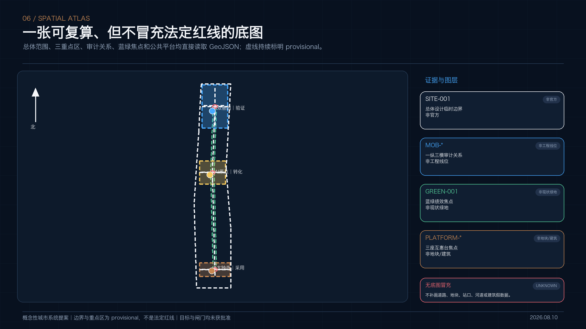

> **读图。** 这张图只回答“现有机器资料里哪些空间关系可以复算”。狭长虚线是临时总体范围，三个色块是重点区索引，纵横线是待现场核验的审计关系；它不能证明道路、站口、河道、地块或建筑的真实位置。正式底图到位后，整张图必须重算。

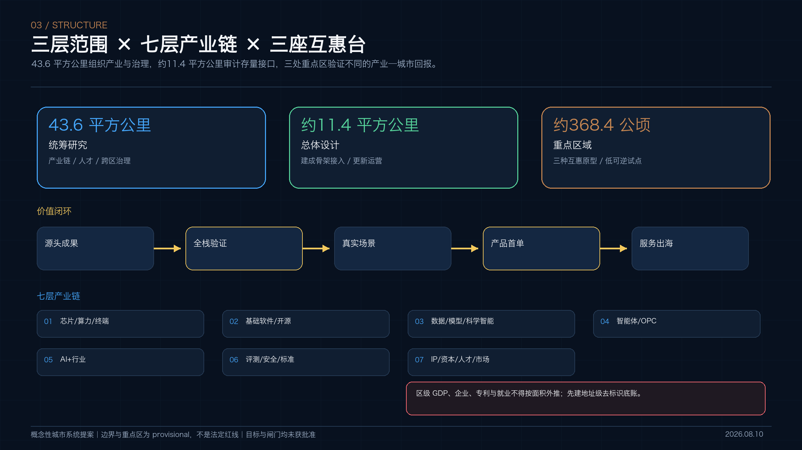

> **读图。** 从上到下分别是统筹研究、总体设计和重点区三个尺度；从左到右是成果、验证、场景、首单和服务回流。读者应判断每一项行动属于哪个尺度、由谁授权，而不是把三层内容压成一张总平面。

## 统筹研究范围产业与未来城市研究

**本章结论：产业目标不是在 43.6 平方公里内堆企业和楼宇，而是把科研成果走到独立验证、真实场景、外部首单和持续服务。**

### 七层产业链与三区两翼闭环

43.6 平方公里不能按面积分摊海淀区 GDP、企业数、专利或就业。海淀区级统计只能证明区域底盘强，不能证明研究范围内的产出；正式评价必须先建地址级、去标识的企业—就业—楼宇—租金底账 [source:HD-STAT-BULLETIN-2025] [metric:economic_baseline_coverage]。

产业系统按七层组织：芯片/算力/终端；基础软件与开源工具；数据/模型/科学智能；智能体与 OPC；AI+行业应用；评测/安全/标准；IP/资本/人才/市场服务。带内不追求每一层都建设重资产，而形成“AI 原点社区源头成果 → 众智园全栈适配与可信验证 → 小月河真实场景 → 大钟寺产品化与首单 → 中关村专业服务与出海 → 收益、人才和问题回流”的循环 [source:HD-AI-ORIGIN-202601] [source:BJ-AGENT-MEASURES-202607]。

大规模训练算力、规模制造和敏感原始数据汇聚不默认落在中心城区。带内优先承担设计、低时延推理、软硬适配、独立评测、首发采用和专业服务；集中算力设施必须先证明电力、冷却、消防、防涝、能效与长期维护，不能由“AI 城市”口号自动获得建设正当性 [source:BJ-DATACENTER-OPTIMIZATION-202411] [depth:municipal_new_infrastructure]。

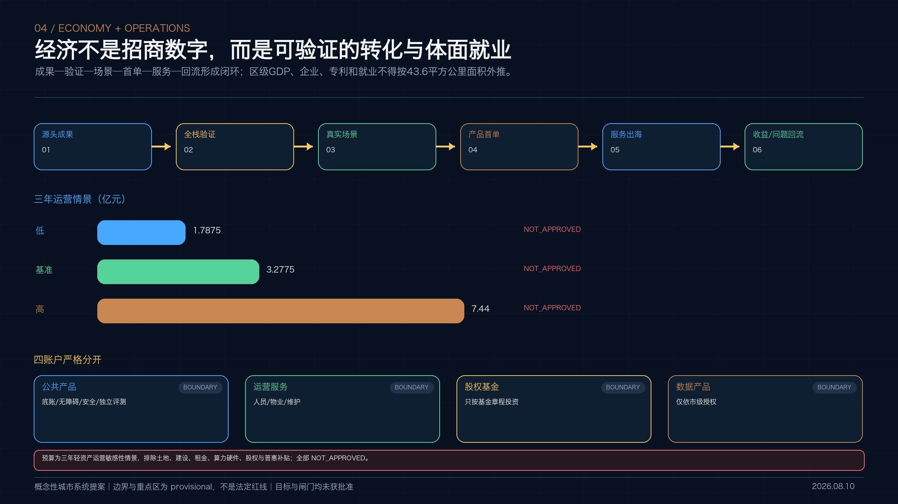

> **读图。** 上部六步链说明成果只有经过验证、真实场景和外部首单，才算形成转化；中部三条预算是低、基准、高三种未批准情景，不是财政承诺；下部四账户必须分账，避免公共产品、运营服务、股权投资和数据收入相互补贴或相互遮蔽。

### 五个国际案例：只转译机制，不复制权能

| 案例 | 可转译机制 | 京张用法 | 不可照搬 |
| --- | --- | --- | --- |
| 新加坡 LaunchPad @ one-north | 模块化空间、灵活租约、统一服务入口 | 分级工位、项目间、验证预约和国际团队服务 | 土地制度、租金、公共开发商权能 [source:CASE-ONE-NORTH] |
| 上海张江科学城 | 苗圃—孵化—加速链、人才住房与公共参与 | 统一成果编号和成长阶段服务 | 220 km² 规模、制造结构、财政政策 [source:CASE-ZHANGJIANG] |
| 深圳河套 | 专业运营机构、中试平台、一网通办 | 跨三区项目办公室和服务案件号 | 跨境、海关、特区立法条件 [source:CASE-HETAO] |
| 剑桥 Kendall Square | 创新增值与住房、开放空间、交通、就业培训绑定 | 把低成本空间、交通与就业质量写入公共回报 | 美国分区奖励和社区收益谈判制度 [source:CASE-KENDALL] |
| 多伦多 Quayside | 合作方退出后公共目标、资料和重新采购仍可继续 | 预设运营商退出、数据迁移和重新竞争 | 非民选数据信托和海外数据权能 [source:CASE-QUAYSIDE] |

### 六份互惠契约

| 契约 | 交付物 | 主指标 | 停止条件 |
| --- | --- | --- | --- |
| 知识契约 | 可复现实验、开放标准、公共解释、负面结果 | 独立复现率、问题修复时间 | 无独立评测或拒绝保留失败证据 |
| 经济契约 | 真实付费转化、就业质量、中小主体机会 | 付费转化率、合同社保留存、关联交易剔除 | 补贴寻租、供应商锁定、基本服务净减 |
| 空间契约 | 免费公共时段、无障碍链、非消费停留 | 零断点旅程、公共开放时段 | 公共通行/盲道被占或活动无法恢复 |
| 数据契约 | 最小必要、人工接管、非数字替代、删除迁移 | 申诉闭环、到期删除/移交 | 影响权益且不可人工复核 |
| 气候契约 | 能水材料披露、冷凉路径、雨洪不增险 | 热风险、恢复时间、任务能耗 | 市政容量 unknown 或增加下游风险 |
| 记忆契约 | 史实来源、多声部口述、文保优先、可逆介入 | 史实可追溯率、文保违规固定装置为零 | 无授权、无主管图件却固定落位 |

品牌名“互惠京张 / RECIPROCAL JING-ZHANG”以两条相向但不封闭的轨线为 Logo 原型：一条代表创新投入，一条代表公共回报，交汇处留出人工判断的空白。遗产铜、公共蓝、生态绿、信号黄和风险红构成视觉语法；不使用企业 Logo、人物肖像、商业地图、远程字体或未清权图像。

### 三大定位、五大功能与三区两翼的对应关系

任务书的三大定位不是三句并列口号，而是同一空间的三种使用方式：**百年京张文化带**由记忆契约、逐段公共路线和可溯源导览承载；**都市 AI 生活体验带**由十二类场景、完整旅程、基本服务和人工替代承载；**AI 融合创新带**由七层产业链、三处互惠台和两翼专业服务承载。三者共用公共脊，但文化不为科技装饰，生活体验不等于设备展示，产业空间也不能优先于公共通行。

| 任务书五大功能 | 本方案的空间—机制响应 | 主要回报与停止门 |
| --- | --- | --- |
| AI 全栈自主创新体系 | 众智园共享验证、隔离测试、独立评测与设备周转 | 输出可复现结论和风险边界；无独立复现不放大 |
| 世界级 AI 创新生态 | AI 原点统一成果入口、中关村 IP/法务/资本/人才/出海服务 | 形成开源、许可、联合研发或真实企业路径；权属不清不转化 |
| AI+ 场景赋能新范式 | 小月河公开问题、十二类场景卡、八步场景开放 | 问题、数据、场地和人工责任齐全；授权缺口不为零即停 |
| 智能化 AI 活力城市 | 大钟寺真实采用、站—园—街完整旅程、非消费公共时段 | 真实客户与公共体验同时成立；服务净减或空间不可恢复即停 |
| AI 治理全球话语权 | 统一测试协议、负面结果库、独立验收、公开复盘和退出包 | 以可复核方法而非宣传形成影响；供应商自评或失败被删除即停 |

三区两翼因此不是五个互不相干的园区：众智园负责“能否验证”，AI 原点负责“走哪条转化路径”，大钟寺负责“是否真实采用”；小月河场景赋能翼把公共问题送入测试，中关村科技服务翼把知识产权、标准、市场和国际服务送入全链，再把客户、就业、失败证据和新问题回流。

## 总体设计范围城市更新与控规深度城市设计

**本章结论：总体设计先让已建空间、站点、园区和日常服务真正接上；正式地块、建筑和控规资料缺失时，不用概念图制造开发精度。**

### 从空间供给转为“证据驱动的存量接口”

总体设计不是把 11.4 平方公里分成四条抽象色带后宣称完成用地规划。`land_use.geojson` 只表达研发验证、公共开放、产业服务、社区生活四类概念容量的拓扑关系，不能替代现状用地和法定分类。official parcel、控规、现状建筑和权属到位前，面积只用于检查图层完整覆盖，不用作建设配额 [data:geometry/land_use.geojson#LU-001] [standard:MNR-LAND-USE-CLASSIFICATION-GUIDE]。

第一阶段以 0.8—1.2 万平方米分布式存量空间为运营假设，服务统一成果入口、共享验证、公共问题试验、人才与社区服务；只有连续六个月有效利用率、候补转化、租金影响和基本服务都通过评估，才讨论扩至约 1.58—2.62 万平方米的稳态容量。该区间是轻资产运营测算，不是用地、建筑规模或投资承诺 [metric:operational_space_envelope_sqm]。

建筑策略采用 `R-A-I`：先 Retain 核实可保留资产，再 Adapt 做可逆适应性改造，最后才在控规、权属、市政、消防、日照、文保和公众意见通过后研究 Infill。提交的 `buildings.geojson` 现包含 18 个相对临时重点区生成的类型化试排包络，只用于检验功能邻接、公共界面、强度敏感性与剖面关系；它们均标记 `agent_generated_design`、`existing_condition_claim=false` 和 `not_approved`，不是现状建筑、地块方案或拆改留结论。真实建筑总量、楼高、产权和现状容积率仍保持 unknown [data:geometry/buildings.geojson#BLDG-ZHONGZHIYUAN-AI-ACCELERATION-AREA-LAB-A] [metric:schematic_building_envelope_count] [depth:retain_renovate_demolish]。

### 建成后性能审计，而不是重复计功

京张二期配套“完工”只证明主管部门公布的项目状态，不证明每一段全天开放、无障碍连续、夜间安全或运维达标。总体范围先建立 S0 动态基线，叠加已建京张一期/二期、已批清华东路项目、在建 13 号线扩能和 CSO 工程；随后比较 S1 表层可逆修补、S2 站—园—街网络重组、S3 结构性基础设施。推荐 S1 立即试点、S2 按证据选点、S3 只保留为专业门控选项 [source:LINE13-UPGRADE-202602] [depth:overall_spatial_structure]。

| 情景 | 主要内容 | 可逆性 | 进入条件 | 本方案决策 |
| --- | --- | --- | --- | --- |
| S0 动态基线 | 项目状态、入口、时段、施工、无障碍、热雨洪、市政审计 | 高 | 立即 | 必做 |
| S1 表层修补 | 导视、停车/装卸重排、遮阴休息、人工服务、施工绕行 | 高 | 现场走读与主管同意 | 三重点区各一项 90 天试验 |
| S2 网络重组 | 逐站接驳、鱼骨入口、真实生活圈、雨洪与冷凉路径 | 中 | official 底图、基线和专业会商 | 仅高需求高绕行点 |
| S3 结构工程 | 桥隧、地下连通、大型市政、集中算力 | 低 | 可研、审批、资金、责任全齐 | 不作为方案成立条件 |

### 总平面：一条审计脊、三条横向接入、三座互惠台

总平面把既有京张公共空间作为南北“审计脊”，不把它画成待建道路；三条横向关系分别检查北段清河—五环—园区、中段双站—校园—社区、南段四象限—轨道—公园社区的完整旅程；三座互惠台承接验证、转化和采用。每个重点区再以一条南北公共界面、一条东西接入关系、三个功能区、六个类型化包络和两个场景节点做空间压力测试。所有轴线和包络都使用虚线或低饱和表达，取得 official boundary、道路红线、建筑和权属后必须整体替换，而不是微调坐标 [data:geometry/roads.geojson#MOB-NS-001] [data:geometry/constraints.geojson#ZONE-ZHONGZHIYUAN-AI-ACCELERATION-AREA-VALIDATION-SPINE] [metric:schematic_key_area_detail_count]。

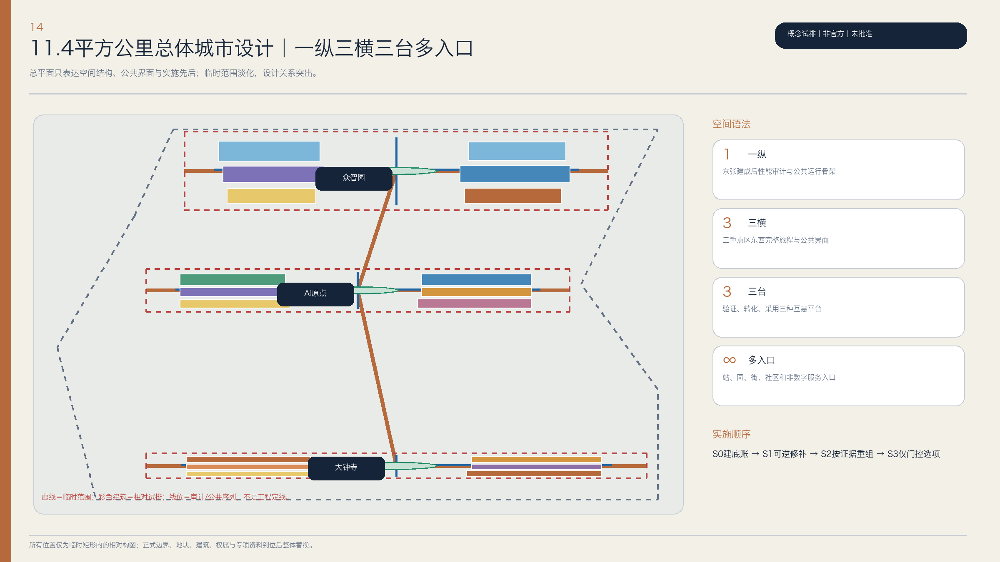

> **读图。** 先看纵向铜色虚线，它表示要逐段核验的公共空间运行骨架；再看三处放大的重点区，比较验证、转化、采用三种功能。彩色建筑块是类型和容量试排，不是现状轮廓；图上任何线位、强度或拆改留状态都不能直接进入工程。

## 重点区域详细设计

**本章结论：三处重点区处在同一创新成熟链的不同位置，因此必须分工，不能复制三座“AI 园区”。**

三处重点区不是三座相同的 AI 园区，而是创新成熟链上的三座“互惠台”。其 polygon 为仓库临时矩形，只承担索引和讨论功能；下列空间动作均需 official 边界与现场资料后落位 [source:KEY-AREA-SOURCE] [depth:three_key_area_detailed_design]。

为避免“有总图、无实施深度”，每处重点区都用同一张审查表回答六件事：产业功能怎么排、公共空间如何进入、站—园—街如何接、建筑类型和强度如何测试、现状建筑如何进入 R-A-I、什么情况必须停。图中数值是由 provisional polygon 与类型化包络复算的 `conceptual_design_output`，只用于方案间敏感性比较；公告约值与试排值分开记录，不能用试排强度推导法定开发量 [metric:announced_key_area_scope_sqm] [metric:schematic_section_count]。

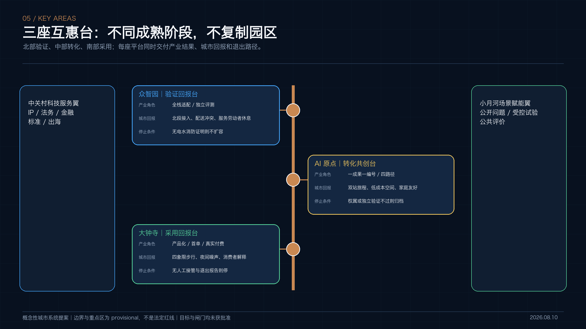

> **读图。** 三处重点区不是复制同一种园区：北部解决“技术能否被独立验证”，中部解决“成果如何选择转化路径”，南部解决“产品是否被真实采用”。每处都同时写明产业任务、公共回报和停止条件；临时矩形只用于索引，不是项目边界。

### 众智园：验证回报台

定位为芯片—框架—模型—智能体—终端的全栈适配、独立评测和安全治理平台。首批不是新建大型算力中心，而是共享验证目录、预约系统、统一报告、隔离测试和设备周转；每项企业验证必须同步交付可公开的兼容性结论、风险边界或标准建议 [data:geometry/key_areas.geojson#PROV-KEY-001] [metric:reproducibility_pass_rate]。

城市回报是北段建成公共空间的接入绩效：学知园站候选接驳、五环绕行、园区配送与慢行冲突、清河—小月河安全、遮阴和服务劳动者休息。清河站是否在正式范围内仍待 official polygon 判断；跨五环桥隧、河岸工程和集中算力均不能先验成立。

空间组织采用“验证脊—测试庭—公共边”三层：共享验证和隔离测试靠内部服务脊布置，具身测试只在可封控、可恢复的测试庭发生，沿京张和生活界面设置无需消费的休息、饮水、遮阴与人工说明。六个类型化包络覆盖共享实验、孵化研发、社区服务和办公；试排容积率约 1.52，建议敏感性区间 1.5—2.6，高度以 12—45 米分级，但这些数值只用于检验低层公共界面与中高层研发容量，不是控规指标 [metric:zhongzhiyuan_ai_acceleration_area_schematic_far] [data:geometry/buildings.geojson#BLDG-ZHONGZHIYUAN-AI-ACCELERATION-AREA-LAB-A]。

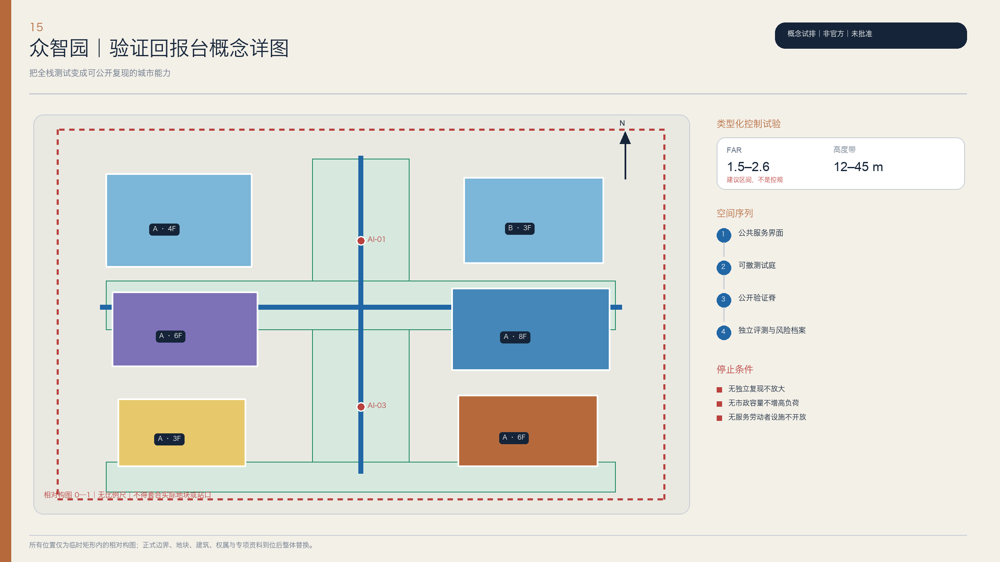

> **读图。** 从公共边进入，再到共享验证和受控测试；建筑颜色表示类型，数字表示未批准的层数与高度带。现状建筑尚未调查，因此所有包络的拆改留状态都是“等待逐栋调查”。五环、河道、轨保、电力冷却或公共通行任一条件不清，就只保留室内轻资产验证，不进入跨线工程、岸线工程或集中算力建设。

### AI 原点社区：转化共创台

定位为高校院所成果从 0 到 1 的统一入口。每项成果获得一个编号，依次经过 30 日权属/需求筛查、90—180 日概念验证、非利益相关方独立验证，并分流至开源公共品、技术许可、联合研发/合作创新采购或新设企业；不是所有成果都要创业和融资 [data:geometry/key_areas.geojson#PROV-KEY-002] [source:MOF-COLLABORATIVE-PROCUREMENT-202404]。

空间优先是双站完整旅程、低成本项目间、人工人才服务、家庭友好和公共学习。清华东路西口与六道口约 1900 辆非机动车停车属于已批项目计划供给，建成前不计为现状、本方案也不重复认领；高校校门、场地和知识产权须逐项协商，不以“校城融合”推定开放。

空间组织采用“知识脊—转化庭—日常边”：成果入口、公共学习和技术转移服务共用可识别的一层界面；项目间和受控 PoC 围绕转化庭布置；家庭服务、小商户、安静休息和无障碍人工窗口进入日常边。六个类型化包络覆盖学习、研发、孵化、混合服务、社区商业与人才支持；试排容积率约 1.87，建议敏感性区间 1.5—2.5，高度 12—36 米，重点不是追求强度，而是检验首层开放、校园边界和双站接入能否共存 [metric:beijing_ai_origin_community_schematic_far] [data:geometry/buildings.geojson#BLDG-BEIJING-AI-ORIGIN-COMMUNITY-EDU-A]。

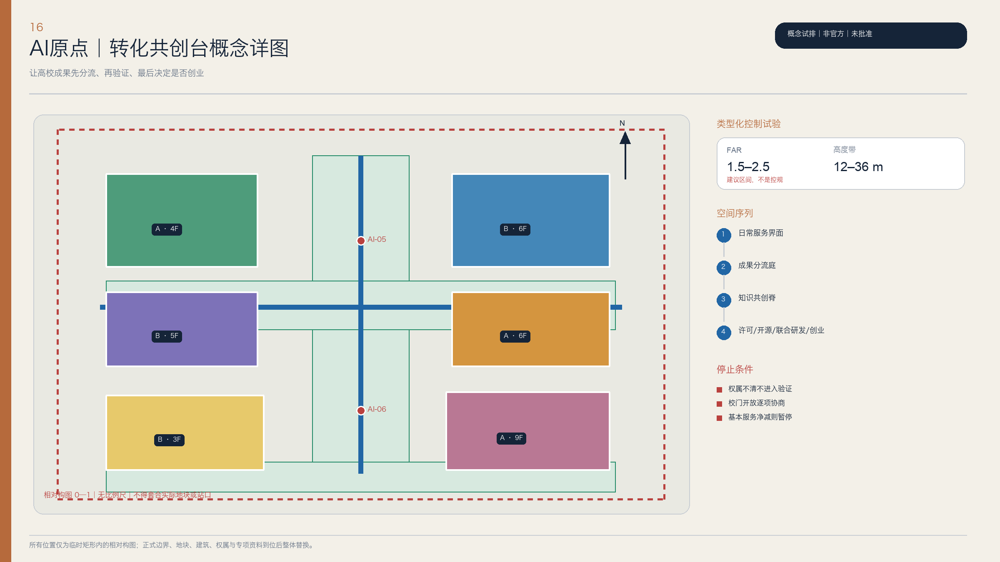

> **读图。** 中央不是创业展示大厅，而是把成果权属、问题匹配、验证和四种转化路径放在同一条可解释流程上；外围优先保证校园、社区和站口的日常通行。校门开放、地块权属、清华园文保、消防日照或租户返回安排没有书面证据时，只允许室内可逆改造和服务试点。

### 大钟寺：采用回报台

定位为智能体、终端、内容和 AI+消费服务的产品化、首发与真实付费采用。这里不是永久品牌展厅，而是带公开规则、试用期限、消费者解释、人工接管和退出报告的城市采用会；政府补助和关联企业合同不计入外部付费转化 [data:geometry/key_areas.geojson#PROV-KEY-003] [metric:paid_conversion_rate_12m]。

空间任务是大钟寺 12/13 号线可用出入口—四象限—重点地块—公园/社区服务的完整旅程，以及公交、骑行、网约、配送、夜间噪声和暴雨条件。站内有设施不等于站外无障碍，地下连通和桥梁线位必须经轨保、交通、防汛、权属与工程可研。

空间组织采用“采用脊—四象限庭—安静边”：首发试用、采购门诊、消费者解释与人工接管位于采用脊；四象限庭只承接有时限、有退出报告的真实采用；靠居民和文化设施一侧设置安静、低亮度、低设备依赖的公共边。六个类型化包络覆盖产品化办公、混合采用、餐饮零售、文化公共服务和社区服务；试排容积率约 2.02，建议敏感性区间 2.0—3.5，高度 12—45 米，用于检验轨道门户的复合容量与文化安静边能否同时成立 [metric:dazhongsi_ai_industry_cluster_schematic_far] [data:geometry/buildings.geojson#BLDG-DAZHONGSI-AI-INDUSTRY-CLUSTER-CUL-A]。

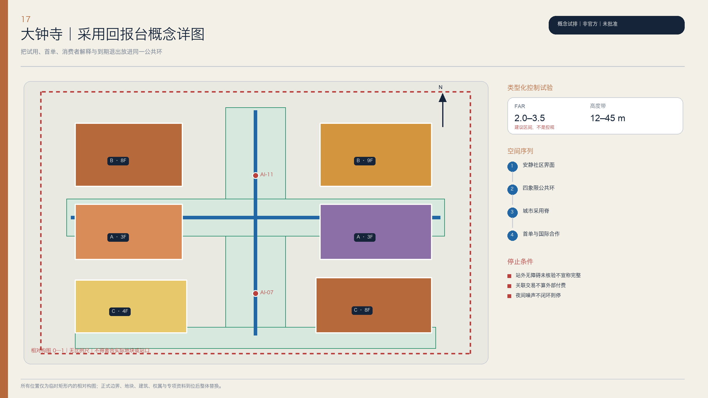

> **读图。** 先沿四象限完整旅程检查站口、过街、骑行、配送和暴雨替代，再看采用会与文化公共边是否冲突。任何地下连通、桥梁、固定展陈和新增体量，均须在轨保、防汛、文保、噪声、产权和消费者保护通过后另行论证；未通过时采用会退回短期室内试用。

## AI 创新生态、人才画像与 AI+ 场景

**本章结论：AI 只有绑定一个真实公共问题、一个明确责任人、人工接管和退出方式，才成为城市场景；“人才”也不能覆盖其他人的日常权利。**

### 八类权利主体

本方案把“画像”升级为权利主体：长期居民与老年人；儿童及照护者；肢体、视听和认知障碍者；保洁、安保、园林、零售与餐饮员工；快递外卖等新就业群体；学生、科研人员与国际社区；小商户、租户与社区服务机构；创业团队、企业与文化访客。任何平均指标都要同时报告夜间、极端天气和最不利 10% 旅程，不能以“人才需求”覆盖其他人的日常权利 [source:BEIJING-ACCESSIBILITY-REGULATION-2021] [source:HAIDIAN-CHILD-FRIENDLY-2023]。

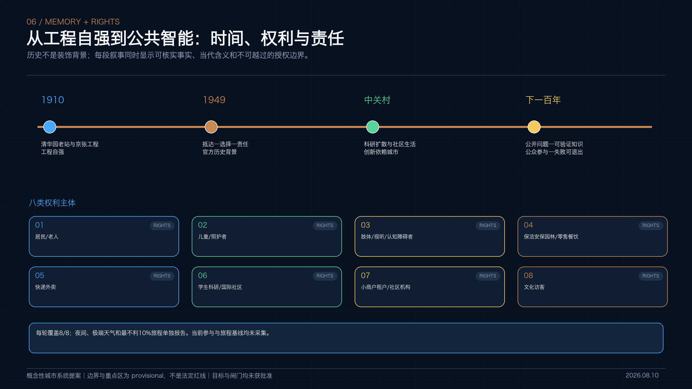

> **读图。** 时间线解释为什么“百年京张”不能只做复古景观：工程自主、公共责任、中关村创新和未来公共智能必须连成因果。右侧八类主体用于逐项检查谁被看见、谁承担成本、谁有否决和申诉渠道；它不是人口统计结果，具体人数仍待调查。

### 十二张场景卡

| # | 场景 | 空间/用户 | AI 作用 | 人工与退出边界 |
| --- | --- | --- | --- | --- |
| AI-01★ | 全栈互操作验证 | 众智园；工程团队 | 编排跨芯跨模测试与差异报告 | 第三方复现；隔离环境；失败不扩容 |
| AI-02★ | 模型安全与红队庭 | 众智园；开发者/公众代表 | 生成攻击用例和风险清单 | 安全负责人签署；不连真实敏感系统 |
| AI-03★ | 无障碍具身测试街 | 北/中段受控时段；残障使用者 | 仿真低速机器人冲突 | 使用者付费参与；现场安全员随时停机 |
| AI-04★ | 公共问题合作创新采购门诊 | 两翼；采购人/中小企业 | 市场调研、需求分类和证据清单 | 财政/法律复核；禁止指定供应商 |
| AI-05 | 高校成果路径导航 | 原点；研究者/技转团队 | 匹配开源、许可、研发或创业路径 | 不自动判断权属、投资或资格 |
| AI-06 | 人才与完整劳动市场服务 | 原点/两翼；技术与服务劳动者 | 汇总公开岗位、培训和人工窗口 | 报告合同社保与留存；不采集无关履历 |
| AI-07 | 站—园—街完整旅程 | 三重点区；通勤者/老幼残 | 识别绕行、等待和故障替代 | 现场走读与交通专业复核；非数字导视 |
| AI-08 | 冷凉与暴雨安全导航 | 全廊；户外劳动者/访客 | 汇总遮阴、饮水、避暑、关闭和替代路 | 预警与现场管理优先；无个体轨迹留存 |
| AI-09 | 可溯源京张文化导览 | 已确认开放段；居民/学生/游客 | 按来源解释工程、革命、科研与日常史 | 策展审核；纸质/人工替代；可纠错 |
| AI-10 | 基本服务缺口助手 | 社区/园区；居民/服务劳动者 | 汇总真实开放时段与服务篮子 | 不把内部设施算公众供给；人工核验 |
| AI-11 | 大钟寺城市采用会 | 南台；企业/消费者/居民 | 汇总试用证据和不同群体反馈 | 公开议程、申诉、消费者权益与到期退出 |
| AI-12 | 公共智能议事台账 | 全带；八类主体 | 聚类意见、显示采纳差异和未决证据 | 保留原始意见；人类决定；支持撤回 |

★ 为产业测试验证场景，共 4 项；全部 12 项均为概念建议，不代表场地、数据、采购或运营已经获批 [metric:scenario_card_count] [metric:industry_validation_scenario_count]。

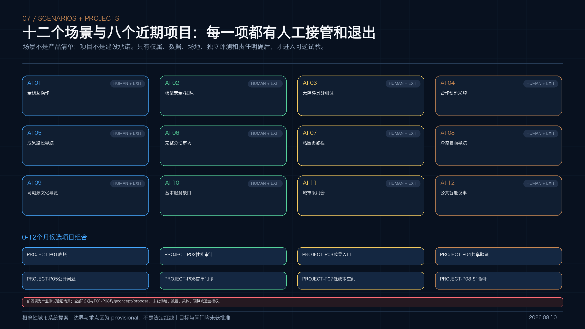

> **读图。** 每个 AI 场景都必须先绑定一个公共问题，再写人工接管、非数字替代和退出；下方近期项目则提供底账、场地、验证和运营条件。场景数量表示方案覆盖，不表示十二个系统都应同时上线。

数据场景统一执行“五问”：谁提出问题、谁提供数据、谁承担错误、谁可以拒绝、谁能叫停。公共数据授权服从北京市市级统一管理和授权协议，不由片区自行宣布“数据资产运营权”；每个场景须有非数字替代、人工接管、版本记录、数据导出/删除和空间恢复 [source:BJ-PUBLIC-DATA-AUTH-202607]。

### 六步公众参与与四道公平底线

公众参与不是方案完成后的网上投票，而是贯穿项目选择、试验和退出的工作流程：先公开问题、已有证据和不能承诺的事项；再由居民、残障人士、儿童照护者、服务劳动者、商户和专业人员共同走读；至少比较维持现状、轻干预和较强干预三种方案；永久建设前先做可撤小试；由受影响者共同评价；最后对每条有效意见公开“采纳、部分采纳、不采纳或待证据”的理由和退出安排。电话、纸质、人工窗口和线上渠道并存，不能强制扫码、智能手机或人脸识别 [source:BEIJING-URBAN-RENEWAL-REGULATION-2022]。

四道公平底线先于商业升级。第一，居民、租户、小商户和租金影响没有基线时，不进入不可逆拆改；第二，早餐、菜店、药店、托育养老、维修快递等基本服务出现无等价替代的净减少时，暂停升级；第三，公共空间必须保留无需消费、票务或 App 的免费时段、安静区和非消费停留；第四，数字服务必须说明数据必要性、保存期、删除和人工接管。当前没有证据证明项目区已发生绅士化，这些是预防性闸门，不是现状结论。

## 用地、建筑规模与拆改留方案

**本章结论：在 official 地块、建筑和权属资料到位前，本方案只承诺可复算的容量关系和“先保留、再适应、后填充”的判断顺序。**

四类概念容量层完整覆盖 provisional site：研发/验证、公共开放/绿地、产业/商务服务、社区/日常服务。图层面积是设计几何的可复算结果，置信度为低至中；它回答功能如何彼此靠近，不回答哪宗地改变用途 [data:geometry/land_use.geojson#LU-004] [metric:conceptual_land_use_coverage_ratio]。

`buildings.geojson` 现在登记 18 个类型化试排包络和约 633.99 万平方米的试排建筑面积，用来复算三处重点区的相对容量与剖面；其 `value_role=conceptual_design_output`、`approval_status=not_approved`，不得被读成现状总量或建设规模。正式拆改留仍须逐栋获取轮廓、高度、用途、年代、结构安全、产权、租约、能耗、消防、文保和在建状态；未取得前，18 个包络全部保持“等待调查”，没有一栋被决定保留、改造、拆除或新建 [metric:total_floor_area_sqm] [metric:address_verified_building_coverage_baseline] [depth:development_intensity_controls]。

### 两条代表性剖面与逐栋 R-A-I 决策

剖面 A 检验“公共脊—共享首层—研发或验证体量—社区日常边”的横向关系；剖面 B 检验“站口或园区门—慢行与装卸—公共庭—混合服务体量”的纵向关系。两条剖面都把首层公共界面、遮阴休息、消防检修和无障碍连续作为先决条件，建筑高度只做分级压力测试。R-A-I 不是三种预先涂色：先用产权、租约、结构消防、能耗、文保和公共价值判断是否 Retain；再用可逆性、租户返回、无障碍和节能收益判断是否 Adapt；只有前两者不能满足公共任务且全部专业门通过，才研究 Infill。Demolish 不作为自动选项，任何拆除必须另有必要性、安置、碳与废弃物论证。

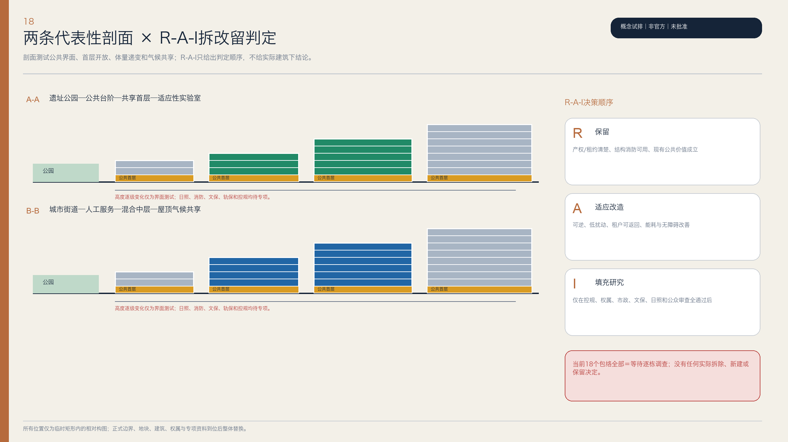

> **读图。** 左侧剖面只检验公共界面、建筑高度和服务空间的关系；右侧从 R 到 A 再到 I，表示证据门越来越高。最重要的信息在红框：当前 18 个包络全部等待逐栋调查，没有实际拆建决定。取得 official parcel、控规、轨保、文保和现状建筑后，必须逐栋替换并重新计算强度、日照、消防、市政和公共回报。

空间供给采用三级价格与期限：开放共享桌、3—6 个月项目间、达到客户/就业/合规门槛后的成长空间。若运营方可控空间存在，建议先试验不少于 20% 的低成本有效工位/时段，但须用实际面积、使用时长和对照租金审计，避免补贴被房东涨租吸收。该比例是运营试验目标，不是法定配建指标。

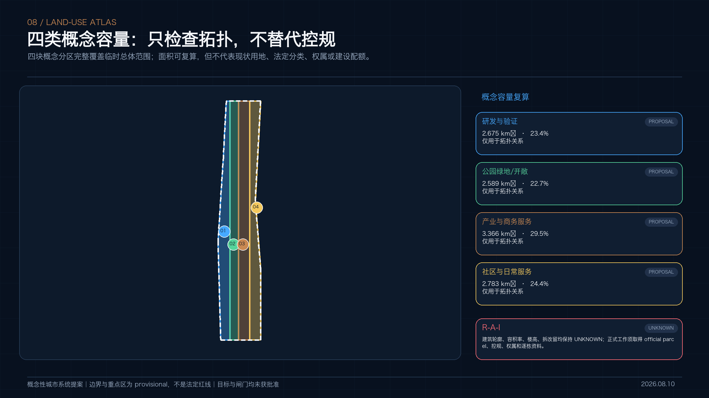

> **读图。** 四种颜色只表达研发验证、公共开放、产业服务和社区生活在概念上如何相邻，并用于检查临时范围是否完整覆盖。它不等于现状用地、法定规划、权属或开发强度；没有正式地块和建筑资料时，不据此决定拆建。

## 交通、轨道、市政与公共服务设施

**本章结论：交通成效按一个人从站内到目的地再返回的完整旅程判断，不按站点半径、设备数量或站内设施清单判断。**

### 先用三条代表性旅程发现问题

这三条旅程是待执行的审计脚本，不是对现状路线、客流或时长的虚构。北段跟随一名服务劳动者，检查停靠、入口、工作点、饮水、休息、厕所、充电和返程；中段跟随儿童照护者与残障使用者，检查轨道、出入口、过街、公共空间和人工求助；南段跟随老人或文化访客，检查社区、大钟寺站外、公园或场馆支线及返程。每条都在工作日高峰、周末、夜间、酷热和暴雨条件下复核，并记录电梯故障、占道、绕行、纸质导视和人工替代。没有现场数据前，不给这些旅程填入分钟数 [source:BEIJING-ACCESSIBILITY-REGULATION-2021] [source:BJ-SUBWAY-ACCESSIBILITY-202608]。

交通从站点圆改为完整旅程链：车厢/站台—站厅—出入口—过街—公交/骑行/步行—公园、园区、校园或社区入口。五道口、大钟寺等站的运营方无障碍清单只能证明登记的站内设施，不能证明站外 500 米连续可达 [source:BJ-SUBWAY-ACCESSIBILITY-202608] [depth:traffic_rail_slow_parking]。

每个站记录当前、13 号线施工中、完成后三套状态，核验站口开放、50 米公交接驳、100 米非机动车停放、出租/网约与配送、暴雨和电梯故障替代。公交不先画新线；只有真实网络步行超过 800 米或有重大阻隔、连续多日稳定需求、现有站位/班次无法解决且有合法运营条件时，才进入微循环论证。

横向接入使用 `DI = 实际合法网络距离 / 两端直线距离` 的绕行指数。只有高 DI、高需求、公共利益明确且不与在建工程冲突的点进入 S2；校园和园区门禁先研究门区共享、错时开放和清晰替代路，不因概念图拆墙。`roads.geojson` 的线仅为审计 OD 与概念关系，不是工程道路 [data:geometry/roads.geojson#MOB-X-002] [metric:detour_index_reduction]。

公共服务按真实入口和开放时段计算 5/10/15 分钟篮子：厕所、饮水、遮阴、急救和停放；早餐、菜店、医疗/药店、托育养老、维修快递和运动；文化体育、综合服务与产业服务。高校/企业内部设施不对外开放则不计供给，只有 App 可用也不计完整覆盖 [source:HAIDIAN-DISTRICT-PLAN-2035] [metric:basic_service_coverage_15m]。

市政采用“最小设施包”：额定/峰值电力、给排水、通信、消防、检修、噪声、热排放、计量、维护与拆除。断电断网时安全类场景必须 100% 可安全降级，非关键 AI 可以停机；未取得容量证明的值保持 unknown，不以设备清单冒充基础设施规划 [data:geometry/constraints.geojson#CONSTRAINTS-UNKNOWN] [metric:safe_degradation_rate]。

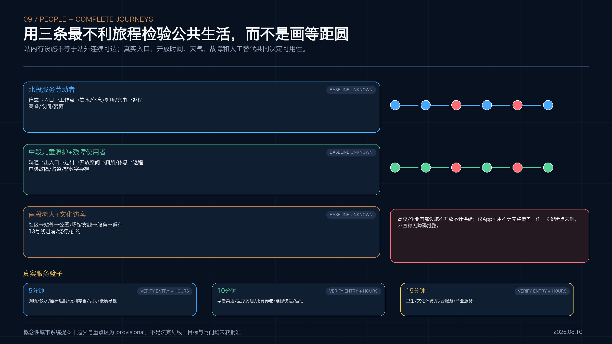

> **读图。** 读者应沿“站内—站口—过街—接驳—目的地—返程”逐段检查，而不是看一个站点圆。厕所、饮水、休息、急救和人工求助只有在真实开放、可负担、无需强制 App 且最不利时段可用时，才计入公共服务。

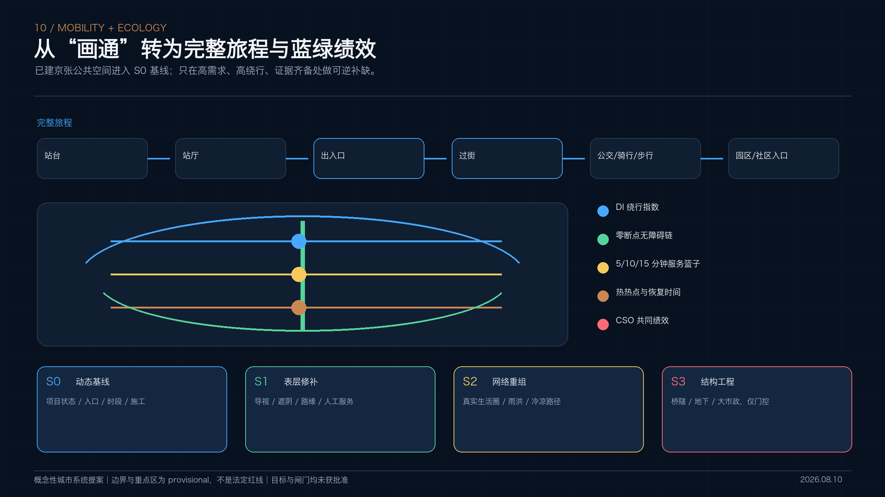

> **读图。** 左侧区分现状与施工基线、可逆修补、网络重组和结构工程四种实施深度；右侧把通行、热、雨洪和服务放进同一条旅程。方案优先做基线和可逆修补，结构工程只有在专业条件齐备后才进入论证。

## 蓝绿空间、公共空间与城市风貌

**本章结论：蓝绿空间不是再画一条轴，而是分别保证公众可达、水文安全和生态生境，并让文化记忆进入日常运营。**

蓝绿系统从“一条轴”改为三张性能网：公共可达网检查合法入口与开放时段；水文安全网检查汇水、管网、CSO、低洼点与河道高水位；生态生境网检查树木、乡土植物、鸟虫、暗区和迁移断点。京张二期和清华东路项目进入 S0 叠加层，本方案只对尚未证明的接入与绩效负责 [data:geometry/green_space.geojson#GREEN-001] [depth:blue_green_public_space]。

清河—小月河与在建 CSO 项目共用汇水分区、溢流口、施工时序和监测接口，源头减排优先于另建景观池。任何下凹绿地、亲水平台、地下空间或岸线结构都须先取得河湖管理线、洪水位、管网、土壤、地下水和水影响评价；不得把“水清岸绿”宣传语写成水质绩效 [source:BEIJING-FLOOD-PLAN-202504] [metric:cso_performance_delta]。

高温时重点旅程提出遮阴连续率不低于 70%、热热点平均辐射温度同工况降低 10℃、每 300—500 米有饮水/可坐休息或室内避暑点的方向性目标。这些不是法定指标，须经夏冬实测、树木生长、照明安防和运维校核；冬季同时检查积雪、结冰、风口和除雪责任 [source:BEIJING-HEAT-PLAN-202405] [metric:shade_continuity_target]。

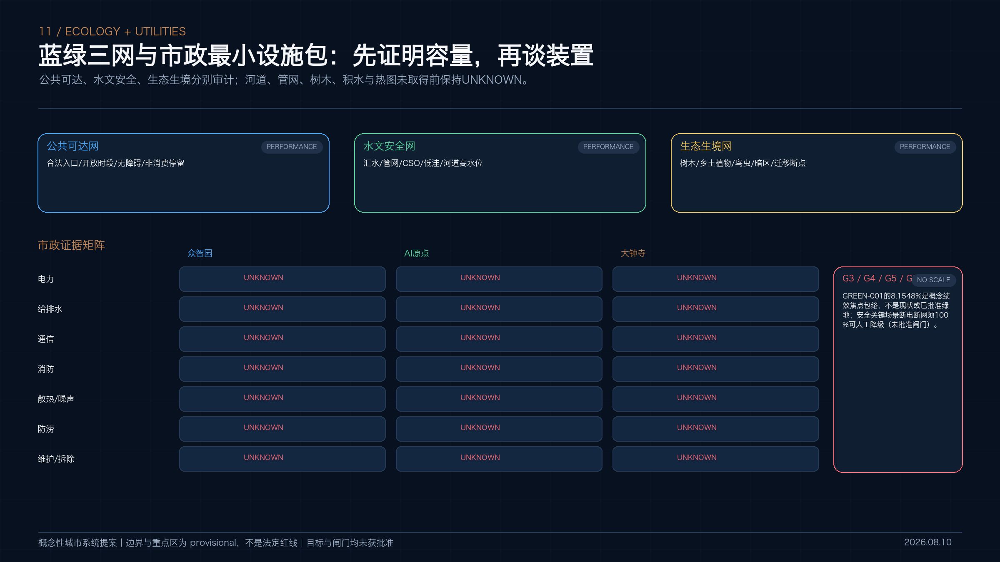

> **读图。** 公共可达、水文安全和生态生境是三张不同的网，不能用“绿量增加”替代。右侧市政矩阵提醒每个 AI 场景都要回答电、水、通信、消防、热、噪声、防涝和维护责任；任何容量未知或增加下游风险的方案不得放大。

### 公共空间组件库：同一规则、按证据组合

组件库不是采购目录，也不预设具体点位；它把反复出现的公共需求拆成可撤、可换、可维护的最小单元。北—南公共脊按连续旅程选择组件，东西接入按站口、园门、社区门和跨障碍问题组合；任何组件都先做纸质或 90 天小试，不能以“标准化”绕开权属、文保、园林、交通、水务、消防和无障碍审查。

| 组件 | 最小构成 | 使用位置与责任 | 停止/回退条件 |
| --- | --- | --- | --- |
| 日常入口包 | 开放时段、纸质地图、人工求助、座椅/饮水转介、夜间与施工替代路 | 已核验站口、园门、社区门；场地运营者每日更新 | 入口或替代路未核验时只发布已知信息，不称“已接入” |
| 完整旅程包 | 过街提示、骑行停放与装卸秩序、无障碍断点标记、返程说明 | 交通/场地责任方与使用者共同走读 | 不画未经审批的道路、桥隧或站外工程线位 |
| 冷凉雨天包 | 可移动遮阴、可坐休息、饮水/避暑转介、暴雨关闭与积水绕行牌 | 园林、场地与应急责任方按夏冬工况维护 | 树木、生境、水文或疏散风险未解时撤回临时设施 |
| 服务劳动者后台包 | 休息、饮水、充电、储物、厕所与人工求助转介 | 雇主、物业和公共服务方共同保障，不转嫁给志愿者 | 服务时段、清洁、消防或劳动责任不清即不开放 |
| 可逆测试庭包 | 地面标识、软隔离、实体停机、现场安全员、非数字说明和恢复清单 | 场景业主负责，独立方验收，公众可叫停 | 无授权、无基线、不能安全降级或不能恢复即停 |
| 公共问题台包 | 原始问题、证据状态、未决意见、纸质/电话入口、责任人与答复日 | 社区秘书处维护，独立投诉渠道关闭案件 | AI 摘要替代原文、意见被删除或无责任人时暂停 |
| 文化与荣誉包 | 大字/音频/文字稿、来源短码、提出—测试—评审—采用—停止状态 | 内容、文保、版权与无障碍责任方共同签署 | 无来源、无版权、固定装置无审批或按融资曝光排名即撤 |
| 安静与恢复包 | 免费时段、安静区、照明声响边界、后台劳动、布撤展和恢复记录 | 活动/场地运营方公开日历，居民渠道独立核验 | 盲道、休息、厕所、应急或夜间安静权受损即缩减或取消 |

组件绩效不按安装数量计分，而按完整旅程是否连续、最不利时段是否可用、维护和投诉是否闭环、撤除后空间是否恢复来判断。未经现场与主管确认，组件图示只表达性能接口，不表达产品型号、工程做法或政府采购。

### 文化叙事与三处非奇观地标

文化总题是“**从工程自强到公共智能**”：1910 年清华园车站与京张铁路代表工程自主；1949 年抵达清华园的历史承载公共责任；中关村从科研成果扩散、电子一条街到科学城说明创新依赖社区；下一百年的 AI 文化则以公开问题、可验证知识、公众参与、人类最终判断和失败可退出为核心 [source:QINGHUAYUAN-HISTORY-2021] [source:ZHONGGUANCUN-MUSEUM-2025]。

三处朝圣/荣誉地标是运营制度而非大体量建筑：清华园附近的“**第一程·责任档案**”只用经文保批准的低装置内容讲述抵达与责任；AI 原点的“**公共问题环**”展示问题提出者、证据和未决意见；大钟寺的“**百年互惠时钟**”以无强声方式显示每项试验的下一次人工复核和退出日期。无主管图件、版权、权属和运营协议时只做数字/纸质原型，不固定落位 [source:QINGHUAYUAN-CONTROL-2026] [source:DAZHONGSI-MUSEUM-2022]。

导视以轨、枕木、里程、信号为抽象语法，避免仿古复制和企业广告。任何荣誉条目区分提出、测试、评审、采用、实施、停止六种状态，并允许撤回与纠错；不按捐款、企业规模、融资额或媒体曝光排序。

## 更新项目清单、实施政策与分期计划

**本章结论：前 0—12 个月应交付底账、规则、走读和可逆试验；只有证据、权限、资金和长期责任齐备后才放大。**

### 八个近期项目包

| 编号 | 项目包 | 建议主责（未批准） | 0—12 月交付 | 放大门槛 | 退出动作 |
| --- | --- | --- | --- | --- | --- |
| P01 | 43.6 km² 经济、就业、租金与商户底账 | PMO + 法定数据责任方 | 地址级去标识数据字典和公开聚合版 | 合法权限、覆盖与缺失率披露 | 删除无授权数据 |
| P02 | 京张建成后性能审计 | PMO + 主管单位 + 独立评测 | 四样带、多时段、完整旅程、热雨洪与运维日志 | 现场和主管资料一致 | 保留问题台账，不做工程 |
| P03 | 高校成果统一入口 | 高校院所 + PMO + 权属/数据审查 | 一成果一编号、四路径、四道门 | 权属、用户、独立验证 | 失败归档与团队转介 |
| P04 | 众智共享验证台 | 众智园运营方 + 独立评测 | 测试目录、预约、统一报告、15 组跨栈验证建议 | 复现与全生命周期成本 | 设备数据迁移、通用化 |
| P05 | 小月河公开问题挑战 | 场景平台 + 公共责任方 + 社区代表 | 每季公开问题、最小数据、短周期测试 | 场地/数据授权、人工接管 | 删除数据、恢复空间 |
| P06 | 首单与采购门诊 | 大钟寺平台 + 采购/IP/法务审查 | 需求分流、市场调研、IP/风险条款 | 采购权限、竞争与利益冲突审查 | 停止不合规需求 |
| P07 | 低成本空间与基本服务保留 | 运营方 + PMO + 商户/社区代表 | 分级工位、服务清单、租金/商户基线 | 补贴不被租金吸收、服务不净减 | 递减支持与过渡安排 |
| P08 | 三重点区 S1 快速修补 | 设施主管方 + PMO + 独立评测 | 导视、遮阴休息、路缘重排、人工窗口各一组 | 90 天安全、公平、使用成效 | 无损撤除与公开复盘 |

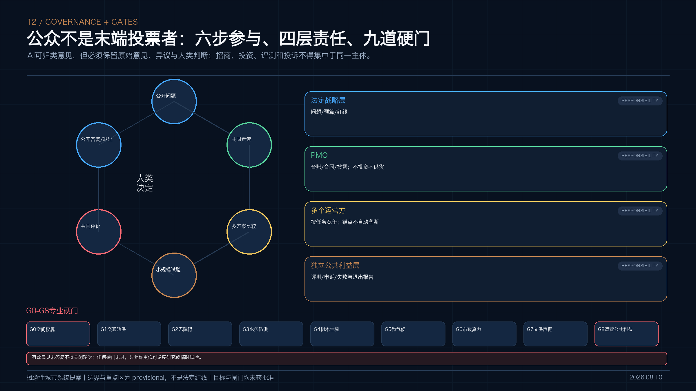

> **读图。** 左侧六步不是一次征求意见，而是从公开问题、共同走读、多案比较、小试、共评到公开答复或退出的闭环；中部把法定责任、项目管理、运营和独立评测分开；右侧九道硬门决定方案能否从研究升级到工程或长期运营。

治理建议为四层：有法定权限的战略与公共责任层；不做股权投资、不兼任供应商的创新带 PMO；多个通过合规程序取得任务的运营方；由技术安全、数据伦理、无障碍、劳动和社区代表组成的独立公共利益与评测层。基金管理人不能决定被投企业场景准入，供应商不能控制投诉和原始评测，运营方不能成为所有项目的唯一评测方 [source:BJ-GOV-INVESTMENT-FUND-202501] [depth:renewal_project_list]。

四账户严格分开：公共产品账户支付底账、无障碍、安全和独立评测；运营服务账户支付人员、物业和维护；股权基金账户只按基金章程投资企业；公共数据产品收入只能依市级授权协议使用。三年轻资产运营低/基准/高情景约 1.79/3.28/7.44 亿元，明确排除土地、建设、租金、算力硬件、股权资金和企业普惠补贴；数值是敏感性模型，不是财政承诺 [metric:three_year_operating_scenario_cny]。

三年节奏为：0—6 个月建底账、规则与首批问题；7—12 个月完成 15 个短周期试点建议；第二年形成跨核服务网络；第三年按付费转化、成本、公共价值和退出完整度决定规模化、退场或重构。运营商采用 `1+1+1` 年绩效续约建议，不形成事实永久授权 [data:geometry/phasing.geojson#PHASE-S1] [depth:phasing_implementation]。

年度文化与创新活动不另造昂贵节庆 IP，而嵌入“春季公开问题—夏季受控验证—秋季城市采用—冬季公开复盘”循环。活动占用公共空间须公布日历、免费时段、安静区、无障碍和布撤展恢复；未通过文保、安全、版权和居民安静权审查不得举行。

### 互惠四季、开发者共同体与 Agent.6 长期运营

Agent.6 不是“每年办一次大会”，而是一套让问题、团队、场地、证据、首单和退出持续对接的运营基础设施。母品牌“**互惠京张 / RECIPROCAL JING-ZHANG**”表达创新投入与公共回报的总契约，年度子品牌“**互惠四季 / RECIPROCITY SEASONS**”只承担运行节奏：春季公开问题、夏季受控验证、秋季城市采用、冬季公开复盘。四季共用同一项目编号，失败、暂停、撤回和未决异议与成功结果同样保留；品牌、日期、主办、伙伴与预算全部为 `not_approved`，不得暗示政府背书 [source:AGENT-TASKBOOK] [metric:annual_event_cycle_stage_count]。

| 运营层 | 怎么工作 | 谁负责 | 进入/停止条件 |
| --- | --- | --- | --- |
| 互惠开发者网络 | 问题提出者、开发/科研团队、维护与独评者、公共利益审查者、国际访问贡献者五类成员共同维护问题和项目 | 公共责任层定边界；社区秘书处管台账；技术维护组管版本；独立公共利益组评测 | 缴费、声望、融资或赞助不换场地、数据、采购、荣誉或豁免；冲突不披露即暂停 |
| 场景开放 | 先公开问题，再完成申请、问题/权限匹配、数据安全公平筛查、沙盒与红队方案、有时限小试、独立验收、转化决定、退出恢复八步 | 场景业主承担行业责任，PMO 管完整性，各有权责任方分别授权，供应商不得自评 | 必需授权缺口必须为 0；成功标准不得边测边改；无退出包不结项 [metric:required_authorization_gap_max] |
| 月周运行 | 每月问题与权限审查、独立复核、运营预算台账和公众答复；每周安排维护证据、问题门诊、开发者工作台、权利审查、验收转化与周末公共路线 | 运营方排班，独立层抽查，人工/电话/纸质渠道与线上并存 | 免费主线、盲道、厕所、应急或居民安静权受到不可接受影响即缩减、迁移或取消 |
| 年度复盘 | 公布真实采用、付费与就业，也公布失败、事故、投诉、删除迁移、空间恢复和下一轮问题 | PMO 汇总，独立层核验，有权机构决定续约、重采或退出 | 曝光、参会、意向、补助和关联交易不得冒充采用或首单 |

三处非奇观地标是日常岗位和服务协议，不是一次性装置：“第一程·责任档案”负责史实、版权与多格式解释；“公共问题环”负责原始意见、未决分歧和人工窗口；“百年互惠时钟”只显示项目状态、下一次人工复核与退出日期。再加一条逐段核验的公共体验路线，年度轻资产运营概念预算合计为人民币 400 万—680 万元，排除土地、租赁、永久建设、市政改造、大型设备和文物工程；低/高情景均为低置信度 `not_approved` 测算，不从股权基金或三年总预算中机械切分 [metric:agent6_landmark_annual_budget_low_scenario] [metric:agent6_landmark_annual_budget_high_scenario]。

共同 SLA 分三级：P0 涉及人身安全、严重数据事件、无障碍关键链或文保风险时立即停机，公开时段 15 分钟内人工响应、2 小时内发布状态；P1 设备或唯一入口失效时 2 小时响应、4 小时提供纸质/人工替代；P2 史实、翻译、署名或一般服务纠错 1 个工作日内确认，原则上 10 日内完成并保留版本。点位、人员编制和时限仍须由场地、专业责任方与采购合同确认。

公共体验路线按“出发前信息—站内到站外抵达—第一程·责任档案—公共问题环—百年互惠时钟—夜间或极端天气返程”逐段验收；清华园车站、大钟寺古钟博物馆、中关村村史馆、高校和未开放区段只有在开放、预约、无障碍、版权、文保、权属和合作分别确认后才作可选支线。任一关键断点未解决，就缩短路线并公开替代，不得把整条京张写成已贯通 [source:QINGHUAYUAN-OPEN-BJ-2023] [source:DAZHONGSI-MUSEUM-2022]。

国际传播也按结果漏斗而非曝光量管理：触达 → 合格到访 → 问题匹配 → 正式申请 → 获权测试 → 独立验收 → 合格首单/开源、许可或联合研发 → 12 个月留存与回流，共八段 [metric:agent6_international_conversion_stage_count]。伙伴面向高校实验室、开源和开发者组织、公共创新机构、城市部门、标准评测与无障碍机构、文化科学传播机构及市场专业服务方公开招募；对方校名、机构名或来访不等于背书、数据跨境、采购、场地或资金承诺。常设入口必须双语、可下载打印、无远程跟踪，并保留人工联系、负面结果库与退出状态。

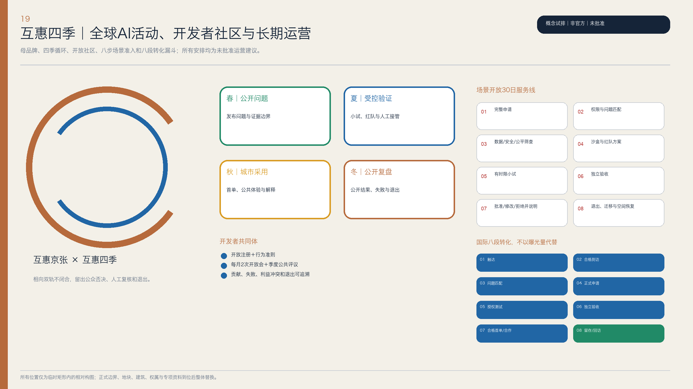

> **读图。** 左侧双轨开放标志表示创新投入和公共回报相向而不封闭，空白处保留公众否决、人工判断和退出；中部是春夏秋冬的年度循环和开发者共同体；右侧先看场景从申请到退出的八步，再看国际合作从触达到留存的八段。任何数字都是未批准的运营参数，不代表活动、伙伴或预算已经落实。

## 指标体系、面积复算与合规矩阵

**本章结论：指标的作用是区分现状、建议目标和停止条件，而不是把“已经写出一个数字”误读为“现状已经达到”。**

指标分三类。第一类是从提交 GeoJSON 可复算的设计几何值，如 provisional site area、概念用地覆盖、公共空间和绿地 focus envelope；它们必须带低/中置信度。第二类是有官方约值或项目状态支撑的事实，如 11.4 平方公里公告面积和三处重点区数量。第三类是需要现场/运营数据建立绩效基线的指标，如绕行、无障碍、付费转化、租金、热雨洪和公共参与；当前/基线尚未采集时记录为 `status=unknown`、`value=null` 并说明原因，方案提出的量化目标或退出闸门则可记录为 `status=known`，同时分别标注 `value_role=proposal_target` 或 `value_role=proposal_gate`、`approval_status=not_approved`。这里的 known 只表示参数已在方案中明确，不表示现状达成、政府目标或实施承诺 [metric:site_area_sqm] [metric:key_area_count] [depth:metrics_recalculation]。

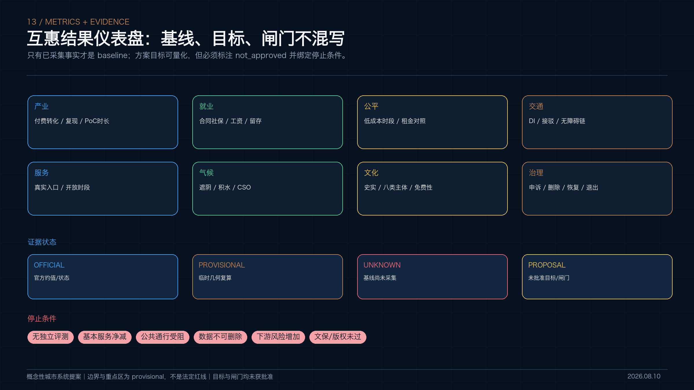

> **读图。** 指标不是分数榜，而是一组防止项目“只算投入、不算回报”的校验。蓝色事实、黄色假设、绿色试验和铜色放大必须逐级推进；达到建议目标也不自动获得政府授权，未采集的基线继续保持 unknown/null。

| 维度 | 核心指标 | 建议目标/闸门 | 防刷量规则 |
| --- | --- | --- | --- |
| 产业 | PoC 中位天数、12 月外部付费转化、独立复现 | 第三年 ≤45 天、≥25%、≥90% | 关联方和政府补助不算外部付费 |
| 就业 | 合同社保、工资分布、12 月留存、训练后三月去向 | 基线后逐年改善 | 实习、众包、志愿者单列 |
| 公平 | 低成本有效时段、基本服务不净减、租金相对对照 | 异常高于对照 5 个百分点触发审查 | 只算实际使用，不算挂牌面积 |
| 交通 | DI、站口接驳、路缘冲突、零断点无障碍链 | 重点 OD DI 较 S0 降 20%；关键链 100% | 不用直线圆和站内清单代替旅程 |
| 服务 | 5/10/15 分钟服务篮子、夜间厕所/求助/替代路 | 各主体分别报告 | 关闭或不可负担设施不计供给 |
| 气候 | 遮阴、热热点、积水恢复、CSO 共同绩效 | 不增加下游风险；目标经专业核定 | 不认领在建水务项目成效 |
| 文化 | 史实来源、八类主体覆盖、意见闭环、免费公共性 | 史实/意见闭环 100% | 客流和曝光不作为主绩效 |
| 治理 | 投诉、数据删除/迁移、空间恢复、退出完整 | 到期 100% | 无退出报告不结项付款 |

`compliance_matrix.json` 覆盖公告目的、总体设计、三处重点区和 agent.1—agent.6；`standard_matrix.json` 区分 mandatory、official snapshot 缺失和专业深化；`design_depth_matrix.json` 不把 unknown 项伪装成 complete。现场/运营指标完成采集后，必须在指标记录中补充公式、单位、来源、采样日期、适用人群、天气/施工状态、置信度和必要假设；采集与校验完成前，基线保持 unknown/null，已记录的 proposal target/gate 仍只是未获批准的方案参数，不得写成已达成绩效。

## 风险、版权与合规说明

**本章结论：最大风险不是方案不够大胆，而是把临时几何、公开新闻、建议参数或 Agent 推演升级成法定边界、实施事实和政府承诺。**

最大风险不是“图不够细”，而是把临时边界、活动新闻、项目批复或 Agent 推断写成 official/已实施事实。方案已将 43.6/37 平方公里、众智园/学北园、二期完工/现场绩效、已批/已建、站内设施/完整旅程等冲突分别登记；正式公告和后续答疑优先，其他口径只作背景 [source:SOURCE-REGISTRY] [depth:risk_missing_data]。

专业硬门包括：G0 official 空间与权属；G1 交通/轨保/施工接口；G2 无障碍专业审查和使用者验收；G3 水务防洪与 CSO 接口；G4 树木生境和园林；G5 夏冬微气候与职业健康；G6 市政能源算力；G7 文保与声振；G8 全生命周期运营与公共利益。任一门未通过，只允许更低可逆度的研究或临时试验，不得升级为永久工程。

公平风险按触发信号管理：租金相对对照异常、基本生活服务净减、品牌活动侵占公共时段、无合同社保岗位、算法无法申诉、供应商不能导出数据、史实/版权未通过、无障碍链任一点断裂，都触发暂停、冻结扩张、重做或退出。当前没有证据证明项目区已经发生绅士化，因此只将其作为需建立基线和对照的风险假说 [source:BEIJING-URBAN-RENEWAL-REGULATION-2022]。

文本、图层、图表、HTML 与 PDF 由本次多 Agent 协作原创生成；没有使用商业地图瓦片、新闻图片、企业 Logo、人物肖像、远程字体或未清权素材。官方网页只被摘要并登记发布者、链接、访问日、用途和限制。清华园、大钟寺、中关村等文化内容在实施前仍需主管部门、场馆、权利人和版权复核 [source:COPYRIGHT-STATEMENT]。

本成果是开放共创的概念性城市设计建议，不替代法定规划、文保方案、交通设计、水影响评价、市政专项、采购文件或政府决定。完整声明见 `report/copyright_statement.md`。

## 参考资料

- 北京市规划和自然资源委员会海淀分局，《百年京张 AI 创新带城市设计国际方案征集资格预审公告》 [source:OFFICIAL-ANNOUNCEMENT]
- 北京市园林绿化局，京张一期与二期公共空间项目公开信息 [source:JZ-PARK-PHASE1-202306] [source:JZ-PARK-PHASE2-202607]
- 北京市文物局与海淀区政府，清华园车站旧址保护与历史资料 [source:QINGHUAYUAN-CONTROL-2026] [source:QINGHUAYUAN-HISTORY-2021]
- 海淀区 2025 年统计公报、AI 原点社区和 2026 年产业政策公开资料 [source:HD-STAT-BULLETIN-2025] [source:HD-AI-ORIGIN-202601]
- 北京市无障碍、城市更新、公共数据授权和防汛/高温政策 [source:BEIJING-ACCESSIBILITY-REGULATION-2021] [source:BJ-PUBLIC-DATA-AUTH-202607]
- 五个国际案例的公共机构资料，完整用途与不可外推边界见 `sources.json`。
