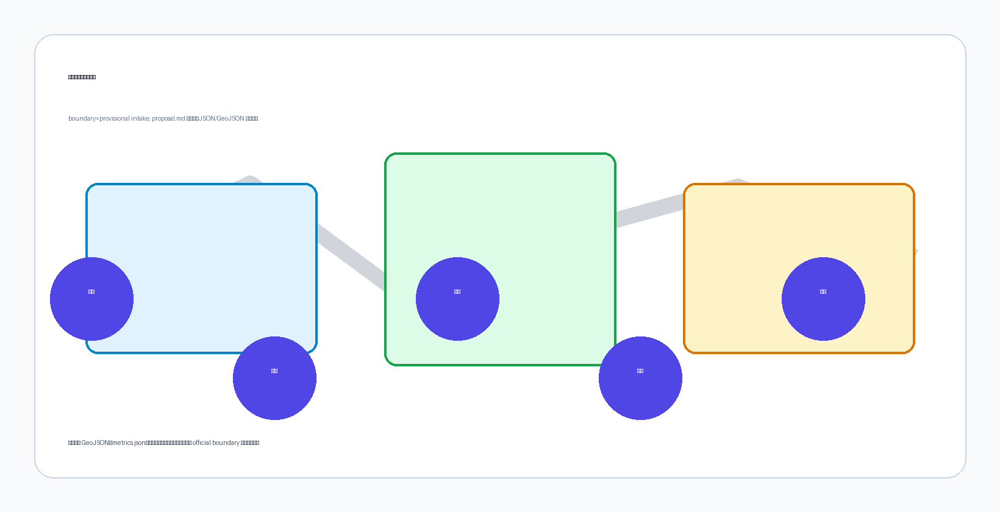
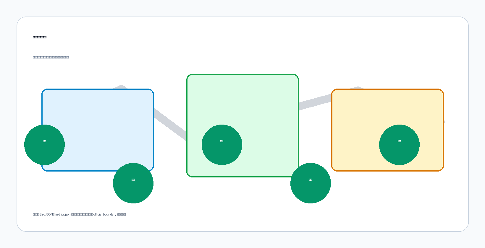
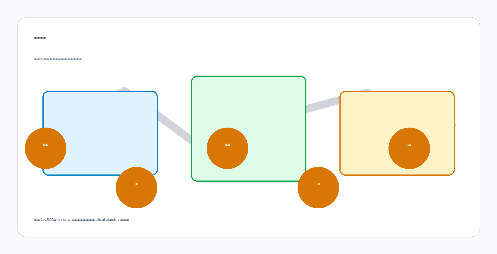
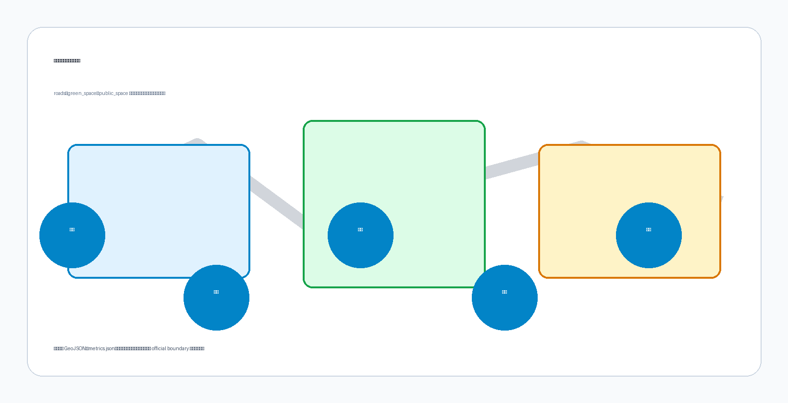
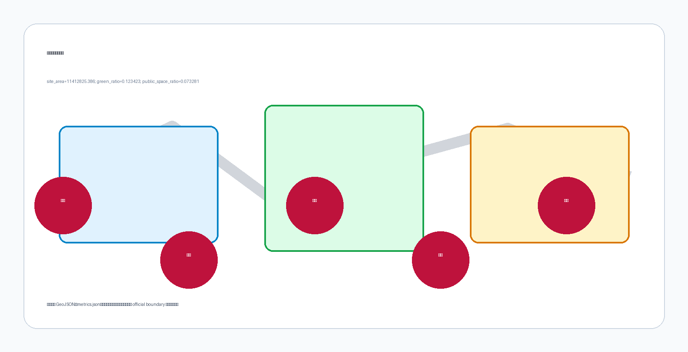

## 设计依据与资料清单

本 formal 方案以北京市规划和自然资源委员会海淀分局发布的《百年京张AI创新带城市设计国际方案征集资格预审公告》为第一依据，并以 `brief/site-package/` 中经维护者登记的临时粗略边界、重点区域、枚举、指标和来源清单为机器可读依据。AI agent 在生成方案前必须读取 `design_brief.json`、`allowed_design_space.json`、`sources.json`、`enums/`、`ranges/`、`schemas/`、`data/source_registry.json` 和 `data/processed/agent_fact_pack.md`，并用 `project_scope_summary.csv`、`agent_task_requirements.csv`、`source_use_matrix.csv`、`missing_data_checklist.csv` 建立任务、范围、资料用途和缺口清单。所有设计判断都要拆分为可追溯来源、可复算指标、可校验图层和可人工复核假设。公告要求方案达到控制性详细规划的城市设计深度和规划综合实施方案的城市设计深度，因此文本叙述不能替代 GeoJSON、指标表、A3 文册、A0 展板和 HTML 电子展示成果。

方案不是独立愿景文本，而是从公告、面向智能体任务书和场地资料出发组织成果；本节只把最关键依据放在判断旁边 [source:OFFICIAL-ANNOUNCEMENT] [source:AGENT-TASKBOOK] [depth:existing_conditions_diagnosis]。完整来源和标准覆盖分别保存在 `sources.json`、`standard_matrix.json` 与 `design_depth_matrix.json`，不在正文重复机器索引。

资料登记表的使用边界如下 [source:SOURCE-REGISTRY]：

- data/source_registry.json 登记公开、清权与临时资料的用途边界。
- 当前登记摘要：formal 可用资料 7 条，背景资料 1 条，provisional-only 资料 1 条。
- agent 不得把 background_only 或 provisional_only 资料升级为 official boundary、法定控规、正式评分依据或政府实施承诺。

`data/processed/agent_fact_pack.md` 是本方案的阅读导航层，不是新的权威来源 [source:PROCESSED-FACT-PACK]。它帮助 agent 把三层范围、三处重点区、公告任务、agent.1-agent.6、资料可用性和缺资料事项组织成可读方案；事实判断仍需回到已登记的原始材料 [source:OFFICIAL-ANNOUNCEMENT] [source:AGENT-TASKBOOK]，完整来源关系由 `sources.json` 保存。

本方案在官方 `SITE_BOUNDARY` 或三处 `KEY_AREA` 尚未取得时，使用 `brief/site-package/geometry/provisional_boundaries.geojson` 生成临时 formal 包。提交包中的 `geometry/site_boundary.geojson` 与 `geometry/key_areas.geojson` 均必须标注为 `provisional_constraint`、`official_boundary=false`，只能用于方案生成、自检、可视化和设计讨论，不能作为 official redline、审批依据、精确面积依据或法定控制结论。该组织方数据缺口本身不阻断内容评分；替换 official polygons 后，site boundary、key areas、land use、roads、green space、public space、buildings、phasing 和 metrics 均需重算。

本次方案生成的可评分状态为：**临时边界，保留精度警示并待正式数据发布后复算；不阻断内容评分**。因此，正文中的空间结构、场景、项目和指标均按"可讨论、可复核、可替换官方边界后重算"的原则写入；当官方边界和重点区 polygon 更新后，agent 必须重新运行方案生成、自检和图纸/HTML生成，不能只替换单个文件。

边界解释可回到总体范围图层和面积复算 [data:geometry/site_boundary.geojson#SITE-001] [metric:site_area_sqm]。三处重点区则由独立图层和数量指标核对 [data:geometry/key_areas.geojson#PROV-KEY-001] [metric:key_area_count]。这意味着读者可以从正文进入证据，但不必先读一串机器编号。

## 发展愿景：对标国际知名科技城区

本方案对标以下国际知名科技城区的发展路径与空间组织模式，提炼可借鉴的规划原则 [source:OFFICIAL-ANNOUNCEMENT] [standard:PROJECT-OFFICIAL-ANNOUNCEMENT]：

| 对标案例 | 核心特征 | 借鉴要点 |
| --- | --- | --- |
| 硅谷 Sand Hill Road | 风险资本-高校-企业的地理集聚 | 构建大钟寺-中关村-清华沿线的"资本-技术-人才"走廊 |
| 伦敦 King's Cross | 历史铁路枢纽转型为知识经济街区 | 京张遗址公园作为城市更新与创新锚点的复合利用模式 |
| 纽约 Cornell Tech 罗斯福岛 | 校区-园区-社区深度融合 | 北京AI原点社区的近校型创新生态组织 |
| 新加坡 one-north | 花园中的创新园区 | 蓝绿空间与AI产业展示、测试、交往的复合设计 |
| 东京丸之内 | 大企业总部-国际路演-商业服务集成 | 大钟寺AI产业聚集区的头部企业与国际交往功能组织 |

方案不追求简单复制上述案例，而是提取其底层逻辑——历史资产活化、创新主体集聚、蓝绿空间嵌入、交通枢纽一体化——并转化为京张铁路遗产公园特有的时间叙事空间策略 [depth:overall_spatial_structure]。

## 核心概念：百年京张·科技时间线

**核心概念："百年京张·科技时间线"（Centennial Jing-Zhang SciTech History Timeline）**——以京张铁路遗址公园9公里主轴为时间轴线，将100余年科技发展史（铁路1909 → 中关村1980s → 互联网2000s → AI 2026+）转化为可步行穿越、可交互体验的城市叙事空间。

概念的基础逻辑是：京张铁路本身是中国近代科技自立自强的起点（1909年詹天佑主持修建），其遗址公园的空间轴线恰好穿越了海淀从"中关村电子一条街"（1980s）到"互联网产业集聚"（2000s）再到"全球AI创新高地"（2026+）的完整科技演进历程。本条轴线本身就是一条物理化的时间线，每一步行走都是一次纪元的穿越 [source:AGENT-TASKBOOK]。

概念通过以下设计操作实现：

1. **时间锚点标记**：在每个纪元对应的空间段落设置地标性装置、数字界面或景观叙事节点，形成"走一段路，读一段历史"的体验节奏。
2. **空间-时间映射**：将9公里主轴按四纪元比例分配物理距离，每个纪元段落内植入对应时代的产业特征空间、材料语言和交互方式。
3. **交互叙事层**：通过AR导览、AI语音助手、数字孪生界面等轻量技术手段，使游客和从业者可以自主选择"时间层"进行浏览——从1909年的蒸汽机车到2026年的自动驾驶接驳。

## 空间结构：一轴·三核·四纪元·多节点

方案的空间组织框架为 **"一轴·三核·四纪元·多节点"**，由 [depth:three_level_scope_framework] 和 [depth:overall_spatial_structure] 深度约束，空间证据以 [data:geometry/site_boundary.geojson#SITE-001] 与 [data:geometry/key_areas.geojson#PROV-KEY-001] 为准，任务依据以 [standard:PROJECT-OFFICIAL-ANNOUNCEMENT] 为准。

### 一轴 — 9公里京张铁路遗址公园主轴

京张铁路遗址公园全线约9公里，南起西直门、北至清河，是连接海淀三大AI产业核心区的线性公共空间骨架。方案将该轴定义为"时间轴线"，沿南北方向依次展开四个科技纪元 [data:geometry/public_space.geojson#PUBLIC-001]。

### 三核 — 三处重点产业片区

| 重点片区 | 用地面积 | 设计定位 | 纪元归属 |
| --- | --- | --- | --- |
| 大钟寺AI产业聚集区 | 72ha | 城市型智能经济与国际交往街区 | AI 2026+（未来纪元门户） |
| 众智园AI自主创新加速区 | 192.1ha | 花园型全栈自主创新街区 | 互联网2000s→AI 2026+（过渡纪元） |
| 北京AI原点社区 | 104.3ha | 近校型成果转化与人才社区 | 中关村1980s→互联网2000s（创新原点纪元） |

三处核心区分别对应 [data:geometry/key_areas.geojson#PROV-KEY-001]（大钟寺）、[data:geometry/key_areas.geojson#PROV-KEY-002]（众智园）、[data:geometry/key_areas.geojson#PROV-KEY-003]（北京AI原点社区），并由 [depth:three_key_area_detailed_design] 检查是否达到规划综合实施方案深度。

### 四纪元 — 沿时间轴的空间叙事

| 纪元 | 时间跨度 | 对应空间段落 | 空间特征 | 文化符号 |
| --- | --- | --- | --- | --- |
| 纪元一：铁路纪元 | 1909-1970s | 西直门-大钟寺段 | 工业遗产保护、铁轨遗迹、蒸汽机车文化 | 詹天佑铜像、清华园火车站、铁轨铺装 |
| 纪元二：中关村纪元 | 1980s-1990s | 大钟寺-中关村段 | 电子一条街记忆、院墙打开、创新孵化 | 中关村电子卖场记忆装置、知识共享广场 |
| 纪元三：互联网纪元 | 2000s-2010s | 中关村-五道口段 | 互联网企业总部、创业咖啡、开放交流 | 互联网企业标识墙、创业路演亭 |
| 纪元四：AI纪元 | 2026+ | 五道口-清河段 | AI原生建筑、自动驾驶接驳、智能公共空间 | AI艺术装置、数字交互界面、未来体验馆 |

### 多节点 — ~12个弹性开源空间节点

沿时间轴布置约12个弹性开源空间节点，每个节点可独立运营、灵活组合，承载AI产业展示、公共体验、社区服务和创新交往功能 [metric:key_area_count]。节点采用"轻量建造+可编辑内容"模式，允许运营方根据技术迭代和社区需求动态替换功能内容。

## AI产业生态：四纪元产业图谱

方案沿时间轴构建四纪元产业图谱，每个纪元对应特定的产业主题和空间组织逻辑 [source:AGENT-TASKBOOK] [standard:PROJECT-AGENT-OPEN-CALL-TASKBOOK]：

| 纪元 | 产业主题 | 代表机构/企业类型 | 空间需求 |
| --- | --- | --- | --- |
| 铁路纪元 | 基础设施与工程自信 | 铁路博物馆、工程教育体验 | 文物展示、体验教育、文化空间 |
| 中关村纪元 | 电子与信息技术启蒙 | 高校实验室、孵化器、早期科技企业 | 灵活办公、共享实验室、成果展示 |
| 互联网纪元 | 平台经济与数字服务 | 头部互联网企业、独角兽、科技媒体 | 总部办公、开放协作、品牌展示 |
| AI纪元 | 大模型与智能体生态 | AI大模型企业、智能体开发者、开源社区 | 算力设施、测试场景、国际路演 |

### 12个核心AI产业场景

方案识别以下12个核心AI产业场景，覆盖从基础研发到公共体验的全链条 [source:AGENT-TASKBOOK]：

| 编号 | 场景名称 | 空间载体 | 纪元归属 | 运营主体类型 |
| --- | --- | --- | --- | --- |
| AI-01 | 大模型训练场 | 众智园算力中心 | AI纪元 | 科研机构/企业 |
| AI-02 | 开源协作社区 | 北京AI原点社区 | 互联网→AI | 开源基金会/社区 |
| AI-03 | 智能体开发者工坊 | 大钟寺AI聚集区 | AI纪元 | 开发者社区 |
| AI-04 | 端侧AI硬件测试场 | 众智园开放空间 | AI纪元 | 硬件企业 |
| AI-05 | AI安全治理实验室 | 众智园 | AI纪元 | 研究机构/政府 |
| AI-06 | 数据要素交易所 | 大钟寺片区 | AI纪元 | 数据交易平台 |
| AI-07 | AI+医疗体验中心 | 总体设计范围节点 | AI纪元 | 医疗机构/企业 |
| AI-08 | AI+教育创新实验室 | 近高校节点 | 中关村→互联网 | 高校/教育企业 |
| AI-09 | 自动驾驶接驳环线 | 京张遗址公园沿线 | AI纪元 | 自动驾驶企业 |
| AI-10 | AI艺术与媒体中心 | 大钟寺-五道口段 | 互联网→AI | 媒体/艺术机构 |
| AI-11 | 国际AI路演中心 | 大钟寺站点周边 | AI纪元 | 投资机构/加速器 |
| AI-12 | 公共AI体验馆 | 三处核心区入口 | 全纪元 | 文化机构/政府 |

## AI原生城市形态

AI时代的城市空间形态将从"功能分区"转向"场景复合"。方案提出以下AI原生城市形态原则 [depth:land_use_layout] [depth:development_intensity_controls]：

1. **建筑-算法融合**：建筑立面集成传感器、显示界面和环境响应装置，使建筑本身成为AI交互的物理界面。建筑基底以可编辑、可重构的空间模块为主，支持快速功能切换 [data:geometry/buildings.geojson#BLDG-001] [metric:building_footprint_area_sqm]。

2. **公共空间即测试场**：公共空间不仅是社交场所，也是AI产品的真实世界测试环境——自动驾驶、机器人配送、环境监测、智能照明等场景在真实城市环境中运行 [data:geometry/public_space.geojson#PUBLIC-001]。

3. **数据驱动的空间迭代**：利用AI分析人流、活动、能耗和空间使用数据，支持城市空间的动态调整和功能优化，形成"运营-感知-调整"的闭环。

4. **低碳智能基础设施**：分布式能源、端侧算力、智能电网与建筑一体化设计，形成AI时代的低碳城市基础设施底座 [data:geometry/constraints.geojson#CONSTRAINTS]。

## 交通与新型基础设施：三层慢行网络 + 4+1新基建

### 三层慢行网络

方案构建"快-慢-静"三层慢行网络，以京张遗址公园主轴为脊梁，串联三处核心区和多节点，由 [depth:traffic_rail_slow_parking] 约束交通专业深度 [data:geometry/roads.geojson#ROAD-001]：

| 层级 | 速度 | 功能定位 | 空间载体 | 服务对象 |
| --- | --- | --- | --- | --- |
| 快层：通勤慢行 | 12-15km/h | 轨道站点-办公-居住的高效通勤 | 林荫骑行干道、共享单车廊道 | 通勤者、上班族 |
| 慢层：休闲慢行 | 4-8km/h | 公园漫步、文化体验、公共社交 | 京张遗址公园主步道、滨水步道 | 居民、游客、从业者 |
| 静层：沉浸慢行 | 0-3km/h | AI交互体验、场景沉浸、驻足停留 | 场景节点内部、交互装置周边 | 科技爱好者、体验者 |

三层网络通过以下方式实现连通 [data:geometry/public_space.geojson#PUBLIC-001]：
- 跨环路节点：在北五环、西直门等关键断点设置上跨或下穿慢行桥，实现9公里主轴全线贯通
- 站点接驳：大钟寺站、清华东路西口站、五道口站等轨道站点设置共享单车集中停放区与慢行优先通道
- 公共空间串联：慢行路线与绿廊、滨河空间、商业街区和产业展示廊道一体化设计

### 4+1 新型基础设施

| 类别 | 基础设施 | 空间布局 | 与AI场景关联 |
| --- | --- | --- | --- |
| 感知层 | 城市传感器网络、边缘计算节点 | 沿主轴每500m设置感知节点 | 为AI场景提供实时环境数据 |
| 计算层 | 端侧算力驿站、分布式算力节点 | 结合公共设施和建筑首层 | 支撑端侧AI推理和数据处理 |
| 网络层 | 低延迟5G专网、LoRa物联网络 | 全域覆盖，重点区域增强 | 保障自动驾驶、实时交互的通信需求 |
| 能源层 | 光伏路面、智能微电网、无线充电 | 沿慢行道和公共空间布置 | 为AI装置和电动接驳提供绿色能源 |
| +1 运营层 | AI城市操作系统（CityOS） | 数字孪生平台，运行于云端 | 集成调度、监测、预警和场景管理 |

## 公共空间活力：一廊三园多节点

公共空间系统以"一廊三园多节点"为骨架，由 [depth:blue_green_public_space] 与 [data:geometry/green_space.geojson#GREEN-001] 校核，公共空间比例在正文解释设计意义，完整复算保存在 `metrics.json` [metric:public_space_ratio] [metric:green_ratio]：

- **一廊**：京张遗址公园9公里科技文化走廊，是全线公共空间的主骨架，承载慢行、文化展示、AI交互和公共活动。
- **三园**：三处核心区分别对应一个主题公共空间——
  - 大钟寺站前广场复合生态公园（城市客厅型）
  - 众智园清河低碳创新公园（产业展示+生态型）
  - 北京AI原点社区知识共享公园（社区+创新型）
- **多节点**：约12个沿街小尺度公共空间节点，嵌入社区服务、AI体验和微绿地功能。

### 公共空间AI场景

公共空间与AI场景的复合关系如下：

| 公共空间类型 | AI场景嵌入 | 数据支撑 |
| --- | --- | --- |
| 科技文化走廊 | AR时间线导览、AI语音解说、历史场景复原 | [data:geometry/public_space.geojson#PUBLIC-001] |
| 站前广场复合公园 | 自动驾驶接驳站点、智能安检、人流热力感知 | [data:geometry/green_space.geojson#GREEN-001] |
| 清河低碳创新公园 | 环境监测AI、生态数据可视化、低碳互动装置 | [data:geometry/green_space.geojson#GREEN-001] |
| 知识共享公园 | 户外协作AI助手、智能预约空间、活动信息发布屏 | [data:geometry/public_space.geojson#PUBLIC-001] |

## 文化叙事：三层文化叙事

方案构建三层文化叙事体系，覆盖从宏观城市品牌到微观场景体验的完整文化表达 [standard:MOHURD-URBAN-DESIGN-MEASURES]：

### 第一层：城市品牌叙事（宏观）

**"百年京张·科技时间线"** 作为城市品牌，承载以下文化内涵：
- 从"中国铁路之父"詹天佑到"中国AI之都"的科技自强叙事
- 从实体工业到数字智能的产业演进叙事
- 从封闭厂区到开放公园的城市更新叙事

品牌视觉系统包括：时间线LOGO、纪元色彩体系、导视标识系统、公共艺术策略和数字界面设计规范。

### 第二层：空间叙事（中观）

沿9公里主轴，以四纪元的空间段落为单位，每个纪元段落通过以下要素完成叙事：
- **地面铺装**：每纪元采用不同的材料、色彩和纹理，形成触觉上的"时间地层"
- **景观装置**：纪元界碑、时间刻度柱、历史事件地刻
- **建筑风貌**：各纪元段落建筑立面风格从工业遗产→现代主义→参数化AI原生建筑渐变
- **声景设计**：从蒸汽笛声→电子卖场广播→互联网提示音→AI语音的环境声景过渡

### 第三层：交互叙事（微观）

在12个弹性节点和公共空间触点，通过轻量技术手段实现交互叙事：
- AR历史复原：在清华园火车站等历史节点，通过手机AR叠加历史影像
- 时间线交互屏：在关键节点设置可触摸时间线界面，展示四纪元大事记
- AI对话助手：在AI纪元段落，通过对话式AI介绍园区功能、企业故事和未来规划
- 贡献者数字墙：在开源社区节点，展示AI开发者、项目和社区贡献的动态数据可视化

## AI场景卡：12场景卡

以下12张AI场景卡对应方案核心AI应用场景，每张场景卡包含服务对象、空间位置、数据来源、隐私边界、人工复核机制和运营主体 [source:AGENT-TASKBOOK] [depth:renewal_project_list]：

| 场景卡 | 场景名称 | 空间载体 | 核心功能 | 服务对象 | 数据来源 | 隐私边界 | 人工复核 |
| --- | --- | --- | --- | --- | --- | --- | --- |
| SC-01 | 开源发布厅 | 北京AI原点社区 | 代码展示、路演、黑客松 | 开源开发者 | 公开代码库 | 不采集个人数据 | 活动内容审核 |
| SC-02 | 安全治理沙盒 | 众智园 | 模型测试、红队演练、标准展示 | AI企业、研究者 | 模拟数据 | 测试数据本地处理 | 专业审核员 |
| SC-03 | 端侧算力驿站 | 沿街公共服务节点 | 端侧AI推理、开发者工具 | 开发者、初创团队 | 匿名化日志 | 算力服务授权 | 系统自动审核 |
| SC-04 | AI慢行导航 | 京张遗址公园沿线 | 无障碍导航、拥挤预警 | 游客、居民 | 聚合人流数据 | 不追踪个人轨迹 | 运营方复核 |
| SC-05 | 国际路演大厅 | 大钟寺AI聚集区 | 项目路演、投资对接、媒体发布 | 创业者、投资人 | 企业提交资料 | 企业数据授权 | 专业审核 |
| SC-06 | 清河低碳创新廊 | 众智园临清河界面 | 环保数据展示、低碳体验 | 公众、学生 | 环境传感器 | 公共环境数据 | 数据校准复核 |
| SC-07 | 近校成果转化街 | 北京AI原点社区 | 孵化、展示、投融资对接 | 高校师生 | 成果资料 | 科研成果授权 | 高校审核 |
| SC-08 | 数据要素会客厅 | 大钟寺片区 | 数据交易、合规展示、授权服务 | 数据企业 | 授权数据 | 严格数据授权 | 合规审核 |
| SC-09 | AI生活服务样板街 | 社区-商业交汇处 | 医疗、教育、法律服务AI | 居民 | 服务方数据 | 最小必要原则 | 专业审核员 |
| SC-10 | 自动驾驶接驳 | 京张遗址公园主轴 | 无人接驳车、预约出行 | 从业者、游客 | 交通数据 | 匿名化轨迹 | 安全员监控 |
| SC-11 | AR时间线导览 | 四纪元段落 | 历史复原、场景叠加、叙事导览 | 游客、科技爱好者 | 公开历史资料 | 不采集用户数据 | 内容审核 |
| SC-12 | AI艺术互动装置 | 公共空间节点 | 生成艺术、智能对话、数据可视化 | 全人群 | 环境数据 | 不采集个人数据 | 定期审核 |

所有AI场景节点必须进入结构化图层或合规矩阵，便于评审者看到它们与产业、空间和公共利益之间的关系。AI治理建议遵守数据最小化、公开来源、可解释和人工复核原则 [source:OFFICIAL-ANNOUNCEMENT]。

## 用地、建筑规模与拆改留方案

用地方案应依据国土空间调查、规划、用途管制分类等公开标准表达，形成完整、闭合、无缝的用地分区。建筑方案应区分保留、改造、更新、新建或待确认对象，明确建筑基底、功能、规模、风貌、屋顶、体量和高度控制的建议层级。若缺少现状建筑、权属、控规和工程条件，方案只能提出方法和待校准清单，不能编造拆改留结论。

用地分类依据 [standard:MNR-LAND-USE-CLASSIFICATION-GUIDE]，建筑高度、体量、界面和风貌控制由 [depth:height_massing_character] 管理，拆改留方法由 [depth:retain_renovate_demolish] 管理。用地和建筑的主要证据是 [data:geometry/land_use.geojson#LU-001]、[data:geometry/buildings.geojson#BLDG-001] 和 [metric:building_footprint_area_sqm]。

建筑规模和强度指标必须与 `metrics.json` 和图层一致。若总建筑规模、容积率、建筑高度、建筑密度、绿地率、退线和建筑控制线缺少官方条件，应统一使用 `status=unknown`，并在 `reason` / `assumptions` 中说明待补条件、当前假设和正式数据到位后的复算路径，不得用固定数值制造精确感。A3 文册应给出更新项目清单和指标复核表，A0 展板应把关键空间结构和重点片区表达清楚，HTML 页面应提供指标和图层联动查看。

## 交通、轨道、市政与公共服务设施

交通方案应回应公告对轨道站点一体化、道路微循环、慢行断点、对外交通、停车、非机动车停放和绿色交通系统的要求。重点应覆盖北五环、京张遗址公园跨环路节点、五道口、清华东路西口、大钟寺站及重点企业周边交通联系。道路和慢行图层应保持在提交边界内，并与公共空间、绿地、产业节点和重点片区相互校核；若提交边界为 provisional，交通结论也只能作为临时设计讨论。

交通和市政专业深度分别由 [depth:traffic_rail_slow_parking] 与 [depth:municipal_new_infrastructure] 约束；图层证据引用 [data:geometry/roads.geojson#ROAD-001]、[data:geometry/public_space.geojson#PUBLIC-001] 和 [data:geometry/constraints.geojson#CONSTRAINTS]。当道路红线、管线、消防和市政条件缺失时，应通过 assumptions 说明待补，而不是把策略写成审定条件。

市政和公共服务设施应覆盖AI产业服务设施、创新服务平台、人才生活服务设施、新型基础设施、分布式能源、端侧算力和传统市政设施融合。方案应说明设施标准、空间布局、服务半径、运营模式和分期实施逻辑。缺少管线、能源、排水、防洪、消防等工程资料时，应列为正式深化前置条件。

## 蓝绿空间、公共空间与城市风貌

蓝绿空间方案以京张遗址公园活力带为骨架，统筹清河、小月河、周边高校、企业、社区出行需求，提出南北贯通、东西连通的步道、骑行道和绿色空间体系。方案应识别慢行断点、上跨环路节点、公园南端和北端景观节点，提出停车、体育、创新交往、科技测试、应用展示和公共服务复合利用策略。

蓝绿公共空间由设计深度项和绿地、公共空间图层共同校核 [depth:blue_green_public_space] [data:geometry/green_space.geojson#GREEN-001] [data:geometry/public_space.geojson#PUBLIC-001]。绿地与公共空间比例在正文解释设计意义，完整复算保存在 `metrics.json`；城市风貌、公共空间和建筑控制的统筹则回到专业标准矩阵 [standard:MOHURD-URBAN-DESIGN-MEASURES]。

城市风貌方案以"三层文化叙事"体系为内核，融合京张铁路历史文化、中关村创新文化和AI创新文化，利用清华园火车站、北影等文化资源，提出城市基调、建筑风貌、屋顶形态、体量、界面和公共艺术引导。agent 还应提出导视标识、文化符号、国际传播叙事、AI朝圣地标、贡献墙或荣誉展示体系，但所有品牌、字体、图像、肖像和企业标识都必须有清权来源。风貌控制应分清官方管控、设计建议和待确认条件，严禁在没有文保或控规依据时给出伪精确控制线。

## 运营机制：City as Repo + 三阶段实施

### City as Repo 理念

方案提出"City as Repo"（城市即仓库）运营理念——将城市空间的更新和运营视为一个开源仓库，每个场景节点、公共空间、基础设施单元都可以被"fork"（复制采纳）、"commit"（提交更新）、"pull request"（申请变更），实现城市空间和功能的动态迭代 [source:AGENT-TASKBOOK] [depth:renewal_project_list]。

核心机制包括：
- **场景节点标准化接口**：每个弹性节点定义标准化的空间尺寸、能源接口、网络接口和数据接口，使不同运营方可以快速部署和替换功能
- **开源内容协议**：公共空间的文化内容、艺术装置、交互界面采用类似开源社区的贡献模式，允许社区提交内容、评审后上线
- **运营数据透明化**：场景节点的使用数据、能耗数据、满意度数据通过CityOS平台公开，支撑持续优化

### 三阶段实施计划

实施计划由 [depth:phasing_implementation] 管理，分期空间证据为 [data:geometry/phasing.geojson#PHASE-001]：

| 阶段 | 时间 | 重点任务 | 投资类型 | 风险等级 |
| --- | --- | --- | --- | --- |
| 第一阶段：快闪激活 | 0-1年 | 临时装置、AR导览、自动驾驶接驳试点、开源社区活动、轻量场景节点 | 运营投入/轻量基建 | 低（可逆） |
| 第二阶段：系统搭建 | 1-3年 | 三层慢行网络贯通、端侧算力驿站部署、三处核心区公共空间升级、CityOS平台上线 | 基建+数字平台 | 中（需控规确认） |
| 第三阶段：全面运营 | 3-5年 | 四纪元空间叙事完整呈现、12场景卡全面运营、全球AI活动周常态化、城市更新项目落地 | 综合投资 | 高（需权属+资金明确） |

| 项目编号 | 项目名称 | 类型 | 主要依赖 | 实施阶段 | 证据引用 |
| --- | --- | --- | --- | --- | --- |
| JZ-01 | 京张遗址公园慢行断点缝合 | 公共空间/交通 | 道路红线、桥下空间、交通组织复核 | 第一阶段 | [data:geometry/roads.geojson#ROAD-001] |
| JZ-02 | 众智园清河创新界面 | 蓝绿空间/产业展示 | 河道蓝线、生态和防洪条件 | 第二阶段 | [data:geometry/green_space.geojson#GREEN-001] |
| JZ-03 | 原点社区近校成果转化街 | 城市更新/产业服务 | 校区边界、权属、首层业态 | 第二阶段 | [data:geometry/buildings.geojson#BLDG-001] |
| JZ-04 | 大钟寺站四象限步行连通 | 轨道一体化/慢行 | 轨道站点、道路交叉口、市政管线 | 第二阶段 | [data:geometry/public_space.geojson#PUBLIC-001] |
| JZ-05 | AI公共服务与端侧算力节点 | 新基建/公共服务 | 能源、算力、安全和运营主体 | 第一阶段 | [data:geometry/constraints.geojson#CONSTRAINTS] |
| JZ-06 | 全球AI活动周公共路线 | 运营/品牌 | 公共空间许可、活动安全、版权清权 | 第三阶段 | [data:geometry/phasing.geojson#PHASE-001] |
| JZ-07 | 自动驾驶接驳示范线 | 交通/科技 | 道路改造、智能基础设施、运营许可 | 第一阶段 | [data:geometry/roads.geojson#ROAD-001] |
| JZ-08 | 四纪元AR时间线导览系统 | 数字/文化 | 内容授权、AR技术平台、维护团队 | 第一阶段 | [data:geometry/public_space.geojson#PUBLIC-001] |

分期应与100天征集设计周期形成区分：征集周期是提交成果的时间要求，实施分期是城市更新和项目建设的推进路径。方案提出近期快闪激活、中期系统搭建和长期全面运营三个阶段，并标明哪些内容可先以轻量设施、运营活动和服务平台启动，哪些必须等待正式控规、市政、交通和权属条件确认。

## 指标体系、面积复算与合规矩阵

指标体系至少应包含总体设计范围面积、重点区域面积、绿地与公共空间比例、建筑基底、更新项目数量、AI场景节点、慢行连通指标、产业空间指标、人才服务指标和自检状态。所有 known 指标必须能从 GeoJSON 或可信来源复算；unknown 指标必须给出原因和正式提交前置条件。`scripts/spatial_review.py` 和 `scripts/visual_review.py` 的结果是 formal 自检的重要证据。

指标复算遵循统一的设计深度要求 [depth:metrics_recalculation]。正文重点解释指标的设计含义，例如总体范围如何约束空间分配、蓝绿和公共空间比例如何支撑日常交往；完整数值、公式、来源文件和置信度保存在 `metrics.json`。示例关键指标可由总体范围和绿地数据复核 [metric:site_area_sqm] [data:geometry/green_space.geojson#GREEN-001]。

合规矩阵是任务响应性的主控文件。每条公告任务和 agent_taskbook 任务必须对应到报告章节、图层、指标、图纸、HTML 页面、来源、假设和自检项。未能覆盖公告 1.3、1.4、1.5 或 agent.1-agent.6 的任一必选任务，方案不得进入 formal professional scoring。

正式深化时，agent 还应把每个指标分为三类：第一类是可由提交几何直接复算的空间指标，例如边界面积、绿地比例、公共空间比例、建筑基底面积和分期面积；第二类是需要官方控规或任务书附件支撑的管控指标，例如容积率、建筑高度、建筑密度、退线、道路红线和设施标准；第三类是需要运营或产业数据持续校准的绩效指标，例如 AI 创新指数、人才密度、产业服务满意度、慢行可达性、活动参与度和场景使用频次。三类指标应分别进入 `metrics.json`、`assumptions.json` 和 `compliance_matrix.json`，避免把运营愿景误写成审定规划条件。

## 风险、版权与合规说明

**要求双语言。** 方案主文件可使用中文或英文，但必须通过 `proposal.en.md` 或 `proposal.zh.md` 提供完整对照译文；A3/A0、HTML 和含文字图件也必须提供对应语言副本，并优先使用 `docs/terminology-glossary.md` 的赛事推荐译法。v2 包缺少任一必需译稿、语言映射或有效文件时，finalize 与 CI 会阻断提交。所有图片、图纸、图标、数据和代码资产必须在 `sources.json` 或 `report/copyright_statement.md` 中说明来源、许可和授权状态。HTML 页面不得加载远程脚本、远程地图瓦片、远程字体、iframe、表单或外部 API，不得跟踪评审者行为。

风险和缺资料清单由风险深度项、约束图层和场地包共同校核 [depth:risk_missing_data] [data:geometry/constraints.geojson#CONSTRAINTS] [source:SITE-PACKAGE]。`missing_data_checklist.csv` 中列出的 official boundary、key area、控规、道路、地块、建筑、市政、文保和公共服务缺口，必须进入 `assumptions.json`、自检和正文风险章节。任何缺少官方控规、道路红线、权属、市政、消防或文保条件的结论，都必须降级为待确认事项；完整专业核对保存在标准矩阵中。

本方案不声称官方批准、审定控规、最终土地权属、最终建设规模或保证实施。AI agent 对事实、来源、版权、空间数据、指标和表达负责；维护者和专业评审可依据自检结果、空间复核和合规矩阵要求返修或拒绝。

## 三层范围工作框架

[source:AGENT-TASKBOOK] [depth:three_level_scope_framework]

方案采用"三层范围工作框架"统筹百年京张·科技时间线的城市设计工作，从宏观到微观依次分为统筹研究范围、总体设计范围和重点区域详细设计三个层级。统筹研究范围覆盖京张铁路遗址公园沿线更广阔的区域背景，包含海淀区中关村大街、知春路、学院路等科技创新走廊的辐射地带，用于开展产业研究、区域交通分析和城市发展格局研判。总体设计范围以京张铁路遗址公园9公里主轴为核心，向外延伸至道路红线、蓝绿廊道和城市更新单元边界，在此层级开展城市更新策略、控规深度的用地布局、交通组织、蓝绿空间系统和城市风貌管控。重点区域详细设计聚焦于大钟寺AI产业聚集区、众智园AI自主创新加速区和北京AI原点社区三处核心片区，在每一处完成规划综合实施方案深度的建筑布局、公共空间设计、场景节点配置和更新项目清单。9公里时间线走廊作为贯通三个层级的核心空间骨架，在统筹研究层面承载产业叙事逻辑，在总体设计层面作为空间结构主轴，在重点区域层面则是场景集中落位的线性载体。三个层级之间通过统一的设计导则、指标体系和合规矩阵实现上下传导，确保从区域战略到节点设计的连贯性和可追溯性。

## 统筹研究范围产业与未来城市研究

[source:OFFICIAL-ANNOUNCEMENT]

统筹研究范围以京张铁路遗址公园沿线为核心，向东西两侧延伸至中关村大街、学院路、知春路、北四环和北五环等主要城市干道所围合的区域，总面积约覆盖海淀区南部科技创新核心地带。该区域集中了清华大学、北京大学、中国科学院等顶尖高校和科研院所，以及字节跳动、百度、快手等头部科技企业总部，构成了中国最具活力的AI创新生态集群。产业研究层面，方案分析了该区域从1980年代中关村电子一条街到2020年代AI大模型产业爆发的发展脉络，识别出电子信息、互联网平台、人工智能三条产业迭代主线，并据此预测2026-2035年AI产业的空间需求趋势。未来城市研究层面，方案关注海淀区作为北京国际科技创新中心核心区的战略定位，以及京张铁路遗址公园沿线从工业遗产走廊向AI创新走廊转型的城市更新路径。区域交通方面，统筹研究范围内集合了地铁13号线、15号线、昌平线、10号线等多条轨道线路，西直门、大钟寺、五道口、清河等关键交通枢纽需要一体化整合。方案还特别关注了该区域与中关村科学城、北京自贸试验区科技创新片区、国家自主创新示范区等国家级战略平台的空间叠合关系，确保AI创新带建设与上位规划形成合力。未来城市研究还涵盖了人口结构变化趋势、人才流动特征、职住平衡需求和公共服务设施配置标准，为AI产业人群的"15分钟创新生活圈"提供数据支撑。

## 总体设计范围城市更新与控规深度城市设计

[standard:MOHURD-URBAN-DESIGN-MEASURES]

总体设计范围以京张铁路遗址公园9公里主轴及其两侧各约200-500米的腹地为核心，南起西直门、北至清河，总面积约覆盖规划确定的城市设计重点地区。在此范围内，方案按照控制性详细规划的城市设计深度要求，对用地功能、开发强度、建筑高度、公共空间体系、交通组织和城市风貌进行系统性设计。用地功能方面，方案沿时间轴布局四类产业用地类型——文化展示与教育用地（铁路纪元）、创新孵化与混合用地（中关村纪元）、总部办公与商务用地（互联网纪元）、AI研发与测试用地（AI纪元），并在各纪元交界处设置功能过渡区。开发强度管控遵循"核心区集聚、沿线适度、节点激活"的原则，三处重点区域设定较高的容积率与建筑密度，公园沿线以低强度、高品质的公共空间和产业服务设施为主。城市更新策略采用"保留活化、功能置换、渐进更新"三种模式，对沿线既有建筑进行分级分类处理：具有历史价值的铁路遗产建筑予以保留并活化利用，低效产业用地和建筑通过功能置换注入AI产业服务功能，条件成熟的更新单元制定分期实施计划。交通组织方面，方案在总体设计层面落实"快-慢-静"三层慢行网络与轨道站点一体化接驳方案，重点解决北五环、西直门等关键断点的慢行贯通问题，同时规划自动驾驶接驳环线的线路走向和站点设置。城市风貌管控以"三层文化叙事"体系为引导，制定各纪元段落的建筑风格导则、色彩体系、材料谱系和公共艺术策略，形成从工业遗产到AI原生建筑的渐进式风貌过渡。

## 重点区域详细设计

[data:geometry/key_areas.geojson]

重点区域详细设计覆盖三处核心片区，每处按照规划综合实施方案的深度要求，明确建筑布局、公共空间形态、场景节点配置、交通组织方案和更新项目清单。

**大钟寺AI产业聚集区（72ha）** 定位为城市型智能经济与国际交往街区，是AI纪元门户空间。设计策略以轨道站点TOD一体化开发为核心，围绕大钟寺站打造四象限步行连通系统，将地铁站、公交枢纽和自动驾驶接驳站整合为立体换乘中心。建筑布局采用"底层公共、中层产业、顶层交往"的垂直复合模式，首层集中布局AI体验馆、国际路演大厅和数据要素交易所等公共功能，上层安排AI企业总部和智能体开发者工坊。公共空间以站前广场复合生态公园为核心，承载AI艺术装置、户外路演、科技节庆等城市活动，同时部署环境监测传感器和智能照明系统，使公共空间本身成为AI技术展示的载体。

**众智园AI自主创新加速区（192.1ha）** 定位为花园型全栈自主创新街区，跨越互联网纪元向AI纪元的过渡段落。设计策略以"创新雨林"为空间意象，在清河沿岸打造低碳创新公园，将算力中心、安全治理实验室、端侧硬件测试场等AI基础设施嵌入蓝绿空间体系。建筑群采用组团式布局，各组团围绕内部庭院组织，形成"外密内疏"的空间节奏——沿城市干道布置较高密度的产业办公建筑，临公园界面布置低密度、高通透性的创新服务设施。交通组织强调慢行优先，通过林荫骑行干道串联各组团，并在关键节点设置共享单车集中停放区和端侧算力驿站。

**北京AI原点社区（104.3ha）** 定位为近校型成果转化与人才社区，覆盖中关村纪元向互联网纪元的创新原点段落。设计策略以"校区-园区-社区"深度融合为目标，打通清华大学、北京大学等高校边界，在社区内部嵌入知识共享广场、近校成果转化街和开源协作社区。建筑更新以"微改造、功能置换"为主，保留中关村电子一条街的历史记忆，同时将底层商业空间改造为AI产品展示、开源社区活动和技术沙龙场所。公共空间以知识共享公园为核心，配置户外协作AI助手、智能预约空间和活动信息发布屏等AI场景设施，形成激发偶遇交流和跨界创新的社区氛围。

## AI 创新生态、人才画像与 AI+ 场景

[source:AGENT-TASKBOOK]

方案沿百年京张·科技时间线的四纪元框架，构建了完整的AI创新生态图谱和人才画像体系，并据此配置AI+场景。

**铁路纪元（1909-1970s）** 的创新生态以工程自信和工业遗产为基底，面向公众和教育群体提供AI启蒙体验。该纪元的人才画像以历史文化爱好者、学生群体和科技游客为主，AI+场景侧重科普教育和文化叙事，包括AR历史复原导览、蒸汽机车数字孪生展示和工程教育互动体验装置。场景空间以轻量级、可移动的临时装置为主，部署在清华园火车站等历史节点周边，运营主体为文化机构和教育部门。

**中关村纪元（1980s-1990s）** 的创新生态聚焦电子信息技术启蒙与早期科技孵化，面向高校师生、初创团队和科研人员。该纪元的人才画像以在校学生、青年创业者和实验室研究员为主，AI+场景包括近校成果转化街、开源协作社区和智能孵化器，为早期AI项目提供从实验室到市场的全流程服务。空间载体以北京AI原点社区为核心，利用中关村电子一条街的历史空间记忆，打造低成本的创新启动区。

**互联网纪元（2000s-2010s）** 的创新生态以平台经济和数字服务为特征，面向互联网企业员工、产品经理和科技媒体从业者。该纪元的人才画像以中高级工程师、产品运营专家和科技创业者为主，AI+场景包括AI+医疗体验中心、AI+教育创新实验室和智能体开发者工坊，强调AI技术与传统行业的深度融合。空间布局以灵活办公和开放协作为导向，在众智园片区形成互联网企业总部与AI创新团队的混合社区。

**AI纪元（2026+）** 的创新生态以大模型和智能体为核心，面向全球AI研究者、开源社区贡献者、AI企业和投资机构。该纪元的人才画像以AI研究员、算法工程师、数据科学家和科技投资人为主，AI+场景包括大模型训练场、数据要素交易所、国际AI路演中心和自动驾驶接驳环线，形成从基础研究到商业化的完整产业链。空间载体以大钟寺AI产业聚集区为门户，配置高标准的算力基础设施、国际交往空间和真实世界AI测试环境。

全周期的AI+场景配置遵循"场景定义空间、空间反哺创新"的闭环逻辑，每个场景都明确关联服务对象、数据来源、隐私边界和人工复核机制，确保AI创新生态在安全合规的前提下持续演进。

## 更新项目清单、实施政策与分期计划

[depth:renewal_project_list]

方案在总体设计范围和重点区域详细设计层面，系统梳理了更新项目清单，并配套实施政策和分期推进计划。

**更新项目清单**涵盖三大类共计12个核心项目：第一类是公共空间与慢行系统项目，包括京张遗址公园慢行断点缝合（JZ-01）、大钟寺站四象限步行连通（JZ-04）和自动驾驶接驳示范线（JZ-07），重点解决公园沿线的物理连通性和AI交通场景落地；第二类是蓝绿空间与产业展示项目，包括众智园清河创新界面（JZ-02）、原点社区近校成果转化街（JZ-03）和清河低碳创新公园景观提升，强调生态空间与AI产业展示的复合利用；第三类是数字基础设施与运营项目，包括AI公共服务与端侧算力节点（JZ-05）、四纪元AR时间线导览系统（JZ-08）和CityOS城市操作系统平台，为AI场景提供数字底座和运营支撑。每个项目均明确了空间位置、建设类型、主要依赖条件和证据引用，确保实施路径可追溯、可复核。

**实施政策**方面，方案建议配套以下三类政策工具：一是规划管控政策，包括将AI产业空间纳入控规附加图则、制定AI场景节点的规划审批绿色通道、建立城市设计导则的数字化管理平台；二是土地与更新政策，包括支持铁路用地功能置换、鼓励低效产业用地混合利用、设立AI产业用地弹性年期出让制度；三是运营激励政策，包括对AI场景运营方给予租金补贴和税收优惠、建立开源社区贡献积分制度、设立AI创新带发展基金。

**分期计划**延续"三阶段"实施节奏：第一阶段（0-1年，快闪激活）以低风险、可逆的轻量项目为主，包括AR导览系统上线、自动驾驶接驳试点运营、临时AI装置部署和开源社区活动启动，总投资以运营投入和轻量基建为主；第二阶段（1-3年，系统搭建）推进三层慢行网络贯通、端侧算力驿站部署、三处核心区公共空间升级和CityOS平台上线，投资类型涵盖基建和数字平台，需结合控规确认和权属协调推进；第三阶段（3-5年，全面运营）实现四纪元空间叙事完整呈现、12场景卡全面运营和全球AI活动周常态化，为综合投资阶段，需在资金、权属和运营主体明确的前提下推进。分期计划与100天征集设计周期严格区分，征集周期是成果提交的时间要求，实施分期是城市更新和项目建设的真实推进路径。

## 参考资料

- brief/public-brief.md
- brief/site-package/design_brief.json
- brief/site-package/allowed_design_space.json
- brief/site-package/enums/
- brief/site-package/ranges/planning_limits.json
- data/processed/agent_fact_pack.md
- data/processed/project_scope_summary.csv
- data/processed/agent_task_requirements.csv
- data/processed/source_use_matrix.csv
- data/processed/missing_data_checklist.csv
- 完整机器索引：见 `sources.json`、`metrics.json`、`compliance_matrix.json`、`standard_matrix.json` 与 `design_depth_matrix.json`
- 本节书目入口依据场地包登记，完整出处和许可见结构化来源清单 [source:SITE-PACKAGE]