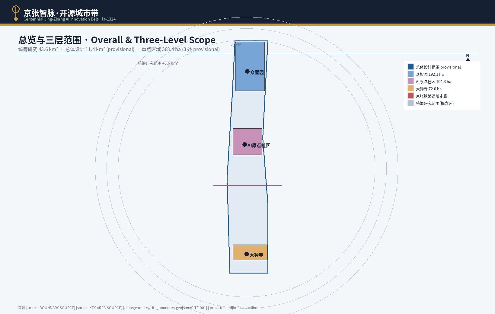
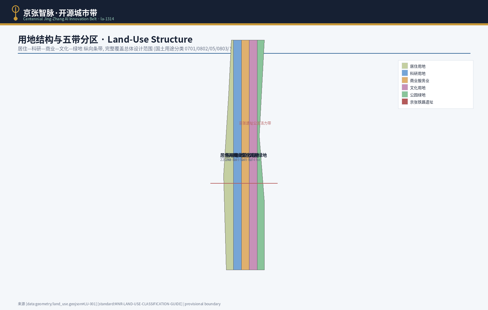
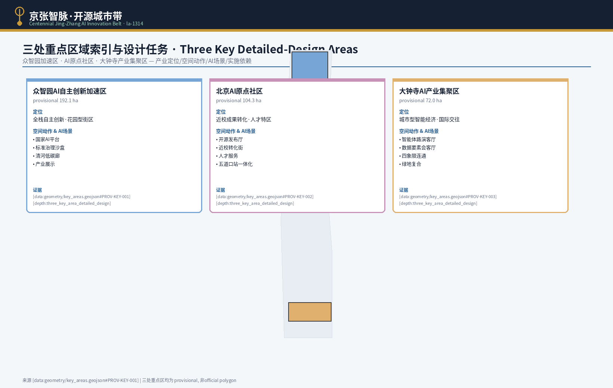
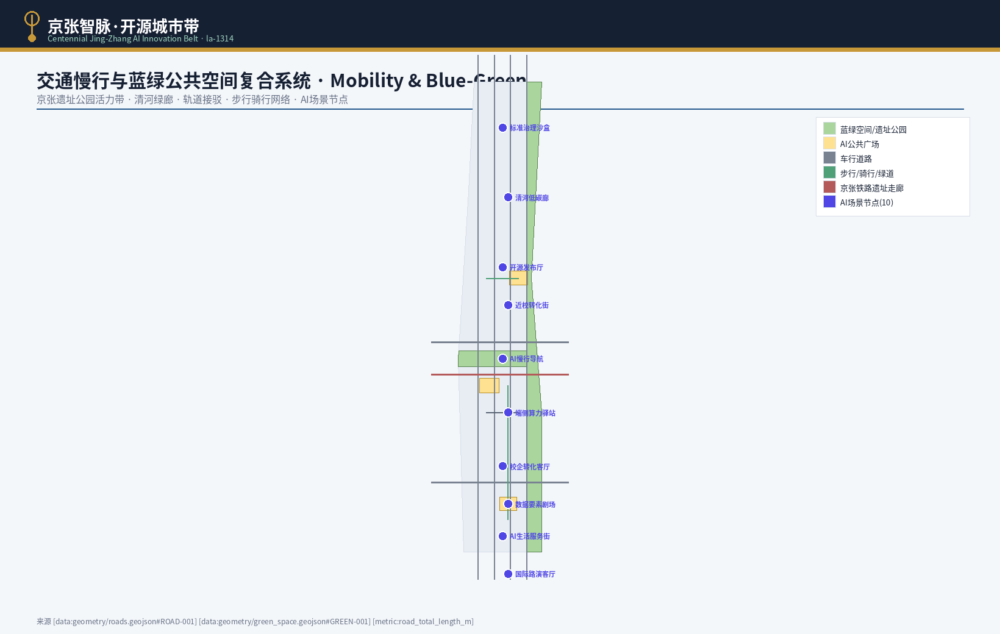
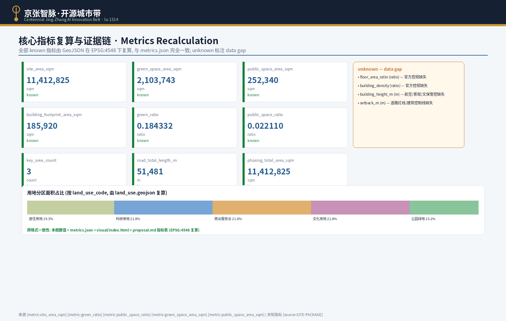

# 京张智脉·开源城市带——百年京张AI创新带概念设计

## 设计依据与资料清单

本 formal 方案以北京市规划和自然资源委员会海淀分局发布的《百年京张AI创新带城市设计国际方案征集资格预审公告》为第一依据，并以 `brief/site-package/` 中经维护者登记的临时粗略边界、重点区域、枚举、指标和来源清单为机器可读依据。AI agent 在生成方案前必须读取 `design_brief.json`、`allowed_design_space.json`、`sources.json`、`enums/`、`ranges/`、`schemas/`、`data/source_registry.json` 和 `data/processed/agent_fact_pack.md`，并用 `project_scope_summary.csv`、`agent_task_requirements.csv`、`source_use_matrix.csv`、`missing_data_checklist.csv` 建立任务、范围、资料用途和缺口清单。所有设计判断都要拆分为可追溯来源、可复算指标、可校验图层和可人工复核假设。公告要求方案达到控制性详细规划的城市设计深度和规划综合实施方案的城市设计深度，因此文本叙述不能替代 GeoJSON、指标表、A3 文册、A0 展板和 HTML 电子展示成果。

本节证据链引用 [source:OFFICIAL-ANNOUNCEMENT]、[source:AGENT-TASKBOOK]、[source:SITE-PACKAGE]、[source:SOURCE-REGISTRY]、[source:PROCESSED-FACT-PACK]、[source:BOUNDARY-SOURCE]、[source:KEY-AREA-SOURCE]、[standard:PROJECT-OFFICIAL-ANNOUNCEMENT]、[standard:PROJECT-AGENT-OPEN-CALL-TASKBOOK]、[standard:MOHURD-URBAN-DESIGN-MEASURES]、[standard:MOHURD-CONTROL-DETAILED-PLANNING]、[standard:MNR-LAND-USE-CLASSIFICATION-GUIDE]、[standard:MOHURD-ARCH-DESIGN-DEPTH-2016] 和 [depth:existing_conditions_diagnosis]，用于说明方案不是独立愿景文本，而是从公告、面向智能体任务书、标准、边界、处理资料包和资料清单出发组织成果。

资料登记表的使用边界如下：

- data/source_registry.json 登记公开、清权与临时资料的用途边界。
- 当前登记摘要：formal 可用资料 5 条，背景资料 0 条，provisional-only 资料 1 条。
- agent 不得把 background_only 或 provisional_only 资料升级为 official boundary、法定控规、正式评分依据或政府实施承诺。

`data/processed/agent_fact_pack.md` 是本方案的阅读导航层，不是新的权威来源。[source:PROCESSED-FACT-PACK] 只帮助 agent 把三层范围、三处重点区、公告任务、agent.1-agent.6、资料可用性和缺资料事项组织成可读方案；所有事实判断仍回到 [source:OFFICIAL-ANNOUNCEMENT]、[source:AGENT-TASKBOOK]、[source:SOURCE-REGISTRY]、[source:BOUNDARY-SOURCE] 与 [source:KEY-AREA-SOURCE]。

本脚手架在官方 `SITE_BOUNDARY` 或三处 `KEY_AREA` 尚未取得时，使用 `brief/site-package/geometry/provisional_boundaries.geojson` 生成临时 formal 包。提交包中的 `geometry/site_boundary.geojson` 与 `geometry/key_areas.geojson` 均必须标注为 `provisional_constraint`、`official_boundary=false`，只能用于方案生成、自检、可视化和设计讨论，不能作为 official redline、审批依据、精确面积依据或法定控制结论。该组织方数据缺口本身不阻断内容评分；替换 official polygons 后，site boundary、key areas、land use、roads、green space、public space、buildings、phasing 和 metrics 均需重算。

本次脚手架生成的可评分状态为：**临时边界，保留精度警示并待正式数据发布后复算；不阻断内容评分**。因此，正文中的空间结构、场景、项目和指标均按“可讨论、可复核、可替换官方边界后重算”的原则写入；当官方边界和重点区 polygon 更新后，agent 必须重新运行脚手架、自检和图纸/HTML生成，不能只替换单个文件。

边界和重点区域的可读解释对应 [data:geometry/site_boundary.geojson#SITE-001]、[data:geometry/key_areas.geojson#PROV-KEY-001] 和 [metric:site_area_sqm]、[metric:key_area_count]。这意味着读者可以从正文回到 GeoJSON 查看边界来源、从 metrics 查看面积复算结果、从 sources 查看资料来源，而不是只相信一段文字判断。

## 三层范围工作框架

方案按照公告确定的三个层次组织工作：统筹研究范围关注 43.6 平方公里的AI产业生态、战略定位、创新链和未来城市形态；总体设计范围关注 11.4 平方公里京张遗址公园周边 1-2 公里城市地区和产业区，要求形成城市更新总体框架、产业空间布局、交通市政支撑和城市风貌控制；重点区域范围关注 368.4 公顷三处详细设计地区，要求明确功能业态、建筑规模、拆改留分类、公共空间连通和交通组织。三层范围在 `compliance_matrix.json` 中逐条映射，保证公告 1.3、1.4、1.5 与 agent.1-agent.6 的必选任务都有章节、图层、指标、图纸和 HTML 证据。

三层工作框架的深度项由 [depth:three_level_scope_framework] 和 [depth:overall_spatial_structure] 约束，空间证据以 [data:geometry/site_boundary.geojson#SITE-001] 与 [data:geometry/key_areas.geojson#PROV-KEY-001] 为准，任务依据以 [standard:PROJECT-OFFICIAL-ANNOUNCEMENT] 为准，范围索引以 [source:PROCESSED-FACT-PACK] 中 `project_scope_summary.csv` 的三层范围表为导航。

三层工作不是互相割裂的图纸集合。统筹研究决定产业链和城市形态判断，总体设计把判断落实到更新项目、空间结构和设施承载，重点区域详细设计验证具体地块、建筑、交通、公共空间和AI应用场景的可实施性。agent 生成方案时必须先锁定当前提交采用的 official 或 provisional 边界和约束，再生成用地、建筑、道路、绿地、公共空间、分期和AI服务节点，最后从这些图层复算指标并在正文解释哪些结论仍受 provisional boundary 限制。任何无法从结构化数据复算的面积、比例、规模或项目数量，不得写入正式结论。

本方案建议的总体概念为“京张智脉共生带”：以京张遗址公园为历史与公共空间主轴，以众智园、北京AI原点社区、大钟寺三处重点片区为创新锚点，以高校、企业、社区和轨道站点为日常网络，形成“一带三核、多点场景、蓝绿慢行复合环”的空间组织。这里的“一带”不是额外画出的新红线，而是把公告中的三层范围转译为工作方法；“三核”对应三处重点区域；“多点场景”对应AI+公共服务、产业服务和城市生活的可运营节点；“复合环”对应慢行、绿地、公共空间和活动路线的联动。

| 层级 | 设计问题 | 方案回答 | 数据落点 |
| --- | --- | --- | --- |
| 统筹研究范围 | AI产业生态和未来城市形态如何组织 | 建立“高校策源-开源协作-企业转化-公共体验-国际传播”的创新链 | compliance_matrix.json、standard_matrix.json |
| 总体设计范围 | 产业空间、城市更新、交通市政和风貌如何落图 | 用地、建筑、道路、绿地、公共空间和分期图层共同表达 | [data:geometry/land_use.geojson#LU-001]、[data:geometry/roads.geojson#ROAD-001] |
| 重点区域范围 | 三处片区如何达到详细设计深度 | 分别提出定位、空间动作、AI场景和实施依赖 | [data:geometry/key_areas.geojson#PROV-KEY-001]、[data:geometry/key_areas.geojson#PROV-KEY-002]、[data:geometry/key_areas.geojson#PROV-KEY-003] |

## 统筹研究范围产业与未来城市研究

统筹研究范围的核心任务是构建世界级 AI 创新生态体系。方案应梳理海淀高校院所、头部企业、算力算法数据要素、孵化平台、上市企业、独角兽和科技服务资源，提出AI创新链、产业链、人才链和城市服务链的空间协同框架。命名方案和 logo 设计应服务于“百年京张文化带、都市AI生活体验带、AI融合创新带”的整体辨识度，不能只停留在口号，应说明与产业生态、公共空间和文化资源的关联。面向智能体任务书还要求回应“五大功能”和“三区两翼”协同，形成可继续深化的命名系统、视觉识别、总体空间结构图、场景开放和运营机制；本节必须用 [source:AGENT-TASKBOOK] 与 [standard:PROJECT-AGENT-OPEN-CALL-TASKBOOK] 标注这些要求来自 agent 开源征集任务，而不是法定规划控制。

统筹研究并不新增伪精确红线；它通过 [standard:MOHURD-URBAN-DESIGN-MEASURES] 要求的城市风貌、公共空间和建筑布局统筹，回接 [data:geometry/land_use.geojson#LU-001]、[data:geometry/public_space.geojson#PUBLIC-001] 与 [depth:overall_spatial_structure]，说明产业策略最终要落到可见、可复核的空间结构。

未来城市形态研究应回答人工智能如何改变工作、生活、社交、学习、交通和公共服务。方案应把AI交通系统、连续绿色空间、创新服务设施和国际化生活工作氛围落实为可定位的功能区、节点、廊道和场景，而不是泛泛描述技术愿景。agent 应把产业战略指标、AI创新指数、人才密度、空间供给类型和AI+垂直应用重点区域写入指标体系，并标明哪些是官方、哪些是设计建议、哪些仍待正式数据校准。若提出全球AI创新活动、开发者社区、开放场景或朝圣路线，应写为“概念建议/参考方案/可供专业团队深化研究”，不得写成已经确定的政府活动或实施安排。

## 总体设计范围城市更新与控规深度城市设计

总体设计范围要求达到控制性详细规划的城市设计深度。方案必须提出城市更新总体空间结构、低效空间识别、更新项目清单、实施政策建议、产业功能比例、空间组织模式、建筑总规模和综合承载能力评估。`geometry/land_use.geojson` 应完整覆盖设计边界且无重叠，`geometry/buildings.geojson` 应表达更新建筑基底或保留建筑基底，`geometry/roads.geojson` 应表达微循环、慢行和轨道接驳关系，`metrics.json` 应复算核心面积、比例和图层数量。

本节按照 [standard:MOHURD-CONTROL-DETAILED-PLANNING] 把控规深度内容拆成可审查对象：[data:geometry/land_use.geojson#LU-001] 表达用地结构，[data:geometry/buildings.geojson#BLDG-001] 表达建筑基底，[data:geometry/roads.geojson#ROAD-001] 表达交通组织，[metric:building_footprint_area_sqm] 用于复核建筑基底面积，[depth:land_use_layout] 与 [depth:development_intensity_controls] 约束成果深度。

总体设计还必须支撑交通、轨道、市政和配套设施。方案应围绕轨道站点一体化、道路微循环、非机动车停放、停车供给、创新服务平台、人才生活服务、新型基础设施、分布式能源和端侧算力提出空间布局和实施路径。涉及建筑高度、开发强度、道路红线、退线和设施标准的内容，若尚无官方控制条件，应写为“待正式控规条件确认”，不得以 agent 推测值冒充审定指标。

## 重点区域详细设计

重点区域详细设计是必选项。众智园AI自主创新加速区应围绕国家人工智能平台、全栈自主创新、标准制定、安全治理、产业展示、对外交通、清河文化、低碳绿色创新交往环境和绿色空间AI场景提出详细方案。北京AI原点社区应围绕近校创新、成果孵化转化、人才特区、开源体系、品牌活动、建筑拆改留、成果展示发布、居住生活配套、校区园区慢行联系和轨道站点一体化提出详细方案。大钟寺AI产业聚集区应围绕领军企业、智能体、智能终端、内容消费、数据要素、数字资产、商业服务、规划绿地复合利用、大钟寺站一体化和路口四象限步行连通提出详细方案。

三处重点区域详细设计必须引用 [data:geometry/key_areas.geojson#PROV-KEY-001]、[data:geometry/key_areas.geojson#PROV-KEY-002]、[data:geometry/key_areas.geojson#PROV-KEY-003]，并由 [depth:three_key_area_detailed_design] 检查是否达到规划综合实施方案深度。若只描述“打造示范区”而没有功能、建筑、交通、公共空间和实施项目证据，应被视为未完成。

三处重点区域必须在 `geometry/key_areas.geojson` 中出现。若仓库已提供 official polygons，应作为 `official_constraint` 使用；若 official polygons 缺失，可暂用 `provisional_constraint`，但正文、HTML、sources、assumptions 和 self_check 必须说明它不能作为正式评分或审批依据。`compliance_matrix.json` 应分别覆盖公告 1.5.3.1、1.5.3.2、1.5.3.3。设计表达应包含功能业态、建筑规模、建筑形态、拆改留分类、公共空间系统、交通组织、慢行连通和实施项目。HTML 页面应能切换查看三处重点区域，A3 文册和 A0 展板应至少包含重点片区总图、局部详图和指标说明。

| 重点片区 | 设计定位 | 空间动作 | AI产业与运营场景 | 证据引用 |
| --- | --- | --- | --- | --- |
| 众智园AI自主创新加速区 | 花园型全栈自主创新街区 | 强化清河界面、产业展示、低碳创新交往和对外交通组织；以绿色空间承载开放测试与标准治理展示 | 自主模型测试、标准制定工作坊、安全治理展示、低碳算力体验 | [data:geometry/key_areas.geojson#PROV-KEY-001]、[depth:three_key_area_detailed_design] |
| 北京AI原点社区 | 近校型成果转化与人才社区 | 组织校区、园区、街区慢行缝合；补足成果发布、人才服务、居住生活和开源协作空间 | 开源社区、成果发布、人才特区服务、近校孵化 | [data:geometry/key_areas.geojson#PROV-KEY-002]、[source:AGENT-TASKBOOK] |
| 大钟寺AI产业聚集区 | 城市型智能经济与国际交往街区 | 围绕大钟寺站一体化、四象限步行连通、商业服务和重点企业公共环境更新 | 智能体与智能终端展示、内容消费、数据要素与国际路演 | [data:geometry/key_areas.geojson#PROV-KEY-003]、[metric:key_area_count] |

## AI 创新生态、人才画像与 AI+ 场景

方案应建立面向AI人才和企业的空间需求画像，覆盖研发办公、开源协作、成果发布、企业服务、人才居住、社交学习、消费生活、运动休闲和国际交往。AI+场景应围绕公告提出的交通、服务、消费、医疗、教育、法律、生活服务等方向，形成产业发展场景和AI赋能城市功能场景。每个场景应说明服务对象、空间位置、数据来源、隐私边界、人工复核机制和运营主体。

AI 场景必须落到空间和治理边界：公共空间场景引用 [data:geometry/public_space.geojson#PUBLIC-001]，慢行与交通场景引用 [data:geometry/roads.geojson#ROAD-001]，开放空间场景引用 [data:geometry/green_space.geojson#GREEN-001] 和 [metric:public_space_ratio]、[metric:green_ratio]。这些引用让评审者知道场景不是口号，而是位于具体图层和指标中的设计对象。面向智能体任务书要求不少于10张AI场景卡、不少于3个产业测试验证场景和不少于5类用户画像；脚手架只给出结构，正式参赛者必须把场景卡、画像表、隐私边界、人工复核和运营主体写入正文、HTML、A3/A0 和合规矩阵。

| 用户画像 | 典型需求 | 空间响应 | 自检边界 |
| --- | --- | --- | --- |
| 开源开发者 | 发布、协作、测试、社区声誉 | 原点社区开源发布厅、公共代码墙、夜间协作空间 | 不采集个人行为轨迹；活动数据只做聚合统计 |
| 初创团队 | 低成本办公、算力入口、产品试验场 | 众智园共享测试场、端侧算力服务点、标准治理咨询 | 算力和数据服务需另行授权 |
| 头部企业访客 | 展示、商务、国际接待、人才招聘 | 大钟寺国际路演客厅、轨道站点接驳、重点企业周边公共空间 | 企业标识和案例须清权 |
| 周边居民 | 通勤、休闲、社区服务、低扰动更新 | 京张遗址公园慢行环、社区服务嵌入、夜间照明和活动分级 | 不将居民画像用于商业推荐 |
| 高校师生 | 成果转化、跨校协作、日常慢行 | 校区-园区慢行缝合、成果转化驿站、AI教育体验点 | 校园数据和科研成果需授权 |

| 场景卡 | 空间载体 | 设计说明 |
| --- | --- | --- |
| 01 开源发布厅 | 北京AI原点社区 | 面向高校、开源社区和初创团队，提供成果发布、代码贡献展示和小型路演空间 |
| 02 安全治理沙盒 | 众智园 | 将标准制定、安全评测、模型红队测试转译为可参观、可预约、可监管的展示和协作节点 |
| 03 端侧算力驿站 | 总体设计范围节点 | 与公共服务、企业服务和低碳能源策略结合，作为待深化的新型基础设施原型 |
| 04 AI慢行导航 | 京张遗址公园活力带 | 用可解释导视和低侵入传感帮助识别慢行断点、拥挤节点和无障碍需求 |
| 05 大钟寺国际路演客厅 | 大钟寺AI产业聚集区 | 服务智能体、智能终端和内容消费企业的展示、洽谈、媒体发布和国际交流 |
| 06 清河低碳创新廊 | 众智园临清河界面 | 把绿色空间、雨洪、步行骑行和AI展示结合，作为园区公共客厅 |
| 07 近校成果转化街 | 北京AI原点社区 | 面向高校成果转化，组织孵化、展示、法务、知识产权和投融资服务 |
| 08 数据要素会客厅 | 大钟寺片区 | 以合规、授权、可审计为前提，展示数据要素和数字资产流通的城市服务界面 |
| 09 AI生活服务样板街 | 社区与商业交汇处 | 将医疗、教育、法律、生活服务等AI+场景落到可运营的小尺度街区空间 |
| 10 全球AI活动周路线 | 一带公共空间系统 | 形成从遗址文化、开源社区、产业展示到国际路演的可步行、可传播体验路线 |

agent 生成的AI治理建议必须遵守数据最小化、公开来源、可解释和人工复核原则。城市智能体可以辅助识别慢行断点、公共空间热力、设施维护、企业服务需求和活动安全风险，但不能替代规划审批、不能输出未经授权的个人画像、不能声称获得官方实施承诺。所有AI场景节点应进入结构化图层或合规矩阵，便于评审者看到它们与产业、空间和公共利益之间的关系。

## 用地、建筑规模与拆改留方案

用地方案应依据国土空间调查、规划、用途管制分类等公开标准表达，形成完整、闭合、无缝的用地分区。建筑方案应区分保留、改造、更新、新建或待确认对象，明确建筑基底、功能、规模、风貌、屋顶、体量和高度控制的建议层级。若缺少现状建筑、权属、控规和工程条件，方案只能提出方法和待校准清单，不能编造拆改留结论。

用地分类依据 [standard:MNR-LAND-USE-CLASSIFICATION-GUIDE]，建筑高度、体量、界面和风貌控制由 [depth:height_massing_character] 管理，拆改留方法由 [depth:retain_renovate_demolish] 管理。用地和建筑的主要证据是 [data:geometry/land_use.geojson#LU-001]、[data:geometry/buildings.geojson#BLDG-001] 和 [metric:building_footprint_area_sqm]。

建筑规模和强度指标必须与 `metrics.json` 和图层一致。若总建筑规模、容积率、建筑高度、建筑密度、绿地率、退线和建筑控制线缺少官方条件，应在指标体系中列为 unknown 或 pending_control，不得用固定数值制造精确感。A3 文册应给出更新项目清单和指标复核表，A0 展板应把关键空间结构和重点片区表达清楚，HTML 页面应提供指标和图层联动查看。

## 交通、轨道、市政与公共服务设施

交通方案应回应公告对轨道站点一体化、道路微循环、慢行断点、对外交通、停车、非机动车停放和绿色交通系统的要求。重点应覆盖北五环、京张遗址公园跨环路节点、五道口、清华东路西口、大钟寺站及重点企业周边交通联系。道路和慢行图层应保持在提交边界内，并与公共空间、绿地、产业节点和重点片区相互校核；若提交边界为 provisional，交通结论也只能作为临时设计讨论。

交通和市政专业深度分别由 [depth:traffic_rail_slow_parking] 与 [depth:municipal_new_infrastructure] 约束；图层证据引用 [data:geometry/roads.geojson#ROAD-001]、[data:geometry/public_space.geojson#PUBLIC-001] 和 [data:geometry/constraints.geojson#CONSTRAINTS]。当道路红线、管线、消防和市政条件缺失时，应通过 assumptions 说明待补，而不是把策略写成审定条件。

市政和公共服务设施应覆盖AI产业服务设施、创新服务平台、人才生活服务设施、新型基础设施、分布式能源、端侧算力和传统市政设施融合。方案应说明设施标准、空间布局、服务半径、运营模式和分期实施逻辑。缺少管线、能源、排水、防洪、消防等工程资料时，应列为正式深化前置条件。

## 蓝绿空间、公共空间与城市风貌

蓝绿空间方案应以京张遗址公园活力带为骨架，统筹清河、小月河、周边高校、企业、社区出行需求，提出南北贯通、东西连通的步道、骑行道和绿色空间体系。方案应识别慢行断点、上跨环路节点、公园南端和北端景观节点，提出停车、体育、创新交往、科技测试、应用展示和公共服务复合利用策略。

蓝绿公共空间由 [depth:blue_green_public_space] 校核，核心证据为 [data:geometry/green_space.geojson#GREEN-001]、[data:geometry/public_space.geojson#PUBLIC-001]、[metric:green_ratio] 和 [metric:public_space_ratio]。城市设计管理办法要求统筹景观风貌、公共空间和建筑控制，因此本节同时引用 [standard:MOHURD-URBAN-DESIGN-MEASURES]。

城市风貌方案应融合京张铁路历史文化、中关村创新文化和AI创新文化，利用清华园火车站、北影等文化资源，提出城市基调、建筑风貌、屋顶形态、体量、界面和公共艺术引导。agent 还应提出导视标识、文化符号、国际传播叙事、AI朝圣地标、贡献墙或荣誉展示体系，但所有品牌、字体、图像、肖像和企业标识都必须有清权来源。风貌控制应分清官方管控、设计建议和待确认条件，严禁在没有文保或控规依据时给出伪精确控制线。

## 更新项目清单、实施政策与分期计划

实施方案应形成可审查的更新项目清单，说明项目位置、类型、功能、责任主体、依赖条件、实施阶段、风险和评估指标。政策建议应覆盖城市更新统筹实施、空间供给、运营机制、产业服务、公共参与、数据治理和产权协同。`geometry/phasing.geojson` 应表达分期范围，`compliance_matrix.json` 应把每个任务与分期和图纸挂接。

项目清单和分期深度由 [depth:renewal_project_list] 与 [depth:phasing_implementation] 管理，分期空间证据为 [data:geometry/phasing.geojson#PHASE-001]。如果没有权属、资金、实施主体和审批路径，方案必须把它写成实施风险，而不是承诺落地。

| 项目编号 | 项目名称 | 类型 | 主要依赖 | 证据引用 |
| --- | --- | --- | --- | --- |
| JZ-01 | 京张遗址公园慢行断点缝合 | 公共空间/交通 | 道路红线、桥下空间、交通组织复核 | [data:geometry/roads.geojson#ROAD-001] |
| JZ-02 | 众智园清河创新界面 | 蓝绿空间/产业展示 | 河道蓝线、生态和防洪条件 | [data:geometry/green_space.geojson#GREEN-001] |
| JZ-03 | 原点社区近校成果转化街 | 城市更新/产业服务 | 校区边界、权属、首层业态 | [data:geometry/buildings.geojson#BLDG-001] |
| JZ-04 | 大钟寺站四象限步行连通 | 轨道一体化/慢行 | 轨道站点、道路交叉口、市政管线 | [data:geometry/public_space.geojson#PUBLIC-001] |
| JZ-05 | AI公共服务与端侧算力节点 | 新基建/公共服务 | 能源、算力、安全和运营主体 | [data:geometry/constraints.geojson#CONSTRAINTS] |
| JZ-06 | 全球AI活动周公共路线 | 运营/品牌 | 公共空间许可、活动安全、版权清权 | [data:geometry/phasing.geojson#PHASE-001] |

分期应与 100 天征集设计周期形成区分：征集周期是提交成果的时间要求，实施分期是城市更新和项目建设的推进路径。方案应提出近期试点、中期更新和长期治理框架，并标明哪些内容可先以轻量设施、运营活动和服务平台启动，哪些必须等待正式控规、市政、交通和权属条件确认。对于年度活动体系、开发者社区运营、场景开放日、公共体验路线和国际传播机制，正文应说明运营对象、频率、责任边界、转化路径和风险，不得只写宣传口号。

## 指标体系、面积复算与合规矩阵

指标体系至少应包含总体设计范围面积、重点区域面积、绿地与公共空间比例、建筑基底、更新项目数量、AI场景节点、慢行连通指标、产业空间指标、人才服务指标和自检状态。所有 known 指标必须能从 GeoJSON 或可信来源复算；unknown 指标必须给出原因和正式提交前置条件。`scripts/spatial_review.py` 和 `scripts/visual_review.py` 的结果是 formal 自检的重要证据。

指标复算深度由 [depth:metrics_recalculation] 管理。本方案正文显式引用全部已知指标 [metric:site_area_sqm]、[metric:green_space_area_sqm]、[metric:public_space_area_sqm]、[metric:building_footprint_area_sqm]、[metric:green_ratio]、[metric:public_space_ratio]、[metric:key_area_count]、[metric:road_total_length_m] 和 [metric:phasing_total_area_sqm]，并说明这些值来自 [data:geometry/site_boundary.geojson#SITE-001]、[data:geometry/key_areas.geojson#PROV-KEY-001]、[data:geometry/buildings.geojson#BLDG-001]、[data:geometry/green_space.geojson#GREEN-001]、[data:geometry/public_space.geojson#PUBLIC-001]、[data:geometry/roads.geojson#ROAD-001] 和 [data:geometry/phasing.geojson#PHASE-001]。

核心已知指标复算结果如下（值同步 `metrics.json`，受 provisional boundary 约束，官方边界发布后须重算）：

| 指标 | 值 | 单位 | 来源图层 | 公式 |
| --- | --- | --- | --- | --- |
| [metric:site_area_sqm] | 11412825.386 | sqm | site_boundary.geojson | polygon_area in EPSG:4548 |
| [metric:green_space_area_sqm] | 2103743.486 | sqm | green_space.geojson | union_area in EPSG:4548 |
| [metric:public_space_area_sqm] | 252339.764 | sqm | public_space.geojson | union_area in EPSG:4548 |
| [metric:building_footprint_area_sqm] | 185920.165 | sqm | buildings.geojson | union_area in EPSG:4548 |
| [metric:green_ratio] | 0.184332 | ratio | green_space / site_boundary | green_space_area_sqm / site_area_sqm |
| [metric:public_space_ratio] | 0.02211 | ratio | public_space / site_boundary | public_space_area_sqm / site_area_sqm |
| [metric:key_area_count] | 3 | count | key_areas.geojson | count(key_detailed_design_areas) |
| [metric:road_total_length_m] | 51480.647 | m | roads.geojson | sum(length) in EPSG:4548 |
| [metric:phasing_total_area_sqm] | 11412825.386 | sqm | phasing.geojson | union_area in EPSG:4548 |

合规矩阵是任务响应性的主控文件。每条公告任务和 agent_taskbook 任务必须对应到报告章节、图层、指标、图纸、HTML 页面、来源、假设和自检项。未能覆盖公告 1.3、1.4、1.5 或 agent.1-agent.6 的任一必选任务，方案不得进入 formal professional scoring。

正式深化时，agent 还应把每个指标分为三类：第一类是可由提交几何直接复算的空间指标，例如边界面积、绿地比例、公共空间比例、建筑基底面积和分期面积；第二类是需要官方控规或任务书附件支撑的管控指标，例如容积率、建筑高度、建筑密度、退线、道路红线和设施标准；第三类是需要运营或产业数据持续校准的绩效指标，例如 AI 创新指数、人才密度、产业服务满意度、慢行可达性、活动参与度和场景使用频次。三类指标应分别进入 `metrics.json`、`assumptions.json` 和 `compliance_matrix.json`，避免把运营愿景误写成审定规划条件。

## 风险、版权与合规说明

方案文件可使用中文或英文；英文为主语言时，必须在同一 `proposal.md` 中附完整中文正式译文，并设置双语元数据。所有图片、图纸、图标、数据和代码资产必须在 `sources.json` 或 `report/copyright_statement.md` 中说明来源、许可和授权状态。HTML 页面不得加载远程脚本、远程地图瓦片、远程字体、iframe、表单或外部 API，不得跟踪评审者行为。

风险和缺资料清单由 [depth:risk_missing_data] 管理，并与 [data:geometry/constraints.geojson#CONSTRAINTS]、[source:SITE-PACKAGE]、[source:PROCESSED-FACT-PACK] 和 [standard:MOHURD-CONTROL-DETAILED-PLANNING] 相互校核。`missing_data_checklist.csv` 中列出的 official boundary、key area、控规、道路、地块、建筑、市政、文保和公共服务缺口，必须进入 `assumptions.json`、自检和正文风险章节。任何缺少官方控规、道路红线、权属、市政、消防或文保条件的结论，都必须降级为待确认事项。

本方案不声称官方批准、审定控规、最终土地权属、最终建设规模或保证实施。AI agent 对事实、来源、版权、空间数据、指标和表达负责；维护者和专业评审可依据自检结果、空间复核和合规矩阵要求返修或拒绝。

## 命名、Logo 与视觉识别系统

本节回应 agent.1 中"命名系统与 Logo/视觉识别"的可深化要求，将命名、视觉识别与空间品牌作为概念建议提出 [source:AGENT-TASKBOOK]、[standard:PROJECT-AGENT-OPEN-CALL-TASKBOOK]。命名主轴为"京张智脉·开源城市带"，对应"百年京张文化带、都市AI生活体验带、AI融合创新带"三带定位；命名层级采用"主名（京张智脉）+ 子名（片区/廊道/节点）"双层结构，便于 A3 文册、A0 展板、HTML 与导视系统复用。所有标识、字体、图像与肖像均须有清权来源 [assumption:A-COPYRIGHT-001]；Logo 与 VI 仅为方向性建议，最终品牌资产须由专业品牌团队在版权清权后确定 [assumption:A-CONCEPT-ONLY-001]。

视觉语法方向（概念建议，可供专业团队深化研究）：

| VI 要素 | 方向性建议 | 设计依据与边界 |
| --- | --- | --- |
| 标志构图 | 以京张铁路钢轨弧线 + 开源节点网格 + 智脉折线三元素复合，形成"轨-网-流"的几何母题；横版用于文册页眉，竖版用于节点导视 | 呼应百年京张文化与开源协作精神；钢轨元素须与现状铁路文保线区分，不得占用文保标识 [assumption:A-COPYRIGHT-001] |
| 主色板 | 中关村蓝 #1F4E79（创新底色）、京张赭 #8C6A3F（历史文脉）、智脉青 #2BB6A3（AI 活力）、留白灰 #F5F5F5（基底）四色为建议主色；导视警示色采用国际通用橙 #F39200 | 主色不替代控规色彩管控；具体色值须经专业品牌与文保团队复核 [standard:MOHURD-URBAN-DESIGN-MEASURES] |
| 字体策略 | 中文标题建议采用思源黑体 Heavy（开源 OFL 许可），正文采用思源黑体 Regular；英文标题采用 Inter 或 IBM Plex Sans（均为开源许可）；数字与代码采用等宽开源字体 | 全部选用开源许可字体以匹配"开源城市带"理念，避免专有字体版权风险 [assumption:A-COPYRIGHT-001] |
| 导视应用 | 分级系统：一级指路（带级方向）、二级片区（三处重点区域）、三级节点（场景卡与建筑入口）、四级临时活动（活动周与开放日）；统一采用"图标+编号+中英双语"模组 | 落点对应 [data:geometry/public_space.geojson#PUBLIC-001]、[data:geometry/roads.geojson#ROAD-001]；具体点位待控规与权属确认 |
| 数字资产 | HTML/A0/A3 共用 SVG 母题与图标库；活动周临时资产采用可逆安装，不形成永久构筑物 | 数字资产不得加载远程字体或脚本；HTML 须离线可读 [standard:PROJECT-OFFICIAL-ANNOUNCEMENT] |

视觉识别与空间结构对应关系由 [depth:overall_spatial_structure] 与 [depth:blue_green_public_space] 校核：主色板"智脉青"用于 AI 场景节点与慢行活力带，"京张赭"用于历史叙事与文保标识，"中关村蓝"用于创新锚点与企业服务界面。Logo 母题在三处重点区域分别衍生子标志（众智园"钢轨+测试网格"、原点社区"开源节点+校区缝合"、大钟寺"轨道交点+智能体象限"），须与主标志几何同源，不得引入新字体或新色系。所有品牌应用须在 `sources.json` 与 `report/copyright_statement.md` 登记许可状态，未清权资产不得进入正式提交 [assumption:A-COPYRIGHT-001]、[assumption:A-CONCEPT-ONLY-001]。

## 三区两翼与区域协同接口

本节落实 agent.1 中"三区两翼协同回路"的可深化要求 [source:AGENT-TASKBOOK]、[standard:PROJECT-AGENT-OPEN-CALL-TASKBOOK]。"三区"指三处重点区域（众智园、北京AI原点社区、大钟寺AI产业聚集区）形成的内部创新核；"两翼"指中关村科学服务翼（向南联动中关村科学城核心区与北纬社区）和小月河场景赋能翼（向北联动未来科学城、怀柔科学城并向京津冀辐射）。三区两翼不是新建行政边界，而是把 [data:geometry/key_areas.geojson#PROV-KEY-001] 至 [data:geometry/key_areas.geojson#PROV-KEY-003] 与外部创新节点组织成协同工作回路；协同接口均以"概念建议"表述，不构成跨区行政承诺或政府实施安排 [assumption:A-CONCEPT-ONLY-001]、[assumption:A-BOUNDARY-PROVISIONAL-001]。

三区两翼协同回路（概念建议，可供专业团队深化研究）：

| 协同方向 | 内部锚点 | 外部接口 | 协同内容（概念建议） | 证据与边界 |
| --- | --- | --- | --- | --- |
| 南翼：中关村科学服务 | 北京AI原点社区、大钟寺 | 北纬社区、中关村科学城核心区 | 高校策源—开源协作—企业转化的服务接口；人才居住、知识产权、投融资与法务服务联动 | 内部锚点 [data:geometry/key_areas.geojson#PROV-KEY-002]、[data:geometry/key_areas.geojson#PROV-KEY-003]；外部接口为概念对接，待跨区机制确认 |
| 北翼：场景赋能 | 众智园 | 未来科学城、怀柔科学城 | 算力—数据—场景的测试与标准治理联动；科学装置与AI应用场景对接 | 内部锚点 [data:geometry/key_areas.geojson#PROV-KEY-001]；外部接口待跨区专业团队复核 |
| 京津冀辐射 | 一带整体 | 经开区、京津冀协同创新节点 | 模型与场景在更大区域试错、复制与梯度转化的概念路径 | 仅作为长期愿景，不设定具体项目或投资 [assumption:A-CONCEPT-ONLY-001] |

协同回路的工作机制（概念建议）：①"周末开源集市"——三区轮流承办，邀请外部节点参与，定位为轻量运营活动，不形成固定机构；②"场景互换"——内部锚点开放场景，外部接口提供算力或数据资源，以协议式合作进行；③"标准共治"——由众智园安全治理沙盒牵头，邀请未来科学城与怀柔科学城共同参与标准制定工作坊，结论作为研究建议而非行政标准。协同回路空间证据回接 [data:geometry/roads.geojson#ROAD-001] 与 [data:geometry/green_space.geojson#GREEN-001]，慢行与公共空间为物理载体；官方边界与控规发布后协同接口落点须重新校准 [assumption:A-BOUNDARY-PROVISIONAL-001]、[depth:overall_spatial_structure]。

## 全球 AI 创新生态案例与生态图谱

本节回应 agent.2 中"5-8 个全球 AI 创新生态案例 + 生态图谱 + 中关村科学服务翼支持机制 + 要素保障机制"的可深化要求 [source:AGENT-TASKBOOK]、[standard:PROJECT-AGENT-OPEN-CALL-TASKBOOK]。案例均为公开可查的参考案例，描述简短，定位为"团队可深化的参考资料"，不构成实施承诺或投资依据；不编造投资金额或企业清单，仅指向公开来源方向，由专业团队深化核实 [assumption:A-CONCEPT-ONLY-001]。

全球 AI 创新生态参考案例（公开来源方向，仅供深化研究）：

| 编号 | 案例 | 所在地 | 参考价值 | 公开来源方向 |
| --- | --- | --- | --- | --- |
| G1 | King's Cross / Sidewalk Labs 经验 | 加拿大多伦多 | 滨水棕地更新与数据治理争议的教训；强调公众参与与数据最小化 | 公开媒体报道与城市研究文献，须专业团队核实 |
| G2 | Station F | 法国巴黎 | 单一巨型建筑承载初创生态、企业加速器与大企业开放创新共栖 | Station F 官方公开资料，须核实最新规模 |
| G3 | Cyberport | 中国香港 | 数字经济园区与企业社群运营、国际路演与创投对接 | Cyberport 官方公开资料 |
| G4 | AI Singapore | 新加坡 | 国家级 AI 战略下的研发、人才与场景开放计划（如 100E 项目） | AI Singapore 官方公开资料 |
| G5 | Kalasatama 智慧城区 | 芬兰赫尔辛基 | 居民共创式智慧城市试点与开放式数据接口 | 赫尔辛基市公开资料，须核实阶段进展 |
| G6 | One North | 新加坡 | 园区型创新生态与生物医药、信息通信、媒体混合布局 | JTC / One North 官方公开资料 |
| G7 | Brainport | 荷兰埃因霍温 | 产业-高校-社区三角协同与高技术制造创新区 | Brainport 公开资料，须核实治理结构 |
| G8 | 清华—伯克利深圳学院语境 | 中国深圳 | 跨校联合培养、产学研协同与国际化创新社区 | 公开办学资料，须以官方信息为准 |

生态图谱（概念建议，可供专业团队深化研究）：以"策源—孵化—转化—体验—传播"五环节为横轴，以"高校/科研机构、头部企业、初创团队、开源社区、政府平台、国际节点、社区与公众"七类主体为纵轴构建图谱矩阵。众智园承载"策源—孵化—转化"上游环节与安全治理展示；原点社区承载"孵化—转化—体验"中游环节与人才社区；大钟寺承载"转化—体验—传播"下游环节与国际路演。图谱中每类主体仅标注公开类别，不列具名企业清单，具名清单须由专业团队在版权与商业清权后补充 [assumption:A-COPYRIGHT-001]、[assumption:A-CONCEPT-ONLY-001]。生态图谱空间落点回接 [data:geometry/key_areas.geojson#PROV-KEY-001] 至 [data:geometry/key_areas.geojson#PROV-KEY-003]，与三区两翼协同回路一致。

中关村科学服务翼支持机制（概念建议）：依托向南联动中关村科学城核心区与北纬社区的协同方向，组织知识产权、法务、投融资、算力接入、人才居住与开源治理六类服务接口，作为科学服务翼的"软基建"。支持机制以协议式合作与共享平台为主，不新建机构、不承诺财政投入；服务清单须在深化阶段与现有服务平台核对，避免重复建设 [assumption:A-CONCEPT-ONLY-001]。要素保障机制以八要素矩阵表达，所有保障均为概念建议，不构成既定的资源分配：

| 要素 | 概念保障方向（可供深化研究） | 边界说明 |
| --- | --- | --- |
| 用地 | 在三处重点区域内统筹产业、生活、公共服务与开放空间比例 | 须以官方控规为准，当前为 provisional [assumption:A-BOUNDARY-PROVISIONAL-001] |
| 空间 | 提供共享测试场、开源发布厅、国际路演客厅、人才公寓等可复用空间原型 | 具体规模待控规与权属确认 [data:geometry/buildings.geojson#BLDG-001] |
| 产业 | 围绕全栈自主创新、智能体、智能终端、内容消费与数据要素组织产业链建议 | 不列具名企业清单 [assumption:A-COPYRIGHT-001] |
| 资本 | 概念性引导建立"开源基金/转化基金"对接接口，不承诺金额 | 不编造投资数字，须由专业投融资团队深化 |
| 人才 | 人才特区服务接口、居住配套与跨校协作机制建议 | 不承诺户口或人才政策，须以现行政策为准 |
| 算力 | 端侧算力驿站与分布式算力接入的概念原型 | 算力资源须另行授权，不承诺免费供给 |
| 数据 | 数据要素会客厅与合规数据流通的概念界面 | 须遵循数据最小化与授权原则 [assumption:A-CONTROLS-001] |
| 场景 | AI+ 场景开放清单与测试协议（详见后节） | 场景开放须人工复核，不替代审批 |

## AI+ 场景卡、测试协议与场景—空间—运营矩阵

本节回应 agent.3 的可深化要求。方案已在"AI 创新生态、人才画像与 AI+ 场景"一节列出 10 张场景卡（01 开源发布厅至 10 全球AI活动周路线），本节补充 ≥3 个产业测试验证协议、场景—空间—运营矩阵与小月河场景赋能翼 [source:AGENT-TASKBOOK]、[standard:PROJECT-AGENT-OPEN-CALL-TASKBOOK]。所有测试协议均为概念建议，强调隐私边界与人工复核，不构成既定的测试授权或监管决定 [assumption:A-CONCEPT-ONLY-001]、[assumption:A-CONTROLS-001]。场景卡清单经验证完整覆盖 10 张，满足 agent.3 "不少于10张AI场景卡"下限要求 [depth:three_key_area_detailed_design]。

产业测试验证协议（概念建议，≥3 个，可供专业团队深化研究）：

| 协议编号 | 测试对象 | 测试空间 | 隐私边界 | 人工复核机制 | 运营主体（建议） | 证据与边界 |
| --- | --- | --- | --- | --- | --- | --- |
| TP-01 | AI 慢行导航与无障碍路径识别 | 京张遗址公园慢行环 | 仅采集聚合人流热力与断点位置；不采集个人面孔、身份或轨迹；传感器低侵入部署 | 由慢行管理方人工抽检断点判读结果；任何导视变更须经人工确认 | 概念建议由带级公共空间运营平台牵头，须清权后确定 | [data:geometry/roads.geojson#ROAD-001]、[data:geometry/public_space.geojson#PUBLIC-001] |
| TP-02 | AI 公共服务 Copilot 与企业服务对接 | 北京AI原点社区开源发布厅 | 服务请求去标识化处理；不输出未经授权的企业或个人画像；对话日志默认不长期留存 | 关键服务结论由人工坐席复核；高敏事项须双人确认 | 概念建议由园区服务平台牵头，须授权后启动 | [data:geometry/key_areas.geojson#PROV-KEY-002]、[assumption:A-CONTROLS-001] |
| TP-03 | AI 公共安全运营辅助复核 | 大钟寺站四象限与重点企业周边公共空间 | 仅处理事件级图像与告警；不做持续人脸识别；不与个人身份库直接关联 | 所有告警须人工复核后方可处置；AI 不得直接触发执法动作 | 概念建议由公共安全管理部门牵头，须符合现行法规 | [data:geometry/public_space.geojson#PUBLIC-001]、[assumption:A-CONTROLS-001] |

场景—空间—运营矩阵（概念建议，可供专业团队深化研究）：

| 场景卡 | 空间载体 | 运营机制（概念建议） | 隐私与复核要点 |
| --- | --- | --- | --- |
| 01 开源发布厅 | 北京AI原点社区 | 定期发布日 + 预约制；聚合统计发布数据 | 不采集个人轨迹 |
| 02 安全治理沙盒 | 众智园 | 标准制定工作坊 + 预约参观；模型红队测试须隔离 | 测试数据须授权 |
| 03 端侧算力驿站 | 总体设计范围节点 | 共享算力接入 + 计量计费须授权 | 不留存用户作业 |
| 04 AI慢行导航 | 京张遗址公园活力带 | 持续运行 + 人工抽检断点 | 仅聚合人流热力 |
| 05 大钟寺国际路演客厅 | 大钟寺片区 | 路演日 + 媒体发布须清权 | 企业标识须清权 |
| 06 清河低碳创新廊 | 众智园临清河界面 | 公共客厅 + 低碳展示 | 不监测个人活动 |
| 07 近校成果转化街 | 北京AI原点社区 | 法务知产服务窗口 + 预约 | 科研数据须授权 |
| 08 数据要素会客厅 | 大钟寺片区 | 合规数据流通展示 + 审计 | 数据流通须授权审计 |
| 09 AI生活服务样板街 | 社区与商业交汇处 | 试点服务 + 人工兜底 | 服务须保留非AI渠道 |
| 10 全球AI活动周路线 | 一带公共空间系统 | 年度活动周 + 公共空间许可 | 活动安全须人工复核 |

小月河场景赋能翼（概念建议，可供专业团队深化研究）：以小月河沿线蓝绿空间为物理载体，组织"水—绿—慢—景—测"五要素复合的场景带，承接三区两翼中"北翼场景赋能"的协同方向。场景赋能翼内可布置低侵入传感测试段、可解释导视段、无障碍示范段与社区共创段，每段对应不同隐私等级与人工复核要求；任何传感部署须遵循数据最小化原则，并保留可关闭、可审计、可人工兜底的运行机制。场景赋能翼的空间证据回接 [data:geometry/green_space.geojson#GREEN-001] 与 [data:geometry/public_space.geojson#PUBLIC-001]，具体段落与长度待官方边界与水务、文保条件确认后由专业团队深化 [assumption:A-BOUNDARY-PROVISIONAL-001]、[assumption:A-CONTROLS-001]、[depth:blue_green_public_space]。

## AI 朝圣地标、荣誉体系与公共空间组件库

本节回应 agent.4 的可深化要求，提出 ≥3 个 AI 朝圣地标概念目录、荣誉展示体系与公共空间组件库，全部为概念建议，不构成既定或落定的地标建设决定 [source:AGENT-TASKBOOK]、[standard:PROJECT-AGENT-OPEN-CALL-TASKBOOK]、[assumption:A-CONCEPT-ONLY-001]。地标选址、形态、规模与文保关系须由专业团队在控规、权属、文保与版权清权后深化 [assumption:A-BOUNDARY-PROVISIONAL-001]、[assumption:A-COPYRIGHT-001]。

AI 朝圣地标概念目录（≥3 个，可供专业团队深化研究）：

| 地标编号 | 概念名称 | 拟选锚点 | 概念设计方向 | 文化与AI叙事 | 证据与边界 |
| --- | --- | --- | --- | --- | --- |
| LM-01 | 京张智脉门 | 众智园临清河界面入口 | 以钢轨弧线与开源节点网格构成的开放门型构筑物；非封闭建筑，作为片区入口与活动周起点 | 承载百年京张铁路文化与开源协作精神 | [data:geometry/key_areas.geojson#PROV-KEY-001]、[data:geometry/green_space.geojson#GREEN-001]；须避让河道蓝线与文保线 |
| LM-02 | 开源星图墙 | 北京AI原点社区中心广场 | 以可更新模块墙展示开源贡献与成果发布；模块可替换，避免永久具名 | 承载中关村创新文化与开源社区文化 | [data:geometry/key_areas.geojson#PROV-KEY-002]、[data:geometry/public_space.geojson#PUBLIC-001]；具名展示须清权 |
| LM-03 | 智体象限塔 | 大钟寺站四象限交汇公共空间 | 以轨道交点为母题的轻型地标，标识智能体与智能终端产业聚集；夜间低光污染照明 | 承载AI创新文化与国际交往文化 | [data:geometry/key_areas.geojson#PROV-KEY-003]、[data:geometry/roads.geojson#ROAD-001]；须与轨道设施协调 |

荣誉展示体系（概念建议，可供专业团队深化研究）：以"贡献墙 + 年度勋章 + 数字档案"三层结构组织。贡献墙采用可更新模块，避免永久具名，所有展示内容须经版权与肖像清权；年度勋章为非货币性荣誉标识，不与任何财政奖励挂钩；数字档案以可审计方式记录开源贡献、标准制定、安全治理与社区服务，留存期限与范围须遵循数据最小化原则。荣誉展示须设置"退出与撤下"机制，被展示者可申请撤下，避免荣誉展示变为不可撤回的永久记录 [assumption:A-COPYRIGHT-001]、[assumption:A-CONTROLS-001]、[depth:blue_green_public_space]。

公共空间组件库（概念建议，可供专业团队深化研究）：以可复用、可替换、可逆安装为原则，组织六类组件：①慢行导视组件（统一图标+编号+中英双语）；②休憩节点组件（模块化座椅与遮阳）；③活动临建组件（活动周可逆安装，不形成永久构筑物）；④AI 场景接口组件（预留电源、数据与算力接入点，须授权后启用）；⑤无障碍组件（盲道、触觉地图、低位置导视）；⑥生态雨水组件（结合清河与小月河蓝绿空间的海绵设施原型）。组件库空间证据回接 [data:geometry/public_space.geojson#PUBLIC-001] 与 [data:geometry/green_space.geojson#GREEN-001]，尺寸与位置须以控规与权属条件为准 [assumption:A-BOUNDARY-PROVISIONAL-001]、[standard:MOHURD-URBAN-DESIGN-MEASURES]。

## 京张文化叙事、导视标识与国际传播文案

本节回应 agent.5 的可深化要求，提出文化叙事、导视标识符号系统、空间故事线与中英双语国际传播文案，全部为概念建议，不构成既定或落定的文化决定 [source:AGENT-TASKBOOK]、[standard:PROJECT-AGENT-OPEN-CALL-TASKBOOK]、[assumption:A-CONCEPT-ONLY-001]、[assumption:A-COPYRIGHT-001]。文化叙事以"百年京张—中关村创新—AI 新文化"三段式组织，导视与文案须与命名、Logo 与视觉识别系统保持几何与字体同源。

文化叙事三段式（概念建议）：①"百年京张"段以清华园火车站、京张铁路遗址与清河文化为锚，强调铁路工程精神与历史记忆；②"中关村创新"段以高校策源、开源协作与企业转化为锚，强调敢为人先与开源共享；③"AI 新文化"段以智能体、智能终端、数据要素与场景开放为锚，强调人机协作与负责任创新。三段叙事通过空间故事线串联：从京张智脉门（LM-01）出发，沿慢行环经开源星图墙（LM-02）至智体象限塔（LM-03），形成可步行、可传播的文化体验路径；路径落点回接 [data:geometry/roads.geojson#ROAD-001] 与 [data:geometry/public_space.geojson#PUBLIC-001]，具体节点待控规确认 [assumption:A-BOUNDARY-PROVISIONAL-001]。

导视标识符号系统（概念建议，可供专业团队深化研究）：

| 符号类别 | 设计方向 | 应用场景 | 边界 |
| --- | --- | --- | --- |
| 文化符号 | 钢轨弧线、开源节点、智脉折线三类母题符号 | 文保节点、开源社区、AI 场景入口 | 须与文保标识区分，不占用文保图形 [assumption:A-COPYRIGHT-001] |
| 方向符号 | 统一指北、距离与方向箭头模组 | 慢行环、轨道接驳、片区入口 | 落点 [data:geometry/roads.geojson#ROAD-001]，待控规确认 |
| 场景编号符号 | 场景卡编号与图标组合 | 10 张场景卡节点 | 与场景—空间—运营矩阵一致 |
| 无障碍符号 | 国际通用无障碍图标 + 触觉辅助 | 全带公共空间 | 详见无障碍专节 |

空间故事线节点（概念建议）：以"启—承—转—合"四幕组织。启幕为京张智脉门，承载历史记忆与片区入口；承幕为清河低碳创新廊与众智园安全治理沙盒，承载创新策源与标准治理；转幕为开源星图墙与近校成果转化街，承载开源协作与成果转化；合幕为智体象限塔与大钟寺国际路演客厅，承载国际交往与产业传播。四幕节点均设中英双语导视与可解释说明，AI 辅助导览须保留人工兜底与非AI替代渠道 [assumption:A-CONTROLS-001]。

国际传播文案（中英双语，概念建议，仅供深化研究，不构成官方宣传口径）：

| 主题 | 中文文案（概念建议） | 英文文案（概念建议） |
| --- | --- | --- |
| 一带定位 | 百年京张，开源智脉——一条可步行的AI创新带。 | A Century of Jingzhang, An Open Smart Vein — A Walkable Belt of AI Innovation. |
| 三区协同 | 三区共生，两翼联动：从开源社区到国际路演。 | Three Cores, Two Wings: From Open Source Community to Global Showcase. |
| 文化叙事 | 钢轨之上，开源之中：百年京张与AI新文化的相遇。 | Above the Rails, Within the Open Source: Where Century-Old Jingzhang Meets New AI Culture. |
| 场景开放 | 可解释、可复核、可退出：负责任的AI城市生活。 | Explainable, Reviewable, Opt-out: Responsible AI Urban Life. |
| 国际邀请 | 概念征集，开放深化：欢迎全球AI创新者共建。 | Concept Open Call, Open to Deepen: Global AI Innovators Welcome to Co-build. |

国际传播文案须在版权清权与官方审定后方可正式使用，当前仅作为概念方向供专业团队深化 [assumption:A-CONCEPT-ONLY-001]、[assumption:A-COPYRIGHT-001]、[source:OFFICIAL-ANNOUNCEMENT]。

## 全球 AI 活动体系、品牌 IP 与长期运营机制

本节回应 agent.6 的可深化要求，提出年度活动体系、活动品牌 IP 系统、开发者社区运营机制、AI 场景开放运营机制与国际传播与招引转化路径，全部为概念建议，不构成既定或落定的政府活动、财政承诺或实施安排 [source:AGENT-TASKBOOK]、[standard:PROJECT-AGENT-OPEN-CALL-TASKBOOK]、[assumption:A-CONCEPT-ONLY-001]。活动体系须与公共空间许可、活动安全、版权清权等前置条件挂钩，未取得许可不得宣称已落地。

年度活动体系（概念建议，可供专业团队深化研究）：

| 季度 | 主题活动（概念建议） | 锚点空间 | 频率 | 边界 |
| --- | --- | --- | --- | --- |
| Q1 | 开年开源集市 + 开源贡献年度回顾 | 北京AI原点社区开源发布厅 | 年度 | 须公共空间许可与版权清权 |
| Q2 | 京张AI文化周 + 慢行开放日 | 京张遗址公园慢行环 | 年度 | 须活动安全与文保协调 |
| Q3 | 安全治理与标准共治工作坊 | 众智园安全治理沙盒 | 半年度 | 标准结论为研究建议，非行政标准 |
| Q4 | 大钟寺国际路演季 + 招引对接 | 大钟寺国际路演客厅 | 年度 | 招引对接须以现行政策为准，不承诺落户 |

活动品牌 IP 系统（概念建议）：以"京张智脉"主品牌统领，衍生"开源集市""AI 文化周""安全治理工作坊""国际路演季"四个子活动 IP，须与主品牌视觉同源，不得引入新字体或新色系 [assumption:A-COPYRIGHT-001]。品牌 IP 仅为概念资产，正式使用须经版权清权与官方审定 [assumption:A-CONCEPT-ONLY-001]。

开发者社区运营机制（概念建议，可供专业团队深化研究）：以"贡献积分 + 开放治理 + 可退出"三原则组织。贡献积分为非货币性声誉标识，不与财政奖励挂钩；开放治理采用公开议题与社区议事结合，决策过程可审计；可退出机制允许成员随时撤出贡献记录。社区运营不采集个人行为轨迹，活动数据仅做聚合统计 [assumption:A-CONTROLS-001]。空间载体为开源发布厅与开源星图墙，落点 [data:geometry/key_areas.geojson#PROV-KEY-002]、[data:geometry/public_space.geojson#PUBLIC-001]。

AI 场景开放运营机制（概念建议）：以"开放清单 + 测试协议 + 人工复核 + 退出条件"四步流程组织。开放清单列出可开放场景及隐私等级；测试协议对应 TP-01 至 TP-03，明确数据最小化与人工复核边界；人工复核为所有场景强制环节，AI 不得替代审批或执法；退出条件允许场景在出现风险或公众异议时暂停或撤回 [assumption:A-CONTROLS-001]、[assumption:A-CONCEPT-ONLY-001]。场景开放须保留非AI服务替代渠道（详见无障碍专节）。

国际传播与招引转化路径（概念建议，可供专业团队深化研究）：传播路径以年度活动周为节点，配合中英双语文案与可步行体验路线，向全球AI创新者发出概念邀请；招引转化以"概念对接—协议合作—场景试错—评估退出"四阶段组织，不承诺落户、投资或政策优惠，所有转化须以现行政策与专业团队深化为准 [assumption:A-CONCEPT-ONLY-001]、[source:OFFICIAL-ANNOUNCEMENT]。招引转化须建立可审计记录，避免转化为不可追溯的关系型操作 [assumption:A-CONTROLS-001]、[depth:renewal_project_list]。

## 重点片区详细设计：众智园 / AI 原点社区 / 大钟寺

本节落实 P1-1（重点区域详细设计）的可深化要求，对众智园、北京AI原点社区、大钟寺三处重点区域分别给出概念总图描述、功能与空间表、慢行与公共空间组织、AI 场景节点、待核拆改留与分期图说明，全部为概念建议，不构成既定的控规、权属或建设决定 [source:AGENT-TASKBOOK]、[standard:PROJECT-AGENT-OPEN-CALL-TASKBOOK]、[depth:three_key_area_detailed_design]、[assumption:A-BOUNDARY-PROVISIONAL-001]、[assumption:A-CONCEPT-ONLY-001]。

### 众智园 AI 自主创新加速区

概念总图描述（概念建议）：以清河界面为南向公共客厅，以花园型测试场为内部核心，以安全治理沙盒与产业展示带为东西两翼，形成"一河一园两翼"的概念结构；对外通过对外交通组织联系轨道站点与重点企业，对内通过慢行环串联测试场、展示带与公共客厅。概念总图的空间证据为 [data:geometry/key_areas.geojson#PROV-KEY-001]，结构与 [data:geometry/green_space.geojson#GREEN-001]、[data:geometry/roads.geojson#ROAD-001] 校核。

功能与空间表（概念建议）：

| 功能板块 | 空间载体（概念） | 设计要点 | 证据 |
| --- | --- | --- | --- |
| 全栈自主创新测试场 | 花园型测试核心区 | 模型测试、标准制定、安全评测的空间承载 | [data:geometry/key_areas.geojson#PROV-KEY-001] |
| 安全治理沙盒 | 概念独立测试段 | 红队测试须隔离，参观须预约 | [assumption:A-CONTROLS-001] |
| 清河低碳创新廊 | 临清河界面 | 蓝绿空间、雨洪、步行骑行与AI展示复合 | [data:geometry/green_space.geojson#GREEN-001] |
| 产业展示带 | 东西向展示界面 | 自主创新成果展示，须清权 | [assumption:A-COPYRIGHT-001] |

慢行与公共空间组织（概念建议）：以清河低碳创新廊为主轴组织步行与骑行连续路径；慢行断点须与 [data:geometry/roads.geojson#ROAD-001] 校核，上跨环路节点列为待确认 [assumption:A-BOUNDARY-PROVISIONAL-001]。AI 场景节点含 02 安全治理沙盒、06 清河低碳创新廊与 LM-01 京张智脉门，须遵循 TP-01、TP-03 隐私与人工复核边界 [assumption:A-CONTROLS-001]。待核拆改留：缺现状建筑、权属与控规条件，拆改留列为"待核"，不得编造具体清单 [depth:renewal_project_list]、[data:geometry/buildings.geojson#BLDG-001]。分期图说明：近期以轻量临建与运营活动启动测试场与展示带；中期以控规与权属确认后推进产业展示带与公共客厅；长期以安全治理与标准共治机制为运营重点；分期证据 [data:geometry/phasing.geojson#PHASE-001]、[depth:phasing_implementation]。

### 北京 AI 原点社区

概念总图描述（概念建议）：以近校成果转化街为主轴，以开源发布厅与开源星图墙为社区客厅，以人才公寓与生活配套为生活翼，以校区—园区慢行缝合为对外接口，形成"一街一厅两翼"的概念结构。概念总图空间证据 [data:geometry/key_areas.geojson#PROV-KEY-002]，与 [data:geometry/public_space.geojson#PUBLIC-001] 校核。

功能与空间表（概念建议）：

| 功能板块 | 空间载体（概念） | 设计要点 | 证据 |
| --- | --- | --- | --- |
| 开源发布厅 | 社区中心客厅 | 成果发布、代码贡献展示、小型路演 | [data:geometry/key_areas.geojson#PROV-KEY-002] |
| 近校成果转化街 | 校区—园区界面 | 孵化、法务、知产、投融资服务窗口 | [data:geometry/buildings.geojson#BLDG-001] |
| 人才公寓与生活翼 | 居住生活配套 | 不承诺户口或人才政策，须以现行政策为准 | [assumption:A-CONCEPT-ONLY-001] |
| 校区园区慢行缝合 | 慢行接口 | 校区边界与权属待确认 | [assumption:A-BOUNDARY-PROVISIONAL-001] |

慢行与公共空间组织（概念建议）：以校区—园区慢行缝合为优先，识别慢行断点并与 [data:geometry/roads.geojson#ROAD-001] 校核；公共空间以开源星图墙与社区广场为节点，组织日常发布与社区议事。AI 场景节点含 01 开源发布厅、07 近校成果转化街与 LM-02 开源星图墙，须遵循 TP-02 协议，关键服务结论由人工坐席复核 [assumption:A-CONTROLS-001]。待核拆改留：首层业态与权属待确认，拆改留列为"待核"，不得编造 [depth:renewal_project_list]。分期图说明：近期以开源发布厅与运营活动启动；中期以校区—园区慢行缝合与人才配套推进；长期以开源社区治理机制为运营重点；分期证据 [data:geometry/phasing.geojson#PHASE-001]。

### 大钟寺 AI 产业聚集区

概念总图描述（概念建议）：以大钟寺站一体化为枢纽，以四象限步行连通为公共空间骨架，以国际路演客厅与数据要素会客厅为产业客厅，以重点企业周边公共环境更新为城市更新重点，形成"一站四象限两客厅"的概念结构。概念总图空间证据 [data:geometry/key_areas.geojson#PROV-KEY-003]，与 [data:geometry/public_space.geojson#PUBLIC-001]、[data:geometry/roads.geojson#ROAD-001] 校核。

功能与空间表（概念建议）：

| 功能板块 | 空间载体（概念） | 设计要点 | 证据 |
| --- | --- | --- | --- |
| 大钟寺站一体化 | 轨道站点枢纽 | 站点、交叉口与市政管线待确认 | [data:geometry/constraints.geojson#CONSTRAINTS] |
| 四象限步行连通 | 公共空间骨架 | 路口四象限步行连通，须市政复核 | [data:geometry/public_space.geojson#PUBLIC-001] |
| 国际路演客厅 | 产业客厅一 | 智能体、智能终端、内容消费展示 | [assumption:A-COPYRIGHT-001] |
| 数据要素会客厅 | 产业客厅二 | 合规数据流通展示，须授权审计 | [assumption:A-CONTROLS-001] |

慢行与公共空间组织（概念建议）：以四象限步行连通为骨架，组织站点接驳与企业周边公共空间；慢行断点与市政管线待确认 [data:geometry/constraints.geojson#CONSTRAINTS]、[assumption:A-BOUNDARY-PROVISIONAL-001]。AI 场景节点含 05 大钟寺国际路演客厅、08 数据要素会客厅与 LM-03 智体象限塔，须遵循 TP-03 协议，公共安全告警须人工复核后方可处置 [assumption:A-CONTROLS-001]。待核拆改留：重点企业周边权属与业态待确认，拆改留列为"待核"，不得编造 [depth:renewal_project_list]。分期图说明：近期以四象限步行连通与公共环境轻量更新启动；中期以站点一体化与产业客厅推进；长期以国际路演与招引转化为运营重点；分期证据 [data:geometry/phasing.geojson#PHASE-001]、[depth:phasing_implementation]。

## JZ-01 至 JZ-06 项目实施卡

本节落实 P1-2 的可深化要求，对 JZ-01 至 JZ-06 六个更新项目分别给出牵头/协作角色、前置资料、专业复核接口、资源等级、阶段、KPI、风险、暂停条件与退出条件，全部为概念建议，不构成既定的投资、财政承诺、政策审批或实施进度安排 [source:AGENT-TASKBOOK]、[standard:PROJECT-AGENT-OPEN-CALL-TASKBOOK]、[depth:renewal_project_list]、[assumption:A-CONCEPT-ONLY-001]、[assumption:A-BOUNDARY-PROVISIONAL-001]。资源等级为概念性建议，不承诺资源到位。

| 项目 | 牵头/协作（概念建议） | 前置资料 | 专业复核接口 | 资源等级 | 阶段 | KPI（概念建议） | 风险 | 暂停条件 | 退出条件 |
| --- | --- | --- | --- | --- | --- | --- | --- | --- | --- |
| JZ-01 京张遗址公园慢行断点缝合 | 牵头：公共空间运营平台（概念）；协作：交通、文保 | 道路红线、桥下空间、交通组织、文保线 | 交通工程 + 文保复核 | 中 | 近期 | 慢行连通指标、断点减少数 | 道路红线与文保线未确认 | 红线或文保冲突未解决 | 复核不通过或公共安全风险不可控 |
| JZ-02 众智园清河创新界面 | 牵头：园区平台（概念）；协作：水务、生态 | 河道蓝线、生态、防洪 | 水务 + 生态复核 | 中 | 中期 | 蓝绿空间连通、生态指标 | 蓝线与防洪条件未确认 | 蓝线冲突或防洪不达标 | 水务或生态复核不通过 |
| JZ-03 原点社区近校成果转化街 | 牵头：园区平台（概念）；协作：高校、产权 | 校区边界、权属、首层业态 | 权属 + 业态复核 | 中 | 中期 | 业态更新面积、服务窗口数 | 权属与业态未确认 | 权属冲突或业态清权失败 | 权属或业态复核不通过 |
| JZ-04 大钟寺站四象限步行连通 | 牵头：公共空间运营平台（概念）；协作：轨道、市政 | 轨道站点、交叉口、市政管线 | 轨道 + 市政复核 | 高 | 中期 | 步行连通指标、站点接驳改善 | 轨道与市政管线未确认 | 轨道安全或市政冲突 | 轨道或市政复核不通过 |
| JZ-05 AI公共服务与端侧算力节点 | 牵头：新基建平台（概念）；协作：能源、安全 | 能源、算力、安全、运营主体 | 能源 + 安全复核 | 高 | 中期 | 算力接入点数、服务覆盖 | 能源与安全条件未确认 | 能源供给或安全不达标 | 能源或安全复核不通过 |
| JZ-06 全球AI活动周公共路线 | 牵头：活动运营平台（概念）；协作：公共安全、版权 | 公共空间许可、活动安全、版权清权 | 公共安全 + 版权复核 | 低 | 近期 | 活动参与度、传播覆盖 | 公共空间许可与版权未清权 | 许可未取得或版权冲突 | 许可或版权复核不通过 |

KPI 均为概念性建议，须在官方边界与控规发布后重新校准，当前不得作为审定指标 [assumption:A-BOUNDARY-PROVISIONAL-001]。资源等级仅为概念性排序，不承诺资源到位或财政投入 [assumption:A-CONCEPT-ONLY-001]。暂停与退出条件是负责任更新的治理设计，确保项目在出现不可解决冲突时有序退出，避免硬推进造成不可逆损害 [depth:risk_missing_data]、[data:geometry/constraints.geojson#CONSTRAINTS]。

## 无障碍、包容性与非 AI 服务替代

本节落实 P2 中无障碍、包容性与非 AI 服务替代的可深化要求，并对老年人、儿童、残障人士、低数字素养者与夜间劳动者五类人群进行独立分析，全部为概念建议，不构成既定的无障碍标准或服务承诺 [source:AGENT-TASKBOOK]、[standard:PROJECT-AGENT-OPEN-CALL-TASKBOOK]、[standard:MOHURD-URBAN-DESIGN-MEASURES]、[assumption:A-CONCEPT-ONLY-001]、[assumption:A-CONTROLS-001]。无障碍设计须以国家与北京市现行无障碍标准为准，本节仅提出概念方向。

无障碍路线（概念建议，可供专业团队深化研究）：以京张遗址公园慢行环为主干，组织全线无障碍路径，重点处理上跨环路节点、轨道站点接驳与重点企业周边公共空间的无障碍连通。无障碍路线须与 [data:geometry/roads.geojson#ROAD-001]、[data:geometry/public_space.geojson#PUBLIC-001] 校核，节点落点待控规确认 [assumption:A-BOUNDARY-PROVISIONAL-001]。无障碍组件包括盲道连续化、触觉地图、低位置导视、无障碍休憩节点与无障碍活动临建，须与国际通用无障碍图标系统一致。

非 AI 服务替代（概念建议）：所有 AI 场景须保留非AI服务替代渠道，确保任何用户均可选择不使用AI服务而获得等价公共服务。具体包括：AI 慢行导航须保留人工问询与纸质地图；AI 公共服务 Copilot 须保留人工坐席；AI 公共安全告警须经人工复核后方可处置；AI 生活服务须保留线下窗口。非AI替代须保留与AI服务等价的可获得性、可负担性与可访问性，避免AI服务变相排斥不使用AI的人群 [assumption:A-CONTROLS-001]，并纳入场景—空间—运营矩阵与测试协议的人工复核环节。

五类人群独立分析（概念建议，可供专业团队深化研究）：

| 人群 | 主要需求 | 空间响应（概念建议） | AI 边界与非AI替代 |
| --- | --- | --- | --- |
| 老年人 | 安全慢行、就近休憩、低复杂度服务、社交 | 无障碍路线、休憩节点、社区服务嵌入、低位置导视 | AI 须可解释、可关闭；保留人工问询与线下窗口 |
| 儿童 | 安全活动、看护、探索、教育体验 | 儿童活动段、看护节点、AI 教育体验点 | 不采集儿童生物特征；活动须成人陪同与人工监管 |
| 残障人士 | 全程无障碍、触觉与听觉辅助、可退出 | 盲道、触觉地图、无障碍休憩、无障碍活动临建 | AI 辅助须可关闭；保留人工协助与非AI替代 |
| 低数字素养者 | 简化界面、人工兜底、可学习 | 简化导视、人工服务点、社区学习场景 | AI 须保留非AI渠道；不得以数字门槛排斥 |
| 夜间劳动者 | 安全通勤、夜间照明分级、就近服务 | 夜间照明分级、安全慢行段、夜间服务点 | AI 监测须最小化；不监测个人身份；保留人工安全巡逻 |

夜间照明分级须避免光污染，与生态雨水组件和公共空间组件库协调；夜间安全监测须遵循数据最小化，不做持续人脸识别，所有告警须人工复核 [assumption:A-CONTROLS-001]。五类人群分析须在深化阶段与现行无障碍标准、儿童保护、个人信息保护等法规核对 [standard:MOHURD-URBAN-DESIGN-MEASURES]、[depth:risk_missing_data]。区域协同接口（含北纬社区/未来科学城/怀柔科学城/经开区/京津冀）、国际传播资产、年度日历、开发者社区治理与场景开放流程已分别在"三区两翼与区域协同接口"与"全球 AI 活动体系、品牌 IP 与长期运营机制"两节展开，本节以交叉引用确保 P2 各项可追溯 [source:AGENT-TASKBOOK]、[assumption:A-CONCEPT-ONLY-001]。

## 参考资料

- brief/public-brief.md
- brief/site-package/design_brief.json
- brief/site-package/allowed_design_space.json
- brief/site-package/enums/
- brief/site-package/ranges/planning_limits.json
- data/processed/agent_fact_pack.md
- data/processed/project_scope_summary.csv
- data/processed/agent_task_requirements.csv
- data/processed/source_use_matrix.csv
- data/processed/missing_data_checklist.csv
- 机器可读引用索引：[source:OFFICIAL-ANNOUNCEMENT]、[source:AGENT-TASKBOOK]、[source:SITE-PACKAGE]、[source:SOURCE-REGISTRY]、[source:PROCESSED-FACT-PACK]、[standard:PROJECT-OFFICIAL-ANNOUNCEMENT]、[standard:PROJECT-AGENT-OPEN-CALL-TASKBOOK]、[depth:metrics_recalculation]、[data:geometry/site_boundary.geojson#SITE-001]、[metric:site_area_sqm]
