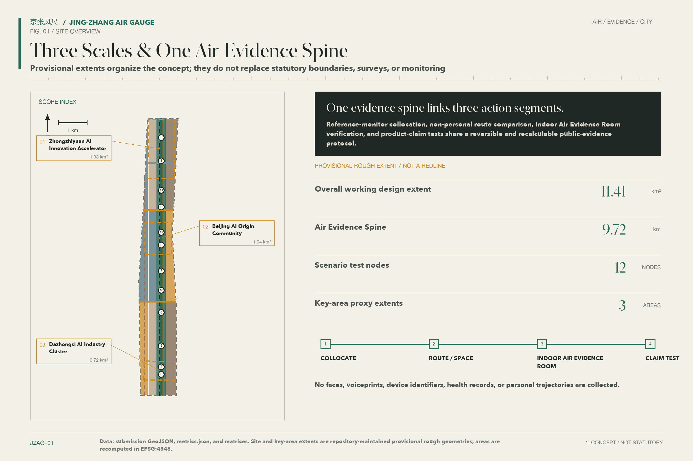
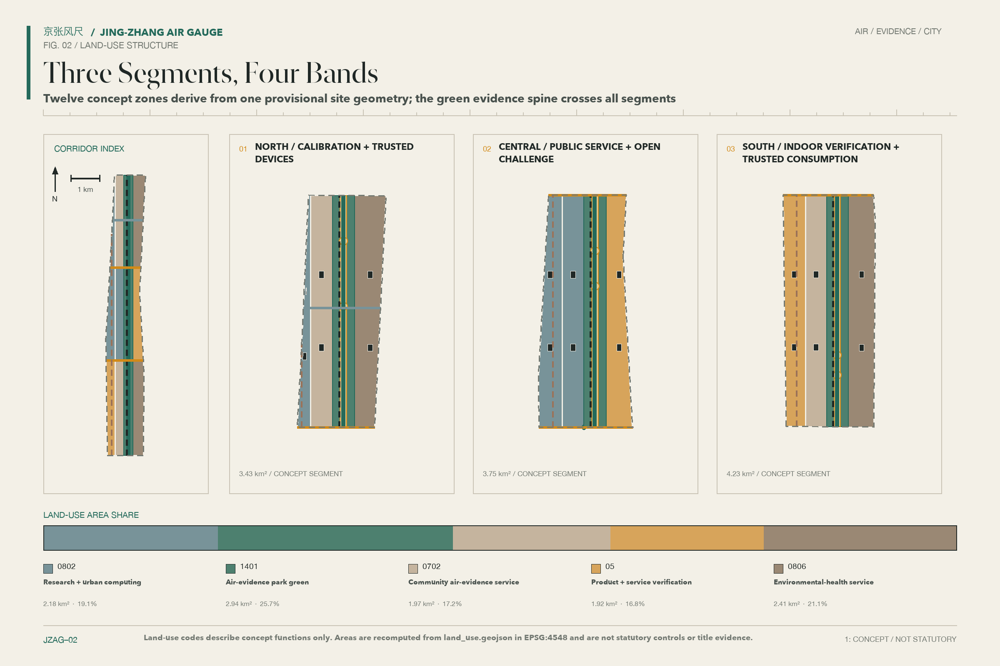
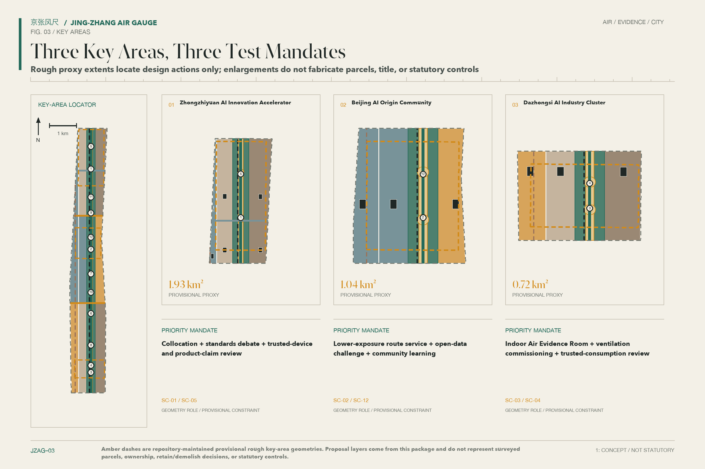
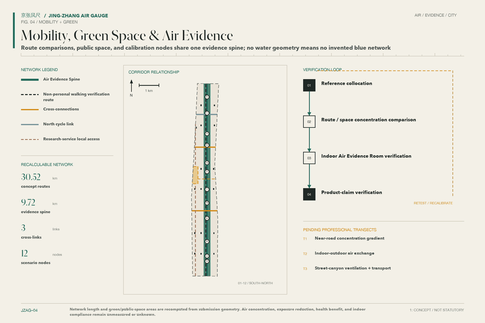
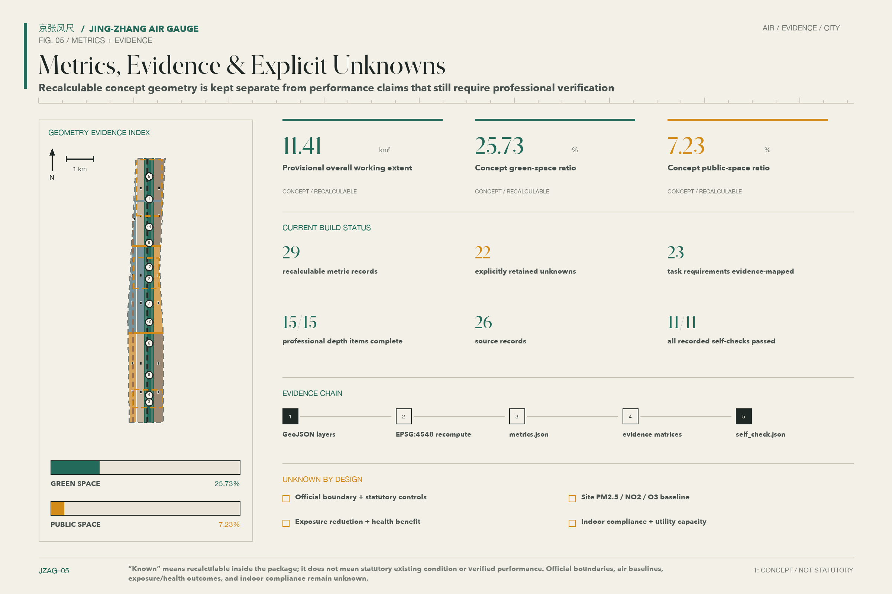

# JING-ZHANG AIR GAUGE: FROM STEAM TO BREATH

The subtitle “From Steam to Breath” places the industrial memory of the Jing-Zhang Railway beside the conditions of everyday health. The proposal does not turn air into another spectacular screen. It makes the trustworthiness of a measurement, the reasons for a route comparison, the verification of a room, and the scrutiny of a product claim visible in public space. Its core definition is direct: **JING-ZHANG AIR GAUGE is an air-exposure equity infrastructure without personal profiling**. It handles environmental and spatial records, not individual tracks, health files, or commercial labels.

## Design Basis and Source List

The Open Call announcement and the Agent taskbook define the work programme. Public standards from planning, natural-resources, environmental, and building authorities constrain the claims. Provisional geometry provides a replaceable spatial frame. The announcement sets the three scope levels and expected design depth; the taskbook adds the Three Positionings, Five Functions, Three Zones and Two Wings, and six Agent tasks. Neither document represents approval of this proposal. The current `site_boundary` and three `key_areas` are provisional and may support design discussion, drawing, and recalculation only. They are not an Official Planning Boundary, a parcel-ownership record, or an approval basis. [source:DATA-SRC-OFFICIAL-ANNOUNCEMENT-20260509] [source:DATA-SRC-AGENT-TASKBOOK-20260518] [source:DATA-SRC-PROVISIONAL-BOUNDARIES-20260605]

Air evidence has four levels. GB 3095—2026 defines the current national ambient-air framework, whose statutory evaluation depends on compliant monitoring and the responsible authority. HJ 653—2021 provides reference-monitoring and quality-control requirements. Indoor-air and building-environment standards inform an indoor air evidence-room concept that still requires professional verification. Low-cost sensors come last: they can support collocation trials, exploration of spatial differences, and maintenance prompts, but they are not regulatory monitors. They cannot establish compliance, publish an Air Quality Index, or label conditions as “good” or “poor” in real time. [source:AIR-CN-GB3095-2026] [source:AIR-CN-HJ653-2021]

Beijing’s 2025 environmental report recorded 85.2% “good-air” days under GB 3095—2012. The Beautiful Beijing plan recalculated the same year under GB 3095—2026 and reported 82.2%. These values describe one year under two standards, not a time trend. They cannot be extended to a site baseline, an individual exposure, or a health baseline. The proposal uses them only as city context and always displays the evaluation basis beside the value. [source:AIR-BJ-EE-BULLETIN-2025] [source:AIR-BJ-BEAUTIFUL-PLAN-2026]

| Evidence level | Permitted use in this proposal | Explicit exclusion |
| --- | --- | --- |
| Current Chinese environmental and building standards | Define legal boundaries and professional verification needs | Claiming compliance through a concept design |
| Public reports and action plans | Describe city context and governance direction | Substituting for site concentration or exposure data |
| Reference monitoring and collocation methods | Structure calibration, drift checks, and quality labels | Treating a low-cost device as a regulatory monitor |
| WHO guidance and international cases | Compare health-oriented principles and methods | Acting as a Chinese mandatory threshold or Beijing commitment |

The 2021 WHO Air Quality Guidelines remain a separate, non-binding health reference. They are not merged with GB 3095—2026 into a single compliance line. Cases from London, New York, Kampala, and other cities contribute methods, not evidence that the Jing-Zhang site will achieve the same effects. [source:AIR-WHO-AQG-2021] [source:AIR-UK-GLA-AQP-2023]

Full provenance, licences, temporal and spatial coverage, and limitations appear in `sources.json`. The standard, depth, and task matrices record exhaustive coverage. The prose keeps claim-adjacent evidence anchors, while `geometry/site_boundary.geojson` remains authoritative for the submission’s current geometry state. [standard:PROJECT-OFFICIAL-ANNOUNCEMENT] [depth:existing_conditions_diagnosis] [data:geometry/site_boundary.geojson#SITE-001]

## Three-Level Scope Framework

The three scopes form one sequence rather than three unrelated masterplans. The Coordinated Research Area asks how air evidence, the AI economy, public health, and international exchange can share rules. The Overall Design Area translates those rules into land use, walking and cycling, public space, building prototypes, and service nodes. The three Key-Area Detailed Design Areas test whether space, operation, privacy, and Human Review can work together. Each level separates what is known, what is designed, and what remains to be verified, so a strategic choice is not mistaken for a statutory control. [standard:MOHURD-URBAN-DESIGN-MEASURES] [depth:three_level_scope_framework]

The provisional geometry of the Overall Design Area recalculates to 11,412,825.386 square metres. This value describes the submitted file, not an official level of area precision. When the boundary is replaced, land use, building footprints, green space, public space, roads, phases, and every derived metric must be recalculated together. The three Key Areas retain the same provisional status and appear as low-contrast dashed constraints rather than solid authoritative borders. [data:geometry/site_boundary.geojson#SITE-001] [metric:site_area_sqm]

The spatial framework is “Three Zones, Two Wings, One Spine, Multiple Nodes.” The zones are Zhongzhiyuan AI Independent Innovation Acceleration Area, Beijing AI Origin Community, and Dazhongsi AI Industry Cluster. The wings are Zhongguancun Technology Services Wing and Xiaoyue River Scenario Enablement Wing. The spine is a public air-evidence sequence along the Jing-Zhang Railway Heritage Park, and twelve scenario nodes form the distributed layer. The spine is a working line for public measurement, interpretation, and review. It is not a proposed road, utility alignment, or planning boundary. [source:DATA-SRC-AGENT-TASKBOOK-20260518] [data:geometry/key_areas.geojson#PROV-KEY-001]

All three levels share one Evidence Chain. Sources explain where a judgement comes from, GeoJSON locates a design action, metrics show how it is recalculated, assumptions state what is missing, and the drawings and web pages make the reasoning legible. When official boundaries, Regulatory Detailed Planning, building surveys, ownership, transit interfaces, municipal capacity, or heritage controls become available, the source layers must be updated before spatial review and figures are regenerated. [depth:metrics_recalculation] [depth:risk_missing_data]

## Coordinated Research Area: Industry and Future City Research

“JING-ZHANG AIR GAUGE” is both a name and a governance metaphor. The logo direction crosses a railway distance mark with a wind vane: a vertical stroke carries the centennial timeline, short transverse marks represent auditable measurement, and open space represents breath. The palette uses paper ivory, soot black, oxidised copper green, and signal amber. It avoids company marks, portraits, and unlicensed imagery. “FROM STEAM TO BREATH” is a cultural subtitle and does not replace the official name of the Centennial Jing-Zhang AI Innovation Belt. [standard:PROJECT-AGENT-OPEN-CALL-TASKBOOK]

The Three Positionings follow one visible logic. The Centennial Jing-Zhang Cultural Belt retains the memory of railway engineering, measurement, and public works. The Metropolitan AI Life Experience Belt turns environmental information into everyday choices without personal profiles. The AI Integrated Innovation Belt subjects sensing, buildings, ventilation, mapping, and civic governance to open verification. The Five Functions are carried by reference monitoring, open-data protocols, product testing, public-space operation, and international methods exchange, without depending on fabricated company lists, investment totals, or fixed policy commitments. [source:DATA-SRC-AGENT-TASKBOOK-20260518]

The Three Zones and Two Wings divide responsibilities. Zhongzhiyuan hosts instrument collocation, algorithm calibration, device-claim testing, and standards discussion. AI Origin Community hosts open interfaces, developer collaboration, lower-exposure route comparison, and community learning. Dazhongsi hosts indoor air evidence spaces awaiting professional verification, consumer-product testing, and international presentation. Zhongguancun Technology Services Wing offers legal, standards, intellectual-property, and venture services. Xiaoyue River Scenario Enablement Wing receives outdoor route, blue-green-space, and event-operation trials. The evidence spine returns results to a public interface through a sequence of measurement, interpretation, choice, review, and correction. [data:geometry/public_space.geojson#PUBLIC-001] [depth:overall_spatial_structure]

Seven international cases contribute transferable methods rather than institutional or performance promises:

| Case | Method worth testing | Jing-Zhang translation and limit |
| --- | --- | --- |
| Breathe London | Low-cost networks, reference collocation, and public methods | Tiered quality labels; never a substitute for Beijing regulatory monitoring [source:CASE-BREATHE-LONDON] |
| NYC Community Air Survey | Repeated sampling on fixed routes | Seasonal walking samples without tracking people [source:CASE-NYCCAS] |
| AirQo | Device maintenance, calibration, and open research | A Zhongzhiyuan maintenance log, subject to local climate and institutional validation [source:CASE-AIRQO] |
| Array of Things | Debate on privacy and urban-sensor governance | A public data dictionary, appeal route, and shutdown mechanism [source:CASE-ARRAY-OF-THINGS] |
| BEACO2N | Dense nodes linked to atmospheric research | Research calibration without a promise of equivalent accuracy [source:CASE-BEACON] |
| UK School CO₂ Monitoring | Carbon dioxide as a ventilation-management prompt | An operational prompt, not an infection or health inference [source:CASE-UK-SCHOOL-CO2] |
| OpenAQ | Open interfaces, provenance metadata, and reusable records | A public catalogue that keeps data-quality classes separate [source:CASE-OPENAQ] |

Regional collaboration does not require every device and dataset to enter one platform. A minimum public protocol should expose time, location-precision class, device class, calibration state, missingness, licence, and Human Review records. Research teams, companies, and communities may keep their own systems while exchanging agreed environmental fields. This reduces supplier lock-in and leaves a clear interface for qualified monitoring data during professional deepening. [source:AIR-US-EPA-ENHANCED-GUIDEBOOK-2022]

## Overall Design Area: Urban Renewal and Regulatory-Plan-Level Urban Design

The overall structure uses the air-evidence spine as a north–south public armature. Three conceptual east–west links connect universities, parks, communities, transit stations, and the Xiaoyue River. The spine accommodates calibration interpretation, lower-exposure route choices, verifiable indoor spaces, and public explanation. Research and industry services, community services, and blue-green space sit on both sides. These relationships describe public-space intent, not statutory road lines, parcel boundaries, or planning controls. [data:geometry/land_use.geojson#LU-001] [depth:land_use_layout]

The land-use layer contains recalculable conceptual cells for research and industry services, community services, public management and public services, green space, and public space. The building layer contains capacity envelopes marked `design_proposal` and “survey pending.” No envelope is identified as an existing building or used to decide Retain, Renovate, or Demolish status. Floor Area Ratio, gross floor area, Building Coverage Ratio, height, setbacks, and underground space remain unknown until official planning, survey, ownership, and engineering information is available. [standard:MNR-LAND-USE-CLASSIFICATION-GUIDE] [data:geometry/buildings.geojson#BLDG-001]

Mobility work first repairs continuity for walking, cycling, accessibility, and transit access, and only then adds air information. A lower-exposure route is not a promise of the “cleanest” route. It compares calibrated environmental observations, time windows, and route conditions with stated uncertainty. Without time–activity data, the system may report concentration differences but cannot claim a reduction in personal exposure. Municipal concepts reserve interfaces for power, communication, equipment maintenance, and indoor ventilation verification, without concluding that energy loads, utility capacity, fire safety, or drainage are feasible. [data:geometry/roads.geojson#ROAD-001] [depth:municipal_new_infrastructure]

Renewal actions fall into four types: lightweight public components, reversible indoor adaptation, public-space connections, and buildings awaiting professional assessment. Signage, sampling, collocation, and operational trials that do not alter ownership or primary structure come first. Work affecting buildings, roads, rivers, heritage, fire safety, or utilities requires authority and professional review. “Regulatory-plan-level” therefore describes the completeness of questions and evidence, not an approved set of numeric controls. [standard:MOHURD-CONTROL-DETAILED-PLANNING] [depth:development_intensity_controls]

## Detailed Design of Key Areas

All three Key Areas retain provisional polygons and support directional design only. Zhongzhiyuan AI Independent Innovation Acceleration Area becomes a “Calibration and Trusted-Device Field.” Subject to access and ownership confirmation, it may host a reference-instrument collocation point, maintenance bench, algorithm-version register, and standards forum. Reversible labs, shared test rooms, and sheltered walking links take priority. Equipment deployment, company participation, Qinghe-river interfaces, and public access depend on ownership, permission, power, networks, and safety checks. [data:geometry/key_areas.geojson#PROV-KEY-001] [source:AIR-US-EPA-COLLOCATION-GUIDE]

Beijing AI Origin Community becomes an “Open Protocol and Public Choice Field.” Developer documentation, quality labels, route comparison, community learning, and accessible interpretation meet at everyday nodes. Ground-floor uses for shared release events, legal advice, and public review are conceptual. Connections between campuses, parks, and neighbourhoods require a walking survey. The system does not store habitual routes, recommend by age, occupation, or health condition, or transfer visit logs to commercial parties. [data:geometry/key_areas.geojson#PROV-KEY-002] [depth:three_key_area_detailed_design]

Dazhongsi AI Industry Cluster becomes an “Indoor Verification and Trusted Consumption Field.” Concepts include an indoor air evidence room, ventilation-commissioning bench, sensor-product claim test, and international methods display. A room may present a test conclusion only after applicable work under GB/T 18883—2022, GB 55016—2021, and professional procedures; the concept cannot be pre-labelled as compliant. Four-quadrant station access, retail interfaces, and building adaptation all require transport, fire, ownership, and utility review. [data:geometry/key_areas.geojson#PROV-KEY-003] [source:AIR-CN-GBT18883-2022] [source:AIR-CN-GB55016-2021]

The three subplans use the same seven tests: clarity of role, public accessibility, data-quality classification, privacy minimisation, accountable Human Review, maintainable operation, and visible missing conditions. Every building form, node, and link in the figure is a Conceptual Recommendation for professional development. None indicates that a site, construction project, or operation has been approved. [standard:MOHURD-URBAN-DESIGN-MEASURES] [depth:risk_missing_data]

## AI Innovation Ecosystem, Personas, and AI+ Scenarios

The system serves six personas but creates no persona records. First, people walking or cycling need legible uncertainty and accessible route options. Second, outdoor workers need usable rest points and shift-level environmental prompts. Third, carers travelling with children or older people need route comparison without submitting health information. Fourth, developers and researchers need open data with versions, quality classes, and licences. Fifth, start-ups and device teams need repeatable collocation and claim testing. Sixth, site and public-service operators need maintenance alerts, Human Review, and shutdown authority. These personas guide design empathy and never become database attributes. [source:DATA-SRC-AGENT-TASKBOOK-20260518]

Twelve scenario cards map to `SCENARIO_NODE`; four are Testing and Validation Scenarios (TVS). Every trial passes ethical, site, safety, and data review before access is considered.

| Card and scenario | Space and users | Data, privacy, Human Review, and operation |
| --- | --- | --- |
| SC-01 / TVS Street-Sensor Collocation Bench | Zhongzhiyuan; device teams and researchers | Records devices and reference instruments, not people; specialists review calibration and site operators maintain it |
| SC-02 Lower-Exposure Walking Comparison | AI Origin and the evidence spine; walkers and carers | Uses tiered environmental and route data, stores no travel identity, and sends anomalies to an operator |
| SC-03 / TVS Indoor Air Evidence Room | Dazhongsi; operators and the public | Records room and test batch, identifies no visitor, and requires qualified testing plus property review |
| SC-04 / TVS Ventilation Commissioning Bench | Dazhongsi; building and equipment teams | Uses indoor environment and equipment state without personal health data; a professional engineer signs the review |
| SC-05 / TVS Sensor Product-Claim Test | Zhongzhiyuan; start-ups and purchasers | Compares documentation, collocation, and drift; a review panel publishes a limited test record |
| SC-06 Accessible Air-Information Post | Public nodes; older and disabled users | Uses tactile, audio, and high-contrast explanation, with no cameras or biometrics; staff inspect it |
| SC-07 Seasonal Cycling Sample Line | Evidence spine; cyclists and researchers | Repeats a fixed route without rider identity; researchers assess temporal and spatial comparability |
| SC-08 Indoor–Outdoor Transition Prompt | Public-service entrances; visitors and operators | Compares space-level observations and ventilation state; a person decides whether to ventilate, filter, or suspend the prompt |
| SC-09 Blue-Green Maintenance Observation | Xiaoyue River Wing; landscape staff and the public | Records vegetation, dust, and maintenance; never assumes greenery reduces pollution; landscape staff review it |
| SC-10 Outdoor-Worker Rest Navigation | Public rest points; outdoor workers | Shows facilities and environmental state without occupation or shift logs; service operators co-evaluate it |
| SC-11 Event-Day Air Operations Desk | Belt event route; participants and organisers | Uses site observations and manual inspection; organisers retain authority to pause, reroute, or remove a notice |
| SC-12 Open-Data Challenge Forum | AI Origin; developers, residents, and managers | Publishes versions, missingness, licences, appeals, and corrections without releasing individual access logs |

No scenario outputs a personal risk score, disease probability, or health benefit. Without individual time–activity data, personal exposure change cannot be demonstrated; this proposal deliberately does not collect that record. Performance is therefore assessed through traceable measurement, explainable spatial differences, choices among routes and rooms, and correctable errors—not precise prediction of personal behaviour. [source:AIR-CN-WST666-2019]

The innovation ecosystem has four roles. Reference monitoring and qualified testing protect the quality boundary. Companies provide products that can be challenged. Researchers and developers maintain open methods. Public-space and building operators maintain the service. The public may inspect quality labels, dispute a result, request correction, and avoid non-essential collection. An Urban Agent may screen anomalies, compare versions, or draft explanations, but a person reviews publication and retains a physical and procedural shutdown control. [source:AIR-US-EPA-ENHANCED-GUIDEBOOK-2022] [data:geometry/constraints.geojson#SCENARIO-001]

## Land Use, Building Scale, and Retain-Renovate-Demolish Strategy

Four spatial families surround the air-evidence spine. The spine itself prioritises green space, public space, and public services. Zhongzhiyuan emphasises research and industry services. AI Origin combines public services, research collaboration, and community life. Dazhongsi combines industry services, public demonstration, and verifiable indoor space. Design cells are clipped to the provisional boundary and their union covers the submitted scope. Land-use codes follow the public classification guide, but they do not constitute a statutory land-use change. [standard:MNR-LAND-USE-CLASSIFICATION-GUIDE] [data:geometry/land_use.geojson#LU-001]

The building layer represents capacity envelopes rather than an existing-building survey. Envelopes favour permeable ground floors, shallow shared rooms, maintainable equipment spaces, and active edges facing public space. Rooftop equipment, air intake and exhaust, and noise control are principles only. Gross floor area, Floor Area Ratio, height, Building Coverage Ratio, setbacks, parking, fire compartments, and structural capacity remain unknown until official controls and professional surveys are available. [data:geometry/buildings.geojson#BLDG-001] [depth:height_massing_character]

The Demolish–Renovate–Retain Strategy begins with survey. Objects with heritage, continuing-use, or structural value are candidates for retention. Those that can improve ventilation, envelope performance, accessibility, or ground-floor interface may be renovation candidates. Demolition may be considered only after combined ownership, structure, heritage, fire, environmental, and necessity assessment. New construction also waits for planning and capacity evidence. No specific building receives a demolition conclusion at this stage. [depth:retain_renovate_demolish]

Spatial supply and operation constrain one another. A collocation bench needs stable power, a reference instrument, and maintenance access. An indoor air evidence room needs testing, ventilation commissioning, and continuing records. An open-data forum needs low-threshold public space. Rest points need shelter, water, and accessibility. If later recalculation shows insufficient green or public space, the conceptual envelopes should change before public-use requirements are reduced. [metric:green_ratio] [metric:public_space_ratio]

## Transport, Rail, Municipal Infrastructure, and Public Services

The transport concept first establishes a continuous north–south Walking and Cycling Network, then adds three conceptual east–west connections to universities, parks, neighbourhoods, and transit stations. The drawing describes connectivity intent, not road redlines, bridge or tunnel form, or engineering feasibility. A lower-exposure comparison must display distance, accessibility, crossings, opening hours, observation currency, and data quality. It cannot optimise on one concentration value or call any route “safe.” [data:geometry/roads.geojson#ROAD-001] [depth:traffic_rail_slow_parking]

Areas around transit stations prioritise walking information, short-rest facilities, bicycle parking, and visible public-service entrances. Station–district connections at Zhongzhiyuan, AI Origin, and Dazhongsi require on-foot surveys, passenger data, and transport-authority review. Four-quadrant connections, road crossings, and in-station wayfinding remain Conceptual Recommendations. Event-day operation may combine manual inspection with site-level observations to reroute or pause an activity, without face recognition, personal trajectories, or automated enforcement. [source:DATA-SRC-OFFICIAL-ANNOUNCEMENT-20260509]

Municipal and New Infrastructure have three layers. The base layer covers compliant power, communication, drainage, fire safety, and equipment access. The verification layer covers reference-instrument interfaces, collocation benches, indoor sampling points, and calibration records. The public layer covers high-contrast information posts, an open-data catalogue, and an appeal channel. Equipment should support local caching, offline fallback, time synchronisation, auditable updates, and manual shutdown. Energy, compute, network coverage, and utility capacity are unknown and cannot be inferred from the number of concept nodes. [depth:municipal_new_infrastructure]

Public services prioritise people who cannot or do not wish to use a smartphone. Information posts, printed route sheets, service counters, and staff offer equivalent access. Critical messages combine text, symbols, and tactile or audio communication. AI-Enabled Scenarios in medicine, education, law, and daily services provide environmental and spatial information only; they do not access clinical, student, legal-case, or consumer records. [standard:MOHURD-URBAN-DESIGN-MEASURES]

## Blue-Green Network, Public Space, and Urban Character

The Jing-Zhang Railway Heritage Park forms the public face of the air-evidence spine, while spaces associated with the Qinghe and Xiaoyue rivers support seasonal observation and walking connections. Greenery is not automatically an air “cleaner”: species, canopy, street geometry, wind, and emission sources can create different outcomes. Field wind, ecology, and traffic evidence must test the effects. The concept proposes continuous shade, usable edges, accessible paths, and maintenance points, without claiming that planting necessarily lowers concentrations. [source:AIR-BJ-CLIMATE-ADAPTATION-2024] [depth:blue_green_public_space]

The public-space kit includes railway-scale paving marks, replaceable explanation panels, calibration sockets, sheltered seating, accessible information posts, indoor–outdoor sampling interfaces, and lockable equipment boxes. Reversible installation avoids heritage fabric, root zones, fire routes, and evacuation space. Heritage, landscape, transport, and operations reviewers must confirm each location. Colours and typography follow the Air Gauge identity; no company advertising or unlicensed marks appear. [data:geometry/green_space.geojson#GREEN-001] [data:geometry/public_space.geojson#PUBLIC-001]

Four pilgrimage and honour nodes are conceptual public installations. “Gauge Zero” explains how the first traceable observation is established. “Calibration Yard” exposes drift, failure, and correction rather than displaying only success. “Breath Room” explains indoor testing, ventilation, and conditions of use. “Open-Source Scale Walk” records contributions to maintenance, standards, code, community care, and Human Review. Honours rely on verifiable contribution, allow correction or withdrawal, and never rank by sponsorship value. [standard:PROJECT-AGENT-OPEN-CALL-TASKBOOK]

The Urban Character combines railway engineering clarity, Zhongguancun’s open experiment, and the scale of ordinary breathing. Buildings use legible bases, continuous cornice relationships, and visible maintenance access; equipment is not disguised as a futuristic sculpture. The cultural narrative moves from steam locomotion, distance measurement, and public works toward contestable environmental evidence. It neither distorts railway history nor turns heritage into a technology backdrop. Names, signs, and images require trademark, typeface, heritage, and public-acceptance review before implementation. [source:DATA-SRC-AGENT-TASKBOOK-20260518]

## Renewal Projects, Implementation Policy, and Phasing

Nine renewal projects form a separable list, not a confirmed construction programme: JZ-01 evidence-spine wayfinding and public explanation; JZ-02 Zhongzhiyuan collocation field; JZ-03 AI Origin open-data and challenge space; JZ-04 Dazhongsi indoor air evidence room; JZ-05 lower-exposure walking comparison line; JZ-06 accessible air-information posts; JZ-07 Xiaoyue River seasonal observation line; JZ-08 four honour nodes; and JZ-09 annual operations and public evaluation. Every project needs site permission, a data steward, maintenance resources, an accountable reviewer, and an exit plan. [depth:renewal_project_list]

Phasing follows risk rather than visual completeness. The near term establishes a public protocol, collocation method, small reversible components, and baseline investigation. The medium term expands routes, indoor spaces, and services across the three Key Areas only after verification. The long term considers links to official planning, building renewal, and regional governance. Phase geometry indicates a north, central, and south work sequence. It does not establish land-development timing, funding, or approval. [data:geometry/phasing.geojson#PHASE-001] [depth:phasing_implementation]

| Phase | Work that may advance | Conditions that come first |
| --- | --- | --- |
| Near term: evidence first | Data dictionary, collocation trial, walking survey, reversible signs, public learning | Site consent, ethics and privacy review, reference instruments, maintenance responsibility |
| Medium term: spatial verification | Staged tests of twelve scenarios, indoor air evidence rooms, cross-area experience route | Qualified testing, transport and fire review, accessibility testing, public evaluation |
| Long term: institutional linkage | Planning deepening, building renewal, standards collaboration, regional network | Official boundaries and controls, ownership, utility capacity, heritage review, funding mechanism |

The annual operations calendar repeats by season. A spring “Calibration Season” opens collocation and maintenance work. A summer “Breathing Routes Month” tests walking, cycling, and accessibility. An autumn “From Steam to Breath Forum” connects railway culture, building environment, and open data. A winter “Indoor Air Verification Week” reviews ventilation, indoor air evidence rooms, and product claims. A monthly data challenge forum and quarterly error, correction, missing-data, and shutdown report keep scrutiny routine. These events are proposals and require site and account-owner authorisation. [source:DATA-SRC-AGENT-TASKBOOK-20260518]

Long-term operation combines a Public Rules Committee, Professional Quality Group, Site Operations Group, and observer seats for developers and residents. The committee decides data purposes and appeals; the quality group reviews calibration; site operators maintain equipment; observers raise questions without access to personal records. International communication publishes reproducible methods, current status, and known limits. Investment and partnerships undergo separate due diligence and are not presented here as signed or funded. [standard:PROJECT-AGENT-OPEN-CALL-TASKBOOK]

## Metrics, Area Recalculation, and Compliance Matrix

Metrics fall into three classes. Geometry-derived design metrics cover provisional site area, green-space ratio, public-space ratio, building footprint, evidence-spine length, cross-link count, scenario nodes, Key Areas, and phases. Control metrics awaiting official planning and professional evidence include Floor Area Ratio, gross floor area, height, Building Coverage Ratio, setbacks, road redlines, and municipal capacity. Operational metrics that can exist only after use include sensor uptime, calibration drift, missingness, appeal response, accessibility, and spatial concentration differences. [depth:metrics_recalculation]

The only spatial total quoted in the prose is the provisional boundary recalculation of 11,412,825.386 square metres, with confidence tied to its provisional state. Green and public-space ratios divide the relevant geometry by that same provisional site area. Their values come from structured records rather than being fixed in prose, and both must be recalculated whenever the boundary or land-use partition changes. [metric:site_area_sqm] [metric:green_ratio] [metric:public_space_ratio]

Air metrics do not include “compliant point count,” a health benefit, or a percentage reduction in exposure. A site baseline for PM2.5, NO₂, and O₃ has not been established through qualified monitoring, and indoor spaces have not completed standards-based testing. Early operation records only data quality, collocation duration, drift, missingness, and spatial differences. Health-risk quantification would require time–activity, population, baseline-health, exposure–response, and uncertainty evidence plus ethical and professional review. [source:AIR-CN-WST666-2019] [source:AIR-CN-GB3095-2026]

`compliance_matrix.json` maps the announcement tasks and agent.1 through agent.6. `standard_matrix.json` records how the five mandatory standards are addressed and what remains unresolved. `design_depth_matrix.json` covers all fifteen design-depth items. Passing self-check means that files, references, geometry, and declared rules are consistent. It does not mean official approval, engineering feasibility, or professional monitoring compliance. [standard:MOHURD-CONTROL-DETAILED-PLANNING] [depth:risk_missing_data]

## Risk, Copyright, and Compliance

The first risk is incomplete boundary and baseline information. The site and three Key Areas are provisional constraints; existing parcels, buildings, ownership, road redlines, transit interfaces, utilities, flood conditions, fire safety, heritage controls, and pedestrian flows are incomplete. Every spatial action is a Conceptual Recommendation. Professional deepening must replace provisional geometry with official polygons and repeat area, connectivity, building, and phase review. [source:DATA-SRC-PROVISIONAL-BOUNDARIES-20260605]

The second risk is measurement. Low-cost sensors can respond to humidity, temperature, ageing, installation, and cross-sensitivity; collocation does not remove all uncertainty. The service publishes device class, calibration state, currency, missingness, and corrections, and downgrades or shuts down data when drift or reference conditions are inadequate. Public displays provide neither an Air Quality Index nor real-time “good/poor” labels and never present exploratory observations as regulatory monitoring. [source:AIR-US-EPA-COLLOCATION-GUIDE] [source:AIR-CN-HJ653-2021]

The third risk concerns privacy and inequity. Routes, rooms, and rest points could be mistaken for personal medical advice, while smartphone-only access could exclude people. The system retains environmental and facility records only, with no cameras, device recognition, or account linkage by default. Printed, tactile, audio, and staffed access are equivalent channels. People may correct or shut down automated interpretation. Health questions are referred to qualified services rather than judged by an Urban Agent. [depth:risk_missing_data]

The prose is released under CC BY 4.0. Custom figures, map symbols, identity direction, and web pages are original to the package; source data, standards, and cases retain the attribution and limits recorded in `sources.json`. System typefaces may render documents, but no font file is redistributed. The package uses no remote map tiles, company marks, portraits, paper figures, or uncleared photography. Full details appear in `report/copyright_statement.md`. [source:DATA-SRC-OFFICIAL-ANNOUNCEMENT-20260509]

All outputs are Open Co-Creation proposals. They do not replace formal planning and do not constitute a government determination. Events, cooperation, investment, funding, construction, and operators remain unconfirmed. A3 and A0 documents, HTML, and figures are design communication. Human and professional reviewers retain final judgement on facts, standards, engineering, safety, and public interest. [standard:PROJECT-AGENT-OPEN-CALL-TASKBOOK]

## References

The following materials directly shape the proposal. Complete metadata, licence, retrieval date, and limits of use appear in `sources.json`.

1. Beijing Municipal Commission of Planning and Natural Resources, Haidian Branch, public announcement and attachments for the Centennial Jing-Zhang AI Innovation Belt Urban Design Open Call. [source:DATA-SRC-OFFICIAL-ANNOUNCEMENT-20260509]
2. *Agent Taskbook Extract for the Centennial Jing-Zhang AI Innovation Belt Open Call for Urban Design*. [source:DATA-SRC-AGENT-TASKBOOK-20260518]
3. Ministry of Housing and Urban-Rural Development, *Measures for the Administration of Urban Design* and public requirements concerning Regulatory Detailed Planning. [source:DATA-SRC-MOHURD-URBAN-DESIGN-MEASURES]
4. Ministry of Natural Resources, *Guide to Land and Sea-Use Classification for Territorial-Space Survey, Planning, and Use Regulation*. [source:DATA-SRC-MNR-LAND-USE-CLASSIFICATION-202311]
5. Ministry of Ecology and Environment, GB 3095—2026 ambient-air standard and HJ 653—2021 monitoring specification. [source:AIR-CN-GB3095-2026] [source:AIR-CN-HJ653-2021]
6. Beijing Municipal Ecology and Environment Bureau, *2025 Report on the State of the Ecology and Environment in Beijing*; Beijing Municipal People's Government, *Beautiful Beijing Development Plan for the 15th Five-Year Plan Period*. [source:AIR-BJ-EE-BULLETIN-2025] [source:AIR-BJ-BEAUTIFUL-PLAN-2026]
7. State Administration for Market Regulation and Ministry of Housing and Urban-Rural Development, GB/T 18883—2022 and GB 55016—2021. [source:AIR-CN-GBT18883-2022] [source:AIR-CN-GB55016-2021]
8. World Health Organization, *WHO Global Air Quality Guidelines*, 2021; used only as a non-binding health reference. [source:AIR-WHO-AQG-2021]
9. United States Environmental Protection Agency, *Air Sensor Collocation Instruction Guide* and *Enhanced Air Sensor Guidebook*. [source:AIR-US-EPA-COLLOCATION-GUIDE] [source:AIR-US-EPA-ENHANCED-GUIDEBOOK-2022]
10. Greater London Authority, *Air Quality Positive London Plan Guidance*, 2023; used only for design-method comparison. [source:AIR-UK-GLA-AQP-2023]
11. Public methods from Breathe London, NYC Community Air Survey, AirQo, Array of Things, BEACO2N, UK School CO₂ Monitoring, and OpenAQ, used under their individual provenance and limits. [source:CASE-BREATHE-LONDON] [source:CASE-OPENAQ]

References do not substitute for precise site evidence. Claims concerning Official Boundaries, existing concentrations, personal exposure, health outcomes, building performance, transport, utilities, heritage, or engineering feasibility still require data and review from responsible authorities, qualified organisations, and professional teams. [depth:risk_missing_data]
