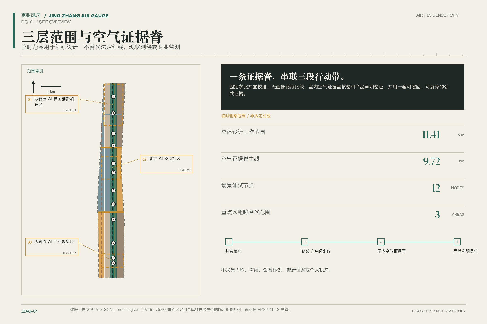
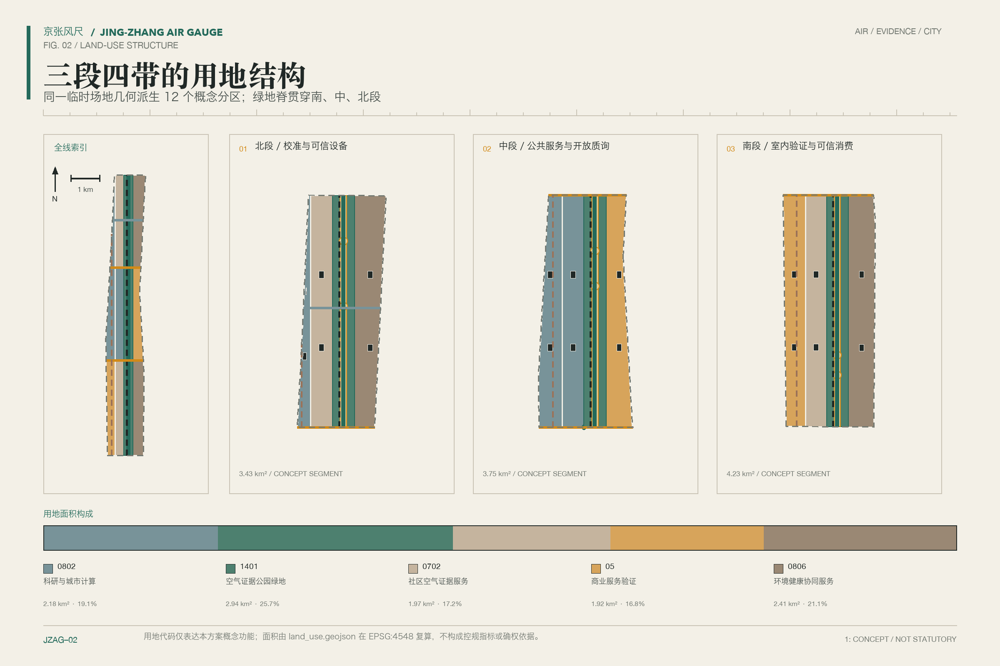
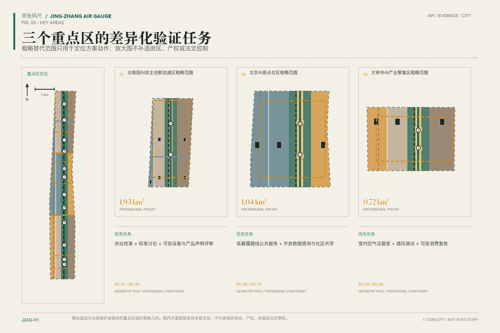
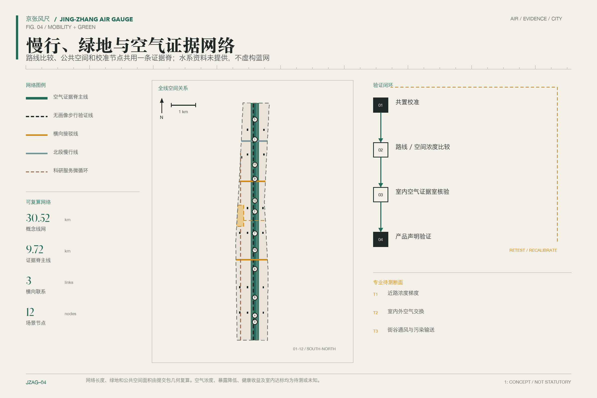
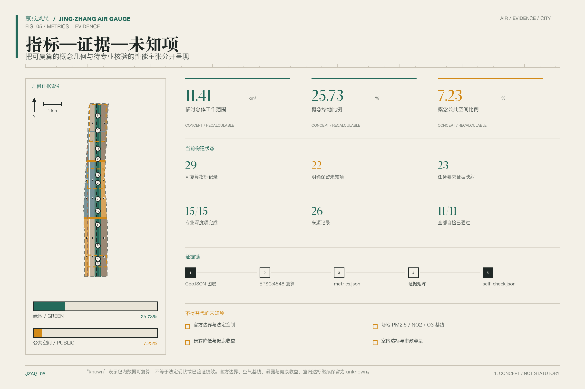

# 京张风尺：从蒸汽到呼吸

副题「从蒸汽到呼吸」把京张铁路的工业记忆与当代日常健康并置。方案不把空气做成另一块炫目的屏幕，而是把测量如何可信、路线如何选择、房间如何验证、产品如何接受质询，公开地嵌入一条城市公共空间。核心定义是：**京张风尺是一套无个人画像的空气暴露公平基础设施**。它只处理环境与空间，不建立个人轨迹、健康档案或商业标签。

## 设计依据与资料清单

本方案以公开征集公告和面向智能体任务书确定工作范围，以住建、自然资源和生态环境领域公开标准约束表达，以临时边界组织可替换的设计图层。公告说明三层工作和成果深度，任务书补充三大定位、五大功能、三区两翼及六项智能体任务；两者是任务依据，不是对本方案的批准。当前 `site_boundary` 与三处 `key_areas` 均为临时几何，只能支持设计讨论、制图和复算，不能当作官方红线、地块权属或审批依据。[source:DATA-SRC-OFFICIAL-ANNOUNCEMENT-20260509] [source:DATA-SRC-AGENT-TASKBOOK-20260518] [source:DATA-SRC-PROVISIONAL-BOUNDARIES-20260605]

空气证据分为四层。第一层是现行环境质量标准 GB 3095—2026，法定评价须依靠符合要求的监测与主管部门程序；第二层是 HJ 653—2021 等监测方法，用于规定参考仪器和质量控制；第三层是室内空气与建筑环境标准，用于提出待专业验证的室内空气证据空间；第四层才是低成本传感器。低成本设备可用于共址试验、空间差异探索和维护提示，但不是监管监测站，不能据此宣布达标、发布空气质量指数或给出实时「优良」等级。[source:AIR-CN-GB3095-2026] [source:AIR-CN-HJ653-2021]

北京 2025 年生态环境报告按 GB 3095—2012 口径给出 85.2% 的优良天数比例；《“十五五”时期美丽北京建设规划》按 GB 3095—2026 对同一年度重算后给出 82.2%。两数来自同一年、不同标准口径，不构成年度趋势，也不能外推为场地、个人暴露或健康基线。本方案只把它们作为城市背景，并在图表中并列标注口径。[source:AIR-BJ-EE-BULLETIN-2025] [source:AIR-BJ-BEAUTIFUL-PLAN-2026]

| 证据层 | 本方案允许的用途 | 明确排除 |
| --- | --- | --- |
| 中国现行环境与建筑标准 | 定义法定评价边界、专业复核条件 | 用概念设计宣布合规 |
| 主管部门公开报告与行动计划 | 描述城市背景、治理方向 | 充当场地浓度或人群暴露数据 |
| 参考监测与共址方法 | 设计校准、漂移检查、数据分级 | 把低成本设备等同监管仪器 |
| WHO 指南与海外案例 | 健康导向和方法比较 | 作为中国强制阈值或北京实施承诺 |

WHO 2021 空气质量指南在本方案中单列为非约束健康参照，不与 GB 3095—2026 合并成同一条合规线。伦敦、纽约、坎帕拉等案例只支撑方法借鉴，不能证明京张场地可达到同样成效。[source:AIR-WHO-AQG-2021] [source:AIR-UK-GLA-AQP-2023]

完整来源、许可、时空范围和限制写入 `sources.json`；标准响应、设计深度、任务覆盖分别进入三个矩阵。正文只保留判断旁的证据入口，几何状态以 `geometry/site_boundary.geojson` 为准。[standard:PROJECT-OFFICIAL-ANNOUNCEMENT] [depth:existing_conditions_diagnosis] [data:geometry/site_boundary.geojson#SITE-001]

## 三层范围工作框架

三层范围不是三套互不相干的总图，而是从区域协同到可执行试点逐级缩小问题。统筹研究范围讨论空气证据、AI 产业、公共健康和国际交流怎样形成共同规则；总体设计范围把规则转为用地、慢行、公共空间、建筑原型和设施节点；三处重点区域再检验空间、运营、隐私与人工复核能否同时成立。每一层都保留「已知、设计、待核」三栏，避免战略判断被误读为法定控制。[standard:MOHURD-URBAN-DESIGN-MEASURES] [depth:three_level_scope_framework]

总体设计临时边界的几何复算面积为 11,412,825.386 平方米。这个数字只描述当前提交文件，不代表官方面积精度；边界替换后，用地、建筑基底、绿地、公共空间、道路、分期和全部派生指标必须整体重算。三处重点区同样保留临时状态，图上以低对比虚线表达，不用实色边框制造确定感。[data:geometry/site_boundary.geojson#SITE-001] [metric:site_area_sqm]

空间工作采用「三区两翼、一脊、多点」：三区是众智园 AI 自主创新加速区、北京 AI 原点社区和大钟寺 AI 产业聚集区；两翼是中关村科技服务翼和小月河场景赋能翼；一脊是沿京张铁路遗址公园组织的空气证据脊；多点是十二个场景节点。这里的「脊」是公共测量、解释和复核的工作线，不是新设道路、管线或规划红线。[source:DATA-SRC-AGENT-TASKBOOK-20260518] [data:geometry/key_areas.geojson#PROV-KEY-001]

三层成果共享同一证据链：来源说明判断从哪里来，GeoJSON 说明设计放在哪里，指标说明怎样复算，假设说明还缺什么，图纸和网页负责让人读懂。官方边界、控规、现状建筑、权属、轨道接口、市政容量和文保控制一旦补齐，应先更新源数据，再重跑空间审查与图件，而不是手工修改结论。[depth:metrics_recalculation] [depth:risk_missing_data]

## 统筹研究范围产业与未来城市研究

「京张风尺 / JING-ZHANG AIR GAUGE」既是方案名称，也是治理隐喻。标志方向取铁路里程刻度与风向标的交叉形：竖线代表百年京张时间轴，横向短刻度代表可复核测量，留白代表呼吸。主色使用纸本象牙白、烟炱黑、氧化铜绿和信号琥珀色；不使用企业商标、人物肖像和未授权图像。副题「从蒸汽到呼吸 / FROM STEAM TO BREATH」只承担文化叙事，不替代一带整体官方名称。[standard:PROJECT-AGENT-OPEN-CALL-TASKBOOK]

三大定位在这里获得同一条可见逻辑：百年京张文化带保存铁路、测量和工程公共性的记忆；都市 AI 生活体验带把环境信息转为不依赖个人画像的日常选择；AI 融合创新带让传感、建筑、通风、地图与公共治理接受公开验证。五大功能分别落在参考监测、开放数据规范、产品试验、公共空间运营和国际方法对话，不以投资额、企业名单或已确定政策作为前提。[source:DATA-SRC-AGENT-TASKBOOK-20260518]

三区两翼形成分工。众智园负责仪器共址、算法校准、设备声明核验和治理标准讨论；AI 原点社区负责开放接口、开发者协作、低暴露路径和社区共学；大钟寺负责室内空气证据空间、消费产品验证和国际展示。中关村科技服务翼提供法律、标准、知识产权与创业服务，小月河场景赋能翼承接户外路径、蓝绿空间和活动日运行测试。空气证据脊把结果带回公众可读界面，形成「测量—解释—选择—复核—修正」的连续过程。[data:geometry/public_space.geojson#PUBLIC-001] [depth:overall_spatial_structure]

七个全球案例只提取可迁移的方法，不复制机构或技术承诺：

| 案例 | 可借鉴方法 | 京张转译与限制 |
| --- | --- | --- |
| Breathe London | 低成本网络与参考站共址、公开方法说明 | 转为分级数据标签；不能替代北京监管监测 [source:CASE-BREATHE-LONDON] |
| NYC Community Air Survey | 固定路线重复采样与空间比较 | 转为季节性步行采样；不追踪个人 [source:CASE-NYCCAS] |
| AirQo | 设备维护、校准与开放研究协作 | 转为众智园维护台账；气候和制度差异需重验 [source:CASE-AIRQO] |
| Array of Things | 城市传感平台的隐私和治理讨论 | 借鉴公开数据字典与停用机制 [source:CASE-ARRAY-OF-THINGS] |
| BEACO2N | 高密度节点和大气研究协作 | 借鉴科研校准；不承诺同等精度 [source:CASE-BEACON] |
| UK School CO₂ Monitoring | 室内二氧化碳作为通风管理提示 | 只作运行提示，不推断感染或健康结果 [source:CASE-UK-SCHOOL-CO2] |
| OpenAQ | 开放接口、来源元数据与可追溯复用 | 建立公开目录；不混合不同质量等级 [source:CASE-OPENAQ] |

区域协同不要求把所有设备与数据集中到一个平台。方案建议发布最小公共协议：时间、位置精度等级、设备类别、校准状态、缺测、许可和人工复核记录。科研团队、企业和社区可保留各自系统，只在同意的接口上交换环境数据。这个架构降低单一供应商锁定风险，也为专业团队后续接入合格监测资料预留位置。[source:AIR-US-EPA-ENHANCED-GUIDEBOOK-2022]

## 总体设计范围城市更新与控规深度城市设计

总体空间结构以空气证据脊为南北公共骨架，以三条东西向联系把高校、园区、社区、轨道站点与小月河串联。脊内布置校准展示、低暴露路径选择、可验证室内空间和公众解释节点；两侧保留研发、服务、社区和蓝绿空间的混合分区。它表达公共空间关系，不替代道路线位、地块边界或法定规划控制。[data:geometry/land_use.geojson#LU-001] [depth:land_use_layout]

用地层采用可复算的概念单元，区分科研与产业服务、社区生活服务、公共管理与公共服务、绿地和公共空间。建筑层只绘制设计容量包络，标注 `design_proposal` 与「待现状核查」；不把任何包络称为现状建筑，也不据此决定保留、改造或拆除。容积率、总建筑面积、建筑高度、建筑密度、退线和地下空间均列为未知，等待正式控规、测绘、权属和工程资料。[standard:MNR-LAND-USE-CLASSIFICATION-GUIDE] [data:geometry/buildings.geojson#BLDG-001]

交通系统优先修补步行、骑行、无障碍与轨道接驳的连续性，再讨论空气信息服务。低暴露推荐不是「最干净路线」承诺，而是基于已校准环境观测、时段和路径条件给出带不确定性的比较；没有时间—活动数据时，只能报告浓度差异，不能声称个人暴露下降。市政方面预留供电、通信、设备维护和室内通风核验接口，但不对能源负荷、管线容量、消防或排水可行性下结论。[data:geometry/roads.geojson#ROAD-001] [depth:municipal_new_infrastructure]

城市更新对象分为轻量公共设施、可逆室内改造、公共空间连接、待专业评估建筑四类。优先启动不改变产权和主体结构的标识、采样、共址与运营试验；涉及建筑、道路、河道、文保、消防和市政的动作，必须在下一阶段取得主管部门和专业团队复核。控规深度在本提交中体现为问题与证据的完整性，不伪装为审定指标。[standard:MOHURD-CONTROL-DETAILED-PLANNING] [depth:development_intensity_controls]

## 重点区域详细设计

三处重点区均沿用临时多边形，只表达方向性设计。众智园 AI 自主创新加速区定位为「校准与可信设备场」：在可确认的公共或园区开放空间内，概念设置参考仪器共址位、设备维护工位、算法版本登记和标准讨论空间。建筑更新以可逆实验室、共享测试间和带遮蔽的步行联系为先；任何设备部署、企业参与、清河界面工程及对外开放，均待权属、许可、供电、网络和安全条件确认。[data:geometry/key_areas.geojson#PROV-KEY-001] [source:AIR-US-EPA-COLLOCATION-GUIDE]

北京 AI 原点社区定位为「开放协议与公共选择场」：把开发者文档、数据质量标签、低暴露步行比较、社区共学和无障碍解释集中在日常可达节点。建筑首层只提出共享发布、法律咨询和公众复核的功能建议；校区、园区和社区之间的连接以现状调查为前置。系统不保存个人常走路线，不按年龄、职业或健康状况推荐，也不将访问记录转给商业主体。[data:geometry/key_areas.geojson#PROV-KEY-002] [depth:three_key_area_detailed_design]

大钟寺 AI 产业聚集区定位为「室内验证与可信消费场」：概念设置室内空气证据室、通风调试工位、传感产品声明核验和国际方法展台。房间只在符合 GB/T 18883—2022、GB 55016—2021 及专业检测要求后，才能展示相应检测结论；概念模型不能提前命名为「达标空间」。轨道站点四象限、商业界面和建筑改造均需另行核查交通、消防、权属与市政条件。[data:geometry/key_areas.geojson#PROV-KEY-003] [source:AIR-CN-GBT18883-2022] [source:AIR-CN-GB55016-2021]

三个小方案共享七项检查：定位是否清楚，公共空间是否可达，数据是否分级，隐私是否最小化，人工复核是否有责任人，运行维护是否可持续，缺失条件是否公开。图中所有建筑形态、节点和连线都是可供专业团队深化研究的参考方案；不表示已获选址、建设或运营许可。[standard:MOHURD-URBAN-DESIGN-MEASURES] [depth:risk_missing_data]

## AI 创新生态、人才画像与 AI+ 场景

系统服务六类人物，但不为任何人建立画像档案。①日常步行与骑行居民需要看得懂的不确定性和无障碍路径；②户外劳动者需要可用的休息点与班次级环境提示；③照护者需要带儿童或老人出行时的路线比较，但不提交健康信息；④开发者与研究者需要带版本、质量等级和许可的开放数据；⑤初创与设备团队需要可重复的共址和声明核验；⑥场地与公共服务运营者需要维护告警、人工确认和停用权。这里的「人物」只用于设计同理，不成为数据字段。[source:DATA-SRC-AGENT-TASKBOOK-20260518]

十二张场景卡都映射到 `SCENARIO_NODE`，其中四张标记为产业测试验证场景（TVS）。任何测试先过伦理、场地、安全和数据审查，再决定是否开放。

| 编号与场景 | 空间与对象 | 数据、隐私、人工复核与运营 |
| --- | --- | --- |
| SC-01／TVS 街道传感器共址台 | 众智园；设备团队、研究者 | 记录设备与参考仪器，不采集人；专业人员审核校准，场地运营方维护 |
| SC-02 低暴露步行比较 | 原点社区与证据脊；步行者、照护者 | 使用分级环境数据与路径条件，不保存出行身份；运营员审核异常 |
| SC-03／TVS 室内空气证据室核验 | 大钟寺；空间运营者、公众 | 记录房间与检测批次，不识别人；合格机构和物业共同复核 |
| SC-04／TVS 通风调试工位 | 大钟寺；建筑与设备团队 | 使用室内环境与设备工况，不接入个人健康数据；专业工程师签认 |
| SC-05／TVS 传感产品声明核验 | 众智园；初创与采购方 | 对比说明书、共址结果和漂移；评审小组发布带限制的测试记录 |
| SC-06 无障碍空气信息柱 | 公共节点；视听障碍者、老人 | 提供触觉、语音和高对比解释；不摄像、不做生物识别，人工巡检 |
| SC-07 骑行季节采样线 | 证据脊；骑行者、研究者 | 固定路线重复采样，不上传骑行者身份；研究团队审核时空可比性 |
| SC-08 室内外切换提示 | 公共服务空间入口；访客、运营者 | 仅比较空间测点与通风状态；人工决定开窗、净化或暂停提示 |
| SC-09 蓝绿空间维护观察 | 小月河翼；园林人员、公众 | 记录植被、扬尘与设备维护，不以绿化自动推断降污；园林人员复核 |
| SC-10 户外劳动休息导航 | 公共休息点；户外劳动者 | 显示设施与环境状态，不记录职业或班次；工会或服务运营方参与评估 |
| SC-11 活动日空气运行台 | 一带活动路线；参与者、组织者 | 使用场地级观测和人工巡查；组织者有暂停、改线和撤除提示的权限 |
| SC-12 开放数据质询会 | 原点社区；开发者、居民、管理者 | 公开版本、缺测、许可与申诉记录；主持人确认修订，不公开个人日志 |

这套场景刻意不输出个人风险分数、疾病概率或健康收益。若没有个人时间—活动记录，就不能证明个人暴露变化；而本方案又主动不收集这类记录。因此设计成效以「测量可追溯、空间差异可解释、路线和房间可选择、错误可纠正」评价，不以个人行为被精确预测为目标。[source:AIR-CN-WST666-2019]

产业生态由四个角色构成：参考监测与专业检测机构守住质量边界，企业提供可测试产品，研究与开发者维护开放方法，公共空间与建筑运营者承担日常维护。公众拥有查看数据等级、提出异议、要求更正和退出非必要采集的权利。城市智能体只做异常筛查、版本对比与解释草案，发布前必须人工复核；关键运行决策保留人工停用开关。[source:AIR-US-EPA-ENHANCED-GUIDEBOOK-2022] [data:geometry/constraints.geojson#SCENARIO-001]

## 用地、建筑规模与拆改留方案

用地结构围绕空气证据脊布置四类空间：脊内以绿地、公共空间和公共服务为主；众智园侧重研发与产业服务；原点社区侧重公共服务、科研协作和社区生活；大钟寺侧重产业服务、公共展示与可验证室内空间。设计单元由临时边界裁切，几何并集覆盖提交范围；用地代码遵循公开分类指南，但不代表法定用地调整。[standard:MNR-LAND-USE-CLASSIFICATION-GUIDE] [data:geometry/land_use.geojson#LU-001]

建筑图层表达的是容量包络，不是现状测绘。包络优先形成可穿行首层、短进深共享空间、可维护设备间和面向公共空间的工作界面；屋顶设备、进排风和噪声控制只列设计原则。总建筑面积、容积率、高度、建筑密度、退线、停车、消防分区和结构承载均保持未知，待正式控规和专业调查后计算。[data:geometry/buildings.geojson#BLDG-001] [depth:height_massing_character]

拆改留采用先调查后分类的规则。具有历史、持续使用或结构价值的对象优先保留；能够通过通风、围护、无障碍和首层界面改善的对象进入改造候选；只有经权属、结构、文保、消防、环境和实施必要性联合评估后，才可能讨论拆除；新建也须在控规和承载条件明确后判断。本阶段不对任何具体建筑作拆除结论。[depth:retain_renovate_demolish]

空间供给与运营相互约束。共址台需要稳定供电、参考仪器和维护通道；室内空气证据室需要检测、通风调试和持续记录；数据质询会需要低门槛公共空间；休息点需要遮蔽、饮水和无障碍。若后续几何复算显示绿地或公共空间不足，应优先调整概念包络，而不是降低公共使用要求。[metric:green_ratio] [metric:public_space_ratio]

## 交通、轨道、市政与公共服务设施

交通策略先建立一条连续南北步行骑行主线，再以三条概念性东西联系对接高校、园区、社区和轨道站点。路线图只表达连接意图，不给出道路红线、桥隧形式或交通工程可行性。低暴露路径比较必须同时显示距离、无障碍、过街、开放时间、观测时效和数据等级，不能只按一个浓度值导航，更不能称为「安全路线」。[data:geometry/roads.geojson#ROAD-001] [depth:traffic_rail_slow_parking]

轨道站点周边优先设置步行信息、短停休息、自行车停放和公共服务入口。众智园、原点社区和大钟寺的站城联系均需现场步行调查、客流资料和交通管理部门复核；任何四象限连通、跨路连接或站内导视都属于概念建议。活动日可用人工巡查配合场地级观测决定改线或暂停，但不启用人脸识别、个体轨迹或自动执法。[source:DATA-SRC-OFFICIAL-ANNOUNCEMENT-20260509]

市政与新型基础设施分三层。基础层是合规供电、通信、排水、消防和设备维护；验证层是参考仪器接口、共址工位、室内检测口和校准记录；公共层是高对比信息柱、开放数据目录和申诉渠道。所有设备应支持本地缓存、断网降级、时间同步、远程更新审计和手动关闭。能源、算力、网络覆盖与管线容量目前未知，不能据概念节点数量推断工程可行。[depth:municipal_new_infrastructure]

公共服务设施优先照顾不会或不愿使用手机的人。信息柱、纸质路线图、服务台和现场志愿者提供等价信息；关键提示至少同时使用文字、图形和触觉或语音方式。医疗、教育、法律和生活服务场景只提供环境与空间信息，不读取诊疗、学籍、诉讼或消费记录。[standard:MOHURD-URBAN-DESIGN-MEASURES]

## 蓝绿空间、公共空间与城市风貌

京张铁路遗址公园承担空气证据脊的公共界面，清河与小月河关联空间提供季节性观察和慢行联系。绿地不是天然「净化器」的代名词：树种、冠层、街谷、风向与污染源可能产生不同结果，必须通过现场风环境、生态和交通资料验证。设计只提出连续遮蔽、可停留边缘、无障碍路径和设备维护点，不宣称绿化必然降低浓度。[source:AIR-BJ-CLIMATE-ADAPTATION-2024] [depth:blue_green_public_space]

公共空间组件包括铁路刻度铺装、可更换说明牌、校准插座、遮蔽座椅、无障碍信息柱、室内外检测接口和可关闭的设备箱。组件采用可逆安装，避让文保本体、树木根区、消防通道与疏散空间；具体位置需文保、园林、交通和运营单位复核。色彩与字体沿用风尺视觉系统，不放置企业广告或未经授权标识。[data:geometry/green_space.geojson#GREEN-001] [data:geometry/public_space.geojson#PUBLIC-001]

四处朝圣／荣誉节点都是概念性公共装置。①「风尺零点」解释第一条可追溯测量如何建立；②「校准台」公开设备漂移、失败和修正，不只展示成功；③「呼吸室」让公众理解室内检测、通风与使用条件；④「开源刻度廊」按贡献类型记录数据维护、标准、代码、社区照护和人工复核。荣誉记录以可验证贡献为准，允许更正和撤回，不按企业赞助额排序。[standard:PROJECT-AGENT-OPEN-CALL-TASKBOOK]

城市风貌采用「铁路工程理性 + 中关村开放实验 + 日常呼吸尺度」。建筑建议保持清楚的基座、连续檐口和可见维护界面，设备不伪装成未来主义雕塑。文化叙事从蒸汽机车、里程测量和公共工程转向可质询的环境证据；不歪曲铁路史，也不把历史遗产当作技术布景。所有节点名称、标识和图像在实施前还需商标、字体、文保与公众接受度审查。[source:DATA-SRC-AGENT-TASKBOOK-20260518]

## 更新项目清单、实施政策与分期计划

九项更新项目构成可拆分的实施清单，而不是已确定建设计划：JZ-01 空气证据脊导视与公共解释；JZ-02 众智园共址校准场；JZ-03 原点社区开放数据与质询空间；JZ-04 大钟寺室内空气证据室；JZ-05 低暴露步行比较线；JZ-06 无障碍空气信息柱；JZ-07 小月河季节观察线；JZ-08 四处荣誉节点；JZ-09 年度运营与公开评估。每项都需明确场地许可、数据责任、维护预算、人工复核人和退出方案。[depth:renewal_project_list]

分期按风险而非按视觉完整度排序。近期先做公开协议、共址方法、小规模可逆设施和基线调查；中期在验证通过后扩展路线、室内空间与三处重点区服务；长期才讨论与正式控规、建筑更新和区域治理的衔接。分期几何用于说明北、中、南工作次序，不代表土地开发时序、资金承诺或审批安排。[data:geometry/phasing.geojson#PHASE-001] [depth:phasing_implementation]

| 阶段 | 允许推进 | 必须先满足的条件 |
| --- | --- | --- |
| 近期：证据先行 | 数据字典、共址试验、步行调查、可逆导视、公众共学 | 场地同意、伦理与隐私审查、参考仪器、维护责任 |
| 中期：空间验证 | 十二场景分批试验、室内空气证据室、跨区体验路线 | 专业检测、交通与消防复核、无障碍测试、公开评估 |
| 长期：制度衔接 | 规划深化、建筑更新、标准协作、区域网络 | 官方边界与控规、权属、市政容量、文保和资金机制 |

年度运营日历按季度循环。春季「校准季」公开设备共址和维护；夏季「呼吸路线月」开展步行、骑行与无障碍测试；秋季「从蒸汽到呼吸论坛」连接铁路文化、建筑环境和开放数据；冬季「室内空气验证周」复核通风、室内空气证据室和产品声明。每月设一次数据质询会，每季度发布一次错误、更正、缺测和停用报告。活动均为建议，实际举办须取得场地与账号所有者授权。[source:DATA-SRC-AGENT-TASKBOOK-20260518]

长期运营采用「公共规则委员会 + 专业质量组 + 场地运营组 + 开发者与居民观察席」。委员会决定数据用途和申诉，质量组审查校准，场地组负责维护，观察席提出问题但不接触个人记录。国际传播只发布可复现方法、当前状态和已知限制；招商与合作进入独立尽调，不在本方案中写成已签约或已有资金。[standard:PROJECT-AGENT-OPEN-CALL-TASKBOOK]

## 指标体系、面积复算与合规矩阵

指标分为三类。第一类是由当前几何直接复算的设计指标，包括临时场地面积、绿地比例、公共空间比例、建筑基底、证据脊长度、东西联系数量、场景节点、重点区域和分期数量；第二类是必须等待官方控规与专业资料的控制指标，包括容积率、总建筑面积、高度、建筑密度、退线、道路红线和市政容量；第三类是运行后才能观察的绩效指标，包括设备有效率、校准漂移、数据缺测、申诉响应、无障碍可用性和空间浓度差异。[depth:metrics_recalculation]

当前可引用的空间总量只有临时边界复算值 11,412,825.386 平方米，其置信度随边界状态一并标为 provisional。绿地和公共空间采用图层面积除以同一临时场地面积，具体数值从结构化文件读取，不在正文另写固定值；边界或分区更新后两者必须同时重算。[metric:site_area_sqm] [metric:green_ratio] [metric:public_space_ratio]

空气指标不设「达标点数量」「健康收益」或「暴露降低百分比」。场地 PM2.5、NO₂、O₃ 基线尚未通过合格监测建立；室内空间也尚未完成标准检测。短期只记录数据质量、共址时长、漂移、缺测和空间差异。只有取得时间—活动、人口、基线健康、暴露—反应和不确定性资料，并完成伦理与专业审查后，才能另行研究健康风险量化。[source:AIR-CN-WST666-2019] [source:AIR-CN-GB3095-2026]

`compliance_matrix.json` 覆盖公告任务与 agent.1 至 agent.6，`standard_matrix.json` 记录五项必需标准的落实和未决项，`design_depth_matrix.json` 记录十五项设计深度。自检通过只表示文件、引用、几何和规则之间一致，不代表官方审定、工程可行或专业监测合格。[standard:MOHURD-CONTROL-DETAILED-PLANNING] [depth:risk_missing_data]

## 风险、版权与合规说明

首要风险是边界与基础资料不足。当前场地和三处重点区是临时约束；现状地块、建筑、权属、道路红线、轨道接口、市政、防洪、消防、文保和人流资料未齐。所有空间动作均为概念建议，正式深化必须以官方 polygon 和专业调查替换，并重做面积、连接、建筑和分期审查。[source:DATA-SRC-PROVISIONAL-BOUNDARIES-20260605]

第二类风险来自测量。低成本传感器可能受湿度、温度、老化、安装和污染物交叉敏感影响；共址不能消除全部不确定性。系统必须公开设备类别、校准状态、时效、缺测和更正，出现漂移或参考条件缺失时降级或停用。任何公开展示都不输出空气质量指数和实时优良等级，也不把探索性数据称作监管数据。[source:AIR-US-EPA-COLLOCATION-GUIDE] [source:AIR-CN-HJ653-2021]

第三类风险是隐私与不公平。路线、房间和休息点可能被误解为对个人健康的建议，也可能让不会使用手机的人被排除。系统只保留环境与设施记录，默认不摄像、不识别设备、不关联个人账户；提供纸质、触觉、语音和人工服务；所有自动解释都可由人更正或关闭。涉及健康的问题转介专业机构，不由城市智能体判断。[depth:risk_missing_data]

版权方面，正文以 CC BY 4.0 发布；自绘图、地图符号、标志方向和网页由本提交包原创，来源数据、标准和案例按 `sources.json` 标注。系统字体只用于文档渲染，不随包分发字体文件；不使用远程地图瓦片、企业商标、人物肖像、论文图像或未清权照片。详细声明见 `report/copyright_statement.md`。[source:DATA-SRC-OFFICIAL-ANNOUNCEMENT-20260509]

所有成果均为开放共创建议，不替代正式规划，不构成政府审定结论。活动、合作、招商、资金、建设和运营主体均未被确认；A3、A0、HTML 和图件只是设计表达。人工评审对事实、标准、工程、安全和公共利益保留最终判断权。[standard:PROJECT-AGENT-OPEN-CALL-TASKBOOK]

## 参考资料

以下材料直接影响方案判断；完整元数据、许可、获取时间和用途限制见 `sources.json`。

1. 北京市规划和自然资源委员会海淀分局，百年京张 AI 创新带城市设计征集公告及公开附件。[source:DATA-SRC-OFFICIAL-ANNOUNCEMENT-20260509]
2. 面向全球智能体开展百年京张 AI 创新带城市设计开源征集任务书摘录。[source:DATA-SRC-AGENT-TASKBOOK-20260518]
3. 住房城乡建设部，《城市设计管理办法》及控制性详细规划相关公开要求。[source:DATA-SRC-MOHURD-URBAN-DESIGN-MEASURES]
4. 自然资源部，《国土空间调查、规划、用途管制用地用海分类指南》。[source:DATA-SRC-MNR-LAND-USE-CLASSIFICATION-202311]
5. 生态环境部，GB 3095—2026《环境空气质量标准》与 HJ 653—2021 监测技术规范。[source:AIR-CN-GB3095-2026] [source:AIR-CN-HJ653-2021]
6. 北京市生态环境局，《2025 年北京市生态环境状况公报》；北京市人民政府，《“十五五”时期美丽北京建设规划》。[source:AIR-BJ-EE-BULLETIN-2025] [source:AIR-BJ-BEAUTIFUL-PLAN-2026]
7. 国家市场监督管理总局、住房城乡建设部，GB/T 18883—2022 与 GB 55016—2021。[source:AIR-CN-GBT18883-2022] [source:AIR-CN-GB55016-2021]
8. World Health Organization, *WHO Global Air Quality Guidelines*, 2021。仅作非约束健康参照。[source:AIR-WHO-AQG-2021]
9. United States Environmental Protection Agency, *Air Sensor Collocation Instruction Guide* 与 *Enhanced Air Sensor Guidebook*。[source:AIR-US-EPA-COLLOCATION-GUIDE] [source:AIR-US-EPA-ENHANCED-GUIDEBOOK-2022]
10. Greater London Authority, *Air Quality Positive London Plan Guidance*, 2023。仅作城市设计方法比较。[source:AIR-UK-GLA-AQP-2023]
11. Breathe London、NYC Community Air Survey、AirQo、Array of Things、BEACO2N、UK School CO₂ Monitoring 与 OpenAQ 的公开方法资料；七例均按各自许可和适用边界使用。[source:CASE-BREATHE-LONDON] [source:CASE-OPENAQ]

参考资料不是支持精确场地结论的替代物。凡涉及官方边界、现状浓度、个人暴露、健康结果、建筑性能、交通、市政、文保与工程可行性，仍须由相应主管部门、合格机构和专业团队补充资料并复核。[depth:risk_missing_data]
