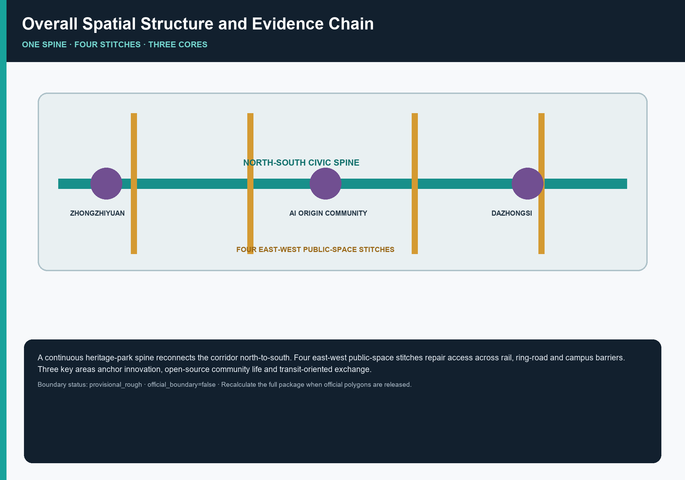
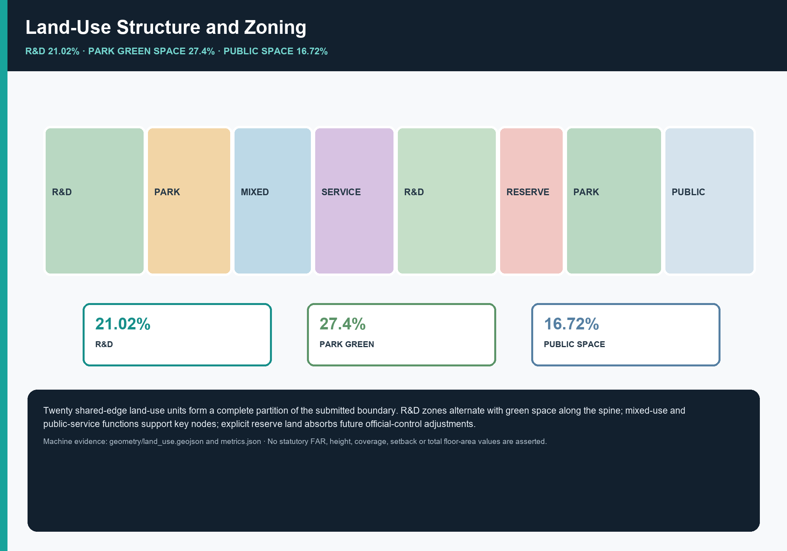
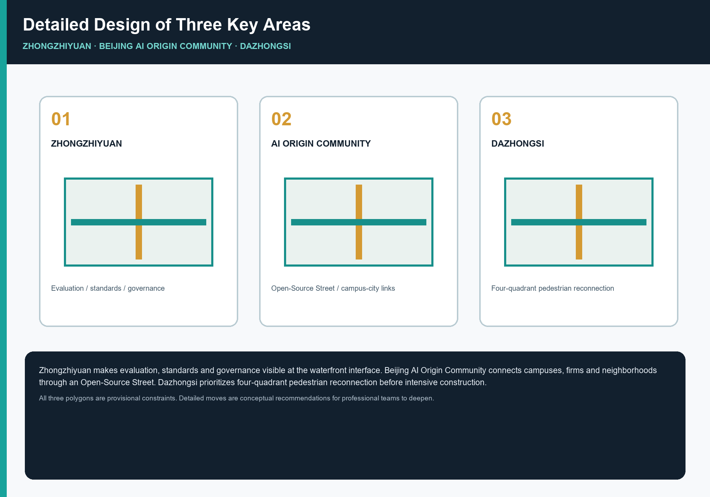
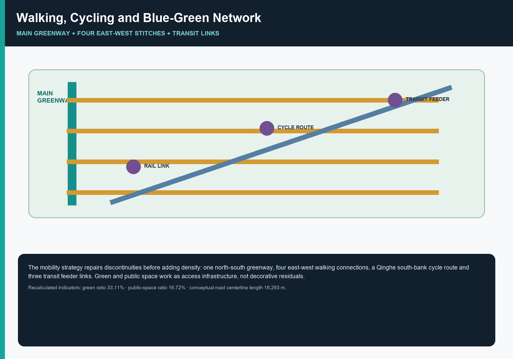
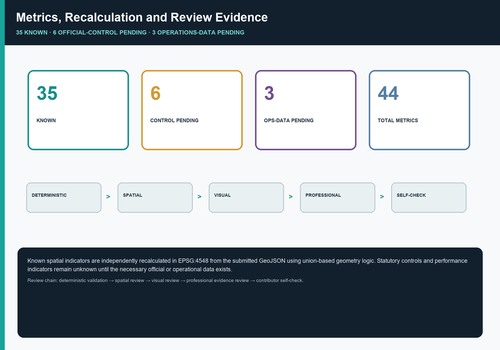

# Jing-Zhang Intelligence Pulse · Civic Loop: Reconnecting the Centennial Jing-Zhang AI Innovation Belt through Spatial Stitches and an Evidence Loop

> This plan is a **co-creation proposal** for the open source collection of intelligent agents. It is a conceptual, forward-looking, research and operational achievement. It does not replace formal planning and does not constitute the government's review conclusion. All space implementation suggestions are**Conceptual Recommendation, reference plans, which can be used for in-depth study by professional teams**.

## Design Basis and Source List

The first basis for this plan is the "Centennial Jing-Zhang AI Innovation BeltUrban Design International Project Solicitation Prequalification Announcement" [source:OFFICIAL-ANNOUNCEMENT] issued by the Haidian Branch of the Beijing Municipal Planning and Natural Resources Commission, and the "Excerpt from the Centennial Jing-Zhang AI Innovation Belt Open Call for Urban Design Mission Statement for Global Intelligence Development" [source:AGENT-TASKBOOK] that the maintainer registered as a clearing excerpt. The former determines the three-layer scope, three key areas and achievement depth requirements [standard:PROJECT-OFFICIAL-ANNOUNCEMENT], while the latter determines three major positionings, five major functions, three areas and two wings, and six required tasks [standard:PROJECT-AGENT-OPEN-CALL-TASKBOOK] from agent.1 to agent.6. The professional caliber is based on the "Urban Design Management Measures" [standard:MOHURD-URBAN-DESIGN-MEASURES], "City and Town Regulatory Detailed Planning Compilation and Approval Measures" [standard:MOHURD-CONTROL-DETAILED-PLANNING], "National Land and Space Survey, Planning, and Use Control Land and Sea Classification Guidelines" [standard:MNR-LAND-USE-CLASSIFICATION-GUIDE] and "Regulations on the Depth of Preparation of Construction Engineering Design Documents" [standard:MOHURD-ARCH-DESIGN-DEPTH-2016], the latter is used to explain that this plan belongs to the Urban Design depth rather than the construction engineering design depth.

**The data availability boundary is the most important pre-judgment of this plan.** According to the open source registration form [source:SOURCE-REGISTRY], 5 pieces of information are available for formal results, 1 piece of provisional-only information, and 0 pieces of background information. The key facts are: **The exact polygons for the official `SITE_BOUNDARY` and three `KEY_AREA` have not yet been released**. The announcement only gave the area value and boundary text description, and the warehouse derived a temporary rough replacement geometry [source:BOUNDARY-SOURCE][source:KEY-AREA-SOURCE] accordingly, labeled `boundary_precision=provisional_rough`, `official_boundary=false`, and `geometry_role=provisional_constraint`. This plan establishes three self-restraints:

1. **Provisional boundaries are used only for generation, self-checking, visualization, and design discussion.** They are not official planning boundaries, approval evidence, precise-area bases, or statutory-control conclusions. See the `usage_note` for [data:geometry/site_boundary.geojson#SITE-001] and assumption `A-BOUNDARY-PROVISIONAL`.
2. **Missing statutory control conditions will not be filled in with guessed values.** Floor Area Ratio, Building Height, Building Coverage Ratio, green space rate, setback line, and total building scale in `metrics.json` are all `status=unknown` and the reasons are stated, corresponding to the assumption `A-CONTROLS-001`. The use of estimates as certified indicators is expressly prohibited.
3. **Every `known` indicator must be independently recalculable from the submitted geometry.** Files are exchanged in EPSG:4326 and areas are calculated in EPSG:4548 [source:SITE-PACKAGE], using the same projection and union logic as `scripts/spatial_review.py`. The declared values therefore match the reviewer's reproducible calculation rather than a post-hoc estimate.

These three constraints determine the way this plan is written: the main text explains the design judgment and reasons, `geometry/*.geojson` bears the spatial evidence, `metrics.json` bears the recalculable evidence, and the three matrices bear the task and deep coverage evidence. Readers do not have to believe any text - each conclusion can be checked back to the corresponding document. The data navigation layer is [source:PROCESSED-FACT-PACK], which helps organize the three-layer scope, announcement tasks, and missing data list, but it is not a new authoritative source. All factual judgments still return to the announcement and mission statement. The corresponding relationship between current situation diagnosis and data gaps can be found in [depth:existing_conditions_diagnosis]. The position of the gap has fallen into [data:geometry/constraints.geojson#CON-PROV-BOUNDARY] and the condition elements to be filled in the three key areas.

The recalculated submitted-boundary area is [metric:site_area_sqm] 11,412,825 m², which differs by +12,825 m² (approximately 0.11%) from the announcement's textual figure of 11.4 km². This is an error-magnitude disclosure, not a precision claim: it shows how a boundary positioned from a textual description may differ from the future official planning boundary and why area-sensitive conclusions must be recalculated when official polygons become available.

## Three-Level Scope Framework

The three-layer range determined in the announcement is not three sets of parallel drawings, but three scales of the same judgment chain [depth:three_level_scope_framework]. This plan defines the work of the three layers as follows:

|Hierarchy|Announced area|The work objectives of this program|where to fall|border state|
| --- | --- | --- | --- | --- |
|Coordinated Research Area| 43.6 km² |AI industry chain and innovation collaborative judgment, future urban form research; **not included in this package**| `compliance_matrix.json`、`standard_matrix.json` |Text caliber only, no polygon|
|Overall Design Area| 11.4 km² |Urban Renewal Overall framework, land use and building scale, transportation and municipal support, style control, reaching control and planning depth Urban Design|[data:geometry/site_boundary.geojson#SITE-001], [data:geometry/land_use.geojson#LU-001], [data:geometry/roads.geojson#ROAD-001]; for the installment index, see `geometry/phasing.geojson`| `provisional_rough` |
|Key-Area Detailed Design Area| 368.4 ha |Detailed design of three areas: functions, architecture, transportation, Public Space, AI scenarios, implementation dependencies| [data:geometry/key_areas.geojson#PROV-KEY-001]、[data:geometry/buildings.geojson#BLDG-001]、[data:geometry/constraints.geojson#CON-ZHONGZ] | `provisional_rough` |

**Why does Coordinated Research Area not go offline?** The decisive content of the 43.6 square kilometers is the industrial chain coordination and factor allocation mechanism, not the spatial control line. Forcing a 43.6 square kilometer official planning boundary without an official border will only create a pseudo-accurate line that cannot be verified. Therefore, this program only outputs mechanism judgment at this layer (see the section "Coordinated Research Area Industry and Future City Research"), and sinks the spatializable part to Overall Design Area for expression. This is an intentional trade-off, not an omission.

**How the three layers are implemented step by step.** The coordinating layer determines what lets the belt compete globally in AI: an independent innovation system, an open-source ecosystem, and accessible real-world scenarios. The overall layer translates that judgment into space: research land forms bands, public space is continuous, rail connections form a network, and land-use zoning fully covers the boundary [metric:land_use_total_area_sqm]. The key-area layer tests whether the structure works in specific places: the three key areas [metric:key_area_count] have a recalculated combined area [metric:key_area_total_area_sqm] of 3,692,893 m², 8,893 m² above the announced 368.4 hectares. If a judgment cannot translate into specific building, transport, and public-space actions at this layer, it remains a slogan and must be revised.

**Specific restrictions and recalculation list of provisional boundary.** The temporary boundary is a polygon roughly positioned according to the boundary text description (North Fifth Ring Road to the north, Xueyuan Road/Xitucheng Road to the east, Xizhimenwai Street to the south, and Dazhongsi East Road/Heqing Road to the west), and is approximately 11.4 square kilometers after checking under EPSG:4548. What's rough about it is that: the turning point location is inferred based on the main road direction rather than actual measurement, and the boundary line is not equivalent to the road center line, official planning boundary or legal range line. Therefore, after the official polygon is released, the following content must be recalculated as a whole package rather than replaced as a single file: `site_boundary` → `land_use` partition (because the partition is the division of the boundary) → `green_space`, `public_space` (because the green space is derived from the land, Public Space is clipped by the boundary) → `buildings`, `roads`, `phasing` (because they are all clipped by the boundary) → `metrics.json` All area and proportion indicators → Five pictures and `visual/index.html`. Recalculation responsibilities and paths have been written into assumptions `A-BOUNDARY-PROVISIONAL` and `A-KEY-AREA-PROVISIONAL`.

## Coordinated Research Area: Industry and Future City Research

### Overall concept and naming system

The overall concept proposed in this plan is **"Jing-Zhang Intelligence Pulse · Civic Loop"** (English *Jing-Zhang Civic Loop*), which responds to the naming system and visual identification requirements of agent.1 [source:AGENT-TASKBOOK].

The three meanings of the naming correspond to the three major positionings of the announcement: **"Beijing-Zhangjiakou"** connects to the century-old Beijing-Zhangjiakou Cultural Belt, pointing to the real historical clue of railway heritage;**"Intellectual Pulse"** connects to the AI fusion innovation belt. "Pulse" is not only the north-south spatial main vein of Jingzhou-Zhangjiakou Heritage Park, but also the technical vein composed of computing power, data, and open source collaboration;**"Citizen Loop"** connects to urban AI In the life experience zone, the word "loop" carries two meanings at the same time - spatially it is a continuous loop that can be walked through and back, and technically it is a closed loop of "perception-judgment-Human Review-improvement", emphasizing that AI here serves the daily lives of citizens and always retains people's final judgment.

**This naming rejects something. ** It does not copy the names of cities, parks or companies, does not use external metaphors such as "Silicon Valley", "Brain" and "Capital", nor does it stop at the slogan level - "Loop" directly corresponds to the core spatial action of this plan (stitched everywhere to form a continuous loop), and the naming and design verify each other. If the four stitches are removed, the name will not be valid. This is the test standard for binding the naming and the scheme.

**Visual identification direction (Conceptual Recommendation). ** The logo is based on the minimalist linear structure of "one vertical and four horizontal" as the motif: a main vertical ridge represents the Beijing-Zhangzhang Zhimai, and four horizontal short lines represent the east-west sutures everywhere. The whole is read as an extendable path symbol, which can also be abstracted into the dual association of tracks and clock hands (echoing the Great Bell Temple). The color suggestions are based on the three colors of iron gray of the Beijing-Zhangjiakou Railway, grass green of the ruins park, and cold blue of the computing power. In terms of scalability, "one vertical and four horizontal lines" can be reduced to a single-color line drawing for guidance, can be loaded into a dynamic growth animation for communication, and the number of horizontal lines can be replaced according to key areas to form sub-logos.

**Boundary Note**: This direction is original Conceptual Recommendation, and has not yet carried out trademark similarity search and font authorization confirmation. See hypothesis `A-IP-CLEARANCE`; a professional team must complete the rights search before official adoption. This solution does not use any unauthorized font embeddings, corporate logos, portraits or paper images.

### Three major positioning, five major functions and three areas and two wings collaborative loop

If the three major positioning, five major functions and three areas and two wings of the mission statement are listed separately, it will easily become three unrelated lists [source:AGENT-TASKBOOK]. This plan uses a collaborative loop to connect them:

**Six links of the collaborative loop**: College and university policy sources (AI Origin Community near-campus location) → Open source collaboration and achievement release (Origin Community Open Source Release Hall) → Independent system attack and standard governance (Full-stack independent innovation in Zhongzhi Park) → Real Scenario Access test (along the main axis and three key areas) → Enterprise transformation and intelligent original business format (Dazhong Temple Industry Gathering) → Public experience and international communication (global Public Space and activity routes) → Feedback to the source.

The location of this loop in space is clear: the three districts are responsible for the three important links of the loop - **AI Origin Community** corresponds to "world-class AI Innovation Ecosystem", relying on close school resources and open source collaboration;**Zhongzhiyuan AI Independent Innovation Acceleration Area** corresponds "Full-Stack Independent AI Innovation System" and "AI governance global voice" rely on a challenging space and a visitable standard governance interface;**Dazhongsi AI Industry Cluster** corresponds to "intelligent native new business formats" and relies on a consumption and international exchange interface that integrates the station and the city. The two wings are responsible for horizontal connections -**Zhongguancun Technology Services Wing** provides global configuration of elements, IP and capital empowerment, and**Xiaoyue River Scenario Enablement Wing** provides scene implementation and life experience, corresponding to "AI-Enabled Scenario empowerment new paradigm" and "intelligent AI dynamic city". The five functions are therefore not five labels, but five irreplaceable capabilities on the circuit.

**Whether the loop can be closed depends on physical accessibility. ** This is the core judgment of this plan: if there is no connection between the three key areas, the above-mentioned loop will only exist on the PPT. The actual condition of this belt is that it was cut off - so stitching is the prerequisite for industrial collaboration, not the beautification of the environment after industry. This judgment directly determines the spatial strategy of the next section and the short-term staging arrangement.

### Global AI Innovation Ecosystem case: six types of mechanisms instead of six names

Respond to 5-8 global case requests from agent.2 [source:AGENT-TASKBOOK]. This plan is deliberately summarized into **six types of mechanisms** instead of listing six institutional names for two reasons: First, the available information only contains publicly available public information, and fabricating enterprise lists, investment amounts, or output values ​​is expressly prohibited [standard:PROJECT-AGENT-OPEN-CALL-TASKBOOK]; second, only mechanisms can be translated into spaces, not names. Corresponding hypothesis `A-ECOSYSTEM-CASES-PUBLIC`.

|ecological type|Mechanisms that can be learned from|Space requirement characteristics|Spatial translation of this plan|
| --- | --- | --- | --- |
|Open source community driven|Gather talents with open collaboration and contributor reputation, and the contribution record itself becomes an asset|Posting venue, collaboration space, available at night|Origin Community Open Source Release Hall + Contributor Honor Wall|
|University-derived transformational type|Form an achievement transformation chain close to universities to shorten the distance from papers to products|Close combination of incubation, legal affairs, intellectual property, investment and financing|Near school achievement transformation street|
|test verification driven|Real Scenario Access test in exchange for technology iteration speed|A verification section that can be supervised, visited and reserved|Security governance sandbox + low-speed delivery verification section|
|Station-city integrated consumption type|Using rail hubs to carry smart native consumption and international exchanges|High-quality pedestrian connectivity, accessible from all corners|Dazhong Temple Station four-quadrant stitching|
|Factor circulation service type|Taking the compliant circulation of data, computing power, and capital elements as its core competitiveness|Service-oriented reception room, emphasizing auditability|Data element reception room + terminal-side computing power station|
|Public experience communication type|Create urban identity with walkable public experience routes|Continuous Public Space, the route can be told|Global AI event week route|

**Choose when translating.** Among the six types of mechanisms (the number of cases [metric:ecosystem_case_count] is 6, falling within the 5-8 range required by the mission statement), the first three types are the ones that this plan determines are the most suitable for establishing this belt - because Haidian’s university density and scientific research land use are existing advantages. The proportion of scientific research land [metric:land_use_r_and_d_ratio] reaches 21.02%, which is the second largest category in the land use structure. The latter three categories require more external conditions (orbital site information, data transaction systems, activity operating entities), so they are placed in the medium and long term in terms of installments. This sorting is not a value judgment, but a sorting of **dependence conditions**: those with fewer dependencies are done first. This is the unified principle of the phased logic of this plan.

### Future urban form: What will AI change?

If research on future urban form generally describes technical visions, it cannot focus on land use and indicators. This plan narrows the problem into an answerable question: **What AI changes on this belt is first of all "what needs to be carried by Public Space".**

Three specific judgments: First, **the location of R&D work has been moved overseas**. Model training takes place in a remote computer room, but debugging, evaluation, demonstration, and debate require face-to-face contact. Therefore, Public Space must be able to host informal technical exchanges, not just rest. This supports the setting up of the Innovation Exchange Square and the Open Source Release Square. Second,**testing requires a real environment**. Autonomous driving, low-speed delivery, and embodied intelligence cannot be verified only in the laboratory. City streets themselves have become factors of production. Therefore, Public Space must be "borrowed" as a supervised verification section - this supports the low-speed delivery verification section and the security governance sandbox. Third, government governance needs to be visible. The right to speak in AI governance does not come from the number of documents, but from whether invisible work such as evaluation, standards, and red team testing can be turned into a city interface that can be visited and questioned—this supports the Public Intelligence Park Governance Exhibition Plaza.

These three judgments jointly explain why this plan sets the Public Space ratio to [metric:public_space_ratio] 16.72% and the green space ratio [metric:green_ratio] 33.11%: not for the sake of good-looking indicators, but because the above three types of activities all require Public Space to carry, and they all require continuous rather than fragmented Public Space. [depth:overall_spatial_structure][standard:MOHURD-URBAN-DESIGN-MEASURES]. At the same time, the specific implementation points of AI+ transportation, continuous green space system and international living and working atmosphere can be found in the two sections of "Transportation, Rail, Municipal and Public Service Facilities" and "Blue-Green Space, Public Space and Urban Character" respectively. All content involving activities, investment promotion, funds and policies are Conceptual Recommendation or deepening directions and do not constitute confirmed government arrangements.

## Overall Design Area: Urban Renewal and Regulatory-Plan-Level Urban Design

### Core judgment: The problem with this belt is not the lack of green space, but that the green space is chopped up

Overall Design Area should reach the Urban Design depth of Regulatory Detailed Planning [standard:MOHURD-CONTROL-DETAILED-PLANNING][depth:land_use_layout]. The starting point of this plan is a diagnosis rather than a vision: there is no shortage of open spaces along the **Jingzhang Heritage Park, but what is lacking is the ability to connect these spaces.**

The North Fifth Ring Road, the Jing-Zhang railway corridor, institutional walls, and several large intersections sever both north-south continuity and east-west access. The result is a systematic gap between "having green space" and "being able to reach it": the recalculated green ratio is [metric:green_ratio] 33.11%, while park green space reaches [metric:land_use_area_1401_sqm] 3,131,783 m², the largest land-use category at 27.4%. Yet those spaces remain fragmented and do not form a continuous walkable experience.

**This diagnosis determines the investment sequence.** If the business types and buildings along the line are updated first, the stitching operation will be continuously delayed due to the reconstruction of intersections, space under the bridge, and review of traffic organization, eventually leading to the result of "every section is good, but the whole is unworkable." Therefore, this plan puts the first investment into stitching: first, let the main spine really work, and then talk about the functions and business formats along the line. ** This is not a compromise of easier first and then harder, but because suturing is the prerequisite for everything else - the open source community needs to move across campus, the test scene needs continuous road sections, and the public experience route needs to be completed in one go.

### Overall Spatial Structure: One Spine, Four Stitches, and Three Cores

**One ridge.** A continuous north-south Public Space belt [data:geometry/public_space.geojson#PUBLIC-001] is formed along the Jingzhang Heritage Park, and a slow-moving main ridge greenway [data:geometry/roads.geojson#ROAD-001] is superimposed. This ridgeline does not add a new official planning boundary, but clarifies the existing spatial sequence of the heritage park into a design main axis, turning the three key areas from "three isolated islands" into "three anchor points on a line."

**Four seams.** Set east-west stitching Public Space [metric:public_space_stitch_count] at the four most critical breakpoints:

| # |suture node|Why sew here?|Dependencies|
| --- | --- | --- | --- |
| 1 |Public Intelligence Park Management Exhibition and Innovation Exchange Square [data:geometry/public_space.geojson#PUBLIC-004]|Connecting the interior of the park with the waterfront interface on the south bank of Qinghe River, giving the critical park an external public aspect|Qinghe Blue Line, Ecology and Flood Control Conditions|
| 2 |AI origin community open source release square [data:geometry/public_space.geojson#PUBLIC-003]|Sealing the three sides of campus, park and community, open source collaboration relies on cross-border movement|Campus ownership boundary, Public Space license|
| 3 |Wudaokou passenger hall and school town suture node [data:geometry/public_space.geojson#PUBLIC-005]|Transform the transfer hall from a pass-through space into a public foyer between campuses|Site information, intersection traffic organization|
| 4 |Dazhongsi Station Four-Quadrant Pedestrian Stitching Square [data:geometry/public_space.geojson#PUBLIC-002]|Using the four-quadrant walk to connect the four corners that were cut off by the large intersection, the premise of integrating the station and the city|Official maps of rail stations and municipal pipelines|

The selection criteria for stitching points in all four places are unified: **located at the junction of the key area and the outside, and there is currently a clear physical barrier**. It is not spread evenly, nor is it distributed according to administrative boundaries.

**Tri-core. ** Each of the three key areas assumes an irreplaceable link in the collaborative loop. Please see the section "Detailed Design of Key Areas" for details.

### How does the land use structure support this set of judgments?

The land use zoning is a complete division of the submitted boundary: 20 units, seamless without overlap, with an area gap [metric:land_use_coverage_gap_sqm] of 0.0 m² (coordinate rounding magnitude) from the boundary, much smaller than the topological tolerance [depth:land_use_layout][standard:MNR-LAND-USE-CLASSIFICATION-GUIDE] of `spatial_review`. There are three structural judgments:

**Scientific research land is formed into strips along both sides of the main ridge**, with an area of ​​[metric:land_use_area_0802_sqm] 2,399,243 m², accounting for 21.0%. It is the main space for AI R&D and testing verification. The purpose of forming strips instead of blocks is to keep the R&D functions close to the main spine - informal communication among R&D staff happens on the road, not in the conference room.

**Park green space is responsible for the north-south connection**, accounting for 27.4%, which is the largest category. This is not "blank space to increase the green space rate", but because the main spine itself depends on the green space.

**Commercial service industry land is concentrated in two urban interfaces**, with an area of ​​​​[metric:land_use_area_05_sqm] 1,816,675 m², accounting for 15.9%. It is concentrated in the Dazhong Temple and the North Third Ring Road - these two places are the places where this belt has the greatest contact with other parts of the city. They are suitable for carrying external exchanges and consumption, but not suitable for research and development sections that require quietness.

**Blank land 88,434 m²** [metric:land_use_area_16_sqm] is intentionally retained at [data:geometry/land_use.geojson#LU-016] on the south side of Zhongzhi Park to reserve flexibility for adjustments after official boundaries and control conditions are announced. This is a spatial response to data gaps: rather than filling every inch and then being forced to overthrow it, explicitly leave an adjustable margin.

### Building Scale and Development Intensity: Why Statutory Values Are Not Invented

This plan **does not provide** numerical conclusions on Floor Area Ratio, Building Height, Building Coverage Ratio, green space rate, setbacks and total building scale. This is not an omission, but a basis: these are statutory control conditions and are not included in the cleared rights package [source:SOURCE-REGISTRY], corresponding to the assumption `A-CONTROLS-001`. Floor Area Ratio, height and Building Coverage Ratio indicators remain unknown [metric:floor_area_ratio] [metric:building_height_m] [metric:regulatory_building_density]; the green space rate control value, setback line and total building scale also only record the caliber and preconditions [metric:green_ratio_control] [metric:setback_m] [metric:total_floor_area_sqm].

What this plan provides is the **method and list to be calibrated** [depth:development_intensity_controls][depth:height_massing_character]: Intensity distribution should follow the principle of "those close to the main ridge and rail stations should be higher, and those close to heritage elements and residential areas should be lower." Volume and interface control should ensure the openness of the sky on the main ridge and the historical atmosphere of the heritage park. These are judgments that can be deepened by professional teams, not control values.

Demonstration group building base [metric:building_footprint_area_sqm] 124,996 m², coverage [metric:building_density] 1.10% only reflects the caliber of the seven demonstration groups, **not the control regulation Building Coverage Ratio index**, see hypothesis `A-BUILDING-ILLUSTRATIVE`.

## Detailed Design of Key Areas

The polygons in the three key areas are all temporary rough rectangles [source:KEY-AREA-SOURCE], so the following conclusions can only be used as **directional design suggestions** [depth:three_key_area_detailed_design]. Rectangular boundaries shall not be interpreted as lot or road property lines.

### Zhongzhiyuan AI Independent Innovation Acceleration Area

**Positioning**: A garden-type full-stack independent innovation block. The calculated area [metric:key_area_zhongzhiyuan_ai_acceleration_area_sqm] is 1,929,202 m², and the announced area is 192.1 hectares, a difference of +8,202 m² [data:geometry/key_areas.geojson#PROV-KEY-001].

**Role in the collaborative loop**: Responsible for the two functions of "Full-Stack Independent AI Innovation System" and "Global Voice in AI Governance". These two functions have a common spatial meaning - they need to be seen. The persuasiveness of full-stack independent innovation comes from the demonstrable technology chain, and the persuasiveness of governance voice comes from the evaluation and standard-setting process that can be visited and questioned. A closed attack zone cannot establish a voice.

**Spatial Actions**: First, strengthen the waterfront interface on the south bank of Qinghe River, and use the waterfront green space [data:geometry/green_space.geojson#GREEN-005] as the public living room of the park instead of the back; second, set up an east-west innovation exchange street [data:geometry/roads.geojson#ROAD-005] and a governance display square [data:geometry/public_space.geojson#PUBLIC-004] to connect the interior of the park and the waterfront; third, retain blank land at the south entrance to leave margin for adjustments after the official boundary is announced.

**Building update**: Focus on transformation [data:geometry/buildings.geojson#BLDG-001] (full-stack independent innovation research and development group, `retain_renovate`), and cooperate with the concept of the newly built open testing and standard governance experimental group [data:geometry/buildings.geojson#BLDG-002] (`new_build_concept`). The reason for focusing on renovation is that the park already has a building foundation, and the implementation of renovation relies much less than on new construction.

**AI Scenario**: Security Governance Sandbox (SC-02), Device-side Computing Power Station (SC-03), Qinghe Low-Carbon Innovation Gallery (SC-06).

**To be confirmed and implemented risks**: control intensity conditions, Qinghe blue line and flood control requirements, track station [data:geometry/constraints.geojson#CON-ZHONGZ]. Any spatial action on the waterfront interface must be assessed by water and ecological professionals; this plan does not provide river channel, flood control or engineering conclusions.

### Beijing AI Origin Community

**Positioning**: Close-to-school achievement transformation and talent community. The calculated area [metric:key_area_beijing_ai_origin_community_sqm] is 1,043,237 m², and the announced area is 104.3 hectares, with a difference of +237 m² (the smallest deviation among the three locations) [data:geometry/key_areas.geojson#PROV-KEY-002].

**Role in the collaborative loop**: Responsible for "World Class AI Innovation Ecosystem". The key to this feature is not the size of the campus, but the distance from paper to product, and whether the open source community can gather in a physical space. The unique condition of the Origin Community is its close-to-school location, so its design task is to turn "near" into "connected" - geographically close but cut off by a wall, which means not close.

**Space Action**: First, Kaiyuan Street runs from east to west [data:geometry/roads.geojson#ROAD-004], stitching the three sides of the campus, park and community; second, Kaiyuan Release Plaza [data:geometry/public_space.geojson#PUBLIC-003] serves as a carrier for achievement release and contributors’ honor wall; third, the stock is transformed into an incubation group [data:geometry/buildings.geojson#BLDG-003] to supplement talent residence and community services [data:geometry/buildings.geojson#BLDG-004]; fourth, community service facilities land [metric:land_use_area_0702_sqm] 521,865 m² Embedded layout supporting talent services.

**AI scenario**: Open source release hall (SC-01), nearby school achievement transformation street (SC-07), low-speed robot delivery verification section (SC-11). The reason for choosing to set up the delivery verification section here is that it has both the mixed traffic environment of the campus (high real test value) and relatively controllable road section management conditions.

**To be confirmed and implemented risks**: Campus ownership boundaries, current building census, Demolish-Renovate-Retain Strategy basis [data:geometry/constraints.geojson#CON-BEIJIN].

**This plan does not provide any Demolish-Renovate-Retain Strategy conclusions for specific plots** - The `renewal_action` field is the conceptual direction, see hypothesis `A-BUILDING-ILLUSTRATIVE`. Proposals involving university land must be approved by the property owner.

### Dazhongsi AI Industry Cluster

**Positioning**: Urban smart economy and international exchange district. The calculated area [metric:key_area_dazhongsi_ai_industry_cluster_sqm] is 720,454 m², and the announced area is 72.0 hectares, a difference of +454 m² [data:geometry/key_areas.geojson#PROV-KEY-003].

**Role in the Collaborative Loop**: Responsible for the "intelligent native new business format" and the export of the Loop from technology to market and international. This role is highly dependent on the quality of pedestrian connectivity at the rail hub –**if the four quadrants are impassable, station-city integration is just a slogan**.

**Space actions**: First, the four-quadrant walking stitching of Dazhongsi Station [data:geometry/public_space.geojson#PUBLIC-002][data:geometry/roads.geojson#ROAD-002], which is the first priority action of this plan here; second, the activated commercial mixed group [data:geometry/buildings.geojson#BLDG-005] on the first floor, which takes the first floor interface rather than the renovation of the entire building as the entry point, with minimal implementation dependence; third, the concept of newly built integrated connection facilities [data:geometry/buildings.geojson#BLDG-006]; Fourth, the southern end forms an interface for international exchanges, and land for commercial and service industries is concentrated here.

**AI Scenario**: International Roadshow Living Room (SC-05), Data Elements Living Room (SC-08), Public Safety Operation Review Platform (SC-12).

**To be confirmed and implemented risks**: Official maps of rail stations, intersection traffic organization, municipal pipelines [data:geometry/constraints.geojson#CON-DAZHON].

**The specific form of the four-quadrant connection (ground, underground or three-dimensional) is not concluded in this plan** - this involves the feasibility of bridges, tunnels and underground space projects, which must be demonstrated by the transportation and engineering professional team. This plan only proposes the goal of "the four corners should be accessible on foot" and its spatial necessity.

## AI Innovation Ecosystem, Personas, and AI+ Scenarios

### Six User Personas

Respond to agent.3’s request for no less than 5 types of portraits [source:AGENT-TASKBOOK]. Each type of portrait states the boundaries of self-examination - **Portraits are used to understand space requirements, not for individual identification or business recommendations**.

|portrait|Typical requirements|spatial response|self-check boundary|
| --- | --- | --- | --- |
|open source developer|Release, collaboration, testing, community reputation|Open source release room, public code wall, night collaboration space|No personal behavior traces are collected; activity data is only aggregated statistics|
|Start-up team|Low-cost office, computing power portal, product testing ground|Shared test field, terminal-side computing power station, standard governance consulting|Computing power and data services must be separately authorized|
|Head corporate visitors|Exhibition, business, international reception, talent recruitment|International roadshow living room, rail connection, enterprise surroundings Public Space|Corporate logos and cases must be cleared|
|Surrounding residents|Commuting, leisure, community services, low-disturbance updates|Spindle slow travel loop, community embedded services, lighting and activity grading|Do not use resident portraits for commercial recommendations|
|College teachers and students|Achievements transformation, cross-school collaboration, daily slow travel|Campus-park slow stitching, transformation station, AI education experience point|Campus data and scientific research results must be authorized|
|city ​​operator|Public Space Maintenance, event safety, facility inspection|Run review platform, inspection path, Scenario Access daily schedule|Aggregate data + Human Review before taking action|

The number of images [metric:persona_count] is category 6. **"Surrounding residents" and "city operators" are two categories that were intentionally added**: the former reminds that this belt is first and foremost a living space for residents rather than an industrial exhibition stand, and the latter reminds that any AI scene needs someone to be responsible for operation, maintenance and review, otherwise the scene is just a demonstration.

### Twelve AI Scenario Cards

The number of scene cards is 12 [metric:scenario_card_count], including 4 industrial Testing and Validation Scenario [metric:industry_test_scenario_count] (marked ▲), which meets the requirements of the task book of no less than 10 cards and no less than 3 test scenarios. Each card states the space carrier, service object, data and privacy boundary, Human Review and operating entity.

|serial number|scene card|space carrier|Service objects|Run content|Data and privacy boundaries|Operating entity|
| --- | --- | --- | --- | --- | --- | --- |
| SC-01 |Open source press room|AI origin community|Developer/University Team|Achievements release, code contribution display, small road show|Public display data; no personal tracks collected|Operator + open source community|
| SC-02 ▲ |Security Governance Sandbox|Zhongzhiyuan|Evaluation agency / supervision / enterprise|Make standard setting, security evaluation, and red team testing accessible|Test data remains with the institution; results are aggregated and made public|standards and governance bodies|
| SC-03 ▲ |End-to-end computing power station|Nodes along the main axis|Start-up team/researchers|Small-scale inference computing power and development tools are available nearby|Computing power and data services require separate authorization|New Infrastructure operator|
| SC-04 |AI slow navigation|Beijing-Zhangzhang Zhimai Main Axis|Residents/Commuters/Accessible People|Identify breakpoints, congestion, and accessibility needs with interpretable navigation|Low intrusive sensing; no identification|Public Space Management Party|
| SC-05 |International Roadshow Living Room|Dazhong Temple|Business/Investment/International Visitors|Exhibition, negotiation, media release and international exchange|Corporate logos and cases must be cleared|Industrial service platform|
| SC-06 |Qinghe Low Carbon Innovation Gallery|Zhongzhi Garden Linqing River|Residents/Park Employees|Green space, rainwater and low-carbon display complex|Public aggregation of environmental monitoring data|Park + Water Collaboration|
| SC-07 |Near school achievement transformation street|AI origin community|College teachers and students/transformation team|Incubation, legal affairs, intellectual property and investment and financing services|Scientific research results data require authorization|Universities + Transformation Agencies|
| SC-08 |Data elements parlor|Dazhong Temple|Data supply and demand sides|Demonstrate the circulation of elements based on compliance, authorization, and auditability|The entire authorization chain is auditable; no original data is displayed|Data Transactions and Regulators|
| SC-09 |AI life service model street|The intersection of community and business|Surrounding residents/families|Implementation of AI+ in medical, education, legal and life services|Service data localization; retain manual windows|Street + service organization|
| SC-10 |Global AI event week route|One belt Public Space system|Public/International Visitors|A walkable experience route from heritage culture to international roadshows|Moving images require authorization; minors must provide separate consent|Event operator|
| SC-11 ▲ |Low-speed robot delivery verification section|Yuandian Community to Wudaokou|Delivery company/resident|Open verification of low-speed delivery in mixed traffic environment|Roadside data aggregation; manual takeover can intervene at any time|Enterprise + Traffic Management Collaboration|
| SC-12 ▲ |Public safety operations review desk|Around Dazhongsi Station|Operations/Emergency/Street|Review event safety and evacuation organization based on aggregated passenger flow|Only aggregate data is used; action can only be taken after Human Review|Operations + Emergency Management|

**The starting point of scene-space-operation mapping.** Public Space scene refers to [data:geometry/public_space.geojson#PUBLIC-001], slow travel and traffic scene refers to [data:geometry/roads.geojson#ROAD-001], open space scene refers to [data:geometry/green_space.geojson#GREEN-001], and corresponds to [metric:public_space_ratio] and [metric:green_ratio]. These references allow reviewers to check that the scene is not a literal slogan, but a design object located in a concrete layer.

**Scenario types that are rejected by this program.** According to the prohibitive requirements of the mission statement [standard:PROJECT-AGENT-OPEN-CALL-TASKBOOK], the following shall not be written: scenarios that require facial recognition or identity tracking; scenarios that cannot be automated decision-making; scenarios that rely on non-public data or personal privacy data; scenarios that describe immature technologies as ready for full deployment; scenarios that specify specific suppliers as necessary conditions. **Each of the twelve cards retains the Human Review link** - SC-11's "manual takeover can intervene at any time" and SC-12's "can only take action after Human Review" are hard constraints, not modifiers. All test scenarios are**recommendations to be open for verification** and must not be stated as approved for operation.

## Land Use, Building Scale, and Retain-Renovate-Demolish Strategy

### Three judgments on Land-Use Layout

The land use plan is prepared in accordance with the project subset [standard:MNR-LAND-USE-CLASSIFICATION-GUIDE][depth:land_use_layout] of the "Guidelines for Land and Sea Classification of Land and Space Survey, Planning and Use Control", forming a complete, closed and seamless division of the submitted boundary [data:geometry/land_use.geojson#LU-001]. The 20 land units are generated from the same set of shared cut lines, and adjacent polygons share boundary coordinates, so there are no gaps or overlaps - the area gap [metric:land_use_coverage_gap_sqm] is 0.0 m².

**Judgment 1: Functions are zoned along the main spine rather than divided into patches.** Scientific research land [metric:land_use_area_0802_sqm] 2,399,243 m² (21.0%) and park green space 3,131,783 m² (27.4%) appear alternately on both sides of the main ridge, forming a rhythm of "R&D-green space-R&D". The reason for this is: the daily activity radius of the R&D function is very short. If the scientific research land is concentrated into one large area, the green space can only be arranged on the edge, and the users along the main spine will be lost. The zoning layout allows each section of R&D space to be directly adjacent to Public Space.

**Judgment 2: Residence and supporting facilities should not be squeezed out by industry.** Residential land [metric:land_use_area_07_sqm] 1,000,968 m² (8.8%) plus community service facility land [metric:land_use_area_0702_sqm] 521,865 m² (4.6%) totaling 13.4%, concentrated in the middle section of the Heritage Park and the east side of the Origin Community. This belt is first and foremost a living space for residents. The residence of talents and community services are not accessories of the industry. If there is only an R&D park but no life here, the goal of "a high-quality urban area that global AI innovative talents aspire to" cannot be established.

**Judgment 3: Explicitly leave blank spaces to deal with data gaps.** The vacant land [metric:land_use_area_16_sqm] 88,434 m² (0.8%) is located on the south side of Zhongzhi Park. The proportion of blank space is not high, but its role is institutional: after the official boundaries and control conditions are announced, adjustments can be prioritized on the blank land without having to overturn the entire zoning. The square land [metric:land_use_area_1403_sqm] 647,093 m² (5.7%) is concentrated at Wudaokou, and serves as the transfer hall between the station city and the school city. The reason why the square is listed separately and not merged into the park green space is because it is responsible for distribution and stay, and the paving and facility requirements are different from those of the green space. The supporting educational land [metric:land_use_area_0804_sqm] 496,648 m², sports land [metric:land_use_area_0805_sqm] 651,681 m², medical and health land [metric:land_use_area_0806_sqm] 569,419 m² and road land [metric:land_use_area_1207_sqm] 89,081 m² jointly support the balanced layout of public services.

### Building scale: what can and cannot be said

**The part that cannot be said.** This plan does not provide the total scale of the building, the values of Floor Area Ratio and Building Height [metric:total_floor_area_sqm] [metric:floor_area_ratio] [metric:building_height_m], nor does it provide the legal control values of Building Coverage Ratio, green space rate and setback line [metric:regulatory_building_density] [metric:green_ratio_control] [metric:setback_m]. The reason is twofold: first, the statutory control conditions have not been released (assuming `A-CONTROLS-001`), and second, the current building census, ownership and engineering conditions are not available. Giving the total scale of the building without these two items is tantamount to packaging speculation into a conclusion.

**The part that can be said.** This plan provides the base and update methods of seven demonstration groups [data:geometry/buildings.geojson#BLDG-001], totaling [metric:building_footprint_area_sqm] 124,996 m², and coverage [metric:building_density] 1.10%. This number only reflects the caliber of the demonstration group, and its function is to **explain the magnitude and distribution of the update method**, not the total planned building base (assuming `A-BUILDING-ILLUSTRATIVE`).

### Methods of retaining, transforming, and building new ones rather than conclusions

What this plan proposes is the **classification method and priority** [depth:retain_renovate_demolish], rather than the Demolish-Renovate-Retain Strategy conclusion of any specific land parcel:

|category|Judgment basis|Demonstration points of this plan|implementation dependencies|
| --- | --- | --- | --- |
|status quo retained|The construction quality and functionality are still adequate and no updates are necessary.|Wudaokou current scientific research office group [data:geometry/buildings.geojson#BLDG-008]|least|
|Retain renovation|The structure is usable but the function or interface is not suitable. Mainly interior and first floor renovations.|Zhongzhiyuan R&D Group, Origin Community Incubation Group, and Dazhong Temple Commercial Mixed Group First Floor Activation|Medium: requires the consent of the property owner|
|New concept|New functions that cannot be carried by existing space (testing experiments, connection facilities, talent residence)|Zhongzhiyuan Standard Management Experimental Group, Dazhong Temple Connection Facilities, Origin Community Talent Residence|Most: need to control regulations, ownership, and engineering conditions|
|tear down|**This plan does not make any demolition suggestions**| — | — |**Why not mention demolition. ** Demolition judgment requires a survey of current buildings, structural safety assessment, ownership confirmation, and a survey of residents’ wishes. None of these four items are available. Proposing demolition under these conditions is irresponsible and violates the prohibitive requirements of the "Plot Specific Plan [standard:PROJECT-AGENT-OPEN-CALL-TASKBOOK]" in the brief.

**Uniform principle of priority**: The fewer dependent conditions, the first to do it. This explains why this plan chooses "first-floor activation" in the Dazhong Temple rather than the renovation of the entire building - the renovation of the first-floor interface does not involve changes in the property rights structure, and the effect can be verified in the near future. If successful, it can be extended upwards. All `renewal_action` fields are conceptual directions and must be agreed and professionally evaluated by the property rights parties before entering into implementation discussions.

## Transport, Rail, Municipal Infrastructure, and Public Services

### Walking and Cycling Network: Repair First, Then Add Density

The core of the transportation strategy is consistent with the overall judgment: **There is no lack of roads here, but there is a lack of viable roads** [depth:traffic_rail_slow_parking]. The total length of the slow travel and connection concept lines is [metric:road_centerline_length_m] 16,293 m, which is composed of three categories: **A slow-moving main spine** [data:geometry/roads.geojson#ROAD-001] (greenway) runs from north to south along the main axis and is the backbone of the entire circuit.

**Four east-west suture passages**: Dazhongsi Station four-quadrant pedestrian connection [data:geometry/roads.geojson#ROAD-002], Wudaokou Campus Town slow-traffic suture [data:geometry/roads.geojson#ROAD-003], Yuandian Community Kaiyuan Street [data:geometry/roads.geojson#ROAD-004], Zhongzhi Park Innovation Exchange Street [data:geometry/roads.geojson#ROAD-005], plus a waterfront cycling path on the south bank of Qinghe River [data:geometry/roads.geojson#ROAD-006].

**Three tracks connect the branch line** [data:geometry/roads.geojson#ROAD-007], connecting three key areas to the main ridge and stations.

**All line locations are Conceptual Recommendation. **Does not constitute a conclusion on the feasibility of road official planning boundarys, alignments, bridges and tunnels, underground spaces or projects; track locations must be based on official track data (assumed `A-ROAD-CONCEPT`). The slow-travel connectivity index [metric:slow_mobility_connectivity_index] is `status=unknown` in `metrics.json` - calculating it requires official road, under-bridge space and breakpoint census data. This plan only provides the definition of the exit diameter and does not use estimated values.

### Transit-Station Integration: The goal is clear, the form does not make a conclusion

Dazhongsi Station and Wudaokou are the two most critical integration nodes. The goal put forward by this plan is "all four corners of the station should be accessible on foot", and explains its necessity: the value of the station-city integration is fully reflected in whether transfer passengers can easily access the surrounding blocks. If the four corners are cut off by intersections, the station will be just a passing facility.

**However, the specific form of connection (ground crossing, underground passage or three-dimensional corridor) is not concluded in this plan.** This involves bridge and tunnel engineering, underground space feasibility, municipal pipeline avoidance and traffic organization demonstrations, and must be completed by a professional team of traffic and engineering. The contribution of this solution is to clearly define the problem and locate it at the spatial location [data:geometry/public_space.geojson#PUBLIC-002], rather than making engineering judgments for a professional team.

### Road microcirculation, parking and non-motorized vehicles

For road microcirculation, it is recommended to focus on the density of branch roads and access roads to the plot to avoid adding new through-passing arterial roads that damage the continuity of the main spine. Non-motor vehicle parking should be set up in a centralized manner in conjunction with four suture nodes and track connection points to avoid occupying the main slow-moving ridge section. It is recommended to prioritize the sharing and staggered use of existing facilities for parking supply, and place new supply at the periphery of key areas. **These are all strategic directions**: There are no official control conditions for road official planning boundarys, sections, parking construction standards and facility standards. The relevant contents are all matters to be confirmed and cannot be regarded as approval indicators.

### Municipal and New Infrastructure

The spatial placement point of New Infrastructure is the end-side computing power station (SC-03), which is arranged along the main spine [depth:municipal_new_infrastructure] based on public service facilities and low-carbon energy strategies. Distributed energy and low-carbon strategies are expressed in the Linqing River section of Zhongzhi Park combined with waterfront green space (SC-06). The integration of traditional municipal facilities and New Infrastructure is recommended to be in the direction of "sharing sites, sharing pipe corridors, and common operation and maintenance".

**All municipal professional conditions are missing**: There is no official data on pipelines, energy loads, drainage, flood control, and fire protection capacity. This plan does not provide any capacity calculations or engineering conclusions. The relevant content is listed as a prerequisite for formal deepening [data:geometry/constraints.geojson#CON-PROV-BOUNDARY]. This is a hard boundary – municipal capacity estimates are a matter of professional engineering judgment and are outside the scope of the deliverables of this scheme.

### public service facilities

Public services are arranged based on the principle of "embedded, small-scale, and close to the main spine": talent life services are embedded in the community service facility land of the origin community, education and scientific research facilities are combined with the university collaboration area, medical and health are combined with the medical and health land in the northern section of the Zhongzhi Park, and sports are combined with the sports land and waterfront green space of the Zhongzhi Park. The innovation service platform (legal affairs, intellectual property, investment and financing) is concentrated in the nearby school achievement transformation street (SC-07). The reason is that the frequency of use of such services is directly related to the university's achievement output, and it is more effective to be close to the campus than to set it up in a centralized location.

## Blue-Green Network, Public Space, and Urban Character

### Blue-green network: a continuous system with the main spine as the skeleton

Blue-Green Space uses the vitality belt of Jingzhang Heritage Park as the skeleton [depth:blue_green_public_space][standard:MOHURD-URBAN-DESIGN-MEASURES]. The green map layer [data:geometry/green_space.geojson#GREEN-001] is directly derived from the park green space and square land in the land zoning, ensuring that it is consistent with the land use caliber and does not repeat measurement. This is a deliberate method choice: if the green map layer is drawn independently, there will be a caliber contradiction of "green space area does not match the land zoning", which the reviewer cannot check.

The area of green space and open space is [metric:green_space_area_sqm] 3,778,877 m², and the green-space ratio is [metric:green_ratio] 33.11%; the public-space area is [metric:public_space_area_sqm] 1,907,805 m², and the public-space ratio is [metric:public_space_ratio] 16.72%.

**Design implications of these two ratios.** The proportion of green space supports the quality of life of talents and the continuity of vitality zones - the goal of "a high-quality urban area that global AI innovative talents aspire to" is ultimately determined by the quality of daily accessible green space, not by the image of the park. The ratio of Public Space supports the density of innovation exchanges and the accessibility of citizen loops - as demonstrated above, three types of activities, including R&D exchanges, scenario testing, and governance demonstrations, all need to be carried by Public Space. The two ratios are not set to meet the standards, but are derived from functional requirements.

The waterfront spaces of Qinghe River and Xiaoyue River are two important interfaces of the blue-green network. The Linqing River Section of Zhongzhi Park proposes to use low-carbon innovative waterfront green space to carry the public living room function of the park [data:geometry/green_space.geojson#GREEN-005]. **Any judgment involving the river blue line, ecological management and control, and flood prevention must be assessed by water and ecological professionals**. This plan does not provide conclusions on river courses or flood control.

### More than three AI pilgrimage landmarks and honor display system

No less than 3 pilgrimage landmarks requested in response to agent.4 [source:AGENT-TASKBOOK]. The number of landmarks [metric:pilgrimage_landmark_count] is 4:

|landmark/node|design intent|space carrier|
| --- | --- | --- |
|Zhongzhiyuan Governance Exhibition and Innovation Exchange Square|Turn invisible work such as standard setting and safety evaluation into a visitable urban interface - this is the spatial basis for governance discourse.| [data:geometry/public_space.geojson#PUBLIC-004] |
|AI origin community open source release square|Use the contributor honor wall to record open source contributions, so that the "contributions can be remembered" in the co-creation convention fall into the physical space| [data:geometry/public_space.geojson#PUBLIC-003] |
|Dazhongji Station Four-Quadrant Pedestrian Stitch Square|Form an arrival impression of smart native consumption and international exchanges at the four corners of the orbital station| [data:geometry/public_space.geojson#PUBLIC-002] |
|Cultural display node in the middle section of the heritage park|The starting point for pilgrimage where the heritage narrative of the Beijing-Zhangjiakou Railway overlaps with the new AI culture| [data:geometry/public_space.geojson#PUBLIC-001] |

**The design logic of the honor display system.** The most core of the four landmarks is the contributor honor wall: it turns "who built this belt" into sustainable recorded public information, including both human contributors and intelligent agent contributors. This directly responds to the Co-Creation Convention's "contributions can be remembered" principle. The form of the wall of honor is recommended to be an incrementally updateable physical carrier with an offline searchable public index, rather than a one-time nameplate.

**Public Space component library direction**: Based on the principle of "incremental, movable, and recyclable", it includes standardized display units, reservable temporary test enclosures, modular seats and sunshades, and updateable guide signs. The purpose of this component library is to allow near-term pilots to be implemented with light investment without having to wait for permanent projects.

**Boundary Description**: The four landmarks are**Conceptual Recommendation and shall not be stated as approved for construction**. Landmarks, guides, logos, fonts, images, characters and corporate logos must be cleared (assuming `A-IP-CLEARANCE`). This plan does not propose an overly entertaining, internet-famous or vulgar landmark form.

### Urban Character integrates with cultural narrative

Responding to agent.5's cultural integration narrative request [source:AGENT-TASKBOOK][depth:height_massing_character].

**The superposition of three cultural clues.** The **engineering heritage** clues of the century-old Beijing-Zhangjiakou Railway provide the historical background and authenticity of this belt; the**innovation culture** clues of Zhongguancun provide the continuous entrepreneurial spirit from "two connections and two seas" to today; the clues of AI new culture provide contemporary propositions of open source collaboration, explainability and human-machine coexistence. What the three clues have in common is "pioneering" - the Beijing-Zhangjiakou Railway is the first trunk railway independently designed and built by the Chinese, Zhongguancun is the starting point of China's technological entrepreneurship, and independent innovation of AI is the current critical proposition.

**This commonality is the core of the narrative and the true basis for the term "origin" on this tape. **

**Spatial cultural system and expression carrier**: Taking the main spine as the main narrative line, entering from the urban interface of the Dazhong Temple at the south end, passing through the heritage narrative in the middle section of the Heritage Park, to the open source culture of the Origin Community, to the independent innovation and governance display of Zhongzhi Park at the north end - forming a narrated and walkable cultural sequence (SC-10).

**Guidance and symbol system direction**: It is distinguished from the overall logo system of the area. The overall logo assumes the identification function, and the cultural identification system assumes the narrative function. The two should not be mixed. It is recommended that the guide adopt a unified variation of the "one vertical and four horizontal" motif plus node numbers, so that visitors can determine their position on the loop at any location.

**International Communication Narrative**: The core of external expression is not the ranking of technical indicators, but "an urban belt that overlaps historical engineering heritage, innovative culture and AI new culture, and can really go through it." The verifiability of this narrative lies in the fact that it can be walked through.

**Boundary of style control**: The urban tone is recommended to be based on the green base of the heritage park and the industrial texture of the railway heritage, and the architectural style should be kept restrained.

**However, this plan does not provide any pseudo-accurate landscape control lines or height limit values** - The precise boundaries between the cultural relic protection range and the construction control zone are not included in the cleared information package (assuming `A-CULTURE-HERITAGE-UNVERIFIED`). Any spatial movement close to the heritage elements must be professionally evaluated by cultural preservation. Historical facts must not be distorted, and culture must not be used merely as technological decoration or slogans.

## Renewal Projects, Implementation Policy, and Phasing

### nine update projects

Number of items [metric:renewal_project_count] 9 items [depth:renewal_project_list]. The sorting principle is unified: **those with fewer dependencies should be done first**.

|serial number|project|type|installment|Main dependencies|
| --- | --- | --- | --- | --- |
| JZ-01 |Jingzhang Ruins Park Slow Travel Breakpoint Stitching|Public Space/Transportation|Recently|Review of road official planning boundarys, space under bridges, and traffic organization|
| JZ-02 |Public Intelligence Park Qinghe Innovation Interface|Blue-Green Space/Industry display|Recently|River Blue Line, Ecology and Flood Control Conditions|
| JZ-03 |Yuandian Community Near School Achievements Transformation Street|Urban Renewal/Industrial Services|Recently|Campus boundaries, ownership, ground floor business formats|
| JZ-04 |Origin Community Open Source Release Plaza and Honor Wall|Public Space/Operation|Recently|Public Space license, copyright clearance|
| JZ-05 |Wudaokou's passenger hall is connected to the school town|Track integration/slow travel|medium term|Site information, intersection traffic organization|
| JZ-06 |Cultural display node in the middle section of the heritage park|Culture/Public Space|medium term|Cultural protection scope and construction control zone|
| JZ-07 |The four quadrants of Dazhongsi Station are connected by foot|Track integration/slow travel|long|Rail stations, intersections, municipal pipelines|
| JZ-08 |AI public services and end-side computing power nodes|New infrastructure/public services|long|Energy, computing power, security and operating entities|
| JZ-09 |Global AI Event Week Public Route|Operation/Brand|full cycle|Event security, licensing, copyright clearance|

### Logic of the Three Phases

The staging scope is shown as [data:geometry/phasing.geojson#PHASE-001], covering area [metric:phase_area_sqm] 11,412,825 m² (the whole range is divided into three sections) [depth:phasing_implementation].

**Recently (pilot launch)**: Taking the Public Intelligence Park and AI Origin Community as the forerunner. The reason for selection is that the key actions of these two locations (waterfront interface, Kaiyuan Street stitching, wall of honor, first floor renovation) depend on the least conditions, and can be verified in advance with operational activities using lightweight Public Space - no other control regulations, no movable property rights structure, no project approval is required. This is the specific way to put "stitching first" into timing.

**Mid-term (skeleton forming)**: The middle section of the heritage park is connected to the Wudaokou Interchange Hall, and the school city is connected and the talent residential services are supplemented. This phase begins to involve site materials and cultural preservation conditions, so we must wait for the preparatory materials to be in place.

**Long-term (urban transformation)**: The integration of Dazhongsi Station and the transformation of the southern end of the international exchange interface will form a complete citizen circuit. This phase relies the most on official track drawings, engineering demonstrations, and municipal pipelines, so it is placed at the end - but its value can only be realized based on the continuity accumulated in the previous two phases.

**The difference between collection cycle and implementation phases. ** The 100 days of solicitation are the time requirements for submission of results; the above stages are the recommended advancement path for Urban Renewal, and the two should not be confused.

**The installment is not bound to any implementation entity, funds, approval path or time commitment** (assuming `A-PHASING-CONCEPT`).

### Implement policy recommendations and long-term operations

Respond to the global activity system and long-term operation requirements of agent.6 [source:AGENT-TASKBOOK]. The following** all refer to the direction of Conceptual Recommendation and the operating mechanism, and shall not be expressed as confirmed government arrangements, investment commitments or funding arrangements**.

**Annual event system**: Global AI event week connects heritage culture, open source community, industry display and international roadshow (SC-10) with a public experience route; Scenario Access opens Testing and Validation Scenario to the public and developers as scheduled on the day, accepting inquiries and reviews; the standards and governance workshop makes the standard formulation process accessible to visitors, forming a public interface for governance discourse.

**Event branding and communication visual system**: Following the annual variation of the "one vertical and four horizontal" motif, the nodes are emphasized each year according to the key points of the year, forming an accumulable visual asset rather than a one-time main visual.

**Developer Community Operation Mechanism**: Use the open source release hall and night collaboration space to host normalized collaboration (SC-01); provide long-term incentives with the contributors’ honor wall; community governance is recommended to adopt a method of public discussions and traceable contribution records.

**AI Scenario Access operating mechanism**: Scenario Access follows the "application-evaluation-scheduling-review" process. Each scenario must clearly identify the operating entity and the person responsible for Human Review. Openness does not mean laissez-faire: SC-11 and SC-12 In scenarios involving Public Space and security, manual takeover and review must be retained.

**Attraction and conversion path**: A hierarchical channel from event participation → scene trial → team implementation → space acceptance.

**Each level of this passage requires real space and service supply**, so it directly corresponds to the previous arrangements of land, buildings and public services - if there is no available space, the attraction will be idle. This is why this plan emphasizes "operational mechanisms" rather than "propaganda slogans": the mission statement clearly prohibits just writing slogans without operating mechanisms.

**Policy Suggestion Direction**: Urban Renewal overall implementation mechanism, flexible arrangement of space supply (corresponding to blank land), public participation and data governance rules, and property rights collaboration paths. All policy recommendations are in-depth directions and do not constitute a commitment or prediction of policy arrangements**.

## Metrics, Area Recalculation, and Compliance Matrix

### Method of dividing three types of indicators

`metrics.json` has a total of 44 indicators, which are deliberately divided into three categories [depth:metrics_recalculation]. This classification itself is the methodological proposition of this plan: ** Mixing the three types of indicators "can be recalculated", "lacks official conditions", and "lacks operational data" is the most common credibility trap of Urban Design results.**

**Category 1: can be directly recalculated from the submitted geometry (35 items, `status=known`).** Each item is given a formula, source layer and confidence level, using the same projection (EPSG:4548) and union logic as `scripts/spatial_review.py`, so the declared value is naturally consistent with the review recalculation. The core area and proportion can be recalculated from the site, land, green space and Public Space layers to [metric:site_area_sqm] [metric:land_use_total_area_sqm] [metric:green_ratio]; the complete index of buildings, key areas, roads, phases and quantitative indicators is saved in `metrics.json` and is not repeated in the text.

**Category 2: Pending confirmation of official control conditions (6 items, `status=unknown`).** Floor Area Ratio, height and Building Coverage Ratio remain unknown [metric:floor_area_ratio] [metric:building_height_m] [metric:regulatory_building_density]; the green space rate control value, setback line and total building scale are only given for the caliber [metric:green_ratio_control] [metric:setback_m] [metric:total_floor_area_sqm]. Write down the reasons and preconditions for each item, corresponding to hypothesis `A-CONTROLS-001`.

**Category 3: To be calibrated with operational and statistical data (3 items, `status=unknown`).** [metric:ai_innovation_index], [metric:talent_density_per_sqkm], [metric:slow_mobility_connectivity_index]. These three items only give the definition and calculation method of caliber, but do not give numerical values, corresponding to the assumption `A-PERFORMANCE-PENDING`.

### The design meaning of core indicators

Metrics can't just be in JSON. The following explains why each core indicator has this value and what design judgments it supports:

**Green space ratio 33.11%** [metric:green_ratio]: Support the quality of life of talents and the continuity of the vitality zone. The reason why this ratio is high is because the park green space must simultaneously serve as a space carrier for the main spine and for daily recreation.

**Public Space ratio 16.72%** [metric:public_space_ratio]: Supports the density of innovative exchanges and the accessibility of citizen circuits. Among them, the main axis Public Space is responsible for continuity, and the four stitchings are responsible for accessibility - both are indispensable.

**Scientific research land ratio 21.02%** [metric:land_use_r_and_d_ratio]: Represents the intensity of space supply for AI R&D and testing verification, and is a direct measure of the goal of "industrial space supply".

**East-West suture nodes at 4 locations** [metric:public_space_stitch_count]: Measures the strength of the plan in repairing the current fragmentation. This is a counting indicator that best reflects the design proposition of this plan - if this number drops to 0, the core judgment of the entire plan has been taken away.

**Demonstration group coverage rate 1.10%** [metric:building_density]: **This is not the control regulation Building Coverage Ratio**, it is just the caliber of seven demonstration groups. Special marking is to prevent misreading.

**Honest disclosure of area deviation**: The deviations between the three key areas and the announced caliber are +8,202 m², +237 m², +454 m² [metric:key_area_zhongzhiyuan_ai_acceleration_area_sqm][metric:key_area_beijing_ai_origin_community_sqm][metric:key_area_dazhongsi_ai_industry_cluster_sqm] respectively. These deviations are written into the `delta_vs_official_sqm` field of `metrics.json`, not to show accuracy, but to allow reviewers to see the magnitude of the error in the provisional boundaries.

### Compliance matrix and in-depth coverage

`compliance_matrix.json` covers 23 mandatory tasks: 17 announcement requirements across 1.3.1-1.3.3, 1.4.1-1.4.3, and 1.5.1.1-1.5.3.3, plus the six agent-taskbook requirements from agent.1 through agent.6. Each task maps to report sections, GeoJSON layers, metrics, drawings, HTML pages, sources, assumptions, and self-checks.

`standard_matrix.json` covers 6 mandatory professional standards. Project announcements and agent briefs are responsible for defining tasks [standard:PROJECT-OFFICIAL-ANNOUNCEMENT] [standard:PROJECT-AGENT-OPEN-CALL-TASKBOOK]; Urban Design, control regulations, land classification and architectural design depth standards are responsible for constraining professional expression [standard:MOHURD-URBAN-DESIGN-MEASURES]. The complete standard mapping is saved in the matrix, with each standard being read from a local reference snapshot rather than just `source_url`.

`design_depth_matrix.json` covers the 15 required depth items and are all labeled `complete`. The main text focuses on the current situation diagnosis, three-layer scope and overall spatial structure [depth:existing_conditions_diagnosis] [depth:three_level_scope_framework] [depth:overall_spatial_structure]; the complete mapping of other depth items such as land use, intensity, transportation, municipal administration, Blue-Green Space, key areas, project list, staging, indicator recalculation and risk gaps is saved in the matrix.

**Self-check chain**: `spatial_review` Compute area and topology → `visual_review` Compare HTML display value with `metrics.json` → `professional_review` Check standard and depth coverage → `self_check_submission` Summary. The space review has been passed, and there are only three minor tips for `KEY_AREA_PROVISIONAL`. According to the announcement and technical description, the organizer's data gap itself does not block content scoring.

## Risk, Copyright, and Compliance

### Data Gaps and Risk List

The list of risks and missing information is managed by [depth:risk_missing_data], and the gap location falls between [data:geometry/constraints.geojson#CON-PROV-BOUNDARY] and the condition elements to be filled in the three key areas. `assumptions.json` There are 10 hypotheses in total, 2 of which are marked as `organizer_data_gap` (organizer data gap):

|Assumption number|nature|core impact|
| --- | --- | --- |
| `A-BOUNDARY-PROVISIONAL` |Organizer’s data gap|The bounds are rough proxies and all proportional indicators with them as denominators have accuracy uncertainties.|
| `A-KEY-AREA-PROVISIONAL` |Organizer’s data gap|The key area is a rough rectangle, and the detailed design conclusions are only directional suggestions.|
| `A-CONTROLS-001` |Awaiting professional confirmation|Legal control conditions are missing, and no numerical values ​​are given for strength, height, density, and setback.|
| `A-BUILDING-ILLUSTRATIVE` |Design hint|The construction group is for indication and does not constitute a conclusion or ownership judgment of Demolish-Renovate-Retain Strategy.|
| `A-ROAD-CONCEPT` |Design hint|The line position is Conceptual Recommendation, which does not constitute a official planning boundary, linear shape or engineering conclusion.|
| `A-PHASING-CONCEPT` |Design hint|The installment is not bound by entities, funds, approvals or time commitments|
| `A-PERFORMANCE-PENDING` |Waiting for data|Performance indicators only give calibers, not numerical values.|
| `A-ECOSYSTEM-CASES-PUBLIC` |Disclosure of secondary sources|The case is only for reference and does not constitute a factual statement or evaluation of any institution.|
| `A-CULTURE-HERITAGE-UNVERIFIED` |Awaiting professional confirmation|The precise boundary of the cultural protection area is missing, and the cultural protection control line is not drawn.|
| `A-IP-CLEARANCE` |Self-declaration of clearing rights|No trademark search has been performed on the naming and visual direction, and a rights search must be completed before official adoption.|

**Main implementation risks**: data privacy (the collection boundaries of AI scenarios have been constrained in each scenario card), implementation complexity (four-quadrant connectivity involves engineering demonstration), public acceptance (inventory updates involve residents and property owners), policy uncertainty (control conditions and implementation mechanisms have not yet been determined), and technology maturity (low-speed delivery and embodied intelligence are still in the verification stage). The common response is to **take only lightweight actions with the fewest dependencies that are reversible and verifiable** in the near term, leaving major decisions until conditions are clear.

### Copyright and Compliance Statement

**Data legality**: This plan is based entirely on public or rights-cleared materials registered in the repository and introduces no new external data sources. Excluded material—including unpublished maps, tables, business data, and personal information—is not cited. `sources.json` records the source list, `usable_for_formal` status, and use restrictions.

**Generation method disclosure**: This proposal was generated by Claude Fable 5 from the repository skill `urban-design-ai-submission` and public materials. All figures are rendered programmatically from `geometry/*.geojson` and `metrics.json`; the map in `visual/index.html` is inline SVG, and the A3/A0 drawings use the same data source. The figures, HTML, drawings, and machine-readable data do not contradict one another.

**Intellectual property**: No third-party trademarks, embedded fonts, corporate logos, portraits, paper figures, or image materials requiring authorization are used. The naming and visual-identity direction is an original conceptual recommendation; no trademark-similarity search has yet been conducted (assumption `A-IP-CLEARANCE`). See `report/copyright_statement.md`.

**Offline and privacy**: `visual/index.html` and `report/proposal.html` load no remote scripts, remote fonts, map tiles, iframes, forms, or external APIs. They contain no tracking code, work completely offline, and do not collect reviewer behavior.

**AI-generation responsibility**: This agent is responsible for the facts, sources, copyright, spatial data, metrics, and wording. Maintainers and professional reviewers may request revisions or reject the submission based on the self-check, spatial review, and compliance matrix.

### Boundary of Official Claims and Prohibited Assertions

This plan **does not claim** any of the following: official approval, passage of regulatory review, government endorsement or recognition, confirmation of final land ownership, determination of construction scale, or guaranteed implementation. This plan **does not provide** statutory planning judgments such as regulatory-plan amendments or FAR/building-height/development-intensity controls; plot-specific retain-renovate-demolish plans; road or rail alignments, bridge and tunnel engineering, or municipal-pipeline designs; professional calculations of underground-space feasibility, energy load, or municipal capacity; or conclusions on land ownership, investment, development timing, or approval.

All spatial implementation suggestions are described as **conceptual recommendations**, **reference options**, or **material for further study by professional teams**. All activities, investment outreach, funding, policy, and operational arrangements are assumptions or mechanism directions; they do not constitute confirmed government decisions or implementation arrangements. Final judgment rests with human reviewers and professional teams.

**Language companion statement**: Chinese is the primary language of this submission. Under `bilingual_contract_version: "1"`, the package includes a complete `proposal.en.md`, English HTML, English A3/A0 drawings, and five English companion figures. Both languages preserve the same sections, claims, metrics, evidence references, and figure positions, using the preferred terminology in `docs/terminology-glossary.md`.

## References

**Project Basis**
- `brief/site-package/design_brief.json` — Three-tier scope, key areas, and coordinate policies
- `brief/site-package/agent_taskbook.json` — Three major positioning, five major functions, three areas and two wings, co-creation convention, agent.1–agent.6
- `brief/site-package/allowed_design_space.json` — Editable/locked layers, prohibited expression
- `brief/site-package/ranges/planning_limits.json` — Known official area and missing control indicators
- `brief/site-package/enums/` — land use code, layer, road grade, source type, building type enumeration
- `brief/public-brief.md`

**Professional Standard (Local Reference Snapshot)**
- `brief/site-package/standards/references/project-official-announcement.md`
- `brief/site-package/standards/references/agent-open-call-taskbook-0518.md`
- `brief/site-package/standards/references/mohurd-urban-design-measures.md` [source:MOHURD-URBAN-DESIGN-MEASURES]
- `brief/site-package/standards/references/mohurd-control-detailed-planning.md` [source:MOHURD-CONTROL-DETAILED-PLANNING]
- `brief/site-package/standards/references/mnr-land-use-classification-guide.md` [source:MNR-LAND-USE-CLASSIFICATION-GUIDE]
- `brief/site-package/standards/references/mohurd-arch-design-depth-2016.md` [source:MOHURD-ARCH-DESIGN-DEPTH-2016]

**Data registration and navigation**
- `data/source_registry.json` — Open Source Availability Registration
- `data/processed/agent_fact_pack.md`、`project_scope_summary.csv`、`agent_task_requirements.csv`、`source_use_matrix.csv`、`missing_data_checklist.csv`

**Calibration Caliber**
- `brief/site-package/schemas/` — metrics / compliance_matrix / standard_matrix / design_depth_matrix / geojson_feature / manifest / self_check structural constraints
- `docs/data-workflow.md`、`docs/formal-submission-guide.md`、`docs/terminology-glossary.md`

**Machine-readable reference index**: Complete source, standard, depth term, spatial feature and indicator indexes are stored in `sources.json`, `standard_matrix.json`, `design_depth_matrix.json`, `geometry/*.geojson` and `metrics.json` respectively. The text only retains direct evidence after specific judgments to avoid stacking machine indexes into human reading burdens.
