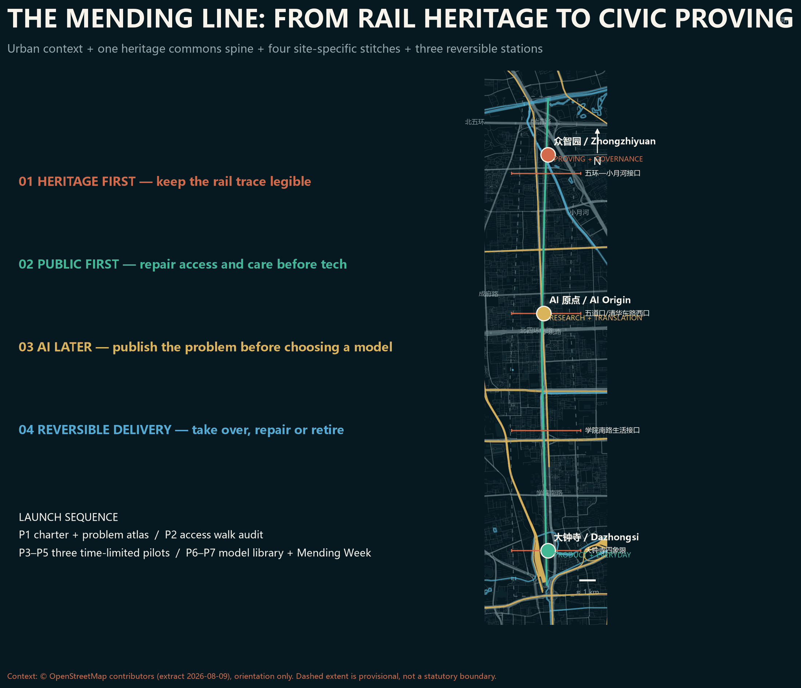
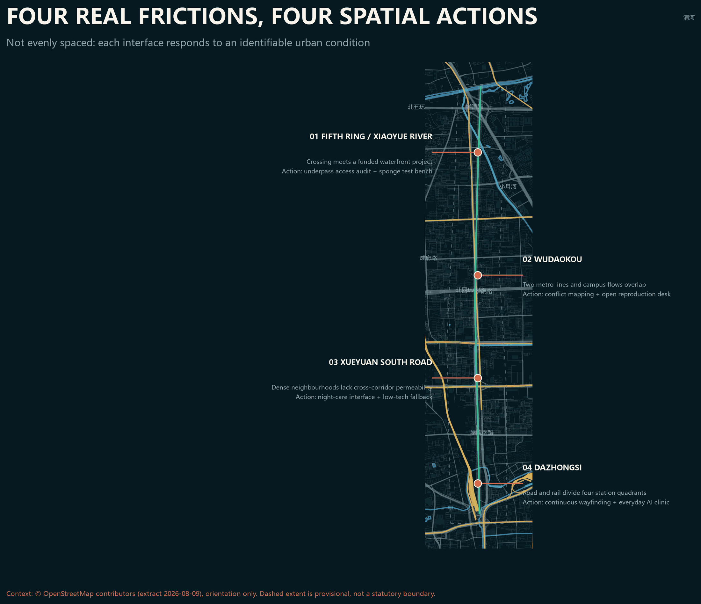
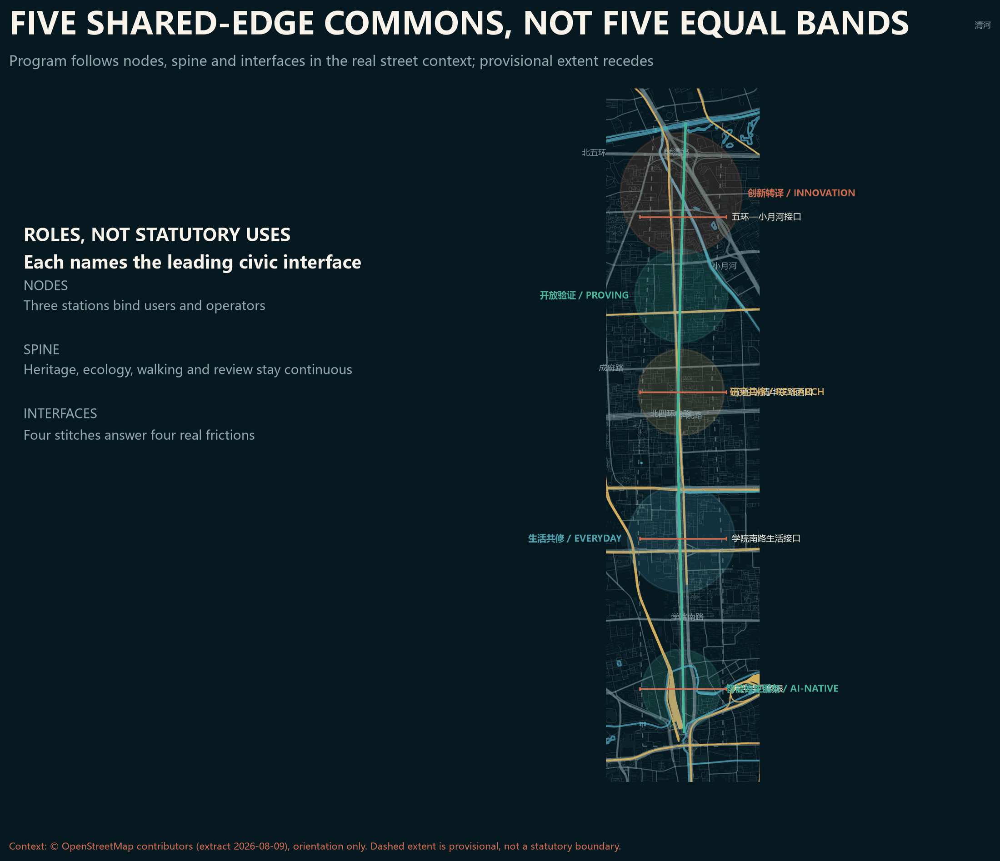
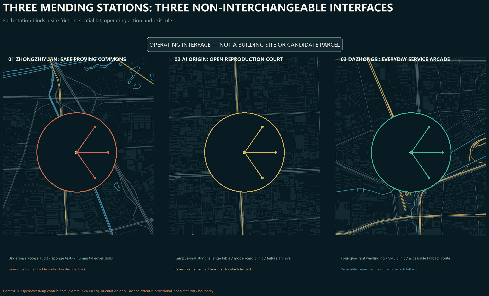
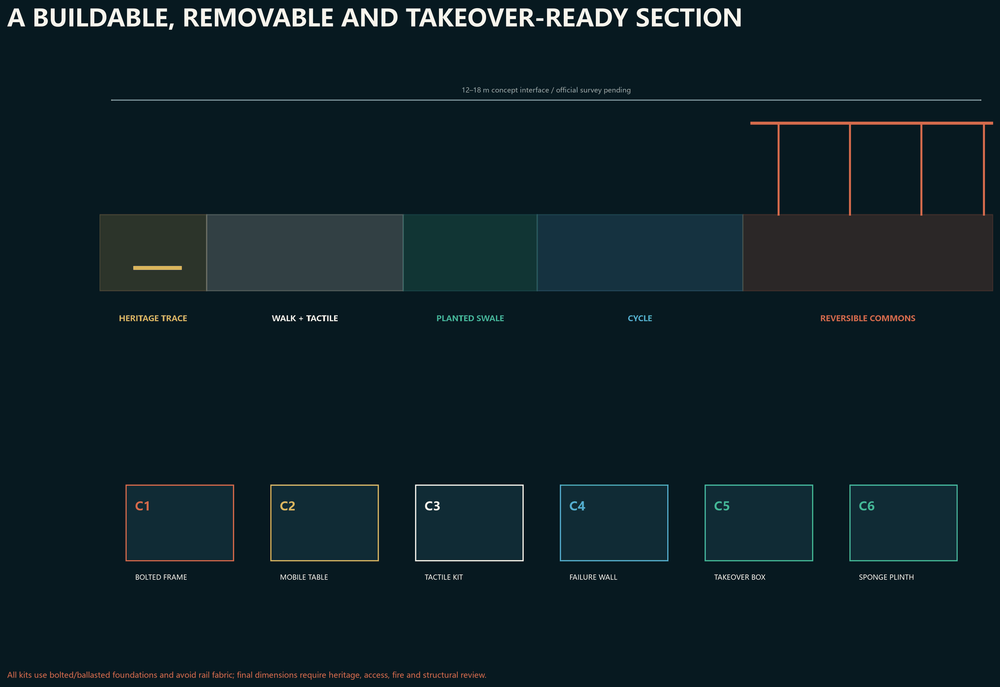
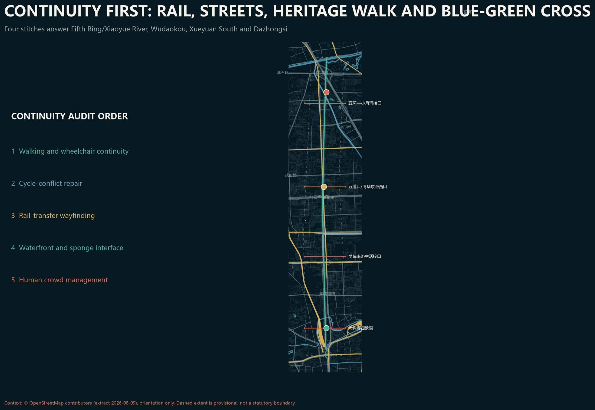
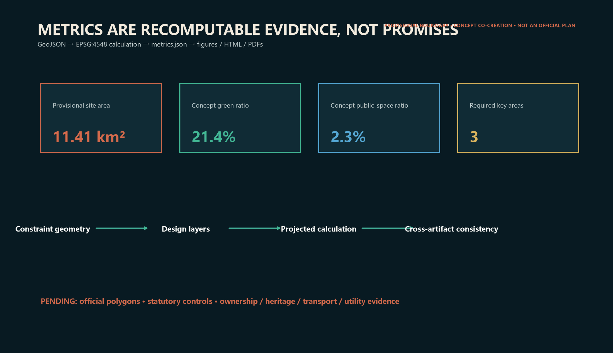

# The Mending Line / Jingzhang Gongxiu Line

> A city is not intelligent because it displays many models, but because people can understand, question, exit and jointly repair everyday life.

This AI-agent proposal is an open co-creation reference. It is neither a statutory plan nor a government, investment, construction or engineering decision. The overall boundary and all three key-area polygons are provisional; official GIS redlines and detailed controls remain pending [source:BOUNDARY-SOURCE] [source:KEY-AREA-SOURCE].

## 01 Design judgment: from innovation corridor to civic mending capacity

Haidian has strong technology nodes. The missing interface is a durable relationship between technology, public space and everyday problems. **The Mending Line** translates the railway legacy of connection and maintenance into one heritage slow-mobility spine, three mending stations, five commons and twelve scenarios. The stations join research, translation, testing, public review and daily services. Every scenario uses minimum data, human review, low-tech fallback and an exit path [standard:PROJECT-AGENT-OPEN-CALL-TASKBOOK] [depth:overall_spatial_structure].

The identity mark uses two open rail strokes to form an M: heritage rust and future commons green. The unclosed center is a deliberate public-review interface. The naming system pairs each place with “Mending Station.”

## Design Basis and Source List

The official announcement defines the 43.6 km² coordinated research scope, approximately 11.4 km² overall design scope and 368.4 ha key scope. These textual facts organize the task but do not make the current provisional polygons precise [source:OFFICIAL-ANNOUNCEMENT] [standard:PROJECT-OFFICIAL-ANNOUNCEMENT]. The agent taskbook requires identity, cases, scenarios, personas, landmarks, culture and long-term operation, all covered here [source:AGENT-TASKBOOK].

Evidence is screened for fitness before it enters design. The official announcement supports names, textual extents, approximate areas and tasks; the cleared taskbook supports the agent charter and six tasks; ministry standards support public-space, land-classification and statutory boundaries; repository provisional geometry supports generation, display and intake self-check only. External cases compare operating mechanisms and cannot replace Beijing conditions. Every added source records publisher, date, use and limitation in `sources.json`. Missing FAR, height, ownership, heritage, road-redline and utility evidence remains unknown. Geometry, metrics, figures, HTML and PDFs share one evidence chain so official updates trigger whole-package recalculation rather than a narrative-only change [source:SOURCE-REGISTRY].

## Three-Level Scope Framework

At the coordinated scale, the proposal creates a collaboration protocol linking universities, research, firms, public testing and services. At the overall scale, it forms a north-south commons spine and east-west stitches. At key-area scale, it offers spatial and operating prototypes for professional development. Land-use codes are only a common vocabulary; official classification and statutory procedure prevail [standard:MNR-LAND-USE-CLASSIFICATION-GUIDE] [standard:MOHURD-CONTROL-DETAILED-PLANNING] [depth:three_level_scope_framework].

The three levels are not the same drawing at three zooms. The coordinated scope asks which actors, resources and civic problems need a collaboration loop, supported by six cases and the three-areas-two-wings structure. The overall scope asks how the commons spine, east-west stitches, five spatial roles and basic services form a continuous system, supported by complete land-use coverage and the concept mobility network. Key-area work asks how each node translates a model, research result or product into a reviewable civic service, supported by station prototypes, scenario cards and reversible pavilions. Provisional boundaries support relative structure only. Official polygons must trigger containment, intersection, area and metric recalculation across all levels [data:geometry/site_boundary.geojson#SITE-001].

## Coordinated Research Area: Industry and Future City Research

| Case | Verifiable mechanism | Translation to Jing-Zhang |
|---|---|---|
| Seoul AI Hub | Distributed support grew into an anchor combining talent, startups, compute and PoC | One shared problem-test-review-diffusion desk across three stations [source:SEOUL-AI-HUB] |
| Singapore one-north LaunchPad | Startup space, connectors, programs and testbeds | Neutral meeting and small-test commons [source:SINGAPORE-ONE-NORTH] |
| Montréal AI ecosystem | Research, compute, industry collaboration and social-impact bodies | A public-interest review seat beside acceleration [source:MONTREAL-AI] |
| Cyber Valley | University-research-industry consortium and translation programs | Open challenge lists connect the three areas and two wings [source:CYBER-VALLEY] |
| Toronto Vector | Downtown research community, compute and visiting collaboration | Short-residency research and civic-problem fellowships [source:TORONTO-VECTOR] |
| Barcelona 22@ Urban Lab | An innovation district also acts as a governed urban testbed | Publish purpose, data, exit and review conditions before trials [source:BARCELONA-22AT] |

These cases support mechanism comparison only. They do not prove performance transfer. Jing-Zhang must negotiate railway heritage, near-campus innovation and dense daily life on one public interface [depth:existing_conditions_diagnosis].

### Jing-Zhang ecosystem loop: how six resources become civic problems

| Resource | Mending-Line interface | Civic output | Exit / feedback |
|---|---|---|---|
| Universities and institutes | AI Origin open challenge table and residencies | Reproducible tests, model cards and public methods | Failed reproduction returns to research, not a civic pilot |
| Parks and firms | Zhongzhiyuan proving commons and Dazhongsi clinic | Time-limited prototypes, vendor-neutral comparison, takeover drills | Retire if stop conditions are absent; investment is not evaluation |
| Communities and access users | Four walk audits and care commons | Problem definitions, fallback routes and experience records | Users may withdraw data and require a non-digital service |
| Park and heritage operators | Heritage spine and memory commons | Interpretation, component maintenance and event-capacity rules | Heritage advice overrides technology display |
| Compute and data services | Isolated back office and carbon-time prompt | Data tiers, versions and energy disclosure | Stop without a clear licence or human takeover |
| Policy and professional services | Four decision gates | Review record, responsibility list and scale/retire decision | Every decision records its author, evidence and review date |

The loop depends on visible outputs, accountable roles and stopping conditions at every translation, not on generic proximity among campuses, firms and communities.

## Overall Design Area: Urban Renewal and Regulatory-Plan-Level Urban Design

The line is a conceptual heritage walking and cycling commons, not a road redline. Three stations sit inside the provisional Zhongzhiyuan, AI Origin and Dazhongsi key areas. Five commons serve learning, proving, care, ecology and memory. Four east-west stitches express priority relationships without claiming bridge, tunnel or interchange feasibility [data:geometry/roads.geojson#MOVE-001] [depth:traffic_rail_slow_parking].

Public planning sources describe a roughly 10 km Jing-Zhang cultural corridor from Fifth Ring/Jianting Bridge to Beijing North Station, with Qinghe, Wudaokou, Zhichunli and Sidaokou nodes. The Wudaokou starter section used roughly 800 m and 1.7 ha between Chengfu Road and the Fourth Ring to test a co-creation and implementation model [source:JINGZHANG-PLANNING-INTERPRETATION] [source:HAIDIAN-GREEN-CORRIDOR]. The approved 2025 Xiaoyue River project adds about 6.4 km of river works, 11.4 km of paths and a new slow-mobility bridge, so the northern interface cannot be treated as an isolated railway strip [source:XIAOYUE-RIVER-PROJECT]. The four stitches are therefore deliberately uneven: Fifth Ring/Xiaoyue River addresses crossing and waterfront coordination; Wudaokou addresses two metro lines and campus flows; Xueyuan South addresses permeability from dense neighbourhoods; Dazhongsi addresses four quadrants split by roads and rail. Public linework is used for orientation only, never boundary, area or engineering claims [source:OSM-CONTEXT-20260809].

Renewal begins by identifying public problems and then selecting the least necessary intervention. Without survey, ownership and safety evidence, no existing building receives a demolition conclusion. Preferred moves are time-sharing, reversible interiors, open ground floors, short residencies in underused space and lightweight civic components. New footprints show that a service needs a spatial carrier; they do not claim storeys, permission or investment. Mobility, municipal and digital infrastructure are also expressed as interfaces: continuity, accessibility, civic front desks, secure edge-compute zones and human-takeover space are stated as needs, then tested by professional teams against official road, heritage, energy and fire-safety conditions. Regulatory-plan-level depth comes from complete problems, evidence, relationships and pending items, not invented statutory parameters [depth:development_intensity_controls].

## Land Use, Building Scale, and Retain-Renovate-Demolish Strategy

The conceptual land-use partition fully covers the submitted provisional boundary through shared edges: innovation translation, everyday mending, heritage commons, open proving and AI-native services [data:geometry/land_use.geojson#LU-003] [depth:land_use_layout].

The five zones describe primary civic roles, not exclusive uses. Innovation translation combines research, incubation and technical services; everyday mending adds care, learning and third places; the heritage commons combines ecology, mobility, memory and public review; open proving provides time-limited, reversible, human-supervised tests; AI-native services connect business, consumption and public services. Buildings follow a three-step method of retain first, improve lightly, and hold decisions for professional confirmation. No parcel receives a demolition label. Total floor area, FAR and density remain unknown. Reversible-pavilion footprints only test whether station services have a spatial carrier and remain low-confidence concept values in `metrics.json` [metric:building_footprint_area_sqm].

## Detailed Design of Key Areas

**Zhongzhiyuan Station** focuses on model-to-system translation through open testing, standards and safety workshops, low-carbon compute interpretation and ecological observation. **AI Origin Station** focuses on research-to-public-problem translation through residencies, reproducibility and talent services. **Dazhongsi Station** focuses on product-to-everyday-life translation through accessible trials, service prototypes, human support and feedback [data:geometry/key_areas.geojson#PROV-KEY-001] [depth:three_key_area_detailed_design].

Each station has two fronts and one back: a street front explains capability and limits; a civic front receives real problems with informed consent; a protected back separates sensitive data and records versions and exit criteria. Footprints are reversible-pavilion diagrams, not surveys, ownership judgments or approved scale [data:geometry/buildings.geojson#BLDG-11] [depth:retain_renovate_demolish].

All three stations share a removable kit but combine it differently. Zhongzhiyuan uses C5 human-takeover boxes and C6 sponge plinths; AI Origin uses C2 mobile work tables and C4 failure/retirement walls; Dazhongsi uses C3 tactile kits and C1 bolted frames for a four-quadrant service arcade. All pieces use bolted or ballasted foundations and avoid rail fabric. The GeoJSON contains two 120 sqm capacity carriers per station—six and about 720 sqm in total—but they are neither parcels nor fixed locations. The key-area diagram shows deliberately imprecise operating interfaces, not candidate building sites. Survey, ownership, heritage, access, fire and structural review must re-site and dimension every carrier [data:geometry/buildings.geojson#BLDG-11].

## AI Innovation Ecosystem, Personas, and AI+ Scenarios

| # | Scenario | Space | Public value and boundary |
|---|---|---|---|
| 01 | Accessible-route mending | Whole line | Human-confirmed barriers; no face collection |
| 02 | Multilingual heritage guide | Memory commons | Cited history; paper fallback |
| 03 | Slow-mobility gap repair | Four stitches | Location and issue only; no automated enforcement |
| 04 | Comfort diary | Ecology commons | Voluntary anonymity; no personal profiling |
| 05 | Model-card clinic | Proving commons | Explain limits and versions publicly |
| 06 | Open reproduction desk | Origin Station | Public data, reproducible tests, failure log |
| 07 | SME AI clinic | Dazhongsi Station | Vendor-neutral; human contract review |
| 08 | Care-roster assistant | Care commons | Never replaces professional care decisions |
| 09 | Campus-industry challenge matching | Learning commons | Published rules; no opaque ranking |
| 10 | Low-tech continuity drill | Three stations | Works offline; rehearsed human takeover |
| 11 | Low-carbon compute timing | Zhongzhiyuan Station | Advice only; no energy-capacity claim |
| 12 | Public-comment synthesis | Three stations | Coverage, dissent and human review shown |

The three proving families cover model reliability and red-teaming, accessible edge devices and privacy, and human takeover of civic-service workflows. Trials pass through an open problem card, small sandbox, independent review, time-limited trial, and exit-or-scale gate [standard:MOHURD-URBAN-DESIGN-MEASURES] [depth:municipal_new_infrastructure].

Five user groups are researchers and students; startup and product teams; residents and carers; frontline service staff; and visitors and disabled users. Each group can frame problems, not merely consume solutions. Minors, disabled people and people with limited digital skills retain non-digital routes.

| Persona | Typical task | Touchpoint | Evidence of success | Protection and takeover |
|---|---|---|---|---|
| Researcher/student | Reproduce a method as an urban problem prototype | Origin reproduction desk | A third party repeats the result | Failure may be public; ranking cannot replace judgement |
| Founder/product team | Test reliability, access and workflow | Proving commons and clinic | Trial card, defect log and repair record | High-risk output requires human confirmation |
| Resident/carer | Report a gap and obtain non-digital service | Care commons and four stitches | Issue closed and fallback route usable | No face collection; withdrawal and staffed service |
| Frontline operator | Take over systems, maintain kits and manage events | Station back offices | Drill complete; version and contact traceable | One-step stop with human procedure preserved |
| Visitor/access user | Move continuously and understand heritage/system limits | Spine and memory commons | Access audit accepted by real users | Paper guide, tactile route and human assistance |

Every scenario follows one minimal journey: **raise problem → receive explanation and choose knowingly → try with minimum data → human review → publish result card → continue, repair or exit**. Operators, data boundaries, takeover conditions and measures are bound through scenario cards, seven launch projects and `metrics.json`. Technical readiness alone cannot bypass G1 public or G2 professional gates.

## Transport, Rail, Municipal Infrastructure, and Public Services

The mobility concept prioritizes walking, cycling, accessibility and transit information continuity rather than an autonomous-vehicle showcase. The submitted conceptual slow-mobility geometry totals [metric:conceptual_slow_mobility_length_m] and must be re-aligned after survey, heritage, transport and ownership review.

Rail and public-transport work stays at interface-requirement level: stations need transfer information, continuous walking, orderly cycle parking and event-day crowd plans, but this proposal changes no rail alignment or entrance. Municipal strategy favors small plug-in facilities, maintainable equipment space, offline continuity and transparent energy use; compute, energy, drainage, fire-safety and communications capacity all require professional evidence. Public services keep digital and non-digital channels, transfer model advice to human desks, and allow human takeover in emergencies. Accessibility review, transport safety, heritage advice, utility survey and public walk audits must locate real gaps before implementation. The four stitches describe relationships to solve, not bridge, tunnel or crossing projects [depth:municipal_new_infrastructure].

## Blue-Green Network, Public Space, and Urban Character

The heritage ecological commons combines stormwater observation, seasonal maintenance, habitat logging and rest. Submitted green and public-space areas are [metric:green_space_area_sqm] and [metric:public_space_area_sqm]; ratios [metric:green_ratio] and [metric:public_space_ratio] are internal concept readings, not approved controls [data:geometry/green_space.geojson#GREEN-001] [depth:blue_green_public_space].

## 08 Character, cultural narrative and three pilgrimage landmarks

Character makes maintenance visible instead of placing an AI skin on buildings. The material direction favors durable metal, reclaimed brick, replaceable timber parts and low-glare information surfaces. New components remain legibly contemporary beside railway heritage, subject to professional heritage review [depth:height_massing_character].

Three conceptual landmarks are the **Century Switch**, whose non-motorized tracks express public choice; the **Public Model Library**, presenting model cards, failures and retirements; and the **Memory Signal**, linking railway, Zhongguancun and AI culture through low-light signals and oral-history indexes. Honors recognize open data, civic repair, responsible retirement and cross-field collaboration rather than celebrity.

| Landmark | Suggested place and scale logic | Components and wayfinding | Maintenance / honour rule |
|---|---|---|---|
| Centennial Switch | Wudaokou conflict-audit interface; low enough to preserve heritage sightlines | Manual switch, tactile route map and paper fallback box | Every route change records proposer, reviewer and reason |
| Public Model Library | AI Origin reproduction court; movable walls form a small review room | Model-card slots, version rail, failure drawers, QR and paper channels | No ranking by funding/calls; display reproducibility and civic repair |
| Memory Signal Tower | Dazhongsi four-quadrant wayfinding node; height subject to heritage/landscape review | Low-luminance signal, oral-history index and accessible directions | Timed at night, manually isolatable and annually source-reviewed |

## Renewal Projects, Implementation Policy, and Phasing

Phase one publishes the challenge list, data rules, identity kit and three small trials. Phase two mends continuity and develops the three stations after professional confirmation. Phase three expands ecological and industry networks only after public evaluation [data:geometry/phasing.geojson#PHASE-001] [depth:phasing_implementation].

The annual cycle is spring problem intake, summer open testing, autumn Mending Week, and winter model-retirement review. The developer community uses public challenges, version repositories, office hours and bilingual archives. The conversion path is problem residency, validation receipt, collaboration matching and continuing service; it promises no funding, procurement or investment [depth:renewal_project_list].

## Adoption Path: Seven Launch Projects and Four Decision Gates

The proposal does not require the whole belt to be built at once. It divides year one into seven projects that can be adopted independently and learn from one another. Responsible parties below are **proposed coalitions**, not confirmed government arrangements. Each project advances only after official evidence, public input and professional review satisfy its gate.

Resource bands avoid invented budgets: **S** uses existing staff and workshops; **M** needs a small commission, reversible prototype and specialist review; **L** needs cross-agency capital and full approvals. A real budget starts only after official boundary, ownership, heritage and utilities surveys.

| Launch project | Proposed place and coalition | Twelve-month deliverable | Gate to the next stage |
|---|---|---|---|
| P1 Mending Charter and Problem Atlas | Belt-wide; district convenor + universities/parks + community representatives | Bilingual charter, open issue ledger, data tiers and exit template | Tasks, data, responsibility and appeal routes are public |
| P2 Heritage Accessibility Walk Audit | Whole line; park operator + disabled users + transport professionals | Gap list, low-tech alternative routes and priority map | Heritage and transport review; disabled users sign off the problem definition |
| P3 Zhongzhiyuan Safe Proving Commons | Zhongzhiyuan; research + standards/safety teams + independent reviewers | Three reliability test families, failure archive and takeover drills | 100% of high-risk tasks have human review and stop conditions |
| P4 Origin Open Reproduction Desk | AI Origin; universities + open-source community + technology services | Reproducible experiments, residencies and translation clinic | Clear data rights; a third party can repeat the result |
| P5 Dazhongsi Everyday AI Clinic | Dazhongsi; community/business + service design + consumer representatives | Accessible trials, vendor-neutral advice and human support | No unnecessary identity data; non-digital route works |
| P6 Public Model Library and Retirement Wall | Three stations; library/exhibition + auditors + developers | Public index of model cards, versions, known failures and retirement reasons | Every model has provenance, limits, contact and review date |
| P7 Jing-Zhang Mending Week | Rotating stations; community + developers + international partners | Open tests, issue review, retirement ritual and next-year challenges | Results enter the public ledger; attendance never substitutes for public value |

| Project | One accountable owner (proposed function) | R / C / I | Resource / permits | Monthly milestones | Go / No-Go and measurement owner |
|---|---|---|---|---|---|
| P1 | Belt programme office | R participation team; C legal/data/community; I all partners | S; data and publication rules | M1 start, M2–3 co-design, M4 publish, M6/12 review | 100% public-card field coverage; office audits monthly |
| P2 | Park operator | R access-audit team; C heritage/transport; I communities | S–M; fieldwork, heritage and traffic safety | M1 route, M2–4 audit, M5 rank, M6 deliver | Real access users accept definition and fallback route; operator retests |
| P3 | Zhongzhiyuan pilot lead | R safety team; C independent/fire/privacy; I public | M; temporary facility, data and safety review | M1–2 design, M3–5 sandbox, M6 drill, M9/12 assess | 100% high-risk flows have stop and takeover; independent sign-off |
| P4 | AI Origin academic coordinator | R reproduction team; C open-source/IP/community; I research partners | S–M; data licence and reuse | M1 challenge, M2–4 reproduce, M5 publish, M6/12 review | Third party reproduces from record; coordinator owns log |
| P5 | Dazhongsi service operator | R service design; C merchants/consumer/access users; I visitors | M; venue, consumer, privacy and access | M1 recruit, M2–3 script, M4–6 trial, M9/12 review | Non-digital route always works; no unnecessary ID data; operator samples |
| P6 | Public Model Library steward | R exhibition/audit; C developers/legal; I public | S–M; content rights and safety | M3 standard, M4–6 build, M9/12 retirement review | 100% provenance/limit/contact/review-date fields; steward audits quarterly |
| P7 | Mending Week producer | R event team; C stations/community/international; I belt | M; event, fire, insurance and crowd plan | M6 call, M8 confirm, M9 hold, M10–12 follow up | Every result enters ledger with owner; producer verifies at M10 |

The four gates are **G0 Evidence**, confirming provenance, rights and official boundaries; **G1 Public**, confirming that real users co-define the problem and retain a non-digital route; **G2 Professional**, completing heritage, transport, safety, privacy and engineering review; and **G3 Exit**, comparing public benefit, maintenance cost, harm and alternatives to decide scale, repair or retirement. Year one avoids firm counts, investment and model calls as success proxies. It tracks seven auditable measures: published trial-card coverage, takeover-drill completion, accessible-participation coverage, independent reproduction, issue closure time, low-tech fallback availability and documented retirement decisions. Targets are set only after a co-creation baseline, avoiding fabricated precision [data:geometry/phasing.geojson#PHASE-001] [depth:renewal_project_list].

This path gives the organizer three decisions it can take immediately: authorize low-cost P1-P2 evidence and walk audits without waiting for construction redlines; compare one time-limited P3-P5 pilot at each key-area interface; and institutionalize P6-P7 only after G3 demonstrates public value and maintenance ownership. Even if other spatial ideas are not selected, these steps independently produce reusable public knowledge and professional design inputs.

## Metrics, Area Recalculation, and Compliance Matrix

The submitted provisional polygon area is [metric:site_area_sqm]. It is close to the announcement's approximate 11.4 km² but cannot replace that official text or an official polygon. There are [metric:key_area_count] required key areas. Conceptual reversible footprints total [metric:building_footprint_area_sqm] and do not imply total floor area. FAR, total floor area, density and road-area ratio remain pending official data [depth:development_intensity_controls] [depth:metrics_recalculation].

Complete professional standards, design depth and 23 task requirements live in the structured matrices. Prose keeps only claim-adjacent anchors [standard:MOHURD-ARCH-DESIGN-DEPTH-2016].

## Risk, Copyright, and Compliance

The central risk is treating provisional geometry as reality. A current repository issue reports a possible spatial mismatch between the provisional polygon and public mapping of the Jing-Zhang Heritage Park. This proposal therefore claims relative structure only. When official boundaries arrive, intersection checks, land-use partition, every area, figure and PDF must be regenerated [depth:risk_missing_data].

Codex generated the writing, charts, HTML and PDFs in a fresh sparse workspace. Geometry was deterministically derived from repository provisional constraints. No commercial tiles, news images, portraits or company marks were used. External cases are mechanism summaries from official or institutional pages, not independently evaluated performance claims. Copyright and display terms follow `report/copyright_statement.md` and repository rules [source:SOURCE-REGISTRY] [source:SITE-PACKAGE].

## References

Publishers, links, dates, uses and limitations for the official basis, cleared taskbook, provisional geometry and six international cases are recorded in `sources.json`. Local snapshots and gaps for statutory standards follow the site package standards index; prose does not duplicate the registry as an identifier dump.

The proposal prioritizes the official announcement, government standards and cleared repository task material. Seoul, Singapore, Montréal, Germany, Toronto and Barcelona cases come from government or primary institutional pages and contribute only publicly described mechanisms, not unverified performance promotion. The boundary record is explicitly `provisional_only` and cannot support an official redline, precise area or approval decision. Network sources were retrieved on 2026-08-09. Future reviews must check page updates, reuse terms and continuing operation. If a source disappears or conflicts with newer official evidence, the proposal should preserve a change record, lower confidence and regenerate affected layers and metrics rather than repeat the old conclusion [source:OFFICIAL-ANNOUNCEMENT] [source:BOUNDARY-SOURCE].
