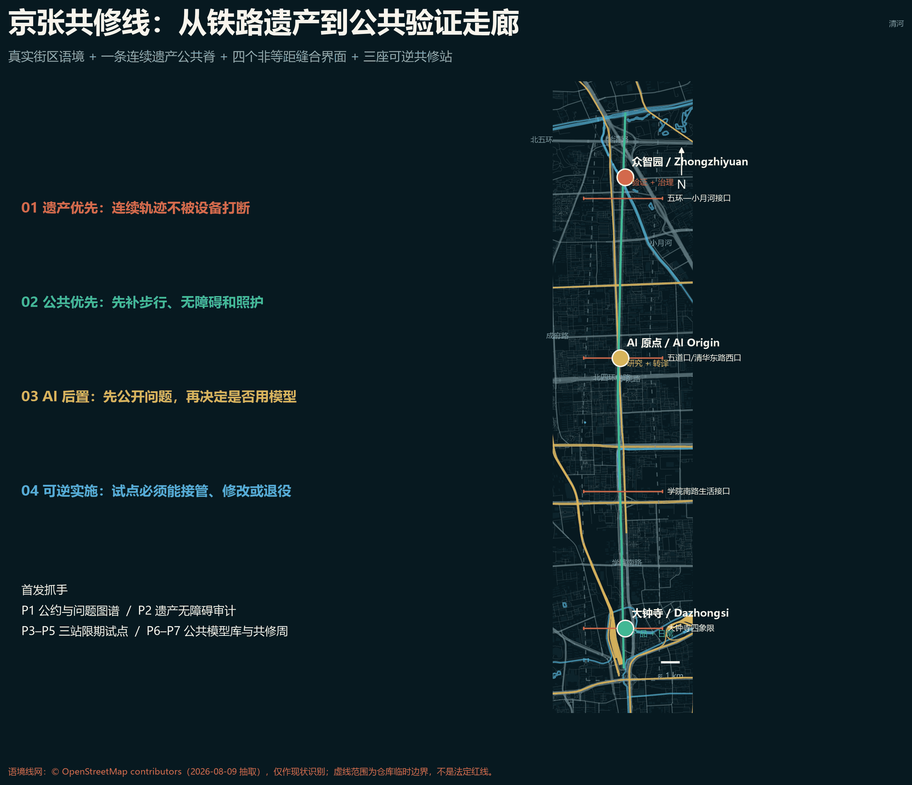
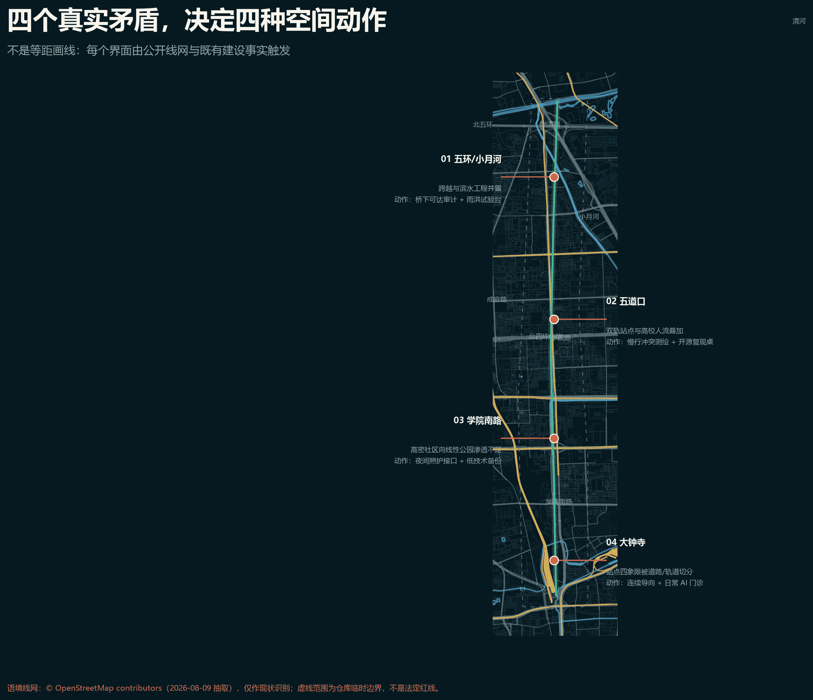
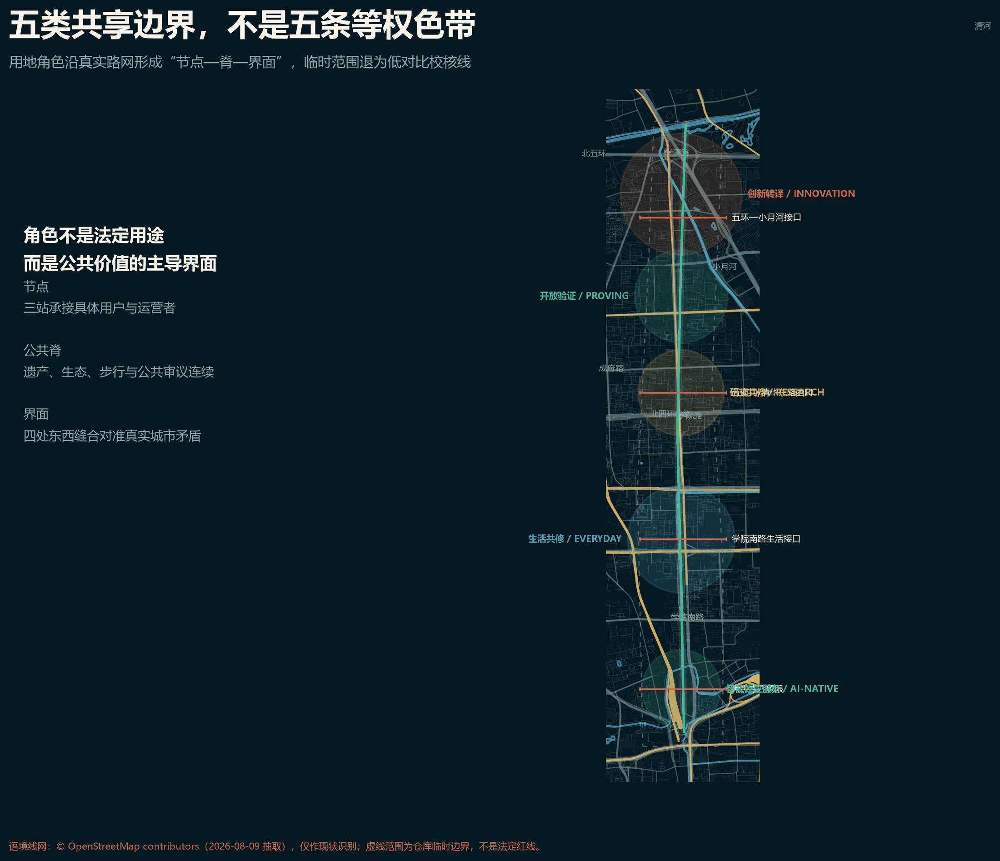
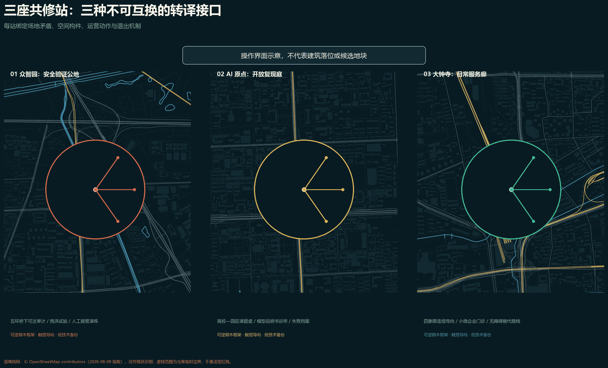
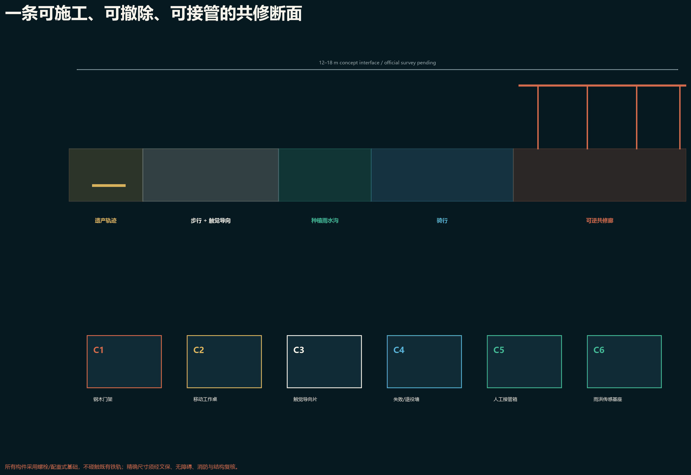
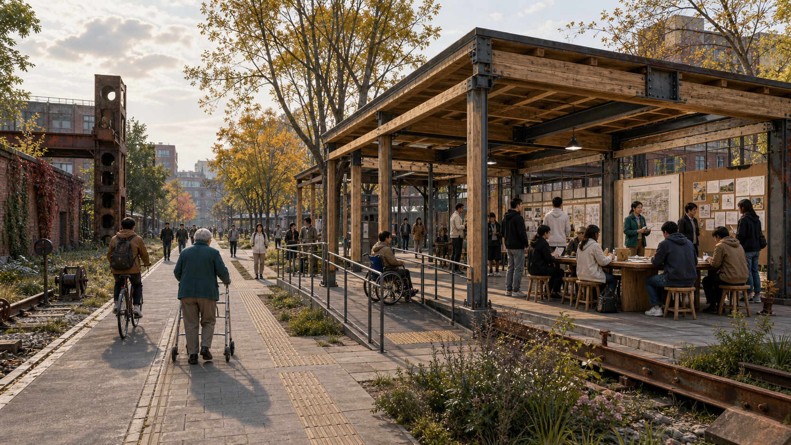
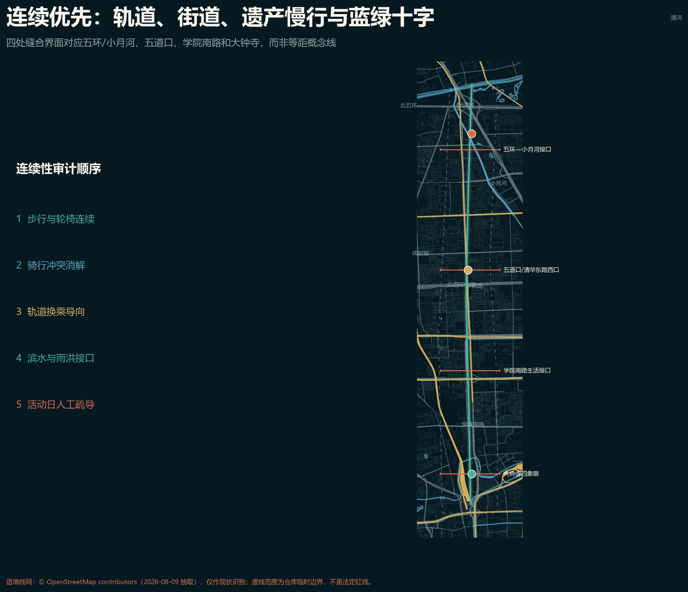
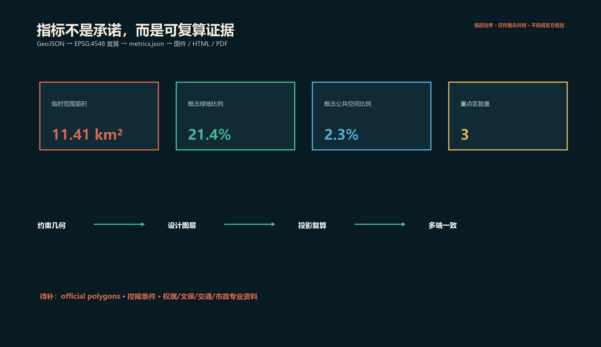

# 京张共修线 / The Mending Line

> 一条城市是否真正智能，不看它展示了多少模型，而看人能否理解、质疑、退出，并共同修好日常生活。

本方案是 AI 智能体生成的开放共创建议，不替代正式规划，不构成政府审定、投资、建设或工程可行性结论。当前总体范围与三处重点区均为临时约束，官方 GIS 红线和详细控规尚待补齐 [source:BOUNDARY-SOURCE] [source:KEY-AREA-SOURCE]。

## 01 设计判断：从“创新走廊”转向“城市共修能力”

海淀不缺技术节点，真正稀缺的是把技术、公共空间和日常问题连成可持续关系的城市接口。**京张共修线**借百年铁路“连接与维护”的精神，提出“一线、三站、五庭、十二场景”：一条南北遗产慢行脊连接三区；三座共修站把研发、转译、测试、公共复核与生活服务串成闭环；五类公共庭分别服务学习、验证、照护、生态与记忆；十二个场景坚持最小数据、人工复核、低技术备份和可退出。[standard:PROJECT-AGENT-OPEN-CALL-TASKBOOK] [depth:overall_spatial_structure]

视觉识别以两条未闭合轨线构成字母 M：一条赭红代表京张历史，一条青绿代表面向未来的公共修补；中间留白不是“缺口”，而是留给公众质询与专业深化的接口。中文主名“京张共修线”，英文名 “The Mending Line”，节点命名统一采用“地点 + 共修站 / Mending Station”。

## 设计依据与资料清单

官方公告给出 43.6 平方公里统筹研究范围、约 11.4 平方公里总体设计范围和 368.4 公顷重点区域，以及三处重点区的文本面积；这些值用于任务框架，不等于当前临时 polygon 的精确面积 [source:OFFICIAL-ANNOUNCEMENT] [standard:PROJECT-OFFICIAL-ANNOUNCEMENT]。仓库任务书要求完成品牌、案例、场景、人物、地标、文化与长期运营，本方案逐项结构化响应 [source:AGENT-TASKBOOK]。

资料使用遵循“先判断适用性，再进入设计”的顺序：官方公告支撑名称、文字四至、约数面积与任务；清权任务书支撑智能体共创原则和六项任务；住建与自然资源部门标准支撑公共空间、用地分类和法定边界；仓库临时几何仅支撑生成、展示和 intake self-check。外部案例只用于比较组织机制，不能替代北京本地条件。每条新增来源均在 `sources.json` 登记发布者、日期、用途和限制；无法确认的容积率、建筑高度、权属、文保、道路红线和市政容量不作推断。几何、指标、图件、HTML 和 PDF 共享同一证据链，以便官方资料更新后整体重算，而不是只修改文字结论。[source:SOURCE-REGISTRY]

## 三层范围工作框架

三层工作尺度分别是：统筹层建立“高校—研究—企业—公共测试—城市服务”的协作协议；总体层构造南北公共脊与东西缝合；重点区层给出可供专业团队深化的空间和运营原型。所有用地代码只作统一表达，正式用途管制仍须遵循官方分类与法定程序 [standard:MNR-LAND-USE-CLASSIFICATION-GUIDE] [standard:MOHURD-CONTROL-DETAILED-PLANNING] [depth:three_level_scope_framework]。

三层不是把同一张图放大三次。统筹研究范围回答“哪些主体、要素和公共问题需要形成协作回路”，以六个国际案例和三区两翼关系为证据；总体设计范围回答“公共脊、东西缝合、五类空间与基础服务怎样组成连续系统”，以完整覆盖的用地分区和概念慢行网络为证据；重点区域回答“每个节点如何把模型、研究或产品转译成可审议的城市服务”，以三站原型、场景卡和可逆载体为证据。临时边界只提供相对结构，不能支撑精确选址或工程断面；官方 polygon 到位后，三层之间的包含、相交、面积和指标必须同步复算，避免尺度之间互相矛盾。[data:geometry/site_boundary.geojson#SITE-001]

## 统筹研究范围产业与未来城市研究

| 案例 | 可核验机制 | 对京张的转译 |
|---|---|---|
| 首尔 AI Hub | 从分散支持空间走向锚点设施，结合人才、创业、算力与 PoC | 三站共享一套“问题—试验—复核—扩散”服务台 [source:SEOUL-AI-HUB] |
| 新加坡 one-north LaunchPad | 创业空间、连接平台、活动和试验场协同 | 把共修庭作为跨机构中性会面与小试空间 [source:SINGAPORE-ONE-NORTH] |
| 蒙特利尔 AI 生态 | 研究机构、计算资源、产业协作与社会影响组织并列 | 在产业加速之外设置公共利益与社会影响复核席 [source:MONTREAL-AI] |
| 德国 Cyber Valley | 高校、研究机构、产业与创业转译形成联盟 | 用“开放课题清单”连接三区两翼，而非只靠物理邻近 [source:CYBER-VALLEY] |
| 多伦多 Vector | 市中心研究社区、算力、访问学者和产业合作 | 设置短驻研究与城市问题驻留机制 [source:TORONTO-VECTOR] |
| 巴塞罗那 22@ Urban Lab | 创新区同时作为受治理的城市试验场 | 每个试点先公布目的、数据、退出和复盘条件 [source:BARCELONA-22AT] |

这些案例只支持机制比较，不证明其绩效可直接复制。京张的独特性在于铁路遗产、近校创新和高密度日常生活必须在同一公共界面上协商。[depth:existing_conditions_diagnosis]

### 京张生态闭环：六种资源如何进入公共问题

| 资源 | 进入共修线的接口 | 形成的公共产物 | 退出/反馈 |
|---|---|---|---|
| 高校与研究机构 | 原点站开放课题桌、短驻研究 | 可复现实验、模型卡、公开方法 | 复现失败退回研究，不进入公共试点 |
| 园区与企业 | 众智园安全验证庭、大钟寺门诊 | 限期原型、供应商中立比较、接管演练 | 未满足停止条件即退役，不以招商替代评估 |
| 社区与无障碍用户 | 四处步行审计、照护庭 | 问题定义、替代路线、体验记录 | 用户可撤回数据并要求非数字服务 |
| 公园与遗产运营 | 遗产公共脊、记忆庭 | 遗产解释、构件维护、活动日承载规则 | 文保意见优先于技术展示 |
| 算力与数据服务 | 隔离后台、低碳时段提示 | 数据分级、版本记录、能耗说明 | 无清晰许可或人工接管即停止 |
| 政策与专业服务 | 四道决策门 | 审查记录、责任清单、扩散/退役决定 | 决定必须留痕并公开复核日期 |

这个闭环不依赖“企业、高校、社区距离很近”这一泛化判断，而依赖每次转译都有可见的公共产物、责任人和停止条件。

## 总体设计范围城市更新与控规深度城市设计

“一线”是概念性的遗产步行骑行公共脊，不是道路红线或工程线位；“三站”分别落在众智园、AI 原点社区和大钟寺三个临时重点区内；“五庭”嵌入学习庭、验证庭、照护庭、生态庭和记忆庭。东西向四条“缝合”只表达优先联系，不对桥隧、过街或轨道接驳作可行性判断 [data:geometry/roads.geojson#MOVE-001] [depth:traffic_rail_slow_parking]。

公开资料把京张文化绿廊描述为北五环箭亭桥至北京北站约 10 公里的连续遗产廊道，并明确新建清河、五道口、知春里、四道口等节点；五道口启动区曾以成府路至北四环约 800 米、约 1.7 公顷的先行实施验证“众创 + 实施”的工作方法 [source:JINGZHANG-PLANNING-INTERPRETATION] [source:HAIDIAN-GREEN-CORRIDOR]。2025 年获批的小月河滨水工程则覆盖约 6.4 公里河道、11.4 公里步道及一座慢行桥，使北段不能再被理解为一条孤立铁路绿带 [source:XIAOYUE-RIVER-PROJECT]。因此四条缝合不再等距：北段解决五环跨越与小月河项目接口，五道口段解决双轨站点与高校人流叠加，学院南路段解决高密社区向公园渗透，大钟寺段解决道路/轨道切割的四象限连续导向。公开线网仅用于现状识别，不进入边界、面积或工程结论 [source:OSM-CONTEXT-20260809]。

城市更新采取“先识别公共问题，再选择空间介入强度”的逻辑。既有建筑在缺少测绘、权属和安全鉴定时，一律不作拆除结论；优先研究共享时段、可逆内装、首层开放、闲置空间短驻和轻量公共构件。新增建筑 footprint 只代表服务容量需要落位，不代表层数、面积许可或投资承诺。交通、市政与新型基础设施也采用接口化表达：慢行连续性、无障碍、公共服务前台、边缘计算安全区和人工接管空间分别列出需求，再由专业团队在官方道路、文保、能源和消防条件下校核。由此，设计的“控规深度”体现在问题、证据、空间关系和待确认项完整，而不是制造不存在的法定参数。[depth:development_intensity_controls]

## 用地、建筑规模与拆改留方案

用地概念分区完整覆盖 submitted provisional boundary：创新转译、生活共修、遗产公共脊、开放验证、智能原生服务五类空间通过共享边界生成，避免独立手绘造成缝隙和叠压 [data:geometry/land_use.geojson#LU-003] [depth:land_use_layout]。图示强调公共脊和节点，临时外框保持低对比虚线。

五类分区表达的是主导公共角色，而非排他用途。创新转译组团容纳研究、孵化与技术服务的复合接口；生活共修组团补足居住周边的照护、学习与第三空间；遗产公共脊承担生态、慢行、记忆和公共审议；开放验证组团提供限期、可撤回、可人工接管的试验环境；智能原生服务组团连接商务、消费与公共服务。建筑策略只形成“保留优先—轻介入改善—待专业确认”三级工作法，不给具体地块贴拆改留标签。总楼面面积、容积率和建筑密度保持未知；可逆亭体的 footprint 只用于图面验证节点是否有空间载体，并在 `metrics.json` 中以低置信度说明。[metric:building_footprint_area_sqm]

## 重点区域详细设计

**众智园共修站**聚焦“模型到系统”：开放测试工位、标准与安全工作坊、低碳计算展示、河岸生态观察；载体优先设为可逆内装和轻量亭，不推导具体地块拆建。**AI 原点共修站**聚焦“研究到公共问题”：短驻研究、开源复现、成果转译门诊和人才共居服务。**大钟寺共修站**聚焦“产品到日常”：无障碍体验、消费与内容原型、人工客服兜底和使用反馈 [data:geometry/key_areas.geojson#PROV-KEY-001] [depth:three_key_area_detailed_design]。

每站配置“两前一后”：街道前台解释系统能力与限制；公共前台接收真实问题并完成知情同意；后台隔离敏感数据、记录模型版本和退出条件。三站对应的建筑 footprint 只是可逆载体示意，不是现状测绘、权属判断或批准建筑规模 [data:geometry/buildings.geojson#BLDG-11] [depth:retain_renovate_demolish]。

三站共享一套可拆卸构件库，但组合方式不同：众智园用 C5 人工接管箱和 C6 雨洪传感基座形成安全验证庭；AI 原点用 C2 移动工作桌和 C4 失败/退役墙形成开放复现庭；大钟寺用 C3 触觉导向片与 C1 钢木门架形成四象限连续服务廊。构件均采用螺栓或配重式基础，避让既有轨道遗存。GeoJSON 中每站两个、每个约 120㎡的矩形仅是容量载体，共六个、合计约 720㎡，不对应图中的地块或确定位置；重点区图只显示模糊操作界面，不显示候选建筑地块。概念断面宽度仅用于容量讨论，须经测绘、权属、文保、无障碍、消防和结构复核后重新落位与定尺。[data:geometry/buildings.geojson#BLDG-11]

## AI 创新生态、人才画像与 AI+ 场景

| # | 场景卡 | 空间 | 公共价值与边界 |
|---|---|---|---|
| 01 | 无障碍路线共修 | 全线与三站 | 人工确认障碍点；不采集人脸 |
| 02 | 多语遗产导览 | 记忆庭 | 标注史料来源；支持纸质版 |
| 03 | 慢行断点报修 | 四条缝合 | 只收位置与问题，不自动执法 |
| 04 | 公共空间舒适度日记 | 生态庭 | 自愿匿名；不做个体画像 |
| 05 | 模型说明书诊所 | 验证庭 | 面向公众解释限制与版本 |
| 06 | 开源复现台 | 原点站 | 公开数据、可复现实验、失败记录 |
| 07 | 小微企业 AI 门诊 | 大钟寺站 | 供应商中立；人工审合同 |
| 08 | 社区照护排班助手 | 照护庭 | 不替代专业照护决策 |
| 09 | 校园—园区课题配对 | 学习庭 | 公开规则；避免黑箱排名 |
| 10 | 城市事件低技术备份 | 三站 | 断网可运行；人工接管演练 |
| 11 | 低碳算力时段建议 | 众智园站 | 只做提示，不承诺能源容量 |
| 12 | 公共意见归纳台 | 三站 | 展示原文覆盖率、异议与人工复核 |

三类产业测试验证分别是：模型可靠性与红队测试、端侧设备无障碍与隐私测试、城市服务工作流人工接管测试。所有试点通过“公开问题卡—小样本沙盒—独立复核—限期试用—退出/扩散”五道门，未通过不得跨域扩散。[standard:MOHURD-URBAN-DESIGN-MEASURES] [depth:municipal_new_infrastructure]

五类核心用户是：AI 研究者与学生、创业与产品团队、周边居民与照护者、园区一线服务人员、访客与无障碍使用者。每类用户既是使用者也是问题提出者；未成年人、行动不便者和数字技能较弱者优先拥有非数字通道。

| Persona | 典型任务 | 接触点 | 成功证据 | 保护与人工接管 |
|---|---|---|---|---|
| 研究者/学生 | 把论文方法复现为城市问题原型 | 原点复现台 | 第三方按记录重复结果 | 失败可公开，不能以排名替代判断 |
| 创业/产品团队 | 验证可靠性、无障碍与服务流程 | 众智验证庭、大钟寺门诊 | 限期卡、缺陷单、修复记录 | 高风险输出必须人工确认 |
| 居民/照护者 | 报告断点、获得非数字服务 | 照护庭、四处缝合 | 问题被关闭且替代路线可用 | 不采人脸，允许撤回与线下柜台 |
| 园区/公园一线人员 | 接管系统、维护构件和人流 | 三站后台、活动日 | 演练完成、版本与联系人可查 | 紧急时一键停用并保留人工流程 |
| 访客/无障碍用户 | 连续通行、理解遗产与系统边界 | 公共脊、记忆庭 | 可达审计由真实用户签收 | 纸质导览、触觉导向、人工引导 |

十二个场景统一采用一条最短用户旅程：**提出问题 → 前台解释与知情选择 → 最小数据试用 → 人工复核 → 公开结果卡 → 继续、修改或退出**。运营者、数据边界、接管条件和指标分别落在场景卡、七个首发项目及 `metrics.json` 中；没有通过 G1 公共门和 G2 专业门的场景，不得因为“技术已可用”而上线。

## 交通、轨道、市政与公共服务设施

交通策略不追求“自动驾驶秀场”，而先保证步行、骑行、无障碍和公共交通换乘信息连续。概念慢行网络的 submitted geometry 长度为 [metric:conceptual_slow_mobility_length_m]，只用于方案内部复算，须在官方测绘、文保、交通和产权条件下重新选线。

轨道和公共交通策略停留在接口需求层：共修站应能提供换乘信息、步行连续性、非机动车秩序和活动日人流预案，但不调整现状轨道线位或站口。市政策略强调小尺度可插拔设施、设备可维护空间、断网运行和能耗透明；任何算力、能源、排水、消防或通信容量都必须由专业资料验证。公共服务设施由数字与非数字双通道组成，模型建议必须能转人工柜台，紧急情形必须允许人工接管。项目实施前，应以无障碍审查、交通安全评估、文保意见、管线调查和公众步行审计共同确定真实断点；当前四条东西缝合仅是需要解决的关系，不是桥隧或过街工程方案。[depth:municipal_new_infrastructure]

## 蓝绿空间、公共空间与城市风貌

遗产生态共修带把雨洪观察、季相维护、生境记录与休憩结合；三站公共空间既是活动场所也是系统审议场所。submitted geometry 的绿地面积与公共空间面积分别记录为 [metric:green_space_area_sqm]、[metric:public_space_area_sqm]，对应比率 [metric:green_ratio] 与 [metric:public_space_ratio] 均非批准指标 [data:geometry/green_space.geojson#GREEN-001] [depth:blue_green_public_space]。

## 08 城市风貌、文化叙事与三座朝圣地标

风貌不是把 AI 贴在建筑表面，而是让维护过程可见。材料方向采用耐久金属、再生砖、可替换木构件和低眩光信息面；新增构件与铁路遗产保持可辨识的时代距离，所有文保关系待专业核验 [depth:height_massing_character]。

三座概念地标是：**百年转辙器**——用可动但非机动的轨迹构件讲述“路径由公共选择”；**公共模型库**——展示模型卡、失败案例和退役记录；**记忆信号塔**——以低亮度信号和口述史索引串联铁路、中关村与 AI 新文化。荣誉系统不做个人神坛，而记录开放数据、公共修复、负责任退役和跨界协作。

| 地标 | 建议位置与尺度逻辑 | 组件与导视 | 维护/荣誉规则 |
|---|---|---|---|
| 百年转辙器 | 五道口冲突审计界面；保持低矮，不遮挡遗产视线 | 手动转辙构件、触觉线路图、纸质替代路线盒 | 每次路线调整记录提议者、复核者和原因 |
| 公共模型库 | AI 原点复现庭；可移动墙体围合小型讨论庭 | 模型卡槽、版本轨、失败/退役抽屉、二维码与纸本双通道 | 不按融资或调用量排名，只展示可复现与公共修复 |
| 记忆信号塔 | 大钟寺四象限导向节点；高度服从正式景观与文保审查 | 低亮度信号、口述史索引、无障碍方向标 | 夜间限时、故障可人工切断，年度复核内容来源 |

## 更新项目清单、实施政策与分期计划

第一阶段“先开放”发布问题清单、数据规则、品牌基础件与三个小尺度场景；第二阶段“再缝合”在专业确认后完善三站和慢行连续性；第三阶段“后生长”依据公开评估扩展生态与产业网络 [data:geometry/phasing.geojson#PHASE-001] [depth:phasing_implementation]。

年度运营形成四季循环：春季问题征集、夏季开放测试、秋季京张共修周、冬季模型退役与公共复盘。开发者社区采用公开课题、版本仓、导师值班和双语成果归档；人才与企业转化路径是“问题驻留—验证凭证—合作撮合—持续服务”，不承诺资金、招商或政府采购。[depth:renewal_project_list]

## 采纳路径：七个首发项目与四道决策门

方案不要求一次建设整条带，而把第一年拆成七个可以独立采纳、互相验证的项目。下表中的责任主体均为**建议联盟**，不是已经确认的政府安排；每个项目只有在官方资料、公众意见和专业审查满足时才进入下一阶段。

资源等级不虚构投资额：**S** 为既有人员和工作坊即可启动，**M** 需要小额委托、可逆样机和专项审查，**L** 需要跨部门建设资金与完整审批；只有完成官方边界、权属、文保和市政调查后，才可编制真实预算。

| 首发项目 | 建议空间与责任联盟 | 12 个月可交付成果 | 进入下一阶段的门槛 |
|---|---|---|---|
| P1 共修公约与问题地图 | 一带统筹；区级协调者 + 高校/园区 + 社区代表 | 双语公约、公开问题台账、数据分级和退出模板 | 任务、数据、责任和申诉路径全部公开 |
| P2 遗产无障碍步行审计 | 共修线全线；公园运营 + 无障碍用户 + 交通专业团队 | 断点清单、低技术替代路线、优先级图 | 文保与交通安全复核，无障碍用户签收问题定义 |
| P3 众智安全验证庭 | 众智园站；研究机构 + 标准/安全团队 + 独立评审 | 三类模型可靠性测试、失败档案、人工接管演练 | 高风险任务 100% 有人工复核和停止条件 |
| P4 原点开源复现台 | AI 原点站；高校 + 开源社区 + 科技服务机构 | 可复现实验、短驻课题、成果转译门诊 | 数据许可清晰，第三方能按记录重复结果 |
| P5 大钟寺日常 AI 门诊 | 大钟寺站；社区/商户 + 服务设计 + 消费者代表 | 无障碍体验、供应商中立咨询、人工客服兜底 | 不采集不必要身份数据，非数字通道可用 |
| P6 公共模型库与退役墙 | 三站联动；图书/展陈 + 审计人员 + 开发者 | 模型卡、版本、已知失败、退役原因的公共索引 | 每个展示模型都有来源、限制、联系人和复核日期 |
| P7 京张共修周 | 三站轮值；社区 + 开发者 + 国际伙伴 | 公开测试、问题复盘、退役仪式与下一年度课题 | 活动结果进入公开台账，不以客流量替代公共价值 |

| 项目 | 唯一 accountable owner（建议职能） | R / C / I | 资源/许可 | 月度里程碑 | Go / No-Go 与测量责任 |
|---|---|---|---|---|---|
| P1 | 带区项目办公室 | R: 公共参与团队；C: 法务/数据/社区；I: 全体伙伴 | S；数据与公开发布规则 | M1 启动，M2–3 共创，M4 发布，M6/12 复核 | 公开卡字段覆盖率 100%；项目办月度审计 |
| P2 | 公园运营方 | R: 无障碍审计团队；C: 文保/交通；I: 沿线社区 | S–M；现场活动、文保与交通安全 | M1 路线，M2–4 审计，M5 排序，M6 交付 | 真实无障碍用户完成签收且替代路线可用；运营方复测 |
| P3 | 众智园试点负责人 | R: 安全测试团队；C: 独立评审/消防/隐私；I: 公众 | M；临时设施、数据与安全审查 | M1–2 设计，M3–5 沙盒，M6 演练，M9/12 评估 | 高风险流程 100% 有停止和人工接管；独立评审签字 |
| P4 | AI 原点学术协调人 | R: 复现团队；C: 开源/知识产权/社区；I: 研究伙伴 | S–M；数据许可与复用条件 | M1 课题，M2–4 复现，M5 公开，M6/12 复核 | 第三方按公开记录复现；协调人维护复现日志 |
| P5 | 大钟寺公共服务运营人 | R: 服务设计团队；C: 商户/消保/无障碍用户；I: 访客 | M；场地、消保、隐私与无障碍 | M1 招募，M2–3 脚本，M4–6 试用，M9/12 复盘 | 非数字通道全时可用且无非必要身份采集；运营人抽查 |
| P6 | 公共模型库馆员 | R: 展陈与审计团队；C: 开发者/法务；I: 公众 | S–M；内容权利与展陈安全 | M3 标准，M4–6 建库，M9/12 退役审查 | 展示项来源/限制/联系人/复核日 100% 完整；馆员季度审计 |
| P7 | 年度共修周总策划 | R: 活动团队；C: 三站/社区/国际伙伴；I: 全带 | M；活动、消防、保险与人流 | M6 征集，M8 确认，M9 举办，M10–12 跟踪 | 所有结果进入问题台账并有后续责任人；总策划 M10 核验 |

四道决策门依次是：**G0 资料门**确认来源、许可和官方边界；**G1 公共门**确认问题由真实用户共同定义且保留非数字通道；**G2 专业门**完成文保、交通、安全、隐私和工程复核；**G3 退出门**比较公共收益、维护成本、伤害与替代方案，决定扩散、修改或退役。第一年不以企业数、投资额或模型调用量作为成功标准，而看七项可审计指标：试点公开卡覆盖率、人工接管演练完成率、无障碍参与覆盖、第三方复现率、问题关闭时长、低技术备份可用率、退役决定留痕率。指标目标值应由共创启动会设定基线后确认，避免在无数据时制造漂亮数字。[data:geometry/phasing.geojson#PHASE-001] [depth:renewal_project_list]

这一采纳路径提供三个可被主办方直接拿走的决策：先批准 P1-P2 的低成本资料与步行审计，不依赖精确建设边界；再以 P3-P5 各一个限期试点比较三种重点区接口；只有在 G3 证明公共价值且维护责任明确后，才把 P6-P7 固化为长期品牌资产。即使其余空间设想不被采用，这三步仍能独立产生可复用的公共知识和专业设计输入。

## 指标体系、面积复算与合规矩阵

submitted provisional boundary 的可复算面积为 [metric:site_area_sqm]，与官方公告约 11.4 平方公里的文字值接近但不能互相替代。三处重点区数量为 [metric:key_area_count]；概念可逆载体 footprint 合计为 [metric:building_footprint_area_sqm]，不推导总建筑规模。容积率、总楼面面积、建筑密度和道路面积比均保持“待正式数据补齐”，不以假精度填空 [depth:development_intensity_controls] [depth:metrics_recalculation]。

专业标准响应、设计深度和 23 项任务覆盖分别由 `standard_matrix.json`、`design_depth_matrix.json` 与 `compliance_matrix.json` 完整记录；文本只保留与判断相邻的证据锚点。[standard:MOHURD-ARCH-DESIGN-DEPTH-2016]

## 风险、版权与合规说明

最大风险不是“临时边界不够漂亮”，而是把临时几何误当成真实场地。近期仓库 Issue 已提示 provisional polygon 与公开测绘的京张遗址公园可能存在空间偏差；因此本方案只讨论相对结构，不声称精确站点或工程连通。官方边界到位后，必须重做相交检查、用地分区、全部面积、图件和 PDF [depth:risk_missing_data]。

本包中的文字、图表、HTML 与 PDF 由 Codex 在全新稀疏工作区中生成；几何由仓库临时约束经确定性 Python 运算派生，未使用商业地图瓦片、新闻图片、人物肖像或企业商标。外部案例只转述其官方或机构页面中的机制，具体绩效未经独立评估。著作权与展示使用以 `report/copyright_statement.md` 和仓库征集规则为准。[source:SOURCE-REGISTRY] [source:SITE-PACKAGE]

## 参考资料

正式依据、清权任务书、临时几何和六个国际案例的发布者、链接、日期、用途与限制完整登记在 `sources.json`；法定标准的离线快照及缺口登记以 site package 的 standards index 为准。正文不把来源索引重复成标识符堆叠。

本方案优先采用官方公告、政府标准和仓库清权任务资料；首尔、新加坡、蒙特利尔、德国、多伦多与巴塞罗那案例分别来自政府或项目机构的一手页面，只提取其公开描述的组织机制，不使用未经核验的宣传绩效。临时边界的来源记录明确标注 `provisional_only`，不参与官方红线、精确面积或审批判断。所有网络来源检索日期为 2026-08-09，未来复查需确认页面是否更新、许可是否变化、机制是否仍在运行。若来源失效或与新官方资料冲突，应保留变更记录、降低置信度并重算相应图层和指标，而不是继续引用旧结论。[source:OFFICIAL-ANNOUNCEMENT] [source:BOUNDARY-SOURCE]
