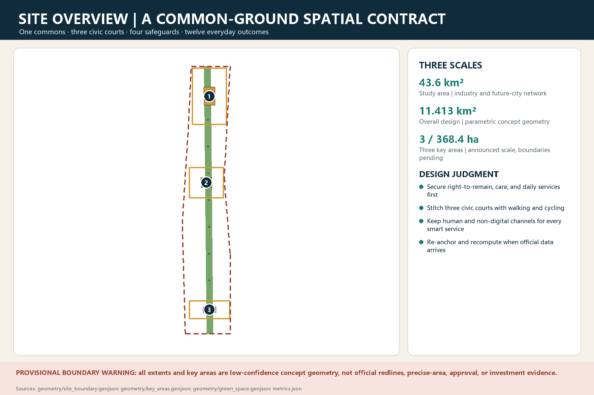
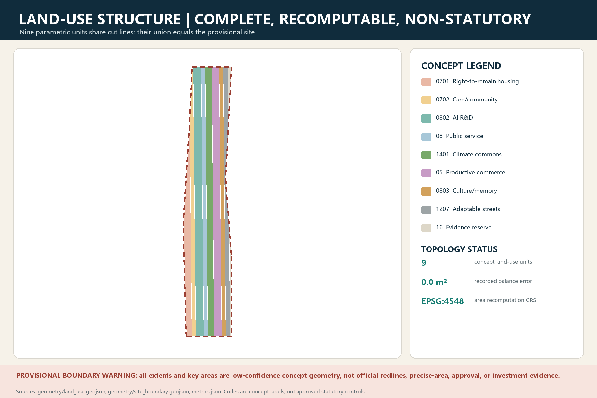
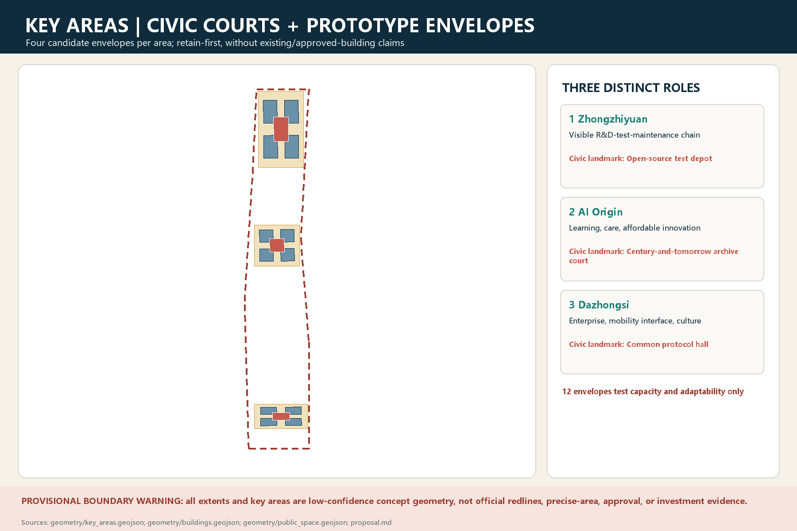
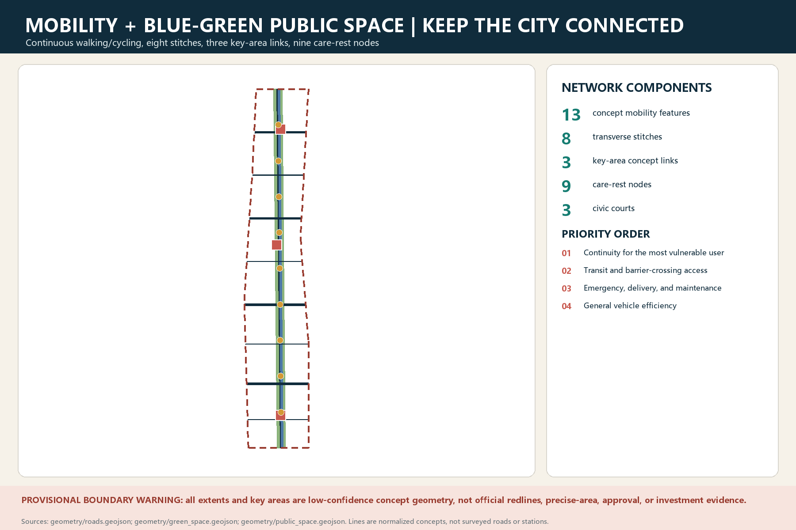
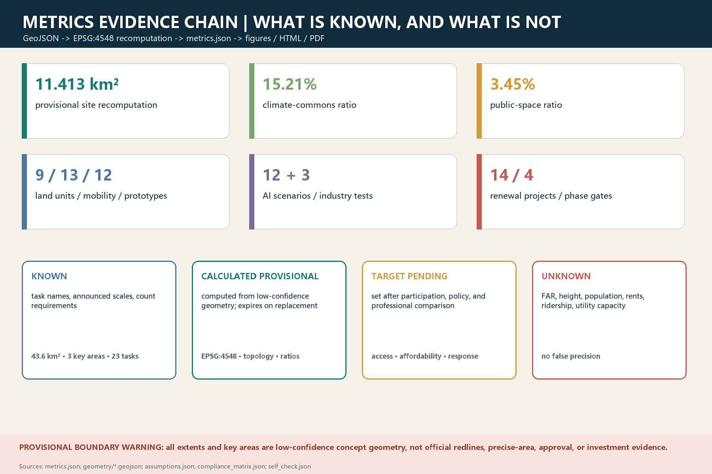

# Jing-Zhang Common Ground: Stay, Connect, Correct

## Design Basis and Source List

The proposal's first design act is not to draw a masterplan that appears more precise than the evidence. It is to separate evidence into three tiers: facts, assumptions, and unknowns. The **fact tier** accepts only what the open-call announcement, Agent Taskbook, site package, and traceable public sources establish: the coordinated research area is approximately 43.6 square kilometres; the overall design area is approximately 11.4 square kilometres; and the three key areas together cover approximately 368.4 hectares. Zhongzhiyuan, Beijing AI Origin Community, and Dazhongsi require distinct responses, while a continuous green system, mobility and walkability, the industrial ecosystem, public services, and urban renewal are all formal tasks. These figures describe the working scale in the task context. They do not mean that this proposal possesses statutory boundaries suitable for surveying, ownership, or approval decisions. [source:AGENT-TASKBOOK] [source:SITE-PACKAGE] [metric:study_area_km2]

The **assumption tier** contains replaceable working models: `geometry/site_boundary.geojson`, provisional key-area polygons, a conceptual structural axis, provisional civic-court anchors, and network tests. GitHub Issue #846 reports zero overlap and a nearest distance of approximately 412.5 metres between the provisional overall boundary and a Jing-Zhang Railway Heritage Park object on a public basemap. That finding proves neither that the provisional boundary is wrong nor that the public object is complete, but it is sufficient to reject the practice of overlaying the two and treating the result as a precise site. Issue #1029 questions the positioning and spatial interpretation of Dazhongsi, further demonstrating that a key-area name cannot substitute for an official polygon, current cadastral information, or implementation rights. This draft therefore uses provisional boundaries only for content review, structural relationship tests, and package validation, displaying them with faint dashed lines. Once official vectors arrive, every area, intersection, station walkshed, project anchor, and drawing must be recalculated. [source:ISSUE-846-BOUNDARY-MISMATCH] [source:ISSUE-1029-DAZHONGSI-POSITIONING] [data:geometry/site_boundary.geojson#SITE-001]

The **unknown tier** includes the official three-level boundaries and coordinate reference system; existing buildings and ownership; regulatory-plan land use, FAR, and height; rail entrances and ridership; road redlines; municipal capacity; heritage-protection limits; measured trees, drainage, and stormwater conditions; resident and employment populations; rents; and displacement effects. These unknowns are not concealed inside “technical parameters.” They are registered as triggers: without ownership information there is no demolition claim; without municipal verification there is no capacity claim; without ridership there is no promised TOD intensity; and without a tree survey there is no relocation prescription. `sources.json`, `assumptions.json`, `metrics.json`, and the three matrices provide machine review, while the prose explains how constraints change the design. If geometry, numbers, matrices, prose, and images conflict, the evidence chain—GeoJSON, metrics, matrices, schedules, prose, then images—governs. An atmospheric image cannot overrule data. [standard:MOHURD-URBAN-DESIGN-MEASURES] [standard:MNR-LAND-USE-CLASSIFICATION-GUIDE] [depth:metrics_recalculation]

## Three-Level Scope Framework

The three levels are not the same drawing enlarged three times; they are three distinct scales of decision. The approximately 43.6-square-kilometre **coordinated research area** asks how the Jing-Zhang corridor can form an open AI innovation ecosystem and cross-district collaboration. Its outputs are the interdependent networks of industry, talent, public services, and events. The approximately 11.4-square-kilometre **overall design area** asks how renewal, transport, blue-green systems, and innovation facilities can jointly produce a walkable everyday city. Its outputs are a structure, concept land use, network tests, a project portfolio, and phasing. The three **key areas** ask how the first visible, usable, and assessable spaces can be delivered. Their outputs are building prototypes, civic courts, street sections, operating scripts, and stop rules. Key-area areas remain task-package working magnitudes and become precise, citable values only after official vectors arrive and are recalculated in EPSG:4548. [source:SITE-PACKAGE] [metric:overall_design_area_km2] [depth:three_level_scope_framework]

Thought precedes form. Five international urban traditions compete openly in this project instead of being blended into a contradiction-free slogan. The first is Jacobs–Gehl's “everyday streets and public life.” Its strength is mixed use, fine grain, and visible populations; its risk is underestimating the regional scale of industry and infrastructure. The second is McHarg's “ecological process before development.” Its strength is making water, heat, soil, and habitat the foundation; its risk is false scientific precision when ecological layers are incomplete. The third is the Calthorpe–ITDP idea of “compact, polycentric, transit-oriented development.” Its strength is reducing car dependence; its risk is turning TOD into a property-value device when ridership, station access, and affordability mechanisms are missing. [source:PHILOSOPHY-A-JACOBS-PUBLIC-LIFE] [source:PHILOSOPHY-B-MCHARG-ECOLOGICAL-OVERLAY] [source:PHILOSOPHY-C-ITDP-TOD-STANDARD]

The fourth is the Fainstein–Aravena idea of a “just city and incremental renewal.” Its strength is bringing the right to remain, care, rent, and incremental improvement into design; without fiscal and property tools, however, its promises may be impossible to fulfil. The fifth is Ostrom-inspired “commons and correctable governance.” Its strength is writing rules, monitoring, appeal, and exit directly into the system; its risk is that procedure may slow urgent action. Each tradition is translated into testable principles, prohibited moves, benefits and burdens, critical assumptions, and abandonment conditions. The proposal does not simulate a master's personality or treat a historical case as evidence of present site conditions. [source:PHILOSOPHY-D-ARAVENA-INCREMENTAL-HOUSING] [source:PHILOSOPHY-E-OSTROM-COMMONS-GOVERNANCE] [depth:overall_spatial_structure]

The collision of the five traditions produces a hierarchical synthesis rather than an equal blend. Level one is a non-negotiable ethical floor: existing residents and ordinary workers retain the right to use the city, and automation cannot remove human service or appeal. Level two is the ecological and public-space base: continuity, shade, infiltration, and everyday access come before iconic buildings. Level three contains mobility and form tools: stations, walking, cycling, and mixed use trigger intensity only when real data support them. Level four is AI operations: AI may observe, assist, and support review, but it cannot decide housing eligibility, law-enforcement penalties, or medical conclusions. If later evidence shows that a tradition causes exclusion, cannot be maintained, or concentrates benefits excessively, the corresponding spatial action is withdrawn rather than protected as a “master concept.” [source:AGENT-TASKBOOK] [standard:MOHURD-URBAN-DESIGN-MEASURES] [depth:risk_missing_data]

## Coordinated Research Area: Industry and Future City Research

Eight global cases form a comparative library of success, correction, and failure—not a catalogue of renderings to copy. Cambridge's Kendall Square shows that research growth must bind itself to housing, public space, transport, and start-up space. The second round of planning for Barcelona's 22@ shows that industrial heritage and innovation industries do not automatically deliver housing or community equity. [source:CASE-KENDALL-SQUARE] [source:CASE-BARCELONA-22AT] [depth:existing_conditions_diagnosis]

Singapore's one-north demonstrates the long-term capacity of public institutions to organize a chain of computing, testing, incubation, pilot production, housing, and services, but its land and housing systems cannot simply be transplanted. The London Knowledge Quarter offers a more transferable lightweight alliance: existing universities, cultural institutions, hospitals, businesses, and communities form a knowledge network through member obligations and shared facilities rather than relocating into a closed campus. [source:CASE-SINGAPORE-ONE-NORTH] [source:CASE-LONDON-KNOWLEDGE-QUARTER] [depth:overall_spatial_structure]

Paris-Saclay warns that concentrating research institutions before transport, student housing, and cross-institutional governance are ready can turn a “cluster” into an everyday burden. The cancellation of Toronto Quayside elevates data minimization, public authorization, vendor boundaries, and exit mechanisms from technical appendices to conditions for the project to exist. [source:CASE-PARIS-SACLAY] [source:CASE-TORONTO-QUAYSIDE] [depth:risk_missing_data]

Seoul Digital Media City is useful for its combination of brownfield ecological repair, digital cultural production, and accessible-transport trials, not for the number of companies it hosts. Helsinki Kalasatama is most valuable for small, agile three-to-six-month pilots, residents' participation in defining problems, and the public archiving of failures. Together, the eight cases show that building technology real estate first and repairing urban life later is the costliest possible sequence for an innovation district. [source:CASE-SEOUL-DMC] [source:CASE-HELSINKI-KALASATAMA] [depth:phasing_implementation]

The shared conclusion is that an AI innovation belt does not become competitive by “putting every AI company in a park.” Its advantage comes from compounding low-cost experimentation, shared equipment across institutions, accessible public space, trustworthy data rules, and everyday-life safeguards. The proposal names the identity “Jing-Zhang Common Ground.” The graphic language is not a robot avatar but two paths that can meet and separate: one represents a century of railway and urban memory; the other represents a digital system that can be rolled back. The blank at their intersection indicates that public decisions remain human. The name and identity are open-source concepts only; fonts, the logo, and derivatives require copyright, trademark, and accessibility review before formal communication. [source:OFFICIAL-ANNOUNCEMENT] [depth:overall_spatial_structure]

Industrial space follows a collaborative loop of **shared base—specialized nodes—urban interfaces**. The shared base includes computing-resource booking, compliance sandboxes, test records, intellectual-property support, and procurement advice. Specialized nodes give the three key areas distinct emphases in research translation, community application, and enterprise collaboration. Urban interfaces turn transport, healthcare, education, law, care, and public space into auditable real-world settings. Enterprises do not only receive incentives and space; they make public returns by opening equipment for defined periods, disclosing an algorithm's scope, maintaining human channels for affected people, and supporting independent evaluation. The proposed international-event system includes an annual Common Ground Week, quarterly open test days, monthly maintenance night schools, and a continuous public route. Their budgets, hosts, and approvals remain development proposals rather than claimed government arrangements. [source:AGENT-TASKBOOK] [metric:ai_scenario_count] [depth:overall_spatial_structure]

## Overall Design Area: Urban Renewal and Regulatory-Plan-Level Urban Design

The overall structure is **one common ground, three civic courts, four safety nets, and twelve forms of everyday life**. `GREEN-SPINE` is not a single landscape belt but a public interface where heritage narratives, walking and cycling, shade and stormwater, innovation displays, and community services may overlap. `COURT-N/C/S` correspond respectively to northern testing and manufacturing, central community learning and origin narratives, and southern enterprise collaboration and cultural exchange. The four safety nets cover affordable space; care and health; accessibility and night mobility; and data rights plus human service. Chapter nine turns the twelve forms of everyday life into observable daily actions. The structure does not rely on absolute coordinates in a provisional boundary: when the official boundary replaces it, relationships—connection, service radius, public reachability, and rollback interfaces—are preserved first, and coordinates are then re-anchored. [data:geometry/green_space.geojson#GREEN-CLIMATE-COMMONS] [data:geometry/public_space.geojson#PUBLIC-COURT-02] [depth:overall_spatial_structure]

Urban renewal does not default to “demolish and rebuild, then inject innovation.” It follows a sequence of retain, repair, add, and replace. First identify housing, small businesses, schools, health services, industrial heritage, and mature trees that are still in use. Then test whether minor interventions can improve safety, energy performance, accessibility, and mixed use. Replacement is discussed only after structural safety, public benefit, relocation arrangements, and whole-life carbon have been compared. Renewal units are tested through five-to-ten-minute walking relationships, real crossing times over barriers, and service visibility; the proposal does not assume blocks must be consolidated. `LU-01…` denotes parametric functional units describing mix, public interfaces, and time requirements, not approved parcels. `PROTO-*` denotes prototype families with open ground floors, divisible tenancies, shared equipment, and reversible construction, not permit-stage buildings. [source:SITE-PACKAGE] [data:geometry/land_use.geojson#LU-RESIDENTIAL] [depth:retain_renovate_demolish]

At this stage, regulatory-plan-level depth means stating what must be controlled, how it must be verified, and what cannot be set without missing inputs. Controls include continuous public passage; active, publicly accessible ground-floor interfaces; views to heritage; fire and emergency access; trees and infiltration space; loading-cycle conflicts; long-term affordable-use covenants; and physical shutdown, human takeover, and data-minimization interfaces for AI equipment. Parcel boundaries, total floor area, FAR, height zones, road redlines, municipal connections, demolition quantities, and delivery bodies require official evidence. Three-dimensional massing is used only to compare sunlight, wind, access, and views across alternatives; no version is described as a settled plan. [standard:MOHURD-URBAN-DESIGN-MEASURES] [standard:MNR-LAND-USE-CLASSIFICATION-GUIDE] [depth:development_intensity_controls]

Public value is tested through distribution: who receives time, space, and safety, and who bears noise, rent, data exposure, and maintenance work? Each renewal project must identify beneficiaries, affected parties, compensation or alternatives, responsible bodies, and exit routes. If innovation space grows by displacing repair shops, affordable food, night-shift rest, or children's activity, it is not counted as a net improvement. If AI improves average movement while denying service to people without smartphones, the scenario fails the design gate. The overall design is therefore not an end-state blueprint, but a set of spatial agreements that public evidence can progressively confirm or reject. [source:OFFICIAL-ANNOUNCEMENT] [metric:public_benefit_coverage] [depth:risk_missing_data]

## Detailed Design of Key Areas

The three key areas share the same public floor but do not copy a single science-park image. **Zhongzhiyuan AI Independent-Innovation Accelerator** provisionally centres on `COURT-N` and is positioned as a “visible research—pilot production—maintenance chain.” `PROTO-N01…N04` respectively represent shared laboratories, flexible pilot production, maintenance training, and short-term team space. Building interventions first insert equipment boxes, public stairs, and visible maintenance galleries into adaptable existing structures, while heavy logistics and visitor walking use different faces and times. The civic court connects food, rest, worker changing facilities, and developer displays so the test district contains workers, not only visitors. Detailed design must wait for verified industrial uses, hazardous-material constraints, noise, freight, and fire conditions. Pilot-production capacity and building scale remain pending. [data:geometry/key_areas.geojson#PROV-KEY-001] [data:geometry/buildings.geojson#BLDG-K1-01] [depth:three_key_area_detailed_design]

**Beijing AI Origin Community** provisionally centres on `COURT-C` and is positioned as a learning district where research history meets residents' daily life. `PROTO-C01…C04` represent a community learning room, an affordable innovation workshop, a health-and-care station, and short-stay prototypes for younger and visiting populations. They surround pass-through ground floors and small courts, but decisions to retain or add buildings must await an existing-condition survey. The area prioritizes scenarios for older people, children, disabled people, and renters. It includes a service desk, paper instructions, and human booking that do not require scanning a code. Public life starts with shade, seats, drinking water, toilets, quiet corners, and devices that can be turned off—not continuous screens. [data:geometry/key_areas.geojson#PROV-KEY-002] [data:geometry/buildings.geojson#BLDG-K2-01] [depth:three_key_area_detailed_design]

**Dazhongsi AI Industry Cluster** provisionally centres on `COURT-S` and is positioned as an urban foyer for enterprise collaboration, interchange, and cultural display. `PROTO-S01…S04` represent shared meeting and legal services, enterprise demonstration and testing interfaces, neighbourhood commerce, and cultural studios. In response to Issue #1029, the proposal does not infer a boundary from a name or depict any landmark, station entrance, or temple relationship as confirmed. Until the official polygon, heritage limits, and station entrances arrive, it tests only the connection grammar of foyer—side street—civic court—common ground. The principal southern risk is high-value business space squeezing out daily services. Each phase therefore secures public passage, affordable services, and accessible connections before releasing space for display or investment attraction. [data:geometry/key_areas.geojson#PROV-KEY-003] [data:geometry/buildings.geojson#BLDG-K3-01] [depth:three_key_area_detailed_design]

Seven delivery rules apply to all three civic courts: public rights throughout the day do not depend on purchase; at least one service chain remains phone-free and identification-free; installations that occupy land must be removable; every enterprise scenario has a visible responsibility notice and human contact; night events have noise and lighting stop conditions; evaluation includes cleaners, security staff, maintainers, delivery workers, and other frontline workers; and new boundary, ownership, or heritage evidence may trigger complete re-anchoring. “Detailed design” in the three key areas therefore means verifiable, directional prototypes—not regulatory approval, building permission, or an expropriation decision. [source:SITE-PACKAGE] [standard:MOHURD-URBAN-DESIGN-MEASURES] [depth:three_key_area_detailed_design]

## AI Innovation Ecosystem, Personas, and AI+ Scenarios

Eight personas test whether innovation becomes a civic capability rather than a service for a narrow class of “talent.” P1, an older local resident, needs legible guidance, nearby care, and services that work offline. P2, a young renting household, needs rent stability, childcare, quiet, and a safe school route. P3, a night-shift cleaner, guard, food worker, or courier, needs night transport, rest and changing facilities, and protection from arbitrary algorithmic scoring. P4, a wheelchair user, blind or low-vision person, or temporarily mobility-impaired person, needs continuous accessibility rather than an isolated ramp. P5, a researcher, needs shared equipment, compliant data, and affordable living. P6, a start-up or small local business, needs short-term space, shared legal help, and transparent procurement. P7, a student, developer, or international visitor, needs learning, exchange, and multilingual wayfinding. P8, a maintenance, municipal, or emergency worker, needs equipment access, graceful degradation, clear responsibility, and drills. These are not marketing profiles; real interviews must correct them. [source:AGENT-TASKBOOK] [metric:persona_count] [depth:existing_conditions_diagnosis]

The twelve scenario cards use one responsibility template: **context anchor | problem | spatial action | AI and non-AI alternative | data and privacy | human review, appeal, and rollback | KPI | stop condition | evidence status**. The first three, marked `T`, are industrial test-and-validation scenarios. The others support everyday urban life. All remain concepts for co-design, not systems already procured or deployed. [standard:PROJECT-AGENT-OPEN-CALL-TASKBOOK] [metric:ai_scenario_count] [depth:overall_spatial_structure]

1. **T01 Open Edge-Intelligence Test Corridor** | Anchor: `COURT-N` and `PROTO-N01`. Problem: algorithms lack safe validation as they leave laboratories and enter streets. Spatial action: a graded test strip that can be enclosed and powered down. AI: devices detect anomalies and create test logs; the non-AI alternative is a human observation sheet and physical markings. Data/privacy: device state and anonymized events only, with no face database. Human review/appeal/rollback: a safety officer authorizes tests; the public can report harm; amber reduces speed and red cuts power and removes the test. KPI: zero injuries, anomaly-closure time, and successful human takeover. Stop: injury, out-of-scope collection, or unexplained false alarms in two successive rounds. Evidence: space is provisional and industry demand awaits interviews. [data:geometry/buildings.geojson#BLDG-K1-01] [depth:three_key_area_detailed_design]

2. **T02 Double-Blind Medical AI Validation Station** | Anchor: `PROTO-C03`. Problem: medical algorithms lack realistic but compliant validation interfaces. Spatial action: a simulated assessment room that does not provide direct diagnosis, with a public explanation desk. AI: produces an assistive opinion on de-identified samples; the non-AI alternative is independent review by clinical experts. Data/privacy: a minimum dataset under ethics authorization, processed locally and deleted on expiry. Human review/appeal/rollback: doctors retain final authority; participants may withdraw authorization; anomalous outcomes stop the model immediately. KPI: subgroup error, intelligibility of explanations, and withdrawal completion time. Stop: bias above threshold, incomplete consent, or data leakage. Evidence: hospital, ethics, and regulatory partners are required and currently unknown. [source:AGENT-TASKBOOK] [depth:three_key_area_detailed_design]

3. **T03 Embodied-Robot Urban-Interface Test Ground** | Anchor: reversible hardscape at `COURT-S`. Problem: delivery and inspection robots conflict with pedestrians. Spatial action: movable barriers, a low-speed loop, and staffed handover points. AI: path planning and obstacle perception; the non-AI alternative is a handcart and fixed delivery windows. Data/privacy: device routes and events are retained, but identifiable imagery is not stored long-term. Human review/appeal/rollback: an on-site supervisor has an emergency stop; affected people can inspect an incident ticket; failed trials return behind the barrier. KPI: near misses, yielding rate, and human-takeover time. Stop: collision, recording without consent, or obstruction of an accessible path. Evidence: equipment type and applicable regulation remain pending. [data:geometry/buildings.geojson#BLDG-K3-02] [depth:three_key_area_detailed_design]

4. **S04 Accessible Crossing Watch** | Anchor: `CROSS-01…`. Problem: crossing waits and audible/visual cues are discontinuous. Spatial action: first provide refuges, curb ramps, tactile paving, and audible cues, then add sensing. AI: recommends extending green time from anonymous counts; the non-AI alternative is a push button and fixed extension. Data/privacy: edge processing retains only aggregate flow. Human review/appeal/rollback: traffic staff confirm changes; on-site telephone and paper appeals remain available; faults revert to fixed timings. KPI: actual crossing time, failed crossings, and disabled-user satisfaction. Stop: missed detection creates danger or the fixed button becomes unusable. Evidence: junction and signal ownership await official confirmation. [data:geometry/roads.geojson#ROAD-STITCH-01] [depth:traffic_rail_slow_parking]

5. **S05 Safe Night-Shift Route Home** | Anchor: `MOVE-SPINE` and the three civic courts. Problem: broken night interchange, lighting, and help points. Spatial action: a continuous walking route with moderate, graded light, night waiting points, water, and human staffing. AI: predicts crowding and equipment faults; the non-AI alternative is fixed services, patrols, and a physical help bell. Data/privacy: aggregated passenger flow only, with no personal performance data. Human review/appeal/rollback: night-shift representatives join monthly reviews and can report unsafe locations; poor predictions revert to fixed dispatch. KPI: completed night connections, help response, and lighting-fault duration. Stop: oppressive surveillance or algorithmic reduction of scheduled service. Evidence: schedules and night flows require survey. [data:geometry/roads.geojson#ROAD-COMMONS-WALK] [depth:risk_missing_data]

6. **S06 Affordable-Space Matching Desk** | Anchor: `PROTO-C02/S01`. Problem: small teams and neighbourhood businesses cannot secure stable space. Spatial action: divisible short-term units and an offline application counter. AI: assists in matching area, time, and equipment; the non-AI alternative is a public list and human lottery. Data/privacy: unrelated credit and social relationships are not collected. Human review/appeal/rollback: a committee reviews results and applicants may appeal; discrimination suspends the model and triggers a new allocation. KPI: rent burden, renewal rate, and access across groups. Stop: unequal treatment, opaque ranking, or rents above the constraint. Evidence: ownership, costs, and quota policy are unknown. [data:geometry/buildings.geojson#BLDG-K2-02] [depth:risk_missing_data]

7. **S07 Fifteen-Minute Care Relay** | Anchor: `PROTO-C03` and the community walking network. Problem: service information for older people, children, and carers is fragmented. Spatial action: combine consultation, short respite, aid lending, and referrals. AI: supports booking and resource prompts only; the non-AI alternative is telephone, paper cards, and a counter. Data/privacy: health information uses tiered authorization and cannot be used for marketing. Human review/appeal/rollback: social workers confirm referrals; residents can correct and delete records; failure restores paper logs. KPI: completed referrals, waits, and offline completion. Stop: incorrect health advice or authorization breach. Evidence: real service supply requires validation by residents and subdistrict authorities. [data:geometry/buildings.geojson#BLDG-K2-03] [depth:municipal_new_infrastructure]

8. **S08 Safe Active-Travel Zone for Children** | Anchor: `MOVE-CYCLE` and schools awaiting verification. Problem: school-drop-off vehicles, cycling, and walking conflict. Spatial action: time-limited streets, continuous footways, and parent waiting corners. AI: anonymously identifies conflict hotspots; the non-AI alternative is school-crossing staff and field observation. Data/privacy: no faces or child trajectories. Human review/appeal/rollback: schools, parents, and traffic authorities review together; residents may appeal noise and detours; a failed approach reverts to human management. KPI: conflicts, independent walking, and detour burden. Stop: child-privacy risk or increased crashes on adjacent streets. Evidence: school locations and traffic counts are unknown. [data:geometry/roads.geojson#ROAD-COMMONS-CYCLE] [depth:traffic_rail_slow_parking]

9. **S09 Heat-and-Rain Comfort Route** | Anchor: `GREEN-SPINE`. Problem: public space fails during extreme heat and heavy rain. Spatial action: continuous shade, identifiable rain shelters, and reversible rain-garden test segments. AI: short-term warning and maintenance prompts; the non-AI alternative is thermometers, rain gauges, and manual inspection. Data/privacy: environmental data only. Human review/appeal/rollback: landscape staff and the community review together; standing-water or mosquito complaints trigger modification; failed installations are removed. KPI: shade continuity, comfort surveys, and standing-water drawdown time. Stop: obstructed drainage, tree harm, or unaffordable maintenance. Evidence: measured microclimate, soil, and drainage-network data are missing. [data:geometry/green_space.geojson#GREEN-CLIMATE-COMMONS] [depth:blue_green_public_space]

10. **S10 Centennial Jing-Zhang Memory Walk** | Anchor: the common ground and heritage points awaiting verification. Problem: technology displays obscure history. Spatial action: combine artefacts, oral history, quiet pauses, and a digital layer that can be switched off. AI: assists interest-based search; the non-AI alternative is a paper map, human guide, and physical plaque. Data/privacy: anonymous use, with no emotion profiling. Human review/appeal/rollback: experts and communities jointly review history; errors can be publicly corrected; the narrative remains complete with devices off. KPI: traceable sources, device-free access, and community contributions. Stop: historical error, unclear copyright, or displacement by commercial advertising. Evidence: heritage limits and source permissions await verification. [source:OFFICIAL-ANNOUNCEMENT] [depth:height_massing_character]

11. **S11 Negotiated Curb-Logistics Windows** | Anchor: service streets in the three key areas. Problem: loading, food delivery, cycling, and fire access compete for the curb. Spatial action: variable signs, consolidated handover points, and human-priority zones. AI: forecasts demand and recommends windows; the non-AI alternative is a fixed window and on-site manager. Data/privacy: platforms do not receive individual courier rankings. Human review/appeal/rollback: couriers, businesses, and fire services review monthly; temporary needs can be requested manually; a failed system returns to fixed rules. KPI: curb occupation, conflicts, and delivery wait. Stop: transferring costs to couriers or blocking emergency access. Evidence: observed logistics volume is pending. [data:geometry/roads.geojson#ROAD-KEY-CONNECT-03] [depth:traffic_rail_slow_parking]

12. **S12 Public-Decision Receipt Desk** | Anchor: `COURT-N/C/S`. Problem: public comments enter a black box and cannot be tracked. Spatial action: pair an offline counter with a public issue wall. AI: clusters comments and flags groups that may be missing; the non-AI alternative is manual coding and public meetings. Data/privacy: minimum identity, segregated sensitive comments, and anonymous submission. Human review/appeal/rollback: staff issue receipts; submitters may appeal classification; all model output can be discarded and reviewed again. KPI: response rate, handling time, underrepresented-group coverage, and correction rate. Stop: automatic rejection, identity leakage, or disappearance of human responsibility. Evidence: the governing body and statutory procedure require negotiation. [data:geometry/public_space.geojson#PUBLIC-COURT-02] [depth:risk_missing_data]

## Land Use, Building Scale, and Retain-Renovate-Demolish Strategy

This stage establishes only **parametric concept zoning plus formal-data-triggered re-anchoring**; it does not impersonate a regulatory plan. `LU-01…` expresses the site as relational functional units. Innovation production, shared research, community life, public services, cultural heritage, blue-green open space, transport, and utilities can be recorded as primary, compatible, or prohibited, together with public-ground-floor, opening-time, noise/freight, reversibility, and affordability constraints. Concept zoning tests whether necessary functions are adjacent, conflicts are separated, and public paths are continuous. It does not assign statutory land-use codes or claim approved areas and shares. Once official site and key-area polygons, existing land use, and road redlines arrive, a complete, non-overlapping, gap-free land-use partition must be rebuilt in a local projected CRS, and all metrics and drawings updated. [data:geometry/land_use.geojson#LU-RESIDENTIAL] [metric:land_use_area_sum] [depth:land_use_layout]

Twelve prototype families—`PROTO-N01…N04/C01…C04/S01…S04`—test adaptability rather than fix an architectural form. Shared parameters ask whether buildings can be divided into different tenancy sizes, whether ground floors can open outside office hours, whether services can be renewed separately from structure, whether options for natural light and ventilation have been compared, whether cleaning and maintenance have a safe back-of-house route, and whether roofs satisfy fire and equipment needs before public use is considered. Northern prototypes emphasize heavy loads, laboratory safety, and visible maintenance; central prototypes emphasize fine-grained mixing, care, and affordable space; southern prototypes emphasize shared meetings, cultural exchange, and transport interfaces. Building footprints in the model are test boxes only and cannot be used to calculate approved floor area. [data:geometry/buildings.geojson#BLDG-K1-01] [data:geometry/buildings.geojson#BLDG-K2-01] [depth:height_massing_character]

Retain, renovate, and demolish decisions pass through **evidence gates**, not colours drawn first. The retain gate requires an existing-building survey, structural safety, and use value. The repair gate requires comparisons of energy, accessibility, fire safety, and operating cost. The addition gate requires sunlight, wind, fire, municipal, and ownership clearance. The replacement gate also requires displacement effects, historical value, and whole-life carbon. Without this evidence, drawings cannot show a “demolition quantity,” “new-build quantity,” or a specific addressed property. Even if replacement later proves necessary, the process must first provide in-situ return, temporary business continuity, rent protection, and construction-period accessibility, with affected people participating in review. [source:SITE-PACKAGE] [standard:MOHURD-URBAN-DESIGN-MEASURES] [depth:retain_renovate_demolish]

FAR, building height, total floor area, residential/industrial share, and parking standards are currently **unknown** or **target pending**. Formal data trigger the next sequence: verify coordinates, boundaries, and ownership; import existing buildings, regulatory controls, and heritage limits; recalculate footprints and areas; construct at least three capacity scenarios; compare sunlight, wind, transport, municipal systems, fire, public services, and distributional effects; then let competent authorities and public procedures select. A scenario is abandoned if it can exist only through large-scale displacement, overloaded infrastructure, or removal of public space. AI industry goals do not exempt it. [metric:building_footprint_area_sqm] [standard:MNR-LAND-USE-CLASSIFICATION-GUIDE] [depth:development_intensity_controls]

## Transport, Rail, Municipal Infrastructure, and Public Services

Mobility repairs the network before discussing intensity. `MOVE-SPINE` is a connection grammar for walking and public transport along the common ground. `MOVE-CYCLE` is a continuous cycling backbone coordinated with fast walking and children's routes. `CROSS-01…` identifies crossings awaiting field verification. Each point first surveys real gates, walls, slopes, signals, spaces under bridges, and night-time perceptions, then proposes a low-cost test segment. Without official road redlines and counts, the proposal neither moves junctions nor promises lane numbers. Evaluation prioritizes continuity for the most vulnerable user, public-transport interchange, emergency access and deliveries, and only then general motor-vehicle efficiency, preventing a rise in “average speed” from hiding pedestrian risk. [data:geometry/roads.geojson#ROAD-COMMONS-WALK] [data:geometry/roads.geojson#ROAD-STITCH-01] [depth:traffic_rail_slow_parking]

TOD is a conditional test. Mixing and intensity gradients around stations are considered only when station entrances, services and ridership, the real ten-minute walking network, development capacity, affordable housing, and public-service capacity can all be verified. A circular walkshed cannot cross a railway, wall, or express road that people cannot actually cross. Any density increase must bind itself to public passage, affordable space, and school and care capacity. If policy tools cannot offset rising rents, congestion, or public-service deficits, the design retains current intensity or uses distributed renewal. Rail alignment, station hierarchy, forecast demand, and interchange arrangements remain undecided. [source:SITE-PACKAGE] [source:PHILOSOPHY-C-ITDP-TOD-STANDARD] [depth:traffic_rail_slow_parking]

Municipal and new infrastructure follows a **dual-channel, graceful-degradation** rule. Water, drainage, fire protection, electricity, gas, and waste systems remain independent and manually operable. Edge computing, sensors, and digital platforms may add service but cannot become a single point of failure for basic provision. The three civic courts reserve accessible equipment zones and maintenance windows that do not disrupt public use. Digital equipment has a physical power cutoff, log export, and decommissioning interface. Computing scale, energy load, stormwater and wastewater capacity, waste volumes, and emergency reserves all require formal load and network checks. This proposal does not report invented capacity. [source:SITE-PACKAGE] [depth:municipal_new_infrastructure]

Public services are reviewed by whether the eight personas can genuinely reach a place and complete a task, not by checking a radius on a map. Care, health, childcare, culture, sport, legal services, talent support, and small-business support may share space at different times, but healthcare, children's services, and private consultations require separation. Whether a facility is new depends on actual supply and population forecasts. While those are unknown, the proposal first tests longer opening hours, shared booking, mobile services, and existing-building adaptation. Every digital platform retains telephone, counter, paper, and in-person guidance; a smartphone is not a ticket to public service. [data:geometry/buildings.geojson#BLDG-K2-03] [metric:service_accessibility] [depth:municipal_new_infrastructure]

This is a design commitment to continuous accessibility. The on-site guidance and human handling in Article 39 of the Barrier-Free Environment Construction Law are read only for the listed medical, social-security, financial, utility-payment, and related services, not generalized into an identical statutory duty for every space. State Council General Office Document No. 45 of 2020 is used as a policy precedent for parallel traditional and smart services; its 2020–2022 milestones are not represented as a binding 2026 project commitment. [standard:BARRIER-FREE-ENVIRONMENT-LAW] [standard:ELDERLY-SMART-TECH-PLAN-2020-45]

## Blue-Green Network, Public Space, and Urban Character

`GREEN-SPINE` is the shared base for ecology and public life. Because of the boundary mismatch reported in Issue #846, however, it is first a **principle of connection**, not a traced official boundary for the Jing-Zhang Railway Heritage Park. Until official park, watercourse, drainage, tree, soil, and elevation data arrive, only three types of reversible pilots proceed: movable or raised shade, removable seats, and drinking water; small comparative segments of rain garden and permeable surface; and temporary walking and cycling links across barriers. Pilots record tree health, standing water, thermal comfort, maintenance hours, and use conflicts. They do not claim proven stormwater capacity, cooling, or ecological gain. [source:ISSUE-846-BOUNDARY-MISMATCH] [data:geometry/green_space.geojson#GREEN-CLIMATE-COMMONS] [depth:blue_green_public_space]

The **twelve forms of everyday life** make spatial success visible: an older resident walking early in the morning; a child travelling independently to school; a night worker returning home safely; a cleaner or maintainer changing clothes and resting with dignity; researchers meeting across institutions at lunch; a small shop operating steadily; a young team testing in short-term space; a carer taking a brief respite; a disabled person moving without detour; someone able to stay outdoors in the rain; a visitor understanding Jing-Zhang history without a screen; and a member of the public inspecting and correcting an AI decision. These occur on the common ground, in the three civic courts, at service nodes, and on building ground floors; they do not wait for an iconic tower. Operational observation covers weekday/weekend, day/night, dry/wet, and device-on/device-off comparisons. [source:OFFICIAL-ANNOUNCEMENT] [metric:daily_life_scenario_count] [depth:blue_green_public_space]

The three **AI pilgrimage landmarks** are not giant sculptures but visible public institutions. The northern **Open-Source Test Hangar** displays failed trials, repair records, and human takeover. The central **Century and Tomorrow Archive Court** juxtaposes railway memory, residents' oral histories, and innovation history; its digital layer can be turned off while the physical layer remains complete. The southern **Common Protocol Hall** displays enterprise commitments, algorithmic limits, public receipts, and annual audits. Anchored respectively at `COURT-N/C/S`, they form a walkable learning route for developers, residents, and visitors. Their names, buildings, and exhibitions remain concepts; heritage, fire, copyright, operations, and investment require confirmation. [data:geometry/public_space.geojson#PUBLIC-COURT-01] [data:geometry/public_space.geojson#PUBLIC-COURT-03] [depth:height_massing_character]

Urban-character control does not prescribe a single “AI blue.” It establishes discipline in scale and public interfaces: old and new reveal layers of time; ground floors facing the common ground avoid long sealed walls; equipment, advertising, and signs do not obscure heritage or accessibility information; night lighting is limited by safety, energy, and residents' sleep; roofs solve equipment, fire, water, and maintenance before public use; and large masses reduce pressure through segmentation, passages, and accessible ground floors. No landmark centres a face, corporate logo, or unlicensed image. The urban language allows everyday commerce, traces of repair, and seasonal change rather than turning the corridor into a single showroom. [standard:MOHURD-URBAN-DESIGN-MEASURES] [depth:height_massing_character]

The cultural narrative follows **three parallel timelines**: the engineering and migration memory of a century of Jing-Zhang; Zhongguancun's research and entrepreneurial culture; and the contemporary history of residents and ordinary workers maintaining the city. Curatorial rules require traceable sources, the coexistence of disputed accounts, correctable errors, named or anonymous contributors, and legibility when devices are off. Annual Common Ground Week may include open-source test reviews, maintainer lectures, youth workshops, and corridor walks, but every event requires approvals for scale, transport, noise, and security. If an event displaces resident access or ordinary public space, it is reduced, rescheduled, or cancelled. [source:AGENT-TASKBOOK] [standard:PROJECT-AGENT-OPEN-CALL-TASKBOOK] [depth:overall_spatial_structure]

## Renewal Projects, Implementation Policy, and Phasing

Projects follow four phases, `PHASE-0…3`, each with an exit gate. **PHASE-0 Evidence and Agreement** completes official-boundary, existing-condition, ownership, heritage, transport, municipal, ecological, and social-impact base information and interviews the eight personas. **PHASE-1 Reversible Trials** provides only temporary connections, shade, public services, and the three industrial tests. **PHASE-2 Structural Repair** implements existing-building adaptation, missing active-travel links, civic courts, and service facilities after evidence gates pass. **PHASE-3 Conditional Addition** discusses long-life buildings, TOD intensity, and full blue-green works only then. No phase may bypass a stop condition because “early investment has already occurred.” [data:geometry/phasing.geojson#PHASE-0-EVIDENCE] [data:geometry/phasing.geojson#PHASE-3-REVIEWED-SCALE] [depth:phasing_implementation]

The first project list contains fourteen items: P01, official GIS/regulatory-plan/ownership/heritage data ingestion and coordinate audit; P02, joint surveys with residents, workers, enterprises, and maintainers; P03, a reversible `GREEN-SPINE` shade—seat—wayfinding segment; P04, `CROSS-01…` accessible-crossing diagnosis and temporary repair; P05, the `COURT-N` Open-Source Test Hangar; P06, the `COURT-C` Care and Learning Room; P07, the `COURT-S` Enterprise Common Protocol Hall; P08, an affordable innovation-space prototype; P09, the Safe Night-Shift Route Home; P10, Centennial Jing-Zhang oral history and physical markers; P11, the edge-intelligence test corridor; P12, the double-blind medical AI validation station; P13, the curb-logistics negotiation pilot; and P14, the public-decision receipt desk. The project ledger maps each to location, beneficiaries and affected people, dependencies, delivery bodies, cost band, maintenance, evidence, and stop conditions. [metric:project_count] [depth:renewal_project_list]

Policy tools also remain concept proposals: long leases and affordable-use covenants for existing space; lasting public passage in return for public investment; transparent access to shared equipment for small firms and community organizations; liability insurance, incident disclosure, and independent ethics review for test scenarios; reserved renewal revenue for maintenance, care, and rent stabilization; and rules for business continuity, temporary accommodation, and return before construction. Funding sources, percentages, competent departments, and statutory processes remain unset and require negotiation among government, rights holders, operators, and the public. They are not claimed as committed policy. [source:SITE-PACKAGE] [depth:phasing_implementation]

Long-term operations use a **hall—route—ledger—review** quartet. Each key area has a public-service hall with findable human staff; the common ground forms a physical experience route; each project maintains a public responsibility and failure ledger; and residents, workers, professionals, and operators review results quarterly. Annual Common Ground Week is not a one-off festival but the public moment for reporting scenario exits, near misses, spatial use, and distributional effects. The developer community may host open days, maintenance night schools, and international exchange. Attraction and conversion are measured by open tests, shared procurement, and improved local services, not only by signed deals. [source:AGENT-TASKBOOK] [metric:operations_review_frequency] [depth:phasing_implementation]

Delivery responsibility follows two rules: the proposer is not the approver, and the developer is not the judge. AI firms explain and repair technology; spatial operators manage on-site safety and human service; professional institutions review planning, architecture, transport, and municipal systems; independent bodies assess privacy and distributional effects; government performs approval and regulation under law; and the public holds rights to know, participate, appeal, and exit. If accountable bodies cannot be established, a project remains a concept or pilot. Automation does not fill the gap. [standard:MOHURD-URBAN-DESIGN-MEASURES] [depth:phasing_implementation]

## Metrics, Area Recalculation, and Compliance Matrix

Metrics are divided by evidence status instead of mixed into a single “completion dashboard.” **Known** covers traceable working magnitudes in task materials, such as nominal three-level areas, three key areas, and required chapter and scenario counts. These numbers describe task scale but do not prove geometry. **Calculated provisional** covers areas, lengths, overlaps, project counts, and node counts recomputed from provisional GeoJSON in EPSG:4548. Each carries a `provisional` label and expires when the boundary changes. **Target pending** covers goals to be set through shared decision-making, such as affordable-space coverage, shade continuity, accessible connections, human-service hours, and appeal response. **Unknown** covers FAR, height, total floor area, demolition, station demand, municipal capacity, stormwater performance, resident population, and rent effects where formal base data or measurement are absent. [source:SITE-PACKAGE] [metric:geometry_status] [depth:metrics_recalculation]

Core metrics seek to change decisions, not create false abundance. Spatial metrics record whether the land-use partition is complete, public paths are continuous, and the three civic courts are reachable. Equity metrics record differences in space and service access across personas, rent burden, offline completion, and night-shift coverage. Ecological metrics first record shade segments, infiltration pilots, tree health, and standing-water observations rather than presenting model outputs as measurements. Mobility metrics record crossing times, breaks, near misses, and human takeover. AI metrics test whether data minimization, human review, appeal, rollback, shutdown, and a non-AI alternative really work. Delivery metrics record project dependencies, maintenance hours, responsible people, and passage through evidence gates. [metric:green_ratio] [metric:service_accessibility] [depth:metrics_recalculation]

Area recalculation follows one chain. GeoJSON remains in EPSG:4326 for exchange and is projected to EPSG:4548 for calculations. The overall boundary and land-use units are checked for validity, gaps, overlaps, and area conservation. Roads, green networks, and public spaces use geometry-appropriate calculations. `metrics.json` references reproducible outputs instead of hand-entered numbers that conflict with geometry. Provisional rectangles or coarse polygons appear as faint constraints, not large colour fields that imply certainty. If figure numbers conflict with calculations, geometry and scripts are corrected first, then prose. Metrics are not edited to fit a layout. [data:geometry/site_boundary.geojson#SITE-001] [metric:land_use_balance_error] [depth:metrics_recalculation]

`compliance_matrix.json` asks whether each task is answered; `standard_matrix.json` asks which standards govern each judgment; and `design_depth_matrix.json` asks whether professional depth has evidence. They do not substitute for one another. A `complete` item points at minimum to prose, a layer or metric, and an inspectable result. Items constrained by missing official base data remain honestly `provisional` or `pending` rather than being labelled “confirmed” for formal completeness. All thirteen chapters retain adjacent evidence markers so human reading and machine validation trace the same claims. [standard:PROJECT-AGENT-OPEN-CALL-TASKBOOK] [metric:compliance_completion] [depth:metrics_recalculation]

## Risk, Copyright, and Compliance

The first spatial risk is false placement caused by boundary mismatch. Issues #846 and #1029 are re-anchoring triggers: once official overall, key-area, heritage, and regulatory layers arrive, a coordinate, topology, and intersection audit precedes updates to every `LU/MOVE/GREEN/COURT/PROTO/PHASE` object. Before that audit, no area, station relationship, landmark position, or project location can become a statutory or investment commitment. The second risk is distributional: industrial uplift can raise rents and displace small shops and night services. Each phase therefore discloses beneficiaries and affected people, affordability tools, and relocation effects; development is reduced if those effects cannot be remedied. [source:ISSUE-846-BOUNDARY-MISMATCH] [metric:boundary_confidence] [depth:risk_missing_data]

AI risks follow **avoid—minimize—human takeover—appeal—rollback—retire**. Facial or behavioural scoring cannot determine entry to public space, rental eligibility, employment, law enforcement, or essential service. Medical-model output cannot be treated as diagnosis. Scenario-irrelevant data cannot be collected. Trade secrecy cannot excuse a refusal to explain public effects. Every scenario has a non-AI alternative, an on-site responsible person, an incident log, a way to withdraw authorization, and stop conditions. Model recommendations disclose uncertainty, while qualified people retain responsibility for professional planning, architecture, transport, municipal, medical, and legal judgments. AI cannot be the accountable party or end an appeal by saying “the system decided.” [source:AGENT-TASKBOOK] [standard:PROJECT-AGENT-OPEN-CALL-TASKBOOK] [depth:risk_missing_data]

The Interim Measures for the Management of Generative AI Services become an applicability checkpoint only where a relevant service provides generated content to the public in China; they cannot be expanded into a blanket licensing conclusion for all urban sensing or internal research tools. Article 14 concerns unlawful content and unlawful use, not a general user right to opt out. Article 15 requires a published complaint process and feedback time limit but sets no uniform statutory number of days. Article 17's security-assessment and algorithm-filing language concerns services with public-opinion attributes or social-mobilization capacity. The proposal's non-AI fallback, appeal SLA, rollback, and retirement rules are therefore stricter project-governance proposals, not duties falsely attributed to those Measures. Applicability must be reviewed case by case against the function, provider, audience, and data flow before deployment. [standard:GENERATIVE-AI-INTERIM-MEASURES] [depth:risk_missing_data]

For copyright, this submission's text, structured data, script-generated drawings, and original graphics are provided under `COMMUNITY-DISPLAY-ONLY`. Third-party standards, papers, cases, maps, and web pages are used only through limited citation and factual sourcing; protected images, plans, and long passages are not copied. Fonts, logos, historical photographs, portraits, corporate marks, basemaps, and data all require permission checks before public exhibition or implementation. Generative AI assisted research organization, option comparison, writing, and visualization, but the submitter remains responsible for verifying facts, choices, omissions, bias, and final publication. `report/copyright_statement.md` defines the detailed boundary. [source:FORMAL-SUBMISSION-GUIDE] [depth:risk_missing_data]

The proposal is not government approval, a regulatory-plan amendment, a land-disposal decision, expropriation, an investment commitment, engineering design, or an operating procurement. Provisional geometry can support content review but not a statutory redline, precise area, or professional quantitative score. Concept buildings, events, landmarks, and policies require later procedure. Formal development requires professional review in urban planning, architecture, transport, municipal systems, landscape ecology, heritage, fire safety, data protection, law, and social impact, with participation by affected people. If critical inputs remain missing, the proposal contracts to reversible public-space and service trials rather than expanding unverified promises. [standard:MOHURD-URBAN-DESIGN-MEASURES] [depth:risk_missing_data]

## References

1. The Centennial Jing-Zhang AI Innovation Belt urban-design open-call announcement and Agent Taskbook, the primary basis for scope, tasks, and submission depth. [source:AGENT-TASKBOOK]
2. The project's `brief/site-package`, `data/source_registry.json`, and provisional-boundary notes, which define the evidence boundary between known, provisional, and missing inputs. [source:SITE-PACKAGE]
3. The Ministry of Housing and Urban-Rural Development's *Measures for the Administration of Urban Design* and the repository's professional-depth index, used to define urban-design judgment, coordination, and review responsibility. [standard:MOHURD-URBAN-DESIGN-MEASURES]
4. The Ministry of Natural Resources' land and sea use classification guidance for territorial spatial survey, planning, and use regulation, intended for later official land-use alignment; this draft does not assign statutory categories. [standard:MNR-LAND-USE-CLASSIFICATION-GUIDE]
5. Jane Jacobs, *The Death and Life of Great American Cities*; Jan Gehl, *Cities for People*. The proposal adopts lessons on everyday mixing, public life, and human scale without directly transferring their historical contexts to Beijing.
6. Ian McHarg, *Design with Nature*. The proposal adopts the principle that ecological process precedes form while limiting quantitative conclusions because measured soil, hydrology, and habitat data are absent. [depth:existing_conditions_diagnosis]
7. Peter Calthorpe's work on transit-oriented development and the ITDP *TOD Standard*. The proposal uses TOD only as a test once station, ridership, access, equity, and capacity conditions are all satisfied. [source:PHILOSOPHY-C-ITDP-TOD-STANDARD]
8. Susan Fainstein, *The Just City*; Alejandro Aravena/Elemental's incremental housing and urban projects. The proposal adopts equitable distribution and staged improvement, not their specific forms.
9. Elinor Ostrom, *Governing the Commons*. The proposal translates shared rules, monitoring, appeal, sanctions, and exit into spatial and AI operating interfaces. [depth:risk_missing_data]
10. Public institutional sources and independent reviews for Kendall Square, 22@Barcelona, one-north, London Knowledge Quarter, Paris-Saclay, Toronto Quayside, Seoul Digital Media City, and Helsinki Kalasatama, used to compare enabling conditions, corrections, and failures in innovation ecosystems. Promotional case figures are not treated as site facts. [source:CASE-TORONTO-QUAYSIDE] [source:CASE-HELSINKI-KALASATAMA] [source:CASE-BARCELONA-22AT]
11. GitHub Issue #846's review of mismatch between the provisional overall boundary and a public heritage object, and Issue #1029's question about Dazhongsi positioning, used as direct triggers for boundary re-anchoring and refusal of precise placement. [source:ISSUE-846-BOUNDARY-MISMATCH]
12. The submission's `sources.json`, `metrics.json`, `assumptions.json`, `compliance_matrix.json`, `standard_matrix.json`, and `design_depth_matrix.json`, which provide the complete machine index, recalculation method, and coverage status. This section lists only materials that materially affected design judgment rather than using bibliography length to conceal evidence gaps. [metric:source_count] [depth:metrics_recalculation]

These references are not an “authority collage.” Each remains because it changes a spatial choice, responsibility boundary, or stop condition: Jacobs and Gehl test everyday usability; McHarg tests ecological sequence; TOD tests connection and capacity; Fainstein and Aravena test who can remain; Ostrom tests how the system can be corrected; global cases test the side effects of innovation ecosystems; and official materials determine what may be anchored in geometry. Structured files hold full citations, links, permissions, access dates, and field-level provenance. If a source is withdrawn, lacks clear permission, or conflicts with new official information, the associated claim is disabled and the change is logged. [source:SOURCE-REGISTRY] [standard:PROJECT-AGENT-OPEN-CALL-TASKBOOK] [depth:risk_missing_data]
