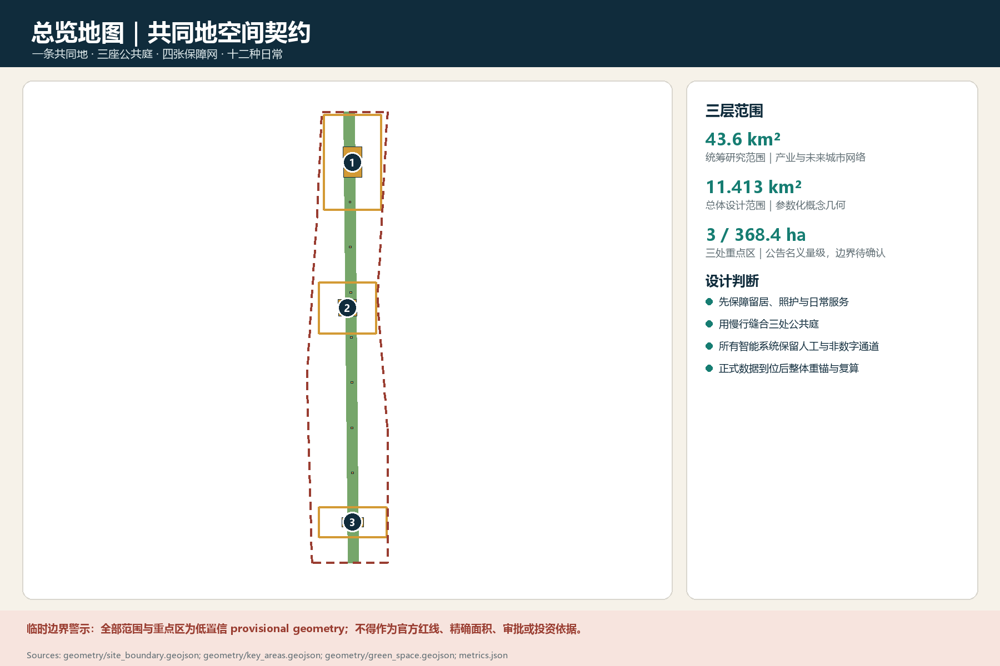
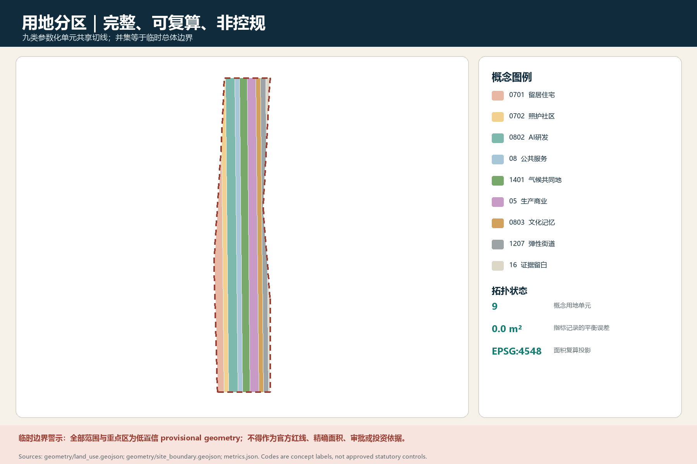
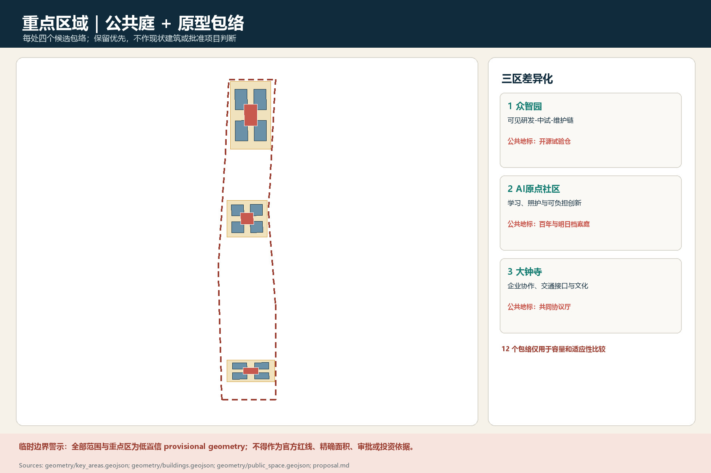
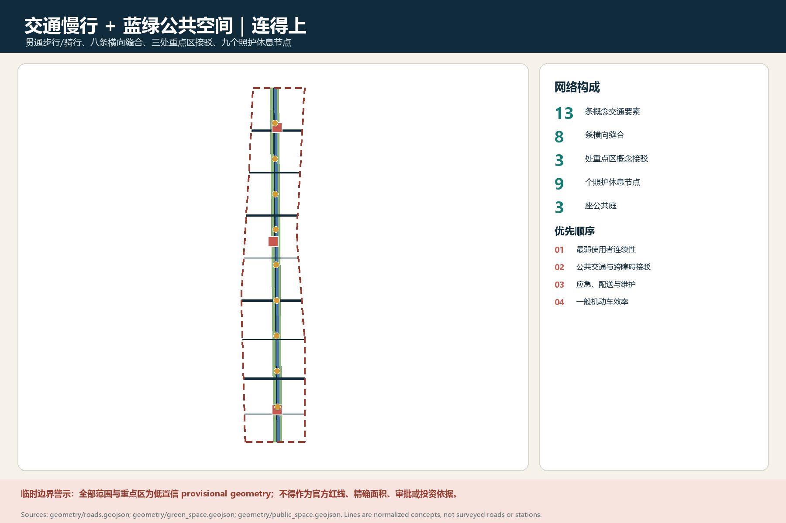
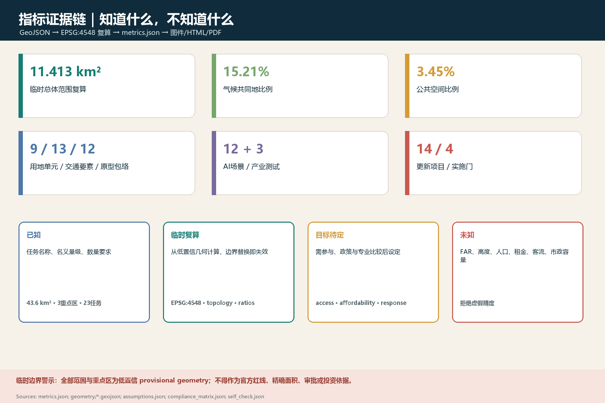

# 京张共同地：让人留得下、让城市连得上、让系统退得回

## 设计依据与资料清单

本方案的第一项设计动作不是画一张看似精确的总图，而是把证据分成“事实、假设、未知”三层。**事实层**只接纳征集公告、智能体任务书、场地资料包和可追溯公开资料已经明确的内容：统筹研究范围约 43.6 平方千米、总体设计范围约 11.4 平方千米、三个重点区域合计约 368.4 公顷；众智园、北京 AI 原点社区、大钟寺是需要分别回应的重点方向；连续绿色空间、交通慢行、产业生态、公共服务和城市更新都属于正式任务。上述数字是任务语境中的工作量级，不等于本方案已经取得可用于测绘、权属或审批的法定边界。[source:AGENT-TASKBOOK] [source:SITE-PACKAGE] [metric:study_area_km2]

**假设层**承载当前可被替换的工作模型，包括 `geometry/site_boundary.geojson` 与重点区临时多边形、概念性结构轴、公共庭落位和网络测试。GitHub Issue #846 已指出临时总体边界与公开底图中的京张遗址公园对象存在零重叠、最近距离约 412.5 米的错位；这既不能证明临时边界错误，也不能证明公开对象完整，却足以否定“把二者叠起来就当成精确场址”的做法。Issue #1029 对大钟寺定位与空间指向提出疑问，进一步说明重点区名称不能替代官方 polygon、现状地籍和实施权属。因而本稿只把临时边界用于内容审阅、结构关系测试和提交包校验，以淡色虚线表达；一旦取得正式矢量，所有面积、相交关系、站点步行圈、项目落位和图件都必须重算。[source:ISSUE-846-BOUNDARY-MISMATCH] [source:ISSUE-1029-DAZHONGSI-POSITIONING] [data:geometry/site_boundary.geojson#SITE-001]

**未知层**包括：官方三层边界与坐标基准、现状建筑和产权、控规用地/容积率/高度、轨道出入口和客流、道路红线、市政容量、文保保护范围、树木与雨洪实测、常住及就业人口、租金和搬迁影响。这些未知不被藏进“技术参数”，而被登记为触发条件：没有权属就不写拆迁，没有市政校核就不报容量，没有客流就不承诺 TOD 强度，没有树木普查就不指定移栽。`sources.json`、`assumptions.json`、`metrics.json` 和三类矩阵承担机器复核；正文解释这些约束如何改变设计。图件、数字或文字发生冲突时，服从“GeoJSON—指标—矩阵—清单—正文—图像”的证据链，不以氛围图推翻数据。[standard:MOHURD-URBAN-DESIGN-MEASURES] [standard:MNR-LAND-USE-CLASSIFICATION-GUIDE] [depth:metrics_recalculation]

## 三层范围工作框架

三层范围不是把同一套图放大三次，而是三种不同的决策尺度。约 43.6 平方千米的**统筹研究范围**回答“京张沿线怎样形成开放的 AI 创新生态和跨区协同”，成果是产业—人才—公共服务—活动网络及其相互依赖；约 11.4 平方千米的**总体设计范围**回答“更新、交通、蓝绿空间和创新设施怎样共同构成可步行的日常城市”，成果是结构、概念用地、网络测试、项目组合与分期；三个**重点区域**回答“第一批可见、可用、可评估的空间怎样落地”，成果是原型建筑、公共庭、街道断面、运营脚本和停机规则。重点区面积仍沿用任务资料中的工作量级，只有官方矢量到位并完成 EPSG:4548 复算后才成为可引用的精确值。[source:SITE-PACKAGE] [metric:overall_design_area_km2] [depth:three_level_scope_framework]

思想层先于造型层。五套国际城市思想在本项目中公开竞争，而非被拼成没有矛盾的口号。第一套是 Jacobs—Gehl 的“日常街道与公共生活”，优势是混合、细颗粒、可见的人群，风险是可能低估区域产业与基础设施尺度；第二套是 McHarg 的“生态过程先于开发”，优势是让水、热、土壤和生境成为底盘，风险是生态图层资料不足时容易产生伪科学精度；第三套是 Calthorpe—ITDP 的“紧凑、多中心、公共交通导向”，优势是减轻汽车依赖，风险是客流、站点与可负担机制缺失时会把 TOD 变成地产增值工具。[source:PHILOSOPHY-A-JACOBS-PUBLIC-LIFE] [source:PHILOSOPHY-B-MCHARG-ECOLOGICAL-OVERLAY] [source:PHILOSOPHY-C-ITDP-TOD-STANDARD]

第四套是 Fainstein—Aravena 的“公正城市与渐进更新”，优势是把留居权、照护、租金和增量改善放进设计，风险是若缺财政和产权工具便难以兑现；第五套是 Ostrom 式“共同资源与可纠错治理”，优势是把规则、监测、申诉和退出写入系统，风险是治理程序可能拖慢紧急行动。它们被转译为可检验的原则、禁止动作、受益与负担、关键假设和放弃条件，不模拟大师人格，也不把历史案例当作现状证据。[source:PHILOSOPHY-D-ARAVENA-INCREMENTAL-HOUSING] [source:PHILOSOPHY-E-OSTROM-COMMONS-GOVERNANCE] [depth:overall_spatial_structure]

五套思想经过条件碰撞后形成有层级的合成，而非平均分配。第一层是不可让位的伦理底线：现有居民和普通劳动者有继续使用城市的权利，自动化不得取消人工服务与申诉；第二层是生态和公共空间底盘：先保连续性、遮阴、渗透和日常开放，再谈标志建筑；第三层是交通与形态工具：站点、慢行和混合功能只有在真实数据支持时才触发密度；第四层才是 AI 运营层，用于观察、协助和复盘，不能决定居住资格、执法处罚或医疗结论。若后续实证显示某一思想造成排斥、不可维护或收益过度集中，就撤回相应空间动作，而不是保护“大师概念”。[source:AGENT-TASKBOOK] [standard:MOHURD-URBAN-DESIGN-MEASURES] [depth:risk_missing_data]

## 统筹研究范围产业与未来城市研究

八个全球案例被当作“成功—纠偏—失败”的对照库，而不是可复制的效果图。剑桥 Kendall Square 说明研发增长必须同时捆绑住房、公共空间、交通和初创空间；巴塞罗那 22@ 的第二轮规划纠偏则说明，工业遗产和创新产业并不会自动兑现住房与社区公平。[source:CASE-KENDALL-SQUARE] [source:CASE-BARCELONA-22AT] [depth:existing_conditions_diagnosis]

新加坡 one-north 展示了公共机构长期组织“算力—试验—孵化—中试—居住—服务”链条的能力，但其土地和住房制度不能直接移植；London Knowledge Quarter 更适合作为轻型联盟参照：既有高校、文化机构、医院、企业和社区通过成员义务与共享设施形成知识网络，而不是全部迁入一个封闭园区。[source:CASE-SINGAPORE-ONE-NORTH] [source:CASE-LONDON-KNOWLEDGE-QUARTER] [depth:overall_spatial_structure]

Paris-Saclay 提醒我们，科研机构先集聚而交通、学生住房和跨机构治理滞后，会把“集群”变成日常生活负担；Toronto Quayside 的中止则把数据最小化、公众授权、供应商边界和退出机制从技术附录提升为项目成立条件。[source:CASE-PARIS-SACLAY] [source:CASE-TORONTO-QUAYSIDE] [depth:risk_missing_data]

Seoul Digital Media City 可借鉴的是棕地生态修复、数字文化生产和无障碍交通试验的结合，而不是企业数量本身；Helsinki Kalasatama 最有价值的是 3—6 个月小额敏捷试点、居民共同定义问题、失败也公开归档的制度。八案共同说明：先建科技地产、后补城市生活，是创新城区最昂贵的错误顺序。[source:CASE-SEOUL-DMC] [source:CASE-HELSINKI-KALASATAMA] [depth:phasing_implementation]

由案例得出的共同判断是：AI 创新带的竞争力不来自“把所有 AI 企业装进园区”，而来自低成本试错、跨机构共享设备、可到达的公共空间、可信的数据规则和生活保障共同形成的复利。本方案将品牌命名为“京张共同地 Jing-Zhang Common Ground”，图形语言不是机器人头像，而是两条可相遇也可分开的轨迹线：一条代表百年铁路与城市记忆，一条代表可回滚的数字系统；交汇处留白，表示公共决定仍由人完成。该名称与标识仅是开源概念，字体、Logo 及衍生图形在正式传播前仍需版权、商标和无障碍辨识复核。[source:OFFICIAL-ANNOUNCEMENT] [depth:overall_spatial_structure]

产业空间采用“共享底座—专业节点—城市接口”的协同回路。共享底座包括算力预约、合规沙盒、测试记录、知识产权与采购辅导；专业节点分别在三个重点区形成研究转化、社区应用、企业协作的不同重心；城市接口把交通、医疗、教育、法律、照护和公共空间变成可审计的真实场景。企业不是只获得补贴和场地，也承担公共回报：开放一定时段的设备、公布算法适用边界、为受影响人群提供人工通道、资助独立评估。国际活动体系分为年度“共同地周”、季度开放测试日、月度维护夜校和常态公共参观线，其预算、主办与审批均为待深化建议，不冒充政府安排。[source:AGENT-TASKBOOK] [metric:ai_scenario_count] [depth:overall_spatial_structure]

## 总体设计范围城市更新与控规深度城市设计

总体结构概括为“**一条共同地、三座公共庭、四张保障网、十二种日常**”。一条共同地 `GREEN-SPINE` 不是单一景观带，而是遗产叙事、步行骑行、遮阴雨洪、创新展示和社区服务可以叠加的公共界面；三座公共庭 `COURT-N/C/S` 分别对应北部试验与制造、中部社区学习与原点叙事、南部企业协作与文化交流；四张保障网分别是可负担空间网、照护与健康网、无障碍与夜间出行网、数据权利与人工服务网；十二种日常在第九章落到每天可以发生的动作。结构不依赖临时边界的绝对坐标：正式边界替换时，优先保留“连接、服务半径、公共可达、回滚界面”的关系，再重锚坐标。[data:geometry/green_space.geojson#GREEN-CLIMATE-COMMONS] [data:geometry/public_space.geojson#PUBLIC-COURT-02] [depth:overall_spatial_structure]

城市更新不以“大拆大建后注入创新”为默认路径，而采用保留—修补—增补—替换的检查顺序。先识别仍在使用的住房、小商业、学校、卫生服务、工业遗存和成熟树木；再判断安全、节能、无障碍和复合使用能否通过微更新改善；只有经结构安全、公共利益、安置方案和全生命周期碳比较后，才讨论替换。更新单元以 5—10 分钟步行关系、跨越障碍的实际时间和服务可见度来校核，不预设任何街坊必须合并。`LU-01…` 是参数化功能单元，表示混合程度、公共界面与时段要求，而非审定地块；`PROTO-*` 是原型族，表示首层开放、可分隔租赁、设备共享和可逆构造，不等于报建建筑。[source:SITE-PACKAGE] [data:geometry/land_use.geojson#LU-RESIDENTIAL] [depth:retain_renovate_demolish]

控规深度在本阶段被理解为“明确需要控制什么、如何核验、缺什么不能定”，而不是凭空给出容积率和高度。需要控制的内容包括连续公共通行、首层公共界面、历史要素视线、消防和应急通路、树木与渗透空间、装卸与骑行冲突、可负担面积的长期用途约束，以及 AI 设备的断电、人工接管和数据最小化接口。需待官方资料触发的内容包括地块边界、建筑总量、FAR、高度分区、道路红线、市政接口、拆迁量与实施主体。三维体量只做多方案日照、风、可达和视线比较，不把某一版本称为确定方案。[standard:MOHURD-URBAN-DESIGN-MEASURES] [standard:MNR-LAND-USE-CLASSIFICATION-GUIDE] [depth:development_intensity_controls]

项目的公共价值通过分配问题检验：谁获得时间、空间和安全，谁承担噪声、租金、数据暴露与维护劳动。每个更新项目必须同时填写受益者、受影响者、补偿或替代、责任主体和退出路径。若创新空间增加却挤出修理铺、平价餐饮、夜班休息或儿童活动，则不计为净改善；若 AI 提高通行效率却让不用手机的人无法获得服务，则该场景未通过设计门槛。总体设计因此不是一张终局蓝图，而是一组能被公共证据逐步确认或否定的空间契约。[source:OFFICIAL-ANNOUNCEMENT] [metric:public_benefit_coverage] [depth:risk_missing_data]

## 重点区域详细设计

三个重点区使用相同的公共底线，却不复制同一种产业园形象。**众智园 AI 自主创新加速区**暂以 `COURT-N` 为公共核心，定位是“可见的研发—中试—维护链”。`PROTO-N01…N04` 分别代表共享实验、柔性中试、维修训练、短租团队空间：建筑动作优先在既有可适应结构中插入设备盒、公共楼梯和可见维护廊，重载物流与访客慢行分时分面组织。公共庭连接餐饮、休息、工人更衣与开发者展示，防止测试区只有参观者而没有劳动者。北区只有在正式产业、危化、噪声、货运和消防条件确认后才能细化，中试能力与建筑规模目前均为待定。[data:geometry/key_areas.geojson#PROV-KEY-001] [data:geometry/buildings.geojson#BLDG-K1-01] [depth:three_key_area_detailed_design]

**北京 AI 原点社区**暂以 `COURT-C` 为公共核心，定位是“研究历史与居民日常相遇的学习城区”。`PROTO-C01…C04` 代表社区学习客厅、可负担创新工坊、健康与照护站、青年及访问者短住原型；它们围绕可穿行首层和小尺度庭院布置，但具体建筑保留与新建须等待现状普查。这里优先测试面向老年人、儿童、残障者和租住者的场景，并设置不扫码也能进入的服务台、纸质说明和人工预约。公共活动不以全天候屏幕覆盖空间，而以可关闭设备的树荫、坐凳、饮水、厕所和安静角落为先。[data:geometry/key_areas.geojson#PROV-KEY-002] [data:geometry/buildings.geojson#BLDG-K2-01] [depth:three_key_area_detailed_design]

**大钟寺 AI 产业聚集区**暂以 `COURT-S` 为公共核心，定位是“企业协作、交通换乘与文化展示的城市门厅”。`PROTO-S01…S04` 代表共享会议与法务服务、企业展测界面、邻里商业和文化工作室。针对 Issue #1029，本方案不根据名称猜测边界，也不把任何地标、站口或寺院关系画成已确认；在 official polygon、文保范围和站点出入口到位前，仅测试“门厅—支路—公共庭—共同地”的连接语法。南区的首要风险是高价值商务空间挤压日常服务，因此每一阶段必须先落实公共通行、平价服务与无障碍连接，再释放展示和招商空间。[data:geometry/key_areas.geojson#PROV-KEY-003] [data:geometry/buildings.geojson#BLDG-K3-01] [depth:three_key_area_detailed_design]

三座公共庭共同遵守七条实施规则：一是全天公共权利不依赖消费；二是至少保留一条无手机、无识别服务链；三是装置占地必须可撤回；四是每个企业场景旁都有责任牌和人工联系人；五是夜间活动设噪声和照明停止条件；六是运营评价纳入清洁、保安、维修、配送等一线人员；七是边界、权属或文保新证据出现时允许整体重锚。三个重点区的所谓“详细设计”因此是可核验的方向性原型，并非控规批准、建筑许可或征收决定。[source:SITE-PACKAGE] [standard:MOHURD-URBAN-DESIGN-MEASURES] [depth:three_key_area_detailed_design]

## AI 创新生态、人才画像与 AI+ 场景

本方案用八类人物检验创新是否成为城市能力，而非只服务少数“人才”。P1 在地老年居民关心看得懂的指引、近距离照护和不上网也能办事；P2 租住青年家庭关心稳定租金、托育、安静与安全上学路；P3 保洁、安保、餐饮、配送等夜班劳动者关心夜间交通、休息、更衣和不被算法随意评分；P4 轮椅使用者、视障者及短期行动不便者关心连续无障碍而非孤立坡道；P5 研究人员关心跨机构设备、合规数据和可负担居住；P6 初创企业与小微商户关心短租空间、共享法务和透明采购；P7 学生、开发者及国际访问者关心学习、交流与多语导航；P8 维修、市政和应急人员关心设备可达、系统降级、清晰责任与演练。人物不是营销画像，后续要由真实访谈校正。[source:AGENT-TASKBOOK] [metric:persona_count] [depth:existing_conditions_diagnosis]

以下十二张场景卡采用同一责任模板：“语境锚点｜问题｜空间动作｜AI 与非 AI 替代｜数据和隐私｜人审、申诉与回滚｜KPI｜停止条件｜证据状态”。前三张以 `T` 标注产业测试验证，其余服务于日常城市；全部是待共同设计的概念场景，不代表系统已经采购或上线。[standard:PROJECT-AGENT-OPEN-CALL-TASKBOOK] [metric:ai_scenario_count] [depth:overall_spatial_structure]

1. **T01 边缘智能开放测试廊**｜锚点：`COURT-N` 与 `PROTO-N01`；问题：算法从实验室进入街道缺少安全验证；动作：设置可围合、可断电的分级测试带；AI：设备识别异常并生成测试日志，非 AI 替代为人工观察表和物理标线；数据：仅采设备状态和匿名事件，不做人脸库；人审/申诉/回滚：安全员批准、公众可举报，黄灯限速、红灯断电撤场；KPI：零伤害、异常闭环时间、人工接管成功率；停止：伤害、越界采集或连续两轮不可解释误报；证据：空间为 provisional，产业需求待访谈。[data:geometry/buildings.geojson#BLDG-K1-01] [depth:three_key_area_detailed_design]

2. **T02 医疗 AI 双盲验证站**｜锚点：`PROTO-C03`；问题：医疗算法缺少真实但合规的验证接口；动作：设置不直接诊疗的模拟评测室和公众解释台；AI：对脱敏样本给出辅助判断，非 AI 替代为临床专家独立判读；数据：经伦理授权的最小数据集，本地处理、到期删除；人审/申诉/回滚：医生拥有最终权，受试者可撤回授权，结果异常立即停止模型；KPI：分群误差、解释可理解率、撤回完成时间；停止：偏差超阈、授权不完整或数据外流；证据：需医院、伦理与监管合作，当前未知。[source:AGENT-TASKBOOK] [depth:three_key_area_detailed_design]

3. **T03 具身机器人城市接口试验场**｜锚点：`COURT-S` 可逆硬地；问题：配送、巡检机器人与行人冲突；动作：用可移动护栏、低速环和人工交接点组织测试；AI：路径规划与障碍感知，非 AI 替代为人工推车和固定时段配送；数据：保留设备轨迹与事件，不长期保存可识别人像；人审/申诉/回滚：现场监督员一键停机，受影响者可查事件单，退回围栏内测试；KPI：近失事件、让行率、人工接管时间；停止：碰撞、未经同意拍摄、阻塞无障碍路线；证据：设备类型和法规待定。[data:geometry/buildings.geojson#BLDG-K3-02] [depth:three_key_area_detailed_design]

4. **S04 无障碍过街守望**｜锚点：`CROSS-01…`；问题：跨路等待与声光提示不连续；动作：先做安全岛、缘石坡道、触觉与声响设施，再叠加感知；AI：在匿名计数下建议延长绿灯，非 AI 替代为按钮和固定延时；数据：边缘计算后只留流量统计；人审/申诉/回滚：交管人工确认，现场电话与纸质申诉，故障回到固定配时；KPI：实际过街时间、失败次数、残障用户满意度；停止：漏检导致风险或固定按钮不可用；证据：路口和信号权属待官方确认。[data:geometry/roads.geojson#ROAD-STITCH-01] [depth:traffic_rail_slow_parking]

5. **S05 夜班安心回家线**｜锚点：`MOVE-SPINE` 与三座公共庭；问题：夜班人员换乘、照明和求助断点；动作：连续明暗适度的步行线、夜间候车点、饮水与人工值守；AI：预测拥挤和设备故障，非 AI 替代为固定班次、巡查和实体求助铃；数据：聚合客流，不采个人绩效；人审/申诉/回滚：夜班代表参与月审，可报告不安全点，算法失准退回固定调度；KPI：夜间连接成功率、求助响应、照明故障时长；停止：形成监控压迫或班次被算法削减；证据：班次和夜间人流待调查。[data:geometry/roads.geojson#ROAD-COMMONS-WALK] [depth:risk_missing_data]

6. **S06 可负担空间匹配台**｜锚点：`PROTO-C02/S01`；问题：小团队、社区商户难获稳定空间；动作：可分隔短租单元和线下申请柜台；AI：辅助匹配面积、时段和设备，非 AI 替代为公开清单与人工抽签；数据：不采无关信用和社交关系；人审/申诉/回滚：委员会复核、申请人可申诉，出现歧视即停用模型并重排；KPI：租金负担、续租率、不同群体获得率；停止：差异待遇、暗箱排序或租金超约束；证据：产权、成本与配额政策未知。[data:geometry/buildings.geojson#BLDG-K2-02] [depth:risk_missing_data]

7. **S07 一刻钟照护接力**｜锚点：`PROTO-C03` 和社区步行网；问题：老人、儿童和照护者服务信息碎片化；动作：合并咨询、临时休息、辅具借用与转介；AI：仅作预约和资源提示，非 AI 替代为电话、纸卡与窗口；数据：健康信息分级授权、不得用于营销；人审/申诉/回滚：社工确认转介，居民可更正删除，系统故障恢复纸质台账；KPI：转介完成、等待时间、无网办结率；停止：错误健康建议或授权越界；证据：真实服务供给待街道和居民核验。[data:geometry/buildings.geojson#BLDG-K2-03] [depth:municipal_new_infrastructure]

8. **S08 学童安全慢行圈**｜锚点：`MOVE-CYCLE` 与待核学校；问题：接送车、骑行和步行冲突；动作：限时街道、连续人行道和家长等候角；AI：匿名识别冲突热点，非 AI 替代为护学岗和现场观察；数据：不做人脸和未成年人轨迹；人审/申诉/回滚：学校、家长、交管共审，居民可提出噪声/绕行申诉，错误策略退回人工管控；KPI：冲突率、独立步行比例、绕行负担；停止：儿童隐私风险或周边道路事故上升；证据：学校位置与交通量未知。[data:geometry/roads.geojson#ROAD-COMMONS-CYCLE] [depth:traffic_rail_slow_parking]

9. **S09 热雨舒适路线**｜锚点：`GREEN-SPINE`；问题：高温和暴雨时公共空间不可用；动作：连续遮阴、可识别避雨点、可逆雨水花园试段；AI：短时预警和养护提示，非 AI 替代为温度计、雨量尺和人工巡检；数据：只采环境数据；人审/申诉/回滚：园林与社区共同复核，积水或蚊虫投诉可触发改造，失败设施移除；KPI：遮阴连续性、体感调查、积水消退时间；停止：阻碍排水、树木受损或维护无法承担；证据：微气候、土壤和管网实测缺失。[data:geometry/green_space.geojson#GREEN-CLIMATE-COMMONS] [depth:blue_green_public_space]

10. **S10 百年京张记忆漫游**｜锚点：共同地及待核遗产点；问题：历史叙事被科技展陈遮蔽；动作：实物、口述史、安静停留点与可关闭数字层并置；AI：按兴趣辅助检索，非 AI 替代为纸图、讲解员与实物铭牌；数据：访客可匿名使用，不建立情绪画像；人审/申诉/回滚：史料由专家和社区双审，错误可公开更正，设备关闭后叙事仍完整；KPI：史料可追溯、无设备访问率、社区贡献量；停止：史实错误、版权不清或商业广告挤占；证据：遗产边界和史料授权待核。[source:OFFICIAL-ANNOUNCEMENT] [depth:height_massing_character]

11. **S11 路缘物流时段协商**｜锚点：三重点区服务街；问题：装卸、外卖、骑行和消防争夺路缘；动作：可变标牌、集中交接点和人工优先区；AI：预测需求并建议时段，非 AI 替代为固定窗口和现场管理员；数据：不向平台开放个人骑手排名；人审/申诉/回滚：骑手、商户和消防月度复核，临时需求可人工申请，失效后恢复固定规则；KPI：占道时间、冲突、配送等待；停止：把成本转嫁给骑手或堵塞应急通路；证据：真实物流量待观测。[data:geometry/roads.geojson#ROAD-KEY-CONNECT-03] [depth:traffic_rail_slow_parking]

12. **S12 公共决策回执台**｜锚点：`COURT-N/C/S`；问题：公众意见进入黑箱、无法追踪；动作：线下柜台与公开议题墙并行；AI：聚类意见、提示遗漏群体，非 AI 替代为人工编码和公开会议；数据：最少身份、敏感意见隔离、允许匿名；人审/申诉/回滚：工作人员签发回执，提交者可申诉分类，模型输出可全部废止重审；KPI：回复率、处理时长、弱势群体覆盖、改正率；停止：意见被自动拒绝、身份泄漏或人为责任消失；证据：治理主体和法定程序待协商。[data:geometry/public_space.geojson#PUBLIC-COURT-02] [depth:risk_missing_data]

## 用地、建筑规模与拆改留方案

本阶段只建立“参数化概念分区 + 正式数据触发重锚定”，不冒充控规。`LU-01…` 将场地表达为关系型功能单元：创新生产、共享研发、社区生活、公共服务、文化遗产、蓝绿开放和交通市政可以按主导—兼容—禁止三栏记录，并给出公共首层、开放时段、噪声/货运、可逆性和可负担约束。概念分区的目的，是测试“必要功能是否相邻、冲突是否被隔开、公共路径是否连续”；它不输出法定用地代码，不声称面积与比例已审定。official site/key-area polygons、现状用地和道路红线到位后，应在本地投影中重建完整、无重叠、无缝隙的 land-use partition，并同步更新指标和图件。[data:geometry/land_use.geojson#LU-RESIDENTIAL] [metric:land_use_area_sum] [depth:land_use_layout]

建筑采用十二个原型族 `PROTO-N01…N04/C01…C04/S01…S04` 讨论适应性，而非锁定造型。共同参数包括：能否分割成不同租赁尺度，首层能否在非办公时段开放，设备与结构能否分离更新，是否有自然采光通风的比较方案，清洁维修是否拥有安全后勤线，屋顶是否先满足消防和设备再考虑公共使用。北区原型偏重重载、实验安全和可见维护；中区偏重小尺度混合、照护和可负担空间；南区偏重共享会议、文化交流与交通接口。任何模型中的建筑基底都只代表测试盒，不能据此计算已批准建筑面积。[data:geometry/buildings.geojson#BLDG-K1-01] [data:geometry/buildings.geojson#BLDG-K2-01] [depth:height_massing_character]

拆改留执行“证据门”而不是颜色先行。保留门需要现状建筑普查、结构安全与使用价值；修补门需要节能、无障碍、消防和运营成本比较；增补门需要日照、风、消防、市政和产权许可；替换门还必须增加搬迁影响、历史价值和全生命周期碳评估。没有这些证据时，图中不得出现“拆除量”“新建量”或具体门牌对象。即使未来需要替换，也要先给出原地回迁、过渡营业、租金保护和施工期无障碍方案，并由受影响者参与审查。[source:SITE-PACKAGE] [standard:MOHURD-URBAN-DESIGN-MEASURES] [depth:retain_renovate_demolish]

FAR、建筑高度、总建筑规模、住宅与产业比例、停车指标目前均列为 unknown 或 target pending。后续正式数据触发顺序是：①校核坐标、边界和权属；②导入现状建筑、控规和文保；③复算基底与面积；④建立不少于三套容量情景；⑤完成日照、风、交通、市政、消防、公共服务和分配影响比较；⑥由主管部门和公众程序选择。若任一情景只能靠大规模搬迁、超负荷市政或取消公共空间成立，则该情景退出，不因 AI 产业目标而豁免。[metric:building_footprint_area_sqm] [standard:MNR-LAND-USE-CLASSIFICATION-GUIDE] [depth:development_intensity_controls]

## 交通、轨道、市政与公共服务设施

交通策略先修复网络，再讨论强度。`MOVE-SPINE` 是沿共同地的步行公共交通联系语法，`MOVE-CYCLE` 是连续且与高速步行、儿童路线相协调的骑行骨架，`CROSS-01…` 是待现场验证的跨越节点。每个节点先调查实际门、墙、坡度、信号、桥下空间和夜间感受，再提出低成本试段；没有正式道路红线和交通量时，不移动路口、不承诺车道数量。评估顺序是最弱使用者的连续性、公共交通接驳、应急与配送、一般机动车效率，避免“平均速度提高”掩盖行人风险。[data:geometry/roads.geojson#ROAD-COMMONS-WALK] [data:geometry/roads.geojson#ROAD-STITCH-01] [depth:traffic_rail_slow_parking]

TOD 只作为条件性测试：只有站点出入口、班次与客流、十分钟实际步行网络、开发承载、可负担住房及公共服务条件同时可核时，才讨论站点周边混合和强度梯度。任何圆形步行圈都不能穿越实际不可达的铁路、院墙和快速路；任何密度增加都应绑定公共通行、可负担空间和学校照护承载。若新增开发带来的租金上涨、交通拥挤或公共服务缺口不能被政策工具抵消，则保持现状或采用分散式更新。轨道位置、站点层级、预测客流与换乘方案当前均不作确定判断。[source:SITE-PACKAGE] [source:PHILOSOPHY-C-ITDP-TOD-STANDARD] [depth:traffic_rail_slow_parking]

市政与新型基础设施采用“双通道、可降级”原则。供水、排水、消防、电力、燃气、环卫等传统系统必须保持独立、可人工操作；端侧算力、感知设备和数字平台只能叠加服务，不能成为基本供给的单点故障。三个公共庭预留可检修设备带和不干扰公众的维护窗口，数据设备设物理断电、日志导出和退役接口。算力规模、能源负荷、雨污容量、垃圾量和应急保障都需由正式负荷与管网资料校核，本方案不报虚假容量。[source:SITE-PACKAGE] [depth:municipal_new_infrastructure]

公共服务以八类人物的“能否真正到达并完成事务”复核，而非按地图半径打勾。照护、卫生、托育、文化、体育、法律、人才服务和小微企业支持可在不同时间复合使用，但医疗、儿童和隐私服务必须有适当分隔。设施是否新建取决于现状供给和人口预测；在未知阶段优先测试延长开放、共享预约、移动服务和存量改造。所有数字平台保留电话、柜台、纸质和现场引导，不把智能手机作为获得公共服务的门票。[data:geometry/buildings.geojson#BLDG-K2-03] [metric:service_accessibility] [depth:municipal_new_infrastructure]

该主张以无障碍连续性为设计底线；《无障碍环境建设法》第三十九条中的现场指导、人工办理仅按其列举的医疗健康、社会保障、金融和生活缴费等服务理解，不泛化为所有空间的同一法定义务。国办发〔2020〕45号只作为传统服务与智能服务并行的政策先例，其 2020—2022 年阶段性目标不写成 2026 年仍然有效的项目承诺。[standard:BARRIER-FREE-ENVIRONMENT-LAW] [standard:ELDERLY-SMART-TECH-PLAN-2020-45]

## 蓝绿空间、公共空间与城市风貌

`GREEN-SPINE` 是生态与公共生活的共同底盘，但由于 Issue #846 所揭示的边界错位，它首先是一条“连接原则”，不是对京张遗址公园官方范围的描边。正式公园、河道、排水、树木、土壤和高程数据补齐前，仅推进三类可逆试点：移动或架空遮阴、可拆座椅与饮水点；小面积雨水花园和透水铺装对照段；跨障碍的临时步行骑行连接。试点记录树木健康、积水、热舒适、维护工时和使用冲突，不宣称雨洪容量、降温幅度或生态增益已被证明。[source:ISSUE-846-BOUNDARY-MISMATCH] [data:geometry/green_space.geojson#GREEN-CLIMATE-COMMONS] [depth:blue_green_public_space]

“十二种日常”是空间成败的可见尺度：清晨老人慢走；孩子独立上学；夜班者安全回家；保洁与维修有尊严地更衣休息；研究者午间跨机构交流；小店稳定经营；青年团队短租试验；照护者临时喘息；残障者无须绕行；雨天有人可停留；访客在无屏幕状态也能理解京张历史；公众能查询并纠正一个 AI 决定。它们分别落在共同地、三座公共庭、服务节点和建筑首层，不需要等待标志塔楼建成。运营观察应覆盖工作日/周末、昼/夜、晴/雨和设备开/关四类对照。[source:OFFICIAL-ANNOUNCEMENT] [metric:daily_life_scenario_count] [depth:blue_green_public_space]

三处“AI 朝圣地标”不是巨型雕塑，而是公共制度的可见节点。北部“**开源试验仓**”展示失败测试、修复记录和人工接管；中部“**百年与明日档案庭**”把铁路记忆、居民口述和创新史并置，数字层可关闭、实物层仍完整；南部“**共同协议厅**”展示企业承诺、算法边界、公众回执和年度审计。三者分别依托 `COURT-N/C/S`，形成开发者、居民与访问者可步行串联的学习路线。名称、建筑和展陈均为概念，文保、消防、版权、运营主体与投资尚待确认。[data:geometry/public_space.geojson#PUBLIC-COURT-01] [data:geometry/public_space.geojson#PUBLIC-COURT-03] [depth:height_massing_character]

风貌控制不是规定一种“AI 蓝”，而是建立尺度和公共界面纪律：新旧并置要显露时间层次；面向共同地的首层避免连续封闭墙；设备、广告和导视不得遮挡遗产与无障碍信息；夜景以安全、节能和居民睡眠为边界；屋顶优先解决设备、消防、雨水和维护；大型体量须通过分段、通廊和可达首层减轻压迫。任何地标不得以人脸、企业 Logo 或未经授权的形象作为核心。城市基调应允许日常商业、维修痕迹和季节变化存在，而不是把沿线变成单一展厅。[standard:MOHURD-URBAN-DESIGN-MEASURES] [depth:height_massing_character]

文化叙事采用“三条并行时间线”：百年京张的工程与迁徙记忆、中关村的科研与创业文化、当代居民和普通劳动者的日常维护史。策展遵守来源可追溯、争议可并置、错误可更正、贡献者可署名或匿名、设备关闭仍可阅读。年度共同地周可以包含开源测试复盘、维护者讲堂、青年工作坊和沿线步行，但活动规模、交通、噪声和安保必须逐次审批；若活动挤压居民出行或公共空间，就缩减、移时或取消。[source:AGENT-TASKBOOK] [standard:PROJECT-AGENT-OPEN-CALL-TASKBOOK] [depth:overall_spatial_structure]

## 更新项目清单、实施政策与分期计划

项目采用四阶段 `PHASE-0…3`，每一阶段都有退出门。**PHASE-0 证据与共识**先完成正式边界、现状、权属、文保、交通、市政、生态和社会影响底图，并开展八类人物访谈；**PHASE-1 可逆试验**只做临时连接、遮阴、公共服务和三类产业测试；**PHASE-2 结构修补**在证据通过后实施存量建筑改造、慢行断点、公共庭和服务设施；**PHASE-3 条件性增补**才讨论长期建筑、TOD 强度和完整蓝绿工程。任何阶段都不能以“前期投入已发生”为理由跳过停止条件。[data:geometry/phasing.geojson#PHASE-0-EVIDENCE] [data:geometry/phasing.geojson#PHASE-3-REVIEWED-SCALE] [depth:phasing_implementation]

首轮项目清单共十四项：P01 官方 GIS/控规/权属/文保数据接入与坐标审计；P02 居民、劳动者、企业和维护者共同调查；P03 `GREEN-SPINE` 遮阴—座椅—导视可逆段；P04 `CROSS-01…` 无障碍跨越诊断与临时改善；P05 `COURT-N` 开源试验仓；P06 `COURT-C` 照护学习客厅；P07 `COURT-S` 企业公共协议厅；P08 可负担创新空间原型；P09 夜班安心回家线；P10 百年京张口述史与实体标识；P11 边缘智能测试廊；P12 医疗 AI 双盲验证站；P13 路缘物流协商试点；P14 公共决策回执台。每项在项目台账中对应位置、受益/受影响群体、依赖、主体、成本级别、维护、证据与停机条件。[metric:project_count] [depth:renewal_project_list]

政策工具同样是概念建议：存量空间长期租赁与可负担用途契约；公共投资换取持续公共通行；小微企业与社区组织透明获得共享设备；试验场景责任保险、事件公开和独立伦理审查；更新收益中预留维护、照护和租金稳定资金；施工前制定原地经营、临时安置和回迁规则。具体财政来源、比例、主管部门和法定程序尚未确定，必须由政府、权利人、运营者和公众进一步协商，不能写成已承诺政策。[source:SITE-PACKAGE] [depth:phasing_implementation]

长期运营采用“厅—线—账—审”四件套：每个重点区有可找到人的公共服务厅；共同地形成实体体验线；每个项目有公开责任账和故障账；每季度由居民、劳动者、专业人员和运营方共同审查。年度共同地周不是一次性节庆，而是发布场景退出、近失事件、空间使用和分配影响的公共节点。开发者社区可组织开放日、维护夜校和国际交流；招引转化以公开测试、共享采购和本地服务改善来衡量，而不是只统计签约数量。[source:AGENT-TASKBOOK] [metric:operations_review_frequency] [depth:phasing_implementation]

实施责任遵循“提出者不等于批准者、开发者不等于裁判者”。AI 企业负责技术说明和修复，空间运营者负责现场安全与人工服务，专业机构负责规划/建筑/交通/市政复核，独立机构负责隐私与分配影响评估，政府依法行使审批监管，公众拥有知情、参与、申诉与退出权。若责任主体无法落实，项目停留在概念或试验阶段，不以自动化补位。[standard:MOHURD-URBAN-DESIGN-MEASURES] [depth:phasing_implementation]

## 指标体系、面积复算与合规矩阵

指标按证据状态分四组，而不是混在一张“完成度仪表盘”里。**Known** 是任务资料明确且可追溯的工作量级，例如三层范围的名义面积、三处重点区域、正式章节和场景数量要求；它们可以说明任务规模，但不自动证明几何。**Calculated provisional** 是由临时 GeoJSON 在 EPSG:4548 中复算的面积、长度、重叠、项目和节点计数，必须带 `provisional` 标签，边界替换后自动失效。**Target pending** 是设计希望通过共同决策设定的目标，如可负担空间覆盖、遮阴连续、无障碍连接、人工服务时段和申诉响应。**Unknown** 是缺正式底图或实测不能计算的 FAR、高度、建筑总量、拆迁量、站点客流、市政容量、雨洪能力、常住人口和租金影响。[source:SITE-PACKAGE] [metric:geometry_status] [depth:metrics_recalculation]

核心指标不追求虚假丰富，而追求能改变决策。空间类记录 land-use partition 是否完整、公共路径是否连续、三座公共庭是否可达；公平类记录不同人物获得空间和服务的差异、租金负担、无网办结和夜班覆盖；生态类先记录遮阴段、渗透试点、树木健康和积水观察，不把模型值冒充实测；交通类记录过街时间、断点、近失事件和人工接管；AI 类记录数据最小化、人工复核、申诉、回滚、停机和非 AI 替代是否真实可用；实施类记录项目依赖、维护工时、责任人和证据门通过情况。[metric:green_ratio] [metric:service_accessibility] [depth:metrics_recalculation]

面积复算遵守统一链条：GeoJSON 保持 EPSG:4326 交换格式，计算时投影至 EPSG:4548；总体边界与用地单元检查有效性、空隙、重叠和面积守恒；道路、绿网与公共空间按几何类型分别计算；`metrics.json` 只引用可重算结果，不手填与几何冲突的数字。对临时矩形或粗略 polygon，不用醒目大色块营造确定感。若图件数字与复算不一致，应先修几何和脚本，再修正文，不能修改指标去迎合版面。[data:geometry/site_boundary.geojson#SITE-001] [metric:land_use_balance_error] [depth:metrics_recalculation]

`compliance_matrix.json` 回答任务是否逐项响应，`standard_matrix.json` 回答哪些判断受何种标准约束，`design_depth_matrix.json` 回答专业深度是否具备证据；三者不能互相替代。每一项“complete”至少指向正文、图层/指标和可检查成果；受官方底图限制的内容应诚实标记 provisional 或 pending，而不是为了形式完整写成“已确认”。本稿的十三章同时保留邻近证据标记，使人类阅读和机器验证能追到同一主张。[standard:PROJECT-AGENT-OPEN-CALL-TASKBOOK] [metric:compliance_completion] [depth:metrics_recalculation]

## 风险、版权与合规说明

首要空间风险是边界错位导致错误落位。Issue #846 和 #1029 被列为重锚触发器：取得官方总体、重点区、遗产和控规图层后，先做坐标、拓扑与相交审计，再更新所有 `LU/MOVE/GREEN/COURT/PROTO/PHASE` 对象；审计前任何面积、站点关系、地标位置、项目清单都不得成为法定或投资承诺。其次是分配风险：产业增值可能推高租金、挤压小店与夜班服务；因此每期需公布受益/受影响者、可负担工具和搬迁影响，无法补救时缩减开发。[source:ISSUE-846-BOUNDARY-MISMATCH] [metric:boundary_confidence] [depth:risk_missing_data]

AI 风险按“避免—最小化—人工接管—申诉—回滚—退役”管理。禁止用人脸或行为评分决定进入公共空间、租赁资格、就业、执法或基本服务；禁止把医疗模型输出当诊断；禁止采集与场景无关的数据；禁止以商业秘密拒绝说明公共影响。每个场景必须有非 AI 替代、现场责任人、事件日志、撤销授权方式和停止条件。模型建议须标注不确定性，专业规划、建筑、交通、市政、医疗和法律判断由具备资格的人负责。AI 不能成为责任主体，也不能以“系统自动决定”终止申诉。[source:AGENT-TASKBOOK] [standard:PROJECT-AGENT-OPEN-CALL-TASKBOOK] [depth:risk_missing_data]

《生成式人工智能服务管理暂行办法》仅在相关服务向境内公众提供生成内容时才作为适用性核验入口，不能被扩写成所有城市感知或内部研究工具的统一许可结论。其第十四条是违法内容与违法使用处置，不是一般用户退出权；第十五条要求公布投诉举报流程和反馈时限，但没有规定统一数字天数；第十七条的安全评估、算法备案要求只针对具有舆论属性或者社会动员能力的服务。因此本方案的非 AI 替代、申诉 SLA、回滚和退役均是更严格的项目治理提案，不能冒充上述办法直接规定的法定义务；部署前仍须按具体功能、提供者、对象和数据流逐案复核。[standard:GENERATIVE-AI-INTERIM-MEASURES] [depth:risk_missing_data]

版权方面，本提交的文字、结构化数据、脚本生成图和原创图形按 `COMMUNITY-DISPLAY-ONLY` 声明使用；第三方标准、论文、案例、地图和网页只作有限引用与事实来源，不复制受保护图像、图纸和长段文字。任何字体、Logo、历史照片、人物肖像、企业标识、底图和数据在公开展览或实施前必须完成授权核验。生成式 AI 参与资料整理、方案比较、文字与可视化辅助，但提交者对事实核验、选择、遗漏、偏差和最终发布承担责任，详细边界以 `report/copyright_statement.md` 为准。[source:FORMAL-SUBMISSION-GUIDE] [depth:risk_missing_data]

本方案不构成政府批准、控规调整、土地处置、征收拆迁、投资承诺、工程设计或运营采购。临时几何可支持内容审阅，却不能支持法定红线、精确面积或专业定量评分；概念建筑、活动、地标和政策都需后续程序。正式深化至少需要城市规划、建筑、交通、市政、景观生态、文保、消防、数据保护、法律与社会影响专业复核，并通过受影响公众参与。若关键资料长期缺失，方案应缩小到可逆公共空间和服务试验，而不是扩大未经证实的承诺。[standard:MOHURD-URBAN-DESIGN-MEASURES] [depth:risk_missing_data]

## 参考资料

1. 百年京张 AI 创新带城市设计征集公告及面向智能体任务书，作为范围、任务与提交深度的第一依据。[source:AGENT-TASKBOOK]
2. 项目 `brief/site-package`、`data/source_registry.json` 与 provisional boundary 说明，作为已知、临时和缺失资料的证据边界。[source:SITE-PACKAGE]
3. 住房和城乡建设部《城市设计管理办法》及项目收录的专业深度索引，用于界定城市设计判断、协同和审查责任。[standard:MOHURD-URBAN-DESIGN-MEASURES]
4. 自然资源部国土空间调查、规划、用途管制用地用海分类指南，用于后续 official land-use 对接；本稿不自行赋予法定地类。[standard:MNR-LAND-USE-CLASSIFICATION-GUIDE]
5. Jane Jacobs, *The Death and Life of Great American Cities*；Jan Gehl, *Cities for People*。本方案借鉴其日常混合、公共生活与人的尺度，但不把历史语境直接套用于北京。
6. Ian McHarg, *Design with Nature*。本方案借鉴“生态过程先于形态”的图层思维，同时因缺少土壤、水文和生境实测而限制定量结论。[depth:existing_conditions_diagnosis]
7. Peter Calthorpe 的公共交通导向开发研究与 ITDP *TOD Standard*。本方案仅把 TOD 作为站点、客流、可达、公平和承载条件同时满足后的测试工具。[source:PHILOSOPHY-C-ITDP-TOD-STANDARD]
8. Susan Fainstein, *The Just City*；Alejandro Aravena/Elemental 的渐进式住房与城市项目。本方案借鉴公平分配和分阶段改善，不复制具体形态。
9. Elinor Ostrom, *Governing the Commons*。本方案将共同规则、监测、申诉、制裁与退出转译为空间和 AI 运营接口。[depth:risk_missing_data]
10. Kendall Square、22@Barcelona、one-north、London Knowledge Quarter、Paris-Saclay、Toronto Quayside、Seoul Digital Media City 与 Helsinki Kalasatama 的公开机构资料和独立复盘，用于比较创新生态的成功条件、纠偏与失败，不将案例宣传数字作为本站事实。[source:CASE-TORONTO-QUAYSIDE] [source:CASE-HELSINKI-KALASATAMA] [source:CASE-BARCELONA-22AT]
11. GitHub Issue #846 关于临时总体边界与公开遗产对象错位的复核，以及 Issue #1029 关于大钟寺定位的质疑，作为边界重锚和不作精确落位的直接触发证据。[source:ISSUE-846-BOUNDARY-MISMATCH]
12. 提交包中的 `sources.json`、`metrics.json`、`assumptions.json`、`compliance_matrix.json`、`standard_matrix.json` 与 `design_depth_matrix.json`，作为完整机器索引、复算方法和覆盖状态；本节只列真正影响设计的材料，不以书目数量掩盖证据缺口。[metric:source_count] [depth:metrics_recalculation]

以上参考不是“权威拼贴”。每一项只有在能改变空间选择、责任边界或停止条件时才被保留：Jacobs/Gehl 校验日常可用，McHarg 校验生态先后，TOD 校验连接与承载，Fainstein/Aravena 校验谁能留下，Ostrom 校验系统如何被纠正；全球案例校验产业生态的副作用，官方资料决定哪些内容可以落到几何。完整引文、链接、授权、访问日期和字段级来源以结构化文件为准；若来源撤回、许可不清或与新官方资料冲突，应停用相应主张并保留变更记录。[source:SOURCE-REGISTRY] [standard:PROJECT-AGENT-OPEN-CALL-TASKBOOK] [depth:risk_missing_data]
