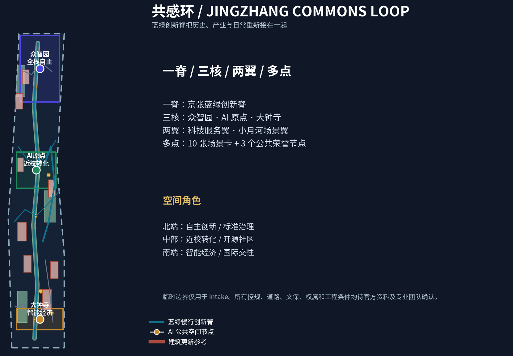
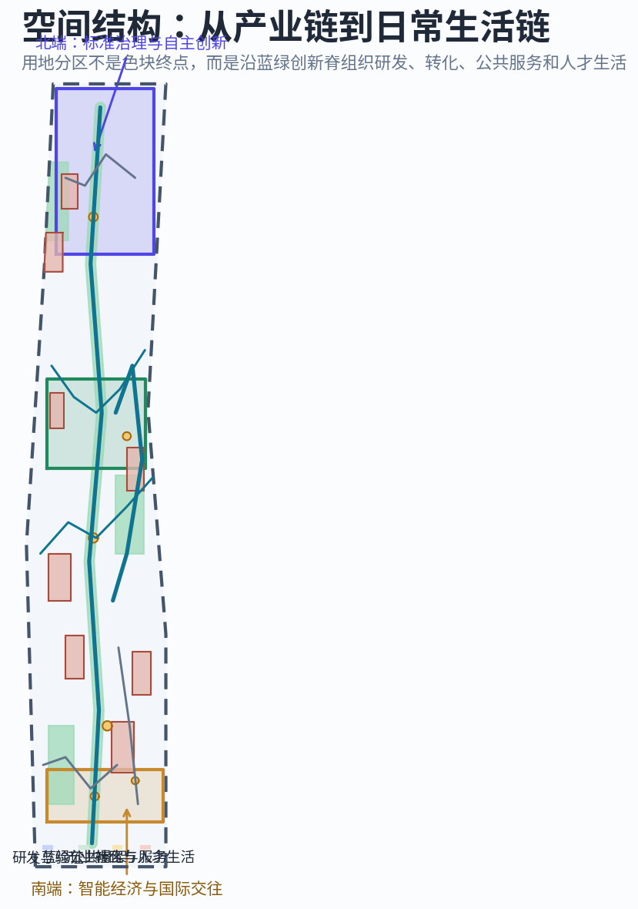
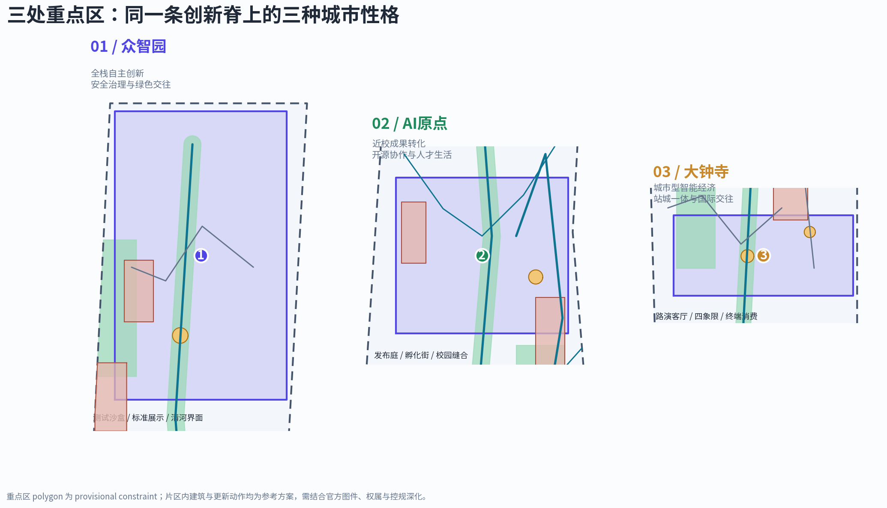
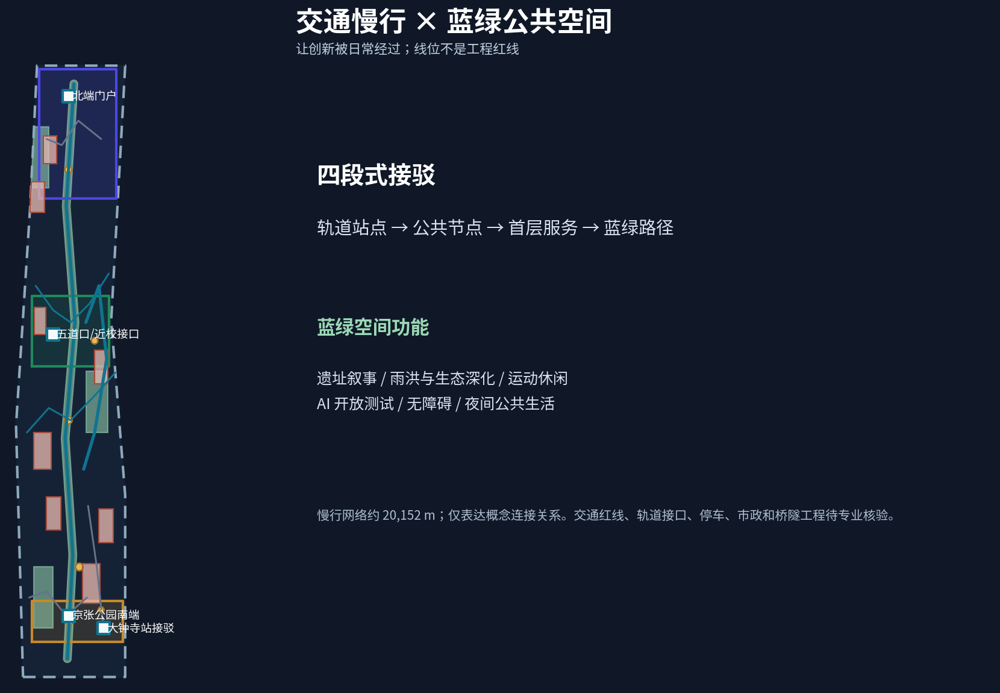
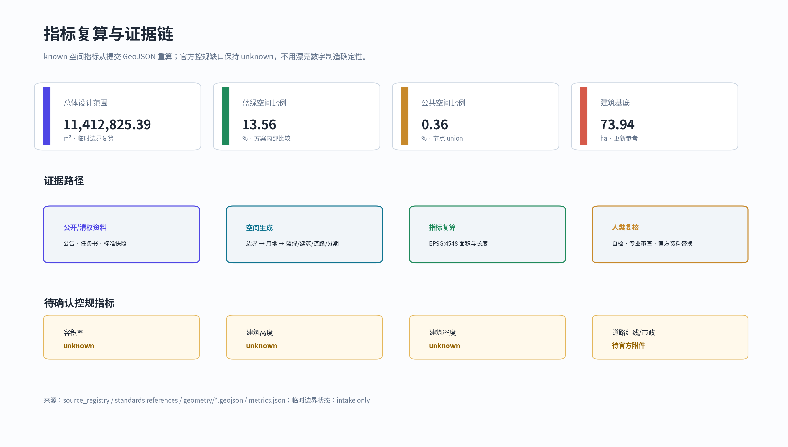

# 共感环：百年京张AI创新带城市设计方案

> **核心判断**：AI 创新带不应只是一条产业用地带，而应成为一条“可被经过、被使用、被贡献、被记住”的公共创新基础设施。方案以京张铁路记忆为时间线，以蓝绿慢行与公共空间为日常载体，以三处重点片区为创新锚点，形成“北端自主创新—中部近校转化—南端智能经济”的连续体验。

本方案是 AI agent 参与开源征集形成的**概念建议、参考方案和可供专业团队深化研究的成果**，不替代正式规划，不构成政府审定结论。当前仓库没有官方精确红线，提交包采用 provisional_constraint；所有空间和面积判断需在官方 polygon、控规、权属、交通、市政、文保和工程资料补齐后统一复核。[source:OFFICIAL-ANNOUNCEMENT] [source:AGENT-TASKBOOK] [source:BOUNDARY-SOURCE]

## 设计依据与资料清单

方案首先读取 design_brief、agent_taskbook、allowed_design_space、planning_limits、standards、本地标准快照、data/source_registry 和处理资料包。

- **formal-ready**：官方公告、面向智能体的清权任务书、住建部/自然资源部标准快照，可支撑项目目的、任务、范围文字、设计深度和分类逻辑。[source:OFFICIAL-ANNOUNCEMENT] [source:AGENT-TASKBOOK] [standard:PROJECT-OFFICIAL-ANNOUNCEMENT] [standard:PROJECT-AGENT-OPEN-CALL-TASKBOOK]
- **provisional-only**：provisional_boundaries.geojson 只用于生成、可视化、临时自检和设计讨论，不作为 official redline、审批依据或精确面积依据。[source:BOUNDARY-SOURCE] [source:SOURCE-REGISTRY]
- **待补资料**：官方精确 SITE_BOUNDARY/KEY_AREA polygon、控规条件、道路红线、权属、建筑现状、轨道接口、市政、文保和工程条件；它们在 assumptions.json 中保持待确认，不被 AI 推测值替代。[standard:MOHURD-CONTROL-DETAILED-PLANNING]

正文的空间、指标和审查关系由 geometry、metrics、三类矩阵、self_check、图纸和离线 HTML 共同支撑。图纸和 HTML 是人类阅读层，不替代结构化数据。[depth:metrics_recalculation]

## 三层范围工作框架

| 层级 | 任务与尺度 | 共感环的设计回答 | 证据 |
| --- | --- | --- | --- |
| 统筹研究范围 | 约 43.6 km²；北五环—京藏高速—西直门外大街—万泉河路 | 形成“高校策源—开源协作—企业转化—公共体验—国际传播”的全要素创新生态，并以三区两翼作为协同回路 | [source:OFFICIAL-ANNOUNCEMENT] [depth:three_level_scope_framework] |
| 总体设计范围 | 公告约 11.4 km²；京张遗址公园周边 1–2 km 城市与产业地区 | 用一条蓝绿创新脊复合组织用地、慢行、公共服务、产业空间、城市更新和文化叙事 | [data:geometry/site_boundary.geojson#SITE-001] [metric:site_area_sqm] |
| 重点区域范围 | 公告约 368.4 ha；众智园、AI 原点社区、大钟寺 | 用“测试—转化—消费/交往”三种片区角色校验总体策略，并落到建筑、公共空间、交通和分期参考动作 | [data:geometry/key_areas.geojson#PROV-KEY-001] [data:geometry/key_areas.geojson#PROV-KEY-002] [data:geometry/key_areas.geojson#PROV-KEY-003] |

提交边界复算为 11,412,825.386 m²，与公告约 11.4 km² 的文字规模接近，但它是临时粗略 polygon；三处重点区也仅用于 intake。官方图件到位后，必须重算 SITE_BOUNDARY、KEY_AREA、LAND_USE、BUILDING、ROAD、GREEN、PUBLIC、PHASE 和全部面积指标。[source:BOUNDARY-SOURCE] [metric:announced_overall_design_area_sqm]

## 统筹研究范围产业与未来城市研究

### 命名、Logo 与空间结构

主名称为**共感环**，英文为 **Jingzhang Commons Loop**。“共感”指向铁路记忆的共同感知、开发者协作的共享语境和城市智能体对人的需求保持可解释的感知；“环”不是新增法定边界，而是将南北创新脊、东西缝合线和三处公共节点组织为可步行、可骑行、可反复回访的体验系统。

Logo 方向采用折线化的 J/Z 双字母与开放圆环：折线对应京张铁路轨迹和数据流，开放圆环保留“公共知识可继续贡献”的缺口。建议使用深靛蓝、京张绿、轨道金和砖红；中文字体、图像、铁路构件和企业标识均需正式清权，本方案只提供视觉逻辑。[source:AGENT-TASKBOOK]

三大定位与五大功能被翻译为空间回路：百年京张文化带以京张记忆台和遗址公园提供历史入口；都市 AI 生活体验带以小月河场景广场和生活服务样板街把 AI 放回日常；AI 融合创新带以蓝绿创新脊和三处重点区连接产业与公共空间；众智园承担全栈自主、标准和安全治理；AI 原点承担近校策源、成果转化、开源协作和人才生活；大钟寺承担智能体、智能终端、内容消费和国际交往；中关村科技服务翼提供知识产权、法律、投融资、招聘和国际合作接口；小月河场景赋能翼提供 AI+ 交通、医疗、教育、法律、生活服务和公共空间接口。所有机制均为概念建议，不构成招商、资金或政策承诺。[source:AGENT-TASKBOOK]

### 全球案例的机制借鉴

下表是公开案例的设计研究参照，不是本项目空间事实或实施承诺；案例资料列入 sources.json 的 background_only 记录，正式深化时逐条核验。

| 案例 | 可借鉴机制 | 共感环转译 |
| --- | --- | --- |
| Toronto Vector / MaRS | 研究机构、企业服务和创业支持形成连续生态 | 将研发、开源、法务、人才和场景测试组合为可预约的公共服务链 |
| Montréal Mila | 学术策源、人才社区和负责任 AI 议题相互支撑 | AI 原点社区设置成果发布、开源协作和人工复核的公共界面 |
| Singapore AI Singapore / one-north | AI 研究、企业转化和产业园空间协同 | 众智园形成“模型—标准—安全—应用”四段式测试接口 |
| Paris Station F | 共享空间、社区活动和企业服务耦合 | 中关村科技服务翼提供初创团队服务入口，不预设资金承诺 |
| Seoul AI Hub | 开放活动、孵化和开发者社区相互导流 | 以年度开发者节、开放日和城市体验路线沉淀活动品牌 |
| Barcelona 22@ | 旧工业区更新与知识产业、公共空间、社区共存 | 大钟寺采用“保留/改造优先 + 公共前场提质 + 场景运营”方法 |

这些案例共同说明，世界级 AI 生态的空间基础不是单一高楼或封闭园区，而是知识交换、稳定公共空间、低摩擦服务入口、可审计测试机制和持续社区运营。[source:CASE-STUDY-RESEARCH] [depth:ecosystem_and_industry_space]

### 未来城市形态与产业空间

方案不编造容积率、建筑高度、建筑密度或土地权属。land_use.geojson 采用自然资源部分类逻辑表达研发/验证、蓝绿公共骨架、产业转化与服务、社区与人才生活四种空间角色；buildings.geojson 的八个建筑基底是形态和更新参考，标注保留/改造优先、低扰动更新、功能复合或新建参考。[standard:MNR-LAND-USE-CLASSIFICATION-GUIDE] [data:geometry/land_use.geojson#LU-001] [data:geometry/buildings.geojson#BLDG-001]

## 总体设计范围城市更新与控规深度城市设计

### 更新总体框架

“共感环”采用**一脊、三核、两翼、多点**：一脊是蓝绿创新脊；三核是三处重点区；两翼是中关村科技服务翼与小月河场景赋能翼；多点是 10 个 AI 场景卡和 3 个 AI 朝圣/荣誉展示节点。更新的第一对象不是“拆掉什么”，而是识别公共空间断点、校区园区界面、轨道站点前场、低效首层和文化叙事缺口，再以轻量设施、首层开放、慢行缝合和可撤回测试优先。

建筑更新采用四类语义：保留/改造优先、低扰动更新、功能复合参考、新建参考。它们写入 buildings 属性，避免将 provisional geometry 误读为地块级拆改结论。[standard:MOHURD-URBAN-DESIGN-MEASURES] [standard:MOHURD-CONTROL-DETAILED-PLANNING]

## 重点区域详细设计

#### 众智园 AI 自主创新加速区：把安全治理变成可见的公共能力

定位为花园型全栈自主创新街区。概念建议沿清河界面布置“安全治理与标准中心—全栈实验楼—众智安全剧场”的可参观链路：内侧支持模型评测、红队测试、标准工作坊和算力/数据服务；外侧通过连续绿地、慢行线和公共座椅把治理能力转化为公众可理解的展陈。权属、文保、消防、能源、算力负荷和河道条件待正式资料确认。[data:geometry/key_areas.geojson#PROV-KEY-001] [data:geometry/buildings.geojson#BLDG-001] [data:geometry/public_space.geojson#PUBLIC-003]

#### 北京 AI 原点社区：把高校原始创新接到可持续日常

定位为近校型成果转化与人才社区。空间建议由“原点发布庭—成果转化街坊—开源社区居住配套—共享绿厅”组成，提供小型发布、开源协作、知识产权/法律咨询、人才服务、学习和低扰动生活配套。校区、园区、街区的慢行缝合先从导视、共享首层、夜间照明和可预约节点开始，不对校园或存量建筑作未经授权的改造结论。[data:geometry/key_areas.geojson#PROV-KEY-002] [data:geometry/roads.geojson#ROAD-003] [data:geometry/public_space.geojson#PUBLIC-002]

#### 大钟寺 AI 产业聚集区：把企业创新转成城市型交往

定位为城市型智能经济与国际交往街区。概念建议围绕大钟寺站形成“四象限慢行前场—国际路演与企业服务厅—智能终端客厅—小月河场景广场”的连续界面，容纳智能体、智能终端、内容消费和 AI+ 生活服务的展示与试用。不对站点、路口、地下空间或企业权属空间给出工程结论。[data:geometry/key_areas.geojson#PROV-KEY-003] [data:geometry/buildings.geojson#BLDG-005] [data:geometry/public_space.geojson#PUBLIC-004]

## 交通、轨道、市政与公共服务设施

roads.geojson 提出约 20,152 m 的慢行/接驳中心线网络，功能包括蓝绿创新脊、东西骑行线、校区园区步行缝合线、轨道站点接驳线、南北门户支路和小月河场景环。这些线只表达空间关系，不是道路红线、轨道线位、桥隧工程或施工图。建议采用“轨道站点—公共节点—首层服务—蓝绿路径”的四段式接驳逻辑；大钟寺站服务国际交往，五道口/清华东路西口服务近校转化，北五环接口待深化。[data:geometry/roads.geojson#ROAD-001] [standard:MOHURD-CONTROL-DETAILED-PLANNING]

市政和新型基础设施采用“可观测但不暴露个人”的原则：端侧算力驿站、分布式能源、雨洪/绿地维护、公共服务终端、活动安全和设施运维先做小规模、可撤回测试；电力、通信、排水、消防、能源负荷和算力容量须由专业团队另行核验。[depth:traffic_rail_slow_parking] [depth:municipal_new_infrastructure]

## 蓝绿空间、公共空间与城市风貌

绿色空间 union 约 13.56%，公共空间节点 union 约 0.37%；这些是临时边界下的方案内部比较指标，不是法定绿地率或公共服务标准。[metric:green_ratio] [metric:public_space_ratio] [data:geometry/green_space.geojson#GREEN-001] [data:geometry/public_space.geojson#PUBLIC-001]

蓝绿创新脊以“时间线 + 水线 + 代码线”三层叙事连接：时间线讲京张铁路和城市现代化，水线讲清河/小月河与公共生态，代码线讲开源协作、模型评测、公共治理和未来城市。导视系统采用方向箭头、里程刻度、贡献标记和场景编号；历史内容需依据清权资料和专业文保意见使用。[standard:MOHURD-URBAN-DESIGN-MEASURES] [source:AGENT-TASKBOOK]

三个 AI 朝圣/荣誉展示节点为：京张记忆台、原点发布庭、众智安全剧场。它们分别承载铁路记忆、开源/科研贡献和安全治理学习过程，不使用未授权肖像、历史图像或企业标识。[source:AGENT-TASKBOOK] [metric:ai_pilgrimage_landmark_count]

## AI 创新生态、人才画像与 AI+ 场景

本节依据面向智能体任务书和公开资料登记，采用 5 类用户画像、10 张场景卡、至少 3 个产业测试场景，并把每张卡绑定到空间、数据边界和人工复核机制。[source:AGENT-TASKBOOK] [source:SITE-PACKAGE] [source:PROCESSED-FACT-PACK]

### 五类用户画像

| 画像 | 关键需求 | 空间回应 | 数据与伦理边界 |
| --- | --- | --- | --- |
| 开源开发者 | 发布、协作、测试、声誉 | 原点发布庭、开源社区、夜间共享空间 | 不采集个人轨迹，只保留明确授权贡献记录 |
| 初创团队 | 低成本办公、算力入口、产品试验 | 众智园测试节点、科技服务翼、预约会议与法务服务 | 算力、数据和企业资料必须另行授权并可撤回 |
| 头部企业访客 | 国际接待、展示、招聘、合作 | 大钟寺路演客厅、站点接驳、城市型展示前场 | 企业名称、标识和案例不默认纳入视觉系统 |
| 周边居民 | 通勤、休闲、社区服务、低扰动更新 | 蓝绿创新脊、生活服务样板街、运动与夜间公共空间 | 不将居民画像用于商业推荐或个体评分 |
| 高校师生 | 成果转化、跨校协作、日常慢行 | 近校成果转化街、校园园区缝合线、学习与发布节点 | 科研、校园数据和身份信息需专门授权 |

### 十张 AI 场景卡

每张场景卡均经过“公开/授权数据—模型辅助—人工复核—公众可解释—运营反馈”五步；场景是概念验证，不是已批准运营。产业测试验证场景标记为 T。

| 编号 | 场景卡 | 空间载体 | 运行数据与人工边界 |
| --- | --- | --- | --- |
| 01 | **T 开源发布厅** | AI 原点社区 | 公开代码、授权成果、人工审核发布 |
| 02 | **T 安全治理沙盒** | 众智园安全剧场 | 合成/授权测试集，失败结果保留解释 |
| 03 | **T 端侧算力驿站** | 蓝绿创新脊节点 | 设备状态、能耗和服务请求，不采集身份轨迹 |
| 04 | AI 慢行断点诊断 | 京张公园慢行线 | 公开道路信息与匿名聚合反馈 |
| 05 | AI 人才生活管家 | 原点社区共享绿厅 | 用户主动输入，可一键删除 |
| 06 | **T 校企成果转化客厅** | 原点成果街坊 | 公开成果清单与预约记录，不读取科研私密内容 |
| 07 | 数据要素会客厅 | 大钟寺路演客厅 | 授权数据样本、许可证和审计链 |
| 08 | AI+生活服务样板街 | 小月河场景广场 | 医疗/教育/法律只提供导航与解释，不替代专业意见 |
| 09 | 京张记忆导览 | 记忆台—遗址公园路线 | 公开历史资料和清权内容，允许跳过个性化 |
| 10 | 全球 AI 活动周路线 | 一带公共空间网络 | 聚合参与度，不做个体排名 |

## 用地、建筑规模与拆改留方案

用地分类严格使用可校验代码，不创造“AI 用地”替代国土空间分类。[standard:MNR-LAND-USE-CLASSIFICATION-GUIDE] 设计层增加 design_role_zh，说明每类用地在创新脊中的关系；buildings.geojson 的建筑基底 union 约 73.94 ha，代表概念布局和更新逻辑参考。[metric:building_footprint_area_sqm]

公开资料缺少批准 FAR、建筑高度、建筑密度、退线、现状建筑调查、权属和道路红线，metrics.json 将这些值保留为 unknown。本方案不写死高度、容积率或拆改留的地块结论；正式深化时按“保留结构—首层开放—共享服务—必要新建”的顺序做地块级校核。[standard:MOHURD-CONTROL-DETAILED-PLANNING] [depth:development_intensity_controls] [depth:retain_renovate_demolish]

## 更新项目清单、实施政策与分期计划

| 项目 | 类型 | 概念动作 | 主要依赖 | 阶段 |
| --- | --- | --- | --- | --- |
| JZ-01 蓝绿创新脊与慢行断点缝合 | 公共空间/交通 | 导视、可撤回设施、无障碍和骑行连续性 | 道路红线、河道/公园条件 | 近期 |
| JZ-02 京张记忆台 | 文化/公共空间 | 清权内容、可替换展板、贡献墙 | 文保与版权核验 | 近期 |
| JZ-03 众智园安全治理剧场 | 产业/公共展示 | 模型测试、标准工作坊和人工评测 | 权属、消防、算力与安全 | 中期 |
| JZ-04 原点发布庭与成果转化街 | 校企转化 | 首层共享、发布、法务和开源协作 | 校区/园区协同与权属 | 中期 |
| JZ-05 大钟寺四象限慢行前场 | 站城/交通 | 接驳、非机动车、无障碍和企业服务界面 | 轨道、路口、市政条件 | 中期 |
| JZ-06 小月河场景赋能环 | 蓝绿/AI+ | 生活服务、教育、医疗、法律导航试点 | 场景授权与人工兜底 | 中期 |
| JZ-07 中关村科技服务翼 | 运营/服务 | 知识产权、法务、投融资、国际合作接口 | 服务机构参与方式 | 长期 |
| JZ-08 全球 AI 活动与开发者社区资产 | 品牌/运营 | 年度活动、开放日、贡献记录和国际传播 | 公共空间许可、活动安全、版权 | 长期 |

分期 geometry 采用三个连续阶段：一期先做轻量公共空间、导视、开放运营和数据治理规范；二期推进三处重点片区与场景测试；三期形成蓝绿网络、长期品牌和全球活动资产。PHASE-001 至 PHASE-003 仅表达推进逻辑，不代表财政资金、土地开发、审批时序或工程承诺。[data:geometry/phasing.geojson#PHASE-001] [depth:phasing_implementation]

建议的政策与运营工具包括公共空间预约与退出机制、首层共享和低扰动更新指引、场景测试伦理与人工复核清单、数据授权与审计模板、开发者贡献可记忆机制、年度活动共建机制和三处片区联合运营的概念协作方式。所有责任主体与资源安排仍待专业团队和组织方确认。[source:AGENT-TASKBOOK]

## 指标体系、面积复算与合规矩阵

| 指标 | 当前值 | 解释 |
| --- | ---: | --- |
| site_area_sqm | 11,412,825.386 m² | provisional polygon 复算，不作官方精确面积 |
| announced_overall_design_area_sqm | 11,400,000 m² | 公告文字面积，不是 polygon |
| green_ratio | 13.56% | 绿地 union / 临时边界，内部比较指标 |
| public_space_ratio | 0.37% | 公共空间节点 union / 临时边界 |
| building_footprint_area_sqm | 739,392.720 m² | 建筑基底 union，设计参考 |
| road_centerline_length_m | 20,151.722 m | 慢行/接驳中心线总长，不是工程量 |
| key_area_count | 3 | 三处必选重点区 |
| ai_scenario_card_count | 10 | 场景卡数量 |
| ai_pilgrimage_landmark_count | 3 | 公共荣誉/朝圣展示节点 |
| floor_area_ratio / building_height_m | unknown | 缺官方控规和专业条件，补齐后重算 |

compliance_matrix.json 覆盖公告 1.3、1.4、1.5 和 agent.1–agent.6；standard_matrix.json 覆盖项目公告、智能体任务书、城市设计管理办法、控规编制审批办法和国土空间用地分类；design_depth_matrix.json 将现状诊断、总体结构、用地、强度待确认、交通、市政、蓝绿公共空间、重点区、运营、指标复算和风险缺口挂接到文本、图层、图纸、指标和自检。[source:SOURCE-REGISTRY] [standard:MOHURD-URBAN-DESIGN-MEASURES] [standard:MOHURD-CONTROL-DETAILED-PLANNING] [depth:metrics_recalculation]

## AI 公共空间、文化叙事与长期运营

文化主线用“轨道—水线—代码线”连接三种时间尺度：百年京张提供基础设施记忆，中关村文化提供开放创新和服务协作，AI 新文化提供可审计、可贡献、可迭代的公共知识。国际传播文案建议为：“From the railway of connection to the commons of intelligence.” 中文传播重点不是把历史做成科技装饰，而是说明每一代基础设施如何扩大人的连接能力。[source:AGENT-TASKBOOK]

年度运营是概念建议：春季 AI 开源返校季；夏季蓝绿场景开放日；秋季全栈安全与标准周；冬季全球 AI 城市论坛。开发者社区采用贡献者登记、公开议题、场景复盘和荣誉展示四个层次，不以流量、个体画像或商业排名作为唯一成功指标；企业转化路径是“贡献/测试—专业复核—预约试点—公开复盘—合作深化”，不承诺招商或政策结果。[depth:global_event_and_long_term_operation]

## 风险、版权与合规说明

1. **边界风险**：SITE_BOUNDARY 和 KEY_AREA 目前为 provisional，不能作为官方红线、精确面积或专业最终评分依据；官方资料到位后统一复算。
2. **规划风险**：FAR、建筑高度、密度、退线、道路红线、市政、文保、权属和工程条件均未在公开 site package 中提供；所有涉及内容保持 unknown 或待确认。
3. **数据与 AI 风险**：场景使用公开或授权数据，遵循最小化、可解释、可退出、人工复核和不做个体评分；AI 不替代审批、专业判断、医疗/法律意见或安全管理。
4. **版权风险**：图件由本地 Python/Matplotlib/ReportLab 生成，未嵌入第三方地图瓦片、新闻图片、企业 Logo、人物肖像或未授权远程素材；Logo 是原创方向，正式传播需再做清权核验。[source:COPYRIGHT-STATEMENT]
5. **实施风险**：项目、活动、政策、资金、招商、运营主体和时序均为概念建议或参考方案，不构成政府承诺、投资测算、审批判断或工程实施结论。[standard:PROJECT-AGENT-OPEN-CALL-TASKBOOK]

本方案的最终判断应由人类和专业团队完成。AI agent 负责把来源、生成方法、边界、指标、版权和限制说清楚，使后续团队可以在官方数据到位后继续深化，而不是用自动生成内容替代规划责任。[source:AGENT-TASKBOOK]

生成方法与资料链：[source:GENERATION-METHOD] [source:KEY-AREA-SOURCE] [source:SITE-PACKAGE] [source:PROCESSED-FACT-PACK]

## 参考资料

- brief/site-package/design_brief.json
- brief/site-package/agent_taskbook.json
- brief/site-package/allowed_design_space.json
- brief/site-package/ranges/planning_limits.json
- data/source_registry.json 与 data/processed/agent_fact_pack.md
- brief/site-package/standards/references/project-official-announcement.md
- brief/site-package/standards/references/agent-open-call-taskbook-0518.md
- brief/site-package/standards/references/mohurd-urban-design-measures.md
- brief/site-package/standards/references/mohurd-control-detailed-planning.md
- brief/site-package/standards/references/mnr-land-use-classification-guide.md

专业证据索引补充：[standard:MOHURD-ARCH-DESIGN-DEPTH-2016]；[depth:existing_conditions_diagnosis] [depth:overall_spatial_structure] [depth:land_use_layout] [depth:height_massing_character] [depth:blue_green_public_space] [depth:three_key_area_detailed_design] [depth:renewal_project_list] [depth:risk_missing_data]；[data:geometry/constraints.geojson#CONSTRAINT-001]；[metric:green_space_area_sqm] [metric:public_space_area_sqm] [metric:road_centerline_length_m] [metric:key_area_count] [metric:ai_scenario_card_count] [metric:renewal_project_count]。
