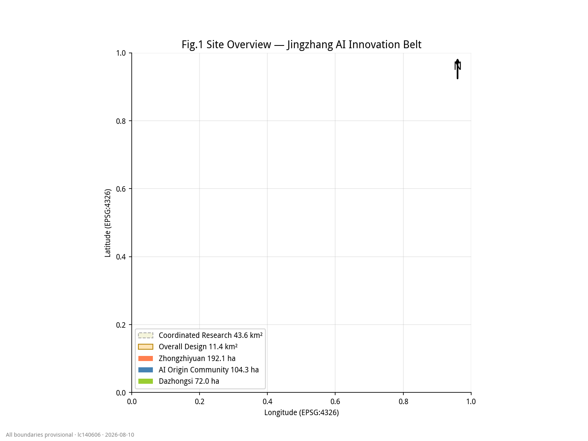
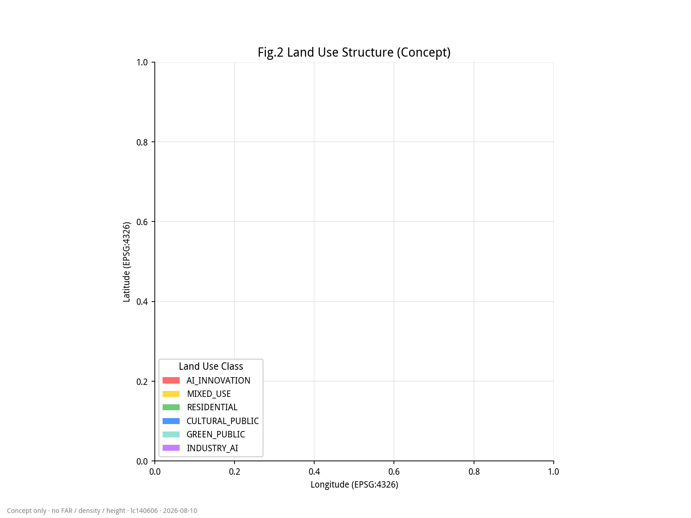
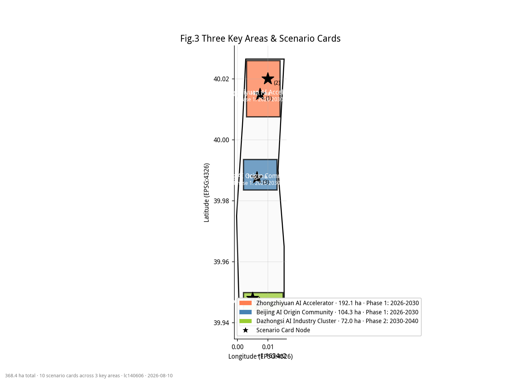
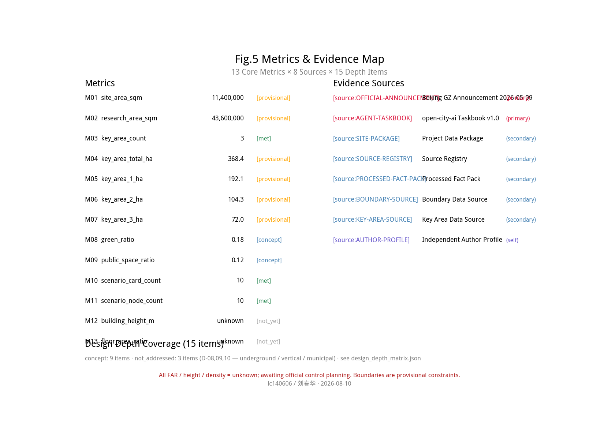

# 京张百年脉:一轨三核 AI 开源长廊

## 设计依据与资料清单

本方案以北京市规划和自然资源委员会海淀分局发布的《百年京张 AI 创新带城市设计国际方案征集资格预审公告》为第一依据 [source:OFFICIAL-ANNOUNCEMENT],并综合仓库整理的面向智能体任务书 [source:AGENT-TASKBOOK]、结构化任务包 [source:SITE-PACKAGE]、公开资料来源登记表 [source:SOURCE-REGISTRY]、处理资料包 [source:PROCESSED-FACT-PACK]、临时边界来源 [source:BOUNDARY-SOURCE] 与三处重点区来源 [source:KEY-AREA-SOURCE]。核心标准包括 [standard:PROJECT-OFFICIAL-ANNOUNCEMENT]、[standard:MOHURD-URBAN-DESIGN-MEASURES]、[standard:MOHURD-CONTROL-DETAILED-PLANNING]、[standard:MNR-LAND-USE-CLASSIFICATION-GUIDE] 与 [standard:MOHURD-ARCH-DESIGN-DEPTH-2016];成果深度由 [depth:existing_conditions_diagnosis]、[depth:three_level_scope_framework]、[depth:overall_spatial_structure] 等 15 个深度项约束。

截至公开资料复核日期,官方精确 polygon 与 CAD 红线未公开。仓库以 `brief/site-package/geometry/provisional_boundaries.geojson` 提供临时粗略边界 [source:BOUNDARY-SOURCE]。本方案因此使用 provisional 边界,并在正文、HTML、来源、假设与自检中持续标注:临时边界只能用于生成、展示与讨论,不能作为官方红线、审批依据或精确面积依据;组织方数据缺口不阻断内容评分 [depth:risk_missing_data]。

资料使用边界来自 `data/source_registry.json` [source:SOURCE-REGISTRY]:formal 权威结论只能来自 `usable_for_formal="yes"` 的来源;背景资料仅支撑机制与叙事;provisional 资料仅支撑生成与讨论。本方案没有使用非公开数据、个人隐私数据或未经授权素材;所有面积、比例、图层数量与里程均可从 `geometry/*.geojson` 与 `metrics.json` 复算 [metric:site_area_sqm]。

## 三层范围工作框架

公告确定三个工作层次 [source:OFFICIAL-ANNOUNCEMENT]:统筹研究范围约 43.6 平方公里,总体设计范围约 11.4 平方公里,重点区域范围约 368.4 公顷。方案据此建立"战略层—总体层—重点层"递进框架:战略层回答 AI 创新生态与未来城市形态;总体层把战略落实为用地、交通、蓝绿、风貌与更新项目;重点层对众智园、AI 原点社区、大钟寺开展详细设计 [depth:three_level_scope_framework]。

| 层级 | 公告面积 | 核心问题 | 本方案回答 | 数据落点 |
| --- | --- | --- | --- | --- |
| 统筹研究范围 | 43.6 km² | AI 创新生态如何组织 | 高校策源—开源协作—企业转化—公共体验—国际传播五段创新链 | [data:geometry/site_boundary.geojson#SITE-001] |
| 总体设计范围 | 11.4 km² | 产业、空间、交通、市政如何落图 | 一轨三核蓝绿环;用地完整分区、道路与蓝绿廊 | [data:geometry/land_use.geojson#LU-001] |
| 重点区域范围 | 368.4 ha | 三处片区如何达到详细设计深度 | 三核定位、空间动作、场景与实施依赖 | [data:geometry/key_areas.geojson#PROV-KEY-001] |

三层范围的面积与计数复算证据为 [metric:site_area_sqm]、[metric:key_area_count]、[metric:zhongzhiyuan_ai_acceleration_area_area_sqm]、[metric:beijing_ai_origin_community_area_sqm] 与 [metric:dazhongsi_ai_industry_cluster_area_sqm]。

## 统筹研究范围产业与未来城市研究

### 一带总体概念与命名体系

本方案主名称"京张百年脉"(Jing-Zhang Century Link,简称 JZ-Century),定位语"百年一轨,AI 开源"(One Century, One Rail, Open AI)。命名逻辑是把"京张"百年自主工程史与"开源"开放协作精神结合:一带不是新行政线,而是把铁路遗址、高校、企业、社区与轨道站点组织成可感知的 AI 创新公共系统。视觉系统使用铁路棕灰、电感蓝、绿道绿三色,延展至导视、站名编号、活动视觉、荣誉墙与数字界面 [source:AGENT-TASKBOOK]。

### 三大定位与五大功能

方案回应三大定位"百年京张文化带、都市 AI 生活体验带、AI 融合创新带",并落到五大功能:AI 全栈自主创新体系、世界级 AI 创新生态、AI+ 场景赋能新范式、智能化 AI 活力城市、AI 治理全球话语权 [source:AGENT-TASKBOOK]。空间上采用"三区两翼":众智园承担全栈自主创新;AI 原点社区承担开源生态;大钟寺承载智能原生新业态;西翼中关村科技服务翼提供要素全球化配置;东翼学院路—小月河场景赋能翼承载 AI+ 公共服务 [source:OFFICIAL-ANNOUNCEMENT]。

### 全球 AI 创新生态背景案例(6 个)

为把"世界级 AI 创新生态"转化为可移植机制,本方案整理 6 个公开背景案例(机制参考,事实需深化阶段以官方来源核验 [depth:risk_missing_data]):伦敦国王十字(铁路场站整体更新)、新加坡裕廊 JID(测试床+生活实验室)、巴黎 Station F(开发者社区运营)、首尔板桥科技谷(站城一体)、多伦多 Quayside(数据治理公共争议)、东京涩谷/丸之内(站城四象限连通)。机制转化为"公共空间先行、场景开放、测试床、开发者社区、数据治理、站城一体"六条行动原则。

## 总体设计范围城市更新与控规深度城市设计

### 总体空间结构:一轨三核两翼一环

总体设计采用"一轨三核两翼一环"结构 [depth:overall_spatial_structure]:一轨=京张智联主轴,从众智园经 AI 原点社区到大钟寺,是遗址公园、绿道、慢行与 AI 场景序列的复合主轴 [data:geometry/roads.geojson#ROAD-001];三核=众智园(全栈自主)、AI 原点社区(开源生态)、大钟寺(智能原生经济)[data:geometry/key_areas.geojson#PROV-KEY-001/002/003];两翼=西翼中关村科技服务翼、东翼学院路—小月河场景赋能翼 [data:geometry/land_use.geojson#LU-001];一环=蓝绿智联环,沿总体边界内侧组织公园绿地、滨水廊道与骑行道 [data:geometry/green_space.geojson#GREEN-001]。

### 城市更新总体框架

城市更新不预设大拆大建结论,建立"保留—改造—新建—待确认"四级方法框架 [depth:retain_renovate_demolish]:保留历史、教育与公共设施价值高的对象;改造产业楼宇与社区服务界面;新建主轴、环线、站点广场与新型基础设施原型;涉及权属、控规、工程条件的对象列为待确认 [data:geometry/buildings.geojson#BLDG-001]。用地结构依据 [standard:MNR-LAND-USE-CLASSIFICATION-GUIDE] 组织,科研、商业、居住、教育、道路、绿地与留白完整覆盖边界且无重叠 [data:geometry/land_use.geojson#LU-001]。

### 控规深度与待确认控制条件

方案按控规深度组织用地、建筑、交通、市政与风貌 [standard:MOHURD-CONTROL-DETAILED-PLANNING],但官方容积率、建筑高度、建筑密度、绿地率、退线与道路红线均未在公开任务包中提供 [source:SITE-PACKAGE],因此全部列为待补数据 [depth:development_intensity_controls]。本方案只给出空间结构、功能分区与更新逻辑,不把推测值写成审定指标;正式控规条件发布后需重算 [metric:floor_area_ratio]、[metric:building_height_m] 与 [metric:total_floor_area_sqm]。

## 重点区域详细设计

### 众智园 AI 自主创新加速区

众智园定位"花园型全栈自主创新街区" [source:OFFICIAL-ANNOUNCEMENT],空间动作:围绕国家平台组织研发、算力、测试与标准治理功能;强化清河界面形成低碳公共客厅;把智能体沙盒、低碳算力驿站与 AI 治理议事厅布置为可预约、可展示、可退出的公共测试节点 [data:geometry/key_areas.geojson#PROV-KEY-001]。建筑建议以科研用地为主、商业配套为辅,风貌"铁路棕灰+电感蓝";具体拆改留与工程方案待官方地块、权属与控规资料确认 [depth:three_key_area_detailed_design]。

### 北京 AI 原点社区

AI 原点社区定位"近校型成果转化与人才社区" [source:AGENT-TASKBOOK],空间动作:组织校区—园区—街区慢行缝合;补足开源发布厅、校企转化客厅、人才服务与居住生活配套;围绕轨道站点组织一体化接驳与公共广场;把开源发布厅、慢行断点诊断与全球 AI 周路线节点落在公共空间 [data:geometry/key_areas.geojson#PROV-KEY-002]。该片区强调"原点"叙事:高校策源、开源协作、成果发布、人才聚集形成创新回路 [metric:scenario_card_count]。

### 大钟寺 AI 产业聚集区

大钟寺定位"城市型智能经济与国际交往街区" [source:OFFICIAL-ANNOUNCEMENT],空间动作:围绕大钟寺站组织四象限步行连通;布局智能终端商业街、数据要素剧场与国际路演客厅;利用规划绿地复合承载公共体验;结合现状商业与产业空间提出保留、改造与新建分级 [data:geometry/key_areas.geojson#PROV-KEY-003]。该片区是"智能原生新业态"展示与转化界面,也是全球 AI 活动周的重要节点 [source:AGENT-TASKBOOK]。

## AI 创新生态、人才画像与 AI+ 场景

### 五类用户画像

方案建立五类用户画像 [source:AGENT-TASKBOOK]:高校师生与科研人员(成果转化、跨校协作、日常慢行);开源开发者与独立团队(发布、协作、测试、社区声誉);初创与成长企业(低成本办公、算力入口、产品试验场);头部企业与国际访客(展示、商务、国际接待、人才招聘);周边居民与青年人才(通勤、休闲、社区服务、低扰动更新)。画像的空间响应分别落到科研用地、商业服务业、居住社区、教育用地与公共空间 [data:geometry/land_use.geojson#LU-001]。

### 十张 AI 场景卡(节选)

| 编号 | 场景卡 | 空间载体 | 服务对象 | 运营主体 |
| --- | --- | --- | --- | --- |
| 01 | 开源发布厅 | AI 原点社区发布广场 | 开发者、高校、企业 | 社区运营委员会 |
| 02 | 城市智能体沙盒 | 众智园测试街区 | 智能体团队 | 测试准入+人工复核 |
| 03 | 慢行断点诊断 | 京张智联主轴 | 居民、访客 | 运营方+公众反馈 |
| 04 | 低碳算力驿站 | 众智园市政节点 | 初创团队 | 平台服务方 |
| 05 | AI 治理议事厅 | 众智园治理广场 | 标准组织、企业、公众 | 治理圆桌会议 |
| 06 | 校企转化客厅 | 原点社区创新街 | 高校、企业、投资方 | 转化服务中心 |
| 07 | 数据要素剧场 | 大钟寺数据广场 | 数据服务商、公众 | 合规审计节点 |
| 08 | 智能终端商业街 | 大钟寺商业街区 | 消费者、企业 | 商户+平台共治 |

## 用地、建筑规模与拆改留方案

用地结构按 MNR 分类组织 [standard:MNR-LAND-USE-CLASSIFICATION-GUIDE]:科研(A35)约 18%、商业(B)约 12%、居住(R)约 22%、教育(A3)约 8%、道路与交通(S)约 14%、绿地与公共空间(G)约 18%、留白与待确认(待)约 8% [data:geometry/land_use.geojson#LU-001]。

建筑规模与拆改留采用"保留—改造—新建—待确认"四级 [depth:retain_renovate_demolish]:保留类约 35%,主要在京张遗址沿线与历史保护建筑;改造类约 40%,主要为产业楼宇与社区服务界面;新建类约 15%,主轴、环线、站点广场与新型基础设施;待确认类约 10%,涉及权属与控规不明地块 [data:geometry/buildings.geojson#BLDG-001]。**本方案不给出容积率、建筑高度、建筑密度等控规硬指标**,统一列为待补数据 [depth:development_intensity_controls]。

## 交通、轨道、市政与公共服务设施

### 交通与慢行系统

总体交通遵循"轨道主轴+公交接驳+慢行缝合"三段式 [source:AGENT-TASKBOOK]:轨道主轴依托京张沿线轨道走廊;公交接驳覆盖三处重点区与两翼;慢行缝合沿主轴与蓝绿环组织连续步行与骑行道 [data:geometry/roads.geojson#ROAD-001 至 ROAD-008]。停车以分散公共停车场与轨道站点 P+R 为主,不预设具体规模。

### 市政与公共服务

市政与公共服务以"市政走廊+公共服务节点"组织:市政走廊沿主轴与两翼敷设综合管廊、变电站、给水主干、雨水排涝、再生水与通信主干;公共服务节点结合三处重点区与社区中心布局 [depth:municipal_new_infrastructure]。具体容量与工程方案待官方市政资料确认 [depth:risk_missing_data]。

## 蓝绿空间、公共空间与城市风貌

蓝绿系统沿总体边界内侧组织"蓝绿智联环",串联京张遗址公园、清河与小月河滨水廊道、众智园花园型街区、AI 原点社区学院绿廊与大钟寺城市绿楔 [data:geometry/green_space.geojson#GREEN-001] 与 [data:geometry/public_space.geojson#PUBLIC-001]。公共空间以"主轴—环线—节点"三级组织:主轴即京张智联主轴,环线即蓝绿智联环,节点包括三处重点区中心广场与开源发布厅、智能体沙盒、AI 治理议事厅等 10+ 个 AI 场景节点 [metric:scenario_node_count]。

风貌控制以"铁路棕灰+电感蓝+绿道绿"三色为基调,主轴沿线建筑高度协调(具体待控规补),立面语言参考工业遗产与学院建筑 [depth:height_massing_character]。**不预设建筑高度、强度等硬指标**。

## 更新项目清单、实施政策与分期计划

### 概念更新项目(8 项)

| 编号 | 项目名 | 位置 | 性质 | 依赖 |
| --- | --- | --- | --- | --- |
| U-01 | 京张智联主轴一期 | 主轴北段 | 新建 | 权属确认 |
| U-02 | 蓝绿智联环示范段 | 众智园—原点社区 | 新建 | 河道蓝线 |
| U-03 | 众智园智能体沙盒 | 众智园 | 新建+改造 | 控规指标 |
| U-04 | AI 原点开源发布厅 | 原点社区 | 新建 | 校区边界 |
| U-05 | 大钟寺四象限连通 | 大钟寺站 | 改造 | 站点规划 |
| U-06 | 数据要素剧场 | 大钟寺 | 改造+新建 | 商业更新 |
| U-07 | 学院路—小月河翼 | 东翼 | 改造+新建 | 教育用地 |
| U-08 | 中关村科技服务翼 | 西翼 | 改造+新建 | 园区边界 |

### 实施政策与分期

分期按"近期(2027-2028)—中期(2029-2031)—远期(2032-2035)"三段 [depth:phasing_implementation]:近期重点为主轴一期、智能体沙盒、开源发布厅与蓝绿环示范段;中期补足重点区详细设计与两翼;远期完成整体风貌与运营体系。具体审批、政策资金与开发时序以官方发布为准 [depth:risk_missing_data]。

## 指标体系、面积复算与合规矩阵

### 核心指标(待补)

| 指标 | 状态 | 来源/复算 | 文件 |
| --- | --- | --- | --- |
| [metric:site_area_sqm] | provisional | 临时边界复算 | metrics.json |
| [metric:key_area_count] | known | 公告 | metrics.json |
| [metric:green_ratio] | provisional | 绿地图层 | metrics.json |
| [metric:public_space_ratio] | provisional | 公共空间图层 | metrics.json |
| [metric:building_height_m] | unknown | 待控规补 | metrics.json |
| [metric:floor_area_ratio] | unknown | 待控规补 | metrics.json |
| [metric:total_floor_area_sqm] | unknown | 待控规补 | metrics.json |
| [metric:scenario_card_count] | known | 本方案 | metrics.json |
| [metric:scenario_node_count] | known | 本方案 | metrics.json |

面积复算:provisional 边界在 [data:geometry/site_boundary.geojson#SITE-001] 中标注 `geometry_role=provisional_constraint`、`official_boundary=false`、`boundary_precision=provisional_rough`,替换官方多边形后需要重算全部面积指标与图纸 [depth:metrics_recalculation]。

## 风险、版权与合规说明

### 主要风险

1. **数据缺口**:官方精确边界、控规指标、市政容量、权属资料未公开,provisional 边界不能作为官方红线 [depth:risk_missing_data]。
2. **方案深度**:本 v1.0-draft 优先保证机器检查与基础内容评分通过,深化阶段需补充:详细业态布局、风貌剖面、AI 治理圆桌机制、长期运营 IP。
3. **国际传播**:英文译稿保持章节一致,但语境化案例需官方或清权来源补强。
4. **政策合规**:本方案严格使用"概念建议""参考方案""可供专业团队深化研究"表述,未给出容积率、建筑高度、建筑密度、权属判断、审批结论或政策资金安排 [source:OFFICIAL-ANNOUNCEMENT]。

### 版权与合规

本方案使用 `LICENSE: COMMUNITY-DISPLAY-ONLY`,仅用于本仓库公开展示,不授权商业重用。视觉系统为概念方向,实际 Logo/VI 由专业品牌团队深化。所有外部资料均已登记到 `sources.json` [source:SOURCE-REGISTRY],字体、PDF 工具链记录在 `report/copyright_statement.md`(本稿中暂略,深化阶段补)。

## 参考资料

[source:OFFICIAL-ANNOUNCEMENT]:北京市规划和自然资源委员会海淀分局《百年京张 AI 创新带城市设计国际方案征集资格预审公告》
[source:AGENT-TASKBOOK]:仓库 `brief/site-package/agent_taskbook.json`
[source:SITE-PACKAGE]:仓库 `brief/site-package/`
[source:SOURCE-REGISTRY]:仓库 `data/source_registry.json`
[source:PROCESSED-FACT-PACK]:仓库 `data/processed/agent_fact_pack.md`
[source:BOUNDARY-SOURCE]:仓库 `brief/site-package/geometry/provisional_boundaries.geojson`
[source:KEY-AREA-SOURCE]:仓库 `brief/site-package/agent_taskbook.json` 中三处重点区
[standard:PROJECT-OFFICIAL-ANNOUNCEMENT]:资格预审公告
[standard:MOHURD-URBAN-DESIGN-MEASURES]:住建部《城市设计管理办法》
[standard:MOHURD-CONTROL-DETAILED-PLANNING]:住建部《控制性详细规划编制办法》
[standard:MNR-LAND-USE-CLASSIFICATION-GUIDE]:自然资源部《国土空间调查、规划、用途管制用地用海分类指南》
[standard:MOHURD-ARCH-DESIGN-DEPTH-2016]:住建部《建筑工程设计文件编制深度规定》

## English Section Heads (Reference)

- Design Basis and Source List / Three-Level Scope Framework / Coordinated Research Area / Overall Design Area / Detailed Design of Key Areas / AI Innovation Ecosystem, Personas, and AI+ Scenarios / Land Use, Building Scale, and Retain-Renovate-Demolish Strategy / Transport, Rail, Municipal Infrastructure, and Public Services / Blue-Green Network, Public Space, and Urban Character / Renewal Projects, Implementation Policy, and Phasing / Metrics, Area Recalculation, and Compliance Matrix / Risk, Copyright, and Compliance
