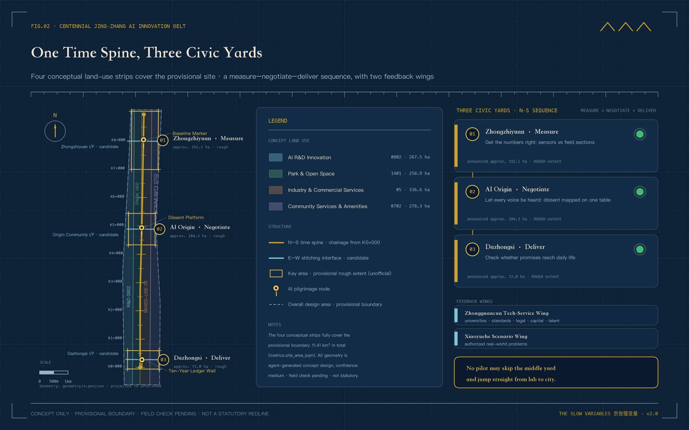
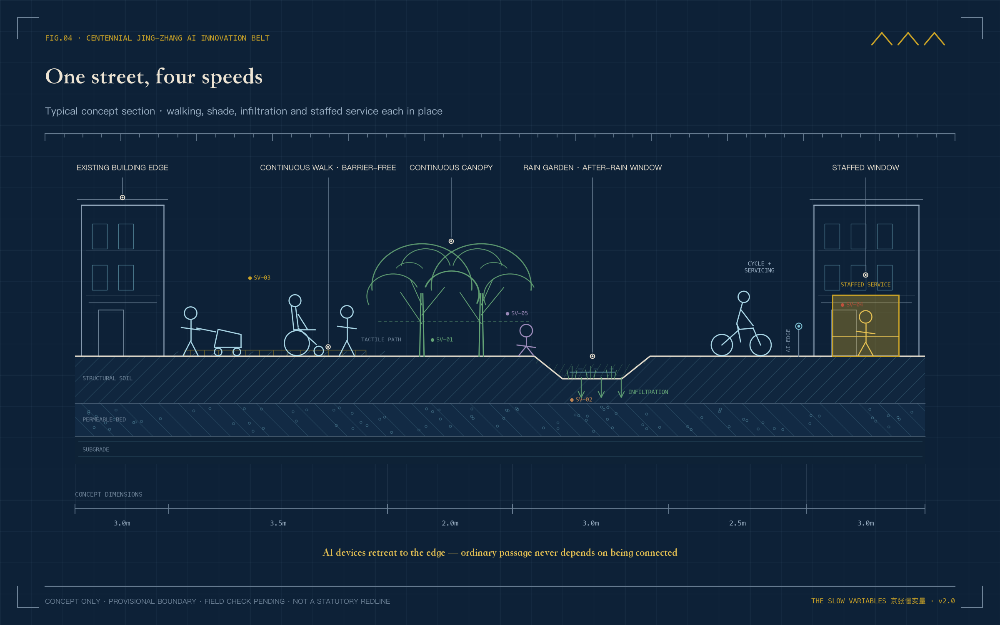
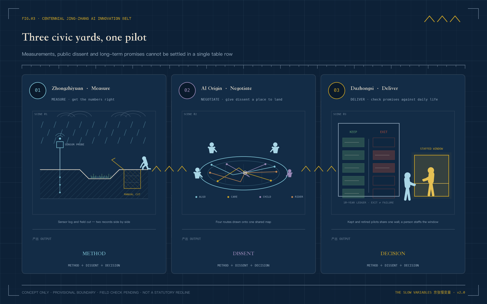
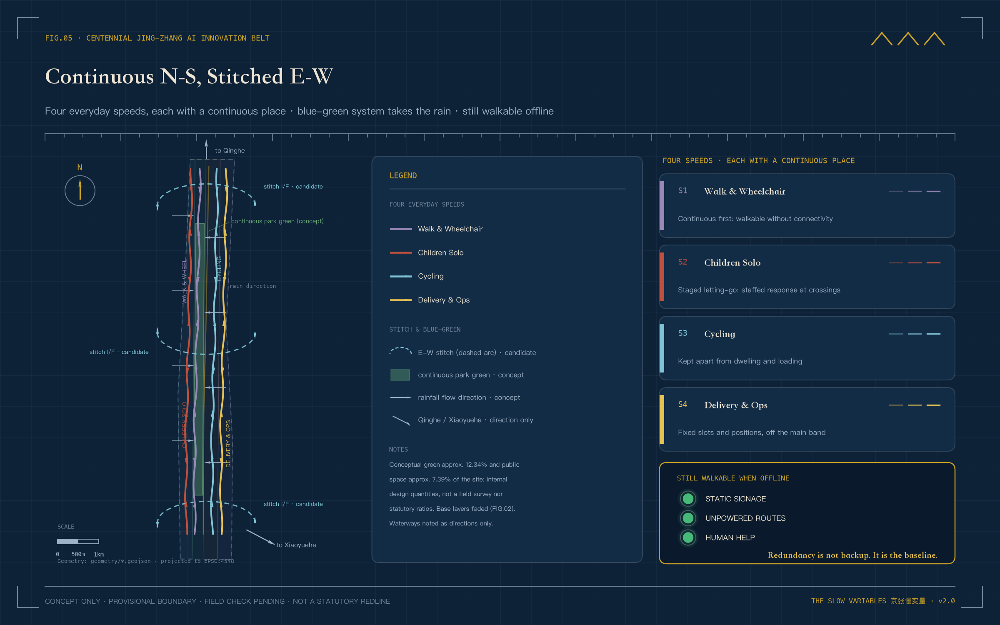
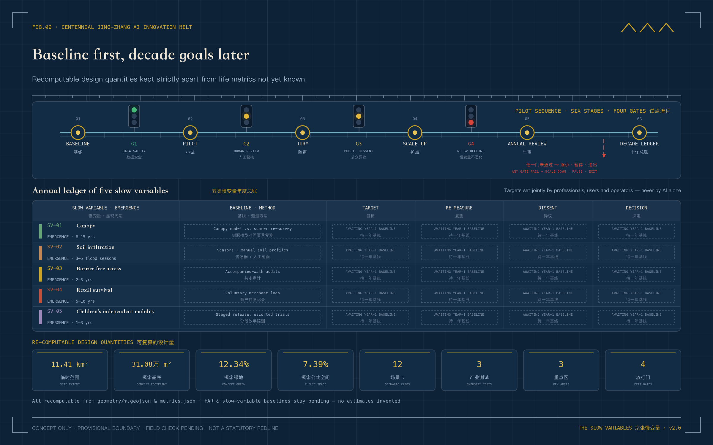

# THE SLOW VARIABLES

## How a City Decides How Fast AI May Move

Two clocks run through the city.

The first moves fast. Models change within months, applications update within weeks, and a city pilot may move from launch to expansion inside one quarter.

The other clock is slow. A young tree takes years to cast dependable shade. Soil reveals its capacity over successive rainy seasons. Ramps, crossings, and human service counters prove useful only after many different people have used them. Local shops and children's independent routes also need ordinary time before change becomes visible.

This corridor already holds the beginning of an answer. In 1909 the Beijing–Zhangjiakou railway opened. Facing grades his locomotives could not climb through the Guan'gou ravine, Zhan Tianyou did not wait for a stronger engine; he folded the line into a switchback and traded reversals for height. From its first day, this railway understood that speed must bow to slope. More than a century later, AI enters the same corridor: models are fast, the city is slow, and the slope is still here.

Official accounts have written another sentence for this corridor. When the Beijing–Zhangjiakou high-speed railway opened on 30 December 2019 at up to 350 km/h, it was described as a leap "from 35 km/h to 350 km/h" [source:SRC-JINGZHANG-35-350]. The fast century has its conclusion. This proposal asks the other question: beside a 350 km/h corridor, who guards the time of a tree, a small shop, and a child?

The Jing-Zhang AI Innovation Belt therefore faces a basic question. The fast clock can accelerate deployment. Who speaks for the slow clock?

This proposal offers a restrained answer. Every AI service entering public space must answer to five slow variables (SV-01 to SV-05): shade, soil permeability, accessible reach, local-business continuity, and children's independent mobility. A technology may pilot quickly, but expansion requires slow review. Novelty earns the right to test. Durable public value earns the right to remain.

> **How to read this figure.** The outer ring's 40 ticks are the fast clock, one per quarter; the five coloured arcs are slow variables SV-01 to SV-05, each having covered only a short segment of its decade. The cards on the right give each variable's emergence period, and the four railway signals at the bottom are release gates G1 to G4.

> **How to read this proposal.** There is no field-survey baseline and no invented resident testimony. Spatial limits are provisional rough geometries derived from the announcement's textual bounds and stated areas. The five slow variables are measurement frameworks, not measured site conditions. The narrative describes what should happen if a one-year pilot enters the site. Figures are conceptual illustrations rather than existing-condition photographs. Official boundaries, controls, ownership, existing buildings, utilities, and heritage data must trigger full relocation and recalculation.

## Design Basis and Source List

Slow variables may look like an indicator system, but they begin as a rule of honesty. Cleared public material establishes the three scopes, three focus areas, task direction, and required design depth. It does not establish real road lines, ownership, canopy, permeability, merchant turnover, or children's routes. The first group enters as known evidence. The second becomes the one-year baseline agenda [source:OFFICIAL-ANNOUNCEMENT] [data:geometry/site_boundary.geojson#SITE-001] [metric:site_area_sqm].

Sources have three roles. The announcement, taskbook, and formal standards control scope and professional language. Registered public sources provide heritage, park-direction, and AI-ecosystem background. Submission GeoJSON carries conceptual spatial relationships only. The approximately 11.41 km² design area and all three focus areas are provisional constraints; they do not support acquisition, ownership, engineering location, or statutory area conclusions [standard:MOHURD-CONTROL-DETAILED-PLANNING] [depth:existing_conditions_diagnosis].

Presentation follows the same boundary. Planning diagrams derive from package geometry and metrics. Spatial vignettes explain how future users might occupy a pilot, without claiming existing conditions, public opinion, or approved construction.

A further layer of local public material needs separate disclosure. On 11 August 2026, the regulatory detailed plan for nine blocks along the Jing-Zhang Railway Heritage Park was approved, with an official spatial structure of "one belt, one axis, two centres, multiple nodes" — Dazhongsi and Wudakou named as the two centres [source:SRC-HD-STREET-CTRL-PLAN-2026]. The plan's extent is not identical to this call's scope, and neither can be applied to the other; but it confirms that this proposal's north–south spine with three civic yards agrees with the official direction. The proposal cites it as background alignment only — not as the call boundary, and not as a source of statutory control. Local facts such as the heritage park's phased opening, the Qinghuayuan station restoration, and the relocation of the old Qinghe station house come from government releases and mainstream news reports, each registered in `sources.json`. They inform narrative and measurement planning; they do not enter the formal evidence layer and are not existing-condition findings.

## Three-Level Scope Framework

Slow variables do different work at three scales.

The 43.6 km² coordinated research scope establishes shared questions. If universities, parks, communities, and service operators measure differently, their results cannot be compared. The belt-level public ledger therefore defines method, update rhythm, and objection procedure; it does not predetermine local conclusions.

The 11.4 km² overall design scope turns the method into a continuous network. One north-south public spine holds long-term observation. Three candidate east-west interfaces reconnect campuses, neighbourhoods, rail, and park. The provisional limit remains visually recessive; the important evidence is how people cross the belt [standard:PROJECT-OFFICIAL-ANNOUNCEMENT] [depth:three_level_scope_framework] [data:geometry/roads.geojson#ROAD-001].

The spine has a real physical base. The Jing-Zhang Railway Heritage Park is being built in phases along the old alignment: the 2.4 km, 16.8 ha first phase from Tsinghua East Road to Zhichun Road opened in June 2023, and with the second phase completed in August 2026 the full roughly 9 km green corridor now links Xizhimen with the North Fifth Ring, keeping old rails, crossing motifs, and switchback elements [source:SRC-HERITAGE-PARK-P1-2023] [source:SRC-HERITAGE-PARK-P2-2026]. The time spine runs alongside it — and among the first slow variables to observe is the park's own growth.

The 368.4 ha focus scope makes field decisions. Zhongzhiyuan tests whether measurements are credible. AI Origin gives disagreement a place to remain. Dazhongsi checks whether promises reach ordinary life. No pilot jumps directly from laboratory performance to city-wide deployment.

> **How to read this figure.** The pale dashed line is only the provisional boundary, not the protagonist. Read the brass north–south time spine and its chainage ticks instead: civic yards 01 to 03 measure, negotiate, and deliver from north to south, while the three cyan interfaces stitch urban life back across the belt.

## Coordinated Research Area: Industry and Future City Research

THE SLOW VARIABLES does not simply slow technology. It gives good technology a more credible route into the city. After proving performance, a product must answer urban questions. Does it remove an ordinary choice? Who takes over when it fails? What remains in public space after one year?

The three official positions now sit on one timeline. The Centennial Jing-Zhang Cultural Belt holds intergenerational memory. The Metropolitan AI Life Experience Belt faces everyday use. The AI Integrated Innovation Belt accommodates rapid testing. Five functions enter measurement, research, scenarios, service, and shared governance rules. The Zhongguancun Service Wing contributes academic, standards, legal, financial, and talent capacity; the Xiaoyuehe Scenario Wing contributes authorised real-world questions [source:AGENT-TASKBOOK] [standard:PROJECT-AGENT-OPEN-CALL-TASKBOOK].

Three factor types — compute, funding, and data — are written as conceptual mechanisms of provider, pricing, and exit, never locked permanently to any project. Compute is requested by task period through public and university channels connected via the Zhongguancun Service Wing; pricing follows auditable usage records, and a retiring project releases its allocation and closes its tasks. Funding separates two tiers: pilot funding draws only on public-innovation and urban-renewal channel categories, while expansion funding may be discussed only after a project passes G4, and neither tier is stated as a budget commitment. Data remains minimal and de-identified; usage rights end when a project exits, with retention and deletion written before G1. All providers are channel types only; specific bodies await future authorisation and open procedure [source:AGENT-TASKBOOK].

The corridor's talent base is older than the taskbook. The 1952 nationwide restructuring left the "Eight Colleges" along Xueyuan Road — aviation, geology, mining, forestry, medicine, steel, petroleum, and agricultural machinery — which have grown into today's Beihang, China University of Geosciences, CUMT Beijing, Beijing Forestry University, and their peers [source:SRC-BAXUEYUAN-2025]. In the same years, Wudakou was merely the fifth level crossing of the old line out of Beijing North Station; the name survived the crossing's removal [source:SRC-WUDAKOU-NAME-2023]. The AI innovation belt does not land on empty ground: it overlies seventy years of a college district on a hundred years of railway.

Seven global references contribute methods. Barcelona Superblocks demonstrates street reallocation; Paris's 15-minute city foregrounds proximity; Helsinki Kalasatama uses residents' time; Amsterdam AMS Institute organises living labs; Toronto Quayside exposes data-governance costs; Singapore Punggol Digital District coordinates a district; and Seoul Digital Mayor's Office makes public indicators visible.

Each reference must survive itemised scrutiny. The table states, case by case, what is taken, where it lands, and what is explicitly left behind, so that borrowing never turns quietly into copying.

| Case | Transferable mechanism | Where it lands here | Explicitly not transferred |
|---|---|---|---|
| Barcelona Superblocks | Street space returned to walking and staying | Walking repair at three east-west interfaces (P3) | Large-area street closures to cars |
| Paris 15-minute city | Daily life organised by proximity | Quarter-hour-circle sampling frame and SV-04 | Top-down functional zoning mandates |
| Helsinki Kalasatama | Residents' time as a stated target | Time-based indicators on scenario cards (e.g. 06) | Time as the sole ranking criterion |
| Amsterdam AMS Institute | The living lab as urban test format | Zhongzhiyuan baseline lab and failure garden | Permanent institutes with fixed budgets |
| Toronto Quayside | A public lesson in data-governance cost | Gate G1 and the retirement-record regime | Data-trust entities and dense sensor grids |
| Singapore Punggol Digital District | Campus-firm coordination interfaces | Service-wing compute and compliant testing | Building an entire digital district anew |
| Seoul Digital Mayor's Office | Public indicators kept visible to citizens | Annual Ledger Day and the L4 ledger wall | A real-time city-dashboard control room |

The proposal borrows questions rather than scales, investment promises, or urban forms [source:SOURCE-REGISTRY] [depth:overall_spatial_structure].

The identity combines two rings moving at different speeds with five calibration marks. The outer ring moves annually; the inner ring turns quarterly. The marks appear on baseline markers, soil windows, route signs, and the annual ledger as a screen-independent public language.

## Regional Synergy Interfaces: How the Slow-Variable Method Leaves the Corridor

The two clocks do not run inside this corridor alone. The taskbook writes regional synergy into its review dimensions, naming the Beiwei Community, Future Science City, Huairou Science City, the Beijing Economic-Technological Development Area, and the Beijing–Tianjin–Hebei region [source:AGENT-TASKBOOK]. Beijing's innovation geography is not a single point either. In implementing the municipal master plan, the "three science cities and one area" are designated key functional zones: Zhongguancun Science City covers the whole of Haidian, Future Science City focuses on shared-technology platforms in fields such as energy and materials, Huairou Science City hosts major scientific facilities, and the Economic-Technological Development Area carries innovative industry clusters and manufacturing conversion [source:SRC-THREE-CITIES-ONE-ZONE]. The Jing-Zhang corridor sits inside Zhongguancun Science City. It is not a sixth pole outside that structure, but the segment responsible for everyday urban verification within it.

In the language of slow variables, synergy has only one honest form: exchange reviewable methods, never unverified conclusions. What the corridor exports is not "success stories" but the four release gates, the slow-variable baseline method, the annual ledger format, and retirement records. Other regions may take the ruler; they may not take the readings. What the corridor receives is real questions: the need to translate scientific results into urban use, the need to retest under manufacturing conditions, and the need to compare commuting and public services across cities.

| Synergy partner (named by the taskbook) | What the corridor can offer | What the corridor can receive | Boundaries kept |
|---|---|---|---|
| Beiwei Community | Slow-variable checklists and human-review procedures for community services | Resident usage problems and accessibility feedback | No fabricated joint operation or resident mandate |
| Future Science City | Urban-problem lists and the gated pilot mechanism | Urbanisation test methods for shared-technology results and expert review | Research conclusions never presented as deployable products |
| Huairou Science City | A deliberation table and narrative method for translating scientific results to the public | Measurement and calibration methods, cross-disciplinary validation advice | No access to non-public research or facility data |
| E-Town (BDA) | Engineering question lists for scenarios that passed all four gates | Manufacturing-condition retest records and safety requirements | No fabricated firms, orders, or production-line cooperation |
| Beijing–Tianjin–Hebei | Delocalised slow-variable method packs, failure records, and version differences | Cross-city public-service comparison and off-site retesting along the Beijing–Zhangjiakou HSR [source:SRC-JINGZHANG-35-350] | No export of local coordinates, personal data, or approval conclusions |

Receiving is written with the same restraint. The corridor absorbs commuter flows, industrial spillover, and research-translation demand from neighbouring plates, but receiving is not absorbing. Whether a firm, a rail line, or a facility enters the corridor depends on statutory procedure and inter-regional negotiation, not on this proposal. This chapter is entirely a concept proposal; it does not masquerade as statutory planning or a regional agreement. Every interface remains "pending negotiation" until the counterpart confirms, and data permission and responsibility boundaries are written down [source:AGENT-TASKBOOK].

## Overall Design Area: Urban Renewal and Regulatory-Plan-Level Urban Design

The overall design begins with an ordinary afternoon rather than a spectacular masterplan. A person walks south under intermittent shade, encounters water after rain, crosses an east-west interface where wheelchairs and bicycles each have a continuous place, and eventually reaches a staffed service counter beside shops that remain in use.

The structure is correspondingly clear. One time spine records long change. Three civic yards process data, objections, and promises. Five observation surfaces concern canopy, soil, access, local continuity, and children's routes. Twelve scenario nodes enter through reversible components. Four conceptual land-use zones fully partition the provisional site into research and innovation, park and open space, industry and commerce, and community service [standard:MNR-LAND-USE-CLASSIFICATION-GUIDE] [data:geometry/land_use.geojson#LU-001] [depth:land_use_layout].

The building layer represents a conceptual footprint only. It cannot determine the fate of a real building. The strategy therefore uses four actions: retain as found, lightly repair, reversibly insert, and send for professional investigation. FAR, height, statutory density, and total floor area remain pending official data [data:geometry/buildings.geojson#BLDG-001] [depth:development_intensity_controls] [depth:height_massing_character].

> **How to read this figure.** Read left to right; each step corresponds to one speed. Shade, rainwater, wheelchairs, bicycles, and children each hold a place on the same street, and the brass-lit window is a staffed counter. All widths are conceptual, not construction setting-out.

## Detailed Design of Key Areas

### Zhongzhiyuan | Make Measurements Credible

On the first rainy day of a one-year pilot, the soil window begins work. A sensor reports moisture change while a maintenance worker opens the section, checks ponding, and records plant condition. The two records must appear together. If digital and field judgements conflict, the pilot cannot select the more flattering result when applying to scale.

Zhongzhiyuan contains an open baseline lab, an ecological observation walk toward the Qing River, a human-review room, and a failure garden. Openness does not mean publishing personal data. Face and identifiable trajectory collection are excluded by default; access, retention, and deletion rules are written before operation [data:geometry/key_areas.geojson#PROV-KEY-001] [depth:three_key_area_detailed_design].

The Qinghe direction holds a precedent the measurement yard should remember. The old Qinghe station house, built in 1905 and weighing some 700 tonnes, was moved twice during high-speed rail construction — roughly 360 metres in total — and kept at the south-east corner of the new Qinghe station [source:SRC-QINGHE-STATION-SHIFT-2021]. A city willing to redraw construction drawings for an old station house should also be willing to wait one flood season for a measurement.

### AI Origin | Give Disagreement a Place to Stay

An algorithm may propose the safest route for a child. Carers, children, wheelchair users, riders, and street workers may disagree. The negotiation yard does not hurry to erase those differences. Each route is drawn on the same table, with who objected, why, and how the proposal changed.

Shared ground floors host a slow-variable reading room, route table, accessibility audit desk, and non-digital feedback box; the audit desk has a low counter with knee clearance, so filing an objection never requires standing or looking up. Static wayfinding, staffed help, and continuous accessibility are the baseline. Campus interfaces and development scale remain pending ownership and official controls [data:geometry/key_areas.geojson#PROV-KEY-002] [standard:BARRIER-FREE-ENVIRONMENT-LAW].

"AI Origin" is not a name this proposal invented. In January 2026, Haidian's AI Origin Community was named among the city's first AI innovation blocks, bounded by Tsinghua University to the north and the North Fourth Ring to the south [source:SRC-AI-ORIGIN-BLOCK-2026]. Not far away, the 1910 Qinghuayuan station house still stands; its nameboard was inscribed by Zhan Tianyou himself, and the restored station opened in 2023 as a Beijing municipal cultural relic [source:SRC-QINGHUAYUAN-STATION-2023]. The newest generation of agents meets the first self-built railway at the same street corner. Placing the negotiation yard here is no coincidence.

A synthetic journey can test whether this table actually works. **Zheng Lan is a synthetic design-test persona, not a real interviewee; this proposal has conducted no resident interviews, and she exists for one reason only — to walk the whole process on behalf of a real kind of body.** Zheng Lan uses a wheelchair and commutes past AI Origin. What she needs to do is ordinary: file an objection about a detour route that always floods after rain, and see it handled.

**Step one, leaving the gate.** She opens no app at the station exit. Static wayfinding and a staffed help point give her the step-free route to the negotiation yard — the baseline that the "last five hundred metres" first delivers orientation, shade, seating, and human help.

**Step two, along the spine.** The route is continuous and level. A temporary construction obstruction carries a detour note and a time limit on the slow-variable route markers — exactly the SV-03 category of "temporary construction gaps labelled with time limits": counted in the public list, not in deterioration judgement.

**Step three, arrival.** The entrance status board shows that scenario 03 co-testing is recruiting. Three-layer disclosure states what is tested, what is collected, and how to withdraw. She chooses not to join. That choice lowers no service priority and is recorded as no profile.

**Step four, the audit desk.** The low counter means she need not look up. The human-review post is staffed (G2). She dictates her problem: the ramp on the post-rain detour floods, and a wheelchair waits half an hour longer.

**Step five, filing the objection.** She uses no screen. A staff member transcribes, or she fills a paper form and drops it into the non-digital feedback box, receiving a numbered paper receipt on the spot. The G3 objection enters the ledger instead of vanishing into speech.

**Step six, the objection on the table.** On the route table her gap sits beside the co-test data; the algorithm's "safest route" and her actual travel time are drawn on the same sheet. Who objected, why, and how the proposal changed are archived line by line.

**Step seven, the fix.** The gap enters the repair list and the drainage edge is fixed first. Until the repair is done, related route recommendations pause under scenario card 03's exit threshold.

**Step eight, the re-test.** She is invited to the re-test — voluntary, refusable. A pass is co-signed by her and the auditor; this is the only place in the whole process where her name appears.

**Step nine, closure.** Five days later she checks the result at the Dissent Platform by receipt number: gap status, revision version, the next co-test date. The number binds no name; no one can trace the person.

This synthetic journey exposed three real design flaws, and all three are corrected in the text. First, the non-digital feedback box originally only said "opened and registered by staff on schedule"; a depositor received no proof, and whether an objection entered the ledger was unverifiable — the component library now includes a numbered paper receipt. Second, scenario 03 originally ran one monthly co-walk, by default in daytime working hours, precisely missing the commuting hours wheelchair users actually travel — the scenario card now schedules at least one session per quarter in commuting or evening hours. Third, the audit desk was first described only by function, with nothing about how a body reaches the counter — the ground-floor design now specifies the low counter and knee clearance. The journey is synthetic; the flaws were real; the corrections are written into the text, the scenario card, and the component library.

### Dazhongsi | Check Whether Promises Are Delivered

A queue assistant can increase visits quickly. Dazhongsi asks a different set of questions. Was a human counter retained? Did older users spend less time? Could small shops remain? Did people actually use shaded seats in summer?

The delivery yard combines a slow-variable ledger wall, grievance desk, annual jury table, and small delivery market. Kept and retired pilots appear together. Retirement demonstrates that the city can stop an ineffective experiment. Four-quadrant station connections remain conceptual pending transport and ownership review [data:geometry/key_areas.geojson#PROV-KEY-003] [depth:renewal_project_list].

In the approved corridor plan, Dazhongsi and Wudakou are designated the two centres [source:SRC-HD-STREET-CTRL-PLAN-2026]. "Centre" is a planning word; its everyday quality is checked in a bowl of rice, a queue, and a shop door that is still open. That is exactly why the delivery yard exists.

> **How to read this figure.** One pilot must pass through three rooms: measurements are made credible at Zhongzhiyuan, disagreements are laid on one table at AI Origin, and promises are checked against daily life at Dazhongsi. If any room is skipped, the pilot cannot scale.

## AI Innovation Ecosystem, Personas, and AI+ Scenarios

An AI innovation belt serves developers and firms, as well as people who would never call themselves innovation talent. Seven user groups share the same plan. Residents need calm, shade, and low-threshold movement. Children and carers need gradual independence. Older and low-digital-literacy users need people. Operators, riders, and cleaners know where systems fail. Small merchants need continuity. Developers need compliant testing. Reviewers need comparable evidence [standard:ELDERLY-SMART-TECH-PLAN-2020-45] [depth:municipal_new_infrastructure].

Twelve scenario cards fall into four groups. The first three are controlled industry tests; nine address everyday services. Each records data limits, human review, and an exit condition.

| Group | Scenario | Concrete urban action | Boundary |
|---|---|---|---|
| Land | 01* Shade digital twin | Compare canopy model with summer field review | Model estimate never becomes measured fact |
| Land | 02* Post-rain permeability | Sensor reading sits beside a manual section | No drainage engineering verdict |
| Routes | 03* Accessible co-routing | Wheel, pram, and pedestrian users walk together | Voluntary participation and paper feedback |
| Routes | 04 Child independent mobility | Release independence in stages, with on-site response | No face recognition or invisible tracking |
| District | 05 Small-business continuity | Merchants voluntarily report revenue bands and needs | Never used for rent, acquisition, or credit scoring |
| Service | 06 Human-counter queue | Anonymous queue guidance with immediate staff takeover | Offline service always remains |
| Research | 07 Open red-team garden | Synthetic or cleared data supports public review | Tiered vulnerability disclosure |
| Routes | 08 Walking and cycling gap audit | Edge aggregation followed by field confirmation | No individual-track enforcement |
| Night | 09 Low-disturbance lighting | Ambient light readings; complaints trigger downgrade | No identity detection or residential intrusion |
| Culture | 10 Jing-Zhang audio guide | Local content pack with historian review | Works without location |
| Rules | 11 Public-contract explainer | Explain public clauses and named responsibilities | No case-specific legal conclusion |
| Annual | 12 Slow-variable jury | Publish aggregated evidence and protected dissent | Jury may reject expansion |

Beyond action and boundary, every card completes six operating fields: who runs it, what data is collected, how often, who reviews, when it stops, and what counts as success. A card missing any field does not enter the site. Verification is recorded in a dedicated column: how effects are measured, what triggers human takeover, how the comparison is designed, and what each phase verifies.

| Scenario | Operator | Data fields | Collection frequency | Human review | Exit threshold | KPI | Verification |
|---|---|---|---|---|---|---|---|
| 01* Shade digital twin | Zhongzhiyuan baseline lab, with landscape maintenance unit | Canopy model values, measured shade hours | Quarterly modelling plus summer field review | Landscape professional and maintenance worker co-sign comparison records | Model and field values diverge beyond the agreed band for two consecutive seasons | Measured shade continuity improves; all deviations published | Measure summer shade hours and continuity against model values; divergence beyond the agreed band defers to field measurement with human review; pilot segments versus untreated segments, plus before-and-after comparison; prototype phase calibrates the model, pilot phase runs co-signed comparison, rollout phase re-measures annually |
| 02* Post-rain permeability | Zhongzhiyuan baseline lab, with municipal maintenance | Soil moisture, ponding depth and recession time | After every rain, with monthly manual sections | Opened section and sensor readings archived side by side | Readings and sections conflict repeatedly; the point's conclusions are voided | Post-rain recovery time verifiably shortens or holds stable | Measure post-rain recovery time and ponding recession curves; sensor-section conflicts defer to the manual section; the Xiaoyuehe before-and-after construction window plus untreated reference points; prototype phase builds the baseline, pilot phase verifies every rain event, rollout phase re-checks each flood season |
| 03* Accessible co-routing | Accessibility audit desk at AI Origin | Route gaps, gradients, traversal times | Monthly co-walk, with at least one session per quarter scheduled in commuting or evening hours | Wheelchair users and auditors co-sign confirmation | Gaps unrepaired for two consecutive months; related route recommendations pause | Gap repair rate and participant re-test pass rate | Measure gap density, traversal time, and re-test pass rate; participant discomfort or a help request triggers human accompaniment; co-tested routes versus unrepaired routes, plus before-and-after repair comparison; prototype phase small-sample walks, pilot phase monthly co-walks, rollout phase quarterly spot checks |
| 04 Child independent mobility | AI Origin, with school and community volunteer network | Staged independent distance, crossing event types | Weekly during school terms | On-site responders and carers review jointly | Any participant withdraws or a safety incident occurs; testing stops | Independent segments grow; no invisible tracking throughout | Measure the share of independently completed distance and crossing event types; hesitation, a help request, or any safety incident brings on-site staff in immediately; only before-and-after comparison within route segments, never between children; prototype phase short escorted segments, pilot phase staged release, rollout phase term-by-term review |
| 05 Small-business continuity | Dazhongsi delivery yard, merchants opt in | Revenue bands, self-reported rent pressure, service needs | Quarterly voluntary reporting | Merchant representatives confirm each entry before it enters the ledger | Data used for rent, acquisition, or credit purposes; the service goes fully offline | Survival rate of participating merchants comparable year over year | Measure survival rate and shifting need categories of participating merchants; any merchant request switches to staffed registration with data withdrawal; Wudakou reference node versus Dazhongsi frontages, year over year; prototype phase small voluntary sample, pilot phase quarterly reporting, rollout phase annual census comparison |
| 06 Human-counter queue | Operator of the Dazhongsi public-service point | Anonymous queue length, waiting time | Real-time aggregation, daily summary | Staff take over at any time and review anomalies | Any sign of removing human counters; the assistant is switched off | Average time for older users falls; offline channel fully retained | Measure average time spent by older users and offline-channel completeness; staff take over at any moment and every anomaly prompt is human-reviewed; before-and-after comparison plus a non-equipped service point; prototype phase one counter, pilot phase multiple sites, rollout phase annual service audit |
| 07 Open red-team garden | Zhongzhiyuan, co-run with the developer community | Vulnerabilities and reviews on synthetic or cleared data | Each version iteration | Security researchers review by tier before disclosure | Real personal data appears; the garden is cleared and closed | Public review rate of vulnerabilities and mean fix time | Measure public review rate of vulnerabilities and mean fix time; any sign of real personal data triggers a human-cleared shutdown; vulnerability density compared across versions, no regional comparison; prototype phase internal red team, pilot phase public reviews, rollout phase method reuse across projects |
| 08 Walking and cycling gap audit | Transport maintenance unit, device vendor assisting | Edge-aggregated gap events | Real-time aggregation, weekly field verification | Transport staff confirm on site before entries are stored | Any use for individual-track enforcement; equipment removed | Gap confirmation rate and mean repair time | Measure gap confirmation rate and mean repair time; edge-aggregated events enter the record only after field confirmation; pilot segments versus reference segments, plus before-and-after repair comparison; prototype phase device calibration, pilot phase weekly verification, rollout phase monthly spot checks |
| 09 Low-disturbance lighting | Block property and lighting maintenance | Ambient illuminance, complaint records | Continuous reading, complaint-triggered review | Night patrol staff confirm downgrade execution | Complaints keep rising or homes are intruded upon; downgrade or shutdown | Complaint rate falls while functional illuminance holds | Measure complaint rate and functional illuminance compliance; complaints trigger night-patrol confirmation before downgrade; demonstration segment versus neighbouring unmodified segments, plus before-and-after comparison; prototype phase a single trial segment, pilot phase complaint-linked operation, rollout phase annual illuminance audit |
| 10 Jing-Zhang audio guide | Heritage park operator, historian review group | Content pack versions, location-free usage statistics | Quarterly content review | Historians verify each entry before release | A factual error left uncorrected; the entry is taken down | Location-free availability and review pass rate | Measure location-free availability and review pass rate; any factual dispute goes to human review and the entry is paused; content versions compared before and after, no regional comparison; prototype phase a small content pack, pilot phase quarterly review, rollout phase a public error-reporting channel |
| 11 Public-contract explainer | Dazhongsi delivery yard, with legal volunteers | Public clause texts, explainer versions | Review on every clause update | Legal volunteers and named clause owners co-confirm | Cited as case-specific legal advice; service pauses for correction | Coverage completeness of public clauses and correction response time | Measure clause coverage completeness and correction response time; case-specific questions route to staffed legal-volunteer channels; explanation consistency compared across clause updates; prototype phase a small clause library, pilot phase dual-confirmed releases, rollout phase annual clause audit |
| 12 Slow-variable jury | Annual jury, operators submit evidence | Aggregated evidence, objection records, exit decisions | Annual | Jurors question publicly; disagreements recorded verbatim | Evidence cannot be verified; all expansion for the year is rejected | Share of jury rejections actually enforced | Measure the enforced share of jury rejections and the verifiability rate of evidence; unverifiable evidence sends everything to item-by-item human checking; longitudinal year-over-year comparison of kept and retired project lists; prototype phase a simulated jury, pilot phase the first formal jury, rollout phase comparison against the ten-year ledger |

Four release gates govern expansion. The default disposition is one sentence: whenever any condition is unmet, the default is no release. The burden of proof sits with the project, not the public. Passing is not permanent safety; every gate keeps its stop conditions.

| Gate | What it checks | Default disposition (condition unmet) | Stop conditions (still apply after passing) |
|---|---|---|---|
| G1 Data and safety | Data minimisation, de-identification, safety assessment | No release by default; return with further evidence | Out-of-scope collection or a safety incident stops the project |
| G2 Human review | On-site human review genuinely operating | No release by default; remain at pilot scale | Review absent, hollowed out, or bypassed stops the project |
| G3 Public objection | Objections recorded, answered, and open to re-appeal | No release by default; no scaling with open objections | Unresolved major objections pause expansion |
| G4 Slow-variable check | None of the five slow variables deteriorates | No release by default; reduce, pause, or retire | Deterioration of any slow variable triggers reduction or exit |

Failure at any gate means reduction, pause, or retirement [source:AGENT-TASKBOOK] [data:geometry/public_space.geojson#PUBLIC-001] [depth:risk_missing_data].

### Group-Specific Acceptance: No Average May Hide a Group's Failure

The most common way an inclusion design fails is by letting an overall average hide one group's failure. An accessible co-routing scenario can average a ninety-percent pass rate while every wheelchair user is stuck at the same gap. So for the five scenario cards that involve specific groups — 03 accessible co-routing, 04 child independent mobility, 06 human-counter queue, 09 low-disturbance lighting, 12 annual jury — acceptance criteria are split down to the group level: every applicable group has its own criterion and its own denominator, and if any group fails, the scenario is deemed to have failed the corresponding release gate. The machine-readable version is registered in `visual/assets/group-acceptance-contract.json` [data:visual/assets/group-acceptance-contract.json].

| Scenario | Group | Independent acceptance criterion | Denominator | Action on failure |
|---|---|---|---|---|
| 03 Accessible co-routing | Wheelchair users | Co-test re-test pass rate judged person by person, never merged into an overall mean | All voluntarily enrolled wheelchair users, per person | If any one person fails two consecutive re-tests, the scenario fails G2 and related route recommendations pause |
| 03 Accessible co-routing | Older people and slow walkers | Traversal time judged at the P90 percentile, not the mean | Per-traversal records of participating older people | If P90 does not improve, a gap re-inspection is triggered |
| 04 Child independent mobility | Children's carers | Informed consent and withdrawal completable 100% on paper or orally | All registered carers | Any withdrawal not honoured stops the entire test |
| 06 Human-counter queue | Older people | Average time spent by older users reported separately, never merged into the all-age mean | Anonymously aggregated counter visits by older users | If older users' time does not fall, the scenario fails G2 even if the overall figure is improving |
| 06 Human-counter queue | People with low digital literacy | Task completion rate of those not using the assistant, reported separately | Users who choose not to use the assistant, per visit | A markedly lower completion rate triggers human-takeover review |
| 09 Low-disturbance lighting | Residents of adjoining homes (incl. older people) | Complaints counted per residential frontage, never averaged across the block | All residential frontages adjoining the demonstration segment | Persistently rising complaints at any one frontage downgrade or shut that frontage |
| 09 Low-disturbance lighting | People with low digital literacy | Complaints submittable by phone and on paper, never app-dependent | Records across all complaint channels | A missing non-digital channel means the scenario fails G3 |
| 12 Annual slow-variable jury | All groups above | The jury evidence pack presents 03/04/06/09 results group by group, with no merged mean | Full coverage of the four groups × applicable scenarios | If any group's result is absent, the jury may reject that year's expansion |

This table changes no scenario card's actions, only the statistical unit of acceptance: from the average person to the specific person. Group-specific criteria currently cover 5 of 5 applicable scenarios, registered as a recomputable metric [metric:group_specific_acceptance_coverage]; all field values still await an authorised baseline and remain unknown.

## Land Use, Building Scale, and Retain-Renovate-Demolish Strategy

Land use serves both clocks. The fast clock needs research, testing, and business service space. The slow clock needs continuous green, community service, small-scale affordable frontages, and public space that survives repeated use. Four conceptual polygons completely cover the submitted boundary with shared edges and no undefined remainder [standard:MNR-LAND-USE-CLASSIFICATION-GUIDE] [data:geometry/land_use.geojson#LU-001] [depth:retain_renovate_demolish].

Submitted geometry recomputes approximately 310,800 m² of conceptual building footprint. The number checks internal package relationships only. Without floors, ownership, official geometry, and regulatory controls, total floor area, FAR, statutory density, and height cannot be established. Any demolition, new-build, or adaptation list awaits field survey and professional process [metric:building_footprint_area_sqm] [depth:development_intensity_controls].

The design changes interfaces before structures. Mature fabric and heritage space favour retention; vacant ground floors may receive light repair; slow-variable facilities remain removable. A technology that depends on large demolition, enclosure of public space, or exclusion of existing users returns for redesign before reaching the four gates.

## Transport, Rail, Municipal Infrastructure, and Public Services

The typical section begins with people. Continuous walking and accessible movement occupy the most stable band. Trees and rain gardens provide shade, permeability, and speed buffering. Cycling and delivery have a legible place. Dwelling and loading leave the primary path. Three east-west interfaces connect urban life on both sides of Zhongzhiyuan, AI Origin, and Dazhongsi [data:geometry/roads.geojson#ROAD-001] [depth:traffic_rail_slow_parking].

Rail integration does not presume an unverified cross-line project. The last 500 metres from station to service first provides orientation, shade, seating, and staffed help. When AI navigation fails, static signs, a powerless route, and human assistance still work.

Utilities begin with reversible observation. Soil moisture, ponding, illuminance, and device condition may be measured; sensors do not prove drainage, electricity, fire, or compute capacity. Drinking water, toilets, shaded seating, human counters, bicycle parking, and continuous accessibility precede new screens [depth:municipal_new_infrastructure] [standard:MOHURD-URBAN-DESIGN-MEASURES].

> **How to read this figure.** Four colours are four everyday speeds, each holding a continuous place; the curved dashed lines are east–west stitches. When navigation fails, static signs, a powerless route, and human assistance still work — redundancy is not a backup, it is the baseline.

## Blue-Green Network, Public Space, and Urban Character

Conceptual green space equals 12.34% and conceptual public space equals 7.39% of the provisional site. These are internal design quantities derived from submission geometry, not existing-condition findings or statutory provision ratios [metric:green_ratio] [metric:public_space_ratio] [depth:blue_green_public_space].

Blue-green performance returns to the body. Is summer shade continuous? How long does a place take to recover after rain? Can a wheelchair avoid ponding? Can a child understand a continuous route? Devices may assist measurement, but people still walk, sit, and inspect.

The taskbook requires at least three AI pilgrimage landmarks. The proposal establishes five, listed separately: two anchored in real history and three of its own slow-variable landmarks. None is a giant technological sculpture [source:AGENT-TASKBOOK] [depth:blue_green_public_space].

| No. | Pilgrimage landmark | Location | Reason for pilgrimage |
|---|---|---|---|
| L1 | Qinghuayuan Station heritage site | Beside AI Origin | The 1910 station house and Zhan Tianyou's inscribed nameboard remain on site [source:SRC-QINGHUAYUAN-STATION-2023]. The first self-built railway is physical evidence that speed bows to slope; AI-era pilgrimage starts here |
| L2 | Baseline Marker Zero | North end of Zhongzhiyuan | Publishes every slow variable's method and failure record. The object of pilgrimage is not a technical miracle but the method of measuring before speaking |
| L3 | Dissent Platform | AI Origin | Preserves minority views and revisions. Visitors come to see how a city takes disagreement seriously |
| L4 | Dazhongsi Ten-Year Ledger Wall | Dazhongsi | Beside the ancient bell, the wall shows kept projects, retired projects, and delivered promises year by year. The quality of a "centre" is checked in a bowl of rice and a queue |
| L5 | Release-Gate Signal Group | Four gate positions along the spine | Each gate passed lights one railway signal. Walking the spine, a pilgrim reads every condition under which a project was allowed to accelerate |

Honours reward reproducibility, public contribution, and timely withdrawal rather than investment or traffic. All five landmarks are concept proposals; siting awaits ownership and heritage-review procedures.

### The Slow-Variable Component Library

Beyond the landmarks, the corridor's everyday face rests on a set of replicable components. All are distilled from facilities already introduced above, written here as reference specifications so that any block can assemble them by the same ruler — and dismantle them completely on exit, leaving no abandoned frontage.

| Component | Reference specification | Where it applies | Linked slow variable / gate |
|---|---|---|---|
| Baseline Marker Zero (L2) | Upright marker engraved with methods and failure records | North end of Zhongzhiyuan, spine entries | All SV, published before G1 |
| Soil observation window | Openable section with sensor well, metre-square scale | Zhongzhiyuan, rain-garden points | SV-02, G1 |
| Canopy re-measurement plot marker | Ground-inset plot boundary, resettable for re-surveys | Greenway and forest-park candidate points | SV-01, feeds the G4 check |
| Slow-variable route marker | Double-ring studs and signs, no power required | Along the spine, three east-west interfaces | SV-03/05, G2 |
| Child-route escort sign | Icon-based segment numbering at a child's eye level | Escorted routes between schools and blocks | SV-05, G2/G3 |
| Dissent Platform (L3) | Rewritable panels plus archived-opinion slots, keeping revisions | AI Origin negotiation yard | G3 objection closure |
| Non-digital feedback box | Paper drop, opened and registered by staff on schedule; the depositor receives a numbered paper receipt on the spot | AI Origin ground floor, Dazhongsi service point | G2/G3 |
| Annual ledger board (L4) | Panels replaced yearly; kept and retired projects shown together | Dazhongsi delivery yard | All SV, G4 |
| Human-counter service point | Staffed counter permanent; assistant gives anonymous hints only | Dazhongsi public-service point | SV-04, G2 |
| Reversible paving and facility module | Dry-laid removable units; the frontage is restored on removal | Twelve scenario nodes, interface repair segments | All, paired with the exit path |

Everything above is a reference specification with conceptual size ranges, not a construction drawing. Before any component lands, ownership, heritage, and professional procedures must still be completed [source:AGENT-TASKBOOK] [depth:blue_green_public_space].

## Renewal Projects, Implementation Policy, and Phasing

Phasing follows four seasons rather than only distant years.

Spring studies land: Zhongzhiyuan starts canopy, soil, and post-rain recovery baselines. Summer walks routes: three interfaces face thermal comfort, accessibility, and child-route review. Autumn studies the district: Dazhongsi records merchants, human services, and public-space use. Winter opens the ledger: kept, revised, and retired projects face the annual jury together.

Years 0–1 establish baselines, field audits, and three reversible pilots. Years 2–3 scale only scenarios passing all four gates and repair three interfaces. Years 4–10 use the annual ledger to fix, relocate, or remove elements. Phase geometry is a discussion area, not an investment, construction, or government commitment [data:geometry/phasing.geojson#PHASE-001] [depth:phasing_implementation].

Four levels of action become a list only when they land on named projects. The table below gives eight concept renewal projects, located at the three civic yards and along the spine [data:geometry/key_areas.geojson#PROV-KEY-001] [data:geometry/key_areas.geojson#PROV-KEY-002] [data:geometry/key_areas.geojson#PROV-KEY-003]. Scale ranges are magnitudes extrapolated from provisional geometry and the scenario cards; funding magnitudes are estimate categories, not budget commitments. All eight remain reversible and light-repair first; none enters implementation before ownership, regulatory control, and professional procedure are in place [depth:renewal_project_list].

| No. | Project | Location | Scale range (extrapolated magnitude) | Responsible-body type | Funding magnitude (estimate category) | Linked slow variables and gates |
|---|---|---|---|---|---|---|
| P1 | Slow-variable baseline facility pack (soil windows, canopy re-measurement points, route markers) | Zhongzhiyuan and along the time spine | Point facilities, roughly 0.5–1 ha of land in total | District platform company + university team | Small (below million level) | SV-01/02, passes G1 |
| P2 | Open baseline lab and failure garden conversion | Zhongzhiyuan key area | Vacant ground-floor repair, roughly a thousand m² of floor area | District platform company + university team | Medium | Serves all SV measurement, passes G1/G2 |
| P3 | Walking and accessibility repair at three east-west interfaces | Three candidate east-west interfaces | Street-frontage scale, a few hundred metres each | Subdistrict + professional design team + community-building organisation | Medium | SV-03/05, passes G2/G3 |
| P4 | AI Origin shared ground floor (slow-variable reading room, route table, accessibility audit desk, non-digital feedback box) | AI Origin key area | Ground-floor frontage conversion, roughly a thousand m² | Subdistrict + university + community-building organisation | Small to medium | SV-03/05, passes G2/G3 |
| P5 | Dazhongsi delivery yard (ledger wall, grievance desk, annual jury table) | Dazhongsi key area | Frontage-scale conversion plus a small market ground | District platform company + local subdistrict | Medium | SV-04, passes G3/G4 |
| P6 | Low-disturbance lighting and night walking demonstration segment | Spine segment near residential blocks | Street scale, a few hundred metres | Subdistrict + lighting maintenance unit | Small | SV-01/03, passes G1/G3 |
| P7 | Children's independent-route network | Between schools and neighbourhoods around AI Origin | Route scale, kilometre magnitude, no civil works | Subdistrict + schools + community volunteer network | Small | SV-05, passes G2/G3 |
| P8 | Wudakou–Dazhongsi shop-front conservation and retail-continuity observation | Wudakou reference node and Dazhongsi street frontages | Frontage-scale repair and observation points, dispersed | District platform company + merchant self-governance organisation | Small to medium | SV-04, passes G3/G4 |

Phasing lands accordingly: P1, P2, and P7 belong to years 0–1 baselines and pilots; P3, P4, and P6 scale in years 2–3 with gate-passing scenarios; P5 and P8 enter the years 2–3 list once the annual ledger confirms delivery demand. Years 4–10 add no new concept projects, only fixing, relocation, or removal. The extrapolated nature of the scale ranges and funding magnitudes is registered in `assumptions.json`.

### Critical Path and Authorisation Dependencies

The eight projects are not eight parallel items but one sequenced chain. There is exactly one critical path: the P1 baseline facility pack is built, the five slow variables are measured for a full year, G1 and G4 thresholds are set against that first-year baseline, the first annual ledger convenes — and only then does any expansion have a basis. Skipping any link turns expansion decisions into guesswork [depth:phasing_implementation].

| Project | Predecessor | Who must confirm what | Earliest start | Fallback if blocked |
|---|---|---|---|---|
| P1 | None; can start now | District platform company confirms point siting and data stewardship | Years 0–1 | Fall back to already-authorised points; sample structure unchanged |
| P2 | Site ownership and use authorisation | Owner or platform company confirms site authorisation; the cost gate confirms the ROM band | Years 0–1 | Without authorisation, fall back to the open-air baseline-point network (merged into P1); without cost clearance, fall back to the rental option |
| P7 | Schools and community agree to accompanied surveys | Subdistrict, schools, and volunteer network confirm safety responsibilities | Years 0–1 | Any safety incident stops measurement and triggers manual review |
| P3 | Accessibility and thermal-comfort readings from the P1 baseline | Subdistrict confirms the works window; professional team signs the drawings | Years 2–3 | With insufficient readings, minimal repair only, no frontage works |
| P4 | G2/G3 mechanisms proven inside P2 | Subdistrict and university confirm the shared ground-floor operating split | Years 2–3 | Fall back to adding a negotiation table inside P2 |
| P6 | Night-time lighting readings from the P1 baseline | Lighting operations unit confirms connection conditions | Years 2–3 | Fall back to a single-point demonstration |
| P5 | First annual ledger confirms delivery demand | Platform company and local subdistrict confirm the ledger-wall site | Years 2–3 | Ledger publishes online; the structure waits |
| P8 | SV-04 retail-continuity baseline completes one year | Merchant self-governance body confirms the observation rules | Years 2–3 | Observation records only, no frontage repair |

This table doubles as an authorisation checklist: whichever confirmation is missing, that project does not enter implementation. The two control points on the critical path — completion of the first-year baseline and the first annual ledger — cannot be bypassed by any project's schedule pressure [depth:renewal_project_list].

### The P0 Demonstrator: Formula-Level Calculation for the P2 Open Baseline Lab

Among the eight concept projects, P2 — the open baseline lab and failure garden conversion — is the best first demonstrator: it repairs a vacant ground floor without touching the main structure; it serves the measurement of all five slow variables; and it is small enough to exit whole if it fails. This section takes it out of the list and runs a formula-level calculation. All unit prices are participant-set prices, not Beijing bid prices and not quotations; every parameter and formula is registered in `visual/assets/p0-cost-model.json` [data:visual/assets/p0-cost-model.json] [assumption:A-COST-006].

**Capacity.** Open floor area is taken as 600 m², a participant-set value: about sixty per cent of the roughly thousand-m² floor area opens to the public, the rest being the human-review room, storage, and equipment space. Area per person is 2.5–4 m², the customary band for public labs and reading rooms — 2.5 m² for event days, 4 m² for everyday reading and measurement work. Simultaneous capacity is 600÷4=150 to 600÷2.5=240 people. Capacity is a ceiling, not a target: event days above 150 people use booking and time slots rather than more floor area [metric:p0_capacity_persons_low] [metric:p0_capacity_persons_high].

**Staffing.** Opening runs 10 hours a day across 300 opening days a year, giving 3,000 open-hours annually. Two posts are on duty at the same time — one at the open help point, one in the human-review room — giving 6,000 post-hours a year. At 1,680 effective hours per FTE and a shift-coverage factor of 1.2: 6000÷1680×1.2≈4.29, rounded up to 5 FTE. Without those five posts, the human-review post is a slogan, and gate G2 should not release [metric:p0_staffing_fte].

**ROM cost range.** Items and unit prices are participant-set, with a 35% contingency; land, taxes, price escalation, major relocations, and structural or fire-safety works are excluded.

| Item | Formula (participant-set unit price) | Low | High |
|---|---|---|---|
| Light repair | ~1,000 m² × ¥800–1,500/m² | ¥0.80M | ¥1.50M |
| MEP interfaces | ~1,000 m² × ¥300–600/m² | ¥0.30M | ¥0.60M |
| Furniture and help points | Reading room, route table, audit desk, help point; lump estimate | ¥0.15M | ¥0.30M |
| Reversible components | Dry-laid partitions and demountable displays; lump estimate | ¥0.20M | ¥0.40M |
| Measurement equipment | Soil windows, sensors, calibration tools | ¥0.15M | ¥0.35M |
| Subtotal | Sum of the five items | ¥1.60M | ¥3.15M |
| Contingency 35% | Subtotal × 0.35 | ¥0.56M | ¥1.10M |
| **ROM total** | Subtotal × 1.35 | **≈¥2.16M** | **≈¥4.25M** |

The nature of this range must be stated plainly: it is an order-of-magnitude judgement derived from participant-set unit prices — not a Beijing bid price, not a quotation, not a budget commitment. Formal estimates, vendor quotes, and a pricing base date are all absent [metric:p0_rom_cost_low_million_cny] [metric:p0_rom_cost_high_million_cny] [assumption:A-COST-006].

**Public anchoring of the unit prices.** The participant-set prices do not float free. The light-repair-plus-MEP band of ¥800–1,500/sqm sits inside a public band bounded by two live procurements on the Beijing Public Resource Trading Service Platform: the Changying building-body comprehensive renovation at roughly ¥700/sqm (100% government investment, floor-area caliber, explicitly including barrier-free and plumbing works, notice of October 2024), and the Tongfang Science Plaza interior retrofit in Haidian at roughly ¥1,721/sqm (structure unchanged, including demolition, partitions, MEP, fire and HVAC works, estimated-contract caliber, notice of February 2026). Both anchors are estimated-contract calibers rather than winning bids, and neither is a quotation for this site; their role is to show the participant-set band stays inside publicly observable market levels [source:SRC-COST-CHANGYING-RETROFIT-2024] [source:SRC-COST-TONGFANG-RETROFIT-2026] [metric:p0_cost_public_anchor_count].

Equipment and barrier-free items have public references too. A single barrier-free package runs at the ten-thousand-yuan magnitude under the government subsidy caps (¥5,000–10,000 per household, Jingcanfa 2020 No.15); a tubular soil-moisture station's public award price is ¥31,800 per set (out-of-region procurement, magnitude reference only), so P2's ¥150,000–350,000 measurement-equipment bundle corresponds to roughly five to ten stations plus calibration tools. Once an authorised team exists, every participant-set price must be recalibrated against the Beijing Construction Cost Management Station's monthly price bulletins and twice-yearly renovation cost index — that channel is registered, but its image-published tables were not machine-verified figure by figure, so no specific index value is quoted here [source:SRC-COST-BARRIER-FREE-SUBSIDY-2020] [source:SRC-COST-SOIL-SENSOR-2024] [assumption:A-COST-009].

**OPEX.** Staffing is 5 FTE × ¥120,000–180,000 per person-year (participant-set comprehensive labour cost including insurance and training), giving ¥0.60–0.90M; energy, consumables, equipment calibration, and insurance add roughly ¥0.30–0.60M; the total is ≈¥0.90–1.50M per year, again participant-set and not a quotation. The facility-operation line has a public ceiling anchor: a fully outsourced property-service award at Wanliu, Haidian converts to roughly ¥230/sqm/year (a 40-person team covering cleaning, security, and facility operation); this proposal's energy, consumables, calibration, and insurance fall outside that caliber and are therefore itemised separately [source:SRC-COST-PROPERTY-OPEX-2024]. P2 belongs in the years 0–1 list only if this annual cost is written into the operating relay, not merely into the renderings [metric:p0_opex_low_million_cny_per_year] [metric:p0_opex_high_million_cny_per_year].

**Two classes of acceptance indicator.** An acceptance test that needs readings that do not yet exist is not an acceptance test. P2's indicators divide into two classes: those decidable now at the drawing-and-contract level, and those that must wait for a field baseline.

| No. | Decidable now (drawings and contract clauses) | Criterion |
|---|---|---|
| J1 | Reversibility of new components | Equals 100%; dry-laid demountability written into drawings and procurement clauses |
| J2 | Human-review post | Written into the staffing table and shift schedule; no post, no opening |
| J3 | Non-digital channel | Paper feedback box and paper process usable on opening day |
| J4 | Data boundary | Face and identifiable-trajectory exclusion by default, written into procurement technical clauses |
| J5 | Exit funding | A dismantling and site-restoration reserve clause written into the contract |

| No. | Pending field baseline | What it waits for |
|---|---|---|
| B1 | Year-one baselines of the five slow variables | One year of measurement; see the baseline plan |
| B2 | Lab visits and utilisation | Daily aggregation after opening |
| B3 | Samples archived in the failure garden | Actual pilot retirements or failures |
| B4 | Execution rate of "manual record prevails in conflicts" | Case-by-case registration after the first conflict event |
| B5 | Group-specific pass rates of co-test participants | Authorised co-testing; criteria in the group-acceptance section |

**Alternatives.** The register admits an alternative only if it genuinely beats the P2 main scheme on at least one named dimension. Two alternatives pass the test. Converting rented existing community space is better on capital cost and speed to open, but opening hours and data custody sit with the landlord, and year-over-year continuous measurement with publicly kept failure samples has no guarantee. Building only outdoor baseline points with no interior is better on capital cost and exit cost, but measurement breaks in winter and flood season, and the human-review room and help point have nowhere to sit — G2 cannot stand outdoors alone. The fallback rules are written in advance: if ownership and use authorisation for P2 are not released, the scheme falls back automatically to the outdoor baseline-point network (merged into the P1 facility pack); if the site is authorised but the cost gate is not released, it falls back to the rental option. The machine-readable register is `visual/assets/delivery-alternatives-register.json` [data:visual/assets/delivery-alternatives-register.json] [assumption:A-COST-006].

## Long-Term Operating Mechanism: The Annual Ledger, Four Seasons, and a Relay Path

Long-term operation begins with one ceremonial anchor. Every winter, after the annual jury closes, the corridor holds a Slow-Variable Annual Ledger Day before the L4 Ten-Year Ledger Wall at Dazhongsi: kept, revised, and retired projects are published on the same screen, and projects that failed the gates state their reasons in public. The day is not a celebration; it is the corridor's annual public answer to the fast clock.

The four-season activity calendar mirrors the phasing logic, and every season leaves downloadable methods, limits, objections, and exit decisions.

| Season | Operating action | Corresponding space | Public artefact left behind |
|---|---|---|---|
| Spring | Baseline opening week: soil windows and canopy points open to the public | Zhongzhiyuan, spine greenway | The year's baseline method and point list |
| Summer | Route co-testing season: accessibility audits and child-route trials open for signup | AI Origin, three east-west interfaces | Co-testing records and gap-repair list |
| Autumn | Slow Variables Assembly international open week + developer repair camp + delivery market | Dazhongsi, Zhongzhiyuan | Reusable method packs, vulnerability reviews, and the retail-continuity annual note |
| Winter | Annual Ledger Day + citizen jury | L4 Ledger Wall, Dazhongsi | Annual ledger, jury records, exit decisions |

Operating bodies are designed as a relay, not a permanent holder. The suggested initiator is a district platform company, responsible for authorisation, a public account book, and recruiting the first operating team. Maintainers are the three civic yards' resident teams, joined per project by subdistricts, universities, and volunteer networks. Every event and facility carries a preset exit: an activity that fails for two consecutive years to leave a downloadable public artefact is discontinued; any handover of operating rights must publish accounts and unresolved objections; a facility nobody takes over is dismantled as designed, since reversible components leave no abandoned frontage.

The funding loop states mechanism, not amounts. Pilot funding comes from public-innovation and urban-renewal channel categories, allocated on a rolling basis according to the list decided by the annual ledger. Projects passing G4 earn eligibility for the next year's expansion; unused resources from failed projects flow back into baseline-facility maintenance. Sponsorship is invited only for scenarios that have passed G3, and sponsorship buys no data, no conclusions, and no jury seats. Organisers, budgets, recruitment, and policy all require future authorisation; the proposal does not write concept events as established fact [source:AGENT-TASKBOOK].

Fairness promises cannot live on an operator's goodwill alone. The table below attaches each of the six promises this proposal repeats to an auditable evidence form: where the promise is written, what the evidence is, and at what rhythm it is left behind. If any evidence stream stops, the annual ledger should show it.

| Fairness promise | Where promised | Auditable evidence form | Retention rhythm |
|---|---|---|---|
| Human counters always retained, never removed | Scenario card 06, component library | Counter opening-hour and waiting-time logs (anonymously aggregated, daily summaries) | Daily summaries, into the annual ledger |
| Paper feedback channel always usable | Scenario card 03, component library | Box-opening register and the numbered paper-receipt sequence, with every gap in numbering explained | Weekly opening, into the annual ledger |
| No face recognition or invisible tracking | Scenario card 04, risk chapter | Procurement technical clauses, co-signed co-test records, annual anonymity spot-check records | One spot check per year, results published |
| Child data minimisation | Scenario card 04, risk chapter | Collected-field list, due-date deletion records, and deletion receipt numbers | Checked once per school term |
| Merchant data voluntary and withdrawable | Scenario card 05 | Voluntary-enrolment register, item-by-item confirmation records, withdrawal execution records | Registered with each quarterly report |
| Objections re-appealable and queryable | Gate G3, Dissent Platform | Objection receipt numbers, handling records, re-appeal records | Registered per case, published annually |

## Metrics, Area Recalculation, and Compliance Matrix

Metrics divide into two tables, and the difference is a single question: what this package can prove, and what it cannot. Every figure in the first table is recomputable. Provisional site area, conceptual building footprint, conceptual green and public-space ratios, and the three focus areas can all be re-derived from the submitted layers to the same result. The second table lists what this package honestly cannot supply. Shade, permeability, access, local continuity, and child mobility have no cleared corridor baseline; FAR and statutory building scale lack official boundaries and controls. All remain pending, with no estimated values and no promised improvement percentages [metric:site_area_sqm] [metric:key_area_count] [depth:metrics_recalculation].

After one year, each slow variable receives five fields: baseline, target, repeat measurement, objection, and decision. AI does not set the target alone. Professional teams, users, and operators set thresholds together. Algorithms may detect anomalies; they do not decide how much change is worth accepting.

A first set of candidate measurement points has been circled from public material; all locations await field confirmation. Shade observation goes to the heritage park greenway and Tayuan Urban Forest Park. Soil permeability is compared against the Xiaoyuehe reach beside the corridor's east edge, where waterfront works starting in 2026 offer a before-and-after window [source:SRC-XIAOYUEHE-2026]. Accessibility audits begin with the Xizhimen interchange and Tayuan Park — the official park register itself notes Tayuan as "barrier-free conditions not yet available", an existing gap [source:SRC-TAYUAN-PARK-2022]. Children's independent-route trials draw on the school-bus pilot experience; among Haidian's first pilot schools, Shangdi Experimental Primary School sits toward the corridor's north end, while coverage of schools along the corridor remains unverified [source:SRC-TONGXUE-BUS-2023]. Retail-continuity surveys take Wudakou as the reference node: the garment market closed in 2019 has since become a new-format venue, and the difference between survival and replacement must be measured in street-front shops, not in malls; Haidian's 92 completed quarter-hour neighbourhood-life circles provide the sampling frame [source:SRC-WUDAKOU-MARKET-2022] [source:SRC-15MIN-HAIDIAN-2025].

### Year-One Baseline Measurement Plan: The Five Slow Variables (SV-01 to SV-05)

All five slow-variable baselines will be measured in the first year; their current state is uniformly pending (unknown). This section specifies method, decision rules, and publication format — not numerical conclusions. Points inherit the candidate list above, and every location awaits field confirmation. Each variable's deterioration judgement feeds gate G4: a triggered HOLD pauses expansion of the related project, and review decides reduction, pause, or retirement.

| Slow variable | Observation points (selection principle) | Sample size and frequency | Statistical method | Deterioration threshold (triggers HOLD) | Anomaly handling | Publication format |
|---|---|---|---|---|---|---|
| SV-01 Canopy shade | Heritage park greenway, Tayuan Urban Forest Park and other candidate points; at least 5 fixed plots per focus area, evenly distributed along the spine | Quarterly remote-sensing canopy interpretation plus summer field sampling of shade hours; all plots surveyed | Three-year moving average of plot means, with year-over-year change | Plot-mean canopy cover or summer shade hours fall more than 5% over two consecutive observation periods | Wind- or pest-damage years flagged separately; missing plots imputed from same-type plots and labelled, never silently filled | Annual ledger JSON/CSV (point, period, cover, shade hours, method version, anomaly flag) plus visualisation page |
| SV-02 Soil permeability | Zhongzhiyuan soil windows and rain-garden points along the spine, with the Xiaoyuehe managed reach as a before-and-after construction reference | Continuous sensor readings after every rain; monthly manual sections, intensified in flood season | Median and P90 of post-rain recovery time | Median recovery time lengthens more than 10% against the base year over two consecutive flood seasons | Extreme rainfall beyond design standards listed separately; sensor-outage periods marked invalid without voiding a point's history | Event-level JSON/CSV (point, event, peak ponding, recovery time, data source) plus section-record IDs |
| SV-03 Accessible reach | Starting from the Xizhimen interchange and Tayuan Park, covering all three east-west interfaces; at least 2 co-tested routes per interface | One co-walk per month, with immediate re-tests after gap repairs | Gap density (per km) and traversal-time distribution, registered per route | Gap density on any route rises for two consecutive months, or repair rate falls below the agreed line | Temporary construction gaps labelled with time limits; excluded from deterioration judgement but included in the public list | Gap list CSV (segment, type, discovery and repair dates, status) plus route-level visualisation |
| SV-04 Local-business continuity | Dazhongsi street frontages as the observation sample, Wudakou as the reference node; sampling frame follows the quarter-hour neighbourhood-life circles | Annual shop-front census plus quarterly voluntary visits | Survival rate = sample shops still trading at the same address at period end ÷ initial sample, aggregated by block, year over year | Annual survival rate of sampled blocks falls for two consecutive years, or drops more than the agreed percentage points in one year | Departing merchants are not followed up, and refusal to report carries no adverse inference; exceptional years listed separately | Block-level aggregated JSON/CSV with no identifiable single-shop information |
| SV-05 Children's independent mobility | The escorted-route network between schools and neighbourhoods around AI Origin (P7), segmented per route | Weekly escorted trials during school terms; paused in holidays | Share of independently completed distance and crossing event rate (per 1,000 crossings), compared term over term | The independent-distance share falls for a full consecutive term, or the crossing event rate rises markedly | Any safety incident stops testing and moves to human review; that record never enters the statistical sample | Segment-level aggregated JSON/CSV with no personal trajectories or identifiable information |

The specific values in these thresholds are agreed lines to be confirmed by professional teams, users, and operators before measurement begins; the table fixes the decision structure, not promised numbers.

Process quantities are already explicit: 12 scenario cards each carrying six operating fields and a verification column, 3 industry tests, 7 user groups, 5 pilgrimage landmarks, 4 release gates each with a default disposition and stop conditions, 8 concept renewal projects each with magnitude and body type, and long-term operation running on a four-season calendar with an Annual Ledger Day. Dedicated matrices record task, standard, and design-depth completeness. The narrative explains why; structured files prove whether coverage is complete.

> **How to read this figure.** The upper half shows the six stations every pilot must pass and the four signal gates; failing any gate means reduction, pause, or retirement. In the ledger below, recomputable design quantities are given, while all five slow variables stay "awaiting year-one baseline". The blanks are quality control, not omission.

## Bilingual Terminology Table

The Chinese and English texts, figures, drawings, and web pages share one vocabulary. Short labels always use the "canonical English label" column below; no other variants. Descriptive prose uses (such as the measurement yard) refer to the same entities [depth:expression_completeness].

| Chinese | Canonical English label | Note |
|---|---|---|
| 京张慢变量 | The Slow Variables | proposal title |
| 快钟 / 慢钟 | fast clock / slow clock | two clocks: AI by the quarter, the city by the year |
| 慢变量 SV-01 至 SV-05 | slow variable | shade, soil permeability, accessibility, retail continuity, children's independent mobility |
| 放行门 G1–G4 | release gate | data safety, human review, public objection, no slow-variable regression |
| 时间主脊 | time spine | the north–south spine |
| 三座工场 | three civic yards | never "workshops" |
| 众智园 · 测量工场 | Zhongzhiyuan · Measure | never "Zhongzhi Yard" |
| AI 原点 · 协商工场 | AI Origin · Negotiate | never "Explain" or "Deliberate" |
| 大钟寺 · 兑现工场 | Dazhongsi · Deliver | never "Delivery" |
| 两翼 | two wings | Zhongguancun technology-service wing, Xiaoyuehe scenario wing |
| 三条东西接口 | three east–west links | link IDs ROAD-002 to ROAD-004 |
| 零号基线碑 | Baseline Marker Zero | pilgrimage landmark L2 |
| 异议站台 | Dissent Platform | pilgrimage landmark L3 |
| 十年总账墙 | Ten-Year Ledger Wall | pilgrimage landmark L4 |
| 年度总账 / 年度陪审 | annual ledger / annual jury | the winter release day and jury mechanism |
| 开放基线实验室 | open baseline lab | the P2 demonstration project |
| 失败样本园 | failure garden | public archive of exited and failed samples |
| 分群体验收 | group-specific acceptance | no group failure may be hidden by averages |
| 主动留白 | intentional blanks | blank constraint layer, FAR, slow-variable baselines |
| 概念表达 · 临时约束 | concept only · provisional constraint | kept in every figure footer |

## Risk, Copyright, and Compliance

Three misreadings present the greatest risk: treating provisional geometry as an official redline, future targets as existing data, and operating concepts as government commitments. Every external version must retain “provisional constraint,” “concept proposal,” and “pending professional confirmation” [standard:GENERATIVE-AI-INTERIM-MEASURES] [source:BOUNDARY-SOURCE] [depth:risk_missing_data].

The package also keeps a deliberate blank list, open to inspection. The constraints layer is an empty set because public material provides no verifiable statutory redlines, heritage, or utility constraints. FAR and building scale remain pending because official boundaries and controls have not arrived. Slow-variable baselines remain pending because no cleared corridor measurements exist. These blanks are quality control, not omission, and no figure, vignette, or prose may fill them in.

Data involving children, accessibility, merchants, and public service remains voluntary, minimal, de-identified, human-reviewed, and withdrawable. AI does not replace planning approval, legal advice, engineering judgement, or public decision. A technically successful service still fails if it requires privacy in exchange for access, removes the human channel, or cannot be stopped.

Codex GPT-5.1 generated the primary narrative, translation, data diagrams, conceptual vignettes, offline HTML, and drawing layouts; the visual-system redrawing and narrative revision were completed by Kimi Code. Vignettes use no third-party imagery and do not claim existing conditions. Facts come only from public or cleared material listed in `sources.json`. No secret map, commercial map screenshot, company mark, or unauthorised font is used. See `report/copyright_statement.md`.

## References

The six references govern scope, design depth, land-use expression, and inclusion. The announcement and taskbook define three levels, three areas and two wings, and six Agent tasks. MOHURD and MNR documents keep urban-design recommendations, land classification, and statutory control distinct. Accessibility law constrains specific public-service scenarios; it does not prove an unverified site-wide obligation [source:OFFICIAL-ANNOUNCEMENT] [standard:MOHURD-URBAN-DESIGN-MEASURES].

None supplies official polygons, corridor conditions, ownership, or slow-variable baselines. Source registration cannot replace field work. Official attachments or a one-year baseline must trigger coordinated updates to sources, assumptions, layers, metrics, figures, bilingual reports, and self-check.

1. Beijing Haidian Branch of the Municipal Commission of Planning and Natural Resources, official open-call announcement, 2026.
2. Agent Open Call Taskbook excerpt, cleared summary, 2026.
3. MOHURD, Measures for Urban Design Management.
4. MOHURD, Measures for Regulatory Detailed Planning.
5. MNR, Land and Sea Use Classification Guide.
6. Standing Committee of the NPC, Barrier-Free Environment Construction Law.
