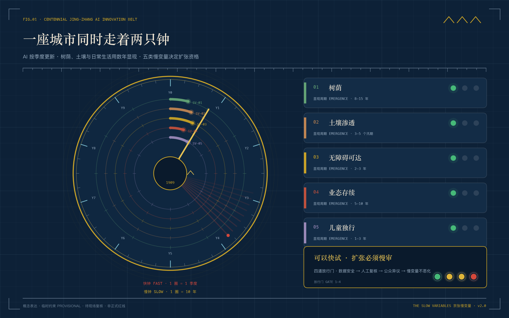
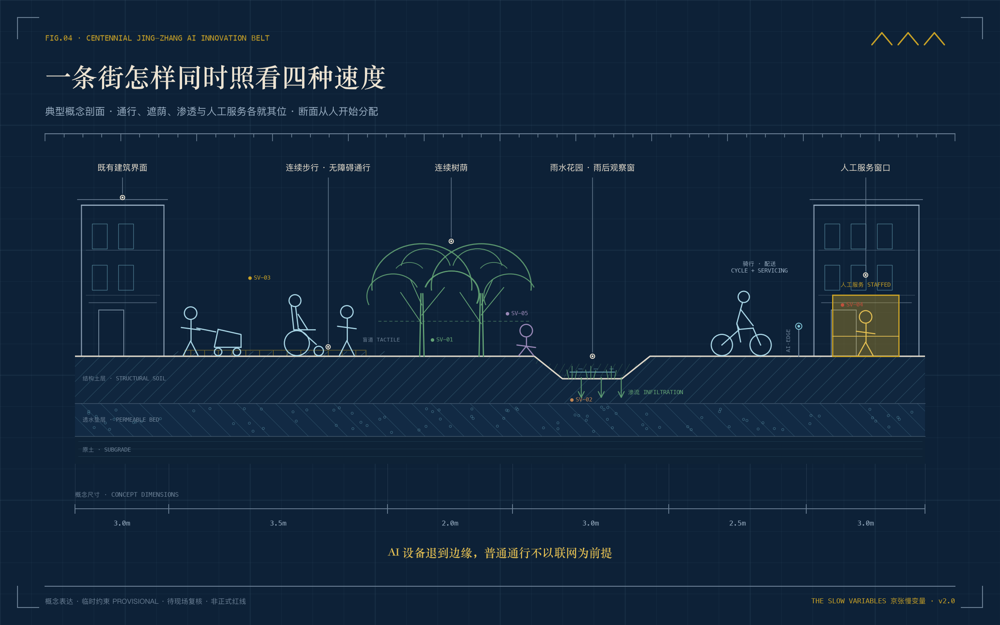
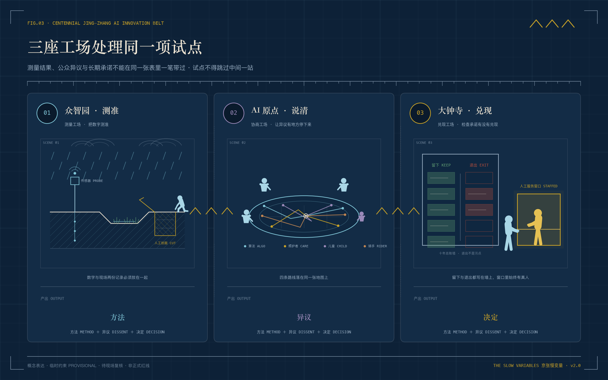
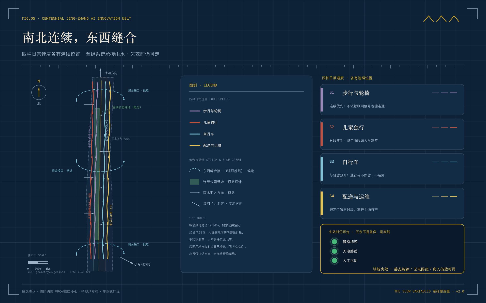

# 京张慢变量

## 一座城市怎样决定 AI 可以走多快

城市里同时走着两只钟。

一只钟走得很快。模型几个月换一代，应用几周更新一次，一个城市试点从发布到扩点，有时只隔一个季度。

另一只钟很慢。树从栽下到成荫要许多年。雨水落到土地以后能不能渗下去，要经历一轮轮汛期。坡道、路口和人工窗口是否真正好用，要等不同的人反复经过。沿街小店能否留下，儿童能否自己走完一段路，也要在日常生活里慢慢看出来。

这条走廊自己就是答案的起点。1909 年，京张铁路通车。詹天佑在关沟遇上爬不上去的坡，没有等一台更有力的机车，而是把线路折成"人"字，用折返换高度。这条铁路从一开始就懂得一件事：速度要向坡度低头。一百多年后，AI 进入同一条走廊，快的是模型，慢的是城市，坡还在这里。

官方为这条走廊写下过另一句话。2019 年 12 月 30 日京张高铁通车，最高时速 350 公里，被称为"从时速 35 公里到 350 公里"的跨越 [source:SRC-JINGZHANG-35-350]。快的一百年已经有结论了。这份方案关心另一个问题：在 350 公里的走廊旁边，一棵树、一家小店和一个孩子的时间，由谁来守护。

京张 AI 创新带会遇到一个绕不过去的问题。快钟可以催着项目上线，谁来替慢钟说话。

这份方案给出的回答很克制。任何进入公共空间的 AI 场景，先接受五类慢变量（SV-01 至 SV-05）的约束。它要照看树荫和土壤，也要照看无障碍可达、街区业态存续和儿童独立出行。项目可以快试，扩张必须慢审。技术是否新颖只决定它有没有资格小试，长期公共价值才决定它能不能留下。

> **这张图怎么看。** 外圈 40 格刻度是快钟，一格一个季度；五圈彩色弧环是五类慢变量 SV-01 至 SV-05，各自只走过十年中的一小段。右侧卡片给出每类变量的显现周期，底部四盏铁路信号是四道放行门 G1 至 G4。

> **阅读提示。** 本方案没有现场踏勘数据，也不虚构居民访谈。图中的空间范围来自公告文字与面积校核形成的临时粗略几何。五类慢变量目前是测量框架，尚无沿线基线。正文描述的是一年试点进入场地后应怎样测量、协商、决定和退出。图件中的人物与空间均为概念表达，不是现场记录。正式边界、控规、产权、现状建筑、市政和文保资料到位后，整包重新定位与复算。

## 设计依据与资料清单

慢变量听起来像一个指标体系，它先是一条诚实规则。现有公开材料能确定三层研究范围、三处重点区、任务方向和成果深度，也提供一份临时边界；它们没有告诉我们真实道路红线、建筑权属、现状树冠、土壤渗透、商户更替和儿童路线。方案只把前一类写成已知事实，后一类全部列为一年基线任务 [source:OFFICIAL-ANNOUNCEMENT] [data:geometry/site_boundary.geojson#SITE-001] [metric:site_area_sqm]。

资料分成三层使用。公告、任务书和正式规范控制项目范围与成果语言。公开登记资料帮助理解京张遗产、公园方向和 AI 生态背景。提交包里的 GeoJSON 只承载概念空间关系。临时总体范围约 11.41 平方公里，三处重点区均为 provisional constraint，不能支撑征拆、权属、工程定位或法定面积结论 [standard:MOHURD-CONTROL-DETAILED-PLANNING] [depth:existing_conditions_diagnosis]。

图件也遵守同一边界。规划关系图从本包几何和指标生成。场景图是“试点若发生”的建筑竞赛式插画，目的在于说明人怎样使用空间，不作为现场影像、公众意见或建成承诺。这个区分会一直写在图注和版权声明里。

另有一层在地公开材料需要单独说明。2026 年 8 月 11 日，京张铁路遗址公园沿线九个街区的控制性详细规划获得批复，官方空间结构为“一带一轴、两心多点”，大钟寺与五道口被定为两心 [source:SRC-HD-STREET-CTRL-PLAN-2026]。这份控规的范围与本方案征集范围并不等同，不能互相套用；但它的存在说明，本方案“南北主脊加三座工场”的空间判断与官方方向一致。方案把它作为背景依据引用，不把它当作征集边界，也不从它反推任何法定控制。遗址公园分段开放、清华园车站修缮、清河老站房平移等在位事实，来自政府发布与主流新闻报道，逐条登记于 `sources.json`。它们进入叙事与测量计划，不进入形式证据层，也不作为现状调查结论。

## 三层范围工作框架

慢变量在三个尺度上做三件不同的事。

43.6 平方公里统筹研究范围先统一问题。高校、园区、社区和服务机构如果各自测量，最后得到的数字无法比较。带级公共账本因此只规定口径、更新周期和异议程序，不替各片区下结论。

11.4 平方公里总体设计范围把口径变成一张连续空间网络。一条南北公共主脊负责长期观察，三处东西向候选接口把校园、社区、轨道和公园重新接到一起。边界只是淡色约束，真正需要被看见的是人怎样穿过这条带 [standard:PROJECT-OFFICIAL-ANNOUNCEMENT] [depth:three_level_scope_framework] [data:geometry/roads.geojson#ROAD-001]。

这条主脊有真实的物理底本。京张铁路遗址公园沿老京张线位分段建设，一期清华东路至知春路段 2.4 公里、16.8 公顷已于 2023 年 6 月开放，2026 年 8 月二期建成后全线约 9 公里贯通西直门与北五环，老铁轨、道口意象与人字坡元素被保留下来 [source:SRC-HERITAGE-PARK-P1-2023] [source:SRC-HERITAGE-PARK-P2-2026]。方案的时间主脊与它同向而行——要观察的第一批慢变量，就包括这座公园自己的生长。

368.4 公顷重点范围承担现场决策。众智园负责把数据测准，AI 原点负责让不同的人把话说清，大钟寺负责检查承诺有没有进入日常生活。它们构成“测量、协商、兑现”的南北序列。任何试点都不能跳过中间一站直接从实验室走向全城。

> **这张图怎么看。** 淡色虚线只是临时边界，不是主角。真正要读的是黄铜色的南北时间主脊和上面的里程刻度：三座工场 01 至 03 从北到南分别负责测量、协商、兑现，三条青色接口把两侧城市生活缝进来。

## 统筹研究范围产业与未来城市研究

“京张慢变量”不是给技术踩刹车。它给好技术一条更可信的上线路径。一个产品在实验室里证明性能以后，还要回答几件城市问题。它有没有占掉普通人的选择。设备坏掉时谁来接手。运行一年以后，公共空间和街区生活留下了什么。

这个判断把任务书的三大定位接到同一条时间线上。百年京张文化带保存跨代记忆，都市 AI 生活体验带承担日常使用，AI 融合创新带容纳快速试验。五大功能分别进入测量、研发、场景、城市服务和治理规则。中关村科技服务翼提供高校、标准、法务、资金与人才支持，小月河场景翼提供经授权的真实问题。三区负责让这条链从性能走到公共价值 [source:AGENT-TASKBOOK] [standard:PROJECT-AGENT-OPEN-CALL-TASKBOOK]。

算力、资金、数据三类要素按"谁提供、怎么计价、如何退出"写成概念机制，不为任何项目永久锁定。算力由中关村科技服务翼对接的公共与高校算力渠道按任务时段申请，计价以可审计的用量记录为准，项目退出即释放资源并注销任务。资金区分两级：小试经费只走公共创新与城市更新类渠道类别，扩点资金在项目通过 G4 以后才允许讨论，任何一级都不写成预算承诺。数据坚持最小化与去标识，场景数据的使用权随项目退出而终止，保存期限与删除方式在 G1 之前写清。三要素的提供方都只是渠道类型，具体主体待后续授权与公开程序确定 [source:AGENT-TASKBOOK]。

走廊的人才底座比任务书更老。1952 年院系调整在学院路两侧留下“八大学院”——航空、地质、矿业、林业、医学、钢铁、石油、农机八所专门学院，今天它们已长成北航、地大、矿大、北林等高校群 [source:SRC-BAXUEYUAN-2025]。同一时期，五道口还只是老京张出北京北站的第五个道口，名字一直留到道口拆除之后 [source:SRC-WUDAKOU-NAME-2023]。AI 创新带不是在一块空地上降临的，它叠在七十年学院区与一百年铁路的同一张底图上。

七个全球案例提供方法参照。Barcelona Superblocks 展示街道空间怎样重新分配，Paris 15-minute city 强调近邻服务，Helsinki Kalasatama 把居民时间纳入目标，Amsterdam AMS Institute 组织城市 living lab，Toronto Quayside 暴露数据治理的代价，Singapore Punggol Digital District 处理园区合作，Seoul Digital Mayor's Office 让公共指标可见。

七条参照要经得起拆检。下表逐条写明带走什么、落在哪里、明确不带什么，防止借鉴在图纸上悄悄变成复制。

| 案例 | 可迁移机制 | 在本方案的落位 | 明确不迁移 |
|---|---|---|---|
| Barcelona Superblocks | 街道空间还给步行与停留 | 三处东西接口慢行修补（P3） | 成片封闭车行的街区改造 |
| Paris 15-minute city | 近邻服务圈组织日常生活 | 一刻钟便民圈抽样框与 SV-04 | 自上而下的功能分区指令 |
| Helsinki Kalasatama | 把居民时间列为优化目标 | 场景卡耗时类指标（如 06 卡） | 把时间作为唯一排序标准 |
| Amsterdam AMS Institute | living lab 的城市试验组织 | 众智园基线实验室与失败样本园 | 常驻机构与固定预算模式 |
| Toronto Quayside | 数据治理失控的公开教训 | G1 数据门与退出记录制度 | 数据信托实体与密集传感网 |
| Singapore Punggol Digital District | 园区与高校企业协同 | 服务翼算力与合规测试渠道 | 整片新建数字园区 |
| Seoul Digital Mayor's Office | 公共指标向市民持续可见 | 年度总账发布日与 L4 总账墙 | 实时大屏式城市驾驶舱 |

方案借鉴它们的提问方式，不复制规模、投资和空间形式 [source:SOURCE-REGISTRY] [depth:overall_spatial_structure]。

品牌标识由两只不同速度的圆环和五道刻度组成。外环每年走一格，内环每季度走一圈。五道刻度对应五类慢变量。它可以出现在基线碑、土壤观察窗、路线标记和年度总账上，成为一套不依赖屏幕的公共识别系统。

## 区域协同接口：慢变量方法怎样走出走廊

两只钟不只走在这条走廊里。任务书把区域协同写进评审维度，点名北纬社区、未来科学城、怀柔科学城、经开区与京津冀 [source:AGENT-TASKBOOK]。北京的科技创新空间也不是单点结构。在市总体规划的实施中，“三城一区”被列为重点功能区：中关村科学城覆盖海淀全域，未来科学城聚焦能源与材料等共性技术研发平台，怀柔科学城承载大科学设施，经开区承担创新型产业集群与制造转化 [source:SRC-THREE-CITIES-ONE-ZONE]。京张走廊位于中关村科学城内部，它不是“三城一区”之外的第六极，而是这套结构里负责城市日常验证的那一段。

协同在慢变量的语言里只有一种诚实的形式：交换可复核的方法，不交换未验证的结论。走廊向外输出的不是“成功案例”，而是四道放行门、慢变量基线方法、年度总账格式和退出记录。别的区域可以拿走尺子，不能拿走读数。走廊向内承接的是真实问题：科学成果的城市转译需求、制造工况的复测需求、跨城通勤与公共服务的比较需求。

| 协同对象（任务书点名） | 走廊可输出 | 走廊可承接 | 保留的边界 |
|---|---|---|---|
| 北纬社区 | 社区服务场景的慢变量清单与人工复核流程 | 居民使用问题与无障碍反馈 | 不虚构共同运营或居民授权 |
| 未来科学城 | 城市使用问题清单与放行门小试机制 | 共性技术成果的城市化测试方法与专家复核 | 不把研究结论写成可部署产品 |
| 怀柔科学城 | 科学成果向公众转译的协商桌与叙事方法 | 测量与校准方法、跨学科验证建议 | 不触及非公开科研与设施数据 |
| 经开区 | 通过四道门场景的工程化问题单 | 制造工况复测记录与安全要求 | 不虚构企业、订单或产线合作 |
| 京津冀 | 去地点化的慢变量方法包、失败记录与版本差异 | 京张高铁沿线的跨城公共服务比较与异地复测 [source:SRC-JINGZHANG-35-350] | 不输出本地坐标、个人数据与审批结论 |

承接也写得一样克制。走廊从周边板块承接通勤人流、产业外溢和科研转译需求，但承接不等于吸附。一家企业、一条轨道、一项设施是否进入走廊，取决于法定程序与区域间协商，不取决于本方案。本章全部是概念建议，不冒充法定规划或区域协议。任何接口在对方主体确认、数据许可与责任边界写清之前，保持“待协商”状态 [source:AGENT-TASKBOOK]。

## 总体设计范围城市更新与控规深度城市设计

总体设计不从一张炫目的总平面开始。它从一个普通下午开始。有人沿主脊往南走，先经过一段树荫，再遇到雨后积水；穿过一个东西接口时，轮椅和自行车各有连续位置；到大钟寺附近，他仍能在小店吃饭，也能在公共服务点找到真人。

空间结构因此很简单。一条时间主脊记录长期变化。三座工场处理数据、异议和承诺。五类观察面分别对应树冠、土壤、可达、业态和儿童路线。十二个场景节点先以可逆构件进入场地。四块概念用地完整覆盖临时边界，研发创新、公园开敞、产业商业和社区服务彼此连续 [standard:MNR-LAND-USE-CLASSIFICATION-GUIDE] [data:geometry/land_use.geojson#LU-001] [depth:land_use_layout]。

当前建筑图层只表达一个概念基底，不能用来判断任何真实建筑的命运。方案采用四级行动。先原状保留，再讨论低扰动修缮和可逆嵌入，最后才把需要专业论证的对象送入结构、权属、文保、消防和公众程序。容积率、建筑高度、法定建筑密度和总建筑面积保持待补状态 [data:geometry/buildings.geojson#BLDG-001] [depth:development_intensity_controls] [depth:height_massing_character]。

> **这张图怎么看。** 从左到右读，每一步都对应一种速度：树荫、雨水、轮椅、自行车和孩子在同一条街上各有位置，亮着黄铜灯的窗口是真人服务。图中宽度是概念尺寸，不是施工定位。

## 重点区域详细设计

### 众智园　把数字测准

一年试点的第一个雨天，土壤观察窗开始工作。传感器给出含水变化，运维人员同时打开剖面、检查积水和植物状态。两份记录必须放在一起。数字与现场判断冲突时，项目不能拿较好看的那一份去申请扩点。

众智园由此形成开放基线实验室、清河方向生态观察廊、人工复核厅和失败样本园。开放不等于公开个人数据。设备默认排除人脸与可识别轨迹，原始数据权限、保存期限和删除方式在试点前写清 [data:geometry/key_areas.geojson#PROV-KEY-001] [depth:three_key_area_detailed_design]。

清河方向有一个值得测准工场记住的先例。1905 年建成的清河老站房自重约 700 吨，京张高铁建设期间两次平移、累计移动约 360 米，最终留在新清河站东南角 [source:SRC-QINGHE-STATION-SHIFT-2021]。一座愿意为老站房修改施工图的城市，理应也愿意为一次测量等一个汛期。

### AI 原点　让异议有地方停下来

儿童独行路线进入小试后，算法会给出一条“最安全路径”。照护者、儿童、轮椅使用者、骑手和沿街工作人员可能给出不同答案。协商工场不急着消除分歧。它把路线画在同一张桌上，记录哪一段是谁反对、为什么反对、最后怎样修改。

首层共享界面布置慢变量阅览室、路线共绘桌、无障碍审计台和非数字反馈箱；审计台设低位台面与轮椅容膝空间，提交异议不需要站立或仰头。静态导向、人工求助和连续无障碍构成底线。校园接口和建设规模仍需权属及正式控制条件核实 [data:geometry/key_areas.geojson#PROV-KEY-002] [standard:BARRIER-FREE-ENVIRONMENT-LAW]。

“AI 原点”不是方案自造的名字。2026 年 1 月，海淀区 AI 原点社区入选全市首批人工智能创新街区，范围北临清华大学、南抵北四环西路 [source:SRC-AI-ORIGIN-BLOCK-2026]。离它不远，1910 年的清华园老站房还在原址，“清華園車站”匾额为詹天佑亲笔题写，车站 2023 年修缮开放并列为北京市文物保护单位 [source:SRC-QINGHUAYUAN-STATION-2023]。最新一代智能体与第一代自主铁路在同一处街角相遇。协商工场设在这里，不算巧合。

可以用一段合成旅程检验这张桌子是否真的能用。**郑岚是合成设计测试人物，不是真实访谈对象；本方案没有做过居民访谈，她存在的唯一理由，是替一类真实的身体条件把流程完整走一遍。** 郑岚使用轮椅，通勤会经过 AI 原点。她要完成的事很普通：对一条雨后总是积水的绕行路线提出异议，并看到它被处理。

**第一步，出闸。** 她在站口不需要打开任何应用。静态导向与人工求助点给出通往协商工场的无台阶路线——这是"最后五百米"先完成辨向、遮荫、坐憩和人工求助的底线。

**第二步，沿主脊。** 路线连续无高差。一处施工临时占道在慢变量路线标记上写明绕行与期限。这正是 SV-03 断点清单里"施工类临时断点单独标注时限"的那一类：计入公开清单，不计入恶化判定。

**第三步，到达。** 入口状态牌显示场景 03 共测正在招募。三层告知写清测什么、采什么、怎样退出。她决定不参加。这个选择不降低她获得任何服务的优先级，也不会被记录成画像。

**第四步，审计台。** 低位台面让她不必仰头。人工复核岗在场（G2），她口述问题：雨后绕行路线经过的坡道积水，轮椅要多等半小时。

**第五步，提交异议。** 她不用屏幕。工作人员代录，或者她自己填一张纸质表投进非数字反馈箱，当场拿到带编号的纸质回执。G3 的异议由此进入台账，而不是消失在口头。

**第六步，异议上桌。** 路线共绘桌上，她的断点与共测数据并排摆放；算法建议的"最安全路径"与她的实际耗时画在同一张图里。谁反对、为什么反对、最后怎样修改，逐条留档。

**第七步，修改。** 断点进入修复清单，排水界面先修补。修复完成前，相关路线推荐按场景卡 03 的退出阈值暂停。

**第八步，复测。** 她受邀参与复测，自愿，可拒绝。复测通过由她与审计员共同签字确认——这是她在这场流程里唯一留下名字的位置。

**第九步，闭环。** 五天后，她凭回执编号在异议站台查到结果：断点状态、修订版本、下一次共测时间。编号不绑定姓名，别人查不到她这个人。

这段合成旅程暴露了三处真实的设计缺陷，并已在正文里改正。其一，非数字反馈箱原本只写"定期人工开箱登记"，投递者拿不到任何凭证，异议是否进入台账无从查证；组件库已补上带编号的纸质回执。其二，场景 03 原本每月共测一次，默认白天工作时段，轮椅通勤者真正经过的早晚时段反而测不到；场景卡已改为每季度至少一次安排在通勤或晚间时段。其三，审计台最初只写了功能，没有写身体怎样接近台面；首层界面已补低位台面与容膝空间。旅程是合成的，缺陷是真实的，改正已经写进正文、场景卡与组件库。

### 大钟寺　检查承诺有没有兑现

一个排队助手上线以后，访问量很容易上涨。大钟寺问另一组问题。人工窗口有没有保留。老年人花的时间有没有减少。小店有没有因为新租金和新流量被替换。树下座位在夏天是否真的有人使用。

兑现工场设置慢变量总账墙、服务申诉台、年度陪审桌和小规模兑现市集。总账同时展示留下的项目和退出的项目。退出记录不是失败污点，它证明城市有能力及时停止无效试点。四象限连通和站点界面仅为概念方向，工程可行性仍待交通与产权专业核查 [data:geometry/key_areas.geojson#PROV-KEY-003] [depth:renewal_project_list]。

在获批的沿线控规里，大钟寺与五道口被定为沿线两个中心 [source:SRC-HD-STREET-CTRL-PLAN-2026]。“中心”是一个规划词汇，它的日常成色要在一碗饭、一次排队和一扇还开着的小店门里检查。这正是兑现工场存在的原因。

> **这张图怎么看。** 同一项试点要穿过三间屋子：先在众智园把数字测准，再到 AI 原点把分歧摆上同一张桌，最后到大钟寺检查承诺有没有兑现。任何一站缺席，试点不得扩点。

## AI 创新生态、人才画像与 AI+ 场景

一条 AI 创新带当然要服务开发者和企业，也要服务那些从来不会把自己称为“创新人才”的人。方案把七类使用者放在同一张图上。周边居民需要安静、遮荫和低门槛通行。儿童与照护者关心能否逐步放手。老年人与低数字素养者需要真人。一线运维、骑手和清洁人员最清楚系统在哪里卡住。小商户关心自己能否继续经营。开发者和初创团队需要合规测试。专业审查与运营人员需要可比较证据 [standard:ELDERLY-SMART-TECH-PLAN-2020-45] [depth:municipal_new_infrastructure]。

十二张场景卡分成四组。前三项是受控产业测试，其余九项进入日常服务。每张卡都写清数据边界、人工复核和退出条件。

| 组别 | 场景 | 城市里的具体动作 | 不能越过的边界 |
|---|---|---|---|
| 看土地 | 01* 树荫数字孪生 | 比较树冠模型与夏季现场复测 | 不用模型估值冒充实测 |
| 看土地 | 02* 雨后渗透诊断 | 传感器读数与人工剖面并行 | 不替代排水工程鉴定 |
| 看道路 | 03* 无障碍路线共测 | 轮椅、推车和步行者共同走线 | 自愿参与，保留纸质反馈 |
| 看道路 | 04 儿童独行陪测 | 分段放手，路口由现场人员响应 | 不做人脸识别和隐形跟踪 |
| 看街区 | 05 小商户存续助手 | 商户自愿记录经营区间和服务需求 | 不用于租金、征拆与信用评分 |
| 看服务 | 06 人工窗口排队助手 | 匿名队列提示，工作人员随时接管 | 始终保留线下办理 |
| 看研发 | 07 开源模型红队花园 | 用合成或清权数据公开复盘漏洞 | 漏洞按等级披露 |
| 看道路 | 08 慢行断点巡检 | 设备侧聚合，交通人员现场确认 | 不用个人轨迹执法 |
| 看夜间 | 09 低扰动照明 | 读取环境照度，投诉触发降级 | 不识别身份，不侵扰居住界面 |
| 看文化 | 10 京张遗产语音导览 | 本地内容包与人工史料审校 | 无定位也能使用 |
| 看规则 | 11 公共合同解释器 | 解释公开条款并标出责任人 | 不提供个案法律结论 |
| 看全年 | 12 年度慢变量陪审 | 发布聚合证据，异议进入扩点决定 | 陪审可否决扩张 |

动作和边界之外，每张卡还要补齐六个运营字段。谁负责跑、采集什么、多久采一次、谁来复核、什么情况停止、怎样算成功，缺一栏，这张卡就不进入场地。验证方法单列一栏，写清怎么测、什么情况切人工、对照怎样设计、每个阶段验证什么。

| 场景 | 运营者 | 数据字段 | 采集频率 | 人工复核机制 | 退出阈值 | KPI | 验证方法 |
|---|---|---|---|---|---|---|---|
| 01* 树荫数字孪生 | 众智园基线实验室，园林养护单位协管 | 树冠模型值、实测遮荫时长 | 季度建模，夏季现场复测 | 园林专业人员与运维人员双签比对记录 | 模型与实测连续两季偏差超约定区间 | 实测遮荫连续性改善，偏差点全部公开 | 测夏季实测遮荫时长与连续性并对照模型值；偏差超约定区间即以实测为准、人工复核；试点段与未干预段对照，兼做治理前后对照；原型期校准模型，试点期双签比对，推广期年度复测 |
| 02* 雨后渗透诊断 | 众智园基线实验室，市政运维协管 | 土壤含水、积水深度与消退时长 | 每场雨后，人工剖面月度抽检 | 运维人员开挖剖面与传感器读数并列存档 | 读数与剖面连续冲突，该点位结论作废 | 雨后恢复时间可复测地缩短或保持稳定 | 测雨后恢复时长与积水消退曲线；读数与剖面冲突时以人工剖面为准；依托小月河施工前后窗口并设未治理样点对照；原型期建基线，试点期逐场验证，推广期汛期复核 |
| 03* 无障碍路线共测 | AI 原点协商工场无障碍审计台 | 路线断点、坡度、通行耗时 | 每月共测一次，每季度至少一次安排在通勤或晚间时段 | 轮椅使用者与审计员共同签字确认 | 断点连续两月未修复，暂停相关路线推荐 | 断点修复率与参与者复测通过率 | 测断点密度、通行耗时与复测通过率；参与者不适或求助即转人工陪同；共测路线与未修补路线对照，兼做修补前后对照；原型期小样本共测，试点期月度共测，推广期季度抽查 |
| 04 儿童独行陪测 | AI 原点，学校与社区志愿网络协管 | 分段放手里程、路口事件类型 | 学期内每周陪测 | 现场响应人员与照护者共同复盘 | 任一参与者退出或发生安全事件即停测 | 独立完成路段增长，全程无隐形跟踪 | 测独立完成里程占比与路口事件类型；迟疑、求助或安全事件即由现场人员介入；只做路线分段前后对照，不设儿童之间的对照；原型期短段陪测，试点期逐段放手，推广期学期复核 |
| 05 小商户存续助手 | 大钟寺兑现工场，商户自愿报名 | 经营区间、租金压力自述、服务需求 | 季度自愿填报 | 商户代表逐条确认后才入总账 | 数据被用于租金、征拆或信用目的即整体下线 | 自愿参与商户的存续率可逐年比较 | 测参与商户存续率与需求类别变化；商户要求即转人工登记并可撤回数据；五道口对照节点与大钟寺界面年度同比；原型期自愿小样本，试点期季度填报，推广期年度普查对照 |
| 06 人工窗口排队助手 | 大钟寺公共服务点运营方 | 匿名队列长度、等待时长 | 实时聚合，每日汇总 | 工作人员随时接管并复核异常提示 | 出现裁撤人工窗口迹象即停用助手 | 老年人平均耗时下降，线下渠道完整保留 | 测老年人平均耗时与线下渠道完整度；工作人员随时接管，异常提示一律人工复核；启用前后对照并设未启用服务点对照；原型期单窗口，试点期多点运行，推广期年度服务审计 |
| 07 开源模型红队花园 | 众智园，开发者社区共管 | 合成或清权数据上的漏洞与复盘记录 | 随版本迭代 | 安全研究人员分级审核后披露 | 出现真实个人数据即清场停办 | 漏洞复盘公开率与平均修复周期 | 测漏洞复盘公开率与平均修复周期；发现真实数据迹象即人工清场；按版本前后对照漏洞密度，不设区域对照；原型期内部红队，试点期公开复盘，推广期方法跨项目复用 |
| 08 慢行断点巡检 | 交通运维单位，设备方配合 | 设备侧聚合的断点事件 | 实时聚合，每周现场核对 | 交通人员现场确认后才入库 | 被发现用于个人轨迹执法即拆除 | 断点确认率与平均修复时长 | 测断点确认率与平均修复时长；设备聚合事件未经现场确认不入库；试点段与对照段对照，兼做修复前后对照；原型期设备校准，试点期每周核对，推广期月度抽核 |
| 09 低扰动照明 | 街区物业与照明运维单位 | 环境照度、投诉记录 | 连续读取，投诉触发复核 | 夜间巡查人员现场确认降级执行 | 投诉持续上升或侵扰居住界面即降级关闭 | 投诉率下降且功能照度达标 | 测投诉率与功能照度达标情况；投诉触发夜间巡查人员现场确认后降级；示范段与相邻未改造段对照，兼做改造前后对照；原型期单段试灯，试点期投诉联动运行，推广期年度照度审计 |
| 10 京张遗产语音导览 | 遗址公园运营方，史料审校组 | 内容包版本、无定位使用统计 | 内容季度审校 | 文史人员逐条审校后发布 | 史实错误未被纠正即下架该条目 | 无定位可用率与审校通过率 | 测无定位可用率与审校通过率；史实争议即转人工审校并暂停该条目；按内容版本前后对照，不设区域对照；原型期小内容包，试点期季度审校，推广期开通公众纠错通道 |
| 11 公共合同解释器 | 大钟寺兑现工场，法律志愿团队协管 | 公开条款文本、解释版本 | 条款更新即复核 | 法律志愿者与条款责任人双确认 | 被当作个案法律结论引用即停服整改 | 公开条款覆盖完整率与纠错响应时长 | 测条款覆盖完整率与纠错响应时长；个案咨询即转人工法律志愿渠道；按条款更新前后对照解释一致性；原型期小条款库，试点期双确认发布，推广期年度条款审计 |
| 12 年度慢变量陪审 | 年度陪审团，运营方提交证据 | 聚合证据、异议记录、退出决定 | 年度 | 陪审员公开质询，分歧如实记录 | 证据无法复核即否决当年全部扩点 | 陪审否决被实际执行的比例 | 测陪审否决执行比例与证据可复核率；证据无法复核即转人工逐项核验；以留下与退出项目清单做年度纵向对照；原型期模拟陪审，试点期首次正式陪审，推广期十年总账对照 |

四道放行门决定一个场景能否扩大。默认处置原则只有一条：任何条件不满足，默认不放行。举证责任在项目方，不在公众。通过不等于永久安全，每道门都保留停止条件。

| 放行门 | 检查内容 | 默认处置（条件不满足时） | 停止条件（通过后仍然触发） |
|---|---|---|---|
| G1 数据与安全 | 数据最小化、去标识与安全评估 | 默认不放行，退回补充证据 | 发现超范围采集或安全事件即停 |
| G2 人工复核 | 现场人工复核机制真实运行 | 默认不放行，维持小试规模 | 人工复核缺位、被架空或被绕行即停 |
| G3 公众异议 | 异议被记录、回应并允许再诉 | 默认不放行，异议未闭合不扩点 | 重大异议未解决即暂停扩张 |
| G4 慢变量体检 | 五类慢变量无一恶化 | 默认不放行，项目缩小、暂停或退出 | 任一慢变量恶化即触发缩减或退出 |

任何一门未通过，项目缩小、暂停或退出 [source:AGENT-TASKBOOK] [data:geometry/public_space.geojson#PUBLIC-001] [depth:risk_missing_data]。

### 分群体验收：总体平均不得掩盖任一群体的失败

包容性设计最常见的失败方式，是用总体均值掩盖某一类人的失败。无障碍共测的平均通过率可以是九成，而轮椅使用者全部卡在同一个断点上。因此对涉及具体群体的五张场景卡——03 无障碍共测、04 儿童独行、06 人工窗口、09 低扰动照明、12 年度陪审——验收判据拆到群体一级：每个适用群体有独立判据与独立分母，任一群体未通过，即视为该场景未通过对应放行门。机器可读版本登记于 `visual/assets/group-acceptance-contract.json` [data:visual/assets/group-acceptance-contract.json]。

| 场景 | 群体 | 独立验收判据 | 分母 | 未通过时的动作 |
|---|---|---|---|---|
| 03 无障碍路线共测 | 轮椅使用者 | 共测复测通过率按参与者逐人判定，不并入总体均值 | 全部自愿报名的轮椅使用者，逐人 | 任一人连续两次复测未通过，该场景视为未通过 G2，暂停相关路线推荐 |
| 03 无障碍路线共测 | 老年人与低速步行者 | 通行耗时按 P90 分位判定，不用平均值 | 参与老年人逐次通行记录 | P90 未改善即触发断点复检 |
| 04 儿童独行陪测 | 儿童照护者 | 知情同意与撤回 100% 可经纸质或口头完成 | 全部登记照护者 | 任一撤回未被执行即整体停测 |
| 06 人工窗口排队助手 | 老年人 | 老年人平均耗时单独报告，不并入全龄均值 | 匿名聚合的老年人窗口使用次数 | 老年人耗时未降即视为未通过 G2，即便总体数字在下降 |
| 06 人工窗口排队助手 | 低数字素养者 | 不使用助手的任务完成率单独统计 | 选择不使用助手的使用者，逐次 | 完成率显著更低即触发人工接管复核 |
| 09 低扰动照明 | 相邻居住界面居民（含老年人） | 投诉按居住界面逐单位计，不做街区平均 | 示范段全部相邻居住界面 | 任一界面投诉持续上升，即对该界面降级或关闭 |
| 09 低扰动照明 | 低数字素养者 | 投诉可经电话与纸质渠道提交，不依赖应用 | 全部投诉渠道记录 | 非数字渠道缺失即视为该场景未通过 G3 |
| 12 年度慢变量陪审 | 上述全部群体 | 陪审证据包分群体呈现 03/04/06/09 结果，不设合并均值 | 四群体 × 适用场景全覆盖 | 任一群体的结果缺席，陪审可据此否决当年扩点 |

这张表没有改变任何一张场景卡的动作，只改变了验收的统计单位：从"平均的人"改成"具体的人"。分群体判据目前覆盖 5/5 个适用场景，登记为可复算指标 [metric:group_specific_acceptance_coverage]；所有现场数值仍待授权基线，当前一律为 unknown。

## 用地、建筑规模与拆改留方案

用地结构服务两只钟。快钟需要研发、测试和企业服务空间。慢钟需要连续绿地、社区服务、低租金小尺度界面和能被反复使用的公共空间。四块概念分区以共享边界完整覆盖提交范围，没有留下未定义空白 [standard:MNR-LAND-USE-CLASSIFICATION-GUIDE] [data:geometry/land_use.geojson#LU-001] [depth:retain_renovate_demolish]。

提交图层复算的概念建筑基底约 31.08 万平方米。这个数字只用于检查本包内部的空间关系。缺少楼层、权属、正式边界与控规以后，总建筑面积、容积率、法定建筑密度和高度都不能得出。任何具体拆除、新建和改造清单均须等现场调查与专业程序 [metric:building_footprint_area_sqm] [depth:development_intensity_controls]。

设计优先改界面，少动主体。成熟街区和遗产空间先保留，闲置首层可以低扰动修缮，慢变量设施采用可拆卸构件。若一项技术必须以大规模拆除、封闭公共空间或排除原有使用者为代价，它在进入四道门以前就应退回重做。

## 交通、轨道、市政与公共服务设施

典型断面从人开始分配。连续步行与无障碍通道位于最稳定的一侧，树阵和雨水花园承担遮荫、渗透与速度缓冲，自行车和配送有清晰位置，停留与装卸离开主通行带。三个东西接口分别连接众智园、AI 原点和大钟寺的两侧城市生活 [data:geometry/roads.geojson#ROAD-001] [depth:traffic_rail_slow_parking]。

轨道接驳不预设跨线工程。站口到公共服务的最后五百米先完成辨向、遮荫、坐憩和人工求助。AI 导航失效时，静态标识、无电路线和真人仍然可用。

市政从可逆观察开始。土壤含水、积水、照度和设备状态可以被测量，传感器不能证明排水、电力、消防和算力容量。饮水、厕所、遮荫座椅、人工窗口、非机动车停放和无障碍连续性排在新增屏幕之前 [depth:municipal_new_infrastructure] [standard:MOHURD-URBAN-DESIGN-MEASURES]。

> **这张图怎么看。** 四种颜色是四种日常速度，各自保有连续的位置；弧形虚线是把两侧缝起来的东西接口。导航失效时，静态标识、无电路线和真人仍然可用——冗余不是备份，是底线。

## 蓝绿空间、公共空间与城市风貌

概念绿地约占临时范围 12.34%，概念公共空间约占 7.39%。它们是提交几何的内部设计量，不是现状调查，也不是法定绿地率或公共空间供给标准 [metric:green_ratio] [metric:public_space_ratio] [depth:blue_green_public_space]。

蓝绿空间的判断标准落在身体上。夏季有没有连续树荫，雨后多长时间恢复，轮椅能否绕开积水，儿童是否有看得懂的连续路线。设备可以帮忙测，最后仍需人去走、去坐、去检查。

任务书要求不少于三处 AI 朝圣地标，方案明确设立五处并单独列出：两处锚定真实历史，三处是方案自有的慢变量地标。它们都不做巨型科技雕塑 [source:AGENT-TASKBOOK] [depth:blue_green_public_space]。

| 编号 | 朝圣地标 | 位置 | 朝圣理由 |
|---|---|---|---|
| L1 | 清华园车站遗址 | AI 原点一侧 | 1910 年老站房与詹天佑题匾仍在原址 [source:SRC-QINGHUAYUAN-STATION-2023]。第一代自主铁路是“速度向坡度低头”的物证，AI 时代的朝圣从这里出发 |
| L2 | 零号基线碑 | 众智园北端 | 公开每一类慢变量的测量方法和失败记录。朝圣的对象不是技术奇迹，而是“先测准再说话”的方法本身 |
| L3 | 异议站台 | AI 原点 | 保存少数意见与修订版本。来这里看一座城市怎样认真处理“不同意” |
| L4 | 大钟寺十年总账墙 | 大钟寺 | 在古钟一侧逐年展示留下的项目、退出的项目和兑现的承诺。“中心”的成色在一碗饭、一次排队里接受检查 |
| L5 | 放行门信号群 | 主脊沿线四道门位置 | 每通过一道放行门点亮一盏铁路信号灯。朝圣者沿主脊走一遍，就能读完一个项目被允许变快的全部条件 |

荣誉只授予可复现方法、公共贡献和及时退出，不按融资额与流量排名。五处地标都是概念建议，落位待权属与文保程序核实。

### 慢变量组件库

地标之外，走廊的日常面由一组可复制的组件承担。它们全部提炼自前文出现过的设施，统一写成参考规格，方便任何街区按同一把尺子装配，也方便在退出时完整拆走、不留烂尾界面。

| 组件 | 规格要点 | 适用场景 | 挂钩慢变量/放行门 |
|---|---|---|---|
| 零号基线碑（L2） | 立式碑体，刻测量方法与失败记录 | 众智园北端、主脊入口 | 全部 SV，G1 前置公开 |
| 土壤观察窗 | 可开启剖面加传感器井，一米见方级 | 众智园、雨水花园样点 | SV-02，G1 |
| 树冠复测样方标记 | 地面嵌入式样方边界，可复位复测 | 绿廊与森林公园候选点 | SV-01，G4 体检数据源 |
| 慢变量路线标记 | 双环标识嵌钉与立牌，不依赖供电 | 主脊沿线、三处东西接口 | SV-03/05，G2 |
| 儿童陪测路线牌 | 儿童视线高度的图标分段编号 | 学校与社区之间的陪测路线 | SV-05，G2/G3 |
| 异议站台（L3） | 可擦写展板加意见留档格，存修订版 | AI 原点协商工场 | G3 异议闭合 |
| 非数字反馈箱 | 纸质投递，定期人工开箱登记，投递人当场取得带编号纸质回执 | AI 原点首层、大钟寺服务点 | G2/G3 |
| 年度总账发布栏（L4） | 版面逐年更换，留下与退出同屏 | 大钟寺兑现工场 | 全部 SV，G4 |
| 人工窗口服务点 | 真人柜台常驻，助手只做匿名提示 | 大钟寺公共服务点 | SV-04，G2 |
| 可逆铺装与设施模块 | 干式可拆卸构件，撤除后恢复原界面 | 十二个场景节点、接口修补段 | 全部，退出门配套 |

上表全部是参考规格与概念尺寸区间，不是施工图。任何组件落位之前，仍须经过权属、文保与专业程序核实 [source:AGENT-TASKBOOK] [depth:blue_green_public_space]。

## 更新项目清单、实施政策与分期计划

方案把分期写成四季，而不是一串遥远年份。

春季先看土地。众智园启动树冠、土壤和雨后恢复基线。夏季去走路。三处接口接受热舒适、无障碍和儿童路线共测。秋季看街区。大钟寺记录商户、人工服务和公共空间使用。冬季开总账。留下、修改和退出的项目一起接受年度陪审。

0 至 1 年只做基线、现场审计和三项可逆小试。2 至 3 年只扩展通过四道门的场景，并修补三处横向接口。4 至 10 年依据年度总账决定固化、迁移或撤除。分期几何表达一期讨论范围，不代表投资、开工或政府安排 [data:geometry/phasing.geojson#PHASE-001] [depth:phasing_implementation]。

四级行动需要落到具名项目才算清单。下表给出八个概念更新项目，位置挂接三座工场与主脊沿线 [data:geometry/key_areas.geojson#PROV-KEY-001] [data:geometry/key_areas.geojson#PROV-KEY-002] [data:geometry/key_areas.geojson#PROV-KEY-003]，规模区间为按临时几何与场景卡推演的量级，资金量级是估算类别而非预算承诺。八个项目全部保持可逆构件与低扰动修缮优先，任何一项在权属、控规与专业程序到位前不进入实施 [depth:renewal_project_list]。

| 编号 | 项目名称 | 位置 | 规模区间（推演量级） | 责任主体类型 | 资金量级（估算类别） | 挂钩慢变量与放行门 |
|---|---|---|---|---|---|---|
| P1 | 慢变量基线设施包（土壤观察窗、树冠复测点、路线标记） | 众智园与时间主脊沿线 | 点状设施，用地合计约 0.5–1 公顷量级 | 区属平台公司＋高校团队 | 小额（百万级以下） | SV-01/02，过 G1 |
| P2 | 开放基线实验室与失败样本园改造 | 众智园重点区 | 闲置首层修缮，建筑面积约千平方米量级 | 区属平台公司＋高校团队 | 中额 | 服务全部 SV 测量，过 G1/G2 |
| P3 | 三处东西接口慢行与无障碍修补 | 三条东西向候选接口 | 街道界面级，每处数百米 | 街道＋专业设计团队＋社区营造组织 | 中额 | SV-03/05，过 G2/G3 |
| P4 | AI 原点共享首层（慢变量阅览室、路线共绘桌、无障碍审计台、非数字反馈箱） | AI 原点重点区 | 首层界面改造，建筑面积约千平方米量级 | 街道＋高校＋社区营造组织 | 小额至中额 | SV-03/05，过 G2/G3 |
| P5 | 大钟寺兑现工场（总账墙、服务申诉台、年度陪审桌） | 大钟寺重点区 | 界面级改造加小型市集场地 | 区属平台公司＋属地街道 | 中额 | SV-04，过 G3/G4 |
| P6 | 低扰动照明与夜间慢行示范段 | 主脊邻近社区段 | 街道级，数百米示范段 | 街道＋照明运维单位 | 小额 | SV-01/03，过 G1/G3 |
| P7 | 儿童独行陪测路线网络 | AI 原点周边学校与社区之间 | 路线级，公里量级，无土建 | 街道＋学校＋社区志愿网络 | 小额 | SV-05，过 G2/G3 |
| P8 | 五道口—大钟寺小店界面保育与业态存续观察 | 五道口对照节点与大钟寺沿街 | 界面级修缮与观察设施，点状分布 | 区属平台公司＋商户自治组织 | 小额至中额 | SV-04，过 G3/G4 |

分期计划相应落位：P1、P2、P7 属于 0 至 1 年基线与小试；P3、P4、P6 在 2 至 3 年随过门场景扩展；P5、P8 在年度总账确认兑现需求后进入 2 至 3 年清单。4 至 10 年不再新增概念项目，只做固化、迁移或撤除。规模区间与资金量级的推演性质登记于 `assumptions.json`。

### 关键路径与授权依赖

八个项目不是并列的八件事，而是一条有先后之分的链。关键路径只有一条：P1 基线设施包建成，五类慢变量开测满一年，G1 与 G4 依据首年基线设定阈值，首次年度总账召开，之后的任何扩张才有依据。这条链上任何一环被跳过，扩张决策都会退化成拍脑袋 [depth:phasing_implementation]。

| 项目 | 前置依赖 | 需要谁确认什么 | 最早启动 | 卡住时的回退 |
|---|---|---|---|---|
| P1 | 无前置，本期即可启动 | 区属平台公司确认点位落位与数据管理权 | 0–1 年 | 点位未授权则退到已授权点位，样本结构不变 |
| P2 | 场地权属与使用授权 | 业主或平台公司确认场地授权；造价门确认 ROM 区间 | 0–1 年 | 授权未放行回退到露天基线点网络（并入 P1）；造价未放行回退到租用方案 |
| P7 | 学校与社区同意陪测 | 街道、学校、志愿网络三方确认安全责任边界 | 0–1 年 | 任何安全事件即停测并转入人工复盘 |
| P3 | P1 基线中的无障碍与热舒适读数 | 街道确认施工窗口，专业团队确认图纸 | 2–3 年 | 读数不足则只做最小修补，不做界面改造 |
| P4 | G2/G3 机制在 P2 内跑通 | 街道与高校确认共享首层运营分工 | 2–3 年 | 回退到 P2 内增设协商桌 |
| P6 | P1 基线中的夜间照明读数 | 照明运维单位确认接入条件 | 2–3 年 | 回退到单点示范段 |
| P5 | 首次年度总账确认兑现需求 | 平台公司与属地街道确认总账墙场地 | 2–3 年 | 总账改在线上发布，场地缓建 |
| P8 | SV-04 业态存续基线满一年 | 商户自治组织确认观察规则 | 2–3 年 | 只做观察记录，不做界面修缮 |

这张表同时是授权清单：哪一格的确认没有到位，哪一个项目就不进入实施。关键路径上的两个控制点——首年基线完成与首次年度总账——不被任何项目的进度压力绕过 [depth:renewal_project_list]。

### P0 样板：P2 开放基线实验室的公式级测算

八个概念项目里，P2 开放基线实验室与失败样本园改造最适合做第一块样板：它只做闲置首层修缮，不动主体结构；它服务全部五类慢变量的测量；它的规模又小到失败时可以整体退出。本节把它从清单里请出来做一次公式级测算。所有单价均为参赛者自设单价，非北京投标价，非报价；全部参数与算式登记于 `visual/assets/p0-cost-model.json` [data:visual/assets/p0-cost-model.json] [assumption:A-COST-006]。

**容量。** 开放使用面积取 600 ㎡，是参赛者自设取值：建筑面积约千平方米量级中约六成对公众开放，其余为人工复核厅、库房与设备间。人均面积取 2.5–4 ㎡，这是公共实验室与阅览室的通行标准区间——2.5 ㎡ 对应活动日，4 ㎡ 对应日常阅览与测量操作。同时容纳人数为 600÷4=150 至 600÷2.5=240 人。容量是上限而不是目标：超过 150 人的活动日采用预约与分时，不扩充面积 [metric:p0_capacity_persons_low] [metric:p0_capacity_persons_high]。

**人力。** 开放时长按每日 10 小时、年开放 300 日计，年开放工时 3000 小时。同时在岗两岗——开放帮助点与人工复核厅各一——年岗位工时 6000 小时。按有效工时 1680 小时/FTE、班次覆盖系数 1.2 计：6000÷1680×1.2≈4.29，向上取整为 5 FTE。没有这五个编制，人工复核岗就是一句口号，放行门 G2 不应当放行 [metric:p0_staffing_fte]。

**ROM 造价区间。** 分项与单价均为参赛者自设，加 35% 不可预见费；不含土地、税费、涨价、重大迁改，也不含结构与消防专项。

| 分项 | 计算式（参赛者自设单价） | 低值 | 高值 |
|---|---|---|---|
| 轻修缮 | 约 1,000 ㎡ × 800–1,500 元/㎡ | 80 万元 | 150 万元 |
| 机电接口 | 约 1,000 ㎡ × 300–600 元/㎡ | 30 万元 | 60 万元 |
| 家具与帮助点 | 阅览室、共绘桌、审计台、帮助点，打包估算 | 15 万元 | 30 万元 |
| 可逆构件 | 干式隔断与可拆展陈，打包估算 | 20 万元 | 40 万元 |
| 测量设备 | 土壤观察窗、传感器与校准工具 | 15 万元 | 35 万元 |
| 小计 | 五项之和 | 160 万元 | 315 万元 |
| 不可预见费 35% | 小计 × 0.35 | 56 万元 | 110 万元 |
| **ROM 合计** | 小计 × 1.35 | **约 216 万元** | **约 425 万元** |

这个区间的性质必须说清：它是参赛者自设单价推演出的量级判断，非北京投标价、非报价、非预算承诺；正式概算、供应商报价与计价基准日均为空 [metric:p0_rom_cost_low_million_cny] [metric:p0_rom_cost_high_million_cny] [assumption:A-COST-006]。

**单价公开锚定。** 自设单价不再悬空。轻修缮加机电的自设单价 800–1,500 元/㎡，落在北京市公共资源交易服务平台两宗在办项目的公开口径之间：朝阳区常营楼本体综合整治约 700 元/㎡（政府投资，按建筑面积摊薄，明确含无障碍与上下水改造，2024 年 10 月公告），海淀区同方科技广场内装改造约 1,721 元/㎡（主体结构不变，含拆除、隔断、强弱电、消防与空调改造，合同估算价口径，2026 年 2 月公告）。两个锚点均为合同估算价口径而非中标价，也都不是本方案的报价；它们的作用是证明自设区间没有脱离公开市场行情 [source:SRC-COST-CHANGYING-RETROFIT-2024] [source:SRC-COST-TONGFANG-RETROFIT-2026] [metric:p0_cost_public_anchor_count]。

设备与无障碍单项同样有公开参照。单处无障碍改造按政府补贴限额口径为万元级（每户 0.5–1 万元，京残发〔2020〕15 号）；土壤墒情监测站的公开中标单价为 3.18 万元/套（外地采购，作量级参照），P2 测量设备打包 15–35 万元约对应 5–10 套加校准工具。正式团队成立后，全部自设单价应按北京市造价总站逐月信息价与半年度老旧小区改造造价指数重新校准——该渠道已登记，其图片表格数值未逐项机读复核，本方案不直接引用 [source:SRC-COST-BARRIER-FREE-SUBSIDY-2020] [source:SRC-COST-SOIL-SENSOR-2024] [assumption:A-COST-009]。

**OPEX。** 人力按 5 FTE × 每人每年 12–18 万元计（参赛者自设综合用工成本，含保险与培训），为 60–90 万元；能耗、耗材、设备校准与保险约 30–60 万元；合计约 90–150 万元/年，同样是参赛者自设、非报价。运维部分有一个公开上限锚：海淀万柳一宗全委外物业服务中标价折合约 230 元/㎡/年（含 40 人团队的保洁、安保与设施运行全服务口径），本方案的能耗、耗材、校准与保险不在该口径内，故另行列项 [source:SRC-COST-PROPERTY-OPEX-2024]。P2 列入 0 至 1 年清单的前提，是这笔年度开销被写进运营接力，而不是只写进效果图 [metric:p0_opex_low_million_cny_per_year] [metric:p0_opex_high_million_cny_per_year]。

**验收指标二分。** 需要尚不存在的读数才能判定的验收，不是验收。P2 的验收指标分成两类：图纸与合同条款层现在即可判定的，和必须等待现场基线的。

| 编号 | 现在即可判定（图纸与合同条款层） | 判据 |
|---|---|---|
| J1 | 新增构件可逆比例 | 等于 100%，干式可拆卸写入图纸与采购条款 |
| J2 | 人工复核岗 | 写入岗位编制与排班表，缺编即不开门 |
| J3 | 非数字渠道 | 纸质反馈箱与纸质流程在开放首日可用 |
| J4 | 数据边界 | 设备默认排除人脸与可识别轨迹，写入采购技术条款 |
| J5 | 退出资金 | 拆除与恢复原状储备条款写入合同 |

| 编号 | 待现场基线 | 等待什么 |
|---|---|---|
| B1 | 五类慢变量首年基线 | 一年实测，见基线测量方案 |
| B2 | 实验室到访与使用率 | 开放后按日聚合 |
| B3 | 失败样本园入库样本量 | 试点项目实际退出或失败 |
| B4 | 数据冲突以人工记录为准的执行率 | 首次冲突事件后逐案登记 |
| B5 | 共测参与者分群体通过率 | 授权共测，判据见分群体验收一节 |

**备选方案。** 登记规则只有一条：备选必须在至少一个具名维度上真正优于 P2 主案，才准入册。两个备选通过了检验。租用现有社区空间改造，在造价与启用速度上更优，但开放时段与数据管理权受制于业主，跨年度的连续测量与失败样本的公开保存没有保障。只做露天基线点、不做室内，在造价与退出成本上更优，但冬季与汛期测量中断，人工复核厅与帮助点无处安放，G2 无法只在露天成立。回退规则也预先写好：若 P2 的权属与使用授权未放行，自动回退到露天基线点网络（并入 P1 设施包）；若场地授权到位而造价门未放行，回退到租用方案。登记册机器可读版本见 `visual/assets/delivery-alternatives-register.json` [data:visual/assets/delivery-alternatives-register.json] [assumption:A-COST-006]。

## 长期运营机制：年度总账、四季节奏与接力路径

长期运营从一个仪式性锚点开始。每年冬季，年度陪审结束后，在大钟寺 L4 十年总账墙前举行"慢变量年度总账发布日"：留下、修改和退出的项目同屏公布，未通过四道门的项目当众说明原因。发布日不是庆典，是这座走廊每年一次对快钟的公开回答。

四季活动历与分期逻辑同构，每一季都留下可下载的方法、局限、异议和退出决定。

| 季节 | 运营动作 | 对应空间 | 留下的公共产物 |
|---|---|---|---|
| 春 | 基线开工周：土壤观察窗与树冠复测点向公众开放 | 众智园、主脊绿廊 | 当年度基线方法与点位清单 |
| 夏 | 路线共测季：无障碍审计与儿童独行陪测开放报名 | AI 原点、三处东西接口 | 共测记录与断点修复清单 |
| 秋 | Slow Variables Assembly 国际开放周＋开发者修复营＋兑现市集 | 大钟寺、众智园 | 可复用方法包、漏洞复盘与商户存续观察年报 |
| 冬 | 年度总账发布日＋市民陪审团 | 大钟寺 L4 总账墙 | 年度总账、陪审记录、退出决定 |

运营主体按接力而非固定持有设计。发起方建议是区属平台公司，负责取得授权、开立公共账目和招募首任运营团队。维护方是三座工场的驻场运营团队，街道、高校与志愿网络按项目加入。每一场活动、每一项设施都预设退出：连续两年无法留下可下载公共产物的活动停办；运营权移交必须公开账目与未决异议；没有人接手的设施按可逆构件设计拆除，不留烂尾界面。

资金循环只写机制，不承诺金额。小试经费来自公共创新与城市更新类渠道类别，按年度总账决定的名单滚动分配。通过 G4 的项目获得下一年度扩展资格，未通过的项目剩余资源回流基线设施维护。招商与赞助只面向已通过 G3 的场景，赞助不购买数据、结论或陪审席位。主办、预算、招商与政策都要后续授权，方案不把概念活动写成既定事实 [source:AGENT-TASKBOOK]。

公平承诺不能只靠运营方的善意活着。下表把本方案反复承诺的六件事逐条挂上可审计的证据形式：承诺写在哪里，证据是什么，按什么节奏留下。任何一条证据断供，年度总账上都应当看得见。

| 公平承诺 | 承诺位置 | 可审计证据形式 | 留存节奏 |
|---|---|---|---|
| 始终保留人工窗口，不撤柜台 | 场景卡 06、慢变量组件库 | 窗口开放时段与等待时间日志（匿名聚合、逐日汇总） | 每日汇总，年度进总账 |
| 纸质反馈渠道始终可用 | 场景卡 03、慢变量组件库 | 开箱登记与带编号纸质回执的编号序列，缺号必须说明 | 每周开箱，年度进总账 |
| 不做人脸识别与隐形跟踪 | 场景卡 04、风险章 | 设备采购技术条款、共测双签记录、年度匿名性抽查记录 | 抽查每年一次，结果公开 |
| 儿童数据最小化 | 场景卡 04、风险章 | 采集字段清单、到期删除记录与删除回执编号 | 每学期核对一次 |
| 商户数据自愿、可撤回 | 场景卡 05 | 自愿报名登记、逐条确认记录与撤回执行记录 | 随季度填报同步登记 |
| 异议可再诉、可查询 | 放行门 G3、异议站台 | 异议回执编号、处置记录与再诉处理记录 | 随案登记，年度公开 |

## 指标体系、面积复算与合规矩阵

指标分成两张表，区别只在一件事：本包能证明什么，不能证明什么。第一张表里的数字都能被复算。临时范围面积、概念建筑基底、概念绿地和公共空间比例、三处重点区数量，任何人都可以用提交图层重新算出同一个结果。第二张表里的数字本包明确不能提供。树荫、渗透、可达、业态存续和儿童独行没有清权的沿线基线，容积率与法定建筑规模缺少正式边界和控规，因此全部保持待补，不填估值，也不承诺任何提升百分比 [metric:site_area_sqm] [metric:key_area_count] [depth:metrics_recalculation]。

一年以后，五类慢变量各自形成“基线、目标、复测、异议、决定”五栏。目标不由 AI 单独生成，由专业团队、使用者与运营者共同设定。算法可以发现异常，不能替公众决定多少变化才算值得。

首批候选测量点已经按公开资料圈定，位置均待现场核定。树荫观察放在遗址公园绿廊与塔院城市森林公园。土壤渗透对照小月河治理段——这条紧邻走廊东缘的河道 2026 年启动滨水空间建设，正好留下施工前后的对照窗口 [source:SRC-XIAOYUEHE-2026]。无障碍审计从西直门站换乘界面与塔院公园开始，后者在官方公园名录中被标注“无障碍环境暂不具备条件”，缺口是现成的 [source:SRC-TAYUAN-PARK-2022]。儿童独行陪测参考通学公交的覆盖经验，海淀首批试点校中的上地实验小学位于走廊北端方向，沿线学校是否已被覆盖仍待核实 [source:SRC-TONGXUE-BUS-2023]。业态存续普查以五道口为对照节点：2019 年闭市的服装市场原址已变为新业态空间，存续与置换的差别要在沿街小店里测，不在商场里测；海淀已建成的 92 个一刻钟便民生活圈提供抽样框 [source:SRC-WUDAKOU-MARKET-2022] [source:SRC-15MIN-HAIDIAN-2025]。

### 第一年基线测量方案：五类慢变量（SV-01 至 SV-05）

五类慢变量的基线值为首年实测，当前状态一律为待测（unknown）。本节规定测量方法、判定规则与公开格式，不给出任何数值结论。点位继承上文首批候选测量点，全部位置待现场核定；每类变量的恶化判定接入放行门 G4，触发 HOLD 即暂停相关项目扩点，复核后决定缩小、暂停或退出。

| 慢变量 | 观测点位（选取原则） | 样本量与采集频率 | 统计方法 | 恶化阈值（触发 HOLD） | 异常处理 | 公开格式 |
|---|---|---|---|---|---|---|
| SV-01 树冠树荫 | 遗址公园绿廊、塔院城市森林公园等候选点；每处重点区不少于 5 个固定样方，沿主脊均匀布设 | 季度遥感冠层解译＋夏季地面抽样实测遮荫时长，样方全检 | 样方均值的三年滑动平均与同比 | 连续两个观测周期，样方平均冠层覆盖或夏季遮荫时长下降超 5% | 风灾、病虫害等异常年单列标记；缺测样方以同类样方插补并注明，不静默填补 | 年度账本 JSON/CSV（点位、周期、覆盖率、遮荫时长、方法版本、异常标记）＋可视化页 |
| SV-02 土壤渗透 | 众智园土壤观察窗与主脊雨水花园样点，以小月河治理段为施工前后对照 | 传感器每场雨后连续读数；人工剖面月度抽检，汛期加密 | 雨后恢复时长的中位数与 P90 分位数 | 恢复时长中位数连续两个汛期较基准年延长超 10% | 超设计标准的极端降雨场次单列；传感器故障时段标记无效，但不作废点位历史 | 场次级 JSON/CSV（点位、场次、峰值积水、恢复时长、数据来源）＋剖面记录编号 |
| SV-03 无障碍可达 | 自西直门换乘界面与塔院公园起步，覆盖三处东西接口；每接口不少于 2 条共测路线 | 每月共测一次，断点修复后即时复测 | 断点密度（处/公里）与通行耗时分布，逐路线登记 | 任一路线断点密度连续两个月上升，或修复率低于约定线 | 施工类临时断点单独标注时限，不计入恶化判定但计入公开清单 | 断点清单 CSV（路段、类型、发现与修复日期、状态）＋路线级可视化 |
| SV-04 街区业态存续 | 大钟寺沿街界面为观察样本，五道口为对照节点；抽样框参考一刻钟便民生活圈 | 年度铺面普查＋季度自愿抽访 | 存续率＝期末仍在原址经营的样本铺面÷期初样本，按街区聚合同比 | 样本街区年度存续率连续两年下降，或单年降幅超约定百分点 | 商户退出样本不追记，拒绝填报不作不利推定；非常年份单列 | 街区级聚合 JSON/CSV，不含单店可识别信息 |
| SV-05 儿童独立出行 | AI 原点周边学校与社区之间的陪测路线网络（P7），逐路线分段 | 学期内每周陪测，假期停测 | 独立完成里程占比、路口事件率（次/千次通过），按学期同比 | 独立完成里程占比连续一学期下降，或路口事件率显著上升 | 任何安全事件即停测并转入人工复盘，该次记录不进统计样本 | 路段级聚合 JSON/CSV，无个人轨迹与可识别信息 |

阈值中的具体数值是首年开测前由专业团队、使用者与运营者共同确认的约定线，本表给出的是判定结构而非承诺值。

过程指标已经明确。12 张场景卡各含六个运营字段与一栏验证方法，3 项产业测试，7 类使用者，5 处朝圣地标，4 道放行门各有默认处置与停止条件，8 个概念更新项目各有量级与主体类型，长期运营按四季历与年度总账发布日运行。任务覆盖、专业标准和设计深度分别保存在三份矩阵。正文负责解释为什么，结构化文件负责证明是否完整。

> **这张图怎么看。** 上半张是试点必经的六站与四道信号门，任何一门不过，项目缩小、暂停或退出；下半张账簿里，能复算的设计量已经给出，五类慢变量一律保持"待一年基线"。留白是质量控制，不是遗漏。

## 双语术语对照表

中英文本、图件、图纸与网页使用同一份词表。短标签一律取下表"英文规范标签"列，不再使用其他变体；正文描述性用法（如 the measurement yard）指向同一实体 [depth:expression_completeness]。

| 中文 | 英文规范标签 | 说明 |
|---|---|---|
| 京张慢变量 | The Slow Variables | 方案名 |
| 快钟 / 慢钟 | fast clock / slow clock | 两只钟：AI 按季度，城市按年 |
| 慢变量 SV-01 至 SV-05 | slow variable | 树荫、土壤渗透、无障碍可达、业态存续、儿童独行 |
| 放行门 G1–G4 | release gate | 数据安全、人工复核、公众异议、慢变量不恶化 |
| 时间主脊 | time spine | 南北向主脊 |
| 三座工场 | three civic yards | 不使用 workshops |
| 众智园 · 测量工场 | Zhongzhiyuan · Measure | 不使用 Zhongzhi Yard |
| AI 原点 · 协商工场 | AI Origin · Negotiate | 不使用 Explain / Deliberate |
| 大钟寺 · 兑现工场 | Dazhongsi · Deliver | 不使用 Delivery |
| 两翼 | two wings | 中关村科技服务翼、小月河场景赋能翼 |
| 三条东西接口 | three east–west links | 接口编号 ROAD-002 至 ROAD-004 |
| 零号基线碑 | Baseline Marker Zero | 朝圣地标 L2 |
| 异议站台 | Dissent Platform | 朝圣地标 L3 |
| 十年总账墙 | Ten-Year Ledger Wall | 朝圣地标 L4 |
| 年度总账 / 年度陪审 | annual ledger / annual jury | 冬季发布日与评审机制 |
| 开放基线实验室 | open baseline lab | P2 样板项目 |
| 失败样本园 | failure garden | 退出与失败样本的公开保存 |
| 分群体验收 | group-specific acceptance | 总体平均不得掩盖任一群体失败 |
| 主动留白 | intentional blanks | 空约束层、FAR、慢变量基线 |
| 概念表达 · 临时约束 | concept only · provisional constraint | 全部图件页脚保留 |

## 风险、版权与合规说明

本方案最容易被误读的地方有三处。临时范围可能被看成正式红线，未来目标可能被看成现状数据，概念运营可能被看成政府承诺。所有对外版本都应保留“临时约束、概念建议、待专业确认” [standard:GENERATIVE-AI-INTERIM-MEASURES] [source:BOUNDARY-SOURCE] [depth:risk_missing_data]。

本包还有一份主动留白清单，愿意接受检查。约束图层保持空集，因为公开材料没有提供可核验的法定红线、文保和市政约束；容积率和建筑规模保持待补，因为正式边界与控规没有到位；五类慢变量基线保持待补，因为没有清权的沿线实测。这些空白是质量控制，不是遗漏，也不能被任何图件、插画或文字叙述补出来。

涉及儿童、无障碍、商户和公共服务的数据坚持自愿、最小化、去标识、人工复核和退出。AI 不替代规划审批、法律意见、工程鉴定和公共决策。一个场景即使技术上通过，只要要求个人以隐私换服务、取消人工渠道或无法被叫停，也不能扩张。

正文、双语翻译、数据图件、场景插画、离线 HTML 和图纸版式由 Codex GPT-5.1 生成，视觉体系重绘与叙事修订由 Kimi Code 完成。场景插画不使用第三方图片，不冒充现场。基础事实只来自 `sources.json` 所列公开或清权材料。未使用秘密地图、商业地图截图、企业商标或未经授权字体。版权与生成范围见 `report/copyright_statement.md`。

## 参考资料

下面六份材料支撑范围、设计深度、用地表达和包容性边界。公告和任务书确定三层范围、三区两翼与六项智能体任务。住建部和自然资源部文件要求把城市设计建议、用地分类与法定控制分开。无障碍法规用于约束具体公共服务场景，不能被扩大成未经核实的全场结论 [source:OFFICIAL-ANNOUNCEMENT] [standard:MOHURD-URBAN-DESIGN-MEASURES]。

这些材料都没有提供正式多边形、沿线现状、权属和五类慢变量基线。来源记录无法替代现场工作。官方附件或一年基线到位以后，来源、假设、图层、指标、图件、双语报告和自检必须一起更新。

1. 北京市规划和自然资源委员会海淀分局，《百年京张AI创新带城市设计国际方案征集资格预审公告》，2026。
2. 《面向全球智能体开展百年京张AI创新带城市设计开源征集任务书摘录》，清权摘要，2026。
3. 住房和城乡建设部，《城市设计管理办法》。
4. 住房和城乡建设部，《城市、镇控制性详细规划编制审批办法》。
5. 自然资源部，《国土空间调查、规划、用途管制用地用海分类指南》。
6. 全国人大常委会，《中华人民共和国无障碍环境建设法》。
