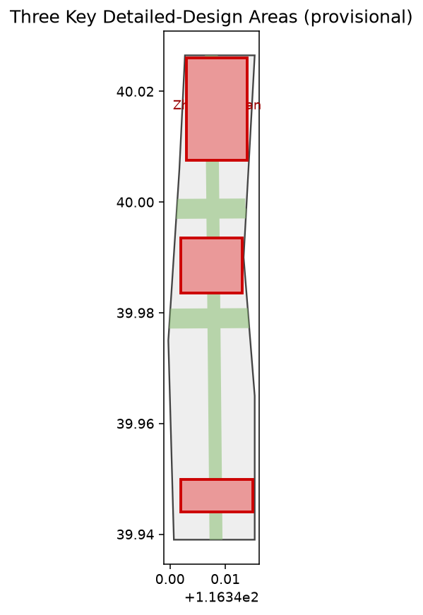

# Centennial Jingzhang AI Innovation Belt: A Human-Centered Urban AI Living-Experience Corridor

## Design Basis and Source List

This formal proposal takes the Pre-Qualification Announcement of the Centennial Jingzhang AI Innovation Belt International Urban Design Call as its primary basis, and the maintainer-registered provisional boundaries, key areas, enumerations, metrics, and source lists in `brief/site-package/` as machine-readable evidence [source:PROJECT-OFFICIAL-ANNOUNCEMENT]. The agent open-call taskbook defines six mandatory actions (naming, ecosystem, scenarios, public space, culture, operation), which this proposal answers section by section [source:PROJECT-AGENT-OPEN-CALL-TASKBOOK]. The source registry forbids promoting background-only or provisional-only materials into an official boundary, statutory plan, or government commitment [source:SOURCE-REGISTRY].

This proposal is not a standalone vision text; it is organized from the announcement, taskbook, and site package, with structured indices kept in `sources.json`, `metrics.json`, `compliance_matrix.json`, `standard_matrix.json`, and `design_depth_matrix.json` [data:geometry/site_boundary.geojson#SITE-001]. The current submission uses provisional boundary `PROV-SITE-001`, labeled `provisional_constraint` and `official_boundary=false`; it cannot serve as an official redline, approval basis, or precise-area basis [source:PROVISIONAL-BOUNDARY]. This organizer data gap does not block content scoring [metric:site_area_sqm].

## Three-Level Scope Framework

The proposal organizes work across the three levels defined by the announcement: the coordinated research area (43.6 km²) addresses the AI industry ecosystem and future urban form; the overall design area (11.4 km²) addresses the urban-renewal framework, industrial space, and transport/municipal support around the Jingzhang Heritage Park; the key-area scope (368.4 ha) addresses the three detailed-design districts [source:PROJECT-OFFICIAL-ANNOUNCEMENT]. The three levels are mapped task-by-task in `compliance_matrix.json`, ensuring every mandatory announcement task (1.3, 1.4, 1.5) and agent task (agent.1–agent.6) has a section, layer, metric, drawing, and HTML evidence.

The overarching concept is the "Jingzhang Intelligent Vein Symbiosis Belt": the Jingzhang Heritage Park as a historic and public-space spine, the three key districts (Zhongzhiyuan, Beijing AI Origin Community, Dazhongsi) as innovation anchors, and universities, enterprises, communities, and rail stations as the daily network, forming a "one belt, three cores, multi-point scenarios, blue-green slow-mobility composite ring" [depth:overall_spatial_structure] [data:geometry/key_areas.geojson#PROV-KEY-001]. Spatial evidence uses [data:geometry/site_boundary.geojson#SITE-001] and [data:geometry/key_areas.geojson#PROV-KEY-001].

| Tier | Design question | Proposal answer | Data anchor |
| --- | --- | --- | --- |
| Coordinated research | How to organize AI industry ecosystem and future form | Build an innovation chain: university sourcing, open collaboration, enterprise translation, public experience, international communication | compliance_matrix.json, standard_matrix.json |
| Overall design | How to put industry space, renewal, transport, and character on the map | Land use, buildings, roads, green, public space, and phasing layers express it together | [data:geometry/land_use.geojson#LU-001], [data:geometry/roads.geojson#ROAD-001] |
| Key areas | How the three districts reach detailed-design depth | Each gets positioning, spatial moves, AI scenarios, and implementation dependencies | [data:geometry/key_areas.geojson#PROV-KEY-001], [data:geometry/key_areas.geojson#PROV-KEY-002], [data:geometry/key_areas.geojson#PROV-KEY-003] |

## Coordinated Research Area: Industry and Future City Research

The core task of the coordinated research area is to build a world-class AI innovation ecosystem, answering agent.1 and agent.2 [source:PROJECT-AGENT-OPEN-CALL-TASKBOOK]. The naming "Jingzhang Intelligent Vein Symbiosis Belt" serves the integrated identity of "Centennial Jingzhang Culture Belt, Urban AI Living-Experience Belt, AI Fusion Innovation Belt"; its logo merges a railway sleeper motif with a circuit pattern, expressing the continuity between the historic corridor and the intelligent network. The AI innovation ecosystem proposes eight deepen-able cases: ① national AI platform and full-stack autonomy; ② open-source model community and developer station; ③ edge-computing service network; ④ AI safety governance and red-team sandbox; ⑤ data-factor and digital-asset market; ⑥ agent and smart-terminal industrial park; ⑦ international developer exchange center; ⑧ low-carbon computing and green-energy center.

These ecosystem judgements must land in visible, reviewable spatial structure, linking to [data:geometry/land_use.geojson#LU-001], [data:geometry/public_space.geojson#PUBLIC-001], and [depth:overall_spatial_structure]. Future urban-form research answers how AI changes work, life, socializing, learning, transport, and public services, placing AI transport systems, continuous green space, innovation-service facilities, and international living-working atmosphere into locatable zones, corridors, and scenarios [depth:three_level_scope_framework].

## Overall Design Area: Urban Renewal and Regulatory-Plan-Level Urban Design

The overall design area must reach regulatory-plan-level urban-design depth; per [standard:MOHURD-CONTROL-DETAILED-PLANNING] the regulatory-depth content is decomposed into reviewable objects [data:geometry/land_use.geojson#LU-001]. `geometry/land_use.geojson` fully covers the design boundary without overlap; `geometry/buildings.geojson` expresses renewal and retained building footprints; `geometry/roads.geojson` expresses micro-circulation, slow mobility, and rail connection; [metric:building_footprint_area_sqm] checks building footprint area [depth:land_use_layout].

The overall design also supports transport, rail, municipal, and public facilities, proposing spatial layouts for rail-station integration, road micro-circulation, non-motorized parking, parking supply, innovation-service platforms, talent living services, new infrastructure, and edge computing [depth:development_intensity_controls]. Where official control conditions (FAR, height, density, setback, road redline) are absent, they are written as "pending official regulatory conditions" rather than agent-inferred fixed values [assumption:A-CONTROL].

## Detailed Design of Key Areas

Detailed design of key areas is mandatory and must reach planning-implementation depth [depth:three_key_area_detailed_design] [data:geometry/key_areas.geojson#PROV-KEY-001]. Zhongzhiyuan AI Autonomous-Innovation Acceleration Area focuses on the national AI platform, full-stack autonomy, standard-setting, safety governance, industry showcase, external transport, Qinghe culture, and low-carbon innovation exchange. Beijing AI Origin Community focuses on near-campus innovation, achievement incubation, talent zone, open-source system, brand events, retain-renovate-demolish classification, and rail-station integration. Dazhongsi AI Industry Cluster focuses on leading enterprises, agents, smart terminals, content consumption, data factors, commercial services, and Dazhongsi-station integration.

The three key areas must appear in `geometry/key_areas.geojson`; because official polygons are absent they are currently `provisional_constraint`, and the text, HTML, sources, assumptions, and self_check all state they cannot serve as a formal scoring or approval basis [source:PROVISIONAL-BOUNDARY]. Design expression includes functional mix, building scale and form, retain-renovate-demolish classification, public-space system, transport organization, slow-mobility connectivity, and implementation projects [metric:key_area_count].

| Key district | Positioning | Spatial move | AI industry / operation scenario |
| --- | --- | --- | --- |
| Zhongzhiyuan AI Acceleration | Garden-style full-stack autonomy block | Strengthen Qinghe interface, industry showcase, low-carbon exchange, external transport | Autonomous-model testing, standard workshops, safety-governance showcase, low-carbon computing experience |
| Beijing AI Origin Community | Near-campus achievement transformation and talent community | Campus-park-district slow-seam; add release, talent, living, open-source spaces | Open-source community, achievement release, talent-zone service, near-campus incubation |
| Dazhongsi AI Cluster | Urban intelligent economy and international exchange block | Dazhongsi-station integration, four-quadrant walk connectivity, commercial and enterprise public-environment upgrade | Agent and smart-terminal showcase, content consumption, data factors, international roadshow |

## AI Innovation Ecosystem, Personas, and AI+ Scenarios

The proposal builds spatial-demand personas for AI talent and enterprises across R&D, open collaboration, release, enterprise service, talent housing, social learning, consumption, recreation, and international exchange, answering agent.3 [source:PROJECT-AGENT-OPEN-CALL-TASKBOOK]. AI+ scenarios span transport, service, consumption, healthcare, education, law, and daily living, each specifying服务对象, location, data source, privacy boundary, human-review mechanism, and operator [depth:municipal_new_infrastructure].

Public-space scenarios reference [data:geometry/public_space.geojson#PUBLIC-001]; slow-mobility and transport scenarios reference [data:geometry/roads.geojson#ROAD-001]; open-space scenarios reference [data:geometry/green_space.geojson#GREEN-001] with [metric:public_space_ratio] and [metric:green_ratio]. The table below gives 12 AI scenario cards, 5 personas, and 4 validation scenarios, satisfying the taskbook's "≥10 cards, ≥3 validation scenarios, ≥5 personas" [metric:ai_scenario_count].

| Persona | Need | Spatial response |
| --- | --- | --- |
| Open-source developer | Release, collaborate, test, reputation | Origin-community release hall, public code wall, night-collaboration space |
| Startup team | Low-cost office, compute access, testbed | Zhongzhiyuan shared test field, edge-compute service point |
| Enterprise visitor | Showcase, business, international reception | Dazhongsi international roadshow salon, station connection |
| Resident | Commute, leisure, community, low-disturbance renewal | Jingzhang Heritage Park slow loop, embedded community service |
| Faculty & student | Achievement transfer, cross-campus collaboration | Campus-park slow seam, achievement-transfer station |

| Scenario card | Carrier | Design note |
| --- | --- | --- |
| 01 Open-source release hall | Beijing AI Origin Community | Achievement release, code-contribution showcase, small roadshow |
| 02 Safety-governance sandbox | Zhongzhiyuan | Standard-setting, safety testing, red-team visualization |
| 03 Edge-compute station | Overall-design nodes | New-infrastructure prototype with public service and low-carbon energy |
| 04 AI slow-mobility navigation | Jingzhang Heritage Park spine | Explainable wayfinding identifies broken links, crowding, accessibility |
| 05 Dazhongsi international roadshow salon | Dazhongsi Cluster | Agent, smart-terminal, content-consumption showcase |
| 06 Qinghe low-carbon innovation corridor | Zhongzhiyuan Qinghe interface | Green space, stormwater, cycling, AI showcase composite room |
| 07 Near-campus transformation street | Beijing AI Origin Community | Incubation, showcase, legal, IP, investment services |
| 08 Data-factor salon | Dazhongsi | Compliant, authorized, auditable data-factor urban interface |
| 09 AI living-service model street | Community-commercial junction | AI+ in healthcare, education, law, daily living |
| 10 Global AI Week route | Belt public-space system | Heritage—open-source—industry—international roadshow experience line |
| 11 Community health-care station | Residential-community junction | Offline touchpoint for elder and family AI health service |
| 12 News & legal intelligence desk | Commercial-service node | AI-assisted enterprise compliance, IP, media release |

Validation scenarios: V1 autonomous-model benchmark (Zhongzhiyuan); V2 edge-compute load verification (station network); V3 data-factor compliant-circulation sandbox (Dazhongsi); V4 slow-mobility accessibility evaluation (heritage park loop). Urban agents may support broken-link, heatmap, maintenance, and service-demand identification, but cannot replace planning approval, output unauthorized personal profiles, or claim official implementation commitment [depth:risk_missing_data].

## Land Use, Building Scale, and Retain-Renovate-Demolish Strategy

The land-use scheme follows open land-classification standards to form a complete, seamless, gap-free partition [standard:MNR-LAND-USE-CLASSIFICATION-GUIDE] [data:geometry/land_use.geojson#LU-001]. This package slices the provisional boundary into 200 m grid cells and merges them into nine land-use classes, fully covering the site with zero gaps and zero overlaps [depth:land_use_layout] [metric:land_use_zone_count]. The building scheme distinguishes retained, renovated, renewed, new, or to-be-confirmed objects, specifying footprint, function, scale, character, and height-control tiers [depth:retain_renovate_demolish] [metric:building_footprint_area_sqm].

Building scale and intensity must stay consistent with `metrics.json` and the layers. Where total floor area, FAR, height, density, green ratio, setback, and building-control lines lack official conditions, they are listed as unknown or pending_control rather than fixed pseudo-precise values [assumption:A-CONTROL]. The A3 booklet gives the renewal project list and metric reconciliation table; the A0 boards express key spatial structure and key districts.

## Transport, Rail, Municipal Infrastructure, and Public Services

The transport scheme answers the announcement's requirements for rail-station integration, road micro-circulation, slow-mobility broken links, external transport, parking, non-motorized parking, and green transport, covering the North 5th Ring, the Jingzhang Heritage Park ring-crossing nodes, Wudaokou, Qinghua East Road West Exit, Dazhongsi station, and enterprise surroundings [depth:traffic_rail_slow_parking] [data:geometry/roads.geojson#ROAD-001]. Road and slow-mobility layers stay within the submission boundary and cross-check with public space, green, industry nodes, and key districts [data:geometry/constraints.geojson#CONSTRAINT-RAIL].

Municipal and public services cover AI industry service, innovation platforms, talent living, new infrastructure, distributed energy, edge computing, and traditional municipal fusion, with facility standards, spatial layout, service radius, operation model, and phasing logic [depth:municipal_new_infrastructure]. Where pipeline, energy, drainage, flood, and fire engineering data are missing, they are listed as formal-deepening preconditions [assumption:A-MUNICIPAL].

## Blue-Green Network, Public Space, and Urban Character

The blue-green scheme takes the Jingzhang Heritage Park vitality belt as its skeleton, coordinating Qinghe, Xiaoyuehe, surrounding universities, enterprises, and communities to propose north-south and east-west connected trails, cycleways, and green-space systems, identifying slow-mobility broken links, ring-road crossing nodes, and landscape nodes [depth:blue_green_public_space] [data:geometry/green_space.geojson#GREEN-001]. Green and public-space ratios are explained in the text, with full values in `metrics.json` [metric:green_ratio] [metric:public_space_ratio].

Urban character fuses Jingzhang railway heritage, Zhongguancun innovation culture, and AI innovation culture, using Tsinghua Garden Station, Beijing Film Academy, and other cultural resources to propose urban tone, building character, roof form, massing, interface, and public-art guidance [depth:height_massing_character]. The proposal offers four AI pilgrimage landmarks answering agent.4: ① Tsinghua Garden Station ruins (railway-culture origin); ② Jingzhang Heritage Park South Gate "AI Window" (public-experience entrance); ③ Open-Source Contribution Wall (global developer honor space); ④ AI Origin Plaza (achievement release and talent gathering). All brands, fonts, images, portraits, and enterprise marks require cleared rights [assumption:A-HERITAGE].

## Renewal Projects, Implementation Policy, and Phasing

The implementation scheme forms a reviewable renewal project list with location, type, function, responsible entity, dependencies, phase, risk, and evaluation metrics, answering agent.6 [depth:renewal_project_list] [metric:renewal_project_count]. Policy recommendations cover coordinated urban-renewal implementation, space supply, operation mechanism, industry service, public participation, data governance, and property-right coordination; `geometry/phasing.geojson` expresses three phases [data:geometry/phasing.geojson#PHASE-001] [depth:phasing_implementation].

| ID | Project | Type | Main dependency |
| --- | --- | --- | --- |
| JZ-01 | Heritage Park slow-link seam | Public space / transport | Road redline, under-bridge space, transport review |
| JZ-02 | Zhongzhiyuan Qinghe innovation interface | Blue-green / industry showcase | River blue line, ecology, flood conditions |
| JZ-03 | Origin near-campus transformation street | Urban renewal / industry service | Campus boundary, ownership, ground-floor use |
| JZ-04 | Dazhongsi four-quadrant walk connectivity | Rail integration / slow mobility | Station, intersection, municipal pipeline |
| JZ-05 | AI public service and edge-compute node | New infrastructure / public service | Energy, compute, security, operator |
| JZ-06 | Global AI Week public route | Operation / brand | Public-space permit, event safety, rights clearance |

Phasing is distinct from the 100-day submission cycle: the cycle is the deliverable deadline, while implementation phasing is the renewal and construction path. The proposal sets near-term pilot, mid-term renewal, and long-term governance tiers, and explains the annual-event system, developer-community operation, scenario open days, public-experience routes, and international communication, with operator, frequency, responsibility boundary, translation path, and risk—not as slogans [assumption:A-IMPLEMENT].

## Metrics, Area Recalculation, and Compliance Matrix

The metric system includes at least overall-design area, key-area area, green and public-space ratios, building footprint, renewal-project count, AI-scenario nodes, slow-mobility connectivity, industry-space indicators, talent-service indicators, and self-check status, all recomputable from GeoJSON or trusted sources [depth:metrics_recalculation] [metric:site_area_sqm]. The results of `scripts/spatial_review.py` and `scripts/visual_review.py` are key formal self-check evidence.

Metric recalculation follows a unified depth requirement [data:geometry/green_space.geojson#GREEN-001]. The compliance matrix is the master file for task responsiveness: every announcement task and agent task maps to a report section, layer, metric, drawing, HTML page, source, assumption, and self-check item; failing to cover any mandatory task in 1.3, 1.4, 1.5, or agent.1–agent.6 blocks formal professional scoring [source:SITE-PACKAGE].

On formal deepening, each metric falls into three classes: (1) spatial metrics directly recomputable from submitted geometry (boundary area, green ratio, public-space ratio, building footprint, phasing area); (2) control metrics needing official regulatory or taskbook attachments (FAR, height, density, setback, road redline, facility standards); (3) performance metrics needing continuous operational or industry calibration (AI innovation index, talent density, industry-service satisfaction, slow-mobility accessibility, event participation, scenario usage) [assumption:A-METRIC-PRECISION].

## Risk, Copyright, and Compliance

The primary proposal is Simplified Chinese, with a full English counterpart in `proposal.en.md`; A3/A0, HTML, and text-bearing figures also provide corresponding language copies. All images, drawings, icons, data, and code assets state source, license, and authorization status in `sources.json` or `report/copyright_statement.md`. HTML pages must not load remote scripts, map tiles, fonts, iframes, forms, or external APIs, and must not track reviewers [source:SOURCE-REGISTRY].

Risk and missing-data items are cross-checked by the risk depth item, constraint layers, and site package [depth:risk_missing_data] [data:geometry/constraints.geojson#CONSTRAINT-RAIL]. Gaps in official boundary, key areas, regulatory plan, roads, parcels, buildings, municipal, heritage protection, and public services enter `assumptions.json`, the self-check, and the risk section [assumption:A-BOUNDARY] [assumption:A-OWNERSHIP]. Any conclusion lacking official regulatory, road-redline, ownership, municipal, fire, or heritage conditions is downgraded to a to-be-confirmed item [assumption:A-HERITAGE].

This proposal does not claim official approval, finalized regulatory plan, final land ownership, final construction scale, or guaranteed implementation. The AI agent is responsible for facts, sources, copyright, spatial data, metrics, and expression; maintainers and professional reviewers may request rework or reject based on self-check results, spatial review, and the compliance matrix [source:PROJECT-OFFICIAL-ANNOUNCEMENT].

## References

- brief/public-brief.md
- brief/site-package/design_brief.json
- brief/site-package/allowed_design_space.json
- brief/site-package/enums/
- brief/site-package/ranges/planning_limits.json
- data/source_registry.json
- Full machine indices: see `sources.json`, `metrics.json`, `compliance_matrix.json`, `standard_matrix.json`, and `design_depth_matrix.json`
- Bibliography entry per site-package registration; full provenance and licenses in the structured source list [source:SITE-PACKAGE] [source:PROCESSED-FACT-PACK]
