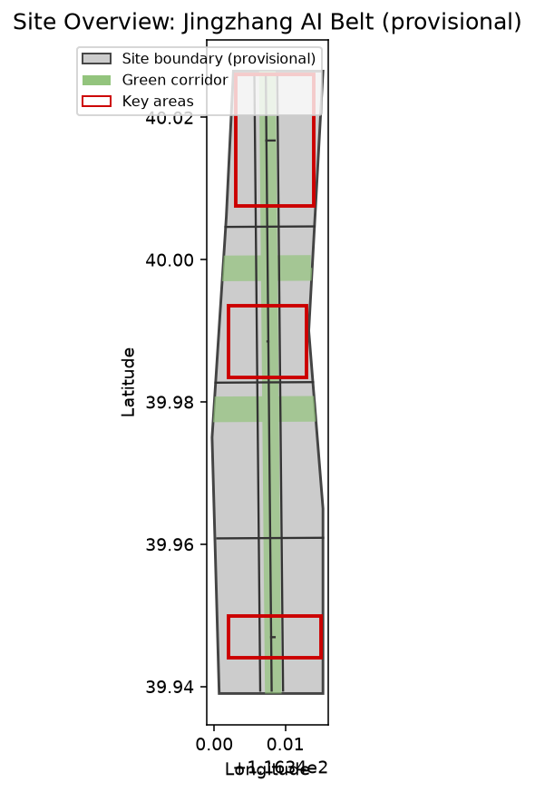
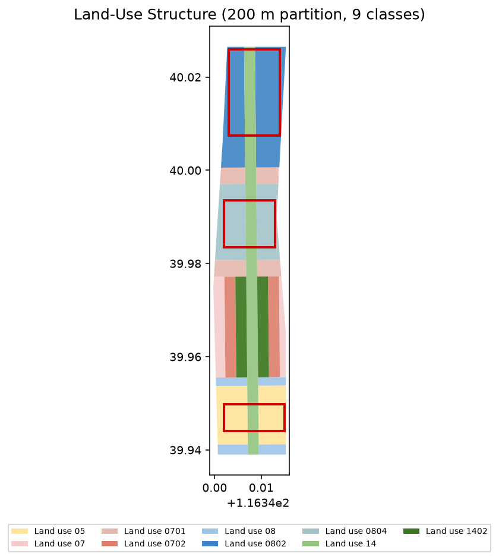
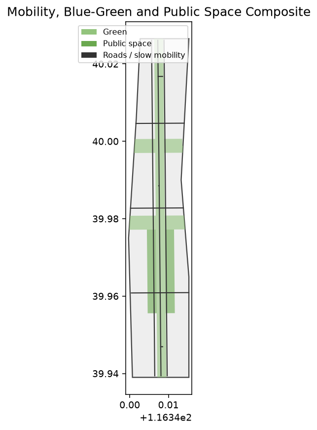
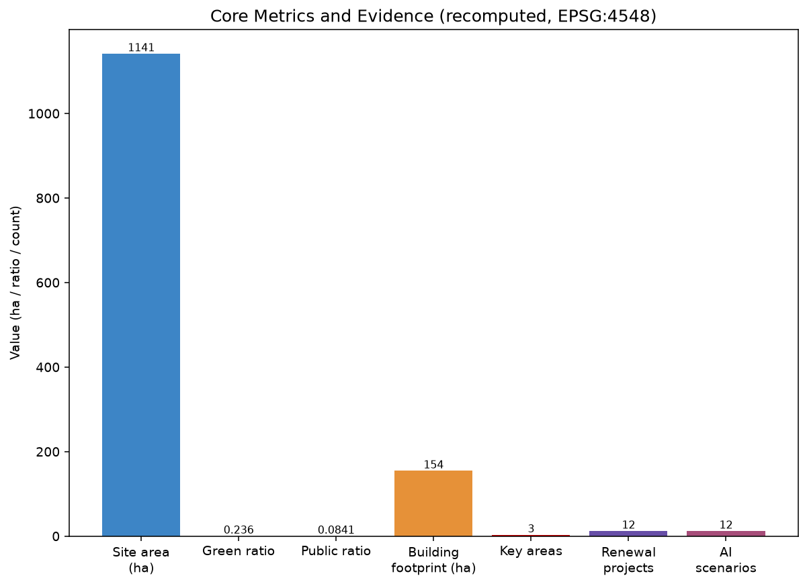

# 百年京张 AI 创新带：以人为中心的城市 AI 生活体验走廊

## 设计依据与资料清单

本 formal 方案以北京市规划和自然资源委员会海淀分局发布的《百年京张AI创新带城市设计国际方案征集资格预审公告》为第一依据，并以 `brief/site-package/` 中经维护者登记的临时粗略边界、重点区域、枚举、指标和来源清单为机器可读依据 [source:PROJECT-OFFICIAL-ANNOUNCEMENT]。面向智能体开源征集任务书规定了命名、生态、场景、公共空间、文化与运营六项必选动作，本方案在对应章节逐条回应 [source:PROJECT-AGENT-OPEN-CALL-TASKBOOK]。资料登记表的使用边界规定：background_only 与 provisional_only 资料不得升级为 official boundary、法定控规或政府实施承诺 [source:SOURCE-REGISTRY]。

本方案不是独立愿景文本，而是从公告、任务书与场地资料出发组织成果；事实判断回到已登记原始材料，结构化索引保存在 `sources.json`、`metrics.json`、`compliance_matrix.json`、`standard_matrix.json` 与 `design_depth_matrix.json` [data:geometry/site_boundary.geojson#SITE-001]。当前提交采用临时边界 `PROV-SITE-001`，必须标注为 `provisional_constraint`、`official_boundary=false`，不能作为 official redline、审批依据或精确面积依据 [source:PROVISIONAL-BOUNDARY]。该组织方数据缺口本身不阻断内容评分 [metric:site_area_sqm]。

## 三层范围工作框架

方案按照公告确定三个层次组织工作：统筹研究范围关注 43.6 平方公里的 AI 产业生态与未来城市形态；总体设计范围关注 11.4 平方公里京张遗址公园周边的城市更新总体框架、产业空间与交通市政；重点区域范围关注 368.4 公顷三处详细设计地区的功能业态、建筑规模、拆改留分类与公共空间连通 [source:PROJECT-OFFICIAL-ANNOUNCEMENT]。三层范围在 `compliance_matrix.json` 中逐条映射，保证公告 1.3、1.4、1.5 与 agent.1–agent.6 的必选任务都有章节、图层、指标、图纸与 HTML 证据。

本方案提出的总体概念为“京张智脉共生带”：以京张遗址公园为历史与公共空间主轴，以众智园、北京AI原点社区、大钟寺三处重点片区为创新锚点，以高校、企业、社区与轨道站点为日常网络，形成“一带三核、多点场景、蓝绿慢行复合环”的空间组织 [depth:overall_spatial_structure] [data:geometry/key_areas.geojson#PROV-KEY-001]。空间证据以 [data:geometry/site_boundary.geojson#SITE-001] 与 [data:geometry/key_areas.geojson#PROV-KEY-001] 为准。

| 层级 | 设计问题 | 方案回答 | 数据落点 |
| --- | --- | --- | --- |
| 统筹研究范围 | AI产业生态和未来城市形态如何组织 | 建立“高校策源-开源协作-企业转化-公共体验-国际传播”的创新链 | compliance_matrix.json、standard_matrix.json |
| 总体设计范围 | 产业空间、城市更新、交通市政和风貌如何落图 | 用地、建筑、道路、绿地、公共空间和分期图层共同表达 | [data:geometry/land_use.geojson#LU-001]、[data:geometry/roads.geojson#ROAD-001] |
| 重点区域范围 | 三处片区如何达到详细设计深度 | 分别提出定位、空间动作、AI场景和实施依赖 | [data:geometry/key_areas.geojson#PROV-KEY-001]、[data:geometry/key_areas.geojson#PROV-KEY-002]、[data:geometry/key_areas.geojson#PROV-KEY-003] |

## 统筹研究范围产业与未来城市研究

统筹研究范围的核心任务是构建世界级 AI 创新生态体系，回应任务书 agent.1 与 agent.2 [source:PROJECT-AGENT-OPEN-CALL-TASKBOOK]。命名方案“京张智脉共生带”（Jingzhang Intelligent Vein Symbiosis Belt）服务于“百年京张文化带、都市AI生活体验带、AI融合创新带”的整体辨识度，其 Logo 以京张铁路轨枕与电路纹样共生为母题，表达历史廊道与智能网络的接续。AI 创新生态提出 8 个可深化案例：①国家人工智能平台与全栈自主创新；②开源模型社区与开发者驿站；③端侧算力服务网络；④AI 安全治理与红队测试沙盒；⑤数据要素与数字资产市场；⑥智能体与智能终端产业园；⑦国际开发者交流中心；⑧低碳算力与绿色能源中心。

上述生态判断最终要落到可见、可复核的空间结构，回接 [data:geometry/land_use.geojson#LU-001]、[data:geometry/public_space.geojson#PUBLIC-001] 与 [depth:overall_spatial_structure]。未来城市形态研究应回答人工智能如何改变工作、生活、社交、学习、交通与公共服务，并把 AI 交通系统、连续绿色空间、创新服务设施与国际化生活工作氛围落实为可定位的功能区、节点、廊道与场景 [depth:three_level_scope_framework]。

## 总体设计范围城市更新与控规深度城市设计

总体设计范围要求达到控制性详细规划的城市设计深度，按 [standard:MOHURD-CONTROL-DETAILED-PLANNING] 把控规深度内容拆成可审查对象 [data:geometry/land_use.geojson#LU-001]。`geometry/land_use.geojson` 完整覆盖设计边界且无重叠，`geometry/buildings.geojson` 表达更新与保留建筑基底，`geometry/roads.geojson` 表达微循环、慢行与轨道接驳，[metric:building_footprint_area_sqm] 用于复核建筑基底面积 [depth:land_use_layout]。

总体设计还支撑交通、轨道、市政与配套设施，围绕轨道站点一体化、道路微循环、非机动车停放、停车供给、创新服务平台、人才生活服务、新型基础设施与端侧算力提出空间布局 [depth:development_intensity_controls]。涉及建筑高度、开发强度、道路红线、退线与设施标准的内容，若尚无官方控制条件，写为“待正式控规条件确认”，不以 agent 推测值冒充审定指标 [assumption:A-CONTROL]。

## 重点区域详细设计

重点区域详细设计是必选项，须引用三处重点区域并达到规划综合实施方案深度 [depth:three_key_area_detailed_design] [data:geometry/key_areas.geojson#PROV-KEY-001]。众智园AI自主创新加速区围绕国家人工智能平台、全栈自主创新、标准制定、安全治理、产业展示、对外交通、清河文化与低碳创新交往提出详细方案；北京AI原点社区围绕近校创新、成果孵化转化、人才特区、开源体系、品牌活动、建筑拆改留与轨道站点一体化提出详细方案；大钟寺AI产业聚集区围绕领军企业、智能体、智能终端、内容消费、数据要素、商业服务与大钟寺站一体化提出详细方案。

三处重点区域必须在 `geometry/key_areas.geojson` 中出现；因官方 polygons 缺失，当前暂用 `provisional_constraint`，正文、HTML、sources、assumptions 与 self_check 均说明其不能作为正式评分或审批依据 [source:PROVISIONAL-BOUNDARY]。设计表达包含功能业态、建筑规模、建筑形态、拆改留分类、公共空间系统、交通组织、慢行连通与实施项目 [metric:key_area_count]。

| 重点片区 | 设计定位 | 空间动作 | AI产业与运营场景 |
| --- | --- | --- | --- |
| 众智园AI自主创新加速区 | 花园型全栈自主创新街区 | 强化清河界面、产业展示、低碳创新交往与对外交通组织 | 自主模型测试、标准制定工作坊、安全治理展示、低碳算力体验 |
| 北京AI原点社区 | 近校型成果转化与人才社区 | 校区-园区-街区慢行缝合；补足成果发布、人才服务、居住生活与开源协作 | 开源社区、成果发布、人才特区服务、近校孵化 |
| 大钟寺AI产业聚集区 | 城市型智能经济与国际交往街区 | 大钟寺站一体化、四象限步行连通、商业服务与重点企业公共环境更新 | 智能体与智能终端展示、内容消费、数据要素与国际路演 |

## AI 创新生态、人才画像与 AI+ 场景

方案建立面向 AI 人才与企业的空间需求画像，覆盖研发办公、开源协作、成果发布、企业服务、人才居住、社交学习、消费生活、运动休闲与国际交往，回应任务书 agent.3 [source:PROJECT-AGENT-OPEN-CALL-TASKBOOK]。AI+ 场景围绕交通、服务、消费、医疗、教育、法律、生活服务方向形成产业发展场景与 AI 赋能城市功能场景，每个场景说明服务对象、空间位置、数据来源、隐私边界、人工复核机制与运营主体 [depth:municipal_new_infrastructure]。

公共空间场景引用 [data:geometry/public_space.geojson#PUBLIC-001]，慢行与交通场景引用 [data:geometry/roads.geojson#ROAD-001]，开放空间场景引用 [data:geometry/green_space.geojson#GREEN-001] 与 [metric:public_space_ratio]、[metric:green_ratio]。下表给出 12 张 AI 场景卡、5 类用户画像与 4 个产业测试验证场景，满足任务书“不少于 10 张场景卡、不少于 3 个验证场景、不少于 5 类用户画像”的要求 [metric:ai_scenario_count]。

| 用户画像 | 典型需求 | 空间响应 |
| --- | --- | --- |
| 开源开发者 | 发布、协作、测试、社区声誉 | 原点社区开源发布厅、公共代码墙、夜间协作空间 |
| 初创团队 | 低成本办公、算力入口、产品试验场 | 众智园共享测试场、端侧算力服务点 |
| 头部企业访客 | 展示、商务、国际接待、人才招聘 | 大钟寺国际路演客厅、轨道站点接驳 |
| 周边居民 | 通勤、休闲、社区服务、低扰动更新 | 京张遗址公园慢行环、社区服务嵌入 |
| 高校师生 | 成果转化、跨校协作、日常慢行 | 校区-园区慢行缝合、成果转化驿站 |

| 场景卡 | 空间载体 | 设计说明 |
| --- | --- | --- |
| 01 开源发布厅 | 北京AI原点社区 | 成果发布、代码贡献展示与小型路演 |
| 02 安全治理沙盒 | 众智园 | 标准制定、安全评测与红队测试可视化 |
| 03 端侧算力驿站 | 总体设计范围节点 | 与公共服务、低碳能源结合的新基建原型 |
| 04 AI慢行导航 | 京张遗址公园活力带 | 可解释导视识别慢行断点、拥挤与无障碍需求 |
| 05 大钟寺国际路演客厅 | 大钟寺AI产业聚集区 | 智能体、智能终端与内容消费展示交流 |
| 06 清河低碳创新廊 | 众智园临清河界面 | 绿色空间、雨洪、骑行与AI展示复合客厅 |
| 07 近校成果转化街 | 北京AI原点社区 | 孵化、展示、法务、知识产权与投融资服务 |
| 08 数据要素会客厅 | 大钟寺片区 | 合规、授权、可审计的数据要素城市界面 |
| 09 AI生活服务样板街 | 社区与商业交汇处 | 医疗、教育、法律、生活服务等AI+场景落点 |
| 10 全球AI活动周路线 | 一带公共空间系统 | 遗址文化—开源社区—产业展示—国际路演体验线 |
| 11 社区健康照护站 | 居住与社区交汇处 | 适老与家庭AI健康服务的线下触点 |
| 12 新闻与法务智能台 | 商业服务节点 | 企业合规、知识产权与媒体发布的AI辅助 |

产业测试验证场景：V1 自主模型基准测试（众智园）、V2 端侧算力负载验证（驿站网络）、V3 数据要素合规流通沙盒（大钟寺）、V4 慢行无障碍可达性评测（遗址公园环）。城市智能体可辅助识别慢行断点、公共空间热力、设施维护与企业服务需求，但不能替代规划审批、不得输出未经授权个人画像、不得声称获得官方实施承诺 [depth:risk_missing_data]。

## 用地、建筑规模与拆改留方案

用地方案依据国土空间用地分类公开标准表达，形成完整、闭合、无缝的用地分区 [standard:MNR-LAND-USE-CLASSIFICATION-GUIDE] [data:geometry/land_use.geojson#LU-001]。本包以 200m 网格将临时边界切分为用地单元并合并为 9 类用地，确保零缝隙、零重叠地完整覆盖站点 [depth:land_use_layout] [metric:land_use_zone_count]。建筑方案区分保留、改造、更新、新建或待确认对象，明确建筑基底、功能、规模、风貌与高度控制建议层级 [depth:retain_renovate_demolish] [metric:building_footprint_area_sqm]。

建筑规模与强度指标须与 `metrics.json` 和图层一致。若总建筑规模、容积率、建筑高度、建筑密度、绿地率、退线与建筑控制线缺少官方条件，在指标体系中列为 unknown 或 pending_control，不以固定数值制造精确感 [assumption:A-CONTROL]。A3 文册给出更新项目清单与指标复核表，A0 展板表达关键空间结构与重点片区。

## 交通、轨道、市政与公共服务设施

交通方案回应公告对轨道站点一体化、道路微循环、慢行断点、对外交通、停车、非机动车停放与绿色交通系统的要求，覆盖北五环、京张遗址公园跨环路节点、五道口、清华东路西口、大钟寺站及重点企业周边 [depth:traffic_rail_slow_parking] [data:geometry/roads.geojson#ROAD-001]。道路与慢行图层保持在提交边界内，并与公共空间、绿地、产业节点和重点片区相互校核 [data:geometry/constraints.geojson#CONSTRAINT-RAIL]。

市政与公共服务设施覆盖 AI 产业服务、创新平台、人才生活、新型基础设施、分布式能源、端侧算力与传统市政融合，说明设施标准、空间布局、服务半径、运营模式与分期逻辑 [depth:municipal_new_infrastructure]。缺少管线、能源、排水、防洪、消防等工程资料时，列为正式深化前置条件 [assumption:A-MUNICIPAL]。

## 蓝绿空间、公共空间与城市风貌

蓝绿空间方案以京张遗址公园活力带为骨架，统筹清河、小月河、周边高校、企业、社区出行需求，提出南北贯通、东西连通的步道、骑行道与绿色空间体系，识别慢行断点、上跨环路节点与景观节点 [depth:blue_green_public_space] [data:geometry/green_space.geojson#GREEN-001]。绿地与公共空间比例在正文解释设计意义，完整数值保存在 `metrics.json` [metric:green_ratio] [metric:public_space_ratio]。

城市风貌融合京张铁路历史文化、中关村创新文化与 AI 创新文化，利用清华园火车站、北影等文化资源提出城市基调、建筑风貌、屋顶形态、体量、界面与公共艺术引导 [depth:height_massing_character]。本方案提出 4 处 AI 朝圣地标回应任务书 agent.4：①清华园车站遗址（铁路文化原点）；②京张遗址公园南门 AI 之窗（公共体验入口）；③开源贡献墙（全球开发者荣誉空间）；④AI 原点广场（成果发布与人才聚集）。所有品牌、字体、图像、肖像与企业标识均须清权 [assumption:A-HERITAGE]。

## 更新项目清单、实施政策与分期计划

实施方案形成可审查的更新项目清单，说明项目位置、类型、功能、责任主体、依赖条件、实施阶段、风险与评估指标，回应任务书 agent.6 [depth:renewal_project_list] [metric:renewal_project_count]。政策建议覆盖城市更新统筹实施、空间供给、运营机制、产业服务、公共参与、数据治理与产权协同，`geometry/phasing.geojson` 表达三期范围 [data:geometry/phasing.geojson#PHASE-001] [depth:phasing_implementation]。

| 项目编号 | 项目名称 | 类型 | 主要依赖 |
| --- | --- | --- | --- |
| JZ-01 | 京张遗址公园慢行断点缝合 | 公共空间/交通 | 道路红线、桥下空间、交通组织复核 |
| JZ-02 | 众智园清河创新界面 | 蓝绿空间/产业展示 | 河道蓝线、生态与防洪条件 |
| JZ-03 | 原点社区近校成果转化街 | 城市更新/产业服务 | 校区边界、权属、首层业态 |
| JZ-04 | 大钟寺站四象限步行连通 | 轨道一体化/慢行 | 轨道站点、道路交叉口、市政管线 |
| JZ-05 | AI公共服务与端侧算力节点 | 新基建/公共服务 | 能源、算力、安全与运营主体 |
| JZ-06 | 全球AI活动周公共路线 | 运营/品牌 | 公共空间许可、活动安全、版权清权 |

分期与 100 天征集设计周期区分：征集周期是提交成果的时间要求，实施分期是城市更新与项目建设的推进路径。方案提出近期试点、中期更新与长期治理框架，并说明年度活动体系、开发者社区运营、场景开放日、公共体验路线与国际传播机制，明确运营对象、频率、责任边界、转化路径与风险，不写为宣传口号 [assumption:A-IMPLEMENT]。

## 指标体系、面积复算与合规矩阵

指标体系至少包含总体设计范围面积、重点区域面积、绿地与公共空间比例、建筑基底、更新项目数量、AI场景节点、慢行连通指标、产业空间指标、人才服务指标与自检状态，全部可由 GeoJSON 或可信来源复算 [depth:metrics_recalculation] [metric:site_area_sqm]。`scripts/spatial_review.py` 与 `scripts/visual_review.py` 的结果是 formal 自检的重要证据。

指标复算遵循统一设计深度要求 [data:geometry/green_space.geojson#GREEN-001]。合规矩阵是任务响应性的主控文件，每条公告任务与 agent_taskbook 任务对应到报告章节、图层、指标、图纸、HTML 页面、来源、假设与自检项；未能覆盖公告 1.3、1.4、1.5 或 agent.1–agent.6 的任一必选任务，方案不得进入 formal professional scoring [source:SITE-PACKAGE]。

正式深化时，每个指标分三类：第一类可由提交几何直接复算的空间指标（边界面积、绿地比例、公共空间比例、建筑基底、分期面积）；第二类需官方控规或任务书附件支撑的管控指标（容积率、建筑高度、密度、退线、道路红线、设施标准）；第三类需运营或产业数据持续校准的绩效指标（AI 创新指数、人才密度、产业服务满意度、慢行可达性、活动参与度、场景使用频次）[assumption:A-METRIC-PRECISION]。

## 风险、版权与合规说明

方案主文件为简体中文，并通过 `proposal.en.md` 提供完整英文对照译文；A3/A0、HTML 与含文字图件均提供对应语言副本。所有图片、图纸、图标、数据与代码资产在 `sources.json` 或 `report/copyright_statement.md` 中说明来源、许可与授权状态。HTML 页面不得加载远程脚本、远程地图瓦片、远程字体、iframe、表单或外部 API，不得跟踪评审者行为 [source:SOURCE-REGISTRY]。

风险与缺资料清单由风险深度项、约束图层与场地包共同校核 [depth:risk_missing_data] [data:geometry/constraints.geojson#CONSTRAINT-RAIL]。官方边界、重点区、控规、道路、地块、建筑、市政、文保与公共服务缺口进入 `assumptions.json`、自检与正文风险章节 [assumption:A-BOUNDARY] [assumption:A-OWNERSHIP]。任何缺少官方控规、道路红线、权属、市政、消防或文保条件的结论，均降级为待确认事项 [assumption:A-HERITAGE]。

本方案不声称官方批准、审定控规、最终土地权属、最终建设规模或保证实施。AI agent 对事实、来源、版权、空间数据、指标与表达负责；维护者与专业评审可依据自检结果、空间复核与合规矩阵要求返修或拒绝 [source:PROJECT-OFFICIAL-ANNOUNCEMENT]。

## 参考资料

- brief/public-brief.md
- brief/site-package/design_brief.json
- brief/site-package/allowed_design_space.json
- brief/site-package/enums/
- brief/site-package/ranges/planning_limits.json
- data/source_registry.json
- 完整机器索引：见 `sources.json`、`metrics.json`、`compliance_matrix.json`、`standard_matrix.json` 与 `design_depth_matrix.json`
- 本节书目入口依据场地包登记，完整出处与许可见结构化来源清单 [source:SITE-PACKAGE] [source:PROCESSED-FACT-PACK]
