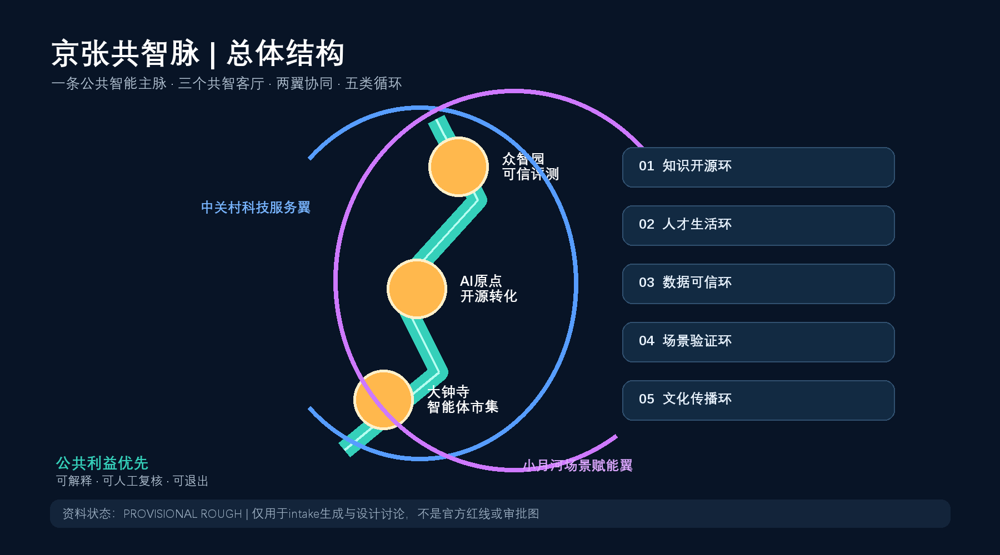
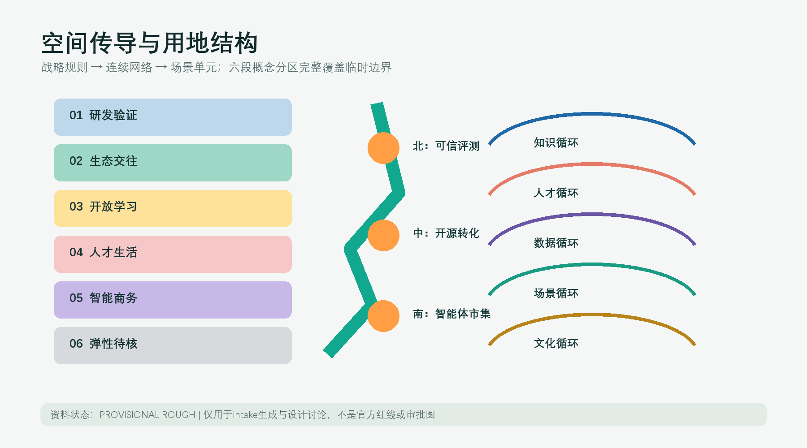
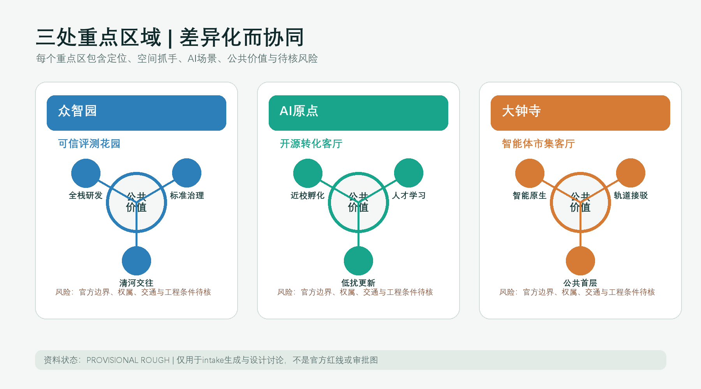
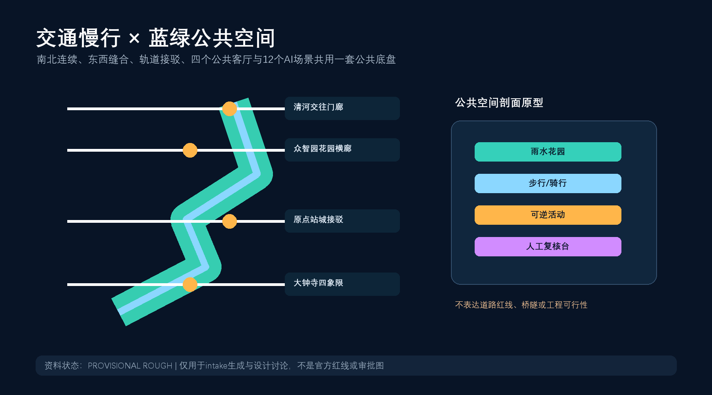
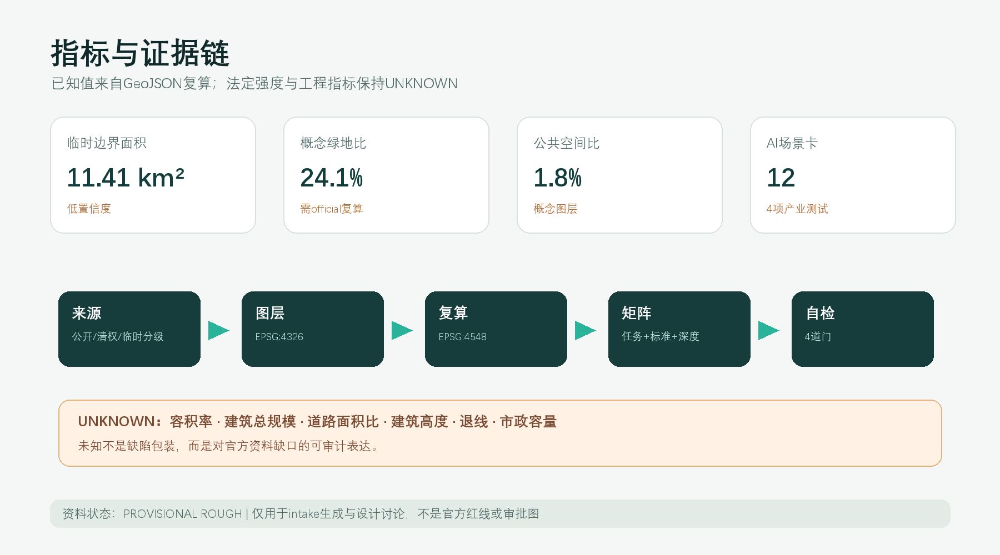

# 京张共智脉：百年铁路遗产上的开放智能城市

**英文名：Jing-Zhang Civic Intelligence Spine；简称：JZ-CIS。** “共智”不是让AI接管城市，而是把模型、数据、空间和人的判断组织成可公开讨论、可人工复核、可退出的公共能力。“脉”既指百年京张铁路形成的南北历史轴，也指知识、人才、场景与治理沿线循环的开放协议。本成果是开放共创建议，不替代正式规划，不构成政府审定结论。

## 设计依据与资料清单

方案以官方公告的三层范围、面积约值和任务为任务依据 [source:OFFICIAL-ANNOUNCEMENT]，以清权智能体任务书的三大定位、五大功能、三区两翼和六项任务为共创依据 [source:AGENT-TASKBOOK]。机器字段与专业标准来自 [source:SITE-PACKAGE]，资料用途由 [source:SOURCE-REGISTRY] 判定，处理事实包 [source:PROCESSED-FACT-PACK] 只作导航，不升级为权威来源。

当前总体边界和三处重点区只有仓库维护者提供的临时粗略polygon [source:BOUNDARY-SOURCE] [source:KEY-AREA-SOURCE]。其EPSG:4548投影复算面积约为 1141.3 公顷，但该数值只用于图层拓扑和intake一致性，不替代公告“约11.4平方公里”，更不构成official redline。[standard:PROJECT-OFFICIAL-ANNOUNCEMENT] [depth:existing_conditions_diagnosis]

资料缺口包括官方红线、控规指标、道路红线和断面、现状建筑、权属、文保、市政消防与公共服务容量；全部登记在 assumptions.json。由此，本方案把空间表达分成三类：已公开任务事实、可复算的概念设计层、待专业团队确认的法定或工程条件。

## 三层范围工作框架

统筹研究范围约43.6平方公里，回答产业生态、区域协同、品牌与未来城市形态；总体设计范围约11.4平方公里，回答公共空间主脉、功能复合、慢行、市政框架与更新项目；重点区域约368.4公顷，分别提出众智园、AI原点社区和大钟寺的方向性详细设计。三层并非三张互不相关的图，而是“战略规则 - 空间网络 - 场景单元”的传导链。[depth:three_level_scope_framework] [data:geometry/site_boundary.geojson#SITE-001] [data:geometry/key_areas.geojson#KEY-001]

provisional边界以淡色虚线作为校验容器，设计主线落在连续公共空间、横向缝合、三类创新客厅和可逆场景上。取得official polygons后，必须重新裁切 land_use、buildings、roads、green_space、public_space、phasing，并重算所有面积与比例指标。

## 统筹研究范围产业与未来城市研究

### 总体结构：一脉、三厅、两翼、五环

- **一脉**：京张共智脉，承载遗产叙事、蓝绿慢行、开放展示和人工复核服务。
- **三厅**：众智园“可信评测花园”、AI原点“开源转化客厅”、大钟寺“智能体市集客厅”。
- **两翼**：中关村科技服务翼提供人才、资本、知识产权与国际连接的建议性服务；小月河场景赋能翼提供公共场景测试、居民反馈与生态体验的建议性接口。
- **五环**：知识开源环、人才生活环、数据可信环、场景验证环、文化传播环。五环把三大定位和五大功能变成运营协议，而非土地用途口号。[standard:PROJECT-AGENT-OPEN-CALL-TASKBOOK] [depth:overall_spatial_structure]

### 品牌与视觉识别

主标识方向采用“轨枕 + 开源括号 + 人字节点”的原创几何组合：两条平行线代表京张历史与AI未来，中间开放节点代表任何人都可进入的公共接口。主色为“京张炭黑、公共青绿、开源电蓝”，只使用原创几何和系统可替换字体；不使用企业Logo、人物肖像或未授权图像。命名系统为“JZ-CIS / 三厅 / 五环 / 场景编号”，可扩展到导视、活动和数据界面。

### 六个创新生态案例及可转化机制

| 案例 | 仅作为背景的可验证特征 | 可转化机制 | 不照搬内容 |
|---|---|---|---|
| 新加坡 one-north | 研发、创业与生活空间协同 [source:CASE-ONE-NORTH] | 将研发设施与日常公共服务编为步行可达网络 | 不复制治理制度和指标 |
| 伦敦 Knowledge Quarter | 多类知识机构以联盟促进共享 [source:CASE-KNOWLEDGE-QUARTER] | 建议设“共智成员协议”和共享设施时段 | 不编造成员承诺 |
| 巴黎 STATION F | 历史工业载体与创业服务结合 [source:CASE-STATION-F] | 铁路遗产周边优先采用可逆的共享首层原型 | 不复制建设规模 |
| 多伦多 MaRS | 城市型转化服务枢纽 [source:CASE-MARS] | 在AI原点社区组织科研到场景的服务台 | 不推导招商数据 |
| MIT Kendall Square | 科研、居住、零售与开放空间混合 [source:CASE-KENDALL] | 以“公共空间先行”连接校区、园区与社区 | 不推导容积率 |
| 河套深港合作区 | 跨区域规则协同与科研要素服务 [source:CASE-HETAO] | 众智园设置标准、评测、知识产权和国际协同窗口建议 | 不宣称政策已落地 |

案例共同指向“空间 + 服务 + 社群 + 规则”四件套；京张共智脉的原创性在于把四者嵌入线性遗产公共空间，并用人类复核和公开退出机制约束城市智能体。

## 总体设计范围城市更新与控规深度城市设计

用地采用六段概念分区并完整覆盖临时边界：研发验证、生态交往、开放学习、人才生活、智能原生商务、弹性待核。它是功能关系研究，不是法定用地调整。[data:geometry/land_use.geojson#LU-001] [standard:MNR-LAND-USE-CLASSIFICATION-GUIDE] [depth:land_use_layout]

更新策略不是大拆大建，而是“公共接口先行、共享首层激活、存量适配优先、增量依条件校准”。八个建筑基底只表达空间载体原型；高度、层数、总建筑面积、具体拆改留和权属均保持unknown。[data:geometry/buildings.geojson#BLDG-001] [depth:development_intensity_controls] [depth:retain_renovate_demolish]

公共空间以南北共智脉为骨架、四个公共客厅为节点、三条重点区横廊为东西缝合。交通策略优先步行骑行与轨道接驳，但所有线形均为概念连接，不是道路红线或工程方案。[data:geometry/roads.geojson#ROAD-001]

## 重点区域详细设计

### 众智园AI自主创新加速区 - 可信评测花园

定位为全栈研发、标准验证、安全治理和国际技术交流的花园型创新街区。空间结构为“研发岛 - 评测廊 - 清河门廊”；建筑建议优先适配既有研发空间并提供共享测试首层；慢行横廊连接公共绿地与园区出入口；AI场景包括模型安全评测、端侧设备沙盒和公开治理展廊。全部是概念建议，需在官方边界、交通与文保条件补齐后深化。[data:geometry/key_areas.geojson#KEY-001]

### 北京AI原点社区 - 开源转化客厅

定位为近校型成果转化、人才学习和开发者社区。空间结构为“开源发布厅 - 共享工坊 - 人才生活环”；建议以低扰动方式开放首层、庭院和步行接口，形成校区、园区、社区之间的可见联系；任何高校或权属空间改造都必须经权利主体和专业团队确认。[data:geometry/key_areas.geojson#KEY-002]

### 大钟寺AI产业集聚区 - 智能体市集客厅

定位为智能体、智能终端、内容消费与国际商务的城市型试验场。围绕轨道站四象限提出连续步行、非机动车停放和公共首层的参考方案；“市集”强调可撤除展示、服务体验和小规模场景验证，不宣称站城工程已批准。[data:geometry/key_areas.geojson#KEY-003] [depth:three_key_area_detailed_design]

三处重点区的共同规则是：公共空间先于品牌装置、真实需求先于技术展示、最少数据先于全量采集、人工复核先于自动决策。

## AI 创新生态、人才画像与 AI+ 场景

### 五类用户画像

| 画像 | 核心需求 | 空间响应 | 治理边界 |
|---|---|---|---|
| 高校研究者与学生 | 低门槛试验、跨学科交流 | 原点开源工坊、共智脉学习节点 | 研究数据分级、伦理审查 |
| 初创团队与开发者 | 算力、评测、导师与发布 | 众智园评测花园、年度Demo线路 | 不承诺资金和招商结果 |
| 产业工程师与企业访客 | 联调、标准、商务接待 | 三厅共享会议和场景沙盒 | 企业数据不进入公共系统 |
| 沿线居民与家庭 | 安全、便捷、教育、休闲 | 公园慢行、社区服务站、公众评议 | 可不用AI、可匿名反馈 |
| 城市运维与公共服务人员 | 可解释工具、工单闭环 | 人工复核台、事件回放与申诉接口 | AI只建议，不自动执法 |

### 十二张AI场景卡

| # | 场景卡 | 类型/位置 | 最少数据与人工复核 | 运营建议 |
|---|---|---|---|---|
| 01 | 开源模型发布厅 | 产业测试/原点 | 公开模型卡；专家和公众双复核 | 社区轮值 |
| 02 | 模型安全评测花园 | 产业测试/众智园 | 合成测试集；红队人工裁决 | 开放评测日 |
| 03 | 端侧设备适城沙盒 | 产业测试/众智园 | 本地脱敏日志；安全员叫停权 | 分时预约 |
| 04 | 智能体互操作集市 | 产业测试/大钟寺 | 公开协议；失败模式现场标注 | 开发者共测 |
| 05 | 慢行断点共诊 | 公共服务/主脉 | 匿名计数和人工踏勘；不做人脸识别 | 居民月度议事 |
| 06 | 无障碍路线协作 | 公共服务/三厅 | 用户自愿反馈；人工确认障碍 | 无障碍组织共创 |
| 07 | 公园养护助手 | 蓝绿空间/主脉 | 公开气象和巡检；园林人员决策 | 季度生态报告 |
| 08 | 人才生活服务台 | 社区服务/原点 | 用户主动输入；可完全人工办理 | 一站式转介 |
| 09 | AI法律与知识产权门诊 | 科技服务/两翼 | 案件不出端；执业人员复核 | 公益时段 |
| 10 | 京张记忆导览 | 文化/主脉 | 清权史料；史学与文保审核 | 学校共同策展 |
| 11 | 公共空间活动编排 | 运营/三厅 | 预约和承载量；场地人员确认 | 可撤销小型活动 |
| 12 | 城市智能体申诉台 | 治理/全带 | 决策日志最小留存；人工受理和纠错 | 公开透明报告 |

其中01-04为产业测试验证场景，满足不少于3项要求；全部12项都有人工复核、退出方式和数据最小化边界。[metric:ai_scenario_node_count] [data:geometry/public_space.geojson#PUBLIC-001]

## 用地、建筑规模与拆改留方案

土地分类使用仓库项目子集的07、08、05、14、16类代码，仅说明功能关系。临时分区面积可由 land_use.geojson 复算，但不能替代法定控规。建筑基底约 99.8 公顷、概念建筑密度约 8.7%，只用于比较公共空间与载体关系；因为现状建筑、权属和高度缺失，`floor_area_ratio`与`total_floor_area_sqm`保持unknown。[metric:building_footprint_area_sqm] [metric:building_density] [data:geometry/buildings.geojson#BLDG-001]

拆改留采用条件树：有文保或良好结构价值者优先保留；能通过首层开放、节能与共享空间适配者优先改造；只有专业鉴定、权属协商和法定程序完备后才讨论拆除；新增建筑必须在官方控规和市政承载核准后深化。[standard:MOHURD-CONTROL-DETAILED-PLANNING] [depth:height_massing_character]

## 交通、轨道、市政与公共服务设施

概念慢行网络总长约 14.0 公里，由一条南北遗产绿道和四条横向缝合线组成。[metric:road_length_m] [data:geometry/roads.geojson#ROAD-001] 其作用是指明“需要连接的关系”：大钟寺四象限、原点社区站城步行、众智园花园研发、清河公共交往；不确定道路线位、断面、桥隧或施工可行性。

市政采用“传统设施底座 + 端侧算力服务层 + 人工运维控制层”的参考框架。算力驿站优先设在既有公共服务建筑内，分布式能源先做负荷与消防专项，传感器默认本地处理和短周期留存。公共服务设施从人才生活、社区服务、国际交流、体育休闲和法律知识产权五类需求建立待核清单。[depth:traffic_rail_slow_parking] [depth:municipal_new_infrastructure]

## 蓝绿空间、公共空间与城市风貌

京张共智脉的绿地概念面积约 275.3 公顷，占临时边界 24.1%；四个公共客厅去重面积约 20.9 公顷，占 1.8%。这些是概念图层复算，不是审定绿地率。[metric:green_space_area_sqm] [metric:green_ratio] [metric:public_space_area_sqm] [metric:public_space_ratio]

城市风貌采用“铁路结构的克制、创新空间的开放、公共界面的温暖”三条原则：保留线性记忆和工业尺度线索；新介入采用可逆构件、清晰结构和低眩光媒体；首层以遮阴、座椅、饮水、无障碍和雨水花园优先。专业依据是以人为本、历史传承、公共空间与建筑体量协调，而非炫技式科技立面。[standard:MOHURD-URBAN-DESIGN-MEASURES] [depth:blue_green_public_space]

三处AI朝圣/荣誉节点均为可供专业团队深化的公共文化原型：①清河“可信AI誓言门廊”展示可解释与安全原则；②原点“开源年轮”记录公开贡献而非个人崇拜；③大钟寺“失败博物台”展示被纠正的模型错误与治理学习。荣誉系统只采用贡献ID、项目许可和可撤回授权，不展示未经授权肖像或商标。

## 更新项目清单、实施政策与分期计划

| 编号 | 概念项目 | 分期 | 关键前置条件 | 可逆起步动作 |
|---|---|---|---|---|
| P01 | 共智脉连续步行诊断 | 近期 | 现状测绘、交通安全 | 人工踏勘与临时导视 |
| P02 | 三厅共享首层试点 | 近期 | 权属同意、消防核查 | 分时开放和可撤家具 |
| P03 | 公开场景沙盒协议 | 近期 | 数据合规、伦理审查 | 合成数据测试 |
| P04 | 蓝绿雨洪与遮阴网络 | 中期 | 海绵、市政、园林专项 | 小尺度雨水花园 |
| P05 | 重点区横向缝合 | 中期 | 道路红线和站城专项 | 路口步行观察与战术性改善 |
| P06 | 存量载体适配更新 | 中期 | 建筑鉴定、权属协商 | 首层共享和节能改造 |
| P07 | 国际共智周与开源季 | 持续 | 运营主体和安全预案 | 小规模公开活动 |
| P08 | official polygon复算 | 数据到位即启动 | 官方CAD/GIS及坐标说明 | 自动重裁与版本对比 |

三阶段分区完整覆盖临时边界，面积合计与site_area一致 [metric:phasing_area_sqm] [data:geometry/phasing.geojson#PHASE-001]。分期只表示依赖顺序：先数据与可逆公共行动，再空间缝合与共享载体，最后依官方控制推进系统更新，不是资金或政府时序承诺。[depth:renewal_project_list] [depth:phasing_implementation]

年度运营建议包括：春季“模型安全与城市伦理周”、夏季“公园场景开放月”、秋季“京张开源大会”、冬季“失败复盘与公共评议”。开发者社区采用成员公约、开放议题、居民席位、伦理审查和贡献可撤回机制；从活动到长期转化的路径为“公开体验 - 问题清单 - 小规模测试 - 人工评审 - 专业深化 - 公开复盘”。

## 指标体系、面积复算与合规矩阵

所有已知指标都来自提交图层或正文计数，并以EPSG:4548复算；所有法定强度和工程比例保持unknown。临时边界面积 [metric:site_area_sqm] 只用于一致性；三处重点区数量 [metric:key_area_count] 与临时面积合计 [metric:key_area_design_area_sqm] 只用于检索和设计覆盖；建筑、绿地、公共空间、道路与分期指标的引用索引如下：[metric:site_area_sqm] [metric:building_footprint_area_sqm] [metric:building_density] [metric:green_space_area_sqm] [metric:green_ratio] [metric:public_space_area_sqm] [metric:public_space_ratio] [metric:road_length_m] [metric:phasing_area_sqm] [metric:key_area_count] [metric:key_area_design_area_sqm] [metric:ai_scenario_node_count]。

`compliance_matrix.json` 覆盖公告1.3、1.4、1.5和agent.1-agent.6；`standard_matrix.json`连接标准；`design_depth_matrix.json`说明完整成果深度。当前合规PASS表示文件完整、可复算、可审查，不表示方案优秀、法定批准或工程可实施。[depth:metrics_recalculation]

## 风险、版权与合规说明

1. **空间精度风险**：临时polygon不得用于官方红线、精确面积和审批；官方数据到位后需全量重算。[depth:risk_missing_data]
2. **法定与工程风险**：容积率、高度、拆改留、道路、市政、消防、文保、权属全部需专业复核；constraints.geojson暂为空，明确表示未取得可信约束，而非“没有约束”。[data:geometry/constraints.geojson#CONSTRAINTS-EMPTY]
3. **AI治理风险**：所有公共服务AI只提供建议；居民可不用AI、可申诉、可要求人工处理；禁止人脸识别式常态监控和个人画像交易。
4. **版权**：正文、GeoJSON设计层、五张图、PDF和HTML由OpenAI Codex生成；外部案例只引用文字和URL，不复制图片、Logo或版式。详见 `report/copyright_statement.md`。
5. **身份一致性**：目录与代理元数据使用人类参与者确认的GitHub登录名learnerlp；PR必须由同一账号提交。

## 参考资料

- 官方公告 [source:OFFICIAL-ANNOUNCEMENT]
- 智能体任务书 [source:AGENT-TASKBOOK]
- site package、source registry与事实导航 [source:SITE-PACKAGE] [source:SOURCE-REGISTRY] [source:PROCESSED-FACT-PACK]
- 临时边界与重点区 [source:BOUNDARY-SOURCE] [source:KEY-AREA-SOURCE]
- 六个案例来源均已在“统筹研究范围”表格中逐条引用。

### 机器可读证据索引

专业标准：[standard:PROJECT-OFFICIAL-ANNOUNCEMENT] [standard:PROJECT-AGENT-OPEN-CALL-TASKBOOK] [standard:MOHURD-URBAN-DESIGN-MEASURES] [standard:MOHURD-CONTROL-DETAILED-PLANNING] [standard:MNR-LAND-USE-CLASSIFICATION-GUIDE] [standard:MOHURD-ARCH-DESIGN-DEPTH-2016]

设计深度：[depth:existing_conditions_diagnosis] [depth:three_level_scope_framework] [depth:overall_spatial_structure] [depth:land_use_layout] [depth:development_intensity_controls] [depth:height_massing_character] [depth:retain_renovate_demolish] [depth:traffic_rail_slow_parking] [depth:municipal_new_infrastructure] [depth:blue_green_public_space] [depth:three_key_area_detailed_design] [depth:renewal_project_list] [depth:phasing_implementation] [depth:metrics_recalculation] [depth:risk_missing_data]

空间数据：[data:geometry/site_boundary.geojson#SITE-001] [data:geometry/key_areas.geojson#KEY-001] [data:geometry/land_use.geojson#LU-001] [data:geometry/buildings.geojson#BLDG-001] [data:geometry/roads.geojson#ROAD-001] [data:geometry/green_space.geojson#GREEN-001] [data:geometry/public_space.geojson#PUBLIC-001] [data:geometry/constraints.geojson#CONSTRAINTS-EMPTY] [data:geometry/phasing.geojson#PHASE-001]
