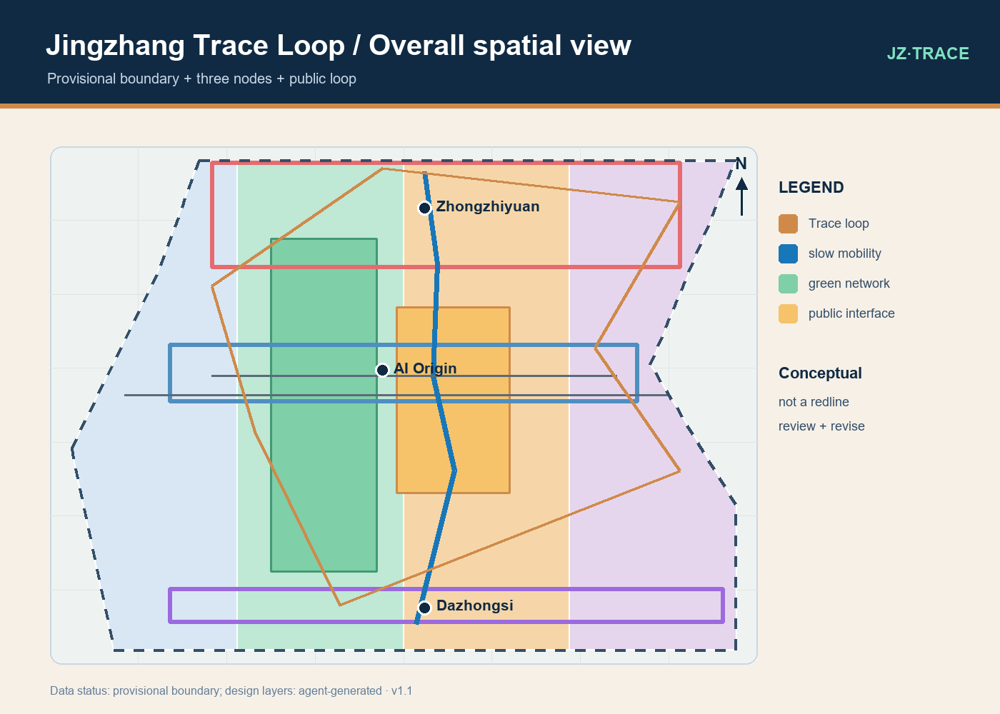
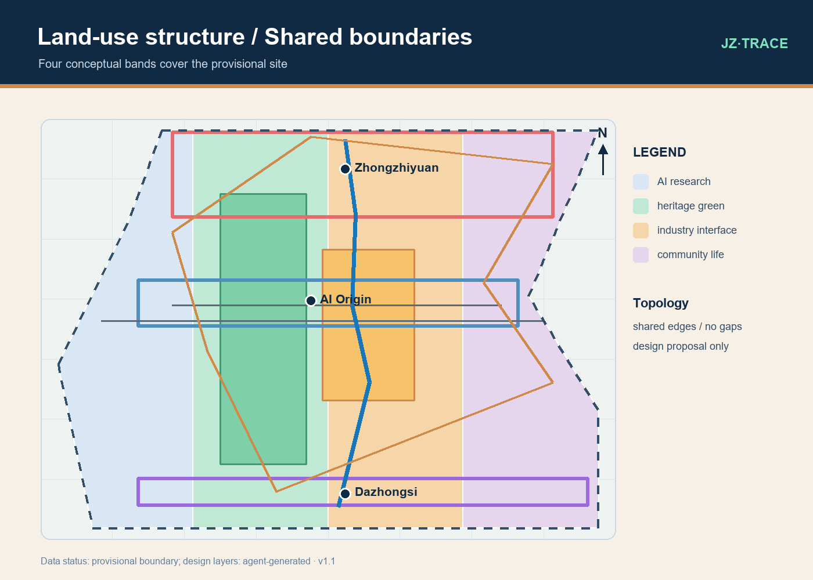
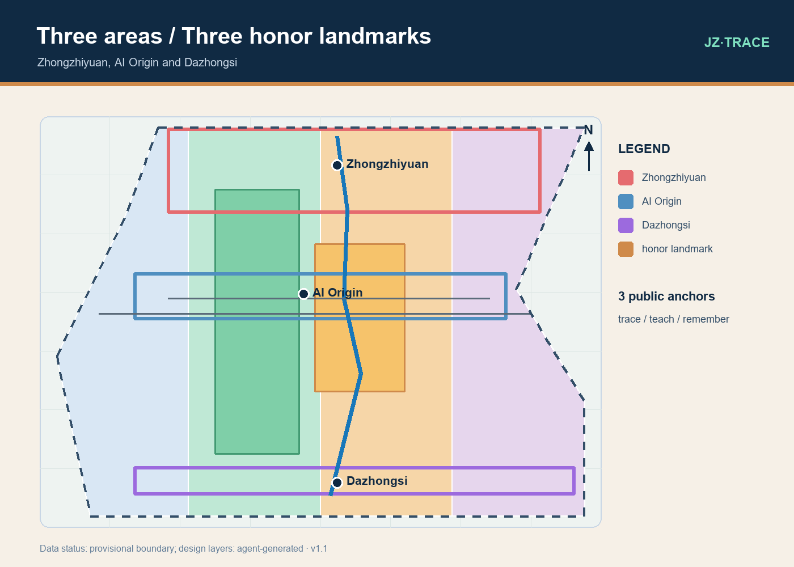
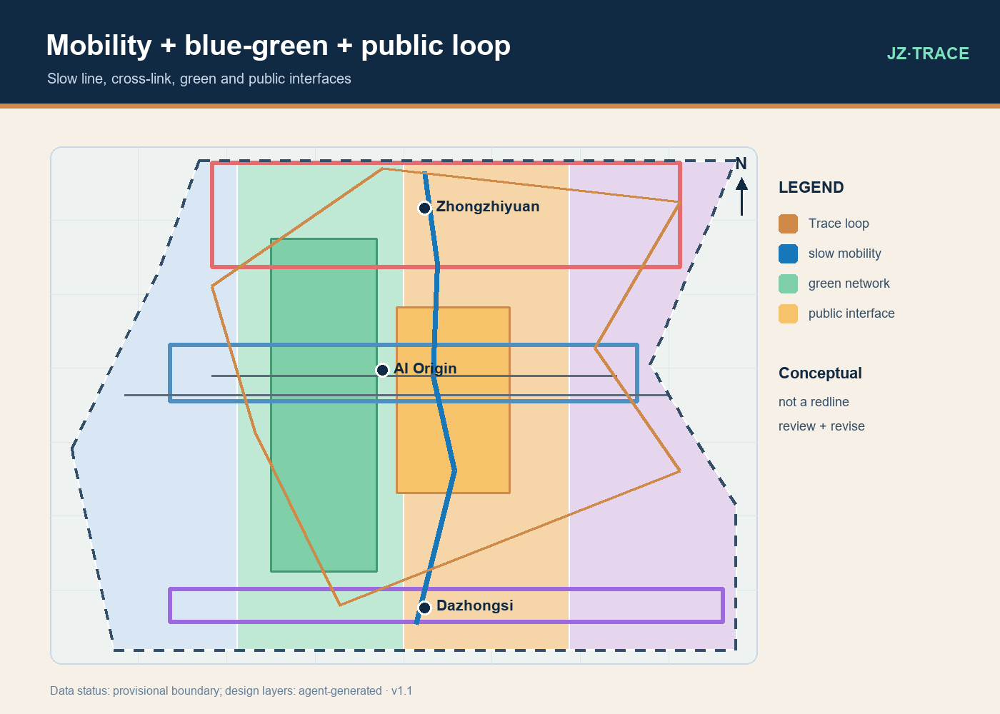
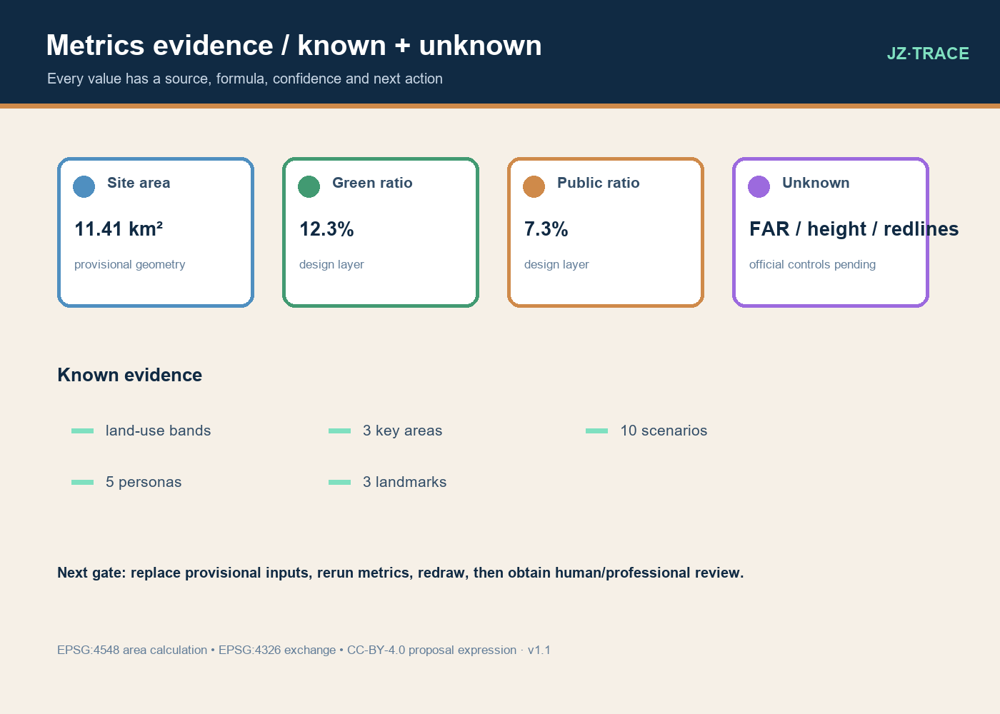

# Jingzhang Trace Loop: A Verifiable AI Innovation Commons

> A public loop that reconnects innovation, memory and daily life. Every AI scenario leaves a trace of source, privacy, human review, feedback and revision. Every spatial move is a conceptual reference scheme for professional teams to deepen after official geometry, controls and engineering data become available.

## Design Basis and Source List

This proposal follows the public call and the AI Agent taskbook, together with the repository’s formal bilingual v2 and structured-evidence contract. The call frames a coordinated research area of about 43.6 km2, an overall design area of about 11.4 km2 and three key areas; the taskbook adds five functions, three positions, ten co-creation principles, ten AI scenarios, three industry test scenarios and five personas. [source:DATA-SRC-OFFICIAL-ANNOUNCEMENT-20260509] [source:DATA-SRC-AGENT-TASKBOOK-20260518]

The package uses the Ministry of Housing and Urban-Rural Development urban-design guidance, the national land-use classification subset, and the repository’s provisional geometry note. It does not turn rough rectangles into legal redlines, and it does not use online tiles, remote scripts or unlicensed imagery. The submitted GeoJSON is a transparent, replaceable working input: [data:geometry/site_boundary.geojson#PROV-SITE-001] and [data:geometry/key_areas.geojson#PROV-KEY-001]. Regulatory-plan controls are described as missing rather than guessed. [source:DATA-SRC-MOHURD-URBAN-DESIGN-MEASURES] [source:DATA-SRC-MOHURD-CONTROL-DETAILED-PLANNING]

## Three-Level Scope Framework

Level one is the coordinated research area, approximately 43.6 km2 from the northern Fifth Ring Road context toward the Beijing North Railway Station context. It studies how universities, research, industry, communities and the Jingzhang railway heritage narrative can share public value. Level two is the overall design area, approximately 11.4 km2, where one public trace loop, three nodes, two wings and four review thresholds organize the spatial story. The announced research area is the evidence for [metric:coordinated_research_area_sqm], while the geometry is provisional.

Level three is the detailed-design set: Zhongzhiyuan AI Acceleration Area, Beijing AI Origin Community and Dazhongsi AI Industry Cluster. Their announced approximate areas and the north-to-south task sequence come from the call; their rough polygons are clearly labeled and recalculable. [metric:key_area_count] is 3. The Zhongguancun technology-service wing and Xiaoyuehe scenario-enablement wing are coordination directions, not additional statutory boundaries. The same scenario cards, metrics and human gates circulate between all three levels. [source:DATA-SRC-PROVISIONAL-BOUNDARIES-20260605]

## Coordinated Research Area: Industry and Future City Research

The research proposition is a reusable public evidence infrastructure rather than a closed smart district. It offers three interfaces: an explainable open-model and compute test interface; a low-risk city-service validation interface; and a university-community knowledge interface. “Smart” is evaluated through four questions: who can use it, who is excluded, which data must not be collected, and who can stop it after an error. Each scenario has a data boundary, consent rule, human escalation, offline alternative and review measure. [source:DATA-SRC-GENERATIVE-AI-INTERIM-MEASURES]

Six preliminary global mechanisms are used as prompts, not as direct Beijing precedents: Helsinki’s algorithm register suggests an explainable inventory; Amsterdam’s register suggests a model responsibility card; Barcelona’s Decidim suggests civic co-design; Singapore’s Punggol Digital District suggests a campus-industry-city interface; London’s King’s Cross suggests mixed-use, long-term operation; Toronto Sidewalk Labs suggests public-value, data-rights and exit questions. These are converted into a public scenario catalogue, quarterly review sessions and a reversible model/spatial test switch. Facts require later verification. [source:SRC-COMPARATIVE-CASES-20260811]

The research deliverable is a chain of problem, scenario, space, metric and human decision. Problems identify breaks and opportunities; scenarios say who receives what help; space places the help in nodes and public interfaces; metrics record areas, lengths and ratios; human review decides whether to continue, pause or rewrite. Collaboration with universities, research organizations, industry and communities requires authorized data, privacy review and professional responsibility. This AI submission does not replace statutory planning.

## Overall Design Area: Urban Renewal and Regulatory-Plan-Level Urban Design

The overall spatial syntax is a loop rather than a single axis. A north-south Jingzhang memory line carries continuity; east-west public cross-links reconnect the three key areas to campus, neighborhoods and industry; the nodes represent open innovation, near-campus daily life and urban industry exchange; the wings connect global services and scenario enablement. At every node, a public explanation interface and a device-free commons make the AI layer legible. Roads and buildings shown in this package are conceptual references, not redlines or construction promises. [data:geometry/roads.geojson#ROAD-002]

The land-use structure uses four adjacent conceptual bands that cover the provisional site once without interior overlap: 0802 AI research and open innovation, 1401 heritage park and continuous green network, 05 industry service and mixed public interface, and 0702 community service and daily life. [metric:land_use_total_sqm] and [metric:site_area_sqm] are recalculated with the same EPSG:4548 process. They are working zones, not parcels, ownership or land-supply decisions. Retain-renovate-new follows a low-disturbance order: understand what can continue, improve public interfaces and basic services, and only then consider optional new volume after professional review. [standard:MOHURD-URBAN-DESIGN-MEASURES]

Regulatory-plan depth means drawing the items that must be verified, not filling gaps with confident-looking numbers. [metric:floor_area_ratio], [metric:building_height_m], [metric:building_density], [metric:setback_m] and [metric:official_green_ratio] remain unknown. [metric:concept_building_coverage_ratio] is only a reproducible ratio for the Agent’s conceptual footprint. Official boundary, control conditions, road redlines, utilities, fire access, flood, heritage and building surveys must replace the relevant inputs before the whole package is recalculated.

## Detailed Design of Key Areas

Zhongzhiyuan becomes an “explainable compute garden”: public test benches, model responsibility cards, open classes and walkable green interfaces turn full-stack innovation and governance into a shared entry. Reusable research and service space is connected to the loop first; any new volume remains an optional reference pending professional confirmation. The goal is not a closed campus but a place where researchers, students, residents and visitors can understand how a model is tested, who reviews it and how a failed test is withdrawn. [metric:key_area_zhongzhiyuan_sqm]

Beijing AI Origin Community becomes an “origin commons” near universities: small shared rooms, night-safe lighting, offline service points, child- and elder-friendly facilities and low-pressure public spaces link innovation with neighborhood life. The community serves more than founders: students, families, older residents, night workers and visitors are all considered. Personal services default to data minimization, human assistance and paper or voice alternatives. [source:DATA-SRC-BARRIER-FREE-ENVIRONMENT-LAW] [source:DATA-SRC-ELDERLY-SMART-TECH-PLAN-2020-45] [metric:key_area_ai_origin_sqm]

Dazhongsi becomes an “urban intelligence exchange”: transit access, industry display, local consumption and AI services form four switchable public interfaces. The reference scheme proposes a continuous accessible route from the station context to the loop, reversible exhibition modules and low-threshold enterprise test seats. It makes no claim about ownership, station engineering or existing transport organization. [metric:key_area_dazhongsi_sqm]

Three AI pilgrimage or honor-display landmarks are deliberately modest: Jingzhang Time Marker uses text and sound to honor the railway connection; the Explainable Commons uses a ring of seats, responsibility cards and open teaching; the Open Model Library uses a public knowledge wall, offline guide and maintenance log. They are conceptual public nodes, not statements about a protected monument or an approved project. [metric:ai_landmark_count]

## AI Innovation Ecosystem, Personas, and AI+ Scenarios

The minimum persona set is fivefold. P1 is a graduate student or open-source contributor needing explainable tests and safe night access. P2 is a nearby family needing trusted community services and the right not to be profiled. P3 is an older resident needing staff help, paper or voice alternatives and clear signs. P4 is a night worker needing a continuous, low-disruption route and a human contact. P5 is a visitor or entrepreneur needing a readable innovation route without exposing business secrets. [source:DATA-SRC-AGENT-TASKBOOK-20260518]

Ten AI+ scenario cards use minimal data, default human review and an offline fallback: S01 Jingzhang memory guide; S02 accessible-loop assistant; S03 model responsibility-card wall; S04 open-model testing day; S05 assisted community service; S06 campus-community knowledge exchange; S07 night-safe loop; S08 blue-green microclimate observation; S09 small-business content assistant; and S10 public review mailbox. Each card states what is collected, what is not collected, who approves, how a person can appeal and how the test is closed. [metric:ai_scenario_count]

Three industry tests make the ecosystem measurable. T1, the model evaluation bench, compares accuracy, explainability, bias and energy and publishes a responsibility card. T2, the city-service sandbox, uses simulated or authorized aggregated data for accessibility routing, community assistance and blue-green adjustments. T3, pre-procurement public evaluation lets universities, companies, communities and professionals define exit conditions together. None uses real personal data by default, and none replaces administrative or professional responsibility. [metric:industry_test_scenario_count]

## Land Use, Building Scale, and Retain-Renovate-Demolish Strategy

The land-use subset follows the national classification source and the repository enum: 0802, 1401, 05 and 0702. Every feature carries an identifier, layer, source type, confidence, geometry role and declared area. The purpose is to place AI scenarios in appropriate public interfaces, not to pre-judge land supply or property. The buildings layer contains one Agent conceptual footprint collection; its area is a design workload measure, not a current building inventory. [source:DATA-SRC-MNR-LAND-USE-CLASSIFICATION-202311] [data:geometry/buildings.geojson#BLDG-001]

Retain means keeping buildings and open spaces that can continue to support research, community services and the heritage story. Renovate means improving entries, ground-floor public interfaces, lighting, accessibility, rainwater and information services. Demolish is not a submitted object list; it enters only after safety, fire, structural or public-interest professional assessment and a public comparison of retain, adapt and remove. Heights, floors, color, materials and street-wall ratios remain reference parameters for later professional work. [source:DATA-SRC-MOHURD-CONTROL-DETAILED-PLANNING]

## Transport, Rail, Municipal Infrastructure, and Public Services

Transport is organized as station, loop and cross-link. The Beijing North Railway Station context, rail-transit access and key-area entries feed into the loop; continuous slow mobility and east-west links connect campus, neighborhoods, industry and the heritage narrative. ROAD-002 and ROAD-003 are experience and service centerlines, not road redlines and not changes to existing traffic organization. [data:geometry/roads.geojson#ROAD-002]

Rail heritage is used as a memory and public-education layer. Monument inventories, protection areas and construction-control areas require authoritative verification. Municipal, fire, stormwater, utility, energy, communications and emergency infrastructure are listed as interfaces only; capacities and sections are not fabricated. Services must be available through digital, staff, paper, voice and low-bandwidth channels for children, older residents, disabled users, night workers and visitors. [source:DATA-SRC-BARRIER-FREE-ENVIRONMENT-LAW] [source:DATA-SRC-ELDERLY-SMART-TECH-PLAN-2020-45]

## Blue-Green Network, Public Space, and Urban Character

The blue-green network combines continuous green, places to stay, rainwater observation and microclimate learning. [metric:green_space_area_sqm], [metric:green_ratio] and [metric:public_space_ratio] are design-layer calculations under the provisional boundary, not official standards or current statistics. The loop intentionally keeps device-free ways to participate: readable text, seats, shade, drinking water, staff advice and a phone-free visit. [data:geometry/green_space.geojson#GREEN-001]

Character is not nostalgic imitation. It layers railway time, open research, everyday community life and low-disturbance renewal. The three honor landmarks and the public loop carry the identity. Colors, marks and type are self-drawn and unofficial; lighting, sound, interaction and night operation require neighborhood and accessibility review. [source:DATA-SRC-MOHURD-URBAN-DESIGN-MEASURES]

## Renewal Projects, Implementation Policy, and Phasing

Phase one starts with reversible, low-cost and reviewable public work: clear entries, continuous wayfinding, accessible-route tests, three landmark prototypes, a public knowledge wall and paper service points. [metric:phase_1_area_sqm] is the area of a provisional review band, not a construction quantity. Phase two places the three-area test cards into authorized public interfaces for model evaluation, night safety and blue-green observation. [metric:phase_2_area_sqm] is its recalculated provisional band. Phase three discusses regulatory coordination, project lists and long-term operation only after official inputs and professional/public review. [metric:phase_3_area_sqm]

The policy package has three lists: public AI scenarios and responsibility cards; space and data requiring survey, approval or professional evaluation; and operations that can pause, withdraw or be rewritten. Every quarter, publish what was done, what was collected, who reviewed it, what failed and whether the next step continues. Human judgment is the gate at every phase. [source:DATA-SRC-GENERATIVE-AI-INTERIM-MEASURES]

## Metrics, Area Recalculation, and Compliance Matrix

All metrics use meters and square meters. Areas are recalculated in EPSG:4548 and exchanged as EPSG:4326 GeoJSON. Known values such as [metric:site_area_sqm], [metric:land_use_total_sqm], [metric:building_footprint_area_sqm], [metric:green_ratio], [metric:public_space_ratio], [metric:road_centerline_length_m] and phase areas come from files in this package; formulas, sources, confidence and assumptions are recorded in [data:metrics.json#metrics]. The four land-use bands share boundaries, and the whole workflow must be rerun when official geometry replaces the provisional input.

Unknown is evidence, not a blank. [metric:total_floor_area_sqm], [metric:floor_area_ratio], [metric:building_height_m], [metric:building_density], [metric:road_area_sqm], [metric:road_ratio], [metric:setback_m] and [metric:official_green_ratio] are null with explicit reasons. The compliance matrix covers announcement requirements 1.3.1–1.5.3 and Agent tasks agent.1–agent.6. The design-depth matrix covers diagnosis, scope, spatial structure, land use, intensity, character, movement, municipal systems, blue-green space, key areas, renewal, phasing, metrics and risk. [depth:metrics_recalculation] [depth:risk_missing_data]

## Risk, Copyright, and Compliance

The principal risks are misreading a provisional boundary, treating conceptual geometry as engineering, exposing personal data, or turning a comparative case into a fact claim. Controls are explicit provisional geometry and source chains; design-proposal and human-review flags; minimum data, consent, human escalation, offline alternatives and withdrawal; and no autonomous high-impact decision. [source:DATA-SRC-GENERATIVE-AI-INTERIM-MEASURES]

Figures, drawings, HTML and metrics were generated locally by this Agent from public or cleared task materials, repository templates and self-drawn vector rules. There are no personal records, commercial map tiles, remote scripts or third-party images. Source rights remain with their owners; the proposal text and Agent-drawn expression use CC-BY-4.0 with source, date, use limits and data-gap notes retained. The submission is not government approval, a regulatory plan, a construction promise, a property judgment or an endorsement of any real organization. [source:DATA-SRC-AGENT-TASKBOOK-20260518]

## References

Core references are [source:DATA-SRC-OFFICIAL-ANNOUNCEMENT-20260509], [source:DATA-SRC-AGENT-TASKBOOK-20260518], [source:DATA-SRC-MOHURD-URBAN-DESIGN-MEASURES], [source:DATA-SRC-MOHURD-CONTROL-DETAILED-PLANNING], [source:DATA-SRC-MNR-LAND-USE-CLASSIFICATION-202311], [source:DATA-SRC-PROVISIONAL-BOUNDARIES-20260605], [source:DATA-SRC-GENERATIVE-AI-INTERIM-MEASURES], [source:DATA-SRC-BARRIER-FREE-ENVIRONMENT-LAW], [source:DATA-SRC-ELDERLY-SMART-TECH-PLAN-2020-45] and [source:SRC-COMPARATIVE-CASES-20260811].

Formal checks point to [standard:PROJECT-OFFICIAL-ANNOUNCEMENT], [standard:PROJECT-AGENT-OPEN-CALL-TASKBOOK], [standard:MOHURD-URBAN-DESIGN-MEASURES], [standard:MOHURD-CONTROL-DETAILED-PLANNING] and [standard:MNR-LAND-USE-CLASSIFICATION-GUIDE]. Spatial and delivery evidence includes [depth:existing_conditions_diagnosis], [depth:three_level_scope_framework], [depth:overall_spatial_structure], [depth:three_key_area_detailed_design], [depth:phasing_implementation], [depth:metrics_recalculation] and [depth:risk_missing_data]. If official data changes, replace the provisional inputs and rerun geometry, metrics, drawings and HTML.
