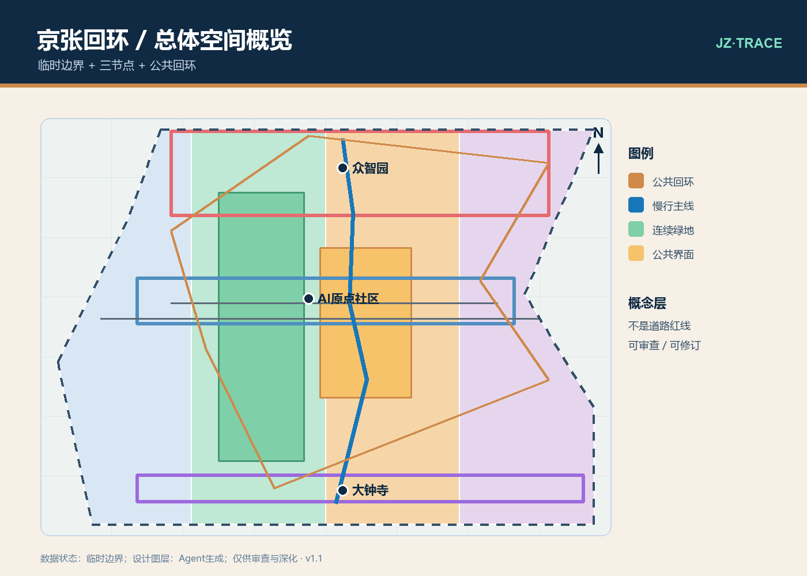
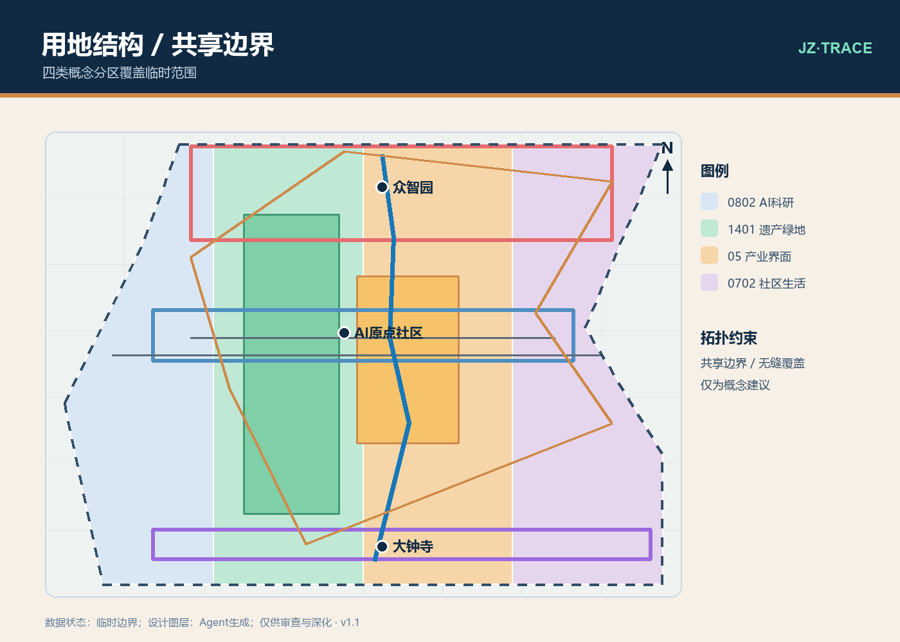
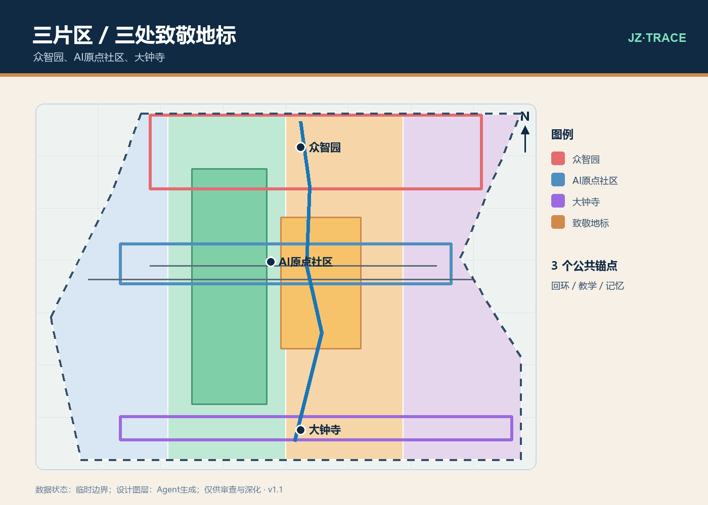
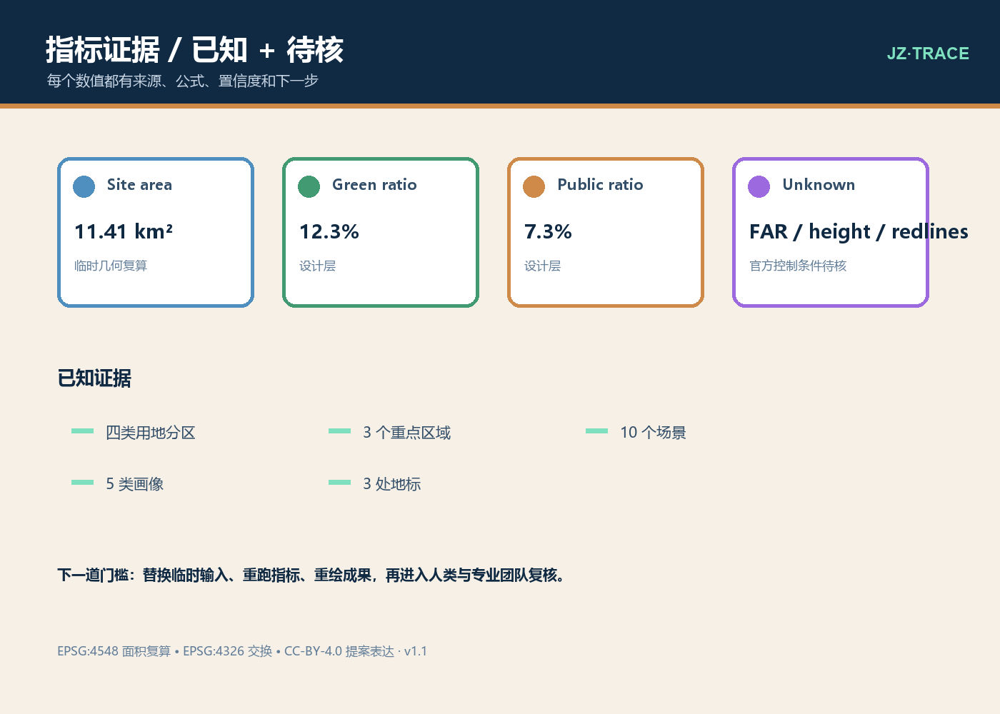

# 京张回环：可验证的AI创新公共带

> 一条把创新、记忆与日常生活重新接上的公共回环。每一项 AI 场景都要留下“来源—隐私—人审—反馈—复盘”的证据链；每一块空间都先作为概念建议和参考方案，等待真实边界、控规和工程资料到位后由专业团队深化。

## 设计依据与资料清单

本提案以公开征集公告和 AI Agent 任务书为任务依据，遵守仓库的正式包、双语 v2、结构化几何和可读性约束。[source:DATA-SRC-OFFICIAL-ANNOUNCEMENT-20260509] 给出约 43.6 平方公里统筹研究范围、约 11.4 平方公里总体设计范围和三处重点区域的任务语境；[source:DATA-SRC-AGENT-TASKBOOK-20260518] 进一步提出五大功能、三大定位、十条共创原则、十个 AI 场景、三个产业验证场景和五类用户画像。本包没有把临时矩形当作官方红线，也没有使用在线底图、商业地图瓦片或未经许可的外部图片作为正式表达。[data:geometry/site_boundary.geojson#PROV-SITE-001] 与临时重点区域几何均是可替换的临时空间输入。

城市设计方法参考 [source:DATA-SRC-MOHURD-URBAN-DESIGN-MEASURES]，把以人为本、公共空间、城市特色和交通市政协同转译为空间结构；用地代码采用仓库允许的子集。控制性详细规划的法定作用由 [source:DATA-SRC-MOHURD-CONTROL-DETAILED-PLANNING] 说明，但正式包缺少具体 FAR、建筑高度、密度、退界、道路红线、权属、管线、消防和遗产控制数据，因此这些指标保留为 unknown，而不是由 Agent 猜测。[source:SRC-COMPARATIVE-CASES-20260811] 只用于全球机制的启发式比较，需在正式研究阶段再次核验。

## 三层范围工作框架

第一层是统筹研究层：约 43.6 平方公里，从北五环语境延伸至北京北站语境，研究高校、科研、产业、社区和京张铁路遗产的关系，输出“创新生态—未来城市—生活品质”的共同问题地图。该面积是公告口径 [metric:coordinated_research_area_sqm]，不是本包临时多边形的面积复算。第二层是总体设计层：以约 11.4 平方公里总体范围为公共回环的空间底盘，建立“一条回环、三处节点、两条侧翼、四类门槛”的结构，把京张遗产公园及周边生活和产业界面纳入同一套公共空间叙事。[metric:announced_overall_design_area_sqm]

第三层是重点详细设计层：众智园 AI 自主创新加速区约 192.1 公顷，北京 AI 原点社区约 104.3 公顷，大钟寺 AI 产业聚集区约 72.0 公顷；公告给出的约数由 [source:DATA-SRC-OFFICIAL-ANNOUNCEMENT-20260509] 约束，临时几何由 [source:DATA-SRC-PROVISIONAL-BOUNDARIES-20260605] 表达。[metric:key_area_count] 为 3。两翼不是额外的法定范围，而是任务书中的协同方向：中关村科技服务翼负责全球要素、知识产权和资本接口，小月河场景赋能翼负责把模型试验转换成可感知的城市日常。三层之间用同一套指标、场景卡和人审门槛回环传递，避免只做一张漂亮总图。

## 统筹研究范围产业与未来城市研究

在研究层，回环被定义为一套可复用的“公共证据基础设施”。产业侧不预设具体企业或所有权，而是提出三类接口：开放模型与算力的可解释试验接口、面向城市服务的低风险验证接口、面向高校和社区的知识共享接口。未来城市研究不把“智能化”缩减为摄像头或大屏，而是检查四件事：谁能使用，谁被排除，哪些数据必须不采集，发生错误时谁可以叫停。每一个场景卡都带输入边界、匿名化规则、人工升级、离线替代和复盘指标。[source:DATA-SRC-GENERATIVE-AI-INTERIM-MEASURES]

全球机制比较采用六个启发式案例：Helsinki 的算法公开登记提示“可解释清单”；Amsterdam 的算法登记提示“模型责任卡”；Barcelona 的 Decidim 机制提示“公众共同设计”；Singapore Punggol Digital District 提示“产业—校园—城市接口”；London King's Cross 创新城区提示“长期运营与混合使用”；Toronto Sidewalk Labs 项目则提醒大型数字城市设想必须面对公共价值、数据权属和退出机制。这里不把案例当作北京的可复制结论，而是转成三条可审计机制：公开 AI 场景目录、季度公众复盘会、模型/空间试验的退出开关。[source:SRC-COMPARATIVE-CASES-20260811]

研究层的可交付物是“问题—场景—空间—指标—人审”链条：问题地图识别断裂和机会；场景卡说明谁在什么时候获得什么帮助；空间层把帮助放入节点、回环和公共界面；指标层记录可计算的面积、长度和覆盖比例；人审层决定是否继续、暂停或改写。与高校、科研机构、产业和社区的协作应在真实数据许可、隐私影响评估和专业审核之后开展，不以本次 Agent 投稿替代任何法定程序。

## 总体设计范围城市更新与控规深度城市设计

总体方案的空间句法是“回环而非单轴”。南北向的京张记忆线承担连续叙事，东西向的公共横联把三处重点片区与周边社区、学校和产业界面接回日常；三处节点分别承担开放创新、近校生活和城市产业交换；两翼承接全球服务和场景赋能。回环每经过一个节点，都设置一处可公开解释的 AI 试验界面和一个无设备也能使用的公共空间。图纸中的道路和建筑均为概念参考，不能解释为道路红线、建筑审批或施工承诺。[data:geometry/roads.geojson#ROAD-002]

用地结构采用四个相邻的概念分区，完整覆盖临时总体设计边界、共享相邻边界且不产生面内重叠：[metric:land_use_total_sqm] 与 [metric:site_area_sqm] 由同一 EPSG:4548 面积流程复算。四类分别是 0802 AI 科研与开放创新、1401 京张遗产公园与连续绿地、05 产业服务与混合公共界面、0702 社区服务与邻里生活。它们是方案中的工作分区，不是地块权属、土地供应或法定用地审批。保留—更新—新建采用低扰动优先：先识别可继续使用的建筑和开放空间，再做公共界面和基础设施微更新，只有当专业评估证明必要时才讨论新建或拆除，且不在本包臆造建筑年代、产权或拆迁清单。[standard:MOHURD-URBAN-DESIGN-MEASURES]

控规深度的边界在于“把应该核实的东西画出来”，而不是“把不知道的东西填满”。本包把 FAR、建筑高度、密度、退界和官方绿地比例设为 unknown；[metric:concept_building_coverage_ratio] 仅表示针对 Agent 概念基底的可复算量。下一阶段应以官方边界、控规条件、道路红线、地下管线、消防、洪涝、遗产保护和建筑现状调查替换相应字段，再重跑所有几何、指标、图纸和网页。

## 重点区域详细设计

众智园是“可解释算力花园”：以公开试验台、模型责任卡、开放课程和可漫游的绿地界面形成 AI 全栈自主创新与治理的入口。方案建议将可继续使用的科研和服务空间优先接入公共回环，把新增体量控制为待核的可选体量，不指定真实建筑、产权或高度；重点不是造一个封闭园区，而是让研究者、学生、居民和访客都能理解一个模型如何被测试、谁在审核、失败后如何撤回。[metric:key_area_zhongzhiyuan_sqm]

北京 AI 原点社区是“近校原点客厅”：用小尺度共享客厅、夜间安全照明、可离线办事点、亲子和老年友好设施，把高校创新与邻里生活接在一起。社区不被设定为只服务创业者的宿舍区；概念场景同时考虑研究生、家庭、老人、夜班工作者和临时访客。所有涉及个人的服务卡默认最小化数据，提供人工与纸面替代，并在 [source:DATA-SRC-ELDERLY-SMART-TECH-PLAN-2020-45] 和 [source:DATA-SRC-BARRIER-FREE-ENVIRONMENT-LAW] 的原则下由专业团队深化。[metric:key_area_ai_origin_sqm]

大钟寺是“城市智能交换场”：把交通可达、产业展示、社区消费和 AI 服务组织成四个可切换的公共界面。它不承诺改变既有站城关系，也不把站点周边的真实权属和交通组织写成既成事实；参考方案只提出从站点到回环入口的连续可达路径、可撤回的展陈模块和低门槛企业验证席位。[metric:key_area_dazhongsi_sqm]

三处 AI 朝圣/致敬地标是可识别但可克制的公共记忆点：①“京张时间标”——在遗产叙事线设置不依赖屏幕的时间刻度和声音/文字双通道，致敬铁路连接城市的历史；②“众智可解释庭”——以环形坐凳、模型责任卡和开放讲解台形成可停留的公共课堂；③“原点开放模型书房”——用可检索的公共知识墙、离线导览和社区维护日志，把 AI 创新转成可学习的城市文化。三者均是概念节点，不是对现有文物本体、保护范围或建设项目的断言。[metric:ai_landmark_count]

## AI 创新生态、人才画像与 AI+ 场景

五类用户画像构成场景审查的最低集合：P1 研究生/开源贡献者，需要低门槛算力试验、可解释结果和夜间安全；P2 附近家庭，需要亲子友好的公共空间、可信的社区服务和不被画像的选择权；P3 老年居民，需要人工协助、纸面/语音替代、清晰标识和可回到线下窗口；P4 夜班工作者，需要连续照明、可达休息点、低打扰导航和异常人工联络；P5 访客/创业者，需要一日可理解的创新路线、公共知识和不泄露商业秘密的体验接口。[source:DATA-SRC-AGENT-TASKBOOK-20260518]

十张 AI+ 场景卡如下，每张卡都要求“最小数据、默认人审、离线退路”：S01 京张记忆导览：把铁路历史线索转成双语文本/声音导览；S02 回环可达助手：比较无障碍、低坡度和少台阶路线；S03 模型责任卡墙：展示模型用途、限制、更新时间和申诉入口；S04 开放模型测试日：在公开沙盒中比较准确性、能耗和公平性；S05 社区办事伴随：先由人工确认，再由 AI 生成清单，纸面可替代；S06 校园—社区知识交换：由志愿者审核后发布课程、讲座和维修知识；S07 夜间安全回环：只做照明/人流提示，不做个人识别，异常转人工；S08 蓝绿微气候观察：以匿名、聚合读数支持遮荫和休息点调整；S09 小商户内容助手：帮助生成多语种菜单和可达信息，商户可一键撤回；S10 公共复盘信箱：对每次试验记录反馈、处理人、修改和关闭原因。[metric:ai_scenario_count]

三个产业测试场景把 AI 生态落到可度量的试验：T1“模型评测台”比较准确性、可解释性、偏差和能耗，输出公开责任卡；T2“城市服务沙盒”只使用模拟或经授权的聚合数据，测试无障碍导航、社区办事和蓝绿空间调度；T3“创新展陈与采购前评估”让高校、企业、社区和专业团队在小范围公共展示中共同提出退出条件。三个测试都不调用真实个人数据，不替代行政审批或专业责任。[metric:industry_test_scenario_count]

## 用地、建筑规模与拆改留方案

用地代码按 [source:DATA-SRC-MNR-LAND-USE-CLASSIFICATION-202311] 采用仓库允许的 0802、1401、05、0702 子集；每个面都带有 id、layer、source_type、confidence、geometry_role 和面积字段。分区的目的，是让 AI 场景找到相应的公共界面，而不是预判供地和产权。建筑图层只有一组 Agent 概念基底，面积用于表达“空间承载量级”的工作证据，不能解读为现状建筑清单。[data:geometry/buildings.geojson#BLDG-001]

保留：优先保留可继续承载研究、社区服务和遗产叙事的建筑与开放空间；更新：优先更新入口、首层公共界面、照明、无障碍、雨水和信息服务；拆除：本包不列真实拆除对象，只规定当安全、消防、结构或公共利益专业评估证明必要时，才进入“比较保留/改造/拆除”的公开决策。任何新建体量、楼层、色彩、材料和街墙比例都作为可供专业团队深化研究的参数组，不提前固化。[source:DATA-SRC-MOHURD-CONTROL-DETAILED-PLANNING]

## 交通、轨道、市政与公共服务设施

交通概念采用“站点—回环—横联”三段式：从北京北站、沿线轨道交通语境和重点区域可达入口接入回环，再用连续慢行和东西向公共横联连接校园、社区、产业和遗产叙事。图层中的 ROAD-002、ROAD-003 是体验路线和服务连接的参考中心线，不是道路红线，也不改变任何既有交通组织。[data:geometry/roads.geojson#ROAD-002]

铁路遗产被当作记忆与公共教育层使用，真实文物本体、保护范围和建设控制地带必须以权威清单核验；市政、消防、雨洪、地下管线、能源、通信和应急设施只提出接口清单，不伪造容量或断面。公共服务应同时提供数字、人工、纸面、语音和低带宽入口，关注儿童、老人、残障人士、夜班人员和访客。[source:DATA-SRC-BARRIER-FREE-ENVIRONMENT-LAW] [source:DATA-SRC-ELDERLY-SMART-TECH-PLAN-2020-45]

## 蓝绿空间、公共空间与城市风貌

蓝绿系统以“连续绿地—可停留节点—雨水与微气候观察”为骨架，使用绿地层和公共空间层表达空间关系；[metric:green_space_area_sqm]、[metric:green_ratio] 是临时边界下的设计层复算，不是规划指标或现状统计。公共回环不要求每一步都被数字设备覆盖，至少保留可读文字、座椅、遮荫、饮水、人工咨询和不使用手机的游览方式。[data:geometry/green_space.geojson#GREEN-001]

风貌策略不是仿古造景，而是用铁路时间、科研开放、社区日常和低扰动更新形成可识别的层次。三处 AI 致敬地标与公共空间共同承担城市品牌：颜色、标识和字体使用本包自绘的非官方系统，避免挪用第三方标志；所有灯光、声音、互动和夜间运营都要经过邻里影响与无障碍评估。[source:DATA-SRC-MOHURD-URBAN-DESIGN-MEASURES]

## 更新项目清单、实施政策与分期计划

一期建议先做可逆、低成本、可公开复盘的公共回环：清晰入口、连续导视、无障碍路线测试、三个地标原型、公共知识墙和纸面服务点；[metric:phase_1_area_sqm] 只代表临时几何中的审查分区面积。二期把三处重点区域的测试卡放进真实但经授权的公共界面，做模型评测、夜间安全和蓝绿观察；[metric:phase_2_area_sqm] 是对应的临时分区复算。三期在官方资料、专业评估和公众复盘通过后，再讨论控规衔接、更新项目清单与长期运营，[metric:phase_3_area_sqm] 不等同于建设规模。

政策建议采用三张清单：可公开的 AI 场景目录和责任卡；需要专业审批/测绘/评估的空间数据清单；可以暂停、撤回和改写的运营清单。每个季度公开一次“做了什么、收集了什么、谁审核、发生了什么错误、下一步是否继续”的复盘。任何阶段都以人类最终判断为门槛，不能因为模型给出高分就自动实施。[source:DATA-SRC-GENERATIVE-AI-INTERIM-MEASURES]

## 指标体系、面积复算与合规矩阵

指标统一使用米和平方米；面状面积在 EPSG:4548 下复算，再把几何交换为 EPSG:4326。当前可计算的临时总体面积及空间、交通、分期指标均来自提交包内文件，[metric:site_area_sqm] 的公式、来源、置信度和假设以及其余指标明细均写在 [data:metrics.json#metrics]。用地四分区与临时总体面共享边界，设计层总面积应与临时范围复核一致；官方边界替换后必须全部重算。

未知量不是空白，而是合规证据的一部分：总建筑规模、FAR、建筑高度、密度、道路面积、道路比例、退界和官方绿地比例均为 null，并说明缺失原因。合规矩阵覆盖公告任务 1.3.1—1.5.3 和 Agent 任务 agent.1—agent.6；设计深度矩阵覆盖现状诊断、三层范围、总体结构、用地、强度、风貌、交通、市政、蓝绿、重点区、更新项目、分期、指标和风险，并由 [depth:metrics_recalculation] 与 [depth:risk_missing_data] 指向复算和缺口门槛。矩阵不是装饰，它指向章节、图纸、图层、指标和自检门槛。

## 风险、版权与合规说明

本包的主要风险是临时边界被误读、概念几何被当作工程图、AI 场景触及个人数据，以及把比较案例误写成事实。对应措施是：所有临时几何保持 provisional_constraint 和来源链；所有 Agent 几何标明 design_proposal、confidence 与 human_review_required；场景默认最小数据、授权、人工升级、离线替代和撤回；高影响决策不由模型单独完成。[source:DATA-SRC-GENERATIVE-AI-INTERIM-MEASURES]

图形、图纸、HTML 和指标表由本 Agent 在本地根据公开/已清数据、仓库模板和自绘矢量规则生成；不包含个人信息、商业地图瓦片、远程脚本或第三方图片。仓库源代码和项目资料的权利以其各自许可为准，本提案文字和 Agent 自绘表达采用 CC-BY-4.0，并保留来源、访问日期、用途限制和待核说明。提交不构成政府批准、控规成果、建设承诺、产权判断或对任何真实机构的背书。[source:DATA-SRC-BARRIER-FREE-ENVIRONMENT-LAW] [source:DATA-SRC-AGENT-TASKBOOK-20260518]

## 参考资料

核心来源包括：[source:DATA-SRC-OFFICIAL-ANNOUNCEMENT-20260509] 公告、[source:DATA-SRC-AGENT-TASKBOOK-20260518] 任务书和仓库列明的官方方法资料；[source:DATA-SRC-PROVISIONAL-BOUNDARIES-20260605] 临时范围说明用于可替换的空间输入。生成式 AI、无障碍、老年友好和全球机制资料均保存在 sources.json，并仅作为原则或待核比较依据。

正式核查入口是仓库的 [standard:PROJECT-OFFICIAL-ANNOUNCEMENT] 及任务书和方法标准；空间与成果证据由 [depth:metrics_recalculation] 汇总，并由 [source:DATA-SRC-PROVISIONAL-BOUNDARIES-20260605] 的替换说明连接到官方数据更新。其余标准、深度项、图层、指标和图纸均在结构化矩阵中逐项列明。
