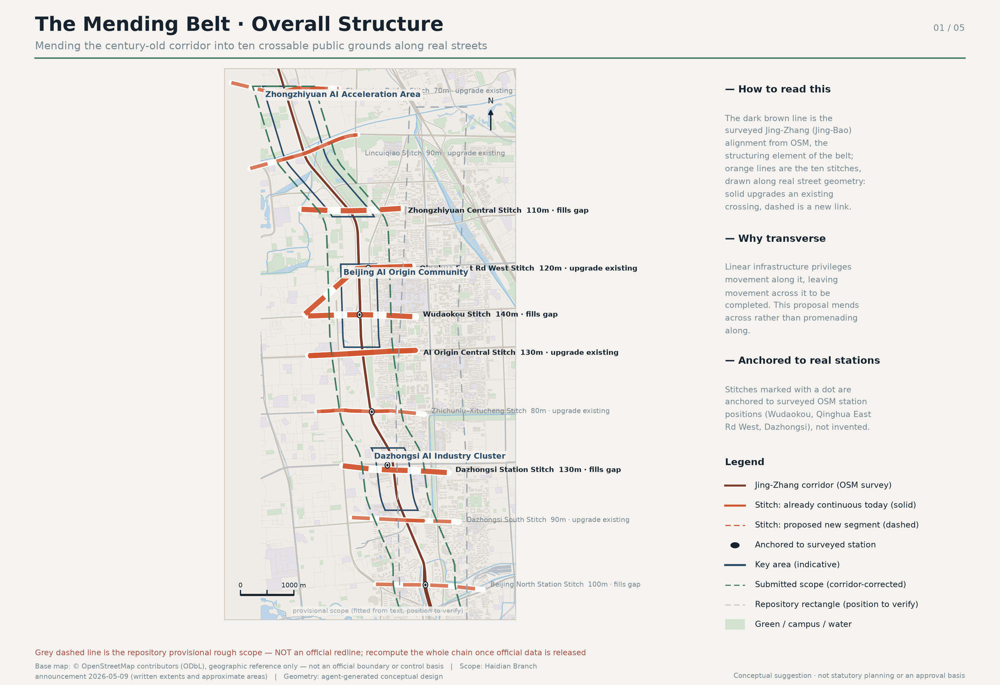
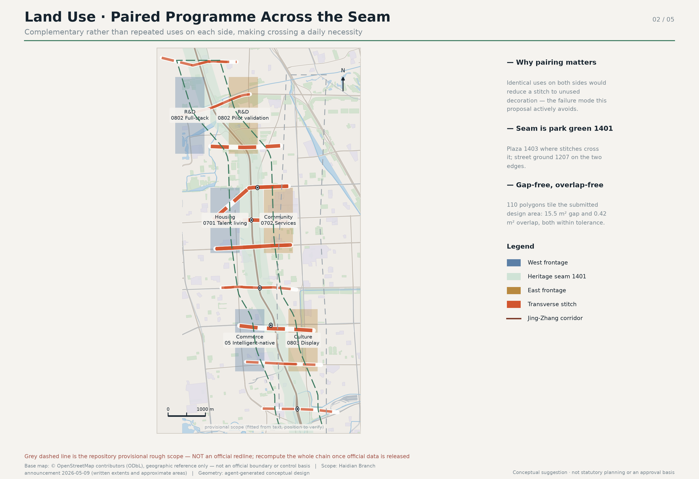
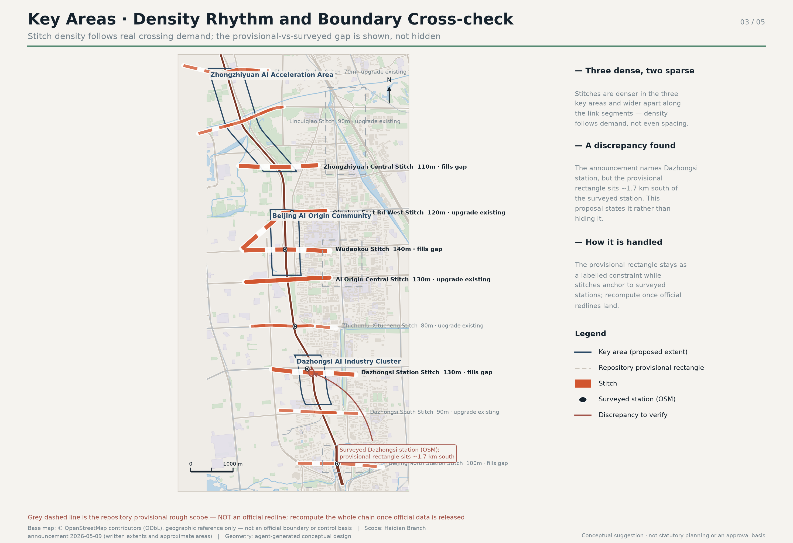
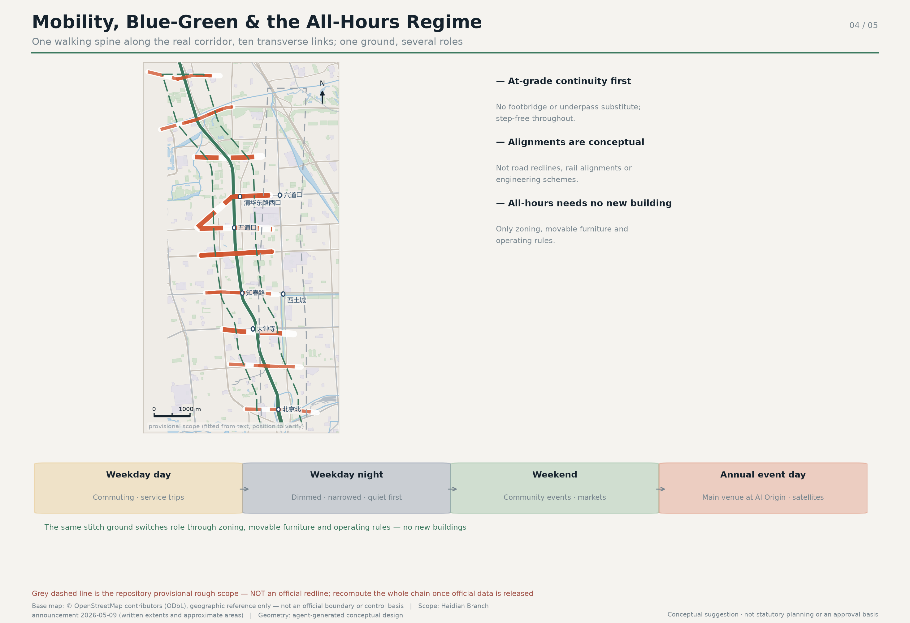
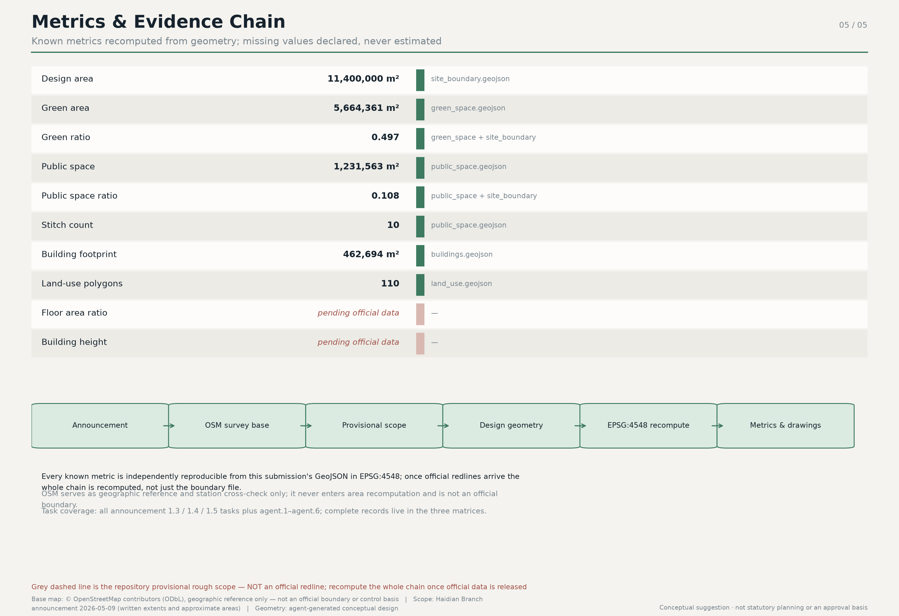

# THE MENDING BELT

## Summary and Core Judgment

The century-old Jing-Zhang railway left Haidian two legacies. One is a spirit of self-reliant innovation worth commemorating. The other is rarely discussed head-on: it left a continuous ten-kilometre corridor through the city, running from the North Fifth Ring Road down to Xizhimenwai Street. As linear infrastructure, a railway inherently privileges movement along it, leaving movement across it to be completed later. For a hundred years the communities, campuses and industrial districts on either side grew up separately, and each side developed a complete life of its own.

This proposal therefore advances a judgment that runs against the common approach: the belt's primary task is not "to be walked along better" but "to become crossable again." The value of the heritage park is not that it can produce another longitudinal landscape promenade, but that it makes transverse mending spatially possible for the first time. The proposal turns this judgment into three concrete things: one continuous heritage seam park as the public floor, ten transverse mending stitches as the core public-space system, and an all-hours operating regime that lets the same ground carry different roles at different times [data:geometry/public_space.geojson#PUBLIC-007] [metric:mending_stitch_count].

The position of AI shifts accordingly. It is not a label applied to building façades but a reversible pilot inside the specific space of a stitch: measuring and validating in a real crossing situation, and falling back to a human process when it fails. That way the public value of AI can be felt by ordinary residents on the route they walk every day, rather than only in an exhibition hall [depth:blue_green_public_space].

### Boundary statement

Every spatial suggestion in this proposal is a conceptual suggestion and reference scheme for professional teams to develop further. It does not replace statutory planning and does not constitute a government decision, an approval basis, an ownership determination, or an engineering feasibility conclusion. All geometry is generated on the repository's provisional rough boundary (provisional constraint), and the entire chain must be recomputed once official redlines are released.

## Design Basis and Source Inventory

The factual basis of this proposal is limited to public or cleared material. The governing basis is the pre-qualification announcement issued by the Haidian Branch of the Beijing Municipal Commission of Planning and Natural Resources on 9 May 2026, which gives the areas of the three scope levels, their written extents, and the names and north-to-south order of the three key areas [source:DATA-SRC-OFFICIAL-ANNOUNCEMENT-20260509]. The taskbook extract for the agent open call supplies the three positioning statements, five functions, three areas and two wings, and six required tasks [source:DATA-SRC-AGENT-TASKBOOK-20260518]. Land-use coding follows the Ministry of Natural Resources classification guide issued in 2023 [source:DATA-SRC-MNR-LAND-USE-CLASSIFICATION-202311], and the urban-design and regulatory-plan depth requirements correspond to the MOHURD urban design measures and the regulatory detailed planning measures respectively [standard:MOHURD-URBAN-DESIGN-MEASURES].

The largest data gap must be stated plainly: no official precise boundary for this call is publicly available. The announcement gives areas and written extents only, with no coordinate data or redline drawing attached. The provisional rough boundary supplied by the repository was fitted from those written extents and approximate areas, with relative deviations between 0.02% and 0.43%. That level of agreement shows only that the order of magnitude of the area is right; it does not show that the boundary position is right. Every area figure in this proposal is therefore a recomputation on a provisional boundary and cannot be used for statutory planning, precise area verification, or approval [data:geometry/site_boundary.geojson#SITE-001]. Every statement of specific position in this proposal — for example that a stitch sits "toward the Qinghua East Road West Entrance" — is a conceptual position inferred from the announcement's task wording and must be re-sited once official data arrives.

#### Two deviations found by cross-checking against open geographic data

To ground the drawings in real geography this proposal uses OpenStreetMap open data (ODbL) to draw the base map, reconstruct the Jing-Zhang (Jing-Bao) corridor alignment, and cross-check the station positions the announcement names. Two deviations were found that the organiser should review.

Deviation one: the provisional rectangle and the surveyed corridor do not coincide in longitude.

| Feature | Longitude range | Note |
| --- | --- | --- |
| Surveyed Jing-Zhang corridor (OSM) | 116.31378–116.34773 | Runs west in the north and east in the south, about 10.19 km in total |
| Repository provisional overall-scope rectangle | 116.33970–116.35530 | In the north it lies about 2 km EAST of the surveyed corridor |

In other words, in its northern section the provisional rectangle does not contain the corridor it is meant to describe. The two overlap by only about 2.6 million m², or 22.8% of the rectangle.

Deviation two: the Dazhongsi key area sits about 1.7 km from the surveyed station.

| Announcement position cue | Surveyed station (OSM) | Repository provisional rectangle | Difference |
| --- | --- | --- | --- |
| Wudaokou | 39.99148 / 116.33170 | Inside the AI Origin Community | Broadly consistent |
| Qinghua East Rd West Entrance | 39.99930 / 116.33363 | Northern edge of AI Origin | Broadly consistent |
| Dazhongsi station | 39.96527 / 116.33901 | 39.9440–39.9498 | About 1.7 km apart |

Neither is a repository error. The provisional boundary file itself states that the rectangles serve only as placeholders for generation, display and discussion; the deviation is the inference error that written extents inevitably produce when no coordinates are available.

#### How this proposal handles it: corridor correction with the original rectangle kept as evidence

The announcement defines the overall design area as "the urban and industrial areas within 1–2 km around the Jing-Zhang rail heritage park" — a corridor-relative definition. The `SITE_BOUNDARY` submitted here therefore centres on the surveyed corridor, takes the announcement's north-south written extents, and solves its half-width so the EPSG:4548 area matches the announced ~11.4 km². The solution is a half-width of 0.579 km (full width 1.16 km), which falls inside the "1–2 km" the announcement states. The three key areas are corrected the same way, with areas fitted exactly to the announced 192.1 / 104.3 / 72.0 hectares [data:geometry/site_boundary.geojson#SITE-001].

The corrected boundary both matches the announced area and contains the corridor the announcement refers to — something the original rectangle cannot do simultaneously. The repository rectangles are retained verbatim in `constraints.geojson`, the deviation is quantified, and both are drawn on the sheets as two distinct dashed lines for the organiser to review [data:geometry/constraints.geojson#PROV-KEY-SCOPE-001]. All geometry still carries `official_boundary=false` and `geometry_role=provisional_constraint`; the whole chain must be recomputed once official redlines are released.

The proposal uses no non-public maps, internal corporate data, personal privacy data, or unlicensed copyrighted material. All drawings, diagrams and text were generated by an agent and contain no unlicensed fonts, trademarks, portraits or academic figures; base-map data follows the ODbL attribution requirement.

## Three-Level Scope Framework

The three scope levels defined in the announcement carry different jobs here; they are not simply concentric rings.

### The coordinated research area (about 43.6 km²)

This is the scale at which the question of whether mending makes sense can be judged. The two sides of the corridor are not just the narrow strip inside the belt but the larger field of campuses, communities and industrial districts to the east and west. This level answers where people come from and where they are going once the two sides are reconnected. The proposal makes only relational judgments at this level and draws no design geometry, because the overwhelming majority of land in this scope lies outside the design area [data:geometry/constraints.geojson#PROV-RESEARCH-001].

### The overall design area (about 11.4 km²)

This is where the mending happens: a ribbon roughly 9.7 km north to south and 1.16 km east to west. That shape is itself a design condition: the belt is too narrow for longitudinal design alone to hold a complete urban life, and too long for anyone to realistically walk end to end. A form that is narrow and long argues that it should be treated as a collection of transverse nodes rather than one continuous linear place [metric:site_area_sqm].

### The key areas (about 368.4 ha across three sites)

This is where stitch density is highest. Zhongzhiyuan sits to the north, the AI Origin Community in the middle, and Dazhongsi to the south, in the order the announcement fixes [data:geometry/key_areas.geojson#PROV-KEY-002]. In these three areas the proposal compresses stitch spacing, and relaxes it along the link segments, producing a "three dense, two sparse" rhythm rather than evenly distributed points.

The working relationship between the levels is this: the research area supplies the judgment of demand, the design area supplies the spatial vehicle, and the key areas supply demonstration segments that can be built first, tested, and reversed.

## Coordinated Research Area: Industry and Future-City Study

Within the 43.6 km² research area the proposal is concerned not with investment targets but with where genuine demand for crossing arises. This scope contains university campuses, research institutes, residential communities and industrial parks, and activity through the day is strongly directional: commuting dominates the morning and evening peaks, internal campus and office activity dominates the daytime, and living services and leisure dominate evenings and weekends. The public package contains no time-of-day pedestrian counts, detour-time baseline or demographic survey, so the proposal does not present “twenty minutes becoming five” as an existing fact. Detour time, step-free continuity and perceived night-time safety are instead the first measurements for Phase 1.

From this the proposal draws a future-city judgment: the competitiveness of an AI innovation belt does not rest on how much technology it can display, but on whether it can apply that technology to the small matter of shortening residents' daily detours, and have the result verified. This corresponds directly to the taskbook functions "a new paradigm of AI+ scenario empowerment" and "an intelligent and vibrant AI city" [source:DATA-SRC-AGENT-TASKBOOK-20260518].

On regional synergy, the proposal suggests using the stitches as interfaces for a "scenario exchange" relationship with the Beiwei community, Future Science City, Huairou Science City and the Economic-Technological Development Area: this belt offers dense, repeatedly observable real urban situations, while the outer science cities offer long-cycle experimental conditions, each validating the other. This is a mechanism suggestion, not a settled cooperation arrangement [depth:three_level_scope_framework].

### Pending official data

Conclusions about commuting volumes, population structure and detour distances require transport and demographic survey support; this proposal gives no figures for them.

## Overall Design Area: Urban Renewal at Regulatory-Plan Urban Design Depth

### Spatial structure: one seam, two sides, ten stitches

The spatial structure can be stated in one line: one continuous green seam, paired frontages on both sides, ten transverse stitches.

### The heritage seam park

It runs the full length of the surveyed rail corridor and occupies roughly half the belt width. It is the public floor and the cultural vehicle, and it also carries the north-south walking line. Continuity of the seam is a precondition — if it is interrupted, transverse mending loses the public ground it depends on [data:geometry/green_space.geojson#GREEN-001] [metric:green_ratio].

### The east and west frontages

These are not simply land-use fill but programme pairing across the seam: at the same latitude, the west and east sides carry complementary rather than duplicated functions, creating real reasons to travel back and forth. In the Zhongzhiyuan segment the west side is full-stack R&D and the east side pilot validation, so the trip between research and testing itself generates crossing demand. In the AI Origin segment the west side is housing and talent living while the east side is community service facilities, with the same logic between living and services. In the Dazhongsi segment the west side is intelligent-native commerce and the east side culture and display [data:geometry/land_use.geojson#LU-005-1]. If the two sides carried identical functions, the stitches would become decorative structures nobody uses — the outcome this proposal actively avoids.

### The ten mending stitches

They form the core public-space system, described in the next section.

Land use follows the Ministry of Natural Resources classification guide and tiles the provisional boundary without gaps or overlaps: the seam is park green (1401), plaza land (1403) where stitches cross it, and street ground (1207) where stitches run across the edge bands. In the three key areas the two sides carry, respectively, research land (0802), urban residential land (0701), community service facility land (0702), commercial and business land (05) and cultural land (0803) under the pairing described above; along the link segments the west band is research land and the east band protective green (1402); and the residual from boundary fitting is registered as reserved land (16) [metric:land_use_polygon_count].

### Development intensity, height, and retain / renovate / demolish

This proposal gives no conclusions on floor area ratio, building height or development intensity, and no retain-renovate-demolish scheme for specific parcels. These are statutory planning and ownership judgments; the public package contains no approved control values and no parcel ownership or building condition data, so any number would be fabricated [metric:floor_area_ratio] [metric:building_height_m].

What the proposal can responsibly offer are judgment principles for professional teams to apply once official data is obtained: parcels near a stitch should prioritise an active ground-floor interface and continuous ground; intensity should be moderately concentrated on both sides of a stitch to support crossing demand; and the treatment of existing buildings should begin with structural safety and condition assessment, favouring retention and renovation, with demolition reserved as a last option where safety or a genuinely necessary public route requires it, subject to statutory procedure. The building footprints in the geometry are conceptual placeholders only and express no scale, storey count, height or ownership [data:geometry/buildings.geojson#BLDG-001] [depth:retain_renovate_demolish].

## Detailed Design for the Three Key Areas

### Zhongzhiyuan AI Autonomous Innovation Acceleration Area (north, about 192.1 ha)

The northern segment carries the functions "a full-stack autonomous AI innovation system" and "global influence in AI governance." Three stitches are placed inside the key area - the Shangqing Bridge, Lincuiqiao and Zhongzhiyuan Central stitches - and the Qinghua East Road West link is treated as the fourth north-side phase connection. Across the four, three upgrade existing crossings and one fills a measured gap [data:geometry/public_space.geojson#PUBLIC-002].

The design point here is making validation a visible public act. Full-stack R&D on the west and pilot validation on the east face each other across the seam, and the stitches become the everyday route between them. The proposal suggests an observation interface open to the public at the Qinghe Makers Stitch, so residents can see the validation process itself rather than only a display board of results. This is a conceptual suggestion; the actual degree of openness must be judged by the operating body and safety management professionals.

### Beijing AI Origin Community (middle, about 104.3 ha)

The middle segment carries the function "a world-class AI innovation ecosystem" and is the densest and highest-priority stretch of the whole belt. Three stitches are placed here: Qinghua East Rd West (surveyed 39.99924N, upgrading an existing crossing), Wudaokou (anchored to the surveyed station at 39.99148N, filling a gap) and AI Origin Central (surveyed 39.98503N, upgrading an existing crossing) [data:geometry/public_space.geojson#PUBLIC-006].

This segment is designated Phase 1 because it satisfies three conditions at once: crossing demand is densest (housing paired with services), the user mix is most varied (students, residents, commuters, visitors), and the cost of failure is lowest — the stitches turn on at-grade continuity and depend on no bridge or tunnel engineering, so an unsuccessful pilot can be returned to its original state. Reversibility is the core criterion behind the Phase 1 siting [depth:phasing_implementation].

The AI Origin Central Stitch is proposed as the principal public node of the belt. At a conceptual width of 140 m it is the widest of the ten and carries three roles: daily crossing, community activity, and the main venue for the annual event.

### Dazhongsi AI Industry Cluster (south, about 72.0 ha)

The southern segment carries the function "intelligent-native new business forms," with two stitches: Dazhongsi Station (anchored to the surveyed station at 39.96527N, filling a gap) and Dazhongsi South (surveyed 39.95681N, upgrading an existing crossing) [data:geometry/public_space.geojson#PUBLIC-008].

The southern segment adjoins a rail station, so its flows are dominated by arrival and departure rather than lingering. The design point is to have the stitches also perform station-city connection: intelligent-native commerce on the west paired with cultural display on the east, giving people leaving the station a reason to make the transverse trip. Dazhongsi carries heritage protection status, and the proposal makes no suggestion touching the protected structures themselves; all spatial moves are confined to existing public ground, and specific protection requirements must be confirmed by heritage professionals in accordance with the law [depth:risk_missing_data].

## AI Public Space, the Stitch System, and Pilgrimage Landmarks

### The ten mending stitches

The stitch is the spatial prototype of this proposal and the element that most clearly distinguishes it. Each stitch is a stretch of continuous east-west public ground crossing the seam and joining the two sides. Conceptual widths range from 70 to 140 m, wider inside the key areas and narrower along the link segments; the combined public-space area of all ten is recomputed from the geometry [metric:public_space_area_sqm] [metric:mending_stitch_area_sqm].

Four design principles govern the stitches, all conceptual suggestions: at-grade continuity comes first, and a footbridge or underpass should not be substituted for crossing at ground level; step-free access must be continuous throughout, with gradients and paving reviewed by accessibility professionals; both ends must land on an interface with real function, so that no stitch becomes a route to a blank wall; and every stitch must be reversible — trialled first with paving, signage and temporary furniture, with fixed investment considered only after usage has been verified.

### The all-hours operating regime

The same stitch ground carries different roles across the day and the year, which is the proposal's second point of difference. On weekday daytimes commuting and service trips dominate and the ground keeps its maximum crossing width. On weekday nights lighting levels drop and the active edge contracts, prioritising quiet and safety. At weekends and on holidays the ground expands into community activity and market space. On the annual event day the AI Origin Central Stitch becomes the main venue and the others become satellite venues. The regime requires no new buildings — only ground zoning, movable furniture and operating rules working together [depth:blue_green_public_space].

### Three AI pilgrimage landmarks (conceptual suggestions)

The proposal offers three landmark concepts, none of which touches protected heritage structures or delivers an engineering conclusion:

1. The Mended Scar Ground (AI Origin Central Stitch) — a change of paving material marking where the former rail alignment meets the stitch, producing a visible trace of the mending. What it commemorates is not the railway itself but the act of the city reconnecting both sides.

2. The Validation Window (Qinghe Makers Stitch) — a publicly open observation interface onto the validation process, presenting the public value of AI as visible work rather than as an exhibit.

3. The Stitch Zero Marker (Dazhongsi Station Stitch) — the southern terminus marker of the belt, connected to the rail station, serving as the first spatial cue for international visitors entering the innovation belt.

### Honour display system

The proposal suggests recording people and teams who have made substantive contributions to the belt — including agent contributors — through markers embedded in the stitch ground, expanding as stitches are added year by year, forming a durable public memory vehicle rather than a single centralised monument. The specific form and award rules must be determined by the operating body.

## AI Innovation Ecosystem, Talent Profiles, and AI+ Scenarios

### Global AI innovation ecosystem references (six cases, methodological reference)

The proposal draws on public experience from six international innovation districts as methodological reference rather than as quantitative benchmarks: the institutional-density-plus-walkable-scale combination at Kendall Square in Boston; rail-land renewal with public space first at King's Cross in London; the mixed-use industrial land renewal path of 22@ in Barcelona; the research-industry-living mix at one-north in Singapore; the resident-participatory smart district pilots at Kalasatama in Helsinki; and the return of linear infrastructure to people at Cheonggyecheon in Seoul. Their shared lesson is that public space comes first, functions are paired, and pilots stay reversible — consistent with the stitch strategy here. Case information is drawn from public reporting; individual figures have not been verified item by item and are not used as quantitative evidence in this proposal [source:DATA-SRC-AGENT-TASKBOOK-20260518].

### Six agent tasks translated into spatial deliverables

The six agent tasks in the taskbook each have a visible deliverable here; “AI was involved” is not treated as a substitute for a design response:

| Task | Spatial response in this proposal | Reviewable deliverable |
| --- | --- | --- |
| agent.1 Overall spatial structure | One seam, two sides, ten stitches and a three-dense/two-sparse rhythm | `site_boundary`, `green_space`, `public_space`, overall board |
| agent.2 Traffic and slow mobility | Six existing-crossing upgrades plus four gap links; a north-south greenway and transverse pedestrian lines | `roads`, `constraints`, mobility board, Phase 1 measurement protocol |
| agent.3 Land use and urban renewal | 1401/1403/1207 establish continuous public ground; paired R&D–pilot, housing–services and commerce–culture frontages | `land_use`, `buildings`, land-use board |
| agent.4 Blue-green and public space | Continuous seam, time-switchable stitches and step-free priority | `green_space`, `public_space`, `metrics.json` |
| agent.5 AI ecosystem and operation | 12 scenario cards, three validations, the seam ledger and annual Mending Day | scenario table, pilot protocol, `phasing`, annual operation mechanism |
| agent.6 Character and heritage narrative | Mended Scar Ground, Validation Window, Stitch Zero Marker and bilingual wayfinding | three landmarks, A3/A0 drawings, bilingual boards |

This table is an index; complete task coverage, standards, design depth and self-check evidence remain in the three matrices and `self_check.json`. Every deliverable retains a human professional review boundary.

### Five user personas

The proposal organises scenarios around five kinds of user. The personas are conceptual constructs and are not based on any personal data:

1. Commuters — crossing twice daily, most concerned with predictable travel time and end-to-end continuity.
2. Students and early-career researchers — frequent, irregularly timed crossings; concerned with night-time safety and non-commercial places to linger.
3. Nearby residents, including older people and carers of children — concerned with step-free continuity, walking distance and access to everyday services.
4. Firms and developers — concerned with being able to apply for test settings, clear data boundaries, and reproducible validation results.
5. International visitors and observers — concerned with an intelligible spatial narrative and bilingual wayfinding.

### Twelve AI scenario cards

Each card follows the structure scenario — space — operation — human review boundary. Every scenario includes human review and a failure fallback, and none depends on non-public or personal privacy data.

| No. | Scenario | Space | Users | Human review and fallback |
| --- | --- | --- | --- | --- |
| S-01 | Transverse crossing continuity assessment | All stitches | Commuters, residents | Findings are planning advice only, subject to field survey |
| S-02 | Step-free route continuity checking | Stitch ground | Older people, carers | Accessibility professional review; falls back to manual inspection |
| S-03 | Night-time perceived-safety lighting adjustment | Stitches and seam | Students, night users | A fixed lighting floor is retained; never fully automatic shutdown |
| S-04 | Event-day crowd zoning guidance | AI Origin Central Stitch | Visitors, residents | On-site operator decisions take precedence |
| S-05 | Low-speed delivery robot path sharing | Seam greenway spine | Residents, merchants | Pedestrian priority; robots yield on conflict and can be taken over remotely |
| S-06 | Public observation of pilot validation | Qinghe Makers Stitch | Public, developers | Observable content subject to safety and confidentiality review |
| S-07 | Jing-Zhang history and mending narrative guiding | Mended Scar Ground | Visitors, students | Historical content verified by history professionals |
| S-08 | Station-city interchange prompts | Dazhongsi Station Stitch | Commuters, visitors | Official rail operator information prevails |
| S-09 | Public facility fault reporting and response loop | All stitches | Residents | Municipal departments execute; AI only classifies and dispatches |
| S-10 | Seam vegetation and microclimate observation | Heritage seam park | Managers, public | Maintenance decisions confirmed by landscape professionals |
| S-11 | Corporate test-scenario application and scheduling | Three key areas | Firms, developers | Applications subject to safety, ethics and public notification procedures |
| S-12 | Bilingual public information consistency checking | Belt-wide wayfinding | International visitors | Translations published only after human review |

### Three industry test and validation scenarios

1. Low-speed automated delivery shared right-of-way test (seam greenway spine) — validating the safety boundary and yielding rules for mixed human-machine movement, with pedestrian priority throughout and the ability to stop at any time.
2. Automated step-free continuity detection test (stitch ground) — validating agreement between automated detection and manual inspection, with the manual finding authoritative.
3. Event-day crowd guidance test (AI Origin Central Stitch) — validating zoning guidance during a real event, with operators retaining final decision authority.

All three are test and validation settings, not approved operations; safety, ethics and public notification procedures must be completed before implementation [depth:municipal_new_infrastructure].

### Privacy and human review boundary

The proposal explicitly excludes: facial recognition or individual identity tracking; scenarios requiring personal privacy data as a necessary input; automated decisions that cannot be reviewed by a human or reversed; and schemes requiring a single designated supplier. All scenarios presuppose aggregation, anonymity and the ability to be switched off, and the public has the right to know a scenario exists and to object to it.

### The seam ledger: an auditable operating protocol for AI

Every scenario card records five reviewable fields, not only what AI might do: the problem and spatial location, the minimum data boundary, the recipient of the output, the human professional role that reviews it, and the condition that stops the pilot and returns to a manual process. Pilots follow five steps: observe a baseline, deploy temporarily, review with a human, publish the result, then retain, revise or reverse. A scenario without a public result or a fallback switch does not advance. The seam ledger turns AI from an invisible back-office capability into a public protocol that residents can understand, professional teams can question and operators can stop.

The first three validations address three different risks: a low-speed delivery robot tests yielding at a shared ground; step-free continuity detection tests agreement between automated detection and manual inspection; and event-day crowd guidance tests whether peak zoning improves movement without creating new exclusion. Manual records remain authoritative in all three, and failed samples are published alongside successful samples rather than filtered out.

### Public interest and equity checks

The evaluation order at every stitch is “continuity first, efficiency second, events third.” Step-free continuity for older people, children with carers, wheelchair users and people using mobility aids cannot be sacrificed to event layouts; a safe lighting baseline remains at night; free passage cannot depend on purchasing, registration or a single platform; and before/after monitoring records accessibility, dwell and complaint handling for different user groups instead of hiding losses behind one average. If a pilot improves commuting while degrading care, accessibility or night-time safety, it is adjusted or reversed before it is expanded.

## Land Use, Building Scale, and Retain / Renovate / Demolish

The land-use scheme is described in the overall design area section and is coded to the classification guide and tiled across the provisional boundary [data:geometry/land_use.geojson#LU-001-1].

Building scale and retain-renovate-demolish: pending official data. Building scale depends on floor area ratio control values, and retain-renovate-demolish decisions depend on parcel ownership, existing building condition and safety assessment. Neither class of data exists in the public package. The proposal offers only the judgment principles stated above and no conclusion for any specific parcel. The 30 building footprints in the geometry are conceptual placeholders for the active frontages beside the stitches, and their recomputed areas serve only to indicate the order of magnitude of that frontage [metric:building_footprint_area_sqm].

The design intent behind the land-use scheme is that every parcel is accountable to a stitch. The seam is uniformly park green (1401) so the public floor stays continuous. Where a stitch crosses the seam the land becomes plaza land (1403), so that the transverse ground is public in its own right under ownership and management categories rather than borrowed temporarily from green space. On the east and west edges the stitch ground is registered as urban road land (1207), giving pedestrian continuity an explicit land-use basis. In the three key areas the two sides follow the paired-programme logic as research land (0802), urban residential land (0701), community service facility land (0702), commercial and business land (05) and cultural land (0803). Along the link segments the west band is research land carrying innovation services and the east band is protective green (1402) carrying ecological buffering, keeping the seam unbroken outside the key areas. The residual from boundary fitting is registered as reserved land (16), to be re-divided once official boundaries are released [data:geometry/land_use.geojson#LU-002-1].

The reproducibility of this allocation is guaranteed by the geometry: 110 land-use polygons tile the provisional design area without gaps or overlaps, both within tolerance, and a third party can reproduce the area conclusions independently from the same GeoJSON [metric:land_use_polygon_count]. It must be stressed that the land-use codes express functional intent and a suggested management category, not development intensity, building scale or ownership. Once official redlines and regulatory control values are released, both the land-use boundaries and their codes must be re-verified rather than carried over from this provisional division [depth:land_use_layout].

## Traffic, Rail, Municipal and Public Service Facilities

### Traffic and slow mobility

The core of the transport proposal is transverse continuity. The seam greenway spine runs the full north-south length, ten transverse pedestrian links cross the seam, and three conceptual transit connections link the key areas to the seam [data:geometry/roads.geojson#ROAD-001]. All alignments are conceptual illustrations and do not constitute road geometry, road redlines, rail alignments or engineering schemes; they must be determined by transport and rail professionals through statutory procedure [depth:traffic_rail_slow_parking].

### Rail

Existing rail conditions at Dazhongsi station and toward Wudaokou are an important basis for stitch siting. The proposal suggests that stitches connect directly at grade with station entrances to avoid a second detour. The specific connection method must be confirmed by rail operations and transport professionals.

### Municipal and new infrastructure

The proposal offers no pipeline, energy load or municipal capacity calculations, which are professional computations lacking base data here. What can be suggested is that the stitches serve as corridors for consolidated laying and maintenance, reducing repeated excavation, and that new infrastructure — sensing and compute access points — be deployed in batches alongside the stitch pilots, avoiding a single large irreversible investment [depth:municipal_new_infrastructure].

### Public service facilities

Community service facility land is concentrated on the east side of the AI Origin segment, paired with housing on the west so that services are reachable on foot. Facility scale must be determined once population and service standard data are available.

## Blue-Green Space, Public Space and Urban Character

### Blue-green system

The heritage seam park is the main body of green space in the belt, with protective and ecological buffer green along the east side of the link segments keeping the seam unbroken; the green ratio is recomputed from the geometry [metric:green_ratio] [data:geometry/green_space.geojson#GREEN-002]. The proposal involves no blue-line adjustment or water engineering.

### Urban character and cultural narrative

The core of character control is not a uniform façade style but keeping transverse sightlines and ground continuous. The proposal suggests that ground floors on both sides of a stitch stay permeable and active, so that continuous blank walls do not seal shut a seam that has just been joined.

The historical value of the Jing-Zhang railway is made concrete here through the act of mending itself: a century ago it proved the possibility of self-reliant innovation by connecting north to south; a century later the city mends east to west so that it serves daily life today. The innovation culture of Zhongguancun and the new culture of AI join here — innovation is not only making new things, but also keeping what the previous generation built valuable today. This is the proposal's cultural narrative and its core statement for international communication [depth:overall_spatial_structure].

### Wayfinding and signage

The proposal suggests taking "mending" as the symbolic motif, using a transverse linear language consistent with the ground markings, bilingual throughout the belt. The signage system and the belt's overall logo system are two separate layers and must not be conflated. All fonts and graphics must use commercially licensed resources.

### Naming and visual identity direction (conceptual suggestion)

The principal name is "京张缝合带" with the English name "THE MENDING BELT." The logo direction suggested is a break joined by short transverse lines — the break standing for the century-old discontinuity and the lines for the stitches, with the number of lines extendable as stitches are actually built, so the mark itself becomes a record of progress. This is a design direction, not a finished identity, and must be settled through professional design and trademark clearance.

## Renewal Project List, Implementation Policy, and Phasing

### Phasing suggestion (conceptual; not an implementation schedule or investment commitment)

The proposal organises three phases on the principle "trial first, observe, reverse if needed." Each phase states three things explicitly — stage actions, participating actors, and measurable indicators — so a professional team can pick the work up directly and the public can check it.

#### Phase 1 (near term, about 0–12 months): AI Origin Community mending pilot

- Stage actions: the Qinghua East Rd West, Wudaokou and AI Origin Central stitches are trialled first with paving, signage, movable seating and temporary shelter, with no fixed engineering investment [data:geometry/phasing.geojson#PHASE-001].
- Participating actors: the subdistrict office and community residents' committee coordinate; nearby universities and research institutes supply observation and volunteers; the rail operator supports station connection; municipal and landscape departments review safety and maintenance; the developer community claims scenario cards.
- Measurable indicators: daily change in transverse crossings, percentage reduction in detour distance, share of step-free continuous segments, night-time dwell duration, resident satisfaction scores, and time to resolve complaints. These are proposed monitoring definitions; the baseline must be established by transport and demographic survey, and this proposal presets no values.
- Reversal condition: if measured crossings stay below the baseline expectation for three consecutive months, or accessibility and safety standards are not met, the site is restored with no further investment.

#### Phase 2 (medium term, about 1–3 years): Zhongzhiyuan full-stack validation segment

- Stage actions: the four northern stitches advance together with the paired R&D-to-pilot-validation frontage; the Qinghe Makers stitch adds a validation observation interface open to the public.
- Participating actors: the park operator and resident firms provide validation settings; universities provide assessment methods; sector regulators review safety and confidentiality boundaries; the local community negotiates opening hours.
- Measurable indicators: median cross-seam commuting time, number of corporate test-scenario applications and approvals, count of publicly released validation results, public observation attendance, and the number of scenario reversals with mean recovery time.

#### Phase 3 (longer term, about 3–5 years): Dazhongsi culture and commerce segment

- Stage actions: the two Dazhongsi stitches plus the Beijing North Station link, combined with station-city connection and cultural display; the Stitch Zero Marker is installed.
- Participating actors: rail operations, commercial operators, heritage protection professionals, and cultural and communication teams.
- Measurable indicators: share of arriving passengers who walk transversely, number of cultural events and attendance, merchant and visitor satisfaction, and spot-check pass rate for bilingual wayfinding availability.

Together the phases cover all ten stitches (3 + 4 + 3). Each phase measures crossing volume, detour distance and time, step-free continuity, night-time safety, satisfaction and complaints, then decides whether to retain, revise or reverse the intervention. This is a proposed governance path, not a settled government arrangement.

#### Initial pilot targets (proposed values, to be calibrated against field baseline)

These are startup targets for testing, not existing conditions, government indicators or implementation commitments. Once a professional baseline is established, the targets may be revised; every result must be read together with safety, accessibility and equity outcomes.

| Target | Initial proposal | Evidence and review |
| --- | --- | --- |
| Transverse crossings | At least 20% above the pre-pilot baseline, or a stable increase without added congestion | Time-of-day manual counts plus anonymous aggregate counts, reviewed by transport professionals |
| Detour distance and time | At least 15% reduction in median detour distance; no absolute-minute claim is assumed | Field route samples with sample size and error published |
| Step-free continuity | 100% continuity on the announced pilot route; any break is repaired or the event layout is reversed | Segment-by-segment accessibility review; manual record is authoritative |
| Public feedback | Major safety/accessibility issues acknowledged within 24 hours; ordinary issues receive a status within three working days | Complaint ledger and public response times |
| AI fallback | Within 24 hours after a stop trigger, algorithmic output is disabled and the manual process resumes | Operations log, human confirmation and fallback drill |

The renewal project list is organised by these phases, and every item is a light action that can be trialled, observed and reversed, containing no project requiring a single large capital commitment. This is the proposal's deliberate control on implementation risk.

Policy mechanism suggestions (suggestions only, not settled arrangements): establish a fast approval and exit channel for stitch pilots; establish a single entry point for scenario-opening applications with safety and ethics review; and establish public reporting of pilot outcomes so that failures are equally visible to the public.

## Global AI Innovation Event System and Long-Term Operation

### Annual event system

The proposal suggests "Mending Day" as the annual flagship, with the main venue at the AI Origin Central Stitch and satellite venues at the others, its content being public examination of that year's stitch pilot results — successes and failures alike. The core mechanism is public examination rather than achievement announcement, consistent with the reversibility principle.

### Developer community operation

The proposal suggests the scenario card as the smallest unit of collaboration, with developers claiming scenarios, submitting implementations and publishing results; every card retains its human review boundary and fallback condition as a mandatory constraint. Agent contributors and human contributors are recorded equally.

### Scenario opening mechanism

The three test and validation settings form the first batch of open scenarios, with application, review, scheduling and result publication forming a closed loop. Opening is not the absence of constraint: safety, ethics and public notification are preconditions.

### International communication and conversion

The communication line is "how a city brought a century-old corridor back into daily life," a narrative that is legible across cultures and depends on no exaggerated promise. The suggested conversion path is: open scenarios attract developers → pilot results become public evidence → evidence attracts firms and talent → implementation needs feed back into scenarios. All of the above are operating mechanism suggestions and constitute no settled commitment on investment attraction, policy, funding or events [depth:renewal_project_list].

### Long-term brand assets

The number of stitches, the pilot results and the contributor record form a public asset that accumulates over time rather than being consumed by a single event.

## Metrics, Area Recomputation, and the Compliance Matrix

All known metrics are recomputed in EPSG:4548 from the GeoJSON in this submission's `geometry/` directory, and a third party can reproduce them from the same files [metric:site_area_sqm] [metric:public_space_ratio].

| Metric | Value | Note |
| --- | --- | --- |
| Design area | 11,400,000 m² | Announced approx. 11,400,000 m²; matches the announced value (0.000% deviation) |
| Green area / green ratio | 5,664,361 m² / 0.497 | Heritage seam plus link-segment buffer green |
| Public space area / share | 1,231,563 m² / 0.108 | The ten stitches |
| Stitch count | 10 | Six upgrade existing crossings, four fill measured gaps |
| Building footprint area | 462,694 m² | Conceptual placeholders; no building scale implied |
| Land-use polygons | 110 | Gap-free, overlap-free tiling of the provisional boundary |
| Floor area ratio / building height | Pending official data | Statutory planning judgments; no control values in the public package |

Task coverage is recorded in the task coverage matrix, where all announcement 1.3, 1.4 and 1.5 tasks and the six required agent.1 to agent.6 tasks have corresponding entries; professional standard responses are recorded in the professional standard matrix; and design depth is recorded in the design depth matrix. The three matrices and this text index each other, and the complete records are not repeated in the narrative.

## Risk, Copyright, and Legal / Official-Claim Boundaries

The largest risk is boundary precision. All geometry is generated on a provisional rough boundary and its positional correctness is unproven. Once official redlines are released, every layer must be regenerated, every metric recomputed and every drawing reissued — not merely the boundary file replaced. Until then none of the area figures in this proposal may be used for any statutory purpose [depth:metrics_recalculation].

The second risk is the usability assumption behind the stitches. The proposal assumes real transverse crossing demand exists on both sides, an assumption requiring transport survey verification. If measured use at a given stitch proves too low, the reversibility principle should return it to its original state rather than justify further investment. The proposal controls this risk deliberately through the sequence of temporary installation before fixed investment.

### Compliance boundaries

This proposal is not a statutory planning deliverable and does not replace regulatory plans, special plans or engineering design; it does not constitute a government decision or an approval basis. It gives no floor area ratio, building height, parcel-level retain-renovate-demolish scheme, road redline, rail alignment, bridge or tunnel engineering, underground space feasibility, municipal capacity, land ownership, investment estimate or approval judgment. It involves no alteration of protected heritage structures. All events, policies and operating content are suggestions and represent no settled government decision.

### Copyright and generation method

All text, diagrams, geometry and web pages were generated by an agent from the repository's public materials and cleared sources, using no unlicensed fonts, trademarks, images, portraits or academic figures. International case information comes from public reporting and serves only as methodological reference. The work is submitted under the repository's community display licence for use by subsequent agents, professional teams and the public.

### Human final judgment

This proposal is an open co-creation suggestion. It may be screened and ranked, but final judgment rests with humans and professional teams.

## References

The following are the bases actually used in this proposal. Complete source records, licence terms and usage limits are in `sources.json`; complete assumptions and data gaps are in `assumptions.json`.

### Official and cleared sources

1. Haidian Branch, Beijing Municipal Commission of Planning and Natural Resources, "Pre-qualification announcement for the international solicitation of urban design for the Centennial Jing-Zhang AI Innovation Belt" (2026-05-09) — areas of the three scope levels, written extents, and the names and north-to-south order of the three key areas [source:DATA-SRC-OFFICIAL-ANNOUNCEMENT-20260509]
2. Cleared taskbook extract for the global agent open call — three positioning statements, five functions, three areas and two wings, the six required agent.1–agent.6 tasks, and the co-creation charter [source:DATA-SRC-AGENT-TASKBOOK-20260518]
3. Ministry of Natural Resources, "Guide to land and sea use classification for territorial spatial survey, planning and use control" (2023) — land-use coding [source:DATA-SRC-MNR-LAND-USE-CLASSIFICATION-202311]
4. MOHURD, "Urban Design Management Measures" — urban design deliverable depth requirements [standard:MOHURD-URBAN-DESIGN-MEASURES]
5. MOHURD, "Measures for the formulation and approval of regulatory detailed planning for cities and towns" — regulatory depth and statutory boundaries [standard:MOHURD-CONTROL-DETAILED-PLANNING]

### Repository materials

6. `brief/site-package/geometry/provisional_boundaries.geojson` and `provisional_boundaries_basis.md` — the provisional rough boundary, its inference rules, area verification and replacement conditions. For generation, display and interim self-check only; never an official redline [data:geometry/site_boundary.geojson#SITE-001]
7. `data/source_registry.json` — the public source registry, distinguishing sources usable for formal claims from background-only material
8. `brief/site-package/enums/`, `ranges/planning_limits.json`, `schemas/` — enumerated vocabularies, control ranges and structural validation schemas

### Methodological references (public reporting; not verified item by item, not used as quantitative evidence)

9. Kendall Square (Boston), King's Cross (London), 22@ (Barcelona), one-north (Singapore), Kalasatama (Helsinki), Cheonggyecheon (Seoul) — six international innovation district and linear-infrastructure renewal cases, referenced for the method of "public space first, paired functions, reversible pilots"

### Evidence files produced by this submission

10. `geometry/*.geojson` (nine layers), `metrics.json`, `assumptions.json`, `sources.json`, `compliance_matrix.json`, `standard_matrix.json`, `design_depth_matrix.json`, `self_check.json` — the complete machine-auditable layer; every metric is independently reproducible from the GeoJSON in EPSG:4548 [metric:site_area_sqm]
