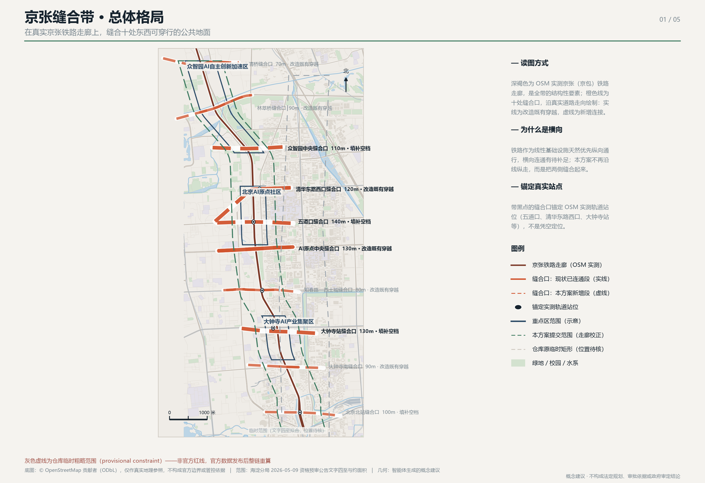
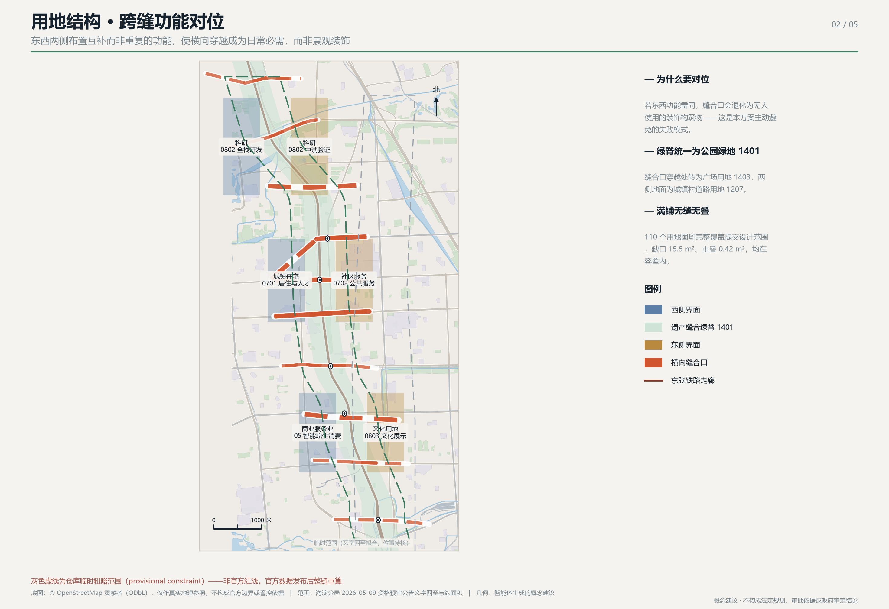
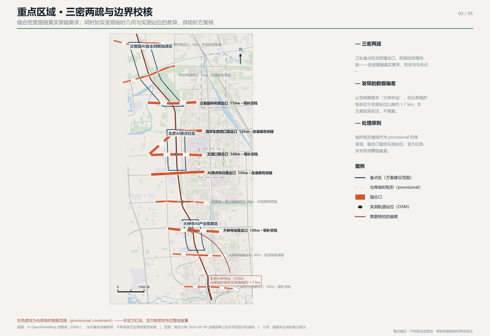
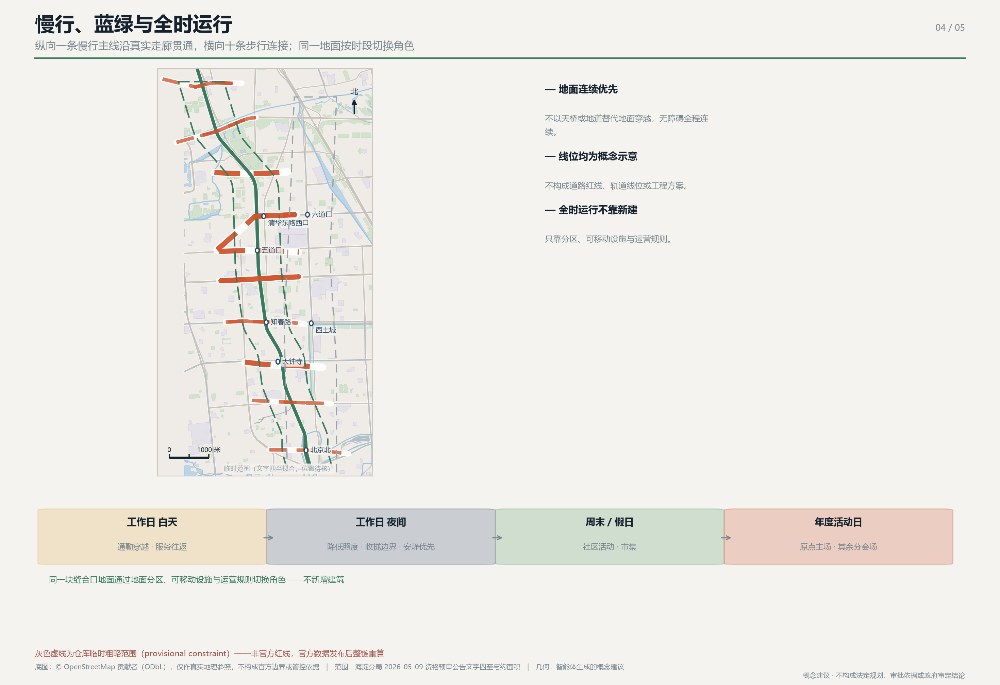
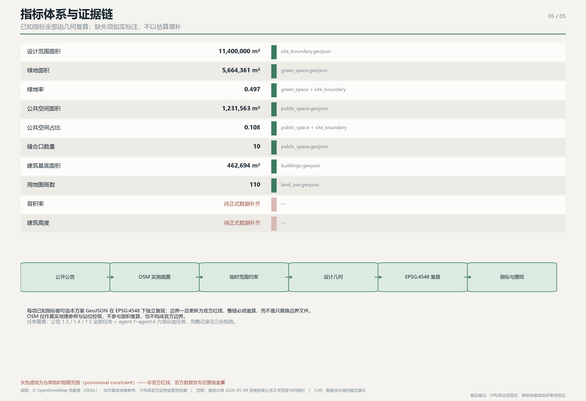

# 京张缝合带 THE MENDING BELT

## 摘要与总体判断

百年京张铁路给海淀留下两笔遗产：一笔是可以被纪念的自主创新精神，另一笔很少被正面讨论——它在城市中留下了一条从北五环到西直门外大街、近十公里长的连续走廊。铁路作为线性基础设施，天然优先纵向通行，横向连通则有待补足。一百年里，东西两侧的社区、校园、产业区各自成长壮大，东西两侧的日常生活各自形成了完整而独立的体系。这不是修辞。用 OpenStreetMap 开放数据对走廊做一次穿越性统计，现状的横向连通条件可以被量化：

> 在图幅内约 10.19 公里的京张走廊上，能够连续贯通东西两侧的道路只有 6 条。平均间距约 2,038 米，最大空档达 2,160 米。

也就是说，在这条带的某些位置，地图上可映射的连续东西向穿越点之间相隔两公里以上。这是横向连通提升空间的量化线索，不是交通调查、权属判断或“合法通行点”结论；实际绕行还须由现场与交通专业核实 [metric:existing_ew_crossing_count] [metric:max_crossing_gap_m]。

因此本方案提出一个与常见思路相反的总体判断：这条带的首要任务不是"更好地沿着它走"，而是"重新能够横着穿过去"。遗址公园的价值不在于再造一条供人纵向漫步的景观主脉，而在于它第一次让横向缝合在空间上成为可能。方案把这一判断落成三件具体的事：一道连续的遗产缝合绿脊作为公共底座，十处横向缝合口作为核心公共空间系统，以及一套让同一块地面在不同时段承担不同角色的全时运行机制 [data:geometry/public_space.geojson#PUBLIC-006] [metric:mending_stitch_count]。

十处缝合口不是均匀撒点，而是对着上面那份统计逐条回应：其中 6 处改造既有穿越——那 6 条已经贯通的路，问题不在有没有，而在断点、绕行与无障碍不连续；另 4 处填补实测空档——落在 1.5 km 以上的缺口里，两端都接到既有道路上，不做"通向围墙的通道" [metric:stitch_upgrade_count] [metric:stitch_new_link_count]。每一条线形都沿 OSM 实测道路走向绘制，而不是画在图上的一道横杠。

AI 在方案中的位置也随之改变。它不是贴在建筑立面上的标签，而是缝合口这一具体空间里的可回退试点：在真实的横向穿越场景中测量、验证、并在失效时退回人工方案。这样 AI 的公共价值可以被普通居民在自己每天要走的那条路上感知到，而不是只体现在展厅里 [depth:blue_green_public_space]。

### 边界声明

本方案全部空间落地建议均为概念建议、参考方案，可供专业团队深化研究，不替代法定规划，不构成政府审定结论、审批依据、权属判断或工程可行性结论。所有几何基于仓库临时粗略边界（provisional constraint）生成，官方红线发布后必须整链重算。

## 设计依据与资料清单

方案的事实基础限定在公开或已清权的材料。主控依据是北京市规划和自然资源委员会海淀分局 2026 年 5 月 9 日发布的资格预审公告，它给出了三层范围的面积、文字四至，以及三处重点区的名称与自北向南的顺序 [source:DATA-SRC-OFFICIAL-ANNOUNCEMENT-20260509]。面向智能体的任务书摘录提供了三大定位、五大功能、三区两翼和六项必选任务的要求 [source:DATA-SRC-AGENT-TASKBOOK-20260518]。用地分类口径采用自然资源部 2023 年印发的用地用海分类指南 [source:DATA-SRC-MNR-LAND-USE-CLASSIFICATION-202311]，城市设计与控规深度要求分别对应住建部城市设计管理办法与控规编制审批办法 [standard:MOHURD-URBAN-DESIGN-MEASURES]。必须如实说明的最大数据缺口是：公开渠道目前没有本次征集的官方精确边界。公告只给了面积和文字四至，没有附坐标数据或红线图。仓库提供的临时粗略边界按公告文字四至和约面积拟合而成，相对偏差在 0.02% 到 0.43% 之间，这个吻合度只能说明面积量级正确，不能说明边界位置正确。因此本方案的全部面积数字都只是基于临时边界的复算结果，不能用于法定规划、精确面积核定或审批 [data:geometry/site_boundary.geojson#SITE-001]。方案中所有涉及具体位置的表述（如某个缝合口"位于清华东路西口方向"）都属于依据公告任务表述推定的概念位置，待正式数据补齐后须重新定位。

#### 用开放地理数据校核后发现的两处偏差

为使图纸建立在真实地理之上，本方案引入 OpenStreetMap 开放数据（ODbL）绘制底图、还原京张（京包）走廊线形，并用它校核公告提及的站点位置。校核发现两处需要提请组织方复核的偏差。

#### 偏差一：临时矩形与实测走廊在经度上不重合

| 要素 | 经度范围 | 说明 |
| --- | --- | --- |
| OSM 实测京张走廊 | 116.31378–116.34773 | 北段偏西、南段偏东，全程约 10.19 km |
| 仓库临时总体范围矩形 | 116.33970–116.35530 | 北段位于实测走廊以东约 2 km |

也就是说，北段的临时矩形并不包含它本该描述的那条走廊。两者面积重叠仅约 260 万 m²，占矩形面积的 22.8%。

#### 偏差二：大钟寺重点区与实测站位相差约 1.7 km

| 公告位置线索 | OSM 实测站位 | 仓库临时矩形 | 差异 |
| --- | --- | --- | --- |
| 五道口 | 39.99148 / 116.33170 | AI原点社区范围内 | 基本吻合 |
| 清华东路西口 | 39.99930 / 116.33363 | AI原点社区北缘 | 基本吻合 |
| 大钟寺站 | 39.96527 / 116.33901 | 39.9440–39.9498 | 相差约 1.7 km |

这两处都不是仓库的错误。临时边界文件本身已声明矩形"仅承担生成、展示和讨论的占位作用"，偏差是文字四至在缺少坐标数据时必然产生的推定误差。

#### 本方案的处理方式：走廊校正 + 原矩形留证

公告把总体设计范围定义为"京张遗址公园周边 1—2 公里的城市地区和产业区"——这是一个以走廊为参照的定义。因此本方案提交的 `SITE_BOUNDARY` 以 OSM 实测走廊为中心线，南北取公告文字四至，半宽按 EPSG:4548 面积拟合至公告约 11.4 km²，解得半宽 0.579 km（全宽约 1.16 km，正落在公告所说的"1—2 公里"区间内）。三处重点区同法校正，面积分别精确拟合至公告的 192.1 / 104.3 / 72.0 公顷 [data:geometry/site_boundary.geojson#SITE-001]。

校正后的边界既符合公告面积，又包含公告所指的走廊本体——这是原矩形无法同时做到的。仓库原矩形完整保留在 `constraints.geojson` 中，两者差异已量化并在图纸上以两种虚线同时呈现，供组织方复核 [data:geometry/constraints.geojson#PROV-KEY-SCOPE-001]。所有几何仍标注 `official_boundary=false`、`geometry_role=provisional_constraint`；取得官方红线后必须整链重算。

方案未使用任何非公开地图、企业内部数据、个人隐私数据或未授权版权材料。所有图纸、图示与文字均由智能体生成，不含未授权的字体、商标、肖像或论文图像；底图数据遵循 ODbL 署名要求。

## 三层范围工作框架

公告规定的三层范围在本方案中承担不同职责，不是简单的同心圈层。

### 统筹研究范围（约 43.6 km²）

这是判断"缝合"是否成立的尺度。走廊两侧不止是带内的窄条，而是东西两侧更大范围的校园、社区与产业区。这一层用于回答：横向接上以后，人从哪里来、到哪里去。方案在这一层只做关系判断，不做空间落图，因为这一范围内绝大部分土地不属于设计范围 [data:geometry/constraints.geojson#PROV-RESEARCH-001]。

### 总体设计范围（约 11.4 km²）

这是缝合动作发生的地方，一条南北约 9.7 公里、东西约 1.3 公里的窄带。这个形状本身就是设计条件：带太窄，纵向再怎么设计也无法容纳完整的城市生活；带太长，指望人们纵向走完全程并不现实。窄而长的形状恰恰说明它应该被当作一系列横向节点的集合，而不是一条完整的线性场所 [metric:site_area_sqm]。

### 重点区域（约 368.4 ha，三处）

这是缝合密度最高的地方。众智园在北、AI原点社区居中、大钟寺在南，公告已明确顺序 [data:geometry/key_areas.geojson#PROV-KEY-002]。方案在这三处把缝合口的间距压缩到约 400 米以内，在衔接段则放宽，形成"三密两疏"的节奏，而不是均匀布点。

三层之间的工作关系是：研究范围提供需求判断，设计范围提供空间载体，重点区域提供可以先做、可以试错、可以回退的示范段。

## 统筹研究范围产业与未来城市研究

在 43.6 km² 的统筹研究范围内，方案关注的不是招商指标，而是横向穿越的真实需求从哪里产生。这一范围内聚集了高校校园、科研院所、居住社区与产业园区，人口活动在一天之内呈现明显的方向性：早晚高峰以通勤为主，白天以校园与办公内部活动为主，夜间与周末以生活服务与休闲为主。现有公开材料没有提供分时人流、绕行时长或人口结构基线，因此本方案不把“二十分钟变五分钟”当作现状事实，而把绕行时间、无障碍连续性和夜间安全感列为一期首轮测量。方案由此提出面向未来城市的判断：AI 创新带的竞争力不取决于它能展示多少技术，而取决于它能否把技术用在缩短居民日常绕行这件小事上并被验证。这与任务书要求的"AI+场景赋能新范式"和"智能化AI活力城市"两项功能直接对应 [source:DATA-SRC-AGENT-TASKBOOK-20260518]。区域协同方面，方案建议以缝合口为接口与北纬社区、未来科学城、怀柔科学城、经开区形成"场景互换"关系：本带提供高密度、可反复观测的真实城市场景，外围科学城提供长周期实验条件，二者互为验证。这是机制建议，不是已确定的合作安排 [depth:three_level_scope_framework]。

### 待正式数据补齐

通勤流量、人口结构、绕行距离等结论需要交通与人口专业调查支撑，本方案不给出具体数值。

## 总体设计范围城市更新与控规深度城市设计

### 空间结构：一脊、两侧、十缝

方案的空间结构可以用一句话说明：一道连续绿脊，两侧对位界面，十处横向缝合。

### 遗产缝合绿脊

沿原铁路走廊全长贯通，占带宽约一半，是公共底座与文化载体，也承担南北慢行主线的功能。绿脊连续是前提——一旦被打断，横向缝合就失去可依托的公共地面 [data:geometry/green_space.geojson#GREEN-001] [metric:green_ratio]。

### 东西两侧界面

不是简单的用地填充，而是跨缝功能对位：西侧与东侧在同一纬度上布置互补而非重复的功能，制造横向往返的真实理由。众智园段西侧为全栈研发、东侧为中试验证，研发与验证之间的往返本身就产生穿越需求；AI原点段西侧为居住与人才居住、东侧为社区服务设施，生活与服务的往返同理；大钟寺段西侧为智能原生商业服务业、东侧为文化与展示 [data:geometry/land_use.geojson#LU-005-1]。如果东西两侧功能雷同，缝合口就会变成没人使用的装饰性构筑物，这是本方案要主动避免的情形。

### 十处缝合口

核心公共空间系统，详见下节。

用地布局按自然资源部分类指南编制，在临时边界内无缝无叠满铺：绿脊为公园绿地（1401），缝合口穿越绿脊处为广场用地（1403），缝合口在两侧的地面为城镇村道路用地（1207），三处重点区两侧按上述对位关系分别为科研用地（0802）、城镇住宅用地（0701）、城镇社区服务设施用地（0702）、商业服务业用地（05）与文化用地（0803），衔接段西侧为科研用地、东侧为防护绿地（1402），边界拟合余量登记为留白用地（16）[metric:land_use_polygon_count]。

### 开发强度、高度与拆改留

本方案不给出容积率、建筑高度、建筑强度结论，也不给出具体地块的拆改留方案。这三项属于法定规划判断与权属判断，公开资料包中没有经批准的管控值，也没有地块权属与现状建筑质量数据，任何数字都会是编造 [metric:floor_area_ratio] [metric:building_height_m]。方案能够负责任地提出的是判断原则，供专业团队在取得正式数据后使用：靠近缝合口的地块应优先保证首层界面活跃与地面连续，强度分配应向缝合口两侧适度集中以支撑穿越需求；现状建筑的处置应先做结构安全与使用状况评估，优先"留、改"，"拆"只应在安全或公共通道确需打通时作为最后选项，并须履行法定程序。几何中的建筑基底仅为概念占位体量，不表达规模、层数、高度或权属 [data:geometry/buildings.geojson#BLDG-001] [depth:retain_renovate_demolish]。

## 重点区域详细设计

三处重点区的核心概念是同一个机制在三种城市条件下的三次具体化：用一处可回退的横向公共地面，把一对互补功能接上。北段是"研发—中试"的往返，中段是"居住—服务"的往返，南段是"到发—停留"的转换。三段共用一套空间原型（缝合口）、一套运行机制（全时切换）与一套评估口径（穿越量、无障碍连续性、回退阈值），但因人群构成、需求密度与试错成本不同而采取不同的密度与时序。这种"同一机制、三种密度"的组织方式，是本方案区别于逐片区各自成章的差异化主张：它使三处重点区可以互相验证，也使任何一处的失败经验可以直接迁移到另外两处。缝合口的空间原型、跨缝功能对位关系与可回退试点路径共同构成本方案的核心概念体系，详见下文分段说明与 [data:geometry/public_space.geojson#PUBLIC-006]。

### 众智园AI自主创新加速区（北段，约 192.1 ha）

北段承担"AI全栈自主创新体系"与"AI治理全球话语权"两项功能。方案在此布置四处缝合口：上清桥缝合口、林萃桥缝合口、众智园中央缝合口，以及向南衔接的清华东路西口缝合口，其中三处改造既有东西向穿越、一处填补实测空档 [data:geometry/public_space.geojson#PUBLIC-002]。设计要点是把"验证"变成可被看见的公共行为。西侧全栈研发与东侧中试验证隔绿脊相望，缝合口成为二者之间的日常通道。建议在清河智造缝合口设置对公众开放的观察界面，让居民能够看到验证过程本身，而不只是看到成果展板。这是概念建议，具体开放程度须由使用主体与安全管理专业判断。

### 北京AI原点社区（中段，约 104.3 ha）

中段承担"世界级AI创新生态"功能，也是全带缝合密度最高、优先级最高的一段。方案布置三处缝合口：清华东路西口缝合口（实测 39.99924N，改造既有穿越）、五道口缝合口（锚定实测站位 39.99148N，填补空档）、AI原点中央缝合口（实测 39.98503N，改造既有穿越） [data:geometry/public_space.geojson#PUBLIC-006]。这一段被列为一期示范，理由是它同时具备三个条件：横向穿越需求最密集（居住与服务对位）、人群构成最多样（学生、居民、通勤者、访客）、以及试错成本最低——缝合口以地面连续为核心，不依赖桥隧工程，试点不成功可以退回原状。可回退性是本方案对一期选址的核心判断 [depth:phasing_implementation]。

AI原点中央缝合口建议作为全带的主要公共节点，宽度概念值 140 米，是十处中最宽的一处，承担日常穿越、社区活动与年度活动主场三重角色。

### 大钟寺AI产业集聚区（南段，约 72.0 ha）

南段承担"智能原生新业态"功能，布置两处缝合口：大钟寺站缝合口（锚定实测站位 39.96527N，填补空档）与大钟寺南缝合口（实测 39.95681N，改造既有穿越） [data:geometry/public_space.geojson#PUBLIC-008]。南段紧邻轨道站点，人流以到发为主而非停留。设计要点是让缝合口同时承担站城衔接功能：西侧智能原生商业服务业与东侧文化展示对位，使从轨道站出来的人有横向走一趟的理由。大钟寺具有文物保护背景，方案不提出任何涉及文物本体的改动建议，所有空间动作限于既有公共地面范围，具体保护要求须由文物专业依法确认 [depth:risk_missing_data]。

## AI公共空间、缝合口系统与朝圣地标

### 十处缝合口

缝合口是本方案的空间原型，也是与其他方案区别最明显的部分。每一处缝合口是一段东西向连续的公共地面，横跨绿脊，把两侧接上。宽度概念值在 70 至 140 米之间，重点区内较宽、衔接段较窄，全部十处合计公共空间面积由几何复算得出 [metric:public_space_area_sqm] [metric:mending_stitch_area_sqm]。缝合口的设计原则有四条，均为概念建议：地面连续优先，避免以天桥或地道替代地面穿越；无障碍全程连续，坡度与铺装须由无障碍专业复核；东西两端必须落在有实际功能的界面上，不做"通向围墙的通道"；每一处缝合口都是可回退的——先以地面铺装、标识与临时设施试运行，验证使用量后再考虑固定投入。

### 全时运行机制

同一块缝合口地面在一天与一年之内承担不同角色，这是方案的第二个差异点。工作日白天以通勤穿越与服务往返为主，地面保持最大通行宽度；工作日夜间降低照明强度、收拢活动边界，优先安静与安全；周末与假日扩展为社区活动与市集空间；年度活动日，AI原点中央缝合口转为主场，其余缝合口转为分会场。这套机制不需要新增建筑，只需要地面分区、可移动设施与运营规则的配合 [depth:blue_green_public_space]。

### 三处AI朝圣地标（概念建议）

方案提出三处地标概念，均不涉及文物本体、不给出工程结论：一、缝痕纪念地面（AI原点中央缝合口） —— 在地面以材质变化标记原铁路轨迹与缝合口的交点，形成一处"看得见的缝合痕迹"。它纪念的不是铁路本身，而是城市把两侧重新接上的这个动作。二、验证之窗（清河智造缝合口） —— 面向公众开放的验证过程观察界面，让 AI 的公共价值以"可以被看见的工作"而非"展品"的方式呈现。三、零号缝合口标识（大钟寺站缝合口） —— 全带南端起点标识，与轨道站衔接，作为国际访客进入创新带的第一个空间提示。

### 荣誉展示体系

建议以缝合口地面的嵌入式标识记录对本带有实质贡献的人与团队（含智能体贡献者），随缝合口逐年增加而扩展，形成可持续沉淀的公共记忆载体，而非集中式纪念碑。具体形式与授予规则须由运营主体确定。

## AI 创新生态、人才画像与 AI+ 场景

### 全球AI创新生态案例参照（6 例，方法性参照）

方案参照六类国际创新区的公开经验，用于方法借鉴而非指标对标：波士顿肯德尔广场的"机构密度+步行尺度"组合、伦敦国王十字的铁路用地更新与公共空间先行、巴塞罗那 22@ 的产业用地混合更新路径、新加坡纬壹科技城的产研居混合、赫尔辛基卡拉萨塔马的居民参与式智慧社区试点、首尔清溪川的线性基础设施还地于人。这些案例的共同经验是：公共空间先行、混合功能对位、试点可回退，与本方案的缝合口策略一致。案例信息来自公开报道与公开资料，具体数据未逐项核验，不作为本方案的定量依据 [source:DATA-SRC-AGENT-TASKBOOK-20260518]。

### 六项智能体任务的空间化交付

任务书中的六项智能体任务在本方案中各有可见的交付物，不以“AI 参与过”替代设计响应：

| 任务 | 本方案的空间化回应 | 可复核交付 |
| --- | --- | --- |
| agent.1 总体空间结构 | 一脊、两侧、十缝与三密两疏节奏 | `site_boundary`、`green_space`、`public_space`、总体图 |
| agent.2 交通与慢行 | 6 处既有穿越升级 + 4 处空档连接，绿脊纵向主线与横向步行线 | `roads`、`constraints`、慢行图、一期测量口径 |
| agent.3 用地与城市更新 | 1401/1403/1207 形成连续公共地面，两侧以研发—中试、居住—服务、商业—文化对位 | `land_use`、`buildings`、用地结构图 |
| agent.4 蓝绿与公共空间 | 绿脊连续、缝合口可切换、无障碍优先 | `green_space`、`public_space`、`metrics.json` |
| agent.5 AI 生态与运营 | 12 张场景卡、3 项验证、缝合账本、年度“缝合日” | 场景表、试点协议、`phasing`、年度运营机制 |
| agent.6 风貌与遗产叙事 | 缝痕纪念地面、验证之窗、零号缝合口与双语导视 | 三处地标、A3/A0 图纸、双语展板 |

这张表只做索引，完整任务覆盖、标准、设计深度和自检证据分别记录在三份矩阵与 `self_check.json` 中；每项交付都保留人工专业复核边界。

### 五类用户画像

方案面向五类使用者组织场景，画像为概念设定，不基于任何个人数据：

1. 通勤者 —— 每日两次穿越，最关心时间可预期与全程连续。
2. 学生与青年研究者 —— 高频、非定时穿越，关心夜间安全与可停留的非消费空间。
3. 周边居民（含老人与儿童照护者） —— 关心无障碍连续、步行距离与日常服务可达。
4. 企业与开发者 —— 关心测试场景可申请、数据边界清晰、验证结果可复现。
5. 国际访客与观察者 —— 关心可理解的空间叙事与双语导引。

### 十二张AI场景卡

每张场景卡的结构为：场景—空间—运营—人工复核边界。全部场景均设置人工复核与失效回退，均不依赖非公开数据或个人隐私数据。

| 编号 | 场景 | 落位空间 | 服务对象 | 人工复核与回退 |
| --- | --- | --- | --- | --- |
| S-01 | 横向穿越连续性评估 | 全部缝合口 | 通勤者、居民 | 结论仅作规划建议，须现场调研复核 |
| S-02 | 无障碍路径连续性检查 | 缝合口地面 | 老人、儿童照护者 | 无障碍专业复核，失效退回人工巡检 |
| S-03 | 夜间安全感照明调节 | 缝合口与绿脊 | 学生、夜间通行者 | 保留固定照明底线，不可全自动关闭 |
| S-04 | 活动日人流分区引导 | AI原点中央缝合口 | 访客、居民 | 运营人员现场决策优先 |
| S-05 | 低速配送机器人路径共享 | 绿脊慢行主线 | 居民、商户 | 人行优先，冲突时机器人让行并可远程接管 |
| S-06 | 中试验证过程公众观察 | 清河智造缝合口 | 公众、开发者 | 观察内容须经安全与保密审查 |
| S-07 | 京张历史与缝合叙事导览 | 缝痕纪念地面 | 访客、学生 | 史实内容须由文史专业审定 |
| S-08 | 站城衔接换乘提示 | 大钟寺站缝合口 | 通勤者、访客 | 与轨道运营信息以官方发布为准 |
| S-09 | 公共设施报修与响应闭环 | 全部缝合口 | 居民 | 处置由市政部门执行，AI 仅做归类分派 |
| S-10 | 绿脊植被与微气候观测 | 遗产缝合绿脊 | 管理方、公众 | 养护决策由园林专业确认 |
| S-11 | 企业测试场景申请与排期 | 三处重点区 | 企业、开发者 | 申请须经安全、伦理与公众告知程序 |
| S-12 | 双语公共信息一致性校核 | 全带导视系统 | 国际访客 | 译文须人工审定后发布 |

### 三个AI产业测试验证场景

1. 低速自动配送共享路权测试（绿脊慢行主线）—— 验证人机混行的安全边界与让行规则，测试期间人行优先，可随时终止。
2. 无障碍连续性自动检测测试（缝合口地面）—— 验证自动检测与人工巡检的一致性，以人工结论为准。
3. 活动日人流引导测试（AI原点中央缝合口）—— 在真实活动中验证分区引导有效性，运营人员保留最终决策权。三者均为测试验证场景，不是已批准的运营安排，实施前须履行安全、伦理与公众告知程序 [depth:municipal_new_infrastructure]。

### 隐私与人工复核边界

方案明确排除以下内容：人脸识别或个体身份追踪、以个人隐私数据为必要输入的场景、无法人工复核或无法回退的自动决策、指定单一供应商为必要条件的方案。所有场景以聚合、匿名、可关闭为前提，公众有权知悉场景存在并提出异议。

### 缝合账本：把 AI 变成可审查的空间运营协议

每张场景卡不只描述“AI 能做什么”，还必须同时记录五项可审查信息：问题与空间位置、输入数据的最小范围、输出给谁、哪一位人类专业角色复核、什么条件下停止并回退。试点按“观察基线 → 临时部署 → 人工复核 → 公开结果 → 保留、调整或回退”五步运行；没有公开结果或没有回退开关的场景，不进入下一阶段。这个“缝合账本”把 AI 从不可见的后台能力变成居民能够理解、专业团队能够质询、运营主体能够停止的公共协议。

三项首轮验证分别对应三种风险：低速配送机器人验证人机共享地面的让行边界；无障碍连续性检测验证自动识别与人工巡检的一致性；活动日人流引导验证高峰分区是否改善通行而不制造新的排斥。三项验证都以人工记录为最终依据，并将失败样本与成功样本一同公开，避免只展示“有效”的一面。

### 公共利益与公平校验

缝合口的评价顺序是“先连续、再效率、后活动”：老人、儿童照护者、轮椅与助行器使用者的无障碍连续性不因活动布置被牺牲；夜间照明保留安全底线，不以降低照明换取节能指标；免费穿越空间不以消费、注册或使用某一平台为前提；试点前后均记录不同用户群体的可达性、停留与投诉处置，不以单一平均值掩盖弱势群体的损失。若某一试点改善了通勤却降低了照护、无障碍或夜间安全表现，优先回退或调整，而不是继续扩大。

## 用地、建筑规模与拆改留方案

用地方案已在"总体设计范围"一节说明，按分类指南编制并在临时边界内满铺 [data:geometry/land_use.geojson#LU-001-1]。建筑规模与拆改留：待正式数据补齐。建筑规模取决于容积率管控值，拆改留取决于地块权属、现状建筑质量与安全评估，两类数据在公开资料包中均不存在。方案只提出前述判断原则，不给出任何具体地块结论。几何中的 30 个建筑基底是缝合口两侧活跃界面的概念占位，其面积复算值仅用于说明界面规模量级 [metric:building_footprint_area_sqm]。用地方案的设计意图是让每一块地都对缝合口负责。绿脊统一为公园绿地（1401），保证公共底座连续；缝合口穿越绿脊处转为广场用地（1403），使横向地面在权属与管理口径上就是公共的，而不是靠绿地临时借用；缝合口在东西两侧的地面登记为城镇村道路用地（1207），确保步行连续有明确的用地依据。三处重点区两侧按跨缝功能对位分别落为科研（0802）、城镇住宅（0701）、社区服务设施（0702）、商业服务业（05）与文化用地（0803）；衔接段西侧为科研用地承担创新服务、东侧为防护绿地（1402）承担生态缓冲，保证绿脊在重点区之外不断线；边界拟合产生的余量登记为留白用地（16），待官方边界发布后重新划分 [data:geometry/land_use.geojson#LU-002-1]。这一分配的可复算性由几何保证：110 个用地图斑在临时设计范围内无缝无叠满铺，缺口与重叠均在容差以内，第三方可用同一批 GeoJSON 独立复现面积结论 [metric:land_use_polygon_count]。需要强调的是，用地代码表达的是功能意图与管理口径建议，不表达开发强度、建筑规模或权属；官方红线与控规管控值发布后，用地边界与代码都须重新校核，而不是沿用本方案的临时划分 [depth:land_use_layout]。

## 交通、轨道、市政与公共服务设施

### 交通与慢行

方案的交通核心是横向连续。绿脊慢行主线贯通南北，十条横向步行连接线跨越绿脊，三条轨道接驳概念线连接重点区与绿脊 [data:geometry/roads.geojson#ROAD-001]。所有线位均为概念示意，不构成道路线形、道路红线、轨道线位或工程方案，须由交通与轨道专业依法定程序确定 [depth:traffic_rail_slow_parking]。

### 轨道

大钟寺站与五道口方向的既有轨道条件是缝合口选址的重要依据，方案建议缝合口与站点出入口在地面直接衔接，避免二次绕行。具体衔接方式须由轨道运营与交通专业确认。

### 市政与新型基础设施

方案不提出管线、能源负荷或市政容量测算，这些属于专业测算范畴且缺少基础数据。可以提出的建议是：缝合口作为集中敷设与检修的走廊，可减少反复开挖；新型基础设施（感知、算力接入点）应随缝合口试点分批布设，避免一次性大规模投入后无法回退 [depth:municipal_new_infrastructure]。

### 公共服务设施

AI原点社区段东侧集中布置社区服务设施用地，与西侧居住形成跨缝对位，使服务在步行范围内可达。设施规模须待人口与服务标准数据补齐后核定。

## 蓝绿空间、公共空间与城市风貌

### 蓝绿系统

遗产缝合绿脊是全带绿地主体，衔接段东侧布置防护与生态缓冲绿地保证绿脊不断线，绿地率由几何复算得出 [metric:green_ratio] [data:geometry/green_space.geojson#GREEN-002]。方案不涉及蓝线调整与水系工程。

### 城市风貌与文化叙事

风貌控制的核心不是统一立面样式，而是保证横向视线与地面的连续。建议缝合口两侧界面首层保持通透与活跃，避免连续实墙把刚接上的缝再次封死。京张铁路的历史价值在方案中被具体化为"缝合"这一动作本身：一百年前它以纵向连通证明了自主创新的可能，一百年后城市以横向缝合让它服务于今天的日常生活。中关村的创新文化与 AI 新文化在此接续——创新不只是造出新东西，也包括让前一代的创新在今天继续发挥价值。这是本方案的文化叙事主线，也是国际传播的核心表述 [depth:overall_spatial_structure]。

### 导视与标识系统

建议以"缝合"为符号母题，采用与地面标记一致的横向线性语言，全带双语。标识系统与创新带整体 Logo 系统分属两层，不得混用。所有字体、图形须使用可商用授权资源。

### 命名与视觉识别方向（概念建议）

主名称"京张缝合带"，英文名"THE MENDING BELT"。Logo 方向建议为一道被横向短线连接的断口——断口代表百年裂痕，横线代表缝合口，横线数量可随实际建成缝合口增加而延展，使标识本身成为进度记录。这是设计方向建议，不是最终标识成品，须经专业设计与商标检索后确定。

## 更新项目清单、实施政策与分期计划

### 分期建议（概念建议，不构成实施时序、审批安排或投资承诺）

方案按"可先试、可观测、可回退"组织三期，每一期都明确阶段、参与主体与可衡量指标三件事，使建议能够被专业团队直接接续，也能够被公众检验。三期合计覆盖全部十处缝合口：一期 3 处、二期 4 处、三期 3 处（含两处南段缝合口与北京北站衔接段）。

#### 一期（近期，约 0–12 个月）：AI原点社区缝合示范

- 阶段动作：清华东路西口、五道口、AI原点中央三处缝合口，先以地面铺装、标识、可移动座椅与临时遮蔽试运行，不做固定工程投入 [data:geometry/phasing.geojson#PHASE-001]。
- 参与主体：属地街道与社区居民委员会牵头协调；周边高校与科研院所提供观测与志愿者；轨道运营单位配合站点衔接；市政与园林部门复核安全与养护；开发者社区认领场景卡。
- 可衡量指标：横向穿越人次日均变化、绕行距离缩短比例、无障碍连续段落占比、夜间停留时长、居民满意度问卷得分、缝合口使用投诉与反馈处置时长。以上为建议监测口径，基线需由交通与人口专业调查建立，本方案不预设数值。
- 回退条件：连续三个月实测穿越量低于基线预期，或出现安全与无障碍不达标，即按原状恢复，不追加投入。

#### 二期（中期，约 1–3 年）：众智园全栈验证段

- 阶段动作：北段四处缝合口与"研发—中试"跨缝对位界面同步推进；清河智造缝合口增设面向公众的验证观察界面。
- 参与主体：园区运营主体与入驻企业提供验证场景；高校提供评估方法；行业主管部门复核安全与保密边界；属地社区参与开放时段协商。
- 可衡量指标：跨缝通勤时长中位数、企业测试场景申请与获批数量、验证结果公开发布条数、公众观察参与人次、场景失效回退次数与平均恢复时长。

#### 三期（远期，约 3–5 年）：大钟寺文化消费段

- 阶段动作：南段两处缝合口结合站城衔接与文化展示，并把北京北站缝合口作为南端衔接段一并验证；零号缝合口标识落位。
- 参与主体：轨道运营单位、商业运营主体、文物保护专业机构、文化与传播团队。
- 可衡量指标：站点出站后横向步行比例、文化活动场次与参与人次、商户与访客满意度、国际访客双语导引可用性抽查通过率、衔接段使用量与回退时长。

#### 三期试点的初始目标口径（建议值，须以现场基线校准）

下表是用于启动试点的建议目标，不是现状数据、政府指标或实施承诺。正式基线建立后，目标可以被专业团队调整；每一项都必须与安全、无障碍和公平结果一起解释。

| 目标项 | 初始建议目标 | 证据与复核 |
| --- | --- | --- |
| 横向穿越量 | 相对试点前基线提升 20% 以上，或在不增加拥堵的前提下稳定提升 | 分时人工计数 + 匿名聚合计数，交通专业复核 |
| 绕行距离与时间 | 中位绕行距离减少 15% 以上；不预设绝对分钟数 | 实地路线抽样，公开样本量与误差 |
| 无障碍连续性 | 公布路线达到 100% 连续；任何断点先修复或回退活动布置 | 无障碍专业逐段验收，人工记录为准 |
| 公众反馈 | 重大安全与无障碍问题 24 小时内响应，普通问题 3 个工作日内给出处理状态 | 投诉台账与公开响应时间 |
| AI 试点回退 | 触发停止条件后 24 小时内关闭算法输出并切回人工流程 | 运营日志、人工确认与回退演练 |

更新项目清单按上述分期组织，每一项均为轻量、可观测、可回退的动作，不含需要一次性重大工程投入的项目——这是本方案对实施风险的主动控制，也是它与"先建后评"路径的根本区别 [depth:renewal_project_list]。

### 政策机制建议（均为建议，不是已确定的政府安排）

建立缝合口试点的快速审批与退出通道，使"可回退"在程序上真正可执行；建立场景开放申请的统一入口与安全伦理审查前置；建立试点效果的公开发布机制，使失败案例与成功案例同样可被公众获知。三项机制均需由主管部门依法定程序另行研究确定。

## 全球AI创新活动体系与长期运营

### 年度活动体系

建议以"缝合日"为年度主活动，在 AI原点中央缝合口设主场，其余缝合口设分会场，内容为当年缝合口试点成果的公开检验——包括成功与失败的案例。活动的核心机制是"公开检验"而非"成果发布"，这与方案的可回退原则一致。

### 开发者社区运营

建议以场景卡为最小协作单元，开发者可认领场景、提交实现、公开结果；每张场景卡保留人工复核边界与回退条件作为强制约束。智能体贡献者与人类贡献者同等记录。

### 场景开放机制

三个测试验证场景作为首批开放场景，申请、审查、排期、结果公示形成闭环。开放不等于无约束，安全、伦理与公众告知是前置条件。

### 国际传播与转化

传播主线为"一座城市如何把一百年前的走廊重新接入日常生活"，这一叙事具备跨文化可理解性，且不依赖夸大承诺。转化路径建议为：场景开放吸引开发者 → 试点结果形成公开证据 → 证据吸引企业与人才 → 落地需求反哺场景。以上均为运营机制建议，不构成招商、政策、资金或活动的确定承诺 [depth:renewal_project_list]。

### 长期品牌资产

缝合口数量、试点结果、贡献者记录构成可持续积累的公共资产，随时间增长而非随单次活动消耗。

## 指标体系、面积复算与合规矩阵

全部已知指标均由本方案 `geometry/` 目录下的 GeoJSON 在 EPSG:4548 下重新计算，第三方可用同一批文件复现 [metric:site_area_sqm] [metric:public_space_ratio]。

| 指标 | 值 | 说明 |
| --- | --- | --- |
| 设计范围面积 | 11,400,000 m² | 公告约值 11,400,000 m²，与公告约值一致（偏差 0.000%） |
| 绿地面积 / 绿地率 | 5,664,361 m² / 0.497 | 含遗产绿脊与衔接段缓冲绿地 |
| 公共空间面积 / 占比 | 1,231,563 m² / 0.108 | 即十处缝合口 |
| 缝合口数量 | 10 | 改造既有穿越 6 处、填补实测空档 4 处 |
| 建筑基底面积 | 462,694 m² | 概念占位体量，不表达建筑规模 |
| 用地图斑数 | 110 | 无缝无叠满铺临时边界 |
| 容积率 / 建筑高度 | 待正式数据补齐 | 属法定规划判断，公开资料无管控值 |

任务覆盖情况记录在任务覆盖矩阵中，公告 1.3、1.4、1.5 全部任务与 agent.1 至 agent.6 六项必选任务均有对应；专业标准响应记录在专业标准矩阵；设计深度记录在设计深度矩阵。三份矩阵与本文互为索引，完整记录不在正文重复罗列。

## 风险、版权与合规说明

最大风险是边界精度。全部几何基于临时粗略边界生成，位置正确性未经证实。官方红线发布后，必须重新生成全部图层、重新复算全部指标、重新出图，而不能只替换边界文件。本方案的所有面积数字在此之前不得用于任何法定用途 [depth:metrics_recalculation]。第二风险是缝合口的可用性假设。方案假设东西两侧存在真实的横向穿越需求，这一假设需要交通调查验证。若某处缝合口实测使用量过低，应按可回退原则退回原状，而不是继续追加投入。方案已通过"先临时设施、后固定投入"的顺序主动控制这一风险。

### 合规边界

本方案不构成法定规划成果，不替代控规、专项规划或工程设计，不构成政府审定结论或审批依据；不给出容积率、建筑高度、地块拆改留、道路红线、轨道线位、桥隧工程、地下空间可行性、市政容量、土地权属、投资测算或审批判断；不涉及文物本体改动；所有活动、政策与运营内容均为建议，不代表任何已确定的政府决策。

### 版权与生成方式

全部文本、图示、几何数据与网页由智能体基于仓库公开资料与已清权来源生成，未使用未授权的字体、商标、图片、肖像或论文图像。国际案例信息来自公开报道，仅作方法参照。成果按仓库社区展示许可提交，供后续智能体、专业团队与公众继续使用。

### 人类最终判断

本方案是开放共创建议，可以被筛选与排序，但最终判断由人类与专业团队完成。

## 参考资料

以下为本方案实际使用的依据。完整来源记录、许可条款与使用限制见 `sources.json`，完整假设与数据缺口见 `assumptions.json`。

### 官方与已清权来源

1. 北京市规划和自然资源委员会海淀分局《百年京张AI创新带城市设计国际方案征集资格预审公告》（2026-05-09）——三层范围面积、文字四至、三处重点区名称与南北顺序 [source:DATA-SRC-OFFICIAL-ANNOUNCEMENT-20260509]
2. 《面向全球智能体开展"百年京张AI创新带城市设计开源征集"任务书摘录》（已清权）——三大定位、五大功能、三区两翼、agent.1–agent.6 六项必选任务与共创守则 [source:DATA-SRC-AGENT-TASKBOOK-20260518]
3. 自然资源部《国土空间调查、规划、用途管制用地用海分类指南》（2023）——用地分类代码口径 [source:DATA-SRC-MNR-LAND-USE-CLASSIFICATION-202311]
4. 住房和城乡建设部《城市设计管理办法》——城市设计成果深度要求 [standard:MOHURD-URBAN-DESIGN-MEASURES]
5. 住房和城乡建设部《城市、镇控制性详细规划编制审批办法》——控规深度与法定边界 [standard:MOHURD-CONTROL-DETAILED-PLANNING]

### 公开资料索引内资料（sources/public-sources.json）

6. `brief/public-brief.md`《百年京张 AI 创新带公开任务书草案》——项目背景、三类定位、重点方向与方案边界。本方案的核心命题直接回应其中"塑造京张遗址公园活力带，促进东西缝合、南北连通、公共空间活化和青年友好"一条：本方案把"东西缝合"从一句方向性表述，落成十处可定位、可复算、可回退的横向公共地面
7. `brief/README.md`《公开任务书资料边界说明》——公开资料的使用边界与禁止事项；本方案的合规声明与数据边界以其为准

### 仓库其他资料

8. `brief/site-package/geometry/provisional_boundaries.geojson` 与 `provisional_boundaries_basis.md`——临时粗略边界及其推定规则、面积校核与替换条件。仅用于生成、展示与临时自检，不得作为官方红线 [data:geometry/site_boundary.geojson#SITE-001]
9. `data/source_registry.json`——公开来源登记表，用于区分可用于正式claim的来源与仅供背景参考的来源
10. `brief/site-package/enums/`、`ranges/planning_limits.json`、`schemas/`——枚举口径、管控区间与结构校验模式

### 开放地理数据（仅作真实地理参照，不参与面积复算）

11. OpenStreetMap 路网、铁路、水系、绿地、校园、建筑与轨道站点数据（© OpenStreetMap 贡献者，ODbL），经 Overpass API 于 2026-08-09 获取，覆盖范围 39.930–40.035N / 116.300–116.385E。用于绘制真实底图、还原京张（京包）走廊线形，以及校核公告提及站点的实测位置。不构成官方边界、管控线、权属依据或面积复算基础。 关键站位：五道口 39.99148/116.33170、清华东路西口 39.99930/116.33363、大钟寺 39.96527/116.33901、北京北 39.94591/116.34619

### 方法性参照（公开报道，未逐项核验，不作为定量依据）

9. 波士顿肯德尔广场、伦敦国王十字、巴塞罗那 22@、新加坡纬壹科技城、赫尔辛基卡拉萨塔马、首尔清溪川——六个国际创新区/线性基础设施更新案例，用于"公共空间先行、功能对位、试点可回退"的方法借鉴

### 本方案自身产出的证据文件

10. `geometry/*.geojson`（9 个图层）、`metrics.json`、`assumptions.json`、`sources.json`、`compliance_matrix.json`、`standard_matrix.json`、`design_depth_matrix.json`、`self_check.json`——完整机器可审计层，全部指标可由 GeoJSON 在 EPSG:4548 下独立复现 [metric:site_area_sqm]
