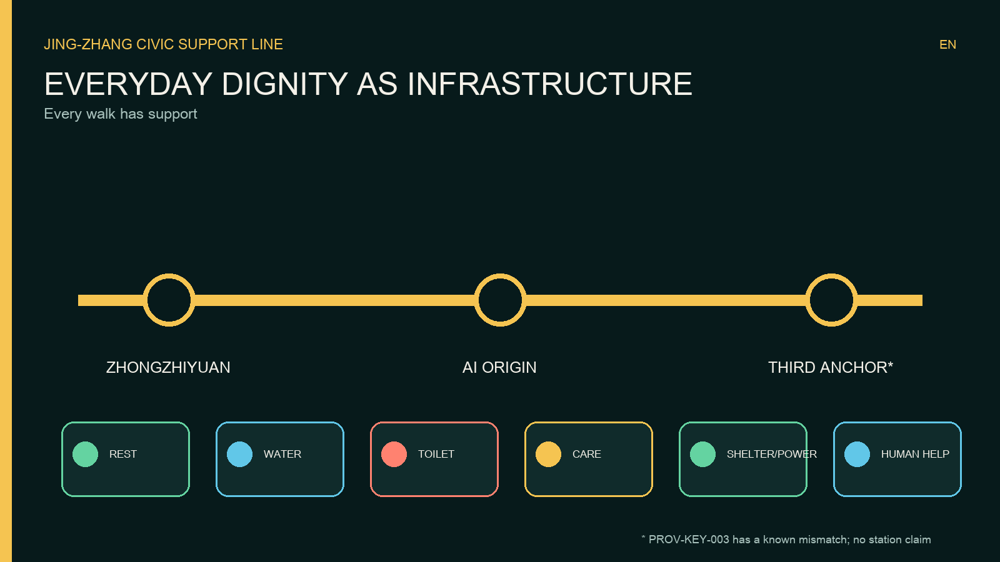
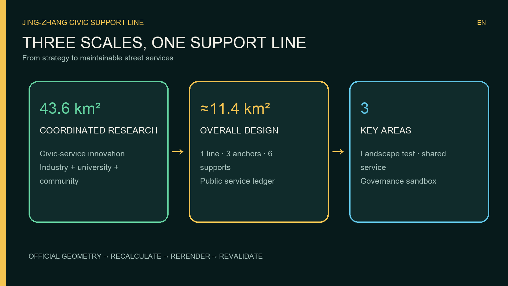
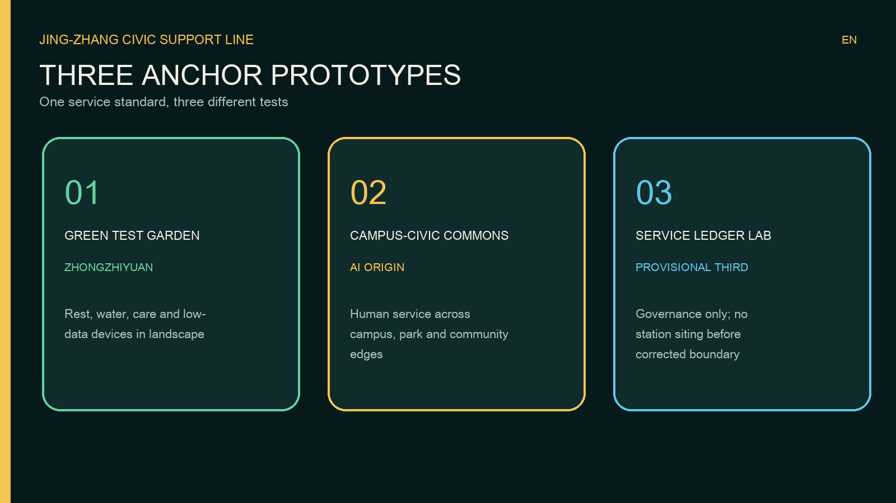
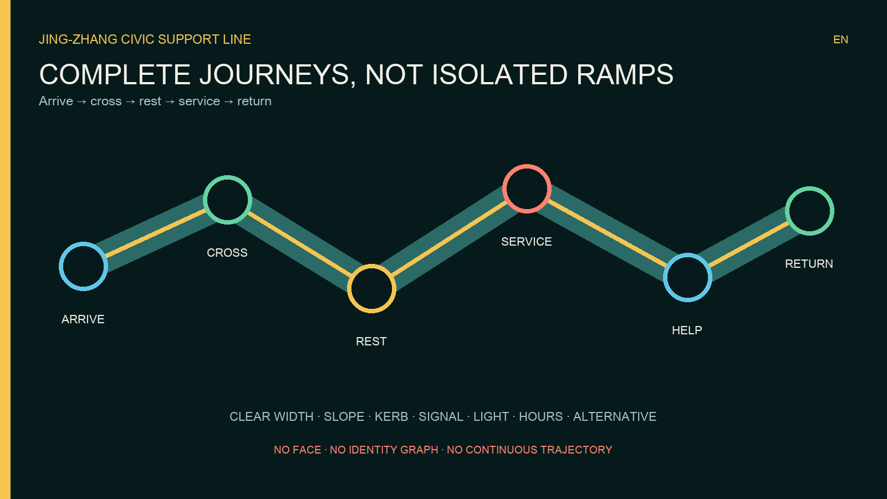
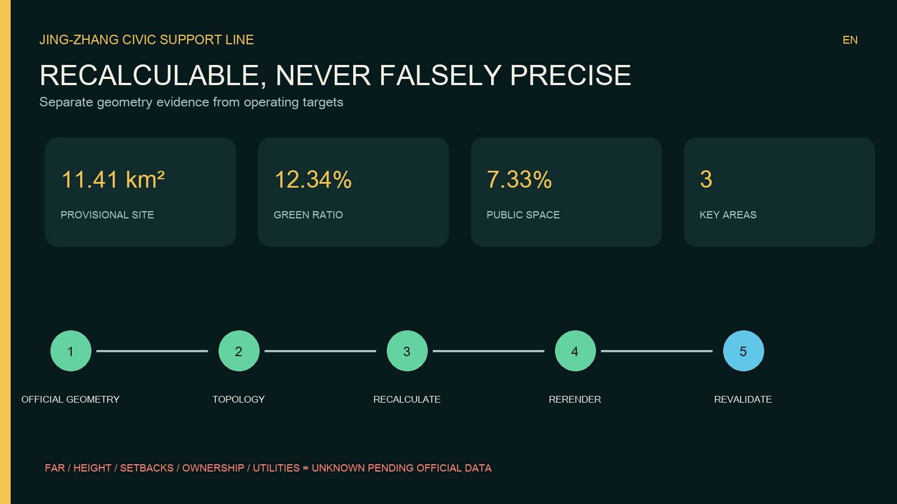

# JING-ZHANG CIVIC SUPPORT LINE

**Every walk has support.** This proposal treats dignity as infrastructure. A person should be able to sit, drink, use an accessible toilet, care for another person, shelter from weather, charge a basic device, or reach a human helper without making a purchase or surrendering personal data.

## Design Basis and Source List

The package responds to the official open-call announcement, the repository taskbook and the registered site package [source:OFFICIAL-ANNOUNCEMENT] [source:AGENT-TASKBOOK] [source:SITE-PACKAGE]. The evidence chain is deliberately auditable: source use is recorded in `sources.json`; assumptions in `assumptions.json`; spatial propositions in GeoJSON; recalculable quantities in `metrics.json`; and required-task coverage in the three matrices.

The current `SITE-001` and three key-area polygons are provisional. They are used only to organise recalculable concept evidence, not to claim eligibility, review acceptance, statutory redlines, development rights, construction decisions or precise station locations [data:geometry/site_boundary.geojson#SITE-001]. Eligibility, evaluation and acceptance remain entirely for the organiser to determine under the official rules. Repository issue #1029 reports that `PROV-KEY-003`, labelled Dazhongsi, is located near Beijing North Station. Therefore this entry does not attach station-specific actions to that geometry. All Dazhongsi ideas remain non-spatial until a corrected official polygon is issued [source:KEY-AREA-SOURCE].

The Accessibility Law and national guidance on older people’s access to smart services support the principles of equal access and a non-digital human fallback [source:ACCESSIBILITY-LAW] [source:ELDERLY-SMART-TECH]. They do not prove dimensional compliance or project approval. Local technical standards, utilities, ownership and fire conditions remain professional confirmation items [standard:MOHURD-CONTROL-DETAILED-PLANNING].

## Three-Level Scope Framework

At the 43.6 km² coordinated-research level, the proposal asks how an AI innovation district can make ordinary public services a shared testbed. At the approximately 11.4 km² overall-design level, it defines a continuous service spine, public-realm interface and governance system. At the three key areas, it defines distinct operating prototypes. The site area represented by the submitted provisional polygon is 11,412,825.386 m² and must be recalculated after official geometry is released [metric:site_area_sqm].

The spatial identity is **one line, three anchors, six support types and one public ledger**. The line is the walking and service interface; the anchors are the three required key areas; the six support types are rest, water, toilet, care, shelter/power and human help; the ledger reports availability, maintenance and accountability. A visible support point is a design target every two minutes of walking, a neighbourhood station every five minutes and a comprehensive hub every fifteen minutes. These are hypotheses, not claims of existing coverage. Phase 0 must audit the real network and recalculate them.

The logo combines a downward supporting arc with parallel railway lines. Its Chinese line is “每一段路，都有靠”; its English line is “Every walk has support.” The identity is designed for high contrast, tactile use and bilingual wayfinding rather than decorative screens.

## Coordinated Research Area: Industry and Future City Research

The proposal reframes the AI district from a place that displays intelligence to a place that demonstrates dependable service. Universities can evaluate accessibility and fairness; start-ups can test low-data maintenance tools; established firms can contribute equipment and service-level expertise; communities can define what “available” really means; and public managers retain decision authority. This creates an innovation chain from field audit to prototype, public test, procurement evidence, operation and open evaluation [depth:overall_spatial_structure].

Six precedents inform mechanisms, not form. Paris demonstrates a citywide public-toilet renewal network [source:PARIS-PUBLIC-TOILETS]. London links mapping, opening hours, population need and accessibility review [source:LONDON-TOILET-PAPER]. Changing Places and Belfast show why high-care facilities must extend beyond standard accessible toilets and be considered in parks and events [source:CHANGING-PLACES] [source:BELFAST-CHANGING-PLACES]. Punggol Digital District connects university, industry, community and a district platform, but this proposal deliberately adopts a smaller-data model [source:PUNGGOL-DIGITAL-DISTRICT]. Helsinki’s Kalasatama illustrates long-horizon district renewal tied to public realm [source:HELSINKI-KALASATAMA]. No foreign quantity, law or delivery promise is transferred directly.

The future-city proposition is therefore civic and operational: intelligence is proven by fewer broken facilities, shorter repair times, clear alternatives and an appeal path. The most valuable output is not a digital twin of people; it is an accountable record of whether public support works.

## Overall Design Area: Urban Renewal and Regulatory-Plan-Level Urban Design

The overall structure uses the Jing-Zhang heritage park as the public-service spine and connects it to communities, campuses, workplaces and rail approaches. The proposal retains the scaffold’s complete land-use topology because official parcels and controls are unavailable, but materially redefines the participant-controlled public-space layer as the Civic Support Line [data:geometry/public_space.geojson#PUBLIC-001]. Land use, road, green-space, building and phasing geometry are design discussion layers, not approved controls [data:geometry/land_use.geojson#LU-001] [data:geometry/roads.geojson#ROAD-001].

Three scales make the system legible. A micro support point fits an existing frontage or path edge and provides one or two functions. A neighbourhood station combines rest, water, information and human contact. A comprehensive hub adds verified accessible toilets, care space, storage and staffed response. Every intervention must preserve clear passage, emergency access, drainage and heritage interpretation; locations are confirmed only after field and professional review.

Regulatory-plan-level work is expressed as auditable objects: a closed land-use coverage, building-footprint evidence, transport and slow-mobility layers, public and green-space ratios, phasing areas and a project list [depth:land_use_layout] [depth:development_intensity_controls]. Floor-area ratio, height, setbacks, road redlines and capacity are unknown because official controls are absent. They remain `unknown` rather than invented.

## Detailed Design of Key Areas

| Key area | Civic-support prototype | Spatial action | Delivery gate |
| --- | --- | --- | --- |
| PROV-KEY-001 / Zhongzhiyuan | Green Test Garden | Pair low-carbon innovation display with rest, water, care and human help along the Qinghe-facing public realm | Confirm ecology, flood, access and operator conditions |
| PROV-KEY-002 / AI Origin Community | Campus-Neighbourhood Support Commons | Stitch campus, start-up and residential routes with shared staffed stations and an accessibility test route | Confirm campus interfaces, ownership and opening hours |
| PROV-KEY-003 / provisional third area | Civic Service Ledger Lab | Test transparent work orders and inclusive facility standards without claiming Dazhongsi station geometry | Replace the mislocated polygon before any site-specific design |

All three areas remain conceptual [data:geometry/key_areas.geojson#PROV-KEY-001] [data:geometry/key_areas.geojson#PROV-KEY-002] [data:geometry/key_areas.geojson#PROV-KEY-003]. The first tests equipment in a landscape and innovation setting. The second tests shared access across institutional boundaries. The third tests governance and is intentionally non-spatial because of the known geometry mismatch. Detailed design after official data must include verified functions, retain-renovate-demolish decisions, building scale, walking continuity, utilities, fire access, service responsibility and cost.

Three landmarks create identity without false precision: the **Support Arch**, a high-contrast orientation and resting structure; the **Care Lighthouse**, a visible staffed help point; and the **Open Ledger Wall**, a physical and digital display of facility status and response performance. They are reference designs to be developed by licensed teams, not construction documents.

## AI Innovation Ecosystem, Personas, and AI+ Scenarios

AI remains in the back office. Facility devices may report fault codes, stock levels, temperature or manual inspection results. Edge processing aggregates events by time band and service zone; raw events are deleted after the minimum necessary retention period. A maintenance copilot recommends cleaning, replenishment, repair or temporary deployment, but a duty manager approves every work order. The public ledger shows capability, opening status, last maintenance, responsible party and appeal route. No face recognition, identity graph, voiceprint, personalised advertising or continuous trajectory is permitted.

Six personas govern design: mobility-aid users; older people and carers; children and families; women and night-time users; delivery riders and outdoor workers; and international or temporary visitors. Each receives the same service without a phone. Physical buttons, paper and tactile information, bilingual icons and staffed help are mandatory channels.

Twelve scenario cards cover: rest seats; drinking water; accessible toilets; baby and adult care; weather shelter; low-power charging; human-help buttons; accessible-route defect reporting; night lighting; temporary event support; campus-neighbourhood shared stations; and the open service ledger. Each card defines its spatial carrier, minimal input, AI role, human override, operator and success measure [data:geometry/public_space.geojson#PUBLIC-001].

Three test scenes make the idea falsifiable. **A Road That Lets You Sit** uses movable seats and manual counts for a 90-day test of spacing, clear width and maintenance burden. **Find It, Enter It, Use It** brings wheelchair users, older people, parents, riders and visitors into a paid accessibility audit. **Public Work-Order Sandbox** injects simulated faults and compares rule-based, AI-assisted and human scheduling for delay, error and distributive fairness. AI never dispatches a real task without a human signature.

## Land Use, Building Scale, and Retain-Renovate-Demolish Strategy

The land-use layer remains complete, closed and non-overlapping, using registered classification rather than an invented code [standard:MNR-LAND-USE-CLASSIFICATION-GUIDE]. The current building-footprint evidence totals 310,807.184 m² [metric:building_footprint_area_sqm], but it does not establish total floor area, ownership, condition or demolition rights.

The strategy is **retain first, retrofit when verified, add lightly, demolish only after evidence**. Retain heritage and structurally serviceable buildings; retrofit accessible entrances, toilets and visible ground-floor service interfaces where feasible; use reversible lightweight support points for early testing; and make no demolition decision without ownership, structural, heritage, carbon and relocation review [depth:retain_renovate_demolish]. Heights, FAR, density, setbacks and total build-out remain pending official controls.

## Transport, Rail, Municipal Infrastructure, and Public Services

The mobility proposition is a chain of complete journeys rather than isolated ramps. Each path must connect arrival, crossing, rest, toilet, destination and return. Audits cover kerb transitions, gradients, surfaces, clear widths, signal phases, cycle conflicts, lighting, wayfinding, seating transfer space and the availability of a real alternative when a lift or toilet is closed [depth:traffic_rail_slow_parking].

Rail integration is described as a method until official station geometry is available: verify each station entrance; map accessible routes and opening hours; place rest and service points outside evacuation paths; provide a human-assisted fallback; and publish disruptions with a non-digital alternative. No claim is made that `PROV-KEY-003` represents Dazhongsi station.

Municipal integration requires potable-water safety, drainage, power protection, network security, fire access, waste collection and winter operation. Edge equipment must fail safely and essential water, toilet and help functions must not depend on cloud availability [depth:municipal_new_infrastructure].

## Blue-Green Network, Public Space, and Urban Character

The support line uses green and public space as a service surface. Submitted geometry reports a green ratio of 0.123423 and a public-space ratio of 0.073281, both derived from provisional design layers and subject to official-boundary recalculation [metric:green_ratio] [metric:public_space_ratio]. These figures are evidence of package consistency, not statutory targets.

Shade, rain shelter, drinking water and seating are located only after arboricultural, drainage, flood and heritage review. Reversible elements protect roots and view corridors. The urban character combines railway parallel lines, a supporting arc, dark rail green, warm civic yellow and accessible blue. Night lighting is even and legible, with no surveillance aesthetic. Public art and contribution displays require creator consent and clear rights.

## Renewal Projects, Implementation Policy, and Phasing

| Project | Output | Candidate responsibility | Gate |
| --- | --- | --- | --- |
| CS-00 Evidence baseline | Facility, access, hours and operator audit | Planning coordinator plus paid community auditors | Official geometry and field access |
| CS-01 90-day support-line pilot | Reversible seats, water and help points | District coordinator and selected operator | Safety and public-realm permit |
| CS-02 Verified accessible toilet network | Audit, retrofit priorities and alternatives | Facility owners and accessibility professionals | Ownership, plumbing and local standards |
| CS-03 Human help network | Staffed stations and escalation protocol | Participating campuses, parks and communities | Staffing and service agreement |
| CS-04 Maintenance copilot | Minimal-data work-order recommendation | Data controller and maintenance operator | Privacy, security and bias assessment |
| CS-05 Public service ledger | Status, responsibility, cost band and appeal | Accountable public-interest operator | Data-quality and publication rules |
| CS-06 Three anchor demonstrations | Landscape, shared-access and governance prototypes | Key-area partnerships | Correct boundaries and detailed design |

Phase 0 (0-6 months) establishes data, governance, accessibility audit and one reversible pilot. Phase 1 (6-24 months) repairs verified gaps and launches human-help and ledger services. Phase 2 (2-5 years) integrates comprehensive hubs with approved renewal projects. Phase 3 is continuous stewardship, quarterly public review and recalibration [data:geometry/phasing.geojson#PHASE-001] [depth:phasing_implementation]. Dates begin only after an authorised lead is appointed; they are not government commitments.

Procurement should reward availability, repair time, accessibility verification, privacy and user appeal rather than device count. Community auditors, especially people affected by access barriers, should be paid. Public dashboards must publish failures as well as successes.

## Metrics, Area Recalculation, and Compliance Matrix

Known geometry-derived metrics are site area, building footprint, green ratio, public-space ratio and three key areas [metric:key_area_count]. FAR is explicitly unknown. Operational measures begin as targets: verified facility availability; median repair time; proportion of journeys with a functioning alternative; accessibility audit closure rate; human-help response time; complaint resolution; and the share of services usable without a phone.

The recalculation sequence is deterministic: replace official boundary and key areas; validate CRS and topology; clip or redesign participant layers; recompute all areas and ratios; rerender figures, HTML and PDFs; update assumptions and matrices; rerun the complete self-check [depth:metrics_recalculation]. The compliance matrix links every mandatory task to narrative, drawing, geometry, metric, source, assumption and check.

## Risk, Copyright, and Compliance

The largest spatial risk is provisional and internally inconsistent geometry. Other gaps include regulatory controls, parcels, ownership, existing facilities and hours, utilities, flood, heritage, fire, accessibility details, operating entities and budgets [depth:risk_missing_data]. Every physical proposal is therefore a conceptual recommendation and requires licensed professional development.

The largest AI risk is exclusion disguised as optimisation. Controls are data minimisation, no biometrics or personal trajectories, human approval of actions, non-digital parity, published responsibilities, an appeal route, security review, retention limits and periodic fairness testing. Essential services continue in a safe manual mode when systems fail.

All text and graphics were generated for this submission. System fonts are used only for rendering and are not redistributed. No remote assets, scripts, maps, trackers, forms or APIs are embedded. Rights and source use are recorded in `sources.json` and `report/copyright_statement.md`. The proposal claims no official approval, funding, land right or implementation commitment.

## References

- Official open-call announcement [source:OFFICIAL-ANNOUNCEMENT]
- Agent taskbook and registered site package [source:AGENT-TASKBOOK] [source:SITE-PACKAGE]
- Public and provisional source registry [source:SOURCE-REGISTRY]
- Structured fact pack [source:PROCESSED-FACT-PACK]
- Accessibility and non-digital service policy [source:ACCESSIBILITY-LAW] [source:ELDERLY-SMART-TECH]
- International case references listed in `sources.json`
- Machine-readable evidence: `metrics.json`, `assumptions.json`, `compliance_matrix.json`, `standard_matrix.json`, `design_depth_matrix.json`
