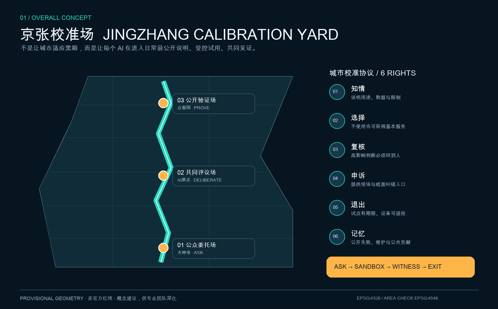
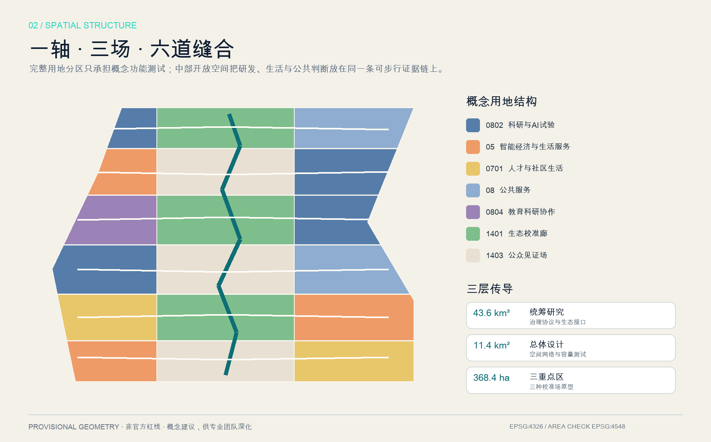
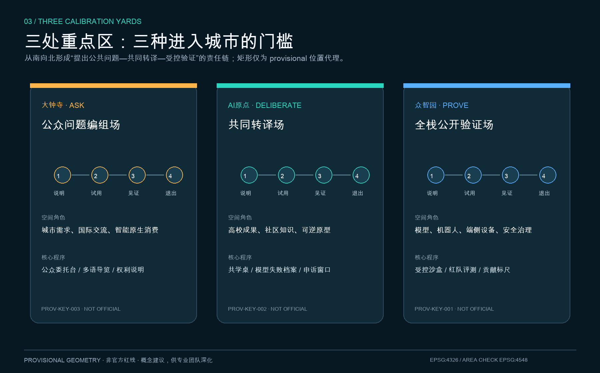
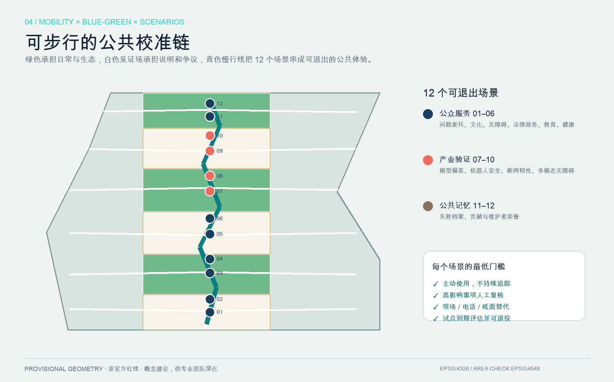
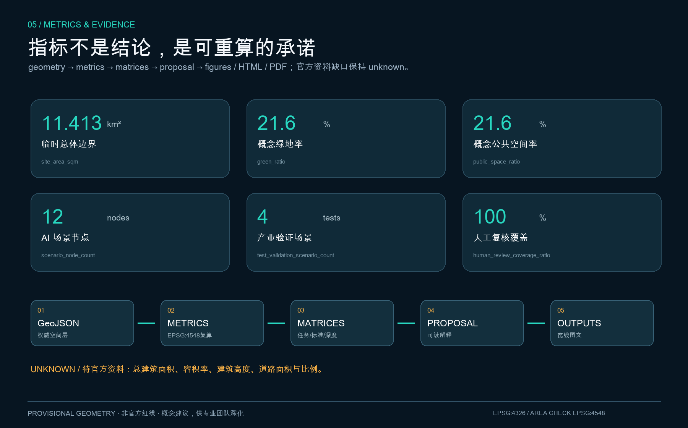

# Jing-Zhang Alignment Field: Let AI Prove Itself in Public Space

> **JINGZHANG CALIBRATION YARD**｜Not to adapt the city to the black box, but to ensure that each AI publicly explains, is subject to controlled trials, and is collectively witnessed before entering daily use.

This proposal translates the role of the Jing-Zhang Railway in "aligning time and connecting knowledge" into a public task for the AI era: any model, robot, edge device, or intelligent service entering the real city should answer "for whom, what data, who will verify, how to exit in case of failure, and how to ensure public benefits are retained." Therefore, the "alignment field" is not an accreditation body or a new administrative permit, but a set of reference solutions for professional teams to deepen spatial and operational design. Throughout the text, the terms "space," "policy," "activity," "recruitment," "investment," and "phased implementation" are Open Co-Creation proposals, which do not replace formal planning or constitute a government review or implementation commitment.

## Design Basis and Source List

The proposal is based first on the official call for submissions, which is used to confirm the three layers of scope, three key areas, design goals, and the context of outcomes; the intelligent body task book for clearance is used to confirm the three major positions, five functional areas, the Three Zones and Two Wings, and six agent tasks; Urban Design, control plans, and land classification documents are used to limit professional expression; temporary geometry is only used for generation, in-package recalculation, and display. [source:OFFICIAL-ANNOUNCEMENT] [source:AGENT-TASKBOOK] [source:SITE-PACKAGE] [source:SOURCE-REGISTRY] [source:PROCESSED-FACT-PACK] [standard:PROJECT-OFFICIAL-ANNOUNCEMENT] [standard:PROJECT-AGENT-OPEN-CALL-TASKBOOK] [standard:MOHURD-URBAN-DESIGN-MEASURES] [standard:MOHURD-CONTROL-DETAILED-PLANNING] [standard:MNR-LAND-USE-CLASSIFICATION-GUIDE]

The local architectural design depth references are not verifiable official documents at this time, therefore they are only listed as items to be completed and are not considered as satisfied authoritative references. [standard:MOHURD-ARCH-DESIGN-DEPTH-2016] Currently missing are official polygons, road redlines, existing buildings and ownership, control plan indicators, cultural heritage controls, municipal capacity, and the baseline for public facilities; these gaps are documented in assumptions, constraints, and risk statements, rather than being filled with speculative data. [depth:existing_conditions_diagnosis] [depth:risk_missing_data] [data:geometry/constraints.geojson#CONSTRAINTS]

`geometry/site_boundary.geojson` comes from the rough polygon registered by the repository maintainer; three key areas are also temporary location proxies. [source:BOUNDARY-SOURCE] [source:KEY-AREA-SOURCE] [data:geometry/site_boundary.geojson#SITE-001] [data:geometry/key_areas.geojson#PROV-KEY-001] They are all marked as `official_boundary=false` and `geometry_role=provisional_constraint`, and should not be used as official redlines, for approval, land tenure, expropriation, or precise area calculations. official polygons after they are in place, must be sequentially replaced with site/key areas, and then rework land use, buildings, roads, green/public space, phasing, metrics, five drawings, HTML, and PDF.

The authoritative order for this package is GeoJSON, metrics, three matrices, manifest/source/hypotheses/self-check, text, images, and HTML/PDF. Five images are source explanation layers and do not replace structured evidence; no map screenshots, remote tiles, company logos, or third-party images are used in the visuals.

## Three-Level Scope Framework

The three layers share a set of "Common Calibration Protocol." 43.6 square kilometers of the coordinated research layer address how Haidian can form a cycle by integrating research and development, industry, capital, computing power, data, scenarios, and public judgment; approximately 11.4 square kilometers of the overall design layer address how space can carry out demonstration, trial use, validation, and exit strategies; and approximately 368.4 hectares of the key area layer address how three types of prototypes can be implemented on public interfaces, near-campus conversion, and full-stack testing. [source:OFFICIAL-ANNOUNCEMENT] [depth:three_level_scope_framework] [depth:overall_spatial_structure]

Overall structure is "one axis, three fields, and six lanes of integration." The one axis is the Calibration Walk organized along the direction of the Jing-Zhang Heritage Park. The three fields, from south to north, are the Dazhongsi Public Issue Assembly Field, the AI Origin Co-translational Field, and the Zhongzhiyuan Full-stack Public Validation Field. Six lanes of east-west slow travel relationships integrate the connection of universities, parks, communities, and rail links into the public calibration chain. [data:geometry/roads.geojson#ROAD-001] The Provisional Boundary area is recalculated as [metric:site_area_sqm], which only checks internal consistency and does not replace the announced approximate value or official polygon.

Six urban rights constitute the spatial design baseline: **right to know** (about purposes, data, and limitations), **right to choose** (basic services are still accessible without AI), **right to review** (high-impact judgments are subject to review by responsible individuals), **right to appeal** (entrances for on-site and paper-based corrections are available), **right to exit** (pilot programs have a defined duration, and devices can be decommissioned), and **right to memory** (failures, maintenance, and public contributions are traceable). These six rights transform the "global discourse on AI governance" into perceivable interfaces on the streets. [source:AGENT-TASKBOOK]

## Coordinated Research Area: Industry and Future City Research

### Naming, Logo, and Three Zones and Two Wings Circuit

Main name is "**Jing-Zhang Calibration Field**," with the English name as **JINGZHANG CALIBRATION YARD**. The naming system includes ASK (raising public questions), DELIBERATE (joint translation), PROVE (controlled validation), WITNESS (public witnessing), and EXIT (exit and retirement) five categories of spatial actions. The logo direction features an open gauge scale: two parallel lines represent technical performance and public value, while the middle gap represents the continuous human judgment; no corporate trademarks, individuals, existing railway symbols, or unauthorized fonts are used. The VI uses deep blue (reliable public foundation), cyan (reusable evidence), and orange (public action), and provides high-contrast, tactile, and Chinese/English/graphic versions. [standard:PROJECT-AGENT-OPEN-CALL-TASKBOOK]

Three key orientations are translated into three layers of content: the century-old Jing-Zhang cultural belt retains the historical narrative of "measurement, connection, and joint maintenance"; the urban AI living experience belt offers customizable, opt-out daily services; and the AI integration innovation belt provides a testing ladder from virtual evaluations to controlled scenarios. Five functional areas are distributed as follows: full-stack autonomy and governance validation at Zhongzhiyuan, a world-class innovation ecosystem at the AI Origin, AI-Enabled Scenarios at Dazhongsi and Xiaoyuehe, AI-infused vibrant city along the entire slow-moving chain, and legal, capital, intellectual property, computing power, and data compliance interfaces at the Zhongguancun Technology Services Wing. The three zones are not isolated islands, and the two wings are not one-way delivery channels: public issues enter R&D validation to the north, failures and feedback loop back to urban life to the south, forming a closed loop. [source:AGENT-TASKBOOK]

### Seven Global Mechanism Case Studies

This plan only draws on the mechanisms, not the image, and does not claim the case study's endorsement of this plan:

| Case | Transformable Mechanism | Jing-Zhang Location |
| --- | --- | --- |
| NIST AI Risk Management Framework | forms a continuous risk loop through governance, mapping, measurement, and management | Six Urban Rights and Scenarion Cards Minimum Threshold [source:CASE-NIST-AI-RMF] |
| EU Testing and Experimentation Facilities | Virtual, Controlled, and Real Environment Hierarchical Testing | Zhongzhiyuan Level Three Validation Gates [source:CASE-EU-TEF] |
| Singapore Punggol Digital District | Begin with Digital Platform Validation of Operations and Spatial Synergy | Model at the Overall Level First, Then Pilot at a Small Scale [source:CASE-SG-PDD] |
| Barcelona Innova Lab | Urban Issues Call for Submission, Time-Limited Experiment, Cross-Departmental Review | Dazhongsi ASK with Public Presentation [source:CASE-BCN-INNOVA] |
| Helsinki Smart Kalasatama | Residents, businesses, and researchers collaboratively define small agile pilots | AI Origin co-translation space [source:CASE-FI-KALASATAMA] |
| UK AI Safety Institute | Independent Capacity Assessment and Risk Analysis | Public Evaluation and Readable Report of Model Bias [source:CASE-UK-AISI] |
| European Commission JRC Living Labs | Test robustness, interoperability, and acceptability with real users involved. | Multimodal Accessibility Joint Acceptance [source:CASE-EU-JRC-LABS] |

The number of cases is [metric:global_case_count]. The ecological spectrum consists of eight reviewable interfaces: land provision as a reversible carrier, spatial provision as tiered boundaries, industry posing genuine questions, funding supporting time-limited prototypes, talent forming cross-disciplinary teams, computational power graded by risk, data minimized, and scenarios concluded jointly by users and operators. Each interface must specify the applicant, maintainer, reviewer, duration, exit conditions, and public knowledge output; no fabricated lists of companies, investment amounts, output values, or policy commitments. [depth:phasing_implementation]

## Overall Design Area: Urban Renewal and Regulatory-Plan-Level Urban Design

The overall design does not begin with "how much new construction," but with "which judgments must be made public first." The 18 shared boundary land use units fully cover the temporary site, forming a structure with research, education, living, commercial, and public service areas on both sides, and alternating green spaces and public witness areas in the middle. [data:geometry/land_use.geojson#LU-001] [depth:land_use_layout] This zone is used to validate functional combinations, continuous open spaces, and topologies, and does not represent the current or statutory land use; official parcels must be redefined after the control plan is in place.

Update the approach to "**90-Day Reversible Prototype—Annual Review—Expand or Decommission**." Prioritize placing rights documentation, public comment, public services, and movable test components on the ground floor and public forecourt; research and equipment testing enter into a controlled layer with boundaries. The conceptual Building Footprint is generated by insetting non-open space units, testing spatial capacity only, without representing real architecture or making conclusions for individual buildings regarding retention, renovation, demolition, or new construction. [data:geometry/buildings.geojson#BLDG-001] [depth:retain_renovate_demolish] Deepening for each building must first include the year, structure, use, ownership, cultural heritage protection, fire safety, solar access, and lifecycle carbon assessment.

Building Height, total floor area, Floor Area Ratio, setback and density controls lack official documentation; therefore, they remain unknown. This proposal only outlines the stylistic approach: maintaining open ground floors, low-level information faces, modular components, and continuous underslung spaces along public calibration chains, avoiding the substitution of public spaces with high towers, large screens, or neo-classical elements. Precise heights, massing, roof treatments, colors, and facades require further elaboration by a professional team under the formal control and heritage documentation. [depth:development_intensity_controls] [depth:height_massing_character] [standard:MOHURD-CONTROL-DETAILED-PLANNING]

Municipal infrastructure and New Infrastructure follow the principles of "maintainable, disconnectable, and depreciable": shared modular equipment racks for edge-side computational power and sensing devices, retaining basic lighting, seating, toilets, drinking water, and barrier-free access; each device establishes a responsible party, energy consumption, disconnect behavior, manual alternatives, and retirement date. Due to the lack of pipeline, energy, fire safety, flood prevention, and drainage data, this document does not draw conclusions on capacity or engineering line positions. [depth:municipal_new_infrastructure]

## Detailed Design of Key Areas

### Dazhongsi ASK｜Public Issue Assembly Yard

Dazhongsi accommodates the city's entrance, international exchange, and smart native consumption, but the entrance is not a facial recognition access control or a real-name "city passport." Public forecourt facilities include a counter for inquiries, multilingual Jing-Zhang guides, AI rights explanations, and human service options; the street level is organized with mobile pop-up tables for community needs, walls for community demands, and first-use stations for small smart terminals; the rail transit connection only proposes a quadrants-based pedestrian continuity strategy, orderly parking for non-motorized vehicles, and clear directionality for transfers, awaiting verification of road boundaries, passenger flow, entrances and exits, and municipal data. [data:geometry/key_areas.geojson#PROV-KEY-003] [depth:three_key_area_detailed_design]

Intelligent native activities should prioritize cultural tours, service navigation, and interactive displays that can be explained on-site and exited on-site; commercial recommendations must not continuously track residents. Spatial actions include low-disturbance first-floor openness, tiered nighttime activities, visible artificial windows, and public completion walls. The temporary polygon recalculated value [metric:dazhongsi_ai_industry_cluster_proxy_area_sqm] is merely a positional proxy area and does not replace the announced approximately 72.0 hectares or official key-area polygon.

### Beijing AI Origin DELIBERATE｜Common Translation Field

AI Origin places academic achievements, community knowledge, and reversible prototypes on the same "Collaborative Learning Table." The public layer consists of achievement descriptions, resident issues, open-source contributions, and failure records; the collaborative work layer provides short-term workstations, data compliance, legal support, accessibility, and operational guidance; the restricted layer only accommodates prototypes that have been described with risks and exit strategies. Host Council Conceptual Recommendation involves residents, accessibility users, academic institutions, park operators, and frontline service providers in three rounds of review at the proposal, mid-term, and final stages. [data:geometry/key_areas.geojson#PROV-KEY-002]

Update to adhere to the principle of assess before act: conduct a rights assessment, current building inventory, and pedestrian survey for campuses, parks, and neighborhoods before developing shared ground floors, pedestrian connections, and rail integration; do not assume consent for renovation from universities or enterprises. Model failure documentation should be publicly archived in the model failure archive, detailing "why it failed, who was affected, and how to remediate," making failure a public knowledge point rather than a deleted promotional risk. Temporary recalculated values [metric:beijing_ai_origin_community_proxy_area_sqm] are only for intra-package checks.

### Zhongzhiyuan PROVE｜Full-stack Public Validation Field

Zhongzhiyuan sets three gates of virtual evaluation, controlled test court, and limited real-world scenarios. The model undergoes deviation and robustness testing; robots are tested under low-speed conditions, physical enclosures, on-site safety personnel, and emergency stop conditions; edge-side devices are verified for their behavior during network disruptions, energy consumption, and decommissioning; multimodal interfaces are validated by users with disabilities. Any expansion of the pilot requires submission of publicly readable explanations, negative results, human take-over and exit strategies. [data:geometry/key_areas.geojson#PROV-KEY-001]

The Qinghe direction only proposes the concepts of blue-green continuity, low-carbon innovative interaction, and ecological monitoring, without exceeding the unknown blue line, flood defense, or ecological control. The contribution metrics are not ranked by enterprise scale and traffic flow, but record open-source, maintenance, restoration, education, and public problem-solving. The temporary recalculated value [metric:zhongzhiyuan_ai_acceleration_area_proxy_area_sqm] is not intended as a substitute for the Official Boundary of approximately 192.1 hectares.

The number of key areas is [metric:key_area_count]. All three adopt the "Public Space Forecourt—Common Work Layer—Restricted Test Layer" profile; the buildings, transportation, public space, and project list must be finalized after the official polygon, control plan, ownership, current conditions, and cultural heritage documentation are in place.

## AI Innovation Ecosystem, Personas, and AI+ Scenarios

Six archetypes are not continuous individual personas but rather design-time role requirements, with a count of [metric:persona_count]:

1. **Community Residents and Caregivers:** Require non-digital services, minimal walking, quietness at night, and genuine grievance entry points.
2. **Users with Physical, Visual, or Hearing Impairments**: They are co-testers of pathways and interfaces, not passive "beneficiaries."
3. **College Students and Young Researchers**: Need a compliant path from papers/prototypes to real public issues.
4. **Startup Team and Open Source Developers**: Require low-cost controlled testing, readable rules, and spaces with the ability to exit after failure.
5. **Operational and Maintenance Staff for the Park:** Need tools that are takeable over, repairable, disconnectable, and de-commissionable.
6. **International Researchers and Visitors:** A multilingual, institutionally readable, time-zone friendly, and registration-free basic guide is needed.

12 scene cards are located in `public_space.geojson`, with a count of [metric:scenario_node_count], and are uniformly required to actively use, minimize data, undergo Human Review, use non-digital alternatives, and exit within a specified timeframe. [data:geometry/public_space.geojson#SCN-01]

| # | Scenario Card | Space / Target Audience | Data and Human Boundary |
| --- | --- | --- | --- |
| 01 | Public Issue Submission Desk | Dazhongsi / Residents and Visitors | Anonymous paper submissions accepted; manually categorized publicly, no identity inference |
| 02 | Multilingual Jing-Zhang Cultural Tour | South Segment Slow-Travel Chain / International Visitors | Offline Package Priority; Historical Accuracy Verified by Public Resources and Professional Staff |
| 03 | Barrier-Free Pathway Co-Design | Slow Mobility Seam / Barrier User | Feedback from Barrier Users Confirmed on Site; No Continuous Trajectory Tracking Recorded |
| 04 | Legal and Administrative Entrance Navigation | Public Witness Space / Residents and Teams | Only points to formal entrances; qualifications and legal judgments are completed by responsible personnel |
| 05 | AI Educational Co-Learning Table | AI Origin / Teacher and Students/Residents | Teacher Review; Retain Offline Courses, No Automatic Ability Ranking |
| 06 | Health Service Diversion Assistant | Community Service Interface / Caregivers | No Diagnosis; Urgent Cases and Final Judgment Revert to Medical Staff |
| 07 | Public Evaluation of Model Bias ★ | AI Origin—Zhongzhiyuan / Development Team | Approved Test Set; Evaluated and Certified by the Evaluation Committee for Public Release |
| 08 | Robot Low-Speed Safety Sandbox★ | Zhongzhiyuan / Research and Development & Operations | Physical Enclosure, On-Site Safety Officer, Manual Emergency Stop |
| 09 | End-Side Equipment Disconnection Resilience Test ★ | Zhongzhiyuan / Equipment Team | Local Processing Priority; Disconnection Retains Basic Services and Manual Records |
| 10 | Multimodal Barrier-Free Interface Testing★ | Zhongzhiyuan / Users with Disabilities | Joint Acceptance; Real Participation Must Be Ensured, Not Replaced by Simulated Users |
| 11 | Model Failure Archive | AI Origin / Public and Developers | Publicly document the reasons for stopping and the fixes; desensitize or do not collect sensitive content |
| 12 | Contribution Bench and Maintainer Honor Platform | North Segment / Maintainers and Community | Manual Appeal; Honor Based on Public Contribution Rather Than Traffic |

Testing and Validation Scenario for Item 4 of the Industry Category [metric:test_validation_scenario_count]. All 12 items require final review by the responsible party.[metric:human_review_coverage_ratio]; Preserve the site, telephone, paper, or fixed signboard alternatives, [metric:non_digital_fallback_coverage_ratio]. These two 100% figures are the coverage ratios for the scheme admission rules, not the implemented performance metrics.

## Land Use, Building Scale, and Retain-Renovate-Demolish Strategy

Conceptual land uses are expressed according to subsets of the Natural Resources Ministry classification, without creating new unverifiable codes. [standard:MNR-LAND-USE-CLASSIFICATION-GUIDE] The areas of seven categories are recalculated using shared boundary polygons under EPSG:4548: commercial and service industries [metric:land_use_05_area_sqm], urban residential [metric:land_use_0701_area_sqm], public administration and public services [metric:land_use_08_area_sqm], research [metric:land_use_0802_area_sqm], education and research collaboration [metric:land_use_0804_area_sqm], park and green spaces [metric:land_use_1401_area_sqm], and squares [metric:land_use_1403_area_sqm]. These proportions are used to verify whether "research and development—living—public realm" are juxtaposed, not for statutory land use or current status recognition. [depth:metrics_recalculation]

Conceptual Building Footprint area is [metric:building_footprint_area_sqm], with a base density relative to the Provisional Boundary of [metric:building_density]; both are calculated from capacity testing graphics with low confidence, not equivalent to the current or planned buildings. Total gross floor area [metric:total_floor_area_sqm], Floor Area Ratio [metric:floor_area_ratio], and height [metric:building_height_m] are all unknown. The demolish–renovate–retain strategy is deepened through a five-step ledger: current mapping and property rights verification—value/safety/carbon assessment—public and property owner opinions—priority and reversible retention experiments—legal formation of building-by-building decisions. No conclusions regarding the actual demolition or renovation of any buildings are currently drawn. (Demolish–Renovate–Retain Strategy)

## Transport, Rail, Municipal Infrastructure, and Public Services

The concept pedestrian network consists of a north-south alignment calibration path and six east-west stitching lines, projecting a total length of [metric:concept_walk_length_m]. This network expression is only validated as non-empty and is not a road centerline, redline, or engineering design. [data:geometry/roads.geojson#ROAD-001] [depth:traffic_rail_slow_parking] The deepening sequence is: obtain track entrances, bus stops, passenger flow, road sections, parking, non-motorized vehicles, and accessibility data; conduct on-site walkthroughs to identify gaps; prioritize pedestrian, cycling, and bus/track transfers; and then evaluate curb treatment and motor vehicle organization. Dazhongsi's quadrants, Wudaokou/Qinghua Donglu West Mouth, and ring road nodes all require traffic professional review.

Road area [metric:road_area_sqm] and road area ratio [metric:road_area_ratio] are to be preserved as unknown, as there are no official road redlines. Public services adopt the principle of "basics always available, AI activated as needed": restrooms, drinking water, seating, shade trees, lighting, and continuous passage for mothers and the disabled take precedence over digital screens. Educational, health, legal, administrative, and safety matters are limited to information navigation or auxiliary organization; the final decision-making authority remains with the responsible institutions.

## Blue-Green Network, Public Space, and Urban Character

Green spaces directly derive from the central shared edge units, with an area of [metric:green_space_area_sqm] and a ratio of [metric:green_ratio]; public plaza areas are [metric:public_space_area_sqm] with a ratio of [metric:public_space_ratio]. [data:geometry/green_space.geojson#GREEN-001] [data:geometry/public_space.geojson#PUBLIC-001] [depth:blue_green_public_space] These are conceptual structural metrics; official data will need to distinguish between existing and new, public and ancillary, ecological and hardscape elements, and add layers for blue-green infrastructure, flood management, habitats, thermal environments, and maintenance costs.

Multiple AI pilgrimage and honor nodes are low-volume, updatable, and reversible concept components, with a count of [metric:pilgrimage_landmark_count]: 1. Dazhongsi "Public Issue Delegation Platform," commemorating issues that were seriously addressed; 2. AI Origin "Model Failure Archive," commemorating stops and repairs; 3. Zhongzhiyuan "Public Validation Gate," displaying limitations, human intervention, and decommissioning conditions; 4. Along the route, "Contribution Gauges," recording maintenance, open-source contributions, teaching, and public repairs. They do not use corporate logos, personal portraits, or unauthorized content, and precise placement will await confirmation of cultural heritage, green line, blue line, and traffic safety data.

Urban Character draws from four vocabularies: "ruler, long table, open threshold, and replaceable sign." The Jing-Zhang historical layer only states verifiable connections between the railway and the city; the Zhongguancun innovation layer records actual years, subjects, and public contributions; the AI new cultural layer clearly marks future suggestions. The overall logo and cultural signage are layered to avoid turning historical and cultural elements into technological decorations. [standard:MOHURD-URBAN-DESIGN-MEASURES]

## Renewal Projects, Implementation Policy, and Phasing

Phasing is organized not by construction momentum but by risk learning thresholds. The near-term scope [metric:phase_1_area_sqm] corresponds to rule setting, documentation completion, and reversible prototyping; the mid-term scope [metric:phase_2_area_sqm] corresponds to slow-moving seam stitching, shared translation, and controlled validation; the long-term scope [metric:phase_3_area_sqm] corresponds to long-term operation, decommissioning, and knowledge output. Geometrically, the three phases fully cover the Provisional Boundary, but they do not represent a government timeline, investment, or approval commitment. [data:geometry/phasing.geojson#PHASE-001] [depth:renewal_project_list]

| Project | Concept Action | Condition to Proceed to the Next Stage |
| --- | --- | --- |
| JZ-01 Data Foundation Completion | official polygons, control plan, current conditions, ownership, cultural heritage, municipal data import | source, license, version, coordinate system, and transformation records complete |
| JZ-02 Three Public Interface Prototypes | Problem Submission Counter, Co-Learning Table, Public Validation Door | Barrier-Free, Human Review, Paper Alternative, and Retirement Form Approval |
| JZ-03 Six Lanes for Slow Walking and Pedestrian Path | Discontinuities, Crosswalks, Nighttime, Cycling, and Transfer Investigation | Joint Review of Transportation, Accessibility, Municipal Services, and Safety |
| JZ-04 Category IV Industrial Validation | Models, Robots, Edge-Side, Multimodal Interfaces | Virtual/Controlled Testing Passed with Readable Negative Results |
| JZ-05 Failure and Contribution Archive | Completion, Appeals, Maintenance, and Retirement Records | Privacy, Copyright, Error Correction, and Long-term Maintenance Responsibilities Clearly Defined |
| JZ-06 Annual Calibration Week | Open Issues, Developer Experiments, Public Witness, International Exchange | Main Subjects, Permits, Safety, Budget to Be Negotiated |

Long-term operational concepts include "Quarterly Public Issues—90-Day Prototypes—Annual Calibration Week—Exit/Expansion—Knowledge Archiving." The developer community is responsible for technical documentation and handover maintenance; the Host Council is responsible for public issue review and impact assessment; professional operators are responsible for on-site safety; universities and enterprises are responsible for technology; independent evaluators document positive and negative results. The talent and enterprise transformation pathways are not recruitment promises but rather "understanding the rules—engaging with real issues—completing controlled validation—leaving public knowledge—re-negotiating long-term collaboration."

## Metrics, Area Recalculation, and Compliance Matrix

Metrics adhere to the principle of "geometry before graphics, formulas before slogans, and unknown when data is missing." Project the site, land use, green/public space, buildings, roads, and phasing onto EPSG:4548 before writing them into the metrics; the graphics and HTML only read from the same set of values. [data:geometry/site_boundary.geojson#SITE-001] [data:geometry/land_use.geojson#LU-001] [data:geometry/buildings.geojson#BLDG-001] [data:geometry/roads.geojson#ROAD-001] [data:geometry/green_space.geojson#GREEN-001] [data:geometry/public_space.geojson#PUBLIC-001] [data:geometry/phasing.geojson#PHASE-001]

The known items' design implications are: temporary site area check derived data whether it is derived from the Building Footprint; green space/Public Space ratio check Human Review chain whether it obtains continuous space; building footprint check capacity layer whether it is non-empty; scenarios, human review, and alternative paths check whether the AI-Native solution has governance thresholds. Unknown items are not failures but prevent the absence of zoning, roads, and building data from being disguised as precise conclusions.

`compliance_matrix.json` covers announcements 1.3, 1.4, and 1.5, and agents.1—agent.6; `standard_matrix.json` covers five mandatory local standards and retains the building depth gap; `design_depth_matrix.json` covers the current diagnosis, three-level scope, overall structure, land use, intensity to be confirmed, appearance, demolish–renovate–retain strategy, traffic, utilities, blue-green spaces, three key areas, project, phased implementation, recalculation, and risk. Each item refers back to sections, layers, indicators, drawings, sources, assumptions, and self-inspections. After a complete self-inspection, provisional data alerts are retained, but the organization's data gaps are not transferred to false certainty. (Demolish–Renovate–Retain Strategy)

## Risk, Copyright, and Compliance

The primary risk is that the Provisional Boundary is misread as an exact redline, thus requiring all the text, five figures, visuals, sources, assumptions, and self_check to be annotated and listed with the overall recalculation order. The second risk is that "calibration" is misread as an administrative certification; this plan only provides an open test, public disclosure, and professional deepening framework, but does not grant any permits. The third risk is test spillover: robots, models, and edge-side devices must start from a virtual or controlled environment, with on-site responsible persons, manual emergency stops, minimal logging, and expiration exit. The fourth risk is digital exclusion: all scenarios must retain on-site, telephone, paper, or fixed signage, and refuse to set smartphone, real-name accounts, or continuous location tracking as basic service thresholds.

Fifth is the automation of overreach: health, legal, administrative, educational, and safety matters should only serve as navigation or support, not as a substitute for those with responsibility. Sixth is historical distortion and heritage conflict: facts must be verified, and the scope of protected landmarks must be confirmed. Seventh is operational redundancy: each activity should be tied to a maintainer, a timeframe, exit conditions, and closure knowledge, without writing policies, funding, recruitment, and event dates as fixed arrangements. [source:AGENT-TASKBOOK]

Text, structured data, charts, five images, offline HTML, and PDF were generated by OpenAI Codex under the initiative of GitHub user `leeight`; geometric algorithms, metric formulas, and source limitations are disclosed. No non-public data, commercial maps, remote tiles, third-party images, trademarks, or paper images were used. For licensing and liability details, see `report/copyright_statement.md`; any conflicts with official attachments, laws, planning, or professional reviews shall be resolved in favor of the latter.

## References

The project basis, standards, and provisional geometric registrations are recorded in `sources.json`; case studies are only used for method reference and do not inform the legal spatial or implementation commitments for Beijing. Official announcements confirm the task and approximate area but do not provide precise polygons; the agent task book confirms co-creation requirements but does not provide the control plan; professional standards confirm working principles but do not validate that this project has been approved. [source:OFFICIAL-ANNOUNCEMENT] [source:AGENT-TASKBOOK] [source:SOURCE-REGISTRY]

These sources collectively determined the design approach for this scheme: the call for proposals framed the problem within three layers of scope and three key areas, the brief made brand, ecology, scenarios, landmarks, culture, and operations essential components, professional standards required that Public Space, character, land use, and implementation language be reviewable, and provisional geometry provided only a unified generative base. Therefore, the precision limitations of `geometry/site_boundary.geojson` and `geometry/key_areas.geojson` would be transmitted to land use, buildings, roads, green spaces, public spaces, phasing, and total area indicators; case studies did not participate in any area or control line derivation. [source:BOUNDARY-SOURCE] [source:KEY-AREA-SOURCE] [source:PROCESSED-FACT-PACK]

Subsequent professional teams obtaining official CAD/GIS/PDF, control plan, current, and engineering documentation should not merely modify the numerical values in the text. Instead, they should document the sources, versions, coordinate systems, transformation methods, and licenses, and regenerate all GeoJSON. Use EPSG:4548 to recalculate metrics, then update the three matrices, five diagrams, reading HTML, and display pages for A3 and A0 formats. If new materials conflict with the current concept, prioritize those obtained and verified by law; if the source's license or authenticity cannot be confirmed, continue to mark them as unknown, and do not compromise visual integrity for false certainty. [depth:risk_missing_data] [metric:site_area_sqm]
