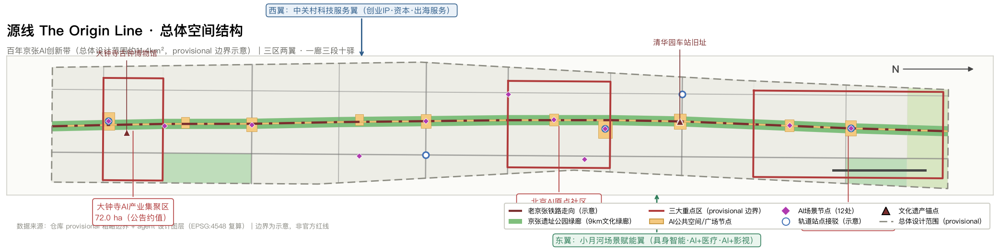
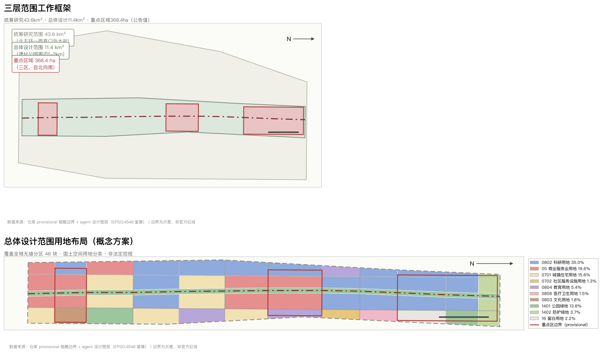
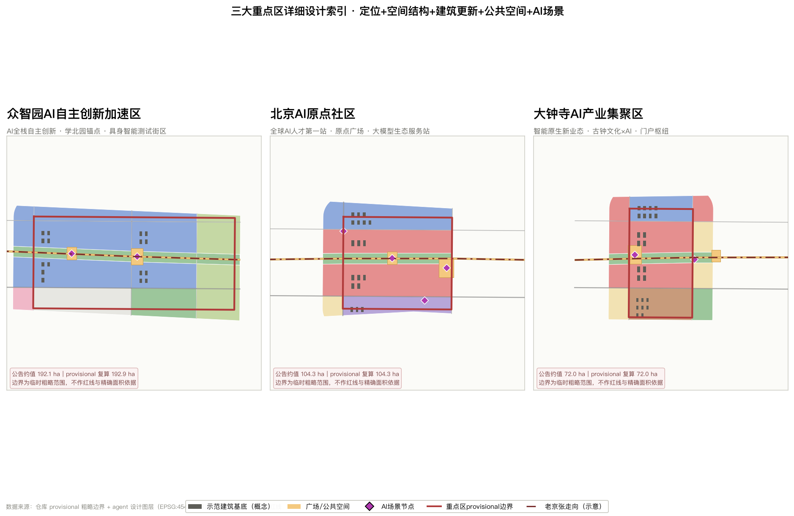
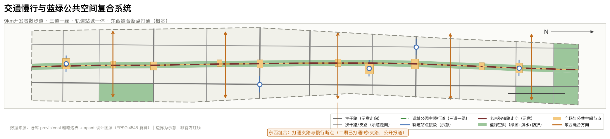
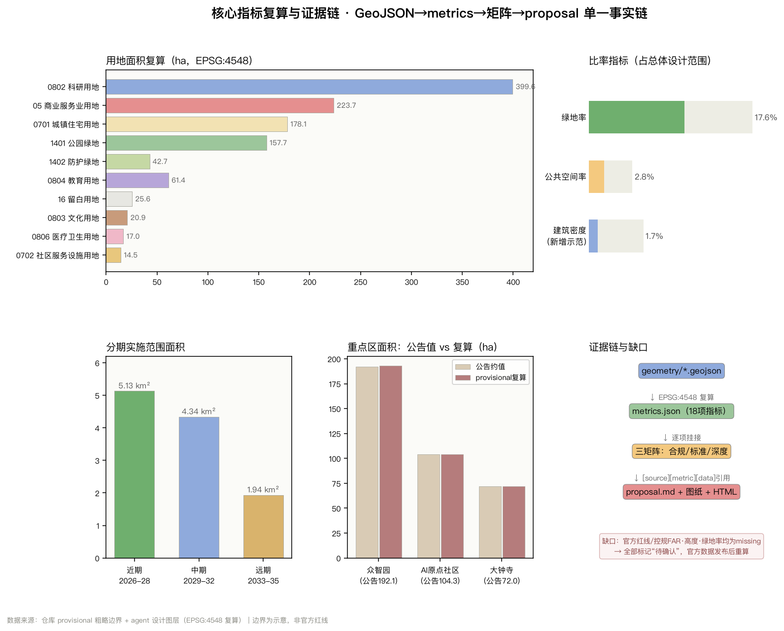

# Origin Line: Centennial Jing-Zhang AI Innovation Belt Overall Urban Design

> This proposal is an Open Co-Creation initiative for global stakeholders. All spatial implementation content is provided as **Conceptual Recommendations, reference schemes, or materials for professional teams to further study**, and does not replace statutory planning, does not constitute a government approval conclusion, and does not constitute an implementation commitment.

## Design Basis and Source List

This scheme is based on the first two references. The first reference is the "Announcement for Qualification Pre-Review of International Proposals for Urban Design of the Centennial Jing-Zhang AI Innovation Belt" issued by the Haidian Branch of the Beijing Municipal Commission of Planning and Natural Resources [source:OFFICIAL-ANNOUNCEMENT], which defines three layers of scope, three key areas, design tasks, and the depth of outcomes; the second reference is an excerpt from the open-source task book for global intelligent entities [source:AGENT-TASKBOOK], which supplements ten co-creation principles, three positioning statements, five functions, the Three Zones and Two Wings, and tasks agent.1–agent.6. The structured task book [source:SITE-PACKAGE] provides enumeration, value ranges, and validation rules; the registration form for materials [source:SOURCE-REGISTRY] defines the authority level and usage boundaries of each material; the processed fact package [source:PROCESSED-FACT-PACK] serves as a reading navigation layer and is not an independent source of facts. The starting point for spatial generation is the temporary rough boundary of the warehouse maintenance [source:BOUNDARY-SOURCE] and the temporary scope of three key areas [source:KEY-AREA-SOURCE].

**Classification of Available Data and Handling in This Plan**: Data marked with `usable_for_formal="yes"` is used for task response, standard response, and terminology; while `provisional_only` data is only used for generation, display, and self-inspection, and **must not be upgraded to Official Planning Boundaries, statutory controls, precise area references, or implementation commitments**. Therefore, all areas in this plan are annotated as "provisional recalculated values". After the official GIS/CAD boundaries are released, `geometry/*.geojson`, `metrics.json`, and all ratio indicators must be recalculated in their entirety [depth:metrics_recalculation]. (Official Planning Boundary)

Beyond the warehouse documents, this proposal supplements and references five sets of **official or mainstream media sources that are publicly verifiable**, all registered in `sources.json` and specifying their scope of use: the Haidian District Government's report on the Innovation Belt solicitation [source:HAIDIAN-GLOBAL-CALL-20260330] and the report on the spatial division of the Three Zones and Two Wings [source:HAIDIAN-3AREAS-2WINGS-20260403], which provide the functional positioning of the Three Zones and Two Wings and the baseline of Haidian's AI industry; the report on the full opening of Phase II of the Jing-Zhang Railway Heritage Park [source:JINGZHANG-PARK-PHASE2-20260806], which provides the 9-kilometer green corridor and the fact that 9 urban branch roads have been connected; the community news conference materials for the AI Origin community [source:HAIDIAN-ORIGIN-COMMUNITY-20260729], which provide community scale, talent, and enterprise data. Scenario Access materials [source:BJ-AGENT-POLICY-20260723] provide the policy context for the 'Super AI Sandbox' and Scenario Access. Global Innovation District case studies are drawn from public pages and reports from various institutions [source:GLOBAL-INNOVATION-DISTRICT-CASES]. These materials are used for **background assessment, current condition description, and experience reference**, but not for replacing official spatial data or deriving any regulatory control indicators.

This plan has also referred to the public index of the warehouse's documentation: the three categories of positioning, seven key directions, plan boundaries, and seven review dimensions proposed in the draft public brief `brief/public-brief.md`. These have been addressed in each chapter of this document. The documentation boundaries are described in `brief/README.md` and `sources/public-sources.json`, which are used to confirm the public status of the cited materials [source:SOURCE-REGISTRY]. Among these, the two boundaries that state "the plan must not claim the use or disclosure of unpublicized planning drawings, spatial data, control indicators, or personal privacy information" and "when involving construction intensity, Building Height, road alignment, and land ownership, it should be clearly stated as a Conceptual Recommendation," are the direct reasons why this plan repeatedly marks "to be confirmed" in the "Land Use, Building Scale, and Demolish–Renovate–Retain Strategy," "Transportation, Railways, Utilities, and Public Service Facilities," and "Risk, Copyright, and Compliance" chapters.

This proposal corresponds to the standard response recorded in `standard_matrix.json`: the project main control is based on [standard:PROJECT-OFFICIAL-ANNOUNCEMENT], the agent task book [standard:PROJECT-AGENT-OPEN-CALL-TASKBOOK], the Urban Design Management Measures [standard:MOHURD-URBAN-DESIGN-MEASURES], the Detailed Planning Compilation and Approval Measures [standard:MOHURD-CONTROL-DETAILED-PLANNING], the Land Use Classification Guide for Territorial Space [standard:MNR-LAND-USE-CLASSIFICATION-GUIDE], and the Building Design Depth Regulations registered as pending official documents [standard:MOHURD-ARCH-DESIGN-DEPTH-2016]. The task covers the records in `compliance_matrix.json`, the results depth in `design_depth_matrix.json`, and the current diagnosis and list of data gaps can be found in [depth:existing_conditions_diagnosis].

## Three-Level Scope Framework

The announced three-level scope framework forms the backbone of this plan [depth:three_level_scope_framework]: **Coordinated Research Area covers approximately 43.6 square kilometers** (north to the North Fifth Ring Road, east to the Jingzhang Expressway, south to West Straight Street, and west to Wanquan River Road), addressing industrial strategy, innovation synergy, and external connections; **Overall Design Area covers approximately 11.4 square kilometers** (the urban areas and industrial zones within 1-2 kilometers around the site park), addressing the overall framework of Urban Renewal and in-depth Urban Design; **Key Areas cover approximately 368.4 hectares** (from north to south, the Zhongzhiyuan, AI Origin Community, and Dazhongsi zones), addressing the detailed design of the Integrated Planning Implementation Plan [source:OFFICIAL-ANNOUNCEMENT].

This submission corresponds to the `site_boundary.geojson` for the Overall Design Area, with a provisional recalculated area of 11,412,825 square meters [metric:site_area_sqm], consistent with the announced approximate scale of 11.4 square kilometers [data:geometry/site_boundary.geojson#SITE-001]. Three key areas were submitted to [data:geometry/key_areas.geojson#PROV-KEY-001], with recalculated areas of 1,929,202 square meters for Zhongzhiyuan [metric:key_area_zhongzhiyuan_ai_acceleration_area_sqm], 1,043,237 square meters for AI Origin community [metric:key_area_beijing_ai_origin_community_sqm], and 720,454 square meters for Dazhongsi [metric:key_area_dazhongsi_ai_industry_cluster_sqm], differing from the announced values of approximately 192.1/104.3/72.0 hectares by 0.4%/0.0%/0.1% respectively. The count of key areas is 3 [metric:key_area_count].

**provisional boundary limits and replacement contingency plan**: The current `site_boundary` and `key_areas` are both marked with `official_boundary=false`, `geometry_role="provisional_constraint"`, and `boundary_precision="provisional_rough"`, with their origins being the inferred limits, area constraints, and road names from the announcement text. These are **not Official Planning Boundaries** and should not be used for approval, precise area recalculation, or land ownership determination [source:BOUNDARY-SOURCE][source:KEY-AREA-SOURCE]. Upon the release of the official polygon, the following sequence must be followed: 1) replace `site_boundary.geojson` and `key_areas.geojson`; 2) rezone the land use based on the new boundaries (land_use must be fully redefined); 3) recalculate all area and ratio indicators; 4) redraw the five maps and display pages. (Official Planning Boundary) The spatial structure judgment (one corridor in three segments, Three Zones and Two Wings, east-west stitching, and the distribution of scene waystations) of this plan is anchored by the railway corridor and the already open site park, and thus has relative stability; whereas all numerical conclusions are invalidated with boundary updates, as registered in `assumptions.json` under items such as `A-CONTROLS-001`.

## Coordinated Research Area: Industry and Future City Research

### One. Overall Concept and Naming System (Responding to agent.1)

**Main Name: The Origin Line.** "Yuan" takes on threefold homophonic meanings: the first is **Railway's Origin** — the Jing-Zhang Railway, which opened in 1909, was the first major railway line designed and constructed by Chinese engineers. Zhan Tianyou's "person" shaped line at Qinglong Bridge overcame the steep slope at Badaling, marking the beginning of China's engineering self-innovation [source:GLOBAL-INNOVATION-DISTRICT-CASES]; the second is **Innovation's Origin** — the line is home to Tsinghua, Peking, North University of China, North University of Information Technology, and the "Eight Academies" along University Road, as well as Zhongguancun, making it one of the regions with the highest concentration of AI. Along the Innovation Belt, the number of companies, revenue scale, and financing volume account for over 70% of Haidian District, with talent composition exceeding 80% [source:HAIDIAN-3AREAS-2WINGS-20260403]; the third is **Open Source's Origin** — this call for submissions itself opens to the global community through an open-source collaboration on GitHub, where "Yuan" means the source of open source. These three meanings share a line, hence the name "The Origin Line."

**Nomenclature System** adopts an expandable structure of "One Belt·Three Segments·Twelve Stations," avoiding slogan-like naming and not replicating existing city, park, or enterprise names. The One Belt is referred to as the "Source Line." The Three Segments, moving from north to south, are the **North Source Segment** (Zhongzhiyuan—Xuebeiyuan area), the **Middle Source Segment** (AI Origin Community—Wudaokou area), and the **South Source Segment** (Dazhongsi area). Along the route, AI scenario nodes are collectively referred to as "Stations" (such as "Origin Station," "Chime Station," "Knowledge Station"), echoing the historical semantics of railway stations and their "stop, service, and interaction" spatial attributes [data:geometry/constraints.geojson#SC-01]. The English name "The Origin Line" retains the double meaning of "Starting Line" and "Origin Line" for easier international dissemination.

**Logo and Visual Identity Direction** (for design direction only, excluding any copyrighted fonts, images, trademarks, or portraits): The core graphic is a "person" character formed by **two reciprocal trajectories** — directly referencing the engineering wisdom of the Jing-Zhang Railway's zigzag track, while also proclaiming the "AI for people, enhancing human capabilities" governance stance, aligning with the co-creation principle's tenth point, "people-centric governance" [source:AGENT-TASKBOOK]. The graphic can be simplified to a single-color line drawing for paving, signage, and engraving, and can be extended to a dynamic identifier (two lines separating and then intersecting) for event promotion. The color scheme is suggested to primarily use "Jing-Zhang Rusty Red + Origin Graphite Gray + Green Corridor Moss Green," avoiding the homogenized expression of high-saturation tech blue. All final visual assets must be cleared by a professional team after completing the copyright clearance and trademark search before use.

### Two. Three Major Orientations, Five Major Functions, and the Synergistic Loop of the Three Zones and Two Wings

The three major positioning goals (century-old Jing-Zhang cultural belt, urban AI living experience belt, and AI integration innovation belt) and the five functional areas (Full-Stack Independent AI Innovation System, world-class AI Innovation Ecosystem, AI-Enabled Scenario empowerment new paradigm, intelligent AI vibrant city, and AI governance global discourse power) [source:AGENT-TASKBOOK], as determined in the announcement and task book, are organized in this plan as a **closed loop of collaborative feedback**, rather than a parallel list.

**North Source·Zhongzhiyuan** undertakes 'full-stack independent innovation + governance voice', serving as the autonomous foundation and standard/governance issue source for technology from chips, frameworks to models; **Middle Source·AI Origin Community** undertakes 'world-class innovation ecosystem', serving as the convergence point for talent, capital, computing power, data, and entrepreneurial organizations; **South Source·Dazhongsi** undertakes 'intelligent native new business models', serving as the market outlet for model transformation into consumer, content, and terminal products [source:HAIDIAN-GLOBAL-CALL-20260330]. **West Wing·Zhongguancun Technology Services Wing** provides global element configuration, entrepreneurial IP, and capital empowerment; **East Wing·Xiaoyue River Scenario Enablement Wing** along Xiaoyue River provides a tangible testing ground for embodied intelligence, AI+ healthcare, and AI+ film and television [source:HAIDIAN-3AREAS-2WINGS-20260403].

The closed-loop logic is: **North Source Out Technology → Central Source Aggregate Elements and Incubate → South Source Out Products and Market Feedback → East Wing Provide Real Scene Data and Validation → West Wing Provide Capital and Global Channel → Feedback to North Source Technology Direction**. This loop is spatially realized through the "Source Line" green corridor for north-south connectivity, and through east-west side streets and pedestrian connections for wing access, corresponding to [data:geometry/roads.geojson#ROAD-001] and [data:geometry/land_use.geojson#LU-001]. Research and development land use has the highest proportion, at 3,995,575 square meters [metric:land_use_area_0802_sqm], serving as the spatial foundation for this loop [depth:overall_spatial_structure].

### Three. 5-8 Global AI/Innovation District Case Studies and Translatable Experiences (Responding to Agent.2)

The following cases are drawn from the institution's public pages or public reports [source:GLOBAL-INNOVATION-DISTRICT-CASES], **containing no non-public data, investment commitments, or corporate internal information**:

| # | Case | Public Scale/Characteristics | Most Transformative Experience for the Source Line |
|---|---|---|---|
| 1 | King's Cross Knowledge Quarter in London | updating approximately 67 acres of abandoned railway freight yards behind the station; Knowledge Quarter gathers over 100 academic, cultural, and research institutions, including the British Library, UCL, Francis Crick Institute, Google DeepMind, and Alan Turing Institute | **Analogous to the Source Line**: railway brownfield regeneration → knowledge and AI aggregation. The experience is to first create Public Spaces and street networks, then introduce anchor institutions; placing cultural institutions (like libraries) and research institutions side by side is key to talent retention |
| 2 | Paris Station F | Approximately 34,000 square meters in size, housing over 1,000 startup teams, serving about 9,000 startups since its opening, with teams from around 70 countries | A single large-scale incubation facility creates a "location as brand" clustering effect; corresponds to the suggestion in this plan to set up a high-intensity mixed incubation interface in the middle source segment |
| 3 | Kendall Square, Boston | Known as "the most innovative square mile on Earth," adjacent to MIT, with a mix of life sciences and technology | University and industry **at the forefront** rather than "gated campus isolation"; corresponding to the proposal in this plan to open up university boundaries and organize innovative interactions through streets rather than walls |
| 4 | Singapore One-North | Approximately 200 hectares, conceived in the 1990s and launched in 2001, a work–live–play–learn master plan, with LaunchPad cumulatively supporting over 2,400 startups | Long-term (20 years or more) master plan + mixed-use; corresponding to the "near-term, mid-term, long-term" phases and the blank land mechanism in this proposal |
| 5 | Shanghai  Space (Xuhui Riverside) | The first national large model innovation ecological community, with a carrier area exceeding 50,000 square meters, housing over 300 large model enterprises that have spurred the clustering of more than 1,700 AI enterprises. It is the only AI vertical direction incubator among the first batch of excellence-level incubators designated by the Ministry of Industry and Information Technology. | **Vertical Specialized Incubator** is preferable to a comprehensive park; corresponding to the suggestion to set up a "Full Stack Autonomous" theme carrier in the northern segment of this plan. |
| 6 | Shanghai Zhangjiang Artificial Intelligence Island | Occupying approximately 66,000 square meters, with about 100,000 square meters of above-ground building area and 21 standalone buildings, it is the first national "5G+AI" full-scenario commercial demonstration park | The park itself serves as the "first user" for full-scenario self-use; corresponding to the Scenario Access mechanism in this plan of "street as a test bed" |
| 7 | Beijing AI Origin Community (Local Benchmark) | Radiating approximately 3 square kilometers from the original AI Origin Building in Wudaokou, it is one of the global top ten innovation districts by 2025; it gathers around 1,000 AI scientists, over 13,000 AI developers, and serves over 100,000 AI students and surrounding research institutions of more than 30 universities; it hosts over 400 AI companies; OPC (One-Person Companies) are nearly 180. | A validated **service station model** (finding policy, funding, computing power, talent, partners, intellect, space, and scenarios 'eight finds') can be replicated along the source line as a distributed station network [source:HAIDIAN-ORIGIN-COMMUNITY-20260729] |

**Three Common Conclusions on Spaces and Mechanisms That Can Be Converted**: 1. The threshold for innovative districts is not the research and development floor area but the **density of Public Spaces and pedestrian accessibility** (Kendall, King's Cross); 2. **vertical thematic carriers + distributed service nodes** are better suited to accommodate niche ecosystems than a single large campus (Moduspace, Origin Community); 3. Long-term success depends on **20-year scale blank spaces and phased development** (one-north), therefore this plan retains 256,457 square meters of blank space [metric:land_use_area_16_sqm] as a reserve for future industries and unforeseen demands [data:geometry/land_use.geojson#LU-037].

## Overall Design Area: Urban Renewal and Regulatory-Plan-Level Urban Design

### One, Overall Spatial Structure: One Corridor and Three Segments, Two Wings Access, Twelve Stations Connected

The overall spatial structure is defined as **"one corridor, three segments, two wings, and twelve stations"** [depth:overall_spatial_structure]. **One corridor** refers to the continuous green corridor following the route of the old Jing-Zhang Railway, which is the only continuous structural framework in this plan; its current foundation is the already established Jing-Zhang Railway Heritage Park — Phase 1 was completed and opened in 2023 (between Tsinghua East Road and Zhichun Road, approximately 2.5 kilometers long and 16.8 hectares in area), while Phase 2 will open in full on August 6, 2026, connecting with Phase 1 to form a **9-kilometer-long cultural green corridor** stretching from Xizhimen in the south to Jianting Bridge in the north along the Fifth Ring Road in the north. The northern segment is 2.6 kilometers long and covers 30.01 hectares, while the southern segment covers 23,080 square meters, encompassing approximately 70 communities and about 45,000 residents. It has also opened 9 urban branch roads and removed all closed barriers along the route [source:JINGZHANG-PARK-PHASE2-20260806]. This means that this scheme is not facing a project to be built, but a Public Space that has just been completed and needs to be "activated" — the design focus therefore shifts from "creating green corridors" to "injecting innovative functions and scenarios into the green corridors."

**Three Segments** are North Source, Middle Source, and South Source, respectively corresponding to three key areas and extending outward to their respective service regions. **Two Wings** are connected through east-west branch roads and active transportation routes: the West Wing connects to the technological service resources of Zhongguancun, while the East Wing connects to the scenes along Xiaoyuehe River [data:geometry/land_use.geojson#LU-010]. **Twelve Yì** are AI scenario nodes arranged along the corridor, with a total of 12 scenario nodes [metric:scenario_node_count] [data:geometry/constraints.geojson#SC-01].

### II. Overall Framework of Urban Renewal and Total Building Scale

The update logic for this proposal is "to drive interface updates through the enhancement of Public Spaces and to drive functional replacements through the insertion of scenarios," rather than through extensive demolition and reconstruction. The total area of the demonstration Building Footprint submitted is 191,664 square meters [metric:building_footprint_area_sqm], accounting for 1.68% of the Overall Design Area [metric:building_density]. The estimated gross floor area based on the conceptual assumed number of floors (research and development and business 8 floors, residential 12 floors) is approximately 1,580,000 square meters, with a conceptual intensity of about 0.14——it must be clearly stated: this value only counts the new demonstration building footprint added by this proposal, excluding the existing building volume, and is not the conclusion of the Floor Area Ratio control. This differs from the quantitative information reported publicly, which states that the area of industrial spaces is nearly 10 million square meters and the available area for updates is 1 million square meters [source:HAIDIAN-3AREAS-2WINGS-20260403], and these two figures cannot be directly added or substituted [depth:development_intensity_controls].

**Development Intensity, Building Height, and Building Coverage Ratio's official control conditions are currently missing** (all values for `floor_area_ratio`, `building_height_m`, `building_density`, `green_ratio`, and `setback_m` in `planning_limits.json` are marked as missing). Therefore, this plan only proposes zoning intentions for intensity and height **without providing numerical conclusions** [standard:MOHURD-CONTROL-DETAILED-PLANNING]: the 100-meter range on both sides of the green corridor is suggested to be a **low-intensity, low-density transitional zone** to ensure the view corridor and solar access; the core areas of the three key zones are suggested to be a **moderate to high-intensity mixed-use zone**; the residential renewal units are suggested to maintain the current intensity level. All conclusions regarding intensity and height must be confirmed based on the approved control plan, aviation/landscape/archaeological height limits, and solar analysis, which are **pending confirmation** [depth:height_massing_character].

### . Urban Character and Building Form Direction

Urban Design responds to the requirements of the Urban Design Management Measures regarding 'shaping distinctive urban features, coordinating planar and three-dimensional spaces, and controlling Building Height, volume, style, and color' [standard:MOHURD-URBAN-DESIGN-MEASURES]. It is suggested to establish the tone with '**moderation of industrial heritage + rationality of research and academic architecture + relaxation of street life**'. The facade of corridor buildings is recommended to adopt low-reflection materials and close-to-human-scale windows to avoid the glare and scale pressure caused by large areas of mirrored curtain walls on the heritage park; the roof is suggested to propose a 'fifth facade' requirement (with equipment concentration and prioritize roofs that can be accessed by people), as the perspective from the source line along the university and high-rise residential areas is rich; the building color is suggested to mainly use brick red, graphite gray, and warm white, coordinating with the existing color palette of the tracks, ballast, and existing school buildings. These are the **guiding principles for the urban design**, and the specific control indicators must be determined by professional teams in the control plan and urban design guidelines phase.

## Detailed Design of Key Areas

The detailed design of the three key areas reaches the depth of 'location + spatial structure + building renewal + traffic and pedestrian facilities + Public Space + AI scenarios + implementation risks' [depth:three_key_area_detailed_design]. **The polygons of the three key areas are provisional**, hence the conclusions are directional in nature, and any boundary replacements will require re-verification [source:KEY-AREA-SOURCE].

### One. North Origin · Zhongzhiyuan AI Independent Innovation Acceleration Area (provisional 192.9 hectares)

**Location**: The cradle for full-stack AI self-innovation and the international voice for AI governance. Its real-world anchor point is the Zhongguancun Dusheng Science and Technology Park Xuebeiyuan — a total floor area of approximately 238,300 square meters, located next to the Xuezhikai station on the Changping Metro line, scheduled to open in July 2026. The park already has national-level research institutions signed to join, and it features a 1,200-square-meter and a 1,000-square-meter multi-functional exhibition hall. The park also plans an AI outbound service platform [source:HAIDIAN-3AREAS-2WINGS-20260403].

**Spatial Structure**: With Xuezhiyuan Station as the gateway, the green corridor forms a three-tiered progression towards the south, from station to garden to corridor. It is recommended to open the exhibition hall resources to the side of the green corridor to form a **research and development interface visible to passersby**, rather than keeping them enclosed within the park. **Building Update**: New research and development carriers will be constructed alongside the enhancement of the existing park, with a demonstration Building Footprint as shown in [data:geometry/buildings.geojson#BLDG-001]. **Traffic Slow Zones**: Focus on resolving the last 300 meters of connection between the Changping Line station and the green corridor, as detailed in [data:geometry/roads.geojson#ROAD-001]. **Public Space**: Establish the "Xuezhiyi Developer Plaza" to host roadshows, launches, and outdoor collaboration. **AI Scenarios**: Install the "Xuezhiyuan Embodied Intelligence Test Street" (SC-04) and the "Zhongzhiyuan Full-Stack Autonomous Innovation Showcase Center" (SC-08). **Implementation Risks**: The park's ownership is diverse, and opening interfaces requires negotiation. Embodied intelligence road testing involves road management and safety approvals, which are pending confirmation.

### II. Zhongyuan·Beijing AI Origin Community (provisional area 104.3 hectares)

**Location**: The first stop for global AI talent entrepreneurship and innovation, and a core of a world-class innovation ecosystem. The current foundation is solid: radiating approximately 3 square kilometers from the original Yidaokou building as the center, it was selected as one of the 'Global Top Ten Innovation Districts' in 2025. It gathers about 1,000 AI scientists, over 13,000 developers, serves over 100,000 AI students, and is surrounded by more than 30 universities and research institutions. It hosts over 400 AI companies, nearly 180 OPC (one-person companies), and has a large model ecosystem service station providing 'eight-find' services [source:HAIDIAN-ORIGIN-COMMUNITY-20260729].

**Space Structure**: With the "Origin Square" as the core, weave in four directions—north to the Tsinghua Garden Station Cultural Node, south to Zhi Chun Road Innovation Services, east to the Academy Road University Cluster, and west to the Zhongguancun Technology Services Wing. **Building Update**: Focus on functional replacement of existing office and commercial carriers (renaming and renovation have precedents), and be cautious about demolition. **Traffic Slow Zone**: Given the high pedestrian density in the Wudaokou area, it is recommended to organize with "speed limits + continuous pedestrian surfaces + orderly non-motorized traffic" rather than increasing motor vehicle capacity. **Public Space**: The Origin Square is suggested to retain large areas of "purposeless lingering" space, which is the physical foundation for the informal social interactions such as night schools, daytime cafes and nighttime social events, and Party Nights [source:HAIDIAN-ORIGIN-COMMUNITY-20260729]. **AI Scenario**: Deploy the "Origin Agent Meeting Room" (SC-01) and the "Open Source Results Exhibition Corridor" (SC-07). **Implementation Risk**: The high density of people and the overlay of test scenarios pose safety and disturbance risks, and must be addressed with Human Review and time-limited, area-specific rules.

### Three. Nan Yuan · Dazhongsi AI Industry Agglomeration Area (provisional calculated at 72.0 hectares)

**Location**: Market exit for intelligent native new business forms, leveraging a leading platform to aggregate intelligent entities, content consumption, and smart terminal ecosystem companies [source:HAIDIAN-GLOBAL-CALL-20260330]. **Cultural Overlay**: Dazhongsi (originally Jueshengsi, founded in the 11th year of Qing Yongzheng in 1733) is now the Dazhongsi Ancient Bell Museum, serving as an irreplaceable cultural anchor for this segment [data:geometry/constraints.geojson#CONS-003].

**Space Structure**: Form a tripartite juxtaposition of 'cultural anchor points + commercial interface + green corridor entrance', with cultural land use of 209,139 square meters [metric:land_use_area_0803_sqm] to carry display and narrative functions. **Building Update**: The intelligent origination transformation of commercial carriers is the main focus, with commercial service land use of 2,236,955 square meters [metric:land_use_area_05_sqm] being the primary update target for this segment. **Traffic Slow Travel**: The North Third Ring West Road is the strongest east-west dividing element in this segment. It is recommended to strengthen the continuity of the slow travel system on the basis of existing pedestrian facilities (specific engineering solutions must be argued by professional teams). **Public Space**: Establish 'Zhongshengyi · Dazhongsi Bell Square'. **AI Scenario**: Deploy 'Smart Native Commercial Experimental Field' (SC-02) and 'Green Corridor AI Lighting and Public Art Experimental Segment' (SC-12). **Implementation Risk**: The scope of cultural relic protection and the construction control zone are based on the announcements by the cultural relics department. The cultural relic demonstration positions in this plan **shall not be used as the basis for protection**; commercial renovations involve property rights subjects, which must be addressed on a case-by-case basis.

## AI Innovation Ecosystem, Personas, and AI+ Scenarios

### One. Five User Archetypes (In Response to agent.3, Out of Six Archetypes)

| Number | Image | Core Demand | Spatial and Service Response |
|---|---|---|---|
| P1 | **Model Researcher** (Scientist/Postdoc, 25–40 years) | Computational Power, Peer Density, Quiet Workspace for Deep Work and Casual Encounters | North Source R&D Carrier + Green Corridor 'Quiet Section' + Exhibition Corridor Pitching |
| P2 | **OPC/Independent Developer** (25–35 years old, with over 180 registered in the Origin Point Community) | Low-cost workstations, legal and financial policy 'Eight Lookups', collaborative partners | 144,952 square meters of land for distributed origin hubs + service station network + community service facilities [metric:land_use_area_0702_sqm] |
| P3 | **College Students** (surrounding 30+ universities, over 100,000 AI students) | Accessible open experimentation fields, internship pathways, and affordable third spaces | Educational land use of 613,882 square meters [metric:land_use_area_0804_sqm] with open boundaries + open classroom scenario (SC-10) |
| P4 | **Industry Translators** (mid-level enterprise staff, product managers) | Real-world scenarios, testing permissions, customer touchpoints | East Wing scenario empowerment + South Source commercial experimental field + three Testing and Validation Scenarios |
| P5 | **Local Residents** (The South Segment Green Corridor covers approximately 450,000 people in about 70 communities) | Daily green spaces, no detours for grocery shopping and commuting, safe for seniors and children | The Green Corridor is boundaryless and connected + stitches the east and west + park and green spaces totaling 1,576,955 square meters [metric:land_use_area_1401_sqm]; residential land use 1,781,202 square meters [metric:land_use_area_0701_sqm] |
| P6 | **International Visitors and Developer Community** | Readable Narrative, Iconic Landmarks, Engaging Activities | Three Holy Sites + Annual Event System + Bilingual Signage |

**Resident Demands Have Direct Public Evidence**: The original 5-meter-high wall along Phase II of the project had completely separated the neighborhood from the railway, with residents needing to "walk half an hour just to go across and buy vegetables" [source:JINGZHANG-PARK-PHASE2-20260806]. As a result, this plan prioritizes "east-west stitching" as an equally important structural goal, rather than a mere accessory project.

### Two, no less than 10 AI scenario cards (including 3 industrial Testing and Validation Scenarios).

All scenario cards follow a unified set of fields: **Spatial Location—Service Target—Operational Data—Privacy Boundaries—Human Review—Operational Entity—Visualization Layer—Risk**. All 12 scenario cards are located in the `SCENARIO_NODE` layer at [data:geometry/constraints.geojson#SC-01], with a scenario node count of 12 [metric:scenario_node_count]. **Common privacy and governance bottom lines**: do not collect facial recognition or other biometric information for identity tracking; do not establish cross-scenario personal profiles; all judgments involving public safety and public services must retain a human review step; test scenarios must clearly inform and provide an exit option; do not make designated suppliers or non-public data a necessary condition [source:AGENT-TASKBOOK].

| Card Number | Scene Name | Location | Object | Data and Privacy Boundaries | Human Review |
|---|---|---|---|---|---|
| SC-01 | Origin Agent Lounge (Service Spatialization) | Zhongyuan·Origin Plaza | P2/P3 | Only user-provided demand text; no contact information retained | Policy and funding match results require manual confirmation |
| SC-02 | Intelligent Native Commercial Experiment Field (Agent Sales Staff and Autonomous Retail) | Nan Yuan · Dazhongsi | P4/P5 | Only uses anonymous foot traffic counts and transaction data; no facial recognition | Price and recommendation rules are manually reviewed |
| SC-03 | Tsinghua Garden Station Digital Narrator (AI Cultural Guide) | Zhongyuan·Old Station Site | P5/P6 | Only public records and venue-authorized content shall be used; no visitor identity data shall be collected | Historical content must be verified by professional historians |
| SC-04 | **【Test Validation 1】** Bodily Intelligence Testing District | North Source · Scholarly Garden | P1/P4 | Limited Time and Limited Road Segment; Test Data Used Only for Core Algorithm | Full-time Safety Officer Present, Can Take Over at Any Time |
| SC-05 | AI+Traffic Micro-Circulation Test Intersection | Academy Bridge Area | P5 | Traffic and Pedestrian Counting Only, No License Plates or Personal Information | Signal Timing Changes Require Approval from Traffic Management Department |
| SC-06 | AI+Government and Enterprise Services Kiosk | Zhichun Road | P2/P4 | Using only the materials submitted by the user; clear the cache upon completion. | Approval conclusions must be made solely by human review. |
| SC-07 | Open Source Showcase Corridor (Contribution Visualization) | Zhongyuan·Green Corridor | P1/P2/P6 | Shall Only Display Public Information from Open Source Repositories | Content Must Be Approved and Fact-Checked |
| SC-08 | **【Test Validation 2】** Zhongzhiyuan Full Stack Autonomous Innovation Demonstration and Compatibility Validation Center | Beiyuan · Zhongzhiyuan | P1/P4 | Chip/Framework Compatibility Test Data; No Personal Data Involved | The Compatibility Conclusion Must Be Re-validated by a Third Party |
| SC-09 | AI+ Healthcare Scene Station (East Wing Connection) | Xiao Yuehe Alongline | P5 | Strictly limited to educational and triage purposes; **no diagnosis** | Any health advice must be issued by a licensed professional |
| SC-10 | AI+ Education Open Experiment Classroom (East Wing Transition) | Academy Road Higher Education Interface | P3 | Evaluation is based solely on course and assignment data, and is limited to the authorized campus range | Teaching evaluation must be finalized by the instructor |
| SC-11 | **【Test Validation 3】** Robot Low-Speed Delivery and Last-Mile Integration Verification | West Wing Transition Segment | P2/P5 | Path and Load Data; No Images Collected for Recognition | Accidents and Abnormalities Must Be Handled and Disclosed |
| SC-12 | Green Corridor AI Lighting and Public Art Pilot Segment | Nan Yuan · Green Corridor | P5/P6 | Utilizing Only Ambient Light and Pedestrian Density Aggregate Data | The Lighting Environment Must Meet Ecological and Resident Rest Requirements |

The above scenario aligns with the policy context: Beijing has proposed an all-domain open city governance and real-life service testing scenario, aiming to create a 'visible, perceptible, and learnable' super AI test field, and to support the cultivation of Token economies in AI Origin communities [source:BJ-AGENT-POLICY-20260723]. However, **this plan does not express any testing scenario as approved for operation**, and all three Testing and Validation Scenarios must be conducted only after obtaining the necessary permits and completing safety assessments.

### Three. Scenography—Space—Operation Mapping

Scenes are not floating functional labels but are triple-bound with site, carrier, and operational entity: **Research and Development Scenes** (SC-04, SC-08) fall on research and development land [metric:land_use_area_0802_sqm], borne by the park operation entity; **Public Service Scenes** (SC-03, SC-05, SC-09, SC-12) fall on green spaces and squares, led by the local authority and public sector, requiring public disclosure and Human Review; **Market Scenes** (SC-02, SC-06, SC-11) fall on commercial and service facilities land, borne by the enterprise entity and responsible for compliance; **Educational Scenes** (SC-07, SC-10) fall on educational land [metric:land_use_area_0804_sqm], co-built by universities and communities. Health and medical land use of 170,392 square meters [metric:land_use_area_0806_sqm] provides spatial support for SC-09, but **this scene is strictly limited to science popularization and triage**.

## Land Use, Building Scale, and Retain-Renovate-Demolish Strategy

### One. Land-Use Layout and Functional Proportions

The `land_use.geojson` in this scheme provides a **complete zonation** of the submitted boundaries: 48 land use polygons seamlessly and without overlap cover the Overall Design Area, with adjacent polygons sharing boundary coordinates [data:geometry/land_use.geojson#LU-001], and all land use codes adopted from the National Land and Sea Use Classification Guide [standard:MNR-LAND-USE-CLASSIFICATION-GUIDE] [depth:land_use_layout]. The design intent for functional proportions is as follows:

**Research and Development Land Use** covering **3,995,575 square meters (approximately 35.0%)** [metric:land_use_area_0802_sqm] is the dominant function of this plan, corresponding to the positioning of the "AI Integration Innovation Belt" and the technology-incubation-transformation circuit of the Three Zones and Two Wings. **Commercial and Business Service Land Use** covering **2,236,955 square meters (approximately 19.6%)** [metric:land_use_area_05_sqm] is concentrated in the South Source Gateway and Central Source Core, bearing the perceivable interface for the "Urban AI Living Experience." **Residential Land Use** covering **1,781,202 square meters (approximately 15.6%)** [metric:land_use_area_0701_sqm] and **Community Service Facilities Land Use** covering **144,952 square meters** [metric:land_use_area_0702_sqm] ensure that talent can achieve a balance between work and residence—without affordable housing in the Innovation Belt, the density of talent cannot be converted into social density. **Park Green Spaces 1,576,955 square meters** [metric:land_use_area_1401_sqm] and **protective green spaces 427,317 square meters** [metric:land_use_area_1402_sqm] together form the blue-green backbone. **Educational land use 613,882 square meters** [metric:land_use_area_0804_sqm], **cultural land use 209,139 square meters** [metric:land_use_area_0803_sqm], and **medical and health land use 170,392 square meters** [metric:land_use_area_0806_sqm] correspond to the university cluster, the cultural anchor point of Dazhongsi, and health services. **Reserved land use 256,457 square meters** [metric:land_use_area_16_sqm] is a direct reference to the long-term experience of one-north.

### II. Classification Logic for Preservation, Renovation, Demolition, and New Construction

This plan adopts the classification principle of "retaining and renovating, with strict limitations on demolition" [depth:retain_renovate_demolish]: **preserve** —— university campuses, Dazhongsi cultural heritage buildings, the site of the old Tsinghua Garden railway station, the existing ruins park, and the newly built campus (Xuebeiyuan); **renovate** —— enclosed corridor interfaces, outdated commercial carriers, and walls adjacent to the green corridor, with a renovation direction of "opening up interfaces and replacing functions," which provides a direct precedent for the removal of all closed barriers along the route in Phase II [source:JINGZHANG-PARK-PHASE2-20260806]; **new construction** —— only demonstration buildings are arranged on clearly defined plots with low efficiency or vacancy, totaling 191,664 square meters of building footprint [metric:building_footprint_area_sqm] [data:geometry/buildings.geojson#BLDG-001]; **demolition** —— this plan does not propose any specific conclusions for the demolition of any plot.

It must be clear: **the judgment for the demolish–renovate–retain strategy for each plot requires a census of existing buildings, ownership data, structural safety assessments, and control detailed planning conditions, with all four data points currently unavailable**. Therefore, the aforementioned classification is merely **a typological method suggestion**, and does not constitute any specific disposal opinion [standard:MOHURD-CONTROL-DETAILED-PLANNING]. (Demolish–Renovate–Retain Strategy)

## Transport, Rail, Municipal Infrastructure, and Public Services

### One. Micro-circulation of Roads and Walking and Cycling Network

This submission includes a total road centerline length of 43,417 meters [metric:road_network_length_m], with a road network density of approximately 3.80 kilometers per square kilometer [metric:road_network_density_km_per_km2] [data:geometry/roads.geojson#ROAD-001] [depth:traffic_rail_slow_parking]. **All road alignments are indicative and do not represent the actual right-of-way, nor do they constitute a linear or engineering scheme.**

The core of the Walking and Cycling Network is the "three paths and one greenway" —— pedestrian paths, slow running paths, and bicycle lanes running parallel to the green corridor. This cross-section has already been practically constructed in Phase II [source:JINGZHANG-PARK-PHASE2-20260806], and our work is to upgrade it from a "park pathway" to a "commuter-level walking and cycling main axis": we suggest prioritizing the continuity of walking and cycling at intersections with city arterials, and setting up connection paths at the five rail transit station directions [data:geometry/roads.geojson#ROAD-001]. **East-West Integration** is the second judgment of this plan in terms of walking and cycling: Phase II has already connected 9 city arterials. This plan suggests continuing this practice by adding more east-west connections at the remaining gaps, transforming the green corridor from a "linear channel" to a "network hub".

### II. Transit-Station Integration and Parking

The track stations along the line include Dazhongsi, Zhichunlu, Wodaokou, Xuezhiguang West Mouth, and others (**station locations are indicative public information, and the specific line positions and entrances/exits are based on data from the urban rail transit authority**). It is recommended to propose an integrated goal of "**Station—Corridor 300 meters**" for each station: within 300 meters of exiting the station, one can enter the green corridor, with continuous paths, shelter, and no secondary street crossings. Regarding parking, it is suggested to follow the principle of "**total quantity control + priority for non-motorized vehicles**," focusing on resolving the order of non-motorized vehicle parking around university and commercial nodes, rather than increasing motor vehicle parking spaces.

### Three. Municipal and New Infrastructure

New Infrastructure is suggested to be co-located and integrated with traditional municipal infrastructure **in the same trench and unified design**, to avoid secondary excavation: edge computing nodes and charging facilities are to be deployed along the corridor, with the service stations concentrated in these areas. It is recommended to propose a basic configuration requirement of **power redundancy + network redundancy + sheltered space** for each service station [depth:municipal_new_infrastructure]. **The energy load, municipal capacity, pipeline routing, and feasibility of underground space are all within the scope of professional calculations**, and this scheme does not provide any calculation conclusions. These must be completed by a municipal professional team after obtaining the current pipeline network data. In terms of public services, it is recommended to supplement the configuration with youth apartments, community canteens, 24-hour study spaces, and child-friendly facilities around the living areas for talent. The spatial support for these facilities is to be community service facility land [metric:land_use_area_0702_sqm].

## Blue-Green Network, Public Space, and Urban Character

### One. Blue-Green System and Supply of Public Space

Green space totals 2,004,272 square meters, with a green space ratio of 17.6% [metric:green_space_area_sqm] [metric:green_ratio] [data:geometry/green_space.geojson#GREEN-001]; square areas and public activity spaces total 317,174 square meters, with a Public Space ratio of 2.8% [metric:public_space_area_sqm] [metric:public_space_ratio] [data:geometry/public_space.geojson#PUB-001] [depth:blue_green_public_space]. **These ratios need to be explained beyond mere enumeration**: the 17.6% green space ratio supports the daily environmental quality that makes "talent willing to settle down." A Public Space rate of 2.8% may seem low, but its distribution is **along a 9 km green corridor linearly distributed** rather than concentrated in a single large plaza — for an innovative district, **accessibility is more important than the total amount**. The 10 square nodes and 1 continuous pedestrian path provided by these nodes offer more opportunities for chance encounters than an equivalent area of centralized green space.

### II. At Least 3 AI Sacred Sites and Honor Display System (Responding to agent.4)

This proposal presents four Conceptual Recommendations for "AI Holy Sites," **all of which are conceptual schemes, and their forms, locations, and construction will be based on final evaluation, approval, and actual implementation**:

1. **The Origin Marker (Zhongyuan·Yuandian Square)** —— an entity identifier with the theme of a "person" shaped track graphic. The ground is embedded with a **Sustainable Contribution Honor Band** that is smart and can be updated sustainably. It records the GitHub ID and Agent names of contributors for each year's selected schemes. Technically, it is recommended to use modular etching that can be added to, rather than a one-time casting, to align with the requirement of "sustainable updating of the commemorative system" [source:AGENT-TASKBOOK].
2. **Open Source Achievement Pavilion** (Zhongyuan·Green Corridor, SC-07) —— a longitudinal display device along the trail to showcase milestones of open-source projects. **Content must be limited to publicly available information and must be licensed**.
3. **Pinyin Milestone·The Milestone** (Beiyuan·Xuezhi Yì) —— an artificial intelligence milestone node inspired by the Qinglong Bridge Pinyin arch railway, marking a key node in the autonomy of technology; it is suggested to narrate using a dual timeline of "Engineering History + AI History."
4. **Zhongsheng Yì** (Nányuán·Dazhongsi) —— Utilize the theme of the "sound" of ancient bells to create a non-visual public art interface, forming a cultural dialogue with the Ancient Bell Museum.

**Four Prohibitive Constraints for Landmark Design**: Do not violate preservation, green spaces, blue line, or traffic safety constraints; do not provide conclusions on bridge and tunnel structures, underground spaces, or engineering feasibility; do not alter proprietary spaces without authorization; do not over-entertain, become overly popular, or be vulgar. All fonts, images, portraits, and corporate logos must have their rights cleared.

### Three. Cultural Narrative: The Integration of Three Cultures (Responding to agent.5)

The cultural narrative of the source line is composed of **three layers of history** that are stacked together, and all three share the same spatial thread:

**First Layer·Century Jing-Zhang (1909)** —— The Jing-Zhang Railway is the first mainline railway designed and constructed by Chinese engineers, stretching approximately 201.2 kilometers in length, completed in 1909, with Zhan Tianyou as the chief engineer. The "person" (ren) character-shaped track at Qinglong Bridge is a testament to its technical prowess. The Tsinghua Garden Station along the line was originally built in 1910 and was the first stop for the Central Committee of the Communist Party of China on their "entrance exam" journey to Beijing on March 25, 1949. The site was renovated and reopened in March 2023 [source:JINGZHANG-PARK-PHASE2-20260806]. **Narrative Keywords: Autonomy, Overcoming Adversity, Starting Point.**

**Second Layer · Zhongguancun and the Eight Academies (1952 to Present)** —— In 1952, during the institutional adjustment, eight engineering and technology academies (now the University of Geosciences, University of Mining and Technology, University of Petroleum, University of Agriculture, University of Science and Technology Beijing, North University of Aeronautics and Astronautics, North Forestry University, and Peking University Health Science Center) were concentratedly established on the Academy Road in the western suburbs. This led to the naming of the area as the "University Town," becoming one of the earliest concepts of a university district and the most intellectually dense region in China [source:GLOBAL-INNOVATION-DISTRICT-CASES]. **Narrative Keywords: Knowledge, Aggregation, Pioneer.**

**Third Layer · AI New Culture (Current)** —— Original Point Community's night school, daytime coffee and nighttime drinks, Party Nights, Dongsheng Cup, and Yadian Cup, as well as nearly 180 establishments.OPC The extremely small organizational form represents a **new innovative social culture**.[source:HAIDIAN-ORIGIN-COMMUNITY-20260729]. **Narrative Keywords: Open Source, Collaboration, People-Centric.**

**Spatialized Cultural Tour Route** is suggested as a main line from Dazhongsi Ancient Bell Museum (South) to Xuezhiyi (North), connecting the following sites: Bell Sound Station (1733) → Green Corridor South Segment (Community Life) → Origin Square (Present) → Former Tsinghua University Station Site (1910/1949) → Open Source Results Display Corridor (Open Source) → Person-Z Marker (1909 Technical Prototype). The sign system is recommended to be **layered rather than mixed** with the overall logo of the Innovation Belt: cultural identifiers use historical motifs and scholarly texts, while brand identifiers use an abstract graphic of a 'person' shape, both presented in separate zones on the same pole. **All factual statements must be reviewed by academic historians to ensure historical accuracy and to prevent the reduction of culture to mere technological decoration.**

## Renewal Projects, Implementation Policy, and Phasing

### One. Update Project List (12 Conceptual Recommendations)

Update the project count to 12 [metric:renewal_project_count] [depth:renewal_project_list]. All projects are Conceptual Recommendations, with the implementation entity, funding, and policy arrangements yet to be determined: they do not constitute a business invitation, investment, or government commitment.

| Number | Project | Type | Spatial Location | Dependent Conditions |
|---|---|---|---|---|
| R-01 | Green Corridor Commuter Level Pedestrian Upgrade | Public Space | Throughout the Line | Coordination between Landscape and Transportation Departments |
| R-02 | East-West Seam Integration Continuation (Continuing Phase II Approach for 9 Branch Streets) | Pedestrian and Cyclist Priority | 5 Discontinuities | Ownership Negotiation, Engineering Feasibility Analysis |
| R-03 | Origin Square and Honor Axis | Public Space/Landmark | Zhongyuan | Evaluation Mechanism, Clearing Rights |
| R-04 | Open Source Results Showcase Corridor | Display/Operation | Zhongyuan Green Corridor | Content License |
| R-05 | Scholar's Knowledge Waystation and the Person Character Milestone | Landmark/Public Space | North Source | Site Connectivity Conditions |
| R-06 | Bell Sound Station and Ancient Bell Cultural Dialogue Interface | Cultural/Public Space | Nan Yuan | Cultural Authority Opinion |
| R-07 | Five Stations with Integrated "Station-Hall 300 Meters" | Transportation | Along-Line Stations | Rail Authority Data |
| R-08 | Open Passive Facades and Functional Replacement | Urban Renewal | Throughout the Line | Negotiate with Each Property Owner Individually |
| R-09 | Distributed AI Service Kiosks Network (Replicate the "Eight Finds" Model) | Industrial Services | Twelve Stands | Operational Subject Implementation |
| R-10 | Three Industrial Testing and Validation Scenario Constructions | Scenario | SC-04/08/11 | Safety Assessment and Permitting |
| R-11 | Youth Talent Housing and Community Service Supplement | Public Services | Segments | Housing Policy |
| R-12 | Vacant Land Dynamic Management Mechanism | Mechanism | North Source et al. | Planning Management Innovation |

### Two. Phased Plan

Phasing submissions are submitted to [data:geometry/phasing.geojson#PHASE-001] [depth:phasing_implementation]: **Near-term (2026–2028) 5,133,994 square meters** [metric:phasing_area_phase_1_sqm], focusing on the revitalization of the core three zones and the entire Green Corridor, as the second phase of the Green Corridor has just been completed and the revitalization window is the shortest; **Mid-term (2029–2032) 4,341,263 square meters** [metric:phasing_area_phase_2_sqm], focusing on the Innovation Community along University Road and the residential renewal unit; **Long-term (2033–2035) 1,937,568 square meters** [metric:phasing_area_phase_3_sqm], focusing on the stitching of the north-south gateways and the full network formation. The phasing timeline is a **suggestion**, and the actual timeline must be determined through approval.

### Three. Global AI Innovation Activity System and Long-term Operation (Responding to Agent.6)

**Annual Activity Framework** is suggested to be structured as "one main event plus two auxiliary events, plus regular operations": the main event is recommended to be set during the Zhongguancun Forum period as the "Source Line Developer Week"; two auxiliary events are the Spring "Origin Open Day" (continuing the tradition of the existing Origin Party) and the Fall "Renzi Award" (awarding the most outstanding intelligent entities and human contributions of the year); regular operations are monthly "Waypoint Days," rotated among the twelve Waypoints. **Brand and Communication Visual System** will continue to use the "R" lettermark, forming a unified extension rule for activity sub-brands.

**Developer Community Operations Mechanism** is suggested to be designed in three layers: "contribution visibility, contribution retention, and contribution transformation." Visibility — open-source achievements displayed in a showcase corridor with synchronized online presentation; Retention — modular engraving of honor badges; Transformation — providing channels for selected contributors to connect with local carriers, investment institutions, and the scene open list. **Scene Open Operations Mechanism** is suggested to establish a closed loop of "scene list — application — safety assessment — limited-time and limited-area pilot — evaluation and announcement — exit or transition to regular status," consistent with the policy direction for comprehensive open scene real-world testing [source:BJ-AGENT-POLICY-20260723]. **International Promotion and Conversion** is suggested to use English bilingual content and open-source repositories as primary touchpoints, avoiding one-way publicity. (Scenario Access)

** :** The activities, operations, attraction, and funding mechanisms described above are all Conceptual Recommendations and directions for further development. They do not constitute a determined government arrangement, fiscal commitment, or partnership agreement.

## Metrics, Area Recalculation, and Compliance Matrix

The indicator system of this plan follows a single fact chain of "**geometry as source, metrics as calculation, text as explanation**" [depth:metrics_recalculation]: all areas are calculated by projecting from `geometry/*.geojson` to EPSG:4548 (CGCS2000 / 3-degree belt Gauss-Kruger CM 117E), and each metric in `metrics.json` records `formula`, `source_files`, `confidence`, and `assumptions`, with the text explaining its design meaning.

**Revised Core Indicators**:
Total site area: 11,412,825 square meters [metric:site_area_sqm]; green space 2,004,272 square meters, green space ratio 17.6% [metric:green_space_area_sqm] [metric:green_ratio]; Public Space 317,174 square meters, public space ratio 2.8% [metric:public_space_area_sqm] [metric:public_space_ratio]; Building Footprint 191,664 square meters, Building Coverage Ratio 1.68% [metric:building_footprint_area_sqm] [metric:building_density]; road network 43,417 meters, density 3.80 kilometers/kilometer² [metric:road_network_length_m] [metric:road_network_density_km_per_km2]. Focus areas: 3 [metric:key_area_count] with areas of [metric:key_area_zhongzhiyuan_ai_acceleration_area_sqm], [metric:key_area_beijing_ai_origin_community_sqm], and [metric:key_area_dazhongsi_ai_industry_cluster_sqm]; scenario nodes: 12 [metric:scenario_node_count]; renewal projects: 12 [metric:renewal_project_count]; phased areas: [metric:phasing_area_phase_1_sqm], [metric:phasing_area_phase_2_sqm], and [metric:phasing_area_phase_3_sqm]. The area for each land use category is as follows: [metric:land_use_area_05_sqm], [metric:land_use_area_0701_sqm], [metric:land_use_area_0702_sqm], [metric:land_use_area_0802_sqm], [metric:land_use_area_0803_sqm], [metric:land_use_area_0804_sqm], [metric:land_use_area_0806_sqm], [metric:land_use_area_1401_sqm], [metric:land_use_area_1402_sqm], [metric:land_use_area_16_sqm].

**Two indicators are clearly marked as unknown rather than known**: `total_floor_area_sqm` and `floor_area_ratio` depend on the conceptual assumption of the number of floors and lack official FAR controls and the current built condition. Therefore, their `value` is left blank, with only a magnitude reference (approximately 158,000 square meters, approximately 0.14) retained in the `concept_estimate_value` field. **These should not be used as the basis for intensity conclusions or review**. The missing constraints, current buildings, ownership, and engineering conditions are uniformly recorded in `assumptions.json`.

**Matrix Coverage**: `compliance_matrix.json` covers all tasks of announcements 1.3, 1.4, and 1.5, totaling 23 items, and six agent tasks (agent.1–agent.6); `standard_matrix.json` covers six standards, with five mandatory items fully marked as addressed, while the building depth standard [standard:MOHURD-ARCH-DESIGN-DEPTH-2016] is marked as a data gap due to pending official documentation; `design_depth_matrix.json` covers 15 essential depth items, all marked as complete. The three matrices are interconnected with each section, layer, indicator, source, assumption, and self-check item of this article, allowing for bidirectional traceability by both machines and humans.

## Risk, Copyright, and Compliance

**Legal Compliance and Copyright**: This proposal only uses publicly available and cleared materials provided by the repository, as well as publicly verifiable government websites and mainstream media reports. No unpublished maps, planning documents, business operating materials, or personal privacy information have been used. No unauthorized trademarks, fonts, images, or portrait images have been used. All drawings are generated using proprietary geometric data by this proposal, and no commercial map tiles or third-party imagery have been referenced. Copyright and licensing statements can be found in `report/copyright_statement.md`.

**Risk Identification and Mitigation Directions** [depth:risk_missing_data]: 1. **Data Gap Risk (Highest)** — Official Planning Boundary, Control Plan Floor Area Ratio (FAR), height, density, green space ratio, and setback are all missing, leading to the current numerical values being merely directional. The mitigation approach is to comprehensively mark them as provisional and pre-set a re-calculation process; 2. **Privacy and Excessive Monitoring Risk** — Prohibitions on biometric tracking, cross-scenario profiling, and mandatory Human Review have been set in all scenario cards; 3. **Maturity Risk of Technology** — Embodied intelligence and low-speed delivery are not yet fully deployable, hence they are set for limited-time and limited-area testing; 4. **Public Acceptance and Fairness Risk** — The green corridor involves approximately 70 communities with about 450,000 residents. Innovative functions must not encroach on existing living spaces. It is recommended that all corridor projects include public participation segments; 5. **Spatial Controversy and Ownership Risk** — Opening the interface and functional replacement involve multiple ownerships, requiring individual negotiations; 6. **Policy Uncertainty Risk** — Activities, funding, and investment mechanisms are yet to be determined. This plan uniformly describes them as recommendations.

**Official Statement Prohibiting Declaration**: This plan does not constitute a legal judgment on control plan adjustments, Floor Area Ratio, Building Height, or building intensity; it does not propose specific conclusions on the demolish–renovate–retain strategy for individual plots; it does not propose road alignments, rail positions, bridge and tunnel engineering, or municipal pipeline schemes; it does not make feasibility assessments of underground space, energy loads, or municipal capacities; and it does not make judgments on land ownership, investment estimates, or approval determinations. **All spatial implementation suggestions are Conceptual Recommendations, reference plans, or materials for further research by professional teams, and do not replace formal planning or constitute government approval conclusions** [standard:PROJECT-AGENT-OPEN-CALL-TASKBOOK]. This plan is generated by an AI agent based on publicly available information, with the generation method, sources, and limitations disclosed in `sources.json` and `assumptions.json`. Final judgments are made by humans and professional teams. (Demolish–Renovate–Retain Strategy)

## References

This section lists the repositories and publicly available references cited in this plan, with their scope of use outlined in the Design Basis and References List, and registered in `sources.json` [source:SITE-PACKAGE] [source:SOURCE-REGISTRY].

- `brief/public-brief.md` (Draft Public Brief: Three Categories of Positioning, Key Directions, Scheme Boundaries, and Review Criteria)
- `brief/README.md` (Public Documentation Boundary Description)
- `sources/public-sources.json` (Public Sources Index)
- `brief/site-package/design_brief.json`
- `brief/site-package/allowed_design_space.json`
- `brief/site-package/agent_taskbook.json`
- `brief/site-package/sources.json`
- `brief/site-package/ranges/planning_limits.json`
- `brief/site-package/standards/standards.json`
- `data/source_registry.json`
- `brief/site-package/schemas/compliance_matrix.schema.json`
- `brief/site-package/schemas/standard_matrix.schema.json`
- `brief/site-package/schemas/design_depth_matrix.schema.json`
- Beijing Municipal Commission of Urban Planning and Natural Resources Haidian Branch: Qualification Pre-Review Announcement for International Urban Design Proposals for the Centennial Jing-Zhang AI Innovation Belt (2026-05-09)
- Beijing Daily / International Innovation and Technology Center:《"Three Zones and Two Wings" to Create a World-Class AI Hub》 (2026-04-03)
- Government of Haidian District, Beijing: Call for Global Submissions for the Centennial Jing-Zhang AI Innovation Belt (2026-03-30)
- Beijing Daily / Jingbao Net:《9 Kilometers, a Treasure! Jing-Zhang Railway Heritage Park Phase II Fully Opens》 (2026-08-06)
- Beijing Haidian District People's Government: "Origination Outcircle, Haidian Fully Launches Smart Economy New Form" (2026-07-29)
- State Council Information Office: News Conference on Several Measures for Accelerating Development Led by Intelligent Bodies in Beijing (2026-07-23)
